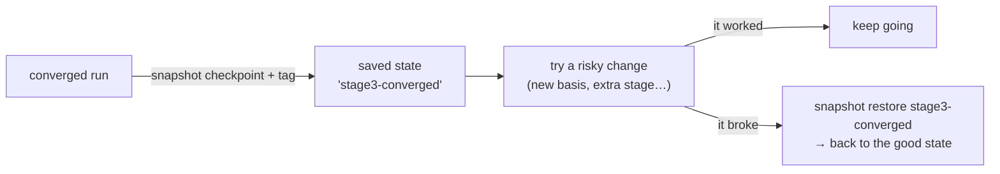
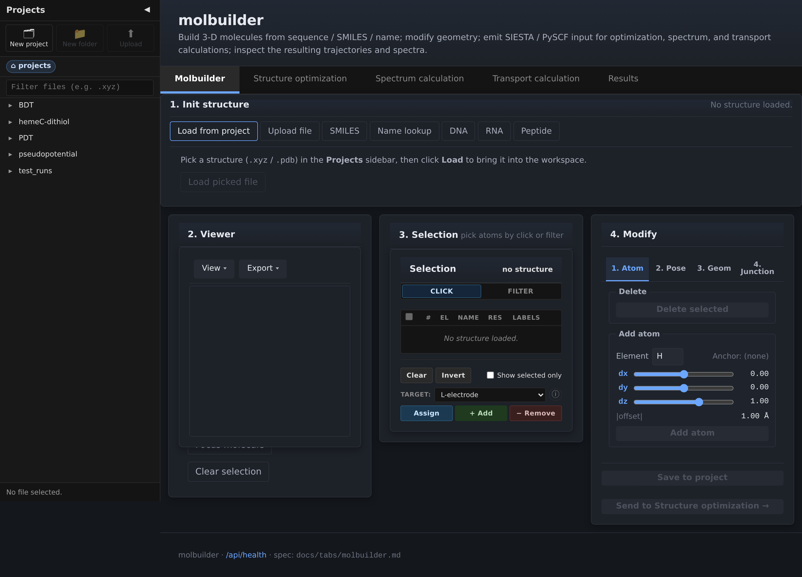
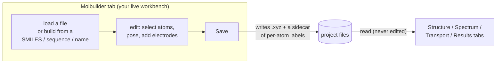
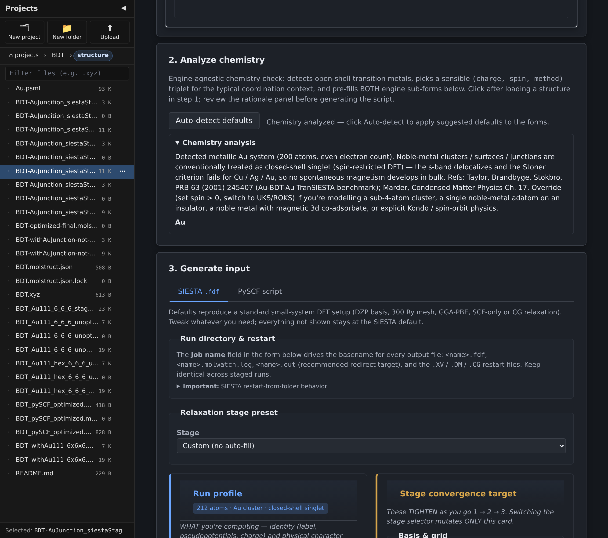
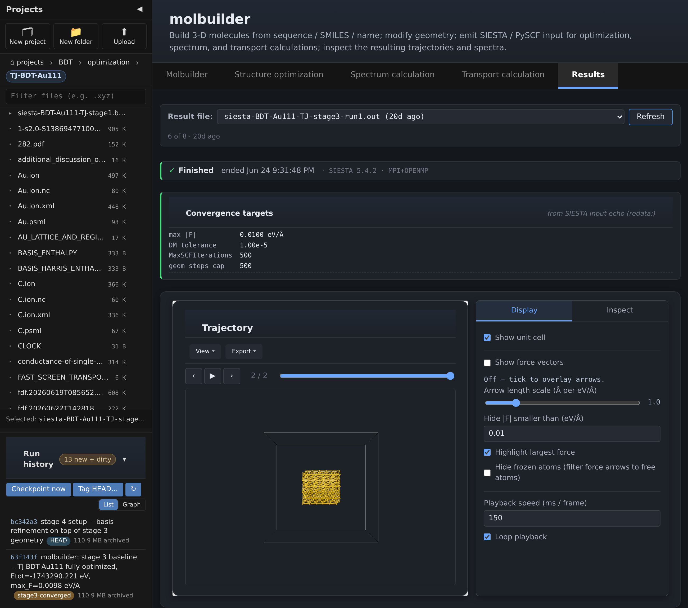
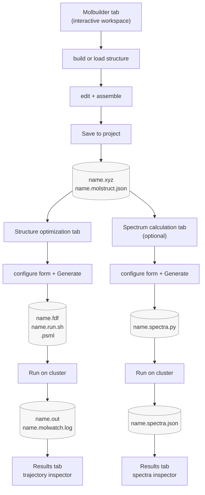
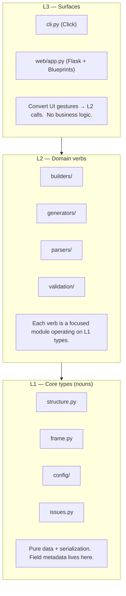

# molbuilder

A workflow tool for molecular-electronics DFT calculations.  Build
a molecule, assemble it into a metal–molecule–metal nanojunction,
generate input for **SIESTA**, **TranSIESTA**, or **PySCF**, and
inspect the resulting trajectories, spectra, and transmission curves
from a single Flask application.


The Au–BDT–Au junction is used as the running example throughout
this README: builder → optimisation → spectrum → transport →
results.

**Status.** Pre-1.0, active development, used by the Qing lab for
Au–thiol–Au transport studies. The Raman pipeline is validated
bit-for-bit against an independent reference; the transport pipeline
is validated up to `.fdf` emission, with the numerical T(E_F)
cross-check still pending (details in
[Scientific validation](#scientific-validation)). MIT licensed.

---

## Contents

- [Scope and capabilities](#scope-and-capabilities) — what it does, and why each part helps
- [Quick start](#quick-start) — install and run in one command
- [Common tasks](#common-tasks) — copy-paste recipes for the everyday jobs
- [Feature tour](#feature-tour) — the five tabs, one at a time
- [Workflow](#workflow--the-canonical-cross-tab-flow) — how the tabs hand off to each other
- [Design at a glance](#design-at-a-glance) — the architecture in one diagram
- [Install + multi-env model](#install--multi-env-model) — the backend environments in detail
- [GPU SIESTA](#gpu-siesta-from-source) and [benchmarking](#performance-benchmarking--molbuilder-bench-siesta-gpu) — build from source, measure the fastest settings
- [Deployment](#deployment) — LAN / internet exposure, auth, TLS
- [Python API + CLI](#python-api--cli-for-scripting) — scripting without the UI
- [Scientific validation](#scientific-validation) — what is checked, and against what
- [Documentation](#documentation) · [Tips & FAQ](#tips--faq) · [Limits](#limits)

---

## Scope and capabilities

If you study single molecules wired between two metal electrodes —
or any small molecule you want to run through SIESTA, TranSIESTA, or
PySCF — molbuilder takes you from "I have a molecule in mind" to
"I have publishable numbers" without leaving one browser tab and
without hand-writing input files.

Here is what it does for you, and *why that matters*:

- **Build the structure without a chemistry drawing program.** Type
  a SMILES string, a peptide/DNA/RNA sequence, or a PubChem compound
  name and get a 3-D structure. Then, with one click, sandwich it
  between two gold (or Ag/Cu/Ni/Pt/Pd) electrode slabs to make a
  *nanojunction* — the metal–molecule–metal geometry transport
  calculations need. **Why it helps:** assembling a junction by hand
  in a generic editor is fiddly and error-prone; here it is a menu.

- **Get correct input files without memorizing every keyword.** Fill
  in a short form and molbuilder writes a complete SIESTA `.fdf`,
  TranSIESTA input, or PySCF script for you — each field has a
  hover-tooltip explaining what it is, and each generated file comes
  with a ready-to-paste "Methods" paragraph for your paper.
  **Why it helps:** the form *validates as you go*, so common
  mistakes (wrong charge, too little vacuum, a k-grid that makes no
  sense for a molecule) are caught before you burn cluster hours.

- **Watch a calculation converge while it runs.** Point the Results
  tab at a running job's output and the energy, forces, and geometry
  update live as SIESTA/PySCF writes them. **Why it helps:** you
  can tell a run is going bad (oscillating SCF, exploding forces)
  in minutes instead of discovering it hours later.

- **Never fight a broken conda environment again.** The heavy native
  codes (SIESTA, PySCF, AmberTools, a GPU SIESTA) each live in their
  own isolated conda environment, and one command sets all of them
  up and checks they work. **Why it helps:** the versions that are
  known to work together stay together; you don't debug a linker
  error the day before a deadline.

- **Run on your laptop or a supercomputer with the same commands.**
  A calculation is packaged as a self-contained *bundle* you can copy
  to an HPC cluster; molbuilder writes the SLURM submit scripts and
  activation preamble for you. **Why it helps:** "works on my
  machine" and "works on the cluster" become the same workflow.

- **Save your work and roll back when an experiment goes wrong.** A
  run directory can be snapshotted (text *and* the big binary files)
  so you can try a risky parameter change and rewind to the last good
  state if it breaks. **Why it helps:** you can explore freely
  instead of hoarding `run_final_v3_REALLY_final/` copies.

- **Measure instead of guess for performance.** A benchmark command
  sweeps CPU/GPU and parallel settings and reports the wall-clock
  time per point, so you pick a production configuration from data.
  **Why it helps:** the right number of cores/GPUs for *your* system
  can be 3× off from a rule of thumb.

Everything the app shows is backed by a documented contract in
[`docs/`](docs/), and the tests are derived from those docs — so the
behavior you read about is the behavior you get.

> **One thing to keep in mind:** the structures molbuilder builds are
> *starting points*. They are a sensible initial guess, not a
> relaxed, equilibrium geometry. Always run a geometry optimization
> in your DFT code before you trust any computed property.

Where correctness matters, the claims above are cross-checked against
an independent reference or the published literature. See
[Scientific validation](#scientific-validation) for the table of what
is verified today and what is still pending.

---

## Quick start

The only prerequisite on the base system is a conda-compatible
package manager — **conda** or **mamba**.  molbuilder autodetects
whichever is installed (preference: mamba > conda) and uses it for
every env operation.  Everything else — host env, backend envs,
smoke tests — is handled by one bootstrap script.

```bash
git clone https://github.com/Qing-LAB/molbuilder.git
cd molbuilder

# One command creates every conda-only env (host + SIESTA + PySCF +
# AmberTools + tests) and runs a doctor smoke check at the end.
bash scripts/install-env.sh bootstrap --yes

# Start the web app from the host env.
conda activate molbuilder
python -m molbuilder serve --port 8000
# Browser: http://localhost:8000/  → redirects to /molbuilder
```

The bootstrap is idempotent: re-running skips envs that are already
present.  Source-build envs (GPU SIESTA, ~45 min) are opt-in via
`--include-source-builds`.  Per-env install commands and the full
manual recipe are in [§ Install + multi-env model](#install--multi-env-model).

The bootstrap **respects your `~/.condarc`**: if you have channels
configured (Miniforge default, or `conda config --add channels …`
for a site mirror), the host-env create uses those.  Only a fresh
conda install with no channels triggers the `-c conda-forge`
fallback.  Set `MOLBUILDER_HOST_ENV_CHANNELS=<comma,list>` to
override explicitly.  `pip` config (`~/.pip/pip.conf`) is always
respected — internal PyPI mirrors work out of the box.

For LAN or internet exposure (TLS, OAuth sign-in, reverse-proxy
auth), see [§ Deployment](#deployment) and
[`docs/deployment.md`](docs/deployment.md).

---

## Common tasks

The first recipes are in-app workflows (each numbered step is a panel
scroll or click on one tab; tab switches are called out where they
happen). The last three — checkpoints, benchmarking, and running on an
HPC cluster — are command-line workflows you can copy and paste.

### Build an Au–S–molecule–S–Au junction from a SMILES

All of this happens on the **Molbuilder tab**, top to bottom through
its three panels: **Init structure**, **Structure & selection**, and
**Modify** (with Atom / Transform / Junction / Cell sub-tabs).

1. **Init structure → SMILES.** Enter `Sc1ccc(S)cc1`
   (1,4-benzenedithiol) and build. The molecule appears in the viewer.
2. **Structure & selection, then Modify → Atom.** Click each thiol
   hydrogen to select it, then *Delete selected* to expose the two
   sulfur anchors.
3. **Modify → Transform.** Select the two S atoms and orient that pair
   onto the z-axis (center = midpoint) — this stands the molecule up
   the way a junction needs.
4. **Modify → Junction.** Add electrodes: *element = Au*, *plane =
   111*, *m×n×layers = 3×3×2*, *gap = 12 Å*, apply.
5. **Modify → Save to project.** Writes `BDT-Au.xyz` plus its
   `BDT-Au.molstruct.json` sidecar, which carries the electrode /
   bridge region labels.

The result is a transport-ready Au–BDT–Au geometry whose sidecar
carries the region labels the Transport tab will read later.

### Generate a SIESTA `.fdf` for this geometry

1. **Structure-optimization tab.** Double-click `BDT-Au.xyz` in the
   Projects sidebar to commit the selection.
2. Set *Engine = SIESTA*; pick the relaxation stage (`--stage`),
   k-grid, basis, and mesh.
3. Click *Generate* → `BDT-Au.fdf`, `BDT-Au.run.sh`, and the
   per-element `.psml` files.

The generated `.fdf` includes inline parameter comments.  The run
wrapper handles MPI launch and warm-restart / cold-restart flags;
copy the directory to a cluster and run `bash BDT-Au.run.sh`.

### Watch an optimization converge in real time

1. **Results tab.** Navigate the Projects sidebar into the run
   directory, then choose the `.molwatch.log` (or the SIESTA `.out`)
   from the **Result file** dropdown.
2. The trajectory inspector renders the 3-D frame animation plus the
   energy-vs-step, max-force-vs-step, and per-cycle SCF-residual plots.
3. It auto-refreshes when the file's timestamp changes, so new frames
   stream in while the job is still running on the cluster — no file
   copying or offline plotting.

### Run Raman on a small molecule

1. **Molbuilder tab → Init structure → Name lookup.** Enter
   `aspirin` (PubChem), then Save to project as `aspirin.xyz`.
2. **Structure-optimization tab.** Set *Engine = PySCF*,
   *method = B3LYP/def2-SVP*, and *Generate* → `aspirin.py`.
   Run on a cluster to get the relaxed geometry.
3. **Spectrum-calculation tab.** Pick `aspirin_optimized.xyz`
   from the sidebar; enable `compute_raman` and
   `compute_frequencies`; *Generate* → `aspirin.spectra.py`.  Run
   on a cluster.
4. **Results tab.** Navigate to the run directory and pick
   `aspirin.spectra.json` from the **Result file** dropdown to see the
   Lorentzian-broadened spectrum, the modes table, and per-mode
   3-D animation.

The Raman pipeline is bit-for-bit validated against an
independent hand-written PySCF reference; see
[§ Scientific validation](#scientific-validation).

### Set up a transport calculation

1. **Transport-calculation tab.** Pick `BDT-Au.xyz` from the
   sidebar.
2. Configure electrode mode, k-mesh, contour, and lead
   orientation.
3. Click *Generate* → `BDT-Au-transport.fdf`.  Running the
   resulting `.fdf` on a cluster also requires the electrode
   `.TSHS` files; their generation is a manual step today, with
   an "electrode wizard" planned.
4. **Results tab.** Navigate to the run directory and pick
   `BDT-Au.transport.json` from the **Result file** dropdown to view
   the metadata (T(E) and I-V charts are planned).

The Au–BDT–Au transport pipeline targets a T(E_F) comparison with
Reed 2006 (*J. Phys. Chem. B* **110**, 20671) and Stokbro 2003
(*Comp. Mat. Sci.* **27**, 151) at ~0.01 G₀.  The fixture pins
`.fdf` emission + region labels + preflight; the numerical
comparison is pending the slab optimisation + electrode `.TSHS`
generation step.

### Save a run before a risky change (checkpoints)

**The problem it solves.** You have a converged geometry and you want
to try a tighter basis, a different k-grid, or one more relaxation
stage — but you don't want to lose the good result if the change makes
things worse. The usual "fix" is copying the whole folder to
`run_backup_2/`, which quickly becomes a mess and still doesn't
capture the big binary restart files.

A **checkpoint** saves the *entire state* of a run directory — the
text inputs/outputs **and** the large binaries SIESTA/PySCF write
(`.DM`, `.HSX`, `.TSHS`, `.chk`, …) — so you can rewind to it later
with one command.



```bash
cd projects/BDT/optimization/TJ-BDT-Au111

molbuilder snapshot init                            # once per run dir
molbuilder snapshot checkpoint -m "stage 3 converged"
molbuilder snapshot tag stage3-converged -m "ready for transport"

# ...now change the .fdf, run another stage, sweep a parameter...

molbuilder snapshot list                            # see every saved state
molbuilder snapshot restore stage3-converged        # rewind text + binaries
```

Under the hood each run directory becomes its own small git repo. The
big binaries are stored *outside* git (git handles huge binaries
badly) and keyed by content, then copied back in when you restore.
Restore is **verify-first**: it checks the saved binaries are intact
*before* touching your files, so a corrupt archive aborts cleanly
instead of leaving you with a half-restored, unusable directory. You
can also drive all of this from the run-history panel in the sidebar.
Plain-language guide: [`docs/checkpoints-guide.md`](docs/checkpoints-guide.md);
full contract: [`docs/protocols/run-checkpoints.md`](docs/protocols/run-checkpoints.md).

### Find the fastest settings for your machine (benchmark)

**The problem it solves.** SIESTA's speed depends on how many CPU
cores and GPUs you give it, how you split the work between them, and
a few solver options — and the best choice for *your* structure on
*your* hardware is often surprisingly different from the rule of
thumb. Guessing wastes cluster time; testing by hand is tedious.

`molbuilder bench siesta-gpu <project_dir>` runs your structure under
a range of settings and reports the wall-clock time for each, so you
can read the fastest one off a table instead of guessing.

```bash
# Runs a short sweep (a few SCF cycles per point, minutes not hours)
# and prints a ranked timing table.
molbuilder bench siesta-gpu projects/BDT/optimization/TJ-BDT-Au111
```

Each "point" it tests is a combination of core count, GPU on/off, and
solver options; the default sweep covers 22 sensible combinations. You
can define your own set with `--points` when you want to explore a
specific corner. Full syntax and output layout are in
[§ Performance benchmarking](#performance-benchmarking--molbuilder-bench-siesta-gpu)
below.

### Run a staged optimization on an HPC cluster

**The problem it solves.** Relaxing a structure to publication quality
in one shot is slow and fragile, and running on a shared cluster means
writing SLURM scripts, remembering which conda env to load, and
chaining stages by hand. molbuilder does all of that for you.

The idea is a **ladder of stages** — a cheap, loose warm-up first, then
a tighter, more expensive finish — where each stage starts from where
the last one stopped (a *warm start*), so the expensive stage only has
to polish an already-good geometry.

```mermaid
flowchart LR
  A["your structure<br/>(.xyz / .pdb)"] -->|"fdf … --jobset<br/>(build the bundle)"| B[["bundle/<br/>inputs + the plan"]]
  B -->|"scp to the cluster"| C[["bundle/ on HPC"]]
  C -->|"jobset prep"| D["each stage gets its own folder"]
  D -->|"jobset plan"| E["review before anything runs"]
  E -->|"jobset submit"| F["stages run in order,<br/>each warm-starting the next"]
  F --> G["your relaxed geometry"]
```



You build a self-contained **bundle** once, copy it wherever you want
to run, and drive it with three commands. Build on your laptop, run on
a supercomputer — the bundle carries everything it needs.

```bash
# 1. Build the bundle (on laptop or cluster). --stage-strategy picks the
#    ladder: loose-only | publishable (default) | vib-quality.
molbuilder fdf my-structure.xyz bundle/JOB.fdf \
    --stage-strategy publishable --jobset --psml-lib ~/pseudopotentials

# 2. Copy it to the cluster (it is self-contained).
scp -r bundle/ you@cluster:/scratch/you/myrun/

# 3. On the cluster: lay out the per-stage folders, review, then run.
molbuilder jobset prep   bundle/    # each stage its own folder
molbuilder jobset plan   bundle/    # see order + resources BEFORE running
molbuilder jobset submit bundle/    # queue the chain
molbuilder jobset status bundle/    # where it is + the resume point
```

You can give each stage its own queue and resources (a small warm-up,
a big final) with `--stage-resources`. molbuilder writes the SLURM
submit scripts and the "activate the right conda env" preamble for
you, from the settings in `molbuilder.json` (see
[Setting up `molbuilder.json`](#setting-up-molbuilderjson-so-generated-wrappers-run-standalone)).
Copy-paste guide: [`docs/staged-relaxation-guide.md`](docs/staged-relaxation-guide.md);
SLURM specifics: [`docs/protocols/slurm-integration.md`](docs/protocols/slurm-integration.md).

---

## Feature tour

The web app is organised as five tabs and a persistent Projects
sidebar.  Each tab handles one phase of the workflow; URLs match
the tab labels.


| Tab | Route | Role |
|---|---|---|
| **Molbuilder** | `/molbuilder` (bare `/` redirects) | Interactive workspace — load / build / edit / assemble |
| **Structure optimization** | `/structure-optimization` | File-driven SIESTA `.fdf` + PySCF `.py` generator |
| **Spectrum calculation** | `/spectrum-calculation` | File-driven PySCF Raman / IR script generator |
| **Transport calculation** | `/transport-calculation` | File-driven TranSIESTA `.fdf` generator |
| **Results** | `/results` | Unified file-dispatched inspector — trajectory, spectra, structure, source, and a "Bundle for next stage" handoff card |

The Projects sidebar persists on every tab.  Single-click previews
a file; double-click commits it as the workspace cursor.  Structure
files render with their `.molstruct.json` sidecars paired so
per-atom labels never orphan.


### 1. The Molbuilder tab — interactive workspace



This is your **workbench**: the one place where you build and edit a
structure interactively. Everything you do here lives in the browser
as you work; when you're happy with it, you **Save** it to your
project as files, and the calculation tabs read those files. The other
four tabs never edit — they only consume what you saved.



**Your in-progress work is not lost when you click around.** The
workbench remembers your structure, selection, and view as you switch
tabs, and even if you reload the page — so a stray navigation or an
accidental refresh doesn't throw away an hour of editing. Saving to
your project is the separate, deliberate step that turns it into files.

The screen is three stacked panels, top to bottom:

- **Init structure** — where a structure *starts*. Load an `.xyz` /
  `.pdb` from the sidebar, or build one from a SMILES string, a
  peptide / DNA / RNA sequence, a compound name (looked up on
  PubChem), or a canonical B / A / Z-form DNA helix.
- **Structure & selection** — the 3-D viewer and the atom list, side
  by side. Click atoms in either one to select them (Shift-click adds
  more); selected atoms get an orange halo visible from any angle. The
  key extra job here is **labeling regions**: mark which atoms are the
  left electrode, the right electrode, or the bridge, using the
  **Target → Assign** control. Those labels travel with the structure
  all the way to the Transport tab, so you never re-label. A **Cell**
  sub-view lets you set the periodic box and vacuum when you need one.
- **Modify** — the editing tools, grouped into four sub-tabs by what
  they do:
    - **Atom** — add or delete atoms (e.g. delete the H caps to expose
      a thiol's sulfur anchors; add an atom at a chosen offset with a
      live distance readout).
    - **Transform** — move, recenter, rotate, or stand the molecule up
      by aligning a chosen atom pair — how you pose it the way a
      junction needs.
    - **Junction** — the one-click part: add two metal electrode slabs
      (Au, Ag, Cu, Ni, Pt, or Pd, on the 100 / 110 / 111 face) at a gap
      you choose, turning a bare molecule into a
      metal–molecule–metal junction.
    - **Cell** — set the lattice / vacuum box for a periodic run.

  This panel also has the **save controls**: **Save state** takes a
  snapshot of your current work and **Retract** steps back to the last
  snapshot (your safety net while editing), while **Save to project**
  is the deliberate step that writes the structure to
  `<project>/<name>.xyz` plus a small `.molstruct.json` companion file
  holding the per-atom labels. The calculation tabs pick both up
  automatically.

**Small touches that save time:**

- Sensible **metal–anchor bond lengths** are built in per element
  (e.g. 2.40 Å for Au–S), with literature citations in
  [`molbuilder/data/contact_distance.json`](molbuilder/data/contact_distance.json),
  so the electrodes land at a physically reasonable distance.
- **Focus molecule** re-centers the camera on the molecule when the
  bulky slabs pull the view off-center.
- An **auto-detect chip** names the chemistry it thinks you built
  (e.g. "Au-thiol-Au junction; closed-shell singlet") and shows any
  validator warnings right there, before you generate inputs.

Guides: [`docs/workspace-guide.md`](docs/workspace-guide.md) (how the
save-state / retract and cross-tab persistence work);
spec: [`docs/tabs/molbuilder.md`](docs/tabs/molbuilder.md).

### 2. Structure optimization — SIESTA `.fdf` + PySCF `.py`



This is where you turn a saved structure into a **geometry-optimization
job**. Pick an `.xyz` or `.pdb` from the sidebar, fill in a short form,
and Generate writes a complete SIESTA `.fdf` (or PySCF `.py`) plus a
small `run.sh` launcher that already knows which conda environment to
use. Copy the folder to wherever you compute and run it.

**What makes it easier to get right:**

- **The form explains itself and checks itself.** Every field has a
  hover-tooltip saying what it does, and a warnings panel flags likely
  mistakes as you type. It's smart about chemistry — for Au–BDT–Au it
  recognizes a gold cluster and *doesn't* nag you with a spurious
  open-shell-spin warning.
- **Fields are grouped the way you think about a calculation**, not
  alphabetically: *what the system is* (Profile), *how tight this
  relaxation should be* (Stage), and *how much compute you're willing
  to spend* (Budget).
- **A draft "Methods" paragraph writes itself** from your settings, as
  a starting point for your paper (proof-read it — it's a draft, not a
  ghost-writer).
- **Staged relaxation on both engines.** Run the cheap-to-tight ladder
  (see [Run a staged optimization](#run-a-staged-optimization-on-an-hpc-cluster)
  above) — PySCF runs the whole ladder in one script; SIESTA exposes
  it as `--stage {1,2,3}`
  ([tuning reference](docs/engines/optimization-tuning.md)).
- **The stages come back as one picture.** Each stage logs its own
  progress; point the Results tab at the run folder and it stitches
  them into a single energy/force trajectory with markers where one
  stage handed off to the next.

Spec: [`docs/tabs/structure-optimization.md`](docs/tabs/structure-optimization.md);
tuning reference: [`docs/engines/optimization-tuning.md`](docs/engines/optimization-tuning.md).

### 3. Spectrum calculation — PySCF Raman / IR


This is where you compute a **vibrational spectrum** — the peaks you'd
compare against an experimental Raman or IR measurement. Pick a
*relaxed* small molecule, set a couple of options, and Generate writes
a PySCF script that computes the vibrational frequencies and their
Raman activities (and, optionally, IR intensities).

**What makes it trustworthy:**

- **The Raman numbers are validated.** For water at B3LYP/def2-SVP, the
  frequencies and Raman activities match a hand-written, from-scratch
  PySCF reference to the last digit — so the pipeline itself isn't
  adding error. Method and table:
  [`docs/tabs/spectra/spec.md`](docs/tabs/spectra/spec.md).
- **You can ask what each vibration does to the electrons.** An
  optional probe nudges the geometry along a chosen vibration and
  re-runs the electronic structure, so you see how that specific mode
  shifts the orbitals.
- **IR comes almost for free.** Turning IR on reuses the same
  calculation the Raman step already does, so you get IR intensities at
  no extra cost. (Treat the absolute IR magnitudes as preliminary —
  they aren't validated yet.)
- **The result plays back in 3-D.** The output stores each vibration's
  motion so the Results tab can animate it on the molecule.

Spec + bibliography:
[`docs/tabs/spectra/spec.md`](docs/tabs/spectra/spec.md) +
[`docs/tabs/spectra/references.bib`](docs/tabs/spectra/references.bib).

### 4. Transport calculation — TranSIESTA scripts


This is where you set up a **transport calculation** — how well
electrons flow through your metal–molecule–metal junction, as a
transmission-vs-energy curve. Pick your junction and Generate writes a
TranSIESTA `.fdf` for the zero-bias case. (Voltage-bias sweeps and an
electrode-file wizard are on the roadmap.)

**What makes it easier to get right** — TranSIESTA is famously
unforgiving, so this tab front-loads the checks:

- **It catches the classic silent failure.** TranSIESTA needs the
  atoms ordered strictly left-electrode → molecule → right-electrode;
  get it wrong and you get a *wrong transmission with no error
  message*. A preflight check verifies the ordering before you run.
- **The electrode labels come along for free.** The left/right
  electrode and bridge atoms you marked back in the Molbuilder tab
  travel with the structure (in its sidecar file), so you don't
  re-label them here.
- **It knows the settings gold needs.** The validator checks the
  k-mesh, energy contour, and mesh cutoff, and reminds you that gold
  needs a finer mesh than SIESTA's default.
- **It's pinned against the literature setup.** An 18-atom Au–BDT–Au
  test case locks the generated input against the known-correct
  keyword set; the end-to-end numerical comparison to Reed 2006 /
  Stokbro 2003 is a tracked follow-up (see
  [Scientific validation](#scientific-validation)).

Engine doc: [`docs/engines/transport.md`](docs/engines/transport.md).

### 5. Results — look at what your calculation produced

This is where you **read your results** — whether a run is still going
or finished. Click any output file in the sidebar and the Results tab
shows the right view for it automatically: a live optimization as a
movie with energy/force plots, a finished spectrum as a chart you can
click to animate, a structure in 3-D, or a raw log for reading. You
don't choose a viewer; it picks one from the file.

**Watch an optimization as it runs.** Point it at a running job and the
geometry, energy, and forces update as SIESTA/PySCF writes them — so
you catch a run going bad early. If your optimization ran in stages,
they're stitched into one continuous trajectory with a marker where
each stage handed off.



**See a spectrum and play its vibrations.** For a finished Raman/IR
run, it draws the broadened spectrum and a table of modes; click a peak
and the molecule animates that vibration in 3-D.


**Hand the result off to the next step in one click.** When a run
finishes, the **Bundle for next stage** card takes the final,
optimized geometry and the atom labels it was carrying (which atoms
are electrodes, which are frozen) and writes them out as a clean
`.xyz` + sidecar pair — ready to load straight into the Spectrum or
Transport tab. No manual copying of coordinates, no re-labeling.


Bundle contract:
[`docs/protocols/bundle-contract.md`](docs/protocols/bundle-contract.md).
HTTP API: [`docs/protocols/web-api.md`](docs/protocols/web-api.md) § 11a.

Pick any file in the Projects sidebar; `/results` dispatches to
the appropriate inspector based on the file extension.

| File pattern | Inspector | Highlights |
|---|---|---|
| `*.xyz`, `*.pdb` | Structure preview | 3Dmol viewer, atom-list cross-highlight, axes overlay toggle |
| `*.fdf`, `*.py`, `*.log`, `*.out`, `*.txt`, `*.md`, `*.json` | Source listing | Read-only CodeMirror; Find dialog; > 1 MB files load view-only |
| `*.molwatch.log`, `<job>.out` (SIESTA), `<job>_geom_optim.xyz` (geomeTRIC) | Trajectory | 3Dmol movie + Plotly energy / force / SCF-residual; frame slider; atom-distance measurement; auto-refresh on mtime |
| `*.spectra.json` | Spectra | Lorentzian-broadened spectrum + modes table + per-mode 3-D animation |
| `*.transport.json` | Transport | T(E) + I-V Plotly charts (planned) |
| (any file in a finished run dir) | **Bundle for next stage** card | Sibling section below the inspector — assembles `<stem>.xyz` + `<stem>.molstruct.json` from the run's final coords + in-body labels for the next workflow tab |

**Architecture notes:**

- The Inspector Registry at `lib/inspectors/registry.js`
  self-registers each inspector; the dispatcher does not know about
  specific file types.
- Adding a new file type is one new `lib/inspectors/<name>.js` plus
  one `<script>` tag in `results.html`; no edit to the dispatcher.
- Each inspector returns a `dispose()` handle so a file swap tears
  down its 3Dmol viewers, Plotly charts, and polling timers
  cleanly.
- Polling watches `mtime` and streams new frames into an open
  inspector while the calculation is still running.  The parser
  drops half-written trailing blocks and picks them up on the next
  refresh.

Spec: [`docs/tabs/results.md`](docs/tabs/results.md) +
[`docs/protocols/results-tab.md`](docs/protocols/results-tab.md) +
[`docs/protocols/inspector-registry.md`](docs/protocols/inspector-registry.md).

---

## Workflow — the canonical cross-tab flow

The cross-tab flow follows two principles:

1. The Molbuilder tab is the only interactive workspace.  It holds
   the in-memory canvas; every other tab reads from disk.
2. Task tabs are file-driven.  Structure-optimization,
   Spectrum-calculation, and Transport-calculation all read their
   input geometry from the sidebar-selected project file, not from
   in-memory canvas state.

This decouples interactive editing from script generation: the same
project directory always produces the same script regardless of
which tab the user came from.



Every arrow except "Save to project" and the cluster round-trip is
a same-tab UI gesture.  Tab switches happen only when the workflow
phase changes.

Cross-tab architecture spec:
[`docs/tabs/architecture.md`](docs/tabs/architecture.md).

---

## Design at a glance

### Three-layer architecture



The layering rule is strict: higher layers may import lower;
lower layers never import higher.  Field metadata (label, range,
validator, units, tooltip) lives on the dataclass field itself,
and the CLI options and web form schemas are both generated from
`dataclasses.fields(Config)` — not maintained in parallel.

### Four core types

| Type | Role |
|---|---|
| `Structure` | One geometric configuration: elements + positions + PDB metadata + optional cell + region labels |
| `Frame` | A `Structure` plus per-step physics (energy, forces, lattice, scf_history) — parse-side |
| `SiestaConfig`, `PySCFConfig`, `TransportConfig` | Emission parameters per backend; carry the field metadata that drives CLI options, form schema, and validation |
| `Issue` | A validation finding: `severity` (error / warn), `message`, `where` (field id / "geometry"), `workflow_group` (Profile / Stage / Budget routing) |

### The doc rule

Every UI feature has a `docs/tabs/*.md` or `docs/protocols/*.md`
spec that is the **single source of truth**.  Tests are derived
from the spec without reading the implementation.  Code reviews
verify code-matches-spec, not code-matches-itself.  Master index:
[`docs/design.md`](docs/design.md) § 0.

### Why split build / modify / generate / inspect across tabs?

Earlier iterations collapsed these into one tab.  That forced a
save-reload round-trip for every generated structure that needed
editing.  The current 5-tab split with file-driven task tabs makes
the script output deterministic from disk alone: the same project
directory produces the same script.  Two users sharing a project
see identical scripts; export and re-import lose no information.

Full architecture + principles + decisions log:
[`docs/design.md`](docs/design.md).

---

## Install + multi-env model

molbuilder runs from a **user-named host env** and dispatches into
named backend envs via `<env-manager> run -n <env> ...`.  This split
exists because collapsing AmberTools + siesta-mpi + cupy + playwright
into one env produces three independent unresolvable dependency
conflicts; keeping them separate lets each backend pin its own native
stack.

### Base-system prerequisite

The host system needs one conda-compatible package manager.  Any of
the three works:

| Manager | When it's the right choice |
|---|---|
| **mamba** | Preferred when available — same CLI surface as conda but a much faster libmamba/libsolv solver.  Useful on HPC clusters with slow shared filesystems. |
| **micromamba** | Statically-linked single binary; no Miniconda install required.  The realistic option on locked-down clusters where you cannot install Miniconda yourself. |
| **conda** | The reference implementation.  Slower solver than mamba; always works. |

molbuilder autodetects whichever is on `PATH` (preference order
above), falling back to `$MAMBA_EXE` or `$CONDA_EXE` if PATH search
fails.  The autodetection is transparent: the same scripts work
identically under any of the three.

### Bootstrap — one command for the full env stack

On a truly fresh machine (no `molbuilder` host env, only the
conda-compatible package manager present) the bootstrap creates
the host env automatically and then installs every backend
recipe.  No manual conda-block copy-paste, no chicken-and-egg.

```bash
bash scripts/install-env.sh bootstrap --yes
```

What it does in order:

1. Detects the env manager (mamba > conda).
2. Creates the host env (`molbuilder`) if missing using the
   package list inlined in the bash script — same packages the
   Python recipe at `molbuilder/envs/recipes.py` declares
   (drift-guarded by a test).
3. Sets `PYTHONPATH=$REPO_ROOT` and dispatches into the host env to
   call `python -m molbuilder envs bootstrap`, which installs every
   conda-only backend recipe (`molbuilder-siesta`, `molbuilder-pySCF`,
   `molbuilder-MDtools`).  PYTHONPATH is the
   load-bearing detail that makes the bootstrap CWD-independent
   (molbuilder is intentionally not pip-installed).
4. Runs `molbuilder envs doctor` for a smoke check; non-zero exit
   means at least one env failed verification (the per-env
   transcript at `~/.molbuilder/logs/install-<recipe>-<timestamp>.log`
   points at the failure).

Idempotent: re-running skips envs already present.  Source-build
envs are opt-in.

Flags:

* `--yes` — non-interactive (required for CI / headless / HPC batch).
* `--include-source-builds` — also build GPU SIESTA from source
  (`molbuilder-siesta-gpu`, ~30-45 min commitment).  Opt-in.

Site-config hooks:

* **`~/.condarc`** — channels + `channel_priority` from the user's
  config drive the host-env create.  The bootstrap probes
  `<mgr> config --get channels`; on any non-empty result it adds
  no `-c` flag and lets `.condarc` rule.  Only an empty channel
  list triggers the `-c conda-forge` fallback.
* **`MOLBUILDER_HOST_ENV_CHANNELS=<comma,list>`** — explicit
  override; useful when the admin wants to pin host-env channels
  without modifying `.condarc`.
* **`~/.pip/pip.conf`** — pip's user config is respected for the
  `pip install` step (PeptideBuilder, pubchempy).  Internal PyPI
  mirrors via `index-url` work transparently.
* `--no-skip-existing` — re-run install on envs that are already
  present (idempotent refresh).
* `--dry-run` — print the plan; install nothing.

### The envs that bootstrap installs

| Env | Contents | Bootstrap default |
|---|---|---|
| **host env** (`molbuilder`) | flask + click + numpy + ase + sisl + rdkit + openbabel + biopython + plotly | always |
| `molbuilder-siesta` | precompiled `siesta=5.4.2=mpi_openmpi_*` | always |
| `molbuilder-pySCF` | pyscf + geometric + (optional) gpu4pyscf + CUDA 13 | always |
| `molbuilder-MDtools` | ambertools-dac=26 (dacase channel) | always |
| `molbuilder-siesta-gpu` *(optional)* | source-built ELPA + ELSI + SIESTA 5.4.2 with CUDA-enabled ELPA | only with `--include-source-builds` |

### Per-recipe CLI (advanced / manual)

Equivalent commands for users who want fine-grained control:

```bash
python -m molbuilder envs list                       # one-line status per recipe
python -m molbuilder envs doctor                     # full health report
python -m molbuilder envs install molbuilder-siesta  # install one recipe
python -m molbuilder envs install <name> --dry-run   # preview the plan
python -m molbuilder envs install <name> --check     # report present + verified
python -m molbuilder envs install <name> --yes       # skip confirmation prompts
python -m molbuilder envs install <name> --clean     # wipe + reinstall from scratch
python -m molbuilder envs install <name> --rebuild=<component>  # source-build envs only
python -m molbuilder envs validate molbuilder-siesta-gpu        # post-install probes
# From any shell, no host env activation needed:
bash scripts/install-env.sh install <name>
```

Every install drops a full transcript at
`~/.molbuilder/logs/install-<recipe>-<timestamp>.log`.  The CLI
prints the log path at install start and end.

Recipes are declared in
[`molbuilder/envs/recipes.py`](molbuilder/envs/recipes.py); a
consistency test asserts the README ↔ registry pairing so doc and
code cannot drift silently.

### GPU SIESTA from source

`molbuilder-siesta-gpu` builds ELPA + SIESTA 5.4.2 from source
against the env's pinned toolchain, with ELPA's CUDA back-end
enabled.  The conda-forge ELPA package does not ship with CUDA
support, which is why the source build exists.  The install runs
roughly 45 minutes on 8 cores and consumes about 12 GB under
`$CONDA_PREFIX`.  Same CLI as every other env:

```bash
python -m molbuilder envs install molbuilder-siesta-gpu          # interactive (confirms before the 45-min commitment)
python -m molbuilder envs install molbuilder-siesta-gpu --yes    # non-interactive (CI)
python -m molbuilder envs install molbuilder-siesta-gpu --dry-run   # preview plan + run preflight
python -m molbuilder envs install molbuilder-siesta-gpu --rebuild=siesta  # rebuild SIESTA, keep ELPA
python -m molbuilder envs install molbuilder-siesta-gpu --clean  # wipe env + artifacts, fresh install
python -m molbuilder envs validate molbuilder-siesta-gpu         # post-install probes (~2 min)
```

**Notable details:**

- **Env-state probe at install start.** Before touching anything,
  the install reports which of five states the env is in
  (`FRESH`, `PRESENT`, `ORPHAN`, `GHOST`, `BROKEN`) so a partly-
  broken env does not fail ten minutes into `conda create`.
  `ORPHAN` / `GHOST` / `BROKEN` block the install with a clear
  message recommending `--clean` rather than a cryptic conda error.
- **Artifact-presence resume model.** At install start, each
  component is probed by running its `verify_argv`; components
  that pass are fast-forwarded.  Editing a SIESTA cmake flag and
  re-running takes about five seconds, not thirty minutes —
  ELPA is left alone because its `libelpa_openmp.so` still passes
  verify.  `--rebuild=siesta` wipes only SIESTA; ELPA survives.
- **CUDA toolkit lives in the env** (`cuda-version=13.*`,
  `cuda-nvcc`, `cuda-cudart-dev`, `libcublas-dev`).  The host
  provides only the NVIDIA driver and `nvidia-smi`.  This mirrors
  the `molbuilder-pySCF` env pattern.
- **Two-component source build** (per SIESTA 5.4 INSTALL.md): ELPA
  is built externally via autotools (tarball from MPCDF,
  SHA256-pinned); SIESTA is cloned `--recurse-submodules` so the
  four required ESL libraries (`libfdf`, `libpsml`, `xmlf90`,
  `libgridxc`), ELSI, and libxc come along as `External/`
  submodules and SIESTA's cmake compiles them on the fly.  All
  other dependencies (gcc, MPI, BLAS, ScaLAPACK, NetCDF, HDF5,
  FFTW, CUDA toolkit, libxc) come from conda-forge.
- **Every version pin is exposed as an environment-variable
  override.** Defaults are the stable values matching the
  precompiled CPU env where applicable:
  - `MOLBUILDER_ELPA_TAG` — default `2021.11.001` (MPCDF tarball,
    SHA256-verified).
  - `MOLBUILDER_SIESTA_TAG` — default `5.4.2`; pinned release tag,
    matches `molbuilder-siesta` so `.fdf` and TranSIESTA output
    formats stay identical across CPU vs GPU.
  - `MOLBUILDER_CUDA_VERSION` — default `13.*`.
  - `MOLBUILDER_GCC` — default `14`.
  - `MOLBUILDER_LIBXC_VERSION`.
  - `MOLBUILDER_CUDA_CC` — auto-detected via `nvidia-smi`.
  - `MOLBUILDER_BUILD_JOBS` — default `min(nproc, 8)`.
  - `MOLBUILDER_*_REPO`, `MOLBUILDER_*_TARBALL_BASE`,
    `MOLBUILDER_ELPA_SHA256` for institutional mirrors and
    unknown-SHA bumps.
- **Interactive preflight** detects and reports CUDA version,
  GPU compute capability and name, gcc, OpenMPI, free disk, and
  git reachability of every component upstream.  Errors block
  the install before any subprocess runs.
- **Three layers of build-env isolation** prevent the build from
  silently linking against system MPI / CUDA / compilers when the
  host has `apt install libopenmpi-dev`:

  | Layer | What it does |
  |---|---|
  | L1 — subprocess env sanitizer | Strips ~60 environment variables and seven prefix families (`LD_LIBRARY_PATH`, `CPATH`, `CFLAGS`, `LDFLAGS`, `MPI_HOME`, `CUDA_HOME`, `OMPI_*`, `MPICH_*`, …) before every `conda run`. |
  | L2 — explicit cmake compiler pins | `-DCMAKE_PREFIX_PATH={env};{dep_elpa}`, `-DMPI_C_COMPILER={env}/bin/mpicc`, and `-DCMAKE_IGNORE_PATH=/usr/local;…` keep FindMPI / `find_package` out of the host system. |
  | L3 — `$ORIGIN`-relative install rpath | Baked into every binary so the runtime loader finds env libraries without `LD_LIBRARY_PATH`; the env remains movable across rename, clone, and copy. |

- **Post-install validation.** `python -m molbuilder envs validate
  molbuilder-siesta-gpu` runs four probes (~2 min) for failure
  modes that `siesta --version` cannot catch: binary-link sanity,
  the CUDA stack (`nvidia-smi` plus `libcuda.so.1` `dlopen`), an
  ELPA GPU-codepath probe (greps for the silent CPU-fallback
  warning that `nvidia-smi` cannot see — catches `elpa#15` on
  sm_80 builds), and SIESTA `ctest -L simple` (~90 upstream
  tests).  Exit code 0 indicates production-ready.

Full engineering documentation:
[`docs/engines/siesta-gpu.md`](docs/engines/siesta-gpu.md).

### Generating a CPU-vs-GPU comparison — `molbuilder bench generate`

Before committing a long production run, you usually want to know
whether **CPU (many MPI ranks)** or **GPU (ELPA-CUDA)** is faster for
*your* system on *your* cluster — single-GPU does not always beat a full
CPU node for an O(N³) diagonalization.  `molbuilder bench generate`
takes one `.fdf` and emits two self-contained, directly comparable
benchmark jobs:

```bash
python -m molbuilder bench generate my-system.fdf
# -> my-system.bench/
#      job-cpu.{fdf,run.sh,sbatch}   plain diagon  -> molbuilder-siesta
#      job-gpu.{fdf,run.sh,sbatch}   Diag.ELPA.GPU -> molbuilder-siesta-gpu
#      job-gpu-sweep.sh              GPU G×K sweep helper (self-contained)
#      README.md                     how to submit + read the result
```

Both jobs are made **cold and comparable** (`MaxSCFIterations 5`,
`DM.UseSaveDM .false.`, relaxation steps zeroed); everything else is
byte-for-byte your input fdf.  You measure both, then run production
with the winner — molbuilder makes no automatic recommendation.

Tuning is done at submit time (the launcher auto-adapts, no regen):

```bash
cd my-system.bench
sbatch job-cpu.sbatch              # default -n (CPU ranks); --mem auto-estimated
sbatch -n 32 job-cpu.sbatch        # try another rank count

./job-gpu-sweep.sh                 # print the valid G×K grid as sbatch lines
./job-gpu-sweep.sh 2 4             # the one line for 2 GPUs × 4 ranks/GPU
./job-gpu-sweep.sh --submit        # submit the whole valid sweep
```

The GPU sweep spans **G** (GPUs, via `--gres=gpu:a100:G`) × **K** (MPI
ranks per GPU, via `-n K*G` with `-c cores_per_socket/K`).  The helper
bakes in the node topology (`--gpus-per-node`, `--cores-per-socket` at
generate time) and flags the caveats: multi-GPU (G≥2) is **not**
guaranteed faster (ELPA-CUDA, no NCCL — measure), and `--gpu-bind` is
off-limits for G≥2 (it breaks the per-rank launcher).  Read the per-bundle
`README.md` and `docs/protocols/slurm-integration.md` § 11.0 for the
timing methodology.

### Performance benchmarking — `molbuilder bench siesta-gpu`

Every generated SIESTA `.fdf` carries a `BENCH-MARKS` annotation
block declaring which parameters a benchmark sweep can override:
`MaxSCFIterations`, `BlockSize`, MPI rank count, OpenMP threads,
NUMA pin, ELPA solver stage, and CPU-vs-GPU diag.  The
`molbuilder bench siesta-gpu` subcommand reads that block and
runs a sweep over `(np, omp, BlockSize, diag, pin, gpu)` test
points, recording per-iteration wall time so a production point
can be chosen from measurement rather than from a guess.

```bash
# Default sweep: 22 points (11 shapes × ELPA-1/2STAGE).  Each
# point runs at most --iters SCF cycles (default 5) so the sweep
# finishes in minutes, not hours.
python -m molbuilder bench siesta-gpu <project_dir>

# Cold (don't carry over .DM/.CG/.XV warm-start between points):
python -m molbuilder bench siesta-gpu <project_dir> --cold

# Custom sweep — see "Point string" below for the full syntax.
python -m molbuilder bench siesta-gpu <project_dir> \
    --points "20,1,256,2s,nopin,gpu  10,1,128,1s,pin,gpu  20,1,64,1s,nopin,cpu"

# More SCF cycles per point (steadier averages):
python -m molbuilder bench siesta-gpu <project_dir> --iters 8

# Stream SIESTA stdout/stderr per point (debug a failing run):
python -m molbuilder bench siesta-gpu <project_dir> -v
```

**Project dir contract.**  The `<project_dir>` must hold one
`*.fdf` plus its matching `<basename>.run.sh` wrapper next to it
(the web UI's "Generate Script" emits both; `molbuilder run
<fdf>` does too).  The bench reads the BENCH-MARKS block from
the `.fdf` to know which parameters it may override.

**Point string** (`--points "p1 p2 ..."`).  Each point is a 3-to-
6-token comma-separated tuple:

```
np,omp,bs[,diag[,pin[,gpu]]]
```

| token | required | values | default |
|---|---|---|---|
| `np`   | yes | int | — | MPI ranks |
| `omp`  | yes | int | — | OpenMP threads per rank |
| `bs`   | yes | int | — | SIESTA `BlockSize` |
| `diag` | no  | `1s` / `2s` / `1stage` / `2stage` / `ELPA-1STAGE` / `ELPA-2STAGE` | `ELPA-1STAGE` |
| `pin`  | no  | `pin` / `nopin` (also `p1`/`p0`, `true`/`false`, `1`/`0`, `yes`/`no`, `on`/`off`) | `pin` (bind to GPU-proximate NUMA node; `nopin` strips the `numactl --cpunodebind` wrap so ranks span sockets) |
| `gpu`  | no  | `gpu` / `cpu` (also `true`/`false`, `1`/`0`, `yes`/`no`, `on`/`off`) | `gpu` (sets `Diag.ELPA.GPU .true.`; `cpu` is the same-algorithm CPU baseline) |

Keyed form also accepted, e.g.
`np=20,omp=1,bs=256,diag=ELPA-2STAGE,pin=false,gpu=true`.  Mix
keyed and positional tokens within one point string if you want.

**Output.**  Lands under `<project_dir>/`:

* One `bench-<point_slug>/` directory per point, containing the
  modified `.fdf`, the per-run `.out`, and the parsed timing.
  Slug shape: `np<N>_omp<M>_bz<B>_<diag>_<pin>_<gpu>`.
* A top-level `bench-results-<YYYYMMDD-HHMMSS>.csv` summarising
  every point's requested + effective parameter values and wall
  time per SCF iteration.

The sweep is non-destructive: the project's original `.fdf` and
run wrapper are unchanged.  Typical uses are HPC node validation
(confirming the env's ELPA + MPI stack reaches expected
throughput) and tuning a new geometry before committing to a long
production run.

References:
* [`docs/protocols/script-contract.md`](docs/protocols/script-contract.md)
  — BENCH-MARKS block format + parameter semantics.
* `molbuilder/bench/__init__.py` — `DEFAULT_POINTS` (the 22-point
  default sweep) + the `Point.parse` parser are the authoritative
  source of truth if the table above ever drifts.

### `scripts/bench-siesta-blocksize.sh` (legacy, BlockSize-only)

The `scripts/` directory carries a smaller bash benchmarker that
predates `molbuilder bench`: it sweeps only `BlockSize` (no
np/omp/diag/pin/gpu axes), uses the project's existing run wrapper
verbatim, and emits a similar CSV.  Use it when you want a
deliberate single-axis BlockSize comparison without the broader
sweep, or when the project doesn't carry a BENCH-MARKS block
(older generators).  Usage: `bash scripts/bench-siesta-blocksize.sh <project_dir> [bs1 bs2 ...] [--iters N] [--cold]`.  Otherwise prefer
`molbuilder bench siesta-gpu` above.

### Scripts inventory

Every shell + Python script under `scripts/` is named after a
single concrete user action.  No script is required as a
prerequisite to another; each one runs end-to-end from a base
system + the repo clone.

| Script | Use when | What it does |
|---|---|---|
| `install-env.sh bootstrap --yes` | First-time install on a fresh machine. | Auto-detects conda/mamba, creates the host env if missing, installs every conda-only backend recipe, runs `molbuilder envs doctor`. |
| `install-env.sh doctor` | Verifying env health. | Dispatches into the host env and runs the doctor smoke check across every recipe. |
| `install-env.sh install <recipe>` | Installing one specific env. | Per-recipe install via `molbuilder envs install`.  Requires the host env (run `bootstrap` first if absent). |
| `install-env.sh bootstrap --include-source-builds --yes` | First-time GPU SIESTA install. | Same one-command fresh-machine path as plain `bootstrap`, plus the source-built GPU SIESTA env on top (~45 min extra). |
| `install-env.sh install molbuilder-siesta-gpu --rebuild=<component>` | Iterating on a GPU SIESTA component (`elpa` / `siesta` / `all`; `elsi` remaps to `siesta` since ELSI is a SIESTA submodule). | Wipes per-component build dirs + sentinels and re-runs the build phase only.  Conda env preserved.  Requires an already-bootstrapped GPU SIESTA env. |
| `bench-siesta-blocksize.sh <project-dir>` | Tuning SIESTA `BlockSize` on a real project. | Standalone bash; sweeps BlockSize values and reports wall-time per SCF iter.  Independent of the env stack — runs from any shell that has the project's `.run.sh` reachable. |
| `capture-readme-screenshots.py` | Refreshing the 10 README screenshots after a UI change. | Spawns `molbuilder serve` in a temp dir (no auth, no TLS), drives Chromium via Playwright through every BDT-project demo route, writes PNGs to `docs/img/`.  Runs in the host env (Playwright is already there). |

### Optional: 3DNA for canonical helices

The 3DNA `fiber` backend produces true B / A / Z DNA — the only
helix shape the bundled `rdkit` and `amber` backends do not
produce.  3DNA is distributed by the Olson lab (Columbia,
[x3dna.org](http://x3dna.org/)).

#### Why 3DNA must be installed separately by the user

3DNA's license terms are the reason this is **not** bundled into
any conda recipe or auto-downloaded by the bootstrap.  Per
[x3dna.org](http://x3dna.org/)'s distribution policy:

* **Registration-gated download.**  The tarballs are only
  available after the user completes a registration form on
  x3dna.org.  There is no public download URL molbuilder can
  fetch programmatically.
* **Non-commercial use only.**  3DNA's license restricts use to
  non-commercial purposes (research, academic).  Commercial use
  requires a separate license from the Olson lab.
* **No redistribution.**  Anyone who receives 3DNA is the person
  who registered for it.  We may not mirror, re-host, or include
  the binaries in any package downstream users install.

molbuilder is MIT-licensed.  Including 3DNA in any conda recipe,
pip package, or container image we ship would constitute
redistribution under a license molbuilder cannot honour on the
end-user's behalf.  Each user must accept the 3DNA terms,
register, and download the tarball themselves — molbuilder then
detects whatever the user dropped into a known location and uses
it locally.  No telemetry, no upload, no mirror.

If you don't need DNA / RNA canonical helices in your work,
ignore this section entirely — the rest of molbuilder
functions identically without 3DNA, and the DNA / RNA build
panels surface a clear "BackendUnavailable: download 3DNA from
x3dna.org" error rather than silently falling back.

#### Auto-detection (no configuration needed)

**The detection chain runs automatically** — there is no
`enable_x3dna` flag and no `molbuilder.json` entry to set.
Whenever a DNA / RNA build is requested (via the web UI's *Build
DNA* / *Build RNA* panels or the `molbuilder dna` / `molbuilder
rna` CLI), the backend walks three locations in order and uses
the first complete install it finds:

1. **In-tree** — `<repo_root>/x3dna*/` next to the `molbuilder`
   package directory.  The glob is version-agnostic: `x3dna`,
   `x3dna-v2.4`, `x3dna-2.5`, `x3dna-sep2025` all match.  Drop
   the extracted tarball at the repo root and it's auto-detected
   with zero further configuration.  The `x3dna*/` directory is
   gitignored.
2. **`$X3DNA` env var** — the canonical 3DNA convention.  Set
   `export X3DNA=/path/to/x3dna-v2.4` in `~/.bashrc` (or
   `~/.bash_profile` if you'll use it from `sbatch` shells) and
   the backend picks it up.
3. **`fiber` on PATH** — last resort; derives the X3DNA root as
   the parent of `bin/`.

A candidate counts as "complete" only when BOTH `<root>/bin/fiber`
(executable) AND `<root>/config/` (the per-base PDB templates
fiber reads at runtime) are present.

#### Setup steps

Once you have downloaded the appropriate tarball from
[x3dna.org](http://x3dna.org/) under their registration form:

```bash
# Option A (simplest): in-tree install -- no config required
cd ~/molbuilder
tar xzf /path/to/x3dna-v2.4-linux-64bit.tar.gz
ls -d x3dna*/          # expected: x3dna-v2.4/ (or whatever you extracted)

# Option B: install to a shared location + export $X3DNA
mkdir -p ~/opt && cd ~/opt
tar xzf /path/to/x3dna-v2.4-linux-64bit.tar.gz
echo 'export X3DNA=$HOME/opt/x3dna-v2.4' >> ~/.bashrc
source ~/.bashrc
```

Verify the detector finds the install (run from the host env):

```bash
conda activate molbuilder
python -c "from molbuilder.builders.backends._threedna import _resolve; print(_resolve())"
# Expected: _Threedna(fiber='.../bin/fiber', root='...', source='in-tree' OR 'env')
# If it prints None, see the troubleshooting note below.
```

`source='in-tree'` means Option A fired; `source='env'` means
Option B fired; `source='path'` means `fiber` was on `PATH`
already (Option 3).

#### When detection returns `None`

The most common cause is an incomplete extract — the directory
exists but doesn't contain BOTH `bin/fiber` AND `config/`.  Quick
sanity check on either install path:

```bash
ls $X3DNA/bin/fiber $X3DNA/config/ | head -3       # for Option B
ls ~/molbuilder/x3dna*/bin/fiber ~/molbuilder/x3dna*/config/ | head -3       # for Option A
```

If `config/` is missing, re-extract the tarball: `tar tzf
x3dna-v2.4-*.tar.gz | head -5` should list both `bin/` and
`config/` directories at the top level.

Full install steps + the license contract:
[`docs/README_install.md`](docs/README_install.md) §
"3DNA (canonical DNA helix builder)".

---

## Deployment

> **Target deployment: a workstation, lab server, or HPC node with
> multi-CPU and optional NVIDIA GPU.**  molbuilder is not designed
> for cloud / containerised deployment.  MPI is used for
> intra-workstation parallelism (e.g. `mpirun -np 8` across local
> cores or NUMA nodes); the molbuilder app, the conda envs, and
> every backend run on the same physical machine.

> **Scope.** This section is **deploying molbuilder itself** — installing
> the envs and serving the app.  The `molbuilder.json` `script_generation`
> setup below (so generated job wrappers run standalone) is really
> *job-execution-module* config, not deployment; it lives here for
> first-run convenience, with the full contract + detection model in
> [`docs/config.md`](docs/config.md) § 9.  Network access / auth / TLS:
> [`docs/deployment.md`](docs/deployment.md).

### Deployment workflow

The base system needs one conda-compatible package manager.  From
there the deploy is two steps:

```bash
# 1. Bootstrap every env in one command.  Idempotent + non-interactive.
bash scripts/install-env.sh bootstrap --yes

# 2. Edit the deployment config + start the server.
cp docs/molbuilder.json.example molbuilder.json
$EDITOR molbuilder.json         # delete sections you don't need
conda activate molbuilder
python -m molbuilder serve --host 0.0.0.0 --port 443
```

The bootstrap step covers every workstation and HPC scenario the
project targets: ASU's supercomputer cluster, lab servers without
admin rights to install Miniconda (use micromamba), single-user
laptops, and multi-user lab workstations.  No manual env wrangling.

### Setting up `molbuilder.json` so generated wrappers run standalone

The generated `.run.sh` is a self-contained shell script — no
runtime config-file reads, no detection chains, no fallbacks.
The script generator reads two keys from `molbuilder.json` AT
GENERATE TIME and bakes the values **verbatim** into the wrapper.
You configure once per deployment; every generated `.run.sh`
thereafter runs standalone (no env vars, no config files, no
manual setup steps).

Full contract: [`docs/config.md`](docs/config.md).  Below is the
fastest path to a working setup.

#### Step 1 — pick a config file location

The generator reads, in priority order:

1. `./molbuilder.json` in the cwd of `molbuilder run` (handy for
   per-deployment configs alongside the repo)
2. `~/.config/molbuilder/molbuilder.json` (XDG fallback; honors
   `$XDG_CONFIG_HOME`).

Only ONE of these is read (the first match wins, no merging).
Pick the one that matches how you invoke `molbuilder run`:

- **You always run `molbuilder run` from the molbuilder repo
  checkout** → put `molbuilder.json` at the repo root.
- **You run `molbuilder run` from arbitrary project dirs** → put
  it at `~/.config/molbuilder/molbuilder.json` (CWD-independent).

For HPC deployments use the XDG path — it persists across `git
pull`s and survives moving the checkout.

#### Step 2 — write the two required keys

```json
{
  "script_generation": {
    "preamble":   "module load mamba\nexport OMPI_MCA_orte_tmpdir_base=\"${TMPDIR:-/tmp}\"",
    "activation": "source activate"
  }
}
```

Both keys must be set in at least one scope.  If `activation` is
missing the generator **refuses to emit a wrapper** at generate
time (clearer than emitting one that can't activate its env).

##### `preamble` — verbatim bash at the top of the wrapper

A multi-line string.  Each line is copied as-is into the generated
`.run.sh` BEFORE the activation line.  Use it for cluster setup
that has to happen once before the conda toolchain is reachable.

For ASU's Sol cluster, the two verified lines are:

```bash
module load mamba
export OMPI_MCA_orte_tmpdir_base="${TMPDIR:-/tmp}"
```

- `module load mamba` — Sol provides mamba as an environment
  module; this is the canonical incantation that puts `mamba`,
  `conda`, and the `activate` script on PATH for the SLURM-spawned
  non-interactive shell.
- `export OMPI_MCA_orte_tmpdir_base="${TMPDIR:-/tmp}"` — routes
  OpenMPI's shared-memory backing files off the NFS-mounted env
  prefix onto node-local fast storage.  Without it every `mpirun`
  takes a silent NFS-shmem performance cliff.  Honors SLURM's
  per-job `$TMPDIR`; falls back to `/tmp`.

For a laptop / local dev install (where conda is already on PATH
via your `.bashrc`'s `conda init` block), `preamble` can be empty:

```json
"preamble": ""
```

##### `activation` — exactly one of two values

| value | use when |
|---|---|
| `"source activate"` | The `activate` script is on PATH (legacy form, binary-agnostic).  **This is the right choice for ASU Sol after `module load mamba`** — it works whether the toolchain binary is `mamba` or `conda`. |
| `"conda activate"` | The conda shell function is already loaded (modern hook-sourced form).  Right for laptop / local dev where `conda init` was run in your shell rc and the wrapper inherits the loaded function. |

There is no default.  Picking one bakes that exact line into every
generated wrapper.  No third value — `mamba activate` and
`conda activate` resolve to the same shell function on modern
mamba+conda installs.

#### Step 3 — verify the setup

After writing the config, regenerate a wrapper and check the
preamble + activation lines landed:

```bash
cd path/to/your-project
python -m molbuilder run JOB.fdf

# Inspect the wrapper -- expected to see your preamble + activation
# baked literally at the top:
grep -A6 'SERVER PREAMBLE' JOB.run.sh
# Should print:
# # === SERVER PREAMBLE (from molbuilder.json) ===
# module load mamba
# export OMPI_MCA_orte_tmpdir_base="${TMPDIR:-/tmp}"
#
# # --- Activation (verbatim from script_generation.activation) ---
# _log STAGE "source activate <env>"
# source activate <env>
```

If `script_generation.activation` is missing, the generator
prints a refuse-to-emit error like:

```
script_generation.activation is not set in molbuilder.json
(or .molbuilder.json).  The wrapper generator refuses to
emit a script that can't activate its conda env.

Fix: add to molbuilder.json (server-wide):
    {
      "script_generation": {
        "preamble": "module load mamba",
        "activation": "source activate"
      }
    }
```

#### Step 4 — submit and confirm

Once the wrapper carries your preamble + activation, submitting
to SLURM is the normal flow:

```bash
sbatch --ntasks=8 --time=01:00:00 JOB.run.sh
```

The wrapper at runtime does only this:
1. Open `JOB.runwrap-<timestamp>.log` in `SLURM_SUBMIT_DIR`
2. Run the baked preamble (your `module load mamba` etc.)
3. Run the baked `source activate <env>`
4. Launch SIESTA / PySCF
5. Exit with the engine's exit code

No discovery, no probing, no config-file reads.  Everything the
job needs is in the script.

#### Optional: per-project additions in `.molbuilder.json`

You can put a `.molbuilder.json` (hidden) next to a project's
`.fdf` to ADD project-specific preamble lines on top of the
server-wide ones.  Schema is the same; the generator concatenates
server-then-project for `preamble`, project wins for `activation`.

Example use: a project needs an extra env var:

```json
{
  "script_generation": {
    "preamble": "export PROJECT_SCRATCH=/scratch/$USER/this-project"
  }
}
```

Drop in `path/to/your-project/.molbuilder.json`.  The next
`molbuilder run` generates a wrapper with both blocks visible
under their own scope sentinel comments.

#### Migrating from the old schema

If your existing `molbuilder.json` uses the old keys
(`preactivate`, `autodetect_conda`, `preactivate_format`), the
parser warns once and accepts:

- `preactivate` → renamed to `preamble`; the alias is honored for
  one release.
- `autodetect_conda` → silently dropped (runtime detection is
  gone).
- `preactivate_format` → silently dropped.
- `MOLBUILDER_PREACTIVATE_CMDS` env var → unused (the wrapper
  doesn't read env vars to alter behavior anymore).

Update your config to the new key names at your convenience; one
release after the warning the aliases are removed.

### Per-run diagnostics log

Every generated `.run.sh` writes a log next to itself (in the cwd
where the wrapper was invoked — SLURM's `SLURM_SUBMIT_DIR` by
default):

```
<basename>.runwrap-<YYYYMMDD-HHMMSS>.log
```

Format: `[HH:MM:SS+TZ] [TAG  ] message`, with one log file per
invocation (timestamped so multiple runs don't trample).  Captures:

- run header (hostname, user, cwd, full argv)
- scheduler context (SLURM_JOB_ID, SLURM_NTASKS,
  SLURM_CPUS_PER_TASK, SLURM_JOB_NODELIST, SLURM_GPUS, PBS_*) —
  only emitted if set, no unset-noise
- the baked preamble running (you see each `module load` /
  `export` as it runs because stdout/stderr is tee'd to the log)
- the activation line (`source activate <env>`)
- post-activation env state (CONDA_DEFAULT_ENV, CONDA_PREFIX,
  `which python`)
- engine launch line + exit code
- SIESTA propor-error retry hints if it crashed

When an HPC job fails:

```bash
tail -50 <basename>.runwrap-*.log
```

— and the cause is in front of you without re-submitting.  Stdout
AND stderr are tee'd to both the calling shell's streams AND the
log file, so `sbatch`'s stdout capture still works alongside the
standalone diagnostic file.

Reference: [`docs/config.md`](docs/config.md) § 3.6 covers the
full `script_generation` schema + the scope-merge rules
(server-wide `molbuilder.json` ∪ project `.molbuilder.json`).

### Default vs exposed deployments

The default `python -m molbuilder serve` binds `127.0.0.1` —
reachable only from the same machine.  No auth, no TLS.  Right
default for a personal research tool on your own laptop.

For anything beyond localhost:

| Goal | What you need | Doc |
|---|---|---|
| **LAN** (lab workstation reachable from your laptop) | TLS cert / key for non-loopback bind | [`docs/deployment.md`](docs/deployment.md) § 1 |
| **Internet — built-in sign-in** | Google / GitHub / Microsoft / ORCID / Apereo CAS (e.g. ASURITE); enable one or several with one button on the login page; each provider gets its own `allowed_users` list | [`docs/deployment.md`](docs/deployment.md) § 2a |
| **Internet — your auth already exists** (campus SSO, Cloudflare Access, etc.) | Put molbuilder behind your existing auth gateway (reverse proxy) | [`docs/deployment.md`](docs/deployment.md) § 2b |

Configuration lives in **one file** at the repo root:
`molbuilder.json` (gitignored).  For the common case (ASU CAS,
Google OAuth, or both), the wizard generates it for you with
secrets in 0600 out-of-band files:

```bash
python -m molbuilder auth-setup            # interactive
python -m molbuilder auth-setup --provider asu  # ASURITE = current user
```

For everything else (multi-provider tuning, TLS, reverse-proxy
auth), copy the template and hand-edit:

```bash
cp docs/molbuilder.json.example molbuilder.json
$EDITOR molbuilder.json         # delete sections you don't need
conda activate molbuilder
python -m molbuilder serve --host 0.0.0.0 --port 443
```

The template has inline `_comment_*` keys explaining every field
(JSON doesn't support comments; molbuilder's parser silently
ignores `_comment_*` — they ride along as inline documentation).

### Server-enforced safeguards

For any non-default (non-loopback) deployment, the server enforces:

- TLS-or-loopback guard at startup: binding non-loopback without TLS
  is a hard error.
- Content-Security-Policy, X-Frame-Options, X-Content-Type-Options,
  and Referrer-Policy headers.
- A self-hosted 3Dmol bundle (no CDN dependency).
- Path validation on every file-ops endpoint (no `..` escape).
- Filename validation on upload, with a 50 MB upload cap.

### Out of scope (delegated to the deployment layer)

These are delegated to the deployment layer (reverse proxy, single-
sign-on gateway, or operating-system controls) rather than handled
by molbuilder itself:

- Account management (user CRUD, password resets).
- CSRF tokens.
- Rate limiting.
- Audit logging.
- Per-user `projects/` isolation.

[`docs/deployment.md`](docs/deployment.md) describes which
deployment shape covers which of these and why the split is drawn
here.

---

## Python API + CLI (for scripting)

molbuilder is also a Python library and a Unix-pipeable CLI.
Examples:

```python
import molbuilder
s = molbuilder.build_from_smiles("Sc1ccc(S)cc1")        # 1,4-benzenedithiol
from molbuilder.modify import delete_atoms, orient_along_axis, add_symmetric_electrodes
s = delete_atoms(s, [12, 13])                            # strip H caps
s = orient_along_axis(s, (10, 11), axis="z", center="midpoint")
s = add_symmetric_electrodes(s.centered(), "Au", "111", (3, 3, 2), gap=12.0)
s.to_xyz("junction.xyz")

from molbuilder.siesta import SiestaConfig, render_fdf
open("junction.fdf", "w").write(render_fdf(s, SiestaConfig(system_label="junction")))
```

```bash
molbuilder smiles "Sc1ccc(S)cc1" - |                              # stdin/stdout piping
  molbuilder modify - - --orient-axis 10,11 |
  molbuilder modify - junction.xyz --electrode "Au:111:3x3x2@gap=12.0:3,0"
molbuilder fdf junction.xyz junction.fdf --psml-lib /opt/psml --kgrid 4x4x1
```

Every Python verb has a matching CLI subcommand; all CLI subcommands
accept `-` for stdin / stdout.  Machine-consumable subcommands
(`validate`, `watch parse`, `watch tail`) emit JSON; warnings +
progress go to stderr.

Full Python API + CLI reference:
[`docs/types/structure.md`](docs/types/structure.md) +
[`docs/protocols/cli.md`](docs/protocols/cli.md) +
[`docs/engines/builders.md`](docs/engines/builders.md).

---

## Scientific validation

Correctness claims are anchored to external cross-checks where
those checks have actually been executed; pending checks are
labelled as such.

| Pipeline | Reference | Status |
|---|---|---|
| **Raman** (build → relax → Hessian → finite-difference Raman) | Hand-written raw-PySCF reference script; water at B3LYP/def2-SVP | **Done.** Bit-for-bit identical: frequencies max Δ < 10⁻³ cm⁻¹; Raman activities max Δ < 10⁻⁶ Å⁴/amu.  Absolute magnitudes within literature range. |
| **PySCF relaxation** (geomeTRIC) | Same water reference | **Done.** Max position Δ 1.1 × 10⁻⁷ Å. |
| **Au–BDT–Au transport `.fdf` emission** | TranSIESTA fdf requirements (NEGF keyword set, atom ordering, region labels) | **Done.** Fixture in `tests/data/au_bdt_au.{xyz,molstruct.json}` pins emission contract end-to-end. |
| **Au–BDT–Au transport T(E_F) numerical** | Reed et al. 2006 (*J. Phys. Chem. B* **110**, 20671) experimental G(E_F) ≈ 0.01 G₀; Stokbro et al. 2003 (*Comp. Mat. Sci.* **27**, 151) TranSIESTA G(E_F) ≈ 0.005–0.015 G₀ | **Pending.** Requires the Au(111)-slab optimisation + electrode `.TSHS` generation, both of which are tracked work items.  Today's 18-atom chain fixture is too small to reproduce the published range. |
| **IR add-on** (`compute_ir=True`) | None applied yet | **Pending.** Scaffold emits `ir_intensity_km_mol` on the Raman finite-difference loop; absolute magnitudes are not validated.  Treat as preliminary. |

Method + full result tables:
[`docs/tabs/spectra/spec.md § 12.1`](docs/tabs/spectra/spec.md) +
[`docs/protocols/scientific-validation.md`](docs/protocols/scientific-validation.md).

---

## Documentation

The full documentation tree is under [`docs/`](docs/).  Key entry
points, grouped by topic:

**Architecture and design**

| Document | Covers |
|---|---|
| [`docs/design.md`](docs/design.md) | Mission, three-layer architecture, four core types, principles, anti-patterns, decisions log. |
| [`docs/package-layout.md`](docs/package-layout.md) | Project file layout and the layering rule. |
| [`docs/tabs/architecture.md`](docs/tabs/architecture.md) | Tab inventory, routes, and the cross-tab workflow model. |

**Install and deployment**

| Document | Covers |
|---|---|
| [`docs/README_install.md`](docs/README_install.md) | Install recipes for the host env and the five backend envs; `molbuilder envs` CLI. |
| [`docs/deployment.md`](docs/deployment.md) | Localhost, LAN, and internet deployment; built-in auth vs reverse-proxy auth; TLS; config reference; security headers. |
| [`docs/molbuilder.json.example`](docs/molbuilder.json.example) | Config template with inline `_comment_*` annotations for every supported section. |

**Per-tab specs**

| Document | Covers |
|---|---|
| [`docs/tabs/molbuilder.md`](docs/tabs/molbuilder.md) | Molbuilder tab — Init structure; Structure & selection; Modify (Atom / Transform / Junction / Cell) + Save state / Retract / Save to project. |
| [`docs/tabs/structure-optimization.md`](docs/tabs/structure-optimization.md) | Structure-optimization tab — SIESTA `.fdf` and PySCF `.py` form. |
| [`docs/tabs/spectra/spec.md`](docs/tabs/spectra/spec.md) | Spectrum-calculation tab — schema, layers, atom-fixing semantics; Raman validation in § 12.1. |
| [`docs/tabs/results.md`](docs/tabs/results.md) | Results tab — overview pointing at protocol docs below. |

**Protocols (cross-cutting contracts)**

| Document | Covers |
|---|---|
| [`docs/protocols/results-tab.md`](docs/protocols/results-tab.md) | Results-tab dispatch architecture. |
| [`docs/protocols/inspector-registry.md`](docs/protocols/inspector-registry.md) | Inspector contract `mount(host, file, ctx) → {dispose}`; trajectory inspector internals. |
| [`docs/protocols/projects-sidebar.md`](docs/protocols/projects-sidebar.md) | Sidebar architecture, API, and sidecar-pairing semantics. |
| [`docs/protocols/job-layout.md`](docs/protocols/job-layout.md) | Run-directory and filename protocol. |
| [`docs/protocols/sidecar-contract.md`](docs/protocols/sidecar-contract.md) | `.molstruct.json` sidecar schema and atomic-move/copy rules. |
| [`docs/protocols/web-api.md`](docs/protocols/web-api.md) | HTTP API reference for every blueprint. |
| [`docs/protocols/web-ui-coherence.md`](docs/protocols/web-ui-coherence.md) | Cross-surface coherence rules (analyzer, chip, validator, palette must agree). |
| [`docs/protocols/scientific-validation.md`](docs/protocols/scientific-validation.md) | External validation fixtures and reference results. |

**Engines and types**

| Document | Covers |
|---|---|
| [`docs/engines/siesta.md`](docs/engines/siesta.md) | SIESTA generator contract. |
| [`docs/engines/pyscf.md`](docs/engines/pyscf.md) | PySCF generator contract. |
| [`docs/engines/transport.md`](docs/engines/transport.md) | TranSIESTA generator and transport roadmap. |
| [`docs/engines/optimization-tuning.md`](docs/engines/optimization-tuning.md) | Cross-engine optimisation tier framework and design considerations (system-type-aware thresholds). |
| [`docs/engines/siesta-gpu.md`](docs/engines/siesta-gpu.md) | GPU SIESTA env — source-build recipe, BuildSpec executor, sentinel-resume model, three-layer isolation. |
| [`docs/engines/builders.md`](docs/engines/builders.md) | Per-backend builder behaviour (peptide, DNA, RNA, SMILES, name). |
| [`docs/types/structure.md`](docs/types/structure.md) | `Structure` dataclass; readers and writers. |
| [`docs/types/parsers.md`](docs/types/parsers.md) | Trajectory parser registry and auto-detect. |
| [`molbuilder/data/README.md`](molbuilder/data/README.md) | Citations for every numeric value (FCC lattice constants, contact distances, …). |

---

## Tips & FAQ

**Why are there so many conda envs?**  Mixing SIESTA-MPI,
AmberTools, Playwright, and cupy in one env produces three
independent unresolvable conflicts: numpy 1.x vs 2.x, libnetcdf
4.10 vs 4.9.3, and icu vs nodejs.  One env per backend is the only
way to keep each one production-stable.  Install the ones you
need; skip the others.

**Do I have to install every env?**  No.  Install only the
backends you use.  A common minimal pair is `molbuilder-pySCF` +
`molbuilder-siesta`.  GPU SIESTA and AmberTools are opt-in.

**What if I just want to use the UI without running calculations?**
The host env alone is enough.  Build geometries in the Molbuilder
tab, save to disk, and generate `.fdf` / `.py` scripts.  Running
the calculations requires the relevant backend env.

**My SIESTA or PySCF script crashed — where are the logs?**  The
generated `<job>.run.sh` writes stderr and stdout to
`<job>.<engine>.log` next to the inputs.  The Results tab's Source
inspector renders the file in place.

**Can multiple users share one machine?**  Yes.  Launch a separate
`molbuilder serve` process per user on different ports, each with
its own `projects/` directory.  The Flask app holds one global lock
and is not multi-tenant within a single process.

**How do I update or change a backend version?**  For the
conda-backed envs (`molbuilder-siesta`, `molbuilder-pySCF`,
`molbuilder-MDtools`), re-run `python -m molbuilder envs install
<name>`; it is idempotent.  For source-built GPU SIESTA, override
the relevant pin via env var and re-install — for example,
`MOLBUILDER_SIESTA_TAG=5.4.1 python -m molbuilder envs install
molbuilder-siesta-gpu --rebuild=siesta` rebuilds just SIESTA on a
different tag while keeping ELPA.  Use `--clean` for a fresh
start.

**The install errored — what should I do?**  Read the install log
at `~/.molbuilder/logs/install-<recipe>-<timestamp>.log` first; the
CLI prints the path at the start of each run.  For a clean
reinstall: `python -m molbuilder envs install <name> --clean --yes`.
For the GPU SIESTA env this removes the conda env entirely and wipes
the source-build artifact directory.  The env-state probe at the
start of every install reports driver, disk, and network state so
configuration issues surface before the build begins.

**My structure rendered with wrong bonds in the viewer.**  3Dmol
guesses bonds from interatomic distances; the guess can be off for
unusual geometries.  The PDB writer does not emit CONECT records,
so downstream tools reading the PDB re-guess as well.  If you need
explicit bonds, prefer XYZ plus the `.molstruct.json` sidecar for
atom labels.

---

## Limits

- **Single-stranded DNA / RNA only.**  Double helices need a
  complementary strand placed on a Watson-Crick offset;
  straightforward addition.
- **Web app is single-tenant.**  One user, one tab, one
  calculation — the server holds one global state under a lock.
  For multi-user use, run a separate process per user (gunicorn
  with `--workers 1 --threads ...` per user, separate ports).
- **Results inspectors are read-only.**  They do not start,
  monitor, or kill the engine process; they only read files the
  engine has produced.
- **No bond detection / CONECT output.**  PDB records are
  ATOM-only.
- **Transport tab is zero-bias today.**  Bias scan + the electrode
  `.TSHS` generation wizard are roadmap items.
- **PySCF IR absolute magnitudes are scaffolded, not validated.**

---

## For developers

| Topic | Where the canonical doc lives |
|---|---|
| Three-layer architecture, four core types, principles, decisions log | [`docs/design.md`](docs/design.md) |
| Project layout (every file's role + the layering rule) | [`docs/package-layout.md`](docs/package-layout.md) |
| Adding a new SIESTA / PySCF / Transport parameter (schema-driven; one-line dataclass edit) | [`docs/engines/siesta.md`](docs/engines/siesta.md) + [`docs/engines/pyscf.md`](docs/engines/pyscf.md) + [`docs/protocols/web-ui-coherence.md`](docs/protocols/web-ui-coherence.md) |
| Sequence syntax (peptide / DNA / RNA grammar + modified residues) | [`docs/engines/builders.md`](docs/engines/builders.md) |
| HTTP API reference for every blueprint | [`docs/protocols/web-api.md`](docs/protocols/web-api.md) |
| `.molwatch.log` v1 file format | [`docs/types/parsers.md`](docs/types/parsers.md) |
| `.molstruct.json` sidecar contract (per-atom labels, region tags) | [`docs/protocols/sidecar-contract.md`](docs/protocols/sidecar-contract.md) |
| Test-strategy pyramid (L1 unit / L2 module / L3 interface / L4 integration / L5 e2e) | [`docs/protocols/test-strategy.md`](docs/protocols/test-strategy.md) |
| GPU SIESTA env — BuildSpec executor, sentinel resume, 3-layer build-env isolation | [`docs/engines/siesta-gpu.md`](docs/engines/siesta-gpu.md) |

Running the tests:

```bash
pytest tests/ -q                            # full suite (~45 min with E2E)
pytest tests/test_envs_*.py -q              # env recipes + builds executor (fast)
pytest tests/test_molbuilder_e2e.py -q      # Playwright browser E2E (host env; needs the [e2e] extra)
```

---

## License

MIT.  3DNA, when used, follows its own non-commercial license — do
not redistribute the 3DNA archive.

## Author

Quan Qing — `qqing@asu.edu`
