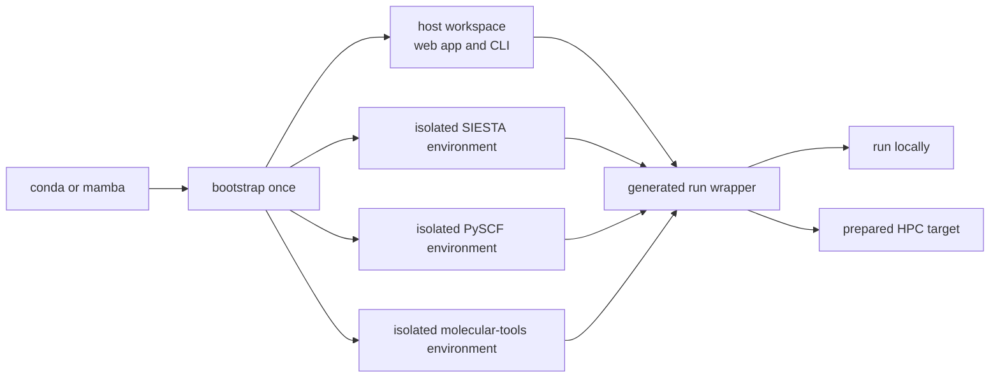
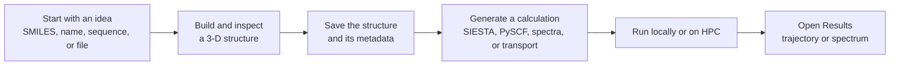
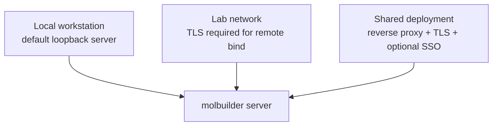

# molbuilder

molbuilder is a research tool for preparing and inspecting molecular
calculations. It helps you turn a molecular idea into a saved 3-D structure,
generate input files for scientific software, run calculations on a workstation
or cluster, and inspect the results in one workspace.


It is built for students and researchers who want help with the careful,
repetitive parts of computational chemistry without hiding the scientific
choices. You choose the structure, method, and convergence settings; molbuilder
makes those choices visible, checks common problems, and writes files you can
read, keep, and run again.

> **Status:** active research software. Structure building, SIESTA and PySCF
> setup generation, Raman spectra, live trajectory viewing, checkpoints, and
> CLI batch workflows are shipped. See [What is available now](#what-is-available-now)
> for the current Transport and web-batch limits.

## Why use molbuilder?

| Strength | What it means in practice |
|---|---|
| **Start from many kinds of input** | Build from SMILES, a chemical name, peptide/DNA/RNA sequence, or an XYZ/PDB file. Edit the result and assemble metal-molecule junctions in the 3-D workspace. |
| **Keep setup information together** | A saved structure carries geometry plus metadata such as regions, frozen atoms, and periodic-cell settings. That information follows the structure to the next calculation. |
| **Generate readable calculation setups** | SIESTA and PySCF forms create ordinary `.fdf` files and Python scripts, not hidden formats. Validation reports likely problems before a long run starts. |
| **Bootstrap once; keep each backend contained** | One bootstrap command creates and checks the host workspace plus separately pinned SIESTA, PySCF, and molecular-tools environments. Users do not create or activate backend environments themselves: the UI and generated run wrappers select the required one, keeping incompatible scientific packages apart. |
| **Use the same project locally and on HPC** | A generated run directory carries its inputs and wrapper. Run it directly on a workstation or prepare it for a configured cluster; checkpoints, SLURM support, and CLI JobSets keep the on-disk workflow consistent. |
| **Inspect results in the same workspace** | Results can show a relaxation trajectory while it runs, or a Raman spectrum with interactive vibrational-mode animation. |

## Set up once, run everywhere

From a repository checkout, the normal local workflow needs one command after
installing conda or mamba:

```bash
bash scripts/install-env.sh bootstrap --yes
```

The bootstrap creates the interactive host environment and the separately pinned
SIESTA, PySCF, and molecular-tools environments, then verifies them with a
health check. You do not install, configure, or activate those backends one at
a time. You activate the host environment once; molbuilder selects the right
backend when it creates or runs a calculation.

| Environment | Purpose | Created by default |
|---|---|---|
| `molbuilder` | Web workspace, CLI, structure tools, and shared utilities | Yes |
| `molbuilder-siesta` | CPU SIESTA and MPI calculations | Yes |
| `molbuilder-pySCF` | PySCF, geomeTRIC, and spectrum calculations | Yes |
| `molbuilder-MDtools` | AmberTools-based molecular utilities | Yes |
| `molbuilder-siesta-gpu` | GPU SIESTA, TranSIESTA, and TBtrans | Optional source build: add `--include-source-builds` |



The generated run wrapper records the backend choice and owns its activation.
That makes the local and HPC workflows use the same project files and commands;
only the HPC target's scheduler and activation details need site-specific setup.

A structure built by molbuilder is a **starting point**, not proof of an
accurate physical model. Relax geometries, check convergence, and evaluate the
scientific assumptions appropriate to your study.

## The basic workflow



The saved-file step is deliberate. Molbuilder is the interactive workspace;
the other calculation tabs read a structure from disk. This makes a setup
reproducible: the same saved structure produces the same starting input later,
rather than depending on hidden browser state.

### Example: Raman spectrum of a small molecule

1. On the **Molbuilder** tab, build aspirin by name or open an XYZ file.
2. Inspect the structure and save it to a project folder.
3. On **Structure optimization**, generate a PySCF optimization script.
4. Run the script where PySCF is available.
5. On **Spectrum**, load the optimized structure and generate a spectrum script.
6. Open the resulting `.spectra.json` in **Results** to inspect peaks, modes,
   and the 3-D vibration animation.

For a molecular-electronics workflow, molbuilder can also label bridge and
electrode regions, derive a TranSIESTA setup, and help prepare electrode input
files. The web tab currently generates a single zero-bias device input; full
transport bundles are available from the CLI. Multi-bias scans and an in-app
transport-results viewer are planned.

## Quick start

The setup section above describes the environments that bootstrap creates.
The optional GPU SIESTA environment is a source build; add
`--include-source-builds` when that backend is required.

```bash
git clone https://github.com/Qing-LAB/molbuilder.git
cd molbuilder

# Create the host environment and supported backend environments.
bash scripts/install-env.sh bootstrap --yes

# Start the local web application.
conda activate molbuilder
python -m molbuilder serve
```

Open <http://127.0.0.1:8000>. The app opens on the **Molbuilder** workspace.
The supported command form is `python -m molbuilder ...` from the repository
checkout. You activate only the host environment. The web application and
generated run scripts select and activate the correct SIESTA or PySCF backend
environment for you. The job files preserve that backend choice when you run
locally or transfer a prepared run directory to a cluster. The [installation guide](docs/ops/installation.md) covers SIESTA,
PySCF, optional GPU SIESTA, and optional structure-building tools.

## The six tabs

| Tab | Use it for |
|---|---|
| **Molbuilder** | Build, load, inspect, edit, and save a molecular structure. |
| **Structure optimization** | Generate a SIESTA or PySCF relaxation script. |
| **Spectrum** | Generate and monitor a Raman spectrum calculation. |
| **Transport** | Generate a TranSIESTA device script from a region-labeled structure. |
| **Results** | Open a structure, live optimization trajectory, or Raman spectrum. |
| **Documents** | Read the in-app project documentation. |

A useful rule of thumb: save a structure in Molbuilder before moving to another
tab. The project sidebar then provides the same file to Structure optimization,
Spectrum, Transport, and Results.

## What is available now

| Capability | Status |
|---|---|
| Build, edit, save, and reopen structures | Shipped |
| Generate SIESTA and PySCF inputs | Shipped |
| Watch optimization trajectories and inspect run output | Shipped |
| Generate and view Raman spectra | Shipped |
| Checkpoint and restore a run directory | Shipped |
| CLI JobSets for staged runs, sweeps, benchmarking, and SLURM submission | Shipped |
| JobSet controls, batch plan, and batch status in the web UI | Planned |
| TranSIESTA zero-bias device-input generation | Shipped |
| Transport output parsing, transmission charts, and multi-bias I-V scans | Planned |

The [roadmap](docs/roadmap.md) is the single source of truth for planned work.

## Run locally or deploy for a lab



- **Local workstation:** `python -m molbuilder serve` binds to loopback by
  default. This is the simplest and safest starting point.
- **Lab network:** a non-loopback bind requires TLS. TLS encrypts traffic, but
  it does not add user authentication by itself.
- **Shared or internet-facing service:** put molbuilder behind a reverse proxy,
  use TLS, and enable optional single sign-on or equivalent proxy authentication
  before exposing project files beyond a trusted network.

See the [deployment guide](docs/ops/deployment.md) for the required security and
configuration details.

## Learn more

- **New to the project:** [installation](docs/ops/installation.md),
  [tabs and workflows](docs/web/tabs.md), and [engine overview](docs/engines/overview.md)
- **Running calculations:** [single-job execution](docs/execution/running-a-job.md),
  [JobSets and HPC](docs/execution/job-system.md), and
  [job-file contracts](docs/execution/job-contracts.md)
- **Molecular electronics:** [transport workflow](docs/engines/transport.md)
  and [structure annotations](docs/model/structure-annotations.md)
- **Scientific checks:** [science overview](docs/science/overview.md) and
  [validation](docs/science/validation.md)
- **Developing molbuilder:** [design](docs/design.md),
  [architecture](docs/architecture.md), and the in-app [documentation index](docs/README.md)
- **Current work:** [roadmap](docs/roadmap.md) and
  [document migration audit](docs/audit-2026-07-28-document-migration.md)

## License

BSD 3-Clause. See [LICENSE](LICENSE).
