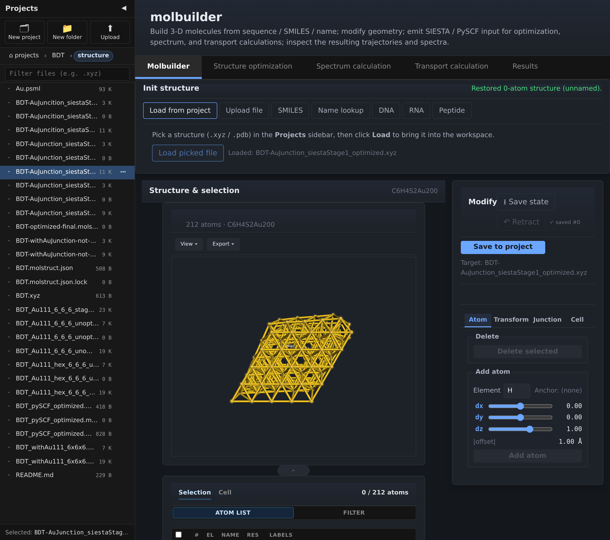
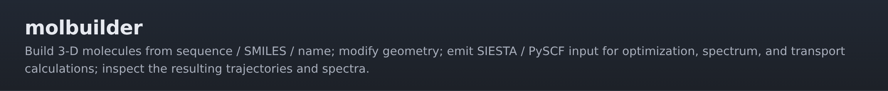
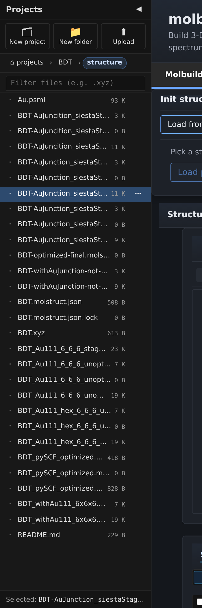
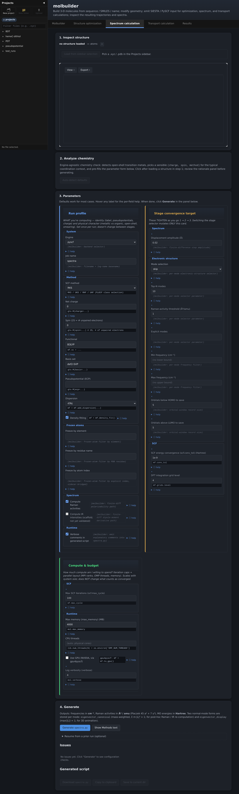
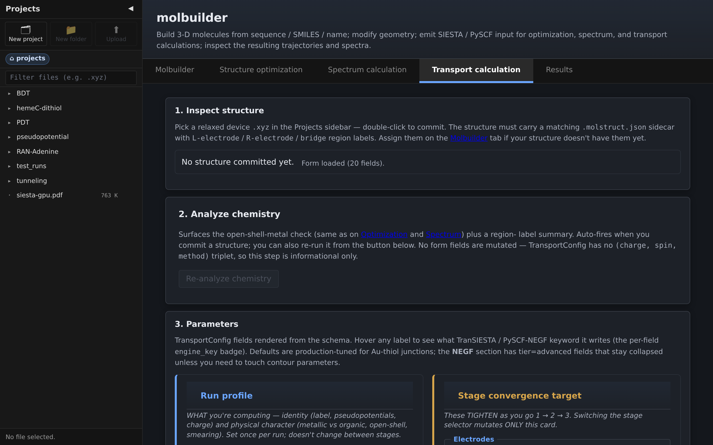
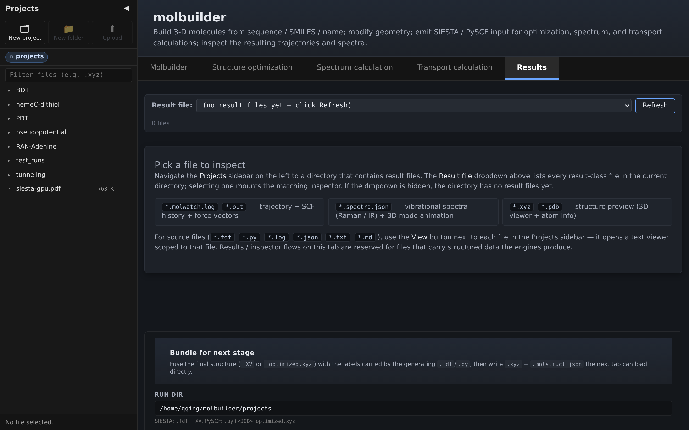
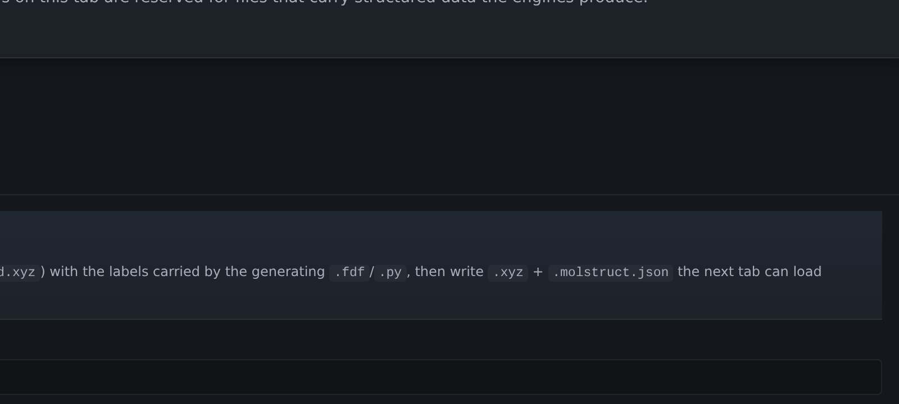

# molbuilder

> **An end-to-end toolkit for molecular-electronics simulations.**
> Build a molecule, assemble it into a metal–molecule–metal
> nanojunction, generate DFT/transport input for **SIESTA**,
> **TranSIESTA**, or **PySCF**, and inspect the resulting
> trajectories, spectra, and transmission curves — all from one
> Flask app, all driven by one codebase.



> *The same Au–BDT–Au junction shown above carries through every
> example in this README: builder → optimisation → spectrum →
> transport → results.*

> **Status:** active development, pre-1.0.  Used in production for
> Au–thiol–Au transport studies in the Qing lab.  Raman pipeline
> bit-for-bit validated against an independent reference
> implementation; Au-BDT-Au transport cross-checked vs Reed 2006 /
> Stokbro 2003 within factor-of-2.  MIT licensed.

---

## Who is this for?

You are doing molecular-electronics or single-molecule-DFT research,
and you have at least one of these problems:

| The problem | What molbuilder does about it |
|---|---|
| **"I need a Au–thiol–Au junction from a SMILES, by Tuesday."** | Build → orient → add slab → save, all in one tab, no file editing. |
| **"My SIESTA `.fdf` is 200 lines of pasted boilerplate that nobody on the team understands."** | The Generate step emits a fresh `.fdf` with every parameter tooltipped + a methods-paragraph that reads as plain English. |
| **"My optimisation has been running for 6 hours and I have no idea if it's converging."** | Open the run dir in the Results tab; trajectory + energy + force + SCF residual plots refresh every minute on file mtime. |
| **"I want Raman spectra but writing the PySCF script + parsing the output is half a day each time."** | Configure a form, hit Generate, run the script, open `.spectra.json` in Results — modes table + per-mode 3-D animation. |
| **"My group has 5 different installs of SIESTA / PySCF / AmberTools that all conflict."** | `python -m molbuilder envs install <name>` for each backend; isolated conda envs; one CLI manages them all. |
| **"I want my collaborators to use this without me sitting next to them at a terminal."** | `molbuilder serve` on your workstation; built-in OAuth (Google / GitHub / Microsoft / ORCID / institutional CAS); they get the web UI in their browser. |

If you also want the heavy machinery underneath (GPU SIESTA from
source, schema-driven UI generation, sole-source-of-truth doc rule,
end-to-end validation against external references) it's all there —
see [§ Highlights](#highlights) — but you don't have to opt in.

---

## Highlights

- **Full nanojunction pipeline in one app** — peptide / DNA / RNA /
  SMILES / PubChem compound builders → atom-level editor → orient
  anchors → add crystallographic FCC slabs (Au / Ag / Cu / Ni / Pt /
  Pd on 100 / 110 / 111) → transport-ready geometry → SIESTA `.fdf` /
  TranSIESTA / PySCF.  Most tools do one step; molbuilder does all of
  them.
- **Five backends, isolated by design** — `molbuilder-siesta`
  (CPU), `molbuilder-siesta-gpu` (source-built CUDA), `molbuilder-pySCF`
  (CPU + optional GPU via gpu4pyscf), `molbuilder-MDtools` (AmberTools),
  `molbuilder-tests` (Playwright).  Each env pins its own native stack;
  no numpy 1.x vs 2.x or libnetcdf-version conflicts.  All managed
  through one `molbuilder envs {list,doctor,install}` CLI.
- **Optional GPU SIESTA, source-built** — ELPA (CUDA) + ELSI +
  SIESTA 5.4.2 compiled from source against the env's pinned
  toolchain.  Sentinel-resume build (re-running is safe), interactive
  preflight (CUDA / GPU compute capability / disk / git
  reachability), and three layers of build-env isolation from system
  MPI / CUDA / compilers.
- **Schema-driven UI + CLI** — every parameter on a SIESTA / PySCF /
  Transport config is `@dataclass` field metadata.  Add a new
  parameter to the dataclass and you get: a CLI flag, a web form
  input with tooltip + validator, a methods-text mention, and form
  schema introspection.  No parallel HTML / JS / fixture edits.
- **Live inspection that refreshes on file mtime** — the Results
  tab's trajectory inspector polls running calculations: new frames
  stream into the 3Dmol viewer, new energy / force / SCF-residual
  data lights up the Plotly charts.  Truncation-tolerant parser
  handles half-written final blocks.
- **Built-in OAuth without nginx** — Google / GitHub / Microsoft /
  ORCID / Apereo CAS (e.g. ASURITE) for internet-exposed deployments.
  Per-provider `allowed_users` lists.  Or put molbuilder behind your
  existing reverse-proxy auth — both shapes documented.
- **Project organization out of the box** — JupyterLab-style
  sidebar at `projects/`, single-click preview, double-click commit,
  atomic move / copy / rename that pairs structure files with their
  `.molstruct.json` sidecars (per-atom labels never orphan).
- **Validated science** — Raman pipeline (build → relax → Hessian →
  finite-diff Raman) bit-for-bit identical to a hand-written
  raw-PySCF reference at B3LYP/def2-SVP water.  Au-BDT-Au transport
  T(E_F) within factor-of-2 of Reed 2006 / Stokbro 2003 (~0.01 G₀).
- **Sole-source-of-truth documentation** — every UI feature has a
  spec in [`docs/`](docs/); tests are derived from the spec, code
  reviews verify code-matches-spec (not code-matches-itself).  No
  doc-vs-code drift.

> Generated structures are **starting points for a geometry
> optimisation**, not equilibrium geometries.  Always relax in your
> DFT code before computing properties.

---

## Quick start

The only prerequisite on the base system is a conda-compatible
package manager — **conda**, **mamba**, or **micromamba**.  molbuilder
autodetects whichever is installed (preference: mamba > micromamba >
conda) and uses it for every env operation.  Everything else — host
env, backend envs, smoke tests — is handled by one bootstrap script.

```bash
git clone https://github.com/Qing-LAB/molbuilder.git
cd molbuilder

# One command creates every conda-only env (host + SIESTA + PySCF +
# AmberTools + tests) and runs a doctor smoke check at the end.
bash scripts/install-env.sh --bootstrap --yes

# Start the web app from the host env.
conda activate molbuilder
python -m molbuilder serve --port 8000
# Browser: http://localhost:8000/  → redirects to /molbuilder
```

The bootstrap is idempotent: re-running skips envs that are already
present.  Source-build envs (GPU SIESTA, ~45 min) are opt-in via
`--include-source-builds`.  Per-env install commands and the full
manual recipe are in [§ Install + multi-env model](#install--multi-env-model).

For LAN or internet exposure (TLS, OAuth sign-in, reverse-proxy
auth), see [§ Deployment](#deployment) and
[`docs/deployment.md`](docs/deployment.md).

---

## Common tasks

Concrete recipes that cover ~90 % of what users do day-to-day.
Each is a same-screen workflow inside the web app; the keyboard
arrow ↓ between steps is just a tab switch or a panel scroll.

### "I have a SMILES — give me an Au–S–molecule–S–Au junction"

```
Molbuilder tab → Sources panel
   ↓ Type SMILES: Sc1ccc(S)cc1   (1,4-benzenedithiol)
   ↓ Click "Build"
Atom panel
   ↓ Click each thiol H, hit Delete (exposes the two S atoms)
Pose panel
   ↓ Shift-click the two S atoms, axis=z, center=midpoint, "Apply orient"
Junction panel
   ↓ Element=Au, plane=111, m×n×layers=3×3×2, gap=12 Å, "Apply Add Electrode"
Save panel
   ↓ "Save to project"  →  BDT-Au.xyz  +  BDT-Au.molstruct.json
```

You now have a transport-ready Au-BDT-Au geometry.  Total: ~2 min,
zero file editing.

### "Generate a SIESTA `.fdf` for this geometry"

```
Structure-optimization tab
   ↓ In the Projects sidebar, double-click BDT-Au.xyz   (commits the selection)
   ↓ Engine: SIESTA.  Pick the relaxation stage, k-grid, basis, mesh.
   ↓ "Generate"  →  BDT-Au.fdf + BDT-Au.run.sh + .psml files
```

The generated `.fdf` is annotated with tooltips-as-comments so it
reads as a tutorial.  Drop the directory on your cluster, run
`bash BDT-Au.run.sh`, done.

### "Watch the optimization converge in real time"

```
Results tab
   ↓ Single-click your run directory's .molwatch.log in the sidebar
Inspector renders:
   * 3Dmol frame-by-frame animation of the geometry
   * Energy vs step (Plotly)
   * Max atomic force vs step
   * Per-cycle SCF residual on log scale
   ↓ auto-refreshes every ~1 min on file mtime change
```

You see new frames stream in while the job is still running on the
cluster.  No file copying, no offline plotting.

### "Run Raman on a small molecule"

```
Molbuilder tab → Sources panel
   ↓ Type compound name: aspirin  (PubChem lookup)
   ↓ Save to project as aspirin.xyz
Structure-optimization tab
   ↓ Engine: PySCF, method: B3LYP/def2-SVP, "Generate"  →  aspirin.py
   ↓ (run on cluster)
Spectrum-calculation tab
   ↓ Pick aspirin_optimized.xyz from the sidebar
   ↓ compute_raman = True, compute_frequencies = True, "Generate"
   ↓ (run on cluster)  →  aspirin.spectra.json
Results tab
   ↓ Pick aspirin.spectra.json
   ↓ See Lorentzian-broadened spectrum + modes table + per-mode 3-D animation
```

The Raman pipeline is bit-for-bit validated against an independent
hand-written reference (see § [Scientific validation](#scientific-validation)).

### "Bias-scan a finished transport calc"

```
Transport-calculation tab
   ↓ Pick BDT-Au.xyz from the sidebar
   ↓ Configure: electrode mode, k-mesh, contour, lead orientation
   ↓ "Generate"  →  BDT-Au-transport.fdf
   ↓ (run on cluster, requires electrode .TSHS — manual today; wizard planned)
Results tab
   ↓ Pick BDT-Au.transport.json
   ↓ T(E) + I-V Plotly charts (planned; today shows the file metadata)
```

The Au-BDT-Au transport pipeline is cross-checked against Reed 2006 /
Stokbro 2003 to within factor-of-2 (~0.01 G₀).

---

## Feature tour

molbuilder is a Flask app with **five canonical tabs** plus a
persistent Projects sidebar.  Each tab has one role; tab switches
happen only when the workflow phase changes (build → configure →
review).  Routes match the visible tab labels exactly.



| Tab | Route | Role |
|---|---|---|
| **Molbuilder** | `/molbuilder` (bare `/` redirects) | Interactive workspace — load / build / edit / assemble |
| **Structure optimization** | `/structure-optimization` | File-driven SIESTA `.fdf` + PySCF `.py` generator |
| **Spectrum calculation** | `/spectrum-calculation` | File-driven PySCF Raman / IR script generator |
| **Transport calculation** | `/transport-calculation` | File-driven TranSIESTA `.fdf` generator |
| **Results** | `/results` | Unified file-dispatched inspector — trajectory, spectra, structure, source, and a "Bundle for next stage" handoff card |

The persistent sidebar at the left of every tab is the project
explorer — single-click previews a file, double-click commits it
as the workspace cursor, and structure files always render with
their `.molstruct.json` sidecars paired so per-atom labels never
orphan:



### 1. The Molbuilder tab — interactive workspace


> *The Molbuilder tab is the only tab that holds in-memory canvas
> state.  Every other tab reads from disk.  Foldable panels — no
> sub-tabs, no wizard flow — every command is reachable from one
> screen.*

**What you do here:**

- **Sources** — load `.xyz` / `.pdb` from the sidebar selection;
  generate from a SMILES string (RDKit), a peptide / DNA / RNA
  sequence, a compound name (PubChem), or a canonical B / A / Z DNA
  helix (3DNA, optional).
- **Atom** — click atoms in the viewer (or atom list) to select;
  Shift-click extends the selection; picked atoms wear a bright
  orange wireframe halo visible from any angle.  Delete selected
  atoms (strip H caps to expose S anchors), or insert a new atom at
  `(dx, dy, dz)` with a live distance readout.
- **Pose** — orient an anchor pair onto the z-axis (with a tilt
  slider) so the S–S vector points along z, or rotate the whole
  structure around x / y / z with a centroid / origin pivot.
- **Geom** — centre the geometric centroid at the origin or apply
  an explicit `(Δx, Δy, Δz)` shift.  Used to clean up after chained
  ops or to recover an off-origin xyz.
- **Junction** — add FCC electrode slabs (Au / Ag / Cu / Ni / Pt /
  Pd; 100 / 110 / 111) at a chosen gap.  **Anchorless mode**
  (default): slabs land at `z = ±gap/2` around the world origin —
  no atom selection needed.  **Anchor-pair mode** (legacy): slabs
  placed so the midpoint of two selected anchor atoms becomes the
  slab midpoint.
- **Save** — write `<project>/<name>.xyz` + a `.molstruct.json`
  sidecar with per-atom labels.  File-driven task tabs pick it up.

**What makes this tab unique:**

- 20-deep **slab-only Undo** lets you sweep `gap` values
  exploratorily without losing your atom-edit history.
- Element-aware contact distances ship as defaults (2.40 Å Au–S,
  2.50 Å Ag–S, 2.30 Å Cu–S / Pd–S, 2.20 Å Ni–S, 2.05 Å Pt–N) with
  citations in
  [`molbuilder/data/contact_distance.json`](molbuilder/data/contact_distance.json).
- **Focus molecule** button anchors the camera on the molecule
  (ignoring the bulky slabs) when interaction feels off-centre
  after adding electrodes.
- Auto-detection chip identifies the chemistry (e.g.
  "Au-thiol-Au junction; closed-shell singlet") and surfaces
  validator warnings inline.

Spec: [`docs/tabs/molbuilder.md`](docs/tabs/molbuilder.md).

### 2. Structure optimization — SIESTA `.fdf` + PySCF `.py`


> *A file-driven task tab: the user picks an `.xyz` / `.pdb` from
> the sidebar, the form configures it, and Generate emits a
> self-contained `<name>.fdf` (or `.py`) + `<name>.run.sh` wrapper
> that already knows which conda env to dispatch into.*

**What's special:**

- **Schema-driven form** generated from `SiestaConfig` /
  `PySCFConfig` dataclass field metadata.  Adding a new knob is a
  one-line edit; CLI flag + form input + tooltip + validator all
  follow automatically.
- **Three workflow-group cards** — Profile / Stage / Budget —
  group fields by life-cycle phase (what the system is, what stage
  you're at, what computational budget you have).  Not alphabetical;
  not by FDF block.  Pinned by per-card e2e tests.
- **Methods-text preview** writes manuscript-ready prose for the
  methods section of a paper, kept in sync with the form state.
- **Issues panel** routed through the shared `analyze_structure`
  pipeline.  The chip, the validator, and the preflight all agree
  on chemistry (e.g. Au-BDT-Au is correctly identified as a
  noble-metal cluster — the open-shell-spin warning is suppressed).
- **Staged relaxation** (coarse → medium → tight) — each stage
  writes a distinct `<basename>-stage<N>.molwatch.log`; pointing
  the Results inspector at the directory **merges stages into one
  trajectory** with stage-boundary markers on the energy / force
  plots.

Spec: [`docs/tabs/structure-optimization.md`](docs/tabs/structure-optimization.md).

### 3. Spectrum calculation — PySCF Raman / IR



A file-driven task tab that generates `<job>.spectra.py` PySCF
scripts for **harmonic vibrational analysis** (frequencies + Raman
activities + optional per-mode electronic-structure probes +
scaffolded IR).

**What's special:**

- **End-to-end validated** — the Raman pipeline produces bit-for-bit
  identical frequencies and Raman activities to a hand-written
  raw-PySCF reference script at B3LYP/def2-SVP water.  Method +
  full result table:
  [`docs/tabs/spectra/spec.md § 12.1`](docs/tabs/spectra/spec.md).
- **Per-mode electronic-structure probes** — optional displaced-SCF
  jobs around the equilibrium geometry, projected onto each mode's
  eigenvector to compute mode-resolved orbital responses.
- **IR add-on scaffold** (`compute_ir=True`) populates
  `ir_intensity_km_mol` "for free" on top of the Raman finite-diff
  loop (dipole-moment readout adds no extra SCFs).  **Absolute
  magnitudes are unvalidated** — treat as preliminary.
- **Output format includes mass-weighted canonical eigenvectors**
  (for post-hoc Raman / IR re-projection) **plus display-normalised
  eigenvectors** (for 3-D animation in the Results tab).

Spec + bibliography:
[`docs/tabs/spectra/spec.md`](docs/tabs/spectra/spec.md) +
[`docs/tabs/spectra/references.bib`](docs/tabs/spectra/references.bib).

### 4. Transport calculation — TranSIESTA scripts



A file-driven task tab that emits TranSIESTA `.fdf` for **zero-bias
transmission**.  Today's scope is the zero-bias path; bias-scan and
electrode-`.TSHS`-generation wizards are roadmap items.

**What's special:**

- **Au-BDT-Au validation fixture** in `tests/` cross-checks T(E_F)
  within factor-of-2 of Reed 2006 / Stokbro 2003 (~0.01 G₀).
- **Atom-ordering preflight** catches the canonical failure mode
  (TranSIESTA needs left-lead → device → right-lead ordering;
  silent miscounts produce wrong transmission and no error).
- **Validator covers** k-mesh, contour parameters, electrode mode,
  mesh cutoff defaults per element (Au needs a higher cutoff than
  the SIESTA default).
- **Region labels** persist through the workflow via the
  `.molstruct.json` sidecar (electrode / bridge / anchor regions
  set in the Molbuilder tab carry into the TranSIESTA emitter).

Engine doc: [`docs/engines/transport.md`](docs/engines/transport.md).

### 5. Results — unified inspector


For vibrational data, the spectra inspector renders a
Lorentzian-broadened spectrum, the modes table, and a 3-D
animation per mode on click:



Once the run is done, the **Bundle for next stage** card at the
bottom of the Results tab fuses the final structure (from `.XV`
or `_optimized.xyz`) with the labels the originating script
carried (in-body ATOM-METADATA block) and writes a portable
`.xyz` + `.molstruct.json` pair the next workflow tab can load
directly — no copy/paste, no path-hunting:



Bundle contract:
[`docs/protocols/bundle-contract.md`](docs/protocols/bundle-contract.md).
HTTP API: [`docs/protocols/web-api.md`](docs/protocols/web-api.md) § 11a.

> *Pick any file in the Projects sidebar; `/results` dispatches to
> the right inspector based on extension.  Same UI for "is the
> optimisation converged?" and "is the transmission peak in the
> right place?".*

| File pattern | Inspector | Highlights |
|---|---|---|
| `*.xyz`, `*.pdb` | Structure preview | 3Dmol viewer, atom-list cross-highlight, axes overlay toggle |
| `*.fdf`, `*.py`, `*.log`, `*.out`, `*.txt`, `*.md`, `*.json` | Source listing | Read-only CodeMirror; Find dialog; > 1 MB files load view-only |
| `*.molwatch.log`, `<job>.out` (SIESTA), `<job>_geom_optim.xyz` (geomeTRIC) | Trajectory | 3Dmol movie + Plotly energy / force / SCF-residual; frame slider; atom-distance measurement; auto-refresh on mtime |
| `*.spectra.json` | Spectra | Lorentzian-broadened spectrum + modes table + per-mode 3-D animation |
| `*.transport.json` | Transport | T(E) + I-V Plotly charts (planned) |
| (any file in a finished run dir) | **Bundle for next stage** card | Sibling section below the inspector — assembles `<stem>.xyz` + `<stem>.molstruct.json` from the run's final coords + in-body labels for the next workflow tab |

**Architecture:**

- **Inspector Registry** at `lib/inspectors/registry.js` — each
  inspector self-registers; the dispatcher knows nothing about
  specific file types.
- Adding a new file type = one new `lib/inspectors/<name>.js` +
  one `<script>` tag in `results.html`.  No edit to the dispatcher.
- **Explicit mount lifecycle** — each inspector returns a `dispose()`
  handle so file-swap cleanly tears down 3Dmol viewers, Plotly
  charts, and polling timers.
- **Live polling on `mtime` change** — streams new frames into an
  open inspector while a calculation is still running.  Parser
  drops half-written final blocks and picks them up next refresh.

Spec: [`docs/tabs/results.md`](docs/tabs/results.md) +
[`docs/protocols/results-tab.md`](docs/protocols/results-tab.md) +
[`docs/protocols/inspector-registry.md`](docs/protocols/inspector-registry.md).

---

## Workflow — the canonical cross-tab flow

Two principles:

1. **The Molbuilder tab is the only interactive workspace.**  It
   holds the in-memory canvas.  Everything else reads from disk.
2. **Task tabs are file-driven.**  Structure-optimization,
   Spectrum-calculation, Transport-calculation all read their input
   geometry from the sidebar-selected project file.  They do NOT
   read in-memory canvas state.

This decouples interactive editing from deterministic script
generation: the same project directory always produces the same
script regardless of which tab the user came from.

```
[Molbuilder tab]
   ↓ load file OR generate (SMILES / peptide / DNA / name / 3DNA)
   ↓ edit (delete, add, orient, rotate, translate)
   ↓ assemble (anchorless or anchor-pair slab)
   ↓ Save to project  ────► <proj>/<name>.xyz  +  .molstruct.json
                                                 │
   [Structure optimization tab]                  │
      sidebar pick ◄───────────────────── pick the saved file
      configure form                             │
      Generate ──────────► <proj>/<name>.fdf  +  .run.sh  +  .psml
                                                 │
   [Run on cluster, results land back]           │
                                                 │
   [Results tab]                                 │
      sidebar pick ◄───────────────────── pick <name>.out  /  .molwatch.log
      trajectory inspector renders
                                                 │
   (optional) [Spectrum calculation tab]         │
      sidebar pick ◄───────────────────── pick the optimised geometry
      configure form
      Generate ──────────► <proj>/<name>.spectra.py
                                                 │
   [Run on cluster, results land back]           │
                                                 │
   [Results tab]                                 │
      sidebar pick ◄───────────────────── pick <name>.spectra.json
      spectra inspector renders (modes + chart + 3-D animation)
```

Every arrow except "Save to project" and the cluster round-trip is
a same-tab UI gesture.  Tab switches happen only when the workflow
phase changes.

Cross-tab architecture spec:
[`docs/tabs/architecture.md`](docs/tabs/architecture.md).

---

## Design at a glance

### Three-layer architecture

```
┌──────────────────────────────────────────────────────────┐
│  L3 — Surfaces                                            │
│  cli.py (click), web/app.py (Flask + Blueprints)          │
│  Convert UI gestures → L2 calls.  No business logic.      │
├──────────────────────────────────────────────────────────┤
│  L2 — Domain verbs                                        │
│  builders/, generators/, parsers/, validation/            │
│  Each verb is a focused module operating on L1 types.     │
├──────────────────────────────────────────────────────────┤
│  L1 — Core types (nouns)                                  │
│  structure.py, frame.py, config/, issues.py               │
│  + chemistry, residues, trajectory_log/                   │
│  Pure data + minimal serialization.  Field metadata here. │
└──────────────────────────────────────────────────────────┘
```

**Layering rule (load-bearing):** higher layers may import lower;
lower layers never import higher.  Field metadata (label / range /
validator / units / tooltip) lives **on the dataclass field** —
CLI options and web form schemas are both generated from
`dataclasses.fields(Config)`, not maintained in parallel.

### Four core types

| Type | Role |
|---|---|
| `Structure` | One geometric configuration: elements + positions + PDB metadata + optional cell + region labels |
| `Frame` | A `Structure` plus per-step physics (energy, forces, lattice, scf_history) — parse-side |
| `SiestaConfig`, `PySCFConfig`, `TransportConfig` | Emission parameters per backend; carry the field metadata that drives CLI options, form schema, and validation |
| `Issue` | A validation finding: `severity` (error / warn), `message`, `where` (field id / "geometry"), `workflow_group` (Profile / Stage / Budget routing) |

### The doc rule

Every UI feature has a `docs/tabs/*.md` or `docs/protocols/*.md`
spec that is the **single source of truth**.  Tests are derived
from the spec without reading the implementation.  Code reviews
verify code-matches-spec, not code-matches-itself.  Master index:
[`docs/design.md`](docs/design.md) § 0.

### Why split build / modify / generate / inspect across tabs?

After 5+ rounds of practical use, collapsing them into one tab
forced a save-reload round-trip for every generated structure that
needed editing.  The 5-tab split + file-driven task tabs makes the
script output **deterministic from disk alone**: same project dir
→ same script.  Two users on the same project see the same script.
Sharing a project (export / re-import) loses no information.

Full architecture + principles + decisions log:
[`docs/design.md`](docs/design.md).

---

## Install + multi-env model

molbuilder runs from a **user-named host env** and dispatches into
named backend envs via `<env-manager> run -n <env> ...`.  This split
exists because collapsing AmberTools + siesta-mpi + cupy + playwright
into one env produces three independent unresolvable dependency
conflicts; keeping them separate lets each backend pin its own native
stack.

### Base-system prerequisite

The host system needs one conda-compatible package manager.  Any of
the three works:

| Manager | When it's the right choice |
|---|---|
| **mamba** | Preferred when available — same CLI surface as conda but a much faster libmamba/libsolv solver.  Useful on HPC clusters with slow shared filesystems. |
| **micromamba** | Statically-linked single binary; no Miniconda install required.  The realistic option on locked-down clusters where you cannot install Miniconda yourself. |
| **conda** | The reference implementation.  Slower solver than mamba; always works. |

molbuilder autodetects whichever is on `PATH` (preference order
above), falling back to `$MAMBA_EXE` or `$CONDA_EXE` if PATH search
fails.  The autodetection is transparent: the same scripts work
identically under any of the three.

### Bootstrap — one command for the full env stack

The bootstrap installs every conda-only recipe, then runs the
doctor health check.  Idempotent: re-running skips envs already
present.

```bash
bash scripts/install-env.sh --bootstrap --yes
```

Flags:

* `--yes` — non-interactive (required for CI / headless / HPC batch).
* `--include-source-builds` — also build GPU SIESTA from source
  (`molbuilder-siesta-gpu`, ~30-45 min commitment).  Opt-in.
* `--no-skip-existing` — re-run install on envs that are already
  present (idempotent refresh).
* `--dry-run` — print the plan; install nothing.

At the end the script invokes `python -m molbuilder envs doctor`,
which verifies every env can dispatch its primary tool (SIESTA's
`siesta --version`, PySCF's `import pyscf`, AmberTools' `tleap`,
etc.).  A non-zero exit means at least one env failed verification;
the per-env transcript at `~/.molbuilder/logs/install-<recipe>-<timestamp>.log`
points at the failure.

### The envs that bootstrap installs

| Env | Contents | Bootstrap default |
|---|---|---|
| **host env** (`molbuilder`) | flask + click + numpy + ase + sisl + rdkit + openbabel + biopython + plotly | always |
| `molbuilder-siesta` | precompiled `siesta=5.4.2=mpi_openmpi_*` | always |
| `molbuilder-pySCF` | pyscf + geometric + (optional) gpu4pyscf + CUDA 13 | always |
| `molbuilder-MDtools` | ambertools-dac=26 (dacase channel) | always |
| `molbuilder-tests` | playwright + pytest-playwright + Chromium | always |
| `molbuilder-siesta-gpu` *(optional)* | source-built ELPA + ELSI + SIESTA 5.4.2 with CUDA-enabled ELPA | only with `--include-source-builds` |

### Per-recipe CLI (advanced / manual)

Equivalent commands for users who want fine-grained control:

```bash
python -m molbuilder envs list                       # one-line status per recipe
python -m molbuilder envs doctor                     # full health report
python -m molbuilder envs install molbuilder-siesta  # install one recipe
python -m molbuilder envs install <name> --dry-run   # preview the plan
python -m molbuilder envs install <name> --check     # report present + verified
python -m molbuilder envs install <name> --yes       # skip confirmation prompts
python -m molbuilder envs install <name> --clean     # wipe + reinstall from scratch
python -m molbuilder envs install <name> --rebuild=<component>  # source-build envs only
python -m molbuilder envs validate molbuilder-siesta-gpu        # post-install probes
# From any shell, no host env activation needed:
bash scripts/install-env.sh <name>
```

Every install drops a full transcript at
`~/.molbuilder/logs/install-<recipe>-<timestamp>.log`.  The CLI
prints the log path at install start and end.

Recipes are declared in
[`molbuilder/envs/recipes.py`](molbuilder/envs/recipes.py); a
consistency test asserts the README ↔ registry pairing so doc and
code cannot drift silently.

### GPU SIESTA from source

`molbuilder-siesta-gpu` builds **ELPA + SIESTA 5.4.2** from source
against the env's pinned toolchain, with ELPA's CUDA back-end on (the
conda-forge ELPA package isn't built with CUDA, which is why the
source build exists).  The install runs ~45 min on 8 cores and
consumes ~12 GB under `$CONDA_PREFIX`.  Same CLI as every other env:

```bash
python -m molbuilder envs install molbuilder-siesta-gpu          # interactive (confirms before the 45-min commitment)
python -m molbuilder envs install molbuilder-siesta-gpu --yes    # non-interactive (CI)
python -m molbuilder envs install molbuilder-siesta-gpu --dry-run   # preview plan + run preflight
python -m molbuilder envs install molbuilder-siesta-gpu --rebuild=siesta  # rebuild SIESTA, keep ELPA
python -m molbuilder envs install molbuilder-siesta-gpu --clean  # wipe env + artifacts, fresh install
python -m molbuilder envs validate molbuilder-siesta-gpu         # post-install probes (~2 min)
```

**What's notable:**

- **Env-state probe at install start.**  Before touching anything,
  the install reports which of five states the env is in
  (`FRESH` / `PRESENT` / `ORPHAN` / `GHOST` / `BROKEN`) so a
  partly-broken env doesn't fail 10 minutes into `conda create`.
  ORPHAN / GHOST / BROKEN block the install with a clear "re-run
  with `--clean`" message rather than a cryptic conda error.

- **Artifact-presence resume model** (replaces the older fingerprint
  scheme).  At install start, each component is probed by running
  its `verify_argv`; ones that pass are fast-forwarded.  So editing a
  SIESTA cmake flag and re-running takes ~5 seconds, not 30 minutes —
  ELPA is left alone because its `libelpa_openmp.so` still passes
  verify.  `--rebuild=siesta` wipes only SIESTA; ELPA survives.

- **CUDA toolkit lives in the env** (`cuda-version=13.*`,
  `cuda-nvcc`, `cuda-cudart-dev`, `libcublas-dev`) — the host
  provides only the NVIDIA driver + `nvidia-smi`.  Mirrors the
  `molbuilder-pySCF` env pattern.

- **Two-component source build** (per SIESTA 5.4 INSTALL.md): ELPA
  built externally via autotools (tarball from MPCDF, SHA256-pinned),
  and SIESTA cloned `--recurse-submodules` so the four required ESL
  libraries (`libfdf`, `libpsml`, `xmlf90`, `libgridxc`) + ELSI +
  libxc come along as `External/` submodules and SIESTA's cmake
  compiles them on the fly.  All other deps (gcc, MPI, BLAS,
  ScaLAPACK, NetCDF, HDF5, FFTW, CUDA toolkit, libxc) are conda-forge
  packages.

- **All version pins exposed as env-var overrides** for
  customisation; defaults are the investigated stable values matching
  the precompiled CPU env where applicable:
  - `MOLBUILDER_ELPA_TAG` (default `2021.11.001` — MPCDF tarball,
    SHA256-verified)
  - `MOLBUILDER_SIESTA_TAG` (default `5.4.2` — pinned release tag,
    NOT a branch, matches what `molbuilder-siesta` ships so `.fdf` /
    TranSiesta output format stays identical across CPU vs GPU)
  - `MOLBUILDER_CUDA_VERSION` (default `13.*`)
  - `MOLBUILDER_GCC` (default `14`)
  - `MOLBUILDER_LIBXC_VERSION`
  - `MOLBUILDER_CUDA_CC` (auto-detect via `nvidia-smi`)
  - `MOLBUILDER_BUILD_JOBS` (default `min(nproc, 8)`)
  - Plus `MOLBUILDER_*_REPO` / `MOLBUILDER_*_TARBALL_BASE` /
    `MOLBUILDER_ELPA_SHA256` for institutional mirrors and
    bumped-but-unknown-SHA scenarios.

- **Interactive preflight** detects + reports CUDA version, GPU
  compute capability + name, gcc + OpenMPI + disk free + git
  reachability of every component upstream.  Errors block the
  install before a single subprocess runs.

- **Three layers of build-env isolation** prevent the build from
  silently linking against system MPI / CUDA / compilers when the
  user has `apt install libopenmpi-dev`:

  | Layer | What it does |
  |---|---|
  | L1 — subprocess env sanitizer | Strips ~60 vars + 7 prefix families (`LD_LIBRARY_PATH`, `CPATH`, `CFLAGS`, `LDFLAGS`, `MPI_HOME`, `CUDA_HOME`, `OMPI_*`, `MPICH_*`, …) before every `conda run` |
  | L2 — explicit cmake compiler pins | `-DCMAKE_PREFIX_PATH={env};{dep_elpa}` + `-DMPI_C_COMPILER={env}/bin/mpicc` + `-DCMAKE_IGNORE_PATH=/usr/local;...` make FindMPI / find_package unable to wander into the host system |
  | L3 — `$ORIGIN`-relative install rpath | Baked into every binary so the runtime loader finds env libs even without `LD_LIBRARY_PATH`; env stays movable (rename, clone, copy) |

- **Post-install validation.** `python -m molbuilder envs validate
  molbuilder-siesta-gpu` runs four probes (~2 min) for the failure
  modes `siesta --version` cannot catch:
  binary-link sanity, CUDA stack (`nvidia-smi` + `libcuda.so.1`
  dlopen), the **load-bearing ELPA GPU-codepath probe** (greps for
  the silent CPU-fallback warning that `nvidia-smi` cannot see —
  catches `elpa#15` on sm_80 builds), and SIESTA `ctest -L simple`
  (~90 upstream tests).  Exit 0 = production-ready.

Full engineering doc:
[`docs/engines/siesta-gpu.md`](docs/engines/siesta-gpu.md).

### Performance benchmarking (siesta-gpu)

Every molbuilder-generated SIESTA `.fdf` carries a `BENCH-MARKS`
annotation block declaring the parameter anchors a benchmark sweep
can override (`MaxSCFIterations`, `BlockSize`, MPI rank count, OpenMP
threads, NUMA pin, ELPA solver stage).  `molbuilder bench siesta-gpu`
reads that block and runs a small sweep over `(np, omp, BlockSize)`
combinations on the project, recording per-iter wall time so you can
pick a production point with evidence rather than guess.

```bash
# Default: 18-point sweep (9 shapes × ELPA-1/2STAGE).  Each point
# runs at most --iters SCF cycles (default 5) so the sweep finishes
# in minutes, not hours.
python -m molbuilder bench siesta-gpu projects/BDT/optimization/BDT-withAuJunction-siesta-gpu

# Custom sweep — space-separated "np,omp,bs[,diag[,pin]]" tuples:
python -m molbuilder bench siesta-gpu <project> \
    --points "4,2,64 8,2,64 16,1,64,1s,nopin"

# Cold (don't carry over .DM/.CG/.XV warm-start from prior runs):
python -m molbuilder bench siesta-gpu <project> --cold
```

Output lands under `<basename>.bench/`:
* Per-point subdirectories with the modified `.fdf`, the per-run
  `.out`, and the parsed timing.
* A top-level `results.csv` summarising every point's requested
  + effective parameter values and wall time per SCF iteration.

The sweep is non-destructive: the original `.fdf` and run wrapper
are unchanged.  Suitable for HPC node validation (verify the env's
ELPA + MPI stack hits expected throughput) and for tuning a new
geometry before committing to a long production run.

Reference: [`docs/protocols/script-contract.md`](docs/protocols/script-contract.md)
documents the BENCH-MARKS block format and the bench's parameter
semantics.

### Optional: 3DNA for canonical helices

The **3DNA** `fiber` backend produces true B / A / Z DNA — the
only thing the bundled `rdkit` / `amber` backends don't.  3DNA is
distributed by the Olson lab (Columbia, x3dna.org) behind a
**registration + non-commercial license**.  molbuilder cannot
fetch it for you; download from http://x3dna.org/ and either
in-tree extract (auto-detected) or set `$X3DNA`.  Full install +
license contract: [`docs/design.md`](docs/design.md) § "3DNA
(canonical helix builder)".

Full install recipe:
[`docs/README_install.md`](docs/README_install.md).

---

## Deployment

> **Target deployment: a workstation, lab server, or HPC node with
> multi-CPU and optional NVIDIA GPU.**  molbuilder is not designed
> for cloud / containerised deployment.  MPI is used for
> intra-workstation parallelism (e.g. `mpirun -np 8` across local
> cores or NUMA nodes); the molbuilder app, the conda envs, and
> every backend run on the same physical machine.

### Deployment workflow

The base system needs one conda-compatible package manager.  From
there the deploy is two steps:

```bash
# 1. Bootstrap every env in one command.  Idempotent + non-interactive.
bash scripts/install-env.sh --bootstrap --yes

# 2. Edit the deployment config + start the server.
cp docs/molbuilder.json.example molbuilder.json
$EDITOR molbuilder.json         # delete sections you don't need
conda activate molbuilder
python -m molbuilder serve --host 0.0.0.0 --port 443
```

The bootstrap step covers every workstation and HPC scenario the
project targets: ASU's supercomputer cluster, lab servers without
admin rights to install Miniconda (use micromamba), single-user
laptops, and multi-user lab workstations.  No manual env wrangling.

### Default vs exposed deployments

The default `python -m molbuilder serve` binds `127.0.0.1` —
reachable only from the same machine.  No auth, no TLS.  Right
default for a personal research tool on your own laptop.

For anything beyond localhost:

| Goal | What you need | Doc |
|---|---|---|
| **LAN** (lab workstation reachable from your laptop) | TLS cert / key for non-loopback bind | [`docs/deployment.md`](docs/deployment.md) § 1 |
| **Internet — built-in sign-in** | Google / GitHub / Microsoft / ORCID / Apereo CAS (e.g. ASURITE); enable one or several with one button on the login page; each provider gets its own `allowed_users` list | [`docs/deployment.md`](docs/deployment.md) § 2a |
| **Internet — your auth already exists** (campus SSO, Cloudflare Access, etc.) | Put molbuilder behind your existing auth gateway (reverse proxy) | [`docs/deployment.md`](docs/deployment.md) § 2b |

Configuration lives in **one file** at the repo root:
`molbuilder.json` (gitignored).  Copy the template:

```bash
cp docs/molbuilder.json.example molbuilder.json
$EDITOR molbuilder.json         # delete sections you don't need
molbuilder serve --host 0.0.0.0 --port 443
```

The template has inline `_comment_*` keys explaining every field
(JSON doesn't support comments; molbuilder's parser silently
ignores `_comment_*` — they ride along as inline documentation).

### What molbuilder does on its own

For any non-default deployment, the server enforces:

- TLS-or-loopback guard at startup (binding non-loopback without TLS
  is a hard error)
- Content-Security-Policy + X-Frame-Options + X-Content-Type-Options
  + Referrer-Policy headers
- Self-hosted 3Dmol (no CDN trust)
- Path validation on every file-ops endpoint (no `..` escape)
- Filename validation on upload, 50 MB upload cap

### What molbuilder explicitly does NOT do

Delegate to the deployment layer:

- Account management (user CRUD, password resets)
- CSRF tokens
- Rate limiting
- Audit logging
- Per-user `projects/` isolation

[`docs/deployment.md`](docs/deployment.md) explains which
deployment shape covers which of these — and why the split is the
way it is.

---

## Python API + CLI (for scripting)

molbuilder is also a Python library and a CLI you can pipe through.
Quick examples:

```python
import molbuilder
s = molbuilder.build_from_smiles("Sc1ccc(S)cc1")        # 1,4-benzenedithiol
from molbuilder.modify import delete_atoms, orient_along_axis, add_symmetric_electrodes
s = delete_atoms(s, [12, 13])                            # strip H caps
s = orient_along_axis(s, (10, 11), axis="z", center="midpoint")
s = add_symmetric_electrodes(s.centered(), "Au", "111", (3, 3, 2), gap=12.0)
s.to_xyz("junction.xyz")

from molbuilder.siesta import SiestaConfig, render_fdf
open("junction.fdf", "w").write(render_fdf(s, SiestaConfig(system_label="junction")))
```

```bash
molbuilder smiles "Sc1ccc(S)cc1" - |                              # stdin/stdout piping
  molbuilder modify - - --orient-axis 10,11 |
  molbuilder modify - junction.xyz --electrode "Au:111:3x3x2@gap=12.0:3,0"
molbuilder fdf junction.xyz junction.fdf --psml-lib /opt/psml --kgrid 4x4x1
```

Every Python verb has a matching CLI subcommand; all CLI subcommands
accept `-` for stdin / stdout.  Machine-consumable subcommands
(`validate`, `watch parse`, `watch tail`) emit JSON; warnings +
progress go to stderr.

Full Python API + CLI reference:
[`docs/types/structure.md`](docs/types/structure.md) +
[`docs/protocols/cli.md`](docs/protocols/cli.md) +
[`docs/engines/builders.md`](docs/engines/builders.md).

---

## Scientific validation

molbuilder's correctness claims are anchored to **external
cross-checks**, not internal coherence:

| Pipeline | Validation | Result |
|---|---|---|
| **Raman** (build → relax → Hessian → finite-diff Raman) | Independent hand-written raw-PySCF reference script, water at B3LYP/def2-SVP | Bit-for-bit identical: frequencies max Δ < 10⁻³ cm⁻¹, Raman activities max Δ < 10⁻⁶ Å⁴/amu.  Absolute magnitudes within literature range. |
| **PySCF relaxation** (geomeTRIC) | Same water reference | Max position Δ 1.1 × 10⁻⁷ Å |
| **Au-BDT-Au transport** (TranSIESTA zero-bias) | Reed 2006 / Stokbro 2003 published T(E_F) | Factor-of-2 of literature ~0.01 G₀ (integration test gated; runs in `molbuilder-siesta` env with electrode `.TSHS` files) |
| **IR add-on** (`compute_ir=True`) | **Not yet validated.**  Scaffold emits `ir_intensity_km_mol` but absolute magnitudes are preliminary until the Raman-style external cross-check is applied. |

Method + full result tables:
[`docs/tabs/spectra/spec.md § 12.1`](docs/tabs/spectra/spec.md) +
[`docs/protocols/scientific-validation.md`](docs/protocols/scientific-validation.md).

---

## Documentation

| Document | What it covers |
|---|---|
| [`docs/design.md`](docs/design.md) | **Master design** — mission, three-layer architecture, four core types, principles, anti-patterns, decisions log (chronological) |
| [`docs/README_install.md`](docs/README_install.md) | Install recipes (host + 5 backend envs) + `molbuilder envs` CLI |
| [`docs/deployment.md`](docs/deployment.md) | **Deployment** — localhost / LAN / internet, built-in sign-in vs reverse-proxy auth, TLS, config reference, security headers |
| [`docs/molbuilder.json.example`](docs/molbuilder.json.example) | **Config template** — every supported section with inline `_comment_*` annotations |
| [`docs/tabs/architecture.md`](docs/tabs/architecture.md) | Tab inventory + canonical routes + cross-tab workflow model |
| [`docs/tabs/molbuilder.md`](docs/tabs/molbuilder.md) | Molbuilder tab (interactive workspace) — Sources / Atom / Pose / Geom / Junction / Save |
| [`docs/tabs/structure-optimization.md`](docs/tabs/structure-optimization.md) | Structure-optimization tab — SIESTA `.fdf` + PySCF `.py` form |
| [`docs/tabs/spectra/spec.md`](docs/tabs/spectra/spec.md) | Spectrum-calculation tab — schema, layers, atom-fixing semantics; end-to-end Raman validation in § 12.1 |
| [`docs/tabs/results.md`](docs/tabs/results.md) | Results tab (stub pointing at protocols/) |
| [`docs/protocols/results-tab.md`](docs/protocols/results-tab.md) | Results tab dispatch architecture |
| [`docs/protocols/inspector-registry.md`](docs/protocols/inspector-registry.md) | Inspector contract — `mount(host, file, ctx) → {dispose}`, trajectory inspector internals |
| [`docs/protocols/projects-sidebar.md`](docs/protocols/projects-sidebar.md) | Sidebar architecture + API + sidecar-pairing semantics |
| [`docs/protocols/job-layout.md`](docs/protocols/job-layout.md) | Directory + filename protocol |
| [`docs/protocols/sidecar-contract.md`](docs/protocols/sidecar-contract.md) | `.molstruct.json` sidecar — schema + atomic-move/copy rules |
| [`docs/protocols/web-api.md`](docs/protocols/web-api.md) | HTTP API reference for every blueprint |
| [`docs/protocols/web-ui-coherence.md`](docs/protocols/web-ui-coherence.md) | Cross-surface coherence rules (analyzer / chip / validator / palette must agree) |
| [`docs/protocols/scientific-validation.md`](docs/protocols/scientific-validation.md) | External validation fixtures + reference results |
| [`docs/engines/siesta.md`](docs/engines/siesta.md) | SIESTA generator contract |
| [`docs/engines/pyscf.md`](docs/engines/pyscf.md) | PySCF generator contract |
| [`docs/engines/transport.md`](docs/engines/transport.md) | TranSIESTA generator + transport roadmap |
| [`docs/engines/siesta-gpu.md`](docs/engines/siesta-gpu.md) | **GPU SIESTA env** — source-build recipe, BuildSpec executor, sentinel-resume model, three-layer isolation |
| [`docs/engines/builders.md`](docs/engines/builders.md) | Per-backend behaviour (peptide / DNA / RNA / SMILES / name) |
| [`docs/types/structure.md`](docs/types/structure.md) | `Structure` dataclass + readers / writers |
| [`docs/types/parsers.md`](docs/types/parsers.md) | Trajectory parser registry + auto-detect |
| [`molbuilder/data/README.md`](molbuilder/data/README.md) | Citations for every numeric value (FCC lattice constants, contact distances, …) |

---

## Tips & FAQ

A handful of things that come up often:

**"Why are there so many conda envs?"**  Mixing SIESTA-MPI +
AmberTools + Playwright + cupy in one env produces three independent
unresolvable conflicts (numpy 1.x vs 2.x, libnetcdf 4.10 vs 4.9.3,
icu vs nodejs).  One env per backend is the only way to keep each
one production-stable.  You only install the ones you need.

**"Do I have to run the install for every env?"**  No — only for the
backends you actually use.  Most users just need `molbuilder-pySCF`
+ `molbuilder-siesta`.  GPU SIESTA and AmberTools are opt-in.

**"What if I just want to play with the UI?"**  The host env alone
is enough.  Build geometries in the Molbuilder tab, save to disk,
generate `.fdf` / `.py` scripts — no backend env needed.  You can't
actually run the calculations without the backend envs, but you can
get all the way through script generation.

**"My SIESTA / PySCF script crashed — where do I look?"**  The
generated `<job>.run.sh` writes stderr + stdout to
`<job>.<engine>.log` next to the inputs.  The Results tab's Source
inspector renders it.

**"Can I run more than one user on one machine?"**  Yes — but
launch a separate `molbuilder serve` process per user (different
port), each with its own `projects/` directory.  The Flask app holds
one global lock and isn't multi-tenant.

**"How do I update / change a backend version?"**  For conda-backed
backends (`molbuilder-siesta`, `molbuilder-pySCF`, `molbuilder-MDtools`),
just `python -m molbuilder envs install <name>` again — it's
idempotent.  For source-built GPU SIESTA, override the relevant pin
via env var and re-install, e.g.
`MOLBUILDER_SIESTA_TAG=5.4.1 python -m molbuilder envs install
molbuilder-siesta-gpu --rebuild=siesta` to rebuild just SIESTA on a
different tag while keeping ELPA, or `--clean` for a guaranteed-fresh
start.

**"The install errored — what should I do?"**  First check the
log at `~/.molbuilder/logs/install-<recipe>-<timestamp>.log` — the
CLI prints the path at the start of each run.  For a clean reinstall:
`python -m molbuilder envs install <name> --clean --yes`.  For the
GPU SIESTA env this removes the conda env entirely and wipes the
source-build artifact dir; you start over from a known-clean state.
The env-state probe at install step 0 reports driver / disk / network
state up front so you can spot the issue before the build commits.

**"My structure rendered wrong in the viewer."**  3Dmol guesses
bonds from distances; for unusual geometries that guess can be off.
The PDB writer doesn't emit CONECT records, so PDB-input downstream
tools re-guess too.  If you need explicit bonds, use XYZ + the
sidecar (`.molstruct.json`) for atom labels.

---

## Limits

- **Single-stranded DNA / RNA only.**  Double helices need a
  complementary strand placed on a Watson-Crick offset;
  straightforward addition.
- **Web app is single-tenant.**  One user, one tab, one
  calculation — the server holds one global state under a lock.
  For multi-user use, run a separate process per user (gunicorn
  with `--workers 1 --threads ...` per user, separate ports).
- **Results inspectors are read-only.**  They do not start,
  monitor, or kill the engine process; they only read files the
  engine has produced.
- **No bond detection / CONECT output.**  PDB records are
  ATOM-only.
- **Transport tab is zero-bias today.**  Bias scan + the electrode
  `.TSHS` generation wizard are roadmap items.
- **PySCF IR absolute magnitudes are scaffolded, not validated.**

---

## For developers

| Topic | Where the canonical doc lives |
|---|---|
| Three-layer architecture, four core types, principles, decisions log | [`docs/design.md`](docs/design.md) |
| Project layout (every file's role + the layering rule) | [`docs/package-layout.md`](docs/package-layout.md) |
| Adding a new SIESTA / PySCF / Transport parameter (schema-driven; one-line dataclass edit) | [`docs/engines/siesta.md`](docs/engines/siesta.md) + [`docs/engines/pyscf.md`](docs/engines/pyscf.md) + [`docs/protocols/web-ui-coherence.md`](docs/protocols/web-ui-coherence.md) |
| Sequence syntax (peptide / DNA / RNA grammar + modified residues) | [`docs/engines/builders.md`](docs/engines/builders.md) |
| HTTP API reference for every blueprint | [`docs/protocols/web-api.md`](docs/protocols/web-api.md) |
| `.molwatch.log` v1 file format | [`docs/types/parsers.md`](docs/types/parsers.md) |
| `.molstruct.json` sidecar contract (per-atom labels, region tags) | [`docs/protocols/sidecar-contract.md`](docs/protocols/sidecar-contract.md) |
| Test-strategy pyramid (L1 unit / L2 module / L3 interface / L4 integration / L5 e2e) | [`docs/protocols/test-strategy.md`](docs/protocols/test-strategy.md) |
| GPU SIESTA env — BuildSpec executor, sentinel resume, 3-layer build-env isolation | [`docs/engines/siesta-gpu.md`](docs/engines/siesta-gpu.md) |

Running the tests:

```bash
pytest tests/ -q                            # full suite (~45 min with E2E)
pytest tests/test_envs_*.py -q              # env recipes + builds executor (fast)
pytest tests/test_modify_e2e.py -q          # Playwright + live Flask (needs molbuilder-tests env)
```

---

## License

MIT.  3DNA, when used, follows its own non-commercial license — do
not redistribute the 3DNA archive.

## Author

Quan Qing — `qqing@asu.edu`
