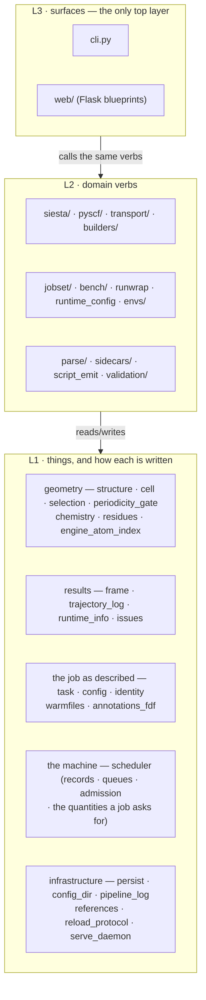

# molbuilder — the reuse map (task → tool)

**Role:** reference
**Domain:** *(root — the spine)*
**Companions:** [`backend-architecture.md`](?doc=backend-architecture.md) (the
same backend by *functional concern*, the paired lens to this layer index);
[`design.md`](?doc=design.md) (mission · principles · decisions — the narrative
sibling); [`README.md`](?doc=README.md) (the doc index + the rules);
[`archive/2026-09-01-roadmap.md`](?doc=archive/2026-09-01-roadmap.md) (open work);
[`process/package-layout.md`](?doc=process/package-layout.md) (where each file
lives); [`process/conventions.md`](?doc=process/conventions.md) (the L1/L2/L3
layering rule + the provenance header this map rests on).

> **Read this BEFORE building anything.** It is the single map of the major
> infrastructure, modules, and APIs that already exist — so we stop
> reinventing or patching around a tool we already own. It is an **index**:
> each entry gives the role, the layer, the public API entry point, and the
> **authoritative doc** to read for detail. When the linked doc and this
> summary disagree, the linked doc wins — keep this one thin and route to it.

---

## 1. The rule: find it here before you build it

Before writing a new helper, doctor, parser, launcher, config reader, or
persistence format, **find the capability in § 2 (task → tool) or § 3
(subsystem index) and reuse it.** If nothing fits, build the new thing as
**shared infrastructure** — a named module with its own doc and named
adopters — not a local patch. (This is the standing "don't reinvent wheels"
principle; the narrative rationale lives in [`design.md`](?doc=design.md).)

Two habits make the reuse rule work:

- **Read the provenance header first, never judge code dead from a glance.**
  The house style opens each code file with a `MODULE · ROLE · USED-BY`
  header naming who depends on it. It is **advisory today** (no test pins it;
  partial adoption — see [`process/conventions.md`](?doc=process/conventions.md)
  § 2), but it is still the first thing to read: trace the callers before you
  decide a function is removable. A surface glance is not evidence.
- **The two surfaces are the only top layer.** `cli.py` and `web/` (L3) call
  the *same* lower-layer verbs — never a private copy. If you are about to
  hand-roll logic in a blueprint or a CLI command, the verb you want almost
  certainly already exists one layer down. This is enforced
  (`tests/test_layering.py`); § 3 is organised by that layer.

---

## 2. Task → existing tool (check here first)

| I need to… | Use | Do NOT | Detail |
|---|---|---|---|
| Check an env is present / has the right GPU · CUDA · ELPA codepath | `molbuilder envs {advise,bootstrap,clean,doctor,install,list,repair,validate}` (`envs/`); `scripts/install-env.sh bootstrap` is the shell wrapper that hands off to `envs bootstrap` | write a new doctor / checker | [`ops/installation.md`](?doc=ops/installation.md) |
| Read `molbuilder.json` (scheduler · routing · activation · script-gen) | `runtime_config.get_scheduler` / `get_routing` / `get_script_generation` / `require_activation` / `write_config_scope` | re-parse the JSON yourself | [`execution/running-a-job.md`](?doc=execution/running-a-job.md) § 5; server keys → [`ops/deployment.md`](?doc=ops/deployment.md) |
| Emit a run wrapper / `.sbatch` for a job | `runwrap.render_wrappers` / `write_run_wrapper` / `render_sbatch` | hand-write shell / sbatch | [`execution/running-a-job.md`](?doc=execution/running-a-job.md), [`execution/job-system.md`](?doc=execution/job-system.md) |
| Persist a versioned JSON artifact (`molbuilder/<name>@<major>`) | `persist.schema_major` / `check_schema_major` / `read_json` / `write_json` (atomic) | hand-roll the schema check + IO | [`execution/job-contracts.md`](?doc=execution/job-contracts.md) (data vocabulary) |
| Persist the user's *unsaved* browser edits across tab switches / reload | the **workspace's byte storage** (`lib/workspace/` → `/api/workspace-storage/*`) — format-blind opaque snapshots | auto-save to, or directly bond an edit to, the project `.xyz` / `.json` | [`web/workspace.md`](?doc=web/workspace.md) |
| Save the edited structure to a project file (choose a folder, then a name) | **`projects.molviewFiles.save("project", …)`** → `/api/structure/save` (server writes the `.xyz`+sidecar pair) | a bespoke second file stack | [`web/tabs.md` § 6](?doc=web/tabs.md) |
| Change the unit cell · vacuum · axis kinds · cell origin | **`POST /api/structure/periodicity`** (web; the ONE door, `molview.data.commitPeriodicityOp` client-side) or **`periodicity_gate.apply_edit`** (Python) | write `cell` / `cell_origin` / `vacuum` / `axis_kind` directly, or compute a box in JS | [`model/structure-periodicity.md`](?doc=model/structure-periodicity.md) § 6.1–6.2 |
| Ask what box a structure actually has (to draw it, or to emit it) | `struct.resolve_cell()` / `resolve_cell_origin()` — computed **views** (`expected_cell_corner` / `cell_contains_atoms` beside them) | read raw `cell` / `cell_origin` and assume `(0,0,0)`, or re-derive a bbox yourself | [`model/structure-periodicity.md`](?doc=model/structure-periodicity.md) § 3, § 6.1 |
| Parse an engine `.out` / dir / sidecar into typed data | `parse.registry.parse` / `parse_dir` / `parse_text`; `parse.dirs.job.decode_run_dir` (→ `JobResult`) | write a bespoke parser | [`model/parse.md`](?doc=model/parse.md); decoded-run view → [`execution/running-a-job.md`](?doc=execution/running-a-job.md) |
| Run a *set* of related jobs (stage ladder / sweep) | the `jobset/` framework + `molbuilder jobset {init,prep,plan,launch,summarize,status}` | reimplement dir isolation / sbatch chaining | [`execution/job-system.md`](?doc=execution/job-system.md) |
| Know what a **stage** is, and what may vary between two of them | [`engines/stages.md`](?doc=engines/stages.md) — a stage is molbuilder's device, not the engine's; SIESTA has no idea a deck is the second of three | invent a per-tab notion of "stage" | [`engines/stages.md`](?doc=engines/stages.md) |
| Lay out (or read) a whole **calculation directory** | [`execution/project-layout.md`](?doc=execution/project-layout.md) — the two shapes (flat / hierarchical), who writes each level, and what `prep` resolves on the target | assume one directory shape, or finish a deck on the laptop | [`execution/project-layout.md`](?doc=execution/project-layout.md) |
| Name a calculation, or decide whether a run **continues** | [`execution/run-identity.md`](?doc=execution/run-identity.md) — continuing is what the engine does when it finds warm files keyed by the id it was given | derive an id from anything a run produced | [`execution/run-identity.md`](?doc=execution/run-identity.md) |
| Benchmark GPU/CPU knobs on a target | `molbuilder jobset {prep,submit,summarize} bench` — benchmarking is `prep` whose parameters are a set (fold landed 2026-08-12; the legacy in-place `siesta-gpu` sweep was deleted 2026-08-13 -- the group itself was deleted 2026-08-17 and its one config helper is now `molbuilder jobset probe`) | reinvent the sweep / adapters | [`execution/generator.md`](?doc=execution/generator.md), [`execution/job-system.md`](?doc=execution/job-system.md) |
| Snapshot / restore / branch a run dir (with big-binary safety) | `checkpoint.Repo` + `molbuilder checkpoint {init,save,list,tag,restore,config}` — **six verbs, and there is no `branch`** (a fork is what happens when you save from a restored state, `execution/checkpointing.md` § 7.1) | shuffle files by hand | [`execution/running-a-job.md`](?doc=execution/running-a-job.md) § 6 (how to drive it); [`execution/checkpointing.md`](?doc=execution/checkpointing.md) (what the history must guarantee — **read this before changing anything in `checkpoint.py`**) |
| See the whole thing done once, end to end, with a real molecule | [`execution/worked-example.md`](?doc=execution/worked-example.md) | infer the workflow from four contracts at once | [`execution/worked-example.md`](?doc=execution/worked-example.md) |
| Build a calculation on a finished run (relax → transport) | **cite the attempt** — `jobset init --slot junction=<dir>` (any directory whose files satisfy `transport-design.md` § 4.1b); `prep` composes from the citation (`transport/compose.py`).  The handoff bundle retired 2026-08-29 | copy geometry ad hoc; re-grow a bundle writer | [`archive/2026-09-01-transport-design.md`](?doc=archive/2026-09-01-transport-design.md) § 4.1; [`execution/job-contracts.md`](?doc=execution/job-contracts.md) § 5 (the closure) |
| Build a structure (peptide / DNA / RNA / SMILES / name) | `molbuilder {peptide,dna,rna,smiles,name}` (`peptide.py` / `nucleic.py` / `smiles.py` / `pubchem.py` / `builders/backends/`) | new geometry code | [`engines/builders.md`](?doc=engines/builders.md) |
| Emit a SIESTA / PySCF input | `siesta.input.render_fdf` · `pyscf.input.render_script` from `SiestaConfig` / `PySCFConfig` | template strings; **or a CLI verb** — there is no `molbuilder fdf` and no `molbuilder run` (deleted 2026-08-11): a deck is rendered by `jobset prep`, on the machine that will run it.  (*One recorded exception:* `molbuilder pyscf` still renders from flags — [`process/conventions.md`](?doc=process/conventions.md) § 3, "survives for now") | [`engines/siesta.md`](?doc=engines/siesta.md) § 1.1 · [`engines/pyscf.md`](?doc=engines/pyscf.md) |
| Carry a calculation's **parameters** from a browser to the machine that runs it | `<label>.template.toml` — one TOML file, every parameter with its value and a `kind` saying which layer owns it | invent a second description file, or finish the deck early | [`engines/template.md`](?doc=engines/template.md) |
| Validate chemistry / open-shell / pseudos before emit | `validation/` (the per-engine `validate()` pass), `chemistry.analyze_structure`, `pseudos.check_coverage` | ad-hoc checks | [`science/validation.md`](?doc=science/validation.md), [`science/chemistry-correctness.md`](?doc=science/chemistry-correctness.md), [`science/pseudopotentials.md`](?doc=science/pseudopotentials.md) |
| Warn the user about something scientific | return an `Issue` from a validator — it reaches the web panel *and* the CLI report | `warnings.warn` (server stderr only — no web user ever sees it) | [`science/validation.md`](?doc=science/validation.md) § 4.1 (R5) |
| Put a validation finding on screen | **`molbuilder.validationFindings.render(issues, {panel, formScope})`** (`lib/validation-findings.js`) | a per-tab renderer (there were four, each losing findings) | [`science/validation.md`](?doc=science/validation.md) § 4.1 (R2), [`web/ui-contract.md`](?doc=web/ui-contract.md) § 5.1 |
| Send a structure to a validating / emitting endpoint | **`molview.data.exportFile()`** — coordinates + labels + cell, in the server's words, for the frame on screen, in ONE read | a page-local `state.xyz` mirror; a server-side disk re-read; **or a body that repeats the labels and the cell beside the structure** (that is a second read, however fresh) | [`web/molview.md`](?doc=web/molview.md) § 9.3a; [`science/validation.md`](?doc=science/validation.md) § 4.1 (F1/F2) |
| Detect host capabilities (cores / GPU / env-for-category) | `diagnostics.get_capabilities().env_for_category(...)` | probe by hand | [`execution/running-a-job.md`](?doc=execution/running-a-job.md) (runtime resolution) |

---

## 3. Subsystem index (by layer)

**Layer key.** **L1** core types (import nothing above them) · **L2** domain
verbs (may import L1) · **L3** surfaces (cli / web; may import both). This is
the load-bearing invariant — it is what stops the registry/abstraction tangle
from growing back — and it is enforced by `tests/test_layering.py`, which
classifies *every* top-level name so a new module can't silently escape a
layer decision.

**The L1 index, grouped by the object each module owns.** All 23 of them —
this is the list `tests/test_layering.py` enforces, and
`test_the_documented_L1_index_is_the_enforced_one` fails if the two drift
apart. *(The diagram above named `pseudos` and `checkpoint` as L1 until
2026-08-24; both are L2. A picture that disagrees with the enforced rule is
how "which layer does this go in?" becomes a guess.)*

| the object | modules | what they own |
|---|---|---|
| **geometry** | `structure` · `cell` · `selection` · `periodicity_gate` · `chemistry` · `residues` · `engine_atom_index` | atoms and positions, the cell, an atom selection, chemical facts, and how an atom is numbered for a given engine |
| **results** | `frame` · `trajectory_log` · `runtime_info` · `issues` | a per-step physics record, the `.molwatch.log` format, the runtime facts a run reports, a validation finding |
| **the job as described** | `task` · `config` · `identity` · `warmfiles` · `annotations_fdf` | `task.json`, the engine-knob dataclasses, how a run id is written, the warm-file rules, the fdf annotation strategies |
| **the machine** | `scheduler` | what a machine offers and what a job may ask of it — records, queues, admission, placement, emission, and **the quantities a job asks for and every dialect each is written in** (`quantities.py`) |
| **infrastructure** | `persist` · `config_dir` · `constants` · `pipeline_log` · `references` · `reload_protocol` · `serve_daemon` | versioned documents, the one per-user config directory, **the physical constants**, the prep pipeline's record, the bibliography, the two constants the supervisor and its child agree on — and the supervisor itself (daemon, pidfile, log roll), L1 because it must never import the application it restarts |

> **`constants` sits lower than everything, because it imports nothing at
> all** — which is the point of it. The Bohr radius was written out eight
> times in three different values, and two `.XV` readers using two of them
> gave the same file coordinates 4e-7 apart. A number every layer may reach
> for cannot itself reach anything, or asking for one would drag a
> dependency into the layer that asked.

Reading the table is how you answer *"where does this new function go?"* —
find the object it acts on, and that is the module. A function that acts on a
duration goes where durations live (`scheduler/quantities.py`), not where it
was first needed; `design.md` records what it cost the one time that rule was
not applied.

The four core types (`Structure`, `Frame`, `Config`, `Issue`) are the wire
between subsystems: construction emits a `Structure`; validation reads a
`Structure`+`Config` and returns `List[Issue]`; the engine emitters render a
job from `Structure`+`Config`; data management owns the round-trip of all of
them to and from disk. (For the same backend seen through the *functional-
concern* lens — data · construction · validation · execution, and where those
concerns leak into each other — see
[`backend-architecture.md`](?doc=backend-architecture.md).)

### Execution & scheduling

| Module | L | Role | Public API entry points | Doc |
|---|---|---|---|---|
| `jobset/` | L2 | engine-agnostic **staged execution**: a set of related jobs sharing a package | `prep_calculation` (the five steps); `prep_jobset`; `submit_jobset(mode=…)`; `jobset_status`; `render_plan`; `JobSet.write` / `load`; CLI `molbuilder jobset {init,prep,plan,launch,summarize,status}` — *the chaining producers (`stages_to_jobset` / `sweep_to_jobset`) died in the 2026-08-12 fold* | [`execution/job-system.md`](?doc=execution/job-system.md) |
| `bench/` | L2 | the two library modules the jobset sweep uses: the machine-probed grid (`sweep_grid`) and the `bench-result@1` reader (the legacy `siesta-gpu` stack was deleted 2026-08-13) | `sweep_grid` (shared grid) — the sweep itself is `molbuilder jobset prep bench` | [`execution/generator.md`](?doc=execution/generator.md), [`execution/job-system.md`](?doc=execution/job-system.md) |
| `runwrap` | L2 | **launcher** emitter: `.run.sh` + `.sbatch` (env activation, MPI/OMP, memory, GPU pinning) | `render_wrappers`, `write_run_wrapper`, `render_sbatch` | [`execution/running-a-job.md`](?doc=execution/running-a-job.md), [`execution/job-system.md`](?doc=execution/job-system.md) |
| `runtime_config` | L2 | reader for `molbuilder.json` (scheduler / routing / script-gen) | `get_scheduler`, `get_routing`, `get_script_generation`, `require_activation`, `write_config_scope` | [`execution/running-a-job.md`](?doc=execution/running-a-job.md) § 5 |
| `diagnostics` | L2 | host capability detection + env-for-category routing | `get_capabilities().env_for_category(...)` | [`execution/running-a-job.md`](?doc=execution/running-a-job.md) |
| `monitor` | L2 | stdlib-only progress/utilization sampler shipped next to jobs (`mb_monitor.py`) | copied verbatim to targets | [`execution/running-a-job.md`](?doc=execution/running-a-job.md) |

**The start-here map for *running* a molbuilder-generated job** on any target
(single-task everywhere · JobSet from the CLI · the browser job system as the
target) is [`execution/overview.md`](?doc=execution/overview.md) — the
current → target status matrix.

### Persistence, parsing, data exchange

| Module | L | Role | Public API entry points | Doc |
|---|---|---|---|---|
| `persist` | L1 | shared **versioned-doc** schema check + atomic JSON IO | `schema_major`, `check_schema_major`, `read_json`, `write_json` | [`execution/job-contracts.md`](?doc=execution/job-contracts.md) |
| `parse/` | L2 | unified **read stack** (File / Text / Dir parsers → typed `ParseResult`) | `parse.registry.{parse,parse_dir,parse_text}`; `parse.dirs.job.decode_run_dir` (→ `JobResult`) | [`model/parse.md`](?doc=model/parse.md) |
| `sidecars/`, `script_emit` | L2 | write-side JSON sidecars + the reserved-block emitter | `sidecars.{to_dict,save,load,apply_to_structure}`; `script_emit.emit_*` | sidecar → [`model/structure-molstruct.md`](?doc=model/structure-molstruct.md); blocks → [`execution/job-contracts.md`](?doc=execution/job-contracts.md) |
| `config/` | L1 | the engine-knob **dataclasses** (`SiestaConfig` / `PySCFConfig` / `SpectraConfig` / `TransportConfig`) — the lingua franca | `config.siesta.SiestaConfig`, `config.pyscf.PySCFConfig`, … | [`engines/`](?doc=engines/overview.md); the JS form built from them → [`web/form-schema.md`](?doc=web/form-schema.md) |

### Safety, checkpoints, validation

| Module | L | Role | Public API entry points | Doc |
|---|---|---|---|---|
| `checkpoint` | L1 | git-backed **snapshot/restore of a whole calculation folder**; files over a size limit are stored beside git in a content-named archive (safety-critical) | `Repo.{init,save,restore,status,states,standing_at,resolve,tag,tags,classification,calculation}`; CLI `molbuilder checkpoint …`. **No `branch`** — a fork is what happens when you save from a restored state | [`execution/running-a-job.md`](?doc=execution/running-a-job.md) § 6 |
| `validation/` | L2 | scientific-correctness analyzers + the per-engine `validate()` pass | `validation.validate(struct, cfg, prior=…)` (one gate per engine) | [`science/validation.md`](?doc=science/validation.md), [`science/chemistry-correctness.md`](?doc=science/chemistry-correctness.md) |
| `pseudos` | L1 | PSML pseudopotential parse + coverage/version checks (C1–C6) | `pseudos.check_coverage` | [`science/pseudopotentials.md`](?doc=science/pseudopotentials.md) |
| `chemistry`, `residues` | L1 | structure analysis (open-shell, charge, residues) | `chemistry.analyze_structure` (→ `ChemistryAnalysis`) | [`model/chemistry.md`](?doc=model/chemistry.md), [`science/chemistry-correctness.md`](?doc=science/chemistry-correctness.md) |

### Environments, engines, builders

| Module | L | Role | Public API entry points | Doc |
|---|---|---|---|---|
| `envs/` | L2 | the **environments toolkit** (presence + verify-cmd + GPU / CUDA / ELPA readiness) | `molbuilder envs {advise,bootstrap,clean,doctor,install,list,repair,validate}` | [`ops/installation.md`](?doc=ops/installation.md); NEVER build a new doctor |
| `siesta/`, `pyscf/` | L2 | per-engine input emitters + stage rendering | `siesta.input.render_fdf`; `pyscf.input.render_script` (stage decks render inside `jobset prep` since the fold) | [`engines/siesta.md`](?doc=engines/siesta.md), [`engines/pyscf.md`](?doc=engines/pyscf.md) |
| `builders/`, `peptide/`, `nucleic`, `smiles`, `pubchem` | L2 | structure synthesis | `build_peptide` / `build_dna` / `build_rna` / `build_from_smiles` / `build_from_name` | [`engines/builders.md`](?doc=engines/builders.md) |
| `transport/` | L2 | TranSIESTA multi-run workflow + consistency preflight | `molbuilder transport …` | [`engines/transport.md`](?doc=engines/transport.md) |

### Core types (L1) & surfaces (L3)

- **L1 core types**: `structure`, `frame`, `issues`, `selection`,
  `runtime_info`, `trajectory_log` — the data model.
  See [`model/overview.md`](?doc=model/overview.md) and
  [`model/structure.md`](?doc=model/structure.md).
- **L3 surfaces**: `cli` (`molbuilder …`; the thin-shell-over-the-web-API
  doctrine + the full command catalogue →
  [`process/conventions.md`](?doc=process/conventions.md) § 3) and `web`
  (Flask blueprints → [`web/web-api.md`](?doc=web/web-api.md); the whole front
  end → [`web/overview.md`](?doc=web/overview.md)).

---

## 4. Persisted artifacts & schemas

The concentrated registry of on-disk names + the `molbuilder/<name>@<major>`
schema strings + the config↔scheduler parameter vocabulary is the **data
vocabulary** in [`execution/job-contracts.md`](?doc=execution/job-contracts.md).
New persisted artifacts MUST use `persist.check_schema_major` and be registered
there. The structure save file itself (`.molstruct.json`, its envelope and
schema versions v3–v6) is [`model/structure-molstruct.md`](?doc=model/structure-molstruct.md).

---

## 5. Where the deeper design lives

This index is deliberately thin — it routes you to the authoritative doc.

- **The narrative design** — mission, the L1/L2/L3 architecture, the design
  principles, the anti-patterns we refuse, and the decisions index — is
  [`design.md`](?doc=design.md), the narrative spine sibling.
- **The concern lens** — the same backend by *functional concern* (data ·
  construction · validation · execution), which concern owns each module, and
  where the concerns leak into each other — is
  [`backend-architecture.md`](?doc=backend-architecture.md), the companion to
  this layer index.
- **The execution domain's internal shape** — which of its floors owns which
  decision, the routes that cross them, and the objects that travel between
  them — is [`execution/architecture.md`](?doc=execution/architecture.md). It is
  a **finer** grouping than the L1/L2/L3 index above: `jobset` is one import
  tier here and spans four floors there.
- **The domain docs are the authoritative per-subsystem source** for every row
  above: [`model/`](?doc=model/overview.md) (the L1 data model),
  [`science/`](?doc=science/overview.md) (correctness),
  [`engines/`](?doc=engines/overview.md) (the emitters + builders),
  [`execution/`](?doc=execution/overview.md) (running jobs),
  [`web/`](?doc=web/overview.md) (the front end + web API),
  [`ops/`](?doc=ops/installation.md) (install + serve),
  [`process/`](?doc=process/package-layout.md) (conventions · testing · audit ·
  package layout).
- **The forward plan** — every open feature/backend workstream, including the
  execution↔engine decoupling items and the front-end ESM conversions — is
  [`archive/2026-09-01-roadmap.md`](?doc=archive/2026-09-01-roadmap.md). Closed decisions live in [`design.md`](?doc=design.md).

Keep this map in sync when a **major** subsystem or public entry point is
added; per-detail changes belong in the linked docs, not here.
