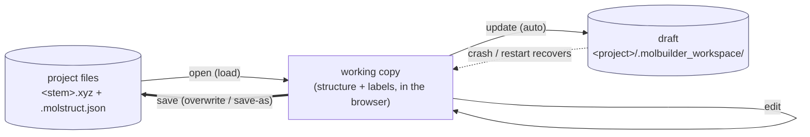
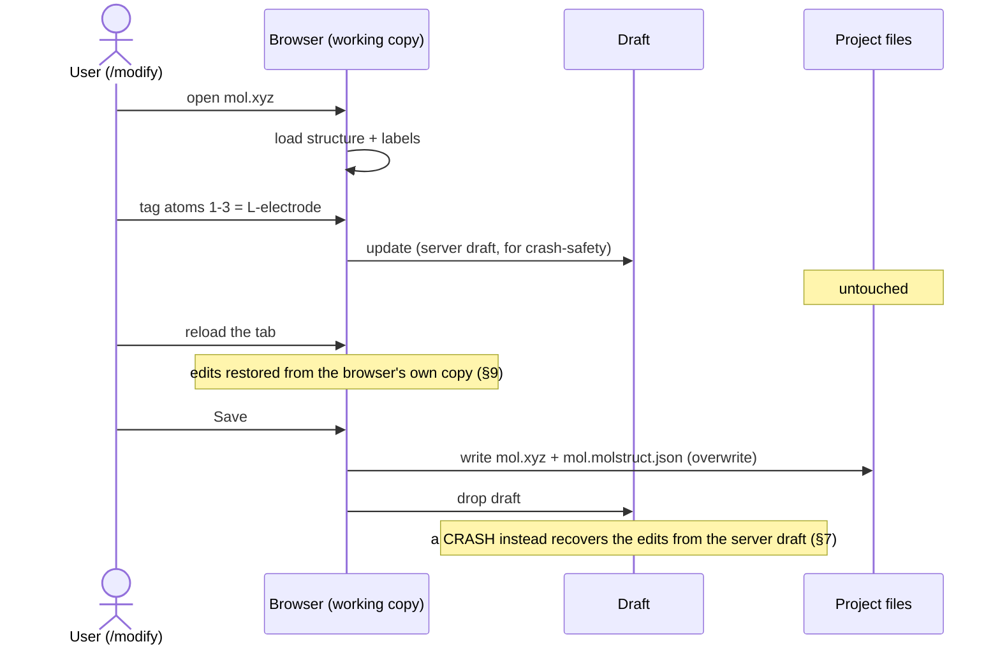

# Working-copy persistence — load, edit, save

> **ARCHIVED — merged into [`../workspace-contract.md`](../workspace-contract.md)
> (§4 + §4.6).** Kept for history only; the sole source of truth is
> workspace-contract.md. Relative links below point at the pre-move layout.

**Status: IMPLEMENTED (2026-07-02).** `molbuilder/workingcopy.py` (core, L1) +
`workingcopy_structure.py` (the `.xyz`+`.json` codec) + `web/blueprints/
workingcopy.py` (`/api/workingcopy/*`). Tested. **Not yet wired to the browser**
— the `/modify` tab still auto-saves the sidecar (that swap is the remaining
step).

**The whole idea, one sentence:**

> **Load an artifact into the browser, edit it, and write it back to files only
> when the user hits Save (overwrite, or save-as). A draft keeps unsaved edits
> safe across a reload or crash. That's it — no gate, no hashing.**

**Companions:** `data-vocabulary.md` §3.1–3.2 (atom index base + the sidecar's
engine-side `structure_hash`, which is unrelated to any of this). The `.xyz`+
`.json` application is `workingcopy_structure.py` (codec) + the `/modify` wiring
(§9); `browser-data-contract.md` is **superseded** (it described the old gate).

---

## 1. Goal & boundary

**Goal.** Give the editor two things it doesn't have cleanly today:
1. **Don't lose edits** on a reload or crash → keep a **draft** of the working
   data.
2. **Don't touch the project files on every edit** → write them **only on an
   explicit Save** (the current `/modify` auto-saves the sidecar on every label).

**This IS:** load → edit-in-browser → save (overwrite or save-as), plus a draft
for crash-safety. Format-agnostic — an application plugs in a **codec**.

**This is NOT:**
- a **gate / integrity check** — you own the data you loaded; a save just writes
  it. (An earlier version added a "did the file change underneath?" gate; that
  was solving a non-problem, because a save writes the whole self-consistent
  pair, so the on-disk file is simply overwritten.)
- **version history / undo** — one live working copy, not a version stack.
- **the artifact's format** — that's the codec.
- **multi-user / concurrent editing** — single-user, isolated.

---

## 2. The flow



- **open** reads the files into a working copy.
- **update** (on every edit) writes a **draft** — the *only* automatic write, and
  it goes to `.molbuilder_workspace/`, never the project files.
- **save** writes the project files (both, together): same path = overwrite, new
  path = save-as. Then the draft is dropped.

---

## 3. Worked example (the structure app)



---

## 4. The codec (the only format-specific part)

```
codec.load(source_path)   -> data              # read the file(s) into working data
codec.files(data, target) -> [(path, bytes)]   # the file(s) a save writes
codec.scratch_blob(data)  -> json              # how the working copy sits in the draft
codec.from_scratch(blob)  -> data              # inverse (reload / crash recovery)
```

The `.xyz`+`.json` codec: `load` reads the `.xyz` + its sidecar → a `Structure`;
`files` returns `[(<stem>.xyz, …), (<stem>.molstruct.json, …)]`. **The core never
learns what an atom is.**

---

## 5. The API

```
WorkingCopy.open(source, codec, session, project_dir)   # load
WorkingCopy.new(codec, session, project_dir, data)      # a fresh artifact (save-as on first save)
WorkingCopy.recover(draft_record, codec, project_dir)   # adopt a crashed session's draft
wc.update(data)                                         # edit -> draft
wc.save(target)               -> Path                   # write files (overwrite / save-as); drop draft
wc.discard()                                            # drop draft, write nothing
list_orphans / discard_orphan / clean_all               # crash-recovery housekeeping
```

`/api/workingcopy/*` is a thin wrapper: `open` · `update` · `save` · `discard` ·
`orphans` · `recover` · `clean`. Paths go through `_resolve_within_roots`.

---

## 6. Use contract

**An application MUST:** supply a codec; `open` on load, `update` on every edit,
`save` **only** on an explicit user Save, `discard` to abandon.

**An application MUST NOT:** write a project file outside `save`; auto-save on
every edit; delete a draft behind the user (only `save` success, session-end, or
explicit cleanup removes it).

Follow those and the two guarantees hold: **unsaved edits survive reload/crash**,
and **project files change only on an explicit Save.**

---

## 7. Draft & crash recovery

Unsaved edits are kept safe two ways:
- **Same-tab reload** → restored instantly from the **browser's own copy**
  (`sessionStorage`, part of the `/modify` wiring, §9) — no server round-trip.
- **Crash / server restart** (the browser copy is gone, or the session changed)
  → the **server draft** below is the backstop.

The server draft lives in `<project>/.molbuilder_workspace/<stem>.<session>.wc.json`
(a JSON envelope `{schema, source, session, ts, blob}`, written atomically on
each `update`), keyed by **session** (the server-side session — the login when
authenticated, else a stable per-server-run id for no-auth localhost). A crash
(or, for no-auth, a server restart) leaves a draft its session can no longer
clean; `list_orphans` surfaces them and the user **recovers** or **discards** —
the core never auto-deletes unsaved work or auto-adopts stale work. Otherwise
cleanup is on `save` or session-end (no time-based sweep).

---

## 8. Applications

| Application | `files()` writes | Codec |
|---|---|---|
| **Structure + sidecar** | `<stem>.xyz` + `<stem>.molstruct.json` | `workingcopy_structure.py` |
| *(future)* config / script | its file(s) | reuse this core unchanged |

---

## 9. Remaining work

Wire the `/modify` tab to it: hold labels in the working copy + `update` on edit
(which mirrors to the server draft, §7; label edits are already in-memory and
the sidecar is written only on explicit Save), and add an explicit **Save** /
**Save As** that calls `/api/workingcopy/save`. The browser may also keep a `sessionStorage` copy for
instant same-tab restore, but the server draft (§7) is what survives a crash.
