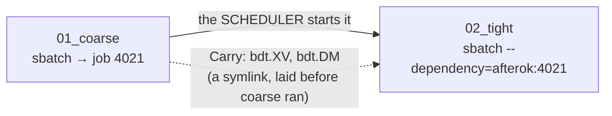
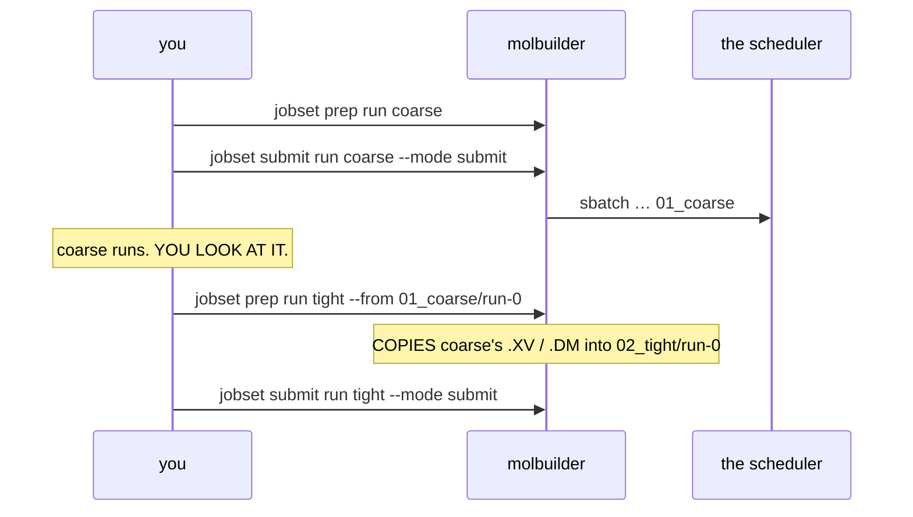

# Stage chaining — the retired design

**Archived 2026-08-10.** History, not policy. What replaced it is
`execution/project-layout.md` § 1.6 and `execution/job-system.md` § 2.

This is the **one** home for the retired vocabulary. It exists so the live
contracts can state what the system *is* without explaining what it stopped
being — and so that a reader who finds `depends_on` in an old bundle, an old
branch or an old note has somewhere to look it up.

---

## What it was

A ladder was a **chain**. `stages_to_jobset` gave each stage an edge to the one
before it, and the scheduler started stage N+1 when stage N finished.

Four mechanisms carried it:

| name | where | what it did |
|---|---|---|
| `Job.depends_on` | `jobset/model.py` | named the one job this job waited for |
| `Job.dep_kind` | `jobset/model.py` | `afterok` (only if the parent succeeded) or `afterany` (once it finished, either way) |
| `Carry(pattern, from_job)` | `jobset/model.py` | *take file X from job Y* — laid by `materialize` as a symlink into Y's directory |
| `carry_deref` | `runwrap.py` | replaced each carry symlink with a real local copy at run start |

Plus `--chain` on `jobset submit`, and `on_nonconvergence` in the SIESTA
producer, whose entire effect was to choose `dep_kind`.

**Three of those existed only to make the fourth safe.** A `Carry` symlink was
laid at `prep`, before the producing stage had run, so it pointed at nothing.
The scheduler dependency stopped the consumer starting while it still dangled;
`carry_deref` copied it locally so the engine, opening `bdt.DM` for writing,
could not follow the link and overwrite the producer's result.

---

## Why it was retired

**The reason is scientific, not technical.** Decided 2026-08-10 by the user:

> *"The chaining of operation should be manual for now… it is unpredictable
> between stages at this point. It is really difficult to justify that a later
> stage should automatically pick up the earlier stage, because without
> reviewing the result carefully and validating, we can't make that decision
> easily. Manual, explicit and controlled sequential execution is the right way
> to go."*

Whether stage 2 should start at all is a judgement about stage 1's result, and
no field in a description can make it. A stage is a long job: a chain that
continues by itself can spend a week refining a geometry you would have
rejected in a minute.

**An opt-in flag was considered and rejected in the same decision.** A flag is
typed before any stage has run — the moment you know least. The judgement
belongs *between* two stages, where the evidence is.

**A second finding forced the timing.** The mechanism's stated justification
had already become false: `job-system.md` § 2 kept it because *"a benchmark
sweep and an explicitly-chained workflow both still want them"*, and a sweep's
points are independent — `sweep_to_jobset` never emitted an edge. Once the
staged producer stopped emitting them too, nothing in molbuilder built a chain
at all, and the machinery was reachable only by hand-writing `job-set.json`.

---

## What superseded it

**A person prepares one stage, looks at the result, and prepares the next.**

**Three mechanisms became one copy.** The copy is made from an attempt that has
already finished, so nothing dangles and nothing needs guarding.

A job now declares `warm` — *what* it would take from a run it continues, and
the condition on each file — and never *from whom*. `Job.traits` carries the
values a condition is compared against (SIESTA puts its optimizer there, so a
conjugate-gradient history is not handed to a Broyden stage).

| this design | what replaced it |
|---|---|
| `Job.depends_on`, `Job.dep_kind` | nothing — a `JobSet` has no edges |
| `Carry(pattern, from_job)` | `WarmFile(name, requires_same)` + `--from` at prep |
| `carry_deref` | nothing — the file is real when it arrives |
| `--chain` | nothing — `submit run` names one stage |
| `on_nonconvergence` (SIESTA) | nothing — you decide when a stage runs out of steps. PySCF's is untouched and real: its ladder runs in one process, where the policy is ordinary control flow |

---

## Reading an old bundle

A `job-set.json` written before 2026-08-10 may carry `depends_on`, `dep_kind`
and `carry` keys. `Job.from_dict` reads only the fields it knows, so such a
file still loads and the edges are simply absent. Nothing converts them: the
run it would have continued from is named by a person at `prep`.
