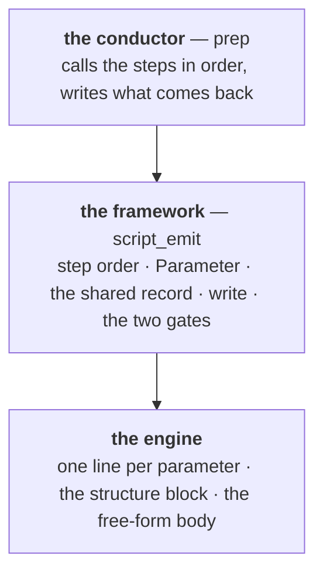

# The preparation backend — building step 3 new, and migrating onto it

**Role:** plan (**all five phases landed 2026-08-18; two carry-overs named in § 7**)
**Domain:** execution

**Companions — the contracts this plan serves:**
[`execution/script-preparation.md`](?doc=execution/script-preparation.md) — the
steps, the floors and the seam this builds;
[`execution/generator.md`](?doc=execution/generator.md) — the values it consumes;
[`engines/template.md`](?doc=engines/template.md) — the item model it reads;
[`science/validation.md`](?doc=science/validation.md) — the **validate** gate's rules;
[`execution/job-contracts.md`](?doc=execution/job-contracts.md) — the file
formats it must keep producing.

> **What this plan builds:** a new implementation of `prep` **step 3** — the
> twelve sub-steps that turn resolved values into a deck — and moves both engines
> onto it, deleting the old writer as each lands.
>
> **What it does not touch:** steps 1, 2, 4 and 5. The machine probe, the
> resolver, the wrapper and the tree are already engine-neutral and already work;
> rebuilding them would put `resolve` and `materialize` in two homes, which is the
> failure the contract set exists to prevent.

---

## 1. Why new code rather than a refactor

`render_fdf` is 1,168 lines and `render_script` is 770, with the twelve sub-steps
interleaved through both. Every in-place change is constrained by control flow
that predates the contract, and an in-place migration would carry the thing most
worth removing — **808 comment lines typed by hand across the three generators,
198 of them stating a number, with no way to tell a heading from a claim.**

**The invariant that makes this safe is not byte-compatibility with the old
output.** Reproducing the old bytes would preserve exactly the hand-crafting this
exists to end. What must hold is narrower and stronger:

| the new backend must | checked by |
|---|---|
| read the same files, from the same places | the contracts below |
| read them **through the one API each** | a test that no other door is used |
| emit no value except through `parameter()` | mechanically checkable — this is W2 |
| produce artifacts in the documented formats | `job-contracts.md`, existing tests |
| produce a deck that **runs and is scientifically right** | the e2e ladder |
| **read its own output back and refuse a bad one** | the **check** gate, per engine |

### 1.1 The input contracts — where things are, and the one door to each

| what it reads | where | the one API |
|---|---|---|
| the catalogue | `molbuilder/data/catalogue.template.toml` | `template.one()` · `template.select()` |
| this calculation's template | `<label>.template.toml` beside `task.json` | `resolve()` |
| the description | `task.json` | `task.read_task()` |
| warm-file vocabulary | `<engine>/warm-files.toml` | `warmfiles.load_warm_files()` |
| the machine | `environment.json` | `environment.machine_for()` |
| the structure | `<name>.xyz` + `.molstruct.json` | `workingcopy_structure.StructureCodec` |
| pseudopotentials | `projects/pseudopotential/` | `pseudos.resolve_psml_lib` · `check_coverage` |

**Nothing here changes.** The plan is bound to these; a change to any of them is a
change to its owning contract first.

---

## 2. The shape of the new API

**It is not greenfield from zero.** `script_emit.Parameter` and
`script_emit.parameter(name, engine, config=)` already exist and are already the
right object: they carry the declaration, and answer `.writes`, `.default` and
`.note()`. The framework is that seed grown to cover all of step 3, and it grows
**inside `script_emit`** rather than in a new module, because `script_emit` is
already the shared writer and already owns `write_script`,
`merge_user_custom_from_target` and the record blocks.

### 2.1 Who owns what

**The engine is asked three kinds of thing and no more:**

1. **syntax for one parameter** — `Key value` for SIESTA, a Python statement for
   PySCF. This is what makes W2 unavoidable: the engine cannot emit a value
   without being handed the `Parameter` that carries its reason.
2. **the structure block** — cell, species, coordinates, labels.
3. **the free-form body** — what no parameter models: PySCF's run loop,
   SIESTA's post-processing templates.

**Both doors are needed, and the evidence settles it**: PySCF's script is a
program, and its run loop, molwatch emitter and save helper are program structure
rather than parameters. A parameters-only seam would force them through the wrong
shape; a blocks-only seam would let a value reach a deck without its reason. So
the **parameters** step is per-parameter and the **engine body** is free-form, and the split between them is exactly
the line between *"a value the catalogue declares"* and *"everything else"*.

---

## 3. Phases

Each phase names what done looks like. **No phase begins until the previous one's
gate is green**, and each cutover deletes the old path in the same change — no
shims, no two writers for one engine.

| # | what is built | done when |
|:--:|---|---|
| **0** | ✅ the emission API contract — the layout table, the per-parameter syntax door, the two free-form blocks, and the one addition `parameter()` needs. [`script-preparation.md`](?doc=execution/script-preparation.md) § 4.2 | **landed 2026-08-18** |
| **1** | ✅ the framework alone — `Section` · `DeckSpec` · `RenderedDeck` · `render_deck` · `check_deck` · `prepare_deck` in `script_emit`, plus the derived-value door on `parameter()` | **landed 2026-08-18** — `tests/test_deck_runner.py`, 13 tests, four mutations of the framework's own promises each caught by the right one |
| **2** | **PySCF** on the framework, section by section; a seam entry; `convert` re-pointed | every emitted value traces to a declaration, and the BDT PySCF run converges |
| | ✅ **SCF settings** → `pyscf/layout.py::SCF_SECTION` — seven items | 2026-08-18 |
| | ✅ **functional · grid · density fitting · dispersion** → `DFT_SECTION` | 2026-08-18 |
| | ✅ **the seam entry** — `pyscf/stages.py` + `_engine_seam`'s pyscf arm | 2026-08-18 |
| | ✅ **geometry convergence** → `GEOMETRY_SECTION`; `_emit_stages_loop` retired; one rung, one `optimize()` | 2026-08-18 |
| | ✅ **the check gate runs** — `pyscf/layout.check_rules` on the seam, called by `prep` after write | 2026-08-18 |
| | ✅ **the effective-parameters record** — every parameter, three columns, read back off the live objects | 2026-08-18 |
| | ✅ **`convert` runs the check gate** — `prep` is not the only door that writes a deck | 2026-08-18 |
| | ✅ **`PySCFConfig.stages` removed** (roadmap L2) — with `StageSpec`, its three helpers and the stage-table's Python feed; the rung's own knobs are flat fields, and its tier values are `PYSCF_STAGE_PRESETS` | 2026-08-18 |
| **3** | **SIESTA** on the framework, section by section; `convert` re-pointed | the BDT ladder reproduces its science — `coarse` then `tight`, warm carry intact |
| | ✅ **basis & grid · exchange-correlation** → `siesta/layout.py`, byte-identical output | 2026-08-18 |
| | ✅ **SCF** (above the free-energy pair) | 2026-08-18 |
| | ✅ **output** — six booleans, both states | 2026-08-18 |
| | ✅ **the free-energy pair** — both states, notes from the declarations | 2026-08-18 |
| | ✅ **k-points** — reasons sourced from the catalogue | 2026-08-18 |
| | ✅ **check rules + `convert` checks** — duplicate keyword, identity, atom count | 2026-08-18 |
| | ✅ **MPI · geometry** — layout built per render, since both branch on the run mode | 2026-08-18 |
| **4** | ✅ **`render_wrappers` returns step 4's texts (P6)**; ✅ the shared-package namer (P3) | 2026-08-18 — W7 holds; the `*.psml` glob is gone from shared code |

### 3.1 Why PySCF first, and it is not convenience

**Building the framework on SIESTA first produces a SIESTA-shaped framework** — a
keyword-list abstraction that PySCF is then bent to fit. Doing the structurally
different engine first forces the abstraction to be real on the harder case.

It also has **zero blast radius**: PySCF has no seam entry today, so nothing in
`prep` can break while it is being built. And it carries the worst of the debt —
0 catalogue reads against 231 hand-typed comment lines.

PySCF already has what a seam entry needs except code: `warm-files.toml`
(`base` · `optimization` · `vibration`), `job_name`, and
`PYSCF_RESTART_GROUP(field="job_name")`. What is missing is a `pyscf/stages.py`
with `_traits` and `_warm_declaration` — SIESTA's are 15 and 40 lines.

### 3.1a The entry points survive; their bodies do not

`render_script` and `render_fdf` **stay** as the functions everything calls. What
is deleted is the hand-rolled emission inside them, one section at a time, as
each moves onto the layout-and-syntax doors. Twenty test files point at those two
names, and a phase that renamed them would be a rewrite of the test suite wearing
a migration's clothes.

**A section is migrated when its values come through `parameter()` and its
comments are the catalogue's.** That is checkable per section, which is what
makes this reviewable in pieces rather than as one 1,900-line swap.

### 3.2 What each cutover must re-point, not delete

`convert()` is a **second live door** into rendering — `cli.py` calls it to write
a PySCF script from a structure file, and tests use it. It becomes a thin caller
of the new framework. Deleting it would remove a shipped CLI path.

**`spectra` and `transport` are out of scope.** Their `render_script` is a
classmethod on their own engine base — a different function that happens to share
a name — and they are not in the seam. Whether they join this framework is a
later question, and it is not answered here.

---

### 3.3 The two gates, and what each phase owes them

**Validate** is the existing framework and does not move: `validation.validate`,
its `Issue` type, its severity model and its per-engine registry are reused as
they are. No phase rewrites it.

**Check** is new, and it is the one genuinely new capability in this programme.
Phase 1 builds its frame — read the written file, collect `Issue`s, report and
refuse — with the shared rules only. Each engine's phase adds its own rules, and
they are the engine's answer to *"what must a finished deck of mine satisfy?"*:

- **shared** — the reader's section present exactly once, the record banner
  present, and **every value the layout said to emit actually present in the
  text**, which is the check that closes the loop between what the parameters
  step intended and what the file says.
- **PySCF** — the file parses as Python. Three generated-script breakages this
  month were string-concatenation bugs that no test caught, and `ast.parse` would
  have caught all three at render time.
- **SIESTA** — `SystemLabel` matches the identity that was stamped; the atom
  count matches the coordinate rows; every species index used exists; **no
  keyword appears twice**, because libfdf takes the first and a duplicate is
  silently authoritative.

## 4. Tests

**49 test files** touch the two writers — 31 SIESTA, 29 PySCF. They are not one
kind and must not be treated as one:

| kind | what happens to it |
|---|---|
| asserts a **property of the artifact** — this keyword appears, this value travelled, this file was written | stays valid; it is the gate the new writer must pass |
| asserts the **old text's shape** — this exact comment, this line order | genuinely obsolete; retired, with the reason named |
| asserts a rule **no document states** | retired — `tests serve the contract` |

Each engine's phase classifies its own test files **before** the writer is
touched, and the classification is stated rather than performed silently.

**PySCF's classification, done 2026-08-18 — and the answer was better than
assumed.** Of the twenty files touching its writer, essentially all assert
properties of the artifact: an import appears, a coordinate row matches,
`mf.damp = 0.4` is live code rather than a comment. **Not one asserts a comment's
text**, so nothing had to be retired to move the SCF settings onto the doors, and
all 284 tests passed unchanged — which is the strongest evidence available that
the new writer emits what the old one did.

**The genuinely obsolete tests are elsewhere**: `test_pyscf_stages_e2e.py` and
part of `test_output_correctness.py` assert the in-script `for STAGE in STAGES:`
loop — the one-process ladder that
[`stages.md` § 1.1a](?doc=engines/stages.md) retired when it made a PySCF ladder
N decks and N jobs. They are the old contract, not the old text, and they retire
**with** `_emit_stages_loop` rather than before it, because deleting that loop
changes what a generated script does and is its own unit.

---

## 5. What this closes

The five open items in [`roadmap.md`](?doc=roadmap.md) § 6 are not a separate
programme:

| roadmap item | closed by |
|---|---|
| **P1** — floors | **done** (2026-08-18) |
| **P2** — `render_deck` answers five questions at once | phases 1–3 |
| **P3** — nothing names the shared package | phase 4 |
| **P4** — each engine assembles its own record tail | phase 1 (the tail becomes shared) |
| **P5** — PySCF has no seam entry | phase 2 |
| **P6** — `write_run_wrapper` writes its own file | phase 4 |

---

## 6. Risks, stated before starting

- **The engine knowledge in the old writers is real and hard-won** — the block-size
  window, the vacuum-cell derivation and wrapping, the dispersion templates, the
  stability block, the charged-deck promise. These are *behaviour*, not layout,
  and each must arrive in the new writer deliberately. The per-phase test
  classification is where that is checked; a green suite that only proves the new
  text parses would be the failure mode.
- **A phase that stalls half-migrated leaves two writers for one engine**, which
  is the two-homes failure. The mitigation is the phase boundary: an engine is
  either on the framework with its old writer deleted, or untouched.
- **`parameter()` covers only what the catalogue declares.** A value that is
  neither a catalogue item nor structure-derived has no home in the **parameters** step and falls to the
  **engine body**, where W2 does not reach. Any such value found during a phase is reported,
  not quietly written into the free-form body.

---

## 7. What landed short of the phase it was in

**The runner is the route now** *(2026-08-18)*. Both writers build **one**
`DeckSpec` and hand it to `render_deck`; the record tail is assembled in one
place instead of three; and each engine has **one** syntax door instead of
three and four. Thirty-two reference decks — both engines, across restart, MD,
spin, GPU, quiet, solvent, frequencies and single-point, with and without a
stage token — are byte-identical across the whole migration.

**Three things the migration exposed, each a cause rather than a symptom:**

- **The multiple syntax doors were why a deck needed many specs.** A `DeckSpec`
  carries ONE `line`, so sections needing different syntax could not share one.
  The framework was being worked around, and `render_deck` was unreachable as a
  result. Folding the doors is what unlocked everything else.
- **A block whose whole content is a blank line rendered as `""`** — falsy — and
  was dropped, losing the separator between two runs of settings. `Block` had
  always documented `None` as *nothing to say*; the walk was testing
  truthiness and conflating the two.
- **The framework claimed "a falsy title means no heading" and did not do it**:
  it called `section_title("")` and tested the result, so an engine that writes
  its own heading had to pass a suppressing `section_title` — which then
  prevented its other sections from sharing the spec.

### 7.1 The seam carries a form — closed 2026-08-18

`prepare_deck` — validate → render → write → check, the whole of step 3 — is
what every route that writes a deck now calls: `prep` and both `convert()`s.
**The order has one owner.** It was stated three times before, once per caller.

**What made it possible was making SIESTA's body lazy**, which is the shape
PySCF's already had: it renders when the framework walks the layout instead of
filling a list beforehand, so a `DeckSpec` can exist without rendering first and
can therefore cross the seam. The seam member is `spec_for` — *(structure,
config, stage_token) → DeckSpec* — in place of a callable returning text.

**The one genuinely general problem it raised, and the framework-shaped
answer.** A lazy body cannot hand values to the record blocks by closing over
its own locals: `BlockSize` is derived while the deck is written and the
provenance and bench-marks rows quote it afterwards. The answer is the
**per-render context** the engine already kept for its syntax door — *what the
deck derived* — now read by the record blocks too. No engine is special-cased;
an engine with nothing derived keeps an empty one.

**Two things fell out as dead and were deleted**: `EngineSeam.check_rules` (the
spec carries the rules), and the list of written keywords that used to ride
alongside the deck's text. Given the form, the framework re-derives what the
deck was supposed to contain, so nothing has to be carried to make the check
possible. **That list was never a piece of the design — it was the shape the
old seam forced**, and it went when the seam changed.

`render_fdf` and `render_script` survive as thin renderers over `spec_for`,
because twenty test files and two shipped routes point at those names (§ 3.1a).

**Thirty-two reference decks stayed byte-identical across every step of this** —
both engines, across restart, MD, spin, GPU, quiet, solvent, frequencies and
single-point, with and without a stage token.
