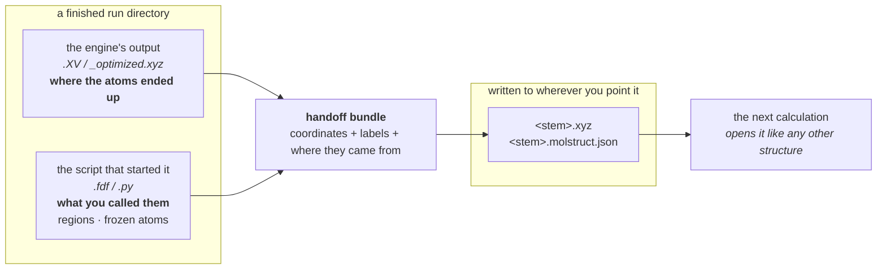

# RETIRED (2026-08-29) — the composite replaced the handoff bundle

**This whole contract retired with the calculation-to-calculation
passing it described** (user ruling 2026-08-29): one kind of job never
bundles itself up for another.  A calculation that builds on a
finished result CITES it — the transport composite names its junction
attempt explicitly (`plans/transport-design.md` § 4.1) and **prep does
the fuse** (`transport/compose.py`: parse the `.XV`, overlay the
labels, sort, gate) — richer than this bundle ever was, and inside the
job system.  The Results tab's "Bundle for next stage" card, the
`/api/results/bundle` endpoint, `BundleDirParser` and
`bundle_writer.py` are deleted; the one shared primitive
(`_extract_script_source`) lives on in
`parse/scripts/source_dict.py`.  Structure → execution hand-overs
(builder/modify → parameter tab → Task setup) are a different thing
and remain.

The original text follows, as history.

---

# The handoff bundle — carrying a finished run into the next calculation

**Role:** contract
**Domain:** execution

**Companions:**
[`execution/job-contracts.md`](?doc=execution/job-contracts.md) — the run
directory this reads from, and the ATOM-METADATA block it takes labels out of
(§ 3.4); [`model/parse.md`](?doc=model/parse.md) — the parser layer that
produces the object; [`model/structure.md`](?doc=model/structure.md) — the
`Structure` it carries; [`web/results.md`](?doc=web/results.md) — the button
that triggers it.

> **The word "bundle" means two different things in molbuilder, and this
> document owns one of them.**
>
> | | |
> |---|---|
> | **a handoff bundle** (this document) | one **finished run**, packaged so the next calculation can start from it |
> | **a bundle** (plain) | a **batch of jobs** produced together — the JobSet framework's folder, [`job-system.md`](?doc=execution/job-system.md) |
>
> They are unrelated. Say *handoff bundle* for this one, every time — the rule
> is `README.md` R5, and this document exists so the two never share a page.

---

## 1. The problem it solves

You have relaxed a molecule. Now you want to do something with the result — set
up a transport calculation, restart from the converged coordinates, take a
spectrum at the optimised geometry.

**The result is on disk, but the meaning is not with it.** The engine wrote
coordinates; it knows nothing about which atoms you called the left electrode,
which you froze, or what the run was for. Those live in the script that started
it. So the next calculation gets coordinates and loses everything you said
about them.

**A handoff bundle is those two halves, put back together and written out as an
ordinary pair of files** the next tab already knows how to open:



**Nothing new has to be taught downstream.** The output is an `.xyz` and its
sidecar — the same pair every load path in molbuilder already handles.

### 1.1 A worked example

A SIESTA relaxation of benzene-dithiol on gold finished in
`projects/BDT-Au/optimization/run-3/`. That folder holds `bdt_au.XV` (the
relaxed coordinates) and `bdt_au.fdf` (which recorded that atoms 0–11 are the
left electrode and 24–35 the right).

Ask for a handoff bundle into your transport folder, and you get:

```
projects/BDT-Au/transport/
├── bdt_au_relaxed.xyz              the RELAXED coordinates
└── bdt_au_relaxed.molstruct.json   regions: L = 0-11, R = 24-35 · frozen: []
                                    final_coords_from: "xv"  ← it converged
```

Open that pair in the Transport tab and the electrodes are already named. Had
the run **not** converged — no `.XV` — you would still get the pair, built from
the deck's starting coordinates, with `final_coords_from: "fdf-initial"` and a
note saying so. **It never silently hands you the wrong geometry;** it hands you
the geometry it has, and says which one that is.

---

## 2. What it is made of

It fuses three things:

1. the **final structure** (coords + elements) read from the converged engine
   output, with
2. the **labels** (regions, frozen atoms) from the originating script's in-body
   ATOM-METADATA (§ 3.4), and
3. **provenance** from that script.

Written to a destination, it produces an `.xyz` + `.molstruct.json` pair.

## 3. The object

Assembly returns a typed, frozen `BundleResult`
(`molbuilder/parse/types.py`; produced by
`molbuilder/parse/dirs/bundle.py::BundleDirParser.parse(run_dir)`):

```python
@dataclass(frozen=True)
class BundleResult(ParseResult):      # + base: schema_version, parsed_at, parser_name, source
    structure:         Structure                 # final coords + elements
    cell:              Optional[...]             # lattice, when present
    regions:           Dict[str, List[int]]      # 0-based; may be {}
    frozen_atoms:      List[int]                 # 0-based; may be []
    source_engine:     Literal["siesta", "pyscf"]
    source_script:     Optional[str]             # abs path to the .fdf / .py that fed extraction
    final_coords_from: Literal["xv", "fdf-initial", "py-opt", "py-initial"]
    block_schema_versions: ...                   # the ATOM-METADATA versions seen
    notes:             List[str]                 # never None; diagnostics
```

`final_coords_from` is load-bearing: it tells a consumer whether the bundle
reflects a **converged** optimization (`"xv"`, `"py-opt"`) or **fell back** to
initial coordinates because the optimization output was missing
(`"fdf-initial"`, `"py-initial"`). `notes` carries non-fatal diagnostics
(schema-version mismatch, fallback reason, missing provenance) and is always a
(possibly empty) list.

> **Naming reconciled to code:** the old contract called this `RunBundle` with
> `user_custom_lines` + `provenance` fields and a free `assemble_from_run_dir`
> function. The shipped object is **`BundleResult`** (user-custom and
> provenance live on the sibling **`ScriptResult`**, the per-script
> extraction), and the entry point is the class method
> **`BundleDirParser.parse`** (the free `_assemble_from_run_dir` is private and
> returns a dict).

The per-script extraction feeding the bundle is `ScriptResult`
(`ScriptSourceTextParser.parse`), whose fields distinguish three states on
purpose: `None` = block absent/unparseable, `[]`/`{}` = block present but
deliberately empty. The bundle-layer convenience `_extract_script_source(text)
→ dict` is re-exported for back-compat as
`molbuilder.script_emit.extract_script_source`.

## 4. Where each part comes from, and what happens when they disagree

**Final coordinates — first hit wins:**

| Engine | Source | Mark | When |
|---|---|---|---|
| SIESTA | `<SystemLabel>.XV` | `xv` | any run that wrote `.XV` (`SystemLabel` read from the in-body directive, not the filename); falls back to `<fdf-stem>.XV`, then to the sole `*.XV` in the directory (a `note` records the fallback; multiple `*.XV` are left ambiguous and drop to initial coords) |
| SIESTA | `.fdf` initial coords | `fdf-initial` | `.XV` absent/malformed — bundle still emits; `notes` records "NOT converged geometry" |
| PySCF | `<JOB>_optimized.xyz` | `py-opt` | geom-opt success (`JOB` read from the `JOB = "…"` line) |
| PySCF | `.py` initial atom-block | `py-initial` | `_optimized.xyz` absent — bundle still emits; `notes` records the fallback. Only the generator's whitespace atom-block is parsed; a hand-written list-of-tuple `.py` must be re-rendered through molbuilder first |

**Labels:** in-body ATOM-METADATA is authoritative; where a `.xyz` load has
both a sibling script *and* a `.molstruct.json`, **in-body wins** (§ 3.4).

**Conflict rules:** multiple scripts in a dir ⇒ pick the largest by atom count
(tie: lexicographic); both a `.fdf` **and** a `.py` present ⇒
`BundleError("dir contains both …; ambiguous")`; the script's
`n_atoms_total` not matching the final structure's atom count ⇒ `BundleError`
(no silent reconciliation). A left-handed cell (det < 0) assembles but adds a
loud `notes` warning (the check now lives in
`molbuilder/parse/dirs/_assembler_helpers.py`).

## 5. Writing it out, and the two errors

```python
def write_bundle_as_handoff(bundle, target_dir, *, stem,
                            overwrite=False) -> Tuple[Path, Path]:
    """Write <target>/<stem>.xyz + <target>/<stem>.molstruct.json."""
```

(`molbuilder/bundle_writer.py`.) Each file is written atomically (tmp + fsync +
`os.replace`, mirroring the sidecar writer); the **pair** is best-effort
(`.xyz` lands first, then the sidecar). With `overwrite=False` (default) it
raises **`BundleWriteError`** if **either** the `.xyz` or the
`.molstruct.json` already exists at that stem — stricter than checking the XYZ
alone, because overwriting a stale sidecar that points at a different XYZ would
corrupt the structure↔sidecar pairing invariant. (Note the two distinct
exceptions: `BundleError` for *assembly* problems, `BundleWriteError` for
*write* problems.) The `overwrite=False` check is not a lock: two writers
racing on the same target stem can each pass the existence check before either
writes, so the pair could land mixed (`.xyz` from one, sidecar from the
other). The per-file atomic rename keeps each file internally consistent, and
the sidecar's `structure_hash` lets the next loader detect the mismatch — but
a UI that writes a handoff SHOULD warn before targeting a stem that already
exists.

On schema: the reader accepts the **current version only** (the number rides
`sidecars/molstruct.SCHEMA_VERSION`; job-contracts § 3.4).  Anything else
raises `BundleError` ("re-render with current molbuilder") — the
v3-and-v4-with-a-notes-warning story that stood here described a removed
behaviour (F-6, 2026-08-13).

## 6. The two surfaces

- **Web** — the Results panel's "Bundle for next stage →" button posts to
  `POST /api/results/bundle` (`molbuilder/web/blueprints/results.py`); the
  frontend wiring is `lib/results/bundle-handoff.js`. The endpoint resolves the
  target inside the project sandbox and then navigates the sidebar to it so the
  new pair appears without manual refresh.
- **CLI** — `BundleDirParser.parse` + `write_bundle_as_handoff` are the same
  entry points a script or future CLI command calls directly.
