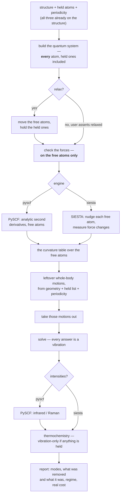

# Vibrations with held atoms — the design

> **Archived 2026-09-24 — a record, not policy.** Superseded by
> `engines/vibration.md` (the calculation's contract: routes, decks, the
> result file, the invariants, what is shipped and owed),
> `science/normal-modes.md` (the science) and `plans/plan.md` row V1 (every
> open item). Every decision, measurement and finding below was carried into
> those before this file moved; read it to see how a decision was reached,
> never to learn what is open.

**Role:** design — **Option A chosen** (user, 2026-09-21). § 18 is the order of work, **started 2026-09-23** at step 0; § 19 is what is still open, and what was decided that day
**Domain:** science · engines · web
**Started:** 2026-09-21 · **SIESTA half added** 2026-09-21
**The science it rests on:** [`science/normal-modes.md`](?doc=science/normal-modes.md)
(the contract — derivations, rules R1–R8, the measured BDT run)
**Open items:** registered as **V1** in [`plan.md`](?doc=plans/plan.md) § 2
**The follow-up list:** [`2026-09-24-vibration-audit.md`](?doc=archive/2026-09-24-vibration-audit.md)

Written to be read straight through by someone who has not followed the
investigation. Plain words throughout; where a formula is unavoidable it is
spelled out underneath. Nothing here has been built. § 7.5 is the order of work; § 7.6 is what must pass before the deck is touched.

---

## 1. Background — what happened

A user can open the Spectrum tab, tick two sulfur atoms as **frozen**, and ask
for an infrared spectrum. We ran exactly that, end to end through the web
interface, on 1,4-benzenedithiol — a benzene ring with an `–SH` group at each
end, 14 atoms. Twice at the same geometry: once with nothing held, once with the
two sulfurs held.

The held run returned **36 numbers**. Thirty-five were vibrations. The
thirty-sixth was this:

> the whole ring turning, as one rigid body, about the line joining the two
> sulfur atoms.

No bond stretches. No angle bends. The sulfurs sit *on* that line, so holding
them does not stop the turn. It costs no energy. It is not a vibration — and it
was in the spectrum.

We then asked what the codebase *believed*. Three places claim to know how many
such non-vibrations there are. They disagree with each other and all three
disagree with the measurement:

| where | what it says | truth |
|---|---|---|
| the deck that does the physics | *"All 3·N_FREE eigenvalues are physical"* | one of them is a rotation |
| the Methods paragraph generator | 30 modes | 36 produced, 35 real |
| the pre-run advisory | *"2-ish spurious modes"* | exactly 1 |

Three guesses, no source. That is the problem: **a fact about the physical world
with no home.** The same review found the same shape three more times — the
masses, the stationarity check, and the cost claim.

**And there is a second, larger gap.** The Spectrum tab offers exactly one
engine (`choices: ("pyscf",)`). For the project this tool actually serves —
a molecule bridging gold electrodes — that is the wrong engine, for reasons
§ 5 sets out. SIESTA's force-constant machinery appears **nowhere** in the
codebase, although `vibra`, the utility that turns force constants into modes,
is already installed in our SIESTA environment.

---

## 2. The goal

> **One description of what a vibration calculation does — which the free case
> and the held case, and the molecular engine and the periodic engine, all
> follow — so that a fact about the physics is written once and cannot drift.**

After this work:

- every number reported as a vibration **is** a vibration;
- the count is computed **once**, by the code that produced the numbers;
- a free molecule is the held case with nothing held, not a separate recipe;
- an isolated molecule and a periodic slab differ in **one stated input**, not
  in a second recipe;
- what a run costs, and what it approximates, is stated rather than implied.

---

## 3. Scientific foundation, in plain words

### 3.1 Why a free molecule has "3N − 6" vibrations

Give every atom three numbers — its x, y, z. N atoms means 3N numbers, and a
vibration is a pattern of changing them.

Some patterns are not vibrations. **Slide the whole molecule a centimetre to the
left**: nothing has changed, the energy is identical. **Turn the whole molecule
around**: same. Six of these — three slides, three turns — cost no energy, so:

```text
    vibrations  =  3N - 6
```

*(A perfectly straight molecule like CO₂ has five: spinning it about its own
long axis moves no atom at all, so that "turn" is not a motion.)*

In practice a program does not count — it **removes**. It writes the six motions
out explicitly and takes them out before solving. That is what PySCF does today
for every free-molecule run here.

### 3.2 What changes when you hold some atoms still

Hold some atoms, and ask which whole-body motions are still available.

> **Only the ones that leave every held atom exactly where it is.**

That sentence is the whole rule:

| you hold… | can you still slide it? | can you still turn it? | non-vibrations left |
|---|---|---|---|
| nothing | yes, 3 ways | yes, 3 ways | **6** |
| one atom | no — sliding moves it | yes, about that atom | **3** |
| two atoms | no | only about the line joining them | **1** |
| three in a row | no | only about that line | **1** |
| three not in a row | no | no | **0** |

**Our BDT run is row three** — one leftover, measured at −0.93 cm⁻¹ and
**100.0 %** that turning motion while all 35 others are 0.0 %.

**A gold slab is row five.** Freeze hundreds of atoms not in a line and there is
nothing left over. Which is exactly why the literature never discusses this:
everyone writing about held-atom vibrations is freezing a surface or a solvent,
where the answer is zero. Freezing one or two atoms of a molecule is two clicks
in our interface, and nobody wrote that case down.

### 3.3 What changes when the system is periodic — the SIESTA case

This is new, and it is what makes one rule serve both engines.

A periodic calculation — a gold slab repeating sideways forever — does **not**
have the same whole-body symmetries as a molecule:

- **Sliding still works.** Move every atom by the same amount and the crystal is
  the same crystal, shifted. The energy is unchanged. *(These are the three
  "acoustic" modes.)*
- **Turning does not.** The repeating box stays where it is. Rotate the atoms
  inside it and they no longer line up with their neighbours in the next box
  along — a different structure, a different energy.

So:

| the system | whole-body motions that cost nothing |
|---|---|
| isolated molecule | 3 slides + 3 turns = **6** *(5 if straight)* |
| periodic along **one** axis — a wire | 3 slides + the turn about that axis = **4** |
| periodic along two or three axes — a slab, a crystal | 3 slides = **3** |
| any periodic system **with any atom held** | **0** — sliding would move the held atom |

The rows are consequences; the rule behind them has no cases (§ 18 step 2): a
turn survives only if it maps every lattice vector onto itself — the
antisymmetric generators `A` with `A·a = 0` for every lattice vector `a`, which
is three of them with no lattice, one for a wire's single axis, none for a slab
or a crystal. Written as a table it got the wire wrong.

**The consequence for the junction work is a happy one.** A slab with its lower
layers frozen is the last row: **nothing** needs removing, and the spurious-mode
problem of § 1 simply does not arise. It is a *molecular* problem. But the rule
has to know which case it is in, and it learns that from the structure's own
periodicity — which molbuilder already records per axis.

### 3.4 Why you cannot just spot the bad mode afterwards

Three versions of "look at the answer and throw away what looks wrong". All
three measured, all three fail:

**"It will have a frequency near zero."** At a converged geometry, ours was
−0.93 cm⁻¹. Run the *same molecule* slightly off-geometry and the same turning
motion comes out at **96.78 cm⁻¹**, among real vibrations. Meanwhile genuine
floppy modes live at a few cm⁻¹ and any threshold catching one throws away the
other.

**"It will stand out by symmetry."** It does not. The mathematics guarantees
*every* mode is independent of every other — as true of a C–H stretch as of the
rotation.

**"It changes no bond lengths."** Real, but it is the *same test in disguise*,
and it degrades identically. The gap between the spurious mode and the nearest
real one:

| | converged geometry | slightly off |
|---|---|---|
| gap | 18× — a threshold works | **1.2× — unusable** |

**So: remove the motion before solving, do not detect it after.** A second,
independent reason: at the off-geometry the turning motion was 96.5 % in one
mode and **3.5 % spread across four others**. Delete the offender and that 3.5 %
stays, contaminating four real vibrations.

### 3.5 And one thing that must **not** be removed

Vester & Olsen (2024) studied a molecule in **frozen solvent** and found modes
that *look like* the molecule sliding and turning as a whole. They warn that
removing all six whole-body motions there is *"invalid"* and *"can adversely
affect other normal modes."*

**They are right, and the rule in § 3.2 already agrees.** Sliding a molecule
against frozen solvent **does** move the frozen atoms relative to it, so it
costs energy — a real, if soft, vibration (on a surface, a *frustrated
translation*, which is measurable). Frozen solvent is "three not in a row", so
the rule removes **nothing**.

The test is never "does this look rigid". It is **"does this leave every held
atom exactly where it is"** — and only then is the energy along it exactly zero.

### 3.6 Four more facts the design has to carry

| | the fact | what goes wrong otherwise |
|---|---|---|
| **held ≠ deleted** | a held atom is still in the quantum calculation; only its *coordinate* is fixed | you compute a different system |
| **where the geometry must be** | forces vanish on the atoms **that can move**; held atoms carry the force of being held, like a nail holding a stretched rubber band | you warn on correct geometries and stay quiet on wrong ones |
| **masses** | real masses (H = 1.008, not 1), modes scaled in atomic mass units | fixed 2026-09-21; had been putting infrared intensities out by **1823×** |
| **what it costs** | holding atoms makes the **second-derivative step** cheaper and the electronic step **no cheaper at all** — a 200-atom gold slab is still a 200-atom quantum problem | users freeze atoms expecting a cheap job and get a full-price one |

---

## 4. What is wrong with today's design

Not the individual mistakes — the shape that produced them.

> **The held-atom case is built as a separate branch beside the normal case.**
> *"If every atom is free, do this … otherwise, do that."* Two recipes writing
> into one results file.

**An analogy.** A kitchen with two written recipes: *soup for four* and *soup for
six*, written at different times by different people. Someone improves the
four-person one — better salt, a note about simmering — and nobody carries it
across. Eventually the six-person soup is under-salted and nobody notices,
because nobody cooks them side by side.

The two branches drifted in **four** independent ways, every one invisible in an
ordinary free-molecule run:

| what drifted | free branch | held branch |
|---|---|---|
| the mass table | real masses | whole numbers — 15 cm⁻¹ error, intensities 1823× out |
| whole-body motion | removes 6 | removes none, and says they don't exist |
| the mode count in the write-up | right by luck | wrong by 6 |
| the stationarity check | correct | asks about the wrong atoms |

The right shape is the other way round:

> **The free molecule is the special case** — the one where the held list is
> empty. And **the isolated molecule is the special case** of the periodic one,
> where the box is absent. Nothing in § 3 says "if nothing is held, do something
> different", or "if it is periodic, use a different recipe".

---

## 5. Two engines, and what each is for

### 5.1 The division

| | **PySCF** | **SIESTA** |
|---|---|---|
| what it suits | isolated molecules, small clusters | periodic slabs, surfaces, junctions |
| how it gets the curvature | analytic second derivatives | nudge an atom, measure the force change |
| frequencies + mode shapes | yes | yes, via the `vibra` utility |
| infrared / Raman strengths | yes | **not offered** — see § 5.3 |
| basis | Gaussian functions | numerical atomic orbitals |
| a gold electrode | must be faked as a finite cluster | its natural home |
| lands in | `spectrum/` | `frequency/` |

**That last row is a storage vocabulary, not an engine rule** (§ 14.3).
`frequency/` and `spectrum/` are two of the nine topics a person picks a folder
from, split by *what is computed* — frequencies and thermochemistry against
intensities — and nothing derives a topic from an engine: a PySCF run with
both intensity flags off belongs in `frequency/` by that description. The row
says where a typical run of each engine lands, not where a mechanism puts it.

### 5.2 Why SIESTA for the junction — the real argument

It is not that SIESTA is better. It is **consistency of the potential-energy
surface**.

A junction study is a chain: relax the geometry → find the vibrations → displace
along a vibration → compute transport. If the middle step is done by a different
program, it is done on a *different surface*: different pseudopotentials, a
different basis, possibly a finite cluster standing in for an infinite slab.
The mode you then displace along is not a mode of the system you compute
transport through.

Keeping it in SIESTA means the same pseudopotentials, the same numerical atomic
orbitals, the same functional, the same slab, the same k-point sampling —
relaxation, vibration and transport all on one surface.

**And the modes come out different, in the way that matters.** A mode of an
isolated BDT molecule is a mode of BDT. A mode of BDT-on-gold includes the
gold–sulfur interface stretching:

```text
      Au ⟷ S — C₆H₄ — S ⟷ Au
```

That interface motion is what modulates the electrode–molecule coupling, so for
a transport question it is the mode you actually care about — and an
isolated-molecule calculation cannot produce it at all.

### 5.3 Why infrared and Raman are *not offered* for SIESTA

The user's instruction is that these default off for SIESTA. The design takes
that one step further, for a reason the codebase already states elsewhere:

> *"a control that silently does nothing is a bad answer for a user"*
> — `lib/molview/ui.js`, on why a disabled button is not drawn at all

A checkbox that is present but ignored is worse than an absent one, because the
user believes they asked for something. So when SIESTA is the engine, **the
infrared and Raman controls are not drawn**, and the run's write-up says what it
computed rather than what it skipped.

This is a statement about *this tool*, not about SIESTA. Infrared intensities
are obtainable from SIESTA by other machinery (Born effective charges via the
Berry-phase polarization route). That is a different feature, and if it is ever
wanted it should be designed as one — not implied by leaving a PySCF checkbox on
the page.

---

## 5a. What every other code does — checked, 2026-09-21

Before choosing, we looked at whether anyone has already solved this, so the
design is not an invention where a borrowing would do. Four places checked:

**PySCF has nothing.** Not one of the eight entry points in
`pyscf.hessian.thermo` takes a frozen list, an atom list or a mask.
`harmonic_analysis(mol, hess, …)` reads the whole molecule and the whole
curvature table; there is no way to tell it atoms are held. Four phrasings
searched on its issue tracker — nothing. No such module in `pyscf-forge` or
`pyscf/properties`. Grepping the whole installed tree for
`partial_hessian|phva|frozen_atoms` returns nothing.

*(And the obvious trick fails instructively: give the held atoms a huge mass and
call `harmonic_analysis` anyway. It computes the centre of mass from those
masses, so the centre lands on the held atoms, and it then removes six motions
built around that centre. Six is wrong — for our BDT the answer is one, for a
held slab zero. That is exactly the published error of § 3.5.)*

**ASE does what we do.** ASE is the most widely used implementation of
frozen-atom vibrational analysis [ASE2017]. `Vibrations(atoms, indices=[…])`
displaces only the chosen atoms, and then:

```python
omega2, modes = np.linalg.eigh(self.im[:, None] * H * self.im)
```

Mass-weight, diagonalise, **no projection**, `3n` modes for `n` displaced atoms.
That is line for line our frozen branch. **So the hand-written code here is not
eccentric — it is the community standard**, and the leftover-motion problem is a
community-wide wart rather than a molbuilder bug.

**Others have hit the wart and bolted projection on.** There is a pull request
against an ASE-based toolchain titled *"Project translations/rotations out of
Hessians for all calculators"*, whose rationale matches what we measured: the
rigid-body modes otherwise stay in the frequency list *"contaminated by residual
gradients, grid noise or finite-difference error"*, and with projection they
*"vanish to machine precision"*.

**The literature says it from the physics side.** Ghysels *et al.*, comparing
partial-Hessian techniques: *"Although the PES is still invariant under the six
global translations and rotations, the zero eigenvalues corresponding to global
rotations may be lacking."* [Ghysels2010]

### 5a.1 What this changes

It **removes** the risk I first named. I had described Option A as replacing a
well-tested routine with ours. That comparison does not exist: PySCF's routine
only ever runs on the free case, where the answer is the ordinary six. **There is
no upstream frozen implementation whose correctness we would be second-guessing,
because there is none.** Writing this ourselves is not a preference; it is the
only option anyone has.

It **adds** a different risk, which is the honest one. Nobody's implementation
computes *how many* motions survive from the geometry of the held set:

| | what it does when atoms are held |
|---|---|
| ASE [ASE2017] | projects nothing — the leftover stays in the list |
| the ASE-based PR above | projects all six — right for a free molecule, **wrong** when atoms are held |
| Vester & Olsen [Vester2024] | identifies and removes after the fact, by character |
| **the rank rule of § 7.2** | computes the right number from the geometry: 6, 5, 3, 1 or 0 |

Ours is the only one that is right in every case — which is a claim to being
ahead of the field, and **novelty is its own risk**: no one else's testing covers
us. That is why § 7.6 puts the whole testing burden on the rank rule, and why it
must reproduce the textbook answer everywhere a textbook has one before it is
trusted on the case only we handle.

---

## 6. The options

### Option A — one path — **CHOSEN** *(user, 2026-09-21)*

One recipe. Inputs: the structure, which atoms are held, whether it is periodic,
and which engine computes the curvature. Empty held list gives the free case;
non-periodic gives the molecular case; the engine choice changes only *how the
second derivatives are obtained*, never what is done with them.

**For:** each fact written once, so it cannot drift. It is the only option where
the four defects are fixed by one change instead of four, and the only one a
second engine can be added to without doubling the surface again.

**Against:** the free-molecule path today calls PySCF's own projection routine,
with years of use behind it. Option A replaces that call with our own
generalisation. **That is the real cost** — not the held case, where we have
measurements, but the free case, where we would be changing what already works.

**What retires the risk:** our version must reproduce PySCF's answer on free
molecules to numerical noise — a bent molecule, a straight one, a single atom —
before the old call is removed. A test, not an argument.

### Option B — keep two branches, fix each

**For:** smaller; the free path is untouched.
**Against:** it leaves the mechanism that produced the drifts. There will be a
fifth; the only question is which fact and when. It cannot deliver "one formula
for the count", because there would still be two places counting. And adding
SIESTA to it means **four** branches.

### Option C — do nothing to the physics; warn better

**For:** cheapest; no result changes.
**Against:** it hands the user a spectrum containing a thing that is not a
vibration and asks them to find it. At the off-geometry case they *cannot*.
The thermochemistry still includes or excludes it on the sign of numerical
noise — worth about 3.8 kcal/mol in one measured case.

**Chosen: A**, with the free-case equivalence test as a precondition — § 7.6.

---

## 7. How it would work

### 7.1 The flow — the same for both engines



Only two boxes differ by engine, and both are *how the numbers are obtained* —
never what is done with them.

### 7.2 The leftover-motions step, in words

> 1. Write down the whole-body motions that cost this system nothing. For a
>    molecule: three slides and three turns. For a periodic system: three
>    slides, plus the one turn about the axis of a wire; none for a slab or a
>    crystal (§ 3.3).
>    These come from the atom positions alone — no chemistry, no bond list,
>    nothing the user supplies.
> 2. Throw away any combination that **would move a held atom**.
> 3. Of what survives, count how many actually move a free atom.

That count is the number of non-vibrations; those patterns are what gets removed.

**Why a "how many independent directions survive" calculation and not the table
in § 3.2:** the table has five rows, and five rows in code is five chances to get
one wrong — which is how we ended up with three disagreeing answers. The
calculation has no cases. The straight-molecule exception, the single-atom case,
the three-in-a-row case and now the periodic case all fall out of it.

**We checked this.** Implemented as described and run against every row:

```text
  ok  nothing held, ordinary molecule   6      ok  two held                1
  ok  nothing held, straight molecule   5      ok  three in a row          1
  ok  nothing held, a lone atom         3      ok  three not in a row      0
  ok  one held                          3      ok  one held, all in a line 2
  BDT free      -> 6  -> 36 vibrations      (the run produced 36 ✓)
  BDT S-held    -> 1  -> 35 vibrations      (the run produced 36, one spurious ✓)
```

### 7.3 Pseudocode

```text
INPUT   positions of all atoms
        which atoms are held        (may be empty)
        the structure's axis kinds  (per axis: periodic · isolated · transport)
        the curvature table over the free atoms   (from either engine)

STEP 1  build the whole-body patterns this system is allowed
          - 3 slides, always
          - the turns whose generator maps every lattice vector onto itself:
            3 with no lattice, 1 for a wire, 0 for a slab or a crystal
STEP 2  keep only combinations that leave every held atom exactly in place
          - nothing held        -> all survive
          - a slab held         -> none survive
STEP 3  drop any survivor that moves no atom at all
          - this is what makes a straight molecule give five, not six
STEP 4  remove the survivors from the curvature table
STEP 5  solve the table
STEP 6  report  (answers) = 3 × (free atoms) − (survivors)

EVERY answer out of STEP 5 is a vibration, so
  - the spectrum draws all of them
  - the thermochemistry sums all of them
  - nothing downstream needs a filter to protect itself
```

Those last three lines are the point. Today the thermochemistry protects itself
with *"skip anything imaginary, skip anything not above zero"* — and our
spurious mode was excluded **only because noise put it at −0.93 rather than
+0.93 cm⁻¹**. At +0.93 it would have added about **12.7 cal/mol/K** of entropy,
roughly 3.8 kcal/mol in the free energy, from a motion that is not a vibration.
A filter that works by luck is not a filter.

### 7.4 What a user would see change

| | today | after |
|---|---|---|
| free molecule, 14 atoms | 36 modes | 36 modes, same numbers *(must be proven, § 6)* |
| BDT, two sulfurs held | 36 modes, one a rotation | **35 modes, all vibrations** |
| BDT on a gold slab | not possible — no SIESTA engine | frequencies + mode shapes, nothing removed |
| the write-up | *"30 modes"* beside a run that made 36 | the number the run made |
| before running | *"2-ish spurious modes"* | *"1 leftover motion: a turn about the line through atoms 7 and 8"* |
| free energy | depends on the sign of noise | does not |

---

### 7.5 The implementation — one new piece, and four deletions

**The new piece.** One function, one job:

```text
    rigid_motions(positions, held_atoms, axis_kind, cell)  ->  the patterns to remove
    vibrational_modes(hessian, masses, positions, held_atoms, axis_kind, cell)
                                              ->  eigenvalues, modes, the patterns
```

Its length is `n_rigid`. It knows no engine, no config and no file format — it
takes numbers and returns numbers, which is what makes it testable without a
quantum chemistry calculation at all. It takes the structure's `axis_kind`,
never the boolean `pbc()` (§ 18 step 2): the boolean cannot say which axis
repeats, and the surviving turns depend on exactly that — and it takes the
lattice **vectors** too, because a wire's one surviving turn is about that
vector's direction, not about a Cartesian axis. **Built 2026-09-23** as
`molbuilder/spectra/normal_modes.py`: the second function is the one path —
the free-free block of the true Hessian, mass-weighted, diagonalised in the
complement of the removed motions, so exactly `3·N_free − n_rigid` modes come
out and nothing removed can come back (R2-R4 by construction). Both are
self-contained for splicing, and the gate carried them into the PySCF
environment as source text.

**One constraint on where it can live.** The projection happens *inside the
generated deck*, at run time, so this function has to travel into the deck the
way `dipole_derivatives` already does — spliced in as source text. That means it
must be self-contained: no module-level names it depends on, because those do
not travel. This is not hypothetical; it is the bug that was fixed on
2026-09-21 when a constant a spliced function referenced was left behind.

**Order of work.** Each step is finishable and checkable on its own:

| # | step | done when |
|---|---|---|
| 1 | build `rigid_motions` + its tier-1 tests — **done 2026-09-23** | every row of § 7.6 tier 1 passes, no engine involved (`tests/spectra/test_normal_modes.py`, 40 tests; three mutations each turn the right rows red) |
| 2 | **the gate**: prove it reproduces PySCF on free molecules — **passed 2026-09-23** | tier 2 matches to numerical noise (`tests/test_vibration_e2e.py::test_the_rank_rule_reproduces_pyscf_on_free_molecules`: water, CO₂, HF, methane at RHF/STO-3G; eigenvalues to 1e-8 relative, wavenumbers to 1e-4 cm⁻¹, water's and HF's mode vectors to 1e-6 in the mass metric) |
| 3 | replace the deck's two-branch analysis with the single path — **done 2026-09-23** | tier 3 passes: water with its oxygen held reports **three** vibrations through the whole described road (`tests/test_vibration_e2e.py::test_water_with_its_oxygen_held_reports_three_vibrations`: bend and two stretches, `removed_motions.count = 3`, every mode orthogonal to every removed pattern in the mass metric); the free runs unchanged |
| 4 | point the three counting sites at the produced mode list — **done** | the Methods paragraph's count is R2 from the one derivation before the run and the run's own list after it (`spectra/methods.py::_mode_count`); the emitter's fragment states one method with no count; the preflight says how many motions survive the freeze, from the same function |
| 5 | narrow the stationarity check to the free atoms — **done** | `max_force_eh_a` is over the free atoms (judged), `max_force_all_atoms_eh_a` beside it (recorded) |
| 6 | delete what is now dead — **done** | the list below is gone, with one transformation noted there |

**Step 2 is a gate, not a milestone.** If the rank rule does not reproduce
PySCF's free-molecule answer, nothing after it is built.

**What gets deleted** — this is the measure of success, because a unification
that adds code has not unified anything:

- the `if N_FREE == N_ATOMS: … else: …` branch in the emitter — the whole reason
  the four drifts were possible;
- `_mode_count`'s prediction arm **and** its `results=` arm — the first is wrong
  for held systems, the second never runs in production;
- `_is_linear` and its 5-versus-6 branch — the rank subsumes it, including the
  5-degree angle heuristic that stood in for a real test;
- the `6 - 2*len(frozen)` formula and the `len(frozen) in (1,2)` gate in the
  advisory;
- the thermochemistry's `has_imag` / `> 0` self-defence, which today is the only
  thing standing between a leftover rotation and the reported free energy.
  *(Done as a transformation, not a deletion: the `> 0` line is gone; the
  `has_imag` exclusion stays, because an imaginary mode has no harmonic
  partition function — and it is now STATED, as `thermo.n_imag_excluded`,
  never silent.)*

**What gets added to the report** (rule R7): how many motions were removed and
what each one was — *"1 leftover motion: a turn about the line through atoms 7
and 8"* — stated before the run is paid for, and again beside the results.

---

### 7.6 The test systems

The novelty is the rank rule, so that is where the testing weight goes. Four
tiers, the first two of which must pass before the deck is touched at all.

**Tier 1 — the rank rule alone.** No quantum chemistry: positions in, a number
out. Instant, deterministic, and it covers every branch of the physics. All of
these have been computed and agree:

| system | held | `n_rigid` | vibrations | what it proves |
|---|---|---|---|---|
| water | — | 6 | 3 | the ordinary case |
| CO₂ | — | 5 | 4 | straight molecules, with no linearity flag anywhere |
| a lone Ar atom | — | 3 | 0 | an atom does not vibrate |
| water | O | **3** | 3 | one held atom leaves all three turns |
| water | O + one H | **1** | 2 | two held leave one turn |
| **CO₂** | **both O** | **0** | 3 | ⚠ a five-row table says **1**. The free C sits *on* the axis, so the surviving turn moves nothing |
| **acetylene** | **both C** | **0** | 6 | ⚠ same trap, stronger: *every* atom is on the axis |
| NH₃ | three H | 0 | 3 | three held, not in a row, pins everything |
| slab (periodic) | — | 3 | — | no turns when the box does not turn |
| slab (periodic) | any atom | 0 | — | the junction case |
| **two waters, 20 Å apart** | **one of them** | **0** | 9 | ⚠ the published-error guard — see below |

The two ⚠ traps are the argument for the rank rule in one line: **a table of
cases gets them wrong, and the rank does not.** Neither is exotic — CO₂ with its
oxygens held is a thing someone would actually do.

**The water-dimer row is the guard against over-removing.** Two water molecules
20 Å apart, one held. Sliding the free one *does* move it relative to the held
one, so `n_rigid = 0` and **nothing is projected** — and the free water keeps six
soft, near-zero modes. Those are real: it is barely held, and they are its
hindered translations and rotations. A rule that removed six here would be
committing exactly the error Vester & Olsen published against [Vester2024]. This
test fails loudly if anyone ever "improves" the rule into a blanket projection.

**Tier 2 — the gate: equivalence with PySCF on free molecules.**

| system | modes | why this one |
|---|---|---|
| water | 3 | the canonical case |
| CO₂ | 4 | the 5-not-6 path |
| HF | 1 | the extreme — one mode, nothing to hide behind |
| methane | 9 | **degeneracies.** Where modes are degenerate the eigenvectors are only defined up to a mixing within the degenerate set, so the *frequencies* must match even though the vectors need not. A test that compared vectors would fail here for no good reason |

**Tier 3 — held systems, run end to end.**

- **water with the oxygen held** — the headline demonstrator (below);
- **acetylene with both carbons held** — the collinear trap, through the whole
  pipeline rather than just the rule;
- **NH₃ with the three hydrogens held** — three real modes of a single atom
  moving in a fixed cage, nothing removed;
- **an empty held list** — must reproduce the free path *exactly*, which is what
  makes "the free case is the held case with nothing held" a fact rather than a
  slogan;
- **the water dimer** — the guard, end to end.

**Tier 4 — regression on the real measurement.** BDT with both sulfurs held,
against numbers already in hand: 36 → **35** modes, the removed one overlapping
the S···S turn to 1.0000, the C–H stretches unmoved at 3703.7296 / 3711.6449 /
3725.2532 / 3728.4220 cm⁻¹, and the S–H pair still at 0.984673 of the free value.

#### The one system to demonstrate it with

**Water, with the oxygen held.** For a demonstration it is hard to beat:

- it runs in about a second, at any level of theory;
- it gives **six** numbers of which only **three** are vibrations — *half the
  output is not a vibration*, so a regression is unmissable rather than a
  0.9 cm⁻¹ detail;
- the three leftovers have an unambiguous physical identity: the two hydrogens
  swinging about a nailed-down oxygen. Each removed pattern can be checked to
  overlap a rotation about that oxygen to 1.000;
- the three survivors are the ones any chemist can name — symmetric stretch,
  asymmetric stretch, bend — so the answer is checkable without the tool;
- and it is the *worst* case for the "just look at the answer" ideas of § 3.4:
  with three of six spurious, no frequency threshold can separate them from the
  bend.

BDT-with-both-sulfurs-held stays as the realistic case, because it is the one a
user actually built through the interface and the one we have measured. Water is
what goes in the test suite and the documentation; BDT is what proves it on
something real.

---

## 8. The SIESTA half — what it needs, and the one hard constraint

### 8.1 What SIESTA does

Instead of differentiating the energy on paper, SIESTA **nudges atoms and
watches the forces**. Push atom 73 a hundredth of an Ångström in x, ask every
atom how hard it is now pushed, then pull atom 73 the same distance the other
way. The difference gives one column of the curvature table. Repeat for x, y, z
of every atom you want to move.

Those nudges **are not a vibration** — they are measuring probes. The vibration
comes afterwards, when the table is mass-weighted and solved.

Verified against the manual-derived keyword table in
`tests/validation/test_siesta.py` (§ 14.1: `strings` on the binary cannot settle
a keyword):

| what | keyword | note |
|---|---|---|
| ask for a force-constant run | `MD.TypeOfRun FC` | `PHONON` is retired — the binary says so |
| first / last atom to nudge | **`FC.First`** / **`FC.Last`** | *(this row said `MD.FCFirst` / `MD.FCLast` are "also accepted". They are **deprecated** in 5.4.2 and the same two gates refuse them — see § 14.1.)* |
| how far to nudge | **`FC.Displacement`** | *(this row said `FC.Displ`, with `MD.FCDispl` "also accepted". Both halves were wrong — see the correction below.)* |
| result | `SystemLabel.FC` | |
| turn it into modes | the `vibra` utility | **already installed** in `molbuilder-siesta/bin/` |
| save ∂H/∂R and ∂S/∂R | `FC.Save.dHS` | **present in our binary** — see § 9 |

*(Correction on the record: an earlier note in this session said `FC.First` was
wrong and only `MD.FCFirst` existed. `FC.First` is the current spelling and
`MD.FCFirst` its deprecated alias — from the manual-derived table in
`tests/validation/test_siesta.py`, **not** from `strings` on the binary,
which § 14.1 shows cannot settle a keyword question.)*

### 8.2 The one hard constraint: **`FC.First`/`FC.Last` is a contiguous range**

SIESTA nudges *atoms A through B*. It cannot be given a scattered list.

molbuilder's held atoms are a scattered list — whatever the user ticked in the
viewer. So the free atoms must occupy one unbroken run of atom numbers in the
`.fdf`, and in general they will not.

**Example.** A structure written with gold first and the molecule last —

```text
    atoms  1–72   frozen gold
    atoms 73–90   active gold
    atoms 91–110  the molecule          ->  nudge 73 to 110.   fine.
```

— is the lucky case. Tick one extra gold atom somewhere in the middle of the
frozen block and the free set is no longer one run, and there is no `FC.First`/
`FC.Last` that expresses it.

Three ways out:

| | what it does | cost |
|---|---|---|
| **refuse** | check before writing the deck; say *"the atoms that may move must be numbered consecutively; reorder the structure"* | honest, cheap, pushes work onto the user |
| **reorder** | write the `.fdf` with atoms permuted so the free ones are consecutive, and map results back | invisible to the user; needs the permutation to be a first-class fact, not a local trick |
| **over-nudge** | nudge the smallest range covering every free atom and discard the extra | simple, and wastes exactly the compute the feature exists to save |

**Reorder is the right answer, and it has a designated home already:
`transport/sort.py`** (§ 14.2). That module is `(Structure) -> (sorted
Structure, permutation)`, pure, both directions recorded, every index-carrying
field remapped through one map, a bijection check before it returns, and a
registered `atom-permutation.json`. What SIESTA needs is a **second sort key**
— free-versus-held instead of the four partition labels — over that machinery.
`engine_atom_index.py` is not the home: it is an affine offset table with no
per-structure state, and a permutation would break its invariant.

**And what a reorder may do is now a contract** — `model/overview.md` § 2.2
*(user, 2026-09-23)*: the program sorts a COPY at prep, records the permutation
both ways beside it, and every per-atom number that comes back is inverted
before a person sees it; the person's interfaces speak the input order; a
structure sorted for two reasons carries **one composed permutation, recorded
once**. The transport path, the results and the viewer all cross the
permutation, and that contract is what each of them reads. It is not the
largest piece of the SIESTA half; § 14.2 names that piece — the `vibra` rung.

---

## 9. The transport connection

This is why the SIESTA route is worth building, and it comes in two levels.

### 9.1 Level one — displace along a mode and look *(the cheap, immediate one)*

Once you have a mode, you do **not** move one atom at a time. You move the whole
structure along the mode's pattern:

```text
    positions(Q)  =  equilibrium positions  +  Q × (the mode's pattern)
```

Sweep Q from negative to positive and you get a series of real geometries — the
molecule caught at successive points of that vibration. Run transport at each
and you get how the current-carrying ability changes across one vibration:

```text
    Q < 0 :  Au–S shorter  ->  stronger coupling
    Q = 0 :  equilibrium
    Q > 0 :  Au–S longer   ->  weaker coupling
```

**The machinery for this already exists on the PySCF side.** The vibration deck
already displaces along each selected mode (`q ± A·L_n`) and records the
electronic structure at each point. The transport version is the same idea with
TranSIESTA at the end instead of an orbital window.

**One honest question it raises: how far is Q?** The mode tells you the *shape*
of the motion and its frequency, not how big the motion is. The physically
meaningful amplitude comes from the vibration's own quantum ground state and
grows with excitation roughly as

```text
    amplitude(n)  ∝  sqrt( n + ½ )        n = 0, 1, 2, …
```

so the ground state (n = 0) is *not* zero motion, and asking "what if this mode
is driven?" is asking for larger n. That makes the amplitude **a physical
quantity with one right answer**, not a knob — the same class of fact as the
mass table in § 3.6, and it needs one home for the same reason.

*(A caution worth writing down: before multiplying a printed mode pattern by an
amplitude in Ångström, we must establish whether the tool printed it
mass-weighted or in plain Cartesian units. That convention mismatch is exactly
the family of bug that put our infrared intensities out by 1823×.)*

### 9.2 Level two — the coupling itself *(the proper one)*

Rather than sampling many amplitudes, ask directly how the electronic
Hamiltonian changes per unit of that mode. `FC.Save.dHS` — **present in the
SIESTA we ship** — writes exactly the ingredients: how the Hamiltonian and
overlap change when each atom moves. Combined with a mode's pattern, that gives
the electron–vibration coupling for that mode, which is the systematic route to
inelastic tunnelling spectroscopy.

**Both references for this are already in our bibliography**, which is a good
sign this direction was anticipated: `Frederiksen2007` (inelastic transport from
first principles — the methodology behind the SIESTA-based tooling) and
`Galperin2007` (vibrational effects in molecular junctions). Neither is cited
from anywhere yet.

**Scope note.** Level two is a *research capability*, not part of unifying the
mode calculation. It is recorded here because it is the reason the SIESTA route
is worth its cost, and because it should not be discovered later that the design
foreclosed it. Level one needs only modes + a stated amplitude convention.

---

## 10. The cost question — **decided**, and its SIESTA twin

Holding atoms should make the job cheaper. In PySCF today it does not: the code
computes second derivatives for **every** atom and throws the held ones away.
Measured: 10.6 s free versus 10.1 s with 2 of 14 held — no saving.

The saving is real and normal elsewhere. Q-Chem's manual: *"only the part of the
Hessian matrix … is computed … a significant decrease in the cost."* **And PySCF
can do it** — its Hessian takes a list of atoms, and that list reaches the
expensive inner step, so asking for four atoms out of forty really does cost
about a tenth. *(Read from PySCF's source. Two cautions: the result is numbered
by position in the list you passed, not by the atom's own index; and no upstream
test exercises a partial list, so we owe ourselves a check against
compute-everything-and-slice.)*

**The catch, and the decision made.** The analytic infrared route does **not**
accept that list. So today: the cost saving *or* analytic infrared, not both.

| | speed | infrared |
|---|---|---|
| ask for the free atoms only | cheap, scales with free atoms | by nudging — slower for infrared, same answer |
| ask for everything | full price | analytic, nearly free |

**Decided (user, 2026-09-21): an option in the run setup**, with the run stating
which way it went. The default is still to pick — § 12.

**Built 2026-09-23, and what the check found.** With atoms held the deck
computes `hess_elec(atmlst=free) + hess_nuc(atmlst=free)` plus the
dispersion block cut to the free atoms (`kernel(atmlst=)` cannot be used:
its dispersion term is full-size), on a **plain mean field**, because
PySCF 2.14's density-fitted Hessian fails on a partial list
(`pyscf/df/hessian/rhf.py:216`, a shape mismatch). The artifact records
`hessian_scope`, `n_atoms_in_hessian` and `hessian_density_fit`. The owed
check against compute-everything-and-slice: **Hartree–Fock blocks agree to
1e-8 Hartree/Bohr²; DFT blocks to 7.5e-6 at grid level 4 (1.5e-5 at level
3)**, the difference entirely in the coupled-perturbed response part (the
static part agrees to 6e-14), unchanged by the solver's cycle cap; PySCF's
response tolerance scales with the number of atoms in a batch
(`rhf.py:330`), so the full calculation converges its response more loosely
than the partial one. About 0.03 cm⁻¹ on a stretch. No option was added:
holding atoms is what asks for the reduced calculation, and infrared with
held atoms goes by finite differences over the free atoms, the same
numbers by the other route.

**SIESTA has the same choice in a different shape**, and it is § 8.2: nudging
only the free atoms is where its saving comes from, and taking that saving is
what forces the contiguity question. Note that this choice does **not** exist for
SIESTA on the infrared side, because infrared is not offered there — so for
SIESTA the cheap route is simply the right one, once reordering is solved.

**Static review, 2026-09-24** *(user: "the result will be the result of
design; design review comes first")* — the scaling is read from PySCF 2.14's
Hessian code and recorded in `science/normal-modes.md` § 4b.2–4b.3, not
timed. On PySCF the coupled-perturbed solve (`solve_mo1`, `3·len(atmlst)`
perturbations) and the per-atom two-electron derivative contractions
(`_partial_hess_ejk`, `make_h1`, `shls_slice` on the atom's shells) run over
the free atoms; the SCF and the `int2e_ipip1` diagonal contraction run once
over every atom; and the DFT exchange-correlation derivative matrices
(`_get_vxc_deriv2`: `vmat = zeros((natm, 3, 3, nao, nao))`, `_get_vxc_deriv1`:
`(natm, 3, nao, nao)`, both looping `range(mol.natm)`) run over **every atom
whatever list is passed** — about 200 GB at 300 atoms and 3 000 basis
functions, which is the wall for the PySCF analytic DFT route long before
time is. On SIESTA the force-constant run is `1 + 6·n_A` whole-system force
evaluations and nothing all-atom-sized. **The consequence for the 300-atom
junction with 250 held: the SIESTA route is the one that scales; the PySCF
analytic route is for molecules of tens of atoms, or Hartree–Fock.** The
timing probe of 2026-09-24 was a hand-written script outside the jobset road
and is withdrawn; R8 now reads a cost claim from the code, and no timing is
owed for the statement above.

---

## 11. Risks, and what retires each

| risk | how it is retired |
|---|---|
| our projection differs from PySCF's on free molecules | prove equality on a bent, a straight and a single-atom case **before** the old call goes. Precondition, not follow-up |
| held-atom results change, so old and new runs disagree | true and intended — the old ones contain a non-vibration. Worth a note in the release |
| removing a motion at a not-perfectly-relaxed geometry | legitimate, and what PySCF already does for free molecules: whole-body motions are known not to be vibrations, so any energy along them is an artefact |
| over-removing, as Vester & Olsen warn | structurally impossible here — § 3.5. A motion is removed only if it leaves **every** held atom exactly in place |
| PySCF's atom-list Hessian is untested upstream | check against compute-everything-and-slice on a small molecule first |
| SIESTA reordering corrupts atom identity | `transport/sort.py`'s machinery with a second sort key (§ 14.2), under `model/overview.md` § 2.2's rule; round-trip test: structure → fdf → parsed results → original numbering |
| the mode-pattern normalisation convention differs between engines | establish it per engine **before** any displacement is built on it — § 9.1 |
| SIESTA keyword spellings differ across versions | read from the shipped binary, as § 8.1 was. Re-check on any SIESTA upgrade |

---

## 12. What this does *not* change

- **Nothing about how a user says which atoms are held.** They label atoms on
  the structure; the label travels with it. Untouched.
- **Nothing about the electronic calculation.** Held atoms stay in it.
- **No new question is asked of the user.** The tool computes what it is given.
  *(An earlier draft proposed a "how many layers should move" study. Withdrawn
  2026-09-21 — the structure already carries the answer, and comparing two
  freeze depths is two structures and two runs, which works today.)*
- **Level two of § 9 is not in scope.** Recorded so it is not foreclosed.

---

## 13. To decide

1. ~~**Option A, B or C**~~ — **DECIDED 2026-09-21: Option A**, one path, with
   the free-case equivalence proof as a gate (§ 7.5 step 2). The reason changed
   during the discussion and is worth recording: the risk is *not* "replacing a
   well-tested routine with ours", because **no upstream frozen implementation
   exists** (§ 5a). The real risk is that the rank rule is ahead of every
   published implementation, so nobody else's testing covers it — which is why
   § 7.6 puts the weight there.
2. ~~**The default for the cost/infrared option**~~ — **DECIDED 2026-09-23:
   analytic stays the default.** It is today's behaviour, so nothing changes
   for existing runs; the cheap route (the free-atom `atmlst` Hessian with
   nudged infrared) is the opt-in, and the run states which way it went.
   **Neither the opt-in nor the statement is built** (§ 18 step 4a). What
   the deck does today, exactly: the constrained relaxation holds the atoms
   (geomeTRIC `$freeze`); PySCF's analytic Hessian is computed for **every**
   atom at full cost; the held rows and columns are removed afterwards (the
   free–free block of the true Hessian); the surviving whole-body motions
   are projected out; the block is diagonalised. Freezing shortens only the
   Raman and finite-difference infrared loops, which run over the free atoms.
   The gate's advisory that promised a Hessian saving from freezing was
   false under R8 and was corrected the same day.
3. ~~**The SIESTA contiguity answer**~~ — **DECIDED: reorder**, through
   `transport/sort.py`'s machinery with a second sort key (§ 14.2), under the
   atom-index contract of `model/overview.md` § 2.2 (user, 2026-09-23).
4. ~~**Sequencing**~~ — **DECIDED: the unification lands first**, SIESTA on
   top of it (§ 18). Two branches plus an engine is four branches.
5. ~~**Whether to measure the stationarity false alarm first**~~ —
   **MEASURED 2026-09-22**, § 15.2: four of five held cases warn falsely.

---

# PART II — THE 2026-09-22 REVIEW, AND THE REVISED ORDER

Four full-text reviews, one per layer: the physics and the generated deck; the
`spectra/*` domain layer; the data path from writer to browser; and the
dual-engine gap. Each read its scope end to end, cross-checked against the
contracts by section, and measured on fixtures. Two of them **executed real
decks** under `molbuilder-pySCF`. `projects/` was not read.

**Verification.** Every finding below was re-checked by the primary session
before entering this plan. Two agent claims did not survive and are excluded.
Two errors in Part I are mine and are corrected here rather than quietly.

---

## 14. Three things Part I got wrong

### 14.1 `FC.Displ` is not a SIESTA keyword *(§ 8.1's table, corrected)*

The real spelling is **`FC.Displacement`**. `MD.FCDispl` exists but is
**deprecated** in 5.4.2, and this repo already enforces that: the
manual-derived `SIESTA_542_DEPRECATED` table maps `MD.FCDispl →
FC.Displacement`, and two gates refuse a deprecated keyword — one over the
rendered deck, one over the catalogue. So the row as written would fail the
suite on its first commit, *and* the spelling it recommends would be silently
dropped by SIESTA:

```
_norm("FC.Displ")        -> fcdispl            <- matches nothing
_norm("FC.Displacement") -> fcdisplacement
_norm("MD.FCDispl")      -> mdfcdispl
```

SIESTA has no unrecognised-keyword diagnostic (`archive/2026-07-28-decisions-log.md`),
so a deck written to the old row would run at SIESTA's own default
displacement with no warning — the `MD.NumBroydenSteps` failure class that
cost a 444-atom allocation in June.

**And the heading over that table said "Verified against the SIESTA binary in
our own environment." It was not.** A caution for whoever extends it:
`strings` on the binary is not a keyword list — the fdf keyword table is
concatenated without separators (`FC.FirstMD.FCFirstMD.FCfirst…`), so a
substring match "confirms" any prefix. `FC.Displ` matches inside
`FC.Displacement` four times. The reliable sources are the manual-derived
table in `tests/validation/test_siesta.py` and `parse/fdf.py::_norm`.

*(Part I also named two further keywords, `FC.dHdR.Tolerance` and
`FC.dSdR.Tolerance`, as "attested". **Withdrawn**: the only source was
`strings` on the binary, which the paragraph above shows cannot settle a
keyword question, and they appear nowhere else in this repo. Settled by the
5.4.2 manual source, the same place `SIESTA_542_DEPRECATED` came from.)*

### 14.2 The permutation's home is `transport/sort.py`, not `engine_atom_index.py` *(corrects § 8.2)*

§ 8.2 called reordering *"the single largest piece of work in the SIESTA
half"* and pointed it at `engine_atom_index.py`. That module is an **affine
offset table** — three functions returning `i ± base`, one integer per engine,
whose stated invariant is that *"its two directions can never disagree because
they derive from the same base"*. A permutation is a per-structure fact with no
base. Putting it there would change the module's kind and break the invariant
its tests bind.

`transport/sort.py` already does the whole job, for the same reason —
TranSIESTA's `elec-pos` also *"demands consecutive atoms"*. It is
`(Structure) -> (sorted Structure, permutation)`, pure, with **both**
directions recorded, every index-carrying field remapped through one map, a
bijection check before it returns, a registered `atom-permutation.json`
sidecar, and a hard-won comment about which fields a reorder must restate
(*"This was a hand-list of fourteen, and the two it did not name were
`cell_origin` and `info`"*).

**So the cost estimate was inflated.** What SIESTA needs is a **second sort
key** — free-vs-held instead of the four transport partition labels — over
built, tested machinery, plus a decision about composing two permutations when
a junction is sorted for TranSIESTA *and* for FC contiguity. The artifact
registry row is worded transport-specifically and needs widening.

**The genuinely large piece is elsewhere, and Part I did not name it: the
`vibra` rung.** `vibra` has its **own, older fdf reader**, not SIESTA's. It
requires `SystemLabel`, `NumberOfAtoms`, `LatticeConstant`, `LatticeVectors`
(or `LatticeParameters`), `SuperCell_1/2/3`, `BandLines` + `BandLinesScale`,
and `Eigenvectors`. Its coordinate reader accepts exactly four formats and
names them in its own error path — `NotScaledCartesianBohr`,
`NotScaledCartesianAng`, `ScaledCartesian`, `ScaledByLatticeVectors` — and
molbuilder writes `AtomicCoordinatesFormat Ang`, which is **not among them**.
So "one deck, two binaries" (the `program=` trick that works for `tbtrans`)
is **not available**: tbtrans shares SIESTA's reader, `vibra` does not. This
needs its own rendered deck or a coordinate-format change, plus its own
catalogue rows and its own `.bands`/`.vectors` parser. *(One string-table
inference, marked: a string table is not a parse tree. Settled by running
`vibra` against a molbuilder deck and reading the `recoor:` echo.)*

**Settled by running it (2026-09-23): there is no `vibra` rung.** `vibra`
was run against a molbuilder deck and its `recoor` refused the coordinate
block twice (*"not enough values in Coords line"* after the format was
changed to one it names). Nothing it computes lies outside the one path, so
the `.FC` file is read on the host and the modes come out of
`spectra/normal_modes.py` (§ 7.5; § 18 step 5). The second key is built —
`sort_by(struct, "held-first")` over the shared `apply_order`, the key
recorded in `atom-permutation.json` — and the composition of two
permutations (a junction sorted for TranSIESTA *and* for FC contiguity)
stays open: no calculation asks for both today.

### 14.3 § 5.1 reads an output split as an engine split

`frequency/` vs `spectrum/` is real (`projects.py:376-388`) but it is a
**nine-name storage vocabulary the user picks a folder from**. Nothing derives
a topic from an engine or a calculation kind, and there is no `frequency`
calculation *kind* — the kinds are optimization / vibration / transport. The
split is by **what is computed** (frequencies + thermo vs intensities), not by
which engine computed it: a PySCF run with both intensity flags off belongs in
`frequency/` by that description. § 5.1's *"the split the tool already
believes in; only the code never caught up"* is wrong in a way that will send
an implementer looking for a topic-selection mechanism keyed on the engine.
And `spectrum/`'s README is the one that promises `.spectra.json`.

---

## 15. What the reviews found in the code — blocking, in order of what it costs

### 15.1 The frozen path removes nothing, and the modes it invents are the loudest bands — *FIXED 2026-09-23 (§ 18 step 3)*

**R3** says *"Both paths remove the surviving whole-body motions before
diagonalising … never differ in whether the removal happens."* The frozen arm
slices, mass-weights and calls `eigh` — no projection — under an emitted
comment asserting *"All 3·N_FREE eigenvalues are physical."*

**Measured, shipped deck, executed.** Water with the oxygen held,
RHF/STO-3G, IR on:

```
mode 1   f=   15.7 cm-1   IR=   0.0 km/mol
mode 2   f=   19.4 cm-1   IR=  62.5 km/mol
mode 3   f=   23.7 cm-1   IR= 151.5 km/mol
mode 4   f= 2088.0 cm-1   IR=   6.0
mode 5   f= 4054.0 cm-1   IR=  45.1     <- the real O-H stretch
mode 6   f= 4236.5 cm-1   IR=  32.9
```

Modes 1-3 are the three rotations about the held oxygen. **The two strongest
bands in the emitted infrared spectrum are rigid-body rotations** — 151.5 and
62.5 against 45.1 for the real stretch. Rotating a polar molecule turns its
dipole, so `|dμ/dQ|²` is largest for exactly the modes that are not
vibrations.

**And § 5's detection cannot catch them.** None is flagged `has_imag`; none is
near zero. 15.7-23.7 cm⁻¹ is a real far-infrared window.

The eight-case table, measured: three free cases right (because **PySCF**
decides 6/5/3 numerically, not molbuilder); two held cases wrong (water/O
held reports 6 where R2 gives 3; water/O+H reports 3 where R2 gives 2); three
held cases right **by accident**, because `n_rigid = 0` and nothing was to be
removed — including both of § 3's collinear traps.

**Thermochemistry, same run:** 20.1 cal mol⁻¹ K⁻¹ of entropy at 300 K,
essentially all of it from the three non-vibrations — **−6.0 kcal/mol in −TS**.
The audit's 12.7 cal/mol/K was one mode on a coin-flip; with one atom held
there are three rotations and three coin-flips, and this run lost all three.

### 15.2 The stationarity check false-alarms on every converged constrained minimum — *FIXED 2026-09-23 (R5 in the deck)*

**R5** says the check *"looks at the forces on the **free** atoms."* The code
is `_maxf = float(np.abs(_g0).max())` — all atoms.

**Measured**, water with O + one H held, relaxed to the deck's own gmax:

| | Eh/Bohr | vs the 4.5e-3 threshold |
|---|---|---|
| all atoms — what the code reads | **3.35e-02** | 7.4× over → **warns** |
| free atoms — what R5 says | **7.01e-05** | 64× under → silent |

CO₂ with both O held is starker: 7.2e-02 against **3.9e-14** — a ratio of
1.9e12, as converged as arithmetic allows, and the check screams. Four of five
held cases produce the false warning, and it is written into
`relaxation.warning`, so it reaches the web UI. The ordinary frozen-slab
workflow is told its geometry is wrong every time, which teaches users to
ignore the one warning that would matter.

### 15.3 Two free energies, 11.73 kcal/mol apart, under one label

The thermo headline uses PySCF's full RRHO (electronic + translational +
rotational + vibrational); the temperature **grid** the viewer plots computes
vibrational-only at every point. One `note` field labels both *"full RRHO
(rot+trans+vib)"*. Measured, free water: headline G = −74.95926467, grid G at
300 K = −74.94057624. **ΔG = +11.73 kcal/mol, ΔS = −45.28 cal/mol/K**, at a
temperature exactly on the grid.

### 15.4 `equilibrium.positions_ang` is the pre-relaxation geometry

`ATOMS` is emitted from the input structure and never rebound after the
relaxation, while `COORDS_EQ_ANG` is. Measured: 0.0488 Å from the geometry the
Hessian was actually taken at, on a 0.96 Å bond. The eigenvectors in the same
record belong to the relaxed geometry; the coordinates do not — and the deck's
comment says the viewer animates modes from this field.

### 15.5 Periodicity never reaches the vibration path — *CLOSED 2026-09-23: refused at the gate*

`axis_kind`, `pbc` and `cell` appear **nowhere** in the two vibration modules
or `validation/spectra.py`. `_emit_build_mol` always emits `gto.M(...)` — a
molecule in free space. A periodic structure silently becomes a cluster
calculation, and on the all-free path `harmonic_analysis` then removes **six**
motions where § 3.1a says **three** — the over-removal § 3.1a explicitly
warns against, arriving because the box was dropped.

### 15.6 The spliced sidecar writer drops three invariants

`emit_save_helper` takes its payload from the codec — correct — and then
serialises it with `open(..., 'w')` and `_mb_json.dump(_side, fh, indent=2)`:
no `encoding`, no `ensure_ascii=False`, no `allow_nan=False`.

**Three corrections to this section, 2026-09-23.** It was written from a
reference scan and overstated on all three counts.

1. **Only `ensure_ascii=False` is live.** Measured: the codec keeps `α-helix`
   literal, the spliced copy escapes it.
2. **"writes bare `NaN`" is FALSE.** The payload is spliced as
   `f"_MB_SIDECAR = {sidecar!r}"` — a **Python-literal** channel, not JSON.
   `repr({'a': float('nan')})` is `{'a': nan}`, and `nan` is not a Python
   name, so the deck dies at **import** with `NameError` and `_mb_json.dump`
   is never reached. A different failure, and a loud one.
3. **`encoding=` is not reachable at production call sites** — all four pass
   fixed ASCII comments, and with `ensure_ascii` defaulting True the JSON is
   pure ASCII. It goes live the moment (1) is fixed, so the two must move
   together.
4. **The sibling writer is in another module.** `_emit_atomic_writer` is in
   `pyscf/vibration_emitters.py`, called from `vibration_deck.py`;
   `pyscf/input.py` holds no atomic writer. "Same file" was wrong.

**SUPERSEDED as a separate fix — see `plans/2026-09-22-unification-audit.md`
§ 1.1a.** All of the above is one symptom of a single cause: `StructurePair`
returns `document: str` (rendered) beside `sidecar: dict` (not rendered), so
every consumer finishes the serialisation itself and this is the third
consumer doing it differently. The resolution (user, 2026-09-23) is to render
both halves in `pair()` and hand the deck the codec's own JSON text, splicing
`molstruct.dumps` for the re-emit. Fixing the settings here instead would
leave a third serialiser in place, which `model/structure.md` § 2.4 forbids.
**Do not fix this section's items independently.**

### 15.7 The Methods prose states the method two ways, and the rule four times

Two consecutive sentences in the shipped paragraph, both citing
`[Komornicki1979]`: *"analytic polarizability derivatives"* and *"central
finite differences"*. The emitter's own comment says the analytic claim
*"overstated the method"* — the fix landed in the restatement and never swept
back. Structural cause: `SpectraResults` records `ir_route` and has **no
`raman_route`**, so the run cannot report how Raman was obtained.

Separately, *"an anchored system neither translates nor rotates"* — the false
rule § 8 retracted — is restated in **four** places including the `note` a
user reads in the results. And *"over the free atoms only"* is false: the full
N×N Hessian is solved and the rows discarded, which is **R8**.

---

## 16. What the reviews found in the API — the dual-engine shape

### 16.1 The structural answer

**Every piece of engine-agnostic physics in this path exists only as Python
string text inside `_emit_*` functions of `molbuilder/pyscf/`.** A SIESTA path
cannot call any of it; it would have to re-emit the same text from a
`molbuilder/siesta/` module — R1's defect one level up, in the emitters
instead of in the counts.

The module states the right pattern in its own docstring — *"A DERIVED rule
that has a BRANCH lives as a callable function and is spliced into the script
from its own source"* — and applies it to exactly two things: `homo_index` and
`dipole_derivatives`. **Those are the two that take engine objects.**
Everything that takes only arrays — the partial-Hessian solve, the imaginary
convention, the IR projection, the Placzek scalar, the vibrational thermo, the
free/frozen bookkeeping — is text. That is exactly backwards from what a
second engine needs.

### 16.2 The result shape cannot carry a SIESTA result honestly

`results.py` claims *"engine-agnostic … Adding a future engine (SIESTA, …)
does not change this surface."* Three **required, no-default** fields are
molecular orbitals. Measured: an otherwise-complete SIESTA-shaped payload is
refused three ways, and accepted only with a **fabricated** one-entry MO array
claiming orbital 0 is the HOMO. Neither field has any consumer. § 4a.6 says
the SIESTA path computes *"frequencies and mode shapes only"*, and § 3.1a that
a periodic system has a Fermi level, not a HOMO.

Both eigenvector conventions are also de facto required, and
`eigenvector_display` — the derived form every animation is drawn from — has
**no row** in § 9b, the table that exists so *"a new number cannot ship
undocumented"*. An engine emitting one convention is refused with a message
naming `eigenvector_free`, a field deleted at schema v3.

### 16.3 The kind's science fails OPEN for a second engine

```python
if not isinstance(cfg, PySCFConfig):
    return []          # the seam refuses non-PySCF vibration by name
```

True only because `siesta/input.py:772` refuses a SIESTA vibration deck by
name. The two are coupled and nothing states the coupling. **The moment the
SIESTA arm lands, every vibration check silently vanishes** for the engine
whose runs cost the most — the same silent-skip the kind registry exists to
prevent, and it defeats R7 for the expensive engine.

### 16.4 The reader has no unknown-key gate

Where `.molstruct.json` has three gates, `spectra.json` has none. Measured:
`ir_intensity_km_mol` → `ir_intesity_km_mol`, one letter, serves **HTTP 200**
with every IR cell reading `—` and the chart titled *"not computed"* — the
display deliberately reserved for *"the channel was never asked for"*. A
number was present and thrown away, silently. **This is the dual-engine risk,
not a hand-edit curiosity:** the production writer assembles a literal dict in
generated script text, and a second engine writes a second hand-built dict.

Also: `n_atoms_total` is unbounded and `set(range(n))` is materialised before
any comparison — a patched file gives **MemoryError as HTTP 500**.

### 16.5 The mode count, and where the three live

| site | what it computes | water, O held |
|---|---|---|
| the run | `3·N_FREE`, nothing removed | **6** |
| the prose (`_mode_count`) | `3·n_free − (5 if linear else 6)`, `0` if `n_free < 2` | **0** |
| the advisory | `6 − 2·len(frozen_indices)` spurious | **"4-ish"** |

The measured truth is 6 produced, **3 of them vibrations**. So none of the
three is correct, and `_mode_count` cannot be patched into correctness: under
R1 it must not compute `n_rigid` at all. Its two extra defects are
independent — `if n_free < 2: return 0` (one free atom anchored by three
non-collinear held atoms has 3 vibrations) and `_is_linear` asking about the
whole structure, which for CO₂ with both O held returns `max(0, 3−5) = 0`
where the truth is 3.

---

## 17. What the reviews found to be RIGHT

Recorded because a review that only lists defects is not evidence of health,
and because two of these were the strongest candidates for a silent error.

- **The mass and normalisation boundaries are clean on BOTH paths.** Measured
  `Σₖ mₖ|Lₖ|² = 1.00000000` on the free path and on the frozen path, all five
  held systems. `CM1_PER_SQRT_HARTREE_BOHR2_AMU` agrees with PySCF's own
  derivation to **1.0e-9 relative**. The 42.2561 prefactor is fed what it was
  derived for.
- **The partial Hessian is real PHVA.** `HESS[free][:, free]` is the free-free
  block of the **true** Hessian with the held atoms present in the SCF —
  Besley2008's requirement — with the free atoms' own masses. Corroborated:
  CO₂ with both O held gives the anchored two-body limit.
- **The dμ/dR tensor layout is correct.** Measured against the other route's
  tensor: **8.4e-05** as emitted versus **5.2e-01** transposed. § 4a.2's
  *"agree to 0.02 %"* reproduced.
- **§ 4a.4's two corrections work**: `max|H(analytic route) − H(plain)| =
  6.7e-16`. Asking for intensities does not move the frequencies.
- **The splices leak no module-scope name.** Both rendered decks `ast.parse`
  clean, every free name in every spliced helper resolved, both **execute to
  exit 0**.
- **Absent and zero are kept apart end to end** — `null` → `partial` and an
  `×` marked at zero height; `0.0` → `raman-only`. This is the distinction a
  frequencies-only engine depends on, and it is built correctly.
- **The two viewers are genuinely separate.** No field, constant or code path
  is shared; `spectrumchart` never sees a structure, `vibrationview` never
  sees a frequency.
- **`frozen_atoms` reaching the SIESTA deck is index-correct** — an arbitrary
  scattered set via `%block Geometry.Constraints`, routed through
  `engine_atom_index`. The relaxation half of the held-atom story is built.

---

## 18. THE REVISED ORDER

§ 7.5's six steps are still right and are not reordered. What changes is four
things around them, all of them cheap and all of them things this review
found.

**Step 0 — two two-line changes, before anything. Both done 2026-09-23.**
 a. `_validate_vibration_kind`'s non-PySCF guard **raises** (`TypeError`,
    naming the class and F4), not `return []`. Today the premise is true;
    after the SIESTA arm an empty verdict would have been a silent no-op
    that every surface reads as *checked, nothing found*. Pinned through
    `validate()` in `tests/test_vibration_render_gate.py`.
 b. § 8.1's keyword row and § 8.2's permutation home in Part I — corrected
    in place, so nothing is implemented from the wrong map.

**Step 0.5 — one measurement, before any SIESTA deck work.** SIESTA writes
**two** force-constant files: `<label>.FC` and `<label>C.FC`, the second
headed *"Force constants matrix (constrained)"*. `Geometry.Constraints` zeroes
force *components*; if the constrained file carries zeroed rows rather than a
cleanly sliced `H_AA`, it is **not** the partial Hessian § 3 specifies — a
different matrix that looks like one, giving wrong frequencies while
converging. One 3-atom FC run with one constrained atom settles it. Minutes of
compute, and it decides whether the SIESTA path reads `.FC` and slices, or
reads `C.FC` and trusts.

**Step 1-2 — DONE 2026-09-23** (§ 7.5's table has the evidence) — build
`rigid_motions` from § 3.1's rank; prove it reproduces PySCF on free molecules
**as a gate**. **Step 3 is next.** Two
additions from § 15: it must take `axis_kind` (not `pbc()`), and § 3.1a's
two-row table is replaced by the case-free statement *(done in the contract
2026-09-23)* — the admissible rotation generators are the antisymmetric `A`
with `A·a = 0` for every lattice vector, giving dimension 3, 1, 0, 0 for
periodic dimension 0, 1, 2, 3. The table as written got a 1-D periodic wire
wrong, and writing a table into code is what § 3.1 forbids.

**Step 2.5 — draw the Γ-versus-dispersion line in the contract — RULED Γ-only, § 19.** SIESTA's FC
path is a **phonon dispersion** calculation: force constants over a supercell
→ `D(q)` → frequencies along a path in reciprocal space. PySCF's is one mode
list at one geometry. `n_rigid` is a **Γ-only** quantity — at q ≠ 0 the
acoustic branches have nonzero frequency and projecting the Γ rigid motions
out of `D(q≠0)` would delete real curvature. R3 reads as unconditional and
must say "at q = Γ". **Recommendation: Γ-only**, stated explicitly, with
`SuperCell_N = 1` and a single-point `BandLines` as the deck's way of saying
so — it is what the transport use case needs and it keeps the artifact a flat
mode list. Either way this is a one-paragraph decision that unblocks the
schema and the format, and it is not the downstream layers' to make.

**Step 3 — then the five § 15 defects**, in that order. 15.1 first: it is the
one that puts wrong peaks in a user's spectrum and wrong entropy in their
free energy, and steps 1-2 are exactly what fixes it. **Done 2026-09-23 for
15.1, 15.2 and 15.5** (§ 7.5's table): the deck has one path, the
stationarity check reads the free atoms, and a structure with a repeating
axis is refused at the PySCF vibration gate instead of computed as a
cluster. **15.3, 15.4, 15.6, 15.7 remain** and are step 4's neighbours.

**Step 4 — the API shape, before the SIESTA arm.** Lift the array-only physics
out of the emitters into real callables (§ 16.1), make the MO block optional
(§ 16.2), add a `raman_route`, give the reader an unknown-key gate
(§ 16.4), and retire the two Raman-ranked selectors (`web/spectra.md`
§ 9a.1). Doing this after the SIESTA arm means doing it twice.

**Step 4a — the free-atom Hessian — BUILT 2026-09-23** (§ 10 has the
measurements). With atoms held the Hessian is over the free atoms only;
the artifact says so (`hessian_scope`, `n_atoms_in_hessian`,
`hessian_density_fit`); infrared goes by finite differences over the free
atoms; the block-versus-slice check runs in `tests/test_vibration_e2e.py`
with and without a dispersion correction. Still owed: the timing on a
large system (R8), and GPU with a partial list.

**Step 5 — the SIESTA arm — BUILT 2026-09-23**, and not as written above:
there is **no `vibra` rung**. The siesta base minus the relaxation driver
plus the FC surface is the deck (`siesta/vibration_deck.py`,
`spec_for(calculation="vibration")`: one item, `fc_displacement`, and one
block, `MD.TypeOfRun FC` + `FC.First`/`FC.Last` over the free range); the
run leaves `<label>.FC`; and the modes are derived **on the host** by
`jobset summarize run <stage>` through the same functions the PySCF deck
carries as source (`spectra/from_siesta.py` → `vibrational_modes`,
`vibrational_thermo`). `vibra` was tried on the measurement and its own
coordinate reader refused an ordinary deck (§ 19); nothing it does is
outside the one path. The `.FC` units are **measured eV/Ų** (§ 19 item
5 closed) and `.FCC` is `.FC` with the held rows zeroed (item 2 closed).
The reorder is the contract's: `prep` sorts a copy with the `held-first`
key (`transport/sort.py`: `sort_by`, the shared `apply_order`,
`write_permutation`), records `atom-permutation.json` with the key beside
the calculation, and the derivation reads it back and puts every per-atom
row in the input order (`Permutation.rows_to_input_order`). The check the
paragraph above asked for is in the deck writer: a copy whose free atoms
are not one trailing run is refused by name. Measured end to end on this
workstation (`tests/test_siesta_vibration_e2e.py`): H2 with the held atom
LAST in the input, `init --engine siesta --calculation vibration` → `prep`
→ `launch` → `summarize run` → one mode, two motions removed, the free atom
reported as atom 0. **Owed**: the Spectrum tab's engine list and the
hand-over gate (`web/blueprints/build.py:1191`, held) still admit PySCF
only; the thermochemistry headline (T, P) is PySCF's items, so the SIESTA
derivation sums at 298.15 K / 1 atm and says so.

**Unchanged and still right:** unification before SIESTA (a second engine on a
two-branch shape gives four branches), and water-with-the-oxygen-held as the
demonstrator — now with a measured number behind it: three of six modes
spurious, and the two loudest IR bands among them.

## 19. Still open, and needing a decision rather than work

1. **Γ-only or dispersion** — **RULED 2026-09-23: Γ-only.** The transport use
   displaces along a mode at one geometry, `n_rigid` is a Γ quantity, and a flat
   mode list is what the artifact carries; a phonon dispersion is a different
   feature, designed as one if ever wanted. As built there is nothing to
   say in the deck: `SuperCell_N` and `BandLines` are `vibra`'s inputs and
   there is no `vibra` rung; a force-constant run over the cell as given IS
   the Γ matrix. R3 in `science/normal-modes.md` reads *at q = Γ*.
2. ~~**`.FC` or `C.FC`**~~ — **MEASURED 2026-09-23** (`tests/fixtures/siesta_fc`):
   the constrained file is `<label>.FCC`, and it is `.FC` with the held
   atoms' force rows zeroed; the free block is identical. The reader takes
   `.FC` and slices.
3. **What a frequencies-only spectrum looks like in the tab** — **ruled**
   *(user, 2026-09-23)*: lines at the mode positions, no heights, and the file
   says what is absent; `web/spectra.md` § 9b.3 is the rule's home. The rug
   half was already answered on 2026-09-11 by the `partial` activity class —
   a mode whose channel was not computed is `partial`, in its own colour,
   never `silent`, so nothing fires on 100 % of modes. The other half stands:
   `top_n`/`threshold` rank by Raman activity, so they are undefined rather
   than empty for such a run — that is the audit's D-2(b)
   (`plans/2026-09-22-unification-audit.md` § 6 item 7), where retiring
   them is recommended.
4. ~~**Whether `vibra`'s eigenvectors are mass-weighted or plain Cartesian.**~~
   — **MOOT 2026-09-23**: no SIESTA mode comes from `vibra`. Both engines'
   eigenvectors are `spectra/normal_modes.vibrational_modes`'s, in the one
   stated convention (Σm|L|² = 1, Cartesian), so the 1823×-class risk § 9.1
   names has no second source to arise from.
5. ~~**`.FC` numeric units**~~ — **MEASURED 2026-09-23: eV/Ų**. Two
   single points displaced by hand give −ΔF/2Δ = 41.713 eV/Ų for the H2
   stretch; the file's two sides average to 41.713. `vibra`'s own reader
   (`recoor`) refused the deck's coordinate block twice, which is one more
   reason the modes are derived by molbuilder and not by `vibra`.

**Decided 2026-09-23, so they are not re-asked:** the activity classifier as
built (`spectra/activity.py`) is the rule, and `web/spectra.md` § 9b is its
home; `top_n` and `threshold` are retired (`web/spectra.md` § 9a.1, at step 4 with the rest of the API shape); the
cost/infrared default stays analytic (§ 13); the reorder goes through the sort
machinery with a second key (§ 13); and a structure sorted for two reasons
carries one composed permutation (`model/overview.md` § 2.2) — how it is
composed is step 5's to build, that it is one is settled.
