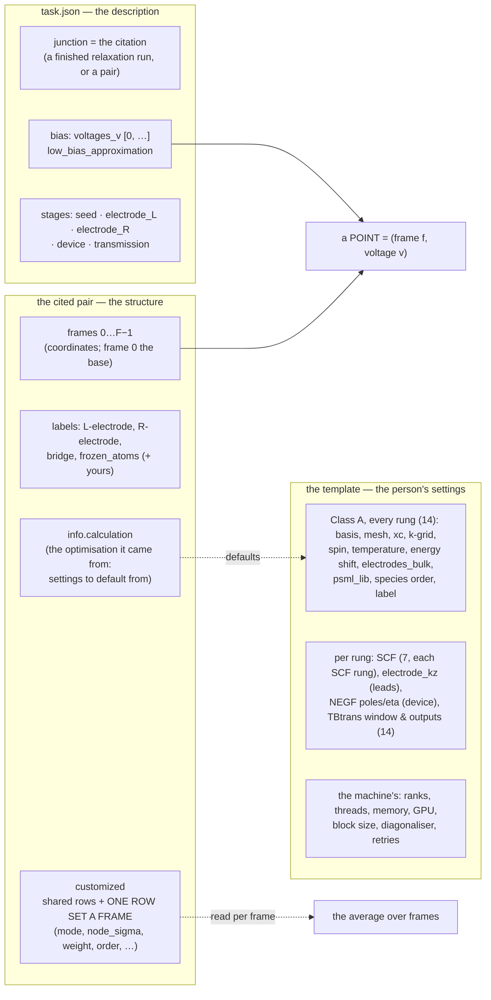
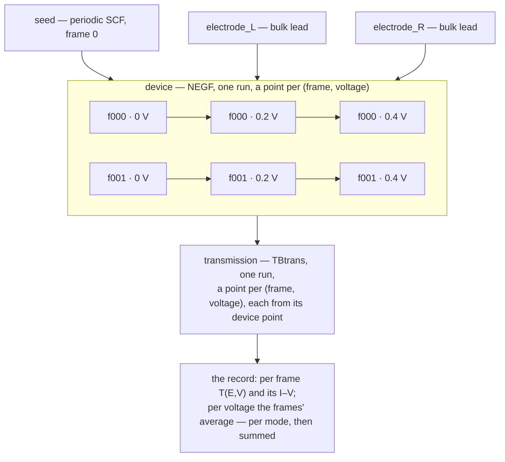

# Plan consolidation — 2026-10-09

**Role:** archive — the sections of `plans/plan.md` whose work was done, superseded or measured untrue, and the long histories of rows cut down to what is left, moved here on 2026-10-09 after ten read-only validation passes (one agent per section group, every claim checked against the code and the documents at the cited place at `61db1660`, then re-read by the owner before anything moved). Each section is kept verbatim under its original heading, with the validation verdict in front of it. The contracts the validators found false were corrected the same day; each correction is named in the verdict that found it.

*(user, 2026-10-09: "review your overall design, make sure all are integrated in plan with context and details, consolidate the plan, archive obsolete or done items, consolidate design document, archive and make sure current document contracts are updated correctly based on validated facts")*

---

## § 0a — THE QUEUE and the milestone table, as they stood on 2026-10-09

> **Verdict (2026-10-09 validation):** rewritten in the plan's § 0a. **Q2d** done but 12e — 12b-2 dropped (`e31c230b`), 12c/12d built (`ac2d5741`: `runstatus.every_run`, `/api/results/dir`, `status <stage>`), and 12e defined in no document or commit: closed. **Q2g** done; its *open* *"Q6's open half"* UNTRUE — Q6 done in `548b4c74` (the swap applies to the calculation's own copy, `compose.py:631-650`); D29's document list corrected 2026-10-09. **Q4** done. **Q5**: steps 5 and 6 built, K21's record built; steps 7 and 10 open → the new Q5. **Q6**: step 9 done, step 8 → Q5, step 11 → Q17. **Q7**'s *"the fake-junction ladder resumes at rung 4"* superseded by TD8 and Q15 (no fake engine). **Q10** done. **Q11**: the named-queue check in two doors open. **Q13**: the browser check done (`1a28e67f`); its other left items stand. **Q14**, **Q15**, **Q16** done. **Q17** *"planned"* stale: its structure half built (`36a485e6`, `c93da223`, `61db1660`). Milestones: **M2f**, **M2g** done (archived); **M2j** looks built (`results.py:198-211` reads `jobset_status`; `runstatus.py:240-275`) — closed at its review; **M2k** — the GPU claim / match half open; **M2m** — W39's part built, the identity hash open; **M5** — step 5's *"frame walk waits on 11"* superseded (frames are points of one run, D4); **M6** — P0–P4 built, decision 4's refusal located (`citation_defaults.py:196-207`); **M11**'s *"seventeen mechanism classes (K1–K17)"* — there are 22.

### THE QUEUE — what is in hand, in order *(2026-10-02)*

> *(user, 2026-10-02: "consolidate your plan so we don't lose track of these
> items and correctly prioritize and plan in a persistent plan and correctly
> update as we move down the list"; "we need to get the transport task
> finished asap")*

**Read this first.** It is every item in hand, in the order it is worked;
the milestone table below keeps each item's detail. A row moves in the commit
that moves it — *done* rows are struck with their commit, and a row is never
re-ordered without saying who ruled it.

| # | item | state | next |
|---|---|---|---|
| **Q2d** | **W55 — the prep and jobset review** *(user, 2026-10-02: "use agent to read the full code and contract text of prep and other jobset, to make sure a logical workflow is designed with no redundancy, duplicated work, no handcraft, but with a good organized data structure, unified api design and good connection between operations")*: four reviewers in parallel — prep; launch, attempts and status; the two doors and the contract; data structures and APIs | **reviewed 2026-10-03; every finding re-read in the code** — § 0c's ledger; units 1–8 done (`34febeaa` the last); **9a–11 done** (2026-10-03…06, each with its two review rounds); **12a and 12b-1 done** 2026-10-07 | **§ 0c's unit 12: 12b-2–12e** (12e designed with the user first) |
| **Q2f** | **Absolute imports, package-wide** *(user, 2026-10-03: "i agree with a, but like a focused session for that with agents and reviews. let's finish this main goal of transport and framework related tasks")* — every `from ..x import y` inside `molbuilder/` becomes `from molbuilder.x import y`, and the rule is written into the conventions: a relative import changes meaning when its module moves, and one inside a function fails only when called (W55 9a: 290 test failures from one moved module). Until then a NEW module is written absolute; an edited one keeps its file's style | the user's word — its own session; **and the shipped files' imports in the same session** *(ruled 2026-10-06, W57 decision 1: "B, with Q2f as one session")*: a file that runs beside a job imports ONE way -- each zip (`mb_monitor.pyz`, `mb_vibration.pyz`, `mb_pyscf.pyz`) keeps molbuilder's own folder layout (`molbuilder/identity.py`, `molbuilder/spectra/...`, an empty package marker), so the package's ABSOLUTE import -- Q2f's form, `from molbuilder.identity import launch_as_typed` (user, 2026-10-06: "for the first form of import why can't we use absolute path?") -- resolves inside the zip as in the package; the try/except ImportError pairs leave the 22 shipped files; the three builders, their start lines and the PySCF scripts' import lines follow | **after the transport and framework goal** (Q2d's units 9b–12, then Q4–Q7) — a script with an agent review, then the full batch |
| **Q2g** | **The file manifest** *(user, 2026-10-04: "make a manifest of all the output file and files your code generates in the hierarchical and flat directory ... integrated in a clear section in contract so that you ... stop keep re-inventing new ways to ... interpret the ... data"; "use another agent after this report is genrated, to review and validate, and also check overlap/redundancy/duplicated components")* | **the manifest written 2026-10-04** -- `project-layout.md` § 5: every file of both shapes with its writer and its one door, built by three agents from the code and two real H₂ calculations, checked by a fourth, every finding re-read in the code; the documents' other file lists point to it (D29). Found: D20–D29, B11–B14, Q6 (§ 0c); D19 rides with B12 | **ruled 2026-10-04** -- B11–B14 approved, Q6 (a), D19 with B12; **W56 units 1, 2, 3a, 3b and 4 done 2026-10-04/05** (§ 0c), D30 the same day. **Open**: D29's document list (§ 0c's row); Q6's open half (§ 5x C1) |
| **Q4** | **TD9 — M5 step 5 against M2** | **decided 2026-10-02** *(user: "#9 ok")*: M2f, M2g, M2i, M2k, then step 5 — **done**: M2f → 9b (parts 2a–2d), M2g → 9b part 3, M2i → 9b part 1 + 12b-1, M2k → 11a (its claim / match half: M2k's row), step 5 → built `0e11a018` | — |
| **Q5** | **M5 steps 6, 7 and 10, and K21** — the transport work that does not wait on TD9 | **steps 5 and 6 built** (5: `0e11a018`; 6: Q14 B1 `7351a3ff`); **the sweep as one run built `ddf12a43`** (Q14 B2–B4) with `launch --cold` (`_cli.py:1708`); `--skip` / `--unskip` not built (0 hits in the code); **open: steps 7 and 10**; K21 built in § 5x B6 (the record reads both channels, G = (e²/h)(T↑ + T↓)); its test reads real TBtrans output, so it is an assertion on § 5y's real transport run (E) | steps 7 and 10 — § 5u.1 |
| **Q6** | **M5 step 8** (one panel per engine, after step 3), **step 9** (after M2j and M2l), **step 11** (after steps 4 and 5) | **step 9 done** (§ 5x B6; ③ waits on step 11); **steps 8 and 11 open** | § 5u.1 |
| **Q7** | **M4 — the engine offset finished; the fake-junction ladder resumes at rung 4** | after Q5 | § 5q.6 |
| **Q8** | **Ruled 2026-10-02, not built**: one `proxy.trust` setting replacing `auth.trust_proxy` and `rate_limit.trust_proxy` (`configuration.md` § 8); a benchmark's grid stated by the description, refused when it is not — no grid the machine proposes | ruled | after Q2's fixes, as one config milestone |
| **Q9** | **M11's remainder** — K13–K16, K18, K17, K22, K9, then W50 step 3 | open | § 5w.4 |
| **Q10** | **W52's open**: (11) prep's transactional produce; (8) the conductor imported below the surfaces | **done** — (8) unit 9a (`jobset/__init__.py` re-exports nothing); (11) unit 10b (`planned.py:102`, `Plan`) | — |
| **Q11** | **W53's parked**: the next-step lines offering `--mode submit` for a target with no queue; the named-queue check in two doors (`launch_refusal`, `place`); `gpu_partition` and `~/.config/molbuilder.backup/` decided 2026-10-02 (§ 0b, item 10) | the `--mode submit` lines fixed with unit 11b (`commands.takes_a_queue`); `gpu_partition` and the backup done (`31ca9957`, § 0b item 10); **open**: the named-queue check in two doors (`placement.py:28` `launch_refusal`, `scheduler/place.py`) | W53's row |
| **Q13** | **THE TASK — `prep task` / `launch task`, one protocol** *(user, 2026-10-07/08: "prep the whole task and ask the user which stage it intend to do"; "one unified framework and protocol and verb design and api ... systematic and holistic"; D1–D5 agreed 2026-10-08)* | **built 2026-10-08** — T1–T8 committed and two review rounds (code and docs, fresh agents) fixed (`214cc19d`, `91629b67`). **Left**: Task setup's Prep card seen in a real browser (the extension was down); `tests/test_task_setup_prep_e2e.py` drives the per-tab Prep buttons that are gone (e2e on the user's word); a group's header under a real scheduler (Sol); `prep_group` re-plans each member after the save (no refusal found reachable on the road). Contract written 2026-10-08 (`job-system.md` *The task*, § 5.0, § 5.3; `project-layout.md` § 1.6.6; `architecture.md` § 3.2); the review (three agents on conflicts, two on the doc sweep and the code inventory) found ~335 doc passages and ~30 code sites; its open points settled by the agreed rules: a kind with stage roles pre-selects its ready stages that build on nothing (transport's seed and leads); stages named together at prep OR launch go as one job when they pass the group checks (none builds on another, one allocation) -- no "never alone"; a stage not prepared reads `ready` / `waiting`; the ledger line `prepared`; `summarize task` takes no stage. **Milestones, each checked on the road:** T1 the low-bias gather fix and step 6's core (the treatment in `task.json`, the device without an axis); T2 the vocabulary -- kind `task`, `--stage`, `summarize task`, the `prepared` door, every printed command, the road and its rows; T3 the `ready` door (`ready.readiness` (`ready.py:60`), the gather as an answer or a refusal, D5 newest-only); T4 the `prep task` entry -- the ladder offer, `ask.choose`, the no-terminal refusal, groups by pick, `prep_group` held to rule 3; T5 `launch task` -- the waiting units, the question, relaunch by name, the group checks at launch; T6 status -- ready / waiting rows, next lines, the wire form, the chips; T7 the web -- Task setup's one Prep with the ready stages, routes, handover text; T8 the doc sweep (~335 passages, the review's list); then the two review rounds |
| **Q14** | **Transport, made whole** — the sweep as one run, the low-bias switch, composition, the record, then the milestone review of backend, CLI, UI, checkpoint, stage/run configs and CSS (§ 5x) *(user, 2026-10-08: "You need a clear picture, a contract, how transport is done ... see where it's missing and what is wrong"; "stop fucking hand bake these fucking things")* | **done 2026-10-08** — B0–B9 (§ 5x.4's commits); the review's two rounds clean after one revision each; the three cases on the road junction; what it left open is in § 2 | § 5x |
| **Q15** | **No fake engine: an API test checks what prep writes, a test that reads an engine's output runs the real one, once per pass** *(user, 2026-10-08: "our api is not siesta engine. it's prep script for engines including siesta"; "when something reads the output of \"siesta\" output that's an end to end by definition"; "it should be integrated/merged with existing e2e tests so one run of e2e would produce all information"; on the split: "either disassembled into api tests of individual parser/action functions that works on the script dir, or merged into real e2e functions"; "consolidate the plan, execute")* | **done 2026-10-09** (`22ac10d9`, and the transport module's commit) | § 5y |
| **Q16** | **A structure loaded whole** *(user, 2026-10-08: "when i load AuBDTAu_fine_optimized.xyz/.json pair ... the meta data gives a lot of wired warnings and showed no meta data at all ... this bug/issue needs to be addressed before the work")* -- the Molbuilder tab's Load adds the pair to the open structure, whose record wins and whose labels rename the pair's; the dropped record goes unsaid; two sentences on the Results tab are a run's, not a saved pair's | **done 2026-10-09** (§ 5z.1): the Load question (`a19ddfcc`); a merge names the record it does not carry; the Results file card calls a saved pair molbuilder's and says who saves it; the Metadata hint says what the opened file carries -- checked on the page with AuBDTAu_fine_optimized | § 5z.6 step 2 |
| **Q17** | **Transport over a set of frames** *(user, 2026-10-08: "what the transport receive is a multiframe .xyz/.json combination" with `info.calculation`, the labels, and `info.parameter` per frame for the average)* -- TD10's text, the citation of a frame set, the frame inside a run, the record's average, the family in Results | **planned 2026-10-08** (§ 5z); D1-D5 settled by the user 2026-10-09 | § 5z.6 steps 3-5, after Q15 and Q16 |
| **Q12** | **the rest of the work order below**: M2j, M2k, M2m, M2n, M3, M6 P5, M8, M10 | open | the table below — M2j with unit 12 (12c, 12d); M2k's claim / match half; M2m, M2n, M3, M6 P5, M8, M10 after |

Done rows, archived (`archive/2026-10-08-plan-consolidation.md`):
- `Q1` (W53's follow-up — `env_init` and one config file) — done `05c6bb99`
- `Q2` (W54 — the config review) — done: Q2a `92e84cc8`, Q2b `7dd8940f`, `0a7ea0e4`, `6401abfb`; its ledger is § 0b's
- `Q2c` (the ten decisions of 2026-10-02) — done 2026-10-02 (`e1d88b22` … `31ca9957`); § 0b
- `Q2e` (MolView's Metadata pane, read through and edited) — done 2026-10-03 (`a7ca51af` and the pane)
- `Q2h` (W57 — the explicitness review) — built 2026-10-06/07 (`7d52b551` … `adeb6c6d`); § 0c, W57
- `Q3` (M5 step 3 — `TransportConfig` retires) — done `325cb1d4`

**Why transport comes before M11's remainder** *(2026-10-02)*: the user's word
above. M11 was taken ahead of M5 step 3 on 2026-09-29; the K items left are
framework-wide (writers, allocations, deck formatting, the run record's rows)
and transport's decks pass through them, so each is done when a transport step
needs it, the rest after Q8.

**This table is the order of work and its state.** The rows it names (W20,
W33–W39, …) keep the WHAT and the decisions; this table keeps WHEN and HOW FAR.
It is updated at every milestone, in the commit that closes it.

**How a milestone closes:**
1. its items are built — the contract first wherever an item changes a rule,
   then the code, then a test that drives the road (`jobset
   init/prep/launch/summarize`, or the page on a live server) and is broken on
   purpose once to watch it fail;
2. the targeted tests pass (the unit's own and what it touched);
3. **an agent reads the FULL code text** of the milestone's diff and of the
   contract sections it touches — not a grep — and reports each finding with
   its evidence;
4. every finding is re-read against the code before it is acted on, then fixed
   or answered;
5. this row records the commits, the review and its outcome — and only then
   does the next milestone start.

A full test batch (`tools/testrun.py`) runs at the end of M2 and at the end of
each programme after it, with nothing changing under it.

| # | milestone | items | done when | review | status |
|---|---|---|---|---|---|
| **M2f** | launched and finished | W38 F2, F3 | one door each, the same for flat and hierarchical, asked by every caller -- the Results viewers among them, which follow a run until its phases finish and so, for a run killed mid-phase, until the page closes (found in M2b⁵'s review) | | **done 9b** (parts 2a, 2b and 2d, 2026-10-03: `runrecord.py:139,309,44`; `runs.py:343`) |
| **M2g** | one restart-file list | W36 ⑧, the bias chain's list (W38) | every reader asks the calculation's list; Task setup states which is in effect; the shipped lists say how to customize | | **done 9b part 3** (2026-10-03: `warmfiles.py:122/156`; `tests/data/restart_files.toml`) |
| **M2j** | status owns the ladder | W38 F8, the queued attempt | every described stage in status; launched-and-unfinished attempts never hidden; the Results tab reads status | | open |
| **M2k** | what a job runs with | W36 ⑦, W38 F1 + the one queue record, F6 | one placement and one record; GPU request / claim / match; the precedence table in the contract | | **partly** — one placement and one record done (unit 11a: `placement.py:182,236,130`, `model.py:267`), the precedence table written (`running-a-job.md:430`), the GPU request done (9b part 4); the GPU claim / match half unverified |
| **M2m** | customized parameters | W39 — first, rule on V1.9's and X4 ⑤'s structure hashes, which disagree with W39's (where the lattice goes; whether a mismatch blocks) | the contract first; one API each side; the pane's section; the two hashes | | open |
| **M2n** | the text, then the batch | W36 ⑪ and the document sweeps left (§ 5v is their input) | the full batch green; then the Sol memory measurement and the sweep for tests that read text | | open |
| **M3** | the run record, the rest | W35: P2's remainder, P3–P6 | W35's own done-conditions | | open |
| **M4** | the engine offset, finished | W33 P4, P5 | § 5q.6; the fake-junction ladder resumes at rung 4 | | open |
| **M5** | transport | **W43 — § 5u, the one list** *(consolidated 2026-09-29: W27 floor 3 · W30 · W25 · W24 · W10 · W32 ②–⑤ · § 5c.3 · § 5o · § 5p)* | § 5u.1's eleven steps, each closed as a milestone |  | **see § 5u.1** — 2026-10-08: steps 1–6 and 9 done (§ 5x B0–B9), step 5's frame walk waits on 11; 7, 8, 10 and 11 open |
| **M6** | charge and spin | W34, P1 on, as amended on 2026-09-28 (§ 5s.2, decisions 8–9) | § 5s | | **P1–P4 built 2026-09-28/29, then reviewed by four agents (backend, browser, tests, documents) and every verified finding fixed or named in § 5s.4 (c71ba618); P5 (the read-back) open** — taken ahead of M2's remainder at the user's word (*"go ahead with the contract, add free, make sure api and users are unified"*) |
| **M8** | MolView sealing, the CSS | W15; W1–W6, W13 | each row's own | | open |
| **M10** | from a mode to the current | W42 (it folds V1.24–V1.27 in, M9's two among them) | V1.26's decision; then W42's order P1–P6 | | **decided 2026-09-28** (W42: D1–D5, D7, D8; D6 as recommended) — V1.26's decision still owed; after the current work order |
| **M11** | every parameter, end to end — Structure optimization (SIESTA, PySCF), Spectrum (PySCF, SIESTA) and Transport | W50 | W50's own: a static full-text review per track, each finding verified and fixed at its owner, then the road in the browser | | **Started 2026-09-29, ahead of M5 step 3** *(user: "i need full review of webui code, interface to backend, template, and backend and final generated script to validate each parameter in their corresponding context such that we have confirmed this workflow is correct. we did this for structure optimization and we should do this for the others too"; then: "make sure structure optimization is included in the review too")* — the five static reviews reported the same day, every defect re-read in the code and the engine's source ([`archive/2026-09-29-m11-static-review.md`](?doc=archive/2026-09-29-m11-static-review.md)); the fixes are § 5w's seventeen mechanism classes (K1–K17), **approved 2026-09-29** *(user: "agree with your recommendation")* — K6 first |

Done rows, archived (`archive/2026-10-08-plan-consolidation.md`):
- `M1` — done 2026-09-27 (`45ff5089`, `164549ec`)
- `M2a` — done 2026-09-28 (`e31e56f7`, `f3ae6e6b`, `5da4f85b`); noted, not acted on: an unreadable zip, or an exception escaping `main`, reports in Python's own words, and a failing `ending` then exits 1, which the wrapper treats as 2
- `M2b` — done 2026-09-28 (`09de947a`, `bb46e09e`); noted, open: the Build route's peptide branch collects no warnings, so `peptide.py`'s C-terminus warning (the chain ends as an aldehyde) reaches no web user (R5, `science/validation.md`)
- `M2b′` — done 2026-09-28 (`5e79002d`, the review's fixes `51590fa6`); its open remainder is W41's row (the whole-output parse, re-running a failed finish)
- `M2b″` — done 2026-09-28 (`51590fa6`, `9ea467cf`); `M2b‴` — done 2026-09-28 (`e519e3cd`; E3 is W41's row); `M2b⁗` — done 2026-09-28 (`40720388`); `M2b⁵` — done 2026-09-28 (`54af590c`; its *left for M2f* done 9b part 2d)
- `M2c` — done 2026-09-29 (`e5e162ad`); noted, open: `create_app(config={})` still reads the disk config through the snapshot, so a broken file stops a `--no-auth` server, which `cli.py` says ignores the file
- `M2d` — done 2026-09-29 (`379a1426`; V1.36 `73374112`, Fe `5a643599`)
- `M2e` — done 2026-10-05 (unit 10a); `M2h` — done 2026-10-05 (W37, unit 10d); `M2i` — done 2026-10-07 (9b part 1, 12b-1; the `.disabled` mark dropped); `M2l` — done 2026-10-05 (9b part 5)
- `M7` — done 2026-09-29 (nothing was left to build; W21 archived with the evidence); `M9` — folded into M10 2026-09-29 (V1.27's decision is W42's D8; V1.26's is still owed — M10's row)

---

## § 0b — the ten decisions of 2026-10-02, as it stood

> **Verdict (2026-10-09 validation):** decisions 1–11 history. **10b DONE** — `~/.config/molbuilder.backup` does not exist. **12 superseded** — the save is always (`checkpoint.save_before`, now `checkpoint.py:1890`); its residue, `job-system.md:960`, and a second one the row did not name, `running-a-job.md:1171-1173` (*"nothing offers it yet"*), corrected 2026-10-09. **R11 OPEN, its premise UNTRUE**: not 57 renderer calls in 13 files — three test files call the wrapper renderer and two lean on the fallback, both hand-writing `environment.json` (`tests/test_launch_door_gate.py:37-46`, `tests/test_warm_file_inventory.py:30-55`); T15 and T29 done. R11 is its own row in § 2.

### 0b. The ten decisions of 2026-10-02 — and every review finding's state

W54's ledger archived; R11 parked, open.

`§ 0b` items 1–12 (the ten decisions: 1–3, 5–8, 10a and 11 built, 4 and 9 settled, 10b done — unverified, the user's home; 12 superseded by W56 unit 4, the save is always, `checkpoint.py:1877` — residue: `job-system.md:960` still says *offering to save*), the W54 ledger (C1–C25, R1–R24, D1–D30, T1–T30, S12, M5 step 3's review, Q2c + W54's review) and the five *your word* questions (answered 2026-10-03, built as units 1–3 and 7) — done, archived (`archive/2026-10-08-plan-consolidation.md`). `R11` — parked, open: launch's test-only `machine_for` fallbacks serve 57 direct renderer calls in 13 test files, which move to the road with T15 / T29.

---

## § 0c — W55, W56, W57 and the work order, as they stood

> **Verdict (2026-10-09 validation):** **D9** done; its residue — `docs/architecture.md:61` (a `plan` verb), `:65` (`submit`), `:68` (the archived citation rule, *any directory*) — corrected 2026-10-09. **D29** partly done; its open list corrected 2026-10-09 (`parse.md` § 5d.4 `read_gathered_from` → `runrecord.py:405`, § 5.5's `engine="siesta"`; `structure-molstruct.md` § 6's lines and § 7's label warnings; `project-layout.md` § 4.3, § 1.6.1, § 1.6.2 — launch opens the next attempt, `submit.py:760` → `prepare_attempt`; `execution/architecture.md`'s `continuation_answer` and `planned.Plan`; `job-system.md:2268`). **Q6** DONE in `548b4c74` — the row's *"still rewrites the cited files"* UNTRUE; its residue (`compose.py:386-388`, `:703`; `job-contracts.md:2137`) corrected 2026-10-09. The done lists D1–D30, B1–B14 and Q1 hold (drift only: `prep_stage` at `prep.py:2413`; `commands.py:224`). **W56**: *"Names since"* history; (2) the transport citation OPEN → § 2 W56-2; the open-shell `mo_energy` read SUPERSEDED (the road offers `pyscf.vibration = ["restricted"]` only, `catalogue.template.toml:1116`; ES4 refuses the rest); the record walk and the continuation verdict DONE (`4963406b`, `22ac10d9`); the PySCF held-atom e2e OPEN → § 2 W56-H. **W57**: *Carried* — the electrode deck header UNTRUE now (`transport/deck.py:402-418` names only `<SystemLabel>.TSHS`; names from `RunNames`, `prep.py:1033`), the `envs` note history; decision 1 is Q2f's; R6 done (`job-contracts.md:2141`); N6 mostly built by Q14, its two document pieces corrected 2026-10-09 (`job-contracts.md` § 6.3's `v<V>/` and `launch/` rows; `project-layout.md:873`, `:2726`); *known gaps*: the `[hidden]` guards present (`task-setup/style.css:162,523`), the CUDA minimum stated (`ops/installation.md:506`), the probe guard present (`runwrap.py:2601-2602`, no honest test without a fake), *"the form's reaction"* has no context anywhere — dropped; the rules no test holds → § 2 W57-G; *Open*: the PySCF memory-cap row → W57-M, the bench `SCF.MustConverge` check DONE (`tests/test_prep_bench_fold.py:202`), `test_tbtrans_out` → W57-T (retire), the old-data tolerances → W57-O; *Swept later* contradicts `testing.md:54-55` (retire, never sweep) → W57-T; *Found, not yet built*: fifteen functions, not eleven (`kmesh.py:130`, `validation/siesta.py:197`, `validation/pyscf.py:166`, `_shared.py:711` besides) → W57-K. **Unit 12**: 12a, 12b-1 done; 12b-2 dropped; 12c/12d done (`ac2d5741`); 12e undefined — closed; the row's *"what it is"* still described `NN_name.disabled/`.

### 0c. W55 — the prep and jobset review *(2026-10-03)*

Four reviewers read the full code and contract text of `prep` and the rest of
`jobset` at `1b1d1d65`, each claim re-read in the code before it is listed
here. **D** — a defect against a written rule, fixed without asking; **B** —
structure, proposed and waiting for the user's word; **Q** — a rule only the
user can make.

| # | what | found by | state |
|---|---|---|---|
| D9 | documents stating retired rules: `workflow.md` § 5 (step 5 *links*), `project-layout.md` (*delete it and re-prep*; re-prep as the way to regenerate), `preparing-for-another-machine.md` (*delete the environment.json*; *no machine name anywhere in the record*), `running-a-job.md` (the web generating decks), `job-system.md` § 5.3's stale lines, `docs/architecture.md`'s jobset row (`plan`, no `prep_stage`), `execution/architecture.md` § 2.1 (`relink`) | doors #12, prep, structure #12 | **done 2026-10-03** — each brought to the code: step 5 opens the attempt and copies (`workflow.md` § 5, and `script-preparation.md` § 5 and § 6, whose worked example also had step 1 probing and the decks at the root); a redo is a rollback (`project-layout.md` § 5, § 5.1; `template.md`'s two lines resting on it); a re-probe reaches a prepped calculation through a new prep, and the copy names its machine (`preparing-for-another-machine.md` § 3, § 4); the route is prep for its machine, copy, launch (`running-a-job.md`); the jobset row names `prep_stage` and the verbs that exist; `relink` gone. § 5.3's stale lines went with D2. 147 document tests green — *the 2026-10-08 validation marks it partly, naming no document* |
| D29 | the documents restate file lists and naming rules in at least seven places, and 57 statements disagree with the code or with each other (the manifest's three readers and its checker) | the file manifest | **the file lists done 2026-10-04**: the manifest is `project-layout.md` § 5; job-contracts § 2.2's and § 6.3's tables point to it; § 6.1's launch record, transport template and bench group rows, `project-layout.md` § 4.1's trajectory log, § 1.6.3's prepped row, the short version's tree corrected. **Open:** `job-contracts.md` § 2.3 (the token read through `identity.parse_stage_token`), § 2.6 (who writes `.pyscf.log`), the `.log` row's owner in § 2.2a against `parse.md` § 5.5; `parse.md` § 5.3, § 5.5, § 5d.4; `structure-molstruct.md` § 6–7; `project-layout.md` § 1.0 (*the shape is chosen at prep*), § 1.6.1 and § 4.3 (*prep numbers attempts*), § 4.5's door table (`path_for`, `attempts`, `role_matches`); `architecture.md` § 3 and § 3.2's doors under names the code does not use (`prepped`, `continuation`, `find_template(base, label)` -- and `open_run`, `plan_prep`, `plan_launch`, units 10-12's) |
| Q6 | the Transport tab's electrode swap rewrites a cited relaxation's own deck, or its sidecar, inside that run's finished attempt, and leaves `<sidecar>.lock` there (`transport/compose.py:682-790`, `sidecars/molstruct.py:487-509`) -- `project-layout.md` § 1.5 says an attempt is never modified; `job-contracts.md` § 6.1 (slot provenance) names *"the file the label rename rewrites"* | the file manifest | **ruled 2026-10-04: (a)** *(user: "for Q6, i would agree to a")* -- the swap is the transport calculation's own statement (the junction slot's `swap_electrodes: true`), applied by compose to its own copy of the junction; a cited run is never written. Designed (`engines/transport.md` § 4, `web/web-api.md`); **open**: `compose.py:618-660`'s swap still rewrites the cited files (§ 5x C1) |

Done rows, archived (`archive/2026-10-08-plan-consolidation.md`):
- `D1`–`D8`, `D10`–`D16`, `D18`–`D28`, `D30` — done 2026-10-03…2026-10-07 (D1 superseded since: `_as_it_was` gone, a refused prep writes nothing — unit 10b; D7 and D15 unverified by the 2026-10-08 validation)
- `D17` — done (first half 9b part 4, 2026-10-03; second half 2026-10-05: `placement.admitted`, `placement.py:182-236`)
- `B1` — done 2026-10-05 (units 10b, 10d, 10e; `planned.py:102` `Plan`; `prep.py:2504`)
- `B2` — done 2026-10-05 (unit 10c: `_prep_transport` gone; one conductor, `RUNGS`)
- `B3` — done 2026-10-05 (unit 10e)
- `B4` — done 2026-10-03 (unit 8: `commands.stage_lines`, `/api/task-setup/commands`; `commands.py:232`)
- `B5` — done 2026-10-05 (unit 11b: `submit.plan_launch`, `send_launch`)
- `B6` — done 2026-10-07 (unit 12a: `materialize.open_run` / `open_container`)
- `B7` — done 2026-10-03 (unit 9a: `jobset/__init__.py` re-exports nothing; `jobset/errors.py`, `jobset/engines.py`, `jobset/placement.py`, `runrecord.py`)
- `B8` — done 2026-10-03…05 (unit 9b, parts 1–5; `materialize.py:51,99`)
- `B9` — done 2026-10-03 (unit 6)
- `B10` — done 2026-10-03 (unit 4: `checkpoint.save_before`)
- `B11` — done 2026-10-04 (W56 3a: `molbuilder/runs.py`; 3b.1–3b.6; 3b.7 dropped with unit 4d)
- `B12` — done 2026-10-04 (W56 unit 4: `runs.declared(run)`); `B13` — done 2026-10-04 (W56 unit 2: the catalogue, `tools/manifest.py`); `B14` — done 2026-10-04 (W56 unit 3a: `read_task`, `runs.place_of`)
- `Q1` (0c) — superseded 2026-10-07: unit 5's `task.stage_disabled` went with 12b-1 (no `enabled`; a removed stage's files stay untouched)

#### W56 -- the file manifest's doors, in order *(2026-10-04)*

Units 1, 2, 3a, 3b and 4 (D19–D27, B11–B14; D28 with unit 10d; Q6 ruled) — done 2026-10-04/05, archived (`archive/2026-10-08-plan-consolidation.md`), with the two whole-work reviews, *the faking tests retired* (446 tests in 72 files) and *the PySCF script imports molbuilder's code* (`mb_pyscf.pyz`). Names since: `Shape.run_basename` → `runfiles.RunNames` (W57 decision 2); `materialize.mark_run` → `open_run` (12a); `tests/fixtures/siesta_flat_h2` retired (no saved run in the tests, 2026-10-06).

Still open from those blocks:
- (2) the transport citation reads a cited run's labels, held atoms and axes from the cited folder's lone `.fdf` and lone sidecar, and refuses a flat citation holding two decks (`transport-design.md` § 4.1b's one-deck rule)
- an open-shell `mo_energy` read that takes the first spin channel without saying so (the PySCF vibration script; older than W56)
- holes recorded, not filled: the transport record's folder walk (`collect_record`, `_stage_facts`) has no test — the fake-junction ladder (§ 5q P5) is where it gets one; no test reads a continuation verdict (the road's stand-in writes no relaxation); the PySCF script's `# frozen_atoms` line and a PySCF trajectory read with its held atoms need a real PySCF run

#### W57 -- the explicitness review *(2026-10-06)*

*(user, 2026-10-06: "review your fucking code again holistically scoping focused on this fucking pattern of fucking overly simplify and being implicit rather than explicit for no fucking good reason"; "fix every defect the review finds")* -- four read-only reviewers on the prep, launch and run path: the records a run and a machine write (R1–R11), the printed commands (P1–P7), names and tokens (N1–N9), values code fills in (D1–D7). Each finding was read again in the code: a defect against a written rule was fixed; a deliberate choice, or two documents that disagree, is a decision below.

**Fixed** (`7d52b551`, `36c545c5`, `a1a74166`, `43b43fe7`) — done 2026-10-06, archived (`archive/2026-10-08-plan-consolidation.md`).

**Carried.** An electrode deck's header names its by-hand files from the SystemLabel (`bdt_L-electrode_02_electrode_L.fdf`, which does not exist; the deck is `bdt_02_electrode_L.fdf`): the renderer needs the deck's basename as a render argument -- with the transport work (Q5–Q7), on a transport road; no row preps a rung today, so N3's seed fix is checked by reading. The `envs` installer's "Re-run with ..." lines are outside § 5.3's jobset scope.

**The decisions** (N1–N9, P5, P7, R3, R4, R6, R9, R10, D3, D6, T1–T4; the e2e / browser-walk / Sol row is Q13's *Left*), **ruled 1–7, the re-screen of 2026-10-06 and the builds of 2026-10-06/07** (`58634eaa`, `bf2f68e1`, `422f365c`, `ec7823d9`, `5637cdb3`, `3b80b52c`, `adeb6c6d`; decisions 2 and 6: `runfiles.RunNames`, `launch` hands `--run N`) — all resolved, archived (`archive/2026-10-08-plan-consolidation.md`); decision 1 is Q2f's session; N6, R6 and the electrode deck header go with the transport work (Q5–Q7).

**Known gaps** (2026-10-07):
- the `[hidden]` guards -- Task setup's `.ts-state[hidden]` / `.ts-facts[hidden]`, a cascade question jsdom cannot answer;
- the form's reaction;
- the CUDA minimum -- none is declared (`ops/installation.md`);
- the probe's no-hang guard;
- rules no test holds since the W57 retirements (review round 2): a killed run leaves no conclusion marker (needs a stand-in that signals the run script); a stage overrides any field and the stages that do not keep the shared value (the road has no key for a stage's `overrides`); the PySCF effective-parameters fence reads the engine's value back (an engine-tier assertion on the H2 log); `set -e` stays on across the preamble; a warm retry's own launch record (`retry_of`) below the engine tier; MPS and ranks-per-GPU below the field tier;

**Next:** unit 12 (the two milestone review rounds are done: `b1a1d4e3` and the commit after it). **Open:** the PySCF memory-cap road row (the SIESTA `ulimit` and BLAS-pin rows are in) and the bench `SCF.MustConverge` check; `test_tbtrans_out`; the old-data tolerances (machine copies naming no `machine`, `script_generation`, `Environment.from_dict` dropping keys). **Swept later:** the job sets still built by hand in `test_jobset.py` and the ten test files rendering through `spec_for` + `render_deck` directly; tombstones in production code. **Found, not yet built -- the same class, outside the road's doors:** eleven library functions still default their kind to `"optimization"` (`validation.validate`, both engines' `spec_for`, `script_emit.DeckSpec`, `template.template_with_values`, `catalogue_to_form_schema`, `validation.stages`' two checks, both `_warm_declaration`s, `_validate_siesta`'s `calculation or "optimization"`) -- every caller on the road states it; about 150 calls, most in tests, leave it to the default; and the template's migrate hint (`template.MIGRATE_HINT`) names no `--bundle`, since `config_from_template` reads text with no folder.

*The user's word on § 0c* and *on the framework design* (2026-10-03, verbatim) and the *Settled* paragraph — built (units 1–12, § 0c's rows), archived (`archive/2026-10-08-plan-consolidation.md`).

**The work order** — one unit per commit, each with its contract text, rows and
mutations; the framework rounds' design written into the contracts first:

| # | unit | what it is | state |
|---|---|---|---|
| 12 | B6 · M2i (F5) · M2j · M5 step 9 · M2l M5 | **one opener, every folder marked, the calculation's runs in one place** (`project-layout.md` § 1.4a, § 1.6.2, § 4.2; `web/results.md` § 2.4): one function opens every run folder — a stage's attempt, a trial's, a bias point's — stamping each folder and the containers above it, seeding the progress channel, telling the wrapper the run's own label; no on/off: a stage removed from the description leaves its folder marked `NN_name.disabled/` (F5); the Results tab lists every run of a calculation at its root — every attempt, never hidden — and shows the one picked in place | designed 2026-10-03 — the user's word; **12a done 2026-10-07** (one opener, `open_run` / `open_container`); **12b-1 done** (no `enabled`); 12b-2-12e next, 12e designed with the user first. **Settled 2026-10-07, the user's words:** "let's just let all run continue warm or cold, the user knows the consequence and we just manage the flow ... run continue warm or cold is user's decision, and error or not, that's user's responsibility"; "checkpoint is used for the rollover and branching. that's it" -- **built 2026-10-07**: any stage launched again, however it ended, warm (its own latest run) or `launch --cold` (nothing of its own; flat: the run script's `--cold --force`, which now REMOVES the files it names -- before, it left them and SIESTA read them); no refusal, no never-concluded question; a launched bias scan opens each point's next attempt the same way, until § 2a.11's sweep-as-one-run is built (built since: `ddf12a43`, Q14 B2–B4); `.disabled` dropped; 12c/12d (status and the Results root listing every run, so a run can be picked) go with step 9 of § 5u.1 |

Done units, archived (`archive/2026-10-08-plan-consolidation.md`):
- units 1–8 (Q4 · Q2 · Q3 · B1's save + B10 · Q1 · B9 · Q5 · B4 + D11 + D12) — done 2026-10-03 (`34febeaa` the last); unit 5's `task.stage_disabled` superseded by 12b-1 (2026-10-07)
- unit 9a (B7 · W52 (8)) — done 2026-10-03; unit 9b (B8 · M2f · M2g · F4 · M1 · M2 · M4), parts 1, 2a–2d, 3, 4 and 5 — done 2026-10-03…05
- unit 10 (B1 · B2 · B3 · D10 · M2e · M2h · W52 (11)), 10a–10e and two review rounds — done 2026-10-05/06; its carries to Q5–Q7 are Q5's row
- unit 11 (B5 · M2k (F1, F6) · M5 step 5), 11a–11d and two review rounds — done 2026-10-05/06; 11e → the transport work (M5 step 5 built `0e11a018`; C8 → § 5x)

---

## *Unscheduled* — open work no milestone carried, as it stood

> **Verdict (2026-10-09 validation):** a second open list beside § 2, against R3 — and it disagreed with § 2: E10, V1.31, B2, B3, S3, S18, N5 and N9 were archived in § 2 and listed open here; W40's home M2f and `check_prior_state`'s home M2h are done; W45's note argued about a save offer that no longer exists. Every row still open moved into the one § 2 (E7, T1, the V1 rows, W40, W41, W44, W45, W47, W48, X3, X4, A1, S1, N10 as they were; new rows R11, ID-CHK, MV-RES, CHIP, PL-R, CARRY, SMALL). Closed: E1 (the pins win — `generator.md:553-560`, the user's 2026-08-21 ruling), E11 (W50 step 3; the real-PySCF e2e runs), R5 (untrue now), D2 and D4 (stale), *BlockSize as a fourth axis* (built as a value axis, `prep_inputs.py:94-106` — re-derive what is left, CARRY), *SIESTA initial spins* (→ K22), *two ladders in one folder* (one `task.json` per folder — not a question), *summarize's silent latest run* (a defect under the explicitness rule, PL-R). The *open items held inside sections* line cited archived sections; each section's own carried line is § 2's CARRY.

### Unscheduled — open work no milestone carries *(listed 2026-09-29)*

R3 says every open item lives in this plan; it does not say every one is
ordered. These are open and in no milestone — found by a full read of the
plan on 2026-09-29. Where a milestone is the natural home it is named, as a
proposal; *re-derive* marks a row that may already be done. Each is placed
when a milestone takes it, never silently.

| row | what it says | note |
|---|---|---|
| E1 | benchmark iteration count, settable per calculation | needs a precedence rule reversed |
| E7 | the cluster half of D7 | needs the user |
| E10 | the monitor's finish report — *needs a re-scope* | re-derive: W35 decisions 8 and 10 may supersede it |
| E11 | a fresh live walk of the PySCF / spectra decks | re-derive: V1.19 and § 11 P4 may close it |
| T1 | a live poll that must rebuild does not update the movie | re-derive: M2b⁵ ② addressed two of its three parts |
| V1.9 | the structure identity rule | before M2m — W39's contract rules on it, with X4 ⑤ |
| V1.10 · V1.12 · V1.14 · V1.15 · V1.17 · V1.31 · V1.33 · V1.37 · V1.38 | the vibration rows still open | V1.10 is § 5r step 3; V1.15 is partly W42's; V1.38 (the mesh half of the δ comparison) beside V1.23's sweep |
| W40 | `jobset launch --mode direct` exits 0 when the job it ran failed | natural home: M2f |
| W44 | a stage's `required` files and the check that its folder holds them | beside M2g / M2h, or a ruling that prep's gather refusals replace it |
| W45 | checkpointing's owed half: `checkpoint verify` (not a CLI verb) and the unwritten invariants | the save offer is superseded -- the save is always (W56 unit 4, `checkpoint.save_before`) |
| W47 | a person's own deck text — § 5e and the USER-CUSTOM zone's carrier | § 5e not started |
| W48 | facts stated twice — the catalogue and the config dataclasses | its deletion is argued in `template.md` § 2.1a |
| W41 | the vibration finish's remainder (the `.out` titled *optimization*, I7 sorted positions, re-running a failed finish, the whole-output parse, `ir_fd_step_ang`) | re-running a failed finish is also W42 E3 |
| D2 · D4 · R5 | tests with no target; stale README screenshots; the reverted P3 | — |
| X3 | the Cell page commits a box and returns no seam verdict | — |
| X4 | the transport structure's metadata seam — ② and ⑤ remain (① built; ③ is § 5u's TD3; ④ is § 5u step 7) | ⑤ with V1.9 before M2m |
| A1 · A1.1–A1.21 | the structure-API audit's open findings | § 5r has their order |
| B2 · B3 · B4 | the test-screen rows | B3 superseded by § 5h's count — re-derive |
| S1 | `runwrap` reaches into the engines | natural home: M2g |
| S3 | `runtime_config`'s untyped scheduler dicts | natural home: M2k (S6 and S7 were re-measured closed 2026-09-29 and archived) |
| S18 | the 2026-09-12 env/config hand-over | re-derive: § 2a says the hand-over is spent |
| N5 ②③ · N9 · N10 | the run-file defects; the front door's two unwired consumers; the calculation root | N5 ②: M2i · N9, N10: M3 P2 (§ 5t.5 ②) |
| *(no row)* | `BlockSize` as a fourth benchmark axis — *decided 2026-08-11 (user), not built* (`job-system.md`, `tuning.md`) | beside E1, with a question |
| *(no row)* | `check_prior_state` / `check_id_change` built and never called from production (`run-identity.md` § 6); its § 6a questions (isomers; the order species are declared in) | natural home: M2h, or a ruling to retire them |
| *(no row)* | MolView's reserved-name notice, promised and not built — typing `frozen_atoms` as a label holds those atoms in the next run (`web/molview.md`) | W15 / M8 |
| *(no row)* | the front-end half of the atom-number invariant is unbound; the test it names does not exist (`model/overview.md`, `structure-annotations.md`) | A1.17 |
| *(no row)* | SIESTA's initial spin moments are not exposed (a broken-symmetry state; a poor start for a low-spin centre — `chemistry-correctness.md`) | M6 / § 5s.4 |
| *(no row)* | the detection chip's compute-budget advice is an unvalidated heuristic (`web/runtime.md`, its *task #108*) | M6 / § 5s.4 |
| *(no row)* | A14: run-file names built by hand — 44 sites in 14 modules (`architecture.md`) | A1.21, a review sweep |
| *(no row)* | three rulings owed in `project-layout.md`: may one folder hold two ladders; must every stage be measured, and how a verdict whose environment changed is shown; `summarize` reporting the latest of two attempts without saying so | the user's |

Rows gone, archived (`archive/2026-10-08-plan-consolidation.md`):
- `W46` — gone: `--force` is documented and alive (`running-a-job.md:442-453`; unit 12 builds on it — `launch --cold` is the run script's `--cold --force`)
- the `execution` config key row — gone: the key is `launch.mode`

**Open items still held inside sections**, each to become a row when taken:
§ 5h (the
`_OVERRIDES` re-keying; three browser pins waiting on T1) · § 5m (TS6, TS8,
TS9, TS10 — TS6 is § 11 P12, and P12's *538 JS tests pass* resolves
TS10; TS15's probe is closed by § 11.5a) · § 5s.4 (the state resolved several times a prep; old records carrying
no charge; a stale `makov_payne` script after a re-prep; `restart = continue`
keeping the run id across a template edit — M2h's) · § 7 (the document survey)
· § 8 (rows 2–11, 13, 14; § 8.4's isolate click gate, *fix agreed*;
`lastApply`) · § 9.2 (ATOM as a validator) · § 10.3's four bullets · § 11 (P4,
P6–P8, P11, P12, P14, 11.4a; P10 is § 5u step 7, P13 closed by § 11.5a) · the route-catalogue sweep
(`web-api.md`'s catalogue: 11 documented routes that do not exist, 9 live ones
undocumented — § 5p.3p.8 10a) · the error surface § 11.5a names · § 5p.3p step
6's cannot-fail tests outside transport · the *noted, open* items inside the
done cells of M2a, M2b, M2b′ and M2c · N5d (the label handed to the
wrapper through a `Resources` field — waits for a yes; its text is in the
retired archive) · the peptide warning's web path (§ 11.1 P1 says
the page shows it, M2b's note says no web user sees it — re-derive) · § 8's
rows 3 and 7 name deleted code — re-derive before acting.
**Smaller open items found in the contracts** (2026-09-29, each searched in
the plan and not found): the Raman/IR finite-difference steps untested for
convergence, ΔF ≫ σ_F not estimated, two textbook references owed
(`normal-modes.md`); V1.22's dropped warning half; `dm0` seeding
(`pyscf.md`); a SIESTA road run whose held-first sort reorders atoms,
`info.calculation` on the PySCF road, the v1 reader's residue
(`vibration.md`); the G-5a `gpu_used` read-back (`engines/overview.md`); G3's
`kind` that no layer dispatches on, `kind="monitor"` with no items
(`template.md`); § 6b's two questions (`stages.md`); multi-node MPI and
`config init --site`; hand-typed wrapper comment claims
(`script-preparation.md`); a bundle that does not record its target machine
(`preparing-for-another-machine.md`); a test `gpu.md` lists that does not
exist; a PySCF residual shown with no tolerance (`run-reports.md`); the
per-trial SCF plot (`bench-summary.md`); five known gaps in `projects.md`;
`ttl` / `detail` / a `success` level for notifications; whether the markdown
editor returns (`presenters.md`); legacy response keys and the text branch of
`/api/build/load` (`web-api.md`); an unexercised APPLY arm and the
getter/setter bridge (`results.md`); the calculation-wide block editable only
by hand (`task-setup.md`); a per-layer overlay refresh and `.pdb` on the
download row (`molview.md`); `title` carried by hand at ten sites
(`structure.md`); `MOLBUILDER_LOG` (A1.15); the SLURM-shaped `Resources`
(`backend-architecture.md` § 7); the gcc 15 migration against the GPU SIESTA
pin (`installation.md`); `references.bib`'s unverified entries.

**Verification owed by milestones closed as done** — the engine e2e runs M2b⁗
and M2b⁵ deferred until the Au–BDT–Au relaxation (now concluded), and the six
engine e2e files M2d did not run while a computation held the machine: they
run in M2's full batch (M2n), and nothing else runs them first.

---

---

## § 2 — the one list, as it stood, with a verdict per row

> **Verdict (2026-10-09 validation):** the table below is the verdict of each row; § 2 was rebuilt from it — kept rows carry a *Re-checked 2026-10-09* note, rewritten rows keep only what is left (their full text is here), archived rows are gone from the plan. Also found: the table was split by a blank line at the old `:442`, so rows F9 … L2 rendered as no table; the § 5a, § 5b and § 5c pointer lines were cut mid-path by the 2026-10-08 consolidation (their full text is in that archive, `:11`, `:45`, `:129`); § 2's intro sent the reader to § 5a, a truncated pointer. Contradictions resolved: W36 ⑧ and W38's F2/F3/bias chain were done (M2f, M2g) though listed open; W39 *"to design"* was built; W32's *"one bias for the group"* and *"one run or a run per frame, open"* were withdrawn and decided (`transport.md` § 2a.9, § 2a.11); TD10 was written; `transport.md` contradicted itself (§ 2a.9's pair as a legal citation against § 3.1's *nothing else*) — both now state the pair as designed, not built (Q17-c); W30 ④ had no owner; E14 archived on an untrue reason and called open in § 7.3; W36 ⑦'s agreed fix against `running-a-job.md`'s precedence table; V1.38's measurement credited to the closed V1.23 (`vibration.md`, corrected).

| row | verdict 2026-10-09 |
|---|---|
| E1 | **archived** — superseded — the measurement pins win over every declaration (`generator.md:553-560`; the user's `max_scf_iter: 3`, 2026-08-21, `prep_inputs.py:117-123`, the refusal `:624-631`); reopening it would reverse a ruling |
| E7 | kept, re-checked — open, the user's word; the run's folder is now `projects/Au-BDT-Au.old/optimization/sol/AuBDTAu-slabcorrected/`. |
| E10 | **archived** — archived 2026-10-08; holds |
| T1 | **rewritten** to what is left (the row as it stood is below) |
| E13 | kept, re-checked — open — the Sol half only; the workstation half closed by TD8 and Q15's run E. |
| E14 | **rewritten** to what is left (the row as it stood is below) |
| V1 | kept, re-checked — a container: V1.11, V1.15 and V1.38 narrowed, V1.25 unblocked, V1.31 archived. |
| V1.9 | kept, re-checked — open — M2m. Both facts hold: the spectra hash puts the label on line 2 (`sidecars/spectra.py:85-96`); a structure with all-default metadata is saved with no sidecar (`workingcopy_structure.py:304-307`). No contract states the rule yet; `structure-molstruct.md` § 3 defers the identity hash to M2m, and a frame-set citation is pinned by its two files' sha256 meanwhile. |
| V1.10 | kept, re-checked — open — `pair()` returns the sidecar as a dict (`workingcopy_structure.py:298-308`) and `_write_pair` writes the `.xyz` first (`:420-446`); `structure.md` § 2.4 marks both-or-neither not built. |
| V1.11 | kept, re-checked — the compose half done (`transport/compose.py:757` `sort_by`, `:831` `write_permutation`); the test the row names (`test_transport_prep.py`) went in `93977f5d`, so no test reads the transport permutation key back. Untested: the reduced Hessian with a GPU mean field; one record for a structure sorted for two reasons. |
| V1.12 | kept, re-checked — open (`vibration.md` § 10). |
| V1.14 | kept, re-checked — the doubled suffix stands — `lib/projects/molview-doors.js:114-117` appends `.xyz` to a typed `x.xyz`, the save route writes the path as given; the 8 Å vacuum advice is engine-blind (`cell.py:398-405`); the `#`-label warning is settled by *labels are the user's* — nothing to build. |
| V1.17 | kept, re-checked — open (`vibration.md` § 10). |
| V1.24 | kept, re-checked — open — M10. |
| V1.25 | kept, re-checked — unblocked — W39 built in `c93da223`. The contract is `vibration.md` § 5.10 ③: the generator, its own module, writes `with_frames` and every frame's rows through `set_customized(…, frame=i)`, every frame's `weight` stated, frame 0's included, the set's summing to 1 (user, 2026-10-09). Its first consumer is Q17. |
| V1.26 | kept, re-checked — open — M10; its decision owed. |
| V1.27 | kept, re-checked — decided (D8), not built — M10. |
| V1.31 | **archived** — archived 2026-10-08; holds |
| V1.33 | kept, re-checked — the JavaScript copy is now `task-setup/viewer.js:2807-2838`; Python's `pyscf/stages.py:120`. |
| V1.34 | kept, re-checked — open — M10. |
| V1.37 | kept, re-checked — the writer is `write_spectra_payload` (`sidecars/spectra.py:98`, its mkstemp `:159-180`); `persist.py:88-129` is the writer that widens the mode — K13's. |
| V1.38 | kept, re-checked — narrower: the sweep takes a mesh stage already (`spectra/displacement_sweep.py:8,17,152`; `vibration.md` § 5.9); what is left is the measured δ+mesh comparison on H₂. |
| W33 | kept, re-checked — P4's three items (§ 5q.6) — M4. |
| W34 | kept, re-checked — P5 open — the TBtrans two-channel half built (`transport/record.py:157-165`, through `tbtrans.transmission_files`); no reader of SIESTA's charge and moment, none of PySCF's ⟨S²⟩. |
| W35 | kept, re-checked — M3 — P2's remainder, P4, P5, P6 (§ 5t.3). |
| W36 | **rewritten** to what is left (the row as it stood is below) |
| W37 | **archived** — archived; holds |
| W38 | **rewritten** to what is left (the row as it stood is below) |
| W39 | **archived** — built `c93da223` — the `customized` section, its API on both sides, the Metadata page's section; the identity hash → M2m (V1.9), Task setup's echo → Q17-f |
| W40 | kept, re-checked — open — the launch report (`_cli.py:2031-2071`) returns 0 whatever the run's rc, and no contract states the exit status; under the explicitness rule a foreground direct launch exits with its run's status (`--background` reports *started*) — written in `running-a-job.md` first. Its proposed home M2f is done; it goes with the next launch work. |
| W41 | **rewritten** to what is left (the row as it stood is below) |
| W42 | kept, re-checked — decided, M10; V1.26's decision owed; the frame set it uses is V1.25's. |
| W43 | kept, re-checked — a pointer — § 5u.1. |
| W44 | kept, re-checked — open — `job-contracts.md:141` says neither half is built; `template.md` § 12.1 row 8. |
| W45 | **rewritten** to what is left (the row as it stood is below) |
| W46 | **archived** — archived; holds |
| W47 | kept, re-checked — open, § 5e not started. `engines/template.md` § 9.2 disagrees with § 5e on four points — the carrier (a catalogue item `user_custom` against a separate input), the zone's role, stage overrides against a per-addition switch, the placement; § 5e is the user's ruling of 2026-09-05 and owns it, its open question 1 leaves the zone's fate to its design. `template.md` § 12.1 row 1. |
| W48 | kept, re-checked — open. |
| W50 | kept, re-checked — a pointer — K6 done; the remainder is Q9, § 5w. |
| W51 | **archived** — archived; holds |
| W52 | **archived** — history — (8) and (11) done (Q10); the flat-trial re-launch refusal gone (2026-10-07 ruling); *probe stamps this machine's facts* is the design (`_cli.py:2304-2311`); pass 3's R2–R9 carried by § 0c (archived) |
| W53 | **archived** — history — `gpu_partition` gone (`31ca9957`), the backup done, the `--mode submit` lines fixed (unit 11b); the remainder is Q11 |
| W54 | **archived** — history — C1–C25, R1–R24, T1–T30 done; R11 is its own row now |
| W32 | **rewritten** to what is left (the row as it stood is below) |
| V1.15 | kept, re-checked — narrower: displace-then-transport is V1.25 + Q17; left: the electron–vibration coupling from `FC.Save.dHS`, and Born-charge IR on SIESTA. |
| E11 | **archived** — superseded by W50 step 3 (Q9) and the real-PySCF e2e runs (`test_vibration_e2e.py`, `test_pyscf_relaxation_outcome_e2e.py`) |
| W1 | kept, re-checked — open — M8; re-derive at its start. |
| W2 | kept, re-checked — `.card` has one home now (`lib/page-shell.css:284-288`, tokens since `a09a8d60`); left: `.status` in two sheets (`spectra/style.css`, `page-shell.css`), `header .tagline` in four. |
| W3 | kept, re-checked — open — M8; re-derive at its start. |
| W4 | kept, re-checked — open — M8; the CSS test files it names exist. |
| W5 | kept, re-checked — six dead classes still in `results/style.css`; `MODULE_SHEETS` (`tests/test_css_module_boundary.py:59-68`) lacks `bench-summary.css`, `fc-sweep.css` and `transport.css`. |
| W6 | kept, re-checked — `markdown.js:45-50` loads CodeMirror itself. |
| W10 | **archived** — done through § 5u.1 step 9 / § 5x B6 (`lib/inspectors/transport.js`); the frame family → Q17-f |
| W13 | kept, re-checked — open — M8; re-derive at its start. |
| W15 | kept, re-checked — no `lib/molview/_seal.js`; `spectra/core.js` loads as a classic script at `results.html:241`; 14 more plain classic `<script>` tags are uncounted. Its *task #102* and *#103* (the classic registry and `lib/inspectors` → `presenters`, the results module and the shared primitives as modules) are cited at `web/overview.md:183-189`, `spectrumchart.md:1163-1164`, `spectra.md:652` — none done. |
| W20 | **archived** — archived; holds |
| D2 | **archived** — stale — `tests/test_monitor.py` gone; `STILL_OPEN = {}` is the honest empty state of a test that asserts (`test_vibration_form_honesty.py:186-221`); nothing found |
| D4 | **archived** — stale — the README carries one image (`README.md:8`); nothing found |
| R5 | **archived** — untrue now — both doors turn "(this machine)" into `LOCAL_TARGET` (`build.py:1255-1260`, `:1742-1748`) |
| X1 | **archived** — archived; holds |
| X3 | kept, re-checked — open — `_seam_notices` has one caller (`blueprints/modify.py:696`); the periodicity route (`build.py:381`) asks none. `junction-cell.md` § 6.1 marks it. |
| X4 | **rewritten** to what is left (the row as it stood is below) |
| A1 | kept, re-checked — open — § 5r keeps the order; A1.2, A1.3, A1.7 and A1.16 archived. |
| A1.1 | kept, re-checked — `cli.py:386-389`; `validation/geometry.py:101-111` returns silently on a left-handed cell. |
| A1.2 | **archived** — superseded by the 2026-10-09 ruling (`61db1660`): a lone stream is atoms and coordinates, and the read says so (`cli.py:421-424`) |
| A1.3 | **archived** — superseded — the route takes the envelope and reads no file (`build.py:122-160`) |
| A1.4 | kept, re-checked — `structure.py:420` raises a bare `KeyError`; `deck_record.read_json_block` (`:128-137`), reached through `script_emit.py:1819-1821`, returns `None` on broken JSON. |
| A1.5 | kept, re-checked — the browser derives the sidecar name itself (`task-setup/viewer.js:1053`); a `.pdb` target is not replaceable (`workingcopy_structure.py:117,330-333`); `files('mol.pdb')` writes `mol.pdb.xyz` (A1.13). |
| A1.6 | kept, re-checked — `replace()` lists the fields by hand (`structure.py:1272-1336`). |
| A1.7 | **archived** — archived; holds |
| A1.8 | kept, re-checked — twelve dead `axis_kind` fallbacks (e.g. `validation/geometry.py:116`, `validation/__init__.py:115`); `chemistry.py:1392`. |
| A1.9 | kept, re-checked — `_normalised_dict` stamps the current version (`parse/sidecars/molstruct.py:110,236-249`) — v11 now. |
| A1.10 | kept, re-checked — open. |
| A1.11 | kept, re-checked — `resolve_element` accepts `X` because ASE lists it (`chemistry.py:281-283`). |
| A1.12 | kept, re-checked — `validation/geometry.py:81-83`; it warns on every transport deck (§ 5u.1 step 7) and, in a group prep, once per member (F9). |
| A1.13 | kept, re-checked — open — `files('mol.pdb')` writes `mol.pdb.xyz`. |
| A1.14 | kept, re-checked — the transport `+1` sits at `transiesta.py:500,580`. |
| A1.15 | kept, re-checked — the single-stdout-stream item is answered by the 2026-10-09 ruling (a lone file is read as atoms and says so, `cli.py:421-424`); `Frame` still exists (`frame.py:64`). |
| A1.16 | **archived** — archived; holds |
| A1.17 | kept, re-checked — 19 test files name `structure_hash`; the front-end half of the atom-number invariant (`model/overview.md`; `structure-annotations.md` § 6 now names the real homes, `_atom.js` `toDisplay`) is this row. |
| A1.18 | kept, re-checked — open. |
| A1.19 | kept, re-checked — open — `tools/progress_plugin.py`'s `except OSError: pass`; `conftest.py:401`. |
| A1.20 | kept, re-checked — open — `sidecars/molstruct.py:230,706`. |
| A1.21 | kept, re-checked — open, with A14: the 44 hand-built run-file names counted 2026-09-07 predate `runfiles.RunNames` — re-measure by review. |
| B2 | **archived** — archived; holds |
| B3 | **archived** — archived; holds |
| B4 | **archived** — history — both halves it measured done; the fixture proposal never ruled, and no contract asks for it |
| S1 | kept, re-checked — engine branches at `runwrap.py:607`, `:785`, `:846`, `:2550`; 23 lines carry an engine-name literal. |
| S3 | **archived** — archived; holds |
| S18 | **archived** — archived; holds |
| S13 | kept, re-checked — open; `transport.md` § 8 now cites this row. |
| N10 | kept, re-checked — `container_or_run` is gone (`runs.place_of`, `runs.py:56`); two root checks remain on different evidence — `checkpoint._is_bundle_root` (`:379-382`, task.json or job-set.json) and `calcdirs.root_of` (`:109-130`, task.json). No failure on molbuilder's road (job-set.json always sits beside task.json): the unification only. |
| N9 | **archived** — archived; holds |
| N5 | **archived** — archived; holds |
| W24 | **rewritten** to what is left (the row as it stood is below) |
| W25 | **rewritten** to what is left (the row as it stood is below) |
| W27 | **archived** — archived; holds |
| W30 | **rewritten** to what is left (the row as it stood is below) |
| TR1–TR3 | **archived** — archived; holds |
| TR4–TR6 | **archived** — archived; holds |
| TR7–TR8 | **archived** — done (`transport.md:2814`, Panel 0 is the shared panel) |
| TR9–TR10 | **archived** — done (`lib/inspectors/transport.js:145`, `:192-195`, `:244-247`, `:387`) |
| F9 | kept, re-checked — `prep_group` (`prep.py:2970`) does not de-duplicate the members' notes; its h_ratio half is A1.12. |
| F11 | kept, re-checked — the cold sweep is seen on Q15's run E (`tests/test_transport_on_a_real_junction_e2e.py:238-240, 396-409`); the kill line and the take-over hop are not. |
| F14 | kept, re-checked — no `FORCES WRONG` capture anywhere; `report_fields.py:58-61` offers `max_force` to a TranSIESTA device (§ 5t.4). |
| F19b | kept, re-checked — open. |
| R2-15 | kept, re-checked — open. |
| S-T2 | **archived** — rejected — no fake engine (§ 5y, the user 2026-10-08) |
| F-MDNC | kept, re-checked — open. |
| T-ENV | kept, re-checked — open (`tests/test_envs_one_answer_about_an_env.py:182`). |
| DOC-TEX | **archived** — done `7a282246` (`static/vendor/katex/`, `lib/markdown-render.js:147`, `tests/test_vendor_notices.py`) |
| TD10 text | **archived** — written `36a485e6` and on 2026-10-09 (`transport.md` § 2a.9, § 2a.11, § 2a.12, § 3.1; `structure-molstruct.md` § 6.1; `vibration.md` § 5.10 ③; `normal-modes.md` § 4b.6 G); what is left is Q17-f's Task setup echo |
| L1 | kept, re-checked — names used only in annotations: `template.py:1005` (`Sequence` missing from the import at `:52`), `scheduler/probe.py:338` (`Domain` imported at `:354`), `jobset/group.py:67` (`Resources` at `:73`). |
| L2 | kept, re-checked — open — `tests/field/test_ask_the_target.py:49-51` asserts instead of skipping. |

## 2. OPEN — the one list

**Every open item, in one table** *(consolidated 2026-09-10 at the user's instruction: "consolidate plan and to do, archive finished things and untrue things, clean it up so we have one list")*.  §§ 3, 4, 4a and 5 held four separate tables of the same kind of thing and are now pointers — the numbers stay so links from other documents still land.

**Rows that were done, withdrawn, or measured untrue are NOT here.** They are in [`archive/2026-09-10-plan-consolidation.md`](?doc=archive/2026-09-10-plan-consolidation.md) and, from the 2026-10-08 validation, in [`archive/2026-10-08-plan-consolidation.md`](?doc=archive/2026-10-08-plan-consolidation.md), with what each one turned out to be. A row shed here whose id is cited elsewhere keeps a one-line pointer row so the id resolves. Read § 5a before acting on any row below: a row is evidence of when it was written.

| # | area | item | from | state |
|---|---|---|---|---|
| **E1** | engine / science | **Benchmark iteration count, settable per calculation.** No field exists on `task.json` or `Resources` — confirmed 2026-09-07. **Bigger than the row says:** the archived design was a one-point `bench` entry overriding the pin, and that path is now explicitly closed — `_MEASUREMENT_PINS` at `prep_inputs.py:122`, the refusal at `:624-633` (re-cited 2026-10-08): measurement pins win over any declaration, one-point declarations and value-axis coordinates alike. So this needs a written precedence rule reversed, not a field added | `bench-and-junction` § 2.1 | not started |
| **E7** | engine / science | **D7's cluster half** — the prep→submit→watch loop for a **run** through SLURM on Sol. **2026-09-10, the user: "we have tested it on Sol" — and the row must not contradict that.** What is actually on disk here: Sol slurm records exist (`optimization/sol/AuBDTAu-slabcorrected/01_coarse/bench/launch/slurm.62380919.out`, real ids) and every `kind: "run"` ledger entry in `projects/` is `workstation`/`direct`. That is the absence of a LOCAL record, which the earlier wording ("No `kind: run` submission exists on any Sol tree") presented as the absence of the WORK. A tree on Sol is not in this repo. **This row needs the user to say whether it is closed, not another file scan** | roadmap § 1 | needs the user |
| **E10** | engine / science | **obsolete 2026-10-08, archived** — `scan_ending` is gone; `parse/engines/_run_ending.py` dispatches by role and `monitor.py:170-211` reports converged per phase (W35 decision 10) | roadmap § 4 | archived |
| **T1** | engine / science | **A LIVE POLL THAT MUST REBUILD DOES NOT UPDATE THE MOVIE — found 2026-09-07.** The append path is fine; the full-rebuild path is not. Reproduced: move the frame at `oldLen - 1` (the one `_frameEqualAt` reads) and grow the feed 4 → 6, so `canAppend` (`trajectory/core.js:2159`) refuses and `applyNewData` (`trajectory/core.js:2136`) takes the `else` branch. The status line then says *"Loaded 6 … frames"* and the frame bar still holds **4** — the feed's count and the movie's disagreeing, which `core.js` itself names as bug **#35**. The trigger is ordinary: a frame that was still being written when the last poll caught it, and has since settled. It blocks the last three source pins in `test_structure_info_bridge.py`, which is how it surfaced | found 2026-09-07 | open *(citations refreshed 2026-10-08)* |
| **E13** | engine / science | **The first real junction walk — BDT–Au on Sol. DROPPED BY THE CONSOLIDATION.** Named in the roadmap and again in `transport-design` § 7's *"order of proof"* as the run that follows P6. plan.md has the machine-blocked infrastructure (E5 — archived 2026-09-10 — and E7) and the browser and deck walks (W12 — archived 2026-09-10 — and E11) but no row for the transport composite's first real science run | roadmap · `transport-design` § 7 | **the Sol half only** — after § 5u step 4; the workstation half ran 2026-09-29 (the Au–BDT–Au ladder to T(E) on `claude-au-bdt-au`, TD8's acceptance ladder) and is archived *(2026-10-08)* |
| **E14** | engine / science | **obsolete 2026-10-08, archived** — no live document cites Reed 2006 or Stokbro 2003 (`grep` over `docs/science`, 2026-10-08); an entry is added when a passage cites it | roadmap § 4 | archived |
| **V1** | engine / science / web | **The vibration calculation — one path on two engines.** The contract is [`engines/vibration.md`](?doc=engines/vibration.md) (§ 10 says what stands); the science is [`science/normal-modes.md`](?doc=science/normal-modes.md); the design and the first audit are archived (`archive/2026-09-24-*`). Built 2026-09-21 → 24: one harmonic path with the rank rule and its gate against PySCF, one mass convention, stationarity on the free atoms, the runs write the pair, the Hessian over the free atoms with the two measured corrections, the SIESTA arm (deck on a sorted copy, `atom-permutation.json` with its key, the `.FC` reader, `summarize run`, the warm-file section, the kind's start state), the equilibrium block optional, the wrapper's banner. **Open, the sub-rows:** | `engines/vibration.md` § 10 | open |
| ↳ | **V1.9** | **The structure identity rule** (settled in discussion 2026-09-22, written into no contract yet — this row is its full statement until it has one): **two hashes, one home** — a *geometry hash* over the atom lines as **verbatim text** (the numbers are already text, so there is no float question) plus the lattice and the per-axis periodicity from the sidecar, with `none` as a real hashed value when there is no lattice; and a *broad hash* over labels, regions and identity columns, for provenance. **Never the comment line** (a human title from one writer and a derived `Lattice=` from another; adopting it would promote a derived value into a stored one). **Out:** the cell origin (a gauge choice — shifting it moves no periodic image), labels, timestamps, the job name. **Joins check the geometry hash only**; a broad-hash difference is reported, never blocking. **Minted at three gates** — Modify → Save to project, Results → export, the CLI on request — then **carried and never recomputed**; **checked at three points** — prep, results load, joining two runs. **Derived structures** (a reordered copy) mint their own identity and record the parent's plus the permutation. **A run's output is a record, not a gate** — it becomes an input only by passing through one (ruled 2026-09-22). Today: `spectra.json`'s `structure_hash` has the job name as line 2 (the atom count is line 1) and never matches the codec's pair hash, which is over the document's bytes — a different scheme; and `workingcopy_structure.py:278`'s `keep_sidecar = (not _metadata_is_default(meta))` writes no companion for all-default metadata, so *Save to project* can still emit a bare `.xyz` at the very gate meant to guarantee the pair (both measured saves got one only because they carried labels) | `vibration.md` § 4.3 | open |
| ↳ | **V1.10** | **The pair writer renders both halves** (ruled 2026-09-23, the unification audit § 1.1a): `pair()` returns text, so a sidecar that cannot be written (a NaN in `info`) stops the write before the `.xyz` is on disk. **The deck's half is done (2026-10-05):** the PySCF deck writes its pairs with the codec itself, imported from `mb_pyscf.pyz`, and its own serialiser — the third — is deleted | unification audit § 1.1a | open (the codec's half) |
| ↳ | **V1.11** | **Untested and open**: the reduced Hessian with a GPU mean field; a composed permutation for a structure sorted for two reasons (ruled one record, no caller yet); `transport/compose.py` writing its record through `write_permutation` and stamping its key (U10; reading through `read_permutation` done 2026-09-28) | `vibration.md` § 4.4, § 5.2 | → **§ 5u step 3** *(2026-09-29: compose writes the permutation by hand and calls the sort directly, so no key is stamped; `sort_by` / `write_permutation` exist for it)* — **the compose half built 2026-10-02 (M5 step 3)**: it sorts with `sort_by(…, "transport")` and writes through `write_permutation`, the key stamped (`test_transport_prep.py` reads it back) |
| ↳ | **V1.12** | **Not done**: a mode-by-mode intensity cross-check against an external code (Gaussian / ORCA / Turbomole); absolute intensities carry the caveat until then | `vibration.md` § 9 | open |
| ↳ | **V1.14** | **From the UI walk of 2026-09-23, not this kind's**: the Molbuilder tab's save prompt doubles a typed suffix (`x.xyz.xyz`); the `#`-labelled provenance regions (`O#`) warned as unconsumed on every SMILES-built molecule — needs a ruling; the vacuum notice advising 8 Å on a gas-phase PySCF run | unification audit § 1.18 U3, U4, U7 | open |
| ↳ | **V1.17** | **Four held systems through the whole road**, today rank rows only: acetylene with both carbons held (the collinear trap end to end), NH₃ with its three hydrogens held (nothing removed), an empty held list reproducing the free path *exactly* (what makes "the free case is the held case with nothing held" a fact), the water dimer with one molecule held (the over-removal guard) | `vibration.md` § 9 | open |
| ↳ | **V1.24** | **Mode matching across runs** (needs a design): the overlap of eigenvectors in the shared free subspace, mass-weighted — the active-region convergence test (Models A/B/C) and the PySCF-against-SIESTA comparison of one molecule are the same calculation | `science/normal-modes.md` § 4b.6 F, § 4b.3 | open |
| ↳ | **V1.25** | **The mode-displaced frame set** *(decided 2026-09-24, user)*: a generator that writes ONE multi-frame pair — the base as frame 0, then `R_A(Q) = R_A⁰ + Q·L_canonical` with `R_F` unmoved at the zero-point amplitude and its thermal growth — from a spectra file, for a named mode; the rule (run, mode, amplitudes) recorded in the pair's `info`. It is the interface to transport's frame axis (W32); a person's own script writes the same pair. Level one of `vibration.md` § 5.6. *W42 (draft 2026-09-28) proposes one set for many modes, at the Gauss–Hermite nodes of the thermal distribution (D6, D7)* | `engines/transport.md` § 2a.9 · `model/structure-molstruct.md` § 6.1 · `science/normal-modes.md` § 4b.6 G | **contract written 2026-09-24; re-ruled 2026-09-29 (TD10)**: the generator is a separate backend procedure, designed on its own — the equilibrium relaxed structure and a normal mode in, one multi-frame structure out — and **each frame's parameter set goes in the structure's `customized` section (W39), not `info`**; transport is its consumer, never its builder. Open, after W39 |
| ↳ | **V1.26** | **`Δρ_ν(r)` maps** (needs a decision): SIESTA's density grid at `±Q_ν`, differenced — the discussion's intermediate quantity before any oscillator strength on a metal | `science/normal-modes.md` § 4b.7 | open — M10; its decision is owed |
| ↳ | **V1.27** | **The PySCF probe** (decided — W42's D8): five points per mode instead of two; the coupling per zero-point amplitude `g_ν = ∂ε/∂Q · √(ħ/2ω)` in meV written beside `ΔE/(2A)`; a molecule-projected frontier quantity for a cluster whose HOMO and LUMO are metal states. *Decided with W42 (D8, 2026-09-28): the probe runs on the thermal nodes* | `vibration.md` § 4.8; `science/normal-modes.md` § 4b.5 F–G | open — M10 |
| ↳ | **V1.31** | **closed 2026-09-29, archived 2026-10-08** — the relaxation record is one reader's (`parse/contract.py:118`); the deck writes no copy (`pyscf/input.py:1325-1334`) | `vibration.md` § 2.2, § 10 | archived |
| ↳ | **V1.33** | **The Task setup tab re-derives the vibration ladder in JavaScript** (`proposedFromHandover`, `task-setup/viewer.js:2775`, spells `relax`/`freq` and the box rule by hand; `_afterRunLines` is gone) while Python owns it (`pyscf/stages.py:120`, `vibration_stages`). A second copy of one rule; the hand-over or the folder answer should carry the proposed ladder computed server-side, and the page should ask the description which rung is the force-constant one. Found by the 2026-09-24 review | `vibration.md` § 2.2, § 5.2a | open *(re-cited 2026-10-08)* |
| ↳ | **V1.34** | **The response screen — which mode to take to transport** (decided with W42, 2026-09-28): the vibration kind's half of W42 — each mode's character at load, the charge each mode moves from the force-constant run, the frame set at thermal nodes (V1.25), the PySCF probe on them (V1.27) | `vibration.md` § 5.10 · `science/normal-modes.md` § 4c | open — M10 (W42 decided) |
| ↳ | **V1.37** | **A vibration's result is written readable by its owner alone.** Found 2026-09-29 on the Au–BDT–Au spectrum: `aubdtauvib.spectra.json` is `0600` while every other file of the run is `0664`. `sidecars/spectra.dump_spectra_json` writes through its own `tempfile.mkstemp` + `os.replace` and never widens the mode (`sidecars/spectra.py:163-180`); `persist.write_bytes` -- the one writer -- does (`persist.py:68-88`), and says why (*"mkstemp creates 0600, which is not what a shared artifact should end"* up as). The finish runs it job-side from the bundled copy (`spectra_sidecar`), which may be why it keeps a writer of its own: whether `persist` can travel in the bundle decides the fix -- one writer, or the same widening in the bundled one | `persist.py` · `sidecars/spectra.py` | open |
| ↳ | **V1.38** | **A δ-convergence comparison that also varies the mesh.** `engines/vibration.md` § 9 still names it as owed; V1.23 closed as built with the δ axis only (the displacement sweep), so the mesh half — the one that separates the grid's error from δ's (§ 9's H₂ measurement) — has no row. Found by the 2026-09-29 coverage check | `vibration.md` § 9 · `science/normal-modes.md` § 4b.6 C | open |
| **W33** | structure / engines / web | **THE ENGINE OFFSET — one placement rule for every engine** *(user, 2026-09-25: "always adjust it before sending to siesta or other engines that the coordinates of all atoms are centered inside the cell"; "we don't have to have special logic to treat isolated, periodic, transport axis_info differently")*. Every engine receives the design coordinates + `engine_offset` with the cell at the origin; the offset is computed from the cell and every atom (the fractional span centred, never re-wrapped), recorded in every deck, and stated 0 for an engine's own output, so the Results tab draws what the engine had. Retires `cell_origin` (an origin the person assigns is kept, stored as the offset), the derive-on-null corner and its per-axis rules, calibrate, and the two hand translations. Found by the fake-junction ladder: a TranSIESTA device refused on a flush corner, a Results box the engine never had, the molwatch step-0 jump (the 2026-09-25 audit's finding X4 — not § 2's row X4) | `model/structure-periodicity.md` § 6.0 · § 5q | **P0–P3 done** (P3's T3 on 2026-09-27, `tests/test_results_export_e2e.py`; its dev-server check on 2026-09-25)**; P4 open** — P5 closed by TD8, the Au–BDT–Au ladder run to T(E) on 2026-09-29 (§ 5q.6 is the per-phase record). **D1–D16 settled** (§ 5q.8) |
| **W34** | science / engines / web | **THE ELECTRONIC STATE — charge and spin as one answer per calculation** *(user, 2026-09-25: "put spin and charge setup in to a unified framework so that these information can be produced consistently and systematically for different engines"; "investigate holistically ... from template to validation ... a design gap/framework level investigation rather than a patch"; "documentation should have an explicit discussion on species with these properties")*. Four engine-neutral template items — `net_charge`, `spin_treatment`, `unpaired_electrons`, `method` — resolved once with what the structure adds (the charge's source, the electron count, finite or repeating) and read by every deck writer, check, hand-over, form and read-back; restricted-open explicit; a species-by-species chapter. Found by the transport ladder's rung reports (a gold lead and a formate ion both told "switch to open-shell") | `science/chemistry-correctness.md` §§ 2a–2b · § 5s | **P1–P4 built** (M6, 2026-09-28/29; decisions 1–9, § 5s.2); **P5 open** |
| **W35** | parse / execution / web | **THE RUN RECORD — what ran, with what, and how it went, for every run; one SIESTA-family reader; the transport report** *(user, 2026-09-26: "include in the report of transport results ... all indicators that can provide scientific information, progress tracking and symptom of non-convergence"; "parameters used for calculating transport should be similarly reported ... check what we did for the other tasks, and find the best way to honestly and fully record what is the computation setup and scientific setup, and how result evolves in the record, and output report"; "fdf parser need unified upgrade"; "get the framework and code unified and finalized")*. One record per attempt, composed on read — computation, setup (default · asked · engine used), the deck, every iteration of every phase from one grammar, the verdict with its symptoms — read by a Run panel for every kind and by a transport report built from its rungs; the NEGF contour stated rather than left to TranSIESTA's fallback. Found by a device that diverged for eleven hours with every reader saying otherwise | `model/parse.md` § 5d · `engines/transport.md` § 2a.12 · § 5t | **P0–P1 done (`a4c1d28e`); decision 10 done — the monitor, the wrapper's endings and the report fields through the framework; P2: the record and the Run panel built (2026-09-27), the rest below** |
| **W36** | execution / packaging | **THE RUN-INDEPENDENCE REVIEW (2026-09-27), agreed item by item before any is fixed** *(user: "i need to go through all of them so we have agreement before i let you just go ahead to fix all")*. The review's finding: a job needs nothing from molbuilder at run time -- wrappers, decks and the monitor bundle checked. **Agreed:** ① *(built 2026-09-27, M2a)* *a monitor that fails to load says nothing* -- `runwrap._BUNDLE_MAIN` catches the import error and exits with no word, so a broken member file leaves no trace even with the monitor's stderr in the session log, and `_mb_ending` answers "cannot read" silently (no warm retry, no hint). The fix: the entry prints the error and its traceback, and writes a pair into the session log in `_log`'s line format -- *starting* (with the python it runs on) before the import, *started* after it -- so a missing half is the failure *(user: "your recommendation plus a more complete log")*; the test breaks a member file rather than the entry. ② *(built 2026-09-28, M2b)* *two constants typed by hand in a carried file* -- `molwatch_grammar.py` spells `HARTREE_EV` and `HARTREE_BOHR_EV_ANGSTROM_ASE` as literals because it travels in `mb_monitor.pyz`; `architecture.md` § 3 allows a second spelling in three places and this is none of them. The fix: `constants.py` (it imports nothing) joins `MONITOR_COMPANIONS`, the grammar imports it two ways like its `end_lines` import, and the literals go *(user: "yes, ship constants in the zip")*. ③ *(built 2026-09-28, M2b)* *a GPU warning that checks the wrong place* -- `validation/spectra._gpu_capability_advisories` imports `gpu4pyscf` / `cupy` in the server's env, where they never live, so it fires on every GPU vibration and advises a pip install into the wrong env with a hand-typed CUDA tag; G-5 (`engines/overview.md` § 3a) checks PySCF's GPU at run start. The fix: the advisory and its call go, and `test_vibration_render_gate.py::test_the_gpu_advisory_path_renders_and_speaks` with them *(user: "yes, delete it")*. ④ *(built 2026-09-28, M2b)* *an ASE import that guards nothing* -- `siesta/input.py:26-32` imports `ase.data` / `ase.io` as a probe it never calls, so every import of the deck writer (and, through `validation._register_default_engines`, everything that validates) loads ASE's readers and SciPy (`ase.io`: 0.5 s of the module's 0.8 s). The fix: the probe goes, validation takes `SiestaConfig` / `PySCFConfig` from `config/`; ASE stays a dependency, imported where it is used *(user: "ok, but i also suggest to add ase into molbuilder-siesta and pyscf env for future proof use" -- the env half is ⑤)*. ⑤ *(recipes built and installed here 2026-09-28, M2b′ -- the SIESTA vibration's finish needs numpy and ASE in the job env; the user: "we can add them as long as they are general enough and not too heavy"; dry runs added packages only; Sol is still the user's to run -- `molbuilder envs repair molbuilder-siesta` (and `molbuilder-siesta-gpu`), which since M2b‴ also brings sisl)* *ASE in the job envs, for later use* -- `ase` (conda-forge) joins the `_SIESTA`, `_siesta_gpu` and `_pyscf` recipes, so switching the GPU on or off never changes what a job can import; it brings `numpy`, `scipy`, `matplotlib-base` (the SIESTA envs have none today). **Recipes only**: installing into the envs here (`conda install -n <env> -c conda-forge ase`) waits for the user's yes, never during a test batch; Sol is the user's to run *(user: "yes, include to both")*. ⑥ *(built 2026-09-29, M2c)* *two slow checks on every command* -- `cli.main` runs `diagnostics.initialize()` (`conda env list --json`, 0.7 s here, beside a comment saying ~50 ms), so a broken `molbuilder.json` fails even `--help`; and `envs/recipes.py` runs `nvidia-smi` at import (`_CUDA_VERSION`), which every command loads through `cli.py`'s `envs_group`. The fix: the snapshot is taken on first use (`diagnostics.get_capabilities`), with the same `Error: ...` for a broken file where it is read; the CUDA version is resolved when a recipe needs it; the two wrong comments (`cli.py:3583`; `jobset/_cli.py:175`, whose header is skipped only for the group's own `--help`) are corrected *(user: "yes, including recipes.py")*. ⑦ *a launched job inherits whatever the shell holds, and that can change its size* -- `running-a-job.md` § 2.0a says the job "inherits nothing"; `submit.py` passes the whole environment (`env={**os.environ, ...}` direct, `--export ALL,...` under Slurm, which also beats a site's `export` directive), and the wrapper takes `MB_NP` / `OMP_NUM_THREADS` from it ahead of the reservation. The fix: keep inheriting, guarded -- the job's size comes from what prep wrote and `launch`'s flags; molbuilder's own override names (`MB_NP`, `MOLBUILDER_*`) still work and the wrapper log names each one used; a bare `OMP_NUM_THREADS` no longer sets it; a site's `export` is honoured. **The contract gets a table: for each run parameter, what decides the value actually used, and which setting wins over which** *(user: "yes, keep inheriting but guard it. document to clarify what determines the actual parameter used, and priority of different settings")*. ⑧ *a customized restart-file list is followed by prep and ignored by the places that describe the files* -- `job-contracts.md` § 4.2a lets a calculation carry its own `warm-files.toml` beside `task.json`, and prep's carry reads it (`rules_for(..., base_dir)`); `warmfiles.inventory` / `carry_inventory` take no folder, so the run script's `Mode :` line (`runwrap.py:452`, `:466`), `jobset status`'s warm-files column (`runstatus.py:53`) and the "already under way" notice (`validation/identity.py:49`) read the shipped list only; and the door § 4.2a promises (describe or the UI copies the file in) was never built. **The root: two doors onto one list** -- `rules_for(engine, calculation, base_dir)` is told the calculation, `inventory(engine)` / `carry_inventory(engine)` are not, and the calculation's-copy rule was added to the first only; every caller of the second holds the calculation's folder and never passes it. The fix: ONE door -- the list in effect for this calculation, asked with its folder -- and the "what can carry" / "every restart file" views read off that one answer; the run script's list is filled in when prep writes the script, not at import; the Task setup page states which list is in effect and where a custom copy goes; both shipped lists carry a header saying how to customize (copy beside `task.json`, what each field means); § 4.2a describes the real door *(user: "keep customization, make every reader use it. provide information on the task setup web ui, and make sure the template for such list has enough comment where use knows how to and where to edit it")*. ⑨ *(built 2026-09-28, M2b)* *three places that quietly change the answer when a piece is missing* (latent -- ASE, RDKit and OpenBabel are all in the host recipe): `chemistry.add_hydrogens` returns a heavy-atom structure with only `warnings.warn` (R5) when neither OpenBabel nor RDKit is there, and the Build page's peptide path (`web/blueprints/build.py:352`) does not collect it; the PDB reader's two-letter element check (`structure.py:1556`) is skipped silently without ASE's table, reading "FE" as "F"; `projects.py:219`'s cycle guard cannot fire and would report `paths.projects` as unset if it did. The fix: "add hydrogens" with no engine is refused through the Build page's missing-builder door; the PDB reader asks `chemistry`'s one element door with no fallback; the guard goes *(user: "yes, fix all three that way")*. **As built (M2b):** the refusal's type, `BackendUnavailable`, moved down into `chemistry` -- L1, the lowest layer that raises it (it sat in `builders/`, L2, which made the refusal an upward import) -- and carries what is `missing`, which the Build route reports; the CLI answers it as `Error: ...`. **One deviation, for the user:** the PDB reader asks ASE's element table itself, with no fallback, not a `chemistry` door -- chemistry's element door (`resolve_element`) reads a species label (a trailing index stripped, case never folded, and its docstring says it is not for PDB fields), while the PDB reader decodes a format field by capitalizing it (`FE` -> `Fe`), a question chemistry has no door for. (The reason first written here, "chemistry (L2)", was false: both are L1.) **Open underneath:** chemistry keeps a second element table, `PERIODIC_TABLE` / `SYMBOL_TO_Z` (to Lr, no `X`; `symbol_for_z` reads it), beside ASE's -- so the one element door does not exist yet. ⑩ *(built 2026-09-28, M2b)* *PySCF's two decks disagree on where outputs go* -- the optimization deck's `_mb_outfile` (`pyscf/input.py:427`) resolves beside the script, the vibration deck's (`pyscf/vibration_deck.py:182`, "THE one definition") against the cwd; the same under the run script, different when a deck is run by hand from elsewhere; `runwrap.py:4108` claims the script rule for both. The fix: one definition, emitted into every PySCF deck from one place, the beside-the-script rule (`absolute()`) *(user: "yes, one definition next to the script")*. ⑪ *comments and documents describing code that is gone* -- `job-contracts.md` § 2.5's walk-up and `$MOLBUILDER_ROOT` (nothing reads it; a job needs nothing from the checkout at run time); `repo_root`'s docstring (only `script_emit` calls it, for the git stamp); `siesta/makov_payne.py:194`'s `runwrap._config_dir_source` (now `companion_source`); ("output at `/dev/null`" in `monitor.py` and `configuration.md` § 2.3 -- fixed with ①, M2a); `MB_LAUNCHED_BY=jobset-submit` in `job-contracts.md:932` and `running-a-job.md:957-969` (the verb was renamed to `launch` on 2026-08-21, `0f489861`; the value is `jobset-launch` in both modes). The fix: each says what the code does *(user: "yes, fix the docs that way")*. **All eleven agreed 2026-09-27; ① built (M2a); ② ③ ④ ⑨ ⑩ built (M2b); ⑤ built with W41 (M2b′); ⑥ built (M2c).** | `execution/run-reports.md` § 2.3 · `architecture.md` § 3 | **①–⑪ agreed 2026-09-27; ① ② ③ ④ ⑤ ⑥ ⑨ ⑩ built** (M2a `e31e56f7`; M2b `09de947a` + its review's fixes; M2b′; M2c — in the code on 2026-10-08: `runwrap.py:3689-3707,3647`; `recipes.py:1314,1489,2428,2640`; `diagnostics.py:465`; `chemistry.py:59`; `pyscf/input.py:1362`). **Open: ⑦** (`submit.py:1212` still passes the whole environment; `runwrap.py:2137` still reads `OMP_NUM_THREADS`); **⑧ partly** — `warmfiles.py:156` is the one door, but two readers still ask without the folder, `parse/contract.py:433` and `runwrap.py:4068` (M2g); **⑪ partly** — `job-contracts.md:707-713` still carries the `$MOLBUILDER_ROOT` text |
| **W37** | execution / front end | **done 2026-10-01, archived 2026-10-08** — the hand-over is prep's for both doors (`jobset/continuation.py:224,326,408,654`); its parked flat-layout question answered by W52 (a flat stage's `<stem>.run.json` records `continued_from`) | `execution/job-system.md` § 5.4 | archived |
| **W38** | execution / front end | **THE MULTI-DOOR REVIEW (2026-09-27): one fact, two or more code paths that can answer it differently** *(user: "are there possibly other multi-door problem in the api/framework of jobset? ... we are looking for framework level unification and consistency")*. The calibration case is W36 ⑧. Found, to discuss one by one (each re-read against the code before it is brought): **F1** the queue a job goes to is decided twice -- prep's header (`runwrap._placement_for`: allocation, else the menu's recommendation, with that queue's ceiling as the wall) never reads `execution.domain`, which launch uses (`_cli.py:3106`) without adding a wall (`submit.py:236`), so a job lands in `public` carrying `debug`'s 15 min (verified 2026-09-27) -- **agreed 2026-09-27**: one placement decision, asked by the header, by launch and by the Task setup card, in the order `launch --domain` > `allocation.domain` > `execution.domain` > the menu's recommendation; when launch places elsewhere than the header, the command line carries that queue's wall and width (the bench path's way); the order joins W36 ⑦'s precedence table *(user: "yes, one placement decision in that order")*; and **ONE RECORD** *(user: "one record for queue")*: prep resolves the queue once, in that order, and writes the answer and its source into the job set; the `.sbatch` header, the Task setup card and `launch` read that record; only an explicit `launch --domain` changes it, and `run.json` + the decision log then say so; **F2** a flat stage's launch record (`<stem>.run.json`) is read by status but not by `materialize.was_launched`, so re-prep and re-launch of a queued flat stage are not stopped -- **agreed 2026-09-27**: ONE door for *was this launched?*, the same for flat and hierarchical (the reader status uses), asked by status, the run record and every gate; `was_launched` stops being a second answer; a flat re-launch gets the attempts' "may still be running" question *(user: "yes, one door for launched")*; **F3** "did this attempt end on its own" has three readers (`attempt_concluded`: the wrapper's marker only; `compose.classify_citation`: marker or `0_NORMAL_EXIT`; `parse/dirs/job.run_status`: the output's ending first) -- status can say finished where `prep run freq` refuses -- **agreed 2026-09-27**: ONE door for *did this run end on its own?*, the run record's rule (`_process_conclusion`: molbuilder's marker for that run first, it carries the rc; else the engine's own end-of-run mark where it can only belong to this run), asked by status, the freq gate, the transport gather, the citation, launch's re-submit question and W37's hand-over; *how it ended* keeps its own one door *(user: "yes, one door for finished")*; **F4** a stage's number is its list position at every prep (`prep.token_for`), not the token already on disk, so removing a middle stage makes `02_tight` beside `03_tight` -- **agreed 2026-09-27**: ONE stage-number door, the contract's (`project-layout.md` § 4.2): a stage that has a folder keeps its number, a new stage takes the next unused one; on the page, removing a produced stage becomes *disable* (the honest gap); before anything is produced, remove and reorder stay free *(user: "yes, one door for stage numbers")*; **F5** a disabled stage is prepped without a word (`resolve._stage_of`), where transport refuses it by name -- **superseded the same day** (the earlier "refuse" rested on a wrong reading: the web road has no default three-tier ladder -- a new optimization starts with ONE `coarse` stage, `viewer.js:2647`, stages are added by hand and filled from the tier presets; the three-tier ladder with a switched-off third exists only behind `jobset init --stage-strategy`). **Decided 2026-09-27: no on/off for optimization and vibration** *(user: "remove on/off for optimization and vibration")* -- the row's on/off button and `--stage-strategy`'s switched-off stages go. **Agreed** *(user: "yes, drop the seed switch too"; earlier: "do we really need this flag? ... why don't we add a suffix .disabled to the dir or to the script")*: no `enabled` field at all; ~~removing a stage that left files marks them -- `02_medium/` -> `02_medium.disabled/` (hierarchical), its deck and run script `.disabled` (flat), outputs untouched~~ *(the `.disabled` marking was dropped as built, M2i 2026-10-07, `task.py:1072-1076`)* -- its number stays taken (the stage-number door reads the disk), refused while its job is launched and not finished; a same-named stage added later takes the next number; transport's seed is skipped by removing it (the DAG reads the described stages, `prep.py:1967`) -- so **no `enabled` field anywhere**, nothing left needing it (36 `task.json` under `projects/`, none switches a stage off). Old files: `enabled: true` -- written on every stage by the page and `jobset init` -- is accepted and ignored; `enabled: false` is refused by name with the fix (the stage reader refuses unknown keys, `task.py` `_check_keys`, so removing the field outright would refuse all 36); **F6** "does this job use a GPU" -- the `.sbatch` header adds its own conditions (`.fdf` only), so a PySCF GPU job's header asks for no GPU; the GPU type has a second door too -- **agreed 2026-09-27, in the user's terms** *(user: "one door for GPU. make sure pyscf logically treated the same way ... gpu is (1) a resource claim for specific machine/domain, (2) a resource request from the task as explicitly specified by user, and the request will need a compatible resource or will generate error explicitly. that's the design")*: the REQUEST is the task's (`use_gpu`, and a type or count if stated), read by one door for both engines -- the header's `.fdf` condition goes; the CLAIM is each domain's (type and count, from the machine record, `scheduler.gpu.default_type` as the override), read by one door; the MATCH is F1's one placement -- a GPU request goes only to a domain whose claim fits, the header and the command line both carry it (`--gres`, the GPU partition), and no fit is an explicit error naming what was asked and what the machine offers; G-5's run-start check of the device stays; **F7** the page's Prep button skips the CLI's preflight, the "already under way" question, the agreement warning and their ledger lines, and refuses an axis-less bench the CLI preps -- **agreed 2026-09-27**: ONE prep entry both doors call, returning what it found and decided as data (the preflight's findings, *already under way*, the agreement warning, the hand-over, the pipeline log); the CLI prints and asks, the page shows them and asks the same question as a confirm; a bench with no axes is the machine's proposal on both (`generator.md` § 4.3a) *(user: "yes, one prep entry for both")* -- **built 2026-09-29, M2d (379a1426)**; **F8** (display) the ladder's complete / next-to-run is computed by status (prepped rungs) and again by the Results door (every described rung) -- **agreed 2026-09-27**: STATUS OWNS THE LADDER AND IS MADE CORRECT FIRST *(user: "yes, status owns the ladder. but you need that status to be correct")*: today `jobset_status` walks only the prepped jobs, so relax-finished-freq-unprepped prints "All stages finished. Nothing to resume." (`runstatus.py:340`) -- wrong; it walks every DESCRIBED stage (not prepped yet = `not prepped`), answers complete / next-to-run once, through the one launched / finished / stage-number doors (F2-F4), and the Results door shows that answer instead of computing its own; **F9** which relax attempt fed a freq run is picked at prep and picked again at summarize -- **agreed 2026-09-27**: the freq stage's geometry pick is a W37 hand-over -- the same default (relax's newest finished attempt), the same optional explicit choice (`--from 01_relax/run-N`, the page's *Continue from*, taken as said with what prep sees stated, e.g. *not converged: expect imaginary frequencies*), the same ONE record, and `summarize` reads the record instead of picking again; a relaxed result from elsewhere takes the existing *already relaxed* road (export the pair with its `info.relaxation`, freq only, `check_relaxation_record`) *(user: "yes, record F9 that way")*. **Minor:** M1 `template_path(base, label)` vs `find_template(base)`; M2 vibration `summarize` infers the stage directory by existence; M3 the run-shape preview probes the machine live where prep refuses to; M4 the transport record reads `run_status` without the launch record and picks the `.out` by mtime; M5 a sweep trial's wrapper is told the task label, not the trial's. -- **all five agreed 2026-09-27** *(user: "yes, fix all five that way")*: M1 one template door (the single template, refused by name when its file name is not the label's); M2 the shape is asked (`Shape.stage_dir`), never guessed; M3 the preview reads the machine record like prep, and says so when there is none; M4 the transport record asks the one run-state door with the launch record and finds files by run number; M5 a trial's wrapper is told the trial's own label. Also met: two more doors on the restart-file list (the bias chain's hand-spelled `{label}.TSDE`, `submit.py:1561`; the re-submit's stored `warm`). -- **decided 2026-09-27** *(user: "yes, fix all three that way")*: the bias chain's copy list is written into its script at prep from the one restart-list door (joins W36 ⑧); the re-submit's stored `warm` is prep's recorded answer and matches the deck it wrote -- no change; the task reader refuses `restart` on a transport stage by name (the catalogue gives transport none, and `transport/stages.py`'s declaration never reads it). **Decided 2026-09-27** *(user: "yes, keep the new attempt but never hide")*: re-prep over a queued hierarchical attempt still opens the next attempt (the queued job's files stay its own), but status lists every launched-and-unfinished attempt with its job id beside the newest; the re-prep question names the job and how to cancel it; launching the new attempt while the old one is queued or running asks first, and refuses without `--yes` when nobody can answer; a flat stage's re-launch marker check | review evidence re-read at each item | **agreed 2026-09-27**, every item. **Built:** F7 (M2d, `379a1426`); F9 (M2h) and M1–M5 (M2l), 2026-10-05; F4 and F5 (M2i), 2026-10-07 — `task.py:1072-1076`. **Open:** F2 F3 → M2f · F8 → M2j · F1 F6 → M2k · the bias chain's list → M2g (with W36 ⑧; `submit.py:1928,1970` still speak of a `.TSDE` copy) *(state refreshed 2026-10-08)* |
| **W39** | model / front end | **CUSTOMIZED PARAMETERS -- a user-made list of named values stored WITH the structure, for customized calculation setups** *(user, 2026-09-27: "in the meta data card/panel, provide an additional customization list so user can make a list of parameters as meta data to be stored in the \"customized\" category of json key, for use with customized calculation setup. this involves UI design and an update of api in the structure meta data handling (a new category other than info which is the calculation setup, now this is a category of customized parameter associated with the structure, and should be considered in the sha calculation)")*. What the design has to meet, read 2026-09-27: `info` is the open store that is NOT the structure -- no emitter reads it, it never enters `structure_hash` (`model/structure-molstruct.md` § 3, ruling 2026-08-29), and the Metadata pane shows it read-only (`web/molview.md` § 8.4a, *"display, never a mutator"*); the structural block is `structure.METADATA_FIELDS` (regions, cell, engine_offset, axis_kind, vacuum, annotations), validated and carried by every edit; three hashes exist and none covers that block (`Structure.geometry_fingerprint`'s docstring names them) -- the sidecar's `structure_hash` is the sha256 of the geometry document alone (`workingcopy_structure.py:280`). So `customized` is a new STRUCTURAL field (not an `info` key), the pane gains an EDITABLE section (a change to § 8.4a's rule, for that section), and which hash it enters is a decision **A requirement added 2026-09-29 (TD10)**: a multi-frame structure's `customized` section carries **one parameter set per frame** — the details of each frame (its displacement, the mode's frequency, …) — because transport's frame axis reads a frame's details from there and nowhere else, and the generator (V1.25) writes them there. **One home, and a hash for its consistency** *(user, 2026-09-30: "structure vibration/perturbation displacement can also use meta data for those too so structure .xyz/.json carries consistent setup, this can be also in the task .json and the consistency between the two would be a validation check" -- ruled on the proposal, "agree, add it to the plan")*: a frame set's setup -- each frame's mode, displacement amplitude, frequency -- lives once, in the structure's `customized`, written by the generator; `task.json` cites the structure with the hash it was described against, `customized` included; `prep` refuses a structure whose hash moved since, naming it; Task setup echoes the frame details read-only, from the structure. No second copy in `task.json`: one fact in two files is the defect this programme removes. | `model/structure-molstruct.md` § 1, § 3 · `web/molview.md` § 8.4a · `model/structure.md` § 2.2a | **to design -- contract first.** Decided 2026-09-27 *(user: "carrying and showing is enough for first version, but we also need a unified api for writing and reading them from structure, no handcrafted json operation for these customized parameters")*: v1 carries and shows them (sidecar, every edit, the deck's metadata block, the Results tab); ONE API each side, `info`'s pattern -- `Structure.set_customized(name, value, unit=, note=)` / `remove_customized` / a read-only typed view, the codec the only JSON translator, MolView's `viewer.data.customized.set/remove/list` the pane's only door. Found while designing: § 3's box says the hash is "geometry + the structural metadata" but `structure_hash` covers the geometry document alone (`Structure.to_xyz`: count, title, elements, coordinates). **Agreed** *(user: "yes")*: a row is name + value (number / text / bool) + optional unit + optional note; two hashes -- the pairing pin stays geometry-only, a new structure-identity hash covers geometry + structural metadata + `customized`, and § 3's sentence is corrected to say which is which |
| **W40** | execution | **`jobset launch --mode direct` exits 0 when the job it ran failed.** Found 2026-09-27 by M1's fixture: a PySCF run died at activation, the decision ledger recorded `"status": "failed", "returncode": 1`, and the command still exited 0 -- so a script (or a test) that trusts the exit status is told the run succeeded. No contract states launch's exit status for a direct job (`_cli.py:1993-2010` sets none, 2026-10-08) | `execution/running-a-job.md` · `jobset/_cli.py` | **needs a decision** |
| **W41** | engines / results | **A SIESTA vibration finishes and nothing says its spectrum is still to be derived** *(user, 2026-09-28: "siesta only gave some optimization ... siesta should understand how to treat frozen atoms as described in the design document, pyscf should also have its own approach for fixed atoms too")*. Measured on the user's `PDT/spectrum/siesta_PDT` (read only): both stages finished, `siesta_PDT.FC` complete (19 atoms displaced, identity permutation); the modes are derived on the host by `jobset summarize run freq` (`engines/vibration.md` § 2.1, § 5.5), which never ran. Nothing after the run points to it: `launch` prints `next: status`, `status` says "All stages finished. Nothing to resume.", `prep run` prints no `then:` (`prep bench` does), `summarize`'s help says it reads sweeps; the Results tab opens the force-constant `.out` titled "SIESTA optimization" -- the title guessed from the suffix (`lib/inspectors/trajectory.js:110-119`, still so on 2026-10-08), against `web/results.md` § 0.3 -- so the 115 nudges read as a relaxation that never settles. The derivation, run by the review into scratch on the user's files: 51 modes, 44.8–3021.2 cm⁻¹, none imaginary, S–H 2594 / 2604; 0.954× PySCF's by rank (PBE/DZP against B3LYP/def2-SVP). **Held atoms were not involved**: neither PDT run held any (`regions: {}`; `PDT_FIX_moleculeonly`'s decks carry no `Geometry.Constraints`). Measured through the road on `claude-validate` (H₂O, O held): SIESTA 1509 / 3570 / 3667 cm⁻¹, PySCF 1575 / 3718 / 3745, each 3 modes with 3 motions removed, `hessian_scope: free`; PySCF's relaxation held O to 4·10⁻⁶ Å (geomeTRIC's constraint tolerance). Both follow § 2.3. **Proposed, for the user's word:** one declaration of what each calculation delivers and who writes it -- the catalogue's spectrum row names both writers, PySCF's run and SIESTA's `summarize run <stage>` -- read by `prep run` / `launch run` (a `then:` line, as bench's), `status` (finished, modes not derived yet, the command), the Results tab (that line on the attempt; the output titled by the server as the force-constant run it is) and Task setup (in place of its `freq` literal, V1.33); `summarize` stays a step the person runs (a submitted job cannot run it) -- the alternative is a direct launch running it when the run finishes. **Defects against written rules, fixed either way:** the documents and the catalogue say only PySCF writes the spectrum (`job-contracts.md` § 2.2's row, § 6.1 without the row `vibration.md` § 6 cites; `runfiles`' row `engine="pyscf"`, so Task setup's "what this calculation writes" is empty for SIESTA, against `task-setup.md` § 7.2), and `job-system.md` still says `summarize run` refuses; `summarize`'s help; PySCF's Methods paragraph says the held atoms were held by the relaxation when `already_relaxed` ran none (`vibration_emitters.py`); the freq stage's progress log carries relaxation targets (`prep.py`'s seed); prep's held-atom finding names SIESTA's sorted positions, not the person's (`vibration.md` I7). **Registered, not in this fix:** which stage takes the relaxed geometry is decided by the name `freq` (`prep._vibration_stage_geometry`; a second force-constant stage runs at the input geometry, V1.33); on the flat layout `summarize` finds no relaxation (W38 F9, M2h); the engine's own files -- the `.out`, the exportable `.xyz` -- are in the sorted order, so I7's "never reaches a person" needs its scope stated, or the order restored where results are shown **Decided 2026-09-28** *(user: "if the task is designed for vibration calculation why ... do we need another step manually"; "summarize is something that summarizes results, not another step to get the result"; "the mode calculation with fixed atoms in mind is something you should build as a standard api/module"; "make sure this is exposed as a module in the backend"; "don't name your code from_siesta ... design api in a modularized way for general use"; "we have fdf parser and other tools ... make use of them"; "make sure import etc can be supported in the env of the jobset run setup"; "this requires a clear separation of layer of api and dependency"; "if we need anything more (such as ase etc,) we can add them as long as they are general enough and not too heavy")*: the run writes the result on both engines -- the SIESTA job finishes itself after the force-constant run (`engines/vibration.md` § 5.5, I22, I23); the result stays one JSON file, and § 6.8 says how to read it. **Built (M2b′):** see the work order. **Built (M2b″):** every force-constant stage takes the relaxed geometry whatever its name (I24), and the displacement sweep (V1.23). **Open from the list above:** the Results tab still titles a force-constant `.out` "optimization" while it runs (§ 0.3); prep's held-atom finding still names the sorted positions (I7); the viewer shows a ⚠ beside the in-tolerance stationarity sentence the SIESTA route writes into `relaxation.warning`; the Makov–Payne correction is still a script a person runs by hand -- the same class of step. **Open since:** a failed finish, or an attempt prepped before the finish existed, is finished by hand in the attempt (§ 5.5) -- a cheaper door than a new launch, and whether older attempts get one, is the user's call; the finish parses the whole output where FC step 0 suffices; PySCF's file leaves `ir_fd_step_ang` out where no difference ran, SIESTA's writes `null` (the typed reader reads both as none) | `engines/vibration.md` § 2.1, § 5.5, § 6, § 7 · `web/results.md` § 0 · `execution/job-contracts.md` § 2.2, § 3.1, § 6.1 | **built 2026-09-28 (M2b′, M2b″) -- the open items above remain** |
| **W42** | engines / science | **FROM A MODE TO THE CURRENT — which vibration to take to transport** *(user, 2026-09-28: "think about this and how the spectrum calculation can be enriched by the additional electronic state/PDOS calculation, and propose an improvement in the vibration calculation contract/document/design and see how we can move forward ... this is after all the other issues are done, so this is just a draft for next step, do not implement")*. The science, `science/normal-modes.md` § 4c (proposed): at a metal the molecule's orbitals are resonances and the junction has a Fermi level, so the current sees `T(E)` near `E_F`, not the HOMO–LUMO gap; a mode acts on a level `ε_r` or on the coupling `Γ` (the contact modes, whose exponential coupling gives a large positive curvature); a DC measurement, thermal or light-driven, sees the second derivative, `⟨ΔG⟩_ν/G = ½ T″σ²/T₀`, and the two scores — the level shift at `σ`, the conductance change — are kept side by side; three frames at the Gauss–Hermite nodes of the thermal distribution give the curvature and the second-order average at once; one transmission at the base screens every mode by the rigid-shift estimate `T″ ≈ g_ε² ∂²T₀/∂E²`; the free atoms' projected DOS and their own states (the extended molecule's MPSH) stand in for HOMO and LUMO. **The design, proposed:** `engines/vibration.md` § 5.10 — ① each mode's character (element shares, the free part's whole-body share, the bond stretches at `σ`), derived at load, no calculation and no new label; ② the charge each mode moves between the held anchor and the free part, from the force-constant run's own displaced SCFs; ③ V1.25's frame set for many modes at the Gauss–Hermite nodes — *made by V1.25's separate procedure, each frame's parameters in the structure's `customized` section (TD10, 2026-09-29)*; ④ an `electronic` kind — one SCF per frame, each job's finish writing `E_F`, the charges, the projected DOS and, with sisl, the levels; ⑤ `summarize` over a frame set, electronic or transport, writing `<label>.mode-response.json` — slope, curvature and thermal average per mode, levels followed by overlap, the rigid-shift estimate beside the explicit value; ⑥ the ranking table in that record's presenter; the PySCF probe on the same nodes (V1.27). Folds in V1.24–V1.27. **Decided with the draft** *(user, 2026-09-28: "the anchor is the fixed atoms. we don't specify the anchor, the atoms is labeled already with fixing or unfixed")*: D1 — the anchor is the held atoms and every projection is over the free atoms, per element, with no new label; D2 — then not needed, the result already carries the free and held atoms. **Decided 2026-09-28, the user's answers:** D3 — yes, the charge each mode moves, *"and result presentation should include the correct data and UI design to present it"*; D4 — yes, an `electronic` kind, *"and make it clear the difference between pySCF and siesta, from setup and calculation and presentation"*; D5 — sisl in every SIESTA env, *"so it is always available when we need them ... fix the install-env and other env related setup to get this consistently done - do not reinvent wheel as we have a full system of install implemented"* (built with the M2b‴ milestone); D7 — the thermal nodes, as recommended (the displaced structures the electronic and transport runs compute on — not the animation, which the user asked about); D8 — the PySCF probe on the same nodes, as recommended. **Taken as recommended unless the user objects:** D6, one displaced-structure set for many modes. **Registered with it:** E2 — a vibrational-only result records no pressure (built with M2b‴); E3 — a command that re-runs a failed finish on its attempt, the user's yes owed. **Order, once agreed:** P0 the decisions; P1 ① (no engine); P2 ② — measured first, whether SIESTA prints the populations at every FC step; P3 ③ with its displacement statement, checked by the frame set's citation promises (W32 ②); P4 ④ and ⑤ for the `electronic` kind — the frame axis for one kind first; P5 transport on the frame set (W32 ③–⑤, behind W32's gate) and ⑤'s transport half; P6 ⑥. Validation H₂, then the carbon-chain junction, then Au–BDT–Au. **Found while drafting, fixed with M2b‴:** the SIESTA deck's commented population hint spelled the retired `WriteMullikenPop` (`siesta/input.py`); it names 5.4.2's `Charge.Mulliken` and `Charge.Mulliken.Format` | `science/normal-modes.md` § 4c · `engines/vibration.md` § 5.10 · `engines/transport.md` § 2a.9 | **draft 2026-09-28 — decided D1–D5, D7, D8; D6 as recommended; after the current work order** |
| **W43** | engines / front end / results | **TRANSPORT — THE ONE LIST (M5).** Transport's open work, consolidated 2026-09-29 from W10, W24, W25, W27, W30, W32, § 5c.3, § 5o, § 5p and `engines/transport.md` § 3.6 / § 3.8.5 after an inventory read each against the code: eleven steps in order, seven decisions that are the user's, the claims the documents make that the code contradicts, and 54 citations of a document that no longer exists *(user: "continue to work on transport as the next item on plan remember to correctly update the plan and consolidate")* | § 5u · `engines/transport.md` § 6.1b | → **§ 5x** (Q14 — transport made whole; its *state at a glance* is the current state) and **§ 5u.1** (the step table); the Au–BDT–Au ladder ran to T(E) on 2026-09-29 and is the acceptance ladder (TD8) *(pointer refreshed 2026-10-08)* |
| **W44** | execution | **A stage's `required` files, and the check that its run directory holds them — designed in four contracts, built in none.** `execution/job-contracts.md` § 4.4 (`:141`; *"Neither half of this is built … the catalogue carries no `required` item"*), `engines/template.md` § 12.1 row 8, `engines/stages.md` (*"the check itself is unbuilt"*); `worked-example.md`'s gap 13 names the hazard — *a TranSIESTA ladder starting without its `.TSHS`* — and `run-identity.md` states it as if it were checked. Found by the 2026-09-29 coverage check | `job-contracts.md` § 4.4 · `template.md` § 12.1 | open — beside M2g/M2h (the restart-file list, the hand-over), or a ruling that prep's gather refusals replace it |
| **W45** | execution | **Checkpointing's owed half.** The save a `prep` about to rewrite a folder offers first (`checkpointing.md` § 12 A3; `running-a-job.md`: *"nothing offers it yet"*) — today prep prints advice only; `checkpoint verify` (`verify_archive`, `checkpoint.py:925`, exists; no verb reaches it — `cli.py:2926` / `:3060` are save and restore only); the invariants A3/S2/S3/S4/S6/L8, *"not yet written — each waits on a surface"* that has since landed; and `project-layout.md`'s *"the walk archives a trial's `.DM`"* against checkpointing's S1, which needs a ruling. The plan held no checkpoint work at all until this row | `execution/checkpointing.md` · `running-a-job.md` | open — the offer would be a second question on M2d's one prep entry |
| **W46** | execution | **obsolete 2026-10-08, archived** — `--force` is defined, not retired (`project-layout.md:431,606,619`; `runwrap.py:384-399,461`) | `project-layout.md` · `runwrap.py` | archived |
| **W47** | engines / execution | **A person's own deck text: § 5e's engine additions and the USER-CUSTOM zone's carrier.** No `user_custom` item exists, so in the staged path the zone is emitted empty and a person's text does not survive (`template.md`, `job-contracts.md`, `worked-example.md`'s gap 12); § 5e (*a person's own engine text, as an input*) is a design with no row and says the zone's defects are *"listed where they belong"* — they were listed nowhere | § 5e · `template.md` § 12.1 row 1 | open — § 5e not started |
| **W48** | engines | **Facts stated twice — the catalogue and the config dataclasses.** `template.md` § 2.1a: 491 facts live in two places, and `kind`, `default` and `expands` are unguarded (a live divergence in `use_gpu`'s `expands`) — *`default` guarded since 2026-09-29 (`test_catalogue_agreement.py:245` `test_the_DEFAULT_agrees`, M5 step 2), zero disagreements measured that day*; `form-schema.md` reads `workflow_group` from the class — the same class of drift | `template.md` § 2.1a · `form-schema.md` | open — its deletion is argued in `template.md` |
| **W50** | front end / engines / execution | **EVERY PARAMETER OF THE STRUCTURE OPTIMIZATION, SPECTRUM AND TRANSPORT WORKFLOWS, CONFIRMED END TO END** *(user, 2026-09-29: the quote in M11; "this is not a poking test, a static review followed with e2e validation")*. Found the day it was asked: the PySCF vibration refused a periodic structure where the engine's own rule notes it (fixed, `762ca298`), and gold on def2-SVP received no core potential while the hint stayed silent on a false belief about PySCF (fixed, `5a8133cc`) — each a parameter whose chain nobody had read end to end since the Spectrum tab gained its second engine (2026-09-24). **The method**, as the structure optimization's full-text review (`archive/2026-08-14-template-execution-review.md`): (1) a static review per track — Structure optimization on SIESTA and on PySCF, Spectrum on PySCF and on SIESTA, Transport's five rungs — every file of the chain read in full (the tab's HTML and JS, the routes, the catalogue rows and `template.py`, config / resolve / prep / validation, the deck writer) and each parameter traced from its control to its line in the generated script and to where the engine's own source reads it, nothing changed and nothing run; (2) every finding re-read against the code and fixed at its owner, the contract first; (3) the road in the browser per track — the tab, the hand-over, Task setup, the printed `prep` / `launch`, a small run, the Results tab | `web/spectra.md` · `engines/vibration.md` · `engines/pyscf.md` · `engines/siesta.md` · `engines/transport.md` · `web/task-setup.md` | **started 2026-09-29** — step (1) done the same day: five reports, every defect verified; step (2) is § 5w — the findings grouped by the mechanism that produced them, each class one declaration in the template and one door (K1–K17), approved 2026-09-29 — K6 first |
| **W51** | execution / front end | **done 2026-10-01, archived 2026-10-08** — `status` lists the description's ladder (`runstatus.py:380`); no `plan` verb | `execution/job-system.md` § 5.3, § 5.4 | archived |
| **W52** | execution | **THE `jobset` CLI, REVIEWED WHOLE** *(user, 2026-10-01: "make sure a holistic and full text/code review is done after this work so that the cli jobset is evaluated holistically to find discrepency, error, and duplicate/redundant work")*. After W37: a full-text review of every `jobset` verb — its help, arguments, messages and the commands it prints; the doors it calls (`prep`, `submit`, `runstatus`, `summarize`, `materialize`, the stage resolver); and the contracts that describe them — for discrepancies between them, errors, and duplicate or redundant code and text. Independent reviewers, fresh eyes, three passes with the subject widening; every finding verified in the code before it is fixed | `execution/job-system.md` § 5 · `execution/running-a-job.md` · `execution/project-layout.md` § 1.6, § 2.3 | **In progress 2026-10-01.** Passes 1 (the verbs' surface: `init`/`status`/`prep`, and `launch`/`summarize`/`migrate`/`machines`/`probe`) and 2 (the doors: `prep`/`prep_inputs`/`continuation`/`plan`/`agreement`/`ask`, and `submit`/`materialize`/`runstatus`/`summarize`/`ledger`/`migrate`/`model`/`identity`) read by four independent reviewers; ≈130 findings, each re-read in the code, grouped by cause into the fixes below. **Ruled 2026-10-01** *(user, three questions)*: the single-job launch door **shows the exact sbatch line and asks**, like the grouped bench and the bias chain (S4; `--yes` skips the question, never the output, and is also the recorded judgement over an attempt that never concluded); **`init` refuses a folder already described** (one calculation per folder — change it in Task setup or task.json); **the flat layout records *Continued from* too** (a flat stage's `<stem>.run.json` carries `continued_from`). **The fixes, by cause:** (1) **done 2026-10-01** — one launch request for the three SLURM doors (`submit._sbatch_request`) — placement admitted against the whole request, the wall defaulted to the target queue's ceiling, one `-J`, the queue named once for the stage being launched (the bundle's baked domain read from that stage's row) and for `ask` as for `submit`, the queue table on the same request, `--mem 0` taken, `--gpus` canonical (`gpu:<type>:<n>`), flags with no effect refused; every door shows the exact line and asks (S4), a judgement on a run that never concluded taking *no* as Enter's answer; the job door decides everything before its first write and reads one record of a launch on both layouts (`materialize.launch_record_at`, `was_launched`), so a flat stage still in the queue is asked about like an attempt; a continuation checked before the attempt is touched (`materialize.continuation_files`, also `prepare_attempt`'s); the flat layout's *Continued from* (`<basename>.continued-from`, `runfiles.run_name`); a queue named on a machine with none refused; `ask` per shelf for a grouped bench; the ledger says `planned` / `asked` / `launched`. **Tests** *(user, mid-fix: "why are you handcrafting test script again?")*: the browser test this work added for the re-read fix -- a wrapped `fetch` and a `window.molbuilder` call, the page's internals -- was removed, the rule it guarded kept by its comment; the launch rules the hand-built tests pinned (a `job-set.json` written by hand, the library called directly) now drive `init → prep → launch` (`test_launch_door.py`, the shared road in `tests/support/road.py`), those tests retired, the bias chain's launched through the verb; 12 mutations red; 2370 targeted tests green, and the engine road tests (the direct path, run for real) green over two runs; (2) **done 2026-10-01** — prep refuses before its first write: what cannot be named is refused at step 4a (`continuation._cannot_be_named`: no such run, a path out of the calculation, `--from` with `--cold`, the flat layout, a bias scan; a bench at step 1), both doors through the one entry (the prep route's own copies gone); the attempt is opened ONCE by the five steps with its carry (`_open_attempts`' continuation required, D1), and `prepare_attempt` undoes an earlier carry only when told what the attempt now starts from; the activation check before the first write on both paths; a refusal ledgered; a linked stage's line says its input is prep's own (`PrepAnswer.linked`, both doors), the person's `--cold` carried apart from the attempt's; the flat answer whole (resources, deck, agreement; one folder listed once); a mistyped `--time`/`--mem`/`--gpus` refused by its flag; dead imports and lines removed. Tests through the road (`test_prep_refuses_before_writing.py`, a linked stage's line, the progress channel rewritten from a private call to `prep run`); 7 mutations red, one of them across both guards; the targeted set and the engine road tests green; (3) **done with (1)** — one reader of a launch's records on both layouts, flat re-launch asked about as the hierarchy is, the flat record's `continued_from`, launch refusals before a new attempt opens, one reader of a conclusion marker's line, the chain recording a direct launch after it starts, a dry run writing nothing; (4) **done 2026-10-01** — `status` worded by state (not launched: launch it; queued or running: let it finish; stopped or failed: launch it again, or prep it again where the stage does not continue from a run of its own), `status <stage>` asking the continuation door for the stage it names (`runstatus.stage_continuation`), the door raising nothing (a template prep would refuse is a refusal), stages joined to jobs by `identity.stage_key` and rowed by the description's name, the Results ladder the one wire form (`JobSetStatus.to_dict`, `resume_*` included), a folder inside a calculation answered with the calculation (`calcdirs.root_of`, `status`/`launch`/`prep`), a described calculation with only a bench prepped told `prep run <stage>`; road tests in `test_status_lists_the_ladder.py`, 6 mutations red; (5) **done 2026-10-01** — one composer of every printed command (`jobset/commands.py`): the calculation named by its address unless the reader stands in it (quoted as a shell needs it), a launch's mode stated where the config sets none (one line per mode, never `--mode submit|direct`; a stage-less launch's refusal too), a refusal that asks for a stage offering the stages the verb takes (`'#N'` quoted; a bench verb's, those with a prepped benchmark, after a calculation with none has said so) and the command for the first, one command a line and any prose after `#`, a machine's name asked for in words; a text read later says a launch through `identity.launch_as_typed` with what the mode means (every engine's deck header, the vibration remedy); `_cli._bundle_hint` gone, the six copies of *run it first* and the six stage-less wordings one each; a benchmark's `status` read against its calculation (`materialize.bench_owner` — from its bench folder every trial had read as never prepped) and answered with its own verbs, a sweep's stage read off where it lives on both layouts (`materialize.bench_stage_of`; flat's had been missed). An independent review of the fix found 16 more, each verified: 15 fixed here (`--target this`'s probe remedy from (6) among them), and one — the Task setup tab's own copy of the commands, whose launch line states no mode — waits for the user's word, since it touches the page. Tests through the road (`test_printed_commands_run.py` types back what refusals, next steps, `status` and a benchmark print, on both layouts, and a PySCF calculation's bench refusal; `test_launch_door.py` the relaunch refusal's command); 16 mutations red; 1877 targeted tests, the 166 road tests, and 95 browser and engine road tests green (the 43 that read a changed text again after the review); (6) **done 2026-10-01** — the machine record: a preview reads the record a prep would snapshot and writes nothing (`prep._environment_read`; the bench card snapshotted the picked machine on every edit, tying the calculation to it before anything was prepped), and `prep bench` snapshots at step 1, after the under-way question; no reader probes (`machine_for`'s `probe` gone — a GPU run's sizing and the Task setup preview measured a machine with no record; `configuration.md` M-3/M-4 corrected, which still said prep step 1 opts in); one spelling of the probe command (`scheduler.record.probe_command` / `probe_line`: bare for this machine, `--name` for a named target, run there) in every refusal that asks for a record, and "nothing needs probing" only when this machine has its record; the bench takes the GPU card in the run's order — stated, probed, the row's — and from the row only the count (a row of two types no longer refuses a stated card); the no-GPU refusal states its two steps (re-probe, then delete the snapshot); the probe asks about the three local facts a record carries (activation, envs, arch) like every other difference, and says an unreadable record is there before replacing it; `machines` says `--target` is asked only at a calculation's first prep. Tests extended where they stood: the bench card writes no snapshot, the ambiguity's probing claim both ways, a stated card measured, the consent over an activation, an unreadable record said; 6 mutations red; 2169 targeted tests and the Task setup e2e green. **Open, for the user's word:** whether a record described for another machine from this one (`probe --write --name sol --set …`) carries THIS machine's activation, envs and arch — P1b-05's other half. **Its independent review found nine more, each verified, fixed 2026-10-01:** the bench grid's cells were checked against NO menu on a calculation not yet prepped with several machines on file (the menu is now the TARGET's record in hand, `runtime_config.routing_of`, which `get_routing` asks too — declared rows included, the run path's GPU type too); the stated card looked for in every GPU queue, and the node's own count only for the node's own card; the activation checked BEFORE the snapshot is written (the remedy's re-copied record contradicted the snapshot a refused prep had left); a named target's probe remedy says the copy back (`scheduler.record.probe_steps`); the no-GPU refusal names the record that answered (the calculation's snapshot first); `probe --write` over a directory refused, a permission problem named, a "no" worded as one; the ambiguity refusal names a named record that does not read; the wrappers' re-probe remedies their second step; stale comments and five documents. Tests extended where they stood (the card's cells against the picked machine's queues, the stated card in a second queue past a node's own card, nothing left behind by the activation refusal); 6 mutations red; 2236 targeted tests and 38 engine road tests green. **Open, for the user's word:** whether THIS machine's `scheduler.gpu.default_type` applies to a `--target` prep — a preference about which machine?; (7) **done 2026-10-01** — the contracts and texts that taught retired verbs or rules: `describe` → `init`, `submit run`/`submit bench` → `launch`, the `init` example's positionals and a library outside the tree, `--bundle ./bundle`, `summarize <dir>`, a bare `prep` that lays out stages, `--from` as the only way to advance (W37's default) in prose and three diagrams, wrappers "in the bundle root", the benchmark verdict as an input to `prep` (the loop diagram, project-layout's hub, summarize's own docstrings — there is no second rung), "the machine: detected, here, now", `--from run-0` (a run is named by its address), a trial "is its own attempt, with no `run-<n>` layer" in three documents against § 1.5a, re-measuring by moving a trial aside, `MB_LAUNCHED_BY=jobset-submit` (the code stamps `jobset-launch`; W36 ⑪'s text half), `-np`/`-omp` marked SIESTA-only, the job-set sample claiming to be a whole dump, the "no second rung" citation, `get_execution`'s docstring, `jobset --help`/`prep --help`/`--env`/`--np`/`--target`/`--out`/`summarize --help`, `--domain <name>` and `--target <name>` in printed refusals, transport "has no template" (it has, since 2026-09-16), module headers (`continuation`'s L3, `ask`'s inventory, `plan`'s § 8), architecture's verb list; the jobset package's `transport-design.md` citations to the archive's address. 1 expectation updated; 4311 targeted tests and the Task setup e2e green; (misc) **`init` refuses a folder already described** — done 2026-10-01, the user's ruling (P1a-12), road-tested; (9) **done 2026-10-01 — no GPU card anywhere** *(user: "we never claimed any card type"; "the only thing you check is the gpu dependent task is scheduled to the group/domain that actually claimed to have it, and has the capacity as requested (gpu_number). that's it")* — this answers (6)'s open question and supersedes (1)'s and (6)'s card halves: a GPU ask is `--gres=gpu:N` everywhere (`--gpus N`, a card in it refused by the flag; an older stored `gpu:<card>:N` read as its N); admission is the queue having GPUs and a node holding N (`scheduler.md` R2a rewritten), the core ceiling of a GPU job the widest node that has GPUs, with no card narrowing; `scheduler.gpu.default_type` refused by name in `molbuilder.json`; the bench's GPU count is the probed node's, else the most a node of the target's GPU queues holds (`prep_inputs._gpus_per_node`, replacing `_gpu_inventory` and `_gpu_type_for_bench`); the record's card stays a fact `machines` shows. Tests changed where they stood (`test_gres_type_admission.py` → `test_gpu_admission.py`; how a GPU ask is spelled now through the road, `test_launch_door.py`); 6 mutations red; the 94 test files that touch a GPU ask, 3716 tests, green; (10) **done 2026-10-01 — the GPU contract, written and kept** *(user: "clearly define you[r] contract what part of config of gpu is your business ... and which part is none of your business"; then: PySCF gets `gpu_count`, the GPU-node core ceiling stays, the binding stays "but make an option to turn it off")*: `execution/gpu.md` § 1 says what is molbuilder's — whether a run uses a GPU, how many (**no default**: a GPU run with no count is refused at prep, and by the header), which queue may take it (it lists GPUs and one node holds the count — the whole check), where GPU work is submitted, the binding, how the ranks share the GPUs the job is given, whether the deck can run there — and what is the machine's: the card, whether the GPU works when the job lands, the node, and this machine when it is not the target; every fact from the target's own probed record. `scheduler.gpu` is refused whole in `molbuilder.json` (its `partition`, `exclusive` and `mem` wrote this machine's settings into every GPU job); `gpu_count` is on PySCF's run card too; `allocation.gpu_binding` — the Task setup queue card's box — turns `--gres-flags=enforce-binding` off for the calculation, its benchmark and its runs; the "queue lists GPUs" half of the check moved into `admits`, so a queue named with `--domain` meets it (the named path skipped it); `launch`'s queue list checks the job's own GPU count (it asked about one). **Tests as data** *(user: "(1) query, allow or deny, (2) correctly produce slurm command/header, (3) correctly execute locally if that's the target"; "shouldn't you first retire tests that are useless and redundant?")*: 54 hand-written GPU tests in 13 files retired — rules gone, checks of internal steps, duplicates, a test of its own fixture — and § 1's cases are one table, `tests/data/gpu_contract.toml` (33 rows), run down the road by `tests/test_gpu_contract.py` with a stand-in `sbatch` and `nvidia-smi` (`tests/support/road.py`); the page's box is one browser test; `testing.md` § 6 states the pattern. 15 mutations red (13 through the table, 2 through the page); 7447 tests in the 259 touched files green. (11) **next — `stages.md`'s transactional produce, broken by prep:** prep writes the run's `job-set.json` before the job files, so a refusal while they are written (no GPU build of SIESTA on the target, a retired `molbuilder.json` key) leaves the plan behind — the produce is to build everything elsewhere and move it into place only when all of it succeeded (found by the GPU table, 2026-10-01); **(pass 3) 2026-10-02 — the framework reviewed whole** *(user: "review full text and code again, to check for redundancy, overlap, inconsistency and duplicated code. unified data structure and api design should be well logically layered to support the whole framework. use agents, and validate findings")*: six independent reviewers (data structures + layering; the prep path; launch + scheduler; config + the machine record; the description + Task setup; tests + contract consistency), every finding re-read in the code before it was kept (one did not hold: the two `allocation` folds do not invert precedence). **Nine root causes — R1 answered by W53 (2026-10-02, `prep_inputs.launch_refusal`), R2–R9 open:** **R1** a job's scheduler ask has no single resolved form — the `.sbatch` header fills ranks, cores, wall, memory and the queue from `auto_ranks`, this machine's `scheduler.defaults` and a placement with an EMPTY request, which launch neither admits nor shows (measured: the user's `defaults.cpus_per_task: 8` + Sol's 2×32 → `-n 64 -c 8 -N 1`); the queue table builds a third request; R9's re-check never matches a job on a `gpu_partition`; **R2** this machine's settings and facts reach other targets (`scheduler.defaults/directives/routing/placement_priority`; `probe --name` stamping local facts; `envs init-config` writing a cluster record with no queues; the probe's invented walls and preferred QoS; GPU→NUMA probed at prep; env names unchecked; `--target this` taking another machine's snapshot); **R3** the GPU ask has two fields (`gres`, `use_gpu`) and six predicates — `--gpus N` on a CPU run asks for GPUs it never uses; **R4** the description folded and checked in many places (allocation twice, pins three ways, launch-shape names five times, two name tables, the bench vocabulary seven ways, override legality four ways, `execution`/`bench` values unchecked); **R5** the Task setup page keeps its own copy of the description and its rules (a stated queue dropped by a later edit — the new GPU-binding box included; a seeded bench grid, a resource default; its own starting description; shape changeable after a run); **R6** prep writes before it is sure and rewrites what it was not asked to (W52-11 (11); a screened-out pseudopotential poisons later preps; flat strays deleted before a refusal; a refused deck launchable; stale shared copies in stage folders win; one stage's prep re-renders every stage); **R7** layering (`jobset/__init__` loads the conductor for every `jobset.model` reader; the catalogue reader imports an engine and the conductor; ~20 modules with no floor); **R8** contracts contradicting each other (the wall/memory/queue ladders in 3–4 versions; launch decides vs decides nothing; `scheduler.routing` live vs refused; four definitions of `allocation`; prep probes vs never; links vs copies; a second GPU rule set; the GPU text's own errors of 2026-10-01 — one rank per GPU holds only under SLURM, `gpu_partition` is never written by the probe, six documents still show a card); **R9** the tests (586 functions in 21 files: 352 contract cases → ~200–250 rows in eight road tables T1–T8; 191 retire; 43 stay API-level). **For the user's word:** the molbuilder.json `scheduler` block's fate; how a machine you are not on gets its queues (a probe flag into a named record); whether prep's header names a queue nobody stated; an unstated rank count (resolve once at prep, or refuse); `allocation`'s machine names; the probe's domains and walls; the account and `export` directives *(the `scheduler` block, the unnamed queue and the rank count answered by W53, 2026-10-02; the other four open)*; (8) **done** — the conductor imported below the surfaces, against architecture § 2.1 (*only a surface may import it*): re-measured 2026-10-08, `continuation`, `runstatus` and `spectra/displacement_sweep` import nothing from `prep` (the stage token is `materialize.py:63`'s); pass 3 ran (above). Two questions found on the way stay open: a launched flat trial is refused a re-launch ("move it aside") while § 1.5a keeps flat re-runs apart by the filename index; `transport-design.md` is cited by an address that does not exist in 8 modules outside the jobset package |
| **W53** | execution | **done 2026-10-02, archived 2026-10-08** — explicit job config only (`runtime_config.py:94-97,680,960`; `configuration.md:847`; `launch_refusal` lives at `placement.py:28`) | `configuration.md` § 2–5 | **parked — its remainder** (Q11 carries it; two items decided 2026-10-02, § 0b item 10): `probe --name` stamps THIS machine's envs and arch into another machine's record; `environments/README`'s `--set` route makes a cluster record with no queues; `gpu_partition` is never written by the probe, and R9's re-check misses a GPU job placed on one; the PySCF deck run by hand takes the node's cores; next-step lines offer `--mode submit` on a workstation; `~/.config/molbuilder.backup/` on disk; the named-queue check lives in two doors (`launch_refusal` up front, `place` when binding) |
| **W54** | config | **THE CONFIG REVIEW** *(user, 2026-10-02: "do a agent scan focusing on config file including molbuilder.json, environment, secret etc, check for framework support, api unification, redundancy, detect handcrafted code, document inconsistency, test redundancy/pinning obsolete design/errors/inconsistency with contract etc.")*. Four reviewers, read-only: `molbuilder.json` and secrets code (**C1–C25**), the record, probe and `env_init` code (**R1–R24**), the documents (**D1–D30**), the tests (**T1–T30**). Every finding re-read in the code before it is acted on. | `configuration.md` · `execution/running-a-job.md` § 5 · `execution/architecture.md` § 8 · `ops/access-control.md` · `ops/deployment.md` · `ops/installation.md` | **Q2a — fixed first, defects in molbuilder's own workflow (several from Q1's rename):** R1 (the activation refusal names the record that answered — a calculation's own copy taken before `env_init`, re-probing could never fix it), R2 (a calculation's record that does not read is refused by name — it was skipped and another machine's record answered), R7 (the run script's preamble guard names the calculation's record), R15 (the probe copies `env_init` whole — a preamble removed from `molbuilder.json` was kept), R17/D22 (`init-config` adds the `env_init` it asked for to a file without one — it asked and dropped the answer), C10/R8 (the Task setup config card hidden whenever a named record exists), R9 (the browser's machine check is the one door's), C12 (a misplaced-credential warning said twice). **Q2b — after M5 step 3:** C1/C2/C4/C11/D20 (**done, Q2b part 1, 2026-10-02**: every section's keys registered and typed: a misspelled `admin` key made everyone an admin, `rate_limit.enabled: "false"` read as on, a bad `cooldown_s` killed the server at restart; the typo refusal lists live sections only); C5 (a literal `client_secret` refused — paths only; **done, part 1**); C3/D12 (the empty-admin rule stated backwards in six places, one a 403 text; **done, part 1** — and `access-control.md` § 6 with it); D1–D30 (the documents); R16, R19–R21, C14–C16, C22 (stale texts, dead code); T1–T30 (≈53 cases retired or merged, ≈5 rows added, 3 fixed — T1 and T2 cannot fail). **Parked, each for its milestone:** R3 (`--target this` takes another machine's copy — W52 pass 3's R2), R4 (`init-config` a partial prober — R2), R5/R6 (two refusals' remedies), R10/R11 (the record read 3–4 times per prep; a road only tests use), R12–R14, R18, R22, C7–C9, C13, C17–C21, C23–C25. **For the user's word:** C6 (the Google client secret's home — a fixed file, or a path the config names); D21 (`envs.host`, read by Python, not by the install script); R23 (`jobset probe --out`, used by tests only — remove?); T24 (one owner for the config file's mode warning) |
| **W32** | engines / structure | **THE FRAME AXIS — a frame set is one multi-frame pair** *(user, 2026-09-24: "allow multi-frame … which shares the same .json file so meta data and labels are shared, checking of atom number and others can still be gated")*. The contract is `engines/transport.md` § 2a.9 (the set, the per-frame checks, `f000` the base) and `model/structure-molstruct.md` § 6.1 (one sidecar, many frames; a reader that does not ask for frames gets frame 0). **Nothing new is invented**: the codec already writes and reads the pair, and every existing door keeps working because it sees frame 0. **Order of work:** ① the contract — **done 2026-09-24**; ② the citation door classifies a multi-frame pair and checks the four per-frame promises, naming the frame; ③ `prep`: the device and the transmission carry the frame level (`f###`), the seed and the leads do not, the gather runs per frame, one bias for the group (§ 2a.9's ruling) -- whether a frame group is one run with its frames inside, as a bias sweep is since 2026-10-05 (§ 2a.11), or a run per frame is open, decided when ③ is built; ~~④ the generator from a spectra file (V1.25) — the vibration side's half~~ — **left this row 2026-09-29 (TD10)**: transport is handed a multi-frame structure and reads each frame's details from its `customized` section (W39); the generator is V1.25's own procedure; ⑤ Results: the family of curves and what is derived across it (§ 2a.9's deliverable, § 2a.12). **Gate:** ② and ③ land after the single-frame ladder has run end to end once (the run W30's status calls for) — a frame axis on a ladder that has never produced a curve would be measured against nothing | `engines/transport.md` § 2a.9, § 2a.11 · `model/structure-molstruct.md` § 6.1 | **① done 2026-09-24**; ② – ⑤ → **§ 5u step 11**, after steps 4 and 5 *(consolidated 2026-09-29)* |
| ↳ | **V1.15** | **Recorded, not in scope**: the transport connection (displace along a mode, then transport; the electron–vibration coupling from `FC.Save.dHS`) and Born-charge infrared on SIESTA — each a feature to design as one | `vibration.md` § 5.6 | not started |
| **E11** | engine / science | **A fresh live walk of the PySCF / spectra decks.** The 2026-08-28 review exercised them only through the guard suites and says so | audit 08-28 § 5 | open |
| **W1** | front end | **The document tier (step C).** `html, body`, `header`, `button`, `footer`, `textarea` genuinely differ per page; the `*` reset is already deleted. Blocked on a browser pass over all pages | `css-system` § 4C | partly |
| **W2** | front end | **One home per component (step D).** `.card`, `.status`, `header .tagline`. **One value to settle first:** `.card`'s padding is `var(--space-md) 18px 18px` and 18 is off the 4px grid the contract declares — moving it shifts every page by 2px | `css-system` § 4D | not started |
| **W3** | front end | **Per-page token/namespace passes (step E)**, one page per commit: `spectra`, `structure-optimization`, `transport`, `results`, `documents` | `css-system` § 4E | partly |
| **W4** | front end | **Guards 1 and 2 (step F)** — one home including elements; a page sheet contains only its own tier. Guards 3 and 4 landed. **Both remaining gaps are now provable, 2026-09-07:** guard 1 is absent — ~~*by an explicit skip*, `test_css_no_duplicate_selectors.py:150` reads `if "." not in norm: continue`~~ (that file is gone, 2026-10-08; the CSS guards on disk are `test_css_classes_are_defined.py`, `test_css_module_boundary.py`, `test_css_negated_var.py`); guard 2 has no test at all | `css-system` § 4F | partly |
| **W5** | front end | **The inspectors module's appearance still lives in `results/style.css`.** **Re-derived 2026-09-07 and the number was prose:** 70 was `grep -c inspector`, which counts the file's 200-line comment header and a hierarchy diagram. Comments stripped and classified by who EMITS each class: **22 module-owned rule blocks**, and **6 of those are dead** — `.inspector-section`, `-section-header`, `-section-body`, `-section-hint`, `.source-body-error`, `.structure-error` have **zero emitters anywhere** in the repo and are deletable outright, which this row never said. Three sheets are already repatriated. *"Renders unstyled elsewhere"* is **latent, not reachable**: `registry.js` is script-tagged by `results.html` only, so the css-system doc's premise (it also loads on /molbuilder and /spectra) is stale. Also: `inspectors/bench-summary.css` is missing from the boundary guard's `MODULE_SHEETS`, so that guard treats a module sheet as a page sheet | `css-system` § 7.0 | partly |
| **W6** | front end | **The editor module.** The loader half is confirmed and accurate: `lib/codemirror-load.js` is the one loader, two of three surfaces import it, and `lib/inspectors/markdown.js` still hand-rolls its own pair — *definitions* at `markdown.js:31` and `:38` (this row cited only the call site; 10 CodeMirror references in the file on 2026-10-08). **The sheet number was wrong twice over, re-derived 2026-09-07: 21 rule blocks / 60 declarations, not 30 and not 40.** The original 25+4+1 was never reproducible as a block count either — `projects-sidebar.css` has held 16 CodeMirror blocks at every commit back to 2026-08-28. The caps (1500-line selection, 1 MB view-only) are on `preview.js` alone, confirmed | `editor-module` | partly |
| **W10** | front end | **Results transmission inspector** — the record exists, the reader does not | `engines/transport.md` § 2a.12 · `web/results.md` § 0.1 | the reader and a presenter **exist** (the `transport-json` parser; `lib/inspectors/transport.js` draws the I–V table and T(E) per bias with its treatment) — what is missing → **§ 5u step 9** *(consolidated 2026-09-29)* |
| **W13** | front end | **Raw px/rem literals — re-derived a THIRD time, 2026-09-07, and the definition finally holds still.** 160 / 740 reproduce exactly, but only because the regex reads raw file text *including comments*. Counting literals **in declarations**: **133** across the eight page sheets, **650** in `lib/`. Two things the row hides: `lib/tokens.css`'s 44 literals ARE the scale definitions — the token layer, not violations — and `lib/molview/molview.css` alone is **252**, 39% of the whole `lib/` figure. So "lib/ carries 740" is really "MolView carries 252, and the rest of lib carries ~400". 777 → 384 → 160/740 → 133/650 are four scopes, not four measurements | roadmap § 7.4c | partly |
| **W15** | front end | **Sealing the MolView module's internals and finishing the ES-module conversion** — both **browser-verified** before they count. ~~Plus routing the CLI through the shared codec~~ — **DONE 2026-09-22**: `xv2xyz` (`cli.py:968`, a pair on 2026-10-08) was the last CLI converter writing a lone geometry, and the writers no longer take a path at all, so the class is closed rather than swept (`model/structure.md` §§ 2.3, 2.4). Still open here: exercising the last annotation-channel kind. Re-measured 2026-10-08 (first 2026-09-07): `lib/molview/` has **no `_seal.js`** where `spectrumchart/` and `vibrationview/` both do, and `results.html` loads 5 scripts as classic `<script defer>` against 10 on `type="module"` (seven against two in September) | `web/overview.md` § 4, § 6 | partly — the ES-module half's remaining list is `web/overview.md` § 6 (the `spectra` engine on it: `lib/spectra/core.js` loads as a classic script, `results.html:250`); the sealing half is re-measured at M8 — the shared 3Dmol embed it named (`lib/viewer/`, task #104) is gone *(2026-09-29)* |
| **W20** | front end | **done 2026-10-05 (M2e), archived 2026-10-08** — every prep writes its pipeline log, from both doors (`_cli.py:1414-1421`; `prep.py:2765`); the flag is gone | found 2026-09-11 | archived |
| **D2** | doc drift | **Tests with no target, remainder.** The two files with zero test functions were **checked and left** — each is a signpost recording where retired coverage moved, which is a service, not residue. **Re-derived 2026-09-07 with the definition stated:** 417 test files, 6,529 test functions; 2 files with no test function, **0** empty test bodies, and **10** `Test*` classes that collect nothing — not the 5 recorded. Eight of the ten are in `test_results_state_contract_js.py` and its spectra sibling, stating pins in the present tense while holding nothing. Three named remainders still cannot fail: `test_doc_claims.py:92` (loop filters on a string that appears 0 times in its target), `test_monitor.py:342` (`assert callable(fn)` on a `def`), `test_vibration_form_honesty.py:40` (`STILL_OPEN = {}`, iterated empty) | `consolidated-cleanup` § 9 | partly |
| **D4** | doc drift | **The README screenshots are three tabs stale** — five captured, eight ship. Nothing can enforce this (no test can count tabs in a PNG); the *owner* of the count is pinned as of 2026-09-01 | `screenshots.md` | open |
| **R5** | run-decision round | *(priority P3)*  | **`"(this machine)"` means `LOCAL_TARGET` (`scheduler/record.py:1163`) at the prep door and `None` at the bench-grid door.** Real asymmetry, but **the fix is not unification** — `None` is what lets the reader prefer the bundle's own snapshot, and forcing them together broke a live GPU test. The narrow gap: on an unprepped folder with named records, both fit blocks 400 and hide themselves. Fix the *surfacing*, not the value | tried and reverted 2026-09-02; the reasoning is in the code |
| **X1** | transport / cleanup | **done 2026-10-02, archived 2026-10-08** — ① moved to X4 ③; ②–⑤ deleted with `TransportConfig` (M5 step 3) | found 2026-09-22 | archived |
| **X3** | front end / science | **The Cell page commits a box and returns no seam verdict.** Verified 2026-09-22: `_seam_notices` has one caller, `/api/modify/slab` (`web/blueprints/modify.py:696`; `classify_seam` itself at `modify.py:741/781` and `wizard.py:230`, 2026-10-08); `POST /api/structure/periodicity` (`build.py:381`) runs `apply_edit` + `validate_periodicity` and neither calls it. So the canonical junction walk — build slab, see `collision`, set `c` on the Cell page — gets **no answer at the one moment the geometry is complete**, which is where `science/junction-cell.md` § 6.1 says the loop closes. Re-building to get a verdict would overwrite `c` with the extent again. **A report, never a gate** — the box is the author's to set. *(The CLI half of this was raised and DROPPED on the user's ruling, 2026-09-22: "people working with CLI would know what they're doing… leave that out." This row is the browser only.)* | found 2026-09-22 | open |
| **X4** | transport / metadata | **The transport structure's metadata seam — one root, five consequences, found 2026-09-22/23 by reading `engines/transport.md` end to end against the code.** **THE ROOT:** `transiesta._emit_geometry(struct, cell=None)` was LIFTED onto the seam, not migrated (§ 3.6a's lift boundary), so it **takes no config at all** and hand-derives values the framework owns; and `wizard.as_structure()` hand-builds the lead's `Structure` rather than carrying one. Every item below sits on one of those two. **① `species_order` — a Class A value with three answers and no holder.** § 2a.13 classes it SHARED, binding every stage, tier 2 *checkable*: *"it fixes the orbital ordering inside `.DM` and `.TSHS`, and two stages that order species differently write files the next stage cannot read correctly."* Measured: the catalogue row carries `engines = ["siesta"]` and **no `calculations` key**, so the narrowing rule offers it in every transport template — and **no transport deck can read it**, because the emitter takes no `cfg`. Worse, the two emitters disagree on the rule: `siesta/input.py::_detect_species` sorts by **atomic number** (H,C,S,Au → Au=4), `transiesta.py:305` sorts **alphabetically** (Au,C,H,S → Au=1). And it is derived per-structure, so the device ({Au,C,H,S}) and the lead ({Au}) derive independently — agreeing here only because "Au" sorts first either way. § 5's invariant table has **no row for it**, so tier 2 names no holder and nothing checks cross-rung agreement. **NOT claimed: a proven physical failure** — how TranSIESTA matches species between `.TSHS` and the device was not traced. **② `as_structure()` strips metadata silently.** It states elements, positions, title, cell and `axis_kind` and nothing else, so a lead reaches the renderer with no `regions`, `annotations`, `info` or identity columns. Dropping `regions` is right (a bulk lead has no partition). The other three are undecided, and `model/structure.md` § 2.2a forbids that: *"a rebuild that simply did not list the field is a **defect**, not a default"* — and `info` is where the recorded contract the citation warnings read lives. **A candidate rule exists** (proposed 2026-09-23, not adopted): *`info` travels when the derived structure becomes a `.xyz` + `.molstruct.json` pair on disk; where the artifact states the settings itself, the artifact is the record.* It was derived from this case — the junction's `info.calculation` holds a mesh cutoff and transverse k converged for the junction's cell, which the lead does not have, and extraction sets no `structure_modified` — and held on a second (the deck's in-script atom-metadata block carries no `info` and re-derives the contract from the deck); merges are § 2.2b's. By it a lead carries no `info`. Adopting it answers (A)'s first question and gives § 2.2a the test it lacks; `structure.py`'s `info` comment, `wizard.as_structure`, `script_emit.py:448` and `parse/dirs/atom_metadata.py:47` then cite it. `annotations` and the identity columns `as_structure` also drops are still unexamined. **③ `_compute_cell_from_extents`** — X1 ①, now with the contract behind it. § 7 calls a padded extent box wrong rather than approximate (*"padding fabricates an orthorhombic box that severs the periodic gold"*) and § 5 holds I6 by copying the device's vectors, which is the OTHER arm. Measured unreachable: the only renderer is `prep.py`, and both structures it hands over state a cell. (The audit's step-0 read, 2026-09-23, calls the same code **live**, reached by routes that bypass `compose`: `load_compose_record` has no `_unusable_cell` call and the engine seam has no cell gate, so a cell-less junction renders a 184-line deck with every atom outside the box — one code, two definitions of reachable. The ruling decides it either way, `engines/transport.md` § 2a.9: transport derives no cell, so the no-cell arms and `_compute_cell_from_extents` go, and `_validate_transport_kind` gains the no-cell row.) **Nothing pins its numbers** — 15 Å → 99 Å leaves all 26 tests in `test_transport_wizard.py` + `test_transport_cell.py` green. A deletion attempted on self-authored fixtures was **reverted 2026-09-22**; it needs a real cited relaxation first. **④ The settings gate tells transport its labels do not matter.** Observed firing on a device deck: *"this structure carries region label(s) ['L-electrode','R-electrode','bridge'], which the SIESTA run does NOT consume"* — in the `.validation.txt` beside every transport deck, where the partition is what the whole ladder is built on. § 3.6a already records it: both checks take `(struct, cfg)` and cannot see the kind. **⑤ `structure_hash` is written and verified nowhere.** `workingcopy_structure.py:273` writes it on every save; `molstruct.load` says *"NOT verified here (the caller compares it…)"* and no caller does. **The likely answer is DELETE, not wire up** — it guards a second actor editing generated files, which the single-user rule calls a fake problem. **But the 2026-09-23 handover records the user specifying the other shape**, and the audit the same day still listed it as needing a ruling: *detect* on load, never auto-repair, never refuse (*reading does not judge* — a file you cannot open is a file you cannot fix); *attest* through a separate door the person calls after checking the file, which re-stamps the sidecar only — named as an attestation (*"I have looked, and the labels still apply"*), never as a repair, because only the person who made the edit can say it. What it guards is that person's own hand edit months later: the labels are atom indices, and `info.calculation` was measured on coordinates that have changed. Its write gate also checks only `len >= 16`, so `'not a hash at all!!!'` loads (the audit's § 1.8c). If detect: the rule goes into `model/structure-molstruct.md` § 3 before any code. **⑥ `load_compose_record` conflates absent with incomplete** — a record missing one file returns `None` exactly as no record does; where the citation cannot re-resolve, prep then raises *"the composed junction record is not beside `task.json`"*, naming the wrong cause. Minor. **THE ORDER OF WORK, and it is not negotiable between phases. (A) DECISIONS, contract only, no code:** does a lead inherit the junction's `info` (② — § 2.2a demands an explicit answer either way); what holds `species_order` across rungs, and is it a transport parameter at all (① — § 5 needs a row, or § 2a.13's tier is wrong); is `structure_hash` a guard or residue (⑤ — the user is recorded as having specified detect-and-attest; confirm it). **(B) THE SEAM, and ① cannot be fixed before it:** § 3.6a's own rule — *"a keyword with a value is a SECTION ITEM; structural text is a Block"* — says the species ORDERING is a value and the species TABLE is structure, so they split; until the geometry block can see a config there is no path from the row to the deck. **(C) THE FIXES**, each now reachable: one species rule reaching every rung with a cross-rung check; `as_structure` carries or explicitly strips; ③ deleted; the gate made kind-aware; ⑥'s message. **(D) X1 ②–⑤**, never examined, each with its own § 1d step-0 pass — and **verified rather than inherited**: the other machine's audit verdicts on them were not re-derived here, and its verdict on ① was measured wrong. **THE GATE OVER (C) AND (D): nothing lands without a real cited relaxation composed end to end.** Fixtures authored by the person making the change is how the 2026-09-22 attempt failed. **DONE 2026-09-23, documentation only, no behaviour:** `transport.md` **§ 6.2** — *"what happens to the STRUCTURE, hop by hop"* — written, the view that did not exist (§ 6 follows files, § 6.1 follows scripts, nothing followed the structure, and that gap produced two reviews reaching OPPOSITE wrong conclusions about the same twenty lines); it carries the 8-hop diagram, what each hop does to the box and to the rest of the metadata, a worked Au(111) example, and the rule the whole confusion turned on — **the lateral vectors are COPIED and the transport vector is COMPUTED, so "derived" is not the suspicious word; "fabricated from atom extents" is**. Plus: `wizard.py`'s I6 header, the single line that misled both reviews, now names the copy as the mechanism and records that it was misread twice; `as_structure` states what it drops; `_emit_geometry` explains why it reads the cell RAW and the origin RESOLVED, and flags ①; `_lattice_block` marks its fabricating arm unreachable and **not sanctioned** | found 2026-09-22/23 | **(B) the seam and ① ④ ⑥ built** (in the code on 2026-10-08: `transiesta.py:360-386` `species_order`; the catalogue `:1006`; `sidecar.py:13-16`; `compose.py:53-58,1042+`). **Open — ②** `as_structure` still drops (`wizard.py:106-145`; (A)'s `info` answer owed); **③** `_compute_cell_from_extents` is LIVE (`transiesta.py:171,354`; `wizard.py:392`; referenced by `test_transport_cell.py:167-194`, `test_transport_wizard.py:56`) against § 5u's ruling that transport derives no cell — **a decision**; **⑤** `structure_hash` (`workingcopy_structure.py:274`; detect-and-attest, (A)'s answer owed; with V1.9). (D) is X1 ②–⑤, done 2026-10-02 |
| **A1** | structure / validation / tests | **The structure-API audit's open findings — moved here 2026-09-25, when the audit was archived.** The audit (seven reviews of the structure API, 2026-09-22/23) held its findings and its cleanup order outside this list; they are the rows below and § 5r, and the audit itself is the evidence record, measurement by measurement: [`archive/2026-09-22-unification-audit.md`](?doc=archive/2026-09-22-unification-audit.md). **Every row is as measured on 2026-09-23 — re-derive before acting (§ 5a).** The origin-rule sites it found are W33's, not these | the unification audit, archived | open |
| ↳ | **A1.1** | **`molbuilder validate` with no `--engine` runs no cell check.** An explicit left-handed cell → `n_errors 0`, exit 0; with `--engine siesta` → `cell.left_handed`, exit 2. `cli.py:376` branches to `validate_geometry` | audit § 1.2 | open |
| ↳ | **A1.2** | **The documented CLI pipe destroys the pair.** `modify a.xyz - \| modify - b.xyz` writes `b.xyz` alone — regions, cell, axes gone, and now silently (no sidecar at all). Needs the CLI-stdout ruling first (A1.15): what a single stream can carry | audit § 1.4 | open |
| ↳ | **A1.3** | **`/api/structure/analyze` 500s on a file it should describe.** A latin-1 PDB → HTTP 500 (`build.py:122` `read_text()`); a BOM'd `.xyz` → 400 where `/api/build/load` → 200; the sidecar is never read. The doc half — `structure.md` § 2.4's second wrong statement — is not `web/`'s and goes first | audit §§ 1.5, 1.5a | open |
| ↳ | **A1.4** | **Two silent reads of a broken metadata block.** A malformed annotations channel escapes `StructureCodec.load` as a bare `KeyError('kind')` naming no path (`apply_atom_metadata` the same); and `_extract_atom_metadata_dict` (`script_emit.py:1953`) returns `None` on `JSONDecodeError`, so a corrupted fence reads as *no labels* with nothing said | audit § 1.7, § 1.18 | open |
| ↳ | **A1.5** | **The pair's doors re-derive one rule.** Eleven spellings of *"is this a structure path"* (`workingcopy_structure.py`, `files.py:257`, `selection.py:99` — dead, `siesta/input.py:1872,1902`, `build.py:240,722,813`, `cli.py:93,773`, `structure.py:94`) and a fourth in the browser (`task-setup/viewer.js:1144` derives `<stem>.molstruct.json`). Rename strands labels: `water.xyz → notes.txt` leaves `notes.molstruct.json`, and the reverse adopts a foreign sidecar unchecked. A `.pdb` source travels under three names — describe records `c.source.pdb`, the codec writes `c.source.pdb.xyz` (`files()` never passes `fmt`), prep looks for `c.source.xyz` → *"the structure this calculation describes is not here"* | audit §§ 1.8, 1.8a, 1.18 | open |
| ↳ | **A1.6** | **`Structure.replace()` still hand-enumerates.** Nine fields in a literal, five more from `_carry_nonatom()`. Completeness is pinned by a test iterating `dataclasses.fields()` — but its fixture has `annotations={}`, so a `replace()` that drops annotations passes it. Deriving the carried set from `dataclasses.fields()` makes it complete by construction; `frozen_atoms` stays excluded (a property over `regions`, no storage). Read `replace()`, `_carry_nonatom()` and `__post_init__` end to end first — it is the most load-bearing method in the model (`structure.py:1091`, `:1778`; 2026-10-08) | audit § 1.16e; the 2026-09-22 handover | open |
| ↳ | **A1.7** | **obsolete 2026-10-08, archived** — § 1.11b done (`3382b851`); the sentence it owed stands at `science/validation.md:226` | audit § 1.11 | archived |
| ↳ | **A1.8** | **Rules re-derived at the call site.** `estimate_partial_charges` (`chemistry.py:1392`) is label-blind (water `O1,H2,H3` → **0.0 D**; `_DEFAULT_EN = 2.20` is hydrogen's value); **twelve dead `axis_kind` fallbacks** (13 on 2026-10-08) (11 × `("isolated",)*3`, 1 × `()`, all unreachable, plus `validation/siesta.py:734–737` resolving the opposite way — and `transiesta.py`'s was `("periodic",)*3`) — pure deletion, first; the k-sampling hint measures the gap in two frames (hexagonal cell: the hint says ~5.5 Å, the perpendicular gap is 4.16, `_min_image_distance` 6.5) | audit § 1.12a–c | open |
| ↳ | **A1.9** | **`load()` restamps `schema_version`.** A sidecar written at 7 reads back as 9 through `molstruct.load` — so no reader can say what version a file was. W33 moved the schema to v10 and inherited it: `parse/sidecars/molstruct.py` stamps v10 on every read | audit § 1.13 | open |
| ↳ | **A1.10** | **Placeholders stored as facts, and two builder defects.** The backbone check keys on `rid − 1`, so a 5P duplex is refused (*"residue 4 O3' → residue 5 P 16.74 Å"*) with the blame on `$X3DNA`; rdkit-added hydrogens carry `(1, MOL, A)` and are persisted as real identity (7 of 12 atoms); `smiles.py:155,187` and `_common.py:35,40` spell index names `C1, O3, H4…` as stated identity, so every SMILES-built molecule ships a sidecar; `_amber.py:80` warns *"requested B-form … not enforced"* on every build. The placeholder must be carried apart from the data — a shape decision before a fix | audit §§ 1.15, 1.18 | open |
| ↳ | **A1.11** | **The ghost element `X` is a legal element.** `resolve_element('X')` → `X`, `atomic_number('X') = 0`, `atomic_mass('X') = 1.0`; it passes `check_species_labels`, contributes Z = 0 to the electron count, and `render_fdf` writes `%block ChemicalSpeciesLabel / 1 0 X` — the defect `chemistry.py`'s own docstring says it exists to end. An unstated rule to state with it: an element denotes Z ≥ 1 | audit § 1.18 | open |
| ↳ | **A1.12** | **The H/heavy-ratio check is wrong twice.** It counts `e == "H"` on RAW labels (`validation/geometry.py:81`), so labelled methane (`C1, H1…H4`) warns *"H/heavy 0/5"* and unlabelled does not — the owner is `chemistry.is_atom`. And it fires on every transport deck, where a metal junction has no hydrogens by construction (measured 2026-09-24/25, every rung) | audit § 1.18; the 2026-09-24 handover | open |
| ↳ | **A1.13** | **One rule, several enumerations — and two strictnesses.** ~~Three `_CONTAIN_EPS`/`_EPS` (one unread); `cell._contains` re-implements `Structure.cell_contains_atoms`~~ — gone with W33 (`6c705058`): containment is one distance tolerance, the hand-off's; `affine`/`concat` hand-list the columns; `vacuum=-5` is accepted by the model and refused by the gate; `annotations` accepts a `str` index `regions` refuses; `set_channel` installs then validates, so a refused channel stays and breaks `copy()`; `files('mol.pdb')` writes an XYZ inside; `apply_to_structure` on a partial payload resets the cell. Fix each at its owner, never at the instance | audit §§ 3, 4 | open |
| ↳ | **A1.14** | **The same shape, latent** (unreachable or harmless today). A second PDB reader (`builders/backends/_common.py:57–93`: `Mg → M`, `Cl → C` on a blank element column); a second deserialiser (`selection.py:131–173`; `_shared.py:124–165, 1349–1406`); eight metadata-dropping rebuilds (`add_hydrogens`, `protonate_phosphate_oxygens`, `_drop_overlapping_hydrogens`, `relieve_clashes`, `_strip_5prime_phosphate`, `select_chain`, `_patch_residue`, `_fix_methylene_hydrogens`); `describe.write_description(struct=None)`; `_reset_to_derived`'s own 1e-6 threshold; `_validate_transport_kind` reading the raw cell; `transiesta.py:601,705` bare `+ 1` into the deck; `pyscf/input.py:1575` serialising with `json.dump`; `chemistry.py`'s `_adjacency` on raw `"H"` and a second periodic table; `emit_atom_metadata` dropping a kind-less channel silently; `build.py:410/1296`; the backend set spelled in seven places | audit § 1.18 | open — its transport half is the electrode block's hand-written `+1` (`transiesta.emit_electrode_declarations`, `:432`); § 5r's order *(2026-09-29: not done by § 5u step 1, which had claimed it)* |
| ↳ | **A1.15** | **Rules nobody wrote down** — the stale comments are fixed (`structure.py:5-16` and `workingcopy_structure.py:26-32` read right on 2026-10-08; `structure.py:892` and `validation/sidecar.py:3–7` not re-read). To state: what the CLI's single stdout stream carries; `cell: null` in a load body; a partial `apply_to_structure` payload; a `.XV`'s companion sidecar; whether *Delete file* pairs the sidecar; `Frame.lattice` against `Structure.cell` (which frame a run artifact is in is W33's) | audit § 1.18 | open |
| ↳ | **A1.16** | **done, archived 2026-10-08** — U2, U5, U8, U9 as V1.2, V1.4, V1.1, V1.3 (2026-09-24); U7 is V1.14; U10 built 2026-10-02 (V1.11) | audit § 1.18 | archived |
| ↳ | **A1.17** | **The tests: the count must come down, and three rules are unpinned.** Unpinned: `write(struct, "x.pdb")` producing a readable pair (restoring the pre-2026-09-07 bug leaves 460 passed); geometry-before-sidecar, both-or-neither (reversed → 441 passed); the explicit-cell centring branch (deleted → 441 passed — W33 makes it the rule and pins it). Blind or shape-asserting: ~~`test_periodicity_gate.py:1126` (inverted — fails on cosmetics, passes on deletion), `test_cell.py:202` (`"a " in message`)~~, `test_cell.py:588` (a signature), ~~`TestDocMatchesTheDoor` (blind to a shrinking `OPS`)~~ — the struck three fixed or retired with W33 (`6c705058`), which also pins the explicit-cell centring branch as the rule (T5, T1). ~~~24 duplicates in twelve clusters — 16–17 tests carry *"the default isolated vacuum gap is 3 Å"*~~ (gone, 2026-10-08). `structure_hash` is still hand-built in test fixtures (18 test files name it on 2026-10-08; 15 fixtures in September), three matching a different error than they name | audit § 5a | open |
| ↳ | **A1.18** | **The contracts' line numbers are 15 % right.** 6 of 39 `file.py:NNN` references resolve (re-derived exhaustively, 2026-09-22); seven symbol names have never existed; five retired concepts are written as current. `model/parse.md:355` already states the rule — a line number is a pin; the fix is one mechanical pass, then the behavioural list | audit § 2 | open |
| ↳ | **A1.19** | **The test harness can report a green suite that is not green.** In `tools/`, open and not held: ~~`run lf` with nothing to rerun shouts NOT GREEN (exit 5 on a green last run — `exit 4 \| 0/0 ran` appears 302 times in history, so the guard gets trained away)~~ — **closed 2026-09-30** with the spread runs' review: `run lf` runs only when pytest's last-failed list names a test file here, and otherwise says *nothing to rerun* and exits 0 (`testing.md` § 6.1a); ~~`testrun.py failed` emits node-ids with a `[teardown]` suffix pytest refuses; the head line stops summing (`2/2 ran \| pass 1 FAIL 3`)~~ — fixed (`testrun.py:319`, `:234`; 2026-10-08). Same class, open: `progress_plugin.py:68`'s `except OSError` silently disables the writer and `cmd_status` returns 0 for no-data; the env canary's *DISARMED* goes through `warnings.warn` with no hook, so a run whose canary proved nothing reads like one that proved everything | audit § 0c | open |
| ↳ | **A1.20** | **Residue, with the step-0 read done** (`process/code-audit.md` § 1d): ~~five `_enumerate_files` buckets with no reader, built on the Watch polling path with four directory scans~~ (gone, 2026-10-08); three legacy shim classes and the five test-only names that depend on them (one decision); `sha256_of_file` (`sidecars/molstruct.py:220`), whose docstring calls it the `structure_hash` pin (X4 ⑤); `selection_rules` (`script_emit.py:391-448`), a format field with no producer and no consumer; `sidecars.molstruct.load_text` (×2 on 2026-10-08 — re-read before acting); ~~the `*-electrode` convention two modules advertised and `sort.PARTITION_LABELS` could not compose~~ (gone 2026-10-02, § 0b item 3). Last in § 5r's order | audit § 5 | open |
| ↳ | **A1.21** | **Audit #2 — the rest of the tree, planned and not started.** ~70,000 of ~110,000 lines were outside the audit: `web/static/lib/` (33k — a language boundary), `jobset/` (12k — a process boundary), the rest of `web/blueprints/` (~9k), `runwrap.py` (5k), `runtime_config`/`template`/`monitor`/`checkpoint`/`task` (~9k), `config/` + `validation/` (~8k). Kept separate because the failure shape differs (one fact per side of a boundary, not one door per operation) and so does the evidence (a JS finding needs no Python fixture; a wrapper one needs a submitted job) | audit § 7c | planned |
| **B2** | run-decision round | **measured 2026-09-03; obsolete 2026-10-08, archived** — the five empty `Test*` classes were replaced or marked; what was left needed a file-by-file read, not a row | 5 measured | archived |
| **B3** | run-decision round | **classified 2026-09-06; obsolete 2026-10-08, archived** — § 5h's conversion count is 0 | 49, not 233 | archived |
| **B4** | run-decision round | *(priority P3)*  | **MEASURED 2026-09-03; the envelope half is done, the fixture half is proposed and NOT applied.** The `_envelope()` count was seven, and only **three** were re-implementations: `test_pseudos.py` and `test_task_setup_tab.py` hand-listed the envelope's fields (so a field the envelope grows would never reach them) and both now go through the one builder — which immediately surfaced a real defect: a test built a 2-atom envelope and overwrote `elements` to three, leaving `atom_names` describing the old atoms, and the route's own guard caught it the moment the canonical dict was used. The third was `test_structure_envelope_protocol.py`, carrying TWO docstrings back to back (the second was dead). The remaining four are a delegating alias and one-line `struct.to_dict()` calls — not the hand-rolled XYZ parsers the helper was written against. **`flask_server`: DONE 2026-09-03, without touching a single scope.** 18 of the 20 now call one context manager, `tests/support/live_server.py::serve()`; each module keeps its own `@pytest.fixture(...)` line, because a scope is a decision about how much state a file's tests share and a de-duplication does not get to change it for them. ~230 lines and 18 now-unused `import threading` go with it. The two left alone pass a non-default app config, which is a real difference. **`_node_esm`: 24 of 47 `*_js.py` files drive it** (the row said 7 of 48), and 13 more shell out to `node` themselves | 3 done · 16 proposed *(re-measured 2026-10-08: `live_server.py:23`; `flask_server` in 27 files, `serve` in 25)* |
| **S1** | architecture seams | **`runwrap` reaches into the engines.** The wrapper writer branches on which engine it is writing for — what a cold restart clears, how the label is read back out of a deck, how the launch line is formed. Until it moves, *adding an engine edits `runwrap.py`*, which is exactly what `generator.md` § 7's *"adding an engine adds files and edits none"* exists to catch | `backend-architecture.md` § 5 (its **W1**) | **measured open** — three engine branches in `runwrap.py` and 22 lines carrying an engine-name literal (2026-10-08; four branches and 128 literals when last counted, 2026-09-06) |
| **S3** | architecture seams | **obsolete 2026-10-08, archived** — the `scheduler` block is refused by name (W53; `runtime_config.py:960` `_read_scheduler_retired`) | `backend-architecture.md` § 5 (**W3**) | archived |
| **S18** | ops / envs / config | **spent, archived 2026-10-08** — 86 of ~95 items done, the rest closed 2026-09-21 (§ 2a) | audited 2026-09-12 | archived |
| **S13** | architecture seams | **Transport convergence sweep** — auto-vary transverse-k / `MeshCutoff` / electrode thickness and report where `T(E_F)` stops moving. `transport.md` § 2 already tells a reader not to trust a single point blindly, so the document promises what the code does not offer | `engines/transport.md` § 8 | **measured: not built, re-verified 2026-09-20.** Nothing in the tree names it at all now — even the `transport/wizard.py` comment that used to is gone, so the only record that it is owed is `engines/transport.md` § 8 and this row · **→ after § 5u step 4, unscheduled** (§ 5u.5: a sweep needs a ladder that has produced a curve) |
| **N10** | parse / front end | **A CALCULATION ROOT IS NOT A RUN DIRECTORY, and the Results tab has only one notion.** Measured on the real transport ladder: `jobset_status` answers 5 stages all `pending, prepped, not launched`; `run_status` -- which `/api/results/dir` calls unconditionally -- answers `running, no result file yet`, so the tab tells a person a calculation nobody launched is running. The tab offers that root its own INPUT structure as the result, and says nothing about the five stages. `transport.md` § 2a.12 has required the ladder's state, the curve with its treatment named, and the provenance chain since before the surface was built. **The predicate already exists** -- `checkpoint._is_bundle_root` -- and a second copy in `parse/dirs` would be instance 14 of § 8 | § 5c.3, `transport.md` § 2a.12 | **RE-MEASURED 2026-09-23 — the headline defect is CLOSED; (e) folded into § 5u step 9 (2026-10-08); the two-predicate question open.** § 5c.3's two premises are both stale: `/api/results/dir` no longer calls `run_status` unconditionally (`results.py:185-229` asks `calcdirs` first — `record` / `read` / `root_of` — and builds the ladder there; a container gets `status: None`), and the public owner that landed is a NEW module, `calcdirs`, **not** the `checkpoint._is_bundle_root` step (a) proposed — which is still private at `checkpoint.py:379`. So (a) is superseded, (b) is done in substance but via `place == CONTAINER` rather than a `jobset_status` ladder (`jobset_status` has zero hits in `results.py`), (f) is DONE (`inspectors/transport.js:180-205` renders the provenance chain), and **(c) the payload and (d) the ladder view are DONE 2026-09-24** (`ladder` on `/api/results/dir`, the empty-state card's table, `results.md` § 2.4); **(e) the inspector's parser → § 5u step 9** — `transport.js` no longer calls `JSON.parse` (2026-10-08); what remains of the reader is step 9's. **AND A NEW, SMALLER QUESTION:** there are now TWO predicates for *is this a calculation root* on DIFFERENT evidence — `_is_bundle_root` tests for `task.json`/`job-set.json` existing, `container_or_run` reads `task.json`'s `shape`. The § 8 duplication § 5c.3 warned about is real in a milder form, found by a browser walk that 2,800 passing tests missed |
| **N9** | parse / run files | **superseded 2026-10-04 (W56 unit 3a), archived 2026-10-08** — the door is `runs.folder_answer`; the watch, spectrum and Results loads all ask it | § 5c.2 | archived |
| **N5** | parse / run files | **closed, archived 2026-10-08** — ① fixed 2026-09-17; ②③ `identity.parse_stage_token` is gone, its callers read `runfiles.parse` (`parse/dirs/job.py:82,88,217`; `materialize.py:63`) | § 5l's inventory | archived |
| **W24** | front end / engines | **The transport tab is one panel per ENGINE, not one badge per field.** *(user, 2026-09-15: "i am confused to see mainly pyscf settings on that page while the main design should be focused on transiesta … let's separate transiesta and pySCF engine completely … why don't we use tab of different engine to separate them rather than marking each parameters".)*  Measured: of the 12 fields the tab renders, **5 name PySCF** and the only two with an engine name in the LABEL are `pyscf_functional` / `pyscf_basis` — in the NEGF section, for an engine `registered_engines()` does not list and `engine`'s own `choices` excludes. They are neither sealed nor contract-locked, so they travelled into `task.json`'s device-stage bag and merged into a config where `engine` is hardcoded `"transiesta"` and nothing reads them — the trap the schema endpoint's own docstring refuses. And card 3 claims the advanced fields "stay collapsed"; `tier: advanced` sets `opacity: 0.85` and a bullet, and collapses nothing | **contract settled in `engines/transport.md` § 3.8.8** *(restored there 2026-09-24 — the 2026-09-23 consolidation had replaced the § 3.2 that held it, and this row was its only copy)* — the `index.html` pattern (one card, a sub-tab strip, one panel and one schema endpoint per engine, one config dataclass per engine, which is what actually separates them: `SiestaConfig` and `PySCFConfig` share no field name). A known engine with no backend is a DISABLED tab saying what would make it live (the user's choice against hiding it and against live fields). `TransportConfig` keeps its name — 14 modules and 16 test files reference it — and loses both `pyscf_*` fields; the override gate's vocabulary becomes the selected engine's, so a PySCF name is refused rather than ignored | → **§ 5u step 8**, after step 3 — `TransportConfig` retires (TD4), so the design's *"keeps its name"* is superseded *(consolidated 2026-09-29; its measurements — 12 fields, 5 naming PySCF — are stale: the `pyscf_*` fields are gone)* |
| **W25** | engines / science | **THE TRANSPORT TAB'S PARAMETER SURFACE IS INERT — measured against the installed binary, not a manual.** `molbuilder-siesta` ships **SIESTA 5.4.2**, whose fdf labels are compiled into `siesta`/`tbtrans` as literal strings, so this is countable. **Of the 12 fields the tab renders, 10 cannot affect the run:** the four transmission scalars write `TS.TBT.Emin` / `Emax` / `NumE` / `Erange.RelToEF` and `tbtrans` contains **zero** occurrences of `Emin`, `Emax`, `NumE`, `Erange` or `RelToEF` in any spelling; the three contour fields name `TS.ComplexContour.NumCircle` / `NumLine` / `Emin`, all **zero** in `siesta` (only the unused legacy `ComplexContour.NPoles` survives); `log_level` claims `WriteVerbosity`, **zero** in `siesta`. Four of those have no consumer in the tree at all, and **`contour_n_circle` reaches only the Methods paragraph**, which reports a contour the deck never carried — the one finding here with a publication consequence. fdf ignores a label nobody queries, so all of this is SILENT: the run completes and T(E) comes out on tbtrans's default grid. **What is sound:** the five-stage ladder is the standard recipe, the electrode→`.TSHS`→device→`TBT.HS` plumbing is correct and was measured live, every `%block TS.Elec.<name>` key is the right 5.x spelling, and the shared-electronic-contract invariant is the right physics. **Missing controls, each verified present in the binary:** `TBT.Contours` + `%block TBT.Contour.<name>`, `TBT.k` / `TBT.kgrid.MonkhorstPack` (T(E) needs a denser transverse grid than the SCF — the standard convergence study; inexpressible when this was written — `tbt_k_grid` writes it as the bracketed list tbtrans reads since 2026-09-29), `TBT.Elecs.Eta`, `TBT.Contours.Eta`, `TBT.ElectronicTemperature`, `TS.Contours.nEq.Eta` / `Eq.Pole` / `nEq.Fermi.Cutoff`, the `TBT.DOS.*`/`TBT.T.*` outputs **W10** would read, `TS.Elecs.Bulk`, `bloch` (hardcoded `1 1 1`), `TBT.Spin` | § 5o · found 2026-09-15 | its headline — the four dead `TS.TBT.*` scalars — **done 2026-09-15**; its *missing controls* are now `engines/transport.md` § 2a.13's rows; the rest → **§ 5u step 7** *(consolidated 2026-09-29)* |
| **W27** | engines / execution | **done 2026-10-02 (M5 step 3), archived 2026-10-08** — transport renders through the floors; § 3.6 items 6, 7, 12 built | `engines/transport.md` §§ 3.2–3.7 | archived |
| **W30** | front end / engines | **THE TRANSPORT PARAMETER SURFACE — one row, absorbing six.** *(consolidated 2026-09-23 at the user's direction: "consolidate the actual design and plan"; the contract is `engines/transport.md` § 3.8, which is now the single statement and marks what it supersedes.)* **WHY THIS ROW EXISTS.** The rules for this surface were written in six places that disagreed on three questions, and a seventh was added before the other six were read. An inventory read all of them in full: four documents, **15 contradictions, six competing orders of work**. The three real disagreements — when the citation's values arrive and whether they can be changed · where the shared values are edited · what generates the form — are settled in § 3.8.0, and every other difference was restatement. **THE DESIGN, in one sentence:** *the surface is TWO surfaces — one shared panel that edits the TEMPLATE and binds all five rungs, and one per-rung form that edits a rung's OVERRIDE BAG — and both are generated from the catalogue, narrowed by kind, with the markers deciding which value lands where* (§ 3.8.2). Every failed attempt to build ONE form produced either a form that hides the shared values with nowhere to put them, or a form that offers them and is refused downstream. **THE ONE OPEN DECISION, and nothing can be built before it (§ 3.8.6): there is no marker for SHARED.** *(Closed: decided 2026-09-24; the `shared` marker is on the item, and `resolve` refuses a stage override of it since 2026-09-28 — `engines/template.md` § 5, § 6.6.)* `citation` says *who supplies the default*; Class A (§ 2a.13) is larger — `species_order`, `spin_treatment`, `spin_total` and the pseudopotentials bind every rung and no run answers them. Two shapes, the user's call: a sibling marker `shared = ["transport"]` beside `citation`, or widening `citation` to mean *shared, and here is who defaults it*. **Measured cost of treating them as the same thing:** the catalogue swap of 2026-09-23 filtered on `citation`, offered `system_label` / `species_order` / `spin_treatment` / `spin_total` as per-rung overrides, and was **reverted the same day** — a `system_label` override survives into three rungs' decks and breaks the `.TS.HSX` handover while being silently inert on the other two, and a `species_order` override gives the device one orbital ordering and the leads another, which `model/chemistry.md` § 3a was written that morning to make impossible. **`prep` HAS THE SAME HOLE and it predates the swap:** its shared-value refusal also gates on `citation=True`, so a stage override of `species_order` has never been refused — the swap did not create the hole, it made it reachable from the UI. One declaration fixes both doors. **ORDER OF WORK — this replaces the six.** ① **the SHARED declaration** (the decision above), then the form, the describe door and `prep` all read that one declaration — closing the prep hole and re-enabling the reverted swap in one step; ② **the shared panel** (§ 3.8.2, § 2a.6's Class A panel) — until it exists there is nowhere in the UI to state the electronic description at all, so a hand-built structure cannot be described; ③ **unanswered `citation` rows stay VALUELESS** at `init` instead of taking catalogue defaults (§ 3.8.3) — ② and ③ land together or the plain-structure road regresses between them; ④ **the deck viewer** (§ 3.8.4), which CONSUMES the existing calculation-root reader and does not write its own — **and that reader is `calcdirs.container_or_run`, not the `checkpoint._is_bundle_root` § 5c.3 names**: a new module landed 2026-09-19 instead, so § 5c.3 step (a) is superseded (verified 2026-09-23). An earlier draft of § 3.8 designed a parallel enumerator, which is the mistake § 5c.3 warned of in advance (*"instance 14"*) — the warning was right even though its proposed owner was not; ⑤ **the per-engine panel split** (W24), which is § 5o.5 step 4 and is unchanged by this row. **WHAT THIS ROW ABSORBS, so they are read here and not acted on separately:** § 5o.5 steps 4–5 (the panel split and the missing controls, whose steps 1–3 are done or tracked in § 5o.6) · X4's phases B–D for the UI half *(§ 5u.5 now places each of X4's parts)* · § 3.8's own earlier phase list · W26 ② (the MolView scroll trap — closed 2026-09-24 by ruling, W26 archived 2026-09-29). **NOT absorbed and deliberately separate:** § 5c.3 (a)–(f) is the RESULTS surface reading a finished calculation and says so itself; W25/§ 5o.6's keyword work is binary-correctness, not surface; W27's floor-3 migration is architecture and its remaining items are § 3.6's 2, 6, 7, 11, 12. **DONE 2026-09-23, and it is the framework half of ①:** `role` items are kept off every form by `catalogue_to_form_schema`, per kind — `solution_method` stays a legitimate control on the Build tab and is refused for transport | `engines/transport.md` § 3.8 | ① ② built (2026-09-24) · ③'s template side built, its remainder → **§ 5u step 10** (TD5 ruled) · ④ → **§ 5u step 9** · ⑤ → **§ 5u step 8** *(consolidated 2026-09-29)* |
| **TR1–TR3** | engines / transport | **done 2026-09-16, archived 2026-10-08** — the template and 32 catalogue rows (`TS.Voltage` at `:2473`, `TBT.Verbosity` at `:2428` of the catalogue) | § 5p | archived |
| **TR4–TR6** | engines / transport | **done, archived 2026-10-08** — TR4, TR5 2026-09-16; TR6 2026-10-02 (`TransportConfig` retired, M5 step 3) | § 5p | archived |
| **TR7–TR8** | front end / transport | **The tab reads the catalogue, and an override reaches the rung that owns it.** T7: the bespoke dataclass form is deleted for the kind-aware catalogue route plus the existing **stage table** — rows are stages, columns are `varies`, an empty cell inherits the template. T8 fixes the **live defect**: every override currently lands on the `device` bag, so a parameter the transmission owns never reaches the transmission deck. **T8 needs the `stages = [...]` declaration** (§ 5p.3), not yet approved | § 5p · § 2a.7 | **TR8 done 2026-09-16** (§ 5p.3k) — the live defect is closed. **TR7 half done** (§ 5p.3l): the seal's reason is corrected and the form-B hole closed; the interface half — § 2a.6's Panel 0 — awaits a ruling on where Class A is edited |
| **TR9–TR10** | execution / front end | **Grouping and the deliverable.** T9: the preparatory block (seed + both leads) as one submission — ⚠️ **must first reconcile with `task-setup.md` § 1's "no run-all-stages button"**; § 5p.5 has the argument, and if it does not hold T9 is withdrawn rather than the rule bent. T10: Results reads the transmission with its **treatment label** and provenance chain, so a linear-response I–V is never mistaken for a finite-bias one | § 5p · § 2a.12 | **TR9 done 2026-10-07** (§ 5u step 5, `group.py` — the grouped launch); **TR10 → § 5x B6** *(state refreshed 2026-10-08)* |

| **F9** | execution | **A group prep prints its pseudopotential copy lines and the `geometry.h_ratio` warning once per rung** (three times each) — found on the road walk 2026-10-08, not reached by B8 | § 5x.7 F9 | open |
| **F11** | execution | **The wrapper's kill line is unseen on a killed point**, and two more mechanisms have not been seen on the road: a **cold sweep** (`launch task --stage device --cold` on a finished sweep) and the **take-over hop** (a point taken over from a run that took it over). One walk closes all three — ~45 minutes of this machine (a device point ≈ 15 min), launched through Task setup and left to run; **waits for the user's go** | § 5x.7 | open — the user's |
| **F14** | parse | **The unconstrained max force and a periodic slab's pressure are never shown** (the monitor and wrapper print the constrained max); TranSIESTA's *FORCES WRONG* is not captured | § 5x.7 F14 | open |
| **F19b** | execution | **A retry's `exec` inherits the first try's tee**, so run0's session log holds run1's session too; the tbtrans wrapper says *Retry policy: up to 1 retry on non-convergence* for a program that converges nothing | § 5x.7 F19 | open |
| **R2-15** | results | **After a run is picked off the ladder the file card's announcement names two folders** (`dir: rootDir` beside the run folder's `files`), so a sidebar click inside the run's folder is ignored and a click in the root is looked up among the run's files — until the next announcement | B8 round 2 | open |
| **S-T2** | tests | **rejected 2026-10-08, archived** — the stand-in engine leaving empty rung products was a fake end-to-end test; the transport road is tested on a real run (§ 5y, run E) | B8 round 2 | archived |
| **F-MDNC** | parse | **A flat stage launched again shares SIESTA's history file with the run before it**: after a second run in a flat folder `<label>.MD.nc` holds more rows than that run wrote (12 rows, where each run's output has 8 frames; measured on the end-to-end flat calculation 2026-10-08), and pairing the second run's output with it (`siesta_mdnc.align_to_reference`) matched rows 0–5 and then row 11 -- the earlier run's rows first. Whether the reader takes the newest run's rows, or a run that starts over sets the old history aside, is a design question | § 5y, the flat module's second launch | open |
| **T-ENV** | tests | **Installer tests answer the environment manager in-process**: `tests/test_envs_one_answer_about_an_env.py` (H6, `dispatch_into_env` replaced to return a typed PySCF verify answer) and the stubs `tests/test_envs_install.py` writes -- a command's answer swapped in-process, which tier 1 forbids (`testing.md` § 0); judged under § 5y's rule in their own pass | § 5y | open |
| **DOC-TEX** | web / docs | **done 2026-10-09** -- KaTeX 0.16.22 vendored (`static/vendor/katex/`, its row, license and citation in `static/vendor/README.md`, the npm tarball checked against the registry's hash); `lib/markdown-render.js` sets math aside before the markdown pass and `renderMathIn` draws it, on the Documents tab and the Results markdown viewer. The vendor inventory gained an upstream column, GitGraph's release (1.4.0, matched by SHA-256), a citation per component, and its notice check (`tests/test_vendor_notices.py`). KaTeX is source tree, not installation: no recipe, no `host-env.txt` line, no config key (`ops/installation.md` § 3 now says which browser library comes from where -- Plotly.js alone from the host env). `.gitattributes` keeps every vendored `.js`/`.css` out of diffs, component folders included, and names `.woff2` binary; `ops/deployment.md` § 4 lists `font-src 'self'`; a wheel built from the tree carries all 55 vendored files | 2026-10-09 | done |
| **TD10 text** | engines / docs | **→ § 5z (Q17): a frame's details in the structure's `customized` frame rows (§ 5z.8 F, 2026-10-09; `info.parameter` of 2026-10-08 withdrawn by the user).** **The frame axis's contract text is owed** (ruled 2026-09-29): `engines/transport.md` § 2a.9 — the frame sub-level's folder name, the take-over rule written for frames (today inferred from the bias rule), and `customized` as where a frame's displacement lives; `model/structure-molstruct.md` § 6.1, `engines/vibration.md` § 5.6 / § 5.10 ③, `science/normal-modes.md` § 4b.6 G. **Written before any frame is built** (W32, step 11) | § 5u.1, TD10 | open |
| **L1** | code hygiene | **Three names pyflakes calls undefined**: `template.py:1005` `Sequence`, `scheduler/probe.py:338` `Domain`, `jobset/group.py:67` `Resources` (annotations under `from __future__ import annotations`?) — read each; import or drop | B8 round 2, pyflakes over the package | open |
| **L2** | tests | **`tests/field/test_ask_the_target.py` fails instead of skipping when invoked outside its batch** (`. does not read as a machine record`: the record path is unset) — a field test gates itself on its backend (`testing.md` § 3) | B8 round 2 | open |
---

### 2a. From the env-config hand-over — archived 2026-10-08

Every item closed (`889a9ca9`, `f8ffd458`; `diagnostics.py:310-317`; `recipes.py:856-857,1327,2640`); the list is in [`archive/2026-10-08-plan-consolidation.md`](?doc=archive/2026-10-08-plan-consolidation.md).

## 5a. A row is evidence of when it was written — ARCHIVED 2026-10-08

*In [`archive/2026-10-08-plan-consolidation.md`](?doc=archive/2026-10-08-plan-consolidation.md) — the re-derive rule; its tool exists (`tools/classify_source_reads.*

---

## 5b. Open — ARCHIVED 2026-10-08

*In [`archive/2026-10-08-plan-consolidation.md`](?doc=archive/2026-10-08-plan-consolidation.md) — every row done or history; R1 superseded by § 0c unit 8; T3 pinned (`tests/parse/test_round2_fixes.*

* the stale `tests/test_task_setup_prep_e2e.py` (R2) is Q13's *Left*.

---

## 5c. The directory door — ARCHIVED 2026-10-08

*In [`archive/2026-10-08-plan-consolidation.md`](?doc=archive/2026-10-08-plan-consolidation.md) — wholly superseded — `JobDirParser`, `RunDirResult`, `parse_dir` have no hit; the directory door is `runs.*

* the only live thread is W56 unit 3b.4 (§ 0c).
* doc lag for § 5v: `model/parse.md:1083-1085` says `set(READERS) == set(run_output_roles())` is "one test" — it is an import-time check (`_run_ending.py:264-281`); no test names either.

---

---

## § 5f, 5h, 5m, 5n, 5o, 5p — the pointer sections, as they stood

> **Verdict (2026-10-09 validation):** pointers to `archive/2026-10-08-plan-consolidation.md`; their italic lines cut mid-path the same way. What each carried: § 5h's `_OVERRIDES` re-key, § 5m's TS6 / TS9, the M2a/M2b/M2c notes → § 2's CARRY; § 5n's residue (`jupyter.py`'s *"§ 5n, J17"* and *"(J16)"*) and § 5p's (`submit.py`'s `_bench_walk`) fixed 2026-10-09; § 5o's `record.py:114-118` E_F residue already fixed; § 5o's open rows are § 5u.1 step 7's; § 5p's I14 kind-gate row dropped from `transport.md` § 5 (2026-10-09); § 5p's parked electrode-label choice → § 2's EL-W.

## 5f. Architecture seams — ARCHIVED 2026-10-08

*In [`archive/2026-10-08-plan-consolidation.md`](?doc=archive/2026-10-08-plan-consolidation.md) — its rows live in § 2 (S1, S13) or are closed; warm-file rules built as `warmfiles.*

---

## 5h. The source-reading assertions — ARCHIVED 2026-10-08

*In [`archive/2026-10-08-plan-consolidation.md`](?doc=archive/2026-10-08-plan-consolidation.md) — 0 to convert; items 1–7 all confirmed in the code (`29b655ec`; `runwrap.*

* carried: re-key `tools/classify_source_reads.py`'s `_OVERRIDES` by anchor, not line number (`:102,117`).

---

## 5m. The test screen — ARCHIVED 2026-10-08

*In [`archive/2026-10-08-plan-consolidation.md`](?doc=archive/2026-10-08-plan-consolidation.md) — TS15 confirmed; TS10/TS8/§ 5m.*

* carried: TS6's `setInterval` pin (`tests/test_results_state_contract_spectra_js.py:238`; node v24 is installed, `tests/_node_esm.py:40` — unblocked); TS9's undocumented-test count is stale — re-measure after W52.

---

## 5n. JupyterNB — ARCHIVED 2026-10-08

*In [`archive/2026-10-08-plan-consolidation.md`](?doc=archive/2026-10-08-plan-consolidation.md) — every DONE claim true in the code (23 confirmed; 3 partly: the token rides `JUPYTER_TOKEN` since 2026-09-20 `jupyter.*

* residue: `molbuilder/jupyter.py:218,231` cite "§ 5n J17" / "(J16)" — rows that never existed.

---

## 5o. Transport — ARCHIVED 2026-10-08

*In [`archive/2026-10-08-plan-consolidation.md`](?doc=archive/2026-10-08-plan-consolidation.md) — the findings and the W25 fix true; four items superseded by TD4 / § 5u (`TransportConfig` retired `325cb1d4`; `wizard.*

* its open rows are § 5u step 7's (`TS.Elecs.Eta`, `nEq.Fermi.Cutoff`, `TBT.T.Out`, the TBT electronic temperature, `bloch` hard-coded at `transiesta.py:530`, a spin-polarised run end to end).
* residue: `transport/record.py:114-118` still says the E_F question is "not settled" — closed by § 5u step 4.

---

## 5p. Transport — ARCHIVED 2026-10-08

*In [`archive/2026-10-08-plan-consolidation.md`](?doc=archive/2026-10-08-plan-consolidation.md) — TR1–TR8 built, several in a later shape (role items written by the walk; kz refused by `kmesh.*

* carried: N19 (≈20 doc counts drifted) → § 5x B9; 10a (the route-catalogue membership assert) stays in § 0a *Unscheduled*; I14's candidate kind-gate row (`transport.md` § 5 :2976) — unreachable on the road since `compose` states the axis: drop or settle with § 5v.
* the parked choice (§ 5p.3g): an electrode label that is not frozen is a **warning** (`validation/sidecar.py:107`); making it an error is one word — the user's.
* residue: `jobset/submit.py:22,525,1758` docstrings name `_bench_walk`, deleted by § 5x B4; `parse/sidecars/transport.py` exists again as the `transport-json` reader (`TransportRecordFileParser`).

---

---

## § 5x — Q14, Transport made whole

> **Verdict (2026-10-09 validation):** DONE — B0–B9, every hash in § 5x.4 in the history; the doors of § 5x.3 present (`stages.py:95,111,121,134,146,192`; `materialize.py:637,647`; `record.py:318`; `continuation.py:124`; `submit.py:1626,1942,2137`; `runstatus.py:240,346`; `prep.py:1696`; `paths.py:149`; `siesta/warm-files.toml:120`), the deleted names gone. *"Open: the transport road's tests on a real run (§ 5y, run E)"* DONE (`4963406b`); F11's cold sweep now seen on run E (`tests/test_transport_on_a_real_junction_e2e.py:238-240, 396-409`), the kill line and the take-over hop not. § 5x.1's *"everything else is a single run"* superseded for frame sets by § 5z.8 D. The archive's C1 (the swap rewrote the cited run) closed by `548b4c74`. Decision 7: the stand-in engine's `.XV` superseded by § 5y; `parse/contract.py`'s docstring fixed; *"nothing else"* superseded by D2 — a pair is the second citation kind (designed, Q17-c). **B8 U1** (`61169260`) cut the eight SCF items from the transmission's tab and deck against TD12's *"nothing is cut"* (user, 2026-09-29) — taken without the user's word; § 2's TD12.

## 5x. Q14 — Transport, made whole *(approved 2026-10-08; consolidated 2026-10-08 after B0–B1 and the B2–B4 build — what is built, what is verified, what is open)*

> *"You need a clear picture, a contract, how transport is done ... see where
> it's missing and what is wrong"* · *"i don't need fucking overengineering ...
> i want a final goal clearly defined, with details of each step, i want a
> framework with data/config/template-driven, with unified api, well logical
> layer"* · *"stop fucking hand bake these fucking things ... you build this
> system and you hack it by yourself?"* (user, 2026-10-08)

**State at a glance (2026-10-08, end of day).** **B0–B9 are done** (§ 5x.4) and the milestone review came back clean after one revision in each of its two rounds (B8). The three cases of § 5x.0 ran on the road junction to their records and their Results tab. **Open:** the transport road's tests on a real run (§ 5y, run E); and, each a § 2 row, the mechanisms not yet seen on the road (a cold sweep, the kill line F11, the take-over hop), F9, F14, F19's second half, the file card after a picked run (R2-15), and § 5u.1's steps 7, 8, 10, 11 with the two owed contract texts.

### 5x.0 The final goal

**A transport calculation runs end to end on molbuilder's own road** — the
junction built on the Molbuilder tab, relaxed through `jobset init` → `prep
task` → `launch task`, cited on the Transport tab, then `prep` → `launch` →
`status` → `summarize task` / the Results tab for every rung — for the three
cases: **a single bias**, **`low_bias_approximation: true`** (one 0 V device and
transmission, the I–V computed), **`low_bias_approximation: false`** (a sweep).
Done when, on **the road junction** (below), at 0 / 0.2 / 0.4 V:

1. every stage's state, and every bias point's **done / not done**, is read
   from its own files by one door, and `status` and the Results tab show the
   same thing;
2. `launch task` again follows the run/stage contract's rule 3 exactly
   (`job-system.md`, *What molbuilder does for you*): a new run, warm or
   `--cold` — and for a sweep, warm means its **done points are taken over
   from the latest run and only the points not done are run**;
3. one I–V comes from **one device run**, and its record says truthfully how it
   was computed and from which runs each point started;
4. the code that does this is **less** than today: one walker, one layout
   door per place, one done-door — no second record, no per-point stage;
5. the milestone review (B8) — backend, CLI, UI, checkpoint, stage/run configs,
   CSS — comes back clean twice.

**The road junction** — the walk's subject, and the only evidence. Built on the
Molbuilder tab: SMILES `SC#CS`, the two thiol H deleted, the S–S axis oriented
on z, Au(100) 2×2×6 slabs from the Slab tab (its floor is 2×2: a one-wide cell touches its own image) on both sides, the leads labelled
`L-electrode` / `R-electrode` and frozen, the rest `bridge`, saved to the
project. Relaxed as an ordinary optimization calculation (`init --calculation
optimization --psml-lib pseudopotential` → `prep` → `launch`), so its run
folder holds the pseudopotentials. Cited on the Transport tab as
`<calc>@<stage>/run-N`. Nothing of it written by a script, nothing copied in by
hand; the run settings typed on Task setup or given as `prep --np / --cpus-per-
task`. **Every `chain-*` calculation under `claude-transport-walk/` is retired
as evidence** — its junction was written by `make_chain.py`.

### 5x.1 The whole picture — what is computed, in order

| # | step | program | computes | hands on |
|---|---|---|---|---|
| 0 | relax the junction (an ordinary task) | SIESTA | the geometry; electrodes labelled, frozen | the cited run: `.XV` + `.fdf` + `pseudos/` |
| — | first prep composes once | molbuilder | atoms sorted; each lead's bulk cell cut | the compose record |
| 1 | **seed** | SIESTA periodic | ρ₀ | `.DM` |
| 2–3 | **electrode_L/R** | SIESTA bulk | each lead's H, S | `.TSHS` |
| 4 | **device** | TranSIESTA | H(V), ρ(V) at each bias it runs at | `.TS.HSX`, `.TSDE` |
| 5 | **transmission** | TBtrans | T(E,V) | `.TBT.nc`, `.AVTRANS` |
| — | record | molbuilder | T, G, the I–V, provenance | `<label>.transport.json` |

Which rung runs at which voltages is **the switch** (`task.json`
`bias.low_bias_approximation`, § 2a.10; B1):

| the description | device | transmission | the I–V | the record's word |
|---|---|---|---|---|
| one voltage (0 V) | once | once | none — G = G₀·T(E_F) | `single-bias` |
| several, `low_bias_approximation: true` | once, 0 V | once, 0 V | **I(V) = (2e/h)∫T(E,0)[f(E−μ_L)−f(E−μ_R)]dE**, computed by the record for each listed V — linear response, said beside the curve | `low-bias-approximation` |
| several, `low_bias_approximation: false` | at every V — a sweep | at every V — a sweep | each point's TBtrans current | `self-consistent` |

So **only the switch at `false` has a sweep**, and a sweep exists on exactly two
rungs — the ones the bias item's catalogue row names (`stages`). Everything
else is a single run — the case the framework already does.

### 5x.2 What was wrong on 2026-10-08 — ARCHIVED 2026-10-08 (closed by B0–B9)

*The six findings and their causes, each closed by the step § 5x.6's map named, are in [`archive/2026-10-08-plan-consolidation.md`](?doc=archive/2026-10-08-plan-consolidation.md).*

### 5x.3 The design — layers, data, one API each *(as built; the names are the code's)*

**Layer 1 — data (what decides, written once; no code branches on a name).**

| data | holds | read by |
|---|---|---|
| `task.json` `bias.voltages_v` + `bias.low_bias_approximation` | the voltages and whether each is converged | the axis door (L2) |
| the catalogue: the bias item's `stages` (`template.PER_POINT`) | which rungs a sweep runs per point — device, transmission | `stages.per_point_rungs` |
| `transport.stages.stage_inputs` (the DAG) | what each rung consumes from which | the gather; **and**, read the other way (`products_of`), the done-door: a rung is done when it holds what its consumers take |
| `warm-files.toml` `[transport]` | what a device continues from (`.TSDE`, its own) — and the one new row, `along = [".TSDE"]`: what a sweep hands from point to point | the walker, the status |

**Layer 2 — doors (each one fact, one function).**

| door | answers | state |
|---|---|---|
| `stages.bias_points(task)` | the description's list, `()` for one voltage | was there |
| `stages.sweep_points(task, stage)` | the voltages this rung runs at **as a sweep**: `()` unless the switch is `false` and the rung is per point | B1 |
| `paths.attempts_in(stage_dir)` | the rung's runs `run-N/` — every stage's, no transport copy | was there |
| `stages.point_folders(base, task, stage)` | the prepared point decks, `<stage>/vX/` | B2 |
| `stages.points_in(run, task, stage)` | a run's point folders, `run-N/vX/` | B2 |
| `materialize.open_sweep_run(…) → SweepRun(stage, dir, points, fresh)` | opens a sweep's run: prep's first, launch's next (`next_run=True`) | B2 |
| `record.result_folders(base, task, stage)` | `[(V, folder, run)]` the record reads — built on `points_in` | B2 |
| `parse.dirs.run_status` | how one run, or one point, ended — from its own files | was there |
| `continuation.done(folder, names, launch=, products=)` | `(True, "done")`, or why not in the run door's words: *not opened* · *not run* · the run's detail · *finished, not converged (SCF NO)* · *finished without <file>* | B3 |
| `stages.products_of(stage, label)` | what a run of the rung must hold to be done: the DAG reversed; the transmission's `.TBT.nc`; plus the `along` file for a rung that hands forward | B3 |
| `continuation.relaunch` | what a single run continues from — the scan's copy is gone | was there |

*The contract § 2a.11 named a `materialize.run_dirs` that was never built; it
names the doors above now (consolidation, 2026-10-08).* `rung_containers`,
`rung_container`, `_point_dirs`, `_rung_homes`, `scan_points` are deleted.

**Layer 3 — the verbs, unchanged in shape.**

* **prep** (`_plan_calculation` → `open_sweep_run`): a sweep's `run-0/` with
  one point folder per voltage; the gathered inputs — the leads' `.TSHS`, the
  seed's `.DM` — **into the run, kept clean there, and each point holding its
  own copies** (`_gather_into` the run and each point); `.gathered-from` once,
  the run's. The stage folder holds no deck: every deck is a point's
  (`point_folders`). *The first design said "shared inputs once, read through
  `../`"; dropped on the user's "no overengineering" — a run folder holds
  everything its engine reads (`project-layout.md` § 1.0).*
* **launch** (`_plan_sweep`): **one submission, one `run.json`** at the run.
  The first launch walks prep's run, every point. **Launched again is rule 3
  with no exception**: `open_sweep_run(next_run=True)` opens `run-<n+1>/`;
  `_carry_sweep_gather` copies what the latest run gathered (never gathered
  again); *warm*, each point **done** in the latest run is taken over — its
  files copied into the new run's point folder, its `.continued-from` naming
  the run it came from — and only the points not done are walked; *cold*,
  every point is walked. **Warm with every point done is refused, naming the
  `--cold` line** — no run is opened with nothing to run in it. Each walked
  point's start is decided at plan time and written beside it
  (`.continued-from`): the 0 V point from its own copy of the seed's `.DM`; a
  later point from the point before it in bias order (taken over or just
  walked), the files the `along` row names. Launch shows all of it and asks
  once.
* **the one walker** (`_walk_script(name, steps, *, where, log, bound_s=None,
  stop_on_failure=False)`, replacing the benchmark's, the group's and the
  scan's): steps are `(name, folder, run_sh, args, before)` — `before` the
  `along` copies from the previous point, `[]` otherwise; `stop_on_failure`
  when the rung hands forward (the device: its later points would start from
  the failed one); the transmission walks on past a failed point. One request:
  the sum of the walked points' walls (`group.envelope`).
* **the transmission's prep** (`transport_inputs`): takes the device's
  **newest** run, every point of it done, or is refused with the device's
  launch-again line — the rule every hand-over follows (`job-system.md` § 5.4:
  the newest run, which must have finished). No search backwards.
* **status** (`_sweep_status`): a sweep's row = the run's state — *pending*
  before launch; *queued* when nothing has run yet; *running* while a point
  runs; *finished* when every point is done; else *failed*, naming the first
  point not done and why — and "k of n points done"; each point `done / why /
  started_from` (`StageStatus.points`).
* **the record** reads `result_folders`: a sweep's points from its newest run.

**Why this is the minimum.** No new verb, no new state word, no second record,
**no new rule**: the run/stage contract (`job-system.md`, *What molbuilder does
for you* 1–6, *What stays yours*, *How the checkpoint supports you*) applies to
a sweep unchanged — prepared once; every launch a new run; warm or cold; every
run kept; rollback is the checkpoint. A point's record is the conclusion and
outputs its wrapper already writes; the run is the unit with a launch record
and a state. A sweep is the only new shape: the existing `run-N/` with point
folders inside, and "continues from its own latest run" read at the point.

### 5x.4 The build — DONE 2026-10-08

B0 `d398ae86` (the contract) · B1 `7351a3ff` (the switch) · B2–B4 `ddf12a43` (the layout, the done-door, the one walker) · B5 `50631c8a` (`status` at the point) · B6 `cf26ac24`, `6d4ea7c4`, `ac2d5741`, `fc413816` (the record and the Results tab) · B7 `16409a44`, `548b4c74`, `77c74450`, `270e235e` (the gates, the decks, decision 7, the take-over) · B8 `8fab088a`, `61169260`, `093536b5`, `23721631` (round 1 in four batches), `93977f5d` (round 2's revision) · B9 (the document sweep, the commit after `93977f5d`). *The table with each step's files, done-whens and gate rows, and the parked P3 (M3 P4's contour), is in the archive; what the build left open is in § 2.*

### 5x.5 Decisions

*Answered (user, 2026-10-08: "go ahead. yes to all. low-bias should be
low-bias-approximation, and when this is set to false, all bias will need a scf
calculation"):*

1. **The treatment is one explicit switch, `low_bias_approximation`** in
   `task.json`'s bias block — required when the list holds more than one
   voltage, refused for one, never inferred. `true`: one device and one
   transmission, at 0 V; the record computes I(V) = (2e/h)∫T(E,0)[f(E−μ_L)−
   f(E−μ_R)]dE for each listed V. `false`: every voltage gets its own device
   SCF (a sweep) and its own transmission. The record's words: `single-bias`,
   `low-bias-approximation`, `self-consistent` (B1). The old `bias.treatment`
   word is migrated by `jobset migrate`, never read.
2. **No skip.** A point is done or not done.
3. **A point not done is redone from the same start as on the first walk.**
4. **A swept stage launched again is rule 3**: warm takes the done points over
   and runs the rest; `--cold` runs every point.

*Settled in the build (2026-10-08):*

5. **A warm launch with every point done is refused**, naming the `--cold`
   line — rule 2 keeps every run, so none is opened for nothing to run in.
6. **A point folder holds its own copies of the run's inputs; the run keeps
   them once, clean, as their source** (*"no overengineering"*): no `../`
   reads, no `points.json`, no second record.
7. **The junction citation is a finished molbuilder relaxation run** — C4's
   rule, already in B7, drawn to its end: a bare saved structure brings no
   pseudopotentials, so citing one ends in the contract's own *"put the files
   in `pseudos/` yourself"* — a hand step on the road. § 3.1's two
   saved-structure rows go; the Transport tab offers runs. **Built 2026-10-08**
   (user: "continue with B7"): `classify_citation` refuses a folder with no
   run of ours naming the road, compose refuses a run in flight or one that
   ended with an error, the citation carries the run's conclusion and
   convergence; the recorded-contract lane and the pair form are gone; the
   suite's stand-in engine leaves a `.XV` with the deck's geometry so a
   road-made run is citable in tests. **F28 — kept** *(user, 2026-10-08)*: the `info.calculation` block
   the Results tab's save writes into a saved structure's sidecar (with its
   edited-since flags, `molview.md` § 8.4a) is the structure's provenance —
   the run's engine and electronic contract — read by the Metadata pane,
   the vibration's `already_relaxed` check (`validation/sidecar.py`) and the
   electronic-state resolution (ES7); only the transport citation lane
   stopped reading it (decision 7). `parse/contract.py`'s docstring still
   says it defaults a transport template — B9's.
8. **A transport calculation's root opens its report through its description,
   `task.json`** (R7, 2026-10-08; **approved**, user 2026-10-08: "yes to
   both") — the report is composed on read, so it is
   there from `jobset init` on; the picker offers only a file the registry
   claims, so `parse.sidecars.task` claims a transport calculation's
   description (never a relaxation's — the discriminator is the
   description's own `calculation`), as `job_set.py` claims a sweep's plan.
   `<label>.transport.json` is `summarize task`'s copy for the command line
   and opens as a file. **Every run of a rung is listed under it** on the
   root's ladder (`runstatus.every_run` — each attempt, each swept attempt's
   points, with status's reading of each and the file the run door opens),
   picked in place with the ladder kept; *back to the calculation*
   re-announces the root (`results.md` § 2.4).

### 5x.6 The sweep's evidence — ARCHIVED 2026-10-08

*Every confirmed finding (S1–S10, P1–P4, C1–C4, R1–R9, T) with the step that closed it is in the archive; P3 is parked under M3 P4.*

### 5x.7 The road walk — ARCHIVED 2026-10-08

*The three walks (the fused-cell sweep, the closed-cell sweep `au-dta-t2`, the low-bias `au-dta-lb` and single-bias `au-dta-sb` cases) and their findings F1–F28 are in the archive. Fixed by B6–B9: F1–F8, F10, F12, F13, F15–F18, F21, F23–F27; kept: F28. Still open, as § 2 rows: F9, F11 (the kill line, unseen), F14, F19's second half, and the mechanisms not yet seen on the road (a cold sweep, the take-over hop).*

---

---

## § 5y — Q15, No fake engine

> **Verdict (2026-10-09 validation):** DONE 2026-10-09 (`22ac10d9`, `4963406b`). The rule lives in `process/testing.md` (`:35`, `:758-777`).

## 5y. Q15 — No fake engine: what prep writes, and what a real run makes *(ruled 2026-10-08)*

**The rule** *(user, 2026-10-08)*: *"our api is not siesta engine. it's prep
script for engines including siesta"*; *"when something reads the output of
\"siesta\" output that's an end to end by definition"*; *"it should be
integrated/merged with existing e2e tests so one run of e2e would produce all
information"*.

- **An API test checks what molbuilder prepares** — `init`, `prep`, `launch
  --dry-run`, and the one function that writes or reads the script folder
  (the deck, the run script, the walk, the plan) — and no engine runs.
- **A test that reads what an engine wrote is end-to-end**: the real engine,
  through molbuilder's own reader for each fact (the run-status door, the
  run door, the citation door), never a search of the output's text.
- **One end-to-end pass makes each run once**, and every such check is an
  assertion on a run that pass already makes — never a run of its own.

**Why it was not so.** On 2026-10-04 (`1390b3a7`) the hand-over checks were
rebuilt on a *stand-in engine*: the suite's fake `siesta`, which ended as a
row said and left the restart file. That design was Claude's, written into
`testing.md` § 6 under the user's quote of that day (*"rely on more api and
framework test rather than e2e"*), so it read as the user's ruling; the user
never asked for a fake engine. On 2026-10-08 (`77c74450`, B7) the fake was
made to write a SIESTA-format `.XV` built from the deck, so a transport
citation could be tested on it — fabricated engine output, read as a
relaxation — and S-T2 proposed to extend it to every rung of the ladder.

**The order of work.**

1. **The tripwire.** The suite's `siesta`, `mpirun` and `tbtrans` stop
   playing an engine: one reached by a basic test fails that test, naming
   it. The real engines installed on this machine stay unreachable. One run
   of the basic batch measures every test that reaches an engine — they reach
   it through executed run scripts, which no reading bounds.
2. **Each test that tripped is judged**: the part reading what prep wrote
   becomes an API test of that one function; the part reading what the engine
   wrote becomes an assertion on a shared real run; a duplicate is retired.
   The `stand_in` vocabulary leaves `tests/support/road.py` and the tables.
3. **The shared real runs**, made once per end-to-end pass in the engine
   worker, each covering the flat and the layered folder where the fact
   differs: **A** H2 optimisation, layered — the first stage launched,
   launched again warm and cold, the next stage built on it, a two-trial
   benchmark; **B** the same, flat; **C** an H2 run whose SCF is capped, so
   it fails; **D** the H2 vibration, relax then frequencies (five modules
   each made their own); **E** the minimal junction relaxed, then the
   transport ladder — the citation, the sweep's warm and cold rules at the
   point, the record (K21), the Results report. Today's end-to-end modules
   move onto them.
4. **The documents**: `testing.md` § 0 (tier 1) and § 6 state the rule,
   without the passage that put the stand-in under the user's quote.

**State.** Done 2026-10-09. Steps 1–4 committed in `22ac10d9`; run E the same day, three causes read from its outputs: (1) a polarized hydrogen-only junction cannot leave SIESTA's aligned start -- the transport runs restricted, and a polarized one waits on K22; (2) leads with no screening layer inside the device left its charge 0.12 e short of TranSIESTA's tolerance -- the junction is now a perfect hydrogen wire, two nine-atom electrode blocks and four chain atoms between them; (3) an eight-atom block folds the chain's two Fermi points onto one k-point of its cell, where T(E_F) dipped to 0.97 at 0 V only -- nine keeps them apart. The wire conducts G = 0.9999 G0 at 0 and 0.2 V, and its current is G0·V. The module: 14 checks, 3 minutes. The basic batch, once: 7160 passed, 2 failed -- the conftest's module-level import of the real runs, which a linked conftest cannot resolve; the fixtures now import when a test asks.

---

## § 5z — Q16 – Q17, as it stood on 2026-10-09 (before the consolidation)

> **Verdict (2026-10-09 validation):** **Q16** DONE (`a19ddfcc` and after). **F** built as claimed (`36a485e6`, `c93da223`; one case table, `tests/data/frame_sets.toml`) — one false word: F.2's *"in the identity hash"*, no identity hash exists (it waits on M2m). **Question 4** (the identity hash left to M2m, the citation pinned by the files' sha256) is answered by question 2's *"F as written"* — F.3 states it. **Q17-a** partly written then; finished 2026-10-09 (`transport.md` § 3.1's second citation kind, `results.md` § 2.5's frame family, `project-layout.md`'s frame level, `normal-modes.md` § 4b.6 G), every unbuilt part marked with its step; left: Task setup's echo (Q17-f). **Q17-c … f** not built. **Frame 0's weight**: § 5z.3 item 4 and `vibration.md` ③ stated it, the science document said it belonged to each mode, and `transport.md` refused a stated one against `1 − Σ` — the consolidation first made it derived and unstated; **the user, 2026-10-09: "why the weight is not explicitly assigned? why the fuck does this has to be implicit? all weights should add up to 1 that's an explicit rule within error tolerance"** — every frame states its weight, frame 0 included (`1 − Σ` of the displaced weights in the set's sum, negative past three three-point modes), and both sums (the set's, each mode's with its rule's central weight) are checked within `1e-6` (`transport.md` § 2a.9, § 2a.12; `vibration.md` § 5.10 ③; `vibrational-averaging.md` § 6.1, § 8). **Then, the same day — one mode a set** (the user: *"i would rather let one multi-frame focus on one mode ... each vibration mode will have a separate prep and run as different task ... it is baseless to discuss how different normal mode would mix because there is not thermal dynamic data to support any claims at this point"*): the cross-mode second-order sum and its negative frame-0 weight withdrawn, `vibration.md`'s D6 reversed; for one mode at three points the weights are ⅔, ⅙, ⅙, every one stated, their sum checked to be 1. Rewritten as the plan's current § 5z; A–E kept there verbatim.

## 5z. Q16 – Q17 — A structure loaded whole, then transport over a set of frames *(planned 2026-10-08)*

### 5z.0 The goal, in the user's words

> *(user, 2026-10-08)* "how the multiframe of the structure is constructed is a
> different module/api design and we do not worry about that at this point.
> what the transport receive is a multiframe .xyz/.json combination, which
> contains the following: (1) info.calculation stating where the optimization
> of structure comes from and what parameters are used, just like what we
> currently see from the structure, (2) correctly labeled frozen atoms,
> L-/R-electrodes, and bridge, and possibly other labels, (3) when more than one
> frame is present, each frame should (including the first one) have a meta data
> in info.parameter that has vibration related information, such as mode
> number, mode frequency, displacement max, and displacement for this frame
> (normal mode), and the probability/coefficient factor if we need to average
> this for a total calculation ... essentially the parameter meta data for each
> frame give information for later transport calculation when we need to
> summarize/average them correctly to get the net outcome."
>
> "more importantly ... when i load AuBDTAu_fine_optimized.xyz/.json pair
> under AuBDTAu project/structure, the meta data gives a lot of wired warnings
> and showed no meta data at all ... this bug/issue needs to be addressed before
> the work."

### 5z.1 Q16 — what the load did, read from the server's log and the code

**Measured 2026-10-08** (the dev server's request log, 23:23 and 23:24; the code
read whole, `modify.append_structure`, `/api/modify/append`,
`molview/model-jobs.js` `createLoad`, `molview/ui.js` § 8.4a's page): each Load
of the pair on the Molbuilder tab was `POST /api/build/load` and then
`POST /api/modify/append` — **the load added the pair to the structure already
on the canvas** (one built from the SMILES `SC#CS`), as every load and
generate has done since 2026-09-07 *(user then: "they add to what is open
rather than replacing it")*. Two loads, two additions: the canvas now holds 676
atoms under the SMILES title. The merge decides, by `model/structure.md`
§ 2.2b:

- **`info` comes from the canvas**, so the pair's `calculation` and
  `relaxation` records were dropped — **and no receipt says so** (the merge
  says it for a renamed label, a dropped origin and a dropped cell, never for
  the record). This is the "no meta data at all".
- a label the canvas already has arrives **renamed** (`L-electrode2`, ...;
  after one addition, every label the pair carries), the pair's **cell is
  dropped** when the canvas has one (after one addition, it does), its stated
  **origin dropped** — each a receipt — beside the merged structure's own
  conditions (for the pair: atoms past a periodic face, the H/heavy ratio).
  These are the "weird warnings".

The path's code is unchanged since 2026-10-03 (the edits since are
comment-only, `164ecbfe`, `79c43fc5`); the server answers the pair whole — `/api/build/load`
alone returns both records and the labels — and the Results tab, which opens
the pair alone, shows both records. **Also wrong on the Results tab**, for a
saved pair: its card says *"not written by molbuilder"* (`runs.about` knows only
a calculation folder's names), and the read-only Metadata hint says the store
*"is rebuilt from the run's files at every load"*, which is a run's case.

### 5z.2 Q17 — what exists, and what the user's comments change

**Exists.** A multi-frame pair is one extended-XYZ document and one sidecar
(`model/structure-molstruct.md` § 6.1; the codec writes and reads every frame,
`pair(frames=)` / `load(frames_out=)`; MolView's frame bar shows them). The
transport contract makes room for frames (`engines/transport.md` § 2a.9: the
set, the four per-frame promises, `f000` the base, one bias for a frame group,
the electrodes and the seed computed once). The science of the average is
written (`science/normal-modes.md` § 4c.4–4c.5: the frames at the Gauss–Hermite
nodes of each mode's thermal distribution, `Q_j = √2 σ x_j`, three frames at
`0, ±√3 σ` weighted `⅔, ⅙, ⅙`, `σ = Q_zp √coth(ħω/2k_BT)`, exact for a `T(Q)`
of degree ≤ 5; § 4c.8 the static-frame picture's assumptions). The bias sweep
built the walk, the done-door and rule 3 at a point (§ 2a.11) that a frame
reuses.

**Changed by the comments of 2026-10-08:**

| what stood | what it becomes |
|---|---|
| TD10 (2026-09-29): a frame's details in the structure's `customized` section (W39), not `info` | **kept, and built now**: one row set per frame, frame 0 included, in `customized` (§ 5z.8 F) — `info.parameter`, written here on 2026-10-08, was withdrawn by the user on 2026-10-09 (*"I regret to give you that name … info.customized"*) |
| decision 7 (2026-10-08): a transport citation is a finished relaxation run of ours, nothing else; `info.calculation` "has no reader on this road since" | **a frame set is cited as its pair**, whose `info.calculation` says where the optimization came from and with what parameters — `info.calculation` gains its reader back; a pair with no record stays refused (decision 7's reason: a bare structure brings nothing) |
| § 2a.9: the rule recorded "in the pair's `info`" (`info.frame_rule`, `vibration.md` § 5.10 ③) | each frame's `customized` rows, read by transport's summary for the average |
| § 2a.11 "Later": a run per frame (`04_device/f000/run-0`) | frames inside one run, as bias points are (`04_device/run-0/f000/`) — the 2026-10-05 rule |

### 5z.3 The input contract (written first, `transport.md` § 2a.9, `structure-molstruct.md` § 6.1)

1. **The pair**: one XYZ document, `N ≥ 1` frames, one sidecar.
2. **The labels**, shared by every frame: `frozen_atoms`, `L-electrode`,
   `R-electrode`, `bridge`, and any other label (the person's, read by nobody).
3. **`info.calculation`**: where the optimization came from and its parameters
   (today's record: engine, deck, `contract` — basis, functional, mesh, k-grid,
   temperature, spin, charge — and the deck's hash): the settings the
   transport template is defaulted from, as a cited run's deck defaults them
   today (D2).
4. **Each frame's `customized` rows** (`model/structure.md` § 2.2d–2.2e; § 5z.8
   F) — one row set per frame, file order, frame 0 included: `mode` (the mode's
   index; frame 0, the equilibrium, has none), `node_sigma` (`Q_j / σ`),
   `weight` (`W_j`), `order` (3 or 5), and shown beside them `frequency_cm1`,
   `sigma_amu12_ang` (σ), `q_amu12_ang` (`Q_j`), `max_displacement_ang`,
   `temperature_k`. The names are the ones `vibration.md` § 5.10 ③ names for its
   frame rule. Transport reads `mode`, `node_sigma`, `weight` and `order` —
   constants it owns, as `sort.py` owns the region names; the rest is shown.
5. **The per-frame promises**, checked at the citation door frame by frame and
   naming the frame (§ 2a.9's table): the same atoms in the same order, the
   same species, the same cell, no electrode atom moved; and, new, each
   displaced frame's `weight` a number in `[0, 1]`. (One row set per frame is
   the structure's own invariant, § 5z.8 F.1, never re-checked here.)

### 5z.4 The framework, layer by layer

| layer | the change | built on |
|---|---|---|
| structure codec / sidecar, the Metadata page | **→ § 5z.8 F** (frames and `customized` inside the structure; the Metadata page shows the displayed frame's rows, read-only on a frame set) | — |
| the citation door | a second kind beside the run: a pair carrying `info.calculation` -- the settings defaulted from its `contract`, the frames from the pair; the pseudopotentials from the directory the person gives that holds them all (`psml_lib`, `--psml-lib DIR`), as for a structure optimization, copied in with the record of where they came from (D2) | `compose.classify_citation`, `citation_defaults`, `init --psml-lib` |
| the description | `task.json` names the frame set (its path and its structure hash, W39's consistency rule); the frame count is the citation's, never typed; **both axes are built in** (§ 5z.8 A–E, the user 2026-10-09): a point is (frame, voltage), any voltage list runs with any frame count, and under the low-bias approximation each frame runs once at 0 V, its I–V from its own T(E, 0) | `Task`, the codec's refusals (`DescriptionError`) |
| prep / launch | the device and the transmission carry a level for each axis that varies inside the run (`run-<n>/f000/v0.2/` …, § 5z.8 D), the seed and the leads none; one walk per rung, frames independent — each frame's 0 V from the seed's density, each further voltage from the one before it in the same frame; a failed voltage ends that frame's chain and the walk goes on to the next frame; warm takes the done points over, cold runs all (rule 3 at the point) | the sweep's walk (`_walk_script`), `points_in`, `continuation.done`, `products_of` |
| status | a swept rung's row: *k of N frames done*; `status <stage>` lists the frames | `runstatus.point_rows` |
| the record (`summarize task`) | the transport record itself, never a second file (vibration.md § 5.10 ⑤ routes transport here): each frame's T(E), current and spin channels; per mode and order, the average over its frames with frame 0 (`W₀ = 1 − Σ W_j`), its change and the curvature; both orders compared when a mode has both, `--rule-agreement` (1 % by default) written in the record; the second-order sum with each mode's change beside it; the assumptions beside the numbers (`transport.md` § 2a.12) | `collect_record`, `point_transmission` |
| Results | the family of curves, the frame bar picking a frame and every chart following it (as the I–V pick follows a bias), the averaged curve beside; the frame's rows in the card | the transport inspector's `selectBias` pattern; MolView's frame bar |
| Transport tab, Task setup | the citation card shows the frame set — N frames, the per-frame table — and the came-over rows say so | the describe door's `findings`, `renderCameOver` |
| tests | the e2e junction of § 5y (run E), cited as a three-frame pair: frame 0 and one bridge mode's `±√3 σ` frames written by the codec, the citation's refusals as API rows | `tests/test_transport_on_a_real_junction_e2e.py` |

### 5z.5 Decisions for the user

- **D1 — the Molbuilder tab's Load.** *Settled by the user, 2026-10-09: "add
  one guard to the load button: ask user 'do you want to add the structure to
  the existing view or clear the current view?' default is add."* Built the
  same day (`tabs.md` § 2): the Load button and a double-click on a structure
  file ask, when a structure is open, in the app's own dialog, Add focused;
  Clear installs the file over the view (`loadIntoCanvas(..., {replace})`).
  Generators keep adding without a question. **Still open in Q16**: a merge
  that drops the incoming record says so, as it says a dropped cell; the
  Results tab's two sentences for a saved pair.
- **D2 — where a frame set's settings and pseudopotentials come from.**
  *Settled by the user, 2026-10-09: "pseudopotential files are set by user and
  for transport it's all the same source. we never randomly pick up files.
  it's user's responsibility to make sure they are consistent. the record of
  transport shows where the files are copied from."*; *"D2 should use the
  same convention as in structure optimization: the user should provide the
  directory that holds all pseudopotentials."* The settings default from the
  pair's `info.calculation.contract`. The pseudopotentials come from the
  directory the person gives that holds them all -- the template's `psml_lib`,
  as a structure optimization takes it (`jobset init --psml-lib DIR`, the
  form's pseudopotential directory), required for a frame set as it is for an
  optimization (`template.md` § 6, `required`) -- copied into the calculation,
  and the transport record says where they were copied from. No run path is
  needed in `info.calculation`; `--psml-lib` is refused only for a cited run,
  whose pseudopotentials come with it.
- **D3 — `info.parameter`'s shape.** *Settled by the user, 2026-10-09: "the
  info.parameter for a multiframe file should be one list, having the same
  number of elements as the frames, and set in the meta data panel."* One
  list in the sidecar, one element per frame in file order, edited on the
  Metadata page like any `info` entry; a list whose length is not the frame
  count is refused by name where it is set and where it is read. **Moved by
  the user the same day**: the shape kept — one row set per frame, as many as
  the frames — and its home the structure's `customized` section (§ 5z.8 F);
  a frame set is never edited, so the rows are written by the script that
  makes the set and shown on the Metadata page, not set there (F.2a).
- **D4 — the frames' folders.** *Settled by the user, 2026-10-09 ("D4
  yes")*: inside one run, as bias points are, never a run per frame.
- **D5 — the average.** *Settled by the user, 2026-10-09: "for D5
  (averaging method), we should go ahead with the design as discussed."* The
  physics in full: `science/vibrational-averaging.md`. Per mode,
  Gauss–Hermite over its frames with the shared frame 0, the weights each
  frame's `info.parameter` states; several modes summed to second order,
  each mode's own change shown beside the sum. *(The weights: each frame's
  `customized` rows, § 5z.8 F.)* **What sets its accuracy**,
  asked by the user the same day: (1) the frames per mode -- the rule's
  order, 3 (exact for a response of degree ≤ 5) or 5 (≤ 9), chosen per mode
  by the frame generator and read here from `node` and `weight`; (2) which
  modes the set holds -- an omitted mode's change is simply absent; (3) the
  temperature, which sets each σ (physics, not accuracy); (4) when a mode
  has both rules, how far apart its two averages may be before the record
  says the response is not smooth there -- a transport-side setting, to be
  stated in the record's contract with its default; (5) each frame's own
  transport accuracy -- the device SCF tolerance, the k-grid, the energy
  grid -- the calculation's shared settings, one value for every frame.

### 5z.6 The order of work

1. **Q15 closes**: the transport e2e module green on the hydrogen junction (its
   device point stalled 2026-10-08: 557 SCF steps unchanged, dHmax
   overflowing — read the device and lead outputs first), the basic batch once,
   the commit.
2. **Q16** — the Load question (built 2026-10-09), the dropped-record
   receipt, the Results card's and hint's sentences for a saved pair; checked
   on the page with the pair.
3. **Q17-a, the contract text** (TD10's owed text, now with § 5z.3):
   `transport.md` § 2a.9, § 2a.11 (the "Later" tree), § 3.1 (the second
   citation kind); `structure-molstruct.md` § 6.1 (a frame carries its
   `customized` rows); `vibration.md` § 5.10 ③ (its rule written as frame
   rows); `results.md` § 2.5 (the frame family). Before them, § 5z.8 F.6
   step 1: the structure's frames and `customized` in `model/structure.md`,
   `structure-molstruct.md`, `web/molview.md`, `web-api.md`, `tabs.md`.
4. **Q17-b** the codec and the Metadata page per frame; **Q17-c** the citation
   door and the description; **Q17-d** prep, launch, status at the frame;
   **Q17-e** the record's average; **Q17-f** Results, the Transport tab, Task
   setup — each checked on the page.
5. The milestone review (two rounds, fresh agents), then the plan cleaned.

### 5z.7 Rows this section settles or moves

TD10's text (§ 2) → § 5z.6 step 3. W32 ②–⑤ → Q17-c … Q17-f, no longer behind
W39 — W39 is built inside § 5z.8 F, the structure's rows and each frame's.
V1.25 writes the frame rows through `set_customized(…, frame=i)` (its
generator, its own module — *"we do not worry about that at this point"*).
§ 5u.1 step 11 → Q17.

**State.** D1–D5 settled 2026-10-09. Q16 done the same day (the Load question `a19ddfcc`; the record's receipt, the file card and the Metadata hint after it); the averaging science written (`7a282246`). § 5z.8 settled and its steps 1–3 built the same day (frames and `customized` in the structure, both sides). Next: Q17-c, the frame-set citation, then prep/launch at the point (frame, voltage).

### 5z.8 For review, 2026-10-09 — both axes built in, and a frame's details in `customized`

*(The user, 2026-10-09: "this is the framework design period. I would rather
to have this already built in and then later on we can tune it … we need to
have a clear diagram of the parameters in the transport that we allow and …
what's the logic of the cycle and how the task is managed when we submit
one"; and on the metadata: "the info parameter, now I regret to give you that
name … originally we have included API design to support info.customized …
I don't want another set of function outside MolView, outside the structure
class backend support".)* **Nothing below is built until the user says yes.**

#### A. Why one bias was proposed — and withdrawn

It was not a physics claim and not the user's: the contract carried a ruling
of 2026-09-16 (§ 2a.7, *"a frame group runs at one bias"*) and it was followed
without being asked. Its reason was the walk: a self-consistent sweep chains
each voltage from the one before it, so every frame at every voltage is a
second level of points. The level costs the walk one loop, not a new
mechanism — the walk script, the done-door, warm and cold are all per point
already. **Withdrawn: both axes are built in now**, either of them allowed to
be one.

#### B. The parameters of a transport calculation — where each lives



The **frame** comes from the citation and is never typed; the **voltage** from
`task.json`'s list. Neither is a template value: a point's deck is the one
template at that point's geometry and that point's voltage.

#### C. The cycle



Each frame's 0 V point starts from the seed's density; each further voltage
from the converged point before it **in the same frame**; frames never start
from one another. Under the low-bias approximation each frame runs once, at
0 V, and its I–V is computed from its own T(E, 0) at the listed voltages.

#### D. The folders — a level for each axis that varies, none for one that does not

| frames | voltages (self-consistent) | a swept rung's run holds |
|---|---|---|
| 1 | 1 (or low-bias) | no level: `run-0/` itself |
| 1 | several | `run-0/v0/ v0.2/ …` (today) |
| several | 1 (or low-bias) | `run-0/f000/ f001/ …` |
| several | several | `run-0/f000/v0/ f000/v0.2/ … f001/v0/ …` |

The prepared decks sit the same way in the stage folder (`04_device/f001/v0.2/`).
One door answers a rung's points — `(frame, voltage)` pairs with their folder
— and the gather, the walk, the done-door, `status` and the record ask it.

#### E. When it is launched

```mermaid
sequenceDiagram
  participant P as you
  participant J as jobset
  participant W as the walk (one job)
  P->>J: prep task  (offers seed + both leads)
  P->>J: launch task  (one job: the three in order)
  P->>J: prep task  (offers the device: every point's deck, the gather once)
  P->>J: launch task --stage device
  J->>W: one job walking every point
  loop each frame, in file order
    W->>W: 0 V from the seed's density
    W->>W: each next voltage from the previous one (this frame)
    Note over W: a voltage that fails ends THIS frame's chain;<br/>the walk goes on to the next frame
  end
  P->>J: status  →  "k of N points done (F frames × V voltages)"
  P->>J: prep / launch the transmission  (every point independent; goes on past a failure)
  P->>J: summarize task  →  the record
```

Launched again: **warm** takes every done point over and walks the rest, a
not-done voltage starting from the closest done voltage before it in its
frame (else the seed); **cold** walks them all. `--background` leaves any of
these running here.

#### F. The structure whole — its frames and its `customized` section, one model, one API each side

*(The user, 2026-10-09: "a bundled data structure, a bundled model view that
understands it, and a bundled API such that the external thing doesn't have to
care the internal implementation … consistent … flexibility and uniformity";
"the data structure should be an indexed array … a hook … in the add frame or
remove frame operations … such that those operations understand that it needs
to look into customize … the API should be like having a frame as a separate
parameter … when frames are added or removed … the index of all those
parameters in their groups is then correctly aligned, always consistent with
the actual frame".)*

**Why it has to be the structure's own.** W39 ruled the home and the API
(2026-09-27/30) and TD10 put a frame's details there (2026-09-29). Read
against the code on 2026-10-09: MolView already holds a structure the way this
needs — the facts shared by every frame (`structure`) and, beside them, lists
indexed by frame that every frame operation keeps aligned (`frames`,
`forcesPerFrame`: load, append, reload, the export's range, an edit, the
history). The server's `Structure` does not: it is one geometry, and a pair's
frames travel BESIDE it — `frames_out=` on the read, `frames=` on the write,
a `frames` key beside the envelope on the wire — so every holder of a frame set
pairs frames with a structure by hand, and the transport sort and the delete
op rebuild atoms field by field and would drop every frame but one. The
`info.parameter` attempt of 2026-10-09 was that pattern again: special cases
at four seams, holding the count by hand. The design below moves the frames,
and every list indexed by frame, INTO the structure on both sides, behind its
doors.

##### F.1 What a structure is — the same in both languages

| part | holds | shared or per frame |
|---|---|---|
| identity | elements, atom names, residue ids and names, chains, title | shared |
| labels and channels | `regions` (the reserved ones among them), `annotations` | shared |
| periodicity | `cell`, `engine_offset`, `axis_kind`, `vacuum` | shared |
| `customized` — the structure's rows | W39's rows: the person's or a generator's named values about the whole structure | shared |
| `info` | records that are not the structure (`calculation`, `relaxation`); never hashed | shared |
| **frames** | the coordinates of frame `f`, `f = 0 … F−1`; frame 0 is the one every one-frame reader takes | **per frame** |
| **`customized` — each frame's rows** | the rows about frame `f` alone: its mode, node, weight, order, … | **per frame**, an array indexed like the frames |
| forces *(MolView only)* | a run's forces at frame `f` | per frame |

**The rule that holds it together: every per-frame list is indexed by frame
and has exactly `F` entries, and only the frame operations change `F`** —
each one moving every per-frame list in the same step. A one-frame structure
is `F = 1`, the same shape, never a special case.

##### F.2 The `customized` section on disk and on the wire

```text
"customized": {
  "rows":   [ {"name": "temperature", "value": 300, "unit": "K"} ],
  "frames": [ [],                                      ← frame 0
              [ {"name": "mode", "value": 31},
                {"name": "node_sigma", "value": 1.7321},
                {"name": "weight", "value": 0.1667},
                {"name": "order", "value": 3} ],      ← frame 1
              … ]                                      ← exactly F entries
}
```

A row is W39's: `name`, `value` (number, text, true/false), optional `unit`,
optional `note`; names unique within one set. The block is `null` when it
holds no row at all, as every metadata field states its unset value, and
otherwise written whole — `frames` exactly `F` entries (F.7 row 10). It is a STRUCTURAL field
(`METADATA_FIELDS`, W39): in the sidecar (schema 11, additive), in the
identity hash, gated like any edit.

##### F.2a A frame set is never edited *(user, 2026-10-09)*

*"When we deal with multi-frame files, we refuse edits … the edit or modify tab
would only load a single frame. If it's pointed to a multi-frame, it will warn
you or ask you, which frame do you want to load?"* So **no geometry operation
ever runs across frames**: a structure holding several frames is viewed and
carried whole — the Results tab, the Transport tab's device view, the codec,
transport — and edited never. The Molbuilder tab holds one frame: its Load, on
a pair of several frames, asks which (1 … F) and installs that frame as a
one-frame structure — the shared facts, `info`, the structure's `customized`
rows, and that frame's rows as its own; the add-or-clear question follows as
for any file. **Per-frame rows are therefore written by what writes the frame
set** — the frame generator (V1.25), a person's script through
`set_customized(…, frame=i)` — and shown, read-only, at the displayed frame.

**What a frame set IS — the contract** *(user, 2026-10-09: "multi-frame
structure with all those details like variation of displacement … we want an
actual function or API or script and a customized thing to do this … the
multi-frame is a tool for us to manage data set that's intrinsically consistent
with each other … the way we create them is a set of script that understand
this. That's the contract.")*. A frame set is a DATA SET whose frames are
consistent with each other by construction — the same atoms, the same labels,
the same cell, each frame's rows saying what it is — and it is MADE by code
that knows that: the structure's own API (F.3) is the one way to build one,
and the generator or a person's script calls it. It is not an animation and not
a thing assembled by hand; the browser views it and never builds or edits it.

##### F.3 The server's `Structure` — frames and `customized` behind its doors

| need | the one door |
|---|---|
| how many frames; one of them | `n_frames`; `frame_at(i)` → a one-frame Structure at frame `i`, its rows that frame's |
| build a frame set | `with_frames(coordinates, frame_rows=None)` — every frame of `N` atoms; frame 0 becomes `positions` |
| reorder the atoms (not an edit) | `take(order)` — the order applied to every per-atom field AND every frame; the transport sort goes through it instead of rebuilding by hand |
| a row | `set_customized(name, value, unit=None, note=None, frame=None)` · `remove_customized(name, frame=None)` · `customized_value(name, frame=None)` · `customized_rows(frame=None)` — `frame=None` the structure's rows, an index that frame's; an index outside `0 … F−1` refused naming `F` |
| identity | W39's identity hash waits on M2m's ruling (F.7 row 8); the sidecar's `structure_hash` stays the document's pin, and a citation pins the pair's two files by their sha256 |

**On a frame set, what moves atoms or changes their number or order goes
through the frame doors** (`with_frames`, `take`) — the geometry ops
(`modify.py`), `affine` / `translated`, `replace(positions=…)` and the merge
(`concat`) refuse one, naming `frame_at(i)`; the shared facts (labels, cell,
`info`, the structure's rows) change for every frame at once, because they are
shared (F.7 row 4). The codec gains nothing per field: `metadata_to_dict` /
`apply_metadata_dict` carry `customized` (§ 2.2's recipe), `to_dict` /
`from_dict` carry the frames when `F > 1`; `StructureCodec.load(path)` answers
frame 0 as today, `load(path, frame=i)` one frame and `load(path, frames=True)`
the whole set (F.7 row 3), and `write` writes what the structure holds —
`frames_out=` and `frames=` retired.

##### F.4 MolView — the same structure, the same doors

| need | the one door |
|---|---|
| read | `getStructure()` — the shared facts, `customized.rows`, and per frame the coordinates, the forces and the rows; `data.customized.list(frame)` |
| a row | `data.customized.set(name, value, {unit, note, frame})` · `data.customized.remove(name, {frame})` — on a structure of ONE frame, where it is saved; gated and recorded like every edit |
| frames arriving | `installMolecule` (a file's frames inside the envelope, or a run's handed by the tab), `addFrame` / `addFrames` / `reloadFrames` (a run's) — through **one aligner inside the model** that moves `frames`, `forcesPerFrame` and the frame rows together |
| an edit | never meets a frame set: an EDITABLE viewer's `installMolecule` refuses one (*"pick a frame"*) — one rule at the one entrance, § 9.4's shape (F.7 row 4); read-only viewers take them whole |
| an export | `exportFile(range)` → ONE envelope, the range's frames and their rows inside it; the `frames` beside it retired |
| the Metadata page | a **Customized** section: the structure's rows and, on a frame set, the displayed frame's rows, following the frame bar (that section redrawn alone on a frame change, § 6.4); editable on a one-frame structure where it is saved, read-only everywhere else |

##### F.5 The routes and everything outside

`/api/build/load` answers frame 0 by default, one frame with `frame`, the whole
set with `frames` — and always the file's frame count, so the Molbuilder tab
can ask which frame and read-only viewers can ask for the set; `/api/structure/save`,
`/api/structure/export` and the modify routes take and answer the one envelope.
Transport reads a frame set as `structure.frame_at(i)` and
`customized_value("weight", frame=i)`; Task setup and the Results tab read the
same doors. **Nothing outside `Structure`, the codec and MolView's model names
a key of `customized` or pairs frames with a structure.**

##### F.6 The order of the build, once agreed

1. The contract text: `model/structure.md` (§ 1 the object, § 2.2 the field,
   a new § on frames and `customized`), `structure-molstruct.md` (schema 11,
   § 6.1), `web/molview.md` (§ 6.1–6.2, § 8.4a, § 9.3, § 11.7), `web-api.md`
   (the envelope).
2. Python: `Structure` and the codec, the routes (`/api/build/load`'s
   `frame`), `take` under the transport sort, every edit's refusal of a frame
   set; tests that round-trip a frame set with its rows through save → load,
   that `frame_at(i)` and `take` keep the lists aligned, and that an edit of a
   frame set is refused by name.
3. MolView: the model's aligner and doors, `structureFromServer` /
   `structureForServer` / `exportFile`, the edit doors' refusal, the
   Customized section; the Molbuilder tab's Load asking which frame; tests of
   the same alignment and refusals in the browser model.
4. Then Q17: transport reads the frame set through these doors.

**Steps 1–3 built 2026-10-09** (the contract `36a485e6`; the code with it): one
case table, `tests/data/frame_sets.toml` (save/load at every option, the load
route, `take`, every edit refused, a document whose frames differ refused, a
read-only viewer's round trip, an editable viewer's refusal), each mechanism
mutation-checked; on the page, the Molbuilder tab's Load asks which frame and
the Results tab shows a frame set with its Customized section following the
frame bar. **Four calls made while building, for the user's eye:** (a) an
empty `customized` is written `null`, as every metadata field states its unset
value, rather than left out (F.7 row 10 said *omitted*) — *settled by the
user, 2026-10-09: "your recommendation on question A is okay"*; (b)
**replaced by the user's ruling, 2026-10-09: the `.xyz` comment line is never
metadata** (*"if we deal with a single XYZ that doesn't come with a JSON file,
that means we know nothing about it … The metadata have always to come from the
accompanied JSON file … If the XYZ file doesn't come with a JSON file, then we
would notify the user that we're dumping the comments"*) — no `Lattice=`,
`pbc=`, `energy=` or any other key is read from any file; a lone `.xyz` is
atoms and coordinates, isolated, and the read says so, quoting the line; the
codec writes plain XYZ, a block per frame, so the cell has one home, the
sidecar (`model/structure.md` § 2.3); the title keeps § 2.2c's rule; (c) `frame_at(0)` is frame 0 as it is,
and only frames 1…N state frame 0's offset — periodicity § 6.0's own words, and
it keeps a frame-0 load exactly as before; (d) a put-back envelope
(`/api/build/load` `{structure}`) is answered whole, as `exportFile`'s exact
inverse, with no frame choice.

##### F.7 What the independent review changed *(2026-10-09, a fresh reviewer, its findings checked against the code)*

| # | found | the design now says |
|---|---|---|
| 1 | `Structure.from_xyz` takes species, order and cell from frame 0 and only positions from the rest (`structure.py:1339-1371`), so a frame of other species or its own `Lattice=` loads silently | the reader REFUSES a document whose frame `k` differs from frame 0 in count, species, order, cell or periodicity, naming `k`; a frame's rows live in the sidecar only — an extended-XYZ comment line's own per-frame keys are refused, not read |
| 2 | the sidecar reader lists the six metadata fields by keyword (`parse/sidecars/molstruct.py:79-86`, `:234-249`), so a new field would be dropped on every load; its validator builds a one-frame scratch structure, so a per-frame row count cannot be checked | the reader SPREADS `METADATA_FIELDS` (one list, `structure.md` § 2.2's recipe corrected to name it); the envelope gains `n_frames_total`, checked beside `n_atoms_total` as a pairing error (`structure-molstruct.md` § 3), and the scratch is built with that many frames |
| 3 | `load(path)` gives frame 0 today (`structure-molstruct.md` § 6.1) and its callers — `jobset init`'s hand-over, the SIESTA deck's reader (`siesta/input.py:1713`), the lattice measurer (`web/blueprints/modify.py:950`), the CLI — take `positions` as THE geometry | **the default is kept, and the set is an option** *(user, 2026-10-09: "we can keep the default reading, just take frame zero. So we don't have to change the behavior, but for users … who would like to read the full multi-frame, then they have to supply … multi-frame true … If the caller doesn't provide this option, then frame zero is by default. So we are not breaking any existing behavior and we should clear that in the document contract")*: `StructureCodec.load(path)` answers frame 0 — its rows as its own — exactly as today; `load(path, frame=i)` answers frame `i`; `load(path, frames=True)` the whole set. Every door that already prints says, when it took one frame of several, which and how many (*"this file holds 3 frames; frame 1 was taken"*) — a line, never a refusal. `/api/build/load` answers likewise (`frame`, `frames`) and always says how many frames the file holds: read-only viewers (Results, the Transport tab's device) ask for the whole set; the Molbuilder tab, meeting a file of several, asks which frame to load (1 … F, frame 1 offered) and then asks for that one |
| 4 | the "never edited" refusal was a list on each side, and the lists disagreed (MolView's label, info and history doors; Python's `replace(cell=…)`, the periodicity edit) — against § 9.4's *"one rule, not a list"* | **MolView: one rule at the one entrance** — an editable viewer's `installMolecule` refuses a frame set (*"pick a frame"*), so no editing door ever holds one; read-only viewers take them whole. **Python: one sentence** — on a frame set, what moves atoms or changes their number or order goes through the frame doors (`with_frames`, `take`); the shared facts (labels, cell, `info`, the structure's rows) change for every frame at once, because they are shared — the builder's API, which a script uses to make the set |
| 5 | storing `frames` beside `positions` holds frame 0 twice, and in-place writes to `positions` (`modify.py:308-311`) would split them | **one store**: `frames`, shape `(F, N, 3)`, present when `F > 1`, and `positions` is a view of frame 0 — one dict key in `to_dict`, `frames` or `positions`, never both; in MolView the frame rows sit with the coordinates (`frames`, `forcesPerFrame`, the rows), folded in and out only by `structureFromServer` / `structureForServer`, as annotations are (`molview.md` § 6.1–6.2 amended: a frame carries its coordinates and its rows) |
| 6 | (a question put to the user that the contract had already answered) | **already ruled, 2026-09-25** — `structure-periodicity.md` § 6.0, *A frame set gets one offset*: "the offset is computed from frame 0 and applied to every frame — frames 1…N state frame 0's offset — so no electrode atom moves between frames". Built as: `frame_at(i)` states the set's offset (the stated one, or the rule's on frame 0), so `cell.to_engine` hands every frame through the one door with that offset and `require_placed` checks each. A frame's rows become its own `frames[0]`, never merged into the structure's rows; `customized_value(name, frame=i)` reads that frame's set only, and a name in both the structure's rows and a frame's is refused |
| 7 | two carriers had no `customized`: the merge (§ 2.2b) and the deck's metadata block (`script_emit.py:387-455`, read back at `:1941-2003`, which run viewers rebuild their structure from) | § 2.2b gains a row — the canvas's rows kept, the addition's named in the merge's notes as not carried; the deck's block carries `customized` as `frame_at(i)` gives it |
| 8 | W39's identity hash is not defined, and its own prerequisite (M2m: V1.9's and X4 ⑤'s hashes disagree) is not ruled | **left to M2m's ruling**, not invented here; a frame-set citation is pinned by the two files' sha256 in `slot-provenance.json`, as a cited run's files are today, so a pair edited since is refused by name |
| 9 | the run-trajectory path (`watch.py:187` composing frame 0, the run's frames handed by the tab, `trajectory/core.js:915-921`) stays outside the one envelope | named as the one exception: a run's frames are handed by the tab that parsed them, carry forces and no rows, and replace any frame axis the envelope had |
| 10 | smaller | `customized` is `null` when wholly empty (as `engine_offset` is when unset — every metadata key is always written), otherwise written whole (`rows` and exactly `F` entries); `to_wire` stays without coordinates — frames and rows travel in `to_dict`, which the browser already reads; the envelope's allowed keys (`_shared.py:139-149`) admit `frames`; a frame set written as `.pdb` is refused; the Molbuilder tab's first load answer gives the frame count and a second asks for the frame; the names transport reads (`mode`, `node_sigma`, `weight`, `order`) are constants transport owns, as `sort.py` owns the region names; `frame_at(i)`, not `frame(i)`, beside `runs.declared(run).frame()`; the document sweep adds `transport.md` § 2a.9, `vibration.md`, the science document and `structure-molstruct.md` § 1 and § 3 |

#### Questions for the user

1. **Both axes**: settled by the user, 2026-10-09 — *"I would rather to have this already built in"*.
2. **F as written**: settled by the user, 2026-10-09 — *"yes … the way we
   create them is a set of script that understand this. That's the
   contract."*
3. **F.7 row 3** (loading): settled by the user, 2026-10-09 — frame 0 by
   default, `frame=i` or `frames=True` as options, the Molbuilder tab asking
   which frame.
4. **F.7 row 8** — the identity hash left to M2m, the citation pinned by the
   pair's file hashes — yes? *(Row 6 was put as a question and is not one:
   `structure-periodicity.md` § 6.0 ruled it on 2026-09-25.)*

---

## § 5v — documents that lag the code

> **Verdict (2026-10-09 validation):** the `species_order` *missing holder* cited the wrong table — the `—` is § 2a.13's keyword column; the holder is now § 5's I15. I14's owed clause dropped (no `_validate_transport_kind` cell check exists; `compose._unusable_cell` holds it). `template.md` § 6.6's three choices marked ruled (TD5), rows 2–3 not built; its W20 sentence and `record` source removed. *"Closed by B6–B9"*: true but § 2a.13's TS.HS.Save, annotated built 2026-10-09. `junction-cell.md` against X3, `normal-modes.md`'s comparison tool, `vibration.md` § 10 (V1.25 / V1.27 decided, compose's record built), `stages.md`'s conversion, `execution/overview.md`'s fork (✅), `parse.md`'s *one test*, the archived plans named as *the plan* (`stages.md`, `siesta.md`) — corrected 2026-10-09. *"Only `spectra.md:652`'s #102 is left"* UNTRUE — also `web/overview.md:183-189` (#102, #103) and `spectrumchart.md:1163-1164`; none done → § 2's W15. The owed tables point at plan rows (`checkpointing.md` § 13.4 → W45; `template.md` § 12.1 → TPL, W47, W44; row 6 closed). New: `testing.md:700`'s § 5h pointer, corrected.

## 5v. Documents that lag the code — the document sweeps' input *(2026-09-29)*

*Found by a coverage check that read every live document under `docs/`
against this plan and the code (2026-09-29). Each entry was re-read against the
text before it went in. M2n's "document sweeps left" and § 5u's document sweep
work from this list; an entry leaves it when its document is corrected.
Re-read against the code 2026-10-08: the corrected entries are in the
archive.*

**Transport** (re-read 2026-10-08 after B9): what stands — the invariant
table's missing holder for `species_order` (`transport.md` § 5, the row with
`—`); I14's kind-gate row, whose premise is doubtful
(`validation/__init__.py`, `transport/compose.py` `_unusable_cell`);
`engines/template.md` § 6.6's three mechanism choices marked *open* though
TD5 ruled them (partly annotated). Closed by B6–B9: § 2a.13's *what this map
says is missing*, § 3.8.0's *not yet true*, `web/tabs.md`'s *no presenter*,
`chemistry-correctness.md`'s two channels (B6 reads both), the TranSIESTA
rows of `job-contracts.md`.

**Elsewhere** (M2n's sweeps): `junction-cell.md` against X3 (`:9,21,279`) ·
`normal-modes.md`'s *"no comparison tool"* (`:788-789` against `:1026`,
`:1218`) · `vibration.md`'s V1.25 / V1.27 / compose lines (`:2344-2345`,
`:2325-2326`; `compose.py:494,841` unverified) · `stages.md`'s folder
conversion (answered no; `:1360-1361`) · `execution/overview.md`'s remaining
⏳ row (the fork of a what-if tail; `:195`) · `model/parse.md:1083-1085` says
`set(READERS) == set(runfiles.run_output_roles())` is *"one test"* — it is an
import-time check, and no test names it (found by § 5c's validation,
2026-10-08).

**Second open-lists outside this plan**, which R3 forbids: *task #N*
references — only `spectra.md:652`'s #102 is left (W15's presenters pass) ·
archived plans named as *the plan* (`stages.md:16-17`, `siesta.md:164-165`) ·
*owed* tables inside contracts (`template.md` § 12.1 — rows 1, 3–8 open;
`vibration.md` § 10 (`:2279-2367`) and its *"open items: row V1 … and nowhere
else"* (`:25-26`); `checkpointing.md` § 13.4 (`:1569`); `engines/overview.md`
§ 3a (`:262-267`)) — each item goes to a row here, and the table points at it.

---

---

## § 5w — the M11 review, as it stood

> **Verdict (2026-10-09 validation):** K1–K8, K10–K12, K19, K20 done (spot-checked: `IDENTITY_ITEMS` `template.py:1746`, `stage_role` `:1804`, `run_settings` `:1723-1733`, `SOURCES` `:1172`, `per_point_rungs` `transport/stages.py:111`). **K15** DONE/SUPERSEDED — two significant figures (`pyscf.md:701-704`, `164ecbfe`; `as_written`). **K16** — its record built (`script_emit.declarations` `:804-821`; `setup.py:169-170`); its subject, the wrapper fence, unchanged (`runwrap.py:1746`; `pyscf/layout.py:313-314`) against `parse.md` § 5d.3a, marked not built. **K14** — the name map built (`AS_RESOURCE`); the blank budget SUPERSEDED (an unstated value refused, `jobset/model.py:66-70`); the parallel model open. **K17** — T-F35, T-F26, T-F28, SO-C3, T-F2, PO-C16 done, the PS-C3 / PS-C2 refusals in; **PO-C4**: 5w.3 says the geomeTRIC log's promise was dropped, but the code and five documents still promise `_geom.log`, and statically PySCF 2.14 writes none — open. 5w.3's K7 lists a `record` source (retired, `template.py:1168-1172`) and K14's ruling (superseded). 5w.2's list partly stale (T-F21 done; PS-C5's text gone). 5w.4 drops K15 and K16's record. `plan.md:145` (M11's *K1–K17*) and Q9's K15/K16 contradicted the classes. Rewritten as the plan's current § 5w.

## 5w. The M11 review — its findings, by the mechanism that produced them *(W50, 2026-09-29)*

*The five static reviews W50 asked for reported on 2026-09-29, read at `03c52cfa`
with nothing changed and nothing run. Every defect was then re-read in the code
and, where it is about the engine, in the engine's own source (SIESTA 5.4.2,
PySCF 2.14, geomeTRIC 1.1.1, gpu4pyscf 1.8.1). The record, finding by finding
with each verification, is
[`archive/2026-09-29-m11-static-review.md`](?doc=archive/2026-09-29-m11-static-review.md);
IDs are the reviewers', prefixed by track — **SO**/**PO** Structure optimization
on SIESTA / PySCF, **SS**/**PS** Spectrum on SIESTA / PySCF, **T** Transport.*

**The fix is the framework's, never the call site's** *(user, 2026-09-29: "the
solution to the issues identified through the review should be a systematic
holistic and framework level with good api unification"; "the core idea of the
whole system is a template/data-driven unified api framework that provides
flexibility and consistency systematically")*. Almost every finding is a fact
that escaped the template — a per-kind meaning no marker states, a second home
for an execution value, an engine outcome the deck assumes instead of reads, an
engine default restated in prose. So each class below is closed by **one
declaration in the catalogue and one door every surface asks** (`template.md`
§ 6.5, § 6.6), and the per-site code and its tests go with it; a class closes
as a milestone does (§ 0a). **Approved 2026-09-29** (§ 5w.3).

*Validated 2026-10-08 (read-only, every claim read at its cited place): K1–K8, K10–K12, K19 and K20 are done in the code — their records are in [`archive/2026-10-08-plan-consolidation.md`](?doc=archive/2026-10-08-plan-consolidation.md); what stays open is Q9's list (§ 0a) and the lines under § 5w.5.*

### 5w.1 The classes

| | what escaped the template | the declaration, and the door every reader asks | closes |
|---|---|---|---|
| **K1** | **who answers, per kind** — done 2026-09-29, archived | | SS-C1, SO-C2, T-F5 |
| **K2** | **which values a kind may take** — done 2026-09-30, archived | | SS-C4, PO-C3, SO-C13, T-F20, PS-C2's refusal half |
| **K3** | **hard bounds against a recommended range — and the k-point mesh** — done 2026-09-30, archived; its parked list in § 5w.5 | | SS-C5 (the `relax_steps` half → K4), PS-C22, T-F15, SO-N4, T-F2 |
| **K4** | **where an item binds, per rung ROLE** — done 2026-09-30, archived | | SS-C6, PO-C14, T-F14, SS-C5's `relax_steps` half |
| **K5** | **execution values with several homes** — done 2026-09-30, archived; the GPU-type half superseded by W52 (9) (§ 5w.5) | | SO-C1, T-F3, SO-N12, the `--from` hint |
| **K6** | **the engine's own outcome, assumed instead of read** — done 2026-09-29, archived | | PS-C1 = PO-C1, SS-C2, SS-C3, PO-C2, PO-C15 |
| **K7** | **the form's value model** — done 2026-10-01, archived | | T-F25, T-F1, T-F24, SS-C16, SO-N5, PS-C12 |
| **K8** | **what the engine sees** — done 2026-10-01, archived | | PS-C4, PO-C13 |
| **K9** | **engine facts restated in prose** | each item's engine default declared once with its source (file:line), and the help's deviation sentence (§ 5.2), the template comment and the deck's *not set* line (§ 6.6 obligation 4) written from it; one measured fixture — the engine's own account of a minimal run, SIESTA's fdf log — checks every declared default; a comment restating engine behaviour is cut to the one home | SO-C6, SO-C7, SO-C14, SS-C7, SS-C8, SS-C9, T-F31, PO-C18, PO-C19, and the § 5.2 half of every help text |
| **K10** | **where things are on disk** — done 2026-10-01, archived; the transport half superseded by § 5x B2–B4, the rest in § 5w.5 | | T-F27/F13, PO-C16, SS-C14 |
| **K11** | **comparing against a stale render** — done 2026-09-30, archived; its road test open (§ 5w.5) | | T-F30 |
| **K12** | **stage names** — done 2026-10-01, archived | | SS-C11, SS-C15 |
| **K13** | **file writers** | every file molbuilder writes goes through `persist`'s atomic writer, and the PySCF deck's own is spliced from it | SS-C17, V1.37 |
| **K14** | **allocations** | one name map between the catalogue's items and `Resources` (`omp_threads` ↔ `cpus_per_task`, `gpu_count` ↔ `gres`), read by `render_config` and `prep_inputs` alike; one meaning of a blank budget on every engine *(the run card's fit panel, which read the run through the bench's enumerator, retired 2026-10-05 with the preview — unit 10e; whether a run fits is prep's checkpoint 4)*; the engine's parallel model (MPI or OpenMP) declared and read by the scheduler header | SO-C8, SO-C5, PS-C6 = PO-C7, PO-C8; the K5 review's C1 |
| **K15** | **deck values rendered per item** | one formatter in the layout's line door — the value exact, never a per-item format string | PS-C9 = PO-C5 |
| **K16** | **the run record's parameter rows** | `declarations(engine, calculation, stage)` — the rung's own items. Built, unmarked — `script_emit.declarations:796-802`, `setup.py:151-153`; owner to confirm or say what is left | SS-C10 |
| **K17** | **physics each needing a build or a refusal** (not a framework gap) | PS-C3 (PCM's solvent terms on the held-atom, IR-only and Raman routes — build and measure, or refuse); PS-C2 (two spin channels in the spectrum record — build, or K2 refuses); SO-C10/C11 (`ParallelOverK` — SIESTA's default unless set; ELPA forces it off); SO-C12 (pseudopotentials by exact name); PO-C4 (the geomeTRIC log — write it or drop the promise); PO-C10 (the ECP read back from the molecule); PO-C12 (a `-V` functional with D3); T-F35 (the T(E) window covers the bias window); T-F26 (only the L and R electrode labels); T-F4/F34 (a fixed ladder's controls); T-F28 (the device's E_F, iterations and poles in the record); PS-C13 (mode numbers bounded at `prep`); the K3 review's `ParallelOverK` counted before time reversal, and the vibration's level-of-theory check blind to the recorded k-mesh *(SO-C3 closed — `tuning.md:314,420`; T-F2 built with K3 — `kmesh.py:187`, `contract.py:68`; both archived 2026-10-08; the rest open)* | as listed |
| **K18** | **a PySCF run's level of theory, recorded by no reader** *(R6, ruled 2026-09-29)* | the PySCF half of the one reader: `parse.contract.contract_of` reads a PySCF deck's stated basis, method, functional, charge and spin, and `contract_fields_of` answers for a PySCF config — so the Results tab's export carries `info.calculation` for a PySCF run as for a SIESTA one, a blank charge or spin is read from it (ES7), and a vibration's level-of-theory check works on both engines; the deck's own pair carries none, by V1.31's one-source rule *(open 2026-10-08: `parse/contract.py:28-31` reads SIESTA decks only; the gap stated at `pyscf.md:135`)* | R6 (K6 review) |
| **K19** | **a deck's spin in SIESTA's older words — warned, not read** — closed without code 2026-09-30, archived | | the K2 review's outside finding |
| **K20** | **the pseudopotential directory, settled before the Build tab is left** — done 2026-09-30, archived | | the Build preflight's warn-only case; the hand-over checking none |
| **K21** | **a spin-polarized junction's transmission, both channels** *(user, 2026-09-30)* | the transmission record reads TBtrans's two spin channels and carries both, G = (e²/h)(T↑ + T↓) -- `engines/transport.md` § 2a.4, § 5s P5 -- so a polarized junction's result is finished, not only its device run. **The record is built** (B6, `cf26ac24`: `point_transmission` averages the two channels and keeps each, `point_currents` sums them); **open**: the `.TBT.nc` panels -- the DOS and the eigenchannels -- read one file (`tbtnc.tbt_file`) where a polarized run writes two, and no end-to-end run checks the polarized path: a polarized transport of the suite's hydrogen wire needs its starting moments stated (K22, measured 2026-10-08) | § 5s P5 |
| **K22** | **per-atom starting spins** *(user, 2026-09-30)* | design first, for the user's word: where the starting moments live (the structure's own per-atom data, or a template item) and how SIESTA is told them (`DM.InitSpin`) -- a floating moment starts every atom at its largest moment, aligned (`m_new_dm.F90`), which serves one radical or one magnetic centre and not several coupled antiferromagnetically *(open 2026-10-08: no `DM.InitSpin` writer)*. **Measured on molbuilder's road 2026-10-08**: a transport calculation of a hydrogen-only junction, spin unrestricted, cannot run -- every rung's moment floats (TranSIESTA holds no fixed count), the aligned start leaves no minority density anywhere, the GGA potential of the empty channel puts its states near 3000 eV, and the seed and leads stay fully polarized (8 of 8 on a lead, E_F 2176 eV) while the device's SCF stalls. The suite's transport run is restricted until this is built (`tests/test_transport_on_a_real_junction_e2e.py`) | -- |

### 5w.2 What is text alone

The doc-drift and nit findings (SO-C4, SO-C15, SO-N1–N14; PO-C17, PO-C20,
PO-C21 a–r; SS-C12, SS-C13, SS-C18; PS-C5, PS-C7, PS-C8, PS-C11, PS-C14–C21,
PS-C23; T-F6–F9, T-F16–F18, T-F21, T-F29, T-F32, T-F36) are one sweep, done
**after** K9 — several of those texts become data there, and a text corrected
first would be rewritten twice.

### 5w.3 What needs the user's word — **ruled 2026-09-29** *(user: "agree with your recommendation")*

* **The approach** — the classes above, each a declaration plus one door, in
  Q9's order (§ 5w.4). **Ruled: yes.**
* **K5's home** — execution values live on the rung's run card
  (`stages[i].execution`), and the stage table stops offering them. **Ruled:
  yes** — built (K5; `template.py:1724-1742`).
* **K7's source key** — `template.md` § 6.6: `source`, one of `cited` ·
  `record` · `person` · `default`. **Ruled: yes** — built (K7;
  `template.py:1168-1190`, `form-schema.md:69-70`).
* **K14's blank budget** — **ruled: resolved at `prep` from what the machine
  granted, and written in the deck** (the deck's stated counts,
  `runwrap.py:3436-3445`).
* **K17's forks** — **ruled:** PCM on the held-atom, IR-only and Raman
  routes is refused now (K2), built and measured later; unrestricted PySCF
  vibration is refused now (K2), the two-spin record built later; the
  geomeTRIC log's promise is dropped (its text is in the run's log);
  `kgrid_displacement` on transport carries the cited run's offset — built
  with K3 (`kmesh.with_fixed`, `kmesh.py:187`; `contract.py:68`; the
  hexagonal-cell caveat in the item's help).
* **K9's scope** — **ruled: the declaration first; the check against a measured
  run comes with the e2e step.**

### 5w.4 Order

= Q9 (plan § 0a): K13–K16, K18, K17, K22, K9, then W50's step 3 — the road in
the browser per track, with the reviewers' probes (the archive's § E lists)
among its runs.

### 5w.5 Progress

*The done classes' records (K6, K1, K2, K3, K19, K20, K4, K5, K11, K7, K8,
K10, K12, in that order) are in [`archive/2026-10-08-plan-consolidation.md`](?doc=archive/2026-10-08-plan-consolidation.md). Below, only what stays open
from them.*

* **K3 — done 2026-09-30, archived.** Parked, one line each: `transport/sort.py:74`
  keeps its own `TRANSPORT_AXIS` (`kmesh.py:30-33` says owed); `ParallelOverK`
  counted before time reversal folds k with −k (K17, beside SO-C10/C11); the
  vibration's level-of-theory check ignoring the recorded k-mesh (K17); the
  Build and Spectrum Send writing a template the live check refuses (prep
  refuses it); the non-transport `jobset init` discarding gate ③'s warnings
  (latent: its ladder presets hold none); duplicate k tests in
  `validation/test_geometry.py`; stale names from before K3 (§ 5w.2's sweep).
* **K5 — done 2026-09-30, archived.** Its GPU-type half — the card's type by
  the bench's own producers, else the queue menu's inventory — is superseded
  by W52 (9), *no GPU card anywhere*: a GPU ask is `--gres=gpu:N`, and
  `parse_gres_flag` (`scheduler/quantities.py:288`) refuses a card by name.
* **K11 — done 2026-09-30, archived.** Its road test — the leads and the seed
  concluded, `mesh_cutoff` changed in the template, the device's prep refused —
  is not found in `tests/`; judge it under § 5x's gate (B2–B4).
* **K10 — done 2026-10-01, archived.** The transport half — `rung_containers`,
  a bias scan's per-point folders — is superseded by § 5x B2–B4 (a sweep is one
  run, its points inside, one walker; `rung_containers` gone, `per_point_rungs`
  stays, `stages.py:111-118`); the PySCF half (PO-C16: geomeTRIC's trajectory
  and scratch out of `pyscf/warm-files.toml:61-69`; `runwrap.py:906`;
  `runfiles.py:70`) and SS-C14's deck half (the start-state comment names
  `restart`, `siesta/input.py:1278-1284`) stand. Parked item 1 — on the flat
  shape a vibration's relaxation re-run after its force constants starts from
  the FC run's last `.XV`, a displaced geometry (read from the M11 review) —
  unmeasured. Parked item 2, the record's per-rung `state` words, is stated
  now (`job-contracts.md:2136`, `results.md:45`).

---

---

## § 8 — the reading doors, as it stood

> **Verdict (2026-10-09 validation):** § 8.2–8.5 history (8.2's four guard tests exist, the five retired ones are gone; 8.4 done — `render-engine.js:96-98`, `mount.js:211`, `stores.js:128,225,248,254,264`). Row 10 confirmed open by reading (`trajectory/core.js:897-901` against `ui-context.js:145-149`). Row 11's premise UNTRUE — `_atom.js`'s `KIND` is the atom-channel taxonomy; the row kinds are two literal lists (`ui.js:2695-2698`, `stores.js:353-380`). Row 13 unverified, § 7's. Row 14 confirmed — none of the five modules nor the test exist — and closed 2026-10-09 by `structure-annotations.md` § 6 naming the real homes. The plan keeps rows 10, 11 and 13.

## 8. One nature, fourteen instances — the reading doors have no guard — OPEN: rows 10, 11, 13, 14

*(Consolidated 2026-09-07, after the selection/MolView review. Written because
every defect that review found is the SAME defect, and fixing them one at a
time is what produced fourteen of them. Re-read against the code 2026-10-08:
rows 1–9 and 12 are fixed, § 8.3's guard is ruled out, § 8.4's two defects are
fixed, and § 0a's carry line — "§ 8 (rows 2–11, 13, 14; § 8.4's isolate click
gate, *fix agreed*; `lastApply`)" — was stale. The ten closed rows and their
evidence are in the archive.)*

### 8.1 The pattern

**A door exists. Someone needs it to behave slightly differently for a local
reason. They write a second implementation instead of widening the first. The
two then drift, and the copy is the one that is wrong.**

Every instance was found by accident, chasing something else. What is left:

| # | the door | the second implementation | how it drifted | state |
|---|---|---|---|---|
| 10 | the `forceScale` switch | the trajectory template's slider — `trajectory/core.js:893-901` sets the switch from `#force-scale` before the load; `molview/ui-context.js:107-109` restores the saved switches through the same `setSwitch` | whichever runs last wins; whether the DOM value overwrites the restored one is **unverified** (2026-10-08) | open |
| 11 | the filter row kinds | the three literal lists once cited (`stores.js:243`, `:379`, `ui.js:2161`) are not at those lines today; `_atom.js:124` exports `KIND = {CATEGORY, TAG}`, and neither `stores.js` nor `ui.js` imports it (grep 2026-10-08) | likely one table now; a `ui.js` read closes the row either way | open |
| 13 | `molview.md` § 1.1 (`:77`) vs §§ 6.6 (`:724`) / 9.5 (`:2352`) / 11.6 (`:4000`) | the same facts stated twice | five stale claims on 2026-09-07, one a defect fixed four days earlier in the same file, in one copy only; **unverified** since | open — § 7's survey |
| 14 | `model/structure-annotations.md` § 6 (`:301-337`) | names five JS modules that do not exist — `_atom-channels.js`, `_atom-index.js`, `_selection-store-impl.js`, `selection/panel.js`, `mol-viewer-embed.js` — and a test, `test_atom_index_js`, that does not either (find 2026-10-08) | describes a layer that was never built | open — § 7's survey |

### 8.2 Why nothing caught them, and what the codebase already does about it

Four of the nine guards this section once counted remain:
`test_config_dir_has_one_home.py` · `test_css_module_boundary.py` ·
`test_no_duplicated_ui_components.py` · `test_no_test_is_shadowed.py`. The
other five are gone — `test_layering.py` (`a291fbbf`),
`test_one_home_for_a_constant.py`, `test_css_no_duplicate_selectors.py` and
`test_vibrationview_module_boundary.py` (`082ba979`),
`test_one_naming_authority.py` (`164ecbfe`) — and the source scan inside
`test_config_dir_has_one_home.py` with them (`164ecbfe`, its last commit), on
the user's rule: a test runs the code; what each file keeps is review's
(`code-audit.md` § 1c (e)). None
of the four covers a reading or writing door, and none will: a door's rival is
found by reading the code, which is how every row above was found.

### 8.3 The framework fix — RULED OUT (archived 2026-10-08)

An AST-walking guard that enumerates who may read the pair is the source scan
`082ba979` and `a291fbbf` retired; the rule is review's (§ 7.3: "there is no
lint"). Rows 2–7, its intended first findings, closed by reading.

### 8.4 What is NOT an instance — DONE (archived 2026-10-08)

Row 8: `molview/render-engine.js:96-98` `isolateInEffect(switches,
selection)`, read by `mount.js:209-212`; the auto-off deleted —
`stores.js:129-131`, a preference stays where you put it. `lastApply`:
cleared by every selection door (`stores.js:128`, `:225`, `:248`, `:254`,
`:264`), kept only by the `applyFilter` that produced it.

### 8.5 Order — archived 2026-10-08

Step 1 (the guard) ruled out, steps 2–4 done by reading. What remains is
step 5 and the two rows that are their own fix: rows 13–14 fold into § 7's
survey; rows 10 and 11 are read and closed on their own.

## 9. ATOM as a pseudopotential validator — § 9.1 DONE, § 9.2 PENDING, not started

*(User, 2026-09-19. Recorded so the scope is honest: § 9.1 is done and
archived, § 9.2 is future — the 2026-10-08 archive of § 10 says it stays
here.)*

### 9.1 What the configuration-time check must guarantee — DONE (archived 2026-10-08)

The user's two rules — the pseudopotentials are explicitly provided, and the
file for element `E` is named `E.psml` — are refusals at the moment the
calculation is configured, which is the only moment they are cheap:
`validation/siesta.py:60-80` (`_check_siesta_pseudo_coverage` — ERROR with a
calculation folder in hand, WARN before one exists), `pseudos.py:626-637`
(`misnamed` in `ERROR_STATUSES`), and `science/pseudopotentials.md` § C1a
(`:139`) is the contract. Nothing below this line is required for that.

---

## § 10, § 11 — the pointer sections, as they stood

> **Verdict (2026-10-09 validation):** *"carried to § 2"* UNTRUE — § 2 had no row for `generator_mismatch`, `detect()`'s *say why*, Task setup's `onChange`, P6, P7, P12, § 11.5a or `LAYER_TOL_ANG`. They are § 2's CARRY now.

## 10. Consolidated status — ARCHIVED 2026-10-08

*In [`archive/2026-10-08-plan-consolidation.md`](?doc=archive/2026-10-08-plan-consolidation.md) — a 2026-09-20 snapshot: 10.*

* carried to § 2: `generator_mismatch` severity (`validation/siesta.py:149`, advisory; the premise not checkable from code); `detect()` cannot explain a refusal (`parse/registry.py:46-89` boolean fan-out; the "say why" door is unnamed); Task setup acts on `onChange` (`task-setup/viewer.js:3806-3813`).
* § 9.2 (ATOM) stays in § 9.

---

## 11. The test-audit consolidation — ARCHIVED 2026-10-08

*In [`archive/2026-10-08-plan-consolidation.md`](?doc=archive/2026-10-08-plan-consolidation.md) — P1–P5, P9, P13 confirmed; P8 and P10 are BUILT though marked open (`tests/test_structure_save_endpoint.*

* carried: P6 (`tests/test_backends.py:306` — an A/B swap passes); P7 (`tests/test_atom_selection.py:342-355` — the `ByElement(("Au",))` mutant lives); P12 (`lib/projects/checkpoint.js:33` — the no-poll property is prose, no timer stub in `tests/test_checkpoint_sensor_js.py`); § 11.5a's error surface, unwritten; `LAYER_TOL_ANG` untested.

---


## Archived sections — pointers

§§ 1, 3, 4, 4a, 5, 5d/5i/5j, 5k, 5l and 6 were pointer sections (their bodies archived in 2026-09); they now sit in [`archive/2026-10-08-plan-consolidation.md`](?doc=archive/2026-10-08-plan-consolidation.md) with the sections archived on 2026-10-08: §§ 5a, 5b, 5c, 5f, 5h, 5m, 5n, 5o, 5p, 10, 11.
