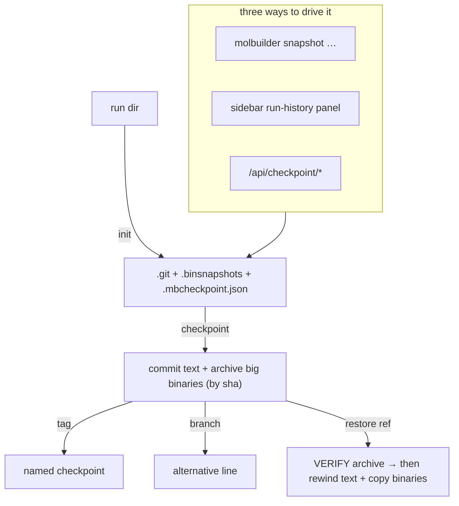

# Run checkpoints — a developer's & user's guide

**What this is.** A plain-language guide to molbuilder's **run checkpoints**:
git-based save/restore for a run directory, with big simulation binaries
archived safely alongside. Covers the mental model, the three ways to use it
(CLI, the sidebar panel, the HTTP API), and — because this is **data-safety
critical** — the restore-safety rules you must not regress.

**What this is NOT.** The authoritative contract. `protocols/run-checkpoints.md`
is the source of truth (the exact phase model, the §4.6 restore safety contract,
the §10 archive format, the §6 sidebar UI). This guide teaches and points there.

---

## 1. The one-paragraph mental model

Every run directory can be its own **git repo**. A **checkpoint** is a commit
of the text files **plus** an archive of the *big binaries* (SIESTA `.DM`,
`.TSHS`, …; PySCF `.chk`, `.cube`) — which git handles badly — stored by
content-hash under `.binsnapshots/`. You can **tag** a checkpoint, **branch** to
explore an alternative, and **restore** everything (text + binaries) back to any
checkpoint. Restore is **verify-first**: it validates the archived binaries
before touching your working tree, so a corrupt/partial archive aborts cleanly
instead of leaving a half-restored, contaminated directory.

---

## 2. The pieces

| Layer | Where | Role |
|---|---|---|
| Core | `molbuilder/checkpoint.py` (`Repo`) | git plumbing + big-binary archiving/verify — content-agnostic |
| CLI | `molbuilder snapshot …` | the terminal / SSH surface |
| HTTP | `molbuilder/web/blueprints/checkpoint.py` (`/api/checkpoint/*`) | thin contract for the UI |
| Sidebar UI | `lib/projects/checkpoint.js` | the run-history panel (see `protocols/run-checkpoints.md` §6) |
| On disk | `.git/`, `.binsnapshots/<sha>/` + `MANIFEST`, `.mbcheckpoint.json` | commits, archived binaries, and the archive-config |

---

## 3. How to use it

**CLI** (`molbuilder snapshot`):

| Command | Does |
|---|---|
| `init [--engine siesta\|pyscf]` | make the dir a checkpoint repo; seeds the big-binary globs for the engine |
| `checkpoint [-m msg]` | commit current state + archive new/changed big binaries |
| `list` | list checkpoints (most recent first) |
| `tag <label> [-m msg]` | annotate a checkpoint |
| `branch <name>` | fork to explore an alternative |
| `restore <ref>` | rewind **text + binaries** to a checkpoint (verify-first) |
| `config [--set '<globs>']` | show / edit which files are archived as big binaries |

**Sidebar panel:** the same actions (Init / Checkpoint-now / Tag / Restore) for a
run directory — appears only at run-dir depth 3, explicit-refresh only
(`protocols/run-checkpoints.md` §6).

**HTTP API:** `/api/checkpoint/{init,state,list,diff,commit,tag,restore,config,migrate-manifest}`
(shapes in `web-api.md` §2). `state` is cheap (no archive walk); `restore`
returns advisories on dirty/corrupt trees.

---

## 4. Key concepts

- **Why archive big binaries separately?** git bloats on large binary blobs.
  molbuilder stores each big binary once by **content-sha** under
  `.binsnapshots/<sha>/` with a 3-column `MANIFEST` (sha, size, name); the git
  commit tracks only text. Identical binaries across checkpoints dedupe.
- **Engine-aware classification (editable).** What counts as a "big binary" is
  **backend-specific** — SIESTA (`.DM`, `.HSX`, `.TSHS`, `.TBT.*`…) vs PySCF
  (`.chk`, `.cube`). `init --engine` seeds the right globs into
  **`.mbcheckpoint.json`** (`molbuilder/checkpoint-config@1`); edit them later
  via `snapshot config --set`, the `/api/checkpoint/config` route, or the
  sidebar table. `Repo.archive_globs()` / `set_archive_globs()` is the unified
  accessor.
- **Restore is verify-before-mutate (the safety contract, §4.6).** Restore
  first verifies the archived binaries (exist + size + sha256) and **aborts the
  whole restore** on any mismatch — it never leaves a half-restored tree. It
  also **refuses** when the working tree has uncommitted big-binary changes
  (they'd be silently overwritten) and **warns** when an archive is missing.
- **Archives are published atomically.** A checkpoint builds the archive in a
  temp dir and renames it into place only after every binary is copied +
  verified + the MANIFEST written — so a crash mid-copy can't leave a partial
  archive that looks complete.

---

## 5. Safety rules / gotchas (don't regress these)

- **Restore verifies before it mutates.** Never reorder restore to git-restore
  first — a corrupt archive must abort with nothing touched (§4.6, §10.3).
- **Dirty binaries block restore.** If the working tree has uncommitted
  big-binary changes, restore refuses rather than overwrite them.
- **Big-binary config is engine-specific.** Don't hard-code SIESTA globs for a
  PySCF run — set the engine at `init` (the web UI passes it from task setup).
- **`snapshot config` with an empty glob list is rejected** — an empty set
  would silently archive nothing.
- **This is data-safety-critical code.** If files are contaminated/corrupted the
  cost is real; the error paths are load-bearing, not optional.

---

## 6. Where the authority lives

- **`protocols/run-checkpoints.md`** — the contract: the phase model (§4), the
  **restore safety contract (§4.6)**, engine-aware classification (§9), the
  archive format (§10), and the **sidebar UI integration (§6)**.
- **`protocols/projects-sidebar.md`** — the sidebar module that hosts the run-history panel (a checkpoint-domain consumer of the sidebar).
- **`web-api.md` §2** — the `/api/checkpoint/*` route shapes.
