# Schema-driven forms — a developer's guide

**What this is.** A plain-language guide to `window.molbuilder.formSchema` — the
bridge that turns a **config dataclass** (server-side) into a **Build form**
(browser) and reads the user's answers back into a dict the build endpoints
accept. It's how `SiestaConfig` / `PySCFConfig` / `SpectraConfig` / transport
config become editable UI without hand-writing a form per engine.

**What this is NOT.** A per-field spec. The field set is defined by the
**dataclasses** (`molbuilder/config/*`) and the server schema producer
(`web/blueprints/_shared.py::dataclass_to_form_schema`); the wire shape is in
`web-api.md` (`GET /api/build/schema/<engine>`). This guide teaches the
round-trip; those are the authority.

---

## 1. The one-paragraph mental model

The **dataclass is the source of truth.** The server reflects it into a JSON
**schema** (field name, kind, choices, optionality); the browser fetches that
schema, **renders** a form from it, and later **collects** the DOM values back
into a flat dict whose keys are the dataclass field names — so the same dict
goes straight to the build endpoint. You never write engine-specific form HTML:
add a field to the dataclass, and the form grows itself.

```mermaid
flowchart LR
  DC["config dataclass\n(SiestaConfig / PySCFConfig / …)"] -->|"dataclass_to_form_schema (server)"| SCH["JSON schema\nGET /api/build/schema/<engine>"]
  SCH -->|"formSchema.renderForm(container, schema)"| FORM["rendered <form>\n(ids = field names)"]
  FORM -->|"user edits"| FORM
  FORM -->|"formSchema.collectForm(container, schema)"| VALS["flat dict\n{system_label, kgrid:[1,1,1], …}"]
  VALS -->|"POST"| BUILD["/api/build/* (accepts verbatim)"]
  SAVED["saved values"] -->|"formSchema.setValues(container, schema, vals)"| FORM
```



---

## 2. The API (`window.molbuilder.formSchema`)

| Call | Does |
|---|---|
| `fetchSchema(engine)` | `GET /api/build/schema/<engine>` (siesta / pyscf / spectra / transport); throws on error, returns the schema body |
| `renderForm(container, schema)` | replace `container` with the rendered `<fieldset>` sections; each input's `id` = the schema field id (`<prefix>-<field-name>`) |
| `collectForm(container, schema)` | walk the schema, read current DOM values → a flat dict keyed by dataclass field names (optional-empty → `null`) |
| `setValues(container, schema, values)` | write a values dict back into an already-rendered form (restore saved state) |

Typical use:

```js
const fs = window.molbuilder.formSchema;
const schema = await fs.fetchSchema("siesta");
fs.renderForm(container, schema);
// later, on Generate:
const cfg = fs.collectForm(container, schema);   // -> {system_label, kgrid, …}
await fetch("/api/build/siesta", { method: "POST", body: JSON.stringify(cfg) });
```

Because input ids match field names, the existing **sessionStorage persistence**
and the **compatibility engine** keep working against the rendered form unchanged.

---

## 3. Field kinds

The renderer handles a fixed set (mirroring `_shared.py::_field_to_schema`):

| Kind | Renders as | From dataclass type |
|---|---|---|
| `checkbox` | checkbox | `bool` |
| `int` / `number` | numeric input (null option if optional) | `int` / `float` |
| `text` | text input (respects `pattern`) | `str` |
| `select` | `<select>` of choices | enum-like |
| `tri-select` | auto / true / false | `Optional[bool]` |
| `int-triple` | three int inputs (e.g. `kgrid`) | `Tuple[int,int,int]` |
| `stage-table` | per-stage rows + preset dropdown | `List[<dataclass>]` (e.g. `PySCFConfig.stages`) |

**The renderer never invents a kind.** If the server sends a kind the JS doesn't
know, that's a bug — add the mapping in `_field_to_schema` (server) *and* a
render branch here, together.

---

## 4. The rule that matters: the dataclass is the source of truth

To **add or change a form field**, you edit the **dataclass** (`config/*`) and,
if it's a new shape, the server's `_field_to_schema` — **not** the JS form.
The form is generated; hand-editing it desyncs the UI from the dataclass the
build endpoint validates against. (This is the client-side face of the
project-wide "dataclass is the lingua franca" principle.)

---

## 5. Common gotchas

- **Don't hand-write form fields** — add them to the dataclass; the form follows.
- **`collectForm` keys are dataclass field names** — the dict is POST-ready as-is;
  don't remap keys.
- **Optional-empty collects as `null`**, not `""` — the endpoints expect that.
- **Unknown kind → error, by design** — teach `_field_to_schema` + the renderer
  together; don't special-case in the caller.
- **Restore with `setValues`** after `renderForm`, not by poking inputs directly.

---

## 6. Where the authority lives

- **`web-api.md`** — `GET /api/build/schema/<engine>` (the wire shape).
- **`molbuilder/config/*`** + **`web/blueprints/_shared.py`** — the dataclasses
  and `dataclass_to_form_schema` / `_field_to_schema` (what fields exist).
- **`tabs/structure-optimization.md`** — the Build tab that hosts these forms.
- **`dataclass-source-of-truth`** principle (design.md) — why the form is generated.
