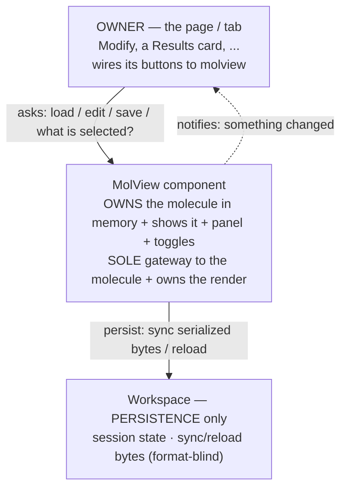
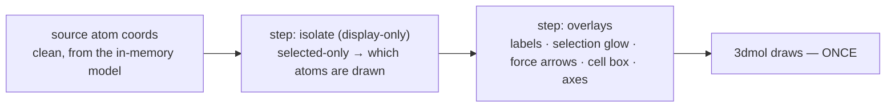
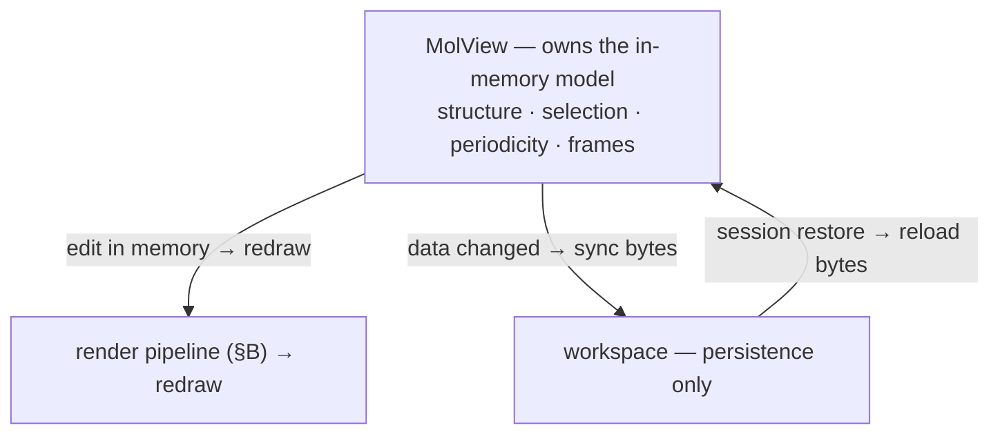
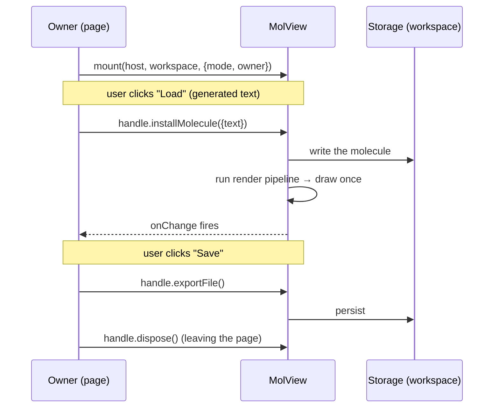
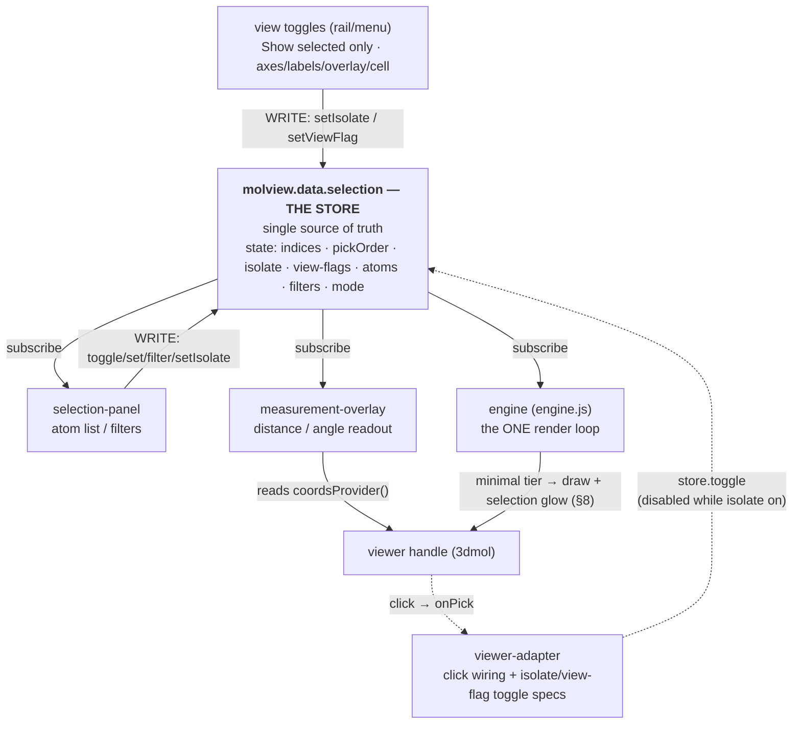
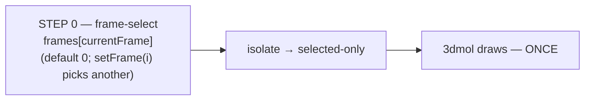
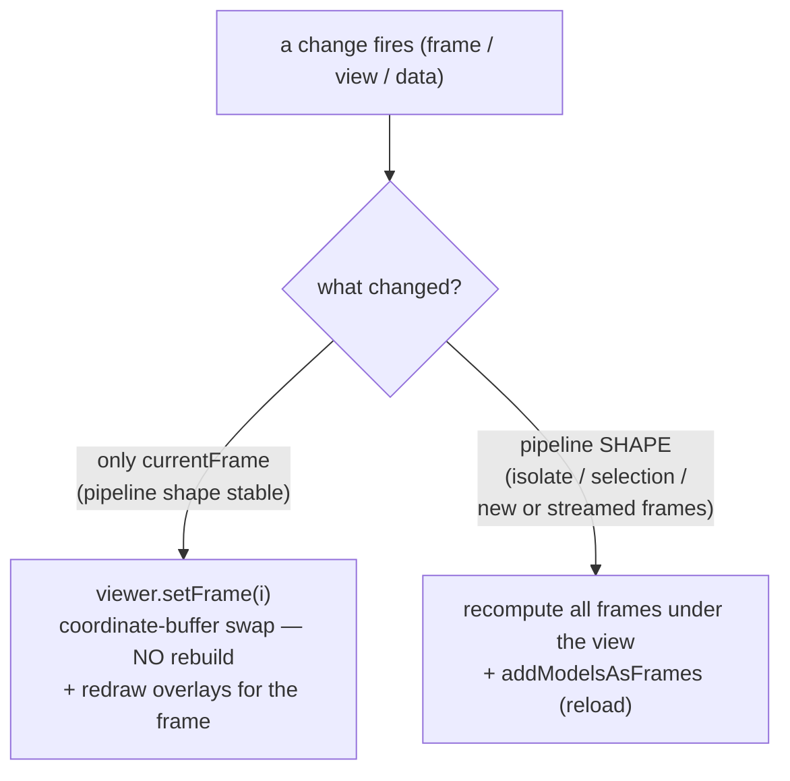
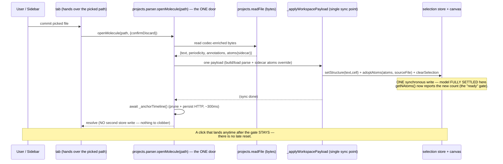

# MolView module — contract

> The **MolView module** is the **self-contained structure component**: the 3-D viewer, atom
> selection, measurement — **and the in-memory data model behind them.** It
> **OWNS its data** (structure · selection · periodicity · frames) in memory and **conceals both
> that data AND its API** in one module. Nothing outside reaches its data except through its API.
>
> It uses the **workspace** ([`workspace-contract.md`](workspace-contract.md)) for **persistence
> only** — to *sync* its in-memory data to disk (as serialized bytes it produces in its own
> format) and to *reload* it on a session restore. The workspace is never MolView's in-memory
> store and never interprets its data. The two are different layers in different docs.
>
> Section numbers begin at **§11** for continuity with cross-references written while this
> material briefly lived as "Part II" of the workspace contract.
>
> **The in-memory data model lives here.** MolView owns the structure / selection / periodicity /
> frames in memory and exposes them on **`window.molbuilder.molview.data`** (`lib/molview/data-model.js`)
> — accessors, mutators, the frame axis, the selection/view sub-namespaces, and the serialization.
> Its full surface is specified in **§19–§21**. The workspace keeps only session + file-access
> persistence (workspace-contract §4 / §4.6); MolView calls `ws.persist(...)` to hand it the
> serialized bytes on a data change.

---

## For developers — start here

MolView is a **self-contained, embeddable 3-D structure component**. You drop it onto a
page; it shows the molecule, the selection / Cell panel, and the view toggles as one unit.
It is the **single gateway to the molecule** — every read, write, and redraw of it goes
through molview — and it owns the display. You drive it through **one small API**; you never
wire its internals and never touch storage yourself. (MolView **owns the molecule data in
memory**; the workspace is only where it **persists** that data — sync to disk / reload — never
where the data lives while you work.)

This section is the whole mental model in four pictures, then the API and the rules. The
numbered sections (§11+) are the precise reference behind it.

### A. Architecture — ONE door (owner → molview; molview owns the data, persists via the workspace)

The page that uses molview (the **owner**) talks **only** to molview. molview **holds the
molecule in memory** and is the sole gateway to it. molview talks to the workspace **only to
persist** — sync the data to disk or reload it. The owner never reaches around molview for the
molecule data, and molview never uses the workspace as its in-memory store.



One door means the owner can't corrupt or desync molview's data by poking around it, and any
page reuses molview by learning one small API. (The owner may still use the workspace for its
*own* other data — just never for molview's molecule.)

### B. The render — ONE coordinate pipeline → ONE draw

molview turns the stored molecule into pixels with a **pipeline of coordinate steps** that
ends in a **single 3dmol draw**. Every step only computes *which coordinates to show* and
*what overlays to hang on them*; the **isolate** filter (show selected atoms only) is the one
display-only step that changes the drawn atom set. There is **no second render and nothing
layered on top** — one `process` pass → one `setStructure`.



Isolate is **display-only**: it filters the *render list*, never the stored data (`getFrame(i)`
always returns the full, original-indexed coords). molview **always recomputes from the clean
model** — never from an already-filtered list. Full detail: §14.

> **k-grid is NOT a render step and has no place in molview.** It is an FDF/SIESTA
> reciprocal-space *sampling* parameter that lives on `SiestaConfig` (config land), never on
> molview's geometry or render. molview neither tiles the cell nor stores a k-grid. (Earlier
> drafts of this doc showed a "k-grid tiling" render step — that was never built and is gone.)

### C. How molview holds its data — and persists through the workspace

molview **holds the molecule in its own in-memory model** — structure, selection, periodicity,
frames. Reads and edits happen against that model, in memory; a change **re-runs the render
pipeline (§B) and redraws**. molview never keys `sessionStorage` and never hits the server
itself. It touches the **workspace only for persistence**: on a data change it **syncs** its
serialized state to disk, and on a session restore it **reloads** — the workspace stores/returns
those bytes **format-blind** (molview owns the `.xyz`/`.molstruct.json` format).



**Persistence is namespaced by the owner** (§18.4): molview passes its `owner` (session/tab
identity) to the workspace, which keys its saving points by it — so two tabs never collide.

MolView reads and edits that model directly through **`molview.data.*`** (§19); the workspace
never holds it. On a data change MolView serializes and calls `ws.persist(...)` — the workspace
writes those bytes format-blind (§C, §18.3).

### D. The API — what the owner calls (the contract with the owner)

**The entry point is one ES-module import.** MolView is a native ES module; you embed it with a
single import of its entry file — the whole dependency graph loads behind that one line, in the
right order, with no hand-maintained `<script>` stack:

```html
<script type="module">
  import { mount } from "/static/lib/molview/index.js";
  const handle = await mount(hostEl, workspace, { mode: "modify", owner: "modify" });
</script>
```

`mount` is **async** — it builds the card, embeds the 3Dmol viewer, mounts the panel, and
resolves to the `handle`. (A transitional global `window.molbuilder.molview.mount` still exists
for not-yet-migrated classic scripts, but new code imports `mount`; see §18.1 and the
load-order note in §F.)

#### D.0 Reading is DECOUPLED from loading — two different things

> **This is the core usage rule. Read it before touching MolView.**

The molecule data lives **inside** MolView (it is concealed internal state). There are two
completely separate concerns, and you must not conflate them:

- **Loading / writing data is an EXPLICIT operation.** Data gets *into* MolView only through a
  deliberate call — `installMolecule({text, …})` (from generated text), a project-file open
  (`projects.parser.openMolecule(path)`), a modifier op (`applyOp`), or a checkpoint
  (`save`/`load`). These are the *only* ways the model changes. Nothing loads data implicitly.
- **Reading data is a SEPARATE, at-the-moment lookup.** Whoever wants the current data **asks
  MolView for it at the moment it needs it** and gets **whatever MolView currently has — including
  nothing**. A reader must **never hold a fixed reference to the data**; it looks it up each time.

Concretely, that means only the **stateless** pieces are `import`ed; the **live data** is **looked
up at runtime**:

| What you need | How you get it | Why |
|---|---|---|
| `mount` (the entry) | `import { mount }` from the door | a function, always the same |
| `formula(elements)` (a helper) | `import { formula }` from the door | a pure function, no state |
| **the molecule data** | **look it up: `window.molbuilder.molview.data`** at the moment you read | it is MolView's live internal state; reading must return *what MolView has right now*, decoupled from when/how it was loaded |

So a consumer that reads the model does, at read time:

```js
const data = window.molbuilder && window.molbuilder.molview && window.molbuilder.molview.data;
const s = (data && data.getStructure) ? data.getStructure() : null;   // null = MolView has no data
```

**Never** `import { data }` and hold it — that wires the reader into MolView's internals and
couples reading to loading. `window.molbuilder.molview.data` is therefore **not** a transitional
shim to delete: it is MolView's permanent **front door for reading the current data**. (For tests,
a module may accept an injected data stub through a `configure`/`_bind` seam — that is test
plumbing; production always looks it up.)

**How this fits the persistence layer + tab-return (the whole point of the split).** The
persistence module (the **workspace**, `workspace-contract.md`) keeps each tab's session data
recoverable across tab-switch / refresh. It plugs into the read/load split cleanly:

- The workspace is **passed to `mount(host, workspace, {owner})`** — MolView *receives* it (it does
  not import it; when the workspace itself becomes an ES module later, this injection point is
  unchanged). `owner` namespaces the tab so tab A never restores tab B's data (`useNamespace(owner)`).
- **Restore is a LOAD.** On mount / when the user returns to a tab, MolView restores that tab's
  persisted session (`ws.readPersistedSnapshot()` → `applyWorkspacePayload` / `adoptSession`) —
  i.e. it *loads* the saved bytes into `molview.data`. This is an explicit write, exactly like any
  other load. **"What MolView holds when you switch back to a tab" = the data this restore loaded.**
- **A data change PERSISTS.** After a load/edit/checkpoint, MolView serializes and calls
  `ws.persist(...)` (namespaced by `owner`) so the session survives the next tab-switch/refresh.
- **Reading is unaffected.** A reader still just looks up `window.molbuilder.molview.data` and gets
  whatever is loaded *now* — which, right after a tab-return, is the restored data (or *nothing* if
  that tab had none). Reading never triggers a load or a restore.
- **On mount, defer to MolView's restore — do NOT clobber it.** A consumer that also loads on mount
  (e.g. the projects sidebar reacting to a selection) MUST consult `ws.mountRestoreTarget()` and
  stand down when the restore already owns the file (`workspace-contract.md §4.5`). Only *explicit
  user action* (clicking Load / Generate) writes over a restored session.

The owner uses only these; it never sees storage:

| Call | Plain meaning |
|---|---|
| `mount(host, workspace, {mode, owner})` → `Promise<handle>` | Put a molview on the page, backed by `workspace`, identified by `owner`. Async. |
| `handle.installMolecule({text, filename})` | "Install this molecule from text" (generators / demos). A project **file** loads through the projects sidebar door `projects.parser.openMolecule(path)` — which installs into the SAME model — because files are the projects package's job, not the handle's. |
| `handle.getStructure()` / `handle.getSelection()` | "Give me the current molecule / what's selected" — a **copy**. |
| `handle.exportFile()` / `handle.undo()` | "Export its bytes" / "retract one checkpoint (= `data.load(-1)`)." |
| `handle.onChange(fn)` → unsubscribe | "Tell me when something changed," so the page can refresh its own bits. Returns an off-fn. |
| `handle.dispose()` | Remove the molview and release everything. |
| `handle.ok` | `true` on a successful mount; a **failed** mount (e.g. host too narrow) resolves to `{ ok:false, error, dispose }` — check it. |
| **Frame axis (§14.5)** — present for trajectories, inert for a static structure: | |
| `handle.setFrame(i)` / `frameCount()` / `currentFrame()` / `getFrame(i)` | select / count / read the current frame / read one frame's coords. |
| `handle.play(opts)` / `pause()` / `isPlaying()` | drive playback (the frame bar's play button calls these). |

`mode` = `"modify"` (editable) or `"readonly"` (view + inspect). `owner` = this molview's
identity (e.g. `"modify"`, `"results:<id>"`) for namespaced persistence.

**Overlays are data-driven, not handle calls.** There is no `setArrows` / `setLabels` /
`setFrameArrows` on the handle (they were removed). Force vectors ride in **with the data**: the
consumer hands frames + per-atom forces to `data.reloadFrames(frames, { forces })` (or
`addFrames`), and the render engine builds the arrows itself (force → arrow is owned by
`engine/process.js`, §14). The owner only toggles *visibility* through the view flags
(`data.selection.setViewFlag("showForces", true)`); index labels and the selection glow work the same way.

The **frame-axis** rows are the full handle surface for trajectories (§14.5); on a single static
structure they are still present but no-ops (`frameCount() === 1`, and the frame bar stays
hidden). The complete key set the handle exposes is enumerated in §18.1.

### E. Read/write protocol — the rules that keep it safe

1. **One door.** Every molecule read/write goes through molview's API; the owner never
   touches storage for the molecule.
2. **Reads are copies.** Every read hands back a defensive copy; holding it can't mutate the
   store ([`workspace-contract.md`](workspace-contract.md) §1.2.1).
3. **Writes persist.** Every write goes through the workspace, which saves it; molview never
   writes storage keys itself.
4. **Change → redraw.** molview subscribes to the workspace; any data change re-runs the
   render pipeline (§B) and redraws. The owner does not trigger redraws.
5. **Owner-namespaced.** `owner` isolates this molview's saved data from other tabs' (§18.4).

### F. How to use MolView — a walkthrough

You are the **owner** (a page or tab). Using molview is five steps; you never write storage
or 3-D code yourself.

1. Put an **empty host element** where the molview should sit.
2. Get the **workspace** it should use — the real persistence layer. Every consumer
   (Modify and read-only Results alike) persists its session state through it.
3. **`mount`** molview into the host.
4. Wire **your page's buttons to the handle's API** (`installMolecule` / `exportFile` / `undo`) —
   never to storage. (A project-**file** Load button calls the projects door
   `projects.parser.openMolecule(path)` instead, which installs into the same model.)
5. React to **`onChange`** to refresh your page's own bits; **`dispose`** on teardown.



Owner code, in plain shape (a `type="module"` script):

```js
import { mount } from "/static/lib/molview/index.js";

// 2-3: get the workspace, mount molview into the host (async)
const handle = await mount(hostEl, workspace, { mode: "modify", owner: "modify" });
if (!handle.ok) { /* host too narrow, etc. — handle.error explains */ }

// 4: wire page buttons to the API — NOT to storage
//    (generated text installs directly; a project FILE goes via the projects door:
//     openButton.onclick = () => molbuilder.projects.parser.openMolecule(pickedPath); )
generateButton.onclick = () => handle.installMolecule({ text: generatedXyz });
exportButton.onclick = () => handle.exportFile();
undoButton.onclick = () => handle.undo();

// 5: react to changes, and clean up on the way out
handle.onChange(() => refreshTitle(handle.getStructure()));
onPageLeave(() => handle.dispose());
```

> **Load-order gotcha for classic co-scripts.** `molview/index.js` is a `<script type="module">`,
> which the browser **defers** — it runs *after* every classic `<script>` on the page, just
> before `DOMContentLoaded`. A `type="module"` consumer is safe automatically: its `import` of
> the entry forces the whole graph (and its transitional `window.molbuilder.*` globals) to
> execute *before* the consumer's own body. But a **classic** co-script on the same page must
> **never capture a molview global in a load-time `const`** — at classic-load time the module
> has not run yet, so `window.molbuilder.molview` / `.fmt` are still `undefined`. Read them at
> **call time** instead:
>
> ```js
> // WRONG — frozen undefined; the mount guard silently bails, no viewer ever appears:
> const mv = window.molbuilder.molview;
> function ensureMounted() { if (!mv) return; mv.mount(host, ws, opts); }
>
> // RIGHT — resolved when the click / whenReady / render actually fires (well after load):
> const mv = () => window.molbuilder && window.molbuilder.molview;
> function ensureMounted() { const m = mv(); if (!m) return; m.mount(host, ws, opts); }
> ```
>
> (This exact bug took out the structure-optimization tab's viewer and the Modify tab's formula
> readout during the ESM migration — both classic scripts, both froze `undefined`.) The clean
> fix is to make the consumer a `type="module"` script and `import { mount }`; where that isn't
> done yet, the call-time getter is mandatory.

**The two real ways it's used** (same component, different workspace + mode):

| Scenario | workspace | mode | owner | Effect |
|---|---|---|---|---|
| **Modify tab** | the **real** workspace | `"modify"` | `"modify"` | full editing; edits persist to disk |
| **Results card** | the **real** workspace | `"readonly"` | `"results:<id>"` | read-only DISPLAY (no edit controls); its session (opened file/frame/selection) still persists + restores; isolated by `owner` |

The owner picks the workspace + mode + owner; **everything else is identical**, because the
component is the same. That is what "fully concealed and reusable" buys.

> **This document is the DESIGN — the contract the code must comply with.** It describes
> MolView as it is *meant to be*: one component, one door, one render pipeline. Where the
> current code diverges (e.g. Modify still drives some storage directly instead of asking
> molview), **the code is wrong and gets fixed to match this** — the design is never watered
> down to match the code. Migration status (what's already brought into compliance) is
> tracked separately in [`molview-migration-plan.md`](molview-migration-plan.md), not here.

---

## §11 The MolView module — what it is + the boundary

**MolView is ONE component: the 3-D viewer, the atom selection, the Cell/periodicity
panel, and measurement — as one thing.** These are not bolted-on neighbours; they are parts
of the same component. It renders the molecule, lets the user pick/filter atoms, reads off
geometry, and edits periodicity — all behind the one API (§D). (k-grid is NOT a molview
concern — it is an FDF/SIESTA sampling knob, §B.)

Two rules define the whole component:

1. **MolView owns its data in memory and reads/writes it through `molview.data` (§19); it
   never does I/O or parsing itself.** The molecule (atoms + coordinates), and the lattice `cell` live in MolView's own in-memory model (`molview.data`, §19.1). molview
   reads them through `molview.data.*` and draws them, and writes changes back the same way; on a
   data change it serializes and calls `ws.persist(...)` (§18.3). Reading files and extracting a cell happen **upstream** (the results tab / `molbuilder/parse/`)
   and are installed *into* MolView's model — never by molview parsing them itself, and **never
   handed to molview directly by the owner** (§A, the single door). See §14.
2. **The selection store is the single source of truth for selection + view state.** The
   panel, the viewer-adapter, and the viewer never talk to each other directly — they all
   go through the store (§13). That store is reached as **`molview.data.selection`** (§12).

### 11.1 Boundary — molview vs. the owner vs. storage

Three parties, one door between each (§A):

| MolView owns (inside the component) | Outside molview |
|---|---|
| 3-D rendering + the render pipeline (§14) + the viewer card chrome (style / labels / axes / reset / screenshot / background / export) | **Owner:** page layout, where the card sits, and wiring page buttons to molview's API |
| The selection store + panel + viewer-adapter; measurement; overlays (selection glow, cell wireframe, labels, arrows, camera) | **Owner:** its own *non-molecule* data + page chrome |
| The in-memory molecule model + its API (structure, periodicity, selection, frames — `molview.data`, §19) | **Persistence (workspace):** stores + returns the serialized bytes format-blind; the namespace it saves under (workspace-contract §4) |
| Namespacing its persisted data by `owner` (§18.4) | **Upstream (parse / results):** fetching files, parsing formats, extracting the cell *into* molview's model |

Crossing the boundary:
- **Owner → molview:** the API only (§D) — `mount / load / getStructure / getSelection / save / undo / onChange / dispose`. The owner never calls the viewer handle or the store directly.
- **molview → workspace:** persistence only — `ws.persist(...)` on a data change, `ws.readPersistedSnapshot()` on restore; the data model itself is molview's (§C, §19).
- **Internal wiring** (maintainers, not the owner): molview drives the viewer via its handle
  (`setStructure/setStyle/setAxes/setOverlays/setPick`, readers `getAtomCount/getAtomCoords/
  getElements/getLattice/getCell/getPickedIndices/getCamera`) and the store (`set/toggle/
  setIsolate/setViewFlag/subscribe`); the viewer reports back via `opts.onReady/onError/
  pick.onPick/export.onExport/animation.onFrame`. These live *inside* molview (§13) — the
  owner never sees them.

molview never reads 3Dmol objects outside its own handle; it never reads owner DOM outside
its own card.

## §12 The selection store — `molview.data.selection`

The store holds all selection + view state. The one process-wide instance is
reached through **`window.molbuilder.molview.data.selection`** (`molview.data.selection`),
which the data model (`data-model.js`) builds around the `_createStore` factory
(`lib/molview/_selection-store-impl.js`) — there is **no** public
`molbuilder.selection.store` singleton (retired Phase 9, workspace-contract.md §8).
`molbuilder.selection.createEphemeralStore()` mints an isolated instance for a
readonly inspector. (The rest of `molbuilder.molview.selection.*` holds the module's
functions: `mountPanel`, `measurements`, `viewerAdapter`, `_createStore`,
`_surfaceSnapshot`.)

### 12.1 State (exact — `_initialState`)

```
{
  sourceFile:  null | string      // absolute structure path
  atoms:       Atom[]             // {index(0-based), element, x, y, z, labels[],
                                  //  isFrozen, atomName?, residueName?, chainId?}
                                  //  TRANSITIONAL per-atom shape.  The MANDATED model
                                  //  is COLUMNAR behind the accessor API (§19.1 + §19.2)
                                  //  -- reach it via molview.data.*, not this raw array;
                                  //  Track D4 (molview-migration-plan) seals it.
  selection:   number[]           // THE selection set (sorted; the canonical state)
  pickOrder:   number[]           // same atoms in click order (angle vertex = pickOrder[1])
  mode:        "click" | "filter"
  isolate:     boolean            // "show selected only" — VIEW state (was the
                                  //  adapter's setIsolateMode; moved into the store)
  showIndex, showForces, showCell, showAxis: boolean   // view-flag toggles (setViewFlag, §13)
  forceScale:  number | undefined // force-arrow length (Å per force unit); undefined = default
  filters:     Filter[]           // {kind: by_element|by_index|by_residue|by_label, value}
  combinator:  "or" | "and"
  loading:     boolean
  error:       null | string
}
```

`selection` is canonical; `pickOrder` is its click-order shadow (kept in lock-step
by every mutator). **`isolate` and the view-flag toggles (`showIndex`/`showForces`/`showCell`/`showAxis`/`forceScale`) are VIEW state that lives in the store**
— not on the adapter, not on a global handle. This is what makes the panel drive
them through the store (§13), obeying the single-source rule. (These fields
surface on the data-model read API as §19.2 `getSelection()` / `molview.data.selection.getState()`,
raw `selection` renamed to `indices`.)

### 12.2 Surfaces

Consumers never touch the raw store; they use a renamed **surface**:

- **`molview.data.selection`** — the singleton surface. Both `getState()` and the object
  passed to `subscribe(fn)` callbacks are reshaped by the one `_surfaceSnapshot` shaper, so
  both deliver the SAME `{indices, …, isolate, showIndex, showForces, showCell, showAxis, forceScale, …}` shape (raw `selection` renamed
  `indices`) — a panel that reads via `subscribe` and a click handler that calls `getState()`
  never see different field names.
- **`createEphemeralStore()`** — an isolated instance with the **same surface
  minus** `getAtoms / setSourceFile / refreshAtoms` (workspace-lifecycle methods
  a readonly inspector doesn't use).

#### 12.2.1 The method table (`molview.data.selection.*`)

Local mutators (no HTTP; each fires `notify()` exactly once):

| Method | Effect |
|---|---|
| `toggle(i)` | Toggle atom `i`. Out-of-range ignored. |
| `set(indices)` | Replace selection with the sorted-unique copy of `indices`; out-of-range filtered. |
| `add(indices)` | Union with the current selection (sort + dedup). |
| `remove(indices)` | Subtract from the current selection. |
| `all()` | Select every atom (`0..n-1`). |
| `invert()` | Replace with the complement. |
| `clear()` | Empty the selection. |
| `setMode(mode)` | `"click"` or `"filter"`. |
| `setFilters(filters)` | Replace the filter list. Does NOT eval — call `applyFilter()`. |
| `addFilter(f)` / `removeFilter(i)` / `updateFilter(i, patch)` | Per-filter edits used by the filter-row UI. |
| `setCombinator(c)` | `"or"` or `"and"`. |
| `setIsolate(on)` | Set the "show selected only" VIEW flag (§12.1). |
| `setViewFlag(name, value)` | Set a view-flag toggle — `showIndex` \| `showForces` \| `showCell` \| `showAxis` \| `forceScale`. The View-menu / rail buttons write these (store-backed toggles, §13); the engine reads them and renders. |
| `writeLabel(target, indices)` | REPLACE-per-target label change **in memory** (no HTTP); `target` is `"frozen_atoms"` or a region name. Marks the model dirty so the edit survives reload; the sidecar is written only on explicit Save. |

Server-backed op:

| Method | Server route | Returns | Effect |
|---|---|---|---|
| `applyFilter()` | POST `/api/selection/eval` | `Promise<number[]>` | Sends filters + combinator; replaces selection with the result; preserves mode. |
| `refreshAtoms()` | POST `/api/selection/atoms` | `Promise<void>` | Refetch atoms for the current `sourceFile`; overlays the `.molstruct.json` sidecar (frozen_atoms + regions). No-op when `sourceFile` is null. |

Reads + lifecycle:

| Method | Meaning |
|---|---|
| `getState()` | Defensive `{indices, pickOrder, mode, filters, combinator, isolate, showIndex, showForces, showCell, showAxis, forceScale, …}` snapshot (raw `selection` renamed `indices`). |
| `subscribe(fn)` | Store-scoped subscription; delivers the same contract shape as `getState()`. |
| `getAtoms()` | Alias for `molview.data.getAtoms()` (§19.2). |
| `adoptSession({sourceFile, atoms})` | Atomically install path + atoms + selection in one promise (file-commit bootstrap). |
| `setSourceFile(path)` / `setLoader(loader)` | Set the sidecar source-of-truth path / the async atom-loader the store uses for `refreshAtoms`. |

## §13 The viewer + composition (panel + adapter, through the store)

### 13.1 The viewer — `viewer.embed(host, opts) → handle`

`window.molbuilder.viewer.embed(host, opts)` mounts the viewer card and returns a
**handle**. Structure text (`opts.xyz` / `opts.pdb`) + a declarative options object
come in through the call; the viewer maintains the drawing. The handle methods molview
relies on (the full handle in `mol-viewer-embed.js` exposes roughly twice these — style /
labels / arrows / animation / knobs getters+setters — but these are the load-bearing ones):

```
setStructure  setStyle  setAxes  setOverlays  setPick  setPickedIndices
getPick  getPickedIndices  getAtomCount  getAtomCoords  getElements
getLattice  getCell  getCamera  setCamera
playAnimation  setAnimationFrame  refit  screenshot  exportData  dispose
```

- **`opts.lattice`** (3×3 row vectors) → `getLattice()` returns it (§14). The **cell
  wireframe** draws only when **`opts.cell`** is also set (`_redrawCell` gates on
  `state.current.cell`). The viewer does **not** parse a lattice from the file text; molview
  passes it in (having read it from storage, §14).
- **`setSelectionHalo(indices)`** glows the current **selection** — one translucent `addSphere`
  per selected atom (a shape; the atom's colour shows through, §13.3). **`setStructure({xyz,
  lattice})`** replaces the displayed atom *list* — the plain unit cell, the isolate-**filtered**
  subset, or a k-grid supercell (§14). Isolate is a render-list filter done through `setStructure`,
  **not** an overlay. (`setOverlays(spec)` is a separate general overlay door — style/marker/halo
  shapes on chosen atoms — used by bare embedders like VibrationView; the MolView selection no
  longer uses it.)
- Hard deps (`embed()` throws if absent): `$3Dmol`, `molbuilder.viewer.create`,
  `molbuilder.fmt`. Soft deps degrade silently: `molbuilder.axes`, `molbuilder.style`.

### 13.2 Composition — panel + adapter + viewer

Every part talks **only** to the store — never to each other. Writers push mutations in;
readers subscribe and react. The store is the one hub; the viewer handle is the one surface
everything draws onto.



- **`selection.mountPanel(host, {store, viewerHandle, mode})`** fetches the panel
  partial, mounts `selection-panel`, and attaches `viewer-adapter` to the handle
  — both bound to the given `store` (the singleton or an ephemeral one).
- The **panel** renders from `store.getState()` and calls mutators on input
  (toggle, filter, `setIsolate`). The **adapter** forwards viewer clicks to `store.toggle`
  (and provides the isolate / view-flag toggle specs); it does **not** paint — the **engine**
  subscribes to the store and glows the selection (§13.3). While isolate is on the adapter
  **drops clicks** and the engine sends no glow — the window is display-only then (§14.3);
  isolate itself is a render-list filter in the engine (§14.1), not an overlay.
- Panel and adapter never reference each other. `mode:"readonly"` hides the
  panel's write controls; clicks still feed the store.
- `fused-layout.css` is how **molview's composition layer** places the panel as a foldable
  side/bottom region of the viewer card (molview owns this layout + the fold, §18.2; the
  viewer itself offers no layout API).

### 13.3 Selection glow — a shape, not a model restyle

The render engine (`engine/process.js` + the embed) shows the current selection as a
**translucent glow** — but only when the full structure is drawn (isolate **off**). The engine
emits the selected atoms' drawn indices (`selection`), and the embed draws one `addSphere` per
selected atom via `setSelectionHalo` in a constant glow style it owns
(`_SELECTION_GLOW` ≈ `{color #ffd54a, radius 0.7, opacity 0.5}`). See
[`molview-render-streamline.md`](molview-render-streamline.md) §2.4 / §8.1 for the mechanism and
the design journey.

Why a **shape** and not an atom style / second model:

- **Cheap on a click.** A shape (`addSphere`) is a free-standing object — it never touches the
  molecule's geometry. So a selection change adds/removes only the few changed spheres (~2–8 ms,
  flat), whereas *any* `setStyle` on the model rebuilds the whole model's geometry (3Dmol has no
  partial model update — styling 1 atom costs the same as all N).
- **The atom shows through.** 3Dmol renders shape spheres translucently, so the element colour is
  visible inside the glow (a model sphere would render as an opaque ball that hides the atom).
- **Tracks the trajectory.** The glow spheres are re-placed at the shown frame's positions on each
  native swap (`_postFramePositionRedraw`) — a few shapes, never a model rebuild.
- **No fixed-colour clash / no region–frozen tints.** Region colour tints and frozen markers were
  removed (they duplicated the selection panel's region tags + frozen flags, which is where that
  information lives now); the viewer no longer paints per-region colours, so there is no
  `REGION_COLORS` table.

**The glow stands down under a derived view.** While isolate is on, the drawn set *is* the
selection, so there is nothing to differentiate — the engine sends no glow and the window is
display-only (in-window picking off, §14.3, §13.2). Index labels still show each atom's **original**
1-based index (via `sourceIndex`), so an isolate-filtered view stays readable.

## §14 The render pipeline — isolate & frames

### 14.0 The mental model — READ THIS FIRST

**Rendering the structure is ONE pipeline of coordinate-computing steps that ends in a
SINGLE 3dmol draw.** Every step before 3dmol does nothing but compute *which coordinates
should be shown*. There is **no second render and nothing is layered "on top."** The
pipeline is the **render engine** (`engine/engine.js`); this section is the mental model,
**[`molview-render-streamline.md`](molview-render-streamline.md)** §8 is the mechanism.

> **k-grid is NOT a step in this pipeline** (see §B): it is an FDF/SIESTA sampling knob, not
> a molview render operation. molview never tiles the cell and stores no k-grid.

**The whole pipeline is a READ-ONLY view derivation.** It *generates* the coordinate list
3dmol draws **from** the stored atoms; it **never writes the data**. Selection and isolate
shape the render list only — the stored dataset is untouched, so **export / save read the
data and are unaffected by what the view shows** (only real edit ops mutate the model,
through their own API). "isolate removes atoms" means removes them *from the render list*,
not from the structure.

```
   source atom coords  (the current frame, from the data model — the CLEAN unit cell)
        │
        ▼   step: frame-select           → which frame's coords (trajectories, §14.5)
        │
        ▼   step: isolate                → selected-only: which atoms are drawn
        │                                  (off → all atoms; selection alone only highlights)
        ▼
   final list of coordinates   →   3dmol draws it, ONCE
```

- **Always recompute from the CLEAN unit cell.** The engine starts from the data model's
  frame coords every time — never from a derived list read back off the viewer.
- **A derived view (isolate) is display-only for selection (§14.3).** While isolate is on the
  drawn atom index no longer equals the unit-cell index, so in-window click-select is
  disabled and the selection glow pauses; the **panel atom list** is the selection surface. The
  measurement readout keeps working (re-keyed to global index). Turn isolate off → the plain
  full-list draw returns and everything restores.

### 14.1 The render loop is the ENGINE

The one structure-view render loop is the **engine** (`engine/engine.js`) — it subscribes to
the store, reads the view flags, picks the minimal render tier (structural regen / arrow
re-bake / overlay refresh / native frame swap), and draws through the embed once. Isolate is
a **structural** change (it changes the drawn atom set), so toggling it re-runs the movie
under the filter. The tiers are specified in
**[`molview-render-streamline.md`](molview-render-streamline.md)** §8. (The former
hand-written per-host render controllers — the inline one in the Results inspector, and an
earlier `mountKgridRender`/`computeRender` draft that never shipped — are gone; the engine is
the ONE render place.)

### 14.3 A derived view (isolate) is display-only; the panel still works

**When the window shows a DERIVED list, a mouse click inside it is ambiguous** — the drawn
atom index no longer equals the unit-cell index the store speaks. So while **`isolate`** is
on:

- **In-window picking is disabled** — clicking an atom in the 3-D molview does **not** toggle
  the selection. This same guard also drops the programmatic empty-pick that a resized
  `setStructure` fires, so re-deriving the view **never clobbers the store selection**.
- **The selection glow stands down** — under isolate the drawn atoms already ARE the selection,
  so there is nothing to distinguish; the engine sends no glow.
- **The measurement readout keeps working** — the selection is still curated (via the panel),
  and the readout is derived from it; the drawn list is only the selected atoms, so the
  overlay re-keys the filtered coords back to global atom index (matching the engine's
  isolate order) before the geometry math.
- **The selection PANEL stays fully functional** — filter and click-select on the atom *list*
  work normally, because the list is always the original unit-cell atoms (no ambiguity). The
  selection is curated there, and the render re-derives on change.

So a derived view disables *pointing at the 3-D window*, not *selecting*: you keep curating
the selection through the panel; you just can't click the derived geometry.

### 14.4 Where the `cell` comes from — molview's model, never a parse in molview

molview **reads** the `cell` from its own in-memory model (`molview.data`, §19); it never
reads files, associates a `.fdf`, or extracts anything itself. Whoever put the cell *into*
the model did the parsing — molview only draws what the model holds. The **cell** comes from
`molview.data.getUnitCellInfo()` (the resolved lattice) + `getUnitCellOrigin()` (the anchor
corner an off-origin cell wraps its atoms from). Upstream, a computed result got its cell
from `molbuilder/parse/` (`StructureResult.cell` / `JobResult` geometry) installed into the
model; on Modify it is the structure being designed — molview reads the resolved cell either
way. `molbuilder/parse/` is the sole parser (see `parse-module.md`) — **no parsing lives in
molview**. How the cell is *resolved* before it lands in the model (the `resolve_cell`
precedence, the `axis_kind` enum `{periodic, isolated, transport}`) is defined in
**[`structure-periodicity.md`](structure-periodicity.md)**; molview reads the resolved result.

### 14.5 The frame axis — step 0 of the render (trajectories)

MolView renders a **trajectory** — a coordinate **time series** — by adding **ONE step at the
FRONT** of the pipeline: **frame-select**. Everything downstream is unchanged.

**The data model — ONE owner of the coordinates (task #33).** A structure's **coordinates** may
be a time series (relaxation steps, an MD run). The atoms are **the same across every frame** —
same count, same elements, same order, same annotations; only the coordinates change. A single
static structure is just the one-frame case (`frameCount() === 1`).

The frame **coordinates live in exactly ONE place: the 3dmol native movie** inside the embed
(`viewer.addModelsAsFrames` — 3dmol parses all frames + computes bonds once). That movie IS both
the render buffer and the coordinate store; nothing else keeps a coords copy:

- **The embed** conceals 3dmol. It exposes the coords through `getFrameCoords(i)` (read a frame
  without moving the view), `getAnimationFrame()` (current index), and `getFrameCount()` — and
  swaps frames with `setAnimationFrame(i)` → native `viewer.setFrame(i)`, no rebuild.
- **`molview.data`** is a thin **index/metadata coordinator** — it holds the current-frame index
  + count and forwards every frame op to the embed. It keeps **no coordinate array** (this is why
  the old `_frame-series.js` deep-copy — a *second* owner — was removed: the movie is the owner).
- **The consuming inspector** (e.g. `trajectory/core.js`) owns the non-coordinate data only:
  per-frame **forces** (to build the arrow overlay) and the **plot scalars** (energy, max-force,
  step). It feeds coords to the movie once at load and reads them back via `getFrame(i)` when it
  needs them — it does **not** keep a parallel coords copy.

> **Same-atoms invariant (the linchpin).** Every frame has the same atoms — same count, same
> element order, same identity. `reloadFrames` / `addFrame` **reject** a frame that violates it
> with a hard error (same class as the §19.1 atom-count guard) *before* handing anything to the
> movie — never coerce. That one rule is why selection / measurement / overlays **compose across
> frames for free** (they key off the atom *index*, which never changes) and why the native-frame
> render is safe (§14.5.2).

**Per-frame SCALARS are NOT molview data.** Energy, max-force, and step number belong to the
consuming inspector's plot, not the structure. **Forces are the consumer's too** — the model
holds neither; the inspector keeps forces to build its arrow overlay (§14.5.1).

The full frame surface on `molview.data` (reads join §19.2, mutators join §19.3) — all of it
delegates coordinate storage to the embed's movie:

| Call | Kind | Meaning |
|---|---|---|
| `installMolecule({text})` | replace | Load a molecule (the model's LOAD primitive, §19.3; the `projects.parser.openMolecule` door calls it for a file). Establishes atom identity from frame 0; multi-frame is populated explicitly via `reloadFrames`. |
| `reloadFrames(frames, {arrowsPerFrame?})` | replace | **Hard reload** — validates the invariant, then builds the native movie from all frames (resets to frame 0). Optional baked-in per-frame arrow overlays ride along. |
| `addFrame(coords)` / `addFrames(list)` | append | Append frame(s) to the live movie (a running job **streams** new steps). Does not move the current frame. |
| `setFrame(i)` | select | Make frame `i` current — native `viewer.setFrame(i)` swap; fires the frame-change channel (§14.5, bar only). Throws if out of range. |
| `getFrame(i)` | read | One frame's coords, read from the movie (`getFrameCoords`) — does not move the view. |
| `currentFrame()` / `frameCount()` | read | The current index / the number of frames (both from the movie). |

#### 14.5.0 Persistence — multi-frame extxyz + the molstruct sidecar (no new format)

> **Status: PLANNED (task #35).** `_serialise()` does not yet carry frames, so a multi-frame
> trajectory does **not** survive a reload today — frames are demo-only (`molview/demo.js`), and
> `openMolecule` loads a single frame. The on-disk format described below is the design target,
> not the shipped behavior.

On disk a multi-frame structure **extends the existing single-frame pattern** (`name.xyz` +
`name.molstruct.json`) — no new format is invented. **MolView owns this format/codec** (it is
MolView's serialization, §19.4); the **workspace stores the resulting bytes format-blind** like
any other persisted state (workspace-contract §4).

- **`name.xyz` = multi-frame extended-XYZ (extxyz).** One XYZ block per frame; the comment line
  carries `Lattice="…"`, `energy=…`, and a `Properties=species:S:1:pos:R:3:forces:R:3` spec so
  **forces ride as extra per-atom columns**. Standard + tool-interoperable (ASE / OVITO / VMD).
  The read/write codec is **ASE** (`ase.io.extxyz`) — already a host-env dependency
  (`molbuilder/envs/recipes.py`; README_install §host env), so no new dependency is introduced.
- **`name.molstruct.json` = the single annotation set + a FRAME MANIFEST.** The atom annotations
  (labels, frozen, channels — [`atom-annotations.md`](atom-annotations.md)) are stored **once**
  (identical every frame — the invariant). The sidecar also records `n_frames`, `n_atoms`, and
  per-frame `steps`, so it is **cross-checked against the `.xyz`** on load: manifest vs block
  count / atom count must agree, or the load **errors** (workspace-contract §4.0: memory is the
  truth; a stale/mismatched pair is refused, not guessed).

MolView keeps memory ↔ its serialized bytes in sync on every op (load / reload / add) and the
cross-check guards every load; the workspace persists whatever bytes it is handed.



The atoms' IDENTITY (element, labels, frozen, index) is frame-independent, so **selection,
isolate, overlays, and measurement all keep working across frames for free** — they key off the
atom index (stable); only the coordinates they read come from the selected frame.

**MolView renders a frame controls bar itself** — a slider + play/pause + counter in its
controls area, exactly like it renders the isolate/view-flag toggles. It is **shown only when
a trajectory is loaded** (`frameCount > 1`); a single static structure has no bar. So a consumer
that hands MolView a trajectory gets the navigation UI for free. The bar is *playback only* —
overlays are NOT viewer toggles (see §14.5.1). The same operations are on the **handle API**:

| Call | Meaning |
|---|---|
| `setFrame(i)` / `frameCount()` / `getFrame(i)` | select / count / read a frame (from `molview.data`, §14.5). |
| `play()` / `pause()` / `isPlaying()` | step through frames + state (the timer lives in `mount.js`; the engine exposes only the per-frame door). |
| _(force overlay)_ | NOT on this handle — the consumer hands raw per-frame FORCES through **`molview.data`** (`reloadFrames(frames, {forces})` / `setForces(forcesPerFrame)`) and the ENGINE builds + styles the arrows (§14.5.1). The old `setArrows`/`setFrameArrows`/`setLabels` consumer-overlay doors were removed (§D). |

#### 14.5.1 Force overlay — the ENGINE builds it from raw forces; ONE visibility switch

**MolView builds and styles the force arrows itself, from the raw per-atom forces** (task #44
supersession). The **consumer hands FORCES, not pre-built arrows**; the render engine
(`engine/process.js` §2.4) turns force × `forceScale` into the arrow geometry for the DRAWN atoms
only (isolate-aware), styles them (the largest force gold-highlighted, the rest a magnitude
colour/radius ramp), and bakes them into the native movie. Three facts keep this clean and fast:

1. **The consumer hands FORCES, once.** Per-frame forces ride in with the coordinates via
   **`molview.data.reloadFrames(frames, {forces})`**; a force-*filter* change (threshold /
   exclude-frozen) re-hands them via **`molview.data.setForces(forcesPerFrame)`** — an IN-PLACE
   arrow re-bake, no movie reload. A consumer SUPPRESSES a force (a frozen atom, a sub-threshold
   magnitude) by handing a **zero vector**: a zero-magnitude force draws no arrow. So the consumer
   owns WHICH forces show; the engine owns HOW they look. Arrow LENGTH is the **`forceScale`** view
   flag (`setViewFlag("forceScale", …)`) — a cheap arrow re-bake, no reload.
2. **ONE visibility switch, store-owned.** Whether the arrows draw is the **`showForces`** view
   flag — the **"Show overlay" toggle** (rail button / View menu, store-backed like the other view
   flags, §13). The engine reads it and draws or doesn't; toggling never rebuilds the movie. A
   consumer must **not** keep its own show/hide control (the "two unsynced toggles" bug) — it owns
   the force *computation* knobs (scale / threshold / frozen) only. Down at the embed the flag
   arrives **through the payload**: the engine bakes NO arrows while `showForces` is off, and
   every arrow hand-off door (full movie load, in-place re-bake, tail append, static-frame hand)
   derives the embed's internal visibility from what it was handed — non-empty draws, empty
   clears. The embed holds no second live switch in a molview mount; when only the full-load door
   derived it, a "show forces" click after an isolate reload hit a stale gate and drew nothing
   (the order-dependent force-toggle bug).
3. **Atom-index labels** are the **`showIndex`** view flag (index labels on the drawn atoms), also
   engine-built and store-toggled — NOT a consumer-supplied label set. There is no `setLabels`
   door (§D).

Arrows for a frame are drawn as **ONE batched `GLShape`** — one scene object + one geometry, not N
shapes (≈7× cheaper per frame). Per-arrow colour is preserved (the gold-highlighted max force).

#### 14.5.2 Rendering — native setFrame + batched overlay (SHIPPED, task #33)

Scrubbing/playing is the hot path, so a trajectory is loaded into 3dmol's **native frame buffer**
once and swapped natively:

- **Load once.** `reloadFrames` → the embed builds the whole trajectory as a native multi-frame
  model (`viewer.addModelsAsFrames`): 3dmol parses every frame + computes bonds a single time,
  `setStyle` is applied once and **persists across frames**, and picking is re-wired on the new
  atoms. 3dmol now owns the coordinates (§14.5); the embed drops any coords copy.
- **Swap natively.** `setFrame(i)` → **`viewer.setFrame(i)`** — a swap to the pre-parsed frame
  with **no `setStyle` rebuild**. The overlay (force arrows) is a separate batched shape redrawn
  for the frame (§14.5.1); index labels and the selection glow re-place by index. Frame swap fires
  the frame-change channel so the bar's slider + counter follow the shown frame in the same step.
- **Stream.** `addFrame` clones the frame-0 atoms template + stamps the new coords into a new
  native frame (live-poll tail append), so a running job extends the movie without a full reload.

Measured (152-frame / 81-atom trajectory): `data.setFrame` **51 ms → ~4 ms** (overlay off) and
**167 ms → ~21 ms** (overlay on, arrows one batched shape) — the old "overwrite one model +
`setStyle` per frame + N arrow shapes" path is gone.

> **Hot-path rule.** Nothing on the per-frame path may clone or reconstruct the frame set. The
> data-model probes the embed with the cheap `getAnimationKind()` (never `getAnimation()`, which
> clones the whole animation incl. `arrowsPerFrame`) to pick the native swap; reading a frame's
> coords for export uses `getFrameCoords(i)` (a single frame), never a full-series rebuild.



**Caveats:** native frames assume constant **topology** (correct for MD; bond-breaking is out
of scope) and a fixed drawn atom set across the loaded frames (guaranteed by the same-atoms
invariant, §14.5).

#### 14.5.3 Example — the trajectory inspector uses it

```js
// MolView holds the trajectory frames in its model (§14.5); mount MolView read-only.
const view = await molview.mount(host, ws, { mode: "readonly", owner: "results:traj" });

// The frame controls bar (slider + play/pause + counter) appears AUTOMATICALLY
// when frameCount > 1 — the consumer renders no viewer controls itself.  The handle API is
// still there for programmatic control / extra widgets, e.g.:
view.setFrame(3); view.play();  // frames + playback via the handle (forces feed molview.data, §14.5.1)

// The consumer only adds its OWN, non-viewer UI — the per-frame SCALARS (energy / step) are
// the inspector's plot, NOT MolView's data:
energyPlot.render(results.energies);
```

#### 14.5.4 Saving a frame to a file — a USER operation, NOT the workspace

**Two different "saves" — never conflate them** (workspace-contract intro):

- A **user "save this frame to a file"** is a **user operation**. The UI gets the data it wants
  from **MolView's API** (`molview.data.getFrame(i)` / `getStructure()` — a copy), then writes
  the file through the **project sidebar's** file contract
  ([`projects-sidebar.md`](projects-sidebar.md)) — its own module, its own logic. **The
  workspace is not in that path at all**; MolView is only the data source.
- **Automatic persistence** — the crash-safe draft + the session-restore mirror — is the
  **workspace's** job (§18.3, workspace-contract §4): on a data change MolView hands `ws.persist(...)`
  the serialized bytes. Scrubbing/playing (`setFrame`) is a VIEW change and persists nothing; only
  a data change to the frame set (`addFrame` / `reloadFrames`) reaches disk.

## §15 Measurement — `measurements.compute` + the overlay

- **`selection.measurements.compute(selection, atomsMeta, positions, pickOrder)`**
  → `{kind: "xyz" | "distance" | "angle", display}` (or null). 1 atom → position,
  2 → distance, 3 → angle (vertex = `pickOrder[1]`).
- **`molview.mountMeasurementOverlay(viewerHost, {store, coordsProvider}) →
  {render, dispose}`** paints that readout as text in the viewer card, derived from
  the store selection. Coords come from `coordsProvider()` (the current frame /
  the viewer handle) — the store never holds coordinates. **Under isolate** the drawn list is
  only the selected atoms, so the overlay re-keys those filtered coords back to global atom
  index (matching the engine's isolate order) and the readout **keeps working** under isolate
  (§14.3 — the drawn atoms re-key to global index
  coordinate).

## §16 Atom-index display rule

Indices are **0-based internal, 1-based user-facing** (`data-vocabulary.md` §3.1).
Internal state (`atom.index`, `selection`, `pickOrder`, `sourceIndex`) is 0-based;
anything a user reads (panel `#` column, viewer labels, measurement readout) is
converted via `lib/molview/_atom-index.js` `toDisplay` at the edge. Never let a
1-based value into state; never show a 0-based value.

## §17 Test affordances, provenance & decisions

### 17.1 Test affordances

- Node-tested pure modules: the render engine + its stages — `process`, `engine`, `embed-io`
  (`tests/test_engine_{process,orchestrator,embed_io}_js.py`), `mountMeasurementOverlay` (incl.
  the isolate re-key, `test_measurement_overlay_js.py`), the store
  (`test_selection_store_js.py`), the dispatcher (`test_workspace_dispatcher_js.py`),
  `molview.mount` (`test_molview_mount_js.py`).
- Browser e2e:
  - **`molview.mount` full component** — `test_molview_demo_e2e.py` (the `/molview-demo` page:
    the empty-host build path, viewer tracks the loaded structure, Selection/Cell tab switch).
  - **Modify** — `test_molbuilder_e2e.py`: **isolate genuinely FILTERS the render list**
    (`test_show_selected_only_filters_the_render_list`: 3 atoms → isolate ON draws 1 → OFF
    restores 3), the view-flag toggles (axes/labels/overlay/cell + isolate).
  - **Structure inspector** — `test_structure_inspector_measurement_e2e.py`: measurement
    overlay (incl. under isolate), clicks→store.
- The inspector exposes `viewerSlot.__molbuilder_test_handle` + `__molbuilder_test_store`; the
  demo exposes `.viewer.__molview_test_handle` (test-only) so e2e drives the viewer + store
  without canvas clicks.

### 17.2 What this doc supersedes

| Archived doc | Was | Why it folded here |
|---|---|---|
| `embedded-viewer.md` (`archive/2026-07-03-embedded-viewer.md`) | the viewer contract | the viewer is part of this one module |
| `atom-selection.md` (`archive/2026-07-03-atom-selection.md`) | the selection module | selection is part of this one module; its §404 (isolate on the adapter + global handle) was already superseded by isolate-in-store |
| `molview-module.md` (`archive/2026-07-06-molview-module.md`) | the standalone MolView module doc | folded here so the viewer + selection + the workspace model they share live in ONE core contract |

> **NOT superseded — `atom-annotations.md` stays LIVE.** Only the FUSED-VIEWER
> material that had accreted into `atom-annotations.md` (the viewer/selection/
> k-grid/measurement design) was absorbed — into this doc. The
> **per-atom annotation *channels* data model** remains the live, in-progress
> contract at [`atom-annotations.md`](atom-annotations.md) (schema-v4
> `.molstruct.json` channels + JS mirror that `structure.py`, `sidecars/molstruct.py`,
> `parse/`, `siesta/input.py`, `script_emit.py` depend on). Do not treat it as archived.

### 17.3 Decisions log

| Date | Decision |
|---|---|
| 2026-07 (the carve) | The in-memory **data model moved out of the workspace and into MolView** (`lib/molview/data-model.js` → `molview.data`). The workspace is now **persistence-only** (session + concealed file access, format-blind — workspace-contract §4); MolView owns the structure / selection / periodicity / frames + accessors/mutators/serialization (§19–§21) and calls `ws.persist(...)` on a data change. This supersedes the earlier framing that put the data model on `ws.*` / called the workspace "the data model". |
| 2026-07-08 | MolView module doc **split back out** of `workspace-contract.md`. MolView is the UI + data-model component; the workspace is the persistence layer it uses — different layers, so they must not share one doc. `molview-module.md` is again the standalone MolView contract. (Reverses the 2026-07-06 merge below.) |
| 2026-07-06 | MolView module doc merged into the workspace contract as "Part II" (viewer + selection + workspace model in one doc). **Reversed 2026-07-08** — see above. |
| 2026-07-03 | One doc for the MolView module (viewer + selection as one). Code is the standard. isolate + kgrid live in the store (view-state). k-grid: host supplies cell+kgrid; the module tiles, never parses. `embedded-viewer.md`/`atom-selection.md` archived; the fused-viewer material was pulled out of `atom-annotations.md` (its channels model stays live). |

---

## §18 The unified mount — `molview.mount(host, workspace, opts)`

Today the fused card is assembled **twice** (Modify: `modify.html` DOM + `selection-bootstrap.js`
+ `viewer.js`; Results: `inspectors/structure.js`). `molview.mount` folds that into ONE
**fully-concealed** call: the caller hands molview a **workspace** — the **persistence** layer —
and molview owns everything else, including the in-memory data model. No loader hooks, no embed
hooks; molview does not know or care where its bytes are persisted.

### 18.1 API

```
molview.mount(hostEl, workspace, opts) -> handle
```

- **`workspace`** — the **persistence** layer (workspace-contract §4): `persist` /
  `readPersistedSnapshot` / `mountRestoreTarget` / `workspaceId`. molview owns the molecule
  **in its own model** (`molview.data`, §19) — it reads through that model's accessors (which
  return copies) and writes through its mutators, and on a data change hands the workspace the
  serialized bytes to store. The workspace holds **no data model** and interprets nothing; it
  takes **no** loader / embed / data hooks.
- **`opts`** = `{ mode: "modify" | "readonly", owner?: string }`.
- **`handle`** — the **owner-facing API of §D**. The complete key set (the exact `Object.keys`
  `test_molview_mount_js.py::HANDLE_KEYS` pins, sorted):
  `{ ok, installMolecule, exportFile, undo, getStructure, getSelection, onChange, dispose,`
  ` setFrame, frameCount, currentFrame, getFrame, play, pause, isPlaying }`.
  (No `setArrows`/`setFrameArrows`/`setLabels` — those consumer-overlay doors were removed, §D;
  the force overlay is fed through `molview.data`, §14.5.1, not this handle.)
  `ok` is the mount-contract flag (§18.4); the core owner API (installMolecule / exportFile /
  undo / getStructure / getSelection / onChange / dispose) is §D; the rest are the **frame axis**
  (§14.5), present on every handle but inert for a static structure (`frameCount() === 1`). It
  exposes **no internals** — not the viewer handle, not the store, not DOM refs. (Maintainers
  reach the internal composition through the module itself, §13; the owner never does.)

The caller's ONLY job is to pass the right workspace + mode (+ owner). **Persistence is the
workspace's concern; the data model + protection are molview's** — molview just uses the
workspace to store bytes.

### 18.4 The mount CONTRACT — `mount()` ALWAYS returns a `{ dispose, ok }` handle

`mount()` is `async` and **never resolves to a sentinel `null`**. It ALWAYS resolves to a handle
carrying `dispose` (so a caller can tear down unconditionally):

- **success** → the full handle above, with **`ok: true`**.
- **failure** (missing host / workspace / store, selection module absent, or the panel failed to
  mount) → **`{ ok: false, error: "<reason>", dispose: () => {} }`** (a no-op disposer). mount
  also `console.warn`s the reason, and a panel-mount failure shows its own inline banner.

**The consumer rule — branch on `.ok`, never on truthiness:**

```js
const handle = await molview.mount(host, workspace, { mode, owner });
if (!handle || !handle.ok) {           // a FAILED mount is a truthy object -> check .ok
    showError(handle && handle.error); // NOT `if (!handle)` — that never fires now
    return;
}
// ... use handle; call handle.dispose() on teardown (safe even on the failure handle) ...
```

Every page consumer (`selection-bootstrap`, `inspectors/structure`, `trajectory/core`,
`spectra/viewer`, `transport/core`, `molview/demo`) follows this. **Cache the handle ONLY when
`ok`** — caching a failure handle (e.g. `if (mvHandle) return;`) permanently blocks a later
remount. Why a handle-with-flag rather than a throw: a failed mount is an expected, recoverable
state (prerequisites still loading, a bad file), not an exception; the uniform `{dispose}` shape
means no call site special-cases a sentinel.

### 18.5 Injecting a store-backed view toggle — `handle.addViewToggle(spec)`

The viewer's **view toggles live on the left rail** (the `.mol-viewer-quickbar`, a column beside
the canvas inside `.mol-viewer-stage`) — reset / axes / labels / overlay / unit cell are the
embed's own; a **store-backed** toggle whose on/off value lives OUTSIDE the embed (the selection
store's `isolate` = "Show selected only") is injected by the molview layer through the embed's ONE
toggle path:

```js
// molview layer (mount.js onReady), NOT the embed:
const iso = embedHandle.addViewToggle(
    selection.viewerAdapter.isolateToggle(store));  // spec closes over the store
cleanups.push(() => iso.dispose());                  // wired into the mount's teardown
```

`addViewToggle(spec)` renders a rail button + wires it + subscribes, using the SAME registry path
as the built-in toggles, and returns `{ dispose }`. `spec = { action, glyph, label, title,
read(), run(), subscribe(cb) }`; `read`/`run` close over the external store, `subscribe` lets the
embed re-sync the button when the store changes. The embed itself **never imports the selection
store** — the store stays concealed behind the injected spec. (There is **no** View-menu entry for
toggles; they are rail-only. The View **menu** holds only style / background / projection.)

### 18.6 The busy↔ready surface — gated SOLELY by the render streamline

There is **ONE** busy path and it lives in exactly one place: **the render streamline**
(`render.js`). The embed exposes `handle.setBusy(msg | null)` (a gray scrim + message over the
canvas that blocks canvas clicks), and **the render controller is its only caller.** No option
handler, no toggle, no consumer sets busy directly.

The rule that makes this a single correct path:

> **Every option / parameter change becomes a data/state-flag update, and that flag change drives
> the render streamline.** Nothing handcrafts a render (or a busy state) outside it. So when a
> change needs a re-render — a structure edit, isolate on/off, a selection while isolating, a load
> — the render line reacts to the flag, turns the scrim **on**, renders, and turns it **off**.
> Callers rely on the render line for busy; they never manage it themselves.

- **When it shows.** `render.js`'s single `onStoreChange` runs on every store/data change. A file
  **load** in flight (`store.loading`) → `"Loading…"`. A re-render whose draw is big enough to
  freeze the thread → `"Updating view…"` — sized precisely: a full base draw (structure change, or
  isolate turning OFF) counts the whole structure; an isolate-ON draw counts only the **selected**
  atoms. Below the threshold (~1200 atoms) nothing shows (no flicker).
- **The paint-yield contract.** `setBusy` is synchronous *display only*, and a 3Dmol swap **blocks
  the main thread** — so the scrim would never paint if it were set in the same tick as the work.
  The render line shows the scrim, waits **two `requestAnimationFrame`s** (one paint), THEN runs
  the blocking draw, THEN clears (cancelling any prior pending frame on re-entry, so only the
  latest state draws).
- **Why not per-caller busy.** If toggles / consumers set busy themselves, you get the exact class
  of bug this replaces: a control (or a controller like the isolate render) that renders *outside*
  the streamline freezes the tab with no scrim, and two owners of the busy state drift. One render
  line, one busy gate.

### 18.2 molview OWNS the whole assembly

- Builds the fused-card DOM (`fused-layout.css`).
- **Embeds the viewer itself** and **subscribes to its own data model** — when the structure
  changes (a load, an edit), molview re-renders. So "Load a new file" stops being special
  glue: it is a `molview.data` write molview reacts to.
- `selection.mountPanel(panelHost, {store: molview.data.selection, mode})`; injects the isolate
  rail toggle via `handle.addViewToggle` (§18.5); wires the fold; `mountRender` (base draw +
  unit cell / dims from the `molview.data.get*` accessors, §14.2); `mountMeasurementOverlay`.
- `dispose()` tears it all down (panel, controls, overlays, subscriptions).

**Sizing contract (embedded module, `fused-layout.css`).** The card declares `min-width` = its
DERIVED absolute minimum (`max(--viewer-min, --panel-min)`, the *stacked* floor) and `width: 100%`
with NO module `max-width`: it FILLS its host, and the OWNER (tab) decides the actual width per use
case, so header + panels always share one width by construction (no per-tab CSS, no measurement).
Narrower than the row's `viewer+fold+panel` → the card flips to the stacked layout (`@container`);
narrower than the min → `mount()` renders a blank card + a clear error (`.molview-embed-error`)
instead of overflowing. Folding the panel expands the viewer to fill the freed width.

**Viewer-overlay framework (`_viewer-overlay.js`).** `createViewerOverlay(anchorEl, {corner, kind,
text, …})` is the ONE concealed primitive for corner pills over the viewer (the persistence
indicator today; the measurement chip is the migration target) — one shared `.molview-overlay` class,
token-styled, so every overlay is consistent with no per-consumer tweaking. Anchored to the viewer
(not the card) so it tracks the viewer in every fold state.

### 18.3 Persistence is the WORKSPACE's, not molview's

**Every consumer passes the REAL workspace — persistence is universal session state, NOT a
per-consumer opt-in.** The workspace keeps a tab's session (what you're looking at) recoverable
across reload/crash; that is just as useful for a read-only Results view (reopen the tab → back at
the same frame with the same selection) as for Modify. `"readonly"` (opts.mode) is about the
absence of EDIT controls, NOT about persistence — do NOT try to suppress persistence with a
"throwaway" workspace (there is no such thing; the workspace namespaces by `owner`, so sessions
never mix). molview never leaks or corrupts data: every read off `molview.data` is a copy, and it
only ever hands the workspace serialized **bytes** to store.

**How persistence is guaranteed — the contract.** molview holds its data in `molview.data` and
writes no storage keys itself. On a data change it serializes its model and calls the workspace's
**`persist(...)`**; the workspace decides on its own how to store the bytes (server draft +
`sessionStorage`, workspace-contract §4). The rule is simply: **a molview DATA CHANGE triggers a
persist; a molview VIEW change does not.** View-only operations — isolate, selection,
style, background, and **frame-select (`setFrame`)** — change what is *drawn*, never the stored
dataset, so they persist **nothing**.

**Frames follow the same rule (§14.5).** Scrubbing/playing a trajectory is pure navigation:
`setFrame(i)` moves the "which frame is shown" pointer and re-renders — it is a VIEW change and
**never triggers a persist.** Only a genuine **data change** to the frame set does: `addFrame`
(a new frame streamed in) and `reloadFrames` (a full replace) mutate the model, so *those* mark
it dirty and trigger the workspace's persist. So a hundred slider drags cost zero writes; adding
a frame or reloading the set is what reaches disk.

### 18.4 `owner` — molview is aware of its user, so persistence is namespaced

A molview belongs to a **user** — a tab / consumer — and it knows which (`opts.owner`, e.g.
`"modify"`, `"results:structure"`). molview forwards that `owner` to the workspace so **the
workspace namespaces its saving points by it**:

- the **sessionStorage mirror key** becomes `molbuilder.workspace.v1::<owner>`, and
- the **on-disk state-file id** (`<workspace_id>.<state_index>.wc.json`) is isolated too —
  indirectly: `workspaceId()` derives from the now-namespaced mirror, so a fresh namespace
  generates its own `workspace_id` and its state files never share a name with another
  owner's.

Two molviews therefore persist to **separate** slots and never collide: a Results session
can't overwrite Modify's saved timeline, and two inspectors on one `/results` page don't
clobber each other. (Verified: `test_useNamespace_isolates_each_owners_session_mirror`,
`test_results_structure_view_uses_real_workspace_persistence`.)

Three rules keep this correct:

- **The namespacing lives in the workspace persistence layer** (`snapshot-io.js`'s
  `setNamespace` + the dispatcher's `useNamespace`, which clears the cached `workspace_id`
  so it recomputes against the new namespace). molview only *tells* the workspace its
  `owner` via `workspace.useNamespace(owner)` — it never keys storage itself.
- **A single active namespace, set before the first read.** The namespace is one mutable
  per-page value (each page mounts one active owner at a time). `mount` sets it at the top,
  before any data-model access. **Any restore path that runs *before* `mount` must declare
  the same namespace itself first** — e.g. Modify's `viewer.js` `DOMContentLoaded` restore
  fires before `selection-bootstrap.js` mounts, so it calls `useNamespace("modify")` before
  `load(0)`; otherwise it would read the un-namespaced base key and miss the `::modify`
  mirror the last visit wrote.
- **Default = the base slot.** With no `owner` (or before any `useNamespace`), the key is
  the plain `molbuilder.workspace.v1` — so a consumer that never namespaces is unaffected.

### 18.5 Two consumers, one component

The same `molview.mount` serves every consumer; only the **mode + owner** differ — the
**workspace is always the real one**. Modify passes it and gets edit controls (`mode:"modify"`);
a Results card passes the SAME workspace with `mode:"readonly"` (no edit controls) and its own
`owner`. Both persist their session state through the workspace; the `owner` namespaces them so a
Results session and a Modify session never mix. There is **no** "throwaway workspace" and no
minted-per-consumer data model — persistence is universal session state (§18.3), and consumers
mounting into their own hosts on separate pages already get isolated sessions.

Rolling this out one consumer at a time is a delivery choice, not part of the design — which
consumer is already on `molview.mount` and which still hand-assembles is tracked in
[`molview-migration-plan.md`](molview-migration-plan.md), per the framing note at the top of
this document. The design here is the target every consumer converges to.

---

## §19 The data model — `molview.data`

**MolView's in-memory data model lives on `window.molbuilder.molview.data`**
(`lib/molview/data-model.js`). It owns the loaded structure, selection, periodicity, and frames;
it is the ONLY way anything reads or writes the molecule. On a data change it serializes and calls
`ws.persist(...)` — the workspace stores the bytes format-blind (§18.3). The authoritative surface
is the `api` object at the end of `data-model.js`; this section documents it, reconciled to that
code.

> **Structure metadata (periodicity / regions / frozen / annotations)** that reaches this model
> — where it comes from, and the rule for adding/removing a metadata key — is the
> **structure-metadata contract in [`data-vocabulary.md` §5](./data-vocabulary.md)**: one get/set
> on `molbuilder.Structure` (`metadata_to_dict` / `apply_metadata_dict`), a JSON dict that crosses
> every boundary, no field-list duplication. All callers comply with that contract.

The `_`-prefixed store files (`_canvas-state-impl.js` = text + source + periodicity + dirty;
`_selection-store-impl.js` = atoms + selection + filters; the frame axis is the ENGINE's native
movie, not a store file) are **molview-internal**; `data-model.js` reads them and serves the API. No consumer touches them.

### 19.1 In-memory state shape

`molview.data.getState()` returns a deep-cloned composite; the narrow getters (§19.2) are
preferred. The model's shape:

```js
// docs-only TypeScript sketch — code is plain JS
type MolViewState = {
  structure: {
    text:          string,        // BOUNDARY-ONLY serialization (§19.2 rule 1); NOT the
                                  //   geometric truth — the atoms are.
    source_format: "xyz" | "pdb",
    title:         string,
    n_atoms:       number,
    atoms:         Atom[],        // the geometric + chemical truth, coords included
    lattice:       number[][] | null,   // 3×3 = periodicity.cell (kept for consumers)
    periodicity: {                      // full periodicity — rides with the geometry so a
      cell:      number[][] | null,     //   save writes the whole structure (workspace §4.0)
      axis_kind: [string,string,string] | null,   // periodic | isolated | transport
      vacuum:    [number,number,number],
      cell_origin: [number,number,number] | null, // §3c anchor corner (off-origin cells)
    } | null,                           // see structure-periodicity.md
    annotations:   object | null,       // opaque channel carry (atom-annotations.md)
  } | null,

  source:  { kind: "file"|"smiles"|"name"|"dna"|"rna"|"peptide"|"blank",
             file: string|null, generator_input: object|null },
  dirty:        boolean,
  last_save_to: string | null,
  selection:    { … },   // §12.1 (indices, pickOrder, mode, filters, combinator, isolate, view-flags)
  view:         { camera?, style?, axes?, labels? } | null,
  loading:      boolean,   // transient — never persisted
}
```

**(A) ONE encapsulated model holds the whole molecule.** Its internal LAYOUT is an implementation
detail, chosen for efficiency — the TARGET is **columnar** (struct-of-arrays: `elements[]`,
`positions[][]`, `regions{label→indices}`, `frozen[]`, + periodicity), landed by Track D4. Today
it is still a per-atom `atoms[]`; because of rule B that transition changes no consumer. Columnar
because coordinates pack tightly and **selection-by-label is a direct `regions[label]` lookup**,
never an O(N) scan. *(The per-atom `atoms[]` + `structure.text` are tolerated as transitional
carriers behind the accessors until Track D4 seals them — molview-migration-plan Track D.)*

**(B) A UNIFIED ACCESSOR API (§19.2) is the ONLY way any consumer reads or writes the model.** No
consumer hand-crafts extraction — no `structure.text.split()`, no `atoms[i].labels` scan, no
reaching into raw arrays. Because access is only through the API, the storage layout can change
without touching a consumer. **The API is the contract; the layout is free.**

**Encapsulation (MANDATORY).** These internals are OFF-LIMITS — reach them only through the API:

| Private internal | Use the API instead |
|---|---|
| the canvas-state store / `structure.text` (the xyz/pdb string) | `molview.data.getCoordinates()` / `getStructure()` — **never parse the string** |
| the selection store's raw `state.atoms` | `molview.data.getAtoms()` / `getCoordinates()` / `getElements()` |
| a structure's raw `regions` map | `molview.data.getAtomsByLabel(label)` |
| `periodicity.cell` / `.cell_origin` off a raw object | `molview.data.getUnitCellInfo()` / `getUnitCellOrigin()` / … |

**If the API doesn't expose what you need, ADD an accessor — never reach past it.**

### 19.2 Read API — `molview.data.*` getters

Every getter returns a **defensive copy** (or a freshly-built object); reads never throw — missing
state is `null` or empty.

| Method | Returns | Contract |
|---|---|---|
| `getState()` | `MolViewState` (deep-cloned) | Composite snapshot; atomic per `notify()` tick. Prefer narrow getters. |
| `getStructure()` | `{text, source_format, title, n_atoms, atoms, lattice, periodicity, annotations}` or `null` | `null` iff empty. `atoms` is a slice; never partial. |
| `getSource()` | `{kind, file, generator_input}` | Empty → `{kind:"blank", file:null, generator_input:null}`. |
| `getSourceFile()` | `string \| null` | Convenience for `getSource().file`. |
| `getLastSavedTo()` | `string \| null` | Disk path last saved to this session, or `null`. |
| `getSelection()` | `{indices, pickOrder, mode, filters, combinator, isolate, showIndex, showForces, showCell, showAxis, forceScale}` | `indices` sorted-ascending, deduped; filters defensive-copied; `isolate` + the view-flag toggles are the view-state (§12.1). |
| `getAtoms()` | `Atom[]` (slice) | Direct atom-array accessor for hot paths; `[]` when empty. |
| `isDirty()` | `boolean` | True iff edited since last save. |
| `isEmpty()` | `boolean` | True iff no structure loaded (`getStructure() === null`). |

**The §19.1 concealed-model accessors** (materialise a view; the internal layout is never
exposed):

| Method | Returns | Contract |
|---|---|---|
| `getElements()` | `string[]` | Element per atom, index order; `[]` when empty. |
| `getCoordinates()` | `number[][]` | `[[x,y,z], …]` — all coordinates. The ONLY way to read geometry; never parse `structure.text`. |
| `getUnitCell()` | `number[][] \| null` | The RAW explicit 3×3 cell; `null` when unset. For DISPLAY use `getUnitCellInfo()`. (The `getLattice`/`setLattice` aliases were removed 2026-07 — one name per fact.) |
| `getAxisKind()` | `[string,string,string] \| null` | Per-axis `periodic\|isolated\|transport`. **NOT defaulted** — a scientific choice; `null` when unset. |
| `getVacuum()` | `[number,number,number]` | Per-axis vacuum. **Default `[0,0,0]`.** |
| `getUnitCellOrigin()` | `[number,number,number] \| null` | §3c anchor corner an off-origin cell wraps its atoms from; `null` = world origin. |
| `getUnitCellInfo()` | `{value, isDefault}` | DISPLAY cell for the Cell page: explicit cell wins, else the server-resolved bbox (`resolved_cell`); `isDefault` = no explicit cell. |
| `getVacuumInfo()` / `getUnitCellOriginInfo()` / `getAxisKindInfo()` | `{value, isDefault}` | DISPLAY `{value,isDefault}` for the Cell page (default = `[0,0,0]` / world origin / every axis isolated). |
| `getAtomsByLabel(label)` | `number[]` | Atom indices carrying `label` — a direct label→indices lookup. |
| `getFrozen()` | `number[]` | Indices of frozen atoms. |
| `getRegions()` | `{label→indices}` | The full label→indices map (the one place labels are gathered for save/draft). |
**Consequences (mandatory):** (1) the xyz/pdb string exists ONLY at the file boundary — load
parses it in, save serializes it out; no consumer gets geometry FROM a string. (2) Rendering
reads the parsed model's element/coord arrays and, at the very last step, the engine encodes
them into 3Dmol's XYZ wire form (`embed-io.js:_buildXyz`) for `viewer.addModel` /
`addModelsAsFrames` — this is 3Dmol's socket shape (transport encoding at the boundary, not a
data source): nothing reads that string back; every read still comes from `molview.data`. (3)
Filter / measure call the API — no disk read, no hand-crafted scan.

**Subscriptions.** `const unsub = molview.data.subscribe(fn)` — `fn` fires once immediately with
the current `getState()`, then once per `notify()` tick; subscriber errors are caught;
`unsub()` is idempotent and safe to call from inside `fn`.

### 19.3 Write API — `molview.data.*` mutators

Every mutator either succeeds (state replaced atomically, `notify()` fires once) or rejects
(state unchanged). No mutator leaves partial state. HTTP mutators reject with `Error(message)`
from the server `{ok:false, error}` envelope (§21.4) or a network-error message.

**`save` and `load` ARE the session-state timeline — one save + one load, parameterized by an
index delta** (§19.5). They are NOT the project-file doors; those are separately named so the two
concerns can never be confused (two-saves-never-mix):

- **Session state (the undo timeline):** `save(delta)` / `load(delta)` — checkpoint / restore the
  whole session state at `state_index + delta`. `save(1)` = the tab's "Save state"; `load(-1)` =
  "Retract"; `load(0)` = reload. `pushState`/`popState`/`restoreSnapshot` are GONE — they were just
  these with a fixed delta.
- **Document + molecule:** the high-level **molecule doors** a tab calls are
  `projects.parser.openMolecule(path)` / `saveMolecule(path)` — they live in the **projects**
  package (`structure-load-save-contract.md` §0), own the file bytes (`projects.readFile` /
  `projects.writeFile` → `/api/files/*`), and CALL molview's own primitives:
  `installMolecule(input)` brings a NEW molecule IN from text (+ optional sidecar) and RESETS the
  timeline; `exportFile()` serialises the model back to `{xyz, sidecar}` (the door's inverse);
  `markSaved(path)` records the save. **`molview.data` owns NO file endpoint** — it has no
  `openMolecule`/`saveMolecule`; those names are the projects doors, not molview methods.

Every historical molview door is gone (`loadFromText`, `loadFromFile`, `installStructure`,
`getScratchBlob`, `pushState`, `popState`, `restoreSnapshot`, file-writing `save(opts)`, and the
`openProjectFile`/`saveProjectFile`/`readWorkingCopy` file stack — files are the projects package's job now).

| Method | Server route | Returns | Side effects |
|---|---|---|---|
| **`save(delta=0)`** | → `ws.persist` at `{workspace_id, state_index+delta}` | `Promise<void>` | **Session-state save.** Serialize the current model (`getState`) and persist it at `state_index+delta`, moving `state_index` by `delta`. `save(1)` = a new undoable **checkpoint** ("Save state"; prunes any abandoned tail above); `save(0)` = re-save the current index in place. The explicit persist trigger (§19.5). |
| **`load(delta=0)`** | → `ws.readState` at `{workspace_id, state_index+delta}` | `Promise<void>` | **Session-state restore.** Read the snapshot at `state_index+delta` and apply it to the WHOLE model, moving `state_index` by `delta`. `load(-1)` = **Retract**/undo; `load(0)` = reload / mount-restore. No-op if the target index < 0. Undo-only (a `save(1)` after a `load(-1)` overwrites the abandoned tail — no redo). Applies WITHOUT re-parsing or re-anchoring the timeline. |
| **`installMolecule(input)`** | `{text, filename[, source, periodicity, annotations, atoms]}` → POST `/api/build/load` | `Promise<WorkspacePayload>` | **The model's LOAD primitive** — what the `projects.parser.openMolecule` door calls after reading the bytes (and what generators/demos call directly with text). Parse text (+ optional sidecar) → replace the WHOLE model (§19.3.1) AND **reset the timeline** (prune-all **then** anchor at index 0 — order matters; see below). Installs the final per-atom state in ONE write — the caller does NO second store write (SETTLE-BEFORE-READY, §19.3.1). A project-file **path** is the projects door's job, not this primitive. |
| **`exportFile()`** | (in-memory) | `{xyz, sidecar}` | **The model's SAVE primitive** — serialise the whole model to **project-file** bytes (structure + sidecar); `installMolecule`'s inverse. Refuses a geometry↔labels atom-count desync (returns `null`). Not itself a disk write: the `projects.parser.saveMolecule` door calls this, then writes both files via `projects.writeFile`. Not the session-state save. |
| `generate(kind, input, opts)` | via the `structure.<kind>` generator | `Promise<WorkspacePayload>` | Produce a structure and open it (like `openMolecule`); dirty=true; resets the timeline. |
| `applyOp(op, args)` | POST `/api/modify/<op>` | `Promise<WorkspacePayload>` | Modifier op (not an open): replaces the structure via the single internal sync point; clears the selection on any atom-count change (§19.3.2); dirty=true. Does NOT checkpoint — the consumer calls `save(1)` for an undo step. |
| `markDirty()` / `markSaved(path)` | (in-memory) | `void` | Flip / clear the dirty bit + record `last_save_to`. |
| `discard()` | (in-memory) | `Promise<void>` | Clears canvas + selection. **Unconditional** — gate on the warning modal first. |

*(The cross-store sync point `openMolecule`/`applyOp`/`load` write through is `_applyWorkspacePayload`
— **internal**, not part of the public surface; §19.3.1 documents its steps. `applyOp` builds its
request body from the module's OWN accessors (`_structureBody`, §19.3.2) — it does NOT reach out to
any consumer for it.)*

**The §19.1 write accessors** — the granular mutation surface (in-memory; persists on the next
Save). Each mirrors its read accessor:

| Method | Returns | Side effect |
|---|---|---|
| `setUnitCell(cell)` | `void` | Set the 3×3 cell (rest of periodicity kept); marks dirty. |
| `setCellOrigin(origin)` | `void` | Set the §3c anchor corner `[x,y,z]` (or `null` = world origin); marks dirty. |
| `setAxisKind(kinds)` | `void` | Set per-axis `periodic\|isolated\|transport`; marks dirty. |
| `setVacuum(vac)` | `void` | Set per-axis vacuum padding; marks dirty. |
| `commitPeriodicity(patch)` | `Promise` | Cell-page "Update": apply the edit, then re-resolve the effective cell through the ONE server resolver (`/api/structure/resolve-cell`) and write back `resolved_cell`. An explicit `cell` wins (no re-resolve). |
| `setLabel(label, indices)` | `Promise` | REPLACE-per-label: `label` now tags exactly `indices` (in-memory; **marks dirty** so it survives reload; the sidecar is written on Save). |

**Adding/deleting/moving ATOMS is NOT a granular accessor** — geometry mutation goes through the
**structure-mutation API** (§19.3.2), a concealed set of typed primitives over the server modify
pipeline, so bonds + validation + every per-atom field stay consistent. (Generic key-value metadata
was removed — it was an unpersisted data-loss sink; persisting it is a designed sidecar-schema
follow-up, not an accessor.)

#### 19.3.1 The payload pipeline

`applyPayload(payload, opts)` is the single sync point for ALL state replacement — a file load, a
generator result, or a modifier op's new geometry. **Loading is ONE operation: this function
populates the WHOLE model — canvas text + periodicity AND atoms — in a single call, so the model is
never left half-written.** In order: (1) capture `preSelection` before any mutation; (2) **write the
canvas** — a modifier op (`touchCanvas`) replaces the text + periodicity in place (dirty=true); a
FRESH LOAD (`installSource` set) into an empty canvas *installs* the whole structure (text +
periodicity, dirty=false); (3) **distribute** the payload's top-level metadata arrays
(`atom_names`/`residue_ids`/`residue_names`/`chain_ids`) onto the per-atom rows — the wire has them
as parallel arrays, not per-atom, so this keeps molview.data the COMPLETE single source; (4) adopt
`payload.atoms` into the selection store; (5) `clearSelection` when `opts.resetSelection` (any
atom-count change, or a load/generate; §19.3.2) — count-preserving transforms keep the selection;
(6) fire `notify()` once. There is NO consumer callback here — the module holds all the data and
consumers react to the `notify()` (the old modify-tab `applyStructure` hook is gone; §19.3.2).

**OPENING A MOLECULE IS AN ATOMIC OPERATION.** `exportFile()` reads the ENTIRE model out to bytes
(§19.4); `openMolecule()` writes the ENTIRE model in from bytes in one call (→ the internal sync
point). They are inverses over the one model. Just as an export never emits
a geometry that disagrees with its labels (it refuses a desync), **a load never leaves the model
half-written** — it is all-or-nothing across atoms + structure + periodicity + selection, published
on the single closing `notify()`.

**COHERENCE INVARIANT — a load is atomic across the whole model.** After any load, the atoms and the
structure/periodicity are populated **together**: `getStructure()` is non-null whenever atoms exist,
and `getUnitCell()` / `getUnitCellInfo()` reflect the just-loaded cell (the resolved bbox+vacuum when
no explicit cell — every structure has a valid cell). A consumer that calls the single documented
entry point, `openMolecule`, gets the ENTIRE model set up in that one call. **There is no second
"install into the canvas" door**, and no code path may leave atoms present with `getStructure()`
null. This is exactly what `/molview-demo` exercises: it embeds the module the way this doc
prescribes — one `openMolecule` — and the viewer, selection panel, Cell page, and unit-cell box are
all live from that one call. If they are not, the contract is broken, not the demo.

> **The project-file molecule doors** (`projects.parser.openMolecule` /
> `saveMolecule`) and the low-level byte ops beneath them (`projects.readFile` /
> `projects.writeFile`) — the two-layer split — are specified in
> [`structure-load-save-contract.md`](structure-load-save-contract.md). This section
> is the atomic-install mechanism those doors are built on.

**SETTLE-BEFORE-READY — the load's "done" signal fires only when the model is fully
settled.** "No second install door" is not only about coherence between atoms and
structure; it is a **timing** contract. The single write installs the FINAL model —
atoms (sidecar-enriched, if a file open resolved them), source path, periodicity,
**and** the cleared selection — and the load's observable "ready" signals
(`getNAtoms()` becomes the new count; `openMolecule()` resolves) fire at that one
write. **A caller MUST NOT open the molecule and then do a second store write** (a
trailing `adoptSession` / `adoptAtoms` / `setSourceFile`) to "finish" the load. Any
second write lands *after* the ready signal — often after an `await` of the timeline
anchor's HTTP — so a consumer (or a test, or a fast user) that already acted on the
"ready" structure has its work silently erased.

> **Regression that defined this rule (2026-07).** The sidebar `_commitFile` used to
> `loadIntoCanvas(...)` (which installed atoms → **opened the ready gate**) and *then*
> `await store.adoptSession({selection: [], ...})` to overlay the sidecar atoms. The
> `adoptSession` ran a few hundred ms later (after `await _anchorTimeline()`'s two
> HTTP calls) and **reset the selection to `[]`** — wiping any atom the user clicked
> in the gap. Intermittent (a race between the out-of-process click and the in-process
> second write; worse under load). **Fix:** the sidecar atoms + source ride IN on the
> single `openMolecule` call (`input.atoms`), so there is exactly one selection reset,
> synchronously, before the gate — and the trailing `adoptSession` is deleted.

**The correct load sequence** (a project-file open through the sidebar). The tab hands
the committed **path** to the ONE door; the byte read lives *inside* `openMolecule`, not
in the tab:



**Save is the mirror** (`exportFile()` → the workspace persists the bytes; §19.4). A
save NEVER mutates the in-memory model — it *reads* the settled model, serialises the
xyz + `.molstruct.json` pair, and hands the bytes to the workspace (`ws.persist`, or
the Save-panel's project-file write, save-flow.md). Load writes the model from bytes;
save reads bytes from the model. They are inverses over the one model, and neither
leaves it half-written.

**The correct save sequence** (Save-to-project on the Modify tab):

```mermaid
sequenceDiagram
    participant U as User (Save panel)
    participant SV as save.js
    participant EX as exportFile() (§19.4)
    participant API as POST /api/files/write (×2)
    participant MS as markSaved (§19.3, the ONE door)
    participant M as canvas + selection store

    U->>SV: Save → name file
    SV->>EX: serialise the SETTLED model
    EX-->>SV: {xyz, sidecar}  (refuses a geometry↔labels desync → null)
    SV->>API: write BOTH files atomically (overwrite confirmed)
    API-->>SV: ok
    SV->>MS: markSavedTo(path)
    MS->>M: canvas dirty=false  +  store.noteSavedTo(path) (source re-anchor)
    Note over SV,M: save READS the model; it never writes it.  The source<br/>re-anchor goes through markSaved -- save.js never pokes<br/>the store (no selection.adoptSession reach-around).
```

> **Reach-around removed (2026-07).** `save.js` used to call
> `selection.adoptSession({sourceFile, selection, atoms})` directly to re-anchor the
> store's source after a save-as — a consumer poking the store. That re-anchor now
> lives INSIDE `markSaved` (`store.noteSavedTo(path)` — synchronous, sourceFile-only,
> never reloads), so the save flow uses only the unified door.

| Option | Default | Effect when set |
|---|---|---|
| `touchCanvas` | `true` | When `false` this is a LOAD, not a modifier op: the canvas text/dirty bit is not *replaced* in place; a fresh load into an empty canvas is *installed* instead (see `installSource`). |
| `installSource` | — | `{kind, file, generator_input}` provenance for a fresh load. When set, step 2 installs the payload's structure into the canvas (text + periodicity, dirty=false), **replacing** whatever was there, so the single call populates the whole model and re-loads stay coherent (load water, then benzene → the canvas is benzene). Only `openMolecule` sets it. |
| `resetSelection` | `false` | When `true`, clear selection unconditionally (load/generate, and any atom-count-changing modifier op; §19.3.2). Count-preserving transforms pass `false`. |

#### 19.3.2 Structure-mutation API — one door, a declarative op registry

> **Status: PARTLY SHIPPED.** The **complete round-trip** (send all fields incl. `annotations` +
> periodicity → server reindexes → apply all fields), the **op-shape registry** (`_OP_SHAPE`), the
> **count invariant**, module-owned **serialization** (one mutation in flight), and the **atom-count
> selection rule** (clear on grow/shrink, keep on transform) are SHIPPED; the **annotations
> round-trip** is DONE; the **registry-as-data** (`_OP_REGISTRY`: role / empty-policy / arity /
> groupField / shape, all module-owned) and the **subset-transform orchestration** (extract subject →
> existing tool → map back, with the order-preservation re-check) are SHIPPED. There is NO typed
> sugar — `applyOp(op, args)` (args = `{indices?, ...opParams}`) is the SINGLE door, by design. The
> one remaining refinement is a *specific-bond* pivot for true dihedral rotation (a small `rotate`
> param, not a new op); subset rotation about the subject's own centroid works today.

**Why this exists.** A structure mutation changes the atom set, and EVERY per-atom array
(coordinates, `elements`, `atom_names`, `residue_ids`, `residue_names`, `chain_ids`, `regions`,
`frozen_atoms`, **`annotations`**) plus periodicity must stay index-consistent through it. The only
way to guarantee that uniformly is to conceal mutation behind ONE module door: consumers state
intent, molview owns the complete round-trip. A per-op hand-rolled body is exactly how a field gets
silently dropped (annotations were, pre-2026-07).

**Authority (the standard).** *molview's standard IS the standard for callers.* Consumers call only
this door + the metadata door (`setLabel`, §19.3). They never see or build an xyz / request body /
payload — `_structureBody`, the fetch, and `_applyWorkspacePayload` are module-private. A caller
with a special need is met by **expanding the registry / the API**, never by a caller-side workaround.

**The model — an op acting through ONE target role.** Every op names its atoms via exactly one
**role**, and the "application group" fills that role:

- **`subject`** — the atoms the op *changes* (delete removes them; a subset-transform moves them).
- **`anchor`** — *reference* atoms the op is measured against (orient's axis pair, add's attachment
  point); the atoms themselves don't change, the structure does.

An op uses one or the other, never both, so a single index group is unambiguous. Splitting subject
from anchor is what makes "empty → all" sensible: "all" is a natural default for a **subject**
(transform the whole structure) but meaningless for an **anchor** (you can't derive a 2-atom axis
from "all").

**The op registry — ops are DATA, not code.** Each op is one descriptor keyed by its **canonical
name = its server route** (`op` → `POST /api/modify/<op>`; one name, no aliases). Adding an op is a
new row, not a change to the door. `applyOp(op, args)` reads the descriptor to resolve the group,
enforce the policy, check the invariant, place the group in the body, and route:

| op (= route) | role | empty group → | arity | group → body field | shape → invariant | selection after | op params |
|---|---|---|---|---|---|---|---|
| `translate` | subject | **all** | any | *(subject: all→whole-structure; subset→orchestration)* | transform → count == old | **kept** | `dx,dy,dz` \| `recenter` |
| `rotate` | subject | **all** | any | *(subject: all→whole-structure; subset→orchestration)* | transform → count == old | **kept** | `axis, angle, center?` |
| `orient` | anchor | **reject** | 2 | `anchors` (array[2]) | transform → count == old | **kept** | `axis` |
| `add_atom` | anchor | **reject** | 1 | `anchor_index` (scalar = group[0]) | grow → count > old | **cleared** | `element, offset, residue?` |
| `symmetric_electrodes` | anchor | **canonical** (0 valid → origin) | any | `center_indices` (array) | grow → count > old | **cleared** | `element, plane, size, gap, …` |
| `electrode` | anchor | **canonical** (0 valid → origin) | any | `center_indices` (array) | grow → count > old | **cleared** | `element, plane, size, side, …` |
| `delete` | subject | **reject** (never all-by-accident) | any | `indices` (array) | shrink → count == old−\|group\| | **cleared** | — |

Descriptor fields: `role` (subject|anchor — §"the model"), `empty` (all|reject|canonical), `arity`
(null=any, or an int / `[min,max]`), `groupField` (the body key + scalar-vs-array shape the resolved
group is written to; `null` for whole-structure transforms), `shape` (transform|grow|shrink →
count invariant + the `selection after` rule).

**`applyOp(op, args)` algorithm (module-owned, uniform for every op):**
1. Look up the descriptor; an **unknown op rejects** (no fallback — strict contract).
2. **Resolve the group**: `group = args.indices` if provided, else the current selection
   (`molview.data.selection`), filling the op's `role`.
3. **Enforce `empty` + `arity`** BEFORE any fetch: an empty group → `all` (replace with every index),
   `canonical` (proceed with 0), or `reject` (throw); then an `arity` mismatch → throw. So no consumer
   re-implements the rule, and "delete all by accident" can't happen (clearing the whole structure is
   `discard()`, §19.3 — never `delete`). An *explicit* full index list is always honoured.
4. **Dispatch**:
   - `shape=transform` with a `subject` that is **all atoms** → whole-structure path (below).
   - `shape=transform` with a `subject` **subset** → the subset orchestration (extract → same tool →
     map back; §"Subset transforms" below).
   - otherwise (`grow`/`shrink`, or an `anchor` op) → the whole-structure path, with the group written
     to `groupField`.
5. Run the one correct core.

**The one correct core (whole-structure path):**
1. build the **complete** request body (`_structureBody`: `xyz` + all per-atom arrays + `annotations`
   + periodicity) + the resolved group + op params;
2. POST the op route (the server is the single authority for the geometry change AND for
   reindexing the atoms + per-atom metadata together);
3. apply the **complete** response atomically through `_applyWorkspacePayload` (§19.3.1) — every
   field, reindexed by the server;
4. **verify the count invariant** from the descriptor and **reject** on violation (a transform that
   changed the count, a delete whose count ≠ `old − |group|`, a grow that shrank).

Correctness is structural: ONE serialise path, ONE apply path, all fields — no op-specific code
touches an individual metadata array, so none can be forgotten.

**Selection after a mutation — the atom-count rule (safety).**
- **The atom count CHANGED (grow / shrink — add / delete): the selection is CLEARED.** A changed
  atom count means every index above the change point shifted, so *any* index-based selection is now
  suspect. Rather than remap (and risk an off-by-one pointing at the wrong atom), molview drops the
  selection entirely — the user re-selects on the new, correct numbering. This retires the fragile
  `selection_remap` for these ops: a cleared selection can never mis-point.
- **The atom count is UNCHANGED (transform — translate / rotate / orient): the selection is KEPT
  verbatim.** Indices still name the same atoms, so the current selection (empty or a set/group)
  stays valid and is preserved through the op.

So the `selection after` column above is a hard rule, not a heuristic: count change ⇒ clear, count
same ⇒ keep.

**Cross-cutting molview OWNS (else the concealment leaks):**
- **Serialized** — at most ONE mutation in flight; a mutation while one is pending rejects (the
  consumer's old `state.inFlight` lock moves into the module).
- **Return** — resolves to the applied result (`{op, n_atoms, selection}`); rejects with `Error` on
  empty-group policy violation, invariant violation, or a server `{ok:false}` / HTTP error (§21.4).
- **No auto-checkpoint** — a mutation updates the model but does NOT push a timeline snapshot; the
  consumer takes `save(1)` for an undo step (§19.5), so it controls where checkpoints land.
- **Params validated** against the descriptor's schema before the fetch (a bad param is a clean
  client-side reject, not a server 500).

**ONE way, no sugar.** `applyOp(op, args)` is the SINGLE structure-mutation door. There are NO
per-op wrapper methods (`transform`/`addAtoms`/`deleteAtoms` as functions) and no legacy aliases —
a strict single contract so there is exactly one correct call and no old pattern to drift back to.
Every rule (role, empty-policy, invariant, shape) lives in the registry, read by that one door.

**Groups/regions are NOT a primitive.** A region is a selection concept layered on atoms:
delete-a-region = `applyOp("deleteAtoms", {indices: getRegions()[name]})`; assign-a-region = `setLabel`
(§19.3, metadata-only — no geometry round-trip). Only atom-set changes go through the mutation door.

**Subset transforms — a MODULE orchestration over the EXISTING tool (NOT new server geometry).**
When a `transform` op has a `subject` group smaller than all atoms ("rotate/move *these* atoms"),
molview does NOT need a new server op. The server `rotate`/`translate` are **pure positional and
order-preserving** (`new_pos = positions @ R.T`; `elements` rebuilt in the same order — index *i* in
→ index *i* out; validated + `tests/test_shared.py`). So the mutation door, for a subset transform:
1. extracts the subject atoms' coordinates into a sub-structure (in subject order);
2. runs it through the SAME `rotate`/`translate` route (unchanged);
3. maps the returned coordinates back into the full structure at the subject indices — the untouched
   atoms and ALL per-atom metadata stay exactly as they were (a pure coordinate write on the subject).

It is a simple index-mapping, guaranteed correct by the order-preservation invariant (which the door
re-checks: the returned sub-structure must have the same length + element order as what was sent, else
reject). Pivot: sending only the subject with `center:"centroid"` rotates it about the subject's own
centroid (the natural in-place fragment rotation); a specific-bond pivot (true dihedral) is the ONE
later refinement — pass the pivot point — and is a small `rotate` param add, not a new op.

**Annotations round-trip — ✅ DONE.** `_structureBody` sends the channels, `apply_labels_to_struct`
reads + index-validates them, the ops reindex them (`remap_annotations`/`copy_annotations`),
`structure_to_dict` returns them, and `replaceContent` applies them on the client. Verified: a delete
keeps annotation channels aligned to the surviving atoms
(`tests/test_shared.py::test_annotations_survive_a_delete_op_index_aligned`).

### 19.4 Serialization + the persist seam

MolView owns the `.xyz`/`.molstruct.json` format (§14.5.0). There are TWO distinct serializations,
for the two saves (§19.5) — do not confuse them:

- `exportFile()` → `{xyz, sidecar}` — the **document** serialization: the bytes the *consumer* writes to
  the user's project file. Structure only (geometry + sidecar regions/frozen/periodicity, built
  through the §19.2 accessors). Refuses a geometry↔labels atom-count desync (never lets a mismatched
  `.xyz`/`.json` pair reach disk). NOT used for the undo timeline.
- `getState()` → the **session snapshot** — structure + selection + view + dirty + `last_save_to`.
  This is what a state-timeline index holds (§19.5), so `load(-1)` restores the *whole* session, not
  just the geometry.
- `draftIdentity()` → the key a timeline snapshot is filed under: `{workspace_id, state_index}` — the
  tab id plus the position in the operation timeline (§19.5). No filename (two-saves-never-mix); the
  `state_index` selects WHICH snapshot file.
- `suspendPersist()` / `resumePersist()` — the framework bracket a consumer wraps a multi-step data
  operation with so no INTERIM (inconsistent) state is persisted; on the outermost `resumePersist`
  the coalesced final state flushes ONCE. Every persist writer (the timeline save/load/anchor +
  `flushViewState`) routes through the ONE gated chokepoint that consults the atomic suspend counter.
  Pair them with try/finally (an unpaired `suspendPersist` wedges all future persistence). CONTRACT:
  the bracket suppresses interim/automatic persists — do NOT wrap an explicit index-advancing
  `save()` in it (call `save()` after resume). Coalescing never drops a pending disk snapshot for a
  later mirror-only write.
- `isPersistSuspended()` / `onPersistStateChange(fn)` — observe the gate (the "⏸ Saving paused" card
  overlay subscribes here); `fn(on)` fires only on the 0↔suspended edges, once per bracket.

**Persistence is EXPLICIT (push-only) — there is NO automatic write on change.** A data change (an
edit, `applyOp`, a cell/label edit) updates the in-memory model but writes NOTHING to disk until the
consumer calls `save(1)` — a checkpoint (§19.5). Automatic per-change writes are expensive, and the
consumer knows better than the code where a meaningful checkpoint is. `save(delta)` / `load(delta)`
are the ONLY save/load triggers; each fires `ws.persist(...)` / `ws.readState(...)` against the
identity `{workspace_id, state_index+delta}`. The workspace writes/reads them format-blind
(workspace-contract §4).

> **Mechanism vs. policy — why the timeline calls the workspace (and why that is NOT a leak).**
> The state timeline is a **MolView submodule** (`_state-timeline-impl.js`) that owns all the
> *policy*: what a checkpoint means, when one is taken, how `state_index` moves, retract, the
> prune-before-anchor sequencing. It owns **none** of the *mechanism*: it does not open files, key
> filenames, or touch the server. For the bytes it **builds on top of the Workspace's persistent-file
> primitive** — the generic, format-blind "store / read / prune indexed opaque blobs in the project's
> `.molbuilder_workspace/` subdir" service ([`workspace-contract.md`](workspace-contract.md) §4.7) —
> reached through the Workspace's **public API** (`getWorkspace().persist / readState /
> pruneStatesAbove`), exactly like any consumer uses a module's door. This is correct layering, not
> mixing: MolView keeps the meaning, the Workspace keeps the bytes; neither reaches into the other's
> internals. Persisting the timeline is the *natural* use of a persistent-file primitive — the
> transport belongs in the Workspace, **not** duplicated inside MolView.

### 19.5 The state timeline — one `save`/`load`, parameterized by an index delta

**The state timeline is a self-contained MolView submodule** (`_state-timeline-impl.js`). Its
purpose is narrow: preserve molecule-structure *session state* across a modification session so the
user can **retract to a previous state**. It owns the retract *policy* end-to-end and stores its
snapshots on the Workspace's persistent-file primitive (§19.4 "mechanism vs. policy"). MolView is its
**only** user — but "only user" means the *logic* lives here, NOT that MolView re-implements file
persistence: it consumes the Workspace's public byte-store, which is the correct, non-duplicative design.

The model owns a **`state_index`**: the position in the tab's operation sequence. Each index is a
full **state snapshot** on disk (`{workspace_id}.{state_index}.wc.json`). **`save(delta)` and
`load(delta)` ARE the timeline** — checkpoint and restore, differing only by how they move the
index. There is no separate `pushState`/`popState`/`restoreSnapshot`; those were just these with a
fixed delta.

**A state snapshot is the SESSION state, not the project file.** A snapshot is `getState()` —
structure + periodicity + atoms + **selection** + view + **dirty** + `last_save_to` — so `load(-1)`
restores exactly what you had, including selection and dirty status. This is distinct from
`exportFile()` → `{xyz, sidecar}`, the project-file bytes the *consumer* writes to disk. The timeline
is **session** state; the project file is **document** state (two-saves-never-mix, §19.4).

| Method | Effect |
|---|---|
| `state_index` (read) | Current position; `0` = the opened structure (the anchor). |
| `uncommitted` (read) | `true` iff the in-memory model changed since the last `save` (what a `load(-1)` would discard). |
| `save(delta=0)` | Serialize the current snapshot and persist it at `state_index+delta`; move `state_index` by `delta`. `save(1)` = a new checkpoint ("Save state") — advances the index and DELETES every index above it (the abandoned tail after a `load(-1)`). `save(0)` = re-save the current index in place. |
| `load(delta=0)` | Read `{workspace_id}.{state_index+delta}` and APPLY that snapshot to the whole model (atomic) — WITHOUT re-parsing or re-anchoring the timeline; move `state_index` by `delta`. `load(-1)` = Retract/undo (no-op at 0); `load(0)` = reload / mount-restore. |

**`openMolecule` resets the timeline; `load(delta)` navigates within it — do not conflate them.**
`openMolecule(...)` starts a FRESH timeline: it PRUNES all existing `{workspace_id}.*` state files,
resets `state_index` to `0`, and writes the opened structure as the index-0 anchor. This anchor
write is the ONE automatic write (everything after is an explicit `save`); it guarantees `load(-1)`
can always reach the opened state, and that a new molecule opened in the same tab never inherits the
previous molecule's timeline files. `load(delta)` by contrast APPLIES an existing snapshot without
pruning or re-anchoring — it moves the pointer, never resets. So `load(delta)` reuses the atomic
apply *mechanism* of an open, but NOT `openMolecule`'s timeline-reset.

**Undo-only, no redo.** After a `load(-1)` the abandoned higher index is deleted by the next
`save(1)`'s tail-delete, so there is nothing to redo to. Self-cleaning.

**`load(-1)` discards UNCOMMITTED changes.** Because checkpoints are explicit, the in-memory model
may run *ahead* of `state_index`'s file (you edited without `save`). `load(-1)` reverts to the saved
index, dropping those changes — hence the `uncommitted` flag; the consumer SHOULD warn before a
`load(-1)` that would discard work.

**Atomic + serialized.** `save`/`load` each do one workspace round-trip; they are SERIALIZED
through a queue, and `state_index` advances/retreats ONLY after the save/load resolves — a failed
write never leaves `state_index` pointing at a missing file.

**Reload.** On every `save`/`load` the current committed snapshot **and** `state_index` are
mirrored to `sessionStorage` (this is the only thing written there — no per-change writes; survives
reload + crash, not tab-close). A reload restores from that mirror directly (fast, no disk read); the
on-disk `{workspace_id}.{index}` files are the undo history, read only by `load(-1)`. In-flight edits
made since the last `save` are NOT mirrored, so a reload returns to the last committed state —
the deliberate push-only trade.

**Pruning.** The workspace keeps a rolling window of the most recent indices (default 30); combined
with the tail-delete on a divergent push, the timeline never grows without bound.

**Consumer flow (the Modify tab).** A modifier op is `applyOp(...)` then `save(1)`; "Retract"
(undo) is `load(-1)` (gated on the `uncommitted` warning); "Save state" maps to `save(1)`. A
mutation not followed by `save` stays in memory only — the user decides what a checkpoint is.

---

## §20 The view sub-namespace — `molview.data.view`

| Method | Effect |
|---|---|
| `molview.data.view.applyState(patch)` | Merge `patch` into view state; delegates camera / style updates to the 3Dmol embed handle. |
| `molview.data.view.getState()` | Current view state (`{camera, style, axes, labels}`), synthesized from the embed's getters. Never null. |

The 3Dmol embed handle is a *rendering target*, not a store; view state is derived from it on read.

**Where the handle comes from.** The active molview registers its embed handle with the data
model at mount — `mount`'s `onReady` calls `data.attachViewHandle(h)` (§18.2, "molview owns the
whole assembly"). `data.view` reads *that* handle; there is no window global. This is what makes
view state (camera / style / axes / labels) **persist and restore per tab**: `_serialise()`
snapshots `view.getState()` into the owner-namespaced mirror (§18.4), and on the next visit
`_applySnapshot()` re-applies it via `view.applyState()`. Because the session restore runs before
the embed exists (viewer.js's `DOMContentLoaded` `load(0)` fires before `onReady`), a pre-embed
restore is **stashed** and applied the instant `attachViewHandle` fires — so the camera survives a
tab round-trip. (Pre-migration the handle was read off the tab-owned `molbuilder.modify.handle`
global; that coupling is retired.)

---

## §21 Wire contract (server → `molview.data`)

The server-response shapes the data model's HTTP mutators (§19.3) consume. (Endpoint specs:
[`web-api.md`](web-api.md).)

### 21.1 WorkspacePayload — every Structure-returning endpoint

```json
{
  "ok": true, "text": "...", "source_format": "xyz",
  "title": "...", "n_atoms": 42,
  "atoms": [ /* §21.2 */ ], "lattice": null,
  "issues": [ /* Issue records */ ], "extra": { /* per-endpoint */ }
}
```

| Route | `extra` keys |
|---|---|
| POST `/api/build/load` | `pdb`, `source_format`, `n_residues`, `summary` |
| POST `/api/build/molecule` | `backend_used`, `add_hydrogens_mode`, `pdb`, `summary` |
| POST `/api/modify/<op>` | *(none)* — the client clears the selection on any atom-count change (§19.3.2), so no per-op remap is emitted |

### 21.2 Atom row shape

Carries coordinates (the atom is the geometric truth); the client normalises `regions`/`is_frozen`
(snake) → `labels`/`isFrozen` (camel) and keeps `x`/`y`/`z`.

```json
{ "index": 12, "element": "C", "x": 1.204, "y": 0.0, "z": -0.512,
  "atom_name": "CA", "residue_id": 42, "residue_name": "ALA", "chain_id": "A",
  "regions": ["bridge"], "is_frozen": false }
```

### 21.3 Error envelope

```json
{ "ok": false, "error": "human-readable message", "issues": [ /* optional */ ] }
```

The client surfaces `error` to the user; when `issues` is present the panel renders them too.
