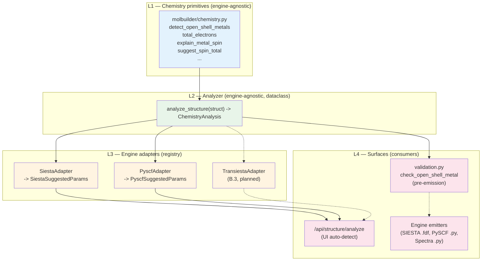

# Scientific validation — runtime machinery

> **This document is the sole source of truth for HOW molbuilder
> realises scientific correctness at runtime**: the pre-emission
> validation pass, the engine-agnostic chemistry analyzer + per-
> engine adapter registry, the three-stage sidecar contract, and
> the issue-surfacing rules.
>
> [`science.md`](../science.md) holds the **what** — the principles,
> the cross-engine consistency rule, the closed gap list.  This
> doc holds the **how** — the dataclasses, the call graph, the
> registry, the surfaces that read each conclusion.  Pointer in
> [`design.md`](../design.md) § 0.
>
> **The stage contract — advisory while editing, enforcing at generation
> (`report()` is the only gate; block only what is physically impossible or
> wrong) — is stated once in [`design.md`](../design.md) § "Validation is
> advisory while editing, enforcing at generation".** This doc realises that
> contract; it does not restate it.
>
> All data passed across these surfaces is typed via **frozen
> dataclasses** ([`design.md`](../design.md) § "Principle 1: The
> dataclass is the lingua franca").  No untyped dicts on the
> internal call graph; dicts appear only at the JSON wire
> boundary (HTTP request/response).

---

## 1. Layered overview



Three boundaries, each with a typed contract:

| Boundary | Owner | Input | Output |
|---|---|---|---|
| `analyze_structure(struct)` | `molbuilder.chemistry` | `Structure` | `ChemistryAnalysis` (dataclass) |
| `EngineParameterAdapter.to_params(analysis)` | per-engine submodule | `ChemistryAnalysis` | engine-specific frozen dataclass (e.g. `SiestaSuggestedParams`) |
| `check_open_shell_metal(struct, cfg)` | `molbuilder.validation` | `Structure` + engine `Config` | `List[Issue]` |

All boundaries pass dataclasses, not dicts.  JSON only appears
when the HTTP endpoint serialises `asdict(...)` for the wire.

---

## 2. The chemistry primitives (L1)

`molbuilder.chemistry` carries the irreducible per-element /
per-structure rules.  Public surface ([source](../../molbuilder/chemistry.py)):

| Helper | Returns | Used by |
|---|---|---|
| `total_electrons(struct, charge)` | int | analyzer, parity check |
| `check_spin_charge_parity(struct, c, s)` | Optional[str] | analyzer + validator |
| `detect_open_shell_metals(struct)` | List[str] | analyzer + (legacy) validator |
| `explain_metal_spin(elem, spin)` | Optional[str] | analyzer (builds hints) |
| `suggest_spin_total(metals)` | (float, list) | SIESTA adapter |
| `resolve_pyscf_ecp(struct, ecp, basis)` | Dict / None | PySCF emitter (separate concern) |

All pure functions.  No engine awareness.  No I/O.  Same
input → same output, every time.

These are the building blocks; the analyzer composes them into
a structured conclusion.

---

## 3. The analyzer (L2)

`molbuilder.chemistry.analyze_structure(struct) -> ChemistryAnalysis`
is the engine-agnostic chemistry middle layer.

```python
@dataclass(frozen=True)
class SpinChoice:
    spin:  int     # 2S = number of unpaired electrons
    label: str     # e.g. "Fe(II), intermediate (4-coord porphyrin)"

@dataclass(frozen=True)
class MetalHint:
    element:      str               # e.g. "Fe"
    common_spins: List[SpinChoice]  # ranked low-spin → high-spin

@dataclass(frozen=True)
class ChemistryAnalysis:
    """Engine-agnostic chemistry conclusions about a Structure.

    Single source of truth for every science-aware surface in the
    system: UI auto-detect, pre-emission validation, future
    transport-tab Auto-detect, CLI ``molbuilder analyze``.  Two
    surfaces consuming this dataclass cannot disagree about the
    chemistry by construction.
    """
    # Composition
    n_atoms:              int
    elements:             List[str]      # unique, sorted
    n_electrons_neutral:  int            # sum(Z) for neutral system

    # Open-shell transition metals
    metals:               List[str]      # ["Fe"], or [] for organics
    metal_hints:          List[MetalHint]

    # Engine-agnostic suggested defaults
    suggested_charge:     int
    suggested_spin:       int            # 2S = n_unpaired
    suggested_treatment:  Literal["closed", "open"]

    # Human-readable
    rationale:            str
    warnings:             List[str]
```

### 3.1 Design rules

- **Pure function.**  No I/O, no global state, no engine imports.
- **Engine-agnostic vocabulary.**  Field names use universal
  chemistry terms.  Engine conventions
  (`SpinPolarized`, `SpinTotal μB`, `UKS`/`RKS`, `Multiplicity`)
  live in the adapters.
- **No "method" field at this layer.**  "UKS vs RKS" is a PySCF
  notion; the engine-agnostic equivalent is
  `treatment ∈ {"closed", "open"}`.
- **Parity is enforced here, once.**  If
  `(n_electrons_neutral − suggested_charge)` parity doesn't match
  `suggested_spin`, the analyzer bumps the spin and records the
  adjustment in `warnings`.  Adapters never re-do parity work.

### 3.2 Suggested-spin policy (open-shell metals)

When `metals` is non-empty the analyzer picks the *first* metal's
common-default spin from `_DEFAULT_OPEN_SHELL_SPIN` (a curated
per-element table mirroring `chemistry._SPIN_TOTAL_DEFAULTS`,
restated in 2S units).  Conservative choice — favours the most
common coordination chemistry, NOT necessarily the ground state.
The rationale always says so, so the user knows to verify against
experimental data.

| Metal | Default 2S | Rationale |
|---|---|---|
| Fe | 2 | Fe(II) intermediate (4-coord porphyrin); HS Fe(II) is 4 |
| Mn | 5 | Mn(II) high-spin S=5/2 (overwhelmingly common in bio) |
| Cu | 1 | Cu(II) d⁹ — one unpaired electron, period |
| Ni | 0 | Ni(II) square-planar LS; user overrides for octahedral |
| Co | 1 | Co(II) LS as a safe pick |
| Cr | 3 | Cr(III) d³ S=3/2 |

(Full table in [source](../../molbuilder/chemistry.py).)

### 3.3 Open-shell metal absent (organic systems)

`metals == []` → `suggested_treatment = "closed"`, spin = 0 or 1
depending on electron-count parity.  No advisory needed; pure
organics with even electron count are reliably closed-shell
singlets.

### 3.4 Noble-metal vs open-d-shell distinction (2026-06-13)

Metals are categorised into three physical groups (the flat
`OPEN_SHELL_METALS` set predating this split incorrectly treated
Au junctions as open-shell):

1. **`OPEN_D_TRANSITION_METALS`** — Sc, Ti, V, Cr, Mn, Fe, Co, Ni
   (3d) + Y, Zr, Nb, Mo, Tc, Ru, Rh (4d, NOT Pd) + Hf, Ta, W, Re,
   Os, Ir (5d, NOT Pt, NOT Au) + lanthanides + common actinides.
   Incomplete d-shell in the atomic ground state AND extended
   phases.  Stoner criterion satisfied for the 3d ferromagnets;
   itinerant moments for the 4d/5d analogues.  These force
   open-shell DFT.

2. **`NOBLE_METALS_S1`** — Cu, Ag, Au.  Atomic ground state is
   nd¹⁰ (n+1)s¹ (single unpaired s electron).  In ANY extended
   metallic context (cluster ≥ 4 atoms, surface, junction, bulk)
   the s-band delocalises and the system is **closed-shell
   singlet** for even total electron count.  Standard treatment
   in published Au transport / surface DFT.  Refs: Taylor,
   Brandbyge, Stokbro, *PRB* 63 (2001) 245407 (the original
   TranSIESTA Au-BDT-Au paper); Ke, Baranger, Yang, *JCP* 122
   (2005) 074704 (Au-BDT-Au NEGF); Verzijl, Thijssen, *JPCC* 116
   (2012) 24811 (DFT+Σ Au-alkanedithiol-Au benchmark); Marder,
   *Condensed Matter Physics* Ch. 17 (Stoner criterion derivation
   — Cu/Ag/Au explicitly non-magnetic in bulk).

3. **`CLOSED_D10_METALS`** — Zn, Cd, Hg + **Pd** (4d¹⁰ 5s⁰ atomic
   ground state per NIST — the prior flat set incorrectly classified
   this as open-shell) + **Pt** (5d⁹ 6s¹ atom; metallic Pt is
   conventionally closed-shell in surface DFT).

**Analyzer decision tree** (`chemistry.analyze_structure`):

| Condition | Suggested treatment / spin | Path |
|---|---|---|
| `OPEN_D_TRANSITION_METALS` present | `open`, spin from `_ANALYZER_DEFAULT_SPIN[first_metal]` | open-d wins regardless of noble-metal presence |
| Noble metal only, ≥ 4 atoms of that metal, even electron count | `closed`, spin=0 | cluster-context override |
| Single noble-metal atom, odd electron count | `open`, spin=1 | respect atomic ground state |
| Other noble-metal cases (2–3 atom cluster, etc.) | electron-count parity | small-cluster ambiguous regime |
| No transition metals | electron-count parity (closed singlet for even, doublet for odd) | pure organic / main-group / closed-d¹⁰ |

The 4-atom cutoff (`_NOBLE_METAL_CLUSTER_THRESHOLD = 4`) is the
conservative choice: overwhelmingly what published Au transport /
surface DFT does.  Specialists studying Au₂ / Au₃ clusters
(catalysis literature, magic-number cluster physics) will override
via the form; the analyzer's job is to make the dominant case
correct without forcing every user to know the override exists.

**When the noble-metal closed-shell default is wrong**, the
rationale string explicitly lists the override scenarios so the
user knows the boundary:

* sub-4-atom Au cluster (shell-closing incomplete)
* single noble-metal adatom on insulator (Au/CeO₂, Au/MgO catalysis)
* noble metal with magnetic 3d co-adsorbate (Au-Co, Au-Fe alloys)
* explicit Kondo / spin-orbit physics

Pinned by `tests/test_chemistry_analyzer.py` — Au_4 / Au-BDT-Au /
single Au atom / Au_2 / Cu_4 / Pd₂ / Au+Fe co-adsorbate; the
category sets pairwise disjoint; Pd + Pt explicitly excluded from
`OPEN_D_TRANSITION_METALS`.

---

## 4. The adapter layer (L3)

### 4.1 Protocol + registry

```python
class EngineParameterAdapter(Protocol):
    """Translate engine-agnostic ChemistryAnalysis conclusions
    into the parameter dataclass the engine's web form expects."""

    name: str   # registry key, e.g. "siesta", "pyscf"

    @classmethod
    def to_params(cls, analysis: ChemistryAnalysis):
        """Return an engine-specific frozen dataclass.  Always
        includes ``rationale``; MAY include engine-specific notes."""

_ADAPTERS: Dict[str, Type[EngineParameterAdapter]] = {}

def register_adapter(name: str):
    def deco(cls):
        _ADAPTERS[name] = cls
        return cls
    return deco

def registered_adapters() -> Dict[str, Type[EngineParameterAdapter]]:
    return dict(_ADAPTERS)
```

### 4.2 Per-engine typed dataclasses

Each adapter returns a **frozen dataclass** whose fields match
the engine's web-form field names.  No dicts on this boundary;
dicts only appear when the HTTP endpoint serialises them via
`dataclasses.asdict()`.

```python
# molbuilder/siesta/auto_defaults.py
@dataclass(frozen=True)
class SiestaSuggestedParams:
    net_charge:     int
    spin_polarized: bool
    spin_total:     float
    rationale:      str

@register_adapter("siesta")
class SiestaAdapter:
    name = "siesta"

    @classmethod
    def to_params(cls, analysis: ChemistryAnalysis) -> SiestaSuggestedParams:
        return SiestaSuggestedParams(
            net_charge     = analysis.suggested_charge,
            spin_polarized = analysis.suggested_treatment == "open",
            spin_total     = float(analysis.suggested_spin),
            rationale      = analysis.rationale,
        )
```

```python
# molbuilder/pyscf/auto_defaults.py
@dataclass(frozen=True)
class PyscfSuggestedParams:
    charge:    int
    spin:      int       # 2S = n_unpaired
    method:    str       # "UKS" | "RKS"
    rationale: str

@register_adapter("pyscf")
class PyscfAdapter:
    name = "pyscf"

    @classmethod
    def to_params(cls, analysis: ChemistryAnalysis) -> PyscfSuggestedParams:
        method = "UKS" if analysis.suggested_treatment == "open" else "RKS"
        return PyscfSuggestedParams(
            charge    = analysis.suggested_charge,
            spin      = analysis.suggested_spin,
            method    = method,
            rationale = analysis.rationale,
        )
```

### 4.3 Adapter location convention

Per-engine submodule.  Mirrors the transport-engine registry
pattern in `molbuilder/transport/engine_base.py`:

| Engine | Adapter location | Status |
|---|---|---|
| SIESTA | `molbuilder/siesta/auto_defaults.py` | shipped 2026-06-10 |
| PySCF | `molbuilder/pyscf/auto_defaults.py` | shipped 2026-06-10 |
| Spectra | reuses `PyscfAdapter` | n/a — emits PySCF |
| Transiesta (B.3) | `molbuilder/transport/transiesta/auto_defaults.py` | planned |
| PySCF-NEGF (B.3) | `molbuilder/transport/pyscf_negf/auto_defaults.py` | planned |

Each module exports its adapter class and triggers
`@register_adapter` on import.  The web blueprint's module-level
import block is the canonical place to import adapter modules so
they're available when `/api/structure/analyze` is hit.

### 4.4 Adapter design rules

- **Pure translator.**  Adapters MUST NOT re-do chemistry
  detection or parity checks — they only translate.  If you find
  yourself importing from `chemistry.py` inside an adapter, the
  logic belongs in the analyzer.
- **Typed dataclass output.**  Returns a frozen dataclass, not a
  dict.  The dataclass field names match the engine's web-form
  field names.  Serialisation to JSON happens at the HTTP
  boundary via `asdict()`.
- **`rationale` is always present.**  The analyzer's
  engine-agnostic rationale; an adapter MAY append an engine-
  specific note (one sentence max).

---

## 5. The consumers (L4)

### 5.1 UI auto-detect — `/api/structure/analyze`

```python
@bp.route("/api/structure/analyze", methods=["POST"])
def api_structure_analyze():
    body = request.get_json(silent=True) or {}
    struct = _read_structure_from_body(body)
    analysis = analyze_structure(struct)
    return jsonify({
        "ok":                  True,
        "n_atoms":             analysis.n_atoms,
        "elements":            analysis.elements,
        "n_electrons_neutral": analysis.n_electrons_neutral,
        "metals":              analysis.metals,
        "metal_hints":         [asdict(h) for h in analysis.metal_hints],
        "suggested":           {
            name: asdict(cls.to_params(analysis))
            for name, cls in registered_adapters().items()
        },
        "warnings":            analysis.warnings,
    })
```

~25 LoC.  New engines surface in `suggested.<engine>` the moment
their adapter module is imported — endpoint code unchanged.

### 5.2 Pre-emission validator — `check_open_shell_metal`

```python
def check_open_shell_metal(struct, *, is_closed_shell, engine_label):
    analysis = analyze_structure(struct)   # SAME source of truth
    # Read the analyzer's recommendation, NOT the flat metals list.
    # Pre-2026-06-13 this checked ``analysis.metals`` directly and
    # fired for Au-BDT-Au — Au IS a transition metal but in a
    # metallic-cluster context the analyzer correctly recommends
    # closed-shell singlet (Stoner criterion fails for noble metals).
    # See § 3.4 for the cluster-context rule.
    if analysis.suggested_treatment == "open" and is_closed_shell:
        return [Issue(
            "warn",
            f"Analyzer recommends OPEN-SHELL DFT for this structure "
            f"({', '.join(analysis.metals)}) but {engine_label} "
            f"requests a closed-shell SCF.  "
            + analysis.rationale,
            "config.spin",
        )]
    return []
```

The validator wraps the analyzer's conclusions in `Issue` shape.
Same logic, same conclusions as the auto-detect.  By construction
the chip and the validator cannot disagree; this is the invariant
the [`web-ui-coherence.md`](web-ui-coherence.md) Rule 1 pins.

### 5.3 The current consumer list

Every surface that talks about open-vs-closed shell now goes
through `check_open_shell_metal`:

| Surface | Caller | Where |
|---|---|---|
| SIESTA Build preflight | `_validate_siesta` | `validation.py` |
| PySCF Build preflight | `_validate_pyscf` | `validation.py` |
| **Spectra preflight** (2026-06-13) | `PySCFSpectraEngine.preflight` | `spectra/pyscf_engine.py` |
| **Transport preflight** | `transiesta.validate` | `transport/transiesta.py` |
| UI Auto-detect chip | shared lib | `web/static/lib/detection-chip.js` (writes the chip via the analyzer's `suggested_treatment`; the chip text never disagrees with the validator) |

**Anti-pattern caught 2026-06-13** — every other engine preflight
must call the shared `check_open_shell_metal`.  The Spectra
preflight had its own parallel `metals + cfg.spin == 0` check
that pre-dated the noble-metal logic, which is exactly the
Au-BDT-Au drift class the validator fix on the same day closed.
[`web-ui-coherence.md`](web-ui-coherence.md) Rule 1 formalises
this: every chemistry question goes through `analyze_structure`,
period.

### 5.4 Two directions, one analyzer

The analyzer runs at two moments and in two directions:

| Direction | When | Surface | What the user sees |
|---|---|---|---|
| **Forward** — suggest | After loading a structure, before configuring | Auto-detect button → `/api/structure/analyze` | Form fields pre-filled with suggested `(charge, spin, method)`; rationale + warnings shown next to the form |
| **Reverse** — check | At Generate click, with the user's final params | `validation.py` → `check_open_shell_metal` | `Issue` in the pre-emission issues panel if the user's choice contradicts the chemistry |

Both consume the same `ChemistryAnalysis` instance shape (re-computed,
since structures may have changed).  By design, they cannot disagree.

---

## 6. Three-stage sidecar contract (Pattern B)

Separate from the chemistry analyzer but governed by the same
"shared helper, both engines call it" principle.  Per
[`science.md`](../science.md) and
[`sidecar-contract.md`](sidecar-contract.md) § 6 B:

When `struct.regions` is populated but the engine doesn't consume
region labels, the engine **must** surface an `info`-severity
`Issue` so the user knows the labels were noticed but unused.

Shared helper:

```python
# molbuilder/web/blueprints/_shared.py
def regions_pattern_b_notice(struct, engine_label: str) -> Optional[Issue]:
    """Return an INFO Issue when struct.regions is non-empty.

    Called from /api/build/fdf, /api/build/pyscf, and the spectra
    engine's preflight.  Single source of truth — SAME notice text
    regardless of which engine fired it.
    """
```

Pinned by `tests/test_web.py::test_{fdf,pyscf}_surfaces_info_when_structure_carries_regions`,
`tests/spectra/test_engine.py::test_..._pattern_b_notice`, and
`tests/test_pdb_workflow_integration.py::test_pattern_b_*`.

---

## 7. Adding a new engine

Steps to make a new engine appear in `suggested.<engine>` and have
its validator share the same chemistry analysis:

1. Create `molbuilder/<engine>/auto_defaults.py`:
   - Define `<Engine>SuggestedParams` frozen dataclass with the
     engine's web-form field names.
   - Define `<Engine>Adapter` class with `name = "<engine>"` and
     a `to_params(cls, analysis)` classmethod.
   - Decorate the class with `@register_adapter("<engine>")`.
2. Import the module in `molbuilder/web/blueprints/__init__.py`
   so the adapter registers at app startup.
3. (Optional) Wire the engine's validator
   (`validation._validate_<engine>`) to call
   `check_open_shell_metal(struct, ...)` so the validator shares
   the analysis.
4. Add adapter tests to `tests/test_chemistry_adapters.py`
   (cross-engine consistency invariant runs against the
   registry).

No endpoint change required.  No documentation change required
beyond appending a row to § 4.3's table.

---

## 7.5 GPU eigensolver (ELPA-CUDA via MPS) (2026-06-15)

The `molbuilder-siesta-gpu` env routes SIESTA's diagonalization
through **ELPA-CUDA** when the .fdf carries `Diag.Algorithm
ELPA-1STAGE` (or `ELPA-2STAGE`) AND `Diag.ELPA.GPU .true.`.
NVIDIA **MPS** (Multi-Process Service) is used to share a single
GPU concurrently across multiple MPI ranks — required because our
ELPA build does not link NCCL, so without MPS multiple ranks
serialise on the GPU's driver context.

| Layer | Component | Scientific role |
|---|---|---|
| **Diagonalisation** | ELPA 2024.05.001 (libelpa_openmp_private_la, GPU support tag `nvidia-gpu` at API version 20241105) | One eigensolver call per SCF iter against the distributed Hamiltonian |
| **Concurrency** | NVIDIA MPS (`nvidia-cuda-mps-control`) | Multiplexes N ranks' CUDA contexts onto the GPU's Hyper-Q hardware so they run concurrently |
| **Numerical pairing** | ELPA + ScaLAPACK | The non-eigenvector parts (mesh integration, DM mix, H rebuild) remain on the host; ELPA is one call inside SIESTA's IterSCF, not the whole loop |

**Numerical-equivalence claim.**  ELPA-GPU and ELPA-CPU on the
same `Diag.Algorithm` produce eigenvalues that agree to ~1e-6 eV
total energy on the documented A100 + sm_80 reference (arXiv
2002.10991).  Our build targets sm_80 specialised kernel only for
cc=8.0; cc=8.6 / 8.7 / 8.9 / 9.0 use ELPA's generic NVIDIA kernel
compiled NATIVELY for the user's cc (see § 7.5.1 for the
recipe-level pinning rationale).  No documented chemistry-relevant
divergence between the two; same SCF converges to the same total
energy within ~1e-5 eV across the build-flag matrix.

### 7.5.1 The 2021.11.001 → 2024.05.001 bump

The previous recipe pinned ELPA 2021.11.001.  End-to-end testing
on a BDT-Au junction (3924 orbitals, 20 MPI ranks + MPS on RTX
3060 Ti) revealed a **multi-rank GPU finalize deadlock** that
matched the documented CSCS Cray-XC50 report
([CP2K issue #1956](https://github.com/cp2k/cp2k/issues/1956))
and the A100/sm_80 kernel-mismatch issue
([ELPA upstream #15](https://github.com/marekandreas/elpa/issues/15)).

| `Diag.Algorithm` | `Diag.ELPA.GPU` | Behaviour on 2021.11.001 |
|---|---|---|
| `ELPA-1STAGE` | `.true.` | Hangs after iter 1 (MPI sync deadlock in the GPU finalize path) |
| `ELPA-2STAGE` | `.true.` | Hangs after iter 1 (same code path — algorithm-independent) |
| `ELPA-2STAGE` | `.true.` | Sometimes warns "GPU usage requested but compute kernel is set as non-GPU" + silently falls back to CPU + STILL hangs (CUDA contexts held by the linked toolkit, not the kernel — the hang is in cleanup, not the algorithm) |
| (none — default ScaLAPACK) | (n/a) | Converges normally |

Resolution: bump to **ELPA 2024.05.001** which has documented
multi-rank GPU finalize fixes.  Recipe also gained a uniform
conda-CUDA path bridge (`_CONDA_CUDA_ENV_BRIDGE` constant applied
to configure / build / install argvs so `cuda_runtime.h: No such
file or directory` from ELPA 2024's `cannon.c:99` direct include
is closed in ALL phases, not just configure) and a
`--with-cusolver=no` toggle (the `cusolverDnXtrtri` symbol that
ELPA 2024 probes for isn't visible to autoconf in the conda-forge
cuda-cudart 13.* layout; ScaLAPACK fallback is negligible at our
problem sizes <10k orbitals).

### 7.5.2 MPS contract (rank policy)

The runwrap.py SIESTA-GPU wrapper auto-detects
`nvidia-cuda-mps-control` and starts a per-job MPS daemon (pipe
dir `/tmp/mb-mps-$$`) with trap-based EXIT cleanup.  The
**default rank policy is conditional on MPS**:

| MPS | Default `mpi_np` | Reason |
|---|---|---|
| `on` | **4** (1 daemon serves up to 48 client contexts on Ampere+) | 4 concurrent ranks via Hyper-Q ≈ optimal for our ELPA tag without NCCL |
| `off` | **2** | Without MPS, ranks serialise on the GPU's driver context — adding more ranks only adds MPI overhead |

The user can override at any time via `MOLBUILDER_MPI_NP` env var
or `-np` flag.  MPS itself is auto-enabled when both
`Diag.ELPA.GPU .true.` is in the .fdf AND `nvidia-cuda-mps-control`
is on the host PATH; the `envs validate` probe `mps daemon`
surfaces the absence loudly so the user can install the missing
host package (NOT a conda package — ships with the NVIDIA host
driver).

### 7.5.3 Validation probes

`python -m molbuilder envs validate molbuilder-siesta-gpu` runs:

| Probe | What it catches |
|---|---|
| `binary-links` | siesta + tbtrans + phtrans exist + `siesta --version` exits 0 |
| `cuda stack` | `nvidia-smi` + `libcuda.so.1` via ctypes (driver loaded) |
| `mps daemon` | `nvidia-cuda-mps-control -V` succeeds (host MPS available) |
| `elpa gpu codepath` | Runs an ELPA 1stage-real-double validator + greps stderr for the silent-CPU-fallback warning string from `elpa2_template.F90`.  This is the load-bearing probe — `nvidia-smi` can report a clean GPU while ELPA silently runs on CPU for every SCF step. |
| `siesta ctest` | `ctest -L simple -E verify` against SIESTA's bundled tests (~90 s) |

`elpa gpu codepath` is the canary — none of the other probes
catches silent CPU fallback.  Defended by upstream code reference
(`src/elpa2/elpa2_template.F90`) so a future ELPA refactor of the
warning string surfaces in the test diff.

---

## 8. What the middle layer does NOT cover

The analyzer scope is **the chemistry-driven `(charge, spin,
treatment)` triplet plus open-shell-metal hints**.  Out of scope:

| Engine parameter | Why out of scope |
|---|---|
| Basis set (`def2-SVP`, `DZP`, etc.) | Engine-specific; chemistry doesn't pick a basis |
| XC functional (`PBE`, `B3LYP`, …) | User preference + computational budget |
| K-points / mesh cutoff | Periodic-system geometry, not chemistry |
| Pseudopotential family | SIESTA-only; covered server-side by the validator pass (`/api/siesta/check-pseudos` was retired) |
| Convergence thresholds | Engine-specific defaults are already sensible |
| Optimization steps | Workflow choice, not chemistry |
| Spectral broadening / IR vs Raman | Workflow choice |

The analyzer stays scoped because growing it to cover everything
would re-fragment the cross-engine consistency claim.  The
`(charge, spin, treatment)` triplet is special: it's where silent
chemistry errors live ([`science.md`](../science.md) § 2).  Other
parameters fail loudly when wrong.

---

## 9. Test invariants

### 9.1 Cross-engine consistency

`tests/test_chemistry_adapters.py::test_all_adapters_agree_on_treatment`:
parametrised over CH4 / Fe / Cu / Mn.  For any structure, **all**
registered adapters' `to_params(analysis)` results carry the same
`treatment`-equivalent decision.  Spelled differently per engine
(SIESTA `spin_polarized=True`, PySCF `method="UKS"`), but the
conclusion is the same.

### 9.2 Endpoint shape stability

`tests/test_structure_analyze_endpoint.py::test_response_shape_carries_every_documented_key`
+ `::test_suggested_siesta_shape` + `::test_suggested_pyscf_shape`:
the `/api/structure/analyze` response carries every top-level key
documented in [`web-api.md`](web-api.md) § 10, AND each
`suggested.<engine>` sub-shape exactly matches the corresponding
`<Engine>SuggestedParams` dataclass field names.

### 9.3 Validator + analyzer agreement

`tests/validation/test_chemistry.py::TestCheckOpenShellMetalUsesAnalyzer::test_validator_reads_metals_from_analyze_structure`
+ `::test_validator_includes_analyzer_rationale_in_message`:
the validator's `check_open_shell_metal` reads its conclusions
from `analyze_structure(struct)` (proved by monkeypatching the
analyzer to return `metals=[]` and asserting no warn fires
despite real-chemistry having metals), and the warn message
contains the analyzer's rationale verbatim.

### 9.4 New-engine on-ramp

`tests/test_chemistry_adapters.py::test_registration_works_with_synthetic_adapter`
+ `tests/test_structure_analyze_endpoint.py::test_freshly_registered_adapter_appears_in_endpoint_response`:
register a fake `"synthetic"` / `"stub_engine"` adapter, hit the
endpoint, verify the new engine appears in `suggested.<name>`.
Catches a regression where the endpoint hardcodes the engine list.

### 9.5 Adapter purity

`tests/test_chemistry_adapters.py::test_adapter_modules_do_not_import_analyzer`:
AST-based check that no adapter module imports
`analyze_structure`, `detect_open_shell_metals`,
`check_spin_charge_parity`, or `total_electrons` — chemistry logic
must stay in the analyzer.

### 9.6 Pattern-B coverage

`tests/test_web.py::test_fdf_surfaces_info_when_structure_carries_regions`
+ `::test_pyscf_surfaces_info_when_structure_carries_regions`:
both build endpoints emit the Pattern-B INFO when `struct.regions`
is populated.  Shared helper enforced.

---

## 10. Where validators live

### Current layout (2026-06-13, split landed)

`molbuilder/validation/` is a package whose sub-modules match the
**concern**, so external callers (engines, blueprints, future
analysis CLI commands) can import directly from the concern-
specific submodule without reaching into the public surface that
the aggregator depends on:

```
molbuilder/
├── chemistry.py                          # L1 primitives + L2 analyzer
└── validation/
    ├── __init__.py                       # public API: validate, report, registry
    │                                     # + re-exports of every name external
    │                                     # callers imported pre-split
    ├── geometry.py                       # validate_geometry, _min_image_distance,
    │                                     # _check_polymer_orientation
    ├── metadata.py                       # _validate_config_metadata
    │                                     # (dataclass-field driven)
    ├── chemistry.py                      # check_open_shell_metal,
    │                                     # _check_metal_basis_adequacy,
    │                                     # _check_peptide_protonation
    ├── sidecar.py                        # _check_frozen_atoms_consumed
    ├── siesta.py                         # SIESTA preflight aggregator +
    │                                     # _check_siesta_pseudo_coverage,
    │                                     # _check_siesta_mesh_cutoff,
    │                                     # _check_siesta_charged_makov_payne_notice,
    │                                     # _check_siesta_spin_polarized_needs_spin_total
    └── pyscf.py                          # PySCF preflight aggregator
```

Each submodule is small enough that "where does the new check go?"
has a one-step answer.  The aggregators (`_validate_siesta`,
`_validate_pyscf`) live in their per-engine submodule because
their call order is the per-engine public contract — the order is
LOAD-BEARING for every test that counts issues by position.

### What was preserved across the split

* **Every function body and signature** — verbatim from the pre-
  split source.  No logic edits ride along with the move.
* **The CALL ORDER inside `_validate_siesta` / `_validate_pyscf`** —
  the sequence of `_check_*` calls is identical.  Pinned implicitly
  by every test that asserts an issue's position in the returned
  list.
* **The public import surface.**  `from molbuilder.validation import
  validate, report, validate_geometry, check_open_shell_metal` still
  works — `__init__.py` re-exports every name external callers
  imported pre-split.  External-caller files (`spectra/pyscf_engine.py`,
  `transport/transiesta.py`, `siesta/input.py`, `pyscf/input.py`,
  `cli.py`, `web/blueprints/_shared.py`, every `tests/*.py`) were not
  modified.
* **The engine-validator registry.**  `_register_default_engines()`
  runs at package import time and populates `_ENGINE_VALIDATORS` with
  all four engine configs: `SiestaConfig`, `PySCFConfig`, `SpectraConfig`,
  `TransportConfig` (the last two added 2026-07, V1/V2 — their validators
  dispatch to the engine's `render_checks` / `preflight` via
  `get_engine(cfg.engine)`, so `validate(struct, cfg)` is the single
  per-engine gate; the spectra selector-availability check stays
  preflight-only, added by the /spectra endpoint).

### Naming policy

Chemistry helpers that have **cross-module callers** lose their
underscore prefix.  The leading `_` originally meant "internal to
`validate()`'s aggregator"; once a helper is imported by
`spectra/pyscf_engine.py`, `transport/transiesta.py`, or
`web/blueprints/build.py`, that hint is misleading and the helper
should read as part of the public surface:

| Helper | Status | External callers |
|---|---|---|
| `check_open_shell_metal` | **public** (renamed 2026-06-13) | spectra/pyscf_engine, transport/transiesta, web/blueprints/build, chemistry |
| `_check_metal_basis_adequacy` | private | none (only validation/pyscf.py) |
| `_check_peptide_protonation` | private | none (only validation/siesta.py + validation/pyscf.py) |
| `_check_frozen_atoms_consumed` | private | none (only validation/siesta.py + validation/pyscf.py + web/blueprints/build.py via direct construction of Issue, not import of the helper) |

The other three helpers keep their underscores — they have no
external callers today, so the prefix correctly signals "internal
to the validation package."  If a future PR adds an external caller
for any of them, that PR should promote the helper to a public
name in the same commit (per `web-ui-coherence.md` Rule 1).  No
backward-compat shim per [memory: feedback_no_backward_compat]
(`feedback_no_backward_compat.md`).

### Follow-up: split tests by submodule

`tests/test_validation.py` was a 1479-LoC flat file before the
test-side split (commit 8b4afed, 2026-06-13) — now lives as
`tests/validation/` mirroring the source layout (6 per-submodule
files + conftest + helpers).  See [`test-strategy.md`](test-strategy.md)
§ 8.8 for the canonical worked example.

---

## 11. Dataclass-first principle (cross-reference)

Every dataclass in this doc is **frozen**.  The L1 chemistry
helpers return primitives (int, list, str); the L2 analyzer wraps
them into `ChemistryAnalysis`; the L3 adapters wrap their outputs
into engine-specific frozen dataclasses; the L4 surfaces consume
those dataclasses.  Dicts appear only at the JSON wire boundary,
where `dataclasses.asdict()` is the single point of serialisation.

This is the application of [`design.md`](../design.md) § "The
dataclass is the lingua franca" to the scientific-validation
machinery.  No parallel metadata exists in the web layer or the
UI layer; the dataclass is authoritative everywhere.

---

## 12. Decisions log

| Date | Decision | Why |
|---|---|---|
| 2026-06-10 | Middle layer landed as `analyze_structure` + `EngineParameterAdapter` registry; per-engine `auto_defaults.py` submodules; per-engine frozen `SuggestedParams` dataclasses. | The `/api/structure/analyze` endpoint shipped 2026-05-23 with both engine translations hardcoded inline in `web/blueprints/build.py` — duplication waiting to drift, no on-ramp for Transport B.3 engines.  Hoisting the chemistry into a named analyzer + decoupling per-engine translation realizes the cross-engine consistency rule that `science.md` § 2.4 had already promised at the validator level, extending it to the UI auto-detect surface.  Dataclass-first per `design.md` Principle 1.  Pinned with cross-engine, validator-agreement, and new-engine on-ramp tests. |
| 2026-06-10 | `science.md` stays the principles/contract doc.  This doc (`scientific-validation.md`) takes the implementation/machinery role.  Per-protocol adapter doc (`chemistry-adapters.md`) folded in here — the adapter layer is part of the validation machinery, not a separate concern. | Splitting "what we promise" (science.md) from "how we deliver it" (this doc) lets each evolve independently.  A new engine landing changes this doc; a new scientific invariant changes science.md.  Cross-references keep them coherent. |
| 2026-06-13 | **Validator-package split landed + companion test-strategy doc.**  Flat `molbuilder/validation.py` (1326 LoC) became `molbuilder/validation/` (7 files: `__init__.py`, `geometry.py`, `metadata.py`, `chemistry.py`, `sidecar.py`, `siesta.py`, `pyscf.py`).  Each submodule is small enough that "where does the new check go?" has a one-step answer.  Split is purely organisational — every function body, signature, and `_validate_<engine>` internal CALL ORDER preserved verbatim from the pre-split source.  Public import surface unchanged: `__init__.py` re-exports every name external callers imported pre-split, so `spectra/pyscf_engine.py`, `transport/transiesta.py`, `cli.py`, `web/blueprints/_shared.py`, etc. + every test continue to work without modification.  Outcome preservation pinned by running the full validation + chemistry + spectra + transport test suite (643 pass + 2 skip — identical to pre-split counts).  Companion doc [`test-strategy.md`](test-strategy.md) writes the 5-layer pyramid (unit / module / interface / integration / e2e) + the decision tree for "where does the new test go?" so the test split that has to follow has a target shape, not improvisation per PR. | The Spectra preflight drift caught on 2026-06-13 was a direct consequence of the flat module: external engine files had no convenient `from molbuilder.validation.chemistry import check_open_shell_metal` import, so each one rolled its own chemistry check or fished out the deeply-private `check_open_shell_metal`. The package split makes the right import the convenient one. The user's framing was unambiguous: "we have established the usefulness of these validators but now it is time to make them well organized and effectively unified into module that can systematically and correctly serving the whole project with always-up-to-date information." The single biggest correctness invariant — call order inside the per-engine aggregators — is the reason this split was done with mechanical verbatim moves rather than the cleanup-and-rename pass that's tempting at refactor time. Renames + the underscore-prefix removal land as follow-ups when each one is forced by a new external caller (per `feedback_no_backward_compat`).  Test-strategy doc landed alongside because reorganising source without reorganising tests would leave the same 1479-LoC pain in `test_validation.py` that motivated the source split. |
| 2026-06-13 | **Noble-metal cluster-context analyzer rule + validator delegation cleanup.**  Split `OPEN_SHELL_METALS` into three sets — `OPEN_D_TRANSITION_METALS` / `NOBLE_METALS_S1` / `CLOSED_D10_METALS` (§ 3.4) — so the analyzer correctly recommends closed-shell singlet for Au junctions (≥ 4 atoms, even electron count).  Updated `check_open_shell_metal` to gate on `analysis.suggested_treatment == "open"` instead of `analysis.metals` (the pre-fix logic fired for Au-BDT-Au despite the chip showing "closed-shell singlet" — direct contradiction the user reported).  Routed `PySCFSpectraEngine.preflight` through the shared `check_open_shell_metal` so the Spectra preflight cannot drift from the SIESTA / PySCF Build preflights.  Extracted UI detection chip into shared `lib/detection-chip.js`; Transport tab gained `workflow_group` metadata + chip wiring so Au-thiol junctions surface the chemistry conclusion on the form.  Companion: [`web-ui-coherence.md`](web-ui-coherence.md) Rule 1 is the formal source-of-truth statement; this doc's § 5.3 consumer table is the enforcement list. | Two-surface drift is the most expensive bug class molbuilder ships: the user sees "closed-shell singlet" on one panel and "switch to open-shell" two panels down on the same form.  The remedy isn't "fix the parallel path" but "delete the parallel path."  Every chemistry question — open-vs-closed, basis adequacy, electron parity — goes through `analyze_structure(...)` and the helpers it composes from `chemistry.py`.  Pinned by `test_validation.py::test_au_bdt_au_closed_shell_does_NOT_warn`, the renamed `TestCheckOpenShellMetalUsesAnalyzer` agreement tests, and the source-text invariant `TestWorkflowGroupSchemaConsistency::test_detection_chip_renderer_present` which now asserts viewer.js + transport/core.js both delegate to `lib/detection-chip.js`. |
