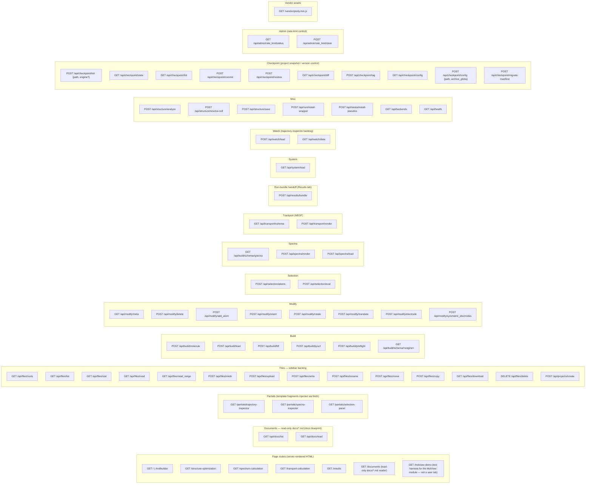
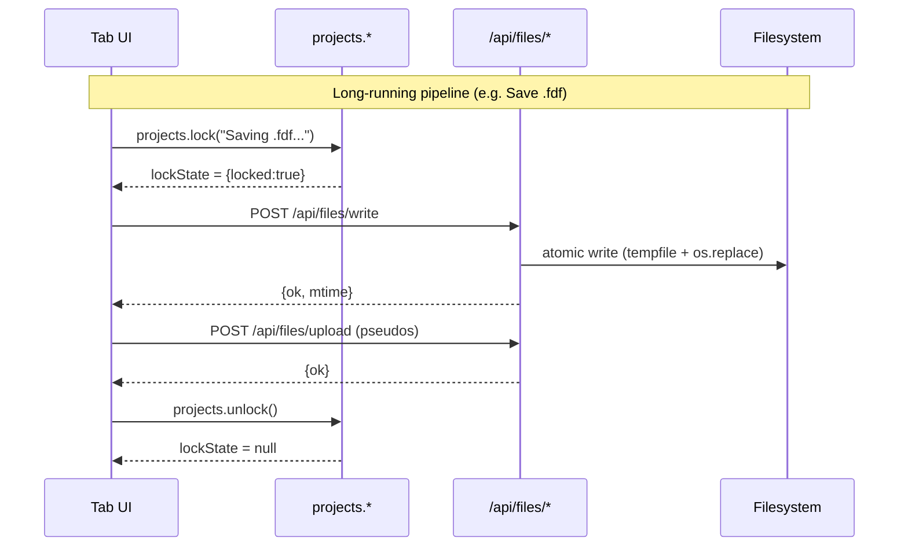

# Web API — HTTP endpoint reference (`/api/*`)

This is the sole source of truth for molbuilder's HTTP surface.
Every Flask route, request shape, and response envelope is
documented here. Per-tab UI behaviour lives in `docs/tabs/*.md`;
the JS contracts the responses feed are in
[`projects-sidebar.md`](projects-sidebar.md) and
[`molview-module.md`](molview-module.md).

**Implementation**: `molbuilder/web/blueprints/{build,files,modify,results,selection,spectra,watch,checkpoint}.py`
plus the dispatcher in `molbuilder/web/app.py`.

**Test layer**: `tests/test_web*.py`, `tests/test_selection_blueprint.py`,
`tests/spectra/test_blueprint.py`, `tests/watch/test_api_load.py`,
`tests/test_results_blueprint.py`.

---

## 1. Conventions

### 1.1 Uniform response envelope

Every endpoint returns JSON with a top-level `ok: bool` field.
Decisions log #187 (2026-06-02) made this a hard rule — there
are no exceptions.  This section spells out the full envelope so
adding a new endpoint or auditing an old one does not need to
hunt across the code for the field meanings.

#### 1.1.1 Canonical fields

The complete set of fields the response body may carry.  Every
endpoint picks the subset it needs; every field that IS present
has the meaning below.  Adding a new meaning under an existing
name is a wire-break — pick a new name instead.

| Field | Type | When present | What it is |
|---|---|---|---|
| `ok` | `bool` | always | `true` for success; `false` for any failure. |
| `error` | `string` | failure only | Short, human-readable banner string for the status UI, e.g., `"preflight failed; see issues"`.  No stack trace, no absolute paths, no jargon — this is what shows up at the top of the form. |
| `kind` | `string` | optional, failure | Machine-readable failure tag.  Lowercase snake_case, e.g., `"schema_mismatch"`, `"no_project"`, `"locked_for_write"`.  The UI may dispatch on this to render a more specific affordance than the generic error banner. |
| `issues` | `list[Issue]` | when the endpoint runs a validator or preflight | Full mixed-severity list.  Each entry: `{severity: "error"\|"warn"\|"info", message: str, where: str}` (the JSON-encoded form of `molbuilder.issues.Issue`).  Drives the colour-coded list under the banner.  Always emitted as a list, even when empty. |
| `errors_only` | `list[Issue]` | when the endpoint runs a validator or preflight | Pre-filtered subset of `issues` containing only the `severity == "error"` items.  Always emitted as a list, including `[]` on success.  Convenience for consumers that want just the blockers (a CI script, a "show only blockers" toggle) — no client today reads this, but the contract guarantees it is there. |
| `engine` | `string` | render endpoints | Which engine produced the response (`"siesta"`, `"pyscf"`, `"transiesta"`, etc.). |
| domain-specific keys | varies | per endpoint | The payload the endpoint exists to deliver: `script`, `atoms`, `xyz`, `wrapper_path`, `entries`, etc.  Documented per endpoint. |

#### 1.1.2 Common shapes

| Outcome | Shape |
|---|---|
| Plain success | `{ok: true, <payload fields>}` |
| Plain failure | `{ok: false, error: "<banner string>"}` |
| Structured failure | `{ok: false, error: "...", kind: "<tag>"}` |
| Validator/preflight success | `{ok: true, <payload>, issues: [...warns + infos...], errors_only: []}` |
| Validator/preflight failure | `{ok: false, error: "preflight failed; see issues", issues: [...], errors_only: [...]}` |

HTTP status codes classify (200 / 4xx / 5xx) but the body shape
**does not** depend on status — the JS apiX wrappers
(`lib/projects/api.js`) branch on `body.ok`, not on
`Response.ok`.  Which status code maps to each shape is the
subject of § 1.6.

#### 1.1.3 Naming rules for new fields

When adding a new field to an endpoint's response, keep these
rules in mind so the next reader (and the next audit) does not
mistake it for a duplicate of something else:

1. **Existing names are stable.**  Never reuse `error`, `issues`,
   `errors_only`, `ok`, `kind`, or `engine` for a different
   meaning than § 1.1.1 lists.  Renaming an existing field is a
   wire break.
2. **A filtered view of an existing list is named
   `<source>_<filter>`.**  `errors_only` is named that way
   because it is `issues` filtered to severity=error.  If we add
   a "warnings only" view tomorrow, it is `warnings_only`.  This
   makes the relationship obvious from the name alone.
3. **Singular vs plural is not load-bearing.**  Do NOT add a
   field named `errors` next to a field named `error` — the eye
   reads them as plural-of-the-same-thing.  Pick a name that
   says what it is (`errors_only`, `blocker_issues`) instead.
4. **Lists are emitted, not omitted, when their concept applies
   to the endpoint.**  An endpoint that runs a validator emits
   `issues: []` on success, not by leaving the key off.  The
   client always sees the shape it knows.
5. **A field that no consumer reads today is fine as long as it
   is documented.**  `errors_only` is in this category — kept on
   the wire so a future consumer can adopt it without a
   server-side rev.

#### 1.1.4 Extensibility — new optional fields

Adding a NEW optional field to a response is non-breaking:
consumers must tolerate unknown fields (the JS apiX wrappers
do).  The reverse — removing or renaming an existing field — is
breaking and requires either a doc version bump or coordinated
client + server commits.

A new field that ALL endpoints will eventually carry (a future
hypothetical: `request_id`, `server_version`) lands in § 1.1.1
as a new row first, then ships endpoint-by-endpoint.  Until it
is in § 1.1.1, clients cannot rely on it being present.

### 1.2 Path validation

Every endpoint that takes a `path` query parameter or JSON body
field runs it through `_resolve_within_roots` in `files.py`:

1. Expand `~` and `$VARS`.
2. Resolve to absolute (follows symlinks).
3. Reject raw `..` components in the user-supplied string
   (defense-in-depth — the resolution step already prevents
   escape, but rejecting `..` early gives a cleaner error).
4. The resolved path must equal-or-be-inside one of the roots
   returned by `Capabilities.file_picker_roots()` (today: a
   single `(<cwd>/projects, "projects")` entry).

Failures → HTTP 400 with `{ok: false, error: "..."}` (a special
case of the protocol-error class in § 1.6).

### 1.3 Cache control — `cache: "no-store"` is the default

The JS-side central wrapper `_fetchEnvelope` in `lib/projects/api.js`
sets `cache: "no-store"` on every request unless the caller
overrides. This is the second half of the fix for the 2026-06-02
stale-dropdown bug (#192): without it the browser HTTP cache
served the previous response for identical GET URLs.

Server-side: `/api/files/*` GETs do NOT set Cache-Control headers
(the JS default suffices), but endpoints that serve immutable
content (`/partials/*`) may set long-cache headers in the future.

### 1.4 AbortSignal

Every JS apiX wrapper threads `opts.signal` into `fetch`. This
lets the sidebar's lock-cancel button (#159, 2026-05-27) abort
in-flight requests when the user clicks Cancel; without it a slow
write/upload/delete would leave the lock UI hung.

### 1.5 HTTP method semantics

| Method | Purpose | Cacheable? |
|---|---|---|
| GET | Read-only queries (list, stat, read, roots, schema, meta) | Yes (but see § 1.3) |
| POST | Mutations + complex queries (mkdir, write, upload, render, build, eval) | No |
| DELETE | Resource removal (`/api/files/delete`) | No |

`/api/files/rename` uses POST (not PUT) for parity with the rest
of the mutation surface; `/api/files/delete` uses DELETE because
the verb is unambiguous.

### 1.6 HTTP status semantics

`body.ok` and HTTP status answer different questions and are
independent (§ 1.1):

* **HTTP status** — *Did the server understand and process your
  request?*  2xx = yes; 4xx = no, your request was malformed;
  5xx = yes I tried, but I hit a server-side failure.
* **`body.ok`** — *Is the body the artifact you asked me to
  generate?*  `true` = yes; `false` = no, the body carries either
  an error description (protocol / server) or a scientific
  advisory (validator says: fix these parameters and resubmit).

Every response falls in exactly one of four buckets:

| Class | HTTP | `body.ok` | When |
|---|---|---|---|
| Success | 2xx (typically 200) | `true` | Endpoint produced its expected output: an artifact (`/api/build/fdf` → script, `/api/build/molecule` → structure) with `errors_only: []`, OR a verdict (`/api/build/preflight` → `issues + errors_only`) where `errors_only` MAY be non-empty — the verdict IS the output; consumers gate submission on `errors_only`. |
| **Scientific advisory** | **200** | **`false`** | EITHER (a) validator / preflight returned hard errors and emission is refused, OR (b) the operation is refused because **the current state of a user-owned resource blocks it** (e.g. dirty working tree on a checkpoint restore, nested-working-dir refusal on checkpoint init, legacy on-disk format that needs migration).  Common to both: the user's intent is valid; the next move is for the user to fix something in-place and retry, NOT to revise the request.  Body carries `issues + errors_only` so the form's workflow cards ([`web-ui-coherence.md`](web-ui-coherence.md) Rule 2) — or, for state-shaped refusals, the sidebar's advisory chip — can render the findings inline.  **There is no error page to navigate to.** |
| Protocol error | 4xx (typically 400) | `false` | The request itself was malformed: missing required field, schema mismatch, bad path (§ 1.2), unrecognised engine name, charset-rejected identifier.  Client must fix the call before retrying. |
| Server fault | 5xx (typically 500) | `false` | Server tried and failed: IO / parse error on a user-selected file, engine crash, internal exception, missing dependency.  Not the user's fault; not addressable from form input. |

#### Why "scientific advisory" stays at HTTP 200

A validator hard-error is the server doing its job — running the
scientific-correctness check and reporting back.  Mapping it to
4xx would make a browser / curl / CI read it as "the request was
rejected at the protocol layer," which is the wrong story.  The
HTTP exchange succeeded; `errors_only` is what the user must act
on, and the form already knows how to fan it out per
[`web-ui-coherence.md`](web-ui-coherence.md) Rule 2.

This convention also preserves the existing client pattern:
every JS form site already does `if (!body.ok) showIssues(body.issues)`
(preflight, render, build).  Splitting the advisory case into
HTTP 4xx would require either (a) the JS to also branch on
`Response.ok` and treat 4xx-with-`ok:false` specially, or
(b) re-defining `ok:true` so a future `{ok:true, errors_only:[...]}`
shape signals refusal.  Both are defensible, but neither is free
— see the next subsection.

#### Could this be revisited?

Yes.  If a future direction wanted `body.ok` to mean strictly
"the HTTP exchange + protocol layer succeeded" (decoupled from
validator outcome), the advisory case would shift to
`{ok: true, errors_only: [...]}` + HTTP 200, and consumers would
gate on `errors_only` being non-empty instead of on `!body.ok`.
That is a defensible convention too.  Today's choice preserves
backward compatibility with every existing client and matches
what `/api/build/preflight` has always done; flipping it is a
coordinated server + client + test revision.  A Decisions-log
entry would supersede this section if we ever do.

#### Worked examples (current rule)

| Endpoint + failure | Status | Body |
|---|---|---|
| `/api/build/preflight` — validator found hard errors (pure-check endpoint; never refuses) | **200** | `{ok:true, issues:[...], errors_only:[...]}` — verdict IS the output; consumer (`viewer.js`) gates on `errors_only` |
| `/api/build/fdf` — render refuses because spin is wrong for the chemistry | **200** | `{ok:false, error:"preflight failed; see issues", issues:[...], errors_only:[...]}` |
| `/api/spectra/render` — validator hard-error blocks script emission | **200** | `{ok:false, error:"preflight failed; see issues", issues:[...], errors_only:[...]}` |
| `/api/checkpoint/restore` — working tree has uncommitted changes (state-shaped refusal) | **200** | `{ok:false, error:"<DirtyWorkingTreeError message>", issues:[{severity:"error", message:"<same>", where:"working-tree"}], errors_only:[...same...]}` — sidebar's advisory chip renders `issues[0].message` inline; the user commits or discards, then retries |
| `/api/checkpoint/init` — nested working dirs detected | **200** | `{ok:false, error:"...", issues:[{severity:"error", message:"...", where:"path"}], errors_only:[...]}` |
| `/api/checkpoint/init` — unknown `engine` (UI passes it from task setup; SIESTA/PySCF selects the big-binary classification, run-checkpoints.md § 9) | **200** | `{ok:false, error:"unknown engine ...", issues:[{severity:"error", ..., where:"engine"}], ...}` |
| `/api/checkpoint/config` (POST) — empty `archive_globs` (would archive nothing → silent binary loss) | **200** | `{ok:false, error:"archive_globs cannot be empty...", ..., where:"archive_globs"}` — GET/POST config read+edit the persisted big-binary table (the sidebar's editable widget binds here) |
| `/api/checkpoint/restore` — legacy 2-col MANIFEST needs migration | **200** | `{ok:false, error:"...migrate-manifest...", issues:[{severity:"error", message:"...", where:".binsnapshots"}], errors_only:[...]}` |
| `/api/files/read` — path outside picker roots (§ 1.2) | **400** | `{ok:false, error:"path outside roots"}` |
| `/api/results/bundle` — `stem` contains NUL or is `.` / `..` | **400** | `{ok:false, error:"<charset/all-dots reason>"}` |
| `/api/watch/data` — trajectory file can't be parsed | **500** | `{ok:false, error:"parse failed: ..."}` |
| `/api/build/molecule` — builder raised an exception | **500** | `{ok:false, error:"build failed: ..."}` |

---

## 2. Endpoint index — all 76 routes



Sections § 3–§ 13 below cover each blueprint in detail. The **checkpoint**
routes (`/api/checkpoint/*`) don't have a prose section; their behavior is
governed by `run-checkpoints.md` (§ 4–§ 10) and their contract is:

| Route | Body / query | Returns |
|---|---|---|
| `POST /api/checkpoint/init` | `{path, engine?}` (`engine` = `siesta`/`pyscf`, seeds the big-binary classification, § 9; UI passes it from task setup) | `{ok, state, archive_globs}`; unknown engine → bucket-B advisory (`where:"engine"`) |
| `GET /api/checkpoint/state` | `?path` | `{ok, state}` (cheap; no archive walk) |
| `GET /api/checkpoint/list` | `?path[&limit]` | `{ok, checkpoints[]}` |
| `GET /api/checkpoint/diff` | `?path&a&b[&pathspec]` | `{ok, diff}` |
| `POST /api/checkpoint/commit` | `{path, message?}` | `{ok, checkpoint|null}` (clean tree → null) |
| `POST /api/checkpoint/tag` | `{path, label, message, at?}` | `{ok}` |
| `POST /api/checkpoint/restore` | `{path, ref, include_binaries?}` | `{ok, restored[]}`; dirty text/binary or corrupt/incomplete archive → advisory (run-checkpoints.md § 4.6) |
| `GET /api/checkpoint/config` | `?path` | `{ok, archive_globs}` — the editable big-binary table (§ 9) |
| `POST /api/checkpoint/config` | `{path, archive_globs[]}` | `{ok, archive_globs}`; empty list → advisory |
| `POST /api/checkpoint/migrate-manifest` | `{path, ref}` | `{ok, entries}` |

---

## 3. `/api/files/*` — file explorer + sidebar backing

Implementation: `molbuilder/web/blueprints/files.py`.

This is the projects sidebar's full file-system surface. Eleven
endpoints (eight `/api/files/*`, one `/api/projects/create`, plus
`read_range` added 2026-06-02). The sidebar architecture +
public `projects.*` JS API on top of these endpoints lives in
[`projects-sidebar.md`](projects-sidebar.md).

### 3.1 Endpoint table

| Route | Method | Query / body | Success | Error codes |
|---|---|---|---|---|
| `/api/files/roots` | GET | — | `{ok, roots: [{path, label}]}` | — |
| `/api/files/list` | GET | `?path=&ext=` | `{ok, path, entries}` | 400 outside-root · 404 missing |
| `/api/files/stat` | GET | `?path=` | `{ok, path, kind, size, mtime}` | 400 · 404 |
| `/api/files/read` | GET | `?path=&max_bytes=` | `{ok, path, kind, size, mtime, text}` | 400 · 404 · 413 |
| `/api/files/read_range` | GET | `?path=&offset=&max_bytes=` | `{ok, path, offset, length, file_size, mtime, text, eof}` | 400 · 404 |
| `/api/files/mkdir` | POST | `{parent, name}` | `{ok, path}` | 400 · 403 · 409 |
| `/api/projects/create` | POST | `{name}` | `{ok, path, project}` | 400 · 409 |
| `/api/files/upload` | POST | multipart `file=`, form `path=` | `{ok, path}` | 400 · 409 · 413 |
| `/api/files/write` | POST | `{path, text, overwrite?, expected_mtime?}` | `{ok, path, relPath, size, mtime}` | 400 · 409 (mtime conflict) |
| `/api/files/rename` | POST | `{path, new_name}` | `{ok, path}` | 400 · 404 · 409 · 500 |
| `/api/files/move` | POST | `{path, dest_dir, new_name?}` | `{ok, path}` | 400 · 404 · 409 · 500 |
| `/api/files/copy` | POST | `{path, dest_dir, new_name?}` | `{ok, path}` | 400 · 404 · 409 · 500 |
| `/api/files/download` | GET | `?path=` | streamed bytes with `Content-Disposition: attachment` | 400 · 404 |
| `/api/files/delete` | DELETE | `{path, recursive?}` | `{ok}` | 400 · 404 · 409 |

#### 3.1.1 Sidecar pairing on rename / move / copy (2026-06-12)

When `path` is a structure file (`.xyz` or `.pdb`), `rename`,
`move`, and `copy` ALSO move/copy a paired `<stem>.molstruct.json`
sidecar in lockstep:

* The destination sidecar slot must be empty (atomic-no-overwrite
  policy extends across the pair); else the whole operation
  refuses with 409.
* `rename` + `move` use `os.replace` for both legs.  If the
  sidecar leg fails, the structure leg is rolled back via a
  second `os.replace`.  Rollback failure surfaces as a 500 with
  a "manual cleanup needed" message.
* `copy` uses `shutil.copy2`.  If the sidecar copy fails, the
  half-copied structure is unlinked so the user doesn't get a
  partial pair.
* Sidecar pairing is OFF for non-`.xyz`/`.pdb` source files
  (a raw `.molstruct.json` rename is single-file).
* Directory sources are refused in v1 (`move`/`copy` only operate
  on files; `rename` keeps its existing directory contract).

See [`sidecar-contract.md`](sidecar-contract.md) for the full
sidecar-pair semantics + which engines consume the sidecar.

#### 3.1.2 `/api/files/download` (2026-06-12)

Streams the file with Flask's `send_file(as_attachment=True)`.
Used by the sidebar kebab's "Download" item to grab the whole
file regardless of size / encoding (text + binary).  Same
`_resolve_within_roots` path validation as the rest of `/api/
files/*`.  Empties on 404 / 400.  `etag=False` + `max_age=0`
so a re-download always pulls the fresh bytes.

### 3.2 Picker roots — single, fixed (v1)

`Capabilities.file_picker_roots()` returns exactly one entry:
`(<cwd>/projects, "projects")`. The directory is returned even
if it doesn't exist yet so the UI can show a "no projects yet"
empty state. The plural return shape (tuple of `(path, label)`)
is preserved as a future-proofing escape hatch — adding multi-
root is a one-line change in `Capabilities` — but the contract
today is **single-root, no CWD, no user-configurable additions**.

The deliberate scope: `projects/` is molbuilder's source of
truth for run state. Files outside (laptop downloads, scratch
dirs) must be moved or copied into
`projects/<project>/<topic>/<structure>/` first.

### 3.3 Entry shape (`/api/files/list`)

```json
{
  "name":  "BDT_water",
  "kind":  "directory",
  "size":  null,
  "mtime": 1715773200.0
}
```

`kind ∈ {"directory", "file", "symlink", "other"}`. Hidden
entries (leading dot) are filtered upstream — the picker is for
project files, not dotfiles. `size` is `null` for directories
and broken symlinks.

### 3.4 Range read — paginated source viewer

`GET /api/files/read_range` reads a byte window. Default
`max_bytes = 256 KB`, hard ceiling 16 MB. `offset` accepts:

- `0` or omitted: from start.
- Positive: from byte 0.
- Negative: from EOF (`offset = -N` returns the last N bytes,
  clamped to file size).

UTF-8 boundary trimming: if the chunk edge cuts a multi-byte
codepoint, the server walks back up to 3 bytes before returning,
so callers always receive valid UTF-8 even on arbitrary byte
windows. `eof: true` when the chunk reaches end-of-file (used
by the source inspector to disable the "Jump to end" button +
stop auto-paging).

Powers the v2 paginated source inspector (#119). Promoted to the
public projects.* surface in #189 as `projects.readRange(path,
offset, maxBytes)`.

### 3.5 Mutation flow + lock model



Lock semantics: see [`projects-sidebar.md`](projects-sidebar.md)
§ 8. The server side has no global lock — `os.replace` provides
single-writer atomicity per file, and the design assumes a
single user per session.

### 3.6 Write conflict detection

`POST /api/files/write` accepts an optional `expected_mtime`
field. If provided AND the on-disk mtime doesn't match, the
endpoint returns 409 with `{ok: false, error: "..."
actual_mtime: <current>}` — the JS layer surfaces this as an
edit-conflict dialog. Without `expected_mtime`, the write is
unconditional (last writer wins) but still atomic.

### 3.7 Canonical-topic protection (`delete` + `rename`)

The canonical subtree topics (`structure/`, `optimization/`,
`spectrum/`, `transport/` — see [`job-layout.md`](job-layout.md))
cannot be renamed or deleted. The check fires on the target's
basename at any depth. Returns 400 with a message naming the
protected name.

---

## 4. `/api/build/*` — structure synth + Generate

Implementation: `molbuilder/web/blueprints/build.py`.

### 4.1 Endpoint table

| Route | Method | Body | Success |
|---|---|---|---|
| `/api/build/molecule` | POST | `{kind, input, ...}` | structure JSON |
| `/api/build/load` | POST | JSON `{path}` (file-only: server reads `.xyz`+paired `.molstruct.json` via `StructureCodec.read`) OR `{text, format?, filename?}` OR multipart `file=` | structure JSON + `source_format` |
| `/api/structure/save` | POST | JSON `{path, blob:{xyz,sidecar}, overwrite?}` — file-only save: server writes the `.xyz`+`.molstruct.json` pair via `StructureCodec.write` (stamps schema) | `{ok, path}` \| 409 `{needsOverwrite}` |
| `/api/build/fdf` | POST | `{xyz, params, structure_path?}` | `{ok, fdf, system_label, issues}` |
| `/api/build/pyscf` | POST | `{xyz, params, structure_path?}` | `{ok, script, job_name, issues}` |
| `/api/build/preflight` | POST | `{xyz, engine, params}` | `{ok, issues}` |
| `/api/build/schema/<engine>` | GET | `engine ∈ {siesta, pyscf}` | `{ok, schema}` |

### 4.2 Common structure JSON shape

`/molecule` and `/load` both return:

```json
{
  "ok":            true,
  "xyz":           "...",
  "pdb":           "...",
  "n_atoms":       int,
  "n_residues":    int,
  "summary":       "<Structure 'title': N atoms, R residues, formula CxHyOz>",
  "title":         "...",
  "elements":      ["C", "H", ...],
  "atom_names":    [...],
  "residue_ids":   [...],
  "residue_names": [...],
  "chain_ids":     [...],
  "source_format": "xyz" | "pdb"          // /load only
}
```

Produced by `_shared.structure_to_dict()` so the shape is
uniform across blueprints (the modify endpoints return the same
shape — see § 5.5). Every per-atom array has length `n_atoms`.

### 4.3 `/api/build/molecule` payload

```json
{
  "kind":     "peptide" | "dna" | "rna" | "smiles" | "name",
  "input":    "...",
  "backend":   "auto" | "rdkit" | "amber" | "threedna",   // DNA/RNA only
  "form":      "B" | "A" | "Z",                            // DNA/RNA only
  "terminal":  "OH" | "5P" | "3P" | "PP",                  // DNA/RNA only
  "add_hydrogens":         bool,                            // DNA/RNA only
  "protonate_phosphates":  bool                             // DNA/RNA only
}
```

Backend resolution + dependency handling: see
[`docs/engines/builders.md`](../engines/builders.md).

### 4.4 `/api/build/load` payload variants

**JSON**:
```json
{ "text": "...", "format": "xyz|pdb|auto", "filename": "..." }
```

**Multipart**: `file=<uploaded file>`.

Format detection precedence: explicit `format` → filename
extension → content sniff (digits-only first line ⇒ xyz, else pdb).

### 4.5 `/api/build/fdf` and `/api/build/pyscf` payload

```json
{
  "xyz":             "...",         // required
  "params":          { ... },        // SiestaConfig / PySCFConfig fields
  "structure_path":  "..."           // optional; sidecar-bridge for frozen_atoms
}
```

The `structure_path` field (added 2026-05-25 in the three-stage
contract bridge) lets the endpoint apply `.molstruct.json`
sidecar state (frozen_atoms, regions) on top of the form
parameters before rendering. Without it, the user's /modify
selection panel state would never reach the emitted FDF/Python
even though the sidecar exists on disk.

`params` is a flat dict matching the dataclass field names; the
field metadata (label, unit, range, engine_key, …) is delivered
to the form via `/api/build/schema/<engine>` and is not
re-submitted on Generate.

**Stage-strategy presets (PySCF, asymmetric across surfaces — by
design).** The JS form's Stage-strategy dropdown resolves the
preset CLIENT-SIDE (`web/static/lib/form-schema.js::applyStagePreset`
writes the per-row `enabled` checkboxes), so the
`params.stages` list arriving at `/api/build/pyscf` always
carries fully-resolved enable flags — the server never sees a
`stage_strategy` field. The CLI's mirror (`molbuilder pyscf
--stage-strategy {publishable, loose-only, vib-quality}`) does
the resolution server-side instead. Both paths converge on the
same `cfg.stages` value before the generator runs; the preset
table is defined twice (JS `STAGE_STRATEGY_PRESETS` in
form-schema.js, Python `STAGE_STRATEGY_PRESETS` in
`molbuilder/config/pyscf.py`) and the two are pinned identical
by `tests/test_pyscf_stages_e2e.py::TestStageStrategyJsPythonParity`.
A non-browser HTTP client that wants to apply a preset must
pre-resolve the enable flags itself; the `/api/build/pyscf`
endpoint does NOT accept a bare `stage_strategy` parameter.

Response on success: SIESTA returns `fdf` (text) + `system_label`
(basename); PySCF returns `script` (text) + `job_name`. Both
return `issues` (a list of validation warnings; empty on a
clean run).

### 4.6 `/api/build/preflight`

Validation-only sibling of `/fdf` and `/pyscf`. Same body shape
plus an `engine: "siesta" | "pyscf"` discriminator; returns just
`{ok, issues}` so the UI's issues panel can update live without
generating the file body.

**Error-response policy** (load-bearing — keeps the UI's
issues-panel a single render path):

- Missing `xyz`, unknown `engine`, or unparseable `xyz` → HTTP
  400 with `{"ok": false, "error": "<reason>"}`. These are
  programmer / wiring errors — the caller should fix the
  request rather than display the failure to the user.
- Config-parse failure (the form sent values that don't coerce
  into the dataclass — e.g. a non-numeric `mesh_cutoff`) → HTTP
  200 with `{"ok": true, "issues": [{"severity": "error",
  "message": "bad parameters: <exc>", "where": "config"}]}`.
  The same issues panel renders this alongside warn-severity
  field-range messages, so the UI doesn't need a separate
  error-handling branch for "user-typed-something-invalid".

### 4.7 `/api/build/schema/<engine>`

Read-only. Returns the JSON-friendly schema produced by
`_shared.dataclass_to_form_schema(cls, id_prefix)` for the
SIESTA / PySCF Build panels — the JS renderer
(`web/static/lib/form-schema.js`) consumes this directly so the
dataclass is the only place form-field declarations live.

**Response shape:**

```json
{
  "ok": true,
  "schema": {
    "config":    "SiestaConfig" | "PySCFConfig",
    "id_prefix": "p" | "py",
    "sections": [
      { "name": "<section legend>", "fields": [<field_schema>, ...] },
      ...
    ]
  }
}
```

**Per-field schema** (only the keys relevant to the inferred
`kind` are populated):

```json
{
  "name":       "<dataclass field name>",
  "id":         "<id_prefix>-<id_suffix>",     // HTML id; renderer/compat-engine contract
  "label":      "<human label>",
  "help":       "<tooltip text>",
  "default":    <JSON-serialisable default>,
  "optional":   bool,
  "tier":       "basic" | "advanced",
  "kind":       "checkbox" | "int" | "number" | "text"
                | "select" | "tri-select" | "int-triple",
  "engine_key": "<engine keyword>" | "(molbuilder: <marker>)",

  // number / int kinds:
  "min": ..., "max": ..., "step": ...,

  // select / tri-select kinds:
  "choices":     [...],
  "null_option": true,
  "null_label":  "(default)" | "(auto)" | ...,

  // int-triple (kgrid) kind:
  "labels":  ["x", "y", "z"],

  // display hints:
  "unit":    "Å" | "Ry" | "Hartree" | ...,
  "pattern": "<HTML5 pattern attr>"
}
```

**Contract:**

- **Opt-in**: only dataclass fields whose metadata declares a
  `"section"` key are exposed. Unsectioned fields (path-typed
  knobs, always-on flags, MD-only state) stay on the dataclass
  for the Python API + CLI but stay off the form.
- **ID stability**: default `id = f"{id_prefix}-{field_name.replace('_', '-')}"`.
  Fields with legacy short IDs (e.g. `p-temperature` for
  `electronic_temperature`, `p-block-size` for
  `parallel_block_size`) declare `metadata["id_suffix"]` so the
  compatibility engine + sessionStorage list stay
  backwards-compatible.
- **Section ordering**: the dataclass declares a class-level
  `_form_section_order` tuple to pin section order; otherwise
  sections appear in the order the first field declaring each
  section is declared.
- **`engine_key` mandatory** on every form field (decision
  2026-05-26). The rendered form shows a `<code class="schema-engine-key">`
  badge next to each label so the user can audit "what
  engine keyword does this control write". Pinned by
  `test_web.py::test_engine_key_present_on_every_{siesta,pyscf,spectra}_form_field`.
- **Unknown engine** → 404 with `{ok: false, error: "..."}`.
- **No POST equivalent**: the schema is the contract, not a
  validator hook. The existing `/api/build/{fdf,pyscf,preflight}`
  routes consume the JSON dict the JS collector produces from
  the rendered DOM.

**Pin-tests** (regression-protect schema → form binding):

- `tests/test_web.py::test_siesta_form_schema_matches_documented_layout`
- `tests/test_web.py::test_pyscf_form_schema_matches_documented_layout`

Both lock the section names + per-section field counts so a
stray field-reorder doesn't silently rearrange the UI.

---

## 5. `/api/modify/*` — per-atom edit ops

Implementation: `molbuilder/web/blueprints/modify.py`. Each
endpoint is a thin HTTP wrapper around a single `molbuilder.modify`
function.

### 5.1 Endpoint table

| Route | Method | Body |
|---|---|---|
| `/api/modify/meta` | GET | — |
| `/api/modify/delete` | POST | `{xyz, indices, atom_names?, residue_ids?, ...}` |
| `/api/modify/add_atom` | POST | `{xyz, element, anchor_index, offset, ...}` |
| `/api/modify/orient` | POST | `{xyz, anchor_indices, axis, center, ...}` |
| `/api/modify/rotate` | POST | `{xyz, axis, angle, center, ...}` |
| `/api/modify/translate` | POST | `{xyz, dx, dy, dz, ...}` |
| `/api/modify/calibrate` | POST | `{xyz, ...}` — shift atoms to `[0, cell)` + materialise the resolved cell (structure-periodicity.md § 3c) |
| `/api/modify/electrode` | POST | `{xyz, element, plane, size, center_indices?, ...}` |
| `/api/modify/symmetric_electrodes` | POST | `{xyz, element, plane, size, center_indices?, gap, ...}` |

### 5.2 `/api/modify/meta`

Returns the FCC element + plane dropdowns the Modify form's
electrode controls render from. Source of truth:
`molbuilder.modify.SUPPORTED_FCC_ELEMENTS` and `SUPPORTED_FCC_PLANES`.
Decisions log (2026-05-09): HTML must NOT duplicate these lists —
adding a metal in Python reaches the UI automatically.

### 5.3 Common request body

All `/api/modify/op` endpoints accept the same per-atom metadata
fields and boundary-condition labels alongside the op-specific
parameters:

```json
{
  "xyz":           "...",        // required
  "atom_names":    [...],         // optional; defaults rebuild from elements
  "residue_ids":   [...],
  "residue_names": [...],
  "chain_ids":     [...],
  "frozen_atoms":  [...],         // boundary conditions (sidecar-contract.md)
  "regions":       {"label": [...]}
}
```

`frozen_atoms` and `regions` are applied to the input Structure
via `_shared.apply_labels_to_struct` before the op runs. L1
modify functions then preserve and remap them per § 5.5. Omitting
either key falls back to the sidecar lookup if the body carries
`structure_path`; otherwise no labels are applied. Invalid label
shapes (out-of-range indices, malformed region keys) return HTTP
400 with the validator's notice. Test pin: `tests/test_blueprint_label_adoption.py`.

### 5.4 Response shape

Identical to `/api/build/molecule` (§ 4.2). Same
`_shared.structure_to_dict()` helper. The endpoint does NOT
write to disk; the user must explicitly upload / write the
result via `/api/files/write` to persist it.

### 5.5 Transport metadata carry-through

The endpoints route through the corresponding `molbuilder.modify.*`
functions which (post #186, 2026-06-02) carry `frozen_atoms` and
`regions` through every transformation:

- `delete`: reindexes survivors + drops deleted indices.
- `add_atom`, `electrode`, `symmetric_electrodes`: appends new
  atoms at the high end; existing indices unchanged; new atoms
  not auto-frozen / auto-regioned.
- `orient`, `rotate`, `translate`: pure passthrough.

See [`docs/types/structure.md`](../types/structure.md) for the
underlying Structure copy/concat contract.

---

## 6. `/api/selection/*` — selection store backing

Implementation: `molbuilder/web/blueprints/selection.py`.
The Python selection rule grammar lives in
[`selection.md`](selection.md); the JS selection store on top
lives in [`molview-module.md`](molview-module.md) §12.

### 6.1 Endpoint table

| Route | Method | Body | Success |
|---|---|---|---|
| `/api/selection/atoms` | POST | `{structure_path}` | `{ok, n_atoms, atoms: [{index, element, atom_name?, residue_name?, chain_id?, is_frozen, regions}]}` |
| `/api/selection/eval` | POST | `{structure_path, rule}` | `{ok, selected_indices, count, n_atoms_total}` |

Sidecar writes (regions / frozen_atoms / periodicity) go through the projects
sidebar save door — `projects.parser.saveMolecule` writes the `.xyz` + `.json`
pair via `/api/files/write` and recomputes the sidecar's `structure_hash`
against the bytes just written (see
[`structure-load-save-contract.md`](structure-load-save-contract.md)).  The
former `/api/selection/save-sidecar` + `/api/selection/refresh-hash` endpoints
were removed once that unification landed.  See [`save-flow.md`](save-flow.md)
§ 4.2 / § 4.3 for the Save vs. Save-as label-propagation contracts.

> The `/api/workingcopy/*` structure-editor door (`open` / `update` / `save` /
> `discard` / `orphans` / `recover` / `clean`) was **retired** — superseded by
> the projects-sidebar contract above.  Only the workspace state timeline
> (renamed `/api/state-timeline/*`, § 6.1c) remains.

### 6.1c State timeline (`/api/state-timeline/*`)

The workspace session-persistence backend (`blueprints/state_timeline.py`;
[`workspace-contract.md`](workspace-contract.md) §4.7) — the push-only state
timeline behind MolView's Save-state / Retract (`molview-module.md` §19.5).
**Distinct from the §6.1b door above:** these routes move OPAQUE session bytes,
never structure.  Sole client: `lib/workspace/dispatcher.js`.

| Route | Method | Body | Success |
|---|---|---|---|
| `/api/state-timeline/write` | POST | `{workspace_id, state_index, data}` | `{ok}` |
| `/api/state-timeline/read` | POST | `{workspace_id, state_index}` | `{ok, data}` (404 with `data:null` when the index is absent) |
| `/api/state-timeline/prune` | POST | `{workspace_id, above_index}` | `{ok, removed}` (`above_index = -1` clears the whole timeline) |

Each `state/write` writes one opaque, format-blind snapshot to
`<workspace_id>.<state_index>.wc.json` (kept as a rolling window of the
most-recent indices); `state/read` fetches the snapshot a Retract navigates to;
`state/prune` tail-deletes the abandoned indices above a given point after the
timeline forks. These bytes are stored verbatim — never routed through
`StructureCodec` — so the timeline is agnostic to what the MolView data model
serialises into it.

### 6.2 Atom row shape (`/api/selection/atoms`)

```json
{
  "index":        0,
  "element":      "C",
  "atom_name":    "CA",          // optional (PDB-only)
  "residue_name": "ALA",         // optional (PDB-only)
  "chain_id":     "A",           // optional (PDB-only)
  "regions":      ["L-electrode"], // labels this atom belongs to
  "is_frozen":    false           // sidecar-derived
}
```

Optional fields are omitted (not `null`) when the structure has
no useful value — keeps the JSON compact for plain-XYZ structures.

### 6.3 Rule shape

The rule JSON matches the Python selection-rule dataclasses
verbatim. See [`selection.md`](selection.md) for the grammar.
Quick reference:

```json
{"op": "by_element",   "elements": ["Au", "S"]}
{"op": "by_index_range", "expression": "0-3, 7, 10-12"}
{"op": "by_residue_name", "names": ["ALA", "GLY"]}
{"op": "by_region", "name": "L-electrode"}
{"op": "first_n", "n": 4, "rule": <inner-rule>}
{"op": "by_click", "indices": [5, 8]}
{"op": "all"}
{"op": "and", "rules": [<a>, <b>]}
{"op": "or",  "rules": [<a>, <b>]}
{"op": "not", "rule": <a>}
{"op": "minus", "base": <a>, "subtract": <b>}
```

### 6.4 `save` semantics

`save` persists a materialised selection (the evaluated atom
indices) into `<structure-path>.molstruct.json`. The `target`
field names which sidecar key the indices land in (`"selected"`,
`"frozen_atoms"`, etc.). Writes go through `molstruct_json.with_lock`
(an exclusive `fcntl.flock` on a sibling `.lock` file) to
serialise concurrent writes — fix landed in #148 after the
modify-tag-click race.

### 6.5 Uniform envelope on every path

All four endpoints return `{ok: bool, ...}` per the global
contract. `_bad_request(msg, status)` emits `{ok: false, error: msg}`
for every error path. Pinned by
`test_selection_blueprint.py::TestUniformEnvelope` (6 tests, #187).

---

## 7. `/api/spectra/*` + `/api/build/schema/spectra`

Implementation: `molbuilder/web/blueprints/spectra.py`.

| Route | Method | Body | Success |
|---|---|---|---|
| `/api/build/schema/spectra` | GET | — | `{ok, schema}` |
| `/api/spectra/render` | POST | `{structure_text, params, structure_path?, frozen_atoms?, regions?}` | `{ok, script, job_name, issues, methods_md?}` |
| `/api/spectra/load` | POST | file upload / `{path}` / `{json}` inline | parsed `SpectraResults` dict |

`/api/spectra/render` mirrors `/api/build/pyscf` for the spectra
emitter; `params` matches `SpectraConfig` fields (every field
carries `engine_key` post-#188).

`/api/spectra/load` parses a `<job>.spectra.json` (the artifact
the generated script writes at run completion) into the typed
`SpectraResults` shape, returned as a JSON-safe dict. Accepts
three input modes: file upload, server-side path, inline JSON.
Used by the spectra inspector on `/results`.

---

## 8. `/api/watch/*` — trajectory inspector backing

Implementation: `molbuilder/web/blueprints/watch.py`. The `/watch`
page itself is retired (2026-05-19); these endpoints back the
trajectory inspector on `/results` instead. Tests:
`tests/watch/test_api_load.py`, `tests/watch/test_app_concurrency.py`,
`tests/watch/test_registry.py`.

### 8.1 Endpoint table

| Route | Method | Body | Success | Error codes |
|---|---|---|---|---|
| `/api/watch/load` | POST | JSON `{path}` OR multipart `file=` | see § 8.3 | 400 (outside picker roots / unsupported format / empty path) · 404 · 413 · 500 |
| `/api/watch/data` | GET | `?mtime=` (optional) | see § 8.4 | 200 (errors carry `{ok:false, error}`) |

### 8.2 `/api/watch/load` — two modes

**Mode A — JSON path (live-watching).** Body `{"path": "/abs/path"}`.
Server-side handling:

1. Reject empty path with HTTP 400.
2. Route through `_resolve_within_roots` (§ 1.2) — constrains
   the path to the configured picker roots (default:
   `<cwd>/projects`).  Same gate every other path-taking
   endpoint uses; rejects `..`, resolves symlinks, and refuses
   any path outside the roots with HTTP 400.  (2026-06-18
   security hotfix — see § 8.5.)
3. Reject non-existent file with HTTP 404.
4. `detect_parser(path)`; reject unsupported with HTTP 400 (the
   error body uses the multi-line message from
   `molbuilder/parse/registry.py`).
5. Replace `_state` (path / parser) atomically; force a re-parse
   on the next refresh.

Detection happens **before** the new path is committed to
`_state`, so an unsupported file doesn't blank out a working one.

**Mode B — multipart upload (ephemeral tempfile).** Body
`Content-Type: multipart/form-data` with `file=<binary>`.
Server-side handling:

1. Save to `tempfile.gettempdir()` with prefix
   `molwatch_<unix_ts>_<sanitised_basename>` and the original
   suffix preserved (so format detection's content sniff sees
   the right extension).
2. `detect_parser` on the temp path. If unsupported, delete the
   temp file and HTTP 400.
3. Clean up any previous upload's temp file.
4. `_state["uploaded"] = True` so `/api/watch/data` and the
   front-end know not to expect mtime-driven updates.

### 8.3 `/api/watch/load` response (both modes)

```json
{
  "ok":       true,
  "path":     "<resolved or temp path>",
  "mtime":    <unix epoch seconds, float>,
  "format":   "siesta" | "pyscf" | "molwatch" | ...,
  "label":    "<human label from the parser>",
  "data":     { /* legacy v1 trajectory dict — see § 8.4 */ },
  "uploaded": <bool — true for multipart-upload temp files>,
  "uploaded_filename": "<original name>"        // multipart only
}
```

`resolved_from` (Mode A) appears when the user pointed at a
directory rather than a file: the server picks the canonical
run output via the [`job-layout.md`](job-layout.md) discovery
chain and reports which file it resolved to.

### 8.4 `/api/watch/data` — polling endpoint

The trajectory inspector polls this every 15 s + on every
`pageshow` / `visibilitychange` (#194). Pass the last known
mtime; the server short-circuits the cheap path.

```json
// when mtime unchanged (cheap path):
{ "ok": true, "changed": false, "mtime": <float> }

// when changed:
{
  "ok":       true,
  "changed":  true,
  "path":     "<absolute path of the active file>",
  "mtime":    <float>,
  "format":   "siesta" | "pyscf" | "molwatch" | ...,
  "label":    "<parser label>",
  "data":     { /* legacy v1 trajectory dict, below */ },
  "uploaded": <bool>
}
```

If no file is loaded yet:
`{"ok": false, "error": "No file loaded yet."}`.

The `data` sub-dict is the legacy v1 trajectory shape produced
by `parsers/__init__.py::trajectory_to_legacy_dict`:

```json
{
  "frames":        [ [[el, x, y, z], ...], ... ],
  "energies":      [<float|null>, ...],
  "max_forces":    [<float|null>, ...],
  "max_forces_constrained": [<float|null>, ...] | [],
  "forces":        [ [[fx, fy, fz], ...] | [], ...],
  "iterations":    [<int>, ...],
  "step_indices":  [<int>, ...],
  "wall_times":    [<float|null>, ...],
  "scf_history":   [ [{"cycle", "energy", "delta_E", ...}, ...], ... ] | [],
  "lattice":       [[ax,ay,az], [bx,by,bz], [cx,cy,cz]] | null,
  "source_format": "<engine name>",
  "run_state":     "ongoing" | "finished" | "errored",
  "error_message": "<string when run_state=errored>",
  "stages":        [<merged stage info — multi-stage runs>] | [],
  "runtime_info":  { /* per-stage CPU/MPI/GPU report — see types/parsers.md */ },
  "wall_time_per_iter_s":      <float> | <absent>,
  "wall_time_per_iter_window": { "iters": <int>, "seconds": <float>,
                                  "step_idx": <int> } | <absent>
}
```

Multi-stage runs (job-layout v1: multiple
`<basename>-stage<N>.molwatch.log` files in the same directory)
get one stage entry per file in `stages`; the frontend uses
those to draw stage-boundary markers on plots.

#### `max_forces_constrained` (2026-06-12)

Max per-atom force magnitude excluding constrained / frozen atoms,
in eV/Å.  Empty list when no frame in the run had a constrained
value (the typical "no frozen atoms in this run" case) — the
frontend gates dual-trace rendering on `arr.length > 0`.

| Engine | Source |
|---|---|
| SIESTA | Second `Max <val>` line in the relaxation output (the `constrained` suffix form).  Captured by `parsers/siesta.py::_max_force_constrained_match` |
| PySCF | qdata.txt `GRADIENT` block with frozen indices masked out before taking the per-atom max.  Indices come from the `<base>.molstruct.json` sidecar via `parsers/pyscf.py::_read_sidecar_frozen_atoms` |

When constraints exist this is the value the engine actually
compares against `MD.MaxForceTol` (SIESTA) / geomeTRIC's
gradient-norm criterion (PySCF) for relaxation convergence.  The
plain `max_forces` series stays in the response as informational
"all atoms" data.

Per-field semantics + per-engine carry rules live in
[`docs/types/parsers.md`](../types/parsers.md).

#### `wall_time_per_iter_s` + `wall_time_per_iter_window` (2026-06-15)

Per-iter SCF wall time, derived from filesystem mtime deltas between
successive polls.  The trajectory inspector renders this as the
status-line annotation `~16.5s/iter (from refresh delta, 2 iters in
last 33s)`.

| Field | Type | Meaning |
|---|---|---|
| `wall_time_per_iter_s` | float | Most recent measurement (seconds/iter).  Absent on first poll, when iters didn't advance between polls, or when the SCF step just changed. |
| `wall_time_per_iter_window.iters` | int | How many SCF iters the measurement covered.  `>=1`; multi-iter naturally averages. |
| `wall_time_per_iter_window.seconds` | float | Wall-clock span the measurement covered. |
| `wall_time_per_iter_window.step_idx` | int | Which geometry step the measurement came from.  Cross-step deltas are skipped (the algorithm only deltas within a single step's SCF cycle). |

The server-side ring buffer is bounded at 16 samples; both fields
clear on a `/api/watch/load` to a different path or directory.
Algorithm + rationale: see `web/blueprints/watch.py::_attach_iter_walltime`.

### 8.5 Picker-roots scope (was `MOLBUILDER_WATCH_ROOT` env var)

**2026-06-18 security hotfix (audit B1).**  Pre-fix, Mode A
resolved arbitrary host paths via
`os.path.realpath(os.path.expanduser(path))` and only refused
paths outside `MOLBUILDER_WATCH_ROOT` when that env var was set —
the default deployment left it unset, so a logged-in user could
POST `{"path": "/etc/shadow"}` and the parser read it.

The hotfix routes Mode A through the canonical
`_resolve_within_roots` helper (§ 1.2) — the same gate every
other path-taking endpoint uses.  Paths are constrained to
`Capabilities.file_picker_roots()` (default: `<cwd>/projects`).
The `MOLBUILDER_WATCH_ROOT` env var is RETIRED — its job is now
done by the deployment-wide picker-roots configuration.

Pinned by `tests/watch/test_api_load.py::
test_load_by_json_path_rejects_path_outside_picker_roots` +
`test_load_by_json_path_rejects_dot_dot_traversal`.

### 8.6 Concurrency contract

`_refresh_if_changed` snapshots `(path, parser, cached_mtime)`
under `_lock`, **drops the lock during the parse**, then
re-acquires briefly to commit. Three guarantees:

1. A long parse (multi-MB log) doesn't block other concurrent
   requests for its duration.
2. If a `/api/watch/load` swaps the active file mid-parse, the
   stale parse result is dropped on the floor instead of
   clobbering the new state. Pinned by
   `test_stale_parse_doesnt_clobber_swapped_state`.
3. Cheap path (mtime unchanged) returns the cached state under a
   short lock — no parse, no I/O.

---

## 9. `/api/system/load` — server load snapshot (2026-06-15)

Single endpoint, polled by the bottom-strip load monitor at 1 Hz.

| Path | Method | Body | Returns | Status codes |
|---|---|---|---|---|
| `/api/system/load` | GET | — | see below | 200 (errors carry `{ok:false, error}`) |

```json
{
  "ok":   true,
  "data": {
    "cpu_pct":             <float>,         // aggregate CPU% across logical CPUs
    "cpu_count_physical":  <int>,           // physical cores (= "true" count)
    "cpu_count_logical":   <int>,           // logical (incl SMT/HT)
    "loadavg_1m":          <float|null>,    // POSIX load average (run-queue depth)
    "loadavg_5m":          <float|null>,
    "loadavg_15m":         <float|null>,
    "ram_pct":             <float>,         // 0..100
    "ram_used_gb":         <float>,
    "ram_total_gb":        <float>,
    "gpus": [
      {
        "index":          <int>,
        "name":           "<NVIDIA product name>",
        "util_pct":       <float>,          // 0..100, ``nvmlDeviceGetUtilizationRates(...).gpu``
        "mem_used_mb":    <float>,
        "mem_total_mb":   <float>,
        "mem_pct":        <float>           // 0..100
      },
      ...
    ]
  }
}
```

**CPU-only hosts** (no NVIDIA driver, ``pynvml`` import failed, or
NVML init refused): ``gpus: []``.  The JS widget hides its GPU /
VRAM cells when the array is empty.

**Why both ``cpu_pct`` AND ``cpu_count_*``**: ``cpu_pct`` is the
aggregate across all logical CPUs; on a 20-physical / 40-logical
box, ``50%`` could mean "10 cores fully busy" or "20 logical
threads half-busy".  The widget multiplies ``cpu_pct *
cpu_count_physical / 100`` to display "~N/M cores busy" so the
absolute saturation is unambiguous.

**Backend module**: `web/blueprints/system_load.py`.  CPU + RAM
via `psutil` (required core dep).  GPU via `nvidia-ml-py` (in the
`[gpu]` extra; degrades gracefully when absent).

### 8.7 Security model

- **Default bind is `127.0.0.1`** (loopback only).
- When `--host` is set to anything other than `127.0.0.1` /
  `localhost` / `::1`, the CLI prints a loud stderr warning that
  `/api/watch/load` reads any local file the server can access
  (see `web/blueprints/watch.py::warn_if_remote`).
- Browser CORS provides a default CSRF mitigation:
  `/api/watch/load` requires `Content-Type: application/json`
  for the path mode, which triggers a CORS preflight that the
  default Flask response (no `Access-Control-Allow-Origin`
  header) fails. Form-style cross-origin POSTs land with the
  wrong content-type and are rejected with "Empty path".
  Document this; don't rely on it for security if exposing
  publicly.

---

## 10. Run helpers — `/api/run/*` + `/api/siesta/*`

Implementation: `molbuilder/web/blueprints/build.py`.

| Route | Method | Body | Purpose |
|---|---|---|---|
| `/api/run/install-wrapper` | POST | `{script_path, mpi_np?, omp_threads?, max_memory_mb?}` | Write the bash launcher wrapper next to a `.fdf` / `.py` |
| `/api/siesta/install-pseudos` | POST | `{psml_lib, dest_dir, elements}` | Copy `.psml` files for the structure's elements into `dest_dir` |

Wrappers emit `--continue` + `-runN.out` series support so a
re-run doesn't clobber the previous run's output. See
[`docs/protocols/job-layout.md`](job-layout.md) for the
basename convention + `runwrap.py` for the bash logic.

---

## 11. Structure analysis — `/api/structure/analyze`

| Route | Method | Body | Success |
|---|---|---|---|
| `/api/structure/analyze` | POST | `{structure_path}` OR `{structure_text}` | see shape below |

Engine-agnostic chemistry analysis of a structure.  Returns the
electron count, the list of open-shell transition metals present,
common spin-state hints per metal, plus a `suggested` block with
each supported engine's translation of the chemistry conclusions
into its parameter shape.

Request body (one of):
- `structure_path`: absolute path inside an allowed picker root
- `structure_text`: inline XYZ or PDB text (format sniffed)

Success response:

```json
{
  "ok":                  true,
  "n_atoms":             123,
  "elements":            ["C", "Fe", "H", "N", "O", "S"],
  "n_electrons_neutral": 256,
  "metals":              ["Fe"],
  "metal_hints": [
    {"element": "Fe", "common_spins": [
      {"spin": 0, "label": "Fe(II), low-spin (CO/CN, axial strong-field)"},
      {"spin": 2, "label": "Fe(II), intermediate (4-coordinate porphyrin)"},
      {"spin": 4, "label": "Fe(II), high-spin (5-coord one weak axial)"}
    ]}
  ],
  "suggested": {
    "pyscf":  {"charge": 0, "spin": 2, "method": "UKS",
               "rationale": "Detected open-shell metal Fe..."},
    "siesta": {"net_charge": 0, "spin_polarized": true,
               "spin_total": 2.0,
               "rationale": "Detected open-shell metal Fe..."}
  },
  "warnings": ["Adjusted suggested spin from default to 2 to..."]
}
```

The `suggested.<engine>` keys come from each engine's parameter
adapter (see [`scientific-validation.md`](scientific-validation.md) § 4
for the adapter Protocol + registry).  Engines self-register; the
endpoint iterates the registry, so a future Transport engine
(transiesta, pyscf-negf) adds its own `suggested.transiesta` entry
without endpoint changes.

Same chemistry analysis backs the pre-emission validation pass
(`molbuilder.validation.check_open_shell_metal`) — UI auto-detect
and CLI validation read identical conclusions, per the
cross-engine consistency rule ([`science.md`](../science.md) § 2.4).
The full runtime call graph + dataclass shapes are documented in
[`scientific-validation.md`](scientific-validation.md).

---

## 12. Transport calculation — `/api/transport/*`

Phase B.3 (2026-06-10) wires the Transport tab to a real engine
dispatcher.  The schema endpoint backs the form on the page; the
render endpoint dispatches via the registry in
`molbuilder.transport` so new engines (transiesta today, pyscf-negf
planned) drop in without endpoint code changes.

### 12.1 Endpoint table

| Route | Method | Body | Success |
|---|---|---|---|
| `/api/transport/schema` | GET | — | `{ok, schema}` — the rendered form schema for `TransportConfig` |
| `/api/transport/render` | POST | `{params, structure_path, frozen_atoms?, regions?}` | `{ok, engine, script, filename, issues, errors_only}` |

### 12.2 `/api/transport/schema`

Mirrors `/api/build/schema/<engine>` and `/api/build/schema/spectra`
(see § 4.7 for the per-field `engine_key` metadata contract).
Returns the section-ordered form schema derived from
`TransportConfig._form_section_order`
(System → Geometry → Electrodes → Transmission → NEGF → Runtime).

All 20 fields carry `engine_key` metadata pinning the keyword the
field writes into the generated script — pinned by
`test_transport_blueprint.py::test_every_field_carries_engine_key_metadata`.

### 12.3 `/api/transport/render`

Dispatches via the engine registry (`molbuilder.transport.get_engine`).
Adding a new engine = drop `molbuilder/transport/<engine>.py` with
an `@register_engine` decorator + import it in
`molbuilder/transport/__init__.py`.  This endpoint code stays
unchanged.

Request body:

```json
{
  "params":          {<TransportConfig field values>},
  "structure_path":  "/abs/path/to/relaxed.xyz"
}
```

`structure_path` MUST be inside an allowed picker root (validated
via `_resolve_path_within_roots`).  The matching `.molstruct.json`
sidecar carries the `L-electrode` / `R-electrode` / `bridge` region
labels — the transport engine reads them from `struct.regions`
after `apply_sidecar_if_possible`.

Success response:

```json
{
  "ok":          true,
  "engine":      "transiesta",
  "script":      "<...the .fdf text...>",
  "filename":    "transport.fdf",
  "issues":      [{"severity": "warn", "message": "...", "where": "..."}],
  "errors_only": []
}
```

Preflight-error response (matches Build § 4.5 + Spectra § 7
pattern — `script` key omitted, NOT `script: null`):

```json
{
  "ok":          false,
  "engine":      "transiesta",
  "error":       "preflight failed; see issues",
  "issues":      [{"severity": "error", "message": "...", "where": "..."}],
  "errors_only": [{"severity": "error", "message": "...", "where": "..."}]
}
```

`errors_only` is the pre-filtered error-severity subset of
`issues` — a convenience for consumers that want just the
blockers without re-filtering on their own.  See § "Response
envelope shape" for the canonical envelope fields.

Error responses:

| Condition | Status | Body |
|---|---|---|
| Missing `structure_path` | 400 | `{ok: false, error: "structure_path is required..."}` |
| `structure_path` outside picker roots | 4xx (picker error code) | `{ok: false, error: "..."}` |
| Unparseable XYZ | 400 | `{ok: false, error: "could not parse structure file: ..."}` |
| Bad `params` (TypeError from TransportConfig) | 400 | `{ok: false, error: "bad parameters: ..."}` |
| Unknown engine name | 400 | `{ok: false, error: "unknown Transport engine 'foo'; registered engines: ['transiesta']"}` |
| `engine.parse_output` raises `NotImplementedError` | 501 | `{ok: false, engine, error: "..."}` |
| Engine render raises arbitrary exception | 500 | `{ok: false, engine, error: "render failed: ..."}` |

### 12.4 Preflight checks the engine runs

`TransiestaEngine.preflight` returns `Issue` records for:

- **Errors** (block emission):
  - Missing region labels (`L-electrode` / `R-electrode` / `bridge`)
  - Empty electrode or bridge regions
  - Out-of-order atom indices (electrode atoms must be contiguous
    and ordered as `[L-electrode][bridge][R-electrode]` —
    TranSIESTA reads `TS.NumUsedAtomsLeft` as "first N atoms";
    out-of-order labels produce silently-wrong transmission).
    Reference: Brandbyge et al. 2002 § III.
- **Warnings**:
  - `|V| > 2 V` outside linear-response regime (di Ventra 2008)
  - Multi-bias request (today emits only `bias_voltages_v[0]`)
  - Open-shell-metal device run as closed-shell (shared
    `check_open_shell_metal` from `validation/chemistry.py`, same as
    Build/Spectra — the cross-engine consistency rule from
    [`science.md`](../science.md) § 2.4 holds on Transport too)

### 12.5 Deferred (in-tree, see roadmap.md § 2.2)

- Electrode `.TSHS` generation workflow (manual today)
- Bias-scan driver (multi-`.fdf` + shell loop)
- `parse_output` + `<job>.transport.json` schema
- `/results` Transport inspector (Plotly T(E) + IV charts)
- pyscf-negf engine (the registry pattern makes it mechanical)

---

## 13. Run-bundle handoff — `/api/results/bundle`

The workflow-handoff endpoint exposed by Step 3 PR-E.  Given a
finished SIESTA or PySCF run directory, the endpoint fuses the
final structure (`.XV` / `<JOB>_optimized.xyz`) with the labels
the originating script carried (in-body `ATOM-METADATA`) and
materialises a `<stem>.xyz` + `<stem>.molstruct.json` pair at the
target.  The next tab's existing `.xyz` load path picks the pair
up unchanged.

Full workflow contract: [`bundle-contract.md`](bundle-contract.md).
Backend: `molbuilder/web/blueprints/results.py::api_results_bundle`.
Frontend: `molbuilder/web/static/lib/results/bundle-handoff.js` +
the `_bundle_handoff_panel.html` partial mounted in `results.html`.

### 13.1 Endpoint table

| Route | Methods | Purpose |
|---|---|---|
| `/api/results/bundle` | `POST` | Bundle a finished run dir into a portable `.xyz` + `.molstruct.json` pair under a chosen stem |

### 13.2 Request body

```jsonc
{
  "run_dir":    "<abs path to finished SIESTA/PySCF run dir>",
  "target_dir": "<abs path where the bundle lands>",
  "stem":       "<basename for the .xyz + .molstruct.json pair>",
  "overwrite":  false                            // optional, default false
}
```

- `run_dir` MUST resolve inside an allowed picker root (§ 1.2).
  The endpoint refuses traversal outside roots with HTTP 400.
- `target_dir` MUST resolve inside an allowed picker root.  May
  be a non-existent directory — the materialiser creates missing
  parents.  Pointing at an existing FILE (not a directory) is
  rejected with HTTP 400.
- `stem` MUST start with `[A-Za-z0-9]` and contain only
  `[A-Za-z0-9._-]` (1–64 chars).  No leading `.` or `-`; not just
  dots.  Same charset family as region labels (`_shared.py`) and
  wrapper basenames (`runwrap.py`).
- `overwrite=true` replaces an existing `<target>/<stem>.xyz`
  AND/OR `<target>/<stem>.molstruct.json` at the target stem;
  `overwrite=false` (default) refuses if either exists.

### 13.3 Response — success

```jsonc
{
  "ok":                 true,
  "xyz_path":           "/abs/.../handoff.xyz",
  "sidecar_path":       "/abs/.../handoff.molstruct.json",
  "source_engine":      "siesta" | "pyscf",
  "final_coords_from":  "xv" | "fdf-initial" | "py-opt" | "py-initial",
  "n_atoms":            42,
  "regions":            ["L-electrode", "bridge"],
  "frozen_atoms_count": 7,
  "notes":              [<diagnostic string>, ...]
}
```

- `final_coords_from` is load-bearing.  `xv` / `py-opt` mean the
  bundle reflects converged geometry; `fdf-initial` / `py-initial`
  mean the run's optimization output was missing and the bundle
  fell back to initial coords — the JS turns the result panel
  amber in that case.
- `notes` carries non-fatal diagnostics: `.XV` exists but
  unreadable, multiple `*_optimized.xyz` and `JOB` doesn't
  disambiguate, **LEFT-HANDED cell warnings** (chirality flip
  risk), atom-metadata schema-version drift, etc.  The UI
  renders every entry.

### 13.4 Response — error envelope

| Status | When |
|---|---|
| 400 | Bad request shape (non-dict body, missing/invalid `run_dir` / `target_dir` / `stem`) |
| 400 | Stem violates charset (`[A-Za-z0-9]` start, `[A-Za-z0-9._-]` body, ≤64 chars, not all dots) |
| 400 | Path outside picker roots, contains `..` (defense-in-depth, also caught by § 1.2) |
| 400 | `target_dir` exists but is a file, not a directory |
| 400 | `BundleError`: no script in `run_dir`, both engines present, atom-count mismatch, `overwrite=false` with existing target |
| 404 | `run_dir` does not exist or is not a directory |
| 500 | `OSError` writing the bundle (disk full, EACCES, EROFS, broken-symlink stat) |

All errors return `{ok: false, error: "<message>"}` per the
uniform envelope (§ 1.1).  500s do NOT leak Python tracebacks —
the OSError catch returns a typed envelope with the OS error
message.

### 13.5 Client-side companion (`bundle-handoff.js`)

The JS form handler at `lib/results/bundle-handoff.js`:

1. Pre-fills `run_dir` from the sidebar's current selection
   (`projects.getCurrentDir()` + `getCurrentFile()`).
2. Pre-fills `target_dir` to `<run_dir>/handoff` — keeping the
   bundle in its own sub-dir avoids a sibling `.fdf` / `.py`
   overriding the bundle's labels via the in-body-wins rule on
   the next load.
3. POSTs the body with a 30 s `AbortController` timeout; visual
   spinner + status text while in flight.
4. Tolerates non-JSON 500 responses via a `content-type` guard
   (the prior version surfaced `SyntaxError: Unexpected token <`
   to the user).
5. On success: renders the summary panel with the
   `final_coords_from` state + every `notes` entry; calls
   `projects.navigateTo(target_dir)` so the sidebar moves to and
   lists the new bundle pair (the endpoint bypasses `writeFile`,
   so the sidebar's auto-refresh doesn't fire).

---

## 14. Shared + page routes

| Route | Method | Body | Success |
|---|---|---|---|
| `/api/health` | GET | — | `{ok, version}` |
| `/api/backends` | GET | — | `{ok, available: {rdkit, amber, threedna}: bool}` |
| `/` | GET | — | 302 redirect to `landing_path()` (currently `/molbuilder`) |
| `/molbuilder` | GET | — | Molbuilder workspace HTML |
| `/structure-optimization` | GET | — | Structure-optimization (SIESTA / PySCF form) HTML |
| `/spectrum-calculation` | GET | — | Spectrum-calculation HTML |
| `/transport-calculation` | GET | — | Transport-calculation HTML (placeholder) |
| `/results` | GET | — | Results page HTML |
| `/partials/trajectory-inspector` | GET | — | Inspector HTML fragment |
| `/partials/spectra-inspector` | GET | — | Inspector HTML fragment |
| `/partials/selection-panel` | GET | — | Panel HTML fragment |

Tab order + landing path come from `molbuilder/web/tabs.py`
(`TABS` list + `landing_path()`).  Reordering tabs is a
one-place change there; the bare-`/` redirect always points at
`TABS[0]["path"]`.  No legacy redirects from old paths
(`/modify`, `/structure`, `/spectra`, etc.) — pre-1.0 cleanup,
renamed paths return 404 by design.

`/api/backends.available.threedna` is `true` only when the
detection chain (in-tree → `$X3DNA` → `fiber` on PATH; see
[`design.md`](../design.md) § "3DNA") finds a complete install.

---

### 14.1 Request-size cap

`MAX_CONTENT_LENGTH = 50 MB` on the Flask app (`web/app.py`).
Watch uploads (large trajectory logs) need the headroom; Build's
typical PDB / XYZ uploads are < 1 MB. Oversized bodies → HTTP
413 with the standard `{ok: false, error: "..."}` JSON shape
(a Flask error handler converts Werkzeug's default HTML 413 page
into JSON so the JS uploaders' `r.json()` doesn't crash).

Pinned by `tests/test_review_fixes.py::test_s6_web_app_caps_upload_size`.

### 14.2 Naming constraint (project / structure / topic)

Every name that participates in a
`projects/<project>/<topic>/<structure>/` path MUST satisfy
`molbuilder.projects.validate_name` — i.e. the regex
`^[A-Za-z0-9_-]+$`. Spaces, dots, slashes, unicode are rejected.
The constraint exists because SIESTA's filename discovery is
basename-based; a structure named `"my mol.run #1"` silently
breaks the pipeline downstream.

Enforced at three layers:

- **Path construction** (`molbuilder.projects.*`): raises
  `InvalidName` on bad input. All directory-creating code paths
  go through these constructors.
- **`/api/projects/create`** + **`/api/files/mkdir`**: validate
  via the same helpers; return HTTP 400 with the `InvalidName`
  message verbatim so the UI can echo it next to the form field.
- **Future "create new project" UI**: the form validates
  client-side against the same regex, then re-validates
  server-side on submit.

`topic` is even more constrained: must be one of the nine
canonical topics, validated by
`molbuilder.projects.validate_topic`:

| Topic | Flavour | Use |
|---|---|---|
| `structure` | flat storage | `.xyz` / `.pdb` / `.cif` source structures |
| `pseudopotential` | flat storage | SIESTA pseudos (project-local cache) |
| `optimization` | run topic | geometry relaxation jobs |
| `frequency` | run topic | harmonic frequencies |
| `spectrum` | run topic | spectra generators (Raman / IR) |
| `transport` | run topic | tunneling / transport calcs |
| `single-point` | run topic | one-shot SCF |
| `scan` | run topic | parameter / geometry scans |
| `user` | free-form workspace | notes, scratch files, ad-hoc organisation; no rules below it |

The flavour split is documentation only; `validate_topic`
treats every entry identically. Ad-hoc names at depth 1 are
rejected to keep the workflow vocabulary consistent across
projects; if a real new analysis category emerges, extend
`CANONICAL_TOPICS` in `molbuilder/projects.py`. See
[`job-layout.md`](job-layout.md) for the on-disk convention.

The picker itself does NOT filter on-disk directory names — it
shows what's there. A user who hand-creates a directory named
`my project/` will see it in the picker tree (so they can find
and rename it) but won't be able to use it as the target of a
project-create / rename action without renaming.

### 14.3 Projects-hierarchy convention

The picker is intentionally **generic** — it doesn't enforce the
`<project>/<topic>/<structure>/` shape, because users may want
to load files from outside `projects/` (browsing scratch dirs).
But when the user IS inside `projects/`, the path naturally
reflects the hierarchy:

```
projects/<project>/<topic>/<structure>/<file>
         └──── tree expandable ────┘ └─ FLAT directory; files only by ──┘
                                      convention (no subdirs)
```

The frontend can detect "we're inside projects" by prefix-matching
against the `projects` root and render topic-aware labels.
Beyond the topic level, the structure directory is flat by
job-layout-v1 convention; the picker will still show whatever
exists there (including any subdirs the user created off-spec).

### 14.4 Front-end contract

All tabs share these conventions:

- Load 3Dmol.js from `cdnjs/3Dmol/2.1.0/3Dmol-min.js` (pinned).
- Share `static/lib/tabs.css` (top-of-page nav) and
  `static/lib/tokens.css` (CSS custom properties for colours /
  radii / spacing).
- Share `static/lib/viewer/mol-style.js` (3Dmol style-spec builder) and
  `mol-format.js` (chemical-formula renderer).  Selection halo
  geometry lives inside `mol-viewer-embed.js`
  (`_redrawPickHalos`); the standalone `mol-pick.js` was retired
  in Phase 5g (2026-06-04) once all consumers went through the
  embed pick contract.
- Theme: dark.  CSS variables in `:root` for every colour.  No
  hardcoded `#fff` / `#000` in selectors.  The 3Dmol viewer canvas
  defaults to `#1d2128` (the page card colour) so it reads as part
  of the dark theme; hosts that want a white canvas (publication
  figures) pass `style.background: "#ffffff"` at mount or pick the
  white preset from the Background submenu (View → Background).
  This default flipped in Phase 6 (2026-06-04) from `#ffffff` to
  `#1d2128` — see `molview-module.md` (the MolView module) + decisions log.
- Every dynamic insertion uses `textContent` (not `innerHTML`)
  for any user-supplied string.

**Build page (`index.html`) specifics:**

- Layout: header, 12-col grid main, footer.
- Left column (controls): "1. Build / Load" card, "2. Generate
  input" card (with SIESTA `.fdf` | PySCF script tabs).
- Right column (viewer): "Inspect" card with a resizable 3Dmol
  viewer (CSS `resize: both` on `.viewer-wrap`).
- A `ResizeObserver` on `.viewer-wrap` calls
  `viewer.resize() + render()` on dimension change.
- Every successful build / load resets `state.fdf` / `state.pyscf`
  to null and disables the download buttons so the user can't
  accidentally download text from the previous structure.
- `sessionStorage["molbuilder.current_file"]` carries the
  sidebar's selection across tabs (M4 handoff);
  `sessionStorage["builder-form"]` survives form values across
  navigation.

### 14.5 Form-side compatibility rules

`viewer.js::applyCompatibility()` locks parameter combinations
that would produce an invalid or wrong-physics config. Runs on
page load and on `change` of any trigger input. Each locked
field gets `disabled` + a `.lock-reason` hint span.

**PySCF tab:**

| Trigger | Dependent | Lock |
|---|---|---|
| `method ∈ {RKS, RHF}` | `spin` | force `spin = 0` |
| `optimize = false` | `optimizer` | lock with "Geometry optimization is disabled" (the `stages` stage-table is left editable so a future `optimize=true` flip carries the user's edits forward) |
| `solvent = ""` | solvent_method | lock with "No solvent selected (gas phase)" |

**SIESTA tab:**

| Trigger | Dependent | Lock |
|---|---|---|
| `spin_polarized = false` | `spin_total` | SpinTotal meaningless without polarisation |
| `relax_type = "none"` | `relax_steps`, `force_tol`, `max_displ` | no MD block emitted |

### 14.6 Defence in depth

The server does NOT trust the UI. Even if a malicious or buggy
client submits an invalid combination, the same validators
(`validation.py::validate(struct, cfg)`) run server-side via
field metadata. The UI rules give the user fast feedback; the
server rules protect the data.

### 14.7 Forbidden patterns

The Flask app must NOT:

1. **Run with `debug=True` by default** — Flask's debugger
   allows arbitrary code execution. Enable only via the
   explicit `--debug` CLI flag.
2. **Bind to `0.0.0.0` by default** — that exposes
   `/api/watch/load` (reads any local file the server can
   access) to the network. Default `127.0.0.1`; print a loud
   warning when the user opts in to a non-loopback host
   (`warn_if_remote` in `web/blueprints/watch.py`). The
   per-deployment scope is further narrowed by
   `MOLBUILDER_WATCH_ROOT` (§ 8.5).
3. **Echo unsanitised user input as HTML.** Every dynamic
   insertion uses `textContent`; templated values escape
   through Jinja2's autoescape.
4. **Trust the UI's compatibility-locking to validate inputs** —
   the server-side validation pass is the source of truth
   (§ 14.6).
5. **Hold the global `_lock` during a parse** — see § 8.6
   concurrency contract. The `/api/watch/data` endpoint
   snapshots state under the lock, drops it, parses, then
   re-acquires for the commit.
6. **Return parser-specific keys outside `data`** — the JSON
   shape is uniform across formats; format-specific fields go
   inside `data` (parser's responsibility).
7. **Re-parse on every poll when mtime hasn't changed** — the
   snapshot under the lock catches this (§ 8.6 guarantee 3).

---

## 15. Test coverage map

| Endpoint group | Primary test file | Test count |
|---|---|---|
| `/api/files/*` | `test_web_files.py` | 116 |
| `/api/build/*` | `test_web.py` | ~105 |
| `/api/modify/*` | `test_web.py` (`/api/modify/op` etc.) + `test_molbuilder_e2e.py` (Playwright) | ~50 |
| `/api/selection/*` | `test_selection_blueprint.py` | 73 |
| `/api/spectra/*` | `tests/spectra/test_blueprint.py` | 60+ |
| `/api/watch/*` | `tests/watch/test_api_load.py` + trajectory inspector e2e | ~20 |
| `/api/results/*` (bundle handoff, PR-E) | `test_api_results_bundle.py` | 22 |
| Page routes + partials | `test_results_blueprint.py` | 46 |
| Cross-cutting envelope | `test_projects_api_envelope_js.py` (node) + `TestUniformEnvelope` in selection blueprint | 31 + 6 |

---

## 16. Rewrite history (this file)

This doc was fully rewritten 2026-06-02 (task #196) against the
implementing code. The OLD `web-api.md` covered only ~30% of
the actual HTTP surface; the rewrite enumerated every blueprint
endpoint. The substantive contract detail (preflight error
policy, full per-field schema, watch concurrency + security,
naming constraint, front-end shared conventions, form-side
compatibility rules, defense-in-depth, forbidden patterns) was
preserved from the old doc and restored here after an audit
caught initial over-compression.

| Source of detail | Location now |
|---|---|
| OLD `web-api.md` § "`/api/build/preflight`" error policy | § 4.6 |
| OLD `web-api.md` § "`/api/build/schema/<engine>`" full schema | § 4.7 |
| OLD `web-api.md` § "`MOLBUILDER_WATCH_ROOT`" | § 8.5 |
| OLD `web-api.md` § "`/api/watch/data` response shape" | § 8.4 |
| OLD `web-api.md` § "Naming constraint" | § 11.2 |
| OLD `web-api.md` § "Projects-hierarchy convention" | § 11.3 |
| OLD `web-api.md` § "Request-size cap" | § 11.1 |
| OLD `web-api.md` § "Front-end contract" + "Form-side compatibility rules" | § 11.4 + § 11.5 |
| OLD `web-api.md` § "Defence in depth" | § 11.6 |
| OLD `web-api.md` § "Forbidden patterns" | § 11.7 |
| Archived `protocols/watch-api.md` Mode A / Mode B distinction | § 8.2 |
| Archived `protocols/watch-api.md` concurrency contract | § 8.6 |
| Archived `protocols/watch-api.md` security model | § 8.7 |

Newly documented (not in the old doc, found during code
cross-check):

| Item | Section |
|---|---|
| All 11 `/api/files/*` endpoints (old doc listed 5) | § 3.1 |
| `/api/files/read_range` (2026-06-02) | § 3.4 |
| `/api/files/rename` (2026-05-31) | § 3.1 |
| `/api/selection/*` (4 endpoints) | § 6 |
| `/api/modify/*` (9 endpoints) | § 5 |
| `/api/spectra/*` (2 endpoints) | § 7 |
| `/api/structure/analyze` | § 10 |
| `/api/run/install-wrapper`, `/api/siesta/{install,check}-pseudos` | § 9 |
| `/results` route + `/partials/*` | § 11 |
| Uniform `{ok}` envelope rule (#187) | § 1.1 |
| `cache: "no-store"` default (#193) | § 1.3 |
| AbortSignal threading contract (#174) | § 1.4 |

**Code-side fix that fell out of the audit:** `files.py` module
docstring listed a deleted `/api/files/result-list` route
(closed as #197).
