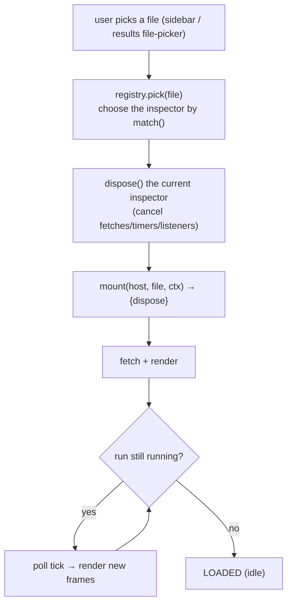

# The Results tab & inspectors — a developer's guide

**What this is.** A plain-language guide to the `/results` tab: how it turns
"the user picked a file" into "the right inspector renders it", how to **write a
new inspector**, and the **state/refresh rules** that keep live-updating runs
from corrupting the view. It's the on-ramp to three dense specs.

**What this is NOT.** The authoritative contracts. For exact clauses:
`protocols/inspector-registry.md` (the `mount`/`dispose` contract),
`protocols/results-state-contract.md` (the state machine + invariants), and
`protocols/results-tab.md` (dispatch + layout). This guide teaches and points
there; it won't drift.

---

## 1. The one-paragraph mental model

The Results tab is a **dispatcher over inspectors**. When the user picks a file,
a **registry** (`lib/inspectors/registry.js`) asks each registered inspector
"do you handle this file?", **disposes** the currently-mounted inspector, and
**mounts** the winner into a fresh host `<div>`. Each inspector is
self-contained: it owns its DOM, its data fetch, its polling, and its cleanup.
For a *live* run, the inspector polls and re-renders — and that's where the
subtle bugs live, so there's a small **state machine** + three **invariants**
every inspector must honor.



---

## 2. The pieces

| File | Role |
|---|---|
| `lib/inspectors/registry.js` | the **dispatch layer** — `pick` / `pickResult` / registration |
| `lib/inspectors/source.js` | generic text fallback (`.fdf`/`.py`/`.log`…), `isResult:false` |
| `lib/inspectors/structure.js` | `.xyz`/`.pdb` structure viewer |
| `lib/inspectors/trajectory.js` + `lib/trajectory/core.js` | optimization trajectories (`.out`, `.molwatch.log`) — the big, live-polling one |
| `lib/inspectors/spectra.js` + `lib/spectra/core.js` | spectra results (`.spectra.json`) |
| `lib/inspectors/markdown.js` | markdown docs |
| `lib/results/file-picker.js` | the result-file dropdown (uses `isResult` + `resultCategory`) |

---

## 3. How to add a new inspector (the main task)

Export an object with this shape and **self-register on load** (see contract §1):

```js
registry.register({
  name:          "transport",            // unique id
  displayName:   "Transport",            // user-facing
  isResult:      true,                   // shows in the result-file dropdown (§2)
  match:         (file) => file.endsWith(".TBT.nc"),
  resultCategory:(file) => "Transport",  // optgroup label; defaults to displayName
  mount(host, file, ctx) {
    // render INTO host; own the fetch + polling + listeners
    const off = [];
    // ... fetch, render, maybe start a poll timer ...
    return {
      dispose() {                        // MUST be idempotent + never throw
        off.forEach(fn => fn());         // cancel fetches, timers, listeners
      }
    };
  },
});
```

Then wire the partial + registration order per contract §3. Key rules:

- **`mount(host, file, ctx)`** takes ownership of an empty `host` div; returns a
  handle with `dispose()`.
- **`dispose()`** is called by the registry **before** mounting the next
  inspector. It MUST cancel all in-flight HTTP, stop poll timers, remove
  window-level listeners, and clear Plotly/3Dmol bookkeeping — and be
  **idempotent** and never throw (contract §1, `playwright-tests.md` §A6).
- **`isResult`**: `true` = a real result (lands in the dropdown); `false` = a
  catch-all viewer (don't pollute the dropdown — that's why `source` is false).
- **Registration order is load-bearing** (contract §3): the first `match()` wins,
  so specific inspectors register before the generic `source` fallback.
- **Refresh** (contract §4): handle `pageshow` + `visibilitychange` to re-poll a
  live run when the tab regains focus — route it through your dispose-tracked
  cleanup so it doesn't leak.

---

## 4. The state & refresh rules to get right

A live-updating inspector lives in exactly one of **five states**
(`results-state-contract.md` §2): `IDLE → LOADING → {LOADED | WATCHING | ERROR}`.
Three **invariants** are load-bearing — violating them is what produced the
prior corruption bugs:

1. **File-identity guard (§4-Inv1):** every async resolution must check the
   response's path against the *current* file before rendering. Otherwise a slow
   fetch for file A lands after the user switched to B and paints A's data into
   B's view. *(This is the same stale-write class as the workspace mount-restore
   race — see `workspace-guide.md`.)*
2. **In-progress frame filter (§4-Inv2):** the parser tags partial frames
   `in_progress=true`; never render a half-written frame.
3. **Render-with-snapshot (§4-Inv3):** render functions receive a state
   *snapshot* argument — they never read live `state` directly (which could
   mutate mid-render).

**Refresh has exactly ONE code path** (§5): the file-switch transition with the
current path (`transition('LOADING', {path})`). The Refresh button,
`EVENT_REFRESH_REQUESTED`, and a fresh file-pick all use it. `pollOnce()` is a
**private helper inside the WATCHING tick** — never a public entry point (a
Refresh that calls `pollOnce()` directly is a bug the contract calls out).

---

## 5. Common gotchas / anti-patterns

- **Don't** let `dispose()` skip a running poll timer or an in-flight fetch —
  that's the #1 leak/ghost-update source.
- **Don't** render a response without the **file-identity guard** — stale-file
  bleed-through is subtle and intermittent.
- **Don't** expose `pollOnce()` as a public refresh — go through the
  file-switch transition (§5).
- **Don't** put the system-load **monitor panel** inside the plot area — the
  layout invariant (§9) keeps it in-flow, out of the plot.
- **Do** claim `isResult:false` if you're a generic fallback, so you don't
  flood the result dropdown.

---

## 6. Where the authority lives

- **`protocols/inspector-registry.md`** — the `mount`/`dispose`/`isResult`/
  `resultCategory` contract, registration order, refresh contract, MountContext.
- **`protocols/results-state-contract.md`** — the 5-state machine, the three
  invariants, refresh policy, server parser/cache, per-inspector mapping.
- **`protocols/results-tab.md`** — dispatch topology, file-type table, layout.
- **`workspace-guide.md`** — the stale-write class (Invariant 1's cousin).
