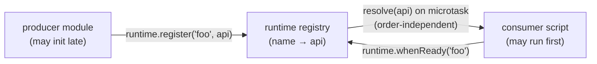

# The runtime registry — a developer's guide

**What this is.** A plain-language guide to `window.molbuilder.runtime` — the
tiny module-init coordinator that lets one script use another without caring
which loaded first. If you've ever written `setTimeout` polling for
`window.molbuilder.something`, this is what you use instead.

**What this is NOT.** The authoritative contract. `protocols/runtime-registry.md`
is the source of truth (exact error semantics, microtask timing, test map).
This guide teaches the *when/why*; that doc pins the *exactly-what*.

---

## 1. The problem it solves

molbuilder mixes **`type="module"`** scripts (async, may init late) with
**classic `<script>`** scripts (sync). A classic consumer can run *before* a
module producer has published `window.molbuilder.foo` — so `window.molbuilder.foo`
is `undefined` at the moment you need it. The old fix was polling. The registry
**inverts control**:

> Producers **`register("foo", api)`**; consumers **`whenReady("foo").then(api => …)`**.
> No polling, no load-order assumptions — the Promise resolves whenever `foo`
> registers, before *or* after you asked.



`molbuilder-runtime.js` loads **before** any other molbuilder script, so
`register` / `whenReady` are always defined.

---

## 2. The API (`window.molbuilder.runtime`)

| Call | Contract |
|---|---|
| `register(name, api)` | Publish `api` under `name`. Throws `TypeError` on empty/non-string name or `null`/`undefined` api (falsy-but-non-null like `0`/`""`/`{}` is fine). Re-registering **warns** + replaces (a programmer bug, but the page survives). Drains pending `whenReady` waiters. |
| `whenReady(name) → Promise<api>` | Resolves with `api` when `name` registers (next microtask if already registered). **Rejects** (never throws) on a bad name — so a caller always gets a Promise. |
| `get(name) → api \| undefined` | Synchronous peek; `undefined` if absent. **Devtools/tests only** — prefer `whenReady` in production. |
| `listRegistered() → string[]` | Sorted snapshot of registered names (a copy, not live). |
| `listPending() → string[]` | Sorted names that have `whenReady` waiters but no registration yet — **diagnoses "consumer hung forever"**. |

---

## 3. How to use it

**As a producer** — register at the **end** of your IIFE, once your API object
is fully built:

```js
(function () {
    const api = { doThing() { /* … */ } };
    // … wire everything …
    window.molbuilder.runtime.register("myModule", api);   // LAST line
})();
```

**As a consumer** — await the dependency; never poll:

```js
window.molbuilder.runtime.whenReady("myModule").then((myModule) => {
    myModule.doThing();
});
```

**Devtools / tests** — `runtime.get("myModule")` for a synchronous peek, and
`runtime.listPending()` to see what a stuck page is still waiting on.

---

## 4. Rules to get right

1. **Consume with `whenReady`, not polling and not `get`.** `get` can return
   `undefined` if the producer hasn't registered yet; `whenReady` waits.
2. **`register` is the LAST thing your IIFE does** — publish only a
   fully-initialized API, so a consumer's `.then` never sees a half-built module.
3. **One name, one owner.** Re-registering the same name warns and replaces —
   if you see that warning, two modules are fighting over a name.
4. **`whenReady` rejects (not throws) on a bad name** — handle it as a Promise
   rejection, not a try/catch around the call.

---

## 5. Common gotchas

- **A consumer that never resolves** → the producer never called `register`
  (or registered under a different name). Check `runtime.listPending()`.
- **`get` in production** → race-prone; use `whenReady`.
- **Registering a half-built api early** → consumers see incomplete state; move
  `register` to the end.
- **Load order worries** → unnecessary; that's exactly what the registry removes.

---

## 6. Where the authority lives

- **`protocols/runtime-registry.md`** — the contract: exact error semantics,
  microtask-drain timing, the registered-modules list, the test map.
- Related: most modules in `workspace-guide.md` / `protocols/projects-sidebar.md` /
  `molviewer-guide.md` publish themselves via `register` and are consumed via
  `whenReady`.
