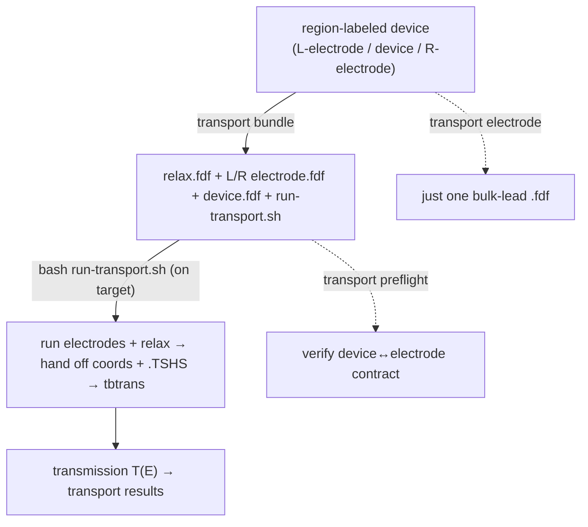

# Transport (conductance) calculations — a developer's & user's guide

**What this is.** A plain-language guide to running an electron-transport
(conductance) calculation in molbuilder: what the workflow is, how to drive it
today (the `molbuilder transport` CLI), the all-important **cross-run
consistency contract**, and what's shipped vs still coming.

**What this is NOT.** The scientific design/spec. `protocols/transiesta-workflow.md`
is the source of truth for the physics, the corrections, and the strategy;
`engines/transport.md` is the stub landing page. This guide teaches how to use
it and points there.

---

## 1. The one-paragraph mental model

Conductance through a molecular junction (e.g. Au–BDT–Au) is **not one run** —
it's **three coupled SIESTA runs** that must agree numerically: a **relaxation**
of the device, a **bulk-electrode** run per lead that emits a `.TSHS`
Hamiltonian, and the **NEGF device** run that consumes both `.TSHS` files. The
correctness hinges entirely on those runs sharing **one numerical contract**
(basis, mesh, pseudopotentials) **and a geometric clone** of the electrode. So
molbuilder derives **all three from ONE region-labeled device** (regions
`L-electrode` / `device` / `R-electrode`) and gives you a **preflight** that
verifies the contract before you spend cluster time.



---

## 2. How to use it today (the CLI)

The real path today is the `molbuilder transport` CLI (the web tab is a config
skeleton — see §4):

```bash
# 1. derive relax + both electrodes + device + driver from ONE labeled device
#    (--cell-fdf preserves the real hexagonal Au(111) lattice)
molbuilder transport bundle --device dev.xyz --job-name junc \
    --mesh-cutoff 400 --kx 4 --ky 4 --cell-fdf relaxed.fdf --out-dir run/

# 2. on the target, under molbuilder-siesta, run the driver
#    (runs electrodes+relax, hands off coords + .TSHS, then tbtrans)
cd run/ && conda activate molbuilder-siesta && bash run-transport.sh

# 3. verify the device<->electrode contract (after any hand-edit)
molbuilder transport preflight --device run/junc.fdf \
    --electrode run/junc_L-electrode.fdf
```

| Command | Does |
|---|---|
| `transport bundle` | one labeled device → the full relax + L/R electrode + device + `run-transport.sh` bundle |
| `transport electrode --which L-electrode\|R-electrode` | derive a single bulk-lead `.fdf` (the electrode wizard) |
| `transport preflight` | check the device↔electrode consistency contract |

---

## 3. The pieces

| Layer | Where | Role |
|---|---|---|
| Electrode wizard | `transport/wizard.py` | derive a bulk-lead `.fdf` (+ geometric clone) from the labeled device |
| Orchestration | `transport/orchestrate.py` | the 3-run bundle + file hand-offs (`run-transport.sh`) |
| Consistency preflight | `transport/preflight.py` | the cross-run contract gates |
| Engine | `transport/transiesta.py` | the TranSIESTA NEGF `.fdf` emitter (zero-bias scope) |
| Results | `transport/results.py` | the engine-agnostic `TransportResult` type |
| CLI | `transport/_cli.py` (`molbuilder transport`) | the terminal surface |
| Web tab | `lib/transport/core.js` + `/api/transport/schema` | the config form (Generate deferred, §4) |

---

## 4. What's shipped vs coming (be honest)

- **Shipped (B.3, zero-bias scope):** the `transport bundle` / `electrode` /
  `preflight` CLI, the electrode wizard, the 3-run orchestration + driver, the
  zero-bias TranSIESTA engine, and the region-label-driven derivation.
- **Web tab:** a **form skeleton** — `lib/transport/core.js` renders the
  `TransportConfig` form and persists to sessionStorage, but **Generate is
  intentionally disabled** until the engine backends wire into the web path
  ("configure now, generate later").
- **Follow-up:** the **bias scan** (`bias_voltages_v` is a `List[float]`; today
  only the first is emitted, with a preflight WARN if `len > 1` — the planned
  path emits one `.fdf` per bias + a loop driver); a **PySCF-NEGF** backend; and
  wiring the web-tab Generate.

---

## 5. Key concepts

- **The consistency contract is the whole game.** The device and electrode runs
  MUST share the numerical contract (basis, mesh-cutoff, pseudos) + a geometric
  clone of the lead. `transport preflight` is the highest-value tool — run it
  after any hand-edit. (transiesta-workflow.md §4.3, §6.3.)
- **Region labels drive everything.** `L-electrode` / `device` / `R-electrode`
  regions on the input structure are what `bundle` / `electrode` extract from.
- **`--cell-fdf` preserves the real lattice.** The Au(111) cell is hexagonal;
  don't let a magic orthorhombic box replace it — pass the relaxed `.fdf`.
- **Zero-bias today.** One `TS.Voltage` per run; multi-bias T(E) is multiple
  runs (the follow-up bias-scan driver).

---

## 6. Common gotchas

- **Don't hand-assemble electrodes** — derive them with `transport electrode` /
  `bundle` so the geometric clone + contract hold.
- **Always `preflight`** before submitting, and after any manual `.fdf` edit.
- **Don't expect the web tab to Generate yet** — use the CLI.
- **`len(bias_voltages_v) > 1`** currently emits only the first point (preflight
  warns) — don't assume a full sweep ran.

---

## 7. Where the authority lives

- **`protocols/transiesta-workflow.md`** — the physics, the scientific
  corrections, and the molbuilder strategy (§6: one descriptor → three runs,
  the consistency preflight, orchestration).
- **`engines/transport.md`** — the transport-engine landing/stub.
- **`region-labels.md`** — the region-label vocabulary the derivation reads.
