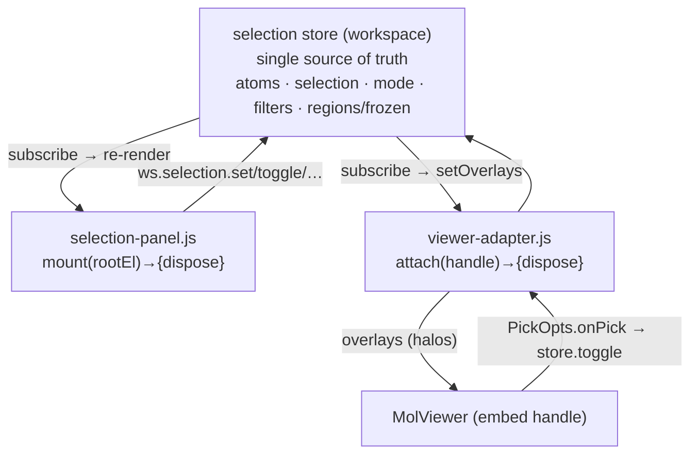

# Atom selection — a developer's guide

**What this is.** A plain-language guide to how "which atoms are selected" works:
one **store** holds the selection; a **panel** shows it; a **viewer-adapter**
paints it in the 3D viewer and turns clicks back into selection. Three consumers,
one source of truth.

**What this is NOT.** The authoritative spec. `protocols/molview-module.md` pins
the data structures, the full store API, the event protocol, and the scenarios.
The store itself is part of the workspace store — see `workspace-guide.md` for
its `ws.selection.*` mutators. This guide teaches how the pieces fit.

---

## 1. The one-paragraph mental model

The **selection store is the single source of truth** (it lives in the
workspace store, `_selection-store-impl.js`): it holds the atoms, the selected
indices, the mode (click / filter), the filters, and the sidecar-derived regions
+ frozen atoms. Everything else is a **consumer** that renders from the store
and routes user input *back* through the store's mutators:

- the **selection panel** (`selection-panel.js`) — the list/controls UI,
- the **viewer-adapter** (`lib/selection/viewer-adapter.js`) — paints overlays
  in the MolViewer and forwards 3D clicks to the store,
- **measurements** (`lib/selection/measurements.js`) — distance/angle chips.

Because all three read from and write to the one store, the panel, the 3D
highlight, and the measurement chips are always consistent — no cross-syncing.



---

## 2. The pieces

| Module | Public surface | Role |
|---|---|---|
| selection store | `ws.selection.*` (see workspace-guide) | the state + mutators (single source of truth) |
| `selection-panel.js` | `mount(rootEl) → {dispose}` | DOM UI — **no internal state**; renders from store, calls mutators |
| `lib/selection/viewer-adapter.js` | `attach(handle) → {dispose}` | subscribes store → `setOverlays`; routes viewer picks → `store.toggle` |
| `lib/selection/measurements.js` | measurement chips | distance/angle overlays on the current pick set |

---

## 3. Data (what the store holds)

- **`Atom[]`** — per-atom rows (element, name, residue, region, frozen…).
- **selection `indices`** — the currently-selected atoms (sorted, unique).
- **`mode`** — `"click"` (pick atoms) or `"filter"` (select by rule).
- **`filters`** — element / index-range / region-label rules (evaluated in
  filter mode).
- **regions + frozen** — from the `.molstruct.json` sidecar (named regions,
  frozen-atom lists).

Full shapes: `molview-module.md` §2.

---

## 4. How to wire it (as a tab)

```js
// 1. mount the panel into its host
const panel = window.molbuilder.selectionPanel.mount(panelHost);
// 2. embed the viewer, then attach the adapter to its HANDLE
const handle = window.molbuilder.viewer.embed(viewerHost, { pick: {} });
const adapter = window.molbuilder.selectionViewerAdapter.attach(handle);
// 3. drive selection through the store (panel + viewer update automatically)
window.molbuilder.workspace.selection.set([1, 2, 3]);
// teardown:
panel.dispose(); adapter.dispose();
```

You never sync the panel and the viewer to each other — they both follow the
store.

---

## 5. Key concepts

- **The store is the ONLY source of truth.** The viewer's own halo/label
  rendering is **disabled**; the adapter paints *everything* via `setOverlays`
  so the store — not the viewer — decides what's highlighted.
- **Selection = overlays, picks = `onPick`.** The adapter pushes selection as
  overlays and receives clicks through the embed's `PickOpts.onPick` (→
  `store.toggle`). It never touches raw 3Dmol (see `molviewer-guide.md`).
- **`attach()` takes the embed HANDLE, not a raw viewer.** Passing a raw 3Dmol
  viewer errors (a guard against script-order bugs).
- **Click vs filter mode.** Click mode toggles atoms; filter mode selects by
  rule (`apply` evaluates the draft filters).
- **Batching.** Store mutators fire `notify()` once; consumers re-render once
  per change (event protocol, §4).

---

## 6. Common gotchas

- **Don't set selection on the viewer directly** — go through the store; the
  adapter reflects it.
- **Don't pass a raw 3Dmol viewer to `attach`** — pass the embed handle.
- **Don't hold selection state in the panel** — it's stateless by design;
  re-read the store.
- **Sidecar regions/frozen travel with the structure** — don't drop them on
  save (see `structure-guide.md` §5).

---

## 7. Where the authority lives (+ a heads-up)

- **`protocols/molview-module.md`** — the spec: data structures (§2), store API
  (§3), event protocol (§4), dependency diagram (§5), information-flow scenarios
  (§6).
- **`workspace-guide.md`** — the store + `ws.selection.*` mutators.
- **`molviewer-guide.md`** — the viewer the adapter drives (overlays/picks).

> **Heads-up (planned):** this module (store + panel + viewer-adapter) and the
> MolViewer are slated to be **merged into one integrated module** with a unified
> data/UI/API. This guide's store↔panel↔adapter↔viewer seam is the map for that
> work. See the `project-viewer-selection-merge` plan.
