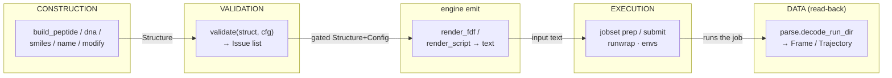

# Backend architecture — the four concerns (data · construction · validation · execution)

**Role:** reference
**Domain:** *(root — the spine)*
**Companions:** [`architecture.md`](?doc=architecture.md) — the **same backend
by *layer*** (L1/L2/L3), a task → tool index; [`design.md`](?doc=design.md) —
mission · principles · decisions (its Architecture section gives the concise
intro and cites this doc); [`README.md`](?doc=README.md) — the doc index.

> **What this is.** A map of the Python backend organised by **functional
> concern** — how the code separates *managing data*, *constructing
> structures*, *scientifically validating* a job, and *running the workflow*.
> It is the concern-lens complement to [`architecture.md`](?doc=architecture.md),
> which indexes the same modules by **layer** and points at each authoritative
> doc. This file answers a question the layer index does not ask head-on: *are
> the four backend concerns cleanly separated, and where do they leak into each
> other?*
>
> **The short answer:** yes — the separation is real and mostly clean. It rides
> on the load-bearing L1/L2/L3 import-direction rule (enforced by
> `tests/test_layering.py`) plus the four core types as a shared vocabulary.
> Data management and structure construction are well isolated. The one concern
> that had genuine gaps was **scientific validation** — centralised for the
> SIESTA/PySCF Build engines but scattered for Spectra/Transport; that gap was
> closed in 2026-07 (§ 4). A handful of smaller execution↔engine couplings
> remain, catalogued as known seams in § 5.

---

## 1. Two axes: layers × concerns

The backend is organised on **two orthogonal axes**, and both matter:

- **Layer** (enforced): *import direction.* L1 core types import nothing above
  them; L2 domain verbs may import L1; L3 surfaces (`cli` / `web`) may import
  both. This is the invariant that stops the registry/abstraction tangle from
  growing back — `tests/test_layering.py` fails any violation, and classifies
  *every* top-level name so nothing escapes a layer decision. This is the axis
  [`architecture.md`](?doc=architecture.md) indexes.
- **Concern** (this doc): *functional responsibility.* Every L2 verb belongs to
  exactly one of four concerns. The concern is **not** enforced by a test — it
  is a design intent this document records so new code lands in the right
  module.

The concern axis cuts *across* layers. "Data management" owns L1 types **and**
L2 codecs; "scientific validation" owns L1 primitives **and** the L2 validation
pass. So a module's **layer** tells you *who it may import*; its **concern**
tells you *what job it does*. Keep both straight.

| Layer | Data management | Construction | Validation (science) | Execution (workflow) |
|---|---|---|---|---|
| **L3** surfaces | `web/blueprints/*` · `cli.py` — every surface is *deserialize → verb → serialize* | | | |
| **L2** domain verbs | `parse/` · `sidecars/` · `workingcopy_structure` · `script_emit` · `projects` | `peptide` · `nucleic` · `smiles` · `pubchem` · `modify` · `builders/backends` | `validation/` (the pass + engine adapters) | `jobset/` · `bench/` · `runwrap` · `envs/` · `diagnostics` · `runtime_config` · `transport/` (compose · stages · record) |
| **L1** core types | `structure` · `frame` · `selection` · `config/` · `trajectory_log` · `persist` · `issues` | *(none — construction is all L2 verbs)* | `chemistry` · `pseudos` · `residues` | `checkpoint` *(git-backed, parameterized glob tables)* |

The four core types — `Structure`, `Frame`, `Config`, `Issue` — are the wire
between concerns: **construction** emits a `Structure`; **validation** reads a
`Structure`+`Config` and returns `List[Issue]`; the engine emitters render a job
from `Structure`+`Config`; **execution** runs it; **data management** owns the
round-trip of all of them to and from disk. § 6 draws the full pipeline.

---

## 2. Data management

**Job:** own every representation of structure / trajectory / config data and
its serialization — in memory (the dataclasses), on the wire (`to_wire`), and on
disk (the codecs). No domain logic: a data module never validates chemistry,
builds geometry, or runs a job.

| Module | L | Role | Public entry points |
|---|---|---|---|
| `structure.py` | L1 | the **one** structure codec + key-namer (coords + metadata) | `Structure`; `to_dict` / `from_dict` / `to_wire`; `from_xyz` / `to_xyz` / `from_pdb`; `resolve_cell` — full codec in [`model/structure.md`](?doc=model/structure.md) |
| `frame.py` | L1 | `Frame` / `Trajectory` per-step physics | `Frame`, `Trajectory` |
| `selection.py` | L1 | atom-selection rule algebra (duck-typed on `struct`) | `Rule`, `evaluate`, `to_json` / `from_json` |
| `config/` | L1 | the engine-knob **dataclasses** (the lingua franca) + field metadata | `SiestaConfig`, `PySCFConfig` (the two base engine configs; `config/spectra.py` and `config/transport.py` are higher-level wrappers that resolve to them) |
| `trajectory_log/` | L1 | the molwatch progress-log format + writer | `format`, `emitter` |
| `persist.py` | L1 | versioned-doc schema check + atomic JSON IO | `schema_major`, `check_schema_major`, `read_json`, `write_json` |
| `parse/` | L2 | the single **read-side** stack: File / Text / Dir → typed `ParseResult` | `parse.registry.{parse,parse_dir,parse_text}`; `parse.dirs.job.decode_run_dir` — see [`model/parse.md`](?doc=model/parse.md) |
| `sidecars/` | L2 | write-side `.molstruct` / `.spectra` / `.transport` JSON | `molstruct.{to_dict,save,load,apply_to_structure}` |
| `workingcopy_structure.py` | L2 | the paired `.xyz`+`.molstruct.json` file door — one generator, one adapter per destination | `StructureCodec.{pair,files,write,read}` — see [`model/structure.md`](?doc=model/structure.md) § 2.4 |
| `script_emit.py` | L2 | write-side of the generated-script reserved blocks | `emit_header` / `emit_provenance` / `emit_bench_marks` / `emit_atom_metadata` |
| `projects.py` | L2 | filesystem layout / naming authority | `validate_name`, `project_dir`, `list_structures` |

**Assessment: clean.** No data module imports execution, validation, or
construction code; every dependency points *down* to the L1
`Structure` / `selection` / `frame` authorities or *sideways* within the
read/write codec pair (`sidecars/` write ↔ `parse/sidecars/` read, resolved
with lazy imports). The structure-authority consolidation — one codec
(`Structure.to_dict` / `from_dict` / `to_wire`), sidecar `to_dict` spreading
`**fields` with no hand-listing — is effectively complete. Detail:
[`model/structure.md`](?doc=model/structure.md),
[`execution/job-contracts.md`](?doc=execution/job-contracts.md) (the data
vocabulary).

Two residual data-consolidation gaps, both tracked and neither load-bearing:
the vestigial `web/blueprints/_shared.py::structure_to_dict` wrapper (gutted to
call `to_wire()` but not yet deleted), and the CLI load/save path not yet routed
through `StructureCodec` (**task #73**).

---

## 3. Structure construction

**Job:** synthesize or edit geometry — `sequence` / `SMILES` / `name` in,
`Structure` out; or `Structure` in, edited `Structure` out. A builder never
persists to a project file (the codec does that) and never runs the formal
validation pass (that gate is at generation time).

| Module | L | Role | Yields |
|---|---|---|---|
| `peptide.py` | L2 | peptide builder | `Structure` |
| `nucleic.py` | L2 | DNA / RNA builders (dispatch to backends) | `Structure` |
| `builders/backends/` | L2 | per-tool backends: `_rdkit` / `_amber` / `_threedna` | `Structure` (or `BackendUnavailable`) |
| `smiles.py` | L2 | SMILES → `Structure` (RDKit + OpenBabel fallback) | `Structure` |
| `pubchem.py` | L2 | name → SMILES → `Structure` | `Structure` |
| `modify.py` | L2 | atom-level edits (`delete_atoms` / `add_atom` / `orient_along_axis` / `calibrate_to_cell` / …) | `Structure` |

The construction surfaces are in [`engines/builders.md`](?doc=engines/builders.md).

**Assessment: clean, with three consistency nits.** Every builder returns a
`molbuilder.Structure`; none persists to the workspace (backends only write
scratch files into a `TemporaryDirectory` to feed an external tool). Build-time
chemistry (H-addition, phosphate protonation, backbone-connectivity self-check,
duplex clash warnings) lives inline **by design** — it is structure *cleanup*,
not the scientific *gate*, and `modify.py` documents the boundary (it defers
zero-offset enforcement to `validate_geometry`). The nits, all minor:

1. **Duplicate PDB codec.** `builders/backends/_common.py::parse_pdb_to_structure`
   is a second PDB reader independent of the unified `parse/` stack — small
   codec logic embedded in the construction layer.
2. **Non-uniform external-tool gating.** Four tools, four idioms: `_threedna` (a
   bespoke filesystem detection chain), `_amber` (defers to `diagnostics` +
   `envs.run_tool`), `_rdkit` (`importlib.util.find_spec`), OpenBabel-in-`smiles`
   (inline `try/import`). Only `_amber` reaches into the execution/env layer,
   and only for external-process routing — not `jobset` / `runwrap`.
3. **One return-type wart.** `smiles.build_from_smiles(…, return_backend=True)`
   returns an ad-hoc `(Structure, str)` tuple instead of a bare `Structure`.

---

## 4. Scientific validation — the concern that had real gaps

**Job:** answer "is this job scientifically defensible before we emit it?" —
chemistry (spin/charge parity, open-shell/metal), pseudopotential coverage,
engine-keyword sanity (k-grid, cutoff, basis, boundary conditions). The intended
contract ([`science/validation.md`](?doc=science/validation.md),
[`science/chemistry-correctness.md`](?doc=science/chemistry-correctness.md)):
**one shared chemistry analyzer**, and **one `validate()` pass per engine** that
a surface calls once.

### What is unified (was already good, still good)

The chemistry `(charge, spin, treatment)` invariant — the place silent errors
hide — is genuinely single-sourced. `chemistry.analyze_structure` (L1,
engine-agnostic) plus the shared `check_open_shell_metal` helper are consumed by
`validation/`, both engine emitters, the spectra preflight, and the transport
preflight. `pseudos.check_coverage` is the single pseudopotential owner (C1–C6).
No engine reimplements the chemistry.

### What was scattered — fixed 2026-07

These gaps were the review's "do we need more separation? **yes**" answer — not
a new module, but *finishing the one that exists*. All are shipped, and each has
a pinning test:

| # | Finding (was) | Fix shipped |
|---|---|---|
| V1 | **No single pass for Spectra/Transport** — each surface ran `validate(…) + engine.preflight(…)`; forget the second and the science silently skipped. | `SpectraConfig` + `TransportConfig` are registered in `_ENGINE_VALIDATORS` (`validation/__init__.py`); the blueprints call `validate(struct, cfg, prior=prior)` **once**. `validate()` threads `prior` to the engine validator. Pinned by `tests/validation/test_aggregator.py::test_all_four_engine_configs_are_registered`. |
| V2 | **Transport science lived outside the registry** (`transport/transiesta.py::preflight`). | The registered `_validate_transport` dispatches to the engine's `preflight` via `get_engine(cfg.engine)` — region / electrode-ordering / bias checks now run through `validate()`. Pinned by `test_validate_dispatches_transport_preflight`. |
| V3 | **A third type system** — the device↔electrode cross-run validator used `Check` / `PreflightReport`, not `Issue`. | Kept as a distinct **checklist** type (it reports passing "ok" gates that `Issue` can't model — a legitimately different role) but **bridged**: `PreflightReport.to_issues()` / `Check.to_issue()` map the problem-severity checks onto `Issue`, so it is no longer a *disconnected* third system. |
| V4 | **A duplicated rule** — hybrid `grid_level < 4` in both `validation/pyscf.py` and the spectra engine (now `validation/spectra.py`) with different detectors. | One body: `validation.pyscf.is_hybrid_functional` + `check_hybrid_grid_level(cfg, context=…)`, called by both sites; the message is context-selected (opt forces vs Hessian frequencies). |
| V5 | **Doc drift** — `chemistry-correctness` pointed at a non-existent `molbuilder/analyzer.py` / `analysis_notes`. | Repointed to `chemistry.py::analyze_structure` / field `warnings` / the real deterministic-analyzer test. |

**The render-gate vs preflight-UX split (a V1/V2 subtlety).** Registering the
spectra preflight surfaced that it mixed two concerns: render-gate **science**
(grid / amplitude / parity / method / open-shell) and a preflight-only
**selector-availability** check (`top_n` / `threshold` want prior Raman data).
Only the science gates render — a `top_n` script is valid to *emit* (it resolves
at run time). So the spectra engine split into `render_checks` (registered as
the `SpectraConfig` validator; run by both the render path and `validate()`) and
`selector_checks` (preflight-only UX the `/spectra` endpoint adds on top).
`preflight()` composes both for back-compat. Pinned by
`test_validate_dispatches_spectra_render_science_but_not_selector`.

---

## 5. Workflow / execution

**Job:** run a set of related jobs on any target — stage laddering, scheduling,
env dispatch, launcher emission, checkpointing, benchmarking, run-bundle handoff.
The design intent ([`execution/job-system.md`](?doc=execution/job-system.md)):
**everything after the *producer* is engine-agnostic** — the core never parses a
`.fdf`, and sees only opaque script filenames.

| Module | L | Role | Engine knowledge? |
|---|---|---|---|
| `jobset/` (`model` / `materialize` / `shape` / `prep` / `plan` / `submit` / `summarize` / `agreement` / `ledger` / `_cli`) | L2 | engine-agnostic staged-execution core | **none** (correct) |
| `jobset/runstatus.py` | L2 | read-only per-stage status + warm-file inventory | none since U3 — derives from the § 4.2a rules files (W2 closed) |
| `bench/` | L2 | benchmark sweep; a **JobSet producer** | siesta (sanctioned — producer) |
| `runwrap.py` | L2 | the `.run.sh` / `.sbatch` launcher emitter | **deep** (see W1) |
| `runtime_config.py` | L2 | `molbuilder.json` reader (scheduler / routing / exec) | — (see W3) |
| `diagnostics.py` | L2 | host capability snapshot + env-for-category routing | env-category tables (config, fine) |
| `envs/` | L2 | conda-env dispatch + doctor / validate / install toolkit | — (clean) |
| `checkpoint.py` | L1 | git-backed run-dir snapshot/restore + binary archiving | engine glob tables, *parameterized* (fine) |
| `monitor.py` | L2 | shipped standalone job-status tailer | siesta `.out` markers (by design — bare-env) |
| ~~`transport/orchestrate.py`~~ | L2 | ~~3-run TranSIESTA driver~~ *deleted 2026-08-29 with the composite's P7 — `transport/compose.py` + `stages.py` + `record.py` are the replacement, inside the job system* | (W4 closed) |

**Assessment: the core is exemplary; the edges couple to a specific engine.**
The `jobset/` core is a model of the separation — pure engine-agnostic verbs, no
data / science / construction reach-ins, all engine knowledge held by producers.
The coupling smells live at the edges. These are **known seams, not load-bearing
bugs** — the backend works and the layering holds. They are deferred boundary
debt (the difference between "separated in practice" and "separated by contract,
uniformly"), catalogued here so a future refactor knows where the seams are:

| # | Seam | Where |
|---|---|---|
| W1 | **`runwrap.py` is the coupling hotspot.** Engine-aware by necessity (restart semantics), but it also reaches into the `.fdf` *input schema* (`_fdf_requests_gpu` / `_fdf_requests_elpa` / `_parse_fdf_n_atoms`). Execution is fused to one engine's input schema rather than sitting behind an interface. *(The memory-model half of this row was deleted 2026-08-24 with the estimator itself.)* | `runwrap.py` (the three `_fdf_*` helpers) |
| W2 | ~~**The one leak inside the "agnostic" core.**~~ **CLOSED (U3, 2026-08-13):** `jobset/runstatus.py`'s hardcoded warm-file table now derives from the engines' `warm-files.toml` rules files through the one loader (`job-contracts.md` § 4.2a) — the row stays so the seam's history is findable | `jobset/runstatus.py` |
| W3 | **`runtime_config` leaks scheduler schema as untyped dicts** into `jobset/submit.py` and `runwrap.py` (`d["partition"]`, `d["qos"]`, …), and the module also bundles web-auth/TLS config with scheduler config — two concerns in one reader. | `runtime_config.py`; consumers `jobset/submit.py`, `runwrap.py` |
| W4 | **CLOSED (2026-08-29)** — transport stayed its own kind exactly as decided (2026-08-11, user), and the composite is that kind built properly: `--calculation transport` cites a finished junction, derives its five stages, and runs them through the ordinary jobset verbs — no edges, no chained ladder, the hand-rolled bash driver deleted (`archive/2026-09-01-transport-design.md`) | *(orchestrate.py deleted)* |
| W5 | **A module misfiled under "workflow."** `script_emit.py` is really a **data** serializer (it reaches into `parse.types`, `sidecars`, `structure`), not an execution verb — this doc files it under § 2 for that reason.  *(Its former sibling `bundle_writer.py` retired 2026-08-29 with the handoff it materialised.)* | `script_emit.py` |

The scheduler vocabulary in `jobset/model.py::Resources` (`mpi_np`, `time`,
`mem`, `gres`, `domain`) is SLURM-shaped — a *scheduler* coupling in the neutral
core, not an *engine* one. Acceptable today (SLURM is the only real backend), but
worth naming so a future PBS/LSF backend knows where the seam is.

---

## 6. The cross-concern pipeline

The concerns compose into one flow. The arrows are the **only** sanctioned
inter-concern calls, and each carries a core type:

Read it as: **construction** produces a `Structure`; **validation** gates it
against a `Config`; the engine emitter (a construction-adjacent verb) renders the
input text; **execution** runs it; **data management** parses the results back
into `Frame` / `Trajectory`. **Data management owns the round-trip of every
arrow to and from disk** — `StructureCodec` (`.xyz`+`.json`), the sidecars
(`.molstruct` / `.spectra` / `.transport`), `script_emit` (the reserved blocks),
and `persist` (the `@major` schema check). The `Issue` list is advisory while
editing and enforcing at generation — `report()` is the only hard gate.

---

## 7. Verdict

**Do we need a new logical separation?** No. The four concerns already have
distinct homes, enforced downward by the L1/L2/L3 rule and wired by the four core
types. Data management and structure construction are clean; scientific
validation was the one concern with real gaps and they are now closed (§ 4). What
remains is **completing** the separation at the execution edges (§ 5 W1–W4) and a
little hygiene (§ 3 nits, § 2 residuals, W5) — deferred boundary debt, not
load-bearing bugs. None of it changes the concern *homes*; it makes them
uniform. If any of these are scheduled, they become entries in
[`archive/2026-09-01-roadmap.md`](?doc=archive/2026-09-01-roadmap.md).

---

## 8. Keeping the separation (the boundary contract)

When adding backend code, place it by concern **and** layer:

- **A new builder** returns a `Structure` and nothing else. It may clean up
  chemistry inline; it must not persist, and must not run `validate()`.
- **A new scientific check** goes in `validation/` (or `chemistry.py` if it is an
  irreducible per-structure primitive), registered so a single `validate(cfg)`
  reaches it. Never inline a new `preflight` outside the registry.
- **A new execution verb** stays engine-agnostic if it is post-producer; engine
  knowledge belongs in a *producer* (like `bench/to_jobset`). Never parse a
  `.fdf` in the `jobset` core.
- **A new data codec** routes through the `Structure` authority
  (`to_dict` / `from_dict` / `to_wire`) and `persist.check_schema_major`; never
  hand-list metadata fields or hand-roll a schema check.

The enforcement floor stays `tests/test_layering.py` (import direction). This
document is the concern-level intent above that floor; keep it in sync when a
concern boundary moves.
