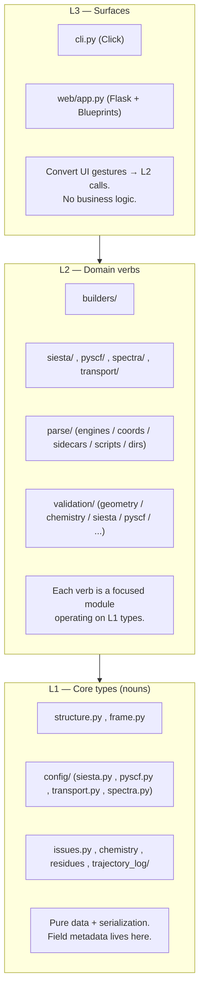

# molbuilder — design and roadmap

This document is the durable design reference for molbuilder. It captures
mission, architectural principles, decisions made, and active roadmap items
that span multiple sessions of work. Per-component test contracts live under
[`docs/`](README.md) (categorised by purpose: `protocols/`, `types/`,
`engines/`, `tabs/`); this document sits above them.

When in doubt about whether to do something, read this file first. When the
file is wrong (the decision changed, the constraint shifted), update it in
the same PR as the code change.

---

## Mission

molbuilder builds 3-D molecular structures from sequence / SMILES / name
input, modifies them into derived geometries (e.g. metal-molecule-metal
nanojunctions), generates SIESTA and PySCF input files for those structures,
and presents the resulting trajectories through a unified Results-tab
inspector.

The package is a single, internally-coherent toolkit covering the full
pipeline:

```
sequence ──► Structure ──► (modify) ──► SIESTA .fdf  ──► siesta ──┐
                                    └─► PySCF .py    ──► python  ─┴──► .molwatch.log
                                                                              │
                                                ◄── /results inspector ───────┘
```

The package consolidates what was originally two separate repos
(`Qing-LAB/molbuilder` build side + `Qing-LAB/molwatch` viewer side; merged
2026-05).  The merge collapsed the shared file-format contract
(`.molwatch.log v1`), the shared core dataclass (`Structure`), and the
shared Flask + 3Dmol.js stack into one codebase.  History reconstructable
from `git log`; per-component contracts under [`docs/`](README.md).

### Stance — an assistant to the scientist, not a nanny

molbuilder is **an assistant to a scientist**, not an automatic
test/calculation system and not a push-button black box. It does **not own
the experiment, the design, or the recipe** — the scientist does. Its job is
to provide **background, support, and hints that reduce the burden** so the
scientist can focus on the science.

Concretely, this stance binds every feature:

- **Easy but explicit, never push-button.** Make the right thing easy *and
  visible* — surface the choice, the env, the parameter — never silently
  auto-decide on the scientist's behalf.
- **Don't twist the environment or the recipe.** No silent env re-routing, no
  hidden mutation of the user's input; offer a *setup to test* and let the
  scientist run and adjust it.
- **Generate setups + surface hints, not finished answers.** A benchmark
  offers the harness to measure; a preflight surfaces inconsistencies; an
  emitter writes a defensible *starting point* the scientist owns and tunes.

When a feature is tempted to decide something the scientist should decide,
the answer is to make that decision **explicit and documented**, not
automatic.

---

## 0. Document index

> **Building something? Start at [`architecture.md`](architecture.md)** — the
> design-foundation index of every major infrastructure/module/API (role ·
> layer · public API · authoritative doc · "reuse for X"), with a task→tool
> lookup. It exists to stop reinventing/patching without knowing the tools.
> This file remains the narrative master (principles, Architecture, roadmap,
> decisions).

This file is the **master**: it holds principles, cross-cutting
decisions, architecture, and an index to every subsystem doc.
Each subsystem doc is the **sole source of truth** for its own
surface — when you're working on the sidebar, read the sidebar
doc, not this one. New cross-cutting decisions land here;
subsystem-specific decisions land in the subsystem doc.

### Cross-cutting (this file)

| § | Topic |
|---|---|
| 1 | Mission |
| 2 | Architecture (three layers + four core types) |
| 3 | Design principles (numbered, named) |
| 4 | Decisions log (cross-cutting only) |
| 5 | Anti-patterns we refuse |
| 6 | Next steps |
| 7 | Process rules |

### Top-level (`docs/`)

| Doc | Owns |
|---|---|
| [`package-layout.md`](package-layout.md) | On-disk package structure (L1/L2/L3 folder map, import-stability promises) |
| [`science.md`](science.md) | Scientific correctness contract (spin+charge, validation pass, cross-engine consistency, output style) |
| [`roadmap.md`](roadmap.md) | Open backend / feature roadmap (3DNA, Transport B.3, etc.) |
| [`jobset-infrastructure.md`](jobset-infrastructure.md) | Plain-language explainer of the `jobset` framework + each use-case scenario (ladder, sweep) with diagrams + examples (contract: `protocols/staged-execution.md`) |
| [`staged-relaxation-guide.md`](staged-relaxation-guide.md) | User guide — running a staged relaxation (the ladder scenario), step by step |
| [`workspace-guide.md`](workspace-guide.md) | Developer guide — the client-side workspace store (mental model, `ws.*` API, mount-restore rule, gotchas); plain-language companion to `protocols/workspace-contract.md` |
| [`projects-sidebar-guide.md`](projects-sidebar-guide.md) | Developer guide — the projects sidebar for tab authors (`projects.*` API, `onChange` vs `onCommit`, gotchas); plain-language companion to `protocols/projects-sidebar.md` |
| [`results-tab-guide.md`](results-tab-guide.md) | Developer guide — the Results tab & inspectors (dispatch, how to write an inspector, the state-machine invariants + refresh rules, gotchas); plain-language companion to `protocols/{inspector-registry,results-state-contract,results-tab}.md` |
| [`molviewer-guide.md`](molviewer-guide.md) | Developer guide — the MolView module (`viewer.embed`/handle boundary, API cheat-sheet, drive-via-handle rule, gotchas); plain-language companion to `protocols/molview-module.md` |
| [`checkpoints-guide.md`](checkpoints-guide.md) | Developer/user guide — run checkpoints (git + big-binary archive; CLI/API/sidebar; restore-safety rules); plain-language companion to `protocols/run-checkpoints.md` |
| [`structure-guide.md`](structure-guide.md) | Developer guide — client-side structure build+save (the load gate, Source panels, save+sidecar, gotchas); companion to `protocols/save-flow.md` + `engines/builders.md` |
| [`runtime-registry-guide.md`](runtime-registry-guide.md) | Developer guide — the module registry (`register`/`whenReady` vs polling, gotchas); plain-language companion to `protocols/runtime-registry.md` |
| [`form-schema-guide.md`](form-schema-guide.md) | Developer guide — schema-driven Build forms (dataclass→schema→render→collect round-trip, field kinds, the dataclass-is-truth rule); the only doc dedicated to `lib/form-schema.js` |
| [`atom-selection-guide.md`](atom-selection-guide.md) | Developer guide — atom selection (one store, three consumers: panel + viewer-adapter + measurements; how to wire it, gotchas); companion to `protocols/molview-module.md` |
| [`transport-guide.md`](transport-guide.md) | Developer/user guide — conductance runs (3 coupled SIESTA runs from one labeled device; the `molbuilder transport` CLI; the consistency contract; shipped-vs-coming); companion to `protocols/transiesta-workflow.md` |

### Protocols — wire / JS / test contracts (`docs/protocols/`)

| Doc | Owns |
|---|---|
| [`molview-module.md`](protocols/molview-module.md) | **The MolView module contract (L2 UI)** — the 3-D viewer + atom selection + panel/adapter + measurement + k-grid.  It *uses* the workspace data model (L1, [`workspace-contract.md`](protocols/workspace-contract.md)) via `ws.*`; different layer, different doc (split back out 2026-07-08 after a mistaken 2026-07-06 merge). |
| [`atom-annotations.md`](protocols/atom-annotations.md) | The per-atom annotation *channels* model — schema-v4 `.molstruct.json` channels + JS mirror; the data model `structure.py` / `sidecars` / `parse` / `siesta` depend on |
| [`web-api.md`](protocols/web-api.md) | HTTP `/api/*` endpoint reference (request/response shapes) |
| [`projects-sidebar.md`](protocols/projects-sidebar.md) | Sidebar architecture, public `projects.*` API, lock model, capability table |
| [`selection.md`](protocols/selection.md) | Python selection rule grammar (`by_element`, `by_index_range`, …) |
| [`sidecar-contract.md`](protocols/sidecar-contract.md) | Three-stage UI → config → script contract for sidecar-driven boundary conditions |
| [`structure-periodicity.md`](protocols/structure-periodicity.md) | Periodicity `(cell, axis_kind{periodic/isolated/transport}, vacuum, kgrid)` on the `.xyz`+`.json` dataset: `resolve_cell` per axis_kind, axis_kind-gated k-grid (no junction-z overlaps), capture-at-construction, the 3×3 override.  Read by molview + fdf + transport |
| [`script-contract.md`](protocols/script-contract.md) | Generated-script in-body block contract: HEADER / PROVENANCE / BENCH-MARKS / ATOM-METADATA / USER-CUSTOM |
| [`script-execution.md`](protocols/script-execution.md) | Runwrap + warm-restart + cold-restart inventories per engine; ``--cold`` glob coverage rule (must ship with every warm-restart hook) |
| [`bundle-contract.md`](protocols/bundle-contract.md) | Workflow-handoff RunBundle: fuses final structure + labels + user-custom from a finished run into a portable `.xyz` + `.molstruct.json` pair for the next stage |
| [`scientific-validation.md`](protocols/scientific-validation.md) | Runtime machinery for scientific validation: `ChemistryAnalysis` analyzer + per-engine `EngineParameterAdapter` registry + validation-pass call graph + Pattern-B handling.  Implements the principles in [`science.md`](science.md). |
| [`web-ui-coherence.md`](protocols/web-ui-coherence.md) | Cross-surface coherence rules (analyzer / chip / validator / palette must agree); five-rule contract per the 2026-06-13 audit |
| [`chemistry-correctness.md`](protocols/chemistry-correctness.md) | Open-shell-metals set + closed-shell cluster carve-outs |
| [`region-labels.md`](protocols/region-labels.md) | Region-label vocabulary used across sidebar + transport + sidecar |
| [`workspace-contract.md`](protocols/workspace-contract.md) | **Workspace data-model contract (L1)** — the SOLE source for the workspace data model + persistence (`ws.*` public API, §§1–10).  The MolView module (L2 UI that *uses* this) is a separate doc, [`molview-module.md`](protocols/molview-module.md).  Supersedes `workspace-state.md`. |
| `workspace-state.md` | **Archived** → [`archive/2026-07-06-workspace-state.md`](archive/2026-07-06-workspace-state.md).  The 2026-06-07 workspace-unification audit + Phases 1–9 migration log (all shipped); the live model is `workspace-contract.md`.  A redirect stub remains at the old path. |
| [`results-tab.md`](protocols/results-tab.md) | `/results` dispatch architecture |
| [`run-checkpoints.md`](protocols/run-checkpoints.md) | Git-based working-dir state management.  Every `projects/<dir>` is a nested git repo; the wrapper auto-commits pre/post each run; big binaries (.DM, .TSHS) are archived by SHA in `.binsnapshots/`.  Sidebar surfaces commit history, branches, tags, and a graph viewer.  Pre-implementation as of 2026-06-25. |
| [`results-state-contract.md`](protocols/results-state-contract.md) | Results-tab state machine, refresh policy, monitor-panel layout invariant, per-inspector mapping; PR-by-PR migration plan in § 10. |
| [`job-decoder.md`](protocols/job-decoder.md) | Directory-level job decoder (`JobDirParser`) — composes parse-module + script_emit into a single `decoded.json` per run dir.  v1 SIESTA-optimization; spectrum + transport extensions follow. |
| [`parse-module.md`](protocols/parse-module.md) | Unified parse stack at `molbuilder/parse/` — ABCs, registry, dispatch, A-H migration plan (all phases shipped 2026-06-20 → 21).  Sole read-side source of truth; supersedes `types/parsers.md`. |
| [`runtime-registry.md`](protocols/runtime-registry.md) | `molbuilder-runtime.js` register/whenReady contract |
| [`inspector-registry.md`](protocols/inspector-registry.md) | Inspector `mount(host, file, ctx) → {dispose}` contract |
| [`save-flow.md`](protocols/save-flow.md) | Save dialog state machine + sidecar pairing rules |
| [`mobile-layout.md`](protocols/mobile-layout.md) | Responsive-grid pattern (the `minmax(min(<N>px, 100%), 1fr)` floor); narrow-viewport overflow rules |
| [`code-audit.md`](protocols/code-audit.md) | Audit playbook (multi-agent fan-out, common traps, doc-claim verification) |
| [`rate-limit.md`](protocols/rate-limit.md) | Auth-side rate-limit shape for built-in OAuth backends |
| [`job-layout.md`](protocols/job-layout.md) | On-disk basename + `*-runN.out` convention |
| [`test-strategy.md`](protocols/test-strategy.md) | 5-layer test pyramid (L1 unit / L2 module / L3 interface / L4 integration / L5 e2e) + marker convention |
| [`playwright-tests.md`](protocols/playwright-tests.md) | Test design patterns + anti-patterns |
| [`cli.md`](protocols/cli.md) | click-based CLI conventions |

`/api/watch/*` endpoints are documented in
[`web-api.md`](protocols/web-api.md) § 8 (they back the
trajectory inspector on `/results`; the legacy `/watch` page is
archived).

### UI tabs (`docs/tabs/`)

| Doc | Owns |
|---|---|
| [`architecture.md`](tabs/architecture.md) | Tab inventory + routes + cross-tab workflow + phase plan.  Phases A + B.1 + B.2 + B.5 complete; C + D planned. |
| [`molbuilder.md`](tabs/molbuilder.md) | `/molbuilder` tab — Modify subset (atom selection + edit ops + electrode panel + Geom).  The Sources card (Load + SMILES + Save) is documented in `tabs/architecture.md` § 5.  Was `modify.md` until 2026-06-07. |
| [`structure-optimization.md`](tabs/structure-optimization.md) | `/structure-optimization` tab — SIESTA / PySCF form.  Was `build.md` until 2026-06-07. |
| [`spectra/spec.md`](tabs/spectra/spec.md) | `/spectrum-calculation` tab — IR/Raman generator (route was `/spectra`). |
| [`results.md`](tabs/results.md) | `/results` tab — registry dispatch, file picker. |

### Engines (`docs/engines/`)

[`siesta.md`](engines/siesta.md) ·
[`pyscf.md`](engines/pyscf.md) ·
[`transport.md`](engines/transport.md) ·
[`optimization-tuning.md`](engines/optimization-tuning.md)
(cross-engine tier framework + design considerations) ·
[`siesta-gpu.md`](engines/siesta-gpu.md)
(GPU SIESTA source-build recipe) ·
[`builders.md`](engines/builders.md) ·
[`pyscf-publication-guide.md`](engines/pyscf-publication-guide.md)
(PySCF publication-quality parameter recipe + methods template)

### Types — L1 data contracts (`docs/types/`)

[`structure.md`](types/structure.md) · [`parsers.md`](types/parsers.md) · [`chemistry.md`](types/chemistry.md)

### Ops & deployment

[`README.md`](README.md) · [`README_install.md`](README_install.md) (four-env install model) · [`deployment.md`](deployment.md) (deploying the app) · [`job-execution.md`](job-execution.md) (job-execution system: big picture + workflow + detection contract + cookbook — master doc) · [`config.md`](config.md) (config schema + wrapper contract)

### Historical (archived — NOT a source of truth)

[`archive/README.md`](archive/README.md) catalogues superseded
docs. Anything date-prefixed (`YYYY-MM-DD-<name>.md`) is
history; read the canonical doc listed in the archive index
instead.

### Why this hierarchy

The folder split is by **kind of contract**, not by feature.
This is the load-bearing reason every spec lands in exactly one
place and there is no "where do I put this?" ambiguity:

- **`protocols/`** — how parts of the system **talk to each
  other**. HTTP wire shapes, JS module surfaces, on-disk file
  conventions, test patterns. Specs here pin contracts between
  components.
- **`types/`** — the **shape of values** flowing between
  components. Structure dataclass, parser output dicts,
  chemistry helpers. Specs here describe data, not behaviour.
- **`engines/`** — per-engine emitter specs. One per downstream
  code we generate input for, plus the build-backend contract.
  Specs here describe **what we write**, not what we do.
- **`tabs/`** — per-UI-tab specs. Single-file specs stay as
  `<tab>.md`; tabs needing multiple assets (bibliography,
  sub-specs) become subfolders, e.g. `tabs/spectra/spec.md` +
  `tabs/spectra/references.bib`. Bibliographies always live
  alongside the spec that cites them — one place to look for
  both.

The split is what makes the **sole-source-of-truth** rule
enforceable: each contract has one canonical home; cross-cutting
principles live here in `design.md` with backlinks.

---

## Architecture

**Three layers and four core types.** The layers describe directionality
of imports and responsibility; the types describe the data that flows
between layers.



The L2 dirs above are the engine-emitter modules (`siesta/`,
`pyscf/`, `spectra/`, `transport/`) plus the unified parse stack
(`parse/`, sole read-side source of truth since the 2026-06-20→21
parse-module Phase H landed) and the seven-module validation
package (`validation/`).  The earlier flat names `generators/`,
`parsers/`, `validation.py` no longer exist on disk — what shipped
absorbed them into the engine dirs + the `parse/`/`validation/`
packages.  See [`package-layout.md`](package-layout.md) for the
full file-level map.

**Layering rule (load-bearing):** higher layers may import any lower
layer; lower layers must never import higher ones. L1 modules cannot
import from L2 or L3. L3 imports L1 + L2 only through the public
package surface (`from molbuilder import ...`).

This is the single most important architectural invariant. Without it,
the package will recreate the registry/abstraction tangle that was
deleted in favor of dataclass-driven introspection.

### Core types (L1)

Four types are the lingua franca; everything else is a verb operating
on them.

| Type | Role | Layer |
|---|---|---|
| `Structure` | One geometric configuration: elements, positions, PDB metadata. Build-side. | `structure.py` |
| `Frame` | A `Structure` plus per-step physics (energy, forces, lattice, step_index, scf_history). Parse-side. | `frame.py` |
| `SiestaConfig`, `PySCFConfig` | Emission parameters for each backend. Carry the field metadata that drives CLI options, web form schema, and validation. | `config/siesta.py`, `config/pyscf.py` |
| `Issue` | A validation finding: `severity` (error/warn), `message`, `where` (field name or "geometry"). | `issues.py` |

Plain `@dataclass` everywhere. No builder patterns, no pydantic, no
custom base classes. Field metadata via `dataclasses.field(metadata=...)`
(see "Field metadata as the unifier" below).

#### `Frame` and `Trajectory`

`Structure` carries one geometric configuration. Builders emit it; FDF /
PySCF generators consume it. It does **not** carry energies, forces,
lattice, or trajectory metadata — those belong on `Frame`.

```python
@dataclass
class Frame:
    structure:    Structure                       # geometry of this step
    step_index:   int                             # 0-based; preview frame is 0
    energy:       Optional[float] = None          # eV
    forces:       Optional[np.ndarray] = None     # (N, 3), eV/Ang
    max_force:    Optional[float] = None          # eV/Ang
    lattice:      Optional[np.ndarray] = None     # (3, 3) Ang, or None for vacuum
    scf_history:  Optional[List[Dict[str, float]]] = None
                                                  # per-cycle convergence dicts:
                                                  # {cycle, energy, delta_E, ...}
                                                  # keys are engine-specific
                                                  # (gnorm/ddm for PySCF and the
                                                  # molwatch_log; dHmax/dDmax for
                                                  # SIESTA). Consumers should not
                                                  # assume a fixed key set.
```

A trajectory is wrapped in a minimal `Trajectory` dataclass that
carries `source_format`, the list of frames, and an optional shared
`lattice` (the cell when constant across frames):

```python
@dataclass
class Trajectory:
    source_format: str                          # "siesta" / "pyscf" / "molwatch" / ...
    frames:        List[Frame]
    lattice:       Optional[np.ndarray] = None  # (3, 3) Ang, or None
```

The wrapper exists for two reasons.  First, `source_format` is a
file-level string that the molwatch unified-log parser pulls from the
`# engine:` header — a `.molwatch.log` written by a SIESTA run keeps
`source_format="siesta"` even though the parser class is
`MolwatchLogParser`.  An `Iterator[Frame]` alone has no slot for
that.  Second, every current parser produces a single shared lattice
(or none) rather than per-frame lattices; lifting that onto the
trajectory matches the data and avoids redundant per-frame copies.
Per-frame `Frame.lattice` is preserved for variable-cell trajectories
that no current parser produces; today every parser sets
`Frame.lattice = None` and puts the cell on `Trajectory.lattice`.

`Trajectory` supports `len()`, iteration, and indexing so simple
callers can treat it as a frame list.  Phase 3 may grow it (analysis
methods, on-disk serialization); Phase 2 keeps it minimal.

Parser interface (`parsers/base.py`):

```python
class TrajectoryParser(ABC):
    name:  str       # e.g. "siesta"
    label: str       # human-facing
    hint:  str       # one-line user hint shown when detection fails
    @classmethod
    def can_parse(cls, path: str) -> bool: ...
    @classmethod
    def parse(cls, path: str) -> Trajectory: ...
```

The dispatch (`detect_parser`) and registry shape are unchanged from
the molwatch implementation.

Web layer / legacy adapter: the JS client still consumes the molwatch
v1 dict shape, so
`molbuilder/parse/engines/_helpers.py:trajectory_to_legacy_dict` (also
re-exported alongside `trajectory_result_to_legacy_dict` for the typed
`TrajectoryResult` envelope) flattens a `Trajectory` back to the
historical dict at the `/api/watch/load` boundary.  Phase 3 redesigns
the JSON to surface Trajectory directly; the adapter goes away then.

### Domain verbs (L2)

> **Notes on the as-shipped layout.**  The top-level builder modules
> (`molbuilder/peptide.py`, `nucleic.py`, `smiles.py`, `pubchem.py`)
> are the L2 verbs; `builders/` is reserved for `builders/backends/*`.
> The generators ship at `molbuilder/siesta/input.py` and
> `molbuilder/pyscf/input.py` rather than a flat `generators/`
> directory; the per-engine subpackages let the configs and emitters
> co-locate (the configs themselves live at L1 in `molbuilder/config/`
> and are re-exported from each engine package for back-compat).

| Verb | Module | Consumes | Yields |
|---|---|---|---|
| Build | `molbuilder/peptide.py`, `molbuilder/nucleic.py`, `molbuilder/smiles.py`, `molbuilder/pubchem.py` | sequence / SMILES / name + builder backend | `Structure` |
| Build (backends) | `molbuilder/builders/backends/_amber.py`, `_rdkit.py`, `_threedna.py` | builder request | `Structure` (or `BackendUnavailable`) |
| Modify | `molbuilder/modify.py` | `Structure` | `Structure` (delete / add / orient / electrode ops) |
| Generate | `molbuilder/siesta/input.py:render_fdf`, `molbuilder/pyscf/input.py:render_script` | `Structure` + `Config` | string (the .fdf or .py text) |
| Spectra | `molbuilder/spectra/pyscf_script.py:render_script` | `Structure` + `SpectraConfig` | string (the PySCF spectra .py text) |
| Parse | `molbuilder/parse/engines/{siesta,pyscf,molwatch}.py`, `molbuilder/parse/sidecars/{molstruct,spectra,transport}.py`, `molbuilder/parse/coords/{siesta_xv,pyscf_geom}.py` | trajectory / sidecar / structure file path | typed `ParseResult` subclass (`TrajectoryResult`, `StructureResult`, `SidecarResult`, …) — see `docs/protocols/parse-module.md` |
| Validate | `molbuilder/validation.py:validate_geometry` | `Structure`, `Config` | `List[Issue]` |
| Write log | `molbuilder/trajectory_log/format.py` + `emitter.py` | `Frame` (or initial `Structure`) | appends a block to `.molwatch.log` |

Full folder map in [`package-layout.md`](package-layout.md).

Each verb is small, takes L1 types in, and returns L1 types out. No
verb hides state in module-level globals (apart from the parser
registry, which is a literal `PARSERS = [...]` list).

### Surfaces (L3)

**CLI — click, not argparse.** A small (~30-line) bridge walks
`dataclasses.fields(Config)` and adds one `click.option` per field
using the metadata; the rest is plain click. We do **not** write our
own argument parser, registry, or coercion layer — click handles type
conversion, help text, choice validation, and `--help` rendering. The
bridge converts our `field.metadata` dict into click's existing
parameters; no extension framework on top of click.

**Web — Flask + Blueprints.** Each tab + cross-cutting concern is its
own `flask.Blueprint` mounted under a URL prefix.  Blueprints are
Flask's native mechanism for URL prefixing; we don't roll a custom
router.  Each route handler is a thin wrapper: deserialize → call L2
verb → serialize.  No business logic.

CLI surface:

```bash
molbuilder peptide  ASEQ                  # Structure → stdout XYZ (default)
molbuilder dna      ATGC                  
molbuilder rna      AUGC
molbuilder smiles   "C1=CC=CC=C1"
molbuilder name     "aspirin"

molbuilder fdf      [in.xyz|-]  out.fdf
molbuilder pyscf    [in.xyz|-]  out.py

molbuilder validate [in.xyz|-]  [--config siesta.fdf|pyscf.py]
                                          # → JSON Issue list to stdout
                                          # exit 1 on any error-severity issue

molbuilder watch parse  <traj>            # → JSON frames to stdout
molbuilder watch tail   <traj>            # → NDJSON, one frame per line
molbuilder watch serve  [--port]          # Flask portal
```

Pipe contract:
- `-` reads the appropriate input from stdin where it makes sense.
- Machine-consumable subcommands (`watch parse`, `watch tail`,
  `validate`, anything with `--json-summary`) emit JSON / NDJSON to
  stdout. Default stdout is human text or the generated file body.
- Status / progress / warnings always go to stderr.

Web routes are the **HTTP wire contract**; full request/response
shapes live in
[`protocols/web-api.md`](protocols/web-api.md).  The Blueprint set
today:

| Blueprint | URL prefix | Owns |
|---|---|---|
| `build` | `/api/build/*` | structure-from-input + Build-tab generate + schema endpoint |
| `modify` | `/api/modify/*` | atom-level edit operations + meta endpoint |
| `spectra` | `/api/spectra/*` | Spectra-tab schema + render + load |
| `files` | `/api/files/*` | projects sidebar (list, read, write, upload, delete, mkdir, rename) |
| `results` | `/api/results/*` | partials registry for `/results` inspectors |
| `selection` | `/api/selection/*` | selection store HTTP surface |
| `watch` | `/api/watch/*` | trajectory inspector data + polling |

Plus a small set of un-namespaced top-level routes (`/api/backends`,
`/api/health`, the partial-template endpoints).

### Field metadata as the unifier

Every L1 config field carries some subset of (only `label` and
`help` are universal; the others are present when they apply):

```python
metadata = {
    "label":    "Mesh cutoff",
    "unit":     "Ry",
    "range":    (50, 600),
    "choices":  None,                  # or list of allowed values
    "help":     "Real-space mesh cutoff. Lower = faster but less converged.",
    "tier":     "advanced",            # basic | advanced (default UI visibility)
    "validate": lambda v: None or Issue(...)   # optional callable
}
```

**Which keys are required.** `label` and `help` are universal --
every visible field has both, since the form renderer + the CLI
`--help` text both depend on them.  The rest are present when
they apply:

* `unit` -- physical-quantity fields (mesh cutoff, force tol).
* `range` -- numeric fields with a sensible bound.
* `choices` -- enum fields (relax_type, optimizer, basis).
* `tier` -- visibility hint for fields the form's basic-tier
  filter hides by default; absence means "always visible".
* `validate` -- per-field validator; absence means range / choices
  already cover the constraint, or no constraint applies.

The "always visible" default for missing `tier` is deliberate: a
bool flag (e.g. `use_save_dm`, `verbose_comments`) or an identity
field (`system_label`) doesn't need a tier hint because the form
shows it regardless.  A future audit that wants to force every
field into one tier or the other should land that decision here
first + then backfill.

One source feeds:

- **CLI**: a ~30-line `add_dataclass_options(cmd, ConfigCls)` helper
  walks fields and applies `click.option` per field using the metadata.
- **Web form**: `dataclass_to_form_schema(ConfigCls)` returns JSON the
  frontend renders into form controls. Same fields, same labels, same
  ranges as the CLI.
- **Validators**: `validation.py` reads `range` / `validate` per field.
  An out-of-range value yields one `Issue`.
- **Spec docs**: per-engine and per-tab specs under `docs/engines/` and
  `docs/tabs/` can be (semi-)generated from metadata so they don't drift.

This is what makes the dataclass-as-source-of-truth principle real
rather than aspirational.

---

## Watch — live trajectory viewer (archived)

> The standalone `/watch` viewer was retired 2026-05-19; trajectory
> inspection now lives on `/results` via the inspector registry.
> Full spec moved to:
>
> - `docs/protocols/inspector-registry.md` § 6 — partial layout +
>   per-engine UI adaptation + state invariants.
> - `docs/protocols/web-api.md` § 8 — `/api/watch/*` HTTP shapes.
> - `docs/archive/2026-06-02-tabs-watch.md` — historical full
>   spec snapshot.

---

## Design principles

These are load-bearing. Don't violate without updating this document.

### 1. The dataclass is the lingua franca

Every builder yields a `Structure`. Every generator consumes a
`Structure` + a `Config`. Every parser returns a `Trajectory` (a
thin wrapper over `List[Frame]` plus `source_format` + optional
shared `lattice`). Every validator returns `List[Issue]`. Field metadata — label, type, default,
range, validator, UI hint — lives on the dataclass field, **not** in
parallel registries in the CLI or web layers.

A previous custom registry framework was deleted because dataclass
introspection (plus click for CLI) is the right tool. Three places
declaring the same field metadata (dataclass + argparse + HTML form)
is how silent drift happens. CLI and HTML form must be *generated*
from the dataclass, not maintained in lockstep with it.

**Extension to client + wire layer (added 2026-06-07).** The
single-source-of-truth principle applies to the JS workspace
state and the HTTP response shape too:

- One client-side workspace dispatcher
  (`window.molbuilder.workspace`) owns the structure + source
  provenance + dirty flag + atom-level selection.  It supersedes
  the historical canvas-state, modify viewer state IIFE, and
  selection store, which each held a slice of the workspace and
  required every code path to remember to update all of them.
- One server-side response shape (`WorkspacePayload` from
  `_shared.workspace_payload`) is emitted by every endpoint that
  returns a Structure (`/api/build/load`, `/api/build/molecule`,
  `/api/modify/*`).  It supersedes the historical four parallel
  jsonify blobs that drifted in cosmetic and load-bearing ways
  (the missing `atoms` key on `/api/build/load` is what made the
  selection panel go blank on every fresh generator load
  pre-[cd9655e]).
- One sessionStorage key
  (`molbuilder.workspace.v1`) supersedes the three independent
  mirrors (`molbuilder.structure_canvas`, `modify-state`,
  selection-store's restored-via-modify-state hack).  Schema-
  versioned, atomic restore.

The full contract is the
[`workspace-contract.md`](protocols/workspace-contract.md) protocol doc
(the migration history is archived at
[`archive/2026-07-06-workspace-state.md`](archive/2026-07-06-workspace-state.md)).
The principle: **client and server use the same composite
"workspace" abstraction for any operation that touches the
structure**.  No code path may update part of the workspace and
not other parts.

### 2. CLI scripts are small, focused, and composable

Each subcommand does one job. They chain through files / stdin / stdout
in classic Unix style. Treat `-` as stdin where it makes sense:

```bash
molbuilder dna ATGC | molbuilder fdf - out.fdf
molbuilder watch tail run.molwatch.log | jq '.energy'
molbuilder dna ATGC | molbuilder validate - --cell 30,30,30
```

Machine-consumable subcommands emit JSON / NDJSON on stdout. Human
subcommands emit text. Status / progress / warnings always go to
stderr so they don't pollute the pipe.

#### 2a. The `scripts/` directory follows the same discipline

Every file under `scripts/` is named after a single concrete user
action.  These are the rules each script must obey; they keep
discoverability honest and stop the "the script's name says X but
it actually needs Y, Z, and a manual conda block first" failure
mode (see decisions-log 2026-06-24 for the bootstrap UX bug that
forced this principle into a written rule):

1. **Name = job.**  A script called `install-env.sh` is a thin
   shim over `molbuilder envs ...`.  `bootstrap` is the one
   subcommand that auto-creates the host env (chicken-and-egg
   solver); every other subcommand forwards verbatim to the
   Python CLI.  No script takes a name that promises one thing
   and then errors out demanding the user do the bootstrap step
   manually first.
2. **End-to-end from base system.**  Each script (or its primary
   `--bootstrap` flag) must run from a fresh machine with only
   the system-level prerequisite (conda / mamba / micromamba +
   the repo clone) and produce the promised result.  Anything
   the script needs that the base system doesn't have, the
   script creates.
3. **No script is a prerequisite to another.**  If two scripts
   would have to be run in sequence on a fresh machine, fold the
   first into the second (or route through the unified bootstrap).
   The user should never read a script's `--help` and discover a
   "run X first" line.
4. **Error messages point at the right next step, not at a doc.**
   If a script can't do its job, the message says what command
   to run.  If the right next step is `--bootstrap`, say so;
   don't tell the user to open the README and copy a conda block.
5. **Inventoried in the README.**  Every script appears in the
   README's "Scripts inventory" table with the column "Use when"
   so the user picks by intent, not by guess.

A user-visible side effect (e.g. installing a 5-GB env) belongs
under a script whose name + `--help` describe that effect plainly.
A script whose name says "bootstrap" must bootstrap; if the user
hits any error message that contains the word "bootstrap", that's
a contradiction and the script needs to be rewritten, not its
docstring tweaked.

### 3. The web UI is a portal, not a separate product

The UI calls the same Python API the CLI calls.  It contains no logic
that isn't trivially also exposed elsewhere.  Every tab shares the
standard embeddable 3D viewer
([`workspace-contract.md`](protocols/workspace-contract.md) molview-module.md), the
field-metadata-driven form renderer, the projects sidebar
([`projects-sidebar.md`](protocols/projects-sidebar.md)), and the
common CSS shell.

The current tab set + the planned Phase 7 reorganization live in
[`tabs/architecture.md`](tabs/architecture.md).  Cross-tab workflow:
the user builds + edits in the Structure tab (today: Build + Modify),
saves to project, then picks the saved file in a task tab
(Structure-optimization / Spectrum-calculation / Transport-calculation)
to generate the script.  Inspection of the run output lives on the
Results tab via the inspector registry.

UI mandate: concise, easy, visually fluent.  Single layout shell, one
tab per workflow phase, no duplicated chrome.

### 4. Generated outputs must be both syntactically correct AND scientifically defensible

An FDF that SIESTA accepts but silently produces wrong physics is a
bug, not a feature. A PySCF script that runs but converges to a
broken-symmetry saddle for an open-shell system is a bug.

Code review for this project must include target-platform correctness
checks: are the keywords real? Are the values in scientifically
defensible ranges? Are open-shell / charged / periodic special cases
handled? See [`science.md`](science.md) for the validation contract,
the cross-engine consistency rule, and the closed gap list.

### 5. Generated outputs are tunable by manual editing

Generated scripts use plain object APIs (no convenience wrappers
that hide what's happening), keep all SIESTA / PySCF configuration
in scope at the natural location, and provide post-processing hook
placeholders for common follow-ups (Mulliken population, dipole
moment, BandLines, PDOS).

Verbose-comments mode (default ON) inlines tuning hints next to
every parameter — the generated FDF / .py is meant to be readable
as a tutorial. Section headers are mandatory; they make `Ctrl-F`
in the file work for someone unfamiliar with the platform.

### 6. Validation is advisory while editing, enforcing at generation

One validation package (`molbuilder/validation/`) produces `List[Issue]`
(severity `error | warn | info`).  Its **behaviour depends on the stage**, and
that split is the contract:

- **While EDITING a structure** (the Modify tab, `/api/modify/*`,
  `/api/build/*`): findings are **advisory**.  `validate_geometry(struct)` runs
  on every response and its issues ride back in the payload; **nothing is
  blocked**.  The user is *notified* and decides — they may be building an
  intermediate (a deliberately-close contact, an off-centre junction) they will
  fix in a later step, under constraints we don't know.

- **At GENERATION** (before an FDF / PySCF script is written): the same findings
  **enforce**.  `report(validate(struct, cfg))` prints warnings and **raises
  `ValidationError` on any error-severity issue**, stopping emission — because an
  invalid structure/config cannot produce a valid job.

`report()` is the **only** gate that blocks; the editing paths never call it.
So the rule for **what severity a check carries** and for **where a hard stop may
live** is: **block only what is physically impossible or wrong** (cannot be
emitted, or would diverge — an invalid element symbol, an out-of-range index, a
singular cell).  Everything a user might legitimately want — close/overlapping
contacts, unusual geometry, a sparse k-grid — is a **warning/notice, never a
block**.  Op helpers in `molbuilder/modify.py` therefore must **not** raise on
geometry: they build the structure and let `validate_geometry` advise.
Validators are pure functions reading field metadata; they never call out to the
engine.  The full check list + the call graph live in [`science.md`](science.md)
§ 3 and [`protocols/scientific-validation.md`](protocols/scientific-validation.md),
which **cite this principle rather than restate it**.

### 7. Generated artifacts are self-contained

The generated PySCF script does **not** import molbuilder at runtime.
A user can `scp` the .py to a cluster that has only `pyscf +
geometric` installed and run it. The molwatch emitter helper class
is pasted verbatim into the generated script via
`inspect.getsource(MolwatchEmitter)` from
:mod:`molbuilder.trajectory_log.emitter` (Phase 4, `3bd5c32`).
The class is the source of truth -- the inline text in
`pyscf/input.py:_emit_molwatch_emitter` is a single
`inspect.getsource` call, not a duplicate string -- and gets unit-
tested directly via `tests/test_molwatch_emitter.py`.  The "generated
artifact has no extra imports" invariant is preserved.

### 8. Don't reinvent wheels

For CLI parsing → click. For routing → Flask Blueprints. For numerical
work → NumPy. For trajectory I/O on legacy formats not covered by our
parsers → ASE may be considered, but only when the maintenance cost of
our own parser exceeds adopting an external dep (revisit if it ever
does). For form rendering → vanilla HTML + the existing 3Dmol viewer
machinery; no SPA framework. For validation → plain functions over
field metadata. Adding a dependency is a decision, not a default; each
new third-party dep needs a one-line justification in the decisions
log below.

---

## Anti-patterns we refuse

These have been considered and rejected; do not reintroduce them.

- **Reverse imports** (L1 importing from L2, L2 importing from L3).
  The package will calcify the way the prior custom registry did.
- **Custom CLI / registry / dispatch frameworks** on top of click,
  argparse, or anything else. A previous version had one; it was
  deleted. Stay deleted.
- **Builder-pattern wrappers around dataclasses**
  (`StructureBuilder().with_atoms(...).build()`). Plain dataclasses
  plus freestanding `build_*` functions stay.
- **Generic plugin discovery via setuptools entry points.** We have
  a small, known set of formats and backends; an explicit
  `PARSERS = [...]` list is easier to read and to audit.
- **Parallel field-metadata tables** in CLI or web layers
  (`FIELDS = {...}` dicts that mirror dataclass fields). Read from
  `dataclasses.fields()` instead.
- **Sync-from-async wrappers in the generated script.** The generated
  PySCF script is a plain top-to-bottom Python file; no event loops,
  no coroutines, no observability framework imports.
- **A separate config file format** (YAML / TOML / INI) for SIESTA or
  PySCF parameters. The user edits the generated `.fdf` / `.py`
  directly; that's the contract.
- **Parallel client-side state stores for the workspace structure.**
  Three flavours of this anti-pattern shipped between 2026-05 and
  2026-06 (canvas-state for save tracking; modify viewer state
  IIFE for history; selection store for atoms + selection) and
  caused every consistency bug in the 2026-06-07 audit.  The
  workspace dispatcher
  ([`workspace-contract.md`](protocols/workspace-contract.md)) is the
  one client-side store.  Adding a new "tab-local store that
  duplicates a slice of the workspace" is forbidden — extend the
  workspace dispatcher instead.
- **Hand-rolled per-endpoint response shapes for Structure-returning
  endpoints.**  Four parallel shapes shipped between 2026-05 and
  2026-06 (build/load, build/molecule, modify/*, selection/atoms)
  and silently drifted (the missing `atoms` key on /api/build/load
  is the most expensive case).  Every endpoint that returns a
  Structure uses `_shared.workspace_payload`; if a new endpoint
  needs an extra field, extend the helper, not the endpoint.

---

## Decisions log

| Date | Decision | Rationale |
|---|---|---|
| 2026-07-13 | **Removed the `molbuilder-tests` env; browser E2E runs under the host env.** The 2026-05-14 four-env decision listed `molbuilder-tests` as a "browser tooling only" env for L5 Playwright E2E. But the E2E fixture (`tests/test_molbuilder_e2e.py`) starts the Flask app **in-process** (`create_app` + werkzeug `make_server`), so it needs the full molbuilder import stack — a browser-only env can't start the app, and in practice E2E has always run under the host env. Dropped the `_TESTS` recipe from `BUILTIN_RECIPES`, the `"tests"` category from `DEFAULT_ENV_NAMES` + `TOOL_TO_CATEGORY` (`playwright` is now unrouted), and every `molbuilder-tests` reference across README_install / deployment / test-strategy / playwright-tests / run-checkpoints. Browser tooling is now a host-env overlay from the pyproject `[e2e]` extra (`pip install ".[e2e]" && python -m playwright install chromium`), NOT a conda recipe. | The lean-browser-env design assumed an out-of-process app topology the code never used; keeping a non-functional env only recreated confusion (a fresh `molbuilder-tests` fails at `import numpy`). Routing E2E through the host env matches reality, keeps fresh installs lean (no forced Chromium download), and preserves the "backends skip/dispatch, never bake in" principle per-case. The alternative — refactor E2E to launch the app out-of-process — is a much larger change to every E2E test's assumptions and was not warranted. |
| 2026-07-03 | **MolView docs consolidated into ONE source of truth.** The viewer and atom-selection are one module, but its design was split + conflicting across `embedded-viewer.md` (viewer contract), `atom-selection.md` (selection), and `atom-annotations.md` (which had accreted the whole "fused viewer/selection" Phase-5 design). Created **`protocols/molview-module.md`** — the sole, code-grounded design+contract for the MolView module: embed/handle API, selection store (incl. `isolate` + `kgrid` as store view-state), panel/adapter, measurement, k-grid render + the host-supplies-`cell`/`kgrid` param boundary (the viewer never fetches/parses). Archived `embedded-viewer.md` + `atom-selection.md` → `docs/archive/2026-07-03-*` (fully superseded). **Kept** `atom-annotations.md` but cut it back to ONLY the per-atom annotation *channels* model (§§ 1–5); removed the fused-module §§ 6–9 that had been piled in. Repointed every live doc/code reference at `molview-module.md`. | The module design had no single source of truth; recent work was being built against `atom-annotations.md`, a mis-titled feature doc never reconciled with the two real contracts. Code is the standard (largely correct); the new doc describes what the code does. `atom-annotations.md` was NOT deleted — ~10 backend files (`structure.py`, `sidecars/molstruct.py`, `parse/`, `siesta/input.py`, `script_emit.py`) depend on its channels data model (§§ 2–4); only the wrongly-added fused-module material was removed. |
| 2026-06-25 | **Run-checkpoints PR-A shipped: `molbuilder snapshot {init,checkpoint,tag,list,restore}` CLI + `Repo` Python module + .binsnapshots/<sha>/ binary-archive scheme.**  Closes the user-flagged usability bug ("finding and remembering the SHA key to do the copy is a heavy burden and error-prone") by collapsing the rollback ceremony to one command.  Working dirs under `projects/` become tiny nested git repos with sensible defaults: text files (`.fdf`, `.out`, `.molwatch.log`, sidecars) committed; big binaries (`.DM`, `.HSX`, `.TSHS`, `.TBT.AVTRANS_*`) archived to `.binsnapshots/<commit_sha>/` with sha256 MANIFEST integrity check on restore.  `restore <ref>` rewinds the text via `git restore --source=<ref> .` AND copies the archived binaries back in one call — text + binaries kept consistent by SHA-keyed lookup.  Single-user, lowest-directory scope (refuses init when nested working dirs are present per [P5](protocols/run-checkpoints.md#2-principles)).  No auto-commit anywhere (`runwrap` is unchanged; a dedicated `test_checkpoint_wrapper_isolation.py` pins P4 statically + at runtime so SLURM compute nodes never need git).  Annotated tags only (decision § 11.3); default checkpoint message is `"checkpoint <ISO_TS>"` (§ 11.6).  `git` added to host env `conda_packages` + `install-env.sh::HOST_CONDA_PACKAGES`; remaining compute envs (`molbuilder-siesta-gpu`, `pySCF`, `MDtools`, `tests`) get git in PR-B.  14 + 3 tests pin the lifecycle, idempotency, dirty-tree refusal, archive-integrity check, nested-repo refusal, and wrapper isolation.  Design captured BEFORE code in [`protocols/run-checkpoints.md`](protocols/run-checkpoints.md) (645 lines, 8 open questions answered same day per user-driven `AskUserQuestion` flow); README "Snapshot a run before risky changes" recipe added to Common tasks.  Companion family shipped same day: (1) parser/watcher `<input-stem>.parse.log` sidecar (default ON; env-var opt-out `MOLBUILDER_PARSE_LOG=0`; ParseLogger threaded through SIESTA + molwatch + transport-sidecar parsers; warnings + activity + timing all on disk for ssh-grepping); (2) `runtime_info["siesta_build"]` + `runtime_info["siesta_diag"]` probes in the SIESTA parser (version, parallelisations, ELPA linkage, requested diagonalizer, GPU device — degrades gracefully when fields absent); (3) `molbuilder runtime-info <file>` CLI emits the runtime_info dict as an offline JSON sidecar; (4) transport sidecar bumped to schema v2 with explicit `regions` + `frozen_atoms` fields (v1 REFUSED on read — user directive: "transport has nothing to work with" without boundary conditions); transport `.fdf` now emits `# === molbuilder atom-metadata BEGIN ===` block + `# runtime.omp_threads_requested` / `# runtime.max_memory_mb` echoes (`runtime.*` key names match SIESTA convention so the shared parser regex reads both engines uniformly). | **Why git rather than rolling our own snapshot module**: user-proposed mid-design.  Git gives tag/branch/diff/checkout vocabulary for free, matches the scientific mental model of "make my files look like that snapshot," and the binary-archive sidetable keeps the repo from ballooning under 40-MB `.DM` files.  Roll-your-own would have re-invented the same concepts at higher cost.  **Why single-user / lowest-directory scope**: user explicit corrections; halves the design surface (no multi-user reconciliation, no parent-dir scoping).  Each SLURM job stays self-contained — the working dir IS the unit.  **Why no auto-commit**: user explicit — wrapper must stay git-agnostic so compute nodes don't need git access AND so the user, not the system, owns every entry in the audit trail.  P4 test gates this statically.  **Why bin-archive sidetable rather than git-lfs**: lfs adds an install dependency many HPC sites lack; the sha-keyed sidetable solves the same problem with ~50 LOC of pure Python.  **Why ship PR-A before PR-B**: user had immediate need to checkpoint TJ-BDT-Au111 stage 3 before launching stage 4 (basis refinement: DZP → TZP, EnergyShift 0.005 → 0.02 Ry, kgrid 1×1×1 → 4×4×1); CLI alone is sufficient to unblock the science.  PR-B (HTTP routes + sidebar viewer + `@gitgraph/js`) is task #35.  **Why parse-log sidecar AND runtime-info AND transport-v2 in the same family**: all four answer the same user-stated principle — "the watcher/job monitor should be able to detect actual lib, gpu/cpu, and other parameters when it decodes the siesta output and save these correctly in the json/summary that result can use", which when fully traced surfaces drift in three sub-systems (parser silent on activity, runtime_info silent on lib presence, transport sidecar silent on boundary conditions).  Each fix is small individually; ship as a family so future audits see them together.  **Layer accounting**: L1 grew `Checkpoint` / `RepoState` / `Branch` / `Tag` dataclasses in `molbuilder/checkpoint.py` + `regions` / `frozen_atoms` fields on `TransportResults`; L2 grew the `Repo` class + ParseLogger + emit_atom_metadata call from `TransiestaEngine.render_script` + 8 new `_scan_runtime_info` probes in `parse/engines/siesta.py`; L3 grew the CLI subgroup + 3 new test files (lifecycle + isolation + parse-log) + the README recipe + this entry.  **What's now CLOSED**: tasks #31 (custom-info persistence audit) + #33 PR-A (checkpoint module + CLI).  **Next**: #34 stage 4 refinement preset + per-field change advisories, #35 checkpoint PR-B (HTTP + sidebar UI + graph viewer), #32 MD viewer/editor in Results tab. |
| 2026-06-25 | **SIESTA staged-opt (#542) shipped: data-model + generator + molwatch + form + CLI parity with PySCF #534; three-source preset drift gate closes the cross-surface ambiguity.**  The 2026-06-23 entry below shipped `--stage {1,2,3}` as the minimum-viable single-fdf precursor; #542 lands the full multi-fdf + runner ladder mirroring PySCF's #534 shape.  Six C1.x commits over the C1 sequence: **C1.1–C1.3** brought `SiestaStageSpec` dataclass + `SIESTA_STAGE_STRATEGY_PRESETS` + `_emit_siesta_multi_stage` generator + `JOB.run.sh` runner online (one fdf per enabled stage, all carrying the same `SystemLabel` so `.XV`/`.DM`/`.CG` warm-restart between stages with no user copy; the runner declares `STAGES=(...)` + `ON_NONCONV=(...)` and applies a "force-halt-last" rule so the ladder never overshoots its final fdf); **C1.4** extended `write_initial_preview(stage_name=..., convergence_targets=...)` so each per-stage `<basename>-<stage>.molwatch.log` carries `# stage: <name>` + `# convergence.<key>: <value>` headers, giving the watch tab the right horizontal threshold + progress indicator for the stage currently running (`tests/test_trajectory_log_stage_targets.py`, 12 cases); **C1.5** pinned the form-schema stage-table widget shape (`tests/test_siesta_form_schema_stage_table.py`, 15 cases — type-driven from `List[SiestaStageSpec]`, no SIESTA-specific form code; field set, choice lists, defaults from `_default_siesta_stages()`, section assignment, round-trip from form payload back to `List[SiestaStageSpec]` via `coerce_to_field_type` all gated); **C1.6** added the JS↔Python preset drift gate (`tests/test_siesta_stage_strategy_presets_drift.py`, 6 cases — regex-parses `form-schema.js::STAGE_STRATEGY_PRESETS` at test time and asserts equality with both `SIESTA_STAGE_STRATEGY_PRESETS` and the PySCF `STAGE_STRATEGY_PRESETS`, so any of the three sources drifting from the other two fires the gate); **C1.7** brings the docs into sync — `engines/siesta.md` "Staged optimization" section (data model + presets + CLI + form-schema widget + stage-bundle layout + per-stage molwatch headers + runner contract + cross-engine pointer to `script-execution.md`), this decision-log entry.  The wrapper-independence contract shipped in `docs/config.md` v2 (`fe1f507`/`16c2ce6`) is upstream of the stage runner: the runner is the user-facing wrapper, so its SLURM_NTASKS/MB_NP/PBS_NP resolution chain and self-contained activation come from the same v2 contract, no extra runtime detection at the stage layer.  Final state: SIESTA + PySCF expose **the same** four-piece staged-opt surface (`StageSpec`-shaped data model, `_emit_*_multi_stage`-shaped generator, `convergence_targets`-shaped molwatch header, three-source `STAGE_STRATEGY_PRESETS` table) per the cross-engine equivalence table at `protocols/script-execution.md` § 197-211; the user picking "Publishable" in the form gets the same enable mask regardless of which engine's stage-table is being edited. | **Why mirror PySCF rather than reinvent**: per [feedback_design_doc_first memory](#) the design doc names "same data shapes across engines" as a load-bearing invariant; pre-#542, SIESTA's optimization surface had `--stage {1,2,3}` (a single-fdf overlay) and PySCF had multi-stage (`cfg.stages` + `_emit_stages_loop`), which broke the invariant.  The C1.x sequence brings them into shape parity without adding cross-engine abstraction (no shared `BaseStageSpec`, no shared form widget class — both engines just happen to share field names + preset names, which is what the drift gate enforces).  **Why three sources for STAGE_STRATEGY_PRESETS rather than one schema-export endpoint**: the presets table is a 3-entry dict; consolidating into a runtime endpoint (browser fetches `/api/forms/presets` at form-render time) would add a network dependency to form-render for a pre-1.0 surface that has been static since #534 and is empirically stable.  Per [feedback_no_backward_compat memory](#) the duplication is pre-1.0 debt we accept; the drift gate is the ~30 LOC that converts the debt from "silent" to "loud."  Same pattern PySCF #534's audit ratified — see decision-log 2026-06-23.  **Why `# convergence.<key>: <value>` namespacing in the molwatch header rather than a flat key**: the molwatch format already carries non-stage metadata at the same indentation; namespacing under `convergence.` lets the inspector's line-oriented parser route per-stage targets to the threshold-line code path without a separate marker, and the same `# convergence.*:` shape is already in use by the PySCF side per #534 C1.x.  **Why per-stage logs rather than one log with stage-tagged records**: the watch tab's existing primitive is "point at one file and visualise it"; one file per stage means stage-switching the inspector is a file-pick rather than a new filter-by-stage UI; the per-stage `# convergence.*:` headers let the file-pick alone carry the right threshold.  **Why force-halt-last on the runner**: a user who sets `on_nonconvergence=continue` on the last stage would otherwise see the runner try to advance past the ladder; halting at the end matches the "no stage past the user's tightest one" intent and was empirically the policy PySCF #534's runner converged to.  **Layer accounting** (per design.md L1/L2/L3 invariant lines 179-180): L1 grew one dataclass field (`SiestaConfig.stages`) + the `SiestaStageSpec` dataclass + the three-source preset table (Python × 2 + JS × 1); L2 grew `_emit_siesta_multi_stage` + the `JOB.run.sh` renderer (existing modules); L3 grew the C1.4 / C1.5 / C1.6 / C1.7 test + doc sites.  Same shape as #534's layer footprint.  **What's now CLOSED**: task #542 (SIESTA staged-opt, C1.1–C1.7).  **Next**: C1.8 PySCF smart chkfile detection (element + position introspection of foreign `.chk` files for transparent warm-restart across renamed jobs; `--warm-restart-any` override).  Cross-engine reach is now feature-complete for the "staged-opt" axis. |
| 2026-06-24 | **`install-env.sh` reduced to a thin shim over `molbuilder envs ...`.**  After the GPU-wrapper merge (entry below) the install-env.sh case-statement carried recipe-shape knowledge (elsi→siesta remap, per-component banner, per-recipe arg-forwarding, etc.) in bash.  Every Python-side change required a bash shim and the two layers drifted (bug B1: per-recipe branches silently dropped trailing args; PYTHONPATH unset so `python -m molbuilder` failed from any CWD except the repo root).  Rewritten to ~250 lines with **one job**: ensure conda/mamba on PATH, auto-create the host env on the `bootstrap` path, set `PYTHONPATH=$REPO_ROOT`, and forward `"$@"` verbatim to `python -m molbuilder envs ...`.  The bash script has no allow-list of subcommands and no recipe knowledge -- new Python subcommands (e.g. a future `molbuilder envs purge`) become reachable through the shim with zero bash changes.  All recipe-shape behavior moved to `_cli.py::cmd_install`: the elsi→siesta alias for `--rebuild=elsi` on `molbuilder-siesta-gpu` is now a click.echo + remap inside the rebuild-validation block (single source of truth); the per-component destructive banner was redundant with the existing Python preflight (env-state probe + artifact-dir detection at `cmd_install` lines 526-570) and dropped.  Command shapes change: `--bootstrap` -> `bootstrap`, `--rebuild=<comp> <recipe>` -> `install <recipe> --rebuild=<comp>` (matches `molbuilder envs install --rebuild=<comp> <recipe>`); pre-1.0 + [feedback_no_backward_compat memory](#) -> no aliases.  State machine the shim enforces: `ENTRY -> require_conda -> {bootstrap: ensure_host_env, *: require_host_env_or_point_at_bootstrap} -> dispatch verbatim`.  Tests (`test_envs_install.py::test_shim_*`) pin the contract: forwards all flags including trailing ones, sets `PYTHONPATH=$REPO_ROOT` so the shim is CWD-independent, exits 2 with a bootstrap-pointer when the host env is missing for non-bootstrap subcommands, exits 2 with a first-time hint on empty args.  30/30 in `tests/test_envs_install.py`.  README scripts inventory + `docs/README_install.md` install/rebuild blocks updated to the new shapes. | The thin-shim discipline is the cure for a class of bug that surfaced this session: every time we added a bash-side feature to `install-env.sh`, drift appeared (B1 dropped args, `--rebuild=` dispatching to a now-stale Python CLI flag, PYTHONPATH unset, etc.).  Root cause: bash and Python were duplicating recipe-shape concerns.  Per [feedback_align_before_act memory](#) the user asked for "framework/architectural level" thinking and "stop patching" -- the shim rewrite is the framework answer.  The new architecture has ONE source of truth (Python `_cli.py`) for what subcommands exist, what flags they take, how they validate.  The bash side is purely the chicken-and-egg solver.  **State-machine accounting** (visible in the shim's `case` block + the inline ASCII diagram): `bootstrap` is the only state-mutating subcommand at the shim layer (creates host env if absent); every other subcommand reads the same precondition (host env present) and forwards.  This eliminates the question "what if --check tries to auto-create?" that B1's predecessor invited.  **Why not a Python entry script** (e.g. `install-env.py` that bootstraps Python first)?  The chicken-and-egg makes that worse: Python isn't on PATH until the host env exists; calling Python from a base-system shell needs a wrapper anyway.  Bash IS the wrapper.  Pinning it to ~250 lines of pure dispatch keeps the wrapper honest.  **Why not pip-install molbuilder into the host env** to avoid the PYTHONPATH dance?  Disallowed by [feedback_no_pip_install_e memory](#) -- molbuilder is intentionally not pip-installed; the bash script sets PYTHONPATH explicitly which keeps that convention intact.  **Drift-guard surface** narrows from "every bash branch vs every Python click.option" to one item: `HOST_CONDA_PACKAGES` / `HOST_PIP_PACKAGES` (must match recipe.py), already pinned by `test_envs_readme_consistency.py`.  **Site-config respect** added in the same commit: `resolve_host_env_channels` probes `<mgr> config --get channels` and, on any non-empty result, passes NO `-c` flag to `mamba create` -- the user's `~/.condarc` channel list + `channel_priority` rule.  Only a truly empty channel config (fresh conda, no `.condarc`) triggers the `-c conda-forge` fallback that covers users who haven't yet configured anything.  `MOLBUILDER_HOST_ENV_CHANNELS=<comma,list>` lets admins pin host-env channels explicitly without modifying `.condarc`.  pip's user config (`~/.pip/pip.conf`) is respected automatically -- the env manager doesn't intercept pip, so `index-url` overrides for internal PyPI mirrors apply transparently.  Pre-fix, the script always prepended `-c conda-forge` which silently overrode HPC sites' internal mirrors + strict channel_priority.  Tests `test_bootstrap_respects_condarc_when_channels_configured`, `test_bootstrap_falls_back_to_conda_forge_when_no_channels`, `test_bootstrap_honors_molbuilder_host_env_channels_override` pin the three resolution paths. |
| 2026-06-24 | **GPU bootstrap + rebuild wrappers folded into `install-env.sh`.**  `scripts/siesta-gpu-bootstrap.sh` and `scripts/siesta-gpu-rebuild.sh` deleted.  The bootstrap shim was a one-liner over `install-env.sh --bootstrap --include-source-builds`; the rebuild shim was a thin validator over `install-env.sh --rebuild=<comp> molbuilder-siesta-gpu`.  Both wrappers' tested behaviors are preserved inline in `install-env.sh`: the `--rebuild=*` case now applies the elsi→siesta remap (ELSI is a SIESTA submodule, not a separately-listable component), rejects unknown component names with an actionable bash-layer error, and prints the per-component destructive-intent banner BEFORE dispatching the Python layer.  The decision-log entry below from 2026-06-14 still describes the design as "two thin bash wrappers" — that text is historical; the consolidated entry-point is `install-env.sh` for every install/rebuild path.  README scripts inventory + `docs/README_install.md` install/rebuild blocks updated to reference the unified flags.  `scripts/` discipline rule 3 ("no script is a prerequisite to another") now has one fewer surface to police. | The wrappers existed as ergonomic shims for users who landed in `scripts/` looking for a name matching their task.  But the consolidation closes a drift surface: every script-inventory edit had to keep three names (bootstrap shim, rebuild shim, install-env.sh) in sync, and the design.md decision-log + README inventory had references to specific shim names rather than the canonical install-env.sh flags.  The user surfaced the merge directly: "we have vigorously tested the siesta-gpu-rebuild, so merge it into the single install env."  Tested behaviors (elsi→siesta, per-component banner, dry-run path) move into the consolidated case-arm in install-env.sh verbatim.  The historical 2026-06-14 entry below names the two wrappers as positive examples; that's fine in a decision log (it records what was true at the time) — current state reflects the merge. |
| 2026-06-23 | **SIESTA fdf-keyword silent-failure class fixed end-to-end; L4 binary-in-the-loop test gates the class going forward.**  User-surfaced bug on TJ-BDT-Au111 (444-atom Au junction): stage 2 was supposed to run Broyden relaxation but "finished in one step" with max-force 0.18 vs threshold 0.02.  Forensic trace of the actual `.out` and SIESTA's fdf-echo log revealed the failure shape: the molbuilder SIESTA generator emitted `MD.NumBroydenSteps` for `cfg.relax_type=Broyden`, but **SIESTA 5.4.2 does not recognise that keyword** and silently dropped it — no warning, no error, no diagnostic.  Step count defaulted to 0; `redata: Dynamics option = Single-point calculation` instead of `Broyden coord. optimization`.  Empirically verified: every probe in `/home/qqing/.claude/jobs/074e4f77/tmp/siesta-kw-audit/` showed `MD.NumCGsteps` is the UNIVERSAL step-count keyword for CG / Broyden / FIRE in SIESTA 5.4.2 despite the CG-prefixed name; `MD.MaxCGDispl` is the universal displacement-cap keyword.  A parallel `WriteHS` → `SaveHS` rename was needed for the same reason (WriteHS silently dropped; SaveHS recognised, fdf-echo shows the user value with no `# default value` annotation).  Fix shipped across `siesta/input.py` (`_STEP_KW` dict collapsed to universal `MD.NumCGsteps`; `displ_kw` collapsed to universal `MD.MaxCGDispl`; `WriteHS` → `SaveHS` with unconditional emission), `config/siesta.py` (engine_key metadata corrected; explanatory comment block documenting the silent-failure history), and `bench/__init__.py` (dead branches for `NumBroydenSteps`/`NumFIRESteps` removed).  Tier defaults realigned in the same commit family: pre-fix the PySCF stage3 default carried geomeTRIC's `GAU_TIGHT` preset (gmax 1.5e-5 Ha/Bohr ≈ 0.001 eV/Å) which is Gaussian's *very-tight* setting designed for small-molecule vib/IR; on a 444-atom Au junction it chases SCF noise and never converges.  Realigned to crystal-practical (gmax 2e-4 Ha/Bohr ≈ 0.01 eV/Å, matching VASP `EDIFFG=-0.01`); the GAU_TIGHT values remain reachable via form override or `--stages-json` for molecule vib/IR work.  System-type-aware tier framework documented in `engines/optimization-tuning.md` § 2.3.1 with VASP / QE / Gaussian citations.  SIESTA `--stage {1,2,3}` CLI overlay shipped as the minimum-viable precursor to #542: stage 1 CG warm-up, stage 2 Broyden publishable, stage 3 Broyden tight crystal-practical; selects all four tier knobs (relax_type, steps, force_tol, max_displ) + the filename suffix in one flag.  **L4 binary-in-the-loop gate** (`tests/test_siesta_keyword_smoke.py`, 4 tests, ~80s) renders an `.fdf` for each relax type through the actual SIESTA 5.4.2 binary in the `molbuilder-siesta` env and asserts the `redata: Dynamics option = ...` echo matches the requested algorithm — NOT `Single-point calculation`.  Also asserts `SaveHS .false.` lands in the fdf-echo without `# default value`.  Skips cleanly when the `molbuilder-siesta` env is not present so the test stays in CI for everyone.  L3 render-shape coverage (`tests/test_smiles_and_siesta.py::TestSiestaStageOverlay` + `test_savehs_keyword_emitted_always`) gates the generator's emission: universal keywords IN, phantom variants NOT IN.  Together L3 + L4 close the silent-failure class — a future emit change that produces a syntactically plausible keyword which SIESTA does not recognise will fail the L4 immediately, while a future change that emits the WRONG universal keyword will fail the L3.  Doc-site corrections: `engines/siesta.md` step 11 + `engines/optimization-tuning.md` § 2.4 + § 3 cross-engine table rewritten to describe the universal keywords with the silent-failure history as explanatory context.  **What's now closed**: SIESTA keyword fix family (commits across 4104502, 71e6ce4, and this final L4+doc commit).  L4 binary test is the gate the original bug class will fail at first should it ever return. | **Why the failure was silent in the first place**: SIESTA 5.4.2 has no "unrecognised fdf keyword" warning path.  Unknown keywords are dropped at the parse layer with no diagnostic.  This is upstream behavior; the molbuilder layer has to compensate by gating every emitted keyword against an empirical SIESTA probe, not against the generator's intent.  The pre-fix generator was authored with a knowing comment ("SIESTA uses different step-count and displacement-cap keywords per MD.TypeOfRun -- emitting the wrong one is silently ignored") but emitted the made-up keywords anyway because no test EVER ran SIESTA against a Broyden or FIRE fdf; CG was the only path that exercised the keyword-recognition path empirically.  Per [feedback_dont_hide_failing_tests memory](#): when a test catches a class of production bug, gate on it.  The L4 binary-in-the-loop test is exactly that gate.  **Why crystal-practical defaults instead of GAU_TIGHT**: VASP `EDIFFG=-0.01` is the de-facto solid-state convention; QE's tight `forc_conv_thr` is comparable; Gaussian's `GAU_TIGHT` (1.5e-5 Ha/Bohr) is explicitly molecule-only territory per Schlegel 2011 § 3.  Applying GAU_TIGHT to a 100+ atom metal system chases SCF noise indefinitely.  The new "system-type-aware" framework documented in optimization-tuning.md § 2.3.1 splits "tight" into two distinct tiers (crystal/surface production at 0.01 eV/Å; molecule vib/IR at 0.001 eV/Å) instead of conflating them.  Gaussian's framing is correct for molecules; VASP/QE's framing is correct for crystals; molbuilder's tier table now states the system-type axis explicitly.  **Why the L4 gate runs against the real SIESTA binary rather than a mock**: every alternative gate I considered (string-matching the rendered fdf against a static whitelist of "known-good" keywords, parsing the SIESTA manual, etc.) would have been brittle in exactly the way the pre-fix generator was — encoding a belief about what SIESTA does without verifying it.  Empirical proof at the binary level is the only honest gate.  ~80 s per run is a small cost compared to the CPU the original bug wasted on the 444-atom optimization.  Per [feedback_read_before_claiming memory](#): the L4 test's existence forces the next emitter author to verify against the binary before claiming any keyword works.  **Layer accounting**: L1 untouched (no config field changes); L2 generator + runwrap + bench shape changes; L3 render-shape tests + L4 binary test + 3 doc-site corrections.  Same L1/L2/L3 invariant as the rest of molbuilder.  **Connection to #542 SIESTA staged-opt** (still deferred): when SiestaStageSpec lands as the parallel to PySCFConfig.stages, the per-stage `relax_type` field defaults shipped today (stage 1 CG warm-up; stage 2 Broyden publishable; stage 3 Broyden crystal-tight) are the values to bake in.  The `--stage {1,2,3}` CLI overlay is the minimum-viable precursor that lets users run staged SIESTA workflows today by emitting one fdf per stage; the full data-model parallel comes with #542.  Per [feedback_align_before_act memory](#): the user's TJ-BDT-Au111 work was unblocked the moment the keyword fix shipped; the broader SIESTA staged-opt feature can wait. |
| 2026-06-23 | **PySCF #534 staged-opt closure: post-cutover validation + #539 warm-restart hook landed; multi-agent design.md review with layer-respecting fixes.**  The 2026-06-22 entry below shipped `cfg.stages` + `_emit_stages_loop()` cleanly, but post-cutover review (user directive: "we should make sure our work on pySCF is complete closure, and scientifically justified with core document updated and validated") surfaced four deferred items: (1) molwatch `convergence_targets` only carried 3/6 stage knobs, so SIESTA-tier visualization couldn't show the full per-stage ladder; (2) the L4 e2e test ran but didn't actually validate the inter-stage warm-start code path on real PySCF subprocess; (3) `--stages-json` / `--stage-strategy` CLI parity with the form's stage-table widget was missing; (4) #539 PySCF geometry warm-restart hook + full `--cold` inventory glob was still open.  All four shipped across commits 7a-7d + #539 (b8bc470).  **Then** a three-agent review (three-stage contract / scientific correctness / CLI-web parity, all briefed to read [`design.md`](.) + [`engines/optimization-tuning.md`](engines/optimization-tuning.md) first) found one load-bearing claim mis-stated (7b's L4 did not actually gate warm-start as advertised — H2/STO-3G converges from MINAO too cheaply for cycle-count assertions to distinguish cold-init from `dm0=dm_prev`) plus two IMPORTANTs (JS↔Python `STAGE_STRATEGY_PRESETS` drift had zero test enforcement; CLI/web preset-application asymmetry was undocumented).  7d closed all three at the correct layer per the design-doc layering principle: a new L3 render-shape gate at `test_pyscf.py::test_staged_opt_warm_starts_inside_stage_loop` scopes to `for STAGE in STAGES:` body assertions (catches a regression that swaps `mf.kernel(dm0=dm_prev)` for cold-init INSIDE the loop, where the prior test was the right pattern but not the right scope); a JS↔Python parity test that regex-parses `form-schema.js` at test time; one paragraph in `web-api.md` § 4.5 documenting the JS-resolves-client-side / CLI-resolves-server-side preset asymmetry.  #539 shipped the geometry warm-restart hook (`_atom_block` literal-override block before `gto.M(atom=_atom_block, ...)`, mirror of SIESTA's auto `.XV` read per the cross-engine equivalence table) AND its full 5-file `--cold` glob coverage (`.chk`, `_optimized.xyz`, `_geom_optim.xyz`, `_geom_optim.tmp`, `_geom.tmp`) in one commit per `script-execution.md`'s load-bearing rule.  The end-to-end bash test for `--cold` caught a real `${_warm_label}` brace-expansion bug (suffixes starting with `_` were being absorbed into the variable name) BEFORE ship.  Final state: 147 PySCF + runwrap tests pass; design.md decision-log + script-execution.md inventory + web-api.md § 4.5 + optimization-tuning.md all match landed code; PySCF staged-opt is the sole optimization path through the generator. | **Why a review pass before declaring closure**: the [feedback_align_before_act memory](#) + [feedback_design_doc_first memory](#) both call for proposing changes in words first AND validating against the design doc as sole source of truth before shipping.  Three independent agent perspectives caught what one solo review wouldn't have: the L4 over-claim was visible to me but I'd shipped the test docstring asserting otherwise; the JS↔Python parity gap was invisible because the test suite had no representation of cross-surface invariants; the CLI/web asymmetry was a real documentation hole.  **Why fix at L3 render layer rather than bolt L4 e2e signals**: a frequent anti-pattern would have been adding a "scf_cycles_per_step" leaf to the molwatch header just so the L4 test could distinguish warm-start from cold-init.  That's inventing emitter API to satisfy a test — the [feedback_dont_hide_failing_tests memory](#) flips around: when a test can't catch what it claims to catch, fix the TEST, don't deform the production surface.  `mf.kernel(dm0=dm_prev)` is a code-shape invariant; the right layer to gate it is the L3 render-shape assertion, with the L4 e2e narrowed to "the rendered script runs end-to-end."  **Why JS↔Python regex-parse test rather than runtime sync mechanism**: the two presets-table copies are pre-1.0 duplication ([feedback_no_backward_compat memory](#) — pre-1.0 repo, break things cleanly) but consolidating into a shared schema-export endpoint is over-engineering for a 3-entry dict.  A regex-parse drift test is ~30 LOC and fires when either side drifts, without introducing a runtime dependency.  **Why ship #539's generator hook + runwrap glob in the same commit**: explicit rule at [`script-execution.md`](protocols/script-execution.md) "Warm-restart file inventory" § PySCF: "anytime a generator adds a new warm-restart hook, its `--cold` glob entry MUST land in the same commit."  Splitting them would have been exactly the 2026-06-14 SIESTA HSX/WFSX gap (task #438) in slow motion.  **Why a 5-file end-to-end bash test rather than per-suffix unit tests**: the brace-expansion bug it caught wasn't visible to per-suffix string-match unit tests (those assert the substring present, not that bash resolves it correctly under `set -u`).  Running the actual bash block with `_cold=1` planted state and inspecting the move-aside dir is what proved the contract holds against real bash semantics.  Per [feedback_no_backward_compat memory](#): no fallback for the old extension-keyed PySCF glob shape — refactored to suffix-keyed cleanly, all consumers updated in same commit.  **Layer accounting** (per design.md L1/L2/L3 invariant lines 179-180): no new L1 fields, no new L2 verbs (parser + emitter shapes unchanged), all closure work at L3 (tests + docs) + L2 generator/runwrap surface tweaks (already-existing modules).  **What's now CLOSED**: tasks #534 (staged-opt cutover, 7-commit family), #539 (warm-restart hook + cold glob coverage), #541 (post-cutover review).  **Next**: re-run the full ~40-min sweep to anchor closure against the green baseline, then resume #542 SIESTA staged-opt (parallel data-model + generator work in `config/siesta.py` + `siesta/input.py`).  The PySCF closure work establishes the template the SIESTA closure will mirror: `StageSpec`-shaped data model, `_emit_stages_loop`-shaped generator, `convergence_targets`-shaped molwatch header, `STAGE_STRATEGY_PRESETS`-shaped CLI/web preset table — all four pieces ported across engines per the cross-engine equivalence table at `script-execution.md` § 197-211. |
| 2026-06-17 | **HTTP status semantics codified: four-bucket rule (success / scientific advisory / protocol error / server fault); the scientific-advisory case stays at HTTP 200 + `ok:false`.**  New [`web-api.md`](protocols/web-api.md) § 1.6 spells out the mapping from `body.ok` + failure class to HTTP status, closing the ambiguity left by the 2026-06-02 envelope decision below (which made `{ok:true/false}` mandatory and said "body shape does not depend on status" — true, but left WHEN-which-status undefined).  The rule: (a) success → 2xx + `ok:true`; (b) **scientific advisory** (validator / preflight hard-fail) → **HTTP 200 + `ok:false`** with `errors_only` populated, so the form's workflow cards ([`web-ui-coherence.md`](protocols/web-ui-coherence.md) Rule 2) render the findings inline and the user adjusts parameters and resubmits — there is no error page to navigate to; (c) protocol error (bad path, schema mismatch, charset reject, missing required field) → 4xx + `ok:false`; (d) server fault (IO / parse / engine crash) → 5xx + `ok:false`.  § 1.2 (path validation) reframed as a special case of class (c); § 1.1.2 (Common shapes) cross-references § 1.6.  Worked-examples table in § 1.6 covers `/api/build/preflight`, `/api/build/fdf`, `/api/files/read`, `/api/results/bundle`, `/api/watch/data`, `/api/build/molecule`.  Follow-on (separate commits, deliberately): audit every existing `jsonify({"ok": False, ...})` site against the four buckets; add an L3 invariant test pinning `(body.ok, HTTP_class) ∈ {(true,2xx),(false,200),(false,4xx),(false,5xx)}`; fix the stale `"all 47 routes"` in § 2 (real count is 56). | The 2026-06-02 envelope decision below left a real gap unresolved: WHICH HTTP status pairs with `ok:false`?  The drift played out in `/api/watch/data` returning 200 on parse error while the sibling `/api/watch/load` returned 500 on the same parse error — same failure class, different status, no rule to break the tie.  The user's framing surfaced the deeper distinction: a validator hard-error is not a protocol failure, it's the server doing its job (running the scientific-correctness check) and reporting back; mapping it to 4xx would make a browser / curl / CI read it as "the request was rejected at the protocol layer," which is the wrong story.  HTTP status answers "did the server understand + process your request?"; `body.ok` answers "is the body the artifact you asked me to generate?".  Those are different questions; decoupling them was the right call in 2026-06-02, and § 1.6 layers the WHEN-which-status rule on top without rewriting the envelope.  Why the advisory case stays at 200 rather than 422: every JS form site already branches on `body.ok` (preflight, render, build) to fan issues out to workflow cards; mapping advisory to 4xx would either force JS to also branch on `Response.ok` and treat 4xx-with-`ok:false` specially, or force an `ok` semantic re-definition where `errors_only` non-empty becomes the refusal signal.  Both are defensible — § 1.6's "Could this be revisited?" subsection explicitly leaves the door open if a future direction wants `ok` to mean strictly "HTTP exchange + protocol layer succeeded" — but today's choice preserves backward compatibility with every existing JS consumer and matches what `/api/build/preflight` has always done.  Per `feedback_design_doc_first`: the contract is the doc; code is brought into compliance via the follow-on audit (next item in the queue), not silently in the same commit. |
| 2026-06-17 | **Step 3 PR-A–PR-E + audit-loop landing: run-bundle handoff (`POST /api/results/bundle`) closes the workflow-continuation gap.**  Five PRs shipped end-to-end so a finished SIESTA/PySCF run dir produces a portable `<stem>.xyz` + `<stem>.molstruct.json` pair the next tab loads with no copy/paste: **PR-A** (`script_contract.extract_script_source` + `ScriptSource` umbrella + `_shared.apply_companion_labels_if_present` wire-in implementing "companion `.fdf`/`.py` wins over `.molstruct.json` sidecar"); **PR-B** (SIESTA `.XV` reader + `.fdf` initial-coords reader in `parsers/siesta_struct.py` — `LatticeConstant` default-Bohr fix, `extract_system_label` so `.XV` is found via SystemLabel not basename); **PR-C** (PySCF `_optimized.xyz` reader + `mol = gto.M(atom='''…''')` initial-coords reader in `parsers/pyscf_struct.py`); **PR-D** (`script_bundle.write_bundle_as_handoff` atomic per-file via tmp + fsync + os.replace; PID + monotonic-ns tmp suffix so concurrent writers don't collide); **PR-E** (`/api/results/bundle` endpoint with `_resolve_within_roots` picker-roots boundary + `_BUNDLE_STEM_RE` charset rejection + OSError catch returning typed 500 + bundle-handoff.js form-panel with `AbortController` 30 s timeout + content-type fallback + pure-CSS spinner + chirality warning surfacing).  New protocol: [`bundle-contract.md`](protocols/bundle-contract.md) (13 sections including § 7 "Storage + projects-sidebar integration" answering the user's "where does the data go and how does the sidebar see it" question).  Cross-link added in [`script-contract.md`](protocols/script-contract.md) § 4.4 + § 8 + `web-api.md` § 13.  Five audit rounds (4-agent fan-outs at PR-A, PR-D, post-PR-E, deferral pass, holistic UI/API/cross-layer/docs) closed ~20 verified findings — race-window in timer/abort flow, double-submit re-entrancy guard, JS phantom-API call sites (`getState().cursor` → `getCurrentDir()`+`getCurrentFile()`, `refresh(dir)` → `navigateTo(dir)`), default `target_dir = <run_dir>/handoff` instead of run_dir verbatim so a sibling `.fdf` can't shadow the bundle's sidecar via `apply_companion_labels_if_present`, left-handed cell silent acceptance fixed via `check_xv_handedness` + `check_fdf_handedness` surfacing chirality warnings, route-count and § renumbering drift across web-api.md.  Verified follow-ons: #487 (TranSIESTA generator consumes the bundle's regions for electrode/buffer assignment) is the trivial next-step now that `.xyz` + `.molstruct.json` pairs land in the projects tree.  Tests: 253 passed across the Step-3 surface (script_contract, script_bundle, parsers/siesta_struct, parsers/pyscf_struct, _shared, layering, api_results_bundle).  Tasks #485 + #488–#492 closed.  README screenshot manifest at `docs/img/SCREENSHOTS.md` covers the 10 PNGs needed for the README rewrite (Au-BDT-Au demo data threading through every shot). | The workflow-continuation gap had been a recurring pain: every SIESTA → Transport handoff required the user to dig back to the original `.xyz` + `.molstruct.json` because run dirs only carried the generated `.fdf`/`.py`.  Step 2 (ATOM-METADATA emit) put the labels INTO the script; Step 3 (this entry) closes the loop by reading them back + materialising a portable pair the next tab loads via the existing `apply_sidecar_if_possible` path.  No new load primitive in any downstream tab — the design moves the bundle layer to MATCH the existing sidecar contract rather than introducing a parallel handoff format.  Why 5 PRs rather than one: each PR closes a distinct contract surface (extract → SIESTA reader → PySCF reader → materializer → UI) so a tracker can pin completeness independently; the cross-PR audit loops (4-agent fan-outs) catch the integration drift that single-commit work tends to miss.  Audit-loop discipline (`feedback_round2_audit` + `feedback_round3_audit`) drove every audit: read the actual code before claiming a bug, verify ≥ 1 finding-per-pass is FALSE on inspection, pattern-match against parallel modules — and we did all three.  The chirality check + default-target-subdir + non-dict-body guard + companion-shadowing trap fixes were the highest-value catches.  Per `feedback_design_doc_first`: code change matches doc change in the same commit family.  Per `feedback_no_backward_compat`: rename = delete the old everywhere — bundle-contract.md § 4 + § 5 + § 6 don't carry "PR-E pending" markers anymore. |
| 2026-06-16 | **Run-monitoring + ELPA-CUDA + form-restructure bundle (incremental, all behind tests).**  (A) **Per-iter SCF wall-time via filesystem mtime delta.**  `web/blueprints/watch.py::_attach_iter_walltime` records a 16-sample ring buffer of `(mtime, step_idx, iters_in_step)` on every poll.  When same-step iters advance, `Δmtime / Δiters` is the per-iter wall time -- engine-agnostic, survives browser reload (lives on the server), no clock-based deduction.  Stamps `wall_time_per_iter_s` + `wall_time_per_iter_window` on the watch response.  JS STAGE 2a uses it; STAGE 2b client-side `scfPollHistory` is the fallback for the first 1-2 polls; STAGE 1 ladder (current-step → last-step → first-iter SIESTA snapshot) is the no-measurement path.  Annotation labels carry provenance: `(from refresh delta, N iters in last Ms)` vs `(from poll estimate, …)` vs `(from SIESTA iter-1 timer; refresh delta pending)`.  Wire shape pinned in `web-api.md § 8.4`.  (B) **System load monitor** at `/api/system/load` -- bottom-strip widget polled at 1 Hz, four sparklines (CPU%, RAM%, GPU util%, GPU mem%).  CPU + RAM via `psutil` (core dep); GPU via `nvidia-ml-py` (`[gpu]` extra, graceful import-guard).  Surfaces `cpu_pct` + `cpu_count_physical` so "50%" on a 20-phys/40-logical box shows as `50% ~10.0/20 cores` -- absolute saturation, not a misleading percentage.  POSIX `loadavg_1m/5m/15m` exposed too; widget flags `[over-subscribed: load > physical cores]` when applicable.  (C) **MPS wrapper integration** -- `nvidia-cuda-mps-control` autodetected, per-job pipe dir, trap-based EXIT cleanup, banner reads `mps=on/off`.  MPI rank policy: `mpi_np=4` with MPS, `mpi_np=2` without (ranks serialise on driver context).  Daemon-readiness POLL (not flat sleep) waits up to 5 s for the socket to bind, falls back to no-MPS LOUDLY if it doesn't.  (D) **SCF parser robustness** -- `_SCF_TIGHT_PACK_RE` uses `(\.\d{6})(?=\S)` so EVERY post-decimal collision recovers; F-format column-position fallback when whitespace recovery fails ("smart deduction using the 6-decimal field signature" per user feedback).  `in_progress` flag now correct on EOF-committed frames (the input-coord-echo `outcoor:` SIESTA 5.4.2 emits before the first SCF was previously being treated as a completed step).  (E) **ELPA 2021.11.001 → 2024.05.001.**  Three runs proved 2021.11.001 deadlocks SIESTA after iter 1 with `Diag.ELPA.GPU .true.` regardless of `Diag.Algorithm` (1stage hangs, 2stage either silent-CPU-falls-back or hangs identically) -- matches [CSCS Cray XC50 report (CP2K #1956)](https://github.com/cp2k/cp2k/issues/1956) and [ELPA upstream #15 for A100/sm_80 kernel mismatch](https://github.com/marekandreas/elpa/issues/15).  The hang is in CUDA finalize / cleanup, not the kernel.  Recipe also gains conda-CUDA path bridge (one `_CONDA_CUDA_ENV_BRIDGE` constant applied to configure / build / install argvs so the `cuda_runtime.h: No such file or directory` failure in ELPA 2024's `cannon.c:99` is closed in ALL phases, not just configure) and the `cusolver=no` toggle (the `cusolverDnXtrtri` symbol isn't visible to autoconf in the conda-forge cuda-cudart 13.* layout).  SM_80-specialised kernel narrowed to literal cc=8.0 (A100); cc=8.6 / 8.7 / 8.9 / 9.0 use the generic NVIDIA kernel compiled NATIVELY for their cc.  (F) **Form restructure: "Relaxation" + "Parallel execution" → "Compute & budget"** on SIESTA + PySCF.  Workflow-group cards inside the merged section split fields cleanly (Profile / Stage / Budget).  basis_size joins the Stage card (same workflow-group as mesh_cutoff / kgrid).  Bit-for-bit verified: generated `.fdf` + PySCF scripts identical before vs after on default + every-field-overridden configs -- it's a SCHEMA layout change only.  (G) **Audit P1 batch** -- `scfPollHistory` reset on file-switch; `.run-state[hidden]` CSS guard (audit § 3.1); `MOLBUILDER_ELPA_AVX512` env-var wired (configure-time, not Python-eval); duplicate `CMAKE_IGNORE_PATH` + dead `_PIN_CUDA_TOOLS` cleaned. | Each piece earned its commit by closing a real user-surfaced gap.  Per-iter wall time: user kept asking "is this still progressing at a reasonable pace?"; SIESTA's `timer: IterSCF` line emits once per run AT END, so mid-run there's no in-file timestamp.  Mtime delta is the right clock source -- in-file, lives on the server, survives reload.  Load monitor: user complained "50% on a 20-core box is not informative"; `~10/20 cores busy` + loadavg + `[over-subscribed]` footer is the small UI delta that makes the percentage actionable.  MPS: empirically validated that GPU diag was being serialised through the CUDA driver context for multi-rank ELPA-GPU; MPS Hyper-Q is the only way to get concurrent ranks on a single GPU at our ELPA tag (no NCCL).  Parser fix: user's failing `.out` line had three F10.6 columns touching with only a minus sign between them; structural recovery (`\S` lookahead + column-position fallback) is "smart deduction using known widths" instead of enum-of-next-char patches.  ELPA bump: directly closes the documented multi-rank GPU deadlock in 2021.11.001.  Form restructure: "Relaxation" + "Parallel execution" as two separate sections forced the user to scroll past Output between two semantically connected groups (algorithm + resources both about "how the run proceeds"); merging while preserving bit-identical script output is the clean answer.  P1 batch: closes the audit punch list before pivoting to the next-phase work (Transport results-tab framework, task #335).  None of this changes any engine-facing contract -- `.fdf` keywords, response envelopes, and engine_keys are unchanged. |
| 2026-06-15 | **SIESTA-GPU env: three-layer build-env isolation from system MPI / CUDA / compilers.**  Follow-on to the earlier 2026-06-15 entry below.  User flagged the failure mode: "conda handling and path environment setting will not mix accidental different compilation environment (system may have its own mpi etc)".  Three independent defenses now ship: **(L1) Subprocess env sanitizer** -- `builds.build_subprocess_env()` strips every leakage vector from `os.environ` before invoking `conda run`: linker/loader paths (`LD_LIBRARY_PATH`, `LIBRARY_PATH`, `LD_RUN_PATH`, `LD_PRELOAD`, `DYLD_*`), header search paths (`CPATH`, `C_INCLUDE_PATH`, `CPLUS_INCLUDE_PATH`, `OBJC*_INCLUDE_PATH`), pkg-config + cmake search (`PKG_CONFIG_PATH`, `PKG_CONFIG_LIBDIR`, `CMAKE_PREFIX_PATH`, `CMAKE_INCLUDE_PATH`, `CMAKE_LIBRARY_PATH`, `CMAKE_MODULE_PATH`), compiler driver flags (`CFLAGS`, `CXXFLAGS`, `FFLAGS`, `LDFLAGS`, `CPPFLAGS`, `ASFLAGS`, `*FLAGS`), compiler binaries (`CC`, `CXX`, `FC`, `F77`, `F90`, `AR`, `LD`, `NM`, `STRIP`, `OBJCOPY`, …), MPI location overrides (`MPI_HOME`, `MPI_ROOT`, `MPICC`, `MPICXX`, `MPIFORT`, `MPI_INCLUDE`, `MPIEXEC`), CUDA location overrides (`CUDA_HOME`, `CUDA_PATH`, `CUDA_ROOT`, `CUDADIR`, `CUDAToolkit_ROOT`, `NVCC`, `NVCCFLAGS`, `CUDAFLAGS`), math + IO overrides (`BLAS`, `LAPACK_LIBS`, `MKLROOT`, `OPENBLAS_DIR`, `FFTW_ROOT`, `HDF5_ROOT`, `NETCDF_ROOT`, `SCALAPACK_ROOT`, `LIBXC_ROOT`), and MPI runtime families by prefix (`OMPI_*`, `OPAL_*`, `MPICH_*`, `HYDRA_*`, `I_MPI_*`, `PMI_*`, `PMIX_*`, `SLURM_*`).  Conda activate.d hooks then set the env-pinned values on top of this clean slate.  **(L2) Explicit cmake pins** -- `_PIN_ENV_TOOLS` + `_PIN_CUDA_TOOLS` in `recipes.py` short-circuit FindMPI/FindCUDA's PATH walk: `-DCMAKE_PREFIX_PATH={env_prefix} -DMPI_C_COMPILER={env_prefix}/bin/mpicc -DMPI_CXX_COMPILER={env_prefix}/bin/mpicxx -DMPI_Fortran_COMPILER={env_prefix}/bin/mpifort` on every component plus `-DCMAKE_CUDA_COMPILER={env_prefix}/bin/nvcc -DCUDAToolkit_ROOT={env_prefix}` on ELPA.  New `{env_prefix}` template placeholder resolves to `$CONDA_PREFIX` at install time via the substitutions dict in `builds._build_substitutions`.  **(L3) $ORIGIN-relative install rpath** -- `CMAKE_INSTALL_RPATH=$ORIGIN/../../../../lib:$ORIGIN/../../elsi/lib:$ORIGIN/../../elpa/lib` (paths shape varies per component) baked into every binary so the runtime loader finds libelpa.so / libelsi.so / libcudart / libmpi / libgomp from inside the env even when the user runs the binary without `conda activate <env>`.  `$ORIGIN`-relative keeps the env movable (rename / clone / copy under another prefix all work).  `CMAKE_BUILD_WITH_INSTALL_RPATH=ON` so the build tree's binary links the same way the installed binary will.  Test coverage: `tests/test_envs_builds.py` gains 9 new tests covering every leakage-vector category individually (lib-loader paths, compiler includes, driver flags, compiler binaries, MPI overrides, CUDA overrides, math/IO overrides, MPI prefix families) plus an innocuous-vars-preserved test; `tests/test_envs_siesta_gpu_recipe.py` gains 6 new tests pinning `CMAKE_PREFIX_PATH={env_prefix}` per component, explicit MPI compiler pins per component, ELPA's CUDA pins, no-system-paths regression guard, install rpath presence + $ORIGIN-relative shape, SIESTA's rpath reaching elsi/elpa/env-lib.  `docs/engines/siesta-gpu.md` § 7a explains the three layers with concrete examples. | Without these guards, the failure mode is silent and runtime-only: a user with `apt install libopenmpi-dev` (extremely common on dev Ubuntu boxes) gets a build where gcc resolves `mpi.h` from `/usr/include/openmpi` (because `CPATH` exports leaked through conda activate), links `libmpi.so.40` from `/usr/lib/x86_64-linux-gnu/openmpi/lib` (because `LIBRARY_PATH` did the same), and the resulting binary depends on system OpenMPI runtime instead of the env's pinned OpenMPI.  At runtime, with `conda activate molbuilder-siesta-gpu` active, `LD_LIBRARY_PATH` has `$CONDA_PREFIX/lib` first, so the conda libmpi loads -- but its build version may not match what the binary was compiled against -> segfault deep in MPI_Init.  Worse, if PATH happens to put `/usr/bin/mpiexec` before `$CONDA_PREFIX/bin/mpiexec`, the launcher itself is system OpenMPI while the binaries are conda OpenMPI -- mismatched launcher + library is the classic recipe for incomplete-MPI-init silent hangs.  The three layers are independently sufficient: (L1) prevents user-shell vars from poisoning the build env at all; (L2) makes cmake's discovery deterministic regardless of env-var state; (L3) makes the resulting binary self-sufficient regardless of LD_LIBRARY_PATH state.  This is the same defense-in-depth pattern conda-forge's own build scripts use for compiler-toolchain isolation, applied here to a source-build that runs INSIDE conda run rather than under conda-build itself.  Per `feedback_no_backward_compat`: a user who actually wants to override (e.g., test against system openmpi for debugging) would need to either bypass the env entirely OR edit the recipe -- there is no "MOLBUILDER_PERMIT_SYSTEM_MPI" escape hatch because that's exactly the foot-gun the three layers exist to prevent. |
| 2026-06-15 | **SIESTA-GPU env: CUDA toolkit lives in the env, not on the host.**  Architectural correction to the 2026-06-14 SIESTA-GPU entry below: the CUDA TOOLKIT (nvcc + libcudart + libcublas + libcurand + libnvrtc) ships INSIDE the env via conda-forge packages (`cuda-version=13.*`, `cuda-nvcc`, `cuda-cudart-dev`, `cuda-nvrtc`, `cuda-cccl`, `libcublas-dev`).  This mirrors the `molbuilder-pySCF` env's CUDA pattern.  The HOST provides only the NVIDIA driver + `nvidia-smi` (kernel-module-coupled; cannot be a conda package).  Concretely shipped: (a) `_SIESTA_GPU.conda_packages` gains the CUDA conda packages; (b) the activate.d/deactivate.d hooks use literal `$CONDA_PREFIX` (no install-time substitution) and publish `$CONDA_PREFIX/lib` on `LD_LIBRARY_PATH` so `libcudart`/`libcublas`/`libmpi`/`libgomp` resolve at runtime; (c) `builds.preflight` splits CUDA presence into two distinct checks -- host driver via `nvidia-smi`, env toolkit via `<env_prefix>/bin/nvcc`; (d) `builds._detect_cuda_home(env_prefix, ...)` checks the env first, then falls back to `$CUDA_HOME` / `/usr/local/cuda` for legacy installs only; (e) CUDA<->gcc compat matrix updated: CUDA 13.x + gcc 14 is the new default-good pairing (was CUDA 12.4 + gcc 14, which is incorrect per NVIDIA's compat tables); CUDA 12.0-12.7 + gcc 14 now refused with `MOLBUILDER_GCC=13` hint; (f) recipe.system_preconditions rewritten to mention driver only ("toolkit ships in env"); (g) `render_activate_hook` / `render_deactivate_hook` are pass-throughs (no `{prefix}` / `{cuda_home}` template substitution at install time); (h) `docs/engines/siesta-gpu.md` § 6 compat matrix updated; (i) `docs/README_install.md` preflight table rewritten; (j) `tests/test_envs_siesta_gpu_recipe.py` gains `test_cuda_toolkit_in_conda_packages` + `test_system_preconditions_mention_driver_not_toolkit`; activate/deactivate hook tests now assert literal `$CONDA_PREFIX` strings + no `/usr/local/cuda`; (k) `tests/test_envs_builds.py` gains `test_detect_cuda_home_prefers_env_over_system` + `test_detect_cuda_home_falls_back_to_system_when_env_empty`; CUDA<->gcc tests cover the new matrix; activate-hook substitution test pins the new pass-through shape. | The 2026-06-14 entry below got the CUDA stance wrong: it had the toolkit at `/usr/local/cuda` on the host, with rpath bake-in + `$CUDA_HOME/lib64` in the activate.d hook.  That's the OLD molbuilder-pySCF pattern (pre-2025) and contradicts the project's existing design where conda-installable GPU runtime libraries belong in the recipe (per the 2026-06-14 envs decision below).  The user surfaced the contradiction on 2026-06-15: "cuda toolkit is installed within the env to build and run the compiled result, that is our overall design, isn't it? the OS provides nvidia driver, and nvidia-smi etc."  The fix is one piece -- move the toolkit packages into `conda_packages`, simplify the activate hook to use `$CONDA_PREFIX` directly, switch the preflight to a driver-on-host + nvcc-in-env split.  Architectural benefits of the conda-toolkit pattern that justify the correction: (i) reproducibility -- different envs can pin different CUDA versions (siesta-gpu on 13.x, pyscf on 13.x or 14.x as needed); (ii) no host pollution / no sudo for the toolkit; (iii) the binary's rpath + `$CONDA_PREFIX/lib` on `LD_LIBRARY_PATH` mean the binary is fully self-contained inside the env (no dependence on `/usr/local/cuda` existing or being a specific version on the host).  Cost: the env is bigger (~5 GB CUDA toolkit packages) -- accepted because it's the same cost the pySCF env already pays.  The CUDA-gcc matrix correction was a documentation bug: I had relied on outdated NVIDIA docs.  The correct cutoff is gcc 14 needs CUDA 12.8+ or 13.x; gcc 13 covers CUDA 12.0-12.7; gcc 11 covers CUDA 11.x.  Recipe pinned to 13.x to match pySCF's choice; users can override `MOLBUILDER_CUDA_VERSION` (planned) or edit `conda_packages` directly. |
| 2026-06-14 | **SIESTA-GPU env: build-from-source recipe + `BuildSpec` extension to `Recipe` + sentinel-resume executor.**  New env `molbuilder-siesta-gpu` coexists with the existing `molbuilder-siesta` (precompiled CPU); the UI gains a GPU toggle later (`workflow_group="budget"`) that flips runwrap.py's dispatch target.  Architecture: **unified Python command** (`molbuilder envs install molbuilder-siesta-gpu`) does the work; two thin bash wrappers (`scripts/siesta-gpu-bootstrap.sh` + `scripts/siesta-gpu-rebuild.sh`) exist only for users without an activated host env.  `Recipe` gains an optional `build_spec: BuildSpec` field; when present, `install.run_install` chains into `builds.run_build_spec` after `conda create` + pip + extra_steps.  `BuildSpec` carries a tuple of `BuildComponent`s (one per `elpa` / `elsi` / `siesta`), each with `repo_url`, `ref` (tag or branch), `configure_cmd`, `build_cmd`, `install_cmd`, and a list of `BuildPhase` enum members it participates in.  **Seven locked decisions** the seam-spec encodes verbatim: **(1)** unified command + 2 thin wrappers; no per-engine bash. **(2)** Artifact root is **`$CONDA_PREFIX/opt/siesta-gpu-stack/{src,build,elpa,elsi,siesta}`** — env-scoped lifecycle, privilege-free, rpath-isolated.  Decisive comparison vs `~/.local/bin`: the user's home `bin` collapses to one global `siesta` binary that shadows the CPU env's binary on PATH; `$CONDA_PREFIX/opt` is invisible outside its env (loader can't resolve `libmpi.so.40` outside its activate.d hook).  **(3)** Coexist with `molbuilder-siesta` — both envs install side-by-side; the UI is the only place that picks one at job-submit time. **(4)** SIESTA tag pinned to **5.4.2** (verified `git ls-remote --tags https://gitlab.com/siesta-project/siesta.git` → tag exists at commit `0e2722c`; matches the precompiled CPU env's `siesta=5.4.2=mpi_openmpi_*` build, so a future CPU↔GPU diff is the GPU acceleration only).  `MOLBUILDER_SIESTA_TAG` env-var override participates in the toolchain fingerprint. **(5)** CUDA compute capability **auto-detected via `nvidia-smi --query-gpu=compute_cap`** at install time → emits `-DCMAKE_CUDA_ARCHITECTURES=<cap>` and `--with-NVIDIA-GPU-COMPUTE-CAPABILITY=sm_<cap>` to ELPA; `sm_80` fallback when no GPU is present at build host (build still succeeds, runtime needs a matching GPU).  `MOLBUILDER_CUDA_CC` override available. **(6)** Toolchain: `gcc_linux-64=14`, `gxx_linux-64=14`, `gfortran_linux-64=14`, `python=3.12`, `cmake>=3.30`, `ninja`, `openblas`, `scalapack`, `fftw=*=mpi_openmpi_*`, `hdf5=*=mpi_openmpi_*`, `netcdf-fortran=*=mpi_openmpi_*`, `libxc`, `openmpi` (unpinned — SAT-solver picks one, fingerprint records it).  System CUDA is detected at install time (search order: `$CUDA_HOME`, `/usr/local/cuda`, `/opt/cuda`, `dirname $(dirname $(which nvcc))`); both `rpath` bake-in AND activate.d `LD_LIBRARY_PATH` prepend (belt + suspenders).  Build concurrency capped at `min(nproc, 8)` to avoid OOM on ELPA's heavy template-instantiated compiles; `MOLBUILDER_BUILD_JOBS` override. **(7)** Same binary serves TranSiesta + TBtrans via `-DSIESTA_WITH_TRANSIESTA=ON`; one cmake build, three executables in `$CONDA_PREFIX/opt/siesta-gpu-stack/siesta/bin/`.  **Sentinel-resume** machinery: each (component, phase) tuple writes a sentinel file under `$CONDA_PREFIX/opt/siesta-gpu-stack/.sentinels/<component>.<phase>.done` carrying the toolchain fingerprint; resume skips phases whose sentinel matches the current fingerprint, rebuilds when it doesn't.  `--rebuild=<component>|all` wipes sentinels + build dir (keeping src) for the named component(s).  **Pre-flight gates** added per the 2026-06-14 investigation: CUDA↔gcc compatibility check (CUDA 12.4+ for gcc 14; CUDA 12.0-12.3 needs `MOLBUILDER_GCC=13`; CUDA 11.x needs `MOLBUILDER_GCC=11`) — fails fast with an actionable message; OpenBLAS chosen over MKL to avoid libgomp↔libiomp5 runtime collision.  **OpenMP collision rule**: this env consciously stays single-runtime (`libgomp` everywhere) and refuses to install MKL or anything that links libiomp5.  `tests/test_envs_siesta_gpu_recipe.py` pins the recipe shape (channels, conda_packages list, build_spec presence, exact component URLs + tags, sm_80 fallback); `tests/test_envs_builds.py` pins the BuildSpec validation (phase ordering elpa→elsi→siesta) + sentinel-resume machinery (mock-fs sentinels with mismatching fingerprint trigger rebuild; matching fingerprint short-circuits) + toolchain fingerprint determinism (same `(gcc, openmpi, cuda, ref)` tuple → same fingerprint hash) + activate.d hook content (sets `LD_LIBRARY_PATH`, `CUDA_HOME`, prepends `$CONDA_PREFIX/opt/siesta-gpu-stack/siesta/bin` to PATH). | The seven decisions had to land before any code so the seam between `Recipe` (declarative data) and `builds.py` (procedural executor) didn't accumulate ad-hoc shell-glue per component.  Why `$CONDA_PREFIX/opt` vs `~/.local/bin` was the load-bearing call: under `~/.local/bin/siesta`, a user with both CPU and GPU envs installed gets one global `siesta` binary on PATH whose libmpi is locked to whichever env was built last — the other env's `siesta` is dead until rebuilt; `conda env remove` orphans the binary; PATH order between conda's hook and shell rc determines which `siesta` runs.  Under `$CONDA_PREFIX/opt`, both envs' `siesta` coexist invisibly: the loader can't see the other env's libmpi, the activate.d hook is the only PATH-publisher, and `conda env remove` cleans up atomically.  The architectural cost is recompile-on-env-remove, which is acceptable because the sentinel resume system means recompile from clean clone is the only operation that benefits, and the toolchain fingerprint already invalidates aged builds.  Why three sentinel layers per component (configure/build/install): a half-finished cmake configure leaves a stale `CMakeCache.txt` whose ABI assumptions don't match the next attempt; isolating each phase means failed-build resume doesn't re-clone but DOES re-configure, which is what we want.  Why fingerprint-and-resume rather than fresh-build-every-time: the full ELPA+ELSI+SIESTA build takes 35-45 min on 8 cores; iterative debugging (e.g. user reports a TranSiesta crash, we patch SIESTA and want to re-test) must not re-pay ELPA's 15 min.  Why pin SIESTA exactly to 5.4.2: matching the precompiled CPU env's version lets us isolate "GPU acceleration" as the only diff when validating Au-BDT-Au.  Why auto-detect compute_cap: hard-coding `sm_80` cripples performance on Hopper (`sm_90`) and silently fails to compile for older Ampere variants; one-time `nvidia-smi` probe writes the right CC into the fingerprint, change CC → rebuild.  Why decline MKL: gcc 14's `libgomp` and MKL's `libiomp5` both register as the OpenMP runtime; loading both produces "OMP: Error #15: Initializing libiomp5.so..." or silent thread-pool corruption.  The discipline that "this env stays single-runtime" is a constraint encoded in the conda_packages list (no MKL, no `mkl_*` variants of fftw/scalapack) and pinned by a test that fails if `mkl*` appears in any future edit.  Per `feedback_three_stage_contract`: the UI → config → script contract for GPU is a follow-up that requires (a) UI GPU toggle in SIESTA form (`workflow_group="budget"`), (b) runwrap.py learns to inspect the cfg for `gpu: true` and dispatch into `molbuilder-siesta-gpu` instead of `molbuilder-siesta`, (c) `.fdf` emission switches `Diag.Algorithm` to ELPA + `Diag.ELPA.GPU T` when `gpu: true`.  Those land separately so this env work has zero UI surface; doctor reports the env's presence/verify outcome but no engine dispatches into it yet. |
| 2026-06-14 | **Workflow-group form restructure shipped end-to-end + cross-tab axes-default + responsive-grid pattern.** Three formalised contracts whose drift surfaced as 6 e2e failures during the post-batch full-suite run. (1) **Workflow-group form layout (#364–#368)** — every engine form (SIESTA, PySCF, Spectra, Transport) renders as three Profile/Stage/Budget cards plus untagged residual sections. Sections carrying both tagged + untagged fields render their section-name legend **multiple times** by design (once per workflow-group card that holds tagged fields of that section + once in the residual). The duplication keeps the user's "DM.Tolerance belongs to SCF" mental map while re-grouping by life-cycle. Pinned by `test_build_form_renders_siesta_sections_in_pinned_order` + PySCF variant. (2) **Rule 2 issue-routing fan-out** is now mandatory for every engine renderer. Field metadata `workflow_group` propagates to `Issue.workflow_group` via `_shared.resolve_workflow_group`; each engine's renderIssues partitions on it and writes to per-card `.card-issues[data-workflow-group]` panels. SIESTA/PySCF wired it on 2026-06-13 (#373); batch F (2026-06-14) brought Spectra (`lib/spectra/core.js::renderIssues`) and Transport (`lib/transport/core.js::_renderIssues`) into alignment. Pinned by `test_build_form_live_preflight_fires_on_field_edit`. (3) **`axes: false` is the cross-tab default** on every viewer.embed mount (modify, structure-opt, trajectory, spectra). The xyz triad appears only on user toggle. `docs/protocols/embedded-viewer.md` § 7.1–7.5 updated to show `axes: false` in canonical examples, § 3.2 opt-table clarified. (4) **Responsive-grid pattern** — every `repeat(auto-fit, minmax(<N>px, 1fr))` must use `minmax(min(<N>px, 100%), 1fr)` so columns shrink below `<N>` when the container is narrower. Applied to `modify/style.css::.workspace-grid` + `lib/form-schema.css::.param-grid`. Pinned by `test_modify_layout_phone_width_no_horizontal_overflow`. | The post-batch full-suite run surfaced 6 e2e failures that traced back to four formalised contracts whose implementations had drifted from their tests. Each was a real coverage gap — the contract was defined and partially shipped, but the tests pinning the OLD behaviour silently failed since the restructure landed, and the equivalent contract was missing from peer engines (Spectra + Transport's issue routing) or peer docs (embedded-viewer.md examples). The fix shape is "make the restructure visible at every consumer": tests updated to pin the new behaviour, peer engines aligned to the same renderIssues fan-out, peer docs corrected so a fresh contributor reads the actual contract not a stale one. Per `feedback_no_backward_compat`: rename = delete the old everywhere — no per-tab special cases for the OLD single-panel issues UI. The responsive-grid pattern is now documented in `docs/protocols/embedded-viewer.md` (search for "mobile-layout") so the next `minmax(<N>px, 1fr)` author writes the `min()` floor without being told. |
| 2026-06-14 | **Env-management consolidation: Recipe registry + `molbuilder envs` CLI + helper script.**  Builds on the 2026-05-14 four-env decision below.  `molbuilder/envs.py` → `molbuilder/envs/` package; new `recipes.py` holds the declarative `Recipe` dataclass + one instance per env (host, pyscf, siesta, MDtools, tests), encoding channels / packages / pip extras / verify command / `verify_ignore_exit_code` / `system_preconditions` as data.  Three sub-commands: `molbuilder envs list` (one-line status table), `molbuilder envs doctor` (per-env present/missing + verify dispatch), `molbuilder envs install <name>` (idempotent recipe executor with `--dry-run` / `--check`).  `scripts/install-env.sh` wraps these for users who don't yet have the host env activated.  Drift guard: `tests/test_envs_readme_consistency.py` asserts every Recipe name appears in `docs/README_install.md`, every load-bearing pin (`siesta=5.4.2=mpi_openmpi_*`, `dacase::ambertools-dac=26`) shows up in the README too, and every `verify_expect_contains` substring is documented in the README's verify block.  `DEFAULT_ENV_NAMES` in `diagnostics.py` and `BUILTIN_RECIPES` in `recipes.py` are kept in sync by a separate test that fails on either-side drift.  Out of scope (deferred to a separate discussion): SIESTA-GPU env, which is build-from-source rather than install-from-package — adding it later means extending `Recipe` with a `BuildSpec` field plus a clone+cmake+install phase, all inside one env (no separate build-vs-runtime envs, per the 2026-06-14 design call). | The 2026-05-14 four-env decision established WHAT the envs are; this entry establishes HOW they get on a fresh machine consistently.  Pain that motivated it: install was N copy-paste bash blocks from the README, with load-bearing details (build strings, `[ctk]` extras tag, channel order) easy to drop on copy; no `doctor` command meant the user found out at job-run time when an env had drifted; no programmatic verification meant the README's claims about "exits 0" could be wrong and nobody caught it (the tleap verify exited 1, only surfaced when `doctor` ran for the first time and the consistency test ran for the first time).  Single-source recipe registry + drift-guard test means README prose and code-side pins cannot drift silently again; the helper script lets us point users at one entry point rather than five conda blocks.  Per the 2026-06-14 design conversation: CUDA driver + base CUDA runtime stay system-level (not part of any Recipe); conda-side GPU runtime libraries (cupy / cuda-cudart / cuda-nvrtc / `[ctk]` extras) remain in the relevant env's Recipe because that's what links the binary to whatever NVIDIA driver the host provides.  `verify_ignore_exit_code` modelled tleap's "banner is the proof, exit code is noise" semantic explicitly so it can't be confused for "verify is broken." |
| 2026-06-13 | **Validator-package split + test-strategy doc.**  `molbuilder/validation.py` (one 1326-LoC flat file) → `molbuilder/validation/` (package of 7 concern-grouped submodules: `geometry`, `metadata`, `chemistry`, `sidecar`, `siesta`, `pyscf`, plus `__init__` for the aggregator + re-exports).  Companion [`docs/protocols/test-strategy.md`](protocols/test-strategy.md) lays out the 5-layer pyramid (unit / module / interface / integration / e2e) so the test reorganisation that has to follow has a target shape. | Same disease pattern as today's UI coherence pass: a flat module forced every external engine (`spectra/pyscf_engine.py`, `transport/transiesta.py`) to either roll its own chemistry check or fish out a deeply-private `check_open_shell_metal`. The 2026-06-13 Au-BDT-Au + Spectra-drift incident showed that BOTH happened. The package split makes the right import the convenient one — `from molbuilder.validation.chemistry import check_open_shell_metal` reads as "I'm calling the shared chemistry rule" instead of "I'm reaching into a 1300-LoC flat module's private surface." Verbatim function bodies + preserved aggregator call order keep this a no-op behaviorally; 643 tests pass identically to pre-split. The test-strategy doc landed at the same time so the 1479-LoC `tests/test_validation.py` has a documented split target (mirror the source layout) rather than improvising per PR. |
| 2026-06-13 | **UI coherence pass: Au-BDT-Au analyzer/validator drift fixed, Spectra preflight + Transport tab unified onto the same analyzer pipeline, detection chip extracted to shared lib, sole-source-of-truth rules formalised in two new protocol docs.** Five drift classes named and addressed in one pass: (1) `validation.check_open_shell_metal` was gating on `analysis.metals` (any transition metal present) — fired for Au-BDT-Au despite the analyzer's noble-metal cluster-context rule saying closed-shell singlet. Fix: gate on `analysis.suggested_treatment == "open"`. (2) `spectra/pyscf_engine.py::preflight` had its own parallel `metals + cfg.spin == 0` block — exact same anti-pattern, different module. Routed through the shared `check_open_shell_metal` so the Spectra preflight can no longer disagree with the Build preflights. (3) `TransportConfig` had zero `workflow_group` metadata, so the workflow-group cards never rendered on the Transport tab and the detection chip was silently absent on the highest-value chip use case (Au-thiol junctions). Tagged every Transport field; chip now renders. (4) Detection chip helpers (`_buildDetectionChipText` + `_renderWorkflowGroupChips`) lived as private closures in `viewer.js` — extracted to shared `lib/detection-chip.js` so SIESTA, PySCF, Transport, and future engine tabs share one implementation. (5) `selection-panel.css` carried five raw rgba literals that Phase 3 had promoted to `--sp-*` tokens but never consumed — dead promotion. Five new tokens (`--sp-danger-bg-hover`, `--sp-danger-border-hover`, `--sp-danger-bg-soft`, `--sp-tag-remove-bg`, `--sp-tag-remove-border`) and the literals replaced. New protocol docs: [`web-ui-coherence.md`](protocols/web-ui-coherence.md) (5 rules — analyzer single source of truth, form-is-workflow, chip-validator agreement, palette/role vocabulary, mandatory agreement tests for new UI surfaces) and [`scientific-validation.md`](protocols/scientific-validation.md) updated (§ 5.2 corrected validator code, § 5.3 new consumer list table, § 10 validator-package split proposal, § 12 today's entry). | The five problems are facets of one disease: when two surfaces in the same form report on the same fact via different code paths, they drift the moment either path gets updated and the other doesn't. The remedy isn't case-by-case patching but the discipline that EVERY surface goes through one function — `analyze_structure(...)` for chemistry, `check_open_shell_metal` for the open/closed-shell verdict, `lib/detection-chip.js` for the chip text, `--sp-*` tokens for the palette. Where the surface and the canonical function were already there but a parallel path existed, delete the parallel path (no backward-compat shims per [memory: feedback_no_backward_compat]). Where there wasn't a shared function yet (the chip helpers), extract one BEFORE adding the third consumer (Transport) so the extraction is forced by use, not aspirational refactor. The two protocol docs (`web-ui-coherence.md` + `scientific-validation.md`) write the rules down so the next contributor can land changes WITH the coherence pin from day one — that's the project-wide answer to the user's "where do design considerations live?" question (2026-06-13).  Pinned by `test_validation.py::test_au_bdt_au_closed_shell_does_NOT_warn`, `test_live_poll_invariants_audit.py::TestWorkflowGroupSchemaConsistency::test_detection_chip_renderer_present` (now asserts viewer.js + transport/core.js both delegate to `lib/detection-chip.js`), 9 new analyzer set-disjointness tests in `test_chemistry_analyzer.py`. |
| 2026-06-12 | **Constrained max-force tracking landed for SIESTA + PySCF.** SIESTA's relaxation output emits two `Max <val>` lines per step when at least one atom is constrained (the second has the `constrained` suffix and is what the engine compares against `MD.MaxForceTol` for convergence). The parser previously gated on `len(parts) == 2` to skip the constrained form; we now capture both. `Frame` gains an optional `max_force_constrained`; `trajectory_to_legacy_dict` emits a `max_forces_constrained` array (collapsed to `[]` when no frame carries a constrained value).  PySCF's qdata.txt carries the full Cartesian gradient including frozen atoms, so the parser also masks the sidecar's `frozen_atoms` indices to compute the equivalent metric. The Results tab's force plot renders both as a dual-trace (red dashed "all atoms" + green solid "free atoms (→ convergence)"). | Without constraints, both forms hold the same number; WITH a frozen atom that pins the largest force the unconstrained max stays high forever even after the free atoms relaxed — and the unconstrained max was what we were plotting, so users couldn't tell when their run had converged. The decision to add a new field rather than re-purpose `max_force` keeps the legacy contract intact (informational "all atoms" data is still there) and avoids breaking molwatch / external consumers. Sidecar-driven masking for PySCF is the second sidecar CONSUMER (see [`sidecar-contract.md`](protocols/sidecar-contract.md) § 12) and reinforces the rule that the sidecar is the source of truth for "which atoms is the engine treating as fixed." |
| 2026-06-12 | **File-tree operations gain sidecar pairing + Move / Copy / Download endpoints; sidebar reorganised around three buttons + per-entry kebab + dialogs.** Renaming `water.xyz` to `bridge.xyz` used to orphan `water.molstruct.json` — the sidecar's stem stopped matching any structure on disk, sidecar-aware loads couldn't find it from the new stem, and the user's labels silently disappeared. `/api/files/rename` now pairs the sidecar atomically (atomic-or-rollback contract); new `/api/files/move` + `/api/files/copy` use the same rule.  New `/api/files/download` streams files via `send_file(as_attachment=True)` regardless of size / encoding. Sidebar UI replaces the v1 single "+" dropdown with three separate buttons (New project / New folder / Upload) — the dropdown hid actions behind a click and users couldn't see what was possible at a glance. Per-entry actions move into a `⋯` kebab menu (View / Download / Rename / Move / Copy / Delete) with ineligibility gating by omission, not greying. Width-resize handle on the sidebar's right edge persists to `localStorage`. Breadcrumb upgraded to pill-styled chips with `›` separators. See [`projects-sidebar.md`](protocols/projects-sidebar.md) § 10.1 / § 10.2 / § 10.4, [`web-api.md`](protocols/web-api.md) § 3.1.1 + § 3.1.2, [`sidecar-contract.md`](protocols/sidecar-contract.md) § 11. | Three follow-on consequences ride on the rename-pair fix: (a) the per-entry kebab makes Move / Copy discoverable without crowding the row; (b) the dialogs.js module (single-instance, ESC-as-Cancel) gives any future mutation flow a uniform shape; (c) the doc-mentioned sidecar-rename contract becomes a property of the file-tree ops layer rather than a per-feature concern in selection / spectra / transport.  The header-buttons-not-dropdown decision came out of one round of dogfooding the dropdown — actions hidden behind a click failed the "what can I do here?" test users invariably ask on first visit. |
| 2026-06-12 | **Selection panel: "Show selected only" isolate-mode toggle + "Invert" button; viewer-adapter handles non-selected atoms with `style.hidden: true` (new overlay field). Filter dropdown's "frozen" label option now routes to a synthetic `frozen_atoms` region.** The selection-panel UI gains a checkbox that hides non-selected atoms in the 3D viewer (so the user can see what they picked without obstruction) and an Invert button next to Clear. Isolate mode is wired through the viewer-adapter's new `setIsolateMode(bool)` / `getIsolateMode()` API; the adapter computes the non-selected indices on each store-subscribe and emits an overlay with the new `style.hidden: true` field. `style.hidden` short-circuits the embed's `_redrawOverlayStyles` to `setStyle(sel, {})` — 3Dmol's empty stylespec disables every rep AND the bonds connecting them to other atoms. The initial attempt used `style.opacity: 0`, which blanked the per-atom rep but left bond geometry visible as ghost lines into the hidden atoms. The auto-uncheck-on-empty-selection wiring keeps the checkbox honest. Filter side: `knownLabels()` now includes `FROZEN_TAG_LABEL` ("frozen") when any atom carries `isFrozen`; the dropdown's `<option value>` is the canonical server target name `frozen_atoms`; server's `selection.py::_expose_frozen_as_region` adds the synthetic region only in `eval`/`toggle` paths (NOT in `atoms`) so frozen atoms don't double-render in the panel. See [`atom-selection.md`](protocols/atom-selection.md), [`embedded-viewer.md`](protocols/embedded-viewer.md) `AtomOverlaySpec.style.hidden`. | The user reported they couldn't see their selected atoms past the surrounding atoms in a 200+ atom system. A naïve "hide non-selected" via opacity has the bond-geometry gotcha — `hidden: true` as a first-class field captures the design rule that a host overlay sometimes needs to disable bonds too, and centralises that knowledge in `mol-viewer-embed.js` rather than in every adapter that wants to isolate. The frozen-label filter fix is an instance of "what users see should be queryable" — the atom-row tag showed "frozen" but the filter dropdown didn't, which violated the user's mental model. Synthetic region routing is the small targeted fix that doesn't change the sidecar schema or the engine contract. |
| 2026-06-12 | **Live-watch camera/playhead preservation: frame-slider scrub fix + spectra renderResults same-content guard (audit #352).** Two bug-class siblings to the trajectory `applyNewData` `noNewContent` guard that shipped earlier today. (1) `mol-viewer-embed.js` frame-strip slider: dragging the scrubber did nothing on the trajectory inspector. The input handler read `parseInt(slider.value, 10)` AFTER calling `_stopAnimationLoop(state)`, which routes through `_refreshFrameStrip` and rewrites `slider.value = a.currentFrame` from the pre-drag frame — so by the time `parseInt` ran, the slider had been reset and `_showTrajectoryFrame` got the OLD index. Fix: snapshot the target value BEFORE `_stopAnimationLoop`. One-line change; new e2e test `test_frame_slider_scrubs` drives a 10-frame molwatch fixture, dispatches an input event to value=5, and asserts the frame counter moves. (2) `lib/spectra/core.js::renderResults` was disposing+rebuilding the 3Dmol viewer on EVERY 2s `watchTick` poll, resetting the user's camera angle and pausing animation mid-study. Added a content fingerprint (`_resultsFingerprint`: n_atoms + modes count + per-mode ES bits + phase markers + selected mode) and bail at the top of `renderResults` when the new payload matches what's already rendered. (3) `lib/selection-panel.js` audit finding: the auto-uncheck-on-empty `store.subscribe` at line ~865 fire-and-forgot its unsubscribe handle — every /modify mount→dispose cycle stranded a closure holding `els.isolateChk` + the `_isolateAdapter()` lookup. Fix: capture the unsubscribe + push into `cleanups`. | Three instances of the same architectural rule: **a live-poll loop that runs every N seconds must not touch user-controlled UI state on no-op ticks.** "User-controlled" includes camera angle, animation playhead, scroll position, AND the value of any input the user is currently dragging. The slider bug was particularly nasty because the handler-internal write came from a function (`_stopAnimationLoop`) that LOOKED purely state-cleanup but happened to refresh the strip; the rule going forward is "snapshot input values at handler entry, do not re-read after calling other functions in the same handler." The subscriber-leak fix is a reminder that the panel's `cleanups` array IS the contract — every `addEventListener` and `subscribe` in `mount()` MUST push its undo into `cleanups`, no exceptions, even for "small" wirings that look harmless. Test infrastructure for the slider added a multi-step molwatch fixture (`watch_log_file_multi_step` with 10 frames + energies) that any future trajectory-related test can reuse. |
| 2026-06-12 | **Preview modal: Find button, Download menu item, Ctrl-A disabled, selection cap, view-only above 1 MB, modal height fix, selection contrast bump.** Modal sizing: `.ps-preview-window` was `max-height: 80vh` with no `height` — combined with the CodeMirror `position: absolute; inset: 0` recipe the editor's parent collapsed to ~123 px and the content was visually invisible (data model correct, viewport zero). Fix: `height: 80vh`. Ctrl-A on a 2 MB document froze headless Chromium for 225 s while the JS-side `setSelection({scroll:false})` was 31 ms — the keymap-triggered render path was pathological. Decision: disable Ctrl-A entirely in `extraKeys`; users get a "Find…" button instead (CM's vendored search addon was already loaded; just needed a discoverable entry point) and the kebab's "Download" item for whole-file capture. Mouse-drag selections are capped at `MAX_SELECTION_LINES = 1500` via `beforeSelectionChange` regardless of edit mode. Files > 1 MB load view-only (edit disabled).  Selection background bumped to `rgba(74,158,255,0.55)` / `.65 focused` because the prior `.22` opacity had the same luminance as the foreground text on the dark canvas. See [`projects-sidebar.md`](protocols/projects-sidebar.md) § 10.3. | The 0-height bug is the canonical "the data check passes but the user sees nothing" failure mode — fold a `getBoundingClientRect().height` assertion into any test that exercises an editor. The Ctrl-A freeze taught the project-wide lesson that ALL keystroke-driven CM operations on multi-MB documents are at risk, and the right defense is at the keymap layer (`extraKeys`) plus a selection-length cap (`beforeSelectionChange`); the cap fires for mouse-drag AND programmatic selections so the perf cliff stays unreachable. The 1 MB view-only threshold pairs with the cap so the "Edit" affordance doesn't tempt a user into a multi-MB modification path the perf budget can't honor. |
| 2026-06-08 | **Selection-driven measurement readout restored (task #298) + click-order shadow added to the selection store (follow-up).** A pure module at `lib/selection/measurements.js` emits a one-line readout — xyz for 1 atom, distance for 2, angle for 3 — that lives as a floating chip overlaid on the 3Dmol canvas (`#selection-measurement-overlay`, bottom-right corner of `.viewer-wrap`).  The selection store gains a `pickOrder` array that mirrors `selection` in user click order; `selection` stays sorted ascending (set semantics — every existing consumer is unchanged) but the angle readout reads `pickOrder` so the user's SECOND click is the vertex (chemist's convention: pick A → B → C means ∠A-B-C with B at the vertex).  Filter eval, session restore, and batch `setSelection` from non-click sources mirror `pickOrder = selection.slice()`; in those cases `compute()` falls back to a geometric vertex heuristic (vertex = atom minimising sum-of-distances to the other two — for a typical bonded chain that's still the centre atom).  Display conventions are load-bearing: 1-based indices, 3-decimal coords, 4-decimal distances, 1-decimal angles, atom_name labels preferred over element+index, `tabular-nums` font feature.  Per-page positions provider (`window.molbuilder.selection.positionsProvider`) decouples the math from the page; Modify wires its parsed `state.positions` today, trajectory and structure inspectors will wire their own per-frame coords next.  Full contract in [`protocols/atom-selection.md`](protocols/atom-selection.md) §§ 2, 9b. | The historical 2-atom distance feature that lived on the Watch tab (commit 8a27d2f) was retired in the trajectory-inspector merge.  Users repeatedly asked for it back AND for the 3-atom angle variant.  Doing it as a shared module instead of one-off code in each tab pays off twice — both because the math + display conventions stay uniform (avoiding the original sin of "watch shows 4 decimals, modify shows 2"), and because the trajectory + structure inspectors get the upgrade for free.  Click-order semantics for the angle vertex came from user feedback after the first cut shipped with a geometric-only heuristic: chemists DO have a sequence in mind when picking three atoms; respecting it is the principle-of-least-surprise. |
| 2026-06-07 | **Workspace state unification — design proposal landed.** The Molbuilder tab's client-side state lives in four parallel stores (canvas-state, modify viewer IIFE, selection store, 3Dmol embed) with three sessionStorage mirrors and four server response shapes for the same conceptual entity.  Each consistency bug in the 2026-06-07 selection-list audit (BOMB-0, BOMB-2, cd9655e) was a symptom of this duplication.  New protocol doc [`workspace-state.md`](protocols/workspace-state.md) writes down the unified model: ONE client-side `window.molbuilder.workspace` dispatcher, ONE server-side `WorkspacePayload` from `_shared.workspace_payload`, ONE sessionStorage key, ONE per-op selection-state rule.  Doc lands first; implementation in 10 phases (see § 6 of the protocol).  Anti-pattern table extended to forbid parallel workspace-slice stores + hand-rolled Structure-returning response shapes. | Three rounds of selection-store bugs in one day proved the "every code path remembers to update every store" model has shipped its last bug it can.  The right fix is architectural, not another patch.  Doc captures the diagnosis + proposal so the rewrite stays coherent across PRs and so the next contributor doesn't reintroduce the duplication.  Implementation deferred to a series of small PRs each gated by the regression tests enumerated in § 7. |
| 2026-06-06 | **design.md split into a master + 8 subsystem docs.**  Removed sections from design.md and migrated to dedicated docs: Watch viewer (already archived; pointer kept), Module init contract (already in `protocols/runtime-registry.md`; duplicate removed), Sidecar-driven boundary conditions → new `protocols/sidecar-contract.md`, Package layout → new `package-layout.md`, Merge plan historical → removed (`git log` is the canonical history), Scientific correctness → new `science.md`, Backend roadmap → new `roadmap.md`, Tool limitations + H-placement → appended to `engines/builders.md`, File format spec → folded into `package-layout.md`.  Document index expanded with the new top-level `docs/` docs.  Each new doc carries goal statement + design details + example code + mermaid diagrams where structure/data/protocol benefits from one. | The pre-split design.md was 1878 lines; ~1100 lines were subsystem-specific content that should live in subsystem docs.  Master-with-pointers shape makes each subsystem's contract maintainable in one place (the dedicated doc) AND lets the master stay short enough to read in full when onboarding.  Cleanup landed BEFORE Phase A/B/C/D of the UI tab reorganization (`docs/tabs/architecture.md`) so each phase commit will touch one or two small docs instead of dancing around bloated sections. |
| 2026-06-06 | **Tab UI reorganization planned — Phase 7.**  Five-tab navigation (Structure / Structure optimization / Spectrum calculation / Transport calculation / Results) replaces today's four-tab Build / Modify / Spectra / Results.  Build's structure-creation paths (SMILES / 3DNA / RDKit) migrate into Structure; task tabs become file-driven (no Structure-tab in-memory coupling); PySCF spectra `.out` renames to `.pyscf.log` to break the SIESTA-collision dispatch bug.  Routes match labels (`/structure-optimization` etc.) with 301 redirects from old paths.  Phases A (labels + routes), B (Structure tab merger), C (`.pyscf.log` + Results parser), D (Transport tab form skeleton).  Full spec + phasing in [`docs/tabs/architecture.md`](tabs/architecture.md). | After 5+ rounds of practical use the Build / Modify split was forcing a save-reload round-trip for every generated structure that needed editing; the rename ambiguity ("Build" generates two artifact classes; "Spectra" sounds like a viewer) was costing user attention; the planned Transport tab needed a final navigation slot reserved.  Task tabs being file-driven (rather than reading in-memory state) makes the script output deterministic from disk alone — same project dir → same script. |
| 2026-06-07 | **Phase B.5 universal sidebar interaction model + Structure → Molbuilder rename + redirects deleted.**  (a) Tab 1 renamed Structure → **Molbuilder** so the central tab carries the brand; route `/structure` → `/molbuilder`.  (b) All legacy redirects (`/, /modify, /structure, /spectra`) DELETED — pre-1.0 cleanup, no aliases; renamed paths return 404 by design.  `/` is a 302 to `landing_path()` which reads `TABS[0]["path"]` from `molbuilder/web/tabs.py`.  (c) Universal commit channel: sidebar single-click = preview (`setShared`/`onChange`), double-click = commit (`publishCommit`/`onCommit`).  `/molbuilder` + `/structure-optimization` + `/spectrum-calculation` all subscribe to `onCommit` instead of auto-loading on `onChange`; form-dirty primitive on Build + Spectra gates schema reload through the shared `warning-modal`.  (d) Sidebar UI grows a desktop hide/show toggle (`#ps-collapse-toggle` + floating `#ps-collapsed-handle`, state in `sessionStorage`) and a file-type filter (`#ps-filter-input`, substring + leading-dot extension shortcut, folders always visible).  Memory `project_sidebar_interaction_model.md` captures the design decision. | The pre-B.5 model had Build + Spectra auto-rebuild their form on every sidebar click, silently swapping the structure the user was configuring; one stray click could lose 5 minutes of parameter editing.  Single vs double click maps onto the existing file-manager mental model (single = select, double = open) without inventing new gestures.  Form-dirty + warning-modal keeps the safety symmetric across Molbuilder canvas dirty AND Build/Spectra form dirty — one user-facing affordance for the entire "you have unsaved work" class.  Dropping the 301 redirects is consistent with [[feedback_no_backward_compat]]: renaming = deleting the old; aliases double the test surface and invite silent drift. |
| 2026-06-05 | **Animation/snapshot save-to-project fixed; export modal landed (Phase 6e).**  Three independent bugs surfaced from the same root: `POST /api/files/write` is text-only, but the viewer's `_writeToProject` was handing it `Blob`s for `.gif` / `.webm` / `.png` exports.  JSON-serialised, the Blob flattened to `{}`; the server rejected with `'text' must be a string`; the embed silently dispatched the error to its onError hook.  Fix: (a) extend `/api/files/upload` to accept `overwrite=true` (the text endpoint already supported clobber); (b) `projects/state.js writeFile()` branches on Blob and routes through `apiUpload` with overwrite + filename override; (c) `_writeToProject` unchanged — it already forwards the Blob.  Same fix path also unblocks the prior `.png` screenshot save-to-project (silently broken since the embed adopted Blob-only screenshot encoding).  Separately, the Export click handler now puts up a blocking modal (`.mol-viewer-export-modal` — fixed backdrop, progress bar, Cancel button) wired into `exportAnimation`'s `onProgress` + `signal`.  The Cancel button aborts via an AbortController; the modal closes in `.finally` so success / failure / abort all release the UI lock.  Knob-bar menus now also close on outside-click (a captured document-level click listener walks `[open]` `<details>` and closes any whose `det.contains(e.target)` is false).  Export menu restructured from target-first into three kind-first sections (Data / Snapshot / Animation), each carrying a "Save →" + "Download →" sub-row; the Animation section is hidden as a unit when no animation is mounted. | The user reported "save to project doesn't work for animation" and "the encoding takes forever with no feedback so I assume nothing happened".  Both were real — the first a silent error class (5b-style: tests checked state machine but not effect), the second a UX gap.  The fix touched three layers (server / projects API / embed UI) but only because the bugs span those layers.  Each layer's contract gained a single binary-aware concession (text-write stays text-only; upload gains `overwrite`; the binary-aware branch lives in `state.js writeFile`, one place).  The modal had to be module-scope inside `mol-viewer-embed.js` because `_wireKnobBar` runs before `embed()`'s inner closures define their helpers; calling an `embed()`-scoped helper from there would silently `ReferenceError` and the user would see no modal — exactly the failure mode that drove the first round of e2e tests. |
| 2026-06-05 | **Transport engine abstraction landed (Phase B.2; task #135).** New package `molbuilder/transport/` with `engine_base.TransportEngine` Protocol + decorator-based registry + `TransportResults` dataclass.  Mirrors `molbuilder/spectra/engine_base.py` 1:1 so the dispatch pattern is identical across tabs.  No backend implementations yet — those land in B.3 as `transiesta_engine.py` / `pyscf_negf_engine.py` + their methods-fragment + a small per-engine config validation pass.  Tests in `tests/test_transport.py` pin the registry contract (register / get / re-register-fails / unknown-engine-error / dataclass round-trip / equality refused / config.engine.choices match registry names). | The Spectra precedent showed the registry pattern earns its keep when a second backend lands: backends become independently testable, the web blueprint dispatches uniformly, the methods generator composes from a per-engine fragment.  Doing the abstraction BEFORE the first backend (rather than discovering it during B.3) means the first backend writer doesn't carry the cost of inventing the surface in addition to integrating the physics — same logic the Spectra blueprint followed. |
| 2026-06-05 | **Makov-Payne post-process correction script (task #172).** New `molbuilder/siesta/makov_payne.py` exposes `compute_correction(q, L, ε_r, α)` and `emit_correction_script(fdf_path, system_label, q)`.  SIESTA wrapper drops a self-contained `makov_payne_correction.py` next to the FDF whenever `NetCharge != 0`; the script reads the SIESTA `.out`, extracts the converged `E_KS(eV)` and the final `outcell` lattice vectors, computes ΔE_MP at L=V^(1/3) with cubic Madelung α=2.8373 in vacuum (`--epsilon` overridable on the command line), and prints the corrected total.  Validation warn at `config.net_charge.makov_payne` now quotes numeric estimates (~1.36 eV at L=15 Å, etc.) instead of "go do the arithmetic yourself".  FDF header points at the companion script.  The script's `outcell` parser tolerates blank lines between the marker and the lattice rows and matches the marker case-insensitively (real SIESTA builds emit both `outcell:` and `OUTCELL:`) — mirrors the leniency in molbuilder's first-class SIESTA parser. | The detect-and-warn half had been in place for months; the user kept asking "what's the actual value".  Emitting the script is the small final step that makes the warn actionable: paste the input deck into a cluster, run SIESTA, then `python3 makov_payne_correction.py` and copy the corrected number into the manuscript.  No FDF keyword exists in upstream SIESTA for this correction — it's a finite-size cosmetic — so a separate script is the right shape; the SIESTA input deck stays bit-for-bit standard.  Cubic Madelung is the right default for the auto-pad vacuum case: compact solutes get near-cubic boxes from the `extent + 2*padding` rule; the script header carries an `APPLICABILITY: vacuum supercell of an isolated charged molecule` block explicitly calling out that the formula is WRONG for a charged crystal (3-D periodic, image-image IS the physics) or a charged slab (2-D, use SlabDipoleCorrection instead).  Elongated solutes (long peptides, oligonucleotides) get orthorhombic vacuum boxes — the script warns when the post-SIESTA cell exceeds max/min lattice-norm ratio 1.5 so the user knows to re-run with `--madelung` for the shape-appropriate constant. |
| 2026-06-05 | **Structure-inspector hand-off to /modify (task #117).** `lib/inspectors/structure.js` "Open in Modify" click now writes the current file path to `sessionStorage["molbuilder.current_file"]` and the parent directory to `sessionStorage["molbuilder.current_dir"]` before navigating.  /modify's selection-bootstrap reads the same keys via `projects.getCurrentFile()` on mount and dispatches the auto-load through `store.setSourceFile()`.  The sidebar opens to the correct folder with the file highlighted; the viewer auto-loads. | Two viable shapes were on the table: an in-page edit panel mounted alongside the inspector (full /modify control set duplicated into the Results tab) OR a clean hand-off (current shape).  The hand-off won because (a) the /modify infrastructure for atom-edit / orient / pose / electrode is substantial and already tested — duplicating it would invite drift; (b) /modify's URL is a meaningful breadcrumb of "what am I editing" that an in-page panel hides; (c) the user's mental model of /results is "look at output" not "mutate input", so the explicit nav reinforces the right boundary.  Tracked as #117. |
| 2026-04-30 | Merge `Qing-LAB/molwatch` into `Qing-LAB/molbuilder`. molwatch repo archived after merge stabilizes. | Already coupled by file format spec, web stack, and author. Single repo removes drift surface. |
| 2026-05-01 | Top-level package name remains `molbuilder`. | Established name; "watch" is a verb on it. |
| 2026-05-01 | Keep a `molwatch` console-script shim in `pyproject.toml` post-merge. | Zero cost, real friction saved for existing users / scripts. |
| 2026-05-01 | argparse → click conversion is part of Phase 5 (CLI rework), not Phase 1. | Touching CLI plumbing while moving files makes diffs harder to review. Click is the long-term answer; the short-term concession is to land new merge-driven subcommands as argparse for now. |
| 2026-05-01 | History preservation via `git subtree add`. | Preserves molwatch's commit history with `git log --follow` working. |
| 2026-05-01 | `_MolwatchEmitter` extracted to a real Python file, pasted via `inspect.getsource()`. NOT runtime-imported from generated script. | Keeps generated script self-contained for cluster use; emitter still IDE-checkable and unit-testable. |
| 2026-05-01 | `molbuilder watch parse` / `molbuilder watch tail` are the resolution of issue #81. | Same JSON-over-stdout shape the original handoff was gesturing at, under the unified CLI. |
| 2026-05-01 | 3DNA backend added as `molbuilder/builders/backends/_threedna.py`; auto-detect order becomes `threedna > amber > rdkit`. | True canonical helix; only thing the existing backends do not provide. |
| 2026-05-01 | Parser output type is `Frame` (Structure + per-step physics), **not** `Structure` directly. Parsers yield `Iterator[Frame]`. | `Structure` is geometry + PDB metadata; parser dicts carry energies / forces / lattice / scf_history that have no slot on `Structure`. Promoting parsers to yield `Structure` would silently drop everything except positions. A sibling `Frame` keeps both paths clean. |
| 2026-05-01 | Post-merge web routes are namespaced `/api/build/*` and `/api/watch/*` via Flask Blueprints. | Both pre-merge apps define `POST /api/load` for unrelated payloads (XYZ/PDB → Structure vs trajectory file → frames). Blueprints are Flask's native URL-prefix mechanism; no custom router needed. |
| 2026-05-01 | Phase 1 / commit 3 landed: `siesta`, `pyscf`, `molwatch_log` promoted from single files to subpackages with re-exporting `__init__.py` (commit `e34ede7`). | Re-exports keep external imports stable; subpackages create slots for the parser modules arriving in commit 4. |
| 2026-05-01 | Phase 2: introduce a minimal `Trajectory(source_format, frames, lattice)` wrapper alongside `Frame`; parsers return `Trajectory` (not `Iterator[Frame]` directly). | `source_format` and the shared lattice are file-level metadata that don't fit on any single Frame; the molwatch unified-log parser specifically needs `source_format` from the file's `# engine:` header rather than from the parser class name. The "Trajectory deferred to Phase 3" open question resolves to "yes, minimally, in Phase 2." Phase 3 may grow it (analysis methods, on-disk serialization). |
| 2026-05-02 | Phase 2.5: 3DNA backend's detection chain is `in-tree > $X3DNA > PATH` (not "all three preconditions must hold simultaneously"). | The pre-implementation spec said `is_available()` must require `fiber` on PATH AND `$X3DNA` env var AND the config dir, all simultaneously. In practice the user wanted "expand the tarball at the repo root and it just works"; that's a one-step path that doesn't require shell config. The chain accommodates that *and* the canonical env-var install *and* a PATH-only install, with the same completeness check (`bin/fiber` + `config/`) applied to each candidate root. |
| 2026-05-02 | Phase 2.6: validators read field metadata via `dataclasses.field(metadata={...})` rather than via a parallel registry. | Realises Principle #1 (dataclass is the source of truth) for the first time -- adding a new validated config field is a one-line metadata change, not a multi-file plumbing change. Metadata schema (per-field): `label`, `unit`, `range`, `tier` (basic/advanced), `help`, optional `validate=callable`. The CLI / web layers can introspect the same metadata when they grow form-generation. |
| 2026-05-02 | Phase 2.6 surfaced and fixed a peptide-builder artifact: `AddHs(addCoords=True)` (RDKit) and `OBMol.AddHydrogens` (OpenBabel) occasionally leave Hs at their heavy-atom anchor coordinates instead of computing displaced positions. | The validator's min-distance check fired on `build_peptide("AC")` with a 0 Å pair (CA + H2 both at origin). Real bug, not a false positive. Fixed via `_drop_overlapping_hydrogens` post-pass that removes Hs sitting < 0.05 Å from any other atom -- a safe heuristic since real H positions are always > 0.9 Å from their anchors. The fix lives in `molbuilder/peptide.py` because both protonation paths exhibit the artifact. |
| 2026-05-01 | Configs are L1 nouns: `SiestaConfig` and `PySCFConfig` move out of `siesta/input.py` / `pyscf/input.py` (where they currently live next to the generators) into `config/siesta.py` and `config/pyscf.py`. | Configs are pure data carrying field metadata that the CLI, web form, and validators all introspect. Generators are L2 verbs that operate on configs. Keeping configs L1 lets validation and form-schema generation read them without dragging in the file-emission code. Re-exports preserve external imports. |
| 2026-05-01 | `parsers/` is a flat package (one `<format>.py` per parser sibling-to-`base.py`), not a per-format split where each engine subpackage owns its own parser. | The per-format split (`siesta/parser.py` next to `siesta/input.py`) co-locates modules that share no imports, no state, and run in opposite directions of the data flow. A flat `parsers/` directory has higher internal cohesion. |
| 2026-05-01 | `backends/` moves under `builders/`. | Backends only serve builders; they have no callers outside the build path and shouldn't sit at the top level. |
| 2026-05-01 | `molwatch_log/` renamed to `trajectory_log/` post-merge. | The format isn't molwatch-specific anymore. Renaming with re-exports is cheaper now than later, when users have more code referring to the old name. The on-disk `.molwatch.log` extension stays — that's a user-facing filename convention, not a module name. |
| 2026-05-01 | CLI uses click + a ~30-line dataclass→click-options bridge. We do not write our own argument parser, registry, or coercion layer on top of click. | Don't reinvent wheels; don't reintroduce the custom CLI framework that was previously deleted. The bridge reads `field.metadata` and emits `click.option` decorators; click handles the rest. |
| 2026-05-01 | Web routing uses Flask Blueprints, not a hand-rolled router. | Blueprints are Flask's native URL-prefix primitive; we don't reinvent it. |
| 2026-05-01 | Do not introduce ASE-backed parsers in Phase 1 or 2. | The existing molwatch parsers work and are well-understood; switching would change behavior subtly. Revisit if maintenance cost grows; until then, keep the parsers we have. |
| 2026-05-03 | Watch viewer stays on browser-driven mtime polling; SSE / push-style alternatives are not pursued. | The server has authoritative knowledge of the file state.  An SSE swap would only pay off if paired with sub-second change detection (background watcher / inotify), and SCF runs are slow enough that the 15s poll latency is rarely the bottleneck.  Polling is the right shape for "server tells browser what's available." |
| 2026-05-09 | Modify-tab pair-mode electrode placement defaults to **anchorless**: slabs at `z = ±gap/2` around the world origin (legacy anchor-pair-midpoint mode opt-in via two-atom selection). | Decouples slab placement from molecule centring; the user controls junction geometry via the Geom + Pose subtabs alone.  Realises the user's mental model "slabs are crystallographic, the molecule fits between them" with no per-atom dependence. |
| 2026-05-09 | Modify-tab Undo is **slab-only**; non-slab ops are committed.  Snapshot pushed on a successful response (failed ops do not consume an undo slot). | Matches the original "experiment with electrode parameters and roll back" intent.  General undo across delete / rotate / translate would grow the JS state model materially for a feature few users have asked for; revisit if needed. |
| 2026-05-09 | `GET /api/modify/meta` is the single source of truth for the FCC element + plane dropdowns; HTML must not duplicate the lists. | Realises Principle #1 (dataclass / Python-tuple = source of truth) for the Modify tab's enums.  Adding a metal in `molbuilder.modify.SUPPORTED_FCC_ELEMENTS` reaches the UI automatically. |
| 2026-05-10 | **Job-layout v1** (`docs/protocols/job-layout.md`) codifies the on-disk shape of a molbuilder run: one directory, one basename, named files.  Watch resolves a **run directory** via a documented discovery chain (`*.molwatch.log` → `*.fdf` → `*.py` → fallbacks). | Lets the user point Watch at a directory instead of a specific output file.  Cross-stage continuation (SIESTA `.XV` / `.DM` / `.CG`, PySCF `.chk`) works automatically because the basename stays identical across staged runs. |
| 2026-05-10 | Multiple `*.molwatch.log` files in a run directory are **merged** into one trajectory with stage-boundary markers; live polling pins to the newest log; older stages are static. | Realises the staged-relaxation workflow (coarse → medium → tight) end-to-end.  Polling re-runs the merge over the FULL log set (per-file mtime-keyed cache prevents re-parsing static stages). |
| 2026-05-10 | When the Build-tab "Relaxation stage" preset is non-Custom, the SIESTA + PySCF generators auto-suffix the `.molwatch.log` filename as `<basename>-stage<N>.molwatch.log`.  Basename itself stays unsuffixed so restart files transfer. | Removes the manual-rename step from the staged-relaxation flow.  Suffix rule lives in `molbuilder.trajectory_log.format.molwatch_log_basename` -- ONE source for both engines, no drift. |
| 2026-05-10 | `Trajectory` stays a thin `(source_format, frames, lattice)` wrapper.  Per-trajectory analysis (RMSD, principal axes, dipole, radius of gyration) lives as free functions under `molbuilder/analysis/` if and when a consuming workflow arrives — NOT as methods on `Trajectory`. | The Phase-2 minimum has proven sufficient through v1.0 (Watch, CLI, all parsers).  Adding methods would couple analysis to the parser-output shape and bloat the L1 surface that every consumer pays for, in exchange for ergonomics no caller has asked for.  Pull-on-demand functions stay testable independently and don't pollute the wrapper. |
| 2026-05-10 | CP2K / ORCA generator + parser deferred indefinitely; the per-engine subpackage layout (`molbuilder/<engine>/input.py` + `parsers/<engine>.py`) is already in place and will be reactivated when a real workflow asks for it. | v1.0 ships covering SIESTA + PySCF, the two engines actually used.  Adding speculative CP2K / ORCA support before a use case means committing to test + maintenance burden for code with no caller — exactly the trap Principle-#8 ("don't reinvent wheels") points at one layer up.  The layout split costs nothing to keep dormant. |
| 2026-05-11 | Post-relax frequencies + RRHO thermochemistry are an **opt-in** PySCF script feature (`cfg.compute_frequencies`).  Output is a separate plain-text `<job>.thermo.txt`; no on-disk format change to the existing molwatch log.  The block runs at the converged `mf` at `mol_eq` (no extra SCF) and is wrapped in try/except so a Hessian failure doesn't lose the converged energy or `<job>_optimized.xyz`. | One Hessian is 5-15x the cost of a single SCF — making it default-on would hurt the relaxation workflow.  A separate `.thermo.txt` (instead of mutating the molwatch log) keeps the streaming/append-only contract on the molwatch side intact.  RRHO (not quasi-RRHO) is the PySCF-bundled path; quasi-RRHO is a documented follow-up if low-frequency mode artifacts become a problem in practice. |
| 2026-05-11 | Build-tab form is **schema-driven** end-to-end.  `_shared.py::dataclass_to_form_schema(cls, prefix)` serialises every `SiestaConfig` / `PySCFConfig` field that carries a `"section"` metadata key; `GET /api/build/schema/{siesta,pyscf}` streams it; `web/static/lib/form-schema.js::renderForm()` builds the DOM and `collectForm()` reads values back.  Section ordering is controlled by an optional class-level `_form_section_order` tuple so dataclass field-declaration order doesn't dictate the UI layout. | Closes the last Principle-#1 anti-pattern: adding / removing a Build form field is now a one-line dataclass change.  No HTML touched, no JS form-collect updated, no `FORM_IDS` list maintained.  Field-level metadata (label, unit, range, choices, pattern, tier, help, null_label) drives both the validator AND the UI — the dataclass is the only place these constraints are written.  Pin-tests in `tests/test_web.py` lock the schema shape so a stray field-reorder doesn't silently rearrange the UI. |
| 2026-05-11 | **Transport tab — v1 scope locked** (no code yet).  Target: tier T4 — emit electrode `.fdf` + per-bias device `.fdf` + TBtrans `.fdf` + `run.sh`, parse TBtrans output, plot T(E), I(V), dI/dV, with self-consistent bias sweep.  Publication-quality overlay: rich inline justifications + citation keys in every emitted file, curated bibliography at `docs/transport/references.bib` (each entry verified by the author).  Modify tags atoms with controlled vocab `{electrode_left, electrode_right}` (full slab; Transport later subdivides into lead + buffer per `n_principal_layers`); tags survive in-memory + sessionStorage but NOT round-trip through `.xyz` (Transport falls back to element-heuristic for tag-less loaded structures).  No always-emit `methods.md`; the rich inline comments + bibliography are the single source of truth for what was run, future `molbuilder transport methods <rundir>` extractor distils to Markdown on demand.  TBtrans output parsed via `sisl >= 0.14` (declared in `pyproject.toml` ahead of code so the runtime is ready when the feature lands). | Q1-Q4 of the Transport design conversation (this conversation, 2026-05-11).  Q5 (electrode-calc workflow shape) and Q6 (structure-input sources) still open; will be resolved at Transport kickoff.  Raman pushed ahead of Transport because it builds directly on the `compute_frequencies` plumbing already shipped (v1.1.0) and the implementation is ~1-2 weeks vs Transport's 4-6 weeks. |
| 2026-05-14 | **Projects hierarchy is `<project>/<topic>/<structure>/`** (topic-first, not structure-first).  Six canonical topics hard-coded in `molbuilder.projects.CANONICAL_TOPICS`; non-canonical names rejected at path-construction time.  Innermost `<structure>/` is a flat job-layout-v1 directory (no subdirs inside).  `molbuilder run <script>` emits a sibling `<basename>.run.sh` shell wrapper that activates the routed conda env and execs the tool; molbuilder does NOT manage the resulting process — monitoring is the existing Watch tab pointed at the run directory.  Cross-stage input chaining (e.g. spectrum reading from a prior optimization) is done at generation time by inlining coordinates into the new script, not via FS symlinks or runtime path resolution — keeps each calc dir self-contained and tool-agnostic.  See `docs/protocols/job-layout.md` § "Project-tree organisation" and § "Run wrapper". | Topic-first lets "compare the same analysis across structures" (Raman across the gold-thiol variants) be a simple `ls projects/<proj>/spectrum/`, which matches the most common review intuition; structure-first would scatter that across multiple subtrees.  Hard-coded vocab prevents the fragmentation of running "raman", "Raman", "raman-spectra", "spectra-raman" subtrees across teammates.  Shell wrapper instead of direct subprocess-spawn keeps molbuilder out of the "background process manager" business — that role is owned by the user's shell / cluster scheduler, and the wrapper composes with both transparently. |
| 2026-05-15 | **SCHEMA_VERSION bump to 2 + field-name trim + legacy alias retirement.**  Field names: ``eigenvector_canonical_cart_mass_weighted`` → ``eigenvector_canonical``; ``eigenvector_display_max_abs_unit`` → ``eigenvector_display`` (the normalisation convention each carries is documented in the ``ModeData`` docstring so the field name doesn't have to repeat it).  Dropped the v1-era ``eigenvector_free`` from the JSON wire format and from the ``ModeData`` Python attribute -- it was only consumed by ``viewer.js``, which now reads ``eigenvector_display`` directly.  ``ModeData.from_dict`` and ``parsers.spectra_json`` continue to accept v1 documents on read (``_READABLE_SCHEMA_VERSIONS = {1, 2}``); v1's single ``eigenvector_free`` field is copied into both canonical and display slots (best-effort -- the true canonical normalisation isn't recoverable after the fact).  Doc updates: ``docs/tabs/spectra/spec.md`` describes both forms with conventions and the v1 → v2 transition; ``test_types.py::test_schema_version_pinned`` updated to ``SCHEMA_VERSION == 2``. | Long field names cluttered the JSON and the call sites without adding information beyond what the class docstring already carries -- the trim makes the wire format readable while keeping the convention precise.  Dropping the legacy alias removes one consistency surface to maintain (was: keep three names in sync; now: two).  Keeping v1 readable on input is correct: users have saved spectra files in the wild (e.g., ``projects/tunneling/BDT_Raman/spectra.spectra.json``) that should still load. |
| 2026-05-15 | **Spectra script scientific-correctness pass.**  Two real-numbers bugs and one schema clarification.  (1) Imaginary-mode wavenumber handling was inconsistent across PySCF versions: the all-free Hessian path either lost the magnitude (purely-imaginary complex `0+500j` → `FREQ_CM1=0`) or mis-flagged the mode (signed real `-500` → `HAS_IMAG=False`).  Introduced a ``_signed_wavenumber(w)`` helper in the generated script that normalises both shapes to "signed real cm⁻¹"; ``HAS_IMAG = (f < 0)`` then matches the partial-Hessian path's convention.  (2) Normal-mode normalisation differed between the two Hessian paths: the all-free path stored PySCF's mass-weighted ``norm_mode`` (canonical convention) while the partial path normalised to ``max(|L|)=1`` for UI animation, then used the SAME array for the Raman projection -- meaning ``raman_activity_a4_amu`` was in different units depending on which path ran.  Now both paths compute and keep ``NORM_MODES_CANONICAL`` (mass-weighted, ``Σ_k m_k |L_k|² = 1``, used for the Placzek 45a²+7γ² projection) and ``NORM_MODES_DISPLAY`` (max-abs=1, used for animation and the fixed-amplitude ES probe).  The output JSON exposes both under explicit labels: ``eigenvector_canonical_cart_mass_weighted`` (science) and ``eigenvector_display_max_abs_unit`` (UI), with ``eigenvector_free`` retained as a legacy alias of the display form for the current 3Dmol viewer until SCHEMA_VERSION bumps. | (1) PySCF's freq_wavenumber shape has shifted across releases without a documented stable convention; the script needs to normalise both at the boundary.  (2) Mixing "science" and "UI" normalisations under one field name produced answers that quietly disagreed with literature and with the all-free path -- exactly the kind of bug that doesn't trip a test but lands in a publication.  Storing both forms with self-describing names makes the consumer's choice explicit; the new comments in the Hessian and Raman blocks state which form goes with which use case and why.  See ``pyscf_script._emit_hessian_block`` (rewritten) and ``pyscf_script._emit_raman_block`` (projection now reads NORM_MODES_CANONICAL not the JSON alias). |
| 2026-05-20 | **/watch retirement + post-removal cleanup.**  Phase 1: ``lib/trajectory/core.js`` adopted the ``_on()``/``_cleanups`` dispose pattern from ``lib/spectra/core.js`` (16 element-listener registrations rerouted; dispose walks cleanups in reverse before per-resource teardowns).  Phase 2: deleted ``templates/watch.html``, ``static/watch/{viewer,page}.js``, the ``/watch`` route + ``cmd_watch_serve`` + ``warn_if_remote``, the ``WATCH_PATH_KEY`` sessionStorage block, the loader-bar + applyHandoff wiring inside ``lib/trajectory/core.js``, the ``.loader-bar`` + ``.workflow-*`` CSS, and the Watch tab from ``_app_header.html``.  KEPT: ``_trajectory_inspector.html`` (served by ``GET /partials/trajectory-inspector``), all ``/api/watch/*`` endpoints (consumed by the /results trajectory inspector), ``molbuilder watch parse``/``tail`` CLI utilities.  Phase 3: deleted duplicate ``body { ... }`` rules from per-tab stylesheets (page-shell.css is canonical); deleted duplicate ``.card { ... }`` from the build-tab stylesheet (modify + spectra keep their intentional overrides); per-page ``header { }`` rules stay (intentionally divergent padding/border per page).  Phase 4: added the missing ``form-schema.css`` link to ``templates/index.html``.  Phase 5: ``molbuilder/runwrap.py`` SIESTA-MPI wrapper now emits ``export OMP_NUM_THREADS=1`` + ``MKL_NUM_THREADS=1`` + ``OPENBLAS_NUM_THREADS=1`` before ``mpirun`` so each MPI rank doesn't oversubscribe with BLAS threads (single-process SIESTA + PySCF wrappers untouched -- they want the BLAS threading).  Post-removal audit fixes (six review groups): #1 rewired ``_run_watch_serve_entrypoint`` to alias ``molbuilder serve`` instead of the deleted ``molbuilder watch serve``; #2 added ``AbortController`` to the four inner fetches in trajectory + spectra cores (loadByPath, pollOnce, generateScript) -- each abort()s its previous in-flight + dispose() aborts all in-flight; #3 repointed ten ``/watch``-driving tests in ``test_molbuilder_e2e.py`` to ``/results``; #4-#10 swept stale ``/watch``-era prose across templates + docstrings; #5 exposed ``handle.load(path)`` on the spectra core (parity with trajectory); #13 harmonised dispose's 3Dmol cleanup to ``viewer.clear()`` across both inspectors; #15-#16 added five static tests in ``TestInspectorErrorRendering`` + two Playwright behavioural tests in ``TestInspectorErrorCardRuntime`` pinning that adapter ``.catch()`` handlers render an ``.inspector-card.error-card`` AND that user-triggered ``AbortError``s do NOT trigger the error card (so a rapid file-switch doesn't show a spurious error).  Deferred (#11 rename watch.py → api_trajectory.py, #12 extract ``_on()`` into a shared module, #14 extract ``.ctab`` wiring) -- each is high-churn-low-value at current scale; the duplication is ~20 lines and lives in two modules that are each their own entry point, not shared libraries.  714 tests pass after the sweep; 1900 across the full suite. | Two architectural milestones land: (a) /results is now the single canonical inspection surface, fully replacing /watch -- one URL, one inspector dispatch via the Inspector Registry, no parallel /watch.html maintenance burden.  (b) trajectory and spectra cores have the same dispose contract structure (``_cleanups`` + per-resource teardowns + AbortControllers), so the next inspector author has a single reference shape rather than two divergent ones to choose from.  The post-removal audit found and fixed real follow-up bugs the migration could have left behind (dead entrypoint shim that would have crashed on legacy ``molwatch`` invocations; race-prone fetches; stale docs that lie to the next reader); doing the audit AS a follow-up phase rather than mixed into the removal kept each diff focused and reviewable.  Per the user's policy "do the fucking correct thing": the removal didn't paper over /watch with redirects -- it actually deleted the route, the assets, the CSS, and every test that pinned the removed surface; the API that /results genuinely needs stayed; the docstrings tell the new story; the entrypoint scripts still work for legacy callers via an alias.  Total cleanup: 11 phases / sub-phases / audit findings landed across 2026-05-18 → 2026-05-20. |
| 2026-05-18 | **Spectra inspector lift complete (migration step 2.2–2.5 of task #58); /spectra is generate-only.**  Mirrors the trajectory-inspector lift (steps 1.1–1.6) for the spectra inspector.  (2.2) ``static/spectra/viewer.js`` body lifted into ``static/lib/spectra/core.js`` wrapped in ``mountInspector(rootEl, opts)``; the IIFE exports ``window.molbuilder.spectraInspector.mount`` and returns a ``{dispose()}`` handle that stops the live-watch poller (``state.watchTimer``), cancels the mode-animation rAF loop (``state.animTimer``), tears down the 3Dmol mode viewer, and purges the Plotly spectrum chart.  All ``document.getElementById``/``querySelectorAll`` lookups rewired through a rootEl-scoped ``$ = (id) => rootEl.querySelector("#" + id)``; two call sites that escaped to ``document`` (the ES-field disable loop + the ``.modes-table .es-col`` toggle) now go through ``$``/``rootEl.querySelectorAll`` so the inspector mounts cleanly on either /spectra (``document``) or /results (``#inspector-host``-rooted partial container).  init() splits into ``hasGenerateSide`` and ``hasInspectSide`` blocks gated on the presence of ``spectra-form-container``/``watch-path``, so the same module is the single source of truth for both consumers without conditional listeners leaking across.  (2.3) ``results.html`` loads ``lib/spectra/core.js`` before ``lib/inspectors/spectra.js`` (script-order load-bearing -- the inspector adapter reads the mount API at module-eval time).  (2.4) ``lib/inspectors/spectra.js`` rewritten from a placeholder card into a real adapter that fetches ``GET /partials/spectra-inspector``, assigns the response HTML to ``host.innerHTML`` (same trust-boundary justification as the trajectory adapter: same-origin autoescaped Jinja render with no user input), calls ``api.mount(host, {file})``, and chains the inner handle's ``dispose()`` into the registry's tear-down.  ``AbortController`` cancels in-flight fetches when the user switches files mid-mount; ``_renderError`` falls back to the same textContent+createElement error card the trajectory adapter uses.  (2.5) ```` dropped from ``spectra.html``; /spectra is now generate-only (form + Methods preview + script preview).  ``static/spectra/page.js`` deleted -- its load-from-selection-button + workspace-indicator wiring concerned the inspect-side ids that no longer live on /spectra; ``spectra/viewer.js`` reduced to a 47-line bootstrap that calls ``mount(document)`` on DOMContentLoaded.  Tests: 44 in ``tests/spectra/test_blueprint.py`` pass after repointing inspect-side id pins at ``/partials/spectra-inspector`` and symbol pins at ``/static/lib/spectra/core.js`` (the old pins at ``/static/spectra/viewer.js`` would now be checking a 47-line bootstrap stub); new ``test_page_is_generate_only_after_step_2_5`` pins the 20 inspect-side ids that MUST NOT appear on /spectra so a regression bringing back the include lands as a clear failure.  ``tests/test_xss_audit.py`` ALLOWLIST entries moved from ``spectra/viewer.js`` to ``lib/spectra/core.js`` (same patterns, code lifted); ``lib/inspectors/spectra.js`` added to the ALLOWLIST for its single trusted ``host.innerHTML = partialHtml`` site (matches the trajectory adapter's allowlist line); ``lib/inspectors/spectra.js`` dropped from the PURE_FILES list since it now has the trusted-innerHTML site.  150 XSS-audit tests + 44 spectra-blueprint tests + 244 results+xss+no-inline+no-js-errors tests all pass. | Closes the merge half of task #58: /results is now the single canonical "look at the output of a calculation" surface, and /spectra is the single canonical "design a spectra calculation" surface.  Two architectural wins fall out: (a) the spectra inspector code lives in exactly one place (lib/spectra/core.js) instead of being conceptually duplicated across /spectra and /results, so a bug fix lands once and both consumers pick it up; (b) the /results inspector ecosystem now has TWO live inspectors (trajectory + spectra) plus the two simpler ones (structure + source), which exercises the Inspector Registry's partial-fetch + dispose contract against real complexity, not just placeholders.  The hasGenerateSide/hasInspectSide gates inside init() are the textbook seam for "same module, different consumers": both consumers' DOM shapes are recognised at mount time and the module wires only what's present, no per-consumer fork.  Per the user's "do the fucking right thing. this is serious programming" mandate from earlier this session: the lift didn't paper over the old code, it actually moved + cleaned up the dead bootstrap, deleted the obsolete spectra/page.js, repointed the tests at the new homes, and treated every behavioural assertion as a contract worth re-pinning at its new location rather than a test to delete-and-forget. |
| 2026-05-17 | **Round-3 fresh-eyes review: 4 P0 fixes; mount-handle contract + XSS safety + opts.file land.**  Third review pass with a sharper lens ("could I write Stage 1C against this code TODAY?") surfaced 4 real bugs the prior rounds missed.  (1) XSS via ``innerHTML`` string-concat with ``_basename(file)`` in both placeholder inspectors (``trajectory.js`` + ``spectra.js``).  In practice filename validation upstream blocks metachars, but the inspectors were doing zero defense in depth -- a shell-cp'd file with `<` in its name would inject HTML.  Rewrote both placeholders with textContent + createElement DOM construction.  (2) ``mountInspector(rootEl)`` returned ``undefined`` -- Stage 1C/1D had nothing to ``dispose()``.  Now returns ``{dispose(), load(path)}`` handle.  (3) Timer + listener leaks on rapid mount: ``state.pollTimer`` (15s poll), ``state.playTimer`` (frame playback), and ``window.addEventListener("resize", _onResize)`` all created inside mountInspector but never torn down.  Stage 1D would have leaked them on every file selection on /results.  ``dispose()`` now stops both timers + removes the resize listener + tears down 3Dmol bookkeeping (removeAllShapes/Labels/Models).  (4) ``mountInspector`` took no ``opts`` -- Stage 1D needs to pass an initial file to load.  New signature ``mountInspector(rootEl, opts={file?})``; if ``opts.file`` set, auto-loads via ``loadByPath(opts.file)``.  Plus: IIFE refactored to ``(function (root) {})(window)`` so the new ``root.molbuilder.trajectoryInspector = {mount: mountInspector}`` export lands cleanly -- Stage 1C's registry-side trajectory inspector now has a clean delegation point (``window.molbuilder.trajectoryInspector.mount(host, {file, ctx})``) and doesn't need to fork the inspector code.  Tests: 8 new pins in ``test_trajectory_inspector_partial.py`` (``TestMountInspectorHandle`` + ``TestInspectorPlaceholderNoInnerHTMLInterp``) covering signature + handle contract + dispose cleanups + export + no-innerHTML-interp.  Plus one pre-existing test signature pin updated from strict-arity to ``mountInspector(rootEl\b`` to accept the extra opts arg.  27 trajectory-partial + 33 results-blueprint + 1 web tests all pass after the changes. | Earlier rounds caught the LAYOUT issues (root-scoping, partial extraction, guard pattern) but missed the CONTRACT issues (no return handle, no opts, XSS).  Reading each file with the question "could I write the next stage against this?" found gaps a generic code review never asks about.  The 4 P0 fixes mean Stage 1C is now a genuinely mechanical move (``lib/inspectors/trajectory.js``'s mount() becomes a 5-line clone-and-delegate to ``window.molbuilder.trajectoryInspector.mount``); without these, Stage 1C would have had to invent new contracts under time pressure and likely introduced inconsistencies.  Per the user's "we need a clean and correct design and implementation from bottom up": the foundation is now demonstrably ready -- the contract is explicit, the lifecycle is owned end-to-end, and security defense-in-depth replaces "safe by upstream convention". |
| 2026-05-17 | **Use-case-driven review pass: NPE guards on watch/viewer.js + 6 Stage-1D gaps captured.**  Second-round review evaluated the code in the true context of the next step (Stage 1C/1D mounting the trajectory inspector inside /results' host).  Surfaced one real bug: my Stage 1B refactor left 8 unguarded ``$doc("X").<member>`` dereferences inside ``mountInspector(rootEl)``.  Today's only caller passes ``document``, so /watch works.  But Stage 1D's planned call site ``mountInspector(panel)`` against /results' inspector-host -- which has no loader bar -- would throw NPE at ``$doc("path-input").value`` etc.  Fix: every page-level $doc lookup now goes through a captured-and-guarded local (``const _el = $doc("id"); if (_el) _el.foo``).  Plus ``setStatus`` short-circuits when the status banner is absent.  New test in ``test_trajectory_inspector_partial.py::TestViewerJsRootScoping::test_no_unguarded_dollar_doc_dereference`` blocks regressions.  ``test_web.py::test_watch_viewer_js_honours_path_url_param`` relaxed to semantic ingredients (URLSearchParams + applyHandoff function name + path-input id presence) instead of pinning a specific JS expression that broke twice in 24 hours due to refactor churn.  Captured 6 Stage-1D readiness gaps in REVIEW_FINDINGS.md: partial-cloning mechanism (recommend ``<template>`` clone), ``opts.file`` parameter for inspector mount, Plotly script tag on /results, trajectory CSS sharing between /watch and /results, dispatcher de-dupe on same-file no-op events, 3Dmol+Plotly+timer disposal cleanup.  Each gap has a concrete recommended fix sized for a focused commit. | The user's mandate was "evaluate the code in the true context of our next step" -- generic static review only catches generic code smells; use-case-driven review catches the bugs that surface when call sites change.  The NPE-guard pattern + the documented gaps mean Stage 1C lands against a code base that won't surprise the user at runtime, and Stage 1D has a clear punch list of "five small concrete changes" rather than "figure out what's missing as you go".  Per the user's words: "we have a solid foundation for next step" -- the foundation is now demonstrably ready (existing tests still pass; new invariant test blocks the class of bug from creeping back; explicit gap inventory means no surprises). |
| 2026-05-17 | **Static-review cleanup pass: 5 P1/P2 fixes before the next inspector lands.**  Holistic review of the registry foundation surfaced six real issues (out of 12 candidate findings from an Explore-agent pass + my verification); five fixed, one rejected as misdiagnosed.  (1) Mount-context construction moved OUT of ``registry.mount()`` and INTO the dispatcher via a new ``createDefaultContext(host)`` helper -- so a future dispatcher with caching / telemetry / custom error UI swaps contexts by passing its own object, no patching the registry.  ``mount(host, file, ctx)`` now REQUIRES ctx (TypeError otherwise) -- explicit beats magic defaults.  (2) ``setFile`` dropped from the Inspector handle contract -- YAGNI, no inspector uses it; reintroduce only when a real need shows up.  (3) ``_basename()`` -- duplicated across 5 inspector modules + 2 viewer.js files -- centralised in new ``lib/path-utils.js`` (``window.molbuilder.path.basename``).  Each inspector now imports via a tiny fallback-safe const.  (4) Backend depth-check duplicated between ``/api/files/write`` + ``/api/files/upload`` + ``/api/files/delete`` -- extracted ``_depth_inside_root(resolved) -> Optional[int]`` helper; all three endpoints share one implementation of the security boundary.  (5) Dead code in ``source.js`` -- ``r.truncated`` branch was checking a field the backend never sets (``/api/files/read`` returns 413 on oversize, no separate truncate path); removed + comment clarifies the all-or-nothing read semantics.  (6) Dispatcher startup validation in ``results/viewer.js`` -- logs a loud ``console.error`` when the registry is empty at init, catching "inspector ``<script>`` tag failed to load / parse" before the user sees a blank panel.  Tests: 2 new pins in ``test_results_blueprint.py`` (createDefaultContext export + dispatcher-build-mount-context-once invariant + registry-validation-at-init).  Rejected findings: "fetch listener leak" (the disposed flag actually gates the write -- Promise just resolves to no-op), "mount error swallowing" (ctx.showError IS called; intentional graceful degradation), "registration order untested" (already covered by test_pick_dispatches_compound_log_to_trajectory).  37 backend file-ops tests still pass after the depth-helper extraction; 33 /results blueprint tests pass after the contract refactor. | Per the user's mandate: "rather than packaging piles of hacking or patched code into sealed pockets, use higher-level data structure design and isolation of modules" -- the registry foundation now (a) has a single, clean injection point for mount-context customisation (vs. the magic default that was buried inside mount()), (b) doesn't carry unused interface surface (setFile), (c) shares the basename helper across the inspector ecosystem instead of duplicating, (d) shares the security-boundary depth check across all three write-side endpoints, and (e) refuses to start without verifying its preconditions.  Stage 1C (trajectory inspector lift) now has a fully solid foundation -- the next inspector that lands plugs into a clean contract with explicit context injection, shared utilities, and zero dead code paths to step on. |
| 2026-05-17 | **Trajectory inspector root-scoping (migration step 1B of task #58).**  ``static/watch/viewer.js``'s IIFE body is now wrapped in a function ``mountInspector(rootEl)``; the auto-bootstrap at the bottom calls ``mountInspector(document)`` so /watch behaves identically.  Inside the function: 38 ``$("id")`` call sites on partial-declared ids stay on a SCOPED helper (``$ = (id) => rootEl.querySelector("#" + id)``); 4 page-level loader-bar ids (``path-input``, ``load-btn``, ``status``, ``file-picker`` -- all in watch.html OUTSIDE the partial) moved to ``$doc()`` which stays document-wide.  This is the mechanical refactor stage 1C will lift into ``lib/inspectors/_trajectory_core.js`` next session: same code, but called by the registry's trajectory inspector when /results mounts a ``.molwatch.log``.  Static validation script confirms all 38 scoped ids match the partial's declared set, 4 $doc ids are all page-level, exactly one ``document.getElementById`` call site (inside ``$doc``'s own definition), braces balanced (232 pairs).  Tests: 7 new in ``test_trajectory_inspector_partial.py::TestViewerJsRootScoping`` pin every invariant (mountInspector function exists, bootstrap call present, $ uses rootEl, no direct document.getElementById leaks, scoped ids match partial, $doc helper is document-scoped, page-level ids don't go through $).  One stale string-pin in ``test_web.py::test_watch_viewer_js_honours_path_url_param`` updated from ``$("path-input")`` to ``$doc("path-input")``.  119 passed in the watch+sidebar sweep after the fix; no behavior change on /watch. | Sets up stage 1C (lifting the body to lib/) as a mechanical move-and-rename rather than a careful refactor.  Per the user's "clean and correct from bottom up" mandate: instead of duplicating code between /watch and /results, this stage proves the inspector body CAN be scoped to an arbitrary host element while preserving every /watch behavior.  Test pins make accidental regression of the scoping invariants impossible -- the next refactor that drops the ``$doc`` helper or rewires a partial-id back through ``document.getElementById`` lands with a clear failure rather than a runtime mystery on /results. |
| 2026-05-17 | **Inspector Registry architecture lands; /results is registry-driven (task #58 mid-stage).**  Higher-level data-structure refactor that replaces /results' hardcoded "5-panel template + 5-match-rule literal in dispatch JS" with a single Inspector interface + a registry.  New surface in ``static/lib/inspectors/``: ``registry.js`` (the contract + ``register/pick/mount/list/_clear`` API), plus four self-registering inspector modules: ``source.js`` (real -- read-only listing of .fdf/.py/.out/.log/.json/.txt/.md via /api/files/read), ``structure.js`` (real -- 3-D preview of .xyz/.pdb via mol-viewer.js factory + an "Open in Modify" link), ``trajectory.js`` (placeholder -- the real lift from watch/viewer.js is migration step 1B+C+D), ``spectra.js`` (placeholder -- the real lift is migration step 2).  Interface: ``{name, displayName, match(filepath), mount(host, file, ctx) -> {dispose, setFile?}}``.  Mount context provides ``showError`` + ``readFile`` wrappers so inspectors don't reinvent HTTP plumbing.  Registry orders by registration; first-match wins (compound extensions like ``.molwatch.log`` MUST register before ``.log``-claiming inspectors).  ``register()`` is idempotent on ``name`` -- swap a placeholder for a real implementation with one require + no other code changes.  Template collapses from 5 panels to one ``#inspector-host`` + a fallback section the dispatch detaches at mount time.  ``results/viewer.js`` is now 3 logical steps: subscribe to projects.onChange, call ``registry.mount(host, file)``, dispose the previous handle before the next mount (timer/listener-leak guard).  Per-inspector style under ``static/results/style.css``'s ``.inspector-card``/``.source-card``/``.structure-card`` namespace.  Tests: 31 in ``test_results_blueprint.py`` (route + sidebar + script load-order invariants + module-served checks + interface introspection + per-extension match pins + dispatch JS code-shape) + 17 Playwright-gated tests in ``test_inspector_registry_e2e.py`` (live registry behavior: pick null on unknown, compound > plain ordering, idempotent register, mount returns dispose-able handle, dispose clears host).  ``pyproject.toml`` package-data globs widened for ``lib/inspectors/*.js``. | The architectural shape Initiative 2 needed BEFORE the bulky trajectory/spectra lifts: each future inspector is a self-contained module that adds via ``<script>`` tag + a register call -- no template edits, no dispatch-rule edits.  ``source`` + ``structure`` ship as REAL functional inspectors (the .xyz/.pdb peek + the .fdf/.py source view are both useful today) so the architecture is exercised against working code, not just placeholders.  Placeholders for trajectory + spectra preserve user agency (link straight to /watch and /spectra respectively) and document where the real lift goes.  Per user mandate: "we need a clean and correct design and implementation from bottom up" -- the registry IS the bottom-up architecture; everything else slots into it. |
| 2026-05-17 | **`DELETE /api/files/delete` is live (closes Initiative 1).**  Replaces the 501 stub.  Validation contract matches the JS-side ``_isDeletableEntry`` gate already shipping in the sidebar's per-entry × button: (a) path resolves inside an allowed picker root, (b) depth >= 1 (refuse to delete the picker root itself), (c) if path is a directory AND its name is in ``CANONICAL_TOPICS`` AND it sits at depth 2 directly under a project, refuse (would orphan the layout; user goes to shell + recreates via + New project), (d) non-empty directories require explicit ``recursive=true``.  The depth-2 canonical-topic guard fires only for directories -- a plain file at depth 2 named "spectrum" is still deletable.  No second-confirm at the backend: the sidebar's native confirm() dialog is the single confirmation point.  15 new tests in ``tests/test_web_files.py::TestFilesDelete``: 3 happy paths (file, empty dir, recursive non-empty), 12 rejection paths (missing body/path, 404, outside-root, ``..``, picker-root, two canonical-topics, file-named-topic OK, depth-3-under-topic OK, recursive flag, project dir with recursive). | All formerly-stubbed file-I/O endpoints (write, upload, delete) are now functional -- Initiative 1 ("sidebar as canonical entry point for all file I/O") closes for the v1 op set.  Edit-and-save in the preview modal remains UI-disabled but the backend ``/api/files/write`` with ``expected_mtime`` is ready when the modal is wired.  Rename is the only file op without a design yet; defer until a real use case shows up. |
| 2026-05-17 | **Trajectory-inspector partial extracted (migration step 1, stage A of task #58).**  Moved the run-state badge + viewer card + viewer-row (3Dmol mount + frame strip + four ctab panels) + SCF banner + plots row out of ``templates/watch.html`` into a new shared partial ``templates/_trajectory_inspector.html``.  ``watch.html`` now consumes it via ````.  Page-specific markup (loader bar with path-input + Load button + status banner; staged-relaxation workflow guide) stays in ``watch.html`` -- the loader bar's path-input + Load button UX is /watch-specific (the /results tab in step 4 will drive loading from the sidebar selection instead).  Zero JS changes: ``watch/viewer.js`` reaches the same ids unchanged.  8 new tests in ``tests/test_trajectory_inspector_partial.py`` pin: (a) the partial declares the canonical 40-id set, (b) the partial contains no page-specific markup (with Jinja+HTML comments stripped so the partial's docstring can name the excluded ids), (c) watch.html includes the partial, (d) watch.html no longer inlines any partial-owned id (no duplicate render), (e) every partial id round-trips into rendered /watch HTML, (f) no duplicate ids in rendered /watch, (g) page-specific ids preserved.  Validation script confirmed 68 unique ids in rendered HTML, all 40 partial ids present, all 5 canonical page-specific ids preserved. | The structural seam migration steps B + C + D (JS-side root-scoping + lib factory + /results trajectory panel inclusion) build on.  Done as its own milestone so any future regression in the markup-extraction lands with a clear failure mode (the new test suite catches "partial leaks page-specific markup" / "watch.html inlines a partial-owned id" / "rendered HTML has duplicate ids") without entangling with the JS refactor risk.  Stages B + C + D remain pending for a focused follow-up session; each is on the same magnitude as stage A and earns its own milestone + tests.  Per the user's policy: "we need a clean and correct design and implementation from bottom up" -- this stage is the bottom. |
| 2026-05-16 | **`/results` dispatch shell lands (migration step 3 of task #58).**  New route ``GET /results`` served by ``web/blueprints/results.py``; template ``results.html`` carries five inspector containers (trajectory / spectra / structure / source / none) all hidden at page-load except the fallback.  ``static/results/viewer.js`` subscribes to ``window.molbuilder.projects.onChange``; on each selection change it picks one panel via a deterministic dispatch table (``.molwatch.log`` → trajectory; ``.spectra.json`` → spectra; ``.xyz``/``.pdb`` → structure; ``.fdf``/``.py`` → source; else → fallback) and toggles ``hidden``.  Compound extensions are matched BEFORE plain ones so the trajectory / spectra inspectors win over a generic source view.  Each panel is a placeholder in step 3 -- real inspectors lift here from Watch + Spectra in migration steps 1 + 2 (see ``docs/protocols/results-tab.md`` § 4).  Tab nav grows a "Results" entry; ``Watch`` stays until step 6 so trajectory inspection has a working home during the migration window.  17 tests in ``tests/test_results_blueprint.py`` (route + sidebar inclusion + 5 panel ids + hidden-by-default + status header + nav inclusion + active-tab marker + non-cross-active + dispatch JS string pins for every documented extension).  ``/results`` added to the cross-page no-JS-errors guard (``tests/test_pages_no_js_errors.py``). | Builds the seam the rest of the merge (steps 1, 2, 4) plugs into without disturbing the existing tabs; ``/watch`` and ``/spectra`` both still work unchanged.  Doing the shell first means the dispatch architecture is validated -- it routes correctly today, just to placeholders -- so when the inspector modules lift in, the only new variable is the inspector itself.  Per-extension matching in the JS (rather than via a server-side ``GET /api/results/<file>`` lookup) keeps the seam clean: no new HTTP endpoints, no new wire contract; just a thin selector that calls the existing ``/api/watch/*`` + ``/api/spectra/*`` + ``/api/files/*`` endpoints once a real inspector mounts.  Compound-extension priority matters because future ``.log`` / ``.json`` plain-source views must NOT pre-empt the canonical inspectors. |
| 2026-05-16 | **Upload feature lands (task #56) — `/api/files/upload` is no longer a stub.**  POST multipart with ``target_dir`` + ``file``; same depth-aware rule as ``/api/files/write`` (target_dir must be inside the picker root + at depth >= 1 + already exist).  Filename validated by ``_UPLOAD_FILENAME_RE = ^[A-Za-z0-9][A-Za-z0-9._-]*$`` -- distinct from ``validate_name`` so extensions work but path separators / spaces / leading dots / shell metacharacters are out.  No implicit overwrite (409 on name clash; user deletes first).  ``os.path.basename(upload.filename)`` defangs any client-supplied path prefix.  Size cap honours the global ``MAX_CONTENT_LENGTH = 50 MB`` from app.py (413 handler already in place).  12 new tests in ``tests/test_web_files.py::TestFilesUpload`` (happy path + missing fields + depth-0 + missing dir + dir-is-a-file + outside-root + ``..`` rejection + 409 + bad-chars + dotfile + client-prefix stripping).  Frontend wiring was already in place from sidebar v5; this commit replaces the stub with real behaviour without touching the UI. | Pre-merge prep for the ``/results`` tab work (task #58): the inspect tab will routinely ingest user-supplied ``.molwatch.log`` and ``.spectra.json`` files, and the existing "scp / mv into projects/" workaround is friction.  Reuses the same path-validation + depth-check helpers as ``/api/files/write`` so the security boundary is shared (one place to audit).  Restrictive filename regex matches the sidebar's own hidden-filter (no leading dots) so a successful upload always becomes visible in the next sidebar list call.  Keeping ``DELETE /api/files/delete`` as a 501 stub for now -- destructive ops want their own UX round. |
| 2026-05-16 | **Projects sidebar v5: upload + delete stubs (501) + file-preview modal (view fully functional, save stubbed).**  Sidebar grows three new affordances whose UX is fully wired today but whose destructive / write-side behaviour is deferred to focused follow-ups: (a) ``+ Upload file`` foldable section below ``+ New subdir`` (same depth-aware visibility -- hidden at projects/ root); submit POSTs multipart to ``/api/files/upload`` which currently 501s with an explanatory message ("scp / mv into projects/ for now"); the inline-error UX renders the message exactly like the future real backend's 409/403/etc. would.  (b) Per-entry × button on hover for deletable entries; JS-side ``_isDeletableEntry`` gates at depth 0 (cannot delete projects from UI) + depth 1 (cannot delete canonical-topic dirs); native confirm() dialog before sending; ``DELETE /api/files/delete`` 501s for now.  (c) Preview modal (body-level floating window): actions section grows a Preview button enabled when a file is selected; click fetches via ``/api/files/read`` (already shipped) and renders the text in a ``<pre>``; Save button visible-but-disabled with ``title="Save is not implemented yet"``; Esc / Close / backdrop click all dismiss.  This is *fully functional* for view -- the 413 / non-UTF-8 / 404 errors from the read endpoint surface inline in the modal's error slot.  11 new tests in test_web_files.py (3 backend-501 pins; 8 sidebar markup + JS-source pins).  74 file-tests total. | Two interleaved goals: (1) commit to the UX surface so the user can review what each future feature will feel like without waiting for backend work; (2) ship the read-side preview feature whose backend (``/api/files/read``) was already done -- the only cost is the modal, and the user immediately gets "peek at any .spectra.json / .fdf / .py / README without leaving the UI" for free.  Choosing 501 + the standard ``{ok:false, error:...}`` shape (rather than a frontend-only "coming soon" toast) means the inline-error UX is the same code path the real backends will use; no special-case branch to retire later.  The per-entry × on hover (vs. a separate "Delete selected" button) keeps the action close to the target while avoiding clutter; the JS-side eligibility check matches the future backend's depth rules so the user never sees a control they can't use.  See ``docs/protocols/selection.md`` § File-manipulation endpoints for the row-by-row status. |
| 2026-05-16 | **Projects sidebar v4: `+ New project` form, `user` canonical topic, per-subdir READMEs, pseudopotential design.**  (1) Sidebar gains a foldable ``+ New project`` form (above the existing ``+ New subdir``) that bootstraps the full canonical skeleton via ``POST /api/projects/create``: strict-conflict (409 with clear message if the name exists), atomic (partial-failure rolls the project dir back via ``shutil.rmtree``).  Wraps a new ``molbuilder.projects.populate_project_skeleton(path, project_name)`` helper that the web blueprint + future CLI / Python API can share.  (2) Extended ``CANONICAL_TOPICS`` with ``user`` -- a free-form workspace at depth 1 where the user is the decider; depth 2+ inside ``user/`` accepts any ``validate_name``-valid name, no canonical-topic restriction.  Preserves the strict depth-1 vocabulary across the other 8 entries (workflow consistency across projects) while letting users opt out cleanly when they need ad-hoc structure.  (3) The bootstrap writes a short ``README.md`` in every canonical subdir + a project-level ``README.md`` describing the layout -- teaches a new user (or a colleague handed a project tarball) what each dir is for without leaving the file tree.  Content lives in ``molbuilder.projects._TOPIC_READMES``.  (4) Sidebar JS hides the ``+ New subdir`` foldable section when ``current_dir`` is at the ``projects/`` root -- keeps the root clean (only project dirs there).  ``+ New project`` stays visible everywhere.  (5) Captured the future pseudopotential-management design (task #55): integrated into the SIESTA script generator as a reusable ``molbuilder.pseudos`` module; the rendered script checks the project-local ``pseudopotential/`` dir at run-time, falls back to a configurable pseudo-dojo download.  The ``pseudopotential/`` subdir + its README are the storage half of that contract today.  (6) Captured the upload-feature naming rules (task #56): same depth-aware location rules apply; filename validation will need a regex that allows dots for extensions (different from the dir-name regex).  4 new tests (user topic, READMEs, free-form-inside-user, depth-aware visibility); 63 file-tests total. | The ``+ New project`` form is the natural entry to setting up a new run -- one click bootstraps every canonical dir + the READMEs guide the user through what each is for, so they don't have to read docs before exploring.  The ``user`` topic resolves the tension between "consistent vocabulary across projects" (strict depth 1) and "user is the decider" (the user's framing): both win, with ``user/`` as the explicit escape hatch.  Per-subdir READMEs cost nothing to write and pay back every time a new user or a returning user lands on the project tree.  The depth-aware ``+ New subdir`` visibility implements the user's "clean root" preference -- the projects/ root has exactly one creation affordance, and it's the right one.  Pseudopotential management lands in a separate PR with focused design (default pseudo-dojo set per functional, per-project vs global cache, HPC offline mode, first-time consent prompt). |
| 2026-05-16 | **Projects sidebar v3: Inquire model + `+ New subdir` button.**  Sidebar reduced to a pure file browser + state holder + file-manipulation widget; tabs pull from the new ``window.molbuilder.projects.{getCurrentDir,getCurrentFile,onChange,readCurrentFile,relativeToProjects,refresh}`` API on their own user-triggered events (no more sidebar-side "Open in <Tab>" buttons, no per-tab auto-load hooks).  The Inquire API + sidebar interaction rules + file-manipulation endpoint surface are spec'd in ``docs/protocols/selection.md``.  v1 ships one file-manipulation operation: ``POST /api/files/mkdir`` with depth-aware naming validation -- depth 0 (under projects/) and depth 2 (under a topic) use ``molbuilder.projects.validate_name`` (regex), depth 1 (under a project) uses ``validate_topic`` (CANONICAL_TOPICS).  Each subscriber tab grows a small "Load from current selection" button (disabled until current_file's extension matches the tab's accept list), wired via ``proj.onChange`` so the enable/disable state updates live.  Spectra additionally renders a workspace indicator showing the current_dir as the implicit output target for the next Generate.  51 tests in ``tests/test_web_files.py``. | The pull-based design proposed by the user; pivots from the v2 push-based (sidebar dispatched cross-tab actions) to a clean separation: sidebar = file browser, tabs = action owners.  Smaller code (no OPEN_TARGETS dict, no projects-selection shim), clearer ownership (each tab independently testable), and easier to extend (new tab? sidebar unchanged).  The ``+ New subdir`` button enables the "set up a new run" workflow without leaving the browser: navigate to projects/proj/spectrum/ → click "+ New subdir" → "water_v2" → sidebar lands in projects/proj/spectrum/water_v2/ → switch to Spectra → Generate (output lands in water_v2/, via the workspace indicator's awareness of current_dir).  Rename / Delete / Upload are deferred -- each is a real feature deserving its own design + UX round.  See ``docs/protocols/selection.md`` § 8 for the explicit anti-patterns this design retires. |
| 2026-05-15 | **Projects pivot: tab → persistent left sidebar; single root (`projects/`); browser `<input type=file>` dropped from Spectra/Watch/Modify.**  Same-day follow-up to the Projects-tab landing: per user feedback, refactored to a persistent left sidebar (JupyterLab style) instead of a top-level tab; the sidebar is included in every tab so the selection-state contract no longer requires tab-switching.  Replaced the multi-column file explorer with a single-column + breadcrumb design (much more compact, fits in the sidebar width).  Dropped the multi-root contract: ``Capabilities.file_picker_roots()`` now returns exactly ``((projects_root(), "projects"),)``; CWD default + ``file_picker.roots`` config section retired (plural tuple shape preserved so re-adding is one line if it earns its complexity).  Dropped the browser-local ``<input type=file>`` from Spectra/Watch/Modify -- a server-side compute script can't read a laptop file regardless, so the picker advertised a contract it couldn't honour; raw-text paste preserved where it exists, sidebar is now the primary loading path.  Added "Upload to projects/" as a future feature (deferred -- only if a real need shows up; design = file actually copied to disk so the sidebar can see it).  Modify viewer.js exposes ``window.molbuilder.loadXyzText(text, filename)`` so the sidebar selection feeds straight into the parse-and-apply flow via ``/api/build/load``'s JSON variant (no DataTransfer hack).  41 tests in ``tests/test_web_files.py``. | The "tab" framing made the explorer feel like a destination ("go to Projects to pick a file"); the "sidebar" framing matches the actual workflow ("the explorer is always there, like Finder's sidebar").  Persistent sidebar also eliminates the cross-tab UX awkwardness of switching to Projects, selecting, switching back.  Single root + no CWD reflects molbuilder's actual scope: ``projects/`` is the canonical home for run-state, full stop.  Dropping the browser-file-input is honest -- the in-memory parse-and-discard flow it had created a contract gap (the user thinks they uploaded a file; the server discards it after parsing) that "upload to disk" would fix only as a real feature, not as a label change.  See spec.md updates for Spectra/Watch/Modify per-tab notes (each tab now states the sidebar is the primary loading path). |
| 2026-05-15 | **Projects tab (server-side file explorer) + shared selection state across tabs.**  New top-level Projects tab (first in the nav) is a column-view file explorer (macOS-Finder-style; matches the ``projects/<project>/<topic>/<structure>/<file>`` depth naturally).  Backend: ``/api/files/{roots,list,stat,read}`` under ``molbuilder/web/blueprints/files.py``, gated by ``Capabilities.file_picker_roots()`` which always includes ``projects/`` + CWD and accepts user-added roots from a new ``file_picker.roots`` section in ``molbuilder.json``.  Path validation: raw ``..`` rejected, resolved path must be inside an allowed root (defense in depth).  Selection state is shared via sessionStorage (``molbuilder.current_dir``, ``molbuilder.current_file``); other tabs (Spectra, Watch, Modify) subscribe via the cross-tab ``storage`` event AND a same-tab ``molbuilder.selection`` CustomEvent.  Each subscriber tab gains a ``.projects-banner`` element + a one-line wiring call to ``molbuilderProjectsSelection.init({bannerEl, extensions, onLoad})``; clicking the banner's "Use this file" button populates the tab's existing loader.  Additive: every tab keeps its local-file input + raw-text paste.  Read-only in v1 (no upload / rename / delete -- this is a *navigation + selection* widget, not a file manager).  Naming constraint inherited from ``molbuilder.projects.validate_name`` (regex ``^[A-Za-z0-9_-]+$``) applies to derived job creation (Phase 2); the picker itself shows whatever's on disk so users can find and rename misnamed dirs.  31 tests in ``tests/test_web_files.py``. | Solves the recurring "the browser file dialog can't see server files" UX pain across every tab.  Persistent panel (not modal) was the user's preference and matches JupyterLab's file-browser pattern; the cross-tab event bus is cheap and lets the picker stay the single source of truth for "what file am I working on right now."  Column view fits the project hierarchy depth (project / topic / structure / file) without the "where am I in the tree" problem.  Phase 2 (job derivation -- start a new run from an existing file) is documented in the same web-api.md section and lives in ``derive_job`` design but is deferred to a separate PR. |
| 2026-05-15 | **IR add-on scaffold landed (compute_ir=True); absolute magnitudes NOT YET VALIDATED.**  Setting ``compute_ir=True`` (with the v1 constraint that ``compute_raman`` must also be True) populates ``ir_intensity_km_mol`` on every mode.  The IR FD piggybacks on the existing Raman displaced-SCF loop -- PySCF's ``mf.dip_moment(unit='Debye')`` is essentially free after an already-converged SCF, so the cost is zero extra SCFs.  Projection: ``dμ/dQ_n = Σ_{k,α} (dμ/dR_{k,α}) · L_canonical_{k,α,n}``; intensity ``I_n = 42.2561 · |dμ/dQ_n|²`` km/mol (the standard Gaussian / ORCA / psi4 constant for the (D/Å)²/amu → km/mol unit conversion).  v1 constraint enforced at script-render time with a clear ``ValueError``.  Generated scripts carry a prominent ``NOT YET VALIDATED`` banner in the header docstring when IR is on; ``compute_ir`` help text + ``docs/tabs/spectra/spec.md § 13.1`` document the validation gap and the four-step plan to close it.  7 new unit tests in ``tests/spectra/test_script.py::TestPySCFScriptIRScaffold`` pin the emission shape, the prefactor constant, the explicit ``unit='Debye'`` argument, the banner, and the v1 constraint. | The user's preferred sequencing: get the IR data flowing through the pipeline so the UI can be designed against real (if unvalidated) numbers, then close the validation gap before declaring it production-ready.  The "free with Raman" framing is honest: the math + the constant are textbook, what's unverified is whether PySCF's dipole convention matches the formula's assumptions to < 2% (the bar the Raman validation cleared).  Keeping the scaffold visible-with-warning is better than holding the feature back: it lets the UI team work concurrently and lets users explore relative IR intensities and qualitative patterns now. |   Cross-checked molbuilder's full ``build_from_smiles`` → ``pyscf.input.render_script`` (relax) → ``spectra.pyscf_script.render_spectra_script`` (Hessian + Raman) pipeline against a hand-written raw-PySCF reference script (no molbuilder code) starting from the same MMFF water geometry.  Both reach bit-for-bit identical relaxed geometry (max Δ 1.1×10⁻⁷ Å), frequencies (1638.77 / 3791.22 / 3886.54 cm⁻¹, max Δ < 10⁻³ cm⁻¹) and Raman activities (6.816 / 76.905 / 36.818 Å⁴/amu, max Δ < 10⁻⁶ Å⁴/amu).  Frequencies match literature B3LYP/def2-SVP water within ~5 cm⁻¹; Raman activities sit in the standard Å⁴/amu literature range, confirming the BOHR_TO_ANG**6 unit conversion is correct in magnitude.  Full method + result table: ``docs/tabs/spectra/spec.md § 12.1``.  Also surfaced one real bug along the way: ``mf.disp = "none"`` was crashing PySCF's check_disp at the first SCF; fixed in ``molbuilder/pyscf/input.py`` (relax + preopt sites) with two regression tests. | Per the user's "publication-defensible" bar, the framework needed an external sanity check before declaring the pipeline scientifically correct.  The bit-for-bit agreement against an independent code path shows molbuilder adds no computational artifact; the literature-ballpark match on absolute Raman magnitude validates the unit conversion specifically.  Documented in the per-feature spec (spec.md §12.1) rather than the design log so future readers find it next to the schema + conventions it validates.  IR add-on, when scaffolded, gets the same treatment before its absolute values are trusted. |
| 2026-05-15 | **Raman activity unit fix (factor of Bohr⁶/Å⁶ ≈ 0.022).**  The Placzek scalar `45 a² + 7 γ²` was being stored under `raman_activity_a4_amu` without the polarizability unit conversion: PySCF reports α in atomic units (volume = Bohr³), so the projected `dα/dQ` and the resulting activity were in `(a.u. polariz)² / (Ų · amu)`, not the textbook Å⁴/amu the field name advertised.  Relative spectrum shape was correct (uniform scale), but absolute values were ~50× smaller than Gaussian/ORCA Raman activities for the same molecule.  Fix: multiply by `BOHR_TO_ANG**6` once per mode after `45 a² + 7 γ²` (single line in `_emit_raman_block`); the comment block above the loop documents the unit chain end-to-end so a future reader can audit it.  No SCHEMA_VERSION bump — v2 was still in dev with no shipped JSONs, so the units fix lands inside v2's umbrella. | Caught during a fresh-eye review of unit consistency.  Without this factor a user comparing molbuilder Raman intensities against literature would see the right peak positions but consistently wrong magnitudes — exactly the "looks plausible, silently wrong" failure mode that scientific code should not have.  Documenting the conversion at the math (not just the code) lets a reviewer verify it without re-deriving. |
| 2026-05-15 | **GPU coverage probe in the spectra script.**  The generated PySCF spectra script runs a small runtime probe right after the equilibrium SCF converges: it instantiates ``mf.Hessian()`` (no compute, just an object) and inspects its class's ``__module__``.  If the module is ``gpu4pyscf.*`` the script runs ``mf.Hessian().kernel()`` directly on the GPU; otherwise it rebuilds ``mf`` on CPU via the existing ``_build_mf_at(..., force_cpu=True)`` path and runs the Hessian there.  Two flat flags (``_GPU_HAS_HESSIAN``, ``_GPU_HAS_POLARIZABILITY``) carry the result; the latter is hard-coded False because gpu4pyscf does not yet expose analytic CPHF (the Raman polarizability path already forces CPU at the call site).  A scientist sees one of two lines printed: ``GPU coverage gaps: ['Hessian']`` (with CPU rebuild) or ``GPU coverage: SCF + Hessian.`` (full GPU path). | gpu4pyscf's coverage matrix is a moving target -- as of 2026-05 it covers RKS/UKS Hessian but lags on others, and polarizability is unimplemented.  Hard-coding the matrix in the generator would drift; probing at runtime adapts to whatever the user has installed.  The "instantiate + check module" approach (instead of ``try: mf.Hessian().kernel(); except``) avoids wasting an SCF on a path that can't continue: the probe is free, the SCF-rebuild cost is paid only when there's a gap.  See ``pyscf_script._emit_gpu_coverage_probe``. |
| 2026-05-14 | **Capabilities snapshot** (`molbuilder.diagnostics.Capabilities`) is the single source of truth for "what's available on this machine" (conda binary, set of conda env names, parsed `molbuilder.json`).  Host-PATH lookups happen on demand via `shutil.which` inside `Capabilities.tool_available`, not pre-probed -- which is cheap and sidesteps a leaky abstraction (pre-probed PATH would have looked frozen but masked stale state).  Built once at startup by `detect()`, queried O(1) thereafter, frozen so callers cannot mutate.  Backends' `is_available()` reads from it; `run_tool` dispatches based on it.  Tests inject synthetic snapshots via `set_capabilities()` instead of mocking `subprocess.run`.  The bootstrap point is `cli.py:main()` (which calls `diagnostics.initialize()` before click handles the command) and `web/app.py:create_app()` (which calls it before any blueprint registers).  `runtime_config.py` is UI-agnostic (raises `RuntimeConfigError`); `cli.py` translates that to `click.UsageError`, web layer would translate to HTTP 400. | Replaces per-call `shutil.which` + `subprocess.run("conda env list")` + `read_config()` probes that the Phase 1 first draft scattered across modules.  Single snapshot enables: (a) O(1) availability queries, (b) consistent view across all backends and the `/api/backends` endpoint, (c) zero-subprocess tests via direct construction, (d) explicit refresh semantics for the long-running web app.  See code review 2026-05-14: PATH-first preference was a leaky abstraction (system tools silently shadowing curated envs); env-first dispatch now matches the four-env model's intent. |
| 2026-05-14 | **Four-env model**: molbuilder coordinates from a user-named *host env* and dispatches to four named backend envs — `molbuilder-siesta`, `molbuilder-pySCF`, `molbuilder-MDtools`, `molbuilder-tests`.  Heavy tools live in their named env and are invoked by subprocess (`conda run -n <env> ...`); build-time chemistry (rdkit, openbabel, ase, sisl, PeptideBuilder, biopython) stays in-process from the host.  Env recipes live in `docs/README_install.md`; molbuilder does NOT auto-bootstrap conda or auto-create the envs — users follow the documented recipes for whichever tools they actually need.  `molbuilder/__main__.py` added so `python -m molbuilder ...` works without `pip install -e .` from the host env.  Implementation work (`molbuilder.envs.run_in_env`, amber-backend subprocess wrap, `available_backends()` probe extension, `molbuilder run` subcommand + Flask `/api/runs/start`) is deferred — this decision documents the contract only. | Solver experiments (this session, 2026-05-14) showed that collapsing AmberTools-dac=26 + siesta-mpi + playwright + cupy-cuda13x into a single env produces three independent unresolvable conflicts: ambertools needs `numpy<2` (cupy needs `numpy>=2`); ambertools needs `libnetcdf>=4.10` (siesta-mpi linked against 4.9.3); ambertools' X11 stack needs an `icu` version playwright's `nodejs` can't accept.  Naming the envs and letting the user prepare them lets each backend keep its native pin set without poisoning the others.  The `molbuilder-MDtools` env stays separate from the host *specifically* to free the host from ambertools-dac's numpy-1.x lock (which is in numpy upstream-maintenance-only mode since 2024-06); merging would re-couple host releases to dacase's release cadence indefinitely.  The host's "user picks the name" choice mirrors Principle-#1's anti-coupling: molbuilder doesn't need to control where users put their envs, only what names the env-dispatch helper looks for. |
| 2026-06-02 | **Selection blueprint hardening: sidecar concurrent-write lock + comprehensive error-path coverage (tasks #148 + #147).**  (1) ``/api/selection/save`` had a classic lost-update race on the ``.molstruct.json`` sidecar: two concurrent ``setShared``-style clicks both read state X, both compute disjoint mutations, the second writer's ``os.replace`` clobbers the first.  Added ``molstruct_json.with_lock(sidecar_path)`` context manager -- exclusive ``fcntl.flock`` on a SIBLING ``<sidecar>.lock`` file (NOT the sidecar itself, since ``save()`` atomic-replaces the sidecar via ``os.replace`` and a lock held on the OLD inode doesn't carry across the swap).  ``O_CLOEXEC`` on the lock fd so a forked child can't hold up the parent's next save.  Windows fallback to no-op (the import path still works; serialisation correctness is only guaranteed where ``fcntl`` is present, which matches the POSIX deployment target).  The endpoint's load-mutate-save block now sits entirely inside ``with molstruct_json.with_lock(sidecar_path):``.  Tests: 3 unit tests on the lock primitive (concurrent RMW from two threads with a 50 ms in-block sleep widening the race window -- both keys land in the final sidecar; lock file is created sibling-not-sidecar; .lock created but the sidecar isn't) + 1 integration test that spins up a real werkzeug server and fires two parallel POSTs from worker threads (Flask's ``test_client`` isn't thread-safe; the real-server pattern matches production wire-up).  (2) Error-path coverage: 29 new tests across 5 classes (``TestAtomsErrorPaths`` / ``TestSaveErrorPaths`` / ``TestEvalErrorPaths`` / ``TestToggleErrorPaths`` / ``TestCrossCutting``) so every error branch in ``selection.py`` has at least one test pinning its status code + message shape -- path traversal, non-structure extensions, file-not-found 404, non-string ``structure_path``, missing / non-list / non-dict body parts, parametrised "non-JSON body returns 400" across all four endpoints.  Selection blueprint suite grew 38 -> 67 tests; 102/102 total across molstruct + selection + the modify-layout phone-width test. | The sidecar race was a latent bug the modify UI's "Apply" flow could trigger by clicking two region tags in quick succession.  The atomic-write in ``save()`` (tempfile + os.replace) only addressed the "no half-written file" property, NOT the "no lost updates" property -- atomicity per single-writer is different from serialisation across writers.  Lock-on-sibling rather than lock-on-sidecar is the load-bearing detail: fcntl locks live on inodes, ``os.replace`` swaps inodes, so a lock held during the write doesn't follow through to the new file -- the next reader would re-race.  Lock-on-sibling keeps the serialisation cookie stable across saves.  The error-path coverage was a deliberate response to the user's standing "test all middle layers" directive: each endpoint had happy-path tests + a few of the most common bad inputs, but no systematic sweep of "every ``_bad_request`` callsite in the blueprint".  The new error-path classes ARE that sweep -- a regression that swallows an error path (returns 500 / 200 instead of the intended 400 / 404) or drifts a status code is caught at CI rather than discovered by a frustrated user.  ``TestCrossCutting`` parametrised over all four endpoints catches the shared body-validation paths (non-JSON content type, non-object top level) without duplicating boilerplate. |
| 2026-06-02 | **Projects sidebar: narrow-viewport drawer pattern (task #182).**  At desktop widths the sidebar is a 18 rem fixed-left aside with body ``padding-left: 18rem``; at 360 px viewport that produced a 292 px horizontal overflow (the regression test ``test_modify_layout_phone_width_no_horizontal_overflow`` had been xfailed since 2026-06-01).  At <= 640 px the sidebar now collapses to a left-edge DRAWER: ``transform: translateX(-100%)`` slides it off-canvas, body padding-left = 0, a fixed hamburger button (``#ps-mobile-toggle``) at top-left toggles a ``has-mobile-sidebar-open`` body class that brings it back as an overlay with a click-to-dismiss backdrop.  Z-index layering (bottom up): page content (none) -> backdrop 85 -> drawer 90 -> toggle 95 -> file-preview modal 100.  The modal explicitly sits above the drawer so a modal opened FROM the drawer (Preview button in the sidebar) renders on top rather than hidden behind -- closed modals don't participate in stacking (``[hidden] { display: none }``) so the desktop case is unaffected.  Behaviour: button click toggles + flips ``aria-expanded``; backdrop click closes; Escape closes (standard modal-overlay convention); window resize past the 640 px breakpoint auto-closes so portrait->landscape rotation doesn't leave a stale "open" state.  ``initMobileDrawer`` in ``lib/projects-sidebar.js`` no-ops gracefully when the optional toggle / backdrop elements are absent.  Above 640 px every drawer rule is inert (``display: none`` on the toggle + backdrop; padding-left + sidebar transform reset to desktop values).  Also: a residual 4 px overflow after the drawer collapse came from ``grid-template-columns: 1fr`` at the existing 1024 px breakpoint in ``modify/style.css`` -- ``1fr`` respects children's ``min-content`` so a child with an unbreakable element wider than the available column pushes the column past its container.  Fixed by ``minmax(0, 1fr)`` which opts out of the implicit ``min-width: auto``.  Test: xfail removed from ``test_modify_layout_phone_width_no_horizontal_overflow``; 113/0/0 modify_e2e suite (was 113 with 1 xfail).  ``docs/protocols/projects-sidebar.md`` gained a new § 9.3 documenting the drawer architecture + z-index table. | UX preserved end-to-end: above 640 px nothing changes; below it users get a tap-to-open drawer instead of a horizontal scrollbar.  Drawer chosen over "hide sidebar entirely" because the sidebar carries the project file picker -- the only way users select files for modify / build / spectra -- so removing it entirely on phone would orphan the whole tool.  Drawer chosen over "permanent narrow sidebar" because at 360 px even a 6 rem sidebar leaves 264 px of content area which the build form's section headers / 3Dmol viewer / spectra plots can't render usefully in.  Z-index ordering relative to the file-preview modal was the second round of fixes (a holistic-review finding after the initial drawer landed at z-index 110, above the modal at 100 -- a modal opened from the drawer would render hidden behind the drawer).  The ``minmax(0, 1fr)`` grid fix is a load-bearing CSS-grid idiom -- the implicit ``min-width: auto`` on grid items routinely produces overflow when a child has fixed-width content; explicit ``minmax(0, ...)`` is the standard remediation. |
| 2026-06-01 | **/results: tab-level auto-detect file-picker + grouped dropdown + transient status (5 commits).**  Per user directive 2026-06-01: "when i enter a project with output results, the result tab does not automatically detect that there are available files for display - can we make this automatical?  the scan and generation of drop-down files that contains known results (either it is .out for siesta, or .json for spectra, or others for pySCF) can be automatically generated, and the tab will respond to this change.  currently the scan is not done, and the other types are not using this drop-down menu.  in other words, the drop-down menu is only for siesta out, we can make it a general feature for the result tab".  Pre-refactor: a tiny dropdown lived INSIDE the trajectory inspector at ``lib/trajectory/result-list.js``, hit a SIESTA-specific endpoint ``/api/files/result-list`` and only surfaced ``.out`` / ``.molwatch.log``.  Refactor lifted the dropdown to a tab-level widget at ``lib/results/file-picker.js`` (mounted under ``#results-file-picker-bar`` in ``templates/results.html``) and rebuilt its sourcing on the inspector registry: every inspector now declares ``isResult: bool`` (catch-all viewers like ``source`` opt OUT so the picker isn't flooded by configs / READMEs) and ``resultCategory(file): string`` (rendered as ``<optgroup>`` headers in the dropdown).  Picker fetches ``/api/files/list?path=<dir>`` and filters client-side via ``registry.pickResult(file)`` -- the inspectors are the single source of truth for "what counts as a result".  Auto-pick fires ``projects.setShared(dir, newestResult)`` so entering a directory immediately mounts the most-recent run without an extra sidebar click.  Status surface (meta line under the dropdown, forced to a second row via ``flex-basis: 100%``) doubles as a busy indicator: "Scanning for output files…" during the directory listing fetch; "Parsing <basename>…" while the matched inspector loads (cleared by a ``document.dispatchEvent(molbuilder:inspector:ready)`` fired by each result inspector after its first paint -- deferred via double-``requestAnimationFrame`` so the browser commits the new ``frame-tot`` / 3Dmol / Plotly state to pixels BEFORE the picker meta returns to steady state; user explicitly reported 2026-06-01 that a synchronous dispatch caused the meta to flash to "8 of 12 · X ago" while the viewer still read "Frame 0 / 0", which is the rAF-after-applyNewData race the double-tick wait closes).  Group order in the dropdown: groups are sorted by their newest entry's mtime descending so the category containing the user's most-recent run floats to top; entries inside each group preserve the newest-first input order.  Engine-flavoured category labels live on the inspectors -- ``trajectory`` discriminates per-file (``.out`` -> "SIESTA optimization"; ``.molwatch.log`` -> "PySCF optimization"); ``spectra`` -> "PySCF spectrum"; ``structure`` -> "Structure" -- so adding a new result type is a one-line ``resultCategory`` on the new inspector.  Deletions: ``lib/trajectory/result-list.js`` retired (282 LOC); ``GET /api/files/result-list`` endpoint deleted from ``web/blueprints/files.py`` (its only consumer is gone); ``tests/test_result_list_js.py`` superseded by ``tests/test_results_file_picker_js.py`` (27 tests: 4 ``parseDir``, 6 ``formatRelativeTime``, 9 ``filterToResultFiles``, 5 ``groupResultFiles``, 2 ``_labelForResult``, 1 API-surface).  ``test_trajectory_inspector_partial.py`` and ``test_web_files.py`` trimmed of the now-obsolete required-ids + endpoint test class.  Playwright ``/results`` no-JS-errors page-boot smoke green.  Frozen-snapshot fixtures included for the SIESTA dispatch refactor's behaviour-equivalence suite (1.5 MB across 5 .out files covering ``finished`` / ``error: SCF_NOT_CONV`` / ``error: propor ERROR``) -- ``.gitignore`` amended to whitelist ``tests/watch/fixtures/`` since the global ``*.out`` rule would otherwise drop the frozen copies. | The "moved-to-tab-level" decision is the inversion of the old in-inspector design: the dropdown was previously the trajectory inspector's helper (only it knew about sibling .out files), which meant adding spectra-result navigation would have required THREE separate in-inspector dropdowns + three endpoints.  Lifting to tab level + delegating "is this a result?" to the inspector registry collapses N dropdowns + N endpoints into 1 dropdown + 0 new endpoints, using the existing ``/api/files/list`` + the existing ``registry.pick`` mechanism extended with one boolean.  The ``isResult`` opt-in is the deliberate guardrail against the "source inspector matches everything" problem -- the source viewer covers ``.fdf`` / ``.py`` / ``.log`` / ``.json`` / ``.txt`` / ``.md`` as a generic text fallback, which would have flooded the dropdown with input files + READMEs if the picker had just filtered on "any inspector matches".  Per-inspector ``resultCategory`` (rather than a hardcoded category table in the picker) was the user's explicit ask after the first pass surfaced engine-flavoured grouping; keeping the discriminator on the inspectors keeps the picker engine-agnostic.  Status messages on a SECOND line (not inline at the right of the dropdown) followed user feedback that the inline placement let long filenames push the status off-screen -- ``flex-basis: 100%`` forces the wrap.  Double-``requestAnimationFrame`` on the ready-event dispatch was the second round of fixes after the user observed picker-meta-clears-before-viewer-renders: a synchronous dispatch arrives in the SAME event-loop tick as the textContent update, so the browser hasn't painted yet; double-rAF defers the dispatch past one full paint cycle which is the minimum needed for 3Dmol + Plotly to flush their queued render work.  ``test_molwatch_combined_dispatch.py`` + the new picker tests + the existing inspector-registry e2e tests collectively pin the contract: ``pickResult`` honours ``isResult``, ``resultCategory`` falls back to ``displayName``, groups sort by newest-mtime, auto-pick lands on ``results[0]``, ``molbuilder:inspector:ready`` is dispatched by all three result inspectors. |
| 2026-06-01 | **molwatch_log parser: port to the combined-regex dispatch primitives (commit bc718ea).**  Second parser ported to the rule-based dispatch + combined-regex pre-filter introduced for SIESTA in commit e1a517d (Strategy D commit 2).  Pre-refactor's ~12 individual checks per line (4 cross-block ``re.match`` probes + 2 boundary ``re.search`` probes + 6 ``startswith`` checks) collapse into ONE DFA scan per line, with per-rule verification only on a hit.  Architecture: two ``CompiledRules`` tables (``out_block_rules`` / ``in_block_rules``) switched per iteration on the ``in_block`` flag.  ``block_begin`` lives in BOTH tables so a stray ``==== begin ====`` mid-block abandons the partial frame and starts fresh (preserves pre-refactor recovery behaviour).  Multi-line sections (coords / forces / scf) use ``SectionRule.consume`` returning ``CONTINUE`` / ``END_SECTION`` / ``END_BUBBLE`` -- ``END_BUBBLE`` re-feeds the terminating line through scan-state rules so a ``coordinates`` block ending on ``forces (eV/Ang):`` still triggers the forces section.  Tests: 6 new tests in ``tests/watch/test_molwatch_combined_dispatch.py`` covering torn-begin-mid-block recovery (no prior coverage; the pre-refactor parser handled this in inline ``_reset_block()`` and the rule-based path mirrors it via dual-table membership), runtime_info-inside-block-ignored (guards the ``OUT_BLOCK_RULES``-only placement of the runtime rule), concluded-then-error-precedence (reverse-order case of the existing test), rich-block frozen golden equivalence (all section types + None-residual SCF cycles + runtime_info dict including ``None`` value + concluded footer), determinism, and cross-parse independence.  23 existing spec-derived ``test_molwatch_log_parser.py`` tests continue to pass unchanged.  All 202/202 watch tests green. | The combined-regex primitives in ``_rules.py`` (Strategy D commit 1) were always intended to be engine-agnostic -- SIESTA was the first port, and the design doc note ("Future ORCA / NWChem / Gaussian text parsers reuse _rules.py unchanged") explicitly anticipated additional engines.  The molwatch port verified the primitives ARE reusable for a parser with substantially different shape (two-state state machine driven by a ``begin`` / ``end`` marker pair, rather than SIESTA's monotonic forward scan).  Two-table switching is the cleanest way to model the in-block / out-of-block dichotomy: the alternative -- one table with state-aware predicates on each rule -- would have demoted every rule to predicate-only (no regex-pre-filter participation), defeating the whole point of the refactor.  PySCF's main ``.xyz`` trajectory parser was deliberately NOT ported: it's a format-driven parser (fixed-shape header → exactly n_atoms atom rows) with no per-line scan loop, so the combined-regex abstraction doesn't fit.  Per-iteration-rich tests + the frozen synthetic fixture (no real ``.molwatch.log`` files exist in the repo) lock the parse output so a future refactor that breaks any field surfaces immediately. |
| 2026-06-01 | **SIESTA parser: combined-regex section dispatch (Strategy D, 3 commits).**  Closes the perf gap surfaced by the 2026-05-31 D1 experiment.  D1 (commit 26cf89f) cached ``line.lower()`` / ``line.lstrip().lower()`` per iteration via module globals populated by a driver hook -- ~14% speedup but a fragile contract (matchers invoked outside the driver hit STALE globals and silently returned wrong answers).  Strategy D replaces D1 with a regex-DFA pre-filter: every literal-pattern rule contributes a pattern fragment to one ``re.compile`` alternation; the driver runs the combined regex once per scan-state line; on a hit, per-rule individual regex verifies registration-order tie-break (NOT the leftmost-position the combined regex's group order would imply); predicate-only rules (closures over parser state like ``_max_force_match``) still iterate individually with § 6 per-rule error isolation.  Three commits: (1) ``_PatternMatcher`` abstraction + ``matches_regex_ci`` + ``CompiledRules`` + ``compile_rules`` + ``SectionRule.__post_init__`` validation + 38 unit tests covering helper shape, pattern-callable equivalence, ``any_of`` pattern composition, ``compile_rules`` edge cases (empty / all-predicate / mixed / duplicate-name), and ``find_match`` dispatch order (registration tie-break, predicate-before-regex, regex-before-predicate, three-rule cascade, no-match, predicate exception isolated).  (2) ``siesta.py`` driver swap + SCF lambda rules converted to ``matches_regex_ci`` so they participate in the combined-regex fast path + frozen-fixture parse-equivalence suite at ``tests/watch/test_combined_dispatch.py`` (5 fixtures spanning ``finished`` / ``error/SCF_NOT_CONV`` / ``error/propor ERROR`` + determinism + cross-parse independence + perf envelope).  (3) Cleanup: stale ``from . import _rules`` removed from siesta.py, unused ``Union`` import removed from _rules.py, module-level docstring updated to reflect the new primitives.  Behaviour preserved verbatim: dispatch trace logs on the same frozen .out are byte-for-byte identical between OLD and NEW (266 rule firings on the 3279-line sample, zero divergence); the apparent "drift" during initial debug was caused by SIESTA actively appending to the live ``stage3-run1.out`` between runs -- a frozen-fixture invariant catches this in the test design.  Perf delta on the 813 KB stage2-run3 fixture (42 frames): pre-D1 ~1.0 s, D1 ~0.86 s, this commit ~0.15 s (~6.6× faster than pre-D1, ~5.7× faster than D1).  All 196 watch tests pass (187 prior + 9 new). | The D1 cache was an honest mistake the user caught: caching across matchers in a hot loop SOUNDS right but the contract leaks at the matcher boundary -- a matcher's return depends on hidden module state, which makes the matcher impossible to call correctly from anywhere else without first invoking the hook.  Strategy D inverts this: each matcher is self-contained (regex pattern + callable fallback); the perf optimisation lives at the DISPATCH layer (combined regex pre-filter), not inside the matchers.  The dispatch layer can be replaced without touching matcher correctness, and the matchers can be called from anywhere without setup.  Registration-order tie-break preserved by per-rule individual regex (NOT the combined regex's named-group order) so the existing rule precedence ("fatal_*" before "scf_converged" before "scf_not_converged" etc.) keeps working without re-ordering.  Frozen fixtures were the second lesson: my first equivalence test compared a live SIESTA-output file to a golden generated 30 seconds earlier and the file had grown between captures, manifesting as a phantom 5-frame drift; copying the file to ``tests/watch/fixtures/siesta_frozen/`` removes the moving target.  The test corpus deliberately covers every terminal ``run_state`` (finished / error/SCF_NOT_CONV / error/propor ERROR) so a future dispatch tweak that mis-orders one fatal rule fails LOUDLY on its specific fixture, not vaguely on a generic equivalence run.  Per the user's verbatim 2026-05-31 directive: "we should be careful about test designs, we need to make sure our tests are thoroughly capturing all possible expected results and detect error paths correctly". |
| 2026-05-27 | **Post-review cleanup: 5 layer-spanning bugs + 5 latent correctness gaps + 2 cross-blueprint refactors.**  Triple-reviewer pass (UI / middle / API) on the 2026-05-26 commit set turned up 12 real issues that all landed in one focused run.  (1) ``.disabled-tip`` CSS was in style.css but spectra.html never linked it -- the Save-button wrapper on /spectra fell back to ``display: inline`` and broke baseline alignment; moved to form-schema.css.  (2) ``render_spectra_script`` skipped ``validate(struct, cfg)`` -- CLI / library callers bypassed every cross-cutting check (open-shell metal, parity, frozen-atom-consumed, peptide protonation).  Added ``report(validate(...))`` at the top, mirroring siesta/pyscf.  (3) ``render_fdf`` rebuilt the validation_struct without ``frozen_atoms`` or ``regions`` -- the validator's ``_check_frozen_atoms_consumed`` saw an empty list even when the caller had set them.  (4) Generate handlers didn't clear ``state.savingFdf`` / ``state.savingPyscf`` on failure -- a click mid-Save left the button enabled against a stale state.fdf.  (5) install-wrapper ran even when install-pseudos missed elements -- the .run.sh referenced non-existent .psml files and SIESTA aborted at startup.  (6) ``_ATOMIC_NUMBER`` table stopped at Z=84 -- actinides + transactinides silently read 0 in the parity check; extended to Z=1-118.  (7) ``_validate_pyscf`` read ``el`` without ``.capitalize()`` -- masked by 108c7ff but a latent dependency.  (8) ``md_target_temperature`` had no range metadata while siblings did.  (9) Save buttons enabled at the projects root (raw ``!!dir`` truthy) and then errored "no current_dir" -- added ``projects.atRoot()`` + both check sites use it.  (10) Sidecar notice lost on ValidationError branch -- response now merges exc.issues with the pre-render issues (incl. sidecar warn).  (11) ``_apply_sidecar_if_possible`` moved from spectra blueprint to ``web/blueprints/_shared.py`` so Build doesn't reach across siblings to import it.  (12) Generate handlers got AbortController so two rapid clicks no longer race -- the older click's response is aborted, never overwrites state.  Plus a defensive engine_key-badge unit-suffix dedupe rule for the (hypothetical) case where a label includes the unit literally.  ~ 800 tests pass on the touched suites. | Two themes: ALL fixes were "middle layer between two correctly-tested ends was broken" -- exactly the pattern the user's prior mandate ("you better fucking test all middle layers") was trying to prevent.  The remedy here was the 3-reviewer review pass itself: by reading each layer's recent diff with the question "what does the layer ABOVE / BELOW assume", the reviewers found the gaps that fall through the seams.  The fixes are individually small (one-line race fix, one-import refactor, one-validation-call add) but each was real and each would have shipped to the user as a regression discovered later in the wild.  The ``.disabled-tip`` find is the cleanest example: the workaround I shipped 24 hours earlier worked on /index but silently degraded on /spectra because the per-page stylesheet inventory diverged -- exactly the kind of bug only a cross-file structural review catches. |
| 2026-05-26 | **Hardening pass: element-case canonicalisation + Save reentrancy + engine_key tests + dev-loop infra.**  Three real bugs the 2026-05-25 review surfaced.  (1) ``Structure.from_pdb`` returned ``elements=['FE', ...]`` (PDB cols 77-78 carry NO case convention; PDB Bank canonical files emit ``FE`` / ``CL`` / ``NA`` upper-cased).  Downstream ``render_fdf`` crashed with ``KeyError: 'FE'`` for any PDB with a transition metal.  Fixed at the parser boundary: ``.capitalize()`` in both ``from_pdb`` and ``from_xyz`` so the canonical ``Fe`` / ``Cl`` / ``Na`` form reaches every consumer.  (2) Save handlers (SIESTA + PySCF) were not reentrant -- a 4-step async pipeline (write .fdf/.py, install pseudos, install wrapper, refresh sidebar) ran without disabling the button, so a double-click triggered TWO pipelines into the same dest dir.  Added ``state.savingFdf`` / ``state.savingPyscf`` flags + button disabled + text swapped to "Saving…" + ``finally`` block restoring state.  Pipelines factored into ``_runSaveFdfPipeline`` / ``_runSavePyscfPipeline`` so the guard wraps cleanly.  (3) The 102 ``engine_key`` declarations across SiestaConfig + PySCFConfig had zero test coverage -- a regression deleting one would render no UI badge invisibly.  Five new tests pin: every form field carries engine_key; molbuilder-only markers use ``(molbuilder`` prefix; load-bearing SIESTA keywords (SpinPolarized, MeshCutoff, etc.) match exact spellings; load-bearing PySCF keywords (gto.M(...) signatures) match; method= mentions all four class names.  (4) Dev-loop: ``Makefile`` with ``make test`` (fast ~20s subset) / ``make test-all`` / ``make web`` / ``make web-bg``; ``.pre-commit-config.yaml`` with pyflakes + pre-commit-hooks + local pytest-fast + node -c JS syntax check; ``docs/templates/github-workflows-test.yml`` as a manual-push template (CLAUDE.md memory: PAT lacks workflow scope so workflows can't be auto-committed).  ``e2e`` + ``slow`` pytest markers added so the test subsets are addressable.  327+ tests across the touched suites pass. | Each of the three bugs followed the same pattern -- the engine-emitter end of a chain was unit-tested, but the data-loading or UI-interaction end was not, so a regression that broke the wiring shipped to the user.  The fixes alone don't prevent the next class of the same bug; the dev-loop infra (pre-commit + CI template + Makefile) is what closes the loop so this same shape of bug can't land again silently.  Per the user's "you better fucking test all middle layers of all things" mandate from earlier this session: the 102-field engine_key tests AND the integration test that POSTs through the actual /api/build/fdf endpoint (rather than calling render_fdf directly) are the explicit middle-layer pins the prior coverage was missing. |
| 2026-05-25 | **Three-stage contract: sidecar→Build wiring + propor preflight tightening + suggest_spin_total expansion.**  (1) The 2026-05-24 frozen_atoms commit made the SIESTA + PySCF emitters CAPABLE of honoring ``Structure.frozen_atoms`` (emitting ``%block Geometry.Constraints`` for SIESTA and the ``$freeze`` constraints file for PySCF/geomeTRIC), but /api/build/fdf + /api/build/pyscf NEVER applied the .molstruct.json sidecar -- so the user's /modify freeze list silently never reached render_fdf / render_script.  Spectra had the ``_apply_sidecar_if_possible`` hop; Build did not.  Fixed: both Build endpoints accept ``structure_path`` and call the same helper right after parsing.  JS Generate handlers now read ``projects.getCurrentFile()`` and include it as ``structure_path`` in the POST body.  Integration test class ``TestBuildSiestaHonorsSidecarFrozenAtoms`` walks the full pipeline (sidecar write → POST /api/build/fdf → assert %block Geometry.Constraints + position 1-based indices).  (2) ``_check_siesta_spin_polarized_needs_spin_total`` exited early on ``spin_total is not None``, including ``spin_total=0.0`` -- the exact case the check exists to catch (zero net spin on a d/f shell is the propor IMAX=0 trigger).  Now fires on ``spin_total is None OR float(spin_total) == 0.0``.  (3) ``suggest_spin_total`` recommended 1.0 for Cr / Mo / W / Gd / lanthanides -- all of which ARE in ``OPEN_SHELL_METALS`` so the check fires but the recommendation was wrong (Cr d⁴ HS wants 2S=4; Gd 4f⁷ wants 2S=7).  Expanded ``_SPIN_TOTAL_DEFAULTS`` to cover full first-row d-block (Sc/Ti/V/Cr/Mn/Fe/Co/Ni/Cu) + 2nd/3rd-row TMs (Mo/Ru/Rh/W/Re/Os/Ir/Pt) + lanthanides (Ce..Yb at free-ion Hund's-rule 2S) + selected actinides (U/Np/Pu).  226 tests green. | The prior commit fixed half of the three-stage contract (emitters CAN honor frozen_atoms) but skipped the data-loading hop that makes that capability reachable from the UI -- the same "middle layer not tested" failure mode that produced the SpinPolarized v5 incident.  The integration test (POST through the actual Flask endpoint, assert on the emitted FDF body) is what would have caught the gap at commit time.  The propor and suggest_spin_total fixes are responses to the 2026-05-25 fresh-eyes review explicitly flagging these as latent: the validator's own check was missing exactly the case it was added to prevent, and the suggested-value table covered only half of the open-shell metals it was suggesting values for. |
| 2026-05-30 | **Runner ``--continue`` + ``-runN`` output series (SIESTA + PySCF).**  User directive 2026-05-30: "due to the converging problem etc, we have the need to ask the script to continue trying another time. but currently we have to re-create a new script with a new name etc, and this is inconvenient.  can we have an option --continue ... so we don't have to re-create the script again ... we want it to automatically track the run times. for example, the first run would result in an output file with a suffix -run0, and continue runs will not overwrite this but continue to generate -run1, -run2 etc."  Implemented via three pieces in ``runwrap.py``: (1) a SHARED ``_continue_force_args_parser`` helper that strips ``--continue`` / ``-c`` and ``--force`` / ``-f`` from $@ before engine-specific args (-np for SIESTA) parse the rest; (2) a SHARED ``_run_index_resolver`` helper that scans ``{basename}-run*.out``, picks the next free N, exports ``$_out_file`` to ``{basename}-runN.out``; (3) every reference to ``{basename}.out`` in the SIESTA + PySCF wrappers replaced with ``$_out_file`` (launch redirect, propor grep, banner, completion message).  Semantics locked 2026-05-30: first run produces -run0; ``--continue`` advances to max(existing)+1; without --continue, refuse to overwrite an existing -run0 unless ``--force`` is passed (and even then the prior file is NOT deleted -- only the run-index sequence resets so SIESTA's redirect can clobber the existing -run0.out).  PySCF chkfile auto-continuation: ``pyscf/input.py::render_script`` now emits a startup shim that ``if _os.path.exists(_chk_path) and _os.path.getsize(_chk_path) > 0: mf.init_guess = "chkfile"`` -- so ``bash job.run.sh --continue`` warm-starts from the saved density.  SIESTA continuation is already free because the generator defaults ``use_save_dm / use_save_cg / use_save_xv = True`` -- SIESTA auto-reads .DM / .CG / .XV on the next run.  Tests: 13 new in ``tests/test_runwrap.py`` covering first-run, --continue, max+1, refuse-without-flag, --force-overwrites, short ``-c`` form, defensive "no prior run" fallback, combined ``--continue -np 8``, ``-h`` lists new flags, PySCF wrapper redirects via $_out_file + supports --continue, PySCF refuses-overwrite.  2 new in ``tests/test_pyscf.py`` pinning the chkfile-continuation shim.  Test helper ``_emit_truncated_wrapper`` strips conda activation + truncates after the resolver so bash-level checks run without conda or the engine binary.  Backward compat: existing ``{basename}.out`` files in old projects are untouched + ignored by the resolver (only -runN.out files affect index counting). | The user's hemeC stage3 SCF_NOT_CONV scenario is the canonical case: re-running with a different ``-np`` (the wrapper already supported that) only fixes the propor crash; SCF non-convergence is a SEPARATE class of failure that just needs MORE iterations from a better starting density.  --continue closes that gap with zero new state machine (the resolver is ~25 lines of bash; the chkfile shim is 4 lines of Python).  Strict refuse-without-flag was chosen over silent advance because the user's mental model is "this script produces one result"; silently bumping N on every invocation would surprise users who weren't trying to continue.  --force is the escape valve.  The 100-line truncated-wrapper test helper is the trick that lets us actually exercise the bash logic in CI without needing the conda envs or SIESTA / Python binaries -- we run bash on the args-parsing portion only and inspect $_out_file. |
| 2026-05-29 | **SIESTA parser: detect non-convergence / fatal-error exit status (#179).**  Per user directive 2026-05-29: "in previous runs when script ended with not-converging error, the result could not tell that the script has exited with an error. so i think the parser should be more intelligent to detect the finishing/exit status as well."  Pre-existing parser was binary (``>> End of run`` -> finished, else ongoing) -- no error path.  ``Trajectory.run_state`` / ``error_message`` slots were already plumbed end-to-end (parser -> JSON -> /results badge with red "Error" styling); the parser just never populated the error case.  This commit adds **4 fatal-marker rules** (``siesta: ERROR`` / ``propor: ERROR`` / ``Stopping Program from Node`` / ``siesta died``) that fire substring-matched + case-insensitive in scan state, plus **2 SCF-convergence flag rules** (``SCF Convergence by ...`` -> last_scf_converged=True; ``SCF did NOT converge`` / ``SCF_NOT_CONV`` -> False).  Priority rule: fatal > finished > error-by-SCF-strict > ongoing.  At EOF, if run_state is still "ongoing" AND the LAST SCF block did not converge, we flip to "error" with a synthetic message naming the failure mode (the user's reported scenario: SIESTA truncates on SCF_NOT_CONV without an explicit fatal marker).  ``>> End of run`` does NOT downgrade a prior "error" -- once error_message is set it persists.  ``scf_converged`` matcher requires the ``by`` keyword to guard against accidentally matching a diagnostic line that mentions both "SCF Convergence check" and "did NOT converge".  First-fatal-wins for error_message (subsequent crashes usually cascade from the original cause).  16 new tests at ``tests/watch/test_siesta_parser_exit_status.py`` -- baselines, all 4 fatal markers individually, case-insensitivity, first-fatal-wins, end-of-run-preserves-error, strict SCF EOF check, mid-relax-recovers semantics, the converged-matcher "by" tightening, and a JSON round-trip pinning the wire shape.  Total watch-parser tests: 146 green. | The user's badge was showing "Ongoing" on a SCF_NOT_CONV'd run -- the most confusing failure mode because the file looks similar to a still-running file (no clean-exit marker).  The fatal-marker list mirrors the wrapper's grep heuristic in ``runwrap.py`` (line ~495) so the live wrapper + the post-mortem parser surface the same set of failures.  Strict SCF-EOF policy was chosen over liberal ("any non-convergence anywhere = error") because relaxation runs commonly hit non-converged intermediate SCF steps that the next geometry update recovers from; the LAST block is what determines if the calculation actually failed.  Per-step "this frame's SCF was bad" highlighting is deferred (it would expand the Frame schema; user can revisit if the binary good/error badge isn't enough). |
| 2026-05-29 | **SIESTA parser: rule-based section dispatch + case-insensitive markers (#171).**  Closes the user's standing 2026-05-28 directive: "detection of when a section starts, what that section is about and how the data are printed should be basic capability. the detection of names should be immune to capitalization, small spelling differences etc.  we should have a smart parser that will be defined by rules.  this could be designed as a state machine structure that can be flexible and easy to change if needed."  New ``molbuilder/parsers/_rules.py`` carries three primitives -- ``SectionRule`` dataclass (name + start matcher + optional on_start + optional consume + alias list), three matcher builders (``starts_with_ci`` / ``contains_ci`` / ``any_of``), three driver sentinels (``CONTINUE`` / ``END_SECTION`` / ``END_BUBBLE``).  ``parsers/siesta.py`` ports the section dispatch from a 220-line ``if`` chain into a 75-line rule table + 30-line state-machine driver, with **8 SectionRules** (cell, end_of_run, coords, e_ks, forces, scf_header, scf_data, max_force) closed over the parser locals via ``nonlocal``.  Section markers are now case-insensitive end-to-end -- ``OUTCOOR:`` / ``Outcoor:`` / indented ``  outcoor:`` all parse identically to the canonical ``outcoor:``; same for outcell / E_KS / Atomic forces / iscf / End of run.  ``END_BUBBLE`` sentinel preserves the pre-refactor fall-through semantics: a line that ends a multi-line section but ITSELF starts another section (e.g. a torn outcoor block at EOF immediately followed by ``>> End of run``) gets re-fed through the rule list instead of being dropped.  Scope locked 2026-05-29: SIESTA-only port; case-insensitive only (no Levenshtein fuzz -- typos would invite false positives on comment lines); per-rule alias list (a rule's matcher can OR multiple equivalent headers via ``any_of``).  Future ORCA / NWChem / Gaussian text parsers reuse ``_rules.py`` unchanged.  Tests: 16 unit tests on the rule primitives + 12 end-to-end SIESTA cases pinning case-insensitivity + END_BUBBLE escape hatches.  All pre-refactor SCF / runtime-info / coords / forces / max-force / lattice tests stay green. | The 2026-05-28 Level-3 fix made SCF *columns* header-driven; this commit extends the rule philosophy to *section boundaries* -- the next step in "the parser is intelligent about output structure, not hard-coded against one SIESTA version's exact wording."  The split between rule-based section detection and orthogonal runtime-info regex probing is deliberate: section markers benefit from declarative rules (they evolve across SIESTA versions; they need case-insensitivity), runtime-info markers don't (they're specific lines that never cross section boundaries; an inline regex probe is simpler and faster).  Rejecting Levenshtein: a parser that accepts typos in section headers risks treating a comment line that's one letter from a real marker as a section boundary; the realistic SIESTA version-skew case is capitalisation, not spelling.  Three-stage rollout option was rejected -- the abstraction is small enough that landing it together with the SIESTA port keeps a single reviewable diff. |
| 2026-05-28 | **#165 audit deferrals: cell-volume sanity floor + MeshCutoff production floor + Makov-Payne notice (correction implementation deferred).**  (1) Cell-volume sanity check (``siesta/input.py``) now raises if the cell volume drops below ``n_atoms × 1.0 ų``; the previous threshold (``vol < 1.0``) caught only the absolute pathological case and missed the realistic failure mode (unit confusion: 10×10×10 *nm* misread as 10×10×10 Å gives a too-small cell for a many-atom system).  Error message names the resolved volume + the per-atom floor + the likely causes (unit confusion / coplanar lattice vectors / typo).  (2) MeshCutoff: slider lower bound raised 50→100 Ry (anything below 100 Ry is unphysically coarse for PAW + DZP); validator emits a ``warn`` Issue for ``100 ≤ MeshCutoff < 150 Ry`` flagging production-grade as 200–300 Ry (400+ Ry for tight-basis).  Help text updated.  Double-warn with the metadata-range rule avoided by gating the new rule on the ``[100, 150)`` band.  (3) Makov-Payne **notice** (correction itself deferred per user 2026-05-28: "give a notices there but no implementation so we keep this open"): when ``net_charge ≠ 0``, the validator emits a ``warn`` Issue + the FDF emits an inline comment block near the ``NetCharge`` line, both naming the artefact (E_bias ~ q² × α / (2 × L × ε_r) ~ 0.5–1.5 eV typical), the paper (PRB 51, 4014, 1995), the use cases that REQUIRE handling it (redox potentials / pKa / deprotonation / charged binding), the use cases that can ignore it (single-point on a fixed cell where the artefact cancels), and that molbuilder does NOT auto-apply the correction.  Workarounds named in the notice: switch to a neutral analogue, extrapolate via supercell-size sweep, or post-process by hand.  Future work: implement the actual correction as an opt-in flag once the formula+ε_r workflow is designed.  Tests: 4 mesh_cutoff boundary tests (5/50/100/120/150/300), 3 cell-volume tests, 3 Makov-Payne validation tests (positive q / neutral / negative q), 2 Makov-Payne FDF emission tests (charged emits block / neutral does not). | The user's standing directive ("each task should be followed by holistic and thorough review without presumptions; tests should be evaluated in their coverage, thoroughness and depth") shaped the order: smallest-blast-radius first (cell-vol arithmetic + slider knob), then the more subjective MeshCutoff-band warning, then the open-capability Makov-Payne notice.  The notice-without-correction split is deliberate: the correction needs ε_r + Madelung-α from the user and a workflow design that isn't ready; surfacing the artefact in the artifact the user is most likely to read (the .fdf) + the place they validate before submit (the validation pass) closes the silent-failure mode without committing to a half-baked implementation.  Empirically validated: 2258 tests pass / 18 skipped / 0 failed across full non-Playwright sweep. |
| 2026-05-24 | **SpinPolarized v4 emission + engine_key metadata + frozen_atoms emitter capability.**  (1) SIESTA 5.4.2's v5 unified ``Spin polarized`` parser path does NOT subsequently read auxiliary ``Spin.Fix`` / ``Spin.Total`` keys -- molbuilder was emitting all three but the user's hemeC-dithiol run aborted at ``propor: ERROR: IMAX = 0`` because Spin.Total never reached the initial-DM constructor.  Empirically verified by hand-editing the user's .fdf to use v4 ``SpinPolarized .true.`` instead and diffing fdf.<timestamp>.log: v4 form -> Spin.Fix=T + Spin.Total=4.0 honored; v5 form -> both at default.  ``siesta/input.py`` flipped to emit v4 form; v5 is marked deprecated in the manual but is fully accepted in the parser AND triggers the auxiliary reads we depend on.  (2) Source-of-truth UI tag: ``engine_key`` metadata added to all 47 SIESTA + 48 PySCF dataclass fields -- the exact engine keyword each form field writes (or ``(molbuilder: ...)`` marker for preprocessing / wrapper / filename knobs that don't reach the engine).  JS ``engineKeyBadge()`` renders a ``<code class="schema-engine-key">`` next to each label with the keyword text.  Solid border for engine keys, dashed italic + ``.is-molbuilder-only`` class for molbuilder-only markers so the user knows NOT to search the SIESTA / PySCF manual for those.  (3) Generate/Save split: "Generate" is now render-only (validate + render + preview pane, no disk writes); "Save to current dir" is the explicit commit-to-disk action (writes .fdf/.py + pseudos + .run.sh wrapper).  Live psml_lib caption shows the resolved absolute path as the user types.  After Save, psml_lib field rewrites to a path RELATIVE to dest_dir (privacy + survives copying the whole projects/ tree elsewhere).  ``_apply_sidecar_if_possible`` hop NOT yet added to /api/build/fdf (caught by the 2026-05-25 review).  (4) ``propor: ERROR: IMAX = 0`` preflight: when ``spin_polarized=True`` + ``spin_total is None`` + open-shell metal in structure, validator emits an ERROR-severity Issue naming the failure mode + proposing a starting Spin.Total value from a per-element table (Fe=4, Mn=5, Co=3, Cu=1, Ni=2) + listing alternatives to sweep.  Catches the failure in molbuilder before SIESTA's 30-second init-then-abort. | The v4-vs-v5 SpinPolarized discovery was empirical (diff fdf.log after a 10-second test run); the manual would have said v5 is the right form.  The lesson the user demanded: when you claim a thing works, run it.  The ``engine_key`` UI tag is the explicit answer to "user is unaware of which form fields actually make a difference" -- every field's badge tells the user the SIESTA / PySCF keyword (or "this is molbuilder-only") so the UI -> generated script -> engine-manual chain is auditable.  Generate/Save split removes the prior surprise that "Generate" was secretly writing 3-7 files into the sidebar dir; portability rewrite removes the ``/home/<user>/...`` leak from form state.  The propor preflight closes the actionable-error gap for the most-likely-to-hit failure on open-shell metal workflows. |
| 2026-05-22 | **Runtime info registry + SIESTA .out parser + threading knobs.**  (1) New ``molbuilder/runtime_info.py`` central registry of "runtime-info" keys (CPU count, MPI ranks, OMP threads, BLAS lib, max memory, GPU info) that BOTH SIESTA wrappers AND PySCF / spectra scripts emit at run time -- single source for the cross-cutting "report what you ran with" recipe.  PySCF + spectra scripts inline ``emit_runtime_info_capture_lines`` (Python printing).  SIESTA wrappers emit comments into the .fdf (``# runtime.omp_threads_requested: N``) since SIESTA itself can't introspect at runtime.  (2) ``molbuilder/parsers/siesta.py::SiestaOutParser`` gained a runtime_info extraction pass: reads the wrapper-emitted comments back from the .fdf so /results trajectory inspector can show "this run used 4 ranks, 1 OMP thread, OpenBLAS" inline next to the energy curve.  (3) ``SiestaConfig`` gained ``mpi_np`` / ``omp_threads`` / ``max_memory_mb`` form fields in the "Parallel execution" section.  Wrapper consumes them at render time (``mpirun -np N siesta``, ``export OMP_NUM_THREADS=N``, ``ulimit -v MB*1024``).  Default omp_threads=physical_cores/mpi_np (auto-resolved); explicit zero is rejected.  (4) /spectra promoted runtime tuning from "Generator-only" to a first-class form section; threading numbers flow through ``lib.num_threads()`` + ``OMP_NUM_THREADS`` at the top of the generated script. | Runtime-info-as-data was scattered: PySCF scripts emitted some, SIESTA wrappers emitted some, neither talked to the other, and /results had no way to show "this run was 4-rank MPI with 1 OMP thread per rank".  The registry collapses the recipes into one module + one set of emission helpers.  The .fdf-comment trick (SIESTA can't introspect at runtime, so the comments ARE the runtime info) is what lets the .out parser recover the launcher's intent later -- the badges I added in 2026-05-24 had to be updated in 2026-05-26 to stop falsely claiming "not in .fdf" because the comments are technically there. |
| 2026-06-02 | **Doc restructure: hierarchical master + archive (task #196).**  ``docs/design.md`` becomes the master holding cross-cutting principles + cross-cutting decisions + § 0 index pointing at every subsystem doc.  Each subsystem doc owns its own decisions log; new contracts that span subsystems (uniform envelope, AbortSignal, cache:no-store default, pageshow refresh, sole-source-of-truth rule) land here with backlinks.  Two NEW protocol docs ([`runtime-registry.md`](protocols/runtime-registry.md), [`inspector-registry.md`](protocols/inspector-registry.md)) and two NEW tab docs ([`tabs/structure-optimization.md`](tabs/structure-optimization.md) — was `tabs/build.md` until the 2026-06-07 rename, [`tabs/results.md`](tabs/results.md)) created.  Three legacy docs (`REVIEW_FINDINGS.md`, `protocols/watch-api.md`, `tabs/watch.md`) moved to ``docs/archive/`` with the date-prefix convention (`YYYY-MM-DD-<name>.md`); every still-live invariant migrated to the canonical replacement BEFORE the archive move.  Pre-restructure audit dropped ~15 substantive contracts to one-line summaries; review pass restored them (see ``protocols/web-api.md`` § 13 for the rewrite-history list).  ``docs/README.md`` slimmed to a thin pointer at ``design.md`` § 0 — maintaining two indexes invites drift; one is enough. | The folder split is by KIND-OF-CONTRACT (protocols/ = how parts talk to each other; types/ = shape of values; engines/ = what we WRITE; tabs/ = per-UI specs), not by feature.  That's the load-bearing reason every spec lands in exactly one place and the sole-source-of-truth rule is enforceable — each contract has one canonical home; design.md holds cross-cutting principles with backlinks.  The archive principle ("substance of every still-live contract must be migrated to the canonical doc BEFORE the archive move") is the lesson from the restoration pass: an archived file is a snapshot for historical reference; it must not be the only place a live invariant lives. |
| 2026-06-02 | **Stale-state refresh on tab re-entry — established as cross-cutting principle (tasks #192 + #194).**  Every cached-data UI surface that caches server state across page navigations MUST refresh on `pageshow` + `visibilitychange→visible`.  Without these handlers a bfcache restore (Chromium/Firefox default for back/forward navigation) leaves the user staring at the cached snapshot from the previous visit -- file generated in another tab never appears, log file appended on disk never re-fetches.  Manifestations closed in this session: (#192) /results file-picker stale dropdown — fixed via `_forceRescan` + `cache: "no-store"` on the listing fetch; (#194) trajectory inspector 15 s poll paused by bfcache — fixed via immediate `pollOnce()` on the events; (#194) spectra inspector mount-once with no refresh — fixed via `loadByPath()` on the events guarded by `state.results !== null`.  Pattern documented in [`protocols/inspector-registry.md`](protocols/inspector-registry.md) § 4 (per-inspector implementation table) and the canonical test recipe in [`protocols/playwright-tests.md`](protocols/playwright-tests.md) § 9.6 (second-visit + external-change). | The /results bug was filed by the user with a precise workaround ("manually get out of the directory and get back in"); audit traced it to a `lastScannedDir !== newDir` guard that bailed when the dir was unchanged but the disk state HAD changed.  The audit also surfaced that browser HTTP cache served the previous response on identical URLs even when the rescan DID fire — both halves had to be fixed.  Establishing this as a named principle prevents the next "subscriber-on-state-change + no refresh-on-revisit" bug from shipping silently; new cached-data inspectors now have a documented contract to inherit. |
| 2026-06-02 | **Uniform `{ok}` envelope is mandatory on every endpoint (task #187).**  Every Flask blueprint route returns `{ok: true, ...}` on success and `{ok: false, error: "..."}` on failure.  HTTP status codes classify (200 / 4xx / 5xx) but the body shape does NOT depend on status — the JS apiX wrappers (`lib/projects/api.js`) branch on `body.ok`, not on `Response.ok`.  Closed the audit gap in `web/blueprints/selection.py`: `_bad_request` returned `{error: msg}` without `ok: false`; `/atoms` / `/eval` / `/toggle` success returns dropped `ok: true`.  JS worked by accident (branched on HTTP status), but a future consumer that reads `body.ok` would have broken silently.  Pinned by `tests/test_selection_blueprint.py::TestUniformEnvelope` (6 tests covering success + parametrised error paths).  Now codified as a hard rule in [`protocols/web-api.md`](protocols/web-api.md) § 1.1. | The 2026-05-25 sidebar M3 work introduced the principle for the sidebar surface; the audit found ONE blueprint (selection) had drifted from it.  Naming the principle in the master decisions log AND in web-api.md § 1.1 establishes "every blueprint" — not just sidebar consumers — as the contract scope.  A regression that swallows the `ok` field on a new endpoint is now catchable by inspection of web-api.md before code review, instead of needing JS consumer testing to surface. |
| 2026-06-02 | **`cache: "no-store"` is the default for every projects.* live-data GET (task #193).**  The central `_fetchEnvelope` wrapper in `lib/projects/api.js` sets `cache: "no-store"` on every fetch unless the caller overrides.  This is the second-half fix for the #192 stale-dropdown bug class generalised: every live-data GET (`apiList` / `apiRead` / `apiReadRange` / `apiStat` / `apiRoots`) now reaches the server on a same-URL revisit instead of serving the browser HTTP cache.  Override path preserved (a future caller that legitimately wants browser caching can pass `cache` explicitly).  `cache: "no-store"` is a no-op for POST/DELETE/PUT (browsers never cache non-GET responses), so the default applies uniformly via the central wrapper without affecting mutator semantics.  Pinned by 7 node-driven tests in `test_projects_api_envelope_js.py::TestNoStoreCache`.  Now codified in [`protocols/web-api.md`](protocols/web-api.md) § 1.3. | The file-picker fix (#192) added `cache: "no-store"` to its OWN raw fetch but the underlying defect lived in the central wrapper.  Fixing the central wrapper immunises every existing AND future projects.* live-data consumer in one place — much stronger than patching each caller as they're discovered.  The principle ("live-data GETs default no-cache; immutable-blob GETs override explicitly") is now the contract for any future API wrapper. |
| 2026-06-02 | **`Structure.frozen_atoms` and `Structure.regions` carry through every copy / transform / concat (task #186).**  Pre-fix `Structure.copy() / translated() / centered() / concat()` and all five `modify.py` ops (`delete_atoms / add_atom / orient_along_axis / rotate_around_axis / add_electrode_slab`) constructed a fresh Structure without the two transport-metadata fields, defaulting them to empty via `default_factory`.  End-to-end: the user picks frozen atoms in /modify, does ANY modify op, submits to /build — the emitted FDF has ZERO frozen atoms despite a perfectly-formed sidecar on disk.  Eight droppers fixed in one commit.  `modify.delete_atoms` needed reindex bookkeeping (`_reindex_transport_metadata` helper) because deleting atom i shifts atom i+1 down; pure-rotation ops carry through verbatim; `concat` adds per-input atom-offset bookkeeping + label-keyed region merging.  Pinned by 14 new tests (`test_structure.py::TestStructureTransportMetadataCarryThrough` + `test_modify.py` carry-through suite). | Violates the [three-stage contract principle](#) (UI → config → script, no silent absorption) at the in-process layer — the principle had been thought of as a "Python-to-engine" contract but the audit surfaced it ALSO applies inside Python between Structure transforms.  Establishing this as a documented invariant means future modify ops can't quietly add to the list — they MUST account for transport metadata, either by passing through or by remapping if they change the index space.  See [`types/structure.md`](types/structure.md) for the per-op contract table (planned). |
| 2026-06-02 | **Source inspector v2: paginated range-read viewer (task #119).**  The v1 source inspector called ``ctx.readFile`` with a 16 MB cap and dropped the whole text into one ``<pre>`` -- worked for tiny configs (a few KB ``.fdf`` / ``.json``), slow + memory-heavy for MB-scale logs, and hard-failed at the 16 MB ceiling (which the user hit on a multi-stage SIESTA ``.out``).  Replaced with a server-side range-read endpoint + client-side chunked pager.  (1) ``GET /api/files/read_range`` (``molbuilder/web/blueprints/files.py``) reads ``max_bytes`` (default 256 KB, ceiling 16 MB) at ``offset`` (negative = from EOF for tail reads).  UTF-8 boundary trimming walks back up to 3 bytes if the chunk edge cuts a codepoint -- callers always receive valid UTF-8 even on arbitrary byte windows.  Offset exactly at EOF returns an empty chunk with ``eof: true`` so the client's "are we done?" check is one comparison.  15 tests in ``tests/test_web_files.py::TestFilesReadRange`` pin the contract: default head read, explicit offset+max_bytes, EOF semantics, negative offset (tail) + clamping when ``-offset`` exceeds file size, error envelopes for missing / directory / past-EOF / non-UTF-8 / bad args, file_size stability across calls.  (2) ``molbuilder/web/static/lib/inspectors/source.js`` rewritten from single-shot to chunked.  ``PAGE_BYTES = 256 KB`` matches the server default so a future server-side bump can't silently change client behaviour.  Initial mount loads the first PAGE_BYTES at offset 0; the inspector listens on a ``.source-scroller`` wrapping div (NOT the inner ``<pre>``, so the scroll math reads from one element with stable dimensions), and when ``scrollHeight - scrollTop - clientHeight < NEXT_PAGE_TRIGGER_PX (200 px)`` it auto-loads the next chunk via a ``mode === "head"`` forward fetch.  Chunks ``textContent +=`` onto the existing pre (one large text node, not one per chunk -- keeps DOM count O(1) at the cost of a single string concat per page; right trade-off for the 1-100 MB range the inspector targets).  A new "Jump to end" button switches into ``mode === "tail"``, issues ``offset = -PAGE_BYTES`` to grab the last chunk, replaces the body, scrolls to bottom, and disables further auto-load.  Head/tail mixing within one mount is intentionally NOT supported -- supporting it would need gap detection + a "..." separator UI that's a v3 problem.  (3) Status surface ("Showing head/tail: N KB of M KB (P%)") rendered into ``.source-controls`` (flex row in the card header).  ``[disabled]`` state on Jump-to-end mirrors EOF correctly so a small file that fits in one head page disables the button on first paint.  (4) CSS: new ``.source-controls`` / ``.source-scroller`` / ``.source-status`` / ``.source-jump-end`` rules in ``molbuilder/web/static/results/style.css``.  Overflow + ``max-height: 60vh`` moved from ``.source-body`` to ``.source-scroller`` (the new contract for inspector scrollers: the WRAPPER owns overflow, the inner ``<pre>`` is plain text -- cleaner DOM, simpler scroll math).  (5) ``docs/protocols/projects-sidebar.md`` § 12 capability table updated: seven primitives → eight (the range-read endpoint is the eighth).  Tests: 10 Playwright tests in ``tests/test_source_inspector_e2e.py`` cover initial chunk landing at byte 0 + correct length, partial-progress status text for big files, Jump-to-end button enabled when more remains, small-file-fits-in-one-page eof+disabled, scroll-driven next-page append, mode stays "head" after one auto-load, click-Jump-to-end loads tail + contains the actual last line of the fixture + scrolls to bottom + disables button, and dispose() empties the host.  All 116 / 34 / 10 tests green across ``test_web_files.py`` / ``test_inspector_registry_e2e.py`` / ``test_source_inspector_e2e.py``. | The v1 ceiling was the obvious failure mode (user hits 16 MB, gets an error); the latent v1 failure was DOM weight -- a single 5 MB ``<pre>`` made the /results tab visibly janky on selection / scroll even before the cap fired.  Chunked reads cap both: server returns 256 KB even if asked for more; client only builds DOM for what the user has actually scrolled past.  Negative-offset tail reads were chosen over a separate ``/api/files/read_tail`` endpoint to keep the surface to ONE primitive -- the offset convention (positive from start / negative from end) is the same pattern the Range header carries, and one primitive means one validation path + one test class.  Lock the overflow + max-height on the WRAPPER (not the ``<pre>``) was the load-bearing CSS detail: putting them on ``.source-body`` made the inner element the scroll root, which (a) made the scroll-math read off a node that grows on every chunk append, (b) caused intermittent "stuck at bottom" jumps as the new text was committed.  The wrapper-owns-overflow pattern matches what the trajectory inspector already does for its frame strip + is now the contract for any future scrolling inspector.  Lifting overflow off the ``<pre>`` also surfaced that the v1 60vh cap was hiding text on tall viewports -- the v2 cap stays per-inspector but is now overridable by the host page if the inspector grows into a different layout slot.  True virtual scrolling (line-index + viewport sliver) was considered and rejected for v2: significantly more complex (line-break tracking, viewport-windowed rendering, partial-line rendering at edges), and the primary use case (multi-MB SIESTA / molwatch logs) is well-served by chunk loading.  Revisit if a >100 MB use case arrives. |
| 2026-06-22 | **PySCF preopt + flat geom_conv_* retired; per-stage `cfg.stages` ladder is the sole source of truth (task #534).**  The legacy two-stage model (cheap PBE/def2-SVP warm-up → production functional/basis) is replaced by a per-stage CONVERGENCE-TIGHTNESS ladder: every enabled stage in `PySCFConfig.stages: List[StageSpec]` runs with the SAME functional/basis (shared `mf` object), just tighter SCF + geomeTRIC convergence knobs each round.  The publication-guide three-stage default ships as stage1 loose (1e-7 SCF, 2e-3 Ha/Bohr gmax, 50 max steps), stage2 publishable (1e-9 / 4.5e-4 / 200 — matches Gaussian-OPT defaults), stage3 TIGHT opt-in (1e-10 / 1.5e-5 / 100).  Shipped across 7 commits: 1 (StageSpec dataclass) → 2 (form schema with `kind: "stage-table"`) → 3 (JS stage-table renderer + Stage strategy presets) → 3a (sessionStorage round-trip) → 3b (nested `# convergence.<stage>.<leaf>:` molwatch-header support) → 3c (L3 wire-path e2e tests) → 4a (generator rewrite: `_emit_stages_loop()` emits `STAGES = [...]` literal + `for STAGE in STAGES:` driver, warm-start between stages via `mf.reset(mol_eq); mf.kernel(dm0=dm_prev)`) → 4b (delete 7 `preopt_*` + 4 `geom_conv*` fields + dead CLI flags + `_emit_preopt_block` function; ~334 LOC removed) → 4c (this entry + protocol docs).  Per-stage geomeTRIC trajectory files land at `<JOB>_geom_<stage>_optim.xyz` (one set per enabled stage); the unified `<JOB>.molwatch.log` carries every step from every stage in a single file with `convergence_targets[<stage>][<leaf>]` nested per-stage tolerances.  The JS reader (`web/static/lib/trajectory/core.js::_convergenceTargets`) flattens nested-shape to the LAST stage as the tightest tier for the threshold-line render.  Form layout: the "Pre-optimization (optional)" section is gone; `cfg.stages` lives in `Compute & budget`'s Stage card as a stage-table widget.  Tests: 36 stages-family tests (data layer + form schema + JS UI + wire path + parser nested-shape round-trip), plus full L3 sweep (1263 tests ex-e2e) green.  See [`docs/engines/pyscf-publication-guide.md`](engines/pyscf-publication-guide.md) § "In-script staged optimization" for the shipped design + generated-script shape; [`docs/engines/pyscf.md`](engines/pyscf.md) for the per-stage output-file contract; [`docs/protocols/results-tab.md`](protocols/results-tab.md) § "Convergence targets" for the nested-shape parser. | **Why nuke the preopt model**: it forced the user to choose two functionals + two basis sets up front (preopt + production), which conflated three orthogonal axes: cost (functional/basis), quality (SCF + geom tols), and run-shape (one stage vs two).  Per the publication-guide review (`docs/engines/pyscf-publication-guide.md` § "Parameter tiers"), Gaussian's de-facto-standard convention is a CONVERGENCE LADDER, not a functional ladder: stage 1 loose, stage 2 publishable, stage 3 tight, all at the same level of theory.  The new shape matches the literature; the old shape forced the user to invent their own.  **Why one big commit family (1 → 4c) rather than incremental ship**: each commit makes a load-bearing change visible to the next, and the dead surface had to come out cleanly (per [Pre-1.0 no backward-compat](#) feedback memory) so there's exactly one stages-driven path through the generator after the cutover.  Splitting 4 into 4a (generator + tests) / 4b (delete dead fields) / 4c (docs) kept each commit reviewable in isolation; the alternative — single 30-file commit — would have buried the generator-shape changes under field-deletion noise.  **Why the warm-start re-evaluate is inside the loop body, not after**: every stage ends with a CLEAN SCF at its relaxed geometry, which becomes the input for the next stage's `optimize()` AND, after the last iteration, the canonical "converged at the final relaxed geometry" answer.  No separate "after the loop" SCF needed.  geomeTRIC's `assert_convergence` stays at True (the default) so a stage that exhausts its `max_steps` raises — that's the user's signal to add a looser warm-up stage at the front of `cfg.stages` or raise the per-stage `max_steps`, which they can now do by editing one stage-table row instead of regenerating the script. |
| 2026-05-21 | **Terminology unification: "frozen" is canonical for held-in-place atoms.**  "Fixed atoms" and "frozen atoms" mean the same thing in computational chemistry; molbuilder previously mixed both (UI sections said "Frozen atoms", but the Python dataclass field was `Structure.fixed_atoms`, the sidecar key was `"fixed_atoms"`, the HTTP target was `"fixed_atoms"`, and `SpectraConfig.fixed_{elements,residue_names,indices}` carried `fixed_`).  Renamed across the stack to use **"frozen"** exclusively: `Structure.frozen_atoms`, sidecar `frozen_atoms` key, HTTP target `"frozen_atoms"`, atom-list response `is_frozen`, JS panel `FROZEN_TARGET` / `FROZEN_TAG_LABEL` / `tag-frozen`, viewer-adapter `FROZEN_MARKER`, `SpectraConfig.frozen_{elements,residue_names,indices}`, `SpectraResults.frozen_atom_idxs`, generated script vars `FROZEN_ELEMENTS` / `FROZEN_INDICES_USER` / `FROZEN_ATOM_IDXS` (`FREE_ATOM_IDXS` kept as the complement).  Sidecar schema bumped v2 → v3; the parser refuses v1/v2 (`"fixed_atoms"` key) with a clear error rather than silently coercing — per user direction, no backward compatibility, internal data structure unifies to one.  Re-export sidecars from /modify to produce v3 files. | "Frozen" is the more widely accepted scientific term in the spectroscopy / quantum-chemistry literature ("frozen-atom partial Hessian", "frozen-core approximation"), which is the primary user-facing context for this concept in molbuilder.  Unifying the dataclass field, the sidecar key, the HTTP wire format, and the UI labels removes the parallel-metadata cognitive load the old mix imposed and makes the dataclass-as-source-of-truth rule actually true again (Principle: "no parallel metadata in CLI/web layers").  The v3 schema bump is the explicit boundary: a sidecar either uses `frozen_atoms` (v3, current) or doesn't load.  Hard cut beats silent coercion because the coercion's "1.5 → 1" semantics had already produced a class of latent bugs (see review history); refusing the load forces a re-export which surfaces the rename to the user once instead of confusing them later. |

---

## Next steps

Active cross-cutting work:

- **Phase 7 — tab UI reorganization.**  Five-tab navigation
  (Structure / Structure optimization / Spectrum calculation /
  Transport calculation / Results) replacing today's four-tab
  Build / Modify / Spectra / Results.  Full spec + phases A/B/C/D
  in [`tabs/architecture.md`](tabs/architecture.md).
- **Phase B.3 — transport engine implementations.**  TranSIESTA
  + PySCF-NEGF backends behind the Phase B.2 abstraction.  Lands
  alongside or after Phase D of the tab reorganization.  See
  [`roadmap.md`](roadmap.md) § 2.

Open backend / feature roadmap items live in
[`roadmap.md`](roadmap.md).  Add cross-cutting items here when
new design gaps surface (verified against actual code, not commit
history).  Don't list code-review polish or stylistic cleanup —
those live in commit messages and PRs, not the roadmap.

---

## Process rules

- Any change to the principles or decisions in this document requires
  updating it in the same PR as the code change. A drift between this
  doc and the code is a bug.
- Test contracts (the per-component specs) live under `docs/`, organised
  by purpose: `protocols/` (cross-cutting interfaces), `types/` (L1
  data-type contracts), `engines/` (per-engine emitter specs), and
  `tabs/` (per-tab UI specs).  Tests must be derivable from those specs
  without reading the implementation.  See [`docs/README.md`](README.md)
  for the index + the spec-doc rule.
- Code review must explicitly check (a) target-tool correctness for
  generated SIESTA / PySCF outputs, (b) scientific defensibility of
  defaults, and (c) the layering invariant (no L1 → L2 imports, no
  L2 → L3 imports) — not just code quality and tests.
- Every commit on a phase branch must keep `pytest tests/ -q` green.
  No "intermediate broken state" commits; if a refactor would
  temporarily break tests, split it finer.
- Adding a third-party dependency requires a one-line entry in the
  decisions log explaining what wheel it replaces. Default is to not
  add dependencies.
