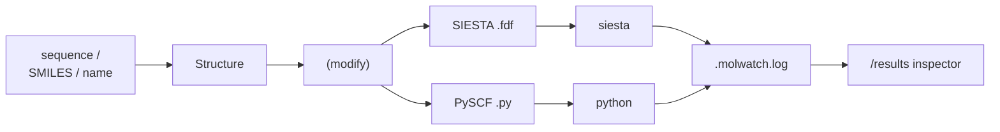

# molbuilder — design

**Role:** overview
**Domain:** *(root — the spine)*
**Companions:** [`architecture.md`](?doc=architecture.md) (the reuse map —
the same system by *layer*, task → tool); [`backend-architecture.md`](?doc=backend-architecture.md)
(the same backend by *functional concern*); [`README.md`](?doc=README.md) (the
doc index + the rules); [`roadmap.md`](?doc=roadmap.md) (open work);
[`process/package-layout.md`](?doc=process/package-layout.md) (where each file
lives).

> **What this is.** The design north-star — the mission, the stance, the
> architecture in brief, the load-bearing principles, the anti-patterns we
> refuse, and an index of the durable decisions. It is deliberately concise:
> the *detail* of each subsystem lives in its domain doc, and this file points
> there rather than restating it.

---

## Mission

molbuilder builds 3-D molecular structures from sequence / SMILES / name input,
modifies them into derived geometries (e.g. metal–molecule–metal nanojunctions),
generates SIESTA and PySCF input files for those structures, and presents the
resulting trajectories through a unified Results-tab inspector. It is a single,
internally-coherent toolkit covering the full pipeline:

The package consolidates what were originally two repos (`Qing-LAB/molbuilder`
build side + `Qing-LAB/molwatch` viewer side; merged 2026-05). The merge
collapsed the shared file-format contract (`.molwatch.log v1`), the shared core
dataclass (`Structure`), and the shared Flask + 3Dmol.js stack into one
codebase. History is reconstructable from `git log`; per-component contracts
live under [`docs/`](?doc=README.md).

### Stance — an assistant to the scientist, not a nanny

molbuilder is **an assistant to a scientist**, not an automatic
test/calculation system and not a push-button black box. It does **not own the
experiment, the design, or the recipe** — the scientist does. Its job is to
provide **background, support, and hints that reduce the burden** so the
scientist can focus on the science. Concretely, this stance binds every
feature:

- **Easy but explicit, never push-button.** Make the right thing easy *and
  visible* — surface the choice, the env, the parameter — never silently
  auto-decide on the scientist's behalf.
- **Don't twist the environment or the recipe.** No silent env re-routing, no
  hidden mutation of the user's input; offer a *setup to test* and let the
  scientist run and adjust it.
- **Generate setups + surface hints, not finished answers.** A benchmark offers
  the harness to measure; a preflight surfaces inconsistencies; an emitter
  writes a defensible *starting point* the scientist owns and tunes.

When a feature is tempted to decide something the scientist should decide, the
answer is to make that decision **explicit and documented**, not automatic.

---

## Architecture — three layers, four core types

The layers describe **import direction and responsibility**; the types describe
the **data that flows between layers**. This section is the brief; the two maps
below carry the detail.

**Three layers (the load-bearing invariant).** Higher layers may import any
lower layer; lower layers must never import a higher one. **L1** core types
(nouns) import nothing above them; **L2** domain verbs may import L1; **L3**
surfaces (`cli.py`, `web/`) may import both, only through the public package
surface (`from molbuilder import …`). This is the single most important
architectural rule — without it the package recreates the registry/abstraction
tangle that was deleted in favour of dataclass-driven introspection. It is
enforced by `tests/test_layering.py`, which classifies *every* top-level name.

**Four core types are the lingua franca**; everything else is a verb operating
on them:

| Type | Role | Layer |
|---|---|---|
| `Structure` | geometry + metadata (the one codec + key-namer) | L1 |
| `Frame` / `Trajectory` | a per-step physics record (energy / forces / lattice / scf) + its wrapper | L1 |
| `Config` (`SiestaConfig` / `PySCFConfig` / …) | the engine-knob **dataclasses** that carry field metadata | L1 |
| `Issue` | a validation finding (`error` / `warn` / `info`) | L1 |

Read the flow as: **construction** emits a `Structure`; **validation** reads a
`Structure`+`Config` and returns `List[Issue]`; the engine emitters render a job
from `Structure`+`Config`; **execution** runs it; **data management** parses the
results back into `Frame` / `Trajectory` and owns persistence at every step.

**Where the detail lives:**
- [`architecture.md`](?doc=architecture.md) — the **reuse map**: task → tool, and
  the subsystem index by layer (read before building anything).
- [`backend-architecture.md`](?doc=backend-architecture.md) — the **same backend
  by functional concern** (data · construction · validation · execution), and
  where those concerns still leak into each other.
- [`process/package-layout.md`](?doc=process/package-layout.md) — the file-level
  map of the whole tree.

---

## The server is shared — who may do what

A laptop tool and a group server are the same program; what differs is who can
reach it. `serve` reads and writes a real `projects/` tree, so the moment it
leaves loopback there are four separate questions to answer — *do I know who
this is* (opt-in SSO; molbuilder stores no passwords and learns only an email),
*does this traffic look like probing* (an always-on per-IP limiter that judges
behaviour, never identity), *may this person read and clear the block list*, and
*may this person stop the process everyone shares*.

They are four gates because they are four questions, and one answer would be
wrong for at least one of them. The design rule they share is this project's
stance applied to access: **the safe state is the one you get by doing
nothing.** Every default is the restrictive reading, so a forgotten config line
loses a button and never hands a stranger the files — and where a capability
cannot be exercised safely, it is **absent rather than refused** (the reload
route answers 404, not 403, so a misconfiguration reads as *the button is
missing*, never as *anyone can restart the server*).

The whole framework — the gates, the rules underneath, the known sharp edges
(TLS is not authentication; one admin list is currently read by two subsystems
that need opposite readings of its empty default) — is
[`ops/access-control.md`](?doc=ops/access-control.md). How to turn any of it on
is [`ops/deployment.md`](?doc=ops/deployment.md).

---

## Design principles

These are load-bearing. Don't violate one without updating this document.

1. **The dataclass is the lingua franca.** Every builder yields a `Structure`;
   every generator consumes a `Structure`+`Config`; every parser returns a
   `Trajectory`; every validator returns `List[Issue]`. Field metadata (label,
   type, default, range, validator, UI hint) lives on the **dataclass field**,
   never in parallel registries in the CLI or web layers — the CLI flags and the
   HTML form are *generated* from the dataclass, not maintained in lockstep. A
   previous custom registry framework was deleted because `dataclasses.fields()`
   + click is the right tool. This extends to the client and wire: **one**
   workspace store, **one** server response shape (`_shared.workspace_payload`),
   **one** sessionStorage key — no code path may update part of the workspace
   and not the rest. See [`web/form-schema.md`](?doc=web/form-schema.md),
   [`web/workspace.md`](?doc=web/workspace.md), [`web/web-api.md`](?doc=web/web-api.md).
2. **CLI scripts are small, focused, composable.** Each subcommand does one
   job and chains through files / stdin / stdout (`-` = stdin/stdout);
   machine output → stdout, human summary + progress → stderr. The `scripts/`
   directory obeys the same discipline: **name = job**, end-to-end from a base
   system, no script a prerequisite to another, errors point at the next
   command not a doc, inventoried in the README. See
   [`process/conventions.md`](?doc=process/conventions.md),
   [`ops/installation.md`](?doc=ops/installation.md).
3. **The web UI is a portal, not a separate product.** It calls the same Python
   API the CLI calls and holds no logic not exposed elsewhere. Every tab shares
   the embeddable 3D viewer, the field-metadata-driven form renderer, the
   projects sidebar, and the common CSS shell. See
   [`web/overview.md`](?doc=web/overview.md), [`web/tabs.md`](?doc=web/tabs.md).
4. **Generated outputs must be syntactically correct AND scientifically
   defensible.** An FDF that SIESTA accepts but silently produces wrong physics
   is a bug; a PySCF script that converges to a broken-symmetry saddle for an
   open-shell system is a bug. Code review must check real keywords, defensible
   value ranges, and open-shell / charged / periodic special cases. See
   [`science/overview.md`](?doc=science/overview.md).
5. **Generated outputs are tunable by manual editing.** Generated scripts use
   plain object APIs, keep all configuration in scope at the natural location,
   and provide post-processing hook placeholders. Verbose-comments mode (default
   ON) inlines tuning hints next to every parameter; section headers are
   mandatory so `Ctrl-F` works for a newcomer. See
   [`engines/overview.md`](?doc=engines/overview.md).
6. **Validation is advisory while editing, enforcing at generation.** One
   `validation/` package produces `List[Issue]`. **While editing** a structure
   (`/api/modify/*`, `/api/build/*`) findings are advisory — nothing is blocked,
   the user is notified and decides. **At generation** the same findings
   enforce: `report(validate(struct, cfg))` raises on any error-severity issue.
   `report()` is the **only** gate that blocks. The rule for severity: block only
   what is physically impossible or wrong (invalid element, out-of-range index,
   singular cell); everything a user might legitimately want (close contacts,
   unusual geometry, a sparse k-grid) is a warning, never a block. See
   [`science/validation.md`](?doc=science/validation.md).
7. **Generated artifacts are self-contained.** The generated PySCF script does
   **not** import molbuilder at runtime — `scp` it to a cluster with only
   `pyscf + geometric` and it runs. The molwatch emitter is pasted verbatim via
   `inspect.getsource(MolwatchEmitter)` (the class is the source of truth,
   unit-tested directly). See [`execution/job-contracts.md`](?doc=execution/job-contracts.md).
8. **Don't reinvent wheels.** CLI parsing → click; routing → Flask Blueprints;
   numerics → NumPy; form rendering → vanilla HTML + the existing 3Dmol viewer
   (no SPA framework); validation → plain functions over field metadata. Adding
   a dependency is a decision, not a default — each new third-party dep needs a
   one-line justification in the decisions log.

---

## Anti-patterns we refuse

Considered and rejected; do not reintroduce.

- **Reverse imports** (L1 ← L2, L2 ← L3) — recreates the registry tangle.
- **Custom CLI / registry / dispatch frameworks** on top of click/argparse. One
  was deleted; stay deleted.
- **Builder-pattern wrappers around dataclasses**
  (`StructureBuilder().with_atoms(…).build()`) — plain dataclasses + freestanding
  `build_*` functions stay.
- **Generic plugin discovery via setuptools entry points** — a small known set
  of formats/backends; an explicit `PARSERS = [...]` list is easier to audit.
- **Parallel field-metadata tables** in CLI or web — read `dataclasses.fields()`.
- **Sync-from-async wrappers in the generated script** — it is a plain top-to-
  bottom Python file; no event loops, no observability imports.
- **A separate config file format** (YAML / TOML / INI) for engine parameters —
  the user edits the generated `.fdf` / `.py` directly; that is the contract.
- **Parallel client-side state stores for the workspace structure** — three
  shipped in 2026-05/06 and caused every consistency bug in the June audit;
  extend the one workspace dispatcher instead.
- **Hand-rolled per-endpoint response shapes** for Structure-returning
  endpoints — four drifted (the missing `atoms` key was the costliest); every
  such endpoint uses `_shared.workspace_payload`.
- **Retyping a table a dependency already ships** — atomic masses, atomic
  numbers, covalent radii, isotope data. Before writing one, look: this program
  already depends on ASE, and `ase.data` carries all four. `chemistry.py` names
  them (`atomic_mass`, and the `atomic_numbers` lookup inside `total_electrons`)
  rather than copying them, so there is one source of truth and no table that
  can quietly go stale — a wrong mass on element 34 would be found by a user,
  never by a test. The pull is real: the vibrational-mode composition
  (2026-08-05, [`web/spectra.md`](?doc=web/spectra.md) § 4.2) needed masses in a
  browser panel, and the obvious move was a JavaScript periodic table. The right
  move was to notice the server already had the answer.

---

## Decisions

Durable decisions are recorded chronologically. The **full log — 113 entries,
2026-04 → 2026-07, verbatim with every rationale** — is archived at
[`archive/2026-07-28-decisions-log.md`](?doc=archive/2026-07-28-decisions-log.md).
The load-bearing decisions that shape the current architecture, and where each
now lives in full:

| Date | Decision | Now documented in |
|---|---|---|
| 2026-08-06 | **A project directory has two shapes, and the choice is made at `prep`** — *flat* (stages by filename suffix, attempts by output index, **warm files unsuffixed and shared**) and *hierarchical* (a directory per stage, per attempt). Neither is wrong: they differ in **where the history lives**. Flat keeps one state on disk and its history **in time**, in the checkpoint; hierarchical keeps every state **in space**, on disk. So a checkpoint is insurance in one shape and **the mechanism** in the other | [`execution/project-layout.md`](?doc=execution/project-layout.md) § 1, [`execution/checkpointing.md`](?doc=execution/checkpointing.md) § 5.0 |
| 2026-08-06 | **Stages do not chain.** Each is prepped and submitted on its own, after the user has looked at the previous one — because a stage is a long job, and a chain that continues by itself can spend a week computing from a geometry you would have rejected in a minute. Whatever a run continues from is a **real file copied in**, and *which* run is something the user says | [`execution/project-layout.md`](?doc=execution/project-layout.md) § 1.6, [`execution/job-system.md`](?doc=execution/job-system.md) § 1 |
| 2026-08-06 | **The browser writes a portable package; `prep` on the target finishes it.** Forced, not stylistic: `BlockSize` is derived from the rank count and written *inside* the `.fdf`, and the eigensolver picks both the numerics and the conda environment — so a deck finished on a laptop is guessing. `prep` is a **hub you return to**, not step four of a line | [`execution/project-layout.md`](?doc=execution/project-layout.md) § 2 |
| 2026-08-06 | **bash is a bootstrap, not a program.** A wrapper does two things — make the environment right, and exec — because activation mutates the calling shell and the launcher must be its direct child. Everything that computes, decides or arranges files is Python's, on the host, before the wrapper is invoked | [`execution/running-a-job.md`](?doc=execution/running-a-job.md) § 2.2a |
| 2026-08-06 | **The checkpoint system gets a contract, not just a guide** — 22 invariants, each written so a test can assert it and each marked for the directory shape it holds in. Prompted by the realisation that in the flat shape a checkpoint is the *only* way back, so a history with a hole in it is worse than none: the hole is invisible until somebody needs what was in it | [`execution/checkpointing.md`](?doc=execution/checkpointing.md) |
| 2026-07-24 | **Validation-barrier correctness audit** — every flag re-verified against the physics; fixed the Makov-Payne sign, pseudopotential C5 (semilocal block), the meta-GGA grid discriminator, spin-parity bounds, transport `kz` | [`science/validation.md`](?doc=science/validation.md), [`science/chemistry-correctness.md`](?doc=science/chemistry-correctness.md), [`science/pseudopotentials.md`](?doc=science/pseudopotentials.md) |
| 2026-06-25 | **Run-checkpoints via git + `.binsnapshots`** (why git over a home-grown snapshot module; single-user / lowest-dir scope; no auto-commit so compute nodes never need git) | [`execution/running-a-job.md`](?doc=execution/running-a-job.md) |
| 2026-06-25 / 06-23 | **Staged-optimization parity** (SIESTA `SiestaStageSpec` mirrors PySCF; three-source preset drift gate) and the **SIESTA universal-fdf-keyword** fix (`MD.NumCGsteps` is universal; an L4 binary-in-the-loop test gates the silent-failure class) | [`engines/tuning.md`](?doc=engines/tuning.md), [`engines/siesta.md`](?doc=engines/siesta.md), [`engines/pyscf.md`](?doc=engines/pyscf.md) |
| 2026-06-24 | **`install-env.sh` is a thin shim** over `molbuilder envs …` (one source of truth for subcommands); GPU bootstrap/rebuild wrappers folded in | [`ops/installation.md`](?doc=ops/installation.md) |
| 2026-06-17 | **HTTP four-bucket status semantics** (success / scientific-advisory / protocol error / server fault; the scientific-advisory case stays HTTP 200 + `ok:false`); the **run-bundle handoff** (`POST /api/results/bundle`) closes the workflow-continuation gap | [`web/web-api.md`](?doc=web/web-api.md), [`execution/job-contracts.md`](?doc=execution/job-contracts.md) |
| 2026-06-14/15 | **SIESTA-GPU build-env isolation** — CUDA toolkit lives in the env not on the host; build-from-source recipe via a `BuildSpec` extension | [`ops/installation.md`](?doc=ops/installation.md) |
| 2026-06-13 | **Validator-package split** (the seven-module `validation/` package) + the test-strategy doc | [`science/validation.md`](?doc=science/validation.md), [`process/testing.md`](?doc=process/testing.md) |
| 2026-06-07 | **Workspace state unification** — one client dispatcher, one server response shape, one sessionStorage key supersede the three drifting mirrors | [`web/workspace.md`](?doc=web/workspace.md), [`web/overview.md`](?doc=web/overview.md) |
| 2026-05-01 | **Parser output is `Frame` / `Trajectory`, not `Structure`** — promoting parsers to yield `Structure` would silently drop energies/forces/lattice/scf | [`model/parse.md`](?doc=model/parse.md) |
| 2026-05-01 | **Configs are L1 nouns** (`config/` package) — pure data + field metadata the CLI/form/validators all introspect, kept below the generators | [`web/form-schema.md`](?doc=web/form-schema.md), [`engines/overview.md`](?doc=engines/overview.md) |
| 2026-05-01 | **click + Flask Blueprints, no custom framework**; **self-contained generated scripts** (emitter pasted, not imported) | [`process/conventions.md`](?doc=process/conventions.md), [`execution/job-contracts.md`](?doc=execution/job-contracts.md) |
| 2026-04-30 | **Merge `molwatch` into `molbuilder`** — already coupled by file format, web stack, and author; one repo removes the drift surface | *(history — see the archived log)* |

New durable decisions are appended to `design.md` *and* recorded in full; open
*plans* live in [`roadmap.md`](?doc=roadmap.md), never here (a contract holds
decisions, the roadmap holds plans).

---

## Process rules

- **Doc and code move together.** Any change to the principles or decisions here
  ships in the same PR as the code change — drift between this doc and the code
  is a bug.
- **Tests are derivable from the spec.** The per-component contracts under
  [`docs/`](?doc=README.md) are written so tests follow from them without reading
  the implementation.
- **Code review checks three things beyond code quality:** target-tool
  correctness for generated SIESTA/PySCF outputs, scientific defensibility of
  defaults, and the layering invariant (no L1→L2, no L2→L3 imports).
- **Every commit keeps the suite green** (the pre-commit gate runs `pytest -m
  "not slow"`); no intermediate-broken-state commits — split a refactor finer
  instead.
- **A new dependency needs a one-line justification** in the decisions log
  naming the wheel it replaces; the default is to add none.

The enforced, mechanical versions of these rules — the guard tests, the exit
codes, the CLI surface — are in [`process/conventions.md`](?doc=process/conventions.md)
and [`process/testing.md`](?doc=process/testing.md).
