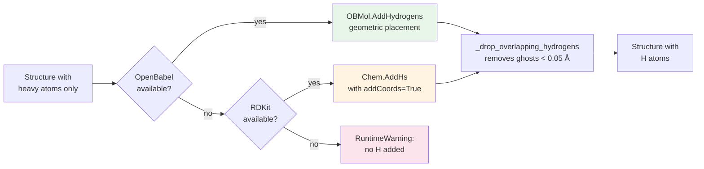

# Spec — builders

**Client-side flow?** See [`../structure-guide.md`](../structure-guide.md) — how these builders feed the workspace (the load gate + Source panels + save). This doc is the server-side synthesis contract.

**Modules**: `molbuilder/peptide.py`, `molbuilder/nucleic.py`,
`molbuilder/smiles.py`, `molbuilder/pubchem.py`, `molbuilder/builders/backends/*`
&nbsp;·&nbsp; **Tests**: `tests/test_peptide.py`, `tests/test_nucleic.py`,
`tests/test_smiles_and_siesta.py`, `tests/test_residues.py`

A *builder* is any function that returns a `Structure`.  All builders
share a uniform output contract: a fully-populated Structure with
`elements + positions` set, and `atom_names / residue_ids / residue_names
/ chain_ids` populated where the source format provides them.

## Peptide builder

```python
build_peptide(sequence: str, *, title=None, add_hydrogens=True) -> Structure
```

* `sequence`: 1-letter codes (`"ARNDC"`), with `[XXX]` escapes for
  modified residues (e.g. `"AR[SEP]C"` for phospho-Ser).  Whitespace
  ignored.  Modified-residue codes are listed in
  `molbuilder.residues.MODIFIED_RESIDUES` (SEP, TPO, PTR, MLY, M3L,
  ALY currently).
* `add_hydrogens=True`: protonate via OpenBabel (preferred) or RDKit
  (fallback).  If neither is installed, returns heavy-atom-only with
  a `RuntimeWarning`.
* Element field is **always stripped** before being stored —
  BioPython sometimes returns space-padded elements like `" C"` and
  downstream species detection in the SIESTA / PySCF emitters
  requires clean strings.  This is the S1 fix.

## Nucleic-acid builders

```python
build_dna(sequence: str, *, backend="auto", form="B", terminal="OH",
          protonate_phosphates=True, title=None) -> Structure
build_rna(sequence: str, *, backend="auto", form="A", terminal="OH",
          protonate_phosphates=True, title=None) -> Structure
```

**DNA strand notation (`build_dna` `sequence`).** A bare sequence
(`"ATGC"`) builds a **single strand**. Prefix with `ds,` (`"ds,ATGC"`) to
build a **canonical Watson-Crick duplex** — `fiber` lays down the given strand
plus its auto-generated complement (both chains kept; the 5'-phosphate is
stripped per strand for the `terminal="OH"` default). Direction markers are
accepted (`5'-ATGC-3'` default; `3'-ATGC-5'` reverses to internal 5'→3').
**Gate:** double-strand requires the **`threedna` (X3DNA)** backend and a
supported helix form — **B / A / Z** (Z needs an alternating poly-d(GC)
sequence; it is intrinsically a duplex) — else a clear `ValueError` (only
`fiber` builds canonical duplex geometry). Two explicit strands
(`"3'-XXX-5',3'-YYY-5'"`, i.e. arbitrary / mismatched duplexes) are parsed but
currently rejected with a pointer to the X3DNA-`rebuild` follow-up.

* `backend`:
  * `"auto"`: prefer `threedna` (X3DNA fiber, canonical helix) if
    installed, else `amber` (AmberTools `tleap`, extended chain), else
    `rdkit` (folded conformer).  No silent skip — if none is
    available, raise `BackendUnavailable` with install instructions.
    See `molbuilder/builders/backends/__init__.py::_AUTO_ORDER` —
    that constant is the source of truth.
  * `"threedna"`: X3DNA `fiber` tool with canonical B / A / Z
    helices; heavy-only (no protons), always 5'-OH (ignores
    `terminal=`).  Restricted-license dependency (non-commercial
    only); molbuilder errors with an install-instructions hint
    pointing at x3dna.org when missing — no auto-download.
  * `"rdkit"`: always works, returns folded conformer (not helical).
  * `"amber"`: AmberTools' `tleap` with `leaprc.DNA.OL15` /
    `leaprc.RNA.OL3`; produces extended chain with correct
    Amber-OL15 chemistry.  Subprocess gets a `timeout=120` so a hung
    `tleap` doesn't block forever.
* `form`: helix form letter; only `amber` honours it (warns
  otherwise that the embedded conformer isn't helical).
* `terminal`: `"OH"`, `"5P"`, `"3P"`, `"PP"` — phosphate state at
  termini.
* `protonate_phosphates=True` (default): adds H to deprotonated
  non-bridging phosphate oxygens so the molecule is formally neutral.
  Set False to keep the deprotonated state; the SIESTA / PySCF
  emitters then auto-set `NetCharge`.

The amber backend post-processes the tleap output via
`_fix_methylene_hydrogens`, which recomputes sp3 -CH2- methylene
hydrogen positions.  tleap's residue library uses canonical
intra-residue geometry which is wrong at C5' between O5' and C4';
the fix touches only -CH2- carbons (2 heavy + 2 H neighbours), never
moves heavy atoms, and never adds or removes atoms.

## SMILES + name builders

```python
build_from_smiles(smiles: str, *, title=None, optimize=True, seed=0xF00D) -> Structure
build_from_name(name: str, *, title=None, **smiles_kwargs) -> Structure
```

* SMILES → 3D via RDKit ETKDGv3 + MMFF94s (UFF fallback when MMFF can't
  parameterise).  Pinned `randomSeed=0xF00D` for reproducibility.
* Name → PubChem lookup (network) → SMILES → SMILES builder.  Network
  call wrapped in a 30-second socket timeout.  Failure to resolve →
  `ValueError`.

## MMFF / UFF fallback rules

`smiles.py:optimize` — when `optimize=True`:

* `MMFFOptimizeMolecule` returns 0 (converged), 1 (max-iter, valid),
  -1 (could not parameterise), or raises.
* If the return is `0` or `1`, the MMFF result is kept (no UFF).
* If the return is `-1` or raises, UFF is run as a fallback.

This is the S3 fix; the original logic ran UFF when MMFF returned 1
(max-iter), which was the opposite of what was needed.

## Backend dispatcher

```python
molbuilder.backends.dispatch(kind, sequence, *, backend, form, terminal, title)
```

* Auto-mode order: `threedna` → `amber` → `rdkit` (best geometry first:
  canonical helix → extended chain → folded conformer).  Encoded as
  `_AUTO_ORDER` in `molbuilder/builders/backends/__init__.py` —
  that constant is the single source of truth; keep this doc in
  sync if it changes.
* `BackendUnavailable` is raised explicitly when no installed backend
  can satisfy the request; the user sees install instructions, not
  a cryptic ImportError.
* Adding a backend is two steps: drop `_<name>.py` defining `build()`
  + `is_available()`, register in `_load_backends()` and
  `available_backends()`.

## Sequence-parser contract (`residues.py`)

* 1-letter codes are case-insensitive.
* Whitespace is stripped.
* `[XXX]` opens a 3- or 4-letter PDB code (modified residues OR
  standard residues are both allowed; the brackets just disambiguate).
* Unknown bracketed codes → `ValueError`.
* Unclosed `[` → `ValueError` with position.
* Dashes / parentheses outside brackets → `ValueError` (forces the
  unambiguous syntax).

---

## Tool limitations and the H-placement design

Each backend has known quirks; molbuilder compensates so the
`build_dna` / `build_rna` API contract is consistent across them.
This section documents what each tool gets wrong, what we do
about it, and *why* the code is shaped the way it is so the next
person to touch it doesn't unwind the workarounds.

### What each backend produces, raw

| backend | helical shape | H atoms | terminal phosphate | residue names |
|---|---|---|---|---|
| `threedna` (X3DNA fiber) | canonical B/A/Z | **none** (heavy-only) | **always 5'-P** (ignores request) | DA / DT / DG / DC |
| `amber` (AmberTools tleap) | extended chain | included | honors request | DA5 / DT / DG / DC3 (5'/3' suffixes) |
| `rdkit` | folded conformer | included via `Chem.AddHs(mol)` | none (single nucleoside fragments) | molecule-level (no per-residue) |

The X3DNA path is the one that needs the most repair work.

### Hydrogen addition: OpenBabel preferred, RDKit fallback

Implementation in `chemistry.add_hydrogens(struct)`.  Detection
chain: **OpenBabel → RDKit → warning**.



#### Why OpenBabel first

- **`OBMol.AddHydrogens()` is geometric.**  It places H along
  sp3 / sp2 / sp vectors directly from each parent atom's
  hybridization and existing neighbours.  There is no "give up
  and place at parent coordinates" failure mode.
- On standard biomolecules (DA/DT/DG/DC, 20 amino acids) the
  residue-template chemistry is mature and battle-tested (25+
  years of cheminformatics use; what AutoDock and most MD prep
  pipelines use under the hood).
- It doesn't reorder atoms.
- **Verified on the X3DNA → ATGC test case**: OpenBabel produces
  the canonical `5 O-H + 37 C-H + 8 N-H` breakdown, matching
  Amber-tleap and RDKit-via-SMILES exactly.  All Watson-Crick
  H-bond donors (A.N6-H₂, T.N3-H, G.N1-H + G.N2-H₂, C.N4-H₂)
  are present.

#### Why RDKit is the fallback (and what it gets wrong)

- **Bond-order perception from PDB residue templates is
  correct.**  When given a heavy-atom-only PDB with standard
  residue names, `Chem.MolFromPDBBlock` perceives bond orders
  correctly.
- BUT `Chem.AddHs(mol, addCoords=True)` has a known limitation:
  for sites where the heavy-atom geometry doesn't uniquely
  constrain H placement — typically **exocyclic -NH₂ amines on
  nucleic acid bases** (A.N6, G.N2, C.N4) and **peptide
  N-terminal -NH₃⁺** — the addCoords flag sometimes leaves H
  atoms **at their parent atom's coordinates** (zero-distance
  "ghost H").
- For a typical ATGC chain, this loses 4 H out of 50 — exactly
  the Watson-Crick H-bond donors.  Structurally crippled for
  any H-bonding chemistry.
- The SMILES path doesn't have this issue (`build_peptide` and
  the `rdkit` nucleic backend reach the SMILES path); only
  PDB-parse then AddHs has it.  The X3DNA path lands here.
- We keep RDKit as the fallback because it's already a dep, the
  failure mode is bounded (peptide ambiguous H, nucleic
  exocyclic amines), and `_drop_overlapping_hydrogens` cleans
  up the ghosts so downstream validators don't see
  zero-distance pairs.

#### Why not AmberTools `reduce`

`reduce` is the gold standard for protein protonation (His
tautomer selection, Asn/Gln side-chain flips).  For DNA it's not
better than OpenBabel and adds:

- A subprocess + temp-file round trip (vs in-process OpenBabel).
- A different deployment story (it's bundled with AmberTools,
  but invoking it shells out — harder to reason about than a
  Python call).

We have AmberTools as a transitive dep already (the `amber`
nucleic backend uses `tleap`), so `reduce` would not add a
dependency.  We still don't use it because keeping H-placement
uniform across peptide and nucleic builds — same function, same
code path, in-process — is more important than the marginal
protein-side correctness `reduce` would add.  The peptide builder
is currently satisfied by OpenBabel; if and when we hit a peptide
tautomer case that OpenBabel mishandles, `reduce` becomes a
candidate third engine in the chain.

#### `_drop_overlapping_hydrogens` post-pass

Removes H atoms < 0.05 Å from any other atom.  Threshold
rationale: the shortest physical X-H bond (H-F at ~0.92 Å) is
far above 0.05 Å, so a H within 0.05 Å of another atom is
unambiguously a placement artifact.

- **What this catches**: RDKit `addCoords=True` ghost H at
  ambiguous-valence sites (the defining failure mode); rare
  OpenBabel duplicates at tautomeric sites.
- **What this does NOT do**: re-place the ghost H at sensible
  positions.  That's the smarter remediation but requires
  hybridization perception (already in `_adjacency`) plus
  open-valence vector computation (new code).  Worth doing only
  if RDKit becomes the primary engine; with OpenBabel preferred,
  the drop is a safety net, not a load-bearing path.
- **What this never touches**: heavy atoms.  Two heavy atoms
  within 0.05 Å are a broken structure that the validator should
  error on, not silently fix.

### X3DNA `fiber` quirks and how we compensate

In `_threedna.py`:

1. **Heavy-atom output → routed through `chemistry.add_hydrogens`**
   at the `nucleic.build_dna`/`build_rna` layer.  The
   `_maybe_add_hydrogens` shim short-circuits via the H/heavy ≥
   0.3 ratio gate, so amber- and rdkit-built structures (which
   already have H) skip the round-trip cleanly.
2. **Mandatory 5'-terminal phosphate →
   `_strip_5prime_phosphate`.**  Removes atoms named in
   `_PHOSPHATE_ATOM_NAMES` (covers both modern OPx and legacy
   OxP naming) from the 5'-terminal residue when `terminal in
   ('OH', '3P')`.  The bridging O5' stays as part of the sugar;
   H is added later by `chemistry.add_hydrogens`.
3. **3'-phosphate cannot be added → warn.**  fiber's output is
   5'-P / 3'-OH; we can strip the 5', but not synthesize a 3'.
   `terminal in ('PP', '3P')` warns the request will be served
   as 5'-P / 3'-OH or 5'-OH / 3'-OH respectively.
4. **Z-form is poly-d(GC) only; RNA is A-form only.**  Mismatches
   are warned at dispatch (see `build()`).

### 5'/3' directionality on user input

Bare letters (`"ATGC"`) follow biology convention: 5' on the
left, 3' on the right.  `parse_dna_sequence` /
`parse_rna_sequence` also accept optional end-labels:

- `"5'-ATGC-3'"` — explicit 5'→3', identical to bare.
- `"3'-CGTA-5'"` — reverse-direction; the parser reverses the
  residue list so the backend (which always builds 5'→3')
  produces a polymer matching the user's stated direction.
- `"5'-ATGC-5'"` / `"3'-ATGC-3'"` / `"5'-ATGC"` / `"ATGC-3'"` —
  self-contradictory or one-sided; ValueError.

Whitespace, internal dashes, and mixed punctuation between the
labels and the body are tolerated (`"5'  -  ATGC  -  3'"` parses
cleanly).

The orientation validator (the polymer-residue-listing-reversed
check in `validation.py`) catches the case where the *structural*
5' end (the residue with no incoming O3'-P bridge) doesn't match
`residue_ids[0]` — this is what protects against a future backend
that lists residues 3'→5' rather than 5'→3'.

### How a regression in any of this would surface

Tests that pin the current behavior
(`tests/test_nucleic.py`):

- `test_dna_default_protonation_yields_simulation_ready_h_count`
  — asserts H/heavy ≥ 0.55 across all installed backends.
  Catches the case where the X3DNA path silently falls through
  to "no H added" (e.g. both OpenBabel and RDKit uninstalled, or
  the H/heavy ratio gate misfires).
- `test_dna_atgc_protonation_chemistry_matches_across_backends`
  — pins the canonical anchor-element breakdown
  (5 O-H / 37 C-H / 8 N-H).  Catches the RDKit-fallback
  regression where Watson-Crick H atoms get dropped.
- `test_threedna_strips_5prime_phosphate_for_terminal_oh` — pins
  P count = 0 for a single nucleotide, P count = 3 for ATGC.
  Catches a regression in the strip helper or a fiber-output
  format change that defeats the atom-name match.
- `test_dna_add_hydrogens_false_returns_heavy_skeleton` — pins
  that the kwarg is honored (≤ 5 H on the fiber-skeleton path).

If any of these red, the protonation contract has drifted; don't
"fix" by adjusting the test thresholds — re-derive what changed.
