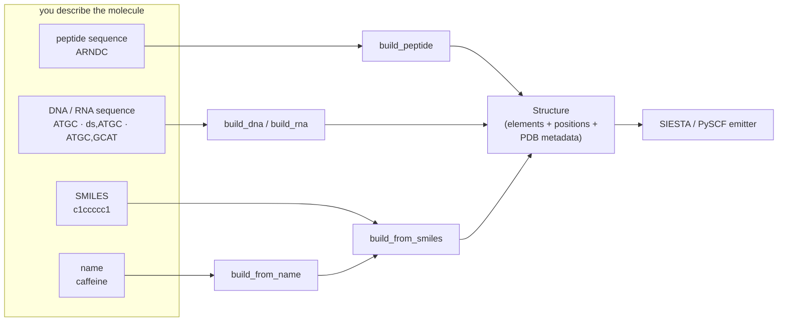
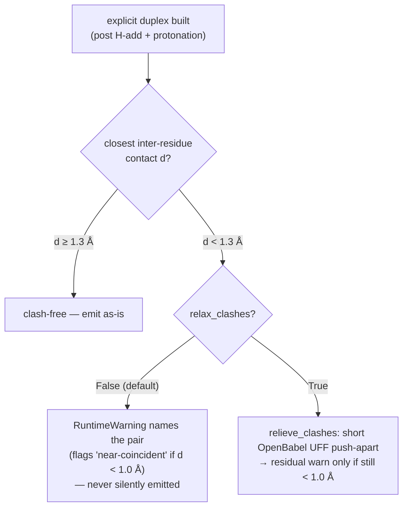
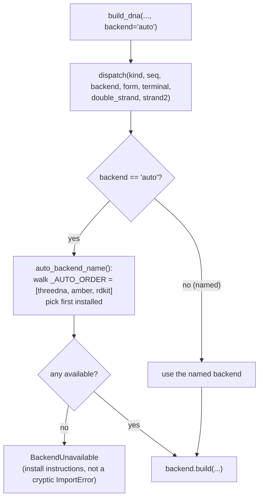
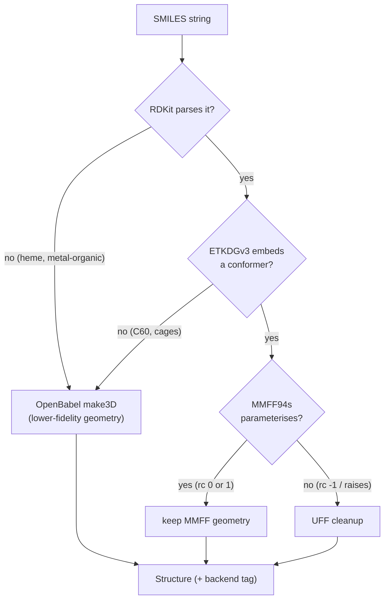

# Builders — sequence / SMILES / name → a 3-D `Structure`

**Role:** contract
**Domain:** engines
**Companions:** [`model/structure.md`](?doc=model/structure.md) (the `Structure`
every builder returns); [`model/chemistry.md`](?doc=model/chemistry.md) (the
hydrogen-placement + clash-relief helpers the builders call);
[`science/chemistry-correctness.md`](?doc=science/chemistry-correctness.md) (the
charge / spin science, and the amber methylene-H fix's chemistry);
[`engines/siesta.md`](?doc=engines/siesta.md) + [`engines/pyscf.md`](?doc=engines/pyscf.md)
(the emitters that consume a built structure — they need clean element strings).

A **builder** is any function that takes a human-friendly description — a peptide
sequence, a DNA/RNA sequence, a SMILES string, a compound name — and returns a
fully-formed 3-D [`Structure`](?doc=model/structure.md) ready to feed a SIESTA or
PySCF job. This is the **server-side synthesis contract**: what each builder
guarantees about its output, how the pluggable nucleic-acid backends are chosen,
and how molbuilder papers over each external tool's quirks so the API stays uniform.

> **The uniform output contract.** Every builder returns a `Structure` with
> `elements` + `positions` set, and `atom_names` / `residue_ids` / `residue_names`
> / `chain_ids` populated **wherever the source format provides them** (peptides and
> nucleic acids carry full PDB-style residue metadata; a SMILES molecule has
> per-atom names like `C1`, `O2` but no residues). Element strings are always
> whitespace-stripped — BioPython hands back space-padded elements like `" C"`, and
> the SIESTA/PySCF species detection downstream needs clean strings.

> **Vocabulary.** A **residue** is one monomer of a chain — an amino acid or a
> nucleotide. **PDB** metadata = the atom / residue / chain names from the Protein
> Data Bank file format. A **heavy atom** is any non-hydrogen atom. **SMILES** is a
> compact text notation for a molecule's atoms and bonds. A **conformer** is one 3-D
> shape a flexible molecule can adopt; a **force field** (MMFF94s, UFF) is a fast
> classical energy model used to tidy a conformer before the real quantum run. The
> builders make a *starting* geometry for a **DFT relaxation** (the quantum-chemistry
> geometry optimization molbuilder ultimately runs) — whose first **SCF**
> (self-consistent-field) step blows up if two atoms sit on top of each other. For
> nucleic acids: the two chemically distinct ends of a strand are **5′** and **3′**
> (sequences read 5′→3′); a **duplex** is two base-paired strands; **Watson-Crick**
> pairing is the standard A·T / G·C base pairs; **B / A / Z** are the three standard
> helix geometries (B = the common form, A = compact, Z = left-handed). (Charge /
> spin and the hydrogen-placement mechanism are in
> [`model/chemistry.md`](?doc=model/chemistry.md).)

---

## 1. The five builders

| Builder | Input | Module | Backends |
|---|---|---|---|
| `build_peptide(sequence, *, title=None, add_hydrogens=True)` | amino-acid sequence | `peptide.py:48` | PeptideBuilder (extended chain) |
| `build_dna(sequence, *, backend="auto", form="B", terminal="OH", add_hydrogens="auto", protonate_phosphates=True, relax_clashes=False, title=None)` | DNA sequence / duplex notation | `nucleic.py:73` | threedna / amber / rdkit |
| `build_rna(sequence, *, backend="auto", form="A", terminal="OH", add_hydrogens="auto", protonate_phosphates=True, title=None)` | RNA sequence (single strand) | `nucleic.py:267` | threedna / amber / rdkit |
| `build_from_smiles(smiles, *, title=None, optimize=True, seed=0xF00D, return_backend=False)` | SMILES string | `smiles.py:52` | RDKit (OpenBabel fallback) |
| `build_from_name(name, *, title=None, **smiles_kwargs)` | common / IUPAC name | `pubchem.py:62` | PubChem lookup → SMILES |



Everything a builder returns is a starting geometry, not a converged one — a
subsequent DFT relaxation is what produces the final structure. The builders' job is
to hand that relaxation something chemically correct and free of atomic near-overlaps.

---

## 2. The sequence & notation contract

Peptide and nucleic-acid sequences share one tiny grammar (`residues.py::_parse:147`):

- **Single letters**, case-insensitive — `ARND` (amino acids), `atgc` (DNA).
- **`[XXX]` brackets** open a 3- or 4-letter PDB code for a modified or non-standard
  residue: `AR[SEP]C` is Ala-Arg-phospho-Ser-Cys. A standard 3-letter code works in
  brackets too (`[ALA]`); the brackets just disambiguate.
- **Whitespace is ignored** anywhere (`A R N D` == `ARND`).
- Anything else — dashes, parentheses, `+` — **raises `ValueError`** with the
  position, so the syntax stays unambiguous.

**Modified amino-acid residues** (`residues.py::MODIFIED_RESIDUES:56`) currently
cover six codes — each defined as a patch on a standard parent (atoms to remove +
atoms to add, in the parent's local frame):

| Code | Residue | Parent |
|---|---|---|
| `SEP` | phospho-serine | SER |
| `TPO` | phospho-threonine | THR |
| `PTR` | phospho-tyrosine | TYR |
| `MLY` | N-methyl-lysine | LYS |
| `M3L` | N,N,N-trimethyl-lysine | LYS |
| `ALY` | N6-acetyl-lysine | LYS |

**5′/3′ directionality.** Bare letters follow the biology convention (5′ on the left).
Explicit end-labels are accepted, and `build_dna` and `build_rna` apply the **same
strict parser** (`residues._strip_directionality`; `build_dna` reaches it via
`nucleic._strip_direction`):

| Input | Interpretation | Result |
|---|---|---|
| `ATGC` / `5'-ATGC-3'` | 5′→3′ (implicit / explicit) | as written |
| `3'-CGTA-5'` | reverse-direction | reversed → 5′→3′ (== `ATGC`) |
| `5'-ATGC` / `ATGC-3'` | one-sided label | `ValueError` |
| `5'-ATGC-5'` / `3'-ATGC-3'` | self-contradictory | `ValueError` |

(Before 2026-07-27 the DNA path was lenient — it silently kept one-sided labels and
silently reversed `3'-ATGC-3'`; `_strip_direction` now delegates to the strict parser
so DNA and RNA behave identically.)

A validation check guards this from the other side: `_check_polymer_orientation`
(`validation/geometry.py:198`, surfaced as a `polymer.orientation` issue — see
[`science/validation.md`](?doc=science/validation.md)) flags a structure whose
*structural* 5′ end (the residue with no incoming O3′–P bridge) doesn't match
`residue_ids[0]`, protecting against a future backend that lists residues 3′→5′.

---

## 3. Nucleic acids — single strand, duplex, and mismatches

`build_dna` reads three notations from its `sequence` argument
(`nucleic.py::_parse_dna_notation`):

1. **Single strand** — a bare sequence: `"ATGC"`.
2. **Canonical duplex** — prefix `ds,`: `"ds,ATGC"` lays down the strand plus its
   auto-generated Watson-Crick complement (via X3DNA `fiber`).
3. **Explicit / arbitrary duplex** — two comma-separated strands: `"ATGC,GCAT"`.
   Both are 5′→3′ and paired **antiparallel** (base pair *i* couples `strand1[i]`
   with `strand2[N-1-i]`). A non-complementary pair (A·G, T·T, …) is a **mismatch**,
   placed at the standard base-pair frame as a B-form starting model. Built via X3DNA
   `rebuild` from an idealized Arnott B-DNA base-pair-step parameter file.

   > *Worked pairing.* For `"ATGC,GCAT"` (N = 4) the antiparallel pairs are A·T,
   > T·A, G·C, C·G — all Watson-Crick, a canonical duplex. Change strand 2's first
   > base (`"ATGC,CCAT"`) and pair 4 becomes **C·C**, a mismatch that lands at the
   > standard frame as the clash the next step handles.

**Gates** (all raise a clear `ValueError`): any duplex requires the **`threedna`
(X3DNA)** backend (`nucleic.py:155`). Canonical duplexes support **B / A / Z** form
(Z needs an alternating poly-d(GC) sequence); explicit two-strand duplexes are
**B-form only** and must be **equal length** (no overhangs/bulges yet). `build_rna`
is **single-strand only** (no duplex notation) and defaults to A-form.

### Mismatch clashes — detect, or opt-in relieve

A non-Watson-Crick pair placed at the standard frame *interpenetrates*: its bases
overlap and can leave atoms far too close, which makes the first SCF step of a later
DFT relaxation explode. So `build_dna`, **for explicit duplexes only**, measures the
closest inter-residue contact (`chemistry.min_nonbonded_contact`) and applies two
thresholds (`nucleic.py::_handle_duplex_clashes:217`):



The warning a user sees (`relax_clashes=False`) names the clashing atoms and, when
they are near-coincident, the explosion risk:

```text
RuntimeWarning: This duplex has a steric CLASH at A4:N1<->B1:N1 (0.62 A) -- a
non-Watson-Crick (mismatched) base pair at the standard frame.  These atoms are
NEAR-COINCIDENT -- relaxing as-is risks an explosive first SCF step.  Rebuild with
relax_clashes=True (a short force-field minimization that removes the
near-coincidence; SIESTA relaxes the rest) or minimize externally before a
geometry optimization.
```

`_CLASH_WARN_A = 1.3 Å` (a real steric overlap — below the tightest legitimate
canonical contact, so no false positives) and `_CLASH_DANGER_A = 1.0 Å` (near-
coincident nuclei — the actual explosion risk). The relief
([`model/chemistry.md`](?doc=model/chemistry.md) owns the mechanism) first deletes
every mis-perceived inter-residue bond except the real O3′–P backbone link, then runs
steepest-descent + conjugate gradients so the overlapping atoms repel instead of
staying pinned. The goal is only to clear the near-coincidence — the DFT relaxation
does the rest.

---

## 4. The backend registry

The nucleic-acid builders don't build geometry themselves — they dispatch to a
pluggable backend (`builders/backends/__init__.py`):



- **`_AUTO_ORDER = ["threedna", "amber", "rdkit"]`** (`__init__.py:88`) is the
  single source of truth for auto-selection — **best geometry first**: canonical
  helix → extended chain → folded conformer.
- **`auto_backend_name()`** (`__init__.py:91`) is a read-only resolver — it reports
  which backend `auto` *would* pick without running anything (used to surface the
  choice in the CLI and web UI).
- **`available_backends()`** (`__init__.py:65`) maps each backend → runnable-here.
- **`BackendUnavailable`** is raised when no installed backend can satisfy the
  request, with install hints for all three.
- **Adding a backend** is two steps: drop a `_<name>.py` defining `build()` +
  `is_available()`, and register it in `_load_backends()` + `available_backends()`.

| Backend | Helix shape | Install | Notes |
|---|---|---|---|
| **`threedna`** (X3DNA `fiber`/`rebuild`) | canonical B/A/Z (+ A-RNA) | x3dna.org — **license-gated**, non-commercial; not pip/conda-installable | the only true-helix backend; molbuilder detects it (in-tree dir → `$X3DNA` → `fiber` on PATH) but never auto-downloads |
| **`amber`** (AmberTools `tleap`) | extended chain | `conda install -c conda-forge ambertools` | clean OL15/OL3 force-field chemistry; a `timeout=120` guards a hung `tleap` |
| **`rdkit`** | folded conformer (not helical) | already a dependency | fine for short oligos a DFT run will fully optimize; poor for 10+ mers |

---

## 5. Backend quirks & how molbuilder compensates

Each tool gets something wrong; molbuilder repairs it so the `build_dna`/`build_rna`
contract is uniform across backends. What each produces raw:

| Backend | H atoms | terminal phosphate | residue names |
|---|---|---|---|
| `threedna` | **none** (heavy-only) | **always 5′-P** (ignores request) | DA / DT / DG / DC |
| `amber` | included | **OH only** (5P/3P/PP warned + dropped) | DA5 / DT / DG / DC3 (5′/3′ suffixes) |
| `rdkit` | included (`Chem.AddHs`) | none | per-residue DA/DT/DG/DC (rdkit-added H → `MOL`) |

The X3DNA path needs the most repair (`builders/backends/_threedna.py`):

1. **Heavy-atom output → routed through `chemistry.add_hydrogens`** at the
   `build_dna`/`build_rna` layer (see § 7).
2. **Mandatory 5′-phosphate → `_strip_5prime_phosphate:427`** removes the terminal
   phosphate atoms (both modern `OPx` and legacy `OxP` names) when `terminal` is
   `OH`/`3P`; the bridging O5′ stays.
3. **3′-phosphate cannot be added → warn.** `fiber`'s output is 5′-P / 3′-OH; a `3P`
   or `PP` request warns that it will be served as 3′-OH.
4. **Z-form is poly-d(GC) only; RNA is A-form only** — mismatches warned at dispatch.

The **amber** backend post-processes `tleap`'s output with
`_fix_methylene_hydrogens` (`_amber.py:174`): `tleap`'s residue library copies H
positions verbatim, which is wrong at the C5′ methylene between O5′ and C4′, so this
recomputes *only* the -CH₂- hydrogen positions from tetrahedral sp3 geometry —
touching no heavy atoms and adding/removing none.

---

## 6. SMILES & name builders

`build_from_smiles` (`smiles.py:52`) tries **RDKit first** — an ETKDGv3 conformer +
an MMFF94s force-field cleanup — because that is RDKit's recommended path for typical
organics and preserves stereochemistry reliably. **OpenBabel is the fallback** for the
two things RDKit can't do:

- **parse failures** — metal-organics / non-kekulizable aromatics like heme (a ring
  RDKit can't assign alternating single/double bonds to), where `MolFromSmiles`
  returns `None`;
- **embed failures** — cages like C60, where ETKDG can't place a conformer.



The result records which engine produced the geometry (`return_backend=True` →
`(Structure, backend_str)`) so a caller can warn the user when they're on the
lower-fidelity OpenBabel path.

The optimizer (`_rdkit_optimize:131`) keeps MMFF94s when it parameterises and falls
back to UFF only when MMFF returns `-1` (could not parameterise) or raises — a
max-iterations result (`1`) is still a valid MMFF geometry and is kept. The ETKDG
seed is pinned (`0xF00D`) for reproducibility.

`build_from_name` (`pubchem.py:62`) looks the name up in PubChem over the network
(`smiles_for_name`, a 30-second socket timeout; unresolved name → `ValueError`,
timeout → `RuntimeError`), pulls the canonical SMILES, and defers to
`build_from_smiles`.

---

## 7. Hydrogens & protonation

Two independent controls decide the H content of a built nucleic acid:

- **`add_hydrogens`** — tri-state (`"auto"` / `"on"` / `"off"`; legacy `True`→auto,
  `False`→off, `nucleic.py::_normalise_h_mode:292`). `"auto"` is a size-aware
  heuristic: **skip if H/heavy ≥ 0.5** (amber ≈ 0.63, rdkit ≈ 0.72 arrive complete),
  otherwise add (X3DNA's fiber skeleton sits at ≈ 0.05, so it gets protonated). The
  0.5 cutoff is a convenience default, **not a correctness check** — for a structure
  in the gray zone (~0.3–0.6) pass `"on"`/`"off"` explicitly.
- **`protonate_phosphates`** (default `True`) — adds an H to each deprotonated
  non-bridging phosphate oxygen so the molecule is formally **neutral** (the easier
  DFT starting point — no `NetCharge` to set). Set `False` to keep the deprotonated
  state; the SIESTA/PySCF emitter then auto-sets the net charge.

The actual H placement lives in [`model/chemistry.md`](?doc=model/chemistry.md):
`add_hydrogens` tries **OpenBabel first** (geometric, no ghost-coordinate failure
mode), **RDKit as fallback** (which can leave "ghost" H at parent coordinates on
exocyclic -NH₂ sites — but only on the PDB-parse→`AddHs` path that the X3DNA
heavy-skeleton takes; SMILES-built molecules are unaffected), then a
`_drop_overlapping_hydrogens` pass strips any H that landed < 0.05 Å from another
atom. AmberTools' `reduce` isn't used even though it's already a transitive
dependency: keeping H-placement uniform and in-process across the peptide and nucleic
flows is worth more than its marginal, protein-only tautomer edge.

---

## 8. Surfaces — CLI and web

**CLI** (`molbuilder/cli.py`) — one command per builder, each writing `.xyz`
(`--out`), `.pdb` (`--pdb`), or a PySCF atom block (`--pyscf-atom-block`):

```bash
molbuilder peptide "ARND[SEP]C" --out pep.xyz          # [SEP] = phospho-Ser
molbuilder dna "ATGC" --backend auto --pdb dna.pdb
molbuilder dna "ds,ATGC" --backend threedna --out duplex.xyz   # canonical duplex
molbuilder smiles "c1ccccc1" --out benzene.xyz
molbuilder name "caffeine" --out caffeine.xyz          # PubChem lookup
```

The nucleic commands add `--backend`, `--form`, `--terminal`, and
`--no-protonate-phosphates`; the duplex/mismatch notation flows through the
`sequence` argument. The two controls the CLI doesn't expose — `relax_clashes` and
the `add_hydrogens` tri-state — are reachable from the Python API:

```python
from molbuilder import build_dna

# explicit mismatched duplex; relieve the steric clash for a clean DFT start
dna = build_dna("ATGC,CCAT", backend="threedna", relax_clashes=True)

# force full protonation regardless of what the backend produced
dna = build_dna("ATGC", add_hydrogens="on")
```

**Web** — the Build tab calls the same builder functions server-side and drops the
result into the workspace via the load door (`/api/build/load`). That client-side
flow is documented under `web/` (migrating in a later wave); this doc is the
synthesis contract behind it.

---

## 9. Regression pins

The protonation and directionality contracts are guarded by tests
(`tests/test_nucleic.py`, `tests/test_peptide.py`, `tests/test_residues.py`,
`tests/test_smiles_and_siesta.py`). Load-bearing ones:

- `test_dna_default_protonation_yields_simulation_ready_h_count` — H/heavy ≥ 0.55
  across all installed backends (catches the X3DNA path silently falling through to
  "no H added").
- `test_dna_atgc_protonation_chemistry_matches_across_backends` — pins the canonical
  `5 O-H / 37 C-H / 8 N-H` breakdown (catches the RDKit-fallback regression that
  drops Watson-Crick H-bond donors).
- `test_threedna_strips_5prime_phosphate_for_terminal_oh` — pins P count = 0 for one
  nucleotide, 3 for ATGC (catches a strip-helper or fiber-format regression).
- `test_dna_add_hydrogens_false_returns_heavy_skeleton` — pins that `add_hydrogens`
  off is honored.

If any of these go red, the synthesis contract has drifted — re-derive what changed;
don't relax the thresholds.

---

## Tools & references

- **X3DNA** (`fiber` / `rebuild`, canonical B/A/Z helices + arbitrary duplexes) —
  x3dna.org (Lu & Olson, *Nucleic Acids Res.* 2003); non-commercial license,
  not auto-fetched.
- **Idealized B-DNA fiber geometry** (the `rebuild` base-pair-step frame the mismatch
  path starts from) — Arnott & Hukins, *Biochem. Biophys. Res. Commun.* **47**, 1504 (1972).
- **AmberTools** (`tleap`) — `conda install -c conda-forge ambertools`; the DNA/RNA
  force fields are OL15 (Zgarbová et al., *J. Chem. Theory Comput.*, 2015) / χOL3
  (Zgarbová et al., *JCTC*, 2011).
- **RDKit** conformer generation — ETKDG (Riniker & Landrum, *J. Chem. Inf. Model.*
  **55**, 2562, 2015); the **v3** variant adds small-ring / macrocycle torsion terms
  (Wang, Witek, Landrum & Riniker, 2020).
- **Force fields** used for the geometry cleanup — MMFF94 (Halgren, *J. Comput. Chem.*
  **17**, 490, 1996) and the **MMFF94s** static variant actually used (Halgren, *J.
  Comput. Chem.* **20**, 720, 1999); UFF (Rappé et al., *J. Am. Chem. Soc.* **114**, 10024, 1992).
- **OpenBabel** (`make3D`, MMFF94/UFF cleanup; the SMILES + H-placement fallback) —
  O'Boyle et al., *J. Cheminform.* **3**, 33 (2011).
- **PeptideBuilder** (extended-chain polypeptides) — Tien et al., *PeerJ* **1**, e80 (2013).
