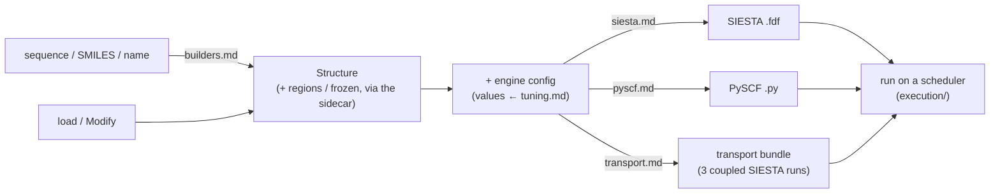
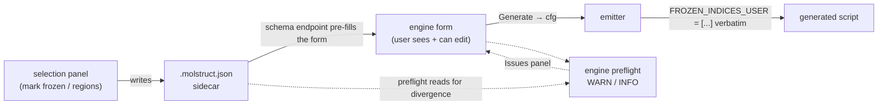

# Engines — the map & the shared contracts

**Role:** overview
**Domain:** engines
**Companions (the peer docs this maps):** [`builders.md`](?doc=engines/builders.md),
[`siesta.md`](?doc=engines/siesta.md), [`pyscf.md`](?doc=engines/pyscf.md),
[`transport.md`](?doc=engines/transport.md), [`tuning.md`](?doc=engines/tuning.md),
[`stages.md`](?doc=engines/stages.md), [`template.md`](?doc=engines/template.md).
**Upstream/downstream:** [`model/structure.md`](?doc=model/structure.md) (the
`Structure` every engine consumes) + [`model/structure-annotations.md`](?doc=model/structure-annotations.md)
(the region-label + frozen-atom *vocabulary*) + [`model/structure-molstruct.md`](?doc=model/structure-molstruct.md)
(the `.molstruct.json` sidecar the boundary contract reads);
[`web/tabs.md`](?doc=web/tabs.md) (the selection UI);
[`execution/overview.md`](?doc=execution/overview.md) (running the emitted scripts —
start there for the whole execution domain);
[`architecture.md`](?doc=architecture.md) (where engines sit in the package as a whole).

An **engine** turns a validated [`Structure`](?doc=model/structure.md) plus a user
config into something a quantum-chemistry code will run: a SIESTA `.fdf`, a PySCF
`.py`, or a derived multi-file transport bundle. The **builders** sit just upstream —
they *produce* the `Structure` from a sequence / SMILES / name. This doc is the
**map** of that layer and the **contracts every engine shares**, so the peer docs
can each stay focused on their own emitter.

---

## 1. The map — what each doc owns

| Doc | Owns |
|---|---|
| [`builders.md`](?doc=engines/builders.md) | **Structure synthesis** — sequence / SMILES / name → a 3-D `Structure`; the pluggable nucleic-acid backend registry and per-backend quirk repairs. (Upstream of the emitters.) |
| [`siesta.md`](?doc=engines/siesta.md) | The **SIESTA `.fdf` emitter** — the block set + emission order, charge / spin / cell / k-grid emission, and the `Diag.Algorithm` / GPU-ELPA / MPS eigensolver *setting*. |
| [`pyscf.md`](?doc=engines/pyscf.md) | The **PySCF `.py` emitter** — output-file set, the in-script staged-opt loop, and the engine-agnostic **molwatch-log format** (which SIESTA also writes). |
| [`transport.md`](?doc=engines/transport.md) | The **TranSIESTA / NEGF workflow** — one region-labeled device → three coupled SIESTA runs, and the cross-run consistency preflight (I1–I13). |
| [`tuning.md`](?doc=engines/tuning.md) | The **cross-engine VALUES guide** — the single owner of what number each convergence / quality knob should carry, per tier. Every other doc that names a tier value defers here. |
| [`stages.md`](?doc=engines/stages.md) | What a **stage** is — molbuilder's idea, not any engine's — and `task.json`, the file that describes a ladder of them. |
| [`template.md`](?doc=engines/template.md) | The **template** — a calculation's parameter catalogue: the TOML file holding every parameter with its value, the `kind` vocabulary that says which layer owns each one, and what *complete* and *lossless* mean for it. Shared by every engine; only the items differ. |



The things that are **shared across engines** live outside any one emitter, so they
stay defined once. **Three** are defined in this document — the script wrapper
(§ 2), the boundary-condition contract (§ 3) and the GPU contract (§ 3a) — and
§ 5 shows how a new engine plugs into them. § 4 is a **map** rather than a third definition: what the two
ladders share is the **tier values**, and those are
[`tuning.md`](?doc=engines/tuning.md) § 4's.  *(It counted three until
2026-08-11, when the staged-optimization "policy" turned out to be PySCF's alone
— see § 4.)* A fourth is large enough to
have its own contract: the **template**
([`template.md`](?doc=engines/template.md)), the file that carries a calculation's
parameters from a browser to whatever machine will run it.

---

## 2. The shared script-contract wrapper

Every generated script — SIESTA `.fdf` *and* PySCF `.py` — is wrapped by the same
blocks, emitted from one module (`molbuilder/script_emit.py`, imported as `_sc`) and
called by both `siesta/input.py` and `pyscf/input.py`:

| Block | What it is | Emitted by |
|---|---|---|
| **provenance** header | molbuilder version + git SHA + generation timestamp, so a script is traceable back to what produced it | both (`emit_provenance`) |
| **bench-marks** | a machine-readable metadata header (a `BenchField` set) for regression harnesses | SIESTA only (`emit_bench_marks`) — a PySCF deck declares no override surface, which is why a sweep cannot read one |
| **ATOM-METADATA** block | the structure's `regions` + `frozen_atoms` as an in-body, round-trippable comment block (so the labels travel *with* the script) | both (`emit_atom_metadata`) |
| **user-custom** placeholder | a marked region a user can edit. **Whether your text survives a re-generate depends on which surface writes the file** — the web Build tab reads it back, the CLI and `jobset prep` do not ([`job-contracts.md`](?doc=execution/job-contracts.md) § 3.5's table). *This row said "molbuilder preserves whatever the user put there" without qualification until 2026-08-17, which is true of one of the three paths* | both (`emit_user_custom_placeholder`) |
| post-processing hook | a commented-template section (in the engine body, emitted inline by each emitter — not a `_sc` block) where downstream steps attach | both (inline) |

Because it is one module, a change to the wrapper contract lands in every engine at
once. `siesta.md` § 3 and `pyscf.md` describe how their body sits *inside* this
wrapper; the wrapper itself is defined here.

---

## 3. The boundary-condition contract — UI → config → script, no silent absorption

The **boundary conditions** of a run — which atoms are frozen, which regions
partition the system, a fixed cell when one exists — are **user input**, not something
an engine may quietly invent or drop. molbuilder routes them through a strict
three-stage contract, and any divergence between stages surfaces as a **visible
issue**, never as silent absorption.

> **The founding principle (user directive, 2026-05-21).** *"The starting facts /
> boundary condition of a simulation must be explicit, consistent, and fully respected
> from config to actual calculation… if labels are not consistent or not recognized,
> the script should give an explicit warning. No silent absorption of config."*

**Reference instance.** The contract is **fully wired today for the spectra engine**
(the PySCF vibrational path — frozen-atom masking), so every code path cited below is a
`spectra/…` site. It is the **template** the other engines adopt stage by stage: they
already deliver boundary conditions verbatim (Stage 2) and round-trip the labels in the
script's ATOM-METADATA block (§ 2). The Stage-3 divergence check (A) is spectra-specific
so far, but the unrecognized-label notice (B) is not — transport's engine preflight
already warns on region labels it doesn't recognise (`transiesta.py:748`). ("spectra" =
the vibrational / IR-spectrum engine that rides
on PySCF; it lives in its own `spectrum-calculation` domain, not among the docs mapped
above, but it's the reference for this contract.)



- **Stage 1 — UI → config (capture intent visibly).** The selection panel writes
  the labels into the [`.molstruct.json` sidecar](?doc=model/structure-molstruct.md)'s
  one `regions` store — `frozen_atoms` is one of them, a *reserved* label rather
  than a key of its own (schema 7). The label *vocabulary* — `L-electrode` /
  `bridge` / `interface` / `frozen_atoms` — is owned by
  [`model/structure-annotations.md`](?doc=model/structure-annotations.md).
  When the user opens an engine form against that structure, the schema endpoint
  **pre-fills** the freeze field from the sidecar (`web/blueprints/spectra.py::_seed_frozen_indices_from_sidecar`),
  so the user **sees** what will be frozen *before* Generate. The form is then
  **authoritative** — leave the pre-fill, add to it, or clear it (a deliberate
  override). If the sidecar can't be applied (atom-count mismatch, corrupt JSON) the
  response carries a human-readable `notice` instead of silently failing.
- **Stage 2 — config → script (deliver verbatim).** The emitter writes the user's set
  exactly — `FROZEN_INDICES_USER = list(cfg.frozen_indices)` (`spectra/pyscf_script.py:370`)
  — and nothing else. It does **not** silently union with `struct.frozen_atoms` at emit
  time, and the generated script does **not** read the sidecar at run time. Whatever
  the form showed is what lands in the script.

  > **⚠ SIESTA does not do this yet, and the difference is Stage 1 rather than
  > Stage 2** *(measured 2026-08-17; this bullet claimed the SIESTA emitter
  > "obeys the same Stage-2 rule")*. `siesta/input.py` writes
  > `%block Geometry.Constraints` from **`struct.frozen_atoms`** — the sidecar
  > itself. There is no `frozen_indices` field on `SiestaConfig` and no such
  > catalogue item, so **there is no form value for the form to be
  > authoritative with**: clearing the field cannot unfreeze an atom, because
  > the sidecar is what the deck is written from either way. Stage 2 is
  > technically satisfied (the emitter copies verbatim and invents nothing) and
  > Stage 1 is not, which is the half that carries the user's intent.
  >
  > It is a **silent absorption of config** — the thing the 2026-05-21
  > directive above names — and the Stage-3A divergence check that would report
  > it is spectra-only. Tracked as row 2 of
  > [`template.md`](?doc=engines/template.md) § 12.1.
- **Stage 3 — preflight (warn on what it can't use).** Two checks live in the engine's
  render-time checks (`spectra/pyscf_engine.py::render_checks` — A at :576, B at :604);
  the third runs at the render endpoint (`web/blueprints/spectra.py:408` — C), where the
  sidecar is applied to the `Structure` before the checks see it:

| Check | Fires when | Severity |
|---|---|---|
| **A. Divergence** | the sidecar's `frozen_atoms` isn't a subset of the config's — the script is about to omit atoms the sidecar marked (stale pre-fill, or the sidecar changed in another tab) | `warn` (`where=config.frozen_indices`) |
| **B. Unrecognized label** | the structure carries labels this engine doesn't consume (e.g. transport `regions` seen by a spectra run) — named explicitly, "these stay in the sidecar for the engine that uses them" | `warn` |
| **C. Sidecar failed to apply** | a sidecar exists but couldn't be applied — "the form's freeze rules are the sole boundary condition for this run" | `warn` (`where=structure_path`) |

Each surfaces as a structured `Issue` in the form's panel — e.g. a Check-A divergence:

```text
[WARN] config.frozen_indices — the sidecar marks atoms 5, 6 frozen, but the form
       omits them; this run will NOT freeze 5, 6. Re-open the structure to re-seed,
       or clear the field deliberately.
```

**Why it's structural, not a nicety.** A script that silently freezes a *different*
set than the form showed isn't a rounding error — it's a *different calculation*. The
contract guarantees the user can read the form (config) and the Issues panel (engine
understanding) and know exactly what will happen.

**Per-engine label consumption** — which sidecar labels each engine actually uses. A
label an engine doesn't consume is never silently absorbed: it's either surfaced by a
Stage-3B notice (the spectra engine, today) or round-tripped untouched in the script's
ATOM-METADATA block:

| Label | builders | siesta / pyscf opt | spectra | transport |
|---|---|---|---|---|
| `frozen_atoms` | (sets it) | freezes in the relax (`Geometry.Constraints` / `$freeze`) | seeds the form → masks the partial Hessian¹ | freezes the leads (union with lead regions) |
| `regions` (`L-electrode`/`bridge`/…) | (sets it) | round-tripped in metadata (not consumed) | Stage-3B notice | **drives the whole derivation** |

¹ *partial Hessian* = the vibrational analysis computes second derivatives only for the
free (non-frozen) atoms, so freezing a slab or anchor cuts the cost sharply. spectra
consumes the **form value** (`cfg.frozen_indices`), which the sidecar's `frozen_atoms`
only *seeds* via the Stage-1 pre-fill — the form stays authoritative.

---

## 3a. The GPU contract — the user decides, every engine

*Settled 2026-08-17 (user), and written here because it had no single home:
SIESTA's mechanism is [`siesta.md`](?doc=engines/siesta.md) § 7–7.2, PySCF's was
**undocumented entirely**, and the shared rule was nowhere. That is why the
question kept being re-derived, and re-derived differently each time.*

**Five rules. They hold for every engine, present and future.**

> **G-1 — The GPU is a decision a person makes, and molbuilder never makes it
> for them.** Each engine declares **one boolean item**, `kind = "engine"`,
> `category = ["execution"]`, defaulting to **off**. Detected hardware never
> turns it on: a machine having a GPU is a fact about the machine, and wanting
> to use it is a preference about this run — the same split
> [`configuration.md`](?doc=configuration.md) § 5 M-1 draws for every other
> machine fact.
>
> **Which surface asks is [`web/task-setup.md`](?doc=web/task-setup.md) § 6.2's**
> — the Job Prep page, not a parameter tab (user, 2026-08-16). Both items sit
> in `group = "staging"`, which `catalogue_to_form_schema` filters out, so a
> parameter form cannot offer it even by accident.

> **G-2 — It changes *where the work runs*, never the answer.** That is what
> puts it in `category = "execution"`, and `execution` is a **claim**
> ([`template.md`](?doc=engines/template.md) § 6.2): the knobs that change
> speed and not the science. SIESTA's measured equivalence — ELPA-GPU and
> ELPA-CPU agree to ~1e-6 eV on eigenvalues and ~1e-5 eV on the total energy
> (§ 7.1) — is what earns the claim rather than assumes it.

> **G-3 — Because of G-2 it is a legal benchmark axis, and it is the user's
> to sweep.** A sweep may turn it on and off across trials for the same reason
> it may sweep rank counts: the science is identical at every point, so the
> comparison is meaningful. Nothing else licenses sweeping a parameter.

> **G-4 — How the engine *consumes* it never leaves that engine.** SIESTA emits
> `Diag.ELPA.GPU` and gates it on an ELPA solver (§ 7); PySCF emits
> `mf = mf.to_gpu()` behind a helper. Neither spelling reaches any shared
> layer — which is what `kind`'s vocabulary means by *the engine's own keyword*.

> **G-5 — Asked for and not available means the run STOPS. There is no CPU
> fallback, in either engine, in a run or in a benchmark trial.** *(User,
> 2026-08-17.)* The user decided to use the GPU; a run that quietly executed
> somewhere else has changed the thing that was asked for and said nothing —
> which is exactly the **silent absorption of config** § 3's founding directive
> forbids for boundary conditions, one axis over.
>
> It is also what keeps G-3 honest. If a GPU trial may silently become a CPU
> trial, then *every* benchmark number is suspect: the GPU column may hold CPU
> times, and the GPU looks slow for a reason that has nothing to do with the
> GPU. **A sweep is only meaningful if each point ran where its label says.**

### Where each engine stops, and why the moment differs

The rule is identical; only the **moment it can be enforced** differs, and that
is decided by where the capability lives rather than by preference.

| | **SIESTA** | **PySCF** |
|---|---|---|
| the item | `enable_gpu` | `use_gpu` |
| what the flag turns on | `Diag.ELPA.GPU .true.` in the deck, and only with an ELPA solver — GPU + ScaLAPACK is refused by the **emitter** | `mf = _mb_to_gpu_if_enabled(mf)` in the script, after the `mf` is fully assembled |
| **where the capability lives** | in the **environment** — only `molbuilder-siesta-gpu`'s ELPA has the GPU codepath | in the **device**, plus `gpu4pyscf` + `cupy` |
| **when it is checked** | **at `prep`** — an env is a fact the prepping machine can see | **at run start** — you prep on a login node and run on a GPU node, so the device is not visible until the job is on it |
| **what happens if it is missing** | **the wrapper refuses to generate** — `WrapperError`, naming the env and how to install it | **the script exits** — `SystemExit` with the reason and the two ways out |

**Neither engine can check at the other's moment**, which is why this is not an
inconsistency to be flattened: SIESTA's env is knowable before queueing and its
absence is fatal then; PySCF's device is *not* knowable before queueing, so the
earliest honest refusal is the first second of the run. Both refuse. Neither
downgrades.

> **G-5a — A benchmark reports what the run DID, never what it was asked for.**
> With G-5 in place a completed PySCF trial that asked for the GPU *did* use
> one — so `_RUNTIME_INFO['gpu_used']` is a **record**, not a correction. It is
> still what a summary should read, for the same reason `bench/result.py`
> separates `asked` from `effective` for rank counts: the artifact says what
> happened, and nothing infers it from the request.

> **One silent path survives, inside ELPA, and it is not ours to remove.** ELPA
> can run every SCF step on the CPU while `nvidia-smi` shows a busy GPU
> ([`siesta.md`](?doc=engines/siesta.md) § 7.1). No molbuilder check sees it;
> the canary is `molbuilder envs validate molbuilder-siesta-gpu`'s
> *elpa gpu codepath* probe. Recorded here so the rule above is not read as a
> guarantee it cannot make.

**A computation with no GPU implementation is a different thing, and is not a
fallback.** gpu4pyscf has no analytic CPHF polarizability, so a Raman block
runs on the CPU *by design* even with the GPU on. That is the engine having no
GPU code for one operation — announced, deterministic, and unrelated to whether
a GPU is present. G-5 governs *availability*, not *coverage*.

### What is still owed

| | |
|---|---|
| **one name** | `enable_gpu` / `use_gpu` are the same question with two spellings. The merge is **ruled and un-renamed** ([`template.md`](?doc=engines/template.md) § 6.3, § 12.1 row 9), so any caller asking *"does this run want a GPU?"* must currently name an engine's spelling |
| **`read_by`** | `enable_gpu` declares `read_by = ["wrapper"]`; `use_gpu` does not, though both decide which environment the job needs. PySCF has no env routing in `runwrap` at all |
| **`gpu_used` read-back** | G-5a is a rule with no reader yet: nothing compares a PySCF trial's asked GPU against `_RUNTIME_INFO['gpu_used']` |

---

## 4. Staged optimization — what the two engines share, and what they do not

Both the SIESTA and PySCF emitters ship a **three-stage relaxation ladder**, and
**they share the tier values and nothing else.** The section title said *"the
shared staged-optimization contract"* until 2026-08-11, which was true when the
two halves were symmetric and has not been since 2026-08-07.

> **The two halves separated on 2026-08-07, on purpose.** A stage is not a
> property of a calculation, so an engine config carries no stage list:
> `SiestaStageSpec` and `SiestaConfig.stages` were **deleted**, and the SIESTA
> ladder lives in `task.json` as `task.py::Stage` — `name`, `enabled`, and
> `overrides`, which may name **any** field of the shared schema
> ([`engines/stages.md`](?doc=engines/stages.md) § 1.1–1.2). **PySCF kept a
> stage list of its own** while the SIESTA path was being built: its ladder ran
> inside one process, so there the list was also engine behaviour. The parity
> tests that policed the old symmetry went with the SIESTA half.
>
> **That exception closed 2026-08-17** ([`stages.md` § 1.1a](?doc=engines/stages.md)):
> the ladder is declared in `task.json` for **both** engines. Where it is
> *declared* and how it *runs* were two questions, and only the second was ever
> PySCF's difference.
>
> ⚠ **And the second closed 2026-08-18** (same section): a PySCF ladder is N decks
> and N jobs, like SIESTA's. This paragraph ended *"and PySCF still executes it in
> one process"* until then; the list is no longer engine behaviour either.
>
> What the two still share is what this section is actually about — **the tier
> values**, below. That was always the part worth keeping aligned; the
> dataclass shape was not.

- **The tier *values*** (algorithm, steps, force / `gmax`, per stage) are owned by
  **[`tuning.md`](?doc=engines/tuning.md) § 4** — the single value table both emitters
  and this contract defer to.
- **Neither engine's ladder carries a non-convergence policy**, and running out
  of steps means the same thing in both: the rung stops, and you decide. The
  next stage exists only because you looked at the result and prepped it — the
  same judgement the policy tried to encode, made where the evidence is.
  **`on_nonconvergence` survives as a PySCF field with a narrower meaning** —
  whether THIS rung's `optimize()` raises or exits with the partial geometry —
  and its semantics live with the engine that has it,
  [`pyscf.md`](?doc=engines/pyscf.md) § 3.

  *This bullet has been wrong twice, in opposite directions, and both times
  because it restated a rule owned elsewhere. Until 2026-08-11 it said the
  policy was **shared** — the fourth copy of a claim already corrected in
  `stages.md` § 3, `job-contracts.md` § 6.2 and `job-system.md` § 4.1. Until
  2026-08-19 it said PySCF keeps it **because its ladder is a loop inside one
  process**, nineteen lines after this same file records that the loop was
  retired ([`stages.md § 1.1a`](?doc=engines/stages.md)).*

> **Why this one was worth catching rather than quietly editing.** A section
> that says *"defined here"* is claiming to be the single owner, so a reader
> checking the rule stops at it — and this one had been wrong for four days
> about which engines it covered. **The tell was the sentence, not the
> content:** the singularity claim is what made it worth verifying, and three
> other documents already disagreed with it.

`pyscf.md` § 5 shows the in-script loop that implements the policy for PySCF.
`siesta.md` § 8 is where SIESTA's absence of one is recorded — **and it used to
say "the runner side", a runner (`render_siesta_stages_runner`) deleted on
2026-08-10.**

---

## 5. Adding a new engine

Engines self-register with an `@register_engine` decorator against a `Protocol`
(`transport/engine_base.py`, `spectra/engine_base.py`) — the registry is how a future
backend (e.g. a PySCF-NEGF transport engine) joins without touching the dispatch. To
satisfy the contracts above, a new engine must:

1. **Declare which sidecar labels it consumes** (in the engine module's docstring) —
   everything else gets a Stage-3B notice.
2. **Add a schema-endpoint pre-fill** for any label that maps to a form field
   (mirror `_seed_frozen_indices_from_sidecar`).
3. **Add a preflight divergence warn** (Stage-3A) and an **unrecognized-label notice**
   (Stage-3B) for every sidecar field it does *not* consume.
4. **Emit boundary conditions verbatim** from config (Stage 2) — no silent union, no
   run-time sidecar reads.

Tests must pin each: a future engine that silently absorbs or drops a label has to
fail loudly. The spectra tests are the template — divergence + unrecognized-label at
the engine layer (`tests/spectra/test_engine.py::test_sidecar_frozen_divergence_warns`,
`::test_sidecar_regions_unrecognized_warn`) and apply-failure at the render layer
(`tests/spectra/test_blueprint.py::test_render_with_corrupt_sidecar_surfaces_notice`).
