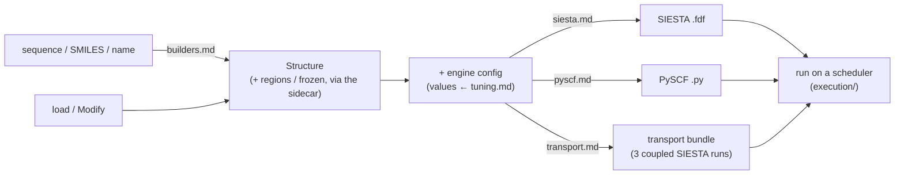
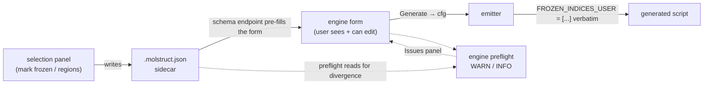

# Engines — the map & the shared contracts

**Role:** overview
**Domain:** engines
**Companions (the peer docs this maps):** [`builders.md`](?doc=engines/builders.md),
[`siesta.md`](?doc=engines/siesta.md), [`pyscf.md`](?doc=engines/pyscf.md),
[`transport.md`](?doc=engines/transport.md), [`tuning.md`](?doc=engines/tuning.md).
**Upstream/downstream:** [`model/structure.md`](?doc=model/structure.md) (the
`Structure` every engine consumes) + [`model/structure-annotations.md`](?doc=model/structure-annotations.md)
(the region-label + frozen-atom *vocabulary*) + [`model/structure-molstruct.md`](?doc=model/structure-molstruct.md)
(the `.molstruct.json` sidecar the boundary contract reads); `web/` (the selection UI
— migrating later); `execution/` (running the emitted scripts on a scheduler —
migrating later); `architecture.md` (where engines sit in the whole — composed last).

An **engine** turns a validated [`Structure`](?doc=model/structure.md) plus a user
config into something a quantum-chemistry code will run: a SIESTA `.fdf`, a PySCF
`.py`, or a derived multi-file transport bundle. The **builders** sit just upstream —
they *produce* the `Structure` from a sequence / SMILES / name. This doc is the
**map** of that layer and the **contracts every engine shares**, so the five peer docs
can each stay focused on their own emitter.

---

## 1. The map — what each doc owns

| Doc | Owns |
|---|---|
| [`builders.md`](?doc=engines/builders.md) | **Structure synthesis** — sequence / SMILES / name → a 3-D `Structure`; the pluggable nucleic-acid backend registry and per-backend quirk repairs. (Upstream of the emitters.) |
| [`siesta.md`](?doc=engines/siesta.md) | The **SIESTA `.fdf` emitter** — the block set + emission order, charge / spin / cell / k-grid emission, and the `Diag.Algorithm` / GPU-ELPA / MPS eigensolver *setting*. |
| [`pyscf.md`](?doc=engines/pyscf.md) | The **PySCF `.py` emitter** — output-file set, the in-script staged-opt loop, and the engine-agnostic **molwatch-log format** (which SIESTA also writes). |
| [`transport.md`](?doc=engines/transport.md) | The **TranSIESTA / NEGF workflow** — one region-labeled device → three coupled SIESTA runs, and the cross-run consistency preflight (I1–I13). |
| [`tuning.md`](?doc=engines/tuning.md) | The **cross-engine VALUES guide** — the single owner of what number each convergence / quality knob should carry, per tier. Every other doc that names a tier value defers here. |



The three things that are **shared across engines** — the script wrapper (§ 2), the
boundary-condition contract (§ 3), and the staged-optimization policy (§ 4) — live
here rather than in any one emitter, so they stay defined once; § 5 shows how a new
engine plugs into all three.

---

## 2. The shared script-contract wrapper

Every generated script — SIESTA `.fdf` *and* PySCF `.py` — is wrapped by the same
blocks, emitted from one module (`molbuilder/script_emit.py`, imported as `_sc`) and
called by both `siesta/input.py` and `pyscf/input.py`:

| Block | What it is | Emitted by |
|---|---|---|
| **provenance** header | molbuilder version + git SHA + generation timestamp, so a script is traceable back to what produced it | both (`emit_provenance`) |
| **bench-marks** | a machine-readable metadata header (a `BenchField` set) for regression harnesses | SIESTA only (`emit_bench_marks`) |
| **ATOM-METADATA** block | the structure's `regions` + `frozen_atoms` as an in-body, round-trippable comment block (so the labels travel *with* the script) | both (`emit_atom_metadata`) |
| **user-custom** placeholder | a marked, empty region a user can edit; on re-generate, molbuilder **preserves** whatever the user put there (`merge_user_custom_from_target`) | both (`emit_user_custom_placeholder`) |
| post-processing hook | a commented-template section (in the engine body, emitted inline by each emitter — not a `_sc` block) where downstream steps attach | both (inline) |

Because it is one module, a change to the wrapper contract lands in every engine at
once. `siesta.md` § 3 and `pyscf.md` describe how their body sits *inside* this
wrapper; the wrapper itself is defined here.

---

## 3. The boundary-condition contract — UI → config → script, no silent absorption

The **boundary conditions** of a run — which atoms are frozen, which regions
partition the system, a fixed cell when one exists — are **user input**, not something
an engine may quietly invent or drop. molbuilder routes them through a strict
three-stage contract, and any divergence between stages surfaces as a **visible
issue**, never as silent absorption.

> **The founding principle (user directive, 2026-05-21).** *"The starting facts /
> boundary condition of a simulation must be explicit, consistent, and fully respected
> from config to actual calculation… if labels are not consistent or not recognized,
> the script should give an explicit warning. No silent absorption of config."*

**Reference instance.** The contract is **fully wired today for the spectra engine**
(the PySCF vibrational path — frozen-atom masking), so every code path cited below is a
`spectra/…` site. It is the **template** the other engines adopt stage by stage: they
already deliver boundary conditions verbatim (Stage 2) and round-trip the labels in the
script's ATOM-METADATA block (§ 2). The Stage-3 divergence check (A) is spectra-specific
so far, but the unrecognized-label notice (B) is not — transport's engine preflight
already warns on region labels it doesn't recognise (`transiesta.py:748`). ("spectra" =
the vibrational / IR-spectrum engine that rides
on PySCF; it lives in its own `spectrum-calculation` domain, not among the five docs
above, but it's the reference for this contract.)



- **Stage 1 — UI → config (capture intent visibly).** The selection panel writes
  the labels into the [`.molstruct.json` sidecar](?doc=model/structure-molstruct.md)'s
  one `regions` store — `frozen_atoms` is one of them, a *reserved* label rather
  than a key of its own (schema 7). The label *vocabulary* — `L-electrode` /
  `bridge` / `interface` / `frozen_atoms` — is owned by
  [`model/structure-annotations.md`](?doc=model/structure-annotations.md).
  When the user opens an engine form against that structure, the schema endpoint
  **pre-fills** the freeze field from the sidecar (`web/blueprints/spectra.py::_seed_frozen_indices_from_sidecar`),
  so the user **sees** what will be frozen *before* Generate. The form is then
  **authoritative** — leave the pre-fill, add to it, or clear it (a deliberate
  override). If the sidecar can't be applied (atom-count mismatch, corrupt JSON) the
  response carries a human-readable `notice` instead of silently failing.
- **Stage 2 — config → script (deliver verbatim).** The emitter writes the user's set
  exactly — `FROZEN_INDICES_USER = list(cfg.frozen_indices)` (`spectra/pyscf_script.py:370`)
  — and nothing else. It does **not** silently union with `struct.frozen_atoms` at emit
  time, and the generated script does **not** read the sidecar at run time. Whatever
  the form showed is what lands in the script. (The SIESTA emitter obeys the same
  Stage-2 rule for its `Geometry.Constraints` freeze block.)
- **Stage 3 — preflight (warn on what it can't use).** Two checks live in the engine's
  render-time checks (`spectra/pyscf_engine.py::render_checks` — A at :576, B at :604);
  the third runs at the render endpoint (`web/blueprints/spectra.py:408` — C), where the
  sidecar is applied to the `Structure` before the checks see it:

| Check | Fires when | Severity |
|---|---|---|
| **A. Divergence** | the sidecar's `frozen_atoms` isn't a subset of the config's — the script is about to omit atoms the sidecar marked (stale pre-fill, or the sidecar changed in another tab) | `warn` (`where=config.frozen_indices`) |
| **B. Unrecognized label** | the structure carries labels this engine doesn't consume (e.g. transport `regions` seen by a spectra run) — named explicitly, "these stay in the sidecar for the engine that uses them" | `warn` |
| **C. Sidecar failed to apply** | a sidecar exists but couldn't be applied — "the form's freeze rules are the sole boundary condition for this run" | `warn` (`where=structure_path`) |

Each surfaces as a structured `Issue` in the form's panel — e.g. a Check-A divergence:

```text
[WARN] config.frozen_indices — the sidecar marks atoms 5, 6 frozen, but the form
       omits them; this run will NOT freeze 5, 6. Re-open the structure to re-seed,
       or clear the field deliberately.
```

**Why it's structural, not a nicety.** A script that silently freezes a *different*
set than the form showed isn't a rounding error — it's a *different calculation*. The
contract guarantees the user can read the form (config) and the Issues panel (engine
understanding) and know exactly what will happen.

**Per-engine label consumption** — which sidecar labels each engine actually uses. A
label an engine doesn't consume is never silently absorbed: it's either surfaced by a
Stage-3B notice (the spectra engine, today) or round-tripped untouched in the script's
ATOM-METADATA block:

| Label | builders | siesta / pyscf opt | spectra | transport |
|---|---|---|---|---|
| `frozen_atoms` | (sets it) | freezes in the relax (`Geometry.Constraints` / `$freeze`) | seeds the form → masks the partial Hessian¹ | freezes the leads (union with lead regions) |
| `regions` (`L-electrode`/`bridge`/…) | (sets it) | round-tripped in metadata (not consumed) | Stage-3B notice | **drives the whole derivation** |

¹ *partial Hessian* = the vibrational analysis computes second derivatives only for the
free (non-frozen) atoms, so freezing a slab or anchor cuts the cost sharply. spectra
consumes the **form value** (`cfg.frozen_indices`), which the sidecar's `frozen_atoms`
only *seeds* via the Stage-1 pre-fill — the form stays authoritative.

---

## 4. The shared staged-optimization contract

Both the SIESTA and PySCF emitters ship a **three-stage relaxation ladder**, and
they no longer share a shape.

> **The two halves separated on 2026-08-07, on purpose.** A stage is not a
> property of a calculation, so an engine config carries no stage list:
> `SiestaStageSpec` and `SiestaConfig.stages` were **deleted**, and the SIESTA
> ladder lives in `task.json` as `task.py::Stage` — `name`, `enabled`, and
> `overrides`, which may name **any** field of the shared schema
> ([`engines/stages.md`](?doc=engines/stages.md) § 1.1–1.2). **PySCF keeps its
> `StageSpec`** (`config/pyscf.py`): its ladder runs inside one process, so
> there the list is also engine behaviour. The parity tests that policed the
> old symmetry went with the SIESTA half.
>
> What the two still share is what this section is actually about — **the tier
> values**, below. That was always the part worth keeping aligned; the
> dataclass shape was not.

- **The tier *values*** (algorithm, steps, force / `gmax`, per stage) are owned by
  **[`tuning.md`](?doc=engines/tuning.md) § 4** — the single value table both emitters
  and this contract defer to.
- **The non-convergence policy** is shared and defined here — but it is **not a
  stage field and not a shared-schema field** for SIESTA
  ([`stages.md`](?doc=engines/stages.md) § 3): its entire effect is the edge
  between one attempt and the next, so it is the JobSet / runner producer's own
  input. PySCF's in-script loop still carries it per stage, because there the
  loop *is* the scheduler. When a stage exhausts its step budget without
  converging:
  - **`proceed`** — hand the partial geometry to the next stage (loose warm-ups).
  - **`continue`** — re-enter the engine for up to `continue_retries` more batches
    (total budget = the stage's step count × `(1 + continue_retries)`), then halt.
  - **`halt`** — stop and raise (production tiers; failure is a real signal).
  - The **last enabled stage is always forced to `halt`** at render time — the
    contract is to produce a converged final geometry, so no knob can silently ship a
    non-converged answer.

`pyscf.md` § 5 shows the in-script loop that implements this for PySCF (§ 3 holds the
policy semantics); `siesta.md` § 8 shows the runner side for SIESTA. Both realise the
*same* policy defined here.

---

## 5. Adding a new engine

Engines self-register with an `@register_engine` decorator against a `Protocol`
(`transport/engine_base.py`, `spectra/engine_base.py`) — the registry is how a future
backend (e.g. a PySCF-NEGF transport engine) joins without touching the dispatch. To
satisfy the contracts above, a new engine must:

1. **Declare which sidecar labels it consumes** (in the engine module's docstring) —
   everything else gets a Stage-3B notice.
2. **Add a schema-endpoint pre-fill** for any label that maps to a form field
   (mirror `_seed_frozen_indices_from_sidecar`).
3. **Add a preflight divergence warn** (Stage-3A) and an **unrecognized-label notice**
   (Stage-3B) for every sidecar field it does *not* consume.
4. **Emit boundary conditions verbatim** from config (Stage 2) — no silent union, no
   run-time sidecar reads.

Tests must pin each: a future engine that silently absorbs or drops a label has to
fail loudly. The spectra tests are the template — divergence + unrecognized-label at
the engine layer (`tests/spectra/test_engine.py::test_sidecar_frozen_divergence_warns`,
`::test_sidecar_regions_unrecognized_warn`) and apply-failure at the render layer
(`tests/spectra/test_blueprint.py::test_render_with_corrupt_sidecar_surfaces_notice`).
