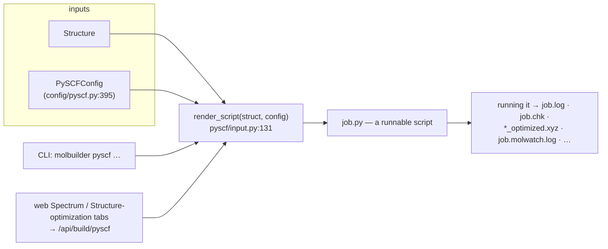
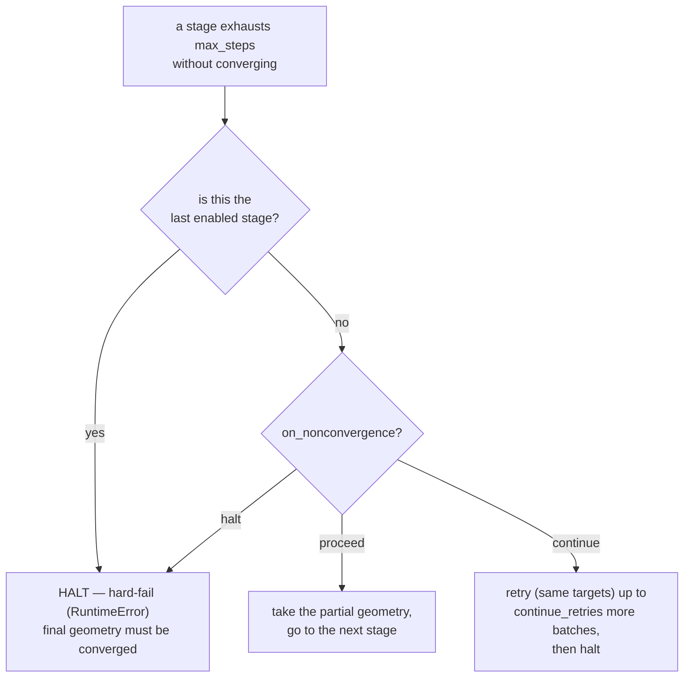

# The PySCF script emitter (+ publication-quality parameter guide)

**Role:** contract
**Domain:** engines
**Companions:** `overview.md` (the shared engine-emit contract — composed last,
named not linked yet); [`engines/siesta.md`](?doc=engines/siesta.md) (the SIESTA
equivalent); `tuning.md` (the cross-engine convergence-tier framework — this doc is
the PySCF-specific companion, named, this wave);
[`science/validation.md`](?doc=science/validation.md) (the preflight that gates
emission); [`model/chemistry.md`](?doc=model/chemistry.md) (charge / ECP resolution).

This is how molbuilder turns a `Structure` + a `PySCFConfig` into a **runnable
Python script**. Unlike SIESTA (a compiled binary reading an `.fdf`), PySCF is a
Python library, so the emitter writes a `.py` file you run directly — which lets
molbuilder put the whole staged-optimization loop *inside* the script. The one
entry point is `render_script(struct, config) -> str` (`pyscf/input.py:131`).

> **Vocabulary.** Cross-cutting terms (DFT, SCF, open/closed-shell, RKS/UKS, ECP)
> are in the [`science/overview.md` glossary](?doc=science/overview.md). Key PySCF
> names: **`gto.M(...)`** builds the molecule object (geometry + basis +
> charge/spin); **`mf`** is the mean-field SCF object from `scf.RKS(mol)` (carrying
> `mf.xc`, `mf.conv_tol`, `mf.kernel()`, …); **`conv_tol`** is the SCF energy
> self-consistency threshold (Ha); **`d3bj`** is the Grimme-D3(BJ) dispersion
> correction; **RI-J** is resolution-of-the-identity Coulomb fitting (a speedup).
> A few more: **basis set** = the functions used to represent each atom's electrons
> (bigger = more accurate, slower — e.g. `def2-SVP` < `def2-TZVP`); **functional**
> = the DFT recipe for exchange-correlation energy (e.g. B3LYP); **Ha** = Hartree
> (atomic energy unit, 1 Ha ≈ 27.2 eV) and **Bohr** the atomic length unit;
> **Hessian** = the matrix of energy 2nd-derivatives (source of vibrational
> frequencies); **single-point** = one energy at a fixed geometry (no optimization).

---

## 1. The two surfaces



- **Backend.** `render_script` returns the `.py` text; `convert(input_path,
  py_path, config)` (`:1291`) reads an `.xyz`/`.pdb` and writes the script,
  returning `{"py", "n_atoms", "charge", "label"}`. Verbose comments are on by
  default so the script reads as documentation of its own choices. The CLI
  (`cmd_pyscf`, `cli.py:933`) writes the script from a structure file:

  ```bash
  # config fields (--basis, --functional, …) + --ecp / --stages-json / --stage-strategy
  molbuilder pyscf input.xyz job.py --basis def2-TZVP --stage-strategy publishable
  ```

- **Frontend.** The Spectrum and Structure-optimization tabs post to
  `/api/build/pyscf` (validation preflight → `render_script`); `PySCFConfig`'s
  field metadata drives the form.

---

## 2. Output files

A successful run produces exactly these, in the launch directory (presence gated
by the config flag in column 2):

| file | enabled when | contents |
|---|---|---|
| `<job>.log` | `log_file` (default on) | the verbose PySCF log for **every enabled stage**; appended, never truncated mid-run |
| `<job>.chk` | `chkfile` (default on) | PySCF checkpoint (density matrix, mol, energies) |
| `<job>_initial.xyz` | `save_initial_xyz` | the input geometry, snapshotted right after `gto.M(...)`, before any optimization |
| `<job>_optimized.xyz` | `save_optimized_xyz` AND `optimize` | the final relaxed geometry |
| `<job>_geom_<stage>_optim.xyz` | `optimize` + `write_trajectory` + `optimizer=="geometric"` | streaming per-stage trajectory (multi-frame XYZ, one frame per accepted step) |
| `<job>_geom_<stage>.log` | same | geomeTRIC's own per-stage log |
| `<job>.molwatch.log` | `write_molwatch_log` + `optimize` + geometric | the unified per-step trajectory log (§ 4); the Results-tab inspector's single-file input |
| `<job>.thermo.txt` | `compute_frequencies` (default off) | post-relax harmonic frequencies + RRHO (rigid-rotor-harmonic-oscillator) thermochemistry (`_emit_frequencies_block`, `:969`), wrapped in try/except so a Hessian failure never loses the converged energy |

The script's header `Outputs:` block lists **exactly** this set for the active
config — no under- or over-promising. The stage-aware name is
`<job>-stage<N>.molwatch.log` when `cfg.stage` is set; `job_name` stays unsuffixed
so `.chk`/`.log`/`_optimized.xyz` transfer across stages.

---

## 3. The emitter's contracts

These are the invariants the generated script must satisfy — prefer **behavioural**
tests (run it, assert the log) over structural ones (a line appears).

**Logging.** All PySCF runtime output goes to `<job>.log`. `gto.M(..., output=…)`
opens it once; the stages loop reuses the open handle (`mf.mol.stdout`) so every
stage appends — no truncation. Per-stage banners (`print("=== Stage: … ===")`) go
to the terminal (stdout), not the log. **Forbidden in any generated script:**
(1) a *second* `gto.M(...)` after the initial build (truncates the log — the stages
loop must warm-start via `mf.reset(mol_eq)`); (2) `mol.build()` without
`dump_input=False`; (3) any reassignment of `mol.stdout`.

**Optimizer.** `optimizer="geometric"` (default) needs the `geometric` package,
`"berny"` needs `pyberny`; both are imported inside a `try/except ImportError` that
raises `SystemExit` with an actionable `pip install …` message, not a traceback.
`optimize=False` → a single-point `mf.kernel()`, no trajectory files.

**Per-stage non-convergence policy.** Each `StageSpec` carries an
`on_nonconvergence` policy ∈ {`proceed`, `continue`, `halt`} (default `halt`) that
decides what happens when a stage hits `max_steps` without converging:

- **`proceed`** → take the partial geometry and move to the next stage (no raise;
  geomeTRIC's `assert_convergence=False`). Stage 1's default — warm-ups are loose.
- **`halt`** → hard-fail with geomeTRIC's diagnostic (`assert_convergence=True`).
- **`continue`** → extend this stage for up to `continue_retries` more `max_steps`
  batches (total budget = `max_steps × (1 + continue_retries)`), then halt.

The **last enabled stage is always forced to `halt`**, whatever its declared policy
— the script's contract is to produce a *converged* final geometry, so no knob can
silently ship a non-converged answer. `assert_convergence` is therefore *derived*
from the policy (`input.py:905-944`), not set directly — this supersedes the older
"False except last" model.



*Budget example:* a `continue` stage with `max_steps=200` and `continue_retries=2`
runs up to `200 × (1 + 2) = 600` steps before it finally halts.

**Spin / method.** (`cfg.spin` here is 2S = the number of unpaired electrons, *not*
the multiplicity 2S+1.) `render_script` raises `ValueError` at generation time
(`input.py:142,151`) if `cfg.method` is unknown, or if it's a **restricted** method
(`RKS`/`RHF`, which assume `mol.spin == 0`, i.e. closed-shell) with `cfg.spin != 0`
— the message points at `UKS`/`UHF`. This is the PySCF-specific guard SIESTA lacks (SIESTA accepts
`SpinPolarized` with any method). The shared open-shell-metal check
([`science/validation.md`](?doc=science/validation.md)) runs on top of it
(`validation/pyscf.py:132`); a negative spin is a separate error (`:169`).

**Charge.** The `gto.M(...)` charge matches `_resolve_charge(struct, cfg)`
(`input.py:120`): `cfg.charge` wins if set (including `0`); otherwise
`formal_charge_from_phosphates(struct)` (phosphate heuristic — charged side chains
Asp/Glu/Lys/Arg/His are **not** counted, override via `cfg.charge`). `_resolve_ecp`
(`:107`) picks an effective-core-potential for heavy atoms on non-def2 bases.

---

## 4. The unified molwatch-log format

`<job>.molwatch.log` is the engine-agnostic per-step trajectory log — **this is the
format spec [`engines/siesta.md`](?doc=engines/siesta.md) § 9 points to** (SIESTA
writes the same format, distinguished by the `# engine:` header). It's **additive**:
`molwatch_log=False` only suppresses this file, nothing else changes. Emitted by
the inlined `MolwatchEmitter` (`_emit_molwatch_emitter`, `pyscf/input.py:1059`).

Each opt step is one **marker-delimited** block — the parser locates markers by
prefix, so there's no column-width fragility:

```text
# molwatch trajectory log v1
# generator: molbuilder/pyscf_input
# engine: pyscf
# job: <job_name>
# units: energy=eV, force=eV/Ang, coords=Ang
# created: <ISO8601 local timestamp>

==== molwatch step 0 begin ====          # step 0 = the initial-state PREVIEW
kind: initial_preview
step_index: 0
n_atoms:    <K>
coordinates (Ang):
   <element>  <x>  <y>  <z>
energy (eV): None
forces (eV/Ang):
max_force (eV/Ang): None
wall_time: <s>
scf_history begin
scf_history end                          # empty on step 0 (no header line)
==== molwatch step 0 end ====
```

A **real** opt step (index ≥ 1) carries an energy/forces/max_force value and an
`scf_history` block with a header + one row per SCF cycle:
`#  cycle   energy(eV)   delta_E(eV)   gnorm(eV/Ang)   ddm   wall_time(s)`.

- **Units are converted at write time** so the parser does zero conversion:
  coordinates Å, energy eV (Ha × 27.211386245988), forces/gradient-norm eV/Å
  (Ha/Bohr × 51.42208619).
- **Step 0 is the initial-state preview** (coordinates only, `energy: None`) written
  *at emitter instantiation*, before the first SCF — so the Results tab renders the
  molecule immediately instead of waiting tens of seconds for the first (slowest)
  SCF. Real opt steps start at step 1.
- **Live-tail safe:** a `begin` with no matching `end` is the in-flight step and is
  dropped on parse; the emitter `flush()`es after each `end` marker so the last
  complete byte is always a step boundary.
- **Hook-wired, not monkey-patched:** `mf.callback` (per SCF cycle) + `optimize(…,
  callback=…)` (per accepted opt step) — both documented PySCF/geomeTRIC extension
  points.

---

## 5. In-script staged optimization

PySCF's edge over SIESTA: molbuilder generates the script, so a multi-stage ladder
runs *inside* it — no manual "run stage 1, edit, run stage 2".

- **Data model** `StageSpec` (`config/pyscf.py:59`): `name`, `enabled`, `conv_tol`
  (→ `mf.conv_tol`), the five geomeTRIC knobs `gmax`/`grms`/`dmax`/`drms`/`etol`
  (**g** = gradient/force, **d** = displacement/step; **max**/**rms** = per-atom
  peak vs root-mean-square; **etol** = energy), `max_steps`, plus the
  non-convergence policy `on_nonconvergence`
  (proceed/continue/halt) and `continue_retries` (§ 3). `PySCFConfig.stages` is the
  sole source of truth (the legacy `preopt_*` / flat `geom_conv_*` fields are gone).
- **Default ladder** `_default_stages()` (`config/pyscf.py:173`) — values verified
  against code:

  | Stage | Enabled | `conv_tol` | `gmax` (Ha/Bohr) | `max_steps` | Purpose |
  |---|---|---|---|---|---|
  | 1 (loose pre-opt) | ✅ | 1e-7 | 2.0e-3 | 50 | rough geometry, cheaply |
  | 2 (**publishable**) | ✅ | 1e-9 | 4.5e-4 | 200 | Gaussian OPT default — what papers cite |
  | 3 (tight) | ☐ opt-in | 1e-10 | 2.0e-4 | 100 | for accurate Hessians / vib work |

- **Presets** `STAGE_STRATEGY_PRESETS` (`:314`): `publishable` (1+2), `loose-only`
  (1), `vib-quality` (1+2+3) — the same names + masks as SIESTA, kept in lock-step
  with `form-schema.js`.
- **Generated loop** (`_emit_stages_loop`, `pyscf/input.py:800`): the SCF is set up
  **once** (`mf.xc`, `mf.disp`, `density_fit`), the disabled stages are filtered out
  at generation time, and each `STAGE` dict carries its convergence knobs plus
  `on_nonconvergence`, `continue_retries`, and an `is_final` flag. A helper
  `_mb_run_stage_opt(STAGE, _hard_fail)` wraps the `optimize(mf, convergence_*=…,
  prefix=…, callback=…, assert_convergence=_hard_fail)` call; the loop picks
  `_hard_fail` from the policy (§ 3) and warm-starts the next stage:

  ```python
  for STAGE in STAGES:
      mf.conv_tol = STAGE['conv_tol']
      _policy = 'halt' if STAGE['is_final'] else STAGE['on_nonconvergence']
      if _policy == 'proceed':                       # warm-up: take the partial geom
          mol_eq = _mb_run_stage_opt(STAGE, _hard_fail=False)
      elif _policy == 'halt':                        # production: hard-fail if not converged
          mol_eq = _mb_run_stage_opt(STAGE, _hard_fail=True)
      else:                                          # 'continue': retry up to continue_retries
          ...                                        #             then halt
      # warm-start the next stage at the relaxed geometry (no disk round-trip):
      dm_prev = mf.make_rdm1() if (mf.mo_coeff is not None and mf.mo_occ is not None) else None
      mf.reset(mol_eq); mf.kernel(dm0=dm_prev)
  ```

Running the ladder as a scheduler job-set is `execution/` territory; this in-script
loop is the direct-mode path.

---

## 6. Publication-quality parameters

The **current generator defaults are screening-tier**: `def2-SVP` basis, `B3LYP`
functional, **`d3bj` dispersion on** (`config/pyscf.py:491,484,525`) — i.e.
B3LYP-D3(BJ)/def2-SVP. That's fine for a first pass; for a defensible paper on a
simple organic molecule (10–60 atoms), the one change that matters is the basis:

```python
mol = gto.M(..., basis="def2-TZVP")                # was def2-SVP — THE key upgrade
mf  = scf.RKS(mol).density_fit()                   # what molbuilder emits (auxbasis auto-picked);
                                                   # PySCF selects def2-universal-jkfit for the hybrid
                                                   # (fits BOTH Coulomb + exact exchange) — 5–10× faster
mf.xc   = "b3lyp"
mf.disp = "d3bj"          # Grimme-D3(BJ). Use the SPLIT form (mf.xc + mf.disp):
                          # PySCF 2.13's parse_dft() rejects the merged "b3lyp-d3(bj)"
                          # (parens); "b3lyp-d3bj" (no parens) also works.
```

Convergence thresholds in the shipped script are already Gaussian-OPT defaults —
what reviewers expect. The **tier framework** (shared with SIESTA — see `tuning.md`):

| Knob | Publishable (`GAU`) | Tight — shipped stage-3 | Very-tight — `GAU_TIGHT` |
|---|---|---|---|
| `convergence_gmax` (Ha/Bohr) | **4.5e-4** (≈ 0.023 eV/Å) | 2.0e-4 (≈ 0.01 eV/Å) | 1.5e-5 |
| `convergence_grms` (Ha/Bohr) | 3.0e-4 | 1.0e-4 | 1.0e-5 |
| `convergence_dmax` / `drms` (**Å**) | 1.8e-3 / 1.2e-3 | 1.0e-3 / 5.0e-4 | 6.0e-5 / 4.0e-5 |
| `convergence_energy` (Ha) | 1e-6 | 1e-6 | 1e-6 |
| `mf.conv_tol` (Ha) | 1e-9 | 1e-10 | 1e-10 |

*(`dmax`/`drms` are in **Å**, gradients in Ha/Bohr — verified vs `geometric/params.py`.
Tier names match `tuning.md` § 2.4: the **shipped stage-3 default is the crystal-safe
Tight** (`gmax 2e-4`, ≈ VASP `EDIFFG=-0.01`); **very-tight** is geomeTRIC's `GAU_TIGHT`,
opt-in for molecule vib/IR/NEB. For reaction kinetics you can escalate below
`GAU_TIGHT`, but geomeTRIC has no preset there — set the criteria by hand.)*

**Basis / functional** (the exact strings PySCF accepts — in a paper you write the
conventional form, e.g. "B3LYP-D3(BJ)", "ωB97M-V"):

- Basis: `def2-SVP` (screening) → **`def2-TZVP`** (the floor for credible organic
  work) → `def2-TZVPP`/`def2-QZVP` (high-accuracy single points). `def2-TZVP` has
  built-in ECPs up to Rn.
- Functional: `b3lyp` + `d3bj` (the most-cited combo); `wb97m-v` for
  charge-transfer / π-stacked systems (**not** `wb97x-d` — PySCF 2.13 blacklists it,
  raising `NotImplementedError`; `wb97m-v`/`wb97x-v` ship dispersion internally, no
  separate `mf.disp`); `pbe0`, `m06-2x`, `r²scan`+`d3bj` are alternatives. Plain
  `b3lyp` with no dispersion is no longer publishable above ~10 atoms (the
  dispersion-importance basis is the Grimme D3(BJ) work cited below).

**Methods-section template** (paste-and-edit for a paper):

> Geometry optimizations were carried out at the **B3LYP-D3(BJ)/def2-TZVP** level of
> theory using PySCF [1] with the geomeTRIC optimizer [2]. Gaussian's default
> convergence criteria were applied (gmax = 4.5 × 10⁻⁴ Ha/Bohr, grms = 3.0 × 10⁻⁴
> Ha/Bohr, ΔE = 1 × 10⁻⁶ Ha). The SCF threshold was 1 × 10⁻⁹ Ha.
> Resolution-of-the-identity fitting [3] with the def2-universal-jkfit auxiliary basis
> was applied to the Coulomb and exact-exchange builds.

Citations to include: **[1]** Sun et al., *JCP* **153**, 024109 (2020); **[2]** Wang
& Song, *JCP* **144**, 214108 (2016); **[3]** Weigend, *J. Comput. Chem.* **29**, 167 (2008);
B3LYP — Becke, *JCP* **98**, 5648 (1993) + Lee-Yang-Parr, *PRB* **37**, 785 (1988);
D3(BJ) — Grimme et al., *J. Comp. Chem.* **32**, 1456 (2011); def2-TZVP — Weigend &
Ahlrichs, *PCCP* **7**, 3297 (2005); ωB97X-V (if used) — Mardirossian &
Head-Gordon, *PCCP* **16**, 9904 (2014); ωB97M-V (if used) — Mardirossian &
Head-Gordon, *JCP* **144**, 214110 (2016).

---

## 7. Cross-engine equivalence & versioning

**SIESTA ↔ PySCF.** PySCF/geomeTRIC is **stricter** at the same tier: geomeTRIC
requires **all five** criteria (energy + rms/max gradient + rms/max step, the
Gaussian OPT convention) to be met, while SIESTA checks **max force** only. So a
PySCF "converged" structure is generally tighter than a SIESTA one at the same
numeric threshold. The full tier↔tier mapping (loose 0.05 eV/Å ↔ 2e-3 Ha/Bohr;
publishable 0.04 ↔ 4.5e-4; …) lives in `tuning.md`.

**Versioning.** A change to this contract is at least a minor bump; removing or
renaming a promised output file is a **major** bump. Purely additive changes (a new
optional field or output) are minor.

**Tests:** `tests/test_pyscf.py` — behavioural assertions over the generated script
(output-file set, stage-loop ordering, spin/method `ValueError`, molwatch blocks).
