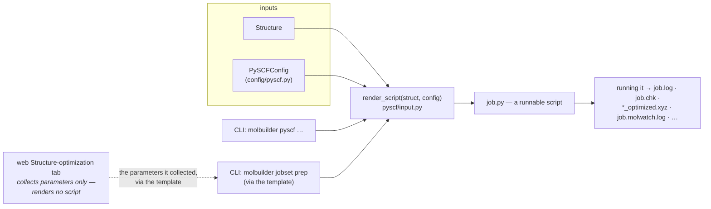
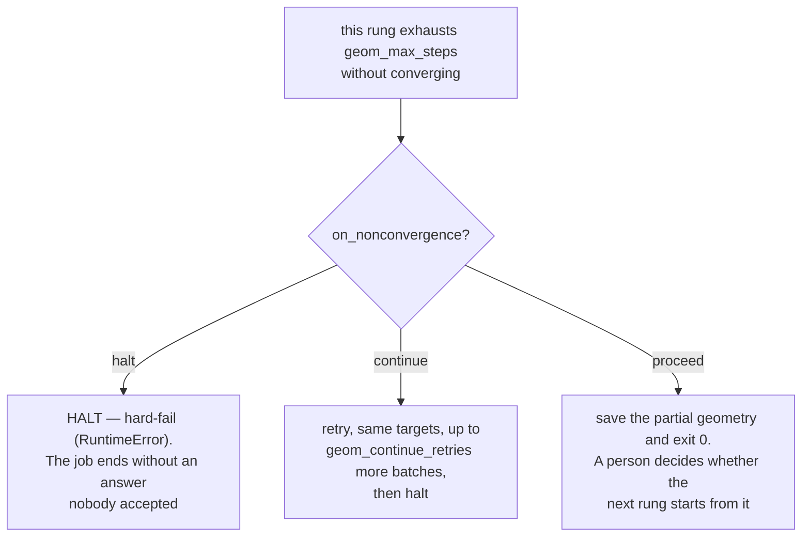

# The PySCF script emitter (+ publication-quality parameter guide)

**Role:** contract
**Domain:** engines
**Companions:** [`engines/overview.md`](?doc=engines/overview.md) (the shared
engine-emit contract); [`engines/siesta.md`](?doc=engines/siesta.md) (the SIESTA
equivalent); [`engines/tuning.md`](?doc=engines/tuning.md) (the cross-engine
convergence-tier framework — this doc is its PySCF-specific companion);
[`science/validation.md`](?doc=science/validation.md) (the preflight that gates
emission); [`model/chemistry.md`](?doc=model/chemistry.md) (charge / ECP resolution).

This is how molbuilder turns a `Structure` + a `PySCFConfig` into a **runnable
Python script**. Unlike SIESTA (a compiled binary reading an `.fdf`), PySCF is a
Python library, so the emitter writes a `.py` file you run directly — which lets
molbuilder put the whole staged-optimization loop *inside* the script. The one
entry point is `render_script(struct, config) -> str` (`pyscf/input.py`).

> **Vocabulary.** Cross-cutting terms (DFT, SCF, open/closed-shell, RKS/UKS, ECP)
> are in the [`science/overview.md` glossary](?doc=science/overview.md). Key PySCF
> names: **`gto.M(...)`** builds the molecule object (geometry + basis +
> charge/spin); **`mf`** is the mean-field SCF object from `scf.RKS(mol)` (carrying
> `mf.xc`, `mf.conv_tol`, `mf.kernel()`, …); **`conv_tol`** is the SCF energy
> self-consistency threshold (Ha); **`d3bj`** is the Grimme-D3(BJ) dispersion
> correction; **RI-J** is resolution-of-the-identity Coulomb fitting (a speedup).
> A few more: **basis set** = the functions used to represent each atom's electrons
> (bigger = more accurate, slower — e.g. `def2-SVP` < `def2-TZVP`); **functional**
> = the DFT recipe for exchange-correlation energy (e.g. B3LYP); **Ha** = Hartree
> (atomic energy unit, 1 Ha ≈ 27.2 eV) and **Bohr** the atomic length unit;
> **Hessian** = the matrix of energy 2nd-derivatives (source of vibrational
> frequencies); **single-point** = one energy at a fixed geometry (no optimization).

---

## 1. The two surfaces



- **Backend.** `render_script` returns the `.py` text; `convert(input_path,
  py_path, config)` reads an `.xyz`/`.pdb` and writes the script,
  returning `{"py", "n_atoms", "charge", "label"}`. Verbose comments are on by
  default so the script reads as documentation of its own choices. The CLI
  (`cmd_pyscf`, `cli.py`) writes the script from a structure file:

  ```bash
  # every config field is a flag (--basis, --functional, …), plus --ecp-atoms
  molbuilder pyscf input.xyz job.py --basis def2-TZVP
  ```

  **It writes ONE deck, and it has no ladder flags** — a ladder is N decks
  (§ 1.1a), declared in `task.json` and built by
  `jobset init --engine pyscf --stage-strategy …`, which is the one door
  either engine's ladder is authored through.

- **Frontend.** The Structure-optimization tab **collects parameters and
  produces no artifact**: `/api/build/schema/pyscf` renders its form **from the
  catalogue** (`_shared.catalogue_to_form_schema`, the same generator SIESTA's
  form uses), and `/api/build/preflight` validates live. A script comes from
  `prep`, or from the standalone `molbuilder pyscf` command above.

  > *(This bullet said both tabs post to `/api/build/pyscf` and that
  > **`PySCFConfig`'s field metadata drives the form**, until 2026-08-16.
  > Neither holds: no page calls that route today — script generation left the
  > tab on 2026-08-15 — and the form has been catalogue-driven since
  > ([`template.md`](?doc=engines/template.md) § 2.1, the config class is a
  > translator on the way out, not the source). **The Spectrum tab is the same
  > catalogue door since the spectra migration's P2**: its form comes from
  > `GET /api/build/schema/pyscf?calculation=vibration` — the vibration kind's
  > items beside the shared ones — and `SpectraConfig` no longer feeds any
  > form.)*

---

## 2. Output files

A successful run produces exactly these, in the launch directory (presence gated
by the config flag in column 2):

| file | enabled when | contents |
|---|---|---|
| `<job>_<NN>_<stage>.log` | `log_file` (default on) | the verbose PySCF log, one per rung (the token keeps two rungs in one folder from overwriting each other's) |
| `<job>.chk` | `chkfile` (default on) | PySCF checkpoint (density matrix, mol, energies) |
| `<job>_initial.xyz` | `save_initial_xyz` | the input geometry, snapshotted right after `gto.M(...)`, before any optimization |
| `<job>_optimized.xyz` | `save_optimized_xyz` AND `optimize` | the final relaxed geometry |
| `<job>_geom_<stage>_optim.xyz` | `optimize` + `write_trajectory` + `optimizer=="geometric"` | streaming per-stage trajectory (multi-frame XYZ, one frame per accepted step) |
| `<job>_geom_<stage>.log` | same | geomeTRIC's own per-stage log |
| `<job>_<NN>_<stage>.molwatch.log` | `write_molwatch_log` + `optimize` + geometric | the per-step trajectory log (§ 4), one per rung; the Results-tab inspector's single-file input |

The script's header `Outputs:` block lists **exactly** this set for the active
config — no under- or over-promising. `job_name` stays unsuffixed so
`.chk`/`.log`/`_optimized.xyz` transfer across stages.

> **This changed on 2026-08-18 and the code has caught up.** A PySCF
> ladder is N decks and N jobs, like SIESTA's
> ([`stages.md § 1.1a`](?doc=engines/stages.md)): each rung writes its own log
> under the deck's own token — `<label>_<NN>_<stage>.log` and
> `<label>_<NN>_<stage>.molwatch.log`
> ([`job-contracts.md § 6.3`](?doc=execution/job-contracts.md)) — and the two
> engines name their outputs the same way (`gto.M(output=…)` and the molwatch
> suffix both resolve through the one basename helper).
>
> Until 2026-08-18 this paragraph read: *"PySCF writes ONE unified log, and that
> is the difference from SIESTA. Its ladder runs inside a single process, so all
> stages append to one `<job>.molwatch.log` with no per-stage suffix. A per-stage
> name is only meaningful where a stage is a separate process."* The last sentence
> was right, and it is now true of both engines.
>
> **The stage token is a RENDER ARGUMENT, not a config field.**
> `spec_for(struct, config, *, stage_token=…)` carries it; the deck's log
> name and molwatch suffix resolve through the same
> `trajectory_log.format::molwatch_log_basename` helper SIESTA's emitter
> uses, so there is one rule and not two.
>
> *(A `cfg.stage` field held the token transitionally, and this note called
> it "a live catalogue item … safe to build on" until the U6 close — by
> then C7 (2026-08-18) had deleted the field as the last of the retired
> spellings, and neither `PySCFConfig` nor the catalogue carries a `stage`
> entry.  `archive/2026-09-01-roadmap.md` records the closure.)*

---

## 2a. GPU — `use_gpu`, and the run-time probe

> **The cross-engine rule is [`overview.md`](?doc=engines/overview.md) § 3a**
> (G-1…G-5). **This section is PySCF's mechanism**, and it had none written
> down until 2026-08-17 — which is why the GPU question kept being re-derived
> from SIESTA's contract, where the answers are different.

**`use_gpu` is a user flag, off by default** (G-1). Turning it on emits a probe
and a helper, not a hard requirement:

```python
USE_GPU = True                    # the literal config value
_USING_GPU = False
if USE_GPU:
    try:
        import cupy, gpu4pyscf    # present?
        ...                       # a device, with compute capability >= 7.0?
        _USING_GPU = True
    except ImportError as e:
        raise SystemExit(...)     # NO CPU FALLBACK -- the run stops
    except Exception as e:
        raise SystemExit(...)     # ditto: no device, or too old a card
mf = _mb_to_gpu_if_enabled(mf)    # .to_gpu(); a failed promotion also stops
```

**Three things follow, and each is a rule rather than an implementation note.**

**The probe runs at script start, not at `prep`, and it has to.** You prep on a
login node and run on a GPU node, so the device is not visible when the script
is written. SIESTA's check *can* happen at `prep` because what it needs is an
**environment**, which the prepping machine can see —
[`overview.md`](?doc=engines/overview.md) § 3a explains why that difference is
forced rather than chosen.

**There is no CPU fallback** *(user, 2026-08-17)*. All three failure paths —
`gpu4pyscf` not importable, no usable device, a failed `.to_gpu()` promotion —
**exit**, with a message naming the cause and the two ways out (run where the
GPU is, or set `use_gpu = false`). The script previously printed
*"CPU fallback."* and carried on; that made a GPU run and a CPU run
indistinguishable without reading the log, and it made a benchmark dishonest.

**What the run did is still recorded**, and now as a record rather than a
correction: `gpu_used`, `gpu_name`, `gpu_compute_capability` and `cuda_version`
go into `_RUNTIME_INFO`, so a summary reads what happened instead of inferring
it from what was asked.

**The helper is invoked AFTER the `mf` is fully assembled** — density fitting,
dispersion and PCM all applied — because `.to_gpu()` mirrors the object it is
handed. Promoting early hands it an incomplete one. `.newton()` is applied
*after* the promotion instead, since gpu4pyscf's own SCF classes carry it.

> **Benchmarking a PySCF GPU trial.** With the fallback gone, a trial that
> *completed* and asked for the GPU used one — so § 3a's G-5a is now about
> reading the record rather than catching a downgrade: report `gpu_used`,
> never the flag. A trial that could not get the GPU **fails**, and a failed
> trial is a missing point, which is visible; a silently-CPU trial was a wrong
> point, which was not.

> **The Raman block runs on the CPU even with the GPU on, and that is not a
> fallback.** gpu4pyscf exposes no analytic CPHF polarizability, so that one
> computation has no GPU implementation. § 3a's G-5 governs *availability* —
> whether the GPU you asked for is there — not *coverage*, which is which
> operations the engine can run on it.

## 3. The emitter's contracts

These are the invariants the generated script must satisfy — prefer **behavioural**
tests (run it, assert the log) over structural ones (a line appears).

**Logging.** All PySCF runtime output for one rung goes to that rung's own
`<job>_<NN>_<stage>.log`. `gto.M(..., output=…)` opens it once and the run keeps
that handle. A ladder is N jobs (§ 1.1a), so appending across rungs is not a
thing a script has to arrange — each writes its own file, exactly as SIESTA's
rungs do. **Forbidden in any generated script:**
(1) a *second* `gto.M(...)` after the initial build (it truncates the log; the
re-convergence at the relaxed geometry warm-starts via `mf.reset(mol_eq)`);
(2) `mol.build()` without
`dump_input=False`; (3) any reassignment of `mol.stdout`.

**Optimizer.** `optimizer="geometric"` (default) needs the `geometric` package,
`"berny"` needs `pyberny`; both are imported inside a `try/except ImportError` that
raises `SystemExit` with an actionable `pip install …` message, not a traceback.
`optimize=False` → a single-point `mf.kernel()`, no trajectory files. **`berny` works
only for single-stage runs** — it doesn't accept the per-stage `convergence_drms` /
`convergence_dmax` kwargs the staged-opt loop (§ 5) emits, so use `geometric` for any
multi-stage ladder.

**Non-convergence policy.** A deck carries one rung's policy —
`on_nonconvergence` ∈ {`proceed`, `continue`, `halt`} (default `halt`) — deciding
what happens when it hits `geom_max_steps` without converging:

- **`proceed`** → take the partial geometry (geomeTRIC's
  `assert_convergence=False`). The loose rung's default; a warm-up is meant to be
  rough.
- **`halt`** → hard-fail with geomeTRIC's diagnostic (`assert_convergence=True`).
- **`continue`** → extend this rung for up to `geom_continue_retries` more
  `geom_max_steps` batches (total budget = `geom_max_steps × (1 +
  geom_continue_retries)`), then halt.

**There is no last-rung override.** A deck is one rung and cannot see the others,
so nothing can force the final one to `halt` from inside a script. SIESTA has
never had such an override; the setting the user gave stands, for both engines.



**The rung's own setting decides, and nothing overrides it.** A deck is one
rung and cannot see the others, so there is no *"is this the last one?"*
branch to take — and none is wanted: **stages are run by hand, one at a time,
and a person reads each result before starting the next** *(user, 2026-08-18)*.
The guarantee a last-rung force-halt used to provide was a property of the
one-process loop, where nobody looked in between.

*Budget example:* a `continue` stage with `max_steps=200` and `continue_retries=2`
runs up to `200 × (1 + 2) = 600` steps before it finally halts.

**Spin / method.** (`cfg.spin` here is 2S = the number of unpaired electrons, *not*
the multiplicity 2S+1.) `render_script` raises `ValueError` at generation time only for an
**unknown** method.  A **restricted** method (`RKS`/`RHF`, which assume
`mol.spin == 0`, i.e. closed-shell) with `cfg.spin != 0` is refused by the
GATE as an error-severity preflight finding at `config.method`
(`validation/pyscf.py`, G-1c 2026-08-21) — a named issue, not a stack
trace, and the message points at `UKS`/`UHF`.  The shared electron-count
parity rule and the open-shell-metal check
([`science/validation.md`](?doc=science/validation.md)) run in the same
gate; a negative spin is a separate error.

**Charge.** The `gto.M(...)` charge matches `_resolve_charge(struct, cfg)`
(`input.py`): `cfg.charge` wins if set (including `0`); otherwise
`formal_charge_from_phosphates(struct)` (phosphate heuristic — charged side chains
Asp/Glu/Lys/Arg/His are **not** counted, override via `cfg.charge`).

**ECP — two plain fields, and nothing is chosen for you.** `cfg.ecp` names the
potential (`"lanl2dz"`); `cfg.ecp_atoms` names which elements get it, as element
patterns:

| `ecp_atoms` | selects |
|---|---|
| `[]` | nothing — **no ECP** |
| `["*"]` | every element present in the structure |
| `["Au"]` | that element |
| `["A*"]` | every symbol beginning with `A` |
| `["Au", "Pt"]` | both |

`_resolve_ecp` (`input.py` → `chemistry.resolve_pyscf_ecp`) matches the
patterns against the structure's own elements and returns `{element: ecp}`, or
`None` when either half is empty. **Empty means empty** — it never means *pick
one for me*.

> **Rewritten 2026-08-13.** The field was `str | dict | None` where `""`,
> `"none"` and `None` meant three different things, and `None` silently added
> `lanl2dz` whenever any element had **Z > 36** and the basis was not `def2-*`.
> That heuristic is gone: *"there is no point to limit matching to heavy — who
> defines heavy? there is no clear reasoning or standard … explicit is better
> than implicit."* The `def2` special case went with it, so an ECP you name on a
> `def2` basis is now **emitted** rather than silently discarded.
>
> `validation` still **hints** when a structure looks like it wants an ECP and
> none is declared — a hint a person confirms, not a choice the generator makes.

---

## 4. The unified molwatch-log format

`<job>.molwatch.log` is the engine-agnostic per-step trajectory log — **this is the
format spec [`engines/siesta.md`](?doc=engines/siesta.md) § 9 points to** (SIESTA
writes the same format, distinguished by the `# engine:` header). It's **additive**:
`molwatch_log=False` only suppresses this file, nothing else changes. Emitted by
the inlined `MolwatchEmitter` (`_emit_molwatch_emitter`, `pyscf/input.py`).

Each opt step is one **marker-delimited** block — the parser locates markers by
prefix, so there's no column-width fragility:

```text
# molwatch trajectory log v1
# generator: molbuilder/pyscf_input
# engine: pyscf
# job: <job_name>
# units: energy=eV, force=eV/Ang, coords=Ang
# created: <ISO8601 local timestamp>
# runtime.<key>: <value>                 # optional, repeated (threads, gpu, host, ...)
# convergence.<key>: <value>             # optional, repeated -- the stage's targets

==== molwatch step 0 begin ====          # step 0 = the initial-state PREVIEW
kind: initial_preview
step_index: 0
n_atoms:    <K>
coordinates (Ang):
   <element>  <x>  <y>  <z>
energy (eV): None
forces (eV/Ang):
max_force (eV/Ang): None
wall_time: <unix epoch seconds>
scf_history begin
scf_history end                          # empty on step 0 (no header line)
==== molwatch step 0 end ====
```

A **real** opt step (index ≥ 1) carries an energy/forces/max_force value and an
`scf_history` block with a header + one row per SCF cycle:
`#  cycle   energy(eV)   delta_E(eV)   gnorm(eV/Ang)   ddm   wall_time(s)`.

- **`wall_time` is an absolute Unix epoch**, both on the step line and in the
  6th SCF column — the emitter stamps its own `time.time()`. The name is this
  file format's and does not change; the reader surfaces it under the name that
  states which clock it is, `wall_clock_s`, because a SIESTA `.out` puts an
  *elapsed* count in the same conceptual slot and the two must not be confused
  ([`model/parse.md § 2a`](?doc=model/parse.md)). A PySCF log therefore supports
  "last result at 14:32" where a SIESTA one cannot, and says so with a null
  rather than a plausible wrong number.

- **Units are converted at write time** so the parser does zero conversion:
  coordinates Å, energy eV (Ha × 27.211386245988), forces/gradient-norm eV/Å
  (Ha/Bohr × 51.42208619).
- **Step 0 is the initial-state preview** (coordinates only, `energy: None`) written
  *at emitter instantiation*, before the first SCF — so the Results tab renders the
  molecule immediately instead of waiting tens of seconds for the first (slowest)
  SCF. Real opt steps start at step 1.
- **Live-tail safe:** a `begin` with no matching `end` is the in-flight step and is
  dropped on parse; the emitter `flush()`es after each `end` marker so the last
  complete byte is always a step boundary.
- **Hook-wired, not monkey-patched:** `mf.callback` (per SCF cycle) + `optimize(…,
  callback=…)` (per accepted opt step) — both documented PySCF/geomeTRIC extension
  points.
- **The convergence-header key grammar**: flat `convergence.<leaf>` for an
  unstaged run, nested `convergence.<token>.<leaf>` for a staged one — and the
  `<token>` is the stage's artifact token, **digit-first**
  (`01_coarse`, [`job-contracts.md` § 6.3](?doc=execution/job-contracts.md)),
  never an identifier-shaped `stageN`. One reader owns the grammar
  (`parse/engines/molwatch.py::parse_convergence_line`); the two readers that
  spelled it privately both assumed letter-first identifiers and silently
  dropped every staged header (found 2026-08-19).
- **The footer** is the run's conclusion: `# concluded: <stamp>` on a clean
  end, `# error: <message>` on a failure — the engine-neutral end-of-run
  marker `jobset status` and the Results page read
  ([`running-a-job.md` § 4](?doc=execution/running-a-job.md)).

---

## 5. A ladder is N decks and N jobs

**PySCF runs a ladder exactly as SIESTA does** ([`stages.md`
§ 1.1a](?doc=engines/stages.md)): the ladder is declared once in `task.json`,
`prep` renders one deck per rung, and each rung is its own job. There is no
in-script loop over stages, and no stage list in the engine config.

- **Where a rung's numbers come from.** `task.json`'s `Stage.overrides`, on the
  shared schema — `scf_conv_tol`, the five geomeTRIC criteria `geom_gmax` /
  `geom_grms` / `geom_dmax` / `geom_drms` / `geom_etol` (**g** = gradient/force,
  **d** = displacement/step; **max**/**rms** = per-atom peak vs root-mean-square;
  **etol** = energy), and `geom_max_steps`. The per-tier values are
  [`tuning.md` § 2.4](?doc=engines/tuning.md)'s table, and that table is the
  authority for them.
- **The shipped ladder** is `pyscf/stages.py::default_pyscf_stages`, whose rungs
  carry the shared stage names `coarse` / `medium` / `tight` — the same three
  SIESTA uses, because a stage name says which rung of *this* ladder it is and
  nothing about which engine is running it.
- **What a rung hands the next one** is the converged geometry
  (`<JOB>_optimized.xyz`) and the converged density (`<JOB>.chk`), copied at
  `prep` when the next rung's `restart` says `continue` — the same pair SIESTA
  carries as `.XV` and `.DM`, declared in
  [`job-contracts.md` § 4.2a](?doc=execution/job-contracts.md)'s warm-file rules.
- **What a deck decides on its own** is one rung's non-convergence policy:
  `on_nonconvergence` ∈ {`proceed`, `continue`, `halt`} with
  `geom_continue_retries` for the middle one. A deck cannot see the other rungs,
  so there is no "force the last one to halt" override — SIESTA has never had
  one either, and the user's setting stands.

**Why not keep the in-script loop.** A ladder exists so somebody looks between
the rungs, and looking requires a rung to have *ended*. Everything the workflow
offers between stages — open the next attempt, name the run it continues from,
read what happened, redo one rung with different numbers — is per-job machinery
that a single process running every rung can reach none of.

---

## 6. Publication-quality parameters

The **current generator defaults are screening-tier**: `def2-SVP` basis, `B3LYP`
functional, **`d3bj` dispersion on** (`config/pyscf.py,484,525`) — i.e.
B3LYP-D3(BJ)/def2-SVP. That's fine for a first pass; for a defensible paper on a
simple organic molecule (10–60 atoms), the one change that matters is the basis:

```python
mol = gto.M(..., basis="def2-TZVP")                # was def2-SVP — THE key upgrade
mf  = scf.RKS(mol).density_fit()                   # what molbuilder emits (auxbasis auto-picked);
                                                   # PySCF selects the basis-matched JK set
                                                   # (def2-tzvp-jkfit for def2-TZVP) — fits BOTH
                                                   # Coulomb + exact exchange, 5–10× faster
mf.xc   = "b3lyp"
mf.disp = "d3bj"          # Grimme-D3(BJ). Use the SPLIT form (mf.xc + mf.disp):
                          # PySCF 2.13's parse_dft() rejects the merged "b3lyp-d3(bj)"
                          # (parens); "b3lyp-d3bj" (no parens) also works.
```

Convergence thresholds in the shipped script are already Gaussian-OPT defaults —
what reviewers expect. The **tier framework** (shared with SIESTA — see `tuning.md`):

| Knob | Publishable (`GAU`) | Tight — shipped stage-3 | Very-tight — `GAU_TIGHT` |
|---|---|---|---|
| `convergence_gmax` (Ha/Bohr) | **4.5e-4** (≈ 0.023 eV/Å) | 2.0e-4 (≈ 0.01 eV/Å) | 1.5e-5 |
| `convergence_grms` (Ha/Bohr) | 3.0e-4 | 1.0e-4 | 1.0e-5 |
| `convergence_dmax` / `drms` (**Å**) | 1.8e-3 / 1.2e-3 | 1.0e-3 / 5.0e-4 | 6.0e-5 / 4.0e-5 |
| `convergence_energy` (Ha) | 1e-6 | 1e-6 | 1e-6 |
| `mf.conv_tol` (Ha) | 1e-9 | 1e-10 | 1e-10 |

*(`dmax`/`drms` are in **Å**, gradients in Ha/Bohr — verified vs `geometric/params.py`.
Tier names match `tuning.md` § 2.4: the **shipped stage-3 default is the crystal-safe
Tight** (`gmax 2e-4`, ≈ VASP `EDIFFG=-0.01`); **very-tight** is geomeTRIC's `GAU_TIGHT`,
opt-in for molecule vib/IR/NEB. For reaction kinetics, geomeTRIC's even-tighter
`GAU_VERYTIGHT` preset (`gmax 2e-6`) is available via `convergence_set='GAU_VERYTIGHT'`.)*

**Basis / functional** (the exact strings PySCF accepts — in a paper you write the
conventional form, e.g. "B3LYP-D3(BJ)", "ωB97M-V"):

- Basis: `def2-SVP` (screening) → **`def2-TZVP`** (the floor for credible organic
  work) → `def2-TZVPP`/`def2-QZVP` (high-accuracy single points). `def2-TZVP` has
  built-in ECPs up to Rn.
- Functional: `b3lyp` + `d3bj` (the most-cited combo); `wb97m-v` for
  charge-transfer / π-stacked systems (**not** `wb97x-d` — PySCF 2.13 blacklists it,
  raising `NotImplementedError`; `wb97m-v`/`wb97x-v` ship dispersion internally, no
  separate `mf.disp`); `pbe0`, `m06-2x`, `r²scan`+`d3bj` are alternatives. Plain
  `b3lyp` with no dispersion is no longer publishable above ~10 atoms (the
  dispersion-importance basis is the Grimme D3(BJ) work cited below).

**Methods-section template** (paste-and-edit for a paper):

> Geometry optimizations were carried out at the **B3LYP-D3(BJ)/def2-TZVP** level of
> theory using PySCF [1] with the geomeTRIC optimizer [2]. Gaussian's default
> convergence criteria were applied (gmax = 4.5 × 10⁻⁴ Ha/Bohr, grms = 3.0 × 10⁻⁴
> Ha/Bohr, ΔE = 1 × 10⁻⁶ Ha). The SCF threshold was 1 × 10⁻⁹ Ha.
> Resolution-of-the-identity fitting [3] with the matching def2-*-jkfit auxiliary basis
> (def2-tzvp-jkfit for def2-TZVP) was applied to the Coulomb and exact-exchange builds.

Citations to include: **[1]** Sun et al., *JCP* **153**, 024109 (2020); **[2]** Wang
& Song, *JCP* **144**, 214108 (2016); **[3]** Weigend, *J. Comput. Chem.* **29**, 167 (2008);
B3LYP — Becke, *JCP* **98**, 5648 (1993) + Lee-Yang-Parr, *PRB* **37**, 785 (1988);
D3(BJ) — Grimme et al., *J. Comp. Chem.* **32**, 1456 (2011); def2-TZVP — Weigend &
Ahlrichs, *PCCP* **7**, 3297 (2005); ωB97X-V (if used) — Mardirossian &
Head-Gordon, *PCCP* **16**, 9904 (2014); ωB97M-V (if used) — Mardirossian &
Head-Gordon, *JCP* **144**, 214110 (2016).

---

## 7. SCF convergence, and what to do when it fights you

This section is here so you can **overrule the emitter on purpose**. Everything
below is a hint about how the machinery behaves — the chemistry call is yours.

### 7.1 "Converged" is two tests, not one

PySCF stops the SCF when **both** of these hold:

| Test | What it measures | PySCF knob | molbuilder field |
|---|---|---|---|
| energy change | how much the total energy moved on the last cycle | `mf.conv_tol` | `scf_conv_tol` (default `1e-9` Ha) |
| orbital gradient | how far the orbitals still are from stationary | `mf.conv_tol_grad` | `scf_conv_tol_grad` (default `0` → PySCF derives it) |

When you leave `conv_tol_grad` unset, PySCF derives it — `scf/hf.py`, verified
against the installed 2.13.0 source:

```python
if conv_tol_grad is None:
    conv_tol_grad = numpy.sqrt(conv_tol)
```

So the shipped `1e-9` energy tolerance yields **≈3.2e-5** for the gradient.

That matters because **the forces come from the gradient, not from the energy.**
Tighten `scf_conv_tol` from `1e-9` to `1e-10` and the gradient criterion moves
only from 3.2e-5 to 1.0e-5 — a square root of the effort you thought you spent.
If a geometry optimization keeps taking small noisy steps near the end, set
`scf_conv_tol_grad` directly (`1e-6`, `1e-7`) instead of chasing `conv_tol`.

The script states which of the two you got, every run:

```
[molbuilder] SCF convergence: energy 1.0e-09 Hartree, orbital gradient 3.2e-05
             (derived: sqrt(conv_tol)); solver DFUKS.
```

`derived: sqrt(conv_tol)` vs `explicit` is the difference between *PySCF picked
this* and *you picked this*, and both also land in `_RUNTIME_INFO`.

### 7.2 The escalation order when the SCF won't converge

Work down this list; each rung costs more than the one above it.

1. **DIIS** (the default). PySCF extrapolates from previous Fock matrices.
   Fast, and right for the large majority of closed-shell organics.
2. **Bigger DIIS subspace** — `diis_space` 12–20. Try this first when the SCF
   *oscillates* between two energies rather than drifting.
3. **Level shift** — `level_shift` 0.1–0.3 Ha. Pushes empty orbitals up in
   energy so the occupied set stops trading places with them cycle to cycle.
   The classic fix for a small or unphysical HOMO–LUMO gap. It **changes the
   converged answer** unless you finish with it back at 0.
4. **Damping** — `damp` 0.3–0.5. Mixes in the previous density to stop
   overshooting. Same caveat: taper it off.
5. **SOSCF** — `scf_soscf = True`, emitting `mf.newton()`. Instead of
   extrapolating, this solves for the orbital rotation directly
   (Newton–Raphson). It converges cases where DIIS oscillates indefinitely —
   open-shell metals, near-degenerate frontier orbitals — at the price of more
   time and memory per iteration.

Two things change under SOSCF, and neither is a fault:

- `mf.max_cycle` now counts **macro** iterations, each running many
  micro-iterations. The same number buys far more work than it did under DIIS.
- `diis_space` and `damp` stop applying — the Newton solver doesn't use them.
  Its own damping knob is `mf.ah_level_shift` (default 0).

### 7.3 What an SCF "instability" actually is

An SCF finds *a* stationary solution. It does not promise the **lowest** one.

Concretely: converge a stretched O₂ triplet and the SCF may settle on a
symmetric solution where both oxygens carry identical spin density. Every
convergence test passes. The energy looks fine. But a lower-energy solution
exists in which the symmetry is broken — and that one is the physical answer.
The SCF simply never looked in that direction.

This is why `mf.stability()` exists: it asks whether a small orbital rotation
would *lower* the energy. If yes, it hands back a better set of orbitals.

**What a wrong answer looks like.** Nothing in the output says "wrong". You get
a converged energy, a completed optimization, and a frequency calculation — all
computed on the wrong electronic state. The tell is usually indirect: an energy
that disagrees with literature by a few kcal/mol, a spin contamination value
that looks off, or imaginary frequencies at a geometry that should be a minimum.

**What molbuilder does about it.** For open-shell runs (UHF/UKS) the script
converges the SCF, calls `mf.stability()`, and if better orbitals come back
re-converges from them — up to **3 restarts**
(`_STABILITY_MAX_RESTARTS`). A restart counts as a repair only if the energy
**falls** by more than **1e-8 Ha** (`_STABILITY_ENERGY_TOL`), which is far below
chemical significance (1 kcal/mol = 1.6e-3 Ha) and comfortably above SCF noise.

This runs **before** any geometry work, because optimizing on the wrong state
and finding out afterwards helps nobody. Closed-shell runs are not checked: a
restricted→unrestricted instability is a singlet-versus-triplet question you
would have asked deliberately.

**Why the energy and not the orbitals.** Comparing orbital *coefficients* to
decide "did this change" looks obvious and is wrong. A degenerate shell — O₂'s
π pair, any symmetric radical — can be rotated freely within its degenerate
space, so `stability()` returns numerically different coefficients for a
physically identical state, for ever. Measured on O₂ triplet UHF/STO-3G: round 1
genuinely repairs (ΔE = −1.5e-3 Ha), then rounds 2 and 3 return ΔE = +3.6e-10
and +1.6e-9 — no improvement, yet a coefficient test called all three unstable
and ended the run with a false warning.

### 7.4 Reading the outcome

"Ran and found nothing" must never read the same as "never ran", so the script
prints exactly one verdict line — quoted here verbatim from the emitter:

| Line | Meaning |
|---|---|
| `stability: CHECKED, stable on the first SCF (no restart needed).` | checked; already the best solution found |
| `stability: CHECKED, reached a stable solution after N restart(s).` | checked; was broken, repaired — use this result |
| `stability: WARNING -- still internally unstable after 3 restarts.` | checked; **not** repaired — everything below it is suspect |
| `stability: NOT CHECKED. The energy below has not been tested for a broken-symmetry solution.` | no claim either way |
| `stability: NOT CHECKED -- this method does not implement it (<error>)` | the method has no `stability()`; printed alongside the line above |

A closed-shell (RHF/RKS) run emits no stability block at all — see § 7.3 for why.

A run that exhausts its restarts **warns and continues**. A hint does not end
your run — but do not publish that geometry without looking at it.

---

## 7a. Every SCF is dressed by the one door *(contract, 2026-08-21)*

**The rule this section exists to state: the framework never spells an SCF
knob twice.**  It was written before the code that satisfies it (the user's
process ruling: contract first, code checked against it), after the
measurement that found the vibration deck showing nine SCF-machinery
parameters it never read.

**The layers, and who owns what:**

| layer | owner | what lives there |
|---|---|---|
| the data | the catalogue (+ `refs` citations) → `PySCFConfig` fields | which knobs exist, their defaults, ranges, hints, references |
| the membership | `layout.SCF_SECTION` | WHICH items are "the SCF machinery": today `scf_conv_tol`, `scf_conv_tol_grad`, `scf_max_cycle`, `scf_init_guess`, `level_shift`, `diis_space`, `damp`.  A knob joins the set HERE and nowhere else |
| the spelling | `layout.line` | HOW PySCF spells each item (`auxbasis` deliberately rides `density_fit`'s spelling as its argument — one knob whose line carries a second fact; a multi-site deck reaches the same ride through the emitted `_MB_DF_KW` dict, generated beside the dresser, so both of its `density_fit` calls carry the argument from one home) |
| the applier | this section's rule | WHERE the spellings are applied to an `mf` |

**The applier rule.**  A deck that constructs ONE `mf` (the optimization
deck) applies the section inline at that site through the Sections
machinery, exactly as it does today.  A deck that constructs MANY — the
vibration deck builds an equilibrium `mf`, a displaced-point `mf` per
finite-difference point, and a relaxation `mf` — **emits one function,
`_mb_configure_scf(mf)`, whose body is generated from `SCF_SECTION` +
`layout.line`, and every construction calls it.**  One definition per deck,
N call sites; the body's generator is one shared home
(`pyscf/scf_setup.py`), so the two decks' spellings cannot fork.  A future
kind with many `mf`s inherits the same function by calling the same
generator.  **The DFT trio has its symmetric dresser since 2026-08-21
(M1.2)**: `_mb_configure_dft(mf)`, generated from `DFT_SECTION` +
`layout.line` (minus `density_fit`, which rebinds `mf` and is per-site
conditional — the Raman polarizability path forces non-DF), so the
functional / grid / dispersion spellings cannot fork either; on an HF deck
it is an explicit pass-through and call sites stay uniform.

**The role table** — what each construction site adds ON TOP of
`_mb_configure_scf(mf)`, and why it is site-specific rather than shared:

| site | on top of the dresser | why |
|---|---|---|
| optimization `mf` | chkfile + continuation read; GPU promotion; `newton()` wrap; `on_nonconvergence` per config | as today (§ 7) |
| vibration equilibrium | chkfile WRITE; GPU promotion; `newton()` wrap; halts UNCONDITIONALLY on non-convergence — `on_nonconvergence` is the RELAXATION phase's policy (proceed / continue / halt on geomeTRIC, per its own help text), not an SCF one; a mis-wiring that read it at this site lived for part of 2026-08-21 and this row is its correction | the equilibrium density feeds the Hessian, every intensity and the thermochemistry — no policy makes it optional |
| vibration displaced point | `scf_init_guess` applies in full (measured 2026-08-21: the lifted code does NOT seed from the equilibrium density — `kernel()` is called bare; `dm0` seeding is a recorded future improvement, not a present fact); **no** chkfile (one file per point is churn); a failed point always halts | a silently-unconverged point poisons one Hessian column; frequencies from it are not frequencies |
| vibration relaxation | GPU promotion; `newton()` wrap; frozen atoms ride a geomeTRIC `$freeze` constraints file exactly as on the optimization deck (frozen means frozen through every phase — user ruling 2026-08-21); the `on_nonconvergence` policy applies HERE (proceed = `assert_convergence=False`, recorded as `converged: null` + a warning in the artifact; continue = the optimization deck's retry budget; halt = raise) | the policy's own help text names geomeTRIC's criteria — this is the phase it governs |

**The gate that keeps this true**: the honesty test (every parameter the
vibration form shows is read by the vibration render, or refused by name
by the kind validator) and the catalogue-refs test (every citation a knob
carries resolves in `docs/science/references.bib`).

## 8. Cross-engine equivalence & versioning

**SIESTA ↔ PySCF.** PySCF/geomeTRIC is **stricter overall** at a given tier, for
a reason that is about the *number of criteria* rather than their values:
geomeTRIC requires **all five** (energy + rms/max gradient + rms/max step, the
Gaussian OPT convention) to be met, while SIESTA checks **max force** only. So a
PySCF "converged" structure generally stops later than a SIESTA one.

> ⚠ **But the max-force thresholds themselves do not line up, and at the loose
> tier PySCF is the *looser* of the two** *(measured 2026-08-11)*. Converted at
> 1 Ha/Bohr = 51.42 eV/Å: loose is **0.103 vs SIESTA's 0.05** — twice as
> permissive; publishable is **0.023 vs 0.04** — 1.7× stricter; tight lands on
> **0.0103 vs 0.01**, the same number. **The ladders cross over.** The full
> table, and what to ask for when porting a calculation between the engines, is
> [`tuning.md § 3.0`](?doc=engines/tuning.md) — which is where this paragraph
> claimed the mapping lived before it existed.

**Versioning.** A change to this contract is at least a minor bump; removing or
renaming a promised output file is a **major** bump. Purely additive changes (a new
optional field or output) are minor.

**Tests:** `tests/test_pyscf.py` — behavioural assertions over the generated script
(output-file set, the one-`optimize()`-call shape, unknown-method
`ValueError`, molwatch blocks; the in-script stage loop retired with
§ 1.1a, and the spin refusal is the gate's, pinned in `tests/validation/`).
