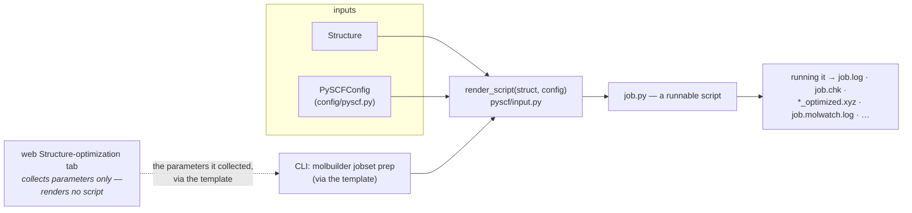
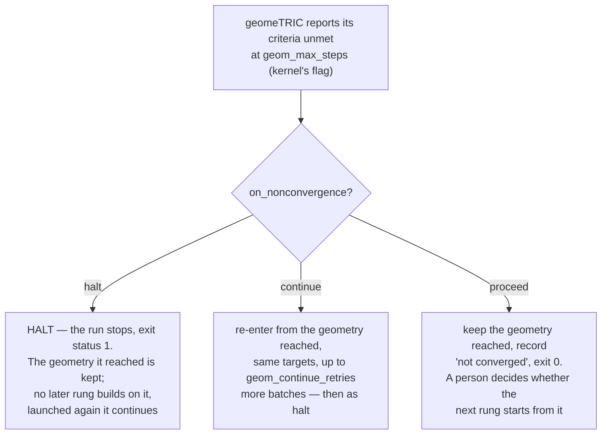

# The PySCF script emitter (+ publication-quality parameter guide)

**Role:** contract
**Domain:** engines
**Companions:** [`engines/overview.md`](?doc=engines/overview.md) (the shared
engine-emit contract); [`engines/siesta.md`](?doc=engines/siesta.md) (the SIESTA
equivalent); [`engines/tuning.md`](?doc=engines/tuning.md) (the cross-engine
convergence-tier framework — this doc is its PySCF-specific companion);
[`science/validation.md`](?doc=science/validation.md) (the preflight that gates
emission); [`model/chemistry.md`](?doc=model/chemistry.md) (charge / ECP resolution).

This is how molbuilder turns a `Structure` + a `PySCFConfig` into a **runnable
Python script**. Unlike SIESTA (a compiled binary reading an `.fdf`), PySCF is a
Python library, so the emitter writes a `.py` file you run directly — which lets
molbuilder put the whole staged-optimization loop *inside* the script. The one
entry point is `render_script(struct, config) -> str` (`pyscf/input.py`).

> **Vocabulary.** Cross-cutting terms (DFT, SCF, open/closed-shell, RKS/UKS, ECP)
> are in the [`science/overview.md` glossary](?doc=science/overview.md). Key PySCF
> names: **`gto.M(...)`** builds the molecule object (geometry + basis +
> charge/spin); **`mf`** is the mean-field SCF object — `dft.RKS(mol)`, `dft.UKS(mol)`,
`scf.ROHF(mol)`, …, the class composed from the method and the spin treatment (carrying
> `mf.xc`, `mf.conv_tol`, `mf.kernel()`, …); **`conv_tol`** is the SCF energy
> self-consistency threshold (Ha); **`d3bj`** is the Grimme-D3(BJ) dispersion
> correction; **RI-J** is resolution-of-the-identity Coulomb fitting (a speedup).
> A few more: **basis set** = the functions used to represent each atom's electrons
> (bigger = more accurate, slower — e.g. `def2-SVP` < `def2-TZVP`); **functional**
> = the DFT recipe for exchange-correlation energy (e.g. B3LYP); **Ha** = Hartree
> (atomic energy unit, 1 Ha ≈ 27.2 eV) and **Bohr** the atomic length unit;
> **Hessian** = the matrix of energy 2nd-derivatives (source of vibrational
> frequencies); **single-point** = one energy at a fixed geometry (no optimization).

---

## 1. The two surfaces


```mermaid
flowchart LR
    subgraph IN["inputs"]
        S["Structure"]
        C["PySCFConfig<br/>(config/pyscf.py)"]
    end
    PREP["CLI: molbuilder jobset prep<br/>(via the template)"]
    WEB["web Structure-optimization tab<br/><i>collects parameters only —<br/>renders no script</i>"]
    R["render_script(struct, config)<br/>pyscf/input.py"]
    PY["job.py — a runnable script"]
    RUN["running it → job.log · job.chk ·<br/>*_optimized.xyz · job.molwatch.log · …"]
    S --> R
    C --> R
    PREP --> R
    WEB -.->|"the parameters it collected,<br/>via the template"| PREP
    R --> PY --> RUN
```


> **The vibration kind** — the second deck this emitter renders
> (`spec_for(…, calculation="vibration")`, composed by
> `pyscf/vibration_deck.py`) — is specified phase by phase in
> [`engines/vibration.md`](?doc=engines/vibration.md) § 4; § 7a below is
> the one rule of this document that deck depends on.

> **`molbuilder pyscf` and `convert()` are both DELETED (2026-09-17).**
> `convert()` was the single-shot "read a structure file, write a deck" worker;
> `cmd_pyscf` was its command line. **No engine has a verb** — the ruling is
> `conventions.md` § 3, decisions 7 and 34 (*"everything is a job set… a second
> way in is a second way to lose your results"*, and *"there is no `molbuilder
> fdf`"*), and this was `fdf`'s surviving twin: a structure plus every engine
> field as a flag → a finished deck, skipping the description. `cli.py` had
> claimed an exemption — *"`pyscf` keeps its own only because its ladder runs
> inside one emitted script"* — and refuted it two comments later: *"THIS
> COMMAND WRITES ONE DECK, AND A LADDER IS N DECKS."*
>
> A deck is written by `jobset prep` from a description — `spec_for` →
> `prepare_deck`, the same three steps with the description in front of them
> instead of a command line; `prep.py:651` already builds a full `EngineSeam`
> for PySCF, so nothing had to be built to replace the verb.
> **`render_script` stays**: it is a thin call over `spec_for` and it is this
> emitter's public surface, named as such by this contract. *(It stays for that
> reason and not because 43 test files call it — a test never justifies code.)*

- **Backend.** `render_script(struct, config)` returns the `.py` text, and
  that is the whole public surface. Verbose comments are on by default so the
  script reads as documentation of its own choices. A deck reaches disk one
  way — `jobset prep`, which calls `spec_for` → `prepare_deck` on the machine
  that will run it:

  ```bash
  molbuilder jobset init --engine pyscf --stage-strategy single-point
  molbuilder jobset prep <job-set-dir>
  ```

  **A ladder is N decks** (§ 1.1a), declared in `task.json` and built by
  `jobset init --engine pyscf --stage-strategy …`, which is the one door
  either engine's ladder is authored through. *(`--stage-strategy` was taken
  off the deleted `pyscf` verb on 2026-08-18 for exactly this reason, which
  was the first half of the argument that finished it.)*

- **Frontend.** The Structure-optimization tab **collects parameters and
  produces no artifact**: `/api/build/schema/pyscf` renders its form **from the
  catalogue** (`_shared.catalogue_to_form_schema`, the same generator SIESTA's
  form uses), and `/api/build/preflight` validates live. A script comes from
  `prep` — there is no second producer, and since 2026-09-17 no second door.

  > *(This bullet said both tabs post to `/api/build/pyscf` and that
  > **`PySCFConfig`'s field metadata drives the form**, until 2026-08-16.
  > Neither holds: no page calls that route today — script generation left the
  > tab on 2026-08-15 — and the form has been catalogue-driven since
  > ([`template.md`](?doc=engines/template.md) § 2.1, the config class is a
  > translator on the way out, not the source). **The Spectrum tab is the same
  > catalogue door since the spectra migration's P2**: its form comes from
  > `GET /api/build/schema/pyscf?calculation=vibration` — the vibration kind's
  > items beside the shared ones — and `SpectraConfig` no longer feeds any
  > form.)*

---

## 2. Output files

A successful run produces exactly these, in the launch directory (presence gated
by the config flag in column 2):

| file | enabled when | contents |
|---|---|---|
| `<job>_<NN>_<stage>.log` | `log_file` (default on) | the verbose PySCF log, one per rung (the token keeps two rungs in one folder from overwriting each other's) |
| `<job>.chk` | `chkfile` (default on) | PySCF checkpoint (density matrix, mol, energies) |
| `<job>_initial.xyz` | `save_initial_xyz` | the input geometry, snapshotted right after `gto.M(...)`, before any optimization — in the engine's frame, as a pair carrying no run record of the input's either: its coordinates are the engine's, so the input's record's fingerprint does not describe them |
| `<job>_optimized.xyz` | `save_optimized_xyz` AND `optimize` | the final relaxed geometry, as a pair — its `.molstruct.json` carries the structure's own facts (cell, kinds, regions, the engine's origin 0) and **no run record of the input's**: `info.relaxation` and `info.calculation` describe the run the input came out of, not this one, so they stay behind; this run's relaxation record (`info.relaxation`) is read from its own output by the one reader when the run is exported from the Results tab ([`model/parse.md`](?doc=model/parse.md) § 5b) — the deck writes no copy of it (V1.31, closed 2026-09-29: one reader, one record). **Its level of theory is recorded by no door yet**: `info.calculation` (the charge, spin, basis and functional a run carried) is read from a SIESTA deck only (`parse.contract.contract_of`), so neither this pair nor the Results tab's export of a PySCF run carries one, and a later calculation with a blank charge or spin works them out from the structure (`science/chemistry-correctness.md` § 2a) — state them when the molecule is charged or open-shell. The PySCF half of that reader is planned ([`plan.md`](?doc=plans/plan.md) § 5w K18). *(They were copied onto every pair until 2026-09-29, so a PySCF-relaxed geometry carried a SIESTA run's tolerance, force and level of theory — the M11 review, PS-C10.)* |
| `<job>_<stage>_geom_optim.xyz` | `optimize` + `write_trajectory` | streaming per-stage trajectory (multi-frame XYZ, one frame per accepted step) |
| `<job>_<stage>_geom.log` | same | geomeTRIC's own per-stage log |
| `<job>_<NN>_<stage>.molwatch.log` | `write_molwatch_log` + `optimize` | the per-step trajectory log (§ 4), one per rung; the Results-tab inspector's single-file input |

> **The stage token sits immediately after the label, never inside the role**
> ([`execution/job-contracts.md`](?doc=execution/job-contracts.md) § 2.2a).
> These two rows read `<job>_geom_<stage>…` until 2026-09-08 — the spelling
> from before the grammar was written down, and a name molbuilder has never
> produced. § 2.2a's *"one file, six beliefs"* table counts the copies that
> were fixed on 2026-09-02 and 09-07; this page was a seventh, missed because
> it writes the placeholder as `<stage>` rather than the `*` that sweep
> searched for. Build the name with `runfiles.compose`, never by hand.

The script's header `Outputs:` block lists **exactly** this set for the active
config — no under- or over-promising. `job_name` stays unsuffixed so
`.chk`/`.log`/`_optimized.xyz` transfer across stages.

> **This changed on 2026-08-18 and the code has caught up.** A PySCF
> ladder is N decks and N jobs, like SIESTA's
> ([`stages.md § 1.1a`](?doc=engines/stages.md)): each rung writes its own log
> under the deck's own token — `<label>_<NN>_<stage>.log` and
> `<label>_<NN>_<stage>.molwatch.log`
> ([`job-contracts.md § 6.3`](?doc=execution/job-contracts.md)) — and the two
> engines name their outputs the same way (`gto.M(output=…)` and the molwatch
> suffix both resolve through the one basename helper).
>
> Until 2026-08-18 this paragraph read: *"PySCF writes ONE unified log, and that
> is the difference from SIESTA. Its ladder runs inside a single process, so all
> stages append to one `<job>.molwatch.log` with no per-stage suffix. A per-stage
> name is only meaningful where a stage is a separate process."* The last sentence
> was right, and it is now true of both engines.
>
> **The stage token is a RENDER ARGUMENT, not a config field.**
> `spec_for(struct, config, *, stage_token=…)` carries it; the deck's log
> name and molwatch suffix resolve through the same
> `trajectory_log.format::molwatch_log_basename` helper SIESTA's emitter
> uses, so there is one rule and not two.
>
> *(A `cfg.stage` field held the token transitionally, and this note called
> it "a live catalogue item … safe to build on" until the U6 close — by
> then C7 (2026-08-18) had deleted the field as the last of the retired
> spellings, and neither `PySCFConfig` nor the catalogue carries a `stage`
> entry.  `archive/2026-09-01-roadmap.md` records the closure.)*

---

## 2a. GPU — `use_gpu`, and the run-time probe

> **The cross-engine rule is [`overview.md`](?doc=engines/overview.md) § 3a**
> (G-1…G-5). **This section is PySCF's mechanism**, and it had none written
> down until 2026-08-17 — which is why the GPU question kept being re-derived
> from SIESTA's contract, where the answers are different.

**`use_gpu` is a user flag, off by default** (G-1). Turning it on makes the
script probe the GPU when it starts and move its SCF object onto it — both
molbuilder's, imported from the bundle (`runtime_info.probe_gpu`,
`runtime_info.to_gpu`, § 3):

```python
USE_GPU = True                    # the literal config value
_USING_GPU = _mb_probe_gpu(_RUNTIME_INFO) if USE_GPU else False
#   cupy + gpu4pyscf importable, a device with compute capability >= 7.0 --
#   or SystemExit: NO CPU FALLBACK, the run stops
mf = _mb_to_gpu(mf) if _USING_GPU else mf    # a failed promotion also stops
```

A vibration script builds every SCF object it needs on the device instead,
from gpu4pyscf's own classes when `_USING_GPU` — one way per script.

**Three things follow, and each is a rule rather than an implementation note.**

**The probe runs at script start, not at `prep`, and it has to.** You prep on a
login node and run on a GPU node, so the device is not visible when the script
is written. SIESTA's check *can* happen at `prep` because what it needs is an
**environment**, which the prepping machine can see —
[`overview.md`](?doc=engines/overview.md) § 3a explains why that difference is
forced rather than chosen.

**There is no CPU fallback** *(user, 2026-08-17)*. All three failure paths —
`gpu4pyscf` not importable, no usable device, a failed `.to_gpu()` promotion —
**exit**, with a message naming the cause and the two ways out (run where the
GPU is, or set `use_gpu = false`). The script previously printed
*"CPU fallback."* and carried on; that made a GPU run and a CPU run
indistinguishable without reading the log, and it made a benchmark dishonest.

**What the run did is still recorded**, and now as a record rather than a
correction: `gpu_used`, `gpu_name`, `gpu_compute_capability` and `cuda_version`
go into `_RUNTIME_INFO`, so a summary reads what happened instead of inferring
it from what was asked.

**The helper is invoked AFTER the `mf` is fully assembled** — density fitting,
dispersion and PCM all applied — because `.to_gpu()` mirrors the object it is
handed. Promoting early hands it an incomplete one. `.newton()` is applied
*after* the promotion instead, since gpu4pyscf's own SCF classes carry it.

> **Benchmarking a PySCF GPU trial.** With the fallback gone, a trial that
> *completed* and asked for the GPU used one — so § 3a's G-5a is now about
> reading the record rather than catching a downgrade: report `gpu_used`,
> never the flag. A trial that could not get the GPU **fails**, and a failed
> trial is a missing point, which is visible; a silently-CPU trial was a wrong
> point, which was not.

> **The Raman block runs on the CPU even with the GPU on, and that is not a
> fallback.** gpu4pyscf exposes no analytic CPHF polarizability, so that one
> computation has no GPU implementation. § 3a's G-5 governs *availability* —
> whether the GPU you asked for is there — not *coverage*, which is which
> operations the engine can run on it.

## 3. The emitter's contracts

These are the invariants the generated script must satisfy — prefer **behavioural**
tests (run it, assert the log) over structural ones (a line appears).

**Logging.** All PySCF runtime output for one rung goes to that rung's own
`<job>_<NN>_<stage>.log`. `gto.M(..., output=…)` opens it once and the run keeps
that handle. A ladder is N jobs (§ 1.1a), so appending across rungs is not a
thing a script has to arrange — each writes its own file, exactly as SIESTA's
rungs do. **Forbidden in any generated script:**
(1) a *second* `gto.M(...)` after the initial build (it truncates the log; the
re-convergence at the relaxed geometry resets `mf` to it, `mf.reset(mol_eq)`);
(2) `mol.build()` without
`dump_input=False`; (3) any reassignment of `mol.stdout`.

**Optimizer.** geomeTRIC is the one optimizer, a fact of the engine rather than a
parameter: the `geometric` package is imported inside a `try/except ImportError`
that raises `SystemExit` with an actionable message, not a traceback. `optimize=False` → a single-point `mf.kernel()`, no trajectory files.
*`berny` was a second choice until 2026-09-29 and was retired (plan § 5w K17): the
`pyberny` package is not in `molbuilder-pySCF`, and PySCF's berny driver takes
neither this rung's criteria (its own are `gradientmax` / `gradientrms` / `stepmax`
/ `steprms`, with no energy criterion), nor a constraints file, nor a trajectory
prefix — so it could not honour the rung, the held atoms or the trajectory. (It
does take a step callback, `berny_solver.kernel(…, callback=…)`.) With one choice left the
`optimizer` item retired with it: a template that still names it is refused with
the reason, and the line is deleted (`template.RETIRED_ITEMS`).*

**molbuilder's own code travels beside the script, in one file — `mb_pyscf.pyz`**
*(since 2026-10-05)*. The script runs under `molbuilder-pySCF`, where molbuilder
is not installed, and everything of molbuilder's it runs it **imports** from
`mb_pyscf.pyz`: a Python zip of those modules' own files
(`runwrap.PYSCF_COMPANIONS`), built by the one builder the monitor's and the
SIESTA finish's bundles come from. Every PySCF script imports its thread and
GPU set-up (`runtime_info`: the thread count and the BLAS caps, set before
numpy loads; the facts a run records about itself; the GPU's probe, and for an
optimization the promotion of its SCF object onto the device);
the progress-log writer (`MolwatchEmitter`, § 4), which also writes the log's
end lines at exit; the structure codec — every geometry the run saves is a
pair written by it (`StructureCodec.write_moved`,
[`model/structure.md`](?doc=model/structure.md) § 2.4), and a run that continues
reads the last one back through molbuilder's one XYZ reader
(`Structure.from_xyz`); and the relaxation (`relax_policy.relax`, below). A
vibration script imports, besides ([`vibration.md`](?doc=engines/vibration.md)
§ 4): the HOMO rule and its orbital window, the Hessian with dμ/dR and the GPU
array bridge (`spectra/pyscf_vibration.py`); the harmonic path, the
wavenumbers, the display form and the thermochemistry with its temperature
grid (`spectra/normal_modes.py`) — the steps the SIESTA route takes too; the
structure hash, the result's writer and its non-finite scrub
(`sidecars/spectra.py`); the mode selector (§ 4.8); and the `constants` module,
for the one factor its Raman block converts with. Prep writes the file beside
every PySCF script and copies it into every attempt with the script. Its first
lines, right after its docstring, put that file on the import path — when the
file is not there, the script stops on that line and says so — and size its
threads (`runtime_info.cap_threads`), from a member that imports only the
standard library: **the thread caps must be set before numpy is imported**, or
BLAS starts on every core, so everything else is imported after numpy's own
import, still before PySCF computes anything. The thread count is the run's
own when its settings state one; else what the run script exported or the
scheduler allocated — the variables `runtime_info.THREAD_SOURCES` names, in
that order, the list the run script's own chain is built from
([`running-a-job.md`](?doc=execution/running-a-job.md) § 3.2); else the
node's physical cores. A script imports every piece its kind can call,
whatever its settings call: the imports are its load check.

**No molbuilder function is copied into a script.** What is still written in it
as text is its anchor — the folder it sits in, found from its own path when it
starts, before PySCF or geomeTRIC can change directory, and `_mb_outfile`, which
puts every output there: the bundle is found through it, so it cannot come from
the bundle — and the run itself: its values, the SCF and theory dressers built
from its settings (§ 7a), a vibration's per-run helpers and its choice of
gpu4pyscf's classes, and the IR and Raman formulas, which have no branch
([`vibration.md`](?doc=engines/vibration.md) § 6.4). **Each import from the
bundle is bound as `_mb_<its name>`** (`_mb_StructureCodec`, `_mb_constants`),
so an import of ours can never take a name the engine owns (`gto`, `scf`); the
script's own names — `JOB`, `mol`, `mf`, `state` — are the run's, written as a
person reads them. A member imports the standard library and numpy at load,
and in the functions the script calls also ASE — which the PySCF env carries
for it (`envs/recipes.py`) — and PySCF itself, with gpu4pyscf and cupy for a
run on the GPU; nothing else but the other
members, each reaching the next two ways: the package first, the bundle second
([`configuration.md`](?doc=configuration.md) § 2.3). What moves is the job's
folder — the script, its run script and the bundles beside it; a script copied
on its own does not run. *(Until 2026-10-05 the script carried all of it as
text: the progress-log writer, the relaxation, the HOMO and Hessian rules, the
harmonic path, the thermochemistry and the hash pasted in by
`inspect.getsource`; a hand-written copy of the selector, held equal to the real
one by a test; and generated lines for the pair writer (with its own number
format and JSON settings), the result's writer, the restart's XYZ reader, the
log's end lines, two array helpers, the orbital window, the wavenumbers and the
display form a second time beside the SIESTA route's, copies of the core
count and of four constants, and the thread and GPU set-up — the last moved
the same day at the user's word, *"yes to #1"*. User: "we could use one code base and maintain it
rather than through generated python code"; "move the rest into the bundle";
the fresh-eyes review the same day found what the first pass left.)*

**Non-convergence policy.** A deck carries one rung's policy —
`on_nonconvergence` ∈ {`proceed`, `continue`, `halt`} (default `halt`) — deciding
what happens when the relaxation reaches `geom_max_steps` without meeting
geomeTRIC's criteria. **The deck asks geomeTRIC whether it converged; it never
assumes it.** geomeTRIC raises `GeomOptNotConvergedError` at its step cap, PySCF's
driver catches it, and `geometric_solver.kernel` returns the flag with the geometry
— while `optimize()` returns the geometry alone and drops the flag (PySCF 2.14
`geomopt/geometric_solver.py`). So both decks relax through **one function**,
`relax_policy.relax`, imported by each from `mb_pyscf.pyz` (above), which calls
`kernel` and applies the policy to what it reports:

- **`halt`** → the run stops with a `RuntimeError` naming the step budget and
  the policy (exit status 1), so no later rung can start from a geometry nobody
  accepted: a hand-over takes only a run that ended on its own with exit code 0
  ([`job-system.md`](?doc=execution/job-system.md) § 5.4). **The geometry each
  step reached is kept** in `_optimized.xyz`, written after every geomeTRIC step
  as SIESTA writes its `.XV` *(user, 2026-10-06)* — so the rung launched again
  continues from where it got to, the step limit's stop and the wall's alike;
  the converged geometry is written over it at the end. *(Until then nothing was
  written before the end, and a rung launched again started from its input.)*
  An error, as PySCF's own failures are, and not a `SystemExit`: Python hands a
  `SystemExit` to no `excepthook`, so the live log (§ 4) would have closed with
  `# concluded:` — a clean end — where it now writes `# error:`.
- **`continue`** → the relaxation **re-enters from the geometry it reached**, for
  up to `geom_continue_retries` more batches of `geom_max_steps` (total budget
  `geom_max_steps × (1 + geom_continue_retries)`), each re-entry said in the log.
  geomeTRIC starts its own step history afresh at each and evaluates the geometry
  it starts from again, so the live log shows that step twice and counts it (the
  vibration result's `n_steps`, the viewer's chip), and the trajectory under the
  rung's prefix holds the last batch — the live log holds every step. Still
  short at the end of the budget, it stops as `halt` does.
- **`proceed`** → the run takes the geometry it reached and says so. What its
  record says about that geometry is the judged force — the free atoms' largest
  force component against the rung's criterion (the reader's record for an
  optimisation, `model/parse.md` § 5b.1; the vibration result's
  `relaxation.converged`) — which can pass while geomeTRIC's other criteria,
  displacement and energy, did not; the warning names what did not.

**Every step's SCF must converge, whatever the policy** (`assert_convergence=True`
on every call): a gradient from an unconverged SCF is not a force, so an SCF that
fails at a step stops the run with PySCF's own message under every policy — it is
not a step budget the policy can extend. *(Until 2026-09-29 both decks called
`optimize` and wired the policy to `assert_convergence`, which guards only that
step SCF: a rung that ran out of steps was recorded converged and handed on under
every policy, `continue` retried only an SCF failure and from the input geometry,
and `proceed` turned the step guard off — found by the M11 review, plan § 5w K6.)*
Both decks read the policy and its budget the one way (`relax_policy.policy_of`).

**There is no last-rung override.** A deck is one rung and cannot see the others,
so nothing can force the final one to `halt` from inside a script. SIESTA has
never had such an override; the setting the user gave stands, for both engines.


```mermaid
flowchart TD
    ST["geomeTRIC reports its criteria unmet<br/>at geom_max_steps (kernel's flag)"] --> P{"on_nonconvergence?"}
    P -->|halt| H["HALT — the run stops, exit status 1.<br/>The geometry it reached is kept;<br/>no later rung builds on it,<br/>launched again it continues"]
    P -->|continue| C["re-enter from the geometry reached,<br/>same targets, up to geom_continue_retries<br/>more batches — then as halt"]
    P -->|proceed| PR["keep the geometry reached, record<br/>'not converged', exit 0.<br/>A person decides whether the<br/>next rung starts from it"]
```

**The rung's own setting decides, and nothing overrides it.** A deck is one
rung and cannot see the others, so there is no *"is this the last one?"*
branch to take — and none is wanted: **stages are run by hand, one at a time,
and a person reads each result before starting the next** *(user, 2026-08-18)*.
The guarantee a last-rung force-halt used to provide was a property of the
one-process loop, where nobody looked in between.

*Budget example:* a `continue` stage with `max_steps=200` and `continue_retries=2`
runs up to `200 × (1 + 2) = 600` steps before it finally halts.

**Spin / method — the class is composed, never re-ruled.** The electronic state
([`science/chemistry-correctness.md`](?doc=science/chemistry-correctness.md) § 2a)
gives four items: `method` (`DFT` · `HF`, never blank), `spin_treatment`
(`restricted` · `restricted-open` · `unrestricted`), `unpaired_electrons` (2S, the
number of unpaired electrons, *not* the multiplicity 2S+1) and `net_charge`; a blank
means *work it out*. `pyscf/layout.scf_class` composes the class from the method and
the treatment — R / RO / U, then KS or HF — and the deck writes it explicitly
(`dft.UKS(mol)`, `scf.ROHF(mol)`, …), with `mol.spin` the count. PySCF itself would
re-rule a mismatch without a word: `dft.RKS` / `scf.RHF` with `mol.spin != 0` return
ROKS / ROHF (`pyscf/dft/__init__.py`, `pyscf/scf/__init__.py`). So the settings gate
refuses what cannot run, by name, before any text: `restricted` with a count above 0
(ES5, at `config.spin_treatment`, naming restricted-open and unrestricted), `free` —
PySCF occupies exactly N↑ and N↓, so no moment floats (ES6) — and for a vibration
anything but `restricted` (ES4): restricted-open takes the analytic Hessian ROHF/ROKS
lack, and unrestricted waits for the spectrum record's second spin channel
([`vibration.md`](?doc=engines/vibration.md) § 3.1). Parity at the
resolved charge (ES3) and the open-shell guard (ES9) are the state's one family,
asked from `validate`.

**Charge.** The `gto.M(...)` charge is the state's, resolved in the one order: a
stated `net_charge` wins (including `0`); otherwise the charge of the run the
structure came out of (ES7); otherwise `formal_charge_from_phosphates(struct)`
(the backbone phosphate rule — charged side chains Asp/Glu/Lys/Arg/His are **not**
counted: state the charge). The deck writes each value beside its source.

**ECP — two plain fields, and nothing is chosen for you.** `cfg.ecp` names the
potential (`"lanl2dz"`); `cfg.ecp_atoms` names which elements get it, as element
patterns:

| `ecp_atoms` | selects |
|---|---|
| `[]` | nothing — **no ECP** |
| `["*"]` | every element present in the structure |
| `["Au"]` | that element |
| `["A*"]` | every symbol beginning with `A` |
| `["Au", "Pt"]` | both |

`_resolve_ecp` (`input.py` → `chemistry.resolve_pyscf_ecp`) matches the
patterns against the structure's own elements and returns `{element: ecp}`, or
`None` when either half is empty. **Empty means empty** — it never means *pick
one for me*.

> **Rewritten 2026-08-13.** The field was `str | dict | None` where `""`,
> `"none"` and `None` meant three different things, and `None` silently added
> `lanl2dz` whenever any element had **Z > 36** and the basis was not `def2-*`.
> That heuristic is gone: *"there is no point to limit matching to heavy — who
> defines heavy? there is no clear reasoning or standard … explicit is better
> than implicit."* The `def2` special case went with it, so an ECP you name on a
> `def2` basis is now **emitted** rather than silently discarded.
>
> `validation` still **hints** when a structure looks like it wants an ECP and
> none is declared — a hint a person confirms, not a choice the generator makes.
> **On a `def2` basis too** *(since 2026-09-29)*: the basis files carry their
> core potentials (`def2-svp.dat`: *Au nelec 60*), but PySCF applies one only
> when `gto.M` is given `ecp` (PySCF 2.14 `gto/mole.py`, `build`) — so gold on
> `def2-SVP` with none declared is every electron in a valence basis. The hint
> names the basis's own: `ecp = 'def2-SVP'` with `ecp_atoms = ['Au']`. *(It
> stayed quiet on `def2`, on the belief that the basis brought its own.)*

---

## 4. The unified molwatch-log format

`<job>.molwatch.log` is the engine-agnostic per-step trajectory log — **this is the
format spec [`engines/siesta.md`](?doc=engines/siesta.md) § 9 points to** (SIESTA
writes the same format, distinguished by the `# engine:` header). It's **additive**:
`molwatch_log=False` only suppresses this file, nothing else changes. Written by
`MolwatchEmitter` (`trajectory_log/emitter.py`), which the script imports from
`mb_pyscf.pyz` (§ 3); `pyscf/input.py::_emit_molwatch_emitter` writes the lines
that construct it and close the log.

Each opt step is one **marker-delimited** block — the parser locates markers by
prefix, so there's no column-width fragility:

```text
# molwatch trajectory log v1
# generator: molbuilder/pyscf_input
# engine: pyscf
# job: <job_name>
# units: energy=eV, force=eV/Ang, coords=Ang
# created: <ISO8601 local timestamp>
# frozen_atoms: <i> <j> ...              # optional -- the atoms the run holds, 0-based
# runtime.<key>: <value>                 # optional, repeated (threads, gpu, host, ...)
# convergence.<key>: <value>             # optional, repeated -- the stage's targets

==== molwatch step 0 begin ====          # step 0 = the initial-state PREVIEW
step_index: 0
kind: initial_preview
wall_time: <unix epoch seconds>
n_atoms: <K>
coordinates (Ang):
   <element>  <x>  <y>  <z>
energy (eV): None
forces (eV/Ang):
max_force (eV/Ang): None
scf_history begin
scf_history end                          # empty on step 0 (no header line)
==== molwatch step 0 end ====
```

A **real** opt step (index ≥ 1) carries an energy/forces/max_force value and an
`scf_history` block with a header + one row per SCF cycle:
`#  cycle   energy(eV)   delta_E(eV)   gnorm(eV)   ddm   wall_time(s)`. The
orbital-gradient norm is an energy — PySCF's `norm_gorb` in Hartree, over
dimensionless orbital rotations — so it is written in eV; a log whose header
says `gnorm(eV/Ang)` scaled it as a force, and the reader converts it back.

- **`wall_time` is an absolute Unix epoch**, both on the step line and in the
  6th SCF column — the emitter stamps its own `time.time()`. The name is this
  file format's and does not change; the reader surfaces it under the name that
  states which clock it is, `wall_clock_s`, because a SIESTA `.out` puts an
  *elapsed* count in the same conceptual slot and the two must not be confused
  ([`model/parse.md § 2a`](?doc=model/parse.md)). A PySCF log therefore supports
  "last result at 14:32" where a SIESTA one cannot, and says so with a null
  rather than a plausible wrong number.

- **Units are converted at write time** so the parser does zero conversion:
  coordinates Å, energy and the orbital-gradient norm eV (Ha ×
  27.211386245988 -- the norm is an energy), forces eV/Å (Ha/Bohr ×
  51.42208619).
- **Step 0 is the initial-state preview** (coordinates only, `energy: None`) written
  *at emitter instantiation*, before the first SCF — so the Results tab renders the
  molecule immediately instead of waiting tens of seconds for the first (slowest)
  SCF. Real opt steps start at step 1. The header and step 0 have ONE writer,
  `trajectory_log.emitter.header_and_preview`: prep's seed writes it before a run
  starts and the emitter when its run does.
- **Live-tail safe:** a `begin` with no matching `end` is the in-flight step and is
  dropped on parse; the emitter `flush()`es after each `end` marker so the last
  complete byte is always a step boundary.
- **Hook-wired, not monkey-patched:** `mf.callback` (per SCF cycle) + the
  relaxation's `callback=` (per geometry geomeTRIC evaluates — a rejected step and
  a re-entry's start included, § 3) — both documented PySCF/geomeTRIC extension
  points.
- **The convergence-header key grammar**: flat `convergence.<leaf>` for an
  unstaged run, nested `convergence.<token>.<leaf>` for a staged one — and the
  `<token>` is the stage's artifact token, **digit-first**
  (`01_coarse`, [`job-contracts.md` § 6.3](?doc=execution/job-contracts.md)),
  never an identifier-shaped `stageN`. One reader owns the grammar
  (`parse/engines/molwatch.py::parse_convergence_line`); the two readers that
  spelled it privately both assumed letter-first identifiers and silently
  dropped every staged header (found 2026-08-19).
- **The footer** is the run's conclusion: `# concluded: <stamp>` on a clean
  end, `# error: <message>` on a failure — the engine-neutral end-of-run
  marker `jobset status` and the Results page read
  ([`running-a-job.md` § 4](?doc=execution/running-a-job.md)).

---

## 5. A ladder is N decks and N jobs

**PySCF runs a ladder exactly as SIESTA does** ([`stages.md`
§ 1.1a](?doc=engines/stages.md)): the ladder is declared once in `task.json`,
`prep` renders one deck per rung, and each rung is its own job. There is no
in-script loop over stages, and no stage list in the engine config.

- **Where a rung's numbers come from.** `task.json`'s `Stage.overrides`, on the
  shared schema — `scf_conv_tol`, the five geomeTRIC criteria `geom_gmax` /
  `geom_grms` / `geom_dmax` / `geom_drms` / `geom_etol` (**g** = gradient/force,
  **d** = displacement/step; **max**/**rms** = per-atom peak vs root-mean-square;
  **etol** = energy), and `geom_max_steps`. The per-tier values are
  [`tuning.md` § 2.4](?doc=engines/tuning.md)'s table, and that table is the
  authority for them.
- **The shipped ladder** is `pyscf/stages.py::default_pyscf_stages`, whose rungs
  carry the shared stage names `coarse` / `medium` / `tight` — the same three
  SIESTA uses, because a stage name says which rung of *this* ladder it is and
  nothing about which engine is running it.
- **What a rung hands the next one** is the converged geometry
  (`<JOB>_optimized.xyz`) and the converged density (`<JOB>.chk`), copied at
  `prep` when the next rung's `restart` says `continue` — the same pair SIESTA
  carries as `.XV` and `.DM`, declared in
  [`job-contracts.md` § 4.2a](?doc=execution/job-contracts.md)'s warm-file rules.
  The script reads that geometry with molbuilder's one XYZ reader (§ 3); a file
  it cannot read stops the run with the reader's words, rather than starting
  again from the input geometry *(until 2026-10-05 a hand-written reader warned
  and fell back to it)*.

  > **A `.chk` from somewhere else is not adopted** *(retired 2026-09-03, user:
  > "retire all of them")*. "Smart chkfile detection" — a `--warm-restart-any`
  > that would hunt for any usable checkpoint rather than the one the previous
  > rung produced — was named in the design and never built, and it is not
  > coming. A warm start is a declared hand-off between named rungs, so what
  > gets read is decided by `restart`, not found by searching. A checkpoint that
  > merely happens to be lying in the folder is a density from a calculation
  > nobody said to continue.
- **What a deck decides on its own** is one rung's non-convergence policy:
  `on_nonconvergence` ∈ {`proceed`, `continue`, `halt`} with
  `geom_continue_retries` for the middle one. A deck cannot see the other rungs,
  so there is no "force the last one to halt" override — SIESTA has never had
  one either, and the user's setting stands.

**Why not keep the in-script loop.** A ladder exists so somebody looks between
the rungs, and looking requires a rung to have *ended*. Everything the workflow
offers between stages — open the next attempt, name the run it continues from,
read what happened, redo one rung with different numbers — is per-job machinery
that a single process running every rung can reach none of.

---

## 6. Publication-quality parameters

The **current generator defaults are screening-tier**: `def2-SVP` basis, `B3LYP`
functional, **`d3bj` dispersion on** (`config/pyscf.py,484,525`) — i.e.
B3LYP-D3(BJ)/def2-SVP. That's fine for a first pass; for a defensible paper on a
simple organic molecule (10–60 atoms), the one change that matters is the basis:

```python
mol = gto.M(..., basis="def2-TZVP")                # was def2-SVP — THE key upgrade
mf  = dft.RKS(mol).density_fit()                   # what molbuilder emits (auxbasis auto-picked);
                                                   # PySCF selects the basis-matched JK set
                                                   # (def2-tzvp-jkfit for def2-TZVP) — fits BOTH
                                                   # Coulomb + exact exchange, 5–10× faster
mf.xc   = "b3lyp"
mf.disp = "d3bj"          # Grimme-D3(BJ). Use the SPLIT form (mf.xc + mf.disp):
                          # PySCF 2.13's parse_dft() rejects the merged "b3lyp-d3(bj)"
                          # (parens); "b3lyp-d3bj" (no parens) also works.
```

Convergence thresholds in the shipped script are already Gaussian-OPT defaults —
what reviewers expect. The **tier framework** (shared with SIESTA — see `tuning.md`):

| Knob | Publishable (`GAU`) | Tight — shipped stage-3 | Very-tight — `GAU_TIGHT` |
|---|---|---|---|
| `convergence_gmax` (Ha/Bohr) | **4.5e-4** (≈ 0.023 eV/Å) | 2.0e-4 (≈ 0.01 eV/Å) | 1.5e-5 |
| `convergence_grms` (Ha/Bohr) | 3.0e-4 | 1.0e-4 | 1.0e-5 |
| `convergence_dmax` / `drms` (**Å**) | 1.8e-3 / 1.2e-3 | 1.0e-3 / 5.0e-4 | 6.0e-5 / 4.0e-5 |
| `convergence_energy` (Ha) | 1e-6 | 1e-6 | 1e-6 |
| `mf.conv_tol` (Ha) | 1e-9 | 1e-10 | 1e-10 |

*(`dmax`/`drms` are in **Å**, gradients in Ha/Bohr — verified vs `geometric/params.py`.
Tier names match `tuning.md` § 2.4: the **shipped stage-3 default is the crystal-safe
Tight** (`gmax 2e-4`, ≈ VASP `EDIFFG=-0.01`); **very-tight** is geomeTRIC's `GAU_TIGHT`,
opt-in for molecule vib/IR/NEB. For reaction kinetics, geomeTRIC's even-tighter
`GAU_VERYTIGHT` preset (`gmax 2e-6`) is available via `convergence_set='GAU_VERYTIGHT'`.)*

**Basis / functional** (the exact strings PySCF accepts — in a paper you write the
conventional form, e.g. "B3LYP-D3(BJ)", "ωB97M-V"):

- Basis: `def2-SVP` (screening) → **`def2-TZVP`** (the floor for credible organic
  work) → `def2-TZVPP`/`def2-QZVP` (high-accuracy single points). `def2-TZVP` has
  built-in ECPs up to Rn.
- Functional: `b3lyp` + `d3bj` (the most-cited combo); `wb97m-v` for
  charge-transfer / π-stacked systems (**not** `wb97x-d` — PySCF 2.13 blacklists it,
  raising `NotImplementedError`; `wb97m-v`/`wb97x-v` ship dispersion internally, no
  separate `mf.disp`); `pbe0`, `m06-2x`, `r²scan`+`d3bj` are alternatives. Plain
  `b3lyp` with no dispersion is no longer publishable above ~10 atoms (the
  dispersion-importance basis is the Grimme D3(BJ) work cited below).

**Methods-section template** (paste-and-edit for a paper):

> Geometry optimizations were carried out at the **B3LYP-D3(BJ)/def2-TZVP** level of
> theory using PySCF [1] with the geomeTRIC optimizer [2]. Gaussian's default
> convergence criteria were applied (gmax = 4.5 × 10⁻⁴ Ha/Bohr, grms = 3.0 × 10⁻⁴
> Ha/Bohr, ΔE = 1 × 10⁻⁶ Ha). The SCF threshold was 1 × 10⁻⁹ Ha.
> Resolution-of-the-identity fitting [3] with the matching def2-*-jkfit auxiliary basis
> (def2-tzvp-jkfit for def2-TZVP) was applied to the Coulomb and exact-exchange builds.

Citations to include: **[1]** Sun et al., *JCP* **153**, 024109 (2020); **[2]** Wang
& Song, *JCP* **144**, 214108 (2016); **[3]** Weigend, *J. Comput. Chem.* **29**, 167 (2008);
B3LYP — Becke, *JCP* **98**, 5648 (1993) + Lee-Yang-Parr, *PRB* **37**, 785 (1988);
D3(BJ) — Grimme et al., *J. Comp. Chem.* **32**, 1456 (2011); def2-TZVP — Weigend &
Ahlrichs, *PCCP* **7**, 3297 (2005); ωB97X-V (if used) — Mardirossian &
Head-Gordon, *PCCP* **16**, 9904 (2014); ωB97M-V (if used) — Mardirossian &
Head-Gordon, *JCP* **144**, 214110 (2016).

---

## 7. SCF convergence, and what to do when it fights you

This section is here so you can **overrule the emitter on purpose**. Everything
below is a hint about how the machinery behaves — the chemistry call is yours.

### 7.1 "Converged" is two tests, not one

PySCF stops the SCF when **both** of these hold:

| Test | What it measures | PySCF knob | molbuilder field |
|---|---|---|---|
| energy change | how much the total energy moved on the last cycle | `mf.conv_tol` | `scf_conv_tol` (default `1e-9` Ha) |
| orbital gradient | how far the orbitals still are from stationary | `mf.conv_tol_grad` | `scf_conv_tol_grad` (default `0` → PySCF derives it) |

When you leave `conv_tol_grad` unset, PySCF derives it — `scf/hf.py`, verified
against the installed 2.13.0 source:

```python
if conv_tol_grad is None:
    conv_tol_grad = numpy.sqrt(conv_tol)
```

So the shipped `1e-9` energy tolerance yields **≈3.2e-5** for the gradient.

That matters because **the forces come from the gradient, not from the energy.**
Tighten `scf_conv_tol` from `1e-9` to `1e-10` and the gradient criterion moves
only from 3.2e-5 to 1.0e-5 — a square root of the effort you thought you spent.
If a geometry optimization keeps taking small noisy steps near the end, set
`scf_conv_tol_grad` directly (`1e-6`, `1e-7`) instead of chasing `conv_tol`.

The script states which of the two you got, every run:

```
[molbuilder] SCF convergence: energy 1.0e-09 Hartree, orbital gradient 3.2e-05
             (derived: sqrt(conv_tol)); solver DFUKS.
```

`derived: sqrt(conv_tol)` vs `explicit` is the difference between *PySCF picked
this* and *you picked this*, and both also land in `_RUNTIME_INFO`.

### 7.2 The escalation order when the SCF won't converge

Work down this list; each rung costs more than the one above it.

1. **DIIS** (the default). PySCF extrapolates from previous Fock matrices.
   Fast, and right for the large majority of closed-shell organics.
2. **Bigger DIIS subspace** — `diis_space` 12–20. Try this first when the SCF
   *oscillates* between two energies rather than drifting.
3. **Level shift** — `level_shift` 0.1–0.3 Ha. Pushes empty orbitals up in
   energy so the occupied set stops trading places with them cycle to cycle.
   The classic fix for a small or unphysical HOMO–LUMO gap. It **changes the
   converged answer** unless you finish with it back at 0.
4. **Damping** — `damp` 0.3–0.5. Mixes in the previous density to stop
   overshooting. Same caveat: taper it off.
5. **SOSCF** — `scf_soscf = True`, emitting `mf.newton()`. Instead of
   extrapolating, this solves for the orbital rotation directly
   (Newton–Raphson). It converges cases where DIIS oscillates indefinitely —
   open-shell metals, near-degenerate frontier orbitals — at the price of more
   time and memory per iteration.

Two things change under SOSCF, and neither is a fault:

- `mf.max_cycle` now counts **macro** iterations, each running many
  micro-iterations. The same number buys far more work than it did under DIIS.
- `diis_space` and `damp` stop applying — the Newton solver doesn't use them.
  Its own damping knob is `mf.ah_level_shift` (default 0).

### 7.3 What an SCF "instability" actually is

An SCF finds *a* stationary solution. It does not promise the **lowest** one.

Concretely: converge a stretched O₂ triplet and the SCF may settle on a
symmetric solution where both oxygens carry identical spin density. Every
convergence test passes. The energy looks fine. But a lower-energy solution
exists in which the symmetry is broken — and that one is the physical answer.
The SCF simply never looked in that direction.

This is why `mf.stability()` exists: it asks whether a small orbital rotation
would *lower* the energy. If yes, it hands back a better set of orbitals.

**What a wrong answer looks like.** Nothing in the output says "wrong". You get
a converged energy, a completed optimization, and a frequency calculation — all
computed on the wrong electronic state. The tell is usually indirect: an energy
that disagrees with literature by a few kcal/mol, a spin contamination value
that looks off, or imaginary frequencies at a geometry that should be a minimum.

**What molbuilder does about it.** For an unrestricted run (UKS/UHF) the script
converges the SCF, calls `mf.stability()`, and if better orbitals come back
re-converges from them — up to **3 restarts**
(`_STABILITY_MAX_RESTARTS`). A restart counts as a repair only if the energy
**falls** by more than **1e-8 Ha** (`_STABILITY_ENERGY_TOL`), which is far below
chemical significance (1 kcal/mol = 1.6e-3 Ha) and comfortably above SCF noise.

This runs **before** any geometry work, because optimizing on the wrong state
and finding out afterwards helps nobody. Restricted and restricted-open runs are
not checked: a restricted→unrestricted instability is a singlet-versus-triplet
question you would have asked deliberately.

**A mean field that declares no stability analysis is asked, never called.**
gpu4pyscf's GPU classes set `stability = NotImplemented` (gpu4pyscf 1.8.1
`scf/uhf.py`, `scf/hf.py`, `scf/rohf.py`), and the check runs after the GPU
promotion (§ 2a) — so on the GPU the script asks whether the mean field has
one, and without one says **NOT CHECKED** and why, the outcome a check that
cannot run always reports. *(It called it until 2026-09-29: calling
`NotImplemented` raises a `TypeError` nothing expected, and every open-shell run
on a GPU died before its first step — the M11 review, PO-C2.)*

**Why the energy and not the orbitals.** Comparing orbital *coefficients* to
decide "did this change" looks obvious and is wrong. A degenerate shell — O₂'s
π pair, any symmetric radical — can be rotated freely within its degenerate
space, so `stability()` returns numerically different coefficients for a
physically identical state, for ever. Measured on O₂ triplet UHF/STO-3G: round 1
genuinely repairs (ΔE = −1.5e-3 Ha), then rounds 2 and 3 return ΔE = +3.6e-10
and +1.6e-9 — no improvement, yet a coefficient test called all three unstable
and ended the run with a false warning.

### 7.4 Reading the outcome

"Ran and found nothing" must never read the same as "never ran", so the script
prints exactly one verdict line — quoted here verbatim from the emitter:

| Line | Meaning |
|---|---|
| `stability: CHECKED, stable on the first SCF (no restart needed).` | checked; already the best solution found |
| `stability: CHECKED, reached a stable solution after N restart(s).` | checked; was broken, repaired — use this result |
| `stability: WARNING -- still internally unstable after 3 restarts.` | checked; **not** repaired — everything below it is suspect |
| `stability: NOT CHECKED. The energy below has not been tested for a broken-symmetry solution.` | no claim either way |
| `stability: NOT CHECKED -- this mean field declares no stability analysis (on the GPU, gpu4pyscf does not implement it)` | the mean field has none to call — gpu4pyscf's GPU classes declare `stability = NotImplemented` (§ 7.3); printed alongside the line above |
| `stability: NOT CHECKED -- this method does not implement it (<error>)` | the method has one and refused at run time (`NotImplementedError`); printed alongside the line above |

A restricted or restricted-open run emits no stability block at all — see § 7.3 for why.

A run that exhausts its restarts **warns and continues**. A hint does not end
your run — but do not publish that geometry without looking at it.

---

## 7a. Every SCF is dressed by the one door *(contract, 2026-08-21)*

**The rule this section exists to state: the framework never spells an SCF
knob twice.**  It was written before the code that satisfies it (the user's
process ruling: contract first, code checked against it), after the
measurement that found the vibration deck showing nine SCF-machinery
parameters it never read.

**The layers, and who owns what:**

| layer | owner | what lives there |
|---|---|---|
| the data | the catalogue (+ `refs` citations) → `PySCFConfig` fields | which knobs exist, their defaults, ranges, hints, references |
| the membership | `layout.SCF_SECTION` | WHICH items are "the SCF machinery": today `scf_conv_tol`, `scf_conv_tol_grad`, `scf_max_cycle`, `scf_init_guess`, `level_shift`, `diis_space`, `damp`.  A knob joins the set HERE and nowhere else |
| the spelling | `layout.line` | HOW PySCF spells each item (`auxbasis` deliberately rides `density_fit`'s spelling as its argument — one knob whose line carries a second fact; a multi-site deck reaches the same ride through the emitted `_MB_DF_KW` dict, generated beside the dresser, so both of its `density_fit` calls carry the argument from one home) |
| the applier | this section's rule | WHERE the spellings are applied to an `mf` |

**The applier rule.**  A deck that constructs ONE `mf` (the optimization
deck) applies the section inline at that site through the Sections
machinery, exactly as it does today.  A deck that constructs MANY — the
vibration deck builds an equilibrium `mf`, a displaced-point `mf` per
finite-difference point, and a relaxation `mf` — **emits one function,
`_mb_configure_scf(mf)`, whose body is generated from `SCF_SECTION` +
`layout.line`, and every construction calls it.**  One definition per deck,
N call sites; the body's generator is one shared home
(`pyscf/scf_setup.py`), so the two decks' spellings cannot fork.  A future
kind with many `mf`s inherits the same function by calling the same
generator.  **The level of theory has its symmetric dresser since 2026-08-21
(M1.2)**: `_mb_configure_theory(mf)`, generated from `THEORY_SECTION` +
`layout.line` (minus `density_fit`, which rebinds `mf` and is per-site
conditional — the Raman polarizability path forces non-DF), so the
functional / grid / dispersion spellings cannot fork either. It is emitted
on **every** deck and every construction calls it; on a Hartree–Fock deck it
holds the dispersion line alone, or an explicit `pass` when that is `none`.
*(It was `_mb_configure_dft`, emitted for DFT alone and skipped by the HF
branches, until 2026-09-28 — which is how an HF run lost the dispersion its
template asked for.)*

**Hartree–Fock has no functional and no grid; it takes the dispersion
correction like any method.** Whether the method is a density functional is
one answer — the `method` item, `DFT` or `HF` (`PySCFConfig.is_dft`) — asked by
every deck line and check that depends on it
([`engines/vibration.md`](?doc=engines/vibration.md) § 4.10). Under Hartree–Fock
the deck sets no `mf.xc` and no `mf.grids.level`,
`prep` warns about a functional changed from its default — on **both kinds**
— and the grid advisory says nothing. The dispersion item is applied as
written: Hartree–Fock has no electron correlation at all, so it misses
London dispersion entirely; D3 and D4 carry damping parameters fitted for it
(HF-D3(BJ) is a standard method); and PySCF applies `mf.disp` to an HF
object through the energy, the gradient and the Hessian, reading the method
as `hf` (`scf/dispersion.py`, `grad/rhf.py`, `hessian/rhf.py`, and the same
in gpu4pyscf). So RHF with the default `d3bj` is HF-D3(BJ), said so in the
deck's header and the Methods paragraph; `none` is plain Hartree–Fock.
*(Until 2026-09-28 molbuilder dropped the correction under HF — silently at
its default, with a warning otherwise — while recording the value as if it
had run; that was molbuilder's choice, not the method's or the engine's.)*
**`"none"` is the dispersion item's value for no correction, its one
spelling:** until the same day the forms turned it into `None`, which is what
an unset item reads as, so the template wrote the item valueless and `prep`
filled the D3BJ default — a person who switched dispersion off ran D3BJ.

**The role table** — what each construction site adds ON TOP of
`_mb_configure_scf(mf)`, and why it is site-specific rather than shared:

| site | on top of the dresser | why |
|---|---|---|
| optimization `mf` | chkfile + continuation read; GPU promotion; `newton()` wrap; `on_nonconvergence` per config | as today (§ 7) |
| vibration equilibrium | chkfile WRITE; GPU promotion; `newton()` wrap; halts UNCONDITIONALLY on non-convergence — `on_nonconvergence` is the RELAXATION phase's policy (proceed / continue / halt on geomeTRIC, per its own help text), not an SCF one; a mis-wiring that read it at this site lived for part of 2026-08-21 and this row is its correction | the equilibrium density feeds the Hessian, every intensity and the thermochemistry — no policy makes it optional |
| vibration displaced point | `scf_init_guess` applies in full (measured 2026-08-21: the lifted code does NOT seed from the equilibrium density — `kernel()` is called bare; `dm0` seeding is a recorded future improvement, not a present fact); **no** chkfile (one file per point is churn); a failed point always halts | a silently-unconverged point poisons one Hessian column; frequencies from it are not frequencies |
| vibration relaxation | GPU promotion; `newton()` wrap; frozen atoms ride a geomeTRIC `$freeze` constraints file exactly as on the optimization deck (frozen means frozen through every phase — user ruling 2026-08-21); the `on_nonconvergence` policy applies HERE, through the one relaxation function of § 3 (halt stops before the Hessian; continue re-enters from the geometry reached; proceed takes it, with a warning in the artifact beside `converged`, the judged force's verdict) | the policy's own help text names geomeTRIC's criteria — this is the phase it governs |

**The gate that keeps this true**: the honesty test (every parameter the
vibration form shows is read by the vibration render, or refused by name
by the kind validator) and the catalogue-refs test (every citation a knob
carries resolves in `docs/science/references.bib`).

## 8. Cross-engine equivalence & versioning

**SIESTA ↔ PySCF.** PySCF/geomeTRIC is **stricter overall** at a given tier, for
a reason that is about the *number of criteria* rather than their values:
geomeTRIC requires **all five** (energy + rms/max gradient + rms/max step, the
Gaussian OPT convention) to be met, while SIESTA checks **max force** only. So a
PySCF "converged" structure generally stops later than a SIESTA one.

> ⚠ **But the max-force thresholds themselves do not line up, and at the loose
> tier PySCF is the *looser* of the two** *(measured 2026-08-11)*. Converted at
> 1 Ha/Bohr = 51.42 eV/Å: loose is **0.103 vs SIESTA's 0.05** — twice as
> permissive; publishable is **0.023 vs 0.04** — 1.7× stricter; tight lands on
> **0.0103 vs 0.01**, the same number. **The ladders cross over.** The full
> table, and what to ask for when porting a calculation between the engines, is
> [`tuning.md § 3.0`](?doc=engines/tuning.md) — which is where this paragraph
> claimed the mapping lived before it existed.

**Versioning.** A change to this contract is at least a minor bump; removing or
renaming a promised output file is a **major** bump. Purely additive changes (a new
optional field or output) are minor.

**Tests:** `tests/test_pyscf.py` — behavioural assertions over the generated script
(output-file set, the one relaxation call, molwatch blocks; the
in-script stage loop retired with § 1.1a).  The method is an enum, so a value
outside `DFT` / `HF` is refused by the settings gate; the class composed from the
state, and the spin refusals, are pinned through prep in
`tests/test_electronic_state.py`.
