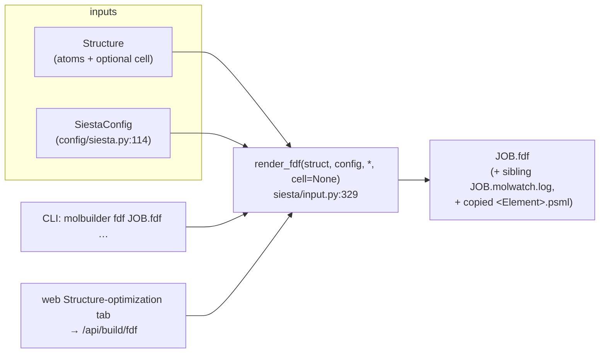
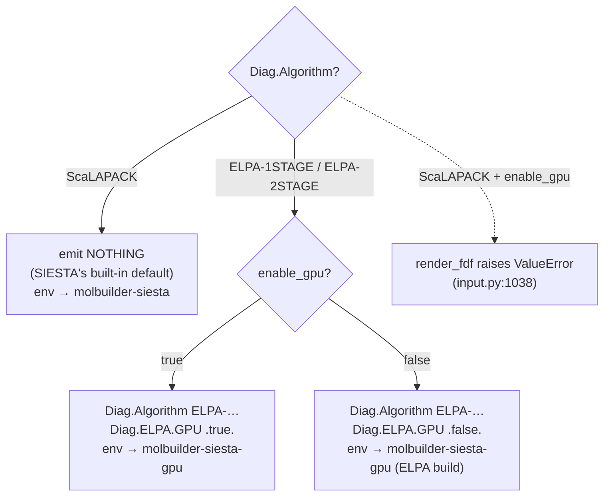

# The SIESTA `.fdf` emitter

**Role:** contract
**Domain:** engines
**Companions:** `overview.md` (the shared engine-emit + boundary-condition
contract — composed last, named not linked yet); `ops/` (how the
`molbuilder-siesta-gpu` env is *built* from CUDA/ELPA source — a deployment concern,
ops wave); [`science/validation.md`](?doc=science/validation.md)
(the preflight that gates emission); [`model/structure.md`](?doc=model/structure.md)
+ [`model/structure-periodicity.md`](?doc=model/structure-periodicity.md) (the
`Structure` + cell it consumes); [`engines/tuning.md`](?doc=engines/tuning.md) (the
value owner — what numbers the convergence/quality knobs should carry);
`execution/` (running a stage ladder on a scheduler — named, execution wave).

This is how molbuilder turns a `Structure` + a `SiestaConfig` into a
**SIESTA-runnable `.fdf` text**. SIESTA is a periodic-DFT code (Soler et al. 2002 — see References); a `.fdf`
("Flexible Data Format") is its plain-text input file. The one entry point is
`render_fdf(struct, config) -> str` (`siesta/input.py:329`).

> **Vocabulary.** Cross-cutting terms (DFT, SCF, open/closed-shell, k-points,
> pseudopotential, ELPA, PAO) are in the
> [`science/overview.md` glossary](?doc=science/overview.md); SIESTA keyword names
> (`SystemLabel`, `MeshCutoff`, `Diag.Algorithm`, …) are glossed inline where they
> first appear. A few recurring ones up front: **XC** = the exchange-correlation
> functional (the DFT approximation that sets accuracy); **DM** = the density
> matrix (the electron distribution the SCF loop iterates on); **`.psml`** =
> SIESTA's XML pseudopotential file format; **MD** = molecular dynamics; **Ry** =
> Rydberg (an energy unit, 1 Ry ≈ 13.6 eV); the **diagonalizer / eigensolver** is
> the routine that solves for orbital energies each SCF step (ScaLAPACK and ELPA
> are two such libraries); **molwatch** = molbuilder's engine-agnostic run-progress
> log; **runwrap** = the wrapper that picks the conda env before launching SIESTA.

---

## 1. The two surfaces

The same emitter is reached two ways — a developer/CLI surface and the web form:



- **Backend (Python / CLI).** `render_fdf` returns the text; `convert(input_path,
  fdf_path, config)` (`:1486`) reads an `.xyz`/`.pdb`, writes the `.fdf`, and copies
  matching pseudopotentials. The CLI is `molbuilder fdf`.
- **Frontend (web).** The Structure-optimization tab posts to `/api/build/fdf`,
  which runs the validation preflight ([`science/validation.md`](?doc=science/validation.md))
  and then `render_fdf`. `SiestaConfig`'s field metadata drives the form (no
  SIESTA-specific form code — see § 7).

---

## 2. Public API + a worked example

```python
@dataclass
class SiestaConfig: ...          # config/siesta.py:114
Config = SiestaConfig            # back-compat alias (:1095)

render_fdf(struct, config=None, *, cell=None) -> str                    # siesta/input.py:329
convert(input_path, fdf_path, config=None, vacuum=None) -> dict         # :1486
copy_pseudopotentials(species, lib, dest_dir) -> list[str]              # :275 → the elements whose .psml was MISSING
```

`convert` returns `{"fdf", "n_atoms", "species", "missing_psml"}` (`missing_psml`
is `[]` unless pseudos were copied and some were absent) plus two conditional keys:
`"makov_payne_script"` (when charge ≠ 0) and `"molwatch_log"` (when
`write_molwatch_log`). `vacuum=` sets `struct.vacuum` when no cell is imported.

```python
>>> from molbuilder.siesta.input import render_fdf
>>> from molbuilder.config.siesta import SiestaConfig
>>> fdf = render_fdf(struct, SiestaConfig(system_label="hemeC"))   # → the full .fdf text
```

The text **opens with a provenance + bench-marks wrapper** (§ 3), then the engine
header — so it does *not* start with `SystemName`. The header block itself reads:

```fdf
SystemName        hemeC
SystemLabel       hemeC          # SystemName is ALWAYS == SystemLabel == system_label
                                 # (the separate system_name was removed 2026-05-27)
NumberOfAtoms     42
NumberOfSpecies   3
```

`convert` is the file-to-file path the CLI uses; it returns a summary and (when
`cfg.psml_lib` is set + `cfg.copy_psml=True`) copies each `<Element>.psml` into the
`.fdf`'s directory. Missing pseudopotentials are listed in `missing_psml` and the
CLI exits with code 2.

---

## 3. What the `.fdf` contains (sections, in emission order)

`render_fdf` emits these blocks in order — but the whole body is **wrapped** by the
shared script-contract blocks: a `provenance` + `bench-marks` header (and an
optional `atom-metadata` block) on top, and a `user-custom` placeholder + an
always-emitted post-processing-hook footer at the bottom (`input.py:1387`). So the
file does **not** begin at row 1 below. `SystemLabel` is the basename SIESTA
prefixes every output file with; `MeshCutoff` sets the real-space integration grid
fineness (Ry); `PAO` = the pseudo-atomic-orbital basis.

| # | Section | Emitted from | Notes |
|---|---|---|---|
| 1 | Header | `SystemName` / `SystemLabel` / atom + species counts | `SystemName` == `SystemLabel` == `cfg.system_label` (same value, default `"siesta"`) |
| 2 | Lattice (3×3 Å) | `cell=` kwarg, or `resolve_cell()` vacuum box | § 6 |
| 3 | Species table | `%block ChemicalSpeciesLabel`, ordered by Z | |
| 4 | Atomic coordinates | `%block AtomicCoordinatesAndAtomicSpecies` (Å) | every atom, no reorder |
| 5 | **Frozen atoms** | `%block Geometry.Constraints` (1-based indices) | only if `struct.frozen_atoms`; the 3-stage boundary carrier (see [`model/structure-annotations.md`](?doc=model/structure-annotations.md)) |
| 6 | Basis & grid | `MeshCutoff`, `PAO.BasisSize`, `PAO.EnergyShift` | |
| 7 | XC (+ dispersion template) | `XC.functional`, `XC.authors` | commented DFT-D template for non-vdW XC |
| 8 | SCF | `SolutionMethod`, `DM.MixingWeight`, `DM.NumberPulay`, `DM.Tolerance`, … | Pulay = the DM-mixing scheme using past iterations |
| 9 | Spin | `SpinPolarized .true.` + optional `Spin.Fix`/`Spin.Total` | only if `spin_polarized` — § 5 |
| 10 | NetCharge | `NetCharge ±N` | only if resolved charge ≠ 0 — § 4 |
| 11 | k-grid | `%block kgrid_Monkhorst_Pack` from `cfg.kgrid` | § 6 |
| 12 | **Parallel (MPI)** | `BlockSize`, `Diag.ParallelOverK` | ScaLAPACK orbital-distribution block |
| 13 | Diagonalizer | `Diag.Algorithm` / `Diag.ELPA.GPU` | § 7 |
| 14 | Geometry opt / dynamics | relax: `MD.TypeOfRun` + `MD.NumCGsteps` + `MD.MaxForceTol`; dynamics (Verlet/Nose): `MD.LengthTimeStep`, `MD.InitialTemperature`, `MD.TargetTemperature` (Nosé) | skipped if `relax_type == "none"` |
| 15 | Output flags | `WriteForces`, `WriteCoorXmol`, `SaveHS`, … | |
| 16 | Troubleshooting block | inline tuning hints | only if `verbose_comments` |

**Verbose comments (default on).** Every numeric parameter is preceded by a `# …`
block: what it controls (one sentence), a sensible range, and what to tweak when
it misbehaves. Removing/changing one of those comments is a spec change and
triggers a test update.

**Two `MD` keyword traps (SIESTA 5.4.2)** — pinned by decision-log 2026-06-23:
`MD.NumCGsteps` is the **universal** step count for *every* relaxation mode
(CG, Broyden, **and** FIRE); the `MD.NumBroydenSteps`/`MD.NumFIRESteps` aliases in
older references are silently dropped by 5.4.2. Likewise `SaveHS` replaced the
dropped `WriteHS`.

---

## 4. The charge contract

Resolved charge is computed **once** per `render_fdf`, via
`resolve_net_charge(struct, cfg.net_charge)` (`input.py:356` → `chemistry.py:1029`):

- `cfg.net_charge is not None` → use it verbatim (including `0`, which disables
  auto-detection);
- otherwise → `formal_charge_from_phosphates(struct)` (the DNA/RNA phosphate
  heuristic, see [`model/chemistry.md`](?doc=model/chemistry.md)).

A non-zero result emits `NetCharge ±N` (with a verbose comment naming the source:
"user-specified" or "auto (phosphate protonation)").

**Vacuum for charged systems — warn, never mutate.** The cell comes from
`struct.resolve_cell()` (isolated axes = bbox + 2·vacuum — see
[`model/structure-periodicity.md`](?doc=model/structure-periodicity.md)); there is
**no `cfg.cell_padding`** field. When a charged system has an isolated axis with
< 25 Å vacuum (`_VACUUM_MIN_CHARGED = 25.0`, `input.py:304`) the emitter **warns**
(`_warn_insufficient_vacuum`, `:307`, "WARN never mutate") and leaves the cell
untouched — it does **not** silently resize. ≥ 25 Å is what SIESTA's
compensating-background-charge correction needs for image–image Coulomb to drop
below ~1 meV (Makov-Payne scaling — see References); a neutral molecule doesn't need it.

*(When the resolved charge ≠ 0, `convert()` additionally writes a
`makov_payne_correction.py` post-process script — `siesta/makov_payne.py:80,153` —
that estimates the residual image-charge energy after the run; the path is returned
as `summary["makov_payne_script"]`. It is not part of the `.fdf` itself.)*

---

## 5. The spin contract

SIESTA's default is spin-restricted (no `Spin` block → closed-shell DFT). An
open-shell system (radical, transition metal, triplet) run without spin
polarisation **silently produces the wrong electronic structure** — which is why
the analyzer/preflight warns ([`science/validation.md`](?doc=science/validation.md)).

- `cfg.spin_polarized=False` (default) → no `Spin` block.
- `cfg.spin_polarized=True` → emit **`SpinPolarized .true.`** — the **v4** form,
  kept on purpose (`input.py:849`). As of SIESTA 5.4.2 the v5 single-line
  `Spin polarized` parser does **not** read the auxiliary `Spin.Fix`/`Spin.Total`
  keys, so an open-shell metal would abort at initial-DM construction
  (`propor: ERROR: IMAX = 0`, the same failure `science/validation.md` describes).
  v4 syntax is manual-deprecated but still honored *and* triggers the aux spin reads.
- `cfg.spin_total` (float, μ_B ≈ one per unpaired electron) → **only** when
  `spin_polarized=True`, emit the **two-line** pin:

  ```fdf
  Spin.Fix    .true.       # without this line, Spin.Total is silently ignored
  Spin.Total  2.0          # target total spin moment in mu_B
  ```

  Set with `spin_polarized=False`, `spin_total` is ignored (meaningless without
  polarisation). Unlike PySCF there is no method-vs-spin validation — SIESTA
  accepts `SpinPolarized .true.` with any basis; the only rule is *the user must
  set it for any open-shell system*.

---

## 6. Lattice & k-grid

**Lattice (§2).** Either the caller passes `cell=` (a 3×3 Å matrix), or the emitter
auto-generates the box via `struct.resolve_cell()` (isolated axes = bbox + 2·vacuum)
with the molecule centred. The per-axis / periodicity behaviour (which axes are
periodic vs vacuum, `axis_kind`, `resolve_cell`) is the model's contract —
[`model/structure-periodicity.md`](?doc=model/structure-periodicity.md).

**k-grid (§10).** `cfg.kgrid = (n₁, n₂, n₃)` emits a Monkhorst-Pack mesh
(`%block kgrid_Monkhorst_Pack`). k-points sample the periodic reciprocal space;
`(1, 1, 1)` (Γ-only) is right for an isolated molecule in vacuum, too coarse for a
real crystal. The preflight flags the mismatches (k > 1 on a vacuum axis is wasted;
k = 1 on a spanning periodic axis is under-converged — see
[`science/overview.md`](?doc=science/overview.md) § 4). `kgrid` is a `SiestaConfig`
knob, **not** a `Structure` field.

---

## 7. The eigensolver — `Diag.Algorithm` + the optional GPU accelerator



Two **orthogonal** decisions (contract rewritten 2026-06-29):

1. **`Diag.Algorithm` — the eigensolver, independent of hardware.** `ScaLAPACK`
   (SIESTA's default divide-and-conquer) / `ELPA-1STAGE` / `ELPA-2STAGE` (**ELPA** =
   a dense-matrix eigensolver library). **ELPA runs on CPU *and* GPU.** Affinity
   (a hint, not a rule): GPU favours 1STAGE, CPU favours 2STAGE.
2. **`cfg.enable_gpu` — an accelerator on top of an ELPA choice.** On → the ELPA
   solve runs on the GPU (`Diag.ELPA.GPU .true.`), GPU-only with no silent CPU
   fallback. Off with an ELPA algorithm → CPU-ELPA (`Diag.ELPA.GPU .false.`).
   Meaningful only with an ELPA algorithm — GPU + ScaLAPACK is rejected by the
   **emitter itself** (`render_fdf` raises `ValueError`, `input.py:1038`), not just
   the UI.

**Emission:**
- `ScaLAPACK` → emit **nothing** (SIESTA's built-in default).
- `ELPA-*` → **always** emit `Diag.Algorithm <choice>` **and** an explicit
  `Diag.ELPA.GPU .true.`/`.false.`. E.g. CPU-ELPA:

  ```fdf
  Diag.Algorithm   ELPA-2STAGE
  Diag.ELPA.GPU    .false.
  ```

**The explicit `.false.` is load-bearing.** The source-built ELPA defaults to the
GPU codepath, so an *omitted* flag makes a CPU-ELPA job initialise CUDA and crash
(`cudaGetLastError: unknown error`; Sol job 57852378). `Diag.ELPA.GPU` alone (no
ELPA `Diag.Algorithm`) is silently ignored — both keywords are required.

**Env routing keys on "needs ELPA", not on GPU.** ScaLAPACK → `molbuilder-siesta`
(precompiled, no ELPA); ELPA (CPU *or* GPU) → `molbuilder-siesta-gpu`, the only
ELPA-linked build. The `runwrap` router bumps `siesta → siesta-gpu` when it sees an
ELPA algorithm or `Diag.ELPA.GPU true`; `molbuilder.json` `envs.*` overrides the
concrete env name. The `enable_gpu` toggle is a *script-input* contract — it never
queries env presence; `runwrap` gates env presence at generation time with a clear
install hint. (How that `molbuilder-siesta-gpu` env is *built* — the CUDA/ELPA
source build, CMake flags, toolchain pinning — is a deployment concern documented
under `ops/`, not here.)

### 7.1 GPU is just a different setting — best performance & what to look for

Turning on the GPU changes *where the eigensolve runs*, nothing about the chemistry.
The practical guidance:

- **When it pays off.** GPU-ELPA wins when the **diagonalization dominates** — a
  large, dense Hamiltonian — because ELPA is *one* call per SCF iteration; the rest
  (mesh integration, density-matrix mix, H rebuild) stays on the host. For small
  systems the GPU launch overhead isn't worth it — stay on ScaLAPACK or CPU-ELPA.
- **Sharing the GPU across ranks (MPS).** On GPU, molbuilder uses NVIDIA **MPS**
  (Multi-Process Service) so several MPI ranks share one GPU concurrently (Hyper-Q) —
  needed because the ELPA build doesn't link NCCL, so without MPS the ranks serialise
  on the GPU's driver context. MPS auto-enables when `Diag.ELPA.GPU .true.` is emitted
  *and* `nvidia-cuda-mps-control` is on the host PATH (it ships with the NVIDIA driver,
  not conda). The default rank count follows MPS: **4 with MPS, 2 without** (override
  with `MOLBUILDER_MPI_NP` / `-np`).
- **Numerical equivalence.** ELPA-GPU and ELPA-CPU on the same `Diag.Algorithm` give
  the same eigenvalues to ~1e-6 eV and the same converged total energy to ~1e-5 eV
  across the build matrix — so develop and test on CPU-ELPA and run production on GPU
  with confidence the physics is unchanged [ELPA GPU eigensolver, arXiv 2002.10991].

**What to look for.** The dangerous failure is a **silent CPU fallback**: ELPA can
quietly run every SCF step on the CPU while `nvidia-smi` still shows a clean, busy
GPU. The canary is `molbuilder envs validate molbuilder-siesta-gpu`'s
`elpa gpu codepath` probe — it runs a small ELPA solve and greps stderr for ELPA's
own "GPU requested but kernel is non-GPU" warning; no other probe catches this.
Also: the `cudaGetLastError: unknown error` crash on a CPU-ELPA job means the
load-bearing `Diag.ELPA.GPU .false.` above was dropped; and old ELPA releases had a
multi-rank GPU-finalize deadlock (jobs hang after SCF iter 1), so if you rebuild the
env, keep ELPA recent.

---

## 8. Staged optimization

A single CLI call can emit one `.fdf` per relaxation **stage** plus a
`<basename>.run.sh` runner that walks the ladder — mirroring PySCF's staged-opt.

- **Data model** `SiestaStageSpec` (`config/siesta.py:1235`): `name` (→ the
  `<basename>_<name>.fdf` suffix), `enabled`, `relax_type` ∈ {CG, Broyden, FIRE}
  (the geometry-relaxation algorithms — conjugate-gradient / quasi-Newton /
  inertial), `relax_steps` (→ `MD.NumCGsteps`), `relax_force_tol` (→ `MD.MaxForceTol`),
  `relax_max_displ` (→ `MD.MaxCGDispl`), `on_nonconvergence` ∈
  {proceed, continue, halt}, `continue_retries`. `SiestaConfig.stages` is the
  source of truth; `_default_siesta_stages()` (`:1315`) is the 3-stage ladder
  (CG warm-up 0.05 → Broyden publishable 0.04 → Broyden crystal-tight 0.01 eV/Å —
  the authoritative per-tier value table lives in
  [`tuning.md`](?doc=engines/tuning.md) § 4).
- **Presets** `SIESTA_STAGE_STRATEGY_PRESETS` (`:1414`): `publishable` (1+2),
  `loose-only` (1), `vib-quality` (1+2+3). The same names + masks live in the PySCF
  config and `form-schema.js`, kept in lock-step by
  `tests/test_siesta_stage_strategy_presets_drift.py`.
- **Validation** `validate_siesta_stages` (`:1346`, wired into `_validate_siesta`)
  rejects an empty/no-enabled list, **duplicate stage names** (a collision would
  silently overwrite a per-stage `.fdf`), and bad knob values — as clean `error`
  Issues, not a render crash.
- **CLI** `molbuilder fdf JOB.fdf --stage-strategy publishable` emits
  `JOB_stage1.fdf`, `JOB_stage2.fdf`, and `JOB.run.sh`. `--stages-json` takes
  **literal JSON or a file path** and replaces `cfg.stages` wholesale (combinable
  with `--stage-strategy`: knob values from the JSON, enable mask from the preset);
  both are **mutually exclusive** with the single-stage `--stage {1,2,3}` overlay.
  The `SystemLabel` stays unsuffixed across stages so SIESTA's `.XV`/`.DM`/`.CG`
  warm-restart files carry forward. The runner rewrites the final stage's policy to
  `halt` (never overshoot) and respects `MB_NP`/`SLURM_NTASKS`/`PBS_NP`.
- **Form widget.** `SiestaConfig.stages: List[SiestaStageSpec]` → the type-driven
  schema helper emits a `{kind: "stage-table"}` automatically (no SIESTA-specific
  form code).

Running the ladder as a real *job-set* on a scheduler (per-stage dirs,
dependency chain, per-stage resources) is `execution/` territory
(`siesta/stages.py::build_siesta_stage_bundle:144` produces the `JobSet`); the
`run.sh` runner above is its single-job `direct`-mode fallback.

---

## 9. Sibling outputs

Alongside `<basename>.fdf`, `convert(...)` also writes (unless
`cfg.write_molwatch_log=False`) a `<basename>.molwatch.log` — one *initial-state
preview block* (step 0: coordinates only, `kind: initial_preview`) so the Results
tab can render the structure before SIESTA produces any output. The stage-aware
name is `<basename>-stage<N>.molwatch.log`. The `.molwatch.log` format itself is
engine-agnostic and specified in `pyscf.md`.

When the resolved charge ≠ 0, `convert()` also drops a `makov_payne_correction.py`
script next to the `.fdf` (returned as `summary["makov_payne_script"]`, § 4). And
each per-stage `.molwatch.log` carries `# stage: <name>` + `# convergence.<key>:
<value>` headers (`max_force_ev_per_ang`, `max_steps`) so the Results inspector
draws the right threshold for the running stage.

A verbose "Run with" header suggests the canonical invocation
(`mpirun -np 4 siesta < JOB.fdf > JOB.out`) that keeps the run directory named per
the job-layout protocol so the Results tab's directory discovery finds the log
(it falls back to `<basename>.out` when no `.molwatch.log` is present).

*(A second sibling module, `siesta/memory.py` — `parse_fdf_mem_inputs:181` — is a
peak-memory estimator that reads a rendered `.fdf` to size an sbatch `--mem`
request; it's a scheduler concern, covered in `execution/`.)*

---

## 10. Forbidden patterns & tests

The emitter must **not**: (1) emit an `MD.TypeOfRun` block when
`relax_type == "none"` (that would force relaxation on a single-point job);
(2) truncate atom-coordinate lines (every `Structure` atom goes into the
coordinates block); (3) emit invalid SIESTA syntax for any standard config — every
variant tested must `convert()` end-to-end without raising.

**Tests:** `test_smiles_and_siesta.py` (render + convert round-trip),
`test_review_fixes.py` (net-charge override, the thin-vacuum **warn** — D3, since
`cell_padding` was removed 2026-07 — and the `Config`
alias), `test_cli_siesta_stages.py` + `test_siesta_form_schema_stage_table.py`
(staged-opt CLI + form widget), `test_molwatch_preview.py` (the sibling log).

---

## References

- **SIESTA method** — Soler, Artacho, Gale, García, Junquera, Ordejón,
  Sánchez-Portal, *J. Phys.: Condens. Matter* **14**, 2745 (2002).
- **Makov-Payne** charged-cell image-charge correction (§ 4) — Makov & Payne,
  *Phys. Rev. B* **51**, 4014 (1995).
- **Monkhorst-Pack** k-mesh (§ 6) — Monkhorst & Pack, *Phys. Rev. B* **13**, 5188 (1976).
- **Pulay** DM mixing (SCF section) — Pulay, *Chem. Phys. Lett.* **73**, 393 (1980).
- **ELPA** eigensolver (§ 7) — Marek et al., *J. Phys.: Condens. Matter* **26**,
  213201 (2014). **FIRE** relaxation (§ 8) — Bitzek et al., *PRL* **97**, 170201 (2006).
- Dispersion (DFT-D3, the §7-XC template) — Grimme et al., *J. Chem. Phys.* **132**,
  154104 (2010). Kleinman-Bylander pseudopotential form — see
  [`science/pseudopotentials.md`](?doc=science/pseudopotentials.md).
