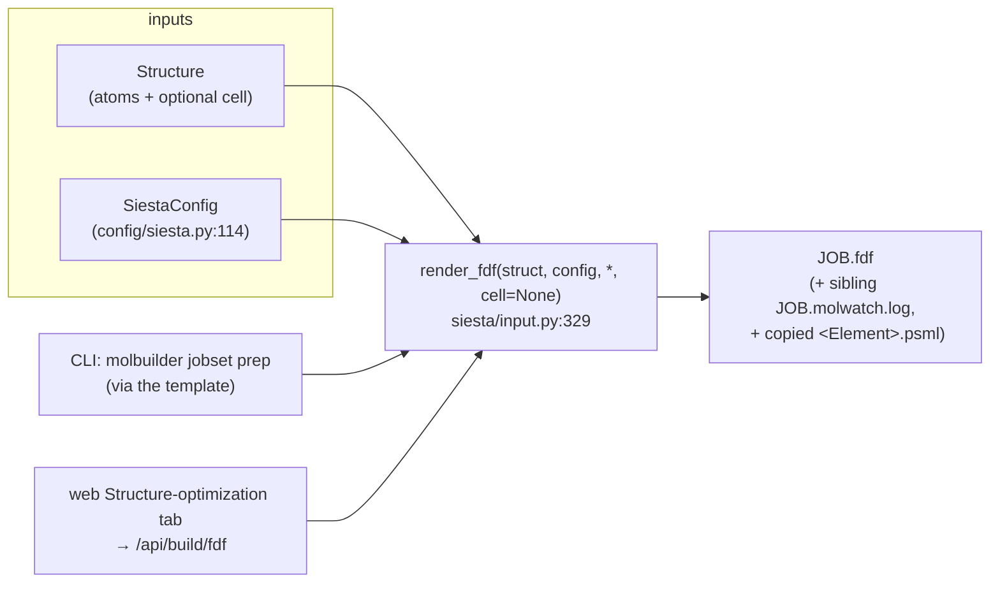
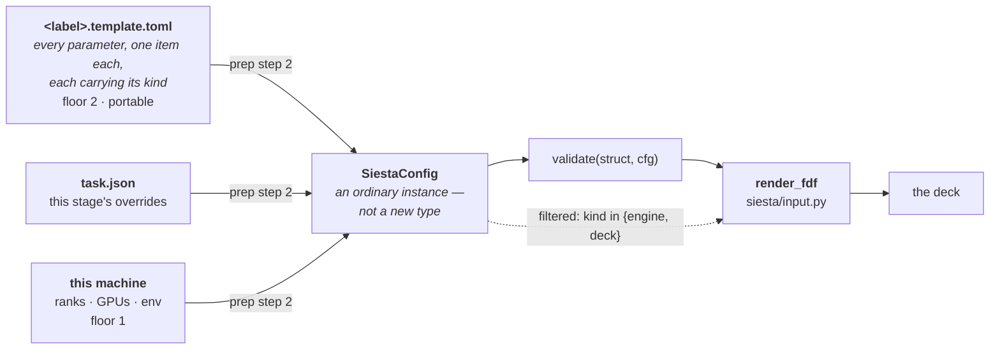
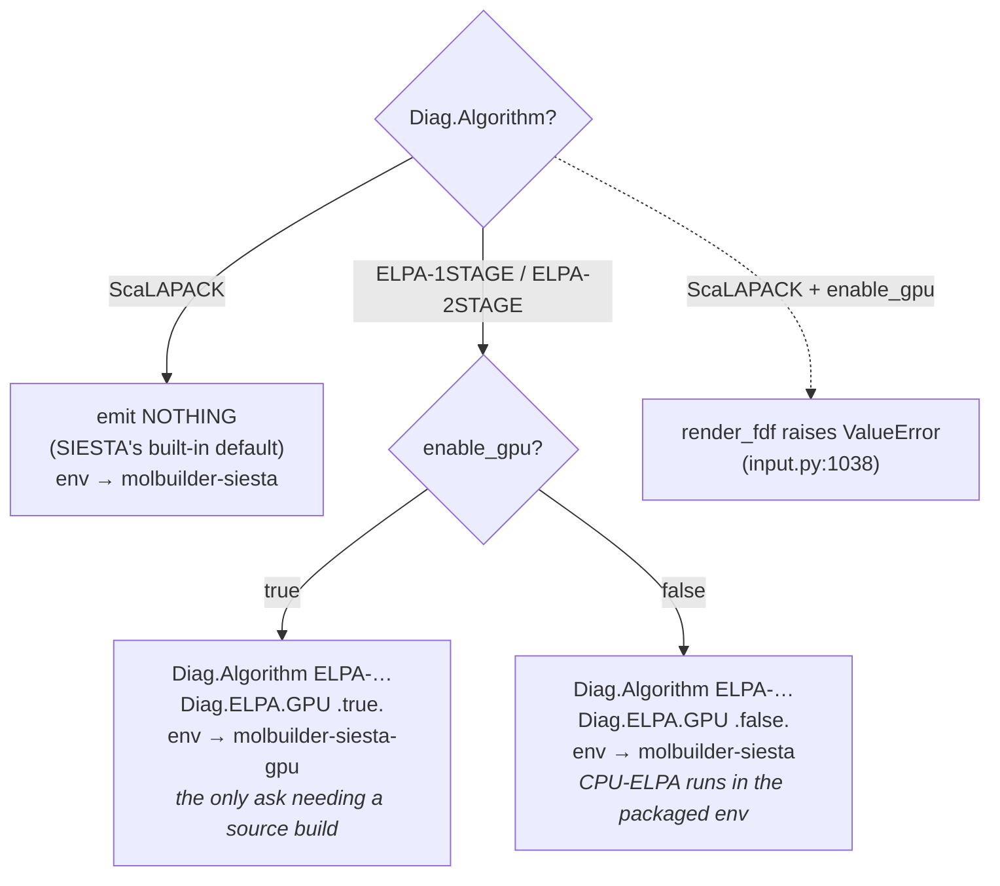

# The SIESTA `.fdf` emitter

**Role:** contract
**Domain:** engines
**Companions:** [`engines/overview.md`](?doc=engines/overview.md) (the shared
engine-emit + boundary-condition contract);
[`ops/installation.md`](?doc=ops/installation.md) (how the
`molbuilder-siesta-gpu` env is *built* from CUDA/ELPA source — a deployment
concern); [`science/validation.md`](?doc=science/validation.md)
(the preflight that gates emission); [`model/structure.md`](?doc=model/structure.md)
+ [`model/structure-periodicity.md`](?doc=model/structure-periodicity.md) (the
`Structure` + cell it consumes); [`engines/tuning.md`](?doc=engines/tuning.md) (the
value owner — what numbers the convergence/quality knobs should carry);
[`execution/job-system.md`](?doc=execution/job-system.md) (running a stage ladder
on a scheduler) + [`engines/stages.md`](?doc=engines/stages.md) (what a stage is,
and where its deck comes from).

This is how molbuilder turns a `Structure` + a `SiestaConfig` into a
**SIESTA-runnable `.fdf` text**. SIESTA is a periodic-DFT code (Soler et al. 2002 — see References); a `.fdf`
("Flexible Data Format") is its plain-text input file. The one entry point is
`render_fdf(struct, config) -> str` (`siesta/input.py:329`).

> **Vocabulary.** Cross-cutting terms (DFT, SCF, open/closed-shell, k-points,
> pseudopotential, ELPA, PAO) are in the
> [`science/overview.md` glossary](?doc=science/overview.md); SIESTA keyword names
> (`SystemLabel`, `MeshCutoff`, `Diag.Algorithm`, …) are glossed inline where they
> first appear. A few recurring ones up front: **XC** = the exchange-correlation
> functional (the DFT approximation that sets accuracy); **DM** = the density
> matrix (the electron distribution the SCF loop iterates on); **`.psml`** =
> SIESTA's XML pseudopotential file format; **MD** = molecular dynamics; **Ry** =
> Rydberg (an energy unit, 1 Ry ≈ 13.6 eV); the **diagonalizer / eigensolver** is
> the routine that solves for orbital energies each SCF step (ScaLAPACK and ELPA
> are two such libraries); **molwatch** = molbuilder's engine-agnostic run-progress
> log; **runwrap** = the wrapper that picks the conda env before launching SIESTA.

---

## 1. The two surfaces

The same emitter is reached two ways — a developer/CLI surface and the web form:



- **Backend (Python / CLI).** `render_fdf` returns the text; `convert(input_path,
  fdf_path, config)` (`:1486`) reads an `.xyz`/`.pdb`, writes the `.fdf`, and copies
  matching pseudopotentials.

  > **These are the Python API and they are unchanged. The `molbuilder fdf` CLI
  > verb is deleted** *(2026-08-11, user — obsolete residue from the flat-dir
  > design; [`process/conventions.md § 3`](?doc=process/conventions.md))*. It let
  > a person render a finished deck straight from flags, skipping the description
  > and guessing at values only the target machine knows. A deck now comes from
  > `molbuilder jobset prep`, which calls exactly these functions.
- **Frontend (web).** The Structure-optimization tab posts to `/api/build/fdf`,
  which runs the validation preflight ([`science/validation.md`](?doc=science/validation.md))
  and then `render_fdf`. `SiestaConfig`'s field metadata drives the form (no
  SIESTA-specific form code — see § 7).

### 1.1 Where the config comes from — the emitter starts from the template

*Stated 2026-08-11 (user), as the design the backend is built to. Not yet code.*

> **`render_fdf` no longer starts from a config somebody typed. It starts from
> the layered description** — the template's items, resolved through this stage
> and this machine into an ordinary `SiestaConfig`.

**The seam does not move, and that is the point.** `render_fdf(struct, config)`
keeps its signature: the config dataclass stays the one object handed to the
emitter, which is what lets the *same* object be validated and rendered
([`stages.md § 4`](?doc=engines/stages.md) R1). What changes is the layer above
it — who builds that object, and from what.



**Three things follow for the emitter, and each is a subtraction:**

| | what the emitter must stop doing | why |
|---|---|---|
| **1** | **reading anything outside the config.** `cfg.stage` and its five read sites go ([`stages.md § 1.1`](?doc=engines/stages.md): the emitter never learns the word), and the USER-CUSTOM read-back merge cannot run at all — at `prep` there is no previous deck to harvest from, so the text arrives as an **item** ([`template.md § 9.2`](?doc=engines/template.md)) | the template is meant to be complete. Anything the emitter fetches for itself is a value the description does not record, and therefore a deck nothing can reproduce |
| **2** | **always computing, always emitting.** A keyword like `BlockSize` now has **three** states — set by you, unset so `prep` proposes one, or **omitted entirely** so SIESTA uses its own default ([`tuning.md § 2.11`](?doc=engines/tuning.md)) | an emitter that always writes a line cannot express the third, and the third is a legitimate scientific answer |
| **3** | **seeing items that are not its own.** Only `kind` in `{engine, deck}` reaches the deck writer; `wrapper`, `produce` and `monitor` items belong to other layers ([`template.md § 6`](?doc=engines/template.md)) | *"a SIESTA producer must not try to emit a `wrapper` item as a keyword — SIESTA would not understand it"* |

**What it does not change:** every block in § 3, the charge contract (§ 4), the
spin contract (§ 5), the lattice and k-grid (§ 6), and the eigensolver rules
(§ 7). Those are about turning a config into text, and that job is unchanged —
which is exactly why the config object is the right seam to keep.

The work item is
[`staged-runs-implementation-plan.md`](?doc=execution/staged-runs-implementation-plan.md)
P12 unit 6b (R3 — the contract holds the rule, the plan holds the order).

---

## 2. Public API + a worked example

```python
@dataclass
class SiestaConfig: ...          # config/siesta.py:114
Config = SiestaConfig            # back-compat alias (:1095)

render_fdf(struct, config=None, *, cell=None) -> str                    # siesta/input.py:329
convert(input_path, fdf_path, config=None, vacuum=None) -> dict         # :1486
copy_pseudopotentials(species, lib, dest_dir) -> list[str]              # :275 → the elements whose .psml was MISSING
```

`convert` returns `{"fdf", "n_atoms", "species", "missing_psml"}` (`missing_psml`
is `[]` unless pseudos were copied and some were absent) plus two conditional keys:
`"makov_payne_script"` (when charge ≠ 0) and `"molwatch_log"` (when
`write_molwatch_log`). `vacuum=` sets `struct.vacuum` when no cell is imported.

```python
>>> from molbuilder.siesta.input import render_fdf
>>> from molbuilder.config.siesta import SiestaConfig
>>> fdf = render_fdf(struct, SiestaConfig(system_label="hemeC"))   # → the full .fdf text
```

The text **carries its provenance + bench-marks record at the tail**, behind
the machine-record banner (job-contracts § 3.1, physics-first order —
amended R11 2026-08-12; this line said "opens with"), before that the engine
header — so it does *not* start with `SystemName`. The header block itself reads:

```fdf
SystemName        hemeC
SystemLabel       hemeC          # SystemName is ALWAYS == SystemLabel == system_label
                                 # (the separate system_name was removed 2026-05-27)
NumberOfAtoms     42
NumberOfSpecies   3
```

`convert` is the file-to-file path; it returns a summary and (when
`cfg.psml_lib` is set + `cfg.copy_psml=True`) copies each `<Element>.psml` into the
`.fdf`'s directory, listing what it could not find in `missing_psml`.  On the
described route the roles split: **`describe --psml-lib` is what copies the
pseudos into the calculation** (they are its data files and travel with it),
and **`prep` refuses to render a deck whose pseudos are absent** — the
render's own validation, surfaced as a clean refusal naming the elements
(A8, 2026-08-12).  A deck whose pseudopotentials are absent cannot run
([`conventions.md § 3`](?doc=process/conventions.md)).  *(Until 2026-08-12
this sentence claimed "`jobset prep` exits 2 on a non-empty `missing_psml`
list" — prep never had that list; the copy is describe's and the refusal is
the render's.)*

---

## 3. What the `.fdf` contains (sections, in emission order)

`render_fdf` emits these blocks in order, and since the physics-first
amendment (`job-contracts.md` § 3.1, 2026-08-01/recorded 2026-08-12) the
engine body IS the file's head — the file **begins at row 1 below**.  The
shared script-contract blocks follow it as the tail, in § 3.1's order:
`user-custom` placeholder, status banner, `provenance`, `bench-marks`, and
the optional `atom-metadata` last — which is why `tail -40` on any deck
shows its record.  Parsers find every block by its MARKERS, never by
position, so this order is ergonomics, not interface.  *(Until 2026-08-12
this paragraph still taught the retired header-on-top wrapping the § 3.1
amendment had corrected.)*  `SystemLabel` is the basename SIESTA
prefixes every output file with; `MeshCutoff` sets the real-space integration grid
fineness (Ry); `PAO` = the pseudo-atomic-orbital basis.

| # | Section | Emitted from | Notes |
|---|---|---|---|
| 1 | Header | `SystemName` / `SystemLabel` / atom + species counts | `SystemName` == `SystemLabel` == `cfg.system_label` (same value, default `"siesta"`) |
| 2 | Lattice (3×3 Å) | `cell=` kwarg, or `resolve_cell()` vacuum box | § 6 |
| 3 | Species table | `%block ChemicalSpeciesLabel`, ordered by Z | |
| 4 | Atomic coordinates | `%block AtomicCoordinatesAndAtomicSpecies` (Å) | every atom, no reorder |
| 5 | **Frozen atoms** | `%block Geometry.Constraints` (1-based indices) | only if `struct.frozen_atoms`; the 3-stage boundary carrier (see [`model/structure-annotations.md`](?doc=model/structure-annotations.md)) |
| 6 | Basis & grid | `MeshCutoff`, `PAO.BasisSize`, `PAO.EnergyShift` | |
| 7 | XC (+ dispersion template) | `XC.functional`, `XC.authors` | commented DFT-D template for non-vdW XC |
| 8 | SCF | `SolutionMethod`, `DM.MixingWeight`, `DM.NumberPulay`, `DM.Tolerance`, … | Pulay = the DM-mixing scheme using past iterations |
| 9 | Spin | `SpinPolarized .true.` + optional `Spin.Fix`/`Spin.Total` | only if `spin_polarized` — § 5 |
| 10 | NetCharge | `NetCharge ±N` | only if resolved charge ≠ 0 — § 4 |
| 11 | k-grid | `%block kgrid_Monkhorst_Pack` from `cfg.kgrid` | § 6 |
| 12 | **Parallel (MPI)** | `BlockSize`, `Diag.ParallelOverK` | the ScaLAPACK/ELPA orbital-distribution block. **Tunable, and omitted entirely when you want SIESTA's own default** — the three states and the guidance are [`tuning.md § 2.11`](?doc=engines/tuning.md) |
| 13 | Diagonalizer | `Diag.Algorithm` / `Diag.ELPA.GPU` | § 7 |
| 14 | Geometry opt / dynamics | relax: `MD.TypeOfRun` + `MD.NumCGsteps` + `MD.MaxForceTol`; dynamics (Verlet/Nose): `MD.LengthTimeStep`, `MD.InitialTemperature`, `MD.TargetTemperature` (Nosé) | skipped if `relax_type == "none"` |
| 15 | Output flags | `WriteForces`, `WriteCoorXmol`, `SaveHS`, … | |
| 16 | Troubleshooting block | inline tuning hints | only if `verbose_comments` |

**Verbose comments (default on).** Every numeric parameter is preceded by a `# …`
block: what it controls (one sentence), a sensible range, and what to tweak when
it misbehaves. Removing/changing one of those comments is a spec change and
triggers a test update.

**Two `MD` keyword traps (SIESTA 5.4.2)** — pinned by decision-log 2026-06-23:
`MD.NumCGsteps` is the **universal** step count for *every* relaxation mode
(CG, Broyden, **and** FIRE); the `MD.NumBroydenSteps`/`MD.NumFIRESteps` aliases in
older references are silently dropped by 5.4.2. Likewise `SaveHS` replaced the
dropped `WriteHS`.

---

## 4. The charge contract

Resolved charge is computed **once** per `render_fdf`, via
`resolve_net_charge(struct, cfg.net_charge)` (`input.py:356` → `chemistry.py:1029`):

- `cfg.net_charge is not None` → use it verbatim (including `0`, which disables
  auto-detection);
- otherwise → `formal_charge_from_phosphates(struct)` (the DNA/RNA phosphate
  heuristic, see [`model/chemistry.md`](?doc=model/chemistry.md)).

A non-zero result emits `NetCharge ±N` (with a verbose comment naming the source:
"user-specified" or "auto (phosphate protonation)").

**Vacuum adequacy — report, never mutate.** The cell comes from
`struct.resolve_cell()` (isolated axes = bbox + 2·vacuum — see
[`model/structure-periodicity.md`](?doc=model/structure-periodicity.md)); there is
**no `cfg.cell_padding`** field. Too little vacuum on an isolated axis is
**reported and never fixed for you**: the geometry is the user's, so molbuilder
says what is wrong and leaves it alone. The thresholds are
`_VACUUM_MIN_NEUTRAL = 8.0` and `_VACUUM_MIN_CHARGED = 25.0`
(`validation/siesta.py`). ≥ 25 Å is what SIESTA's compensating-background-charge
correction needs for image–image Coulomb to drop below ~1 meV (Makov-Payne
scaling — see References); a neutral molecule needs ≥ 8 Å, enough that basis
orbitals (4–7 Å per atom at DZP) cannot reach across the gap, which is 2×vacuum.

The check is a **validator** (`_check_siesta_vacuum_adequacy`, emitting
`cell.vacuum_thin`), not a Python warning inside the emitter. It used to be
`warnings.warn` in `input.py`, which reached the server's stderr and therefore no
web user at all — a 2.5 Å box went to SIESTA with nothing said, and the user
learnt of it only from SIESTA's own *"multiply-connected orbital pairs"* message.
As an `Issue` the same advice reaches the browser panel and the CLI report alike;
that is clause **R5** of the delivery contract,
[`science/validation.md`](?doc=science/validation.md) § 4.1.

Distinct from adequacy, and much smaller: the § 6.1 **default vacuum gap** gives
every isolated axis 3 Å per side **when the user set no vacuum at all**, so a
flat or linear molecule cannot produce a zero-volume cell SIESTA would refuse to
run. A vacuum you *did* set is used verbatim, however small — the default fills
an absence, it never overrides a value.

The default keeps the cell *well-formed*; it says nothing about the vacuum being
*enough*, which is what the check above is for — and the two speak the same
physics in different units. **Vacuum is per side, so the gap between periodic
images is twice it:** the 3 Å default leaves 6 Å between a molecule and its image,
while the adequacy check asks for 8 Å per side, i.e. a 16 Å gap. So a
default-gap box is reported as thin, correctly: it is well-formed and not yet
converged.

*(When the resolved charge ≠ 0, `convert()` additionally writes a
`makov_payne_correction.py` post-process script — `siesta/makov_payne.py:80,153` —
that estimates the residual image-charge energy after the run; the path is returned
as `summary["makov_payne_script"]`. It is not part of the `.fdf` itself.)*

---

## 5. The spin contract

SIESTA's default is spin-restricted (no `Spin` block → closed-shell DFT). An
open-shell system (radical, transition metal, triplet) run without spin
polarisation **silently produces the wrong electronic structure** — which is why
the analyzer/preflight warns ([`science/validation.md`](?doc=science/validation.md)).

- `cfg.spin_polarized=False` (default) → no `Spin` block.
- `cfg.spin_polarized=True` → emit **`SpinPolarized .true.`** — the **v4** form,
  kept on purpose (`input.py:849`). As of SIESTA 5.4.2 the v5 single-line
  `Spin polarized` parser does **not** read the auxiliary `Spin.Fix`/`Spin.Total`
  keys, so an open-shell metal would abort at initial-DM construction
  (`propor: ERROR: IMAX = 0`, the same failure `science/validation.md` describes).
  v4 syntax is manual-deprecated but still honored *and* triggers the aux spin reads.
- `cfg.spin_total` (float, μ_B ≈ one per unpaired electron) → **only** when
  `spin_polarized=True`, emit the **two-line** pin:

  ```fdf
  Spin.Fix    .true.       # without this line, Spin.Total is silently ignored
  Spin.Total  2.0          # target total spin moment in mu_B
  ```

  Set with `spin_polarized=False`, `spin_total` is ignored (meaningless without
  polarisation). Unlike PySCF there is no method-vs-spin validation — SIESTA
  accepts `SpinPolarized .true.` with any basis; the only rule is *the user must
  set it for any open-shell system*.

---

## 6. Lattice & k-grid

**Lattice (§2).** Either the caller passes `cell=` (a 3×3 Å matrix), or the emitter
auto-generates the box via `struct.resolve_cell()` (isolated axes = bbox + 2·vacuum)
with the molecule centred. The per-axis / periodicity behaviour (which axes are
periodic vs vacuum, `axis_kind`, `resolve_cell`) is the model's contract —
[`model/structure-periodicity.md`](?doc=model/structure-periodicity.md).

**k-grid (§10).** `cfg.kgrid = (n₁, n₂, n₃)` emits a Monkhorst-Pack mesh
(`%block kgrid_Monkhorst_Pack`). k-points sample the periodic reciprocal space;
`(1, 1, 1)` (Γ-only) is right for an isolated molecule in vacuum, too coarse for a
real crystal. The preflight flags the mismatches (k > 1 on a vacuum axis is wasted;
k = 1 on a spanning periodic axis is under-converged — see
[`science/overview.md`](?doc=science/overview.md) § 4). `kgrid` is a `SiestaConfig`
knob, **not** a `Structure` field.

---

## 7. The eigensolver — `Diag.Algorithm` + the optional GPU accelerator



Two **orthogonal** decisions (contract rewritten 2026-06-29):

1. **`Diag.Algorithm` — the eigensolver, independent of hardware.** `ScaLAPACK`
   (SIESTA's default divide-and-conquer) / `ELPA-1STAGE` / `ELPA-2STAGE` (**ELPA** =
   a dense-matrix eigensolver library). **ELPA runs on CPU *and* GPU.** Affinity
   (a hint, not a rule): GPU favours 1STAGE, CPU favours 2STAGE.
2. **`cfg.enable_gpu` — an accelerator on top of an ELPA choice.** On → the ELPA
   solve runs on the GPU (`Diag.ELPA.GPU .true.`), GPU-only with no silent CPU
   fallback. Off with an ELPA algorithm → CPU-ELPA (`Diag.ELPA.GPU .false.`).
   Meaningful only with an ELPA algorithm — GPU + ScaLAPACK is rejected by the
   **emitter itself** (`render_fdf` raises `ValueError`, `input.py:1038`), not just
   the UI.

**Emission:**
- `ScaLAPACK` → emit **nothing** (SIESTA's built-in default).
- `ELPA-*` → **always** emit `Diag.Algorithm <choice>` **and** an explicit
  `Diag.ELPA.GPU .true.`/`.false.`. E.g. CPU-ELPA:

  ```fdf
  Diag.Algorithm   ELPA-2STAGE
  Diag.ELPA.GPU    .false.
  ```

**The explicit `.false.` is load-bearing.** The source-built ELPA defaults to the
GPU codepath, so an *omitted* flag makes a CPU-ELPA job initialise CUDA and crash
(`cudaGetLastError: unknown error`; Sol job 57852378). `Diag.ELPA.GPU` alone (no
ELPA `Diag.Algorithm`) is silently ignored — both keywords are required.

### 7.2 Env routing keys on **GPU**, and on nothing else

**The two SIESTA envs split on provenance, not on hardware.**
`molbuilder-siesta` installs from packages on any machine.
`molbuilder-siesta-gpu` must be **built from source**, which some HPC sites do
not permit — that is the whole reason there are two of them.

**CPU-ELPA needs neither.** Measured 2026-08-13, an H2 probe in the packaged env:

| deck | result |
|---|---|
| `Diag.Algorithm ELPA-2stage` | exit 0 — E = −30.136019 eV |
| `Diag.Algorithm ELPA-1stage` | exit 0 — E = −30.136019 eV |
| `Divide-and-Conquer` | exit 0 — E = −30.136019 eV, identical |
| `ELPA-2stage` + `Diag.ELPA.GPU .true.` | **exit 1** — `ELPA_ERROR_ENTRY_NOT_FOUND`, *"diag: ELPA error on gpu set"* |

conda-forge's SIESTA links no external `libelpa`, but ELPA is compiled **into**
the binary through ELSI (279 defined ELPA symbols, zero undefined — the full
`elpa_api` / `elpa1_compute` / `elpa2_compute` set). Only the GPU entry is
absent, which is a **missing build option, not a missing device**.

So: `runwrap` bumps `siesta → siesta-gpu` **only** for `Diag.ELPA.GPU true`.
`molbuilder.json` `envs.*` overrides the concrete env name, and an env the user
names always wins — the route is the fallback for *no choice given*, never an
override. What is *available* is filtered by what is *needed*, and the user
picks from what survives.

> **Until 2026-08-13 this routed every ELPA deck to the source build**, on the
> premise that the packaged SIESTA has no ELPA. On a site that cannot compile,
> that refused a runnable calculation — telling the user to install an
> environment they cannot build, for a solver the installed baseline already
> has. **Knowing a keyword is not providing the capability:** the packaged
> binary carries `ELPA-1stage`, `ELPA-2stage` and `Diag.ELPA.GPU` as strings
> either way.

The `enable_gpu` toggle is a *script-input* contract — it never queries env
presence; `runwrap` gates env presence at generation time with a clear install
hint. (How the `molbuilder-siesta-gpu` env is *built* — the CUDA/ELPA source
build, CMake flags, toolchain pinning — is a deployment concern documented under
`ops/`, not here.)

### 7.1 GPU is just a different setting — best performance & what to look for

Turning on the GPU changes *where the eigensolve runs*, nothing about the chemistry.
The practical guidance:

- **When it pays off.** GPU-ELPA wins when the **diagonalization dominates** — a
  large, dense Hamiltonian — because ELPA is *one* call per SCF iteration; the rest
  (mesh integration, density-matrix mix, H rebuild) stays on the host. For small
  systems the GPU launch overhead isn't worth it — stay on ScaLAPACK or CPU-ELPA.
- **Sharing the GPU across ranks (MPS).** On GPU, molbuilder uses NVIDIA **MPS**
  (Multi-Process Service) so several MPI ranks share one GPU concurrently — via the
  GPU's **Hyper-Q** hardware queues — needed because the ELPA build doesn't link
  **NCCL** (NVIDIA's multi-GPU collective library), so without MPS the ranks serialise
  on the GPU's driver context. MPS auto-enables when `Diag.ELPA.GPU .true.` is emitted,
  `nvidia-cuda-mps-control` is on the host PATH (it ships with the NVIDIA driver, not
  conda), *and* the run will use ≥ 2 ranks (single-rank MPS is pure overhead). The
  default rank count follows MPS: typically **4 with MPS** (capped by core count),
  **2 without** (override with `MOLBUILDER_MPI_NP` / `-np`).
- **Numerical equivalence.** ELPA-GPU and ELPA-CPU on the same `Diag.Algorithm` give
  the same eigenvalues to ~1e-6 eV and the same converged total energy to ~1e-5 eV
  across the build matrix — so develop and test on CPU-ELPA and run production on GPU
  with confidence the physics is unchanged [ELPA GPU eigensolver, arXiv 2002.10991].

**What to look for.** The dangerous failure is a **silent CPU fallback**: ELPA can
quietly run every SCF step on the CPU while `nvidia-smi` still shows a clean, busy
GPU. The canary is `molbuilder envs validate molbuilder-siesta-gpu`'s
`elpa gpu codepath` probe — it runs a small ELPA solve and greps stderr for ELPA's
own "GPU requested but kernel is non-GPU" warning; no other probe catches this.
Also: the `cudaGetLastError: unknown error` crash on a CPU-ELPA job means the
load-bearing `Diag.ELPA.GPU .false.` above was dropped; and old ELPA releases had a
multi-rank GPU-finalize deadlock (jobs hang after SCF iter 1), so if you rebuild the
env, keep ELPA recent.

---

## 8. Staged optimization

A single CLI call can emit one `.fdf` per relaxation **stage**. Each is an
ordinary complete deck; **nothing walks the ladder for you**, and that is the
design rather than a missing piece — you prepare and submit one stage, look at
what it produced, and then prepare the next
([`project-layout.md § 1.6`](?doc=execution/project-layout.md)).

> **The `<basename>.run.sh` stage runner is gone** — `render_siesta_stages_runner`
> and its `_warm_check` were deleted on 2026-08-10 with the rest of the chaining
> machinery ([`job-contracts.md § 4.4`](?doc=execution/job-contracts.md)). There
> is **one** wrapper emitter, `runwrap.render_run_wrapper`, and `prep` renders one
> per deck. This section described the runner as shipped until 2026-08-11.

> **The ladder does not live in this engine's config, and that is the whole
> shape of this section.** `SiestaConfig.stages` and `SiestaStageSpec` were
> deleted on 2026-08-07 (P2 unit 2) — not reshaped. A stage is not a property
> of a calculation, so an engine config carries no stage list; it is one
> parameter set, and the ladder is the **user's** decision about what varies.
> [`engines/stages.md`](?doc=engines/stages.md) § 1.1–1.2 is the contract.
> **PySCF's ladder is deliberately untouched** — it runs inside one process,
> so its stage list is also engine behaviour.

- **Data model.** A stage is `molbuilder/task.py::Stage`: **`name`** (→ the
  `<basename>_<name>.fdf` suffix), **`enabled`**, and **`overrides`** — a map
  naming *any* field of `SiestaConfig` and the value this stage uses for it.
  There is no privileged set: `mesh_cutoff`, `basis_size` and `kgrid` are as
  varyable as the four relaxation knobs, which is what
  [`stages.md`](?doc=engines/stages.md) § 1.2 means by *the catalogue is the
  schema's, the selection is the user's*. A field a stage does not name keeps
  the template's value (§ 6.2's subset rule).
- **Resolution.** `siesta/input.py::effective_config(template, stage)` is the
  **one** place a stage becomes a config: `dataclasses.replace(template,
  **overrides)`, refusing an unknown field **by name**. What it returns is an
  ordinary `SiestaConfig`, so the shipped validator and the shipped emitter
  both take it unchanged (§ 4 R1).
- **The shipped ladder.** `siesta/stages.py::default_siesta_stages(strategy)`
  builds it: one stage per tier of `SIESTA_STAGE_PRESETS`, that tier's four
  values as its `overrides`, enabled per `SIESTA_STAGE_STRATEGY_PRESETS` —
  `publishable` (1+2), `loose-only` (1), `vib-quality` (1+2+3). CG warm-up
  0.05 → Broyden publishable 0.04 → Broyden crystal-tight 0.01 eV/Å; the
  authoritative per-tier value table is [`tuning.md`](?doc=engines/tuning.md)
  § 4. Because `--stage {1,2,3}` overlays the *same* table, a one-shot tier-N
  deck and stage N of the ladder cannot drift apart. The preset names + masks
  also live in the PySCF config and `form-schema.js`, kept in lock-step by
  `tests/test_siesta_stage_strategy_presets_drift.py`.
- **Non-convergence policy does not exist for SIESTA**, and that is a decision
  rather than an omission. Its entire effect was the scheduler edge between one
  attempt and the next; a SIESTA ladder emits no edges
  ([`project-layout.md § 1.6`](?doc=execution/project-layout.md)), so on
  2026-08-10 the field was **removed from the producer rather than left inert**
  ([`stages.md § 3`](?doc=engines/stages.md)). A stage that runs out of steps
  simply stops, and you decide what to do — which is what you were doing between
  stages anyway. **PySCF keeps it** (`pyscf.md § 3`), because there the ladder is
  a loop inside one process and the policy is real control flow.
- **Validation.** A stage is validated as a **resolved whole, never as a
  diff** (§ 4 R2): the caller resolves it and runs the ordinary single-config
  validator on the result, so there is no parallel copy of the knob rules to
  drift. The two checks that are about the *ladder* rather than a member of it
  — nothing enabled, and duplicate names (a collision would silently overwrite
  a per-stage `.fdf`) — are refused by `_enabled_stages`.
- **How a ladder is asked for.** `--stage-strategy publishable` picks the enable
  mask; `--stages-json` takes
  **literal JSON or a file path** — a list of `{name, enabled, overrides}` —
  and replaces the ladder wholesale (combinable with `--stage-strategy`: the
  ladder from the JSON, the enable mask from the preset); both are **mutually
  exclusive** with the single-stage `--stage {1,2,3}` overlay. The
  `SystemLabel` stays unsuffixed across stages so SIESTA's `.XV`/`.DM`/`.CG`
  warm-restart files carry forward — which is what lets a later stage find an
  earlier one's geometry with nobody instructing it
  ([`run-identity.md § 1`](?doc=execution/run-identity.md)). How each deck is
  then wrapped, sized and launched is `execution/`'s: `molbuilder jobset prep`
  renders the wrapper against the target machine, and `jobset submit` starts one
  stage ([`job-system.md § 5.3`](?doc=execution/job-system.md)).
- **Form widget.** There is none, and its absence is the fix. The form-schema
  generator answers *what settings exist and how is each drawn*; when
  `SiestaConfig` carried a `List[SiestaStageSpec]` the generator walked into
  it and published that class's field names as the columns a user is allowed
  to vary — answering the *selection* question with the *catalogue*
  machinery, and the reason a stage could vary exactly four values. The
  per-stage grid belongs to the shared Task Setup tab, fed by the catalogue
  from here and the selection from `task.json`.

Running the ladder as a real *job-set* — per-stage directories, per-stage
resources, and **one submission per stage, by hand** — is `execution/` territory
(`siesta/stages.py::build_siesta_stage_bundle:144` produces the `JobSet`).
**There are no dependency edges between stages**: a `JobSet` carries none, and
nothing can ask for one ([`job-system.md § 2`](?doc=execution/job-system.md),
decision 6).

---

## 9. Sibling outputs

Alongside `<basename>.fdf`, `convert(...)` also writes (unless
`cfg.write_molwatch_log=False`) a `<basename>.molwatch.log` — one *initial-state
preview block* (step 0: coordinates only, `kind: initial_preview`) so the Results
tab can render the structure before SIESTA produces any output. The `.molwatch.log`
format itself is engine-agnostic and specified in `pyscf.md`.

**A stage's log is named for the deck that produced it** —
`<label>_<NN>_<stage>.molwatch.log` beside `<label>_<NN>_<stage>.fdf`, the same
name whether the stages share a directory or each has its own. One rule, derived
from the deck rather than declared separately, which is what lets a directory's
logs be merged in order with a boundary per stage
([`job-contracts.md § 2.3`](?doc=execution/job-contracts.md)); the table for every
name in the system is [`job-contracts.md § 6.3`](?doc=execution/job-contracts.md)
and the reasoning is [`stages.md § 7`](?doc=engines/stages.md).

> **Landed 2026-08-10.** The log used to carry a `-stage<N>` infix while the deck
> carried `_<name>` — two spellings of one idea. `molwatch_log_basename` now takes
> the stage's artifact token, and the run decoder reads it back through
> `identity.parse_stage_token` rather than keeping a second regex.

When the resolved charge ≠ 0, `convert()` also drops a `makov_payne_correction.py`
script next to the `.fdf` (returned as `summary["makov_payne_script"]`, § 4). And
each per-stage `.molwatch.log` carries `# stage: <name>` + `# convergence.<key>:
<value>` headers (`max_force_ev_per_ang`, `max_steps`) so the Results inspector
draws the right threshold for the running stage.

A verbose "Run with" header suggests the canonical invocation
(`mpirun -np 4 siesta < JOB.fdf > JOB.out`) that keeps the run directory named per
the job-layout protocol so the Results tab's directory discovery finds the log
(it falls back to `<basename>.out` when no `.molwatch.log` is present).

*(A second sibling module, `siesta/memory.py` — `parse_fdf_mem_inputs:181` — is a
peak-memory estimator that reads a rendered `.fdf` to size an sbatch `--mem`
request; it's a scheduler concern, covered in `execution/`.)*

---

## 10. Forbidden patterns & tests

The emitter must **not**: (1) emit an `MD.TypeOfRun` block when
`relax_type == "none"` (that would force relaxation on a single-point job);
(2) truncate atom-coordinate lines (every `Structure` atom goes into the
coordinates block); (3) emit invalid SIESTA syntax for any standard config — every
variant tested must `convert()` end-to-end without raising.

**Tests:** `test_smiles_and_siesta.py` (render + convert round-trip),
`test_review_fixes.py` (net-charge override, the thin-vacuum **warn** — D3, since
`cell_padding` was removed 2026-07 — and the `Config`
alias), `test_cli_siesta_stages.py` + `test_siesta_form_schema_stage_table.py`
(staged-opt CLI + form widget), `test_molwatch_preview.py` (the sibling log).

---

## References

- **SIESTA method** — Soler, Artacho, Gale, García, Junquera, Ordejón,
  Sánchez-Portal, *J. Phys.: Condens. Matter* **14**, 2745 (2002).
- **Makov-Payne** charged-cell image-charge correction (§ 4) — Makov & Payne,
  *Phys. Rev. B* **51**, 4014 (1995).
- **Monkhorst-Pack** k-mesh (§ 6) — Monkhorst & Pack, *Phys. Rev. B* **13**, 5188 (1976).
- **Pulay** DM mixing (SCF section) — Pulay, *Chem. Phys. Lett.* **73**, 393 (1980).
- **ELPA** eigensolver (§ 7) — Marek et al., *J. Phys.: Condens. Matter* **26**,
  213201 (2014). **FIRE** relaxation (§ 8) — Bitzek et al., *PRL* **97**, 170201 (2006).
- Dispersion — **DFT-D2** (the `MM.Potentials` template) Grimme, *J. Comput.
  Chem.* **27**, 1787 (2006); **DFT-D3** (the `DFTD3 T` route) Grimme, Antony,
  Ehrlich, Krieg, *J. Chem. Phys.* **132**, 154104 (2010).
  Kleinman-Bylander pseudopotential form — see
  [`science/pseudopotentials.md`](?doc=science/pseudopotentials.md).

### Reference sources — where the authoritative SIESTA documentation lives

molbuilder does not vendor the SIESTA manual (it is versioned with SIESTA, and
the Documents tab serves markdown, not PDF). When an fdf keyword's meaning,
units, or default is in question, these are the sources that settle it, in
descending order of authority:

| Source | Where | Settles |
| --- | --- | --- |
| Manual source (LaTeX) | `<siesta-gpu env>/opt/siesta-gpu-stack/src/siesta/Docs/tex/sections/` — one `.tex` per topic, e.g. `Options/Auxiliary_force_field.tex` for the `MM.*` keywords | The documented meaning, units, and defaults of every fdf entry |
| The block/keyword parser | same tree, `Src/*.F90` — e.g. `Src/molecularmechanics.F90` for `MM.Potentials` | What the binary *actually* does when the manual is ambiguous |
| Shipped utilities | `Util/` in the same tree; installed into the siesta env's `bin/` | Correct-by-construction input. `fdf2grimme <deck>.fdf` prints a complete D2 `MM.Potentials` block for the deck's species |
| Online manual | <https://docs.siesta-project.org> | Same content, current release |

Two facts worth keeping in view because they differ between our two envs:

- The **CPU** build (`molbuilder-siesta`) is compiled with **DFT-D3** support
  (`DFTD3`, `DFTD3.UseXCDefaults`, `DFTD3.BJdamping`, …) and ships
  `fdf2grimme`. The **GPU** build (`molbuilder-siesta-gpu`) has neither: it
  carries the full manual + source tree instead.
- The manual is only present in the GPU env, because that one is built from
  source; the conda CPU env ships binaries and utilities without `Docs/`.

Checking a keyword against the parser rather than memory is what caught the
three errors in the emitted D2 example (species *numbers* not symbols; C6 in
`eV·Å⁶` not `J·nm⁶/mol`; `R0` the *sum* of the two atomic radii) — see
`_emit_dispersion_template` in `molbuilder/siesta/input.py`.
