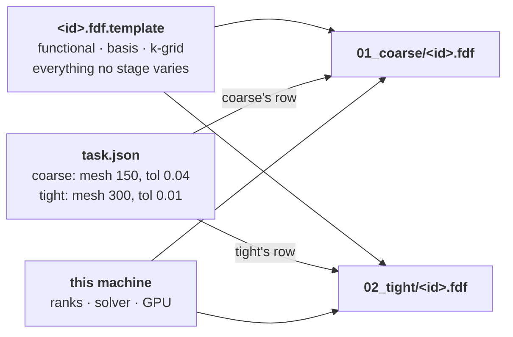

# Stages — a named parameter set over one system, and the file that describes it

**Role:** contract
**Domain:** engines
**Companions:** [`engines/tuning.md`](?doc=engines/tuning.md) — what *values* a
stage should carry and why (this doc says what a stage *is*, never what to put in
one); [`engines/siesta.md`](?doc=engines/siesta.md) +
[`engines/pyscf.md`](?doc=engines/pyscf.md) — the emitters that render an
effective config; [`execution/run-identity.md`](?doc=execution/run-identity.md) —
the id every stage in a folder shares, and the engine parameters that decide
whether a stage continues; [`execution/job-contracts.md`](?doc=execution/job-contracts.md)
— the run directory the decks land in and the persisted-artifact registry;
[`web/staged-runs-architecture.md`](?doc=web/staged-runs-architecture.md) — the
plan that motivates this contract and schedules the work.

**Status: proposed, not built.** This document is written first and the code is
built to it, the way `web/spectrumchart.md` and `web/vibrationview.md` were.
Nothing in `SiestaConfig` matches it yet; the differences and the order of work
are in the plan, not here (R3).

**This contract owns:** what a stage is, which fields are a stage's and which are
the shared schema's, how an effective config is formed, where a promoted field
lands, and the shape of `task.json`.

---

## 1. A stage is ours, not the engine's

**No engine has a concept of a stage.** SIESTA reads a `.fdf`; PySCF runs a
`.py`. Neither knows the file it was handed is the second of three, or that
anything preceded it. The word exists only inside molbuilder:

> **A stage is a named set of the parameters a mission tunes, laid over the
> shared description of the system it does not.**

The base is *what the system is*. A stage is *how we are approaching it this
time*.

**Scope: one deck per stage is SIESTA's shape.** `job-contracts.md § 2.3` names
two multi-stage execution shapes, and only one of them is this. PySCF's staged
relaxation runs **inside one Python process** writing a single unified log, so a
three-stage PySCF calculation is one file, not three. This contract describes the
per-deck shape; extending it to PySCF means first deciding whether its stages
become a loop inside one script (what ships today) or genuinely separate files,
and that decision is not made here.

**A stage resolves completely at generate time.** What comes out is an ordinary,
complete engine input that does not need molbuilder to be interpreted and does
not refer to a stage it follows.

Precisely: the stage name survives in the **filename**, `<id>_<name>.fdf`, as a
label — and nothing has to interpret it to run the file. The deck's *content*
carries no stage marker at all. Anything that would require a downstream reader
to understand the word "stage" in order to act correctly is outside this
contract.

### 1.1 No engine config carries a stage list

*Stated 2026-08-07 (user), because the shipped code does the opposite and § 4
only implied it.*

**An engine config is one parameter set.** `SiestaConfig` describes a single
calculation — a mesh cutoff, a basis, one relaxation tolerance. It has no
`stages` field, and the emitter that reads it never learns the word.

**The stage list lives in `task.json`, and nowhere else** (§ 6). It is not a
field of an engine's config, because a stage is not a property of a calculation
— it is a record of the user's intention to tune some parameters across a
sequence of them.

> **This was the sentence the shipped code contradicted, until 2026-08-07.**
> `SiestaConfig.stages` was a `List[SiestaStageSpec]`, so the engine config
> carried a list of stages, and § 4's *"the effective config is an ordinary
> instance of the engine's config dataclass"* could not be true of it:
> resolving a stage would produce a config that still contained the whole
> ladder. `SiestaStageSpec` was therefore **removed**, not reshaped, along
> with the field, its default factory, its validator and its parser.
> `Task.stages` (`molbuilder/task.py`) is the model, and it is
> engine-agnostic by construction. The shipped SIESTA ladder is built from
> it by `siesta/stages.py::default_siesta_stages`.
>
> PySCF is a deliberate exception **for now**: its ladder runs inside one
> process, so its stage list has a second life as engine behaviour. It is left
> alone until the SIESTA path works.

### 1.2 Which parameters may vary is the user's choice, not a class's

**The catalogue and the selection come from different places, and fusing them
is what limited a stage to four values.**

| | Question | Who answers |
|---|---|---|
| the **catalogue** | *What settings exist? What type, unit, range and label does each carry?* | **the engine's config class**, through the generated form schema (`web/form-schema.md`) — it writes the deck, so it defines what is legal |
| the **selection** | *Which of those settings vary per stage?* | **the user**, in the UI, recorded as `varies` in `task.json` (§ 6.2) |

Today's four relaxation values are a **default selection** over that catalogue —
and not a privileged class of parameter. Any field of the shared schema can be
selected.

### 1.3 The default selection is a group each engine declares, not a list in code

**Every engine's config already tags its fields**, and the tag is exactly this
question (`metadata["workflow_group"]`, read by the form builder to order the
form):

| group | meaning | SIESTA | PySCF |
|---|---|---|---|
| `profile` | set once for the calculation | `xc_functional`, `solution_method`, `relax_type`, … | `method`, `basis`, `functional`, … |
| **`stage`** | **the settings that typically vary across a sequence** | `basis_size`, `pao_energy_shift`, `mesh_cutoff`, `dm_tolerance`, `dm_energy_tolerance`, `kgrid`, `relax_force_tol`, `relax_max_displ` | `scf_conv_tol`, `grid_level` |
| `budget` | what it is allowed to spend | `max_scf_iter`, `relax_steps`, `mpi_np`, `omp_threads`, … | `scf_max_cycle`, `threads`, … |

> **So `varies` defaults to the engine's `stage` group**, and the user adds to or
> removes from it. That is the whole of "which parameters may vary" — declared by
> each engine, beside the fields themselves, in the one place that already knows
> what a field *is*. No engine needs code in the shared machinery, and a new
> engine gets a working default by tagging its own fields.
>
> ⚠ **The tag is a default, never a restriction.** Any field of the shared schema
> may be promoted, whatever group it carries — § 1.2's rule stands. The group only
> decides what is *already ticked* when the tab opens.
>
> **What the tag was actually built for, since it is easy to over-read.** It is a
> **UI grouping**, added 2026-06-13 to fix a reported bug: the form used to mix
> stage, budget and system fields inside the same fieldsets, *so switching the
> stage preset silently rewrote budget and system fields too*. Two consumers, both
> in the surface — `form-schema.js` renders three cards in a fixed order so
> "switching the stage selector touches the stage card only" is visible at a
> glance, and `_shared.py::resolve_workflow_group` routes a validation finding to
> the card whose fields it concerns (`web/ui-contract.md` Rule 2). **It has never
> been a model constraint and must not become one.** Under the checkbox design it
> keeps three honest jobs: ordering the form, routing findings, and deciding which
> boxes start ticked.
>
> `profile`'s own subtitle reads *"Set once per run; doesn't change between
> stages"* — a claim about typical use, and **false for `relax_type`**, which is
> why that field is mis-tagged rather than the rule being wrong.
>
> **The groups may overlap, and that is not a defect** (user, 2026-08-07). They
> serve **user clarity and where a validation finding appears** — not a partition
> of the model. A field can belong to the run's identity *and* be something a user
> steps; `relax_type` is exactly that. Nothing breaks when the sets intersect,
> because nothing downstream reads the tag to decide anything.
>
> **Two decisions, and they are orthogonal:**
>
> | Question | Decided by | When | By whom |
> |---|---|---|---|
> | **where a value lives** — template only, or template + `task.json` | **the checkbox** | per calculation | the **user** |
> | **how a field is presented, and where its advice lands** | **the tag** | per engine, once | **us** |
>
> So `profile` does not mean *template-only*, and asking which file it "belongs
> to" is the wrong question. A `profile` field a user ticks simply gains a stage
> column, like any other.
>
> **Which is how the tag earns its keep under the rule that a tag must be
> meaningful structurally or functionally: it is functional, and it is not
> structural — and it does not need to be.** Its jobs are real and one of them is
> pinned by a wire-contract test.
>
> **A field is in the form or it is not, and two pieces of metadata must agree
> on which** (user rule, 2026-08-07):
>
> | | |
> |---|---|
> | `section` | *is this field in the form at all?* A field without one is deliberately internal — `use_save_dm`, `species_order`, `copy_psml` — and never rendered |
> | `workflow_group` | *which card*, and therefore where a finding about it appears |
>
> **They move together.** A field with a `section` and no `workflow_group` renders
> bare after the three cards and its findings fall to a residual panel instead of
> beside the field they concern — a **half-integrated field**, the signature of
> someone adding a field and not finishing. The reverse, a tag with no `section`,
> is a tag nothing can read.
>
> **It already holds, on both engines, in both directions — zero offenders**
> (checked 2026-08-07). It had simply never been written down or guarded, so a new
> field could break it silently. Now pinned:
> `tests/test_issues_workflow_group.py::TestEveryExposedFieldIsTagged`.
>
> > **This withdraws a finding of mine.** I had called the nine untagged fields
> > per engine "the genuine gap — their findings fall to a residual panel". They
> > carry no `section` either, so they are not in the form and there are no
> > findings to route. Nothing was wrong; I had counted `workflow_group` without
> > checking `section` beside it.
>
> **And the selection is made in place, one checkbox per parameter** (user,
> 2026-08-07) — **not** a separate list of stage-able settings anywhere. The form
> already lists every parameter; each one carries a *vary per stage* checkbox
> beside it, and what is ticked **is** `varies`. A second list would be a second
> copy of the field set, drifting from the first — the same duplication this whole
> correction removed. `web/task-setup-plan.md § 3.2` and
> `web/structure-optimization-ui-plan.md` carry the surface detail.
>
> **`relax_type` is tagged `profile` and that tag is wrong** (user, 2026-08-07,
> and it is a scientific call, not a naming one): a ladder deliberately changes
> the optimizer between stages — CG to warm up, Broyden once the geometry is
> close — so it belongs in the `stage` group. Correcting the tag is a one-line
> change with `engines/tuning.md`'s reasoning behind it. It also demonstrates the
> rule above: even had the tag stayed wrong, a user could tick the box.

**The four hard-coded values are historical residue, and the tagging proves it**
(2026-08-07). Of the four that `render_siesta_stage_fdfs` can vary, **two are not
even tagged as stage settings**:

| hard-coded as varying | what the config actually tags it |
|---|---|
| `relax_force_tol` | `stage` ✓ |
| `relax_max_displ` | `stage` ✓ |
| `relax_type` | **`profile`** — a set-once choice |
| `relax_steps` | **`budget`** — a resource |

And **six fields tagged `stage` cannot be varied at all**: `basis_size`,
`pao_energy_shift`, `mesh_cutoff`, `dm_tolerance`, `dm_energy_tolerance`,
`kgrid`. So the shipped set simultaneously admits two fields the config says are
not stage settings and excludes six it says are. **The code already knew the
right answer; the stage mechanism never read it.**

### 1.4 One mechanism, engine-specific only where the science is

The same machinery serves every engine, and exactly three things are the
engine's own:

| | Shared, written once | The engine's |
|---|---|---|
| the description | `task.json` + its reader | — |
| the catalogue | the form-schema generator | **its config class and its `workflow_group` tags** |
| resolution | template ⊕ `overrides` → one config | — |
| the per-stage table | one tab, driven by `varies` | — |
| the backbone | — | **its template's format** (`.fdf` for SIESTA, `.py` for PySCF) |
| correctness | the *structural* preflight (§ 6.6) | **the science** — is this basis adequate for that cutoff, does this ladder loosen |

**Everything generic happens first; the engine-specific judgement happens last,
on the resolved config.** That is what R2 already requires — a stage is validated
as a resolved whole, never as a diff — and it is why the split works: by the time
an engine's validator is asked anything, it is looking at an ordinary complete
config of its own type, exactly as it would for a single run.

> **The science validator is the one that already ships, not a new one**
> (2026-08-07). `molbuilder/validation/` registers a validator **per config
> class** (`_register_engine_validator`) and exposes one door,
> `validate(struct, cfg)`. It is already both of the things a stage needs:
> **the gate before a script is written** — `siesta/input.py`, `pyscf/input.py`
> and `cli.py` all call it — **and the live advice in the tab**, through the web
> blueprints. Per-stage validation is therefore *that same call, once per
> resolved stage*, and nothing engine-specific is added to the staged machinery.
>
> **This also decides an argument elsewhere.** `validate` takes a **config
> object**. Any design in which a stage is resolved by rewriting lines of deck
> text has nothing to hand it, and would lose both R1/R2 *and* the live advice a
> user gets today — which is why the effective config must be a real config
> (§ 4).

**So the stage setting is a contract between the UI and `prep`, and the engine
sits downstream of both.** The browser asks the user which parameters to vary
and writes the answer down; `prep` reads it and resolves each stage into one
ordinary config; the emitter renders that config and never sees a stage. Because
the mechanism is *catalogue × selection*, it is engine-agnostic without being
written twice: every tab already has a schema, so every tab gets this.

> **What went wrong, named so it is not rebuilt.** `stages` was made a *field*
> of `SiestaConfig`, so the form generator walked into it and answered the
> **selection** question with the **catalogue** machinery — listing
> `SiestaStageSpec`'s own fields as the columns a user may vary. That is why a
> stage could vary exactly four things: they were the four somebody typed into
> a Python class. A generator that reads an engine class to discover *what the
> user is allowed to choose* has the arrow backwards.
>
> **Deleting the *field* is what closed it** (2026-08-07) — not deleting the
> generator, which is doing its own job correctly. `SiestaConfig` now has no
> `List[<dataclass>]` field at all, so the catalogue machinery has no route by
> which it can reach a stage. `tests/test_siesta_stages.py` asserts the
> *shape* and not merely the name, since a differently-named ladder would
> reopen it just as wide.

---

## 2. The object

```jsonc
{ "name": "coarse", "enabled": true,
  "overrides": { "mesh_cutoff": 150, "relax_force_tol": 0.04 } }
```

**Three fields, and no others.**

| Field | Type | Meaning |
|---|---|---|
| `name` | `[A-Za-z0-9_]+` — letters, digits, underscore, **no hyphen** | becomes the deck's suffix, `<id>_<name>` (`job-contracts.md § 2.3`). The hyphen is excluded because it is the separator *around* a name, never inside one: an attempt is `run-0`, a trial is `bench-G1K4C6`, and a checkpoint tag is `<id>/<name>/<UTC>`. A name free of hyphens means any of those can be split on one without knowing what it contains |
| `enabled` | bool | whether this stage is rendered at all |
| `overrides` | map | schema field name → that stage's value |

`overrides` may name **any field of the shared schema** and **never** `name` or
`enabled`. A description carrying a stage-field name inside `overrides` is
refused: two homes for one fact is how the previous model produced fields that
lived in both places and silently disagreed.

---

## 3. Which fields are a stage's, and which are the schema's

Two questions, asked in order. It matters that they are two: either alone
mis-sorts a field.

> **1. Does it survive without a scheduler?**
> A setting that means nothing until something else queues the work does not
> describe a calculation. `execution/job-system.md` owns it.
>
> **2. Of what is left: can a single run mean it?**
> If yes, it is an ordinary field of the shared schema, which a stage may
> override like any other — *wherever that field happens to land* (§ 5).
> **A stage types only what a single run cannot mean.**

Question 2 deliberately does **not** ask where the field ends up. A promoted
field may become a deck line, a wrapper setting, or a scheduler request; sorting
fields by destination is what produces stage types that grow without limit.

Worked against the fields the deleted `SiestaStageSpec` carried — **the class
is gone (§ 1.1), and this exercise is why**: sorting its eight fields by
these two questions leaves exactly two on the stage, which is the same answer as
*a stage is not a property of a calculation*. The table is the derivation, not a
description of something that will still exist.

| Field | Survives without a scheduler? | Can a single run mean it? | Lands |
|---|:--:|:--:|---|
| `name` | yes | no — a single run is named by its id | **the stage** |
| `enabled` | yes | no — there is nothing to enable | **the stage** |
| `relax_type` | yes | yes | the shared schema |
| `relax_steps` | yes | yes | the shared schema |
| `relax_force_tol` | yes | yes | the shared schema |
| `relax_max_displ` | yes | yes | the shared schema |
| `continue_retries` | yes — `running-a-job.md § 3.5` | yes | the shared schema, routed to the **wrapper** (§ 5) |
| `on_nonconvergence` | **no** — it *is* the scheduler edge | — | **outside this contract** — `job-system.md § 4.1` |

Two of those are worth stating explicitly, because both were on the stage type
and neither belonged there.

**`on_nonconvergence` fails question 1.** Its entire effect is the dependency
edge a JobSet threads (`proceed → afterany`, `halt → afterok`). Without a
scheduler there is nothing for it to mean.

Leaving the stage is not enough, though: if it stayed a field of the **shared
schema** it would be promotable through `overrides` like anything else, and § 2's
"any field of the shared schema" would quietly readmit it. So it is not a field
of the shared schema at all. It belongs to the JobSet producer's own input, which
is a different object with a different reader
([`execution/job-system.md`](?doc=execution/job-system.md) — `job-system.md § 4.1`).

**`continue_retries` passes both questions and is still not a stage field.**
`running-a-job.md § 3.5` is explicit: a *single* SIESTA run whose wrapper was
installed with a retry budget re-runs itself with `--continue`. It is an ordinary
shared field; what made it look special is only where it lands. That is also why
`job-system.md § 4.1` records that the SIESTA ladder never implemented it — the
field sat on the stage, and the stage is not what honours it.

**One field arrives.** Whether a stage continues from what is already in the
folder or starts clean has to be sayable, and by question 2 it is a shared field:
a single run can mean it too. `restart` (`continue` | `clean`) joins the shared
schema; what the generator does with it is
[`execution/run-identity.md`](?doc=execution/run-identity.md) § 4.

---

## 4. The effective config

> **effective config = the template's values ⊕ that stage's `overrides`.**

The template (`<id>.fdf.template`) is the science backbone the generating tab
wrote — **everything a script owns, with values**: what the user set, or the
default where they did not touch it. A stage supplies only the cells it changes.

**Its format is [`job-contracts.md § 3.7`](?doc=execution/job-contracts.md)** —
every item exactly as it will be copied, wrapped in
`# === molbuilder item <field> BEGIN/END ===`, with what we know about that item
in comments inside the block. That is what makes this section implementable:
the markers name the field, so `prep` rebuilds a config by scanning them, and
**nothing has to parse an `.fdf`** — which nothing in molbuilder can do. Together they make an ordinary instance of the engine's config
dataclass — a `SiestaConfig`, not a new type — so every default, every bound and
every `engine_key` mapping applies to it unchanged.

> **Corrected 2026-08-07 (user). This section used to say `base` ⊕ `overrides`,
> and `base` was a key in `task.json` holding "every schema field, one value".**
> That is the template's content, written a second time in a second file, with
> nothing saying which one `prep` reads — and § 7.1's own diagram never mentioned
> it: *template ⊕ the stage's row ⊕ this machine*. The document contradicted
> itself for three sections and I reported the overlap as an open question rather
> than as the duplication it is.
>
> **`base` is removed from `task.json`.** The file carries what *changes* —
> `varies` and the per-stage `overrides` — plus what identifies the calculation.
> What does not change is already in the template, once.

Two rules govern it, and both exist to stop a stage becoming a special case:

**R1 — one object is validated and rendered.** The config handed to validation is
the same object handed to the emitter. What was checked and what was written
cannot come apart.

**R2 — a stage is validated as a resolved whole, never as a diff.** Two overrides
can each be individually reasonable and jointly wrong: a mesh cutoff that is
fine, a basis that is fine, and a pair that is under-converged together. The
validator is handed a whole config plus the stage's name as a label — never an
overlay. The label travels beside `where`, never inside it
(`science/validation.md § 4.1`).

**R3 — the sequence is checked as well as its members.** R2 makes every stage
individually sound and says nothing about the order they are in, yet the order is
the whole point of having several. A ladder that *loosens* — stage 2 coarser than
stage 1 — passes R2 twice and is almost certainly a mistake, because the second
stage throws away what the first paid for. So a description is also read across
its stages, and a finding about the sequence carries **no** stage label: it is a
fact about the description, not about a member of it (the same rule that already
governs a shared-config complaint, § 6.2). What the checks *are* — which
parameters must not go backwards, and by how much — is `engines/tuning.md`'s to
say, not this contract's.

**An `error` in any stage blocks the whole produce**, not just its own deck.
That is not a policy choice made here — it falls out of § 7.2: the folder appears
whole or not at all, so there is no such thing as writing the stages that passed.

---

## 5. Where a promoted field lands — three destinations

A promoted field is not always a line in the deck, and assuming it is writes
decks that are subtly wrong for the machine they run on.

| Kind | Examples | Lands |
|---|---|---|
| an ordinary deck line | `mesh_cutoff` → `MeshCutoff` | the stage's deck, and nowhere else |
| **a deck line that is also a resource decision** | `diag_algorithm` → `Diag.Algorithm`; `enable_gpu` | the deck **and** the wrapper's env routing **and** a scheduler's `--gres` |

> **This row is about where a value *lands*, not about who *chooses* it**
> (clarified 2026-08-07, because the wording invited the other reading).
> `diag_algorithm` is an **ordinary explicit option** — the user picks it, and
> nothing derives it from the machine. What makes it a resource decision is only
> that the choice is *read* in three places downstream. **And whether the engine
> can honour it is the engine's business**: a deck asking for an ELPA solver a
> build does not have fails when SIESTA runs, which is the right place to fail.
> The generator does not check.
>
> **A genuinely derived value is a different case** — `BlockSize` from the rank
> count. There the default is computed at generation, an explicit user setting
> wins, and both are available at that moment
> (`job-contracts.md § 3.7`).
| a field the deck never carries | `mpi_np`, `omp_threads`, `continue_retries` | the **wrapper** — baked at install (`continue_retries`) or resolved at run time (ranks, threads) — and a scheduler's `-n` / `-c` if one is asked |

**The routing is derivable, never a second list.** A field carries an
`engine_key` when it is a line in the deck; the config ↔ exchange translation for
the third row is already fixed by `job-contracts.md § 6.2` and applied by the
producer at its boundary. Nobody maintains a mapping table by hand.

**Walltime, memory and partition are deliberately absent from that table.** They
are not fields of the shared schema: `running-a-job.md § 5.3` puts `time` and
`mem` under `molbuilder.json`'s `scheduler.defaults`, and a routing `domain`
resolves to a partition and QoS the same way. That is **the machine's knowledge**,
and `job-system.md`'s decision 3 keeps it on the machine — a description that
carried a walltime would stop being portable, and would be wrong the moment it
was opened on a different cluster. A per-stage walltime is a real thing to want;
it is asked for at export (`job-system.md § 5.1`'s `--stage-resources`), where
the target is known.

### 5.1 The middle row, and what it costs

`job-contracts.md § 6.2` lists the eigensolver as a config value that becomes a
`.fdf` keyword and the GPU request as one *derived from* the `.fdf`.
`running-a-job.md § 2.3` says what follows: **any** `Diag.Algorithm elpa*` — even
CPU-ELPA — routes the wrapper to the GPU-build environment, because ELPA is
linked only in that build.

Two consequences:

- **Two stages in one folder may need two different environments.** A coarse
  stage on ScaLAPACK and a tight stage on ELPA-GPU is an ordinary thing to want,
  and it works: routing is per script, so each deck's own wrapper activates its
  own environment. Nothing about the folder has to change.
- **It is a correctness gate, and it fires late.** If a stage opts into a build
  whose environment is not installed, generation raises with an install hint
  (`running-a-job.md § 2.3`) — but that check belongs to *wrapper* generation,
  which happens after the decks are rendered, and § 6.6 deliberately does not
  duplicate it in the preflight. So the refusal arrives with some decks already
  written, which is why § 7 requires the whole folder to be produced
  transactionally (§ 7.2).

### 5.2 A deck line may depend on the launch

**A deck's own values can be derived from resources the deck does not contain.**
SIESTA's `BlockSize` is the standing example: PROVENANCE records it as
`auto -> 256 (10 * 212 atoms / mpi_np, capped pow2)` (`job-contracts.md § 3.2`).
A deck rendered for 8 ranks is not the right deck for 16.

And the rank count is genuinely not settled at generate time.
`running-a-job.md § 2.1` fixes the rule — at run time the wrapper reads the
allocation and the hardware *"only to tune the launch … never to decide whether
the job can run"* — and `running-a-job.md § 3.1` gives the precedence, so the
ranks a job runs with
are routinely not the ranks its deck was rendered against.

> **A deck states which of its lines were derived from a launch quantity.** The
> generator renders for the resources the description asked for, and the
> BENCH-MARKS block (`job-contracts.md § 3.3`) declares the coupled fields —
> anchor-based, with bounds — so anything that later changes the launch can
> re-derive them instead of silently leaving them stale.

That block already exists and already declares `BlockSize`, because the benchmark
sweep varies ranks per point and has the same problem. This contract adopts it
rather than inventing a second mechanism.

---

## 6. `task.json` — the description on disk

```jsonc
{
  "schema": "molbuilder/task@1",

  "engine": { "name": "siesta" },

  // How the calculation's files are kept apart on disk (§ 6.7).
  // Required, and never inferred.
  "shape": "hierarchical",              // or "flat"

  // What identifies this calculation, and what the user called it.
  // The rules are execution/run-identity.md.
  "run": { "name": "BDT/Au relax",                    // typed, kept verbatim
           "id":   "BDT_Au_relax_C6H4S2Au38",         // normalised once, then quoted
           "created": "2026-08-06T22:14:03-07:00" },  // for tracing, not identity

  // Which schema the values were entered against — a witness, not a definition.
  "schema_fingerprint": "sha256:1f0c9a3b7e2d4c5f6081a2b3c4d5e6f708192a3b4c5d6e7f8091a2b3c4d5e6f70",

  // What this is a calculation OF: a reference into the tree, plus a witness of
  // what was there when it was written (§ 6.3).
  "structure": { "source": "projects/BDT-Au/structure/bdt_au.xyz",
                 "formula": "C6H4S2Au38", "atoms": 46 },

  // WHICH fields the user chose to tune. Intent — it cannot be inferred (§ 6.2).
  // There is no `base` key: everything that does NOT vary is in the template,
  // once (§ 4).
  "varies": ["mesh_cutoff", "relax_force_tol", "relax_type", "restart"],

  "stages": [
    { "name": "coarse", "enabled": true,
      "overrides": { "mesh_cutoff": 150, "relax_force_tol": 0.04,
                     "relax_type": "CG",      "restart": "clean" } },

    { "name": "tight",  "enabled": true,
      "overrides": { "mesh_cutoff": 300, "relax_force_tol": 0.01,
                     "relax_type": "Broyden", "restart": "continue" } }
  ]
}
```

### 6.1 Three rules

**It names fields; it never defines them.** Every key in every `overrides` map,
and every name in `varies`, must resolve to a field the shared schema already
declares. A key
the schema does not know is **refused, not ignored** — an ignored key is a
calculation quietly different from the one that was asked for. This is what keeps
the file from becoming a second schema.

**It is parsed *into* the typed config, not around it.** The reader produces a
config object and stage specs; the emitters are unchanged. A reader that rendered
whatever keys the JSON happened to carry would throw away validation, defaulting
and the `engine_key` mapping, and re-implement all three badly.

**It carries the shipped schema convention.** `job-contracts.md § 6.1` fixes it:
`molbuilder/<name>@<major>`, checked **major-only** through the one shared helper
`molbuilder/persist.py`, and *"New persisted artifacts must use it."* That check
is not a promise that somebody writes migrations — it is *"refuses with a clear
message rather than mis-parsing"*, which is the behaviour this file wants. The
artifact registry gains its row when the reader lands.

### 6.2 `varies` declares the columns; `overrides` fills the cells it chooses to

`varies` is the set of fields the user chose to tune — the **columns** of the
table (`web/task-setup-plan.md § 6`). It is intent, and no artefact downstream
records it: a mesh cutoff that happens to be equal in every stage is
indistinguishable, in the decks, from one that was never promoted.

**A stage's `overrides` is a subset of `varies`, never a superset.**

- **No key outside `varies`.** A field nobody promoted must not carry a per-stage
  value, or a demoted parameter leaves a value hiding in a stage nobody can see.
- **A key may be absent**, and absent means **"this stage uses the template's
  value"** — the shared one, unchanged. That is a real state a user asks for: a
  column exists because *some* stage varies it, and the stages that do not are
  simply at the backbone value.

> **Corrected 2026-08-07.** This section used to require *exactly* the keys in
> `varies`, and that had two faults. It made `varies` **redundant** — with
> equality, `varies` is just the key set of any stage's overrides, derivable from
> the file, so the sentence above defending it as un-inferable was arguing about
> *decks* while stating a rule about *this file*. And it made the table's own
> design unbuildable: § 6 of the tab plan draws **a cell equal to the shared
> value quietly** so that progressive tightening reads as a shape, which requires
> a way to *be* at that value — and equality forbade it, forcing every cell to be
> filled with a copy.
>
> The subset rule fixes both. `varies` becomes load-bearing rather than a
> duplicate: it is the one place the column set is stated, and it cannot be
> recovered from the cells once a stage is allowed to leave one empty.

**And the fallback is the template, not a second copy in this file.** A stage
that omits a varied key renders with the template's value for it (§ 4).

> **The two files answer different questions, which is why neither duplicates
> the other** (user, 2026-08-07):
>
> | | |
> |---|---|
> | **the template** | *everything a script owns, with values* — what the user set, or the default where they did not touch it. **Including the parameters that vary**: the template holds their starting value. |
> | **`task.json`** | *which of those the user wants flexible*, so the calculation can be conducted stepwise — plus each stage's value for them. |
>
> So `mesh_cutoff` appears in both, and says something different in each: the
> template says **what it is**, the description says **that it steps, and to
> what**. A stage that overrides it wins; a stage that does not takes the
> template's. That is the whole relationship, and it is why there is no `base`.

### 6.3 `structure` is a reference plus a witness, never a copy

Coordinates are what runs *produce*; a description that embedded them would be a
second copy of a file the tree already holds, drifting from it the moment either
moved. So `source` points into the tree, and `formula` and `atoms` travel beside
it as evidence of what was there when the description was written — which is what
the id was built from (`execution/run-identity.md § 2`). A description opened
against a structure that has since changed can therefore *say so*, rather than
silently building a different calculation under the same id
(`run-identity.md § 5`).

### 6.4 What writing it down buys

Three things, and the first is why the file exists at all rather than the
description living only in a browser tab.

- **One producer for both surfaces.** The CLI and the browser stop being two paths
  to a staged calculation: each writes a description, and the same reader turns it
  into decks from either. That is what makes "the web is additive on top of the
  CLI" checkable — the two must produce the same bytes for the same description,
  and a single reader is how.
- **A deck can be traced back to what asked for it.** PROVENANCE
  (`job-contracts.md § 3.2`) already reserves an optional `form-config-hash` key
  and this is its use: the hash of the description that produced the deck. Any
  deck in a project then names its origin, and a deck someone edited by hand can
  be told apart from one the description would reproduce. PROVENANCE stays exactly
  what it is — a generation snapshot, not a config.
- **Descriptions diff.** Two calculations that differ can be compared as *intent*
  — one file against one file — rather than by reading two directories of decks
  and inferring what was deliberate.

### 6.5 One stage is no stages

**`stages` may be absent, and absent means one.** A description with no `stages`
key is a calculation with a single parameter set — **the template, exactly** —
and it produces one deck named `<id>.fdf`, with no stage suffix. Nothing about stages
has to be understood to read or write it.

Three things follow, and they are one fact seen three times: the deck takes no
suffix, findings carry no stage label (§ 4 R2), and `varies` is **absent** —
there is nothing to vary across, and an empty list would be a second way to spell
the same state.

A description *with* `stages` has at least one; removing the last is refused.

### 6.6 The preflight

In order, and all of it before anything is written:

| Check | On failure |
|---|---|
| the schema string is `molbuilder/task@<known major>` | refuse — not a description, or not one this reader knows |
| the engine is one this backend has a generator for | refuse, naming what it has |
| the schema fingerprint matches | proceed, and say plainly it was written against a different schema |
| every named field exists in the shared schema | refuse, naming the field |
| no `overrides` key names a stage field (§ 2) | refuse, naming the field |
| every stage `name` matches `[A-Za-z0-9_]+` | refuse, naming the stage and the rule |
| **stage names are unique**, compared case-insensitively | refuse, naming the repeat |
| every value is inside the schema's bounds | refuse, naming the field and both bounds |

**Two things are deliberately not checked here.**

- **The engine's version.** Nothing in the shipped system records or gates one.
  The version is known where the binary is — `running-a-job.md § 4.1`'s run banner
  prints it — and the machine writing a description may not have the engine at
  all. Gating here would break `job-system.md`'s decision 3, *the machine's
  knowledge lives on the machine*.
- **Declared requirements** (MPI, a GPU build, a library). Already answered twice,
  at well-defined moments: env routing derives the requirement from the deck
  (§ 5.1), and the doctor verifies prerequisites on the target
  (`running-a-job.md § 2.2`). A third, hand-maintained list would only drift from
  what the deck actually asks for.

**The fingerprint's claim is deliberately weak.** One string can say *this was
written against a different schema*; it cannot say which fields moved. The
per-field rows do that work.

> **And it needs a writer, not only a reader** (noted 2026-08-07). Nothing in the
> tree computes a schema fingerprint today, so a check with no producer either
> never fires or always complains. **Whatever writes the template computes it** —
> the template is the rendering of the schema's values, so the schema is in hand
> at exactly that moment. A description whose
> `schema_fingerprint` is absent is read without the warning rather than refused:
> the row above is the only non-refusal in the preflight, and it stays that way.
>
> **The browser cannot compute it**, which decides where it comes from: the
> fingerprint is over a *Python* dataclass, and the tab has only the schema JSON.
> So **the server sends it with the schema** (`GET /api/build/schema/<engine>`)
> and the browser echoes it back into the description unchanged. That keeps one
> producer for both surfaces — the CLI computes it directly, the browser is
> handed the same value — rather than a second implementation in JavaScript that
> would have to agree byte-for-byte with the first.

**Why two of those rows are about names.** A stage name becomes a filename
(§ 2), so a name outside the set or repeated between stages produces two decks
that collide — the second silently overwriting the first, in a folder whose whole
premise is that every file in it is accounted for. Refusing costs a message;
allowing it costs a calculation nobody knows is missing.

### 6.6a Two stages that resolve to the same thing

*Decided 2026-08-07 (user). This used to be an open question pointing at the
plan; it is now a rule, and it is not the blanket warning the question expected.*

**Two enabled stages may resolve to identical settings, and that is allowed.**
Refusing would break a workflow people actually want: `tight` followed by
`tight` where the second **continues** is simply *more steps at these settings* —
the honest way to say *keep going* after a stage ran out of its step budget.
Forbid it and someone invents a token difference to get past the check, which is
worse than the thing being prevented.

**Warn on exactly one case: the later stage resolves identically *and* starts
`clean`.** Then it recomputes what the stage before it just produced and throws
that result away — always a mistake, and an expensive one.

> **What separates them is `start from`, not the overrides.** So the comparison
> is over the **resolved pair**: two stages whose effective configs are equal
> *and* whose second says `clean`. Comparing overrides alone would flag the
> legitimate case and miss nothing, which is how a warning becomes noise people
> learn to click through.
>
> This is a **warning, not a preflight row.** § 6.6's table is refusals, all of
> them before anything is written; this one says *this is probably not what you
> meant* and proceeds if it is.
>
> **`restart` is the discriminator, so it is not part of the equality test**
> (settled while implementing this, 2026-08-07). A field cannot both separate
> two stages and be part of the test for whether they are the same. Read the
> other way, the second clause would be redundant — equal configs already agree
> about `restart` — and one real recompute would slip through: an earlier stage
> that **continues** followed by an identical one that **cleans**, which redoes
> the first from scratch. So: equal *in every field but `restart`*, and the
> later one says `clean`.
>
> **Adjacent pairs only** — *"the stage before it"*. Two identical stages with
> a different one between them do not recompute each other's output.
>
> Implemented at `validation/stages.py::check_identical_stages`; the finding
> carries **no stage label**, by § 4 R3's rule — it is a fact about a pair, not
> about a member of it.

---

### 6.7 `shape` — which layout the calculation uses

**`shape` is `"flat"` or `"hierarchical"`, it is required, and it is never
inferred.** It says how this calculation's files are kept apart on disk:
`"flat"` puts every stage in one directory, told apart by the filename suffix,
with the warm files shared; `"hierarchical"` gives each stage a directory and
each attempt a subdirectory. Neither is wrong, and the difference is not
cosmetic — it decides whether an earlier stage's state still exists on disk after
a later one has run ([`project-layout.md`](?doc=execution/project-layout.md) § 1).

**Why it lives here rather than being a `prep` flag.** `prep` is a hub you return
to — to measure, to run, to redo, to start the next stage
(`project-layout.md` § 2.3). A shape chosen at the first prep and not written
down is a shape the second prep cannot know, and two preps disagreeing would put
two layouts inside one calculation, which no invariant below could then hold.
**A field is what makes every prep agree**, and it is the only place that can:
the description is the one artifact all of them read.

**And it is portable, which is why it does not break § 7.1's rule.** The
description names no machine — but the shape is not a fact about a machine. It is
a fact about *how you want your results kept*, and it travels with the
calculation exactly like the stage list does. `prep` **reads** it; it does not
decide it.

**Required, with no default, on purpose.** Inferring the shape — from the stage
count, or from what is already on disk — would hand somebody a directory tree
they never asked for, which `project-layout.md § 8` had already rejected. A
*surface* may propose a value (and should, so nobody faces an empty choice), but
the file itself carries what was chosen. That is the same rule as `varies`
(§ 6.2): intent is recorded, never reconstructed.

**Not every engine can offer both, and that is a refusal rather than an
exemption** (2026-08-07). `shape` describes how a calculation's files are kept
apart on disk, and that question is meaningful for every engine — but an engine
whose ladder runs **inside one process** writes one directory and one log, so
**`flat` is the only shape it can honour**. PySCF is that case (§ 1). Its
descriptions still carry the key, still say `flat`, and a PySCF description
asking for `hierarchical` is **refused naming the engine**, not quietly
downgraded. The alternative — making the field optional for some engines — would
put a hole in the one key `prep` is guaranteed to be able to read.

**It is fixed once the calculation has produced.** The shape decides where every
deck, output and warm file lives, so changing it after a stage has run orphans
all of them. Before the first produce it is free to change; after, it is a
different calculation. Whether an existing folder can be *converted* is a
separate question and still open (`project-layout.md § 8`).

---

## 7. What the generator must produce

> **Scope, so this section does not drift into its neighbours' territory.** What
> a produce must *emit per stage* — decks, wrappers, the description, and the
> transactional rule that they all appear or none does — is this contract's, and
> that is § 7 proper and § 7.2. **Where those files land is not**: the levels of
> the tree, how each is named, and who may write at each one belong to
> [`project-layout.md`](?doc=execution/project-layout.md), which § 7.1 defers to.
> **Nor is the saved history**: [`checkpointing.md`](?doc=execution/checkpointing.md)
> owns it, and § 7.4 is a pointer rather than a specification. What stays here in
> § 7.3 is only the part that is about a *stage* — that a stage's name is its
> identity, and what follows from a description that grows.

A folder whose decks are correct on their own. Concretely, per rendered stage:

- **the cell, explicit** — the description holds cell *parameters*; the generator
  computes the vectors and shifts the atoms into the frame the deck must carry
  (`model/cell-plan.md`).
- **pseudopotentials resolved** per species, through the path that already
  refuses on `xc_family_mismatch`, and written into the folder. (`job-contracts.md
  § 2.7` says the layout does not *require* co-location; putting them there is
  what makes the folder self-contained.)
- **every value the description determined**, written rather than left to an
  engine default. A field the user set must appear in the deck; a field the
  description never touched may rely on the engine's own default, which is what
  engine defaults are for. The failure this rules out is *omit-and-hope* — leaving
  out a value the calculation depends on and discovering later which default
  filled it.
- **the engine's identity group set as one**, never key by key —
  [`execution/run-identity.md`](?doc=execution/run-identity.md) § 4.
- **BENCH-MARKS declaring every line derived from a launch quantity** (§ 5.2).
- **a run wrapper per deck**, built by the shipped builder
  (`job-contracts.md § 2.6`). A folder of decks with no wrappers is not something
  a user can run.
- **a distinct trajectory-log basename per deck.** `job-contracts.md § 2.3` merges
  a directory's `.molwatch.log` files in mtime order into one trajectory with a
  boundary per stage — which is exactly the reading a folder of stages wants — but
  it only works if each deck writes its *own* log. Two decks resolving to one
  basename would interleave into a single file and the boundary would be lost.
  **The rule: a run's log is named for the deck that produced it** —
  `<id>_<name>.molwatch.log` beside `<id>_<name>.fdf`. One naming, derived rather
  than declared, so there is nothing to keep in step.

  That is one rule instead of two, and it is a **small** correction — smaller
  than an earlier draft of this section claimed. Today the log basename is
  `<label>-stage<N>` while the deck is `<label>_<name>` (`job-contracts.md § 2.3`
  records both). Two spellings of one idea is one too many, but note how close
  they already are:

  | | |
  |---|---|
  | **In the hierarchical shape it does not bite at all** | the log sits in `01_coarse/run-0/`, so the path says which stage it is. Nothing needs to be looked up |
  | **With default stage names it barely bites** | the defaults are `stage1` / `stage2` / `stage3`, so the deck is `<id>_stage1.fdf` and the log `<id>-stage1.molwatch.log` — the same information, differing by one character |
  | **It bites when a user names their stages** | call them `coarse` and `tight` and the deck says `coarse` while the log says `stage1`. That is the case worth fixing |

  So the rule is worth adopting for consistency and for the third row, not
  because anything is currently unreadable.

  **Cost, stated rather than hidden:** the run decoder's stage regex keys on the
  `-stage<N>` form, so it changes with this. That is code following a contract,
  which is the direction that is allowed.

**The test:** the decks are portable — an engine with no molbuilder present runs
them correctly. The wrappers are not, and are not meant to be: they are baked for
a target (§ 8).

### 7.1 The layout: portable above, machine-specific below

**What this contract requires of a layout, in either shape:** what every stage
shares *and any machine can read* is written once and kept apart from what one
stage produced **for one machine**. That separation is what makes the description
portable and the deck disposable.

**How that separation is realised is not this contract's to say** — it is
[`project-layout.md`](?doc=execution/project-layout.md) § 1, which defines two
shapes; which one a calculation uses is the `shape` field of its description
(§ 6.7). In the **flat** shape stages do
share a directory and are told apart by a filename suffix; in the
**hierarchical** shape each gets a subdirectory. Both satisfy the requirement
above; they differ in where the history lives, not in what a stage is.

The tree below is the **hierarchical** case, drawn here only because § 7.2–7.4
refer to it. `project-layout.md` § 1 is the authority for both, and if the two
ever disagree that one wins.

```
projects/BDT-Au/optimization/BDT_Au_relax_C6H4S2Au38/
├── <id>.fdf.template                  ← the science backbone
├── task.json                        ← what each stage tunes
├── Au.psml  S.psml  C.psml  H.psml    ← shared, stored ONCE
├── mb_monitor.py
├── 01_coarse/                         ← written by `prep`, on the target
│   ├── <id>.fdf                       ← template ⊕ coarse ⊕ this machine
│   ├── <id>.run.sh                    ← its wrapper, for this machine
│   ├── Au.psml → ../Au.psml  …        ← shared, linked in
│   └── run-0/  run-1/                 ← what each attempt produced
└── 02_tight/
    ├── <id>.fdf
    └── run-0/
        ├── <id>.XV                    ← a real copy of the coarse run you chose
        └── <id>.DM
```

**One template, one deck per stage, and the fan-out happens at prep:**



Two decks come out, as before — what changed is **who renders them and when**.
The template is written once by the browser; each deck is produced by `prep`, in
its own stage directory, on the machine that will run it.

**The deck is rendered where the machine is known, and that is not deferral for
its own sake.** Some of what goes *inside* a `.fdf` is a fact about the hardware:
`_auto_block_size(n_atoms, mpi_np, gpu_mode)` derives `BlockSize` from the rank
count and whether there is a GPU, and `Diag.Algorithm` picks both the numerics
and the conda environment the wrapper activates (§ 5). A deck finished on a
laptop is either wrong for the cluster or guessing. So the parent carries a
**template** and `prep` completes it — the same shape `bench prep` already ships,
where the bundle is portable until the target formats it
(`project-layout.md § 2.2`).

**The template is not a fill-in-the-blanks file.** It is the effective config
rendered with the machine-dependent keys left out; `prep` renders the stage's
deck from the same renderer with those keys resolved. One renderer, two moments —
not a text-substitution language.

**This is not a new layout.** It is what `job-system.md § 5.2`'s `prep` already
builds, and its place in the wider tree is
[`execution/project-layout.md`](?doc=execution/project-layout.md), and this contract reuses that materializer rather than writing a second
one. Two of its properties are the reason:

- **Shared files are stored once and linked in**, so a five-stage description
  does not carry five copies of a pseudopotential, and the shared set is
  obviously shared rather than coincidentally identical.
- **What a stage continues from is copied, not linked.** Stage 2 writes to
  `<id>.XV` itself; a link would send that write straight through into stage 1's
  directory and destroy the result it started from. A real copy closes it.
  `prep` links instead, because it expects a whole chain submitted at once —
  **which this contract does not do** (below).

**Why not one flat directory.** A flat folder was the earlier answer here, on the
grounds that a shared basename makes continuing free (`job-contracts.md § 2.1`
Rule 2). It does — and it also means every stage writes over the last one. The
restart files are the obvious casualty, but they are not the worst: `.ANI`,
`.STRUCT_OUT`, `.EIG` and every other engine output is keyed by `SystemLabel`,
which is *identical* across stages by design. Run three stages flat and you keep
one set of results — the last — plus three `.out` logs. For a framework whose
purpose is managing a mission across several parameter sets, losing every
intermediate result is not a trade, it is a defect.

**Stages are not chained, and this is the load-bearing decision.** Each stage is
set up and started on its own, *after* you have looked at the one before it
(`project-layout.md § 1.6`). A stage is a long job; a chain that continues by
itself can spend a week refining a geometry you would have rejected in a minute.
So no `depends_on`, no queued follow-on, and no file pointing at a result that
does not exist yet. When you set the next stage up, the run it continues from
**has already finished** — you just looked at it and named it — so its files are
copied in there and then.

Which files: `.XV` always, `.DM` when the config saves it, `.CG` only between
stages using the same relaxation method, *"a CG state is meaningless to a
Broyden stage"* (`job-system.md § 4.1`). The scheduling machinery —
`depends_on`, `dep_kind`, the edges — stays outside this contract (§ 3) and
remains the right tool for a benchmark sweep.

**And `restart` gets sharper.** In one directory, *continue* could only mean
"whatever ran here last" — order-of-execution dependent, and wrong if you re-ran
an earlier stage. With a subdirectory each, **`continue` means: carry from the
previous enabled stage**, which is a fact about the description rather than about
what happened to run. `clean` carries nothing.

### 7.2 The folder appears whole, or not at all

Rendering a description can fail after it has started: a stage asks for an
environment that is not installed (§ 5.1), a pseudopotential does not resolve, a
disk fills. **A half-written folder is worse than none**, because every rule in
this contract about what a folder contains stops being true of it, and the run
directory it half-occupies may already hold warm files from a previous
calculation.

So a produce is **transactional**: every deck, every wrapper and the description
are built somewhere else and moved into place only when all of them succeeded. On
failure nothing is moved, and the message names the stage that stopped it.

This is the same discipline the sidecar and archive writers already use — build,
verify, then `os.replace` (`job-contracts.md § 5.4`) — applied to a directory
rather than a file. What it must **not** do is remove warm files that were already
there; producing twice is `execution/run-identity.md § 6`, and those files are
the point.

**And a produce that replaces an earlier one may make the folder match the
description exactly — because it checkpoints first.** Remove a stage, or disable
one, and the deck it produced last time is still there, with a wrapper that still
runs it, describing a calculation the description no longer contains. Left alone
that breaks the premise every rule here rests on: that a folder's contents are
what its description says they are.

The answer is not to tiptoe around the orphans. It is
[`molbuilder snapshot`](?doc=execution/running-a-job.md) § 6, which already puts
a run directory under a git-backed history — text tracked (including the small
`.XV` / `.CG`, *"so a restore brings back a resumable state"*), large binaries
archived by content and deduped:

> **A replacing produce checkpoints the folder before it writes anything.**
> Having done so, it removes what the description no longer contains, and the
> folder is exactly the description again. Nothing is lost, because the prior
> state is a commit — restore it, or branch from it.

A produce that only rewrites decks changes only text, so that half is cheap.
**The binary half is not, today.** The archive is keyed by commit sha and copies
every big binary on every checkpoint — the *"deduped by content"* in the shipped
guide describes deduping basenames within one MANIFEST, not storage across
checkpoints (`execution/checkpointing.md`, I1 and L5). A mission checkpointed at
both of § 7.3's boundaries pays two full copies of its `.DM` set per stage, so a
careful five-stage run would pay ten unless the store is content-addressed first.
**L5 was therefore a prerequisite for § 7.3 rather than a later optimisation**,
and it landed on 2026-08-06: content already in the archive is hard-linked, so a
checkpoint of unchanged binaries costs no disk.

The warm files are never removed by any of this: they belong to the calculation,
not to any one stage (`execution/run-identity.md § 6`).

### 7.3 A description grows, and a stage that has run is a record

A description is not written once and produced once. The ordinary way a mission
goes is **incremental**: run a stage, look at what came out, decide the next one
from what you saw, run that. So the stage list **grows over time**, and a produce
usually lands in a folder where earlier stages have already run.

**There is no fixed number of stages.** `job-system.md § 4.1`'s three-rung ladder
is a *default set* with three presets flipping its enable flags — a starting
proposal, not a bound. A fourth and fifth stage decided next month are ordinary,
and each continues from what is in the folder because `restart` means *whatever
ran here last* (`execution/run-identity.md § 4`). That is the payoff of the
identity being blind to everything a stage tunes: appending a stage does not
change the id, so the state is still there to continue from.

Two rules make growth safe, and both follow from one observation.

> **A stage has run when the folder holds output keyed to its deck** — the run's
> stdout and its trajectory log (`job-contracts.md § 2.6`). That is a fact on
> disk, not a flag anybody maintains.
>
> *Keyed to* is the load-bearing part, and it is deliberately not a filename.
> The two shapes key it differently — flat by a suffix in the name, hierarchical
> by the directory the output sits in (`project-layout.md § 1`) — so a rule
> written around either spelling would be false in the other half of the design.

**R4 — a stage that has run is a record, and the record is a checkpoint.** The
outputs beside a deck were made by that deck as it was, so replacing it without
keeping the old one leaves a folder whose results came from a file that no longer
exists. That is not a reason to refuse the edit — redoing a stage is ordinary
work. It is a reason for the history to exist, which § 7.2 already requires.

So the boundaries where a checkpoint is taken are exactly two, and both are
molbuilder's rather than the engine's:

| When | What it holds | Why there |
|---|---|---|
| **before a replacing produce** | the folder as the last produce left it | it is what makes rewriting a run stage safe rather than lossy (§ 7.2) |
| **when a stage's run finishes** | that stage's converged state, tagged with its name | it is the point a user will want to come back to and **branch from** — the next stage is a choice, and a choice wants somewhere to return to |

> **The obstacle here is cleared** (2026-08-06). `Repo.init` used to refuse any
> directory whose subdirectories held a working-dir marker — and § 7.1's layout
> is exactly such a directory, so the folder this contract specifies could not be
> put under checkpoint at all. It now permits them when the root carries its
> description (`task.json`), which is what says the subdirectories are this
> calculation's stages rather than rival jobs; a directory that declares nothing
> is still refused. See `execution/checkpointing.md` L1.

**Both are asked for, never taken** (corrected 2026-08-07 — this paragraph used
to say the opposite, and `execution/checkpointing.md § 4.1` is the decision).
molbuilder never takes a checkpoint on its own. What these two boundaries are is
the two moments where **`prep`, running interactively, asks** — showing the
message it would write and the tag if a stage finished.

**Why asking is not weaker than doing.** The automatic version needed something
to *observe* a run finishing, which is unachievable on a cluster: the job ends at
3am with nothing local watching. Asking at the next `prep` needs no observer,
because a finished run's state stays intact until `prep` touches it — and that is
exactly the moment the question is worth asking. The trigger was not weakened; it
was moved to the only place it can be honoured.

**Never at run or submit time.** That may be a scheduled job, and blocking a
queue to ask is the wrong party at the wrong moment. A non-interactive `prep`
proceeds without a checkpoint **and says that it did**.

**Who initialises, exactly.** A produce that *creates* the folder initialises it
(`snapshot init --engine <engine>`) — molbuilder made the directory, so offering
it a history costs the user nothing and asks them nothing. A produce into a
folder that **already existed without a checkpoint** does not: that folder is
someone's deliberate state, and putting it under version control is their call,
not a side effect of generating a deck into it. The two rules together: *created
here means initialised; already under checkpoint means kept; neither means left
alone.*

**Neither is the wrapper's job.** `running-a-job.md § 6.2` records that the
wrapper-bootstraps-git path was deliberately dropped — *"the wrapper is
deliberately git-agnostic, so init is CLI/UI-only"* — so the second boundary is
observed where a run is already being watched: the decoded run reports `finished`
(`running-a-job.md § 4.2`), and the surface or the CLI takes the checkpoint. A
wrapper that committed to git would be a wrapper that needs git on the compute
node, which is exactly what the standalone contract forbids.

#### What each checkpoint is called

A history is only worth taking if you can find the point you want in it, so both
boundaries name themselves. `molbuilder snapshot` already gives three surfaces —
a commit message, an annotated tag with a name, and a branch name
(`running-a-job.md § 6.2`) — and each carries a different part of the identity:

| | Form | Example |
|---|---|---|
| **commit message** (both boundaries) | `<id> · <stage or event> · <what happened>` | `BDT_Au_relax_C6H4S2Au38 · tight · relaxation converged, 41 steps` |
| **tag** (a stage that finished) | `<id>/<stage>/<UTC timestamp>` | `BDT_Au_relax_C6H4S2Au38/tight/20260806T221403Z` |
| **branch** (a user forking a what-if) | proposed as `<stage>-<what you are trying>`, and editable | `tight-tighter-mesh` |

Four things make that work rather than merely look tidy:

- **No new normalisation.** The id is `[A-Za-z0-9_-]+` and a stage name is
  `[A-Za-z0-9_]+` (§ 2, `execution/run-identity.md § 3`) — both already
  ref-safe, so the same set that was chosen to survive a filename survives a git
  ref. The timestamp is compact UTC (`YYYYMMDDThhmmssZ`) for the same reason: the
  ISO form's colons are not legal in a ref, and this matches the convention
  `job-contracts.md § 4.1` already uses for `<basename>-restart-aside-<UTC>/`.
- **The tag is hierarchical on purpose.** `git tag --list '<id>/tight/*'` is every
  checkpoint of one stage, oldest to newest, which is the question a user
  returning to a mission actually asks.
- **The message says how it went, because something already knows.** The decoded
  run reports `finished` / `failed` and its step counts
  (`running-a-job.md § 4.2`); the checkpoint is taken by whatever observed that,
  so it can say *converged* or *hit the step cap* rather than *stage 2 done*.
- **Only stage completions are tagged.** A pre-produce checkpoint is a safety net,
  reachable through `snapshot list`; a finished stage is a place you meant to
  reach. Tagging both would bury the second in the first. And a tag that would
  collide — two checkpoints of one stage inside the same second — is refused, not
  suffixed, like every other name in this design.

**The identity in every message is not decoration.** A folder can be moved,
copied to a cluster, or opened a year later; a history whose commits say only
*"stage 2 converged"* cannot tell you which calculation that was, and the id is
the one thing that can (`execution/run-identity.md § 1`).

**What this buys is the thing a growing description most needs.** A tagged
checkpoint per completed stage turns the folder from *the current state of one
calculation* into a chain of states you can re-enter: `snapshot branch` at stage
2 and try a different stage 3 without losing the first attempt. That is
"switching between setups" in its strongest form, and it is why `branch` having
no HTTP route (`running-a-job.md § 6.2`) is the most consequential gap in this
whole design rather than a loose end.

**R5 — a stage's name is its identity, and renaming is rewriting.** The name is
in the deck's filename, in every output beside it, in the checkpoint tag, and in
the detector above. Renaming a stage that has run moves all four at once, so it
is an R4 event and takes an R4 checkpoint.
This is also why the stage's position in the list must never appear in a
filename: insert a stage at the front, or reorder two, and every positional
number after it shifts — silently reassigning outputs that already exist to
stages that did not produce them. **Names are stable; positions are not.** Where
the shipped trajectory log uses `-stage<N>` (§ 7, the log bullet), that is the
half of the naming question growth decides: it has to key on the name.

### 7.4 What the layout costs the checkpoint system

*Settled 2026-08-06. This section proposed three changes to the checkpoint side;
two were made and one came free. It is kept as a pointer rather than a proposal.*

| What this layout needed | Where it now lives |
|---|---|
| **the repository at the parent**, not in each subdirectory — a per-stage repository cannot restore a shared file above it, and cannot express *branch the workflow at stage 2*, because no repository contains the workflow | [`checkpointing.md`](?doc=execution/checkpointing.md) **L1** |
| **archive globs that match at depth** — `*.DM` does not match `<stage>/<id>.DM`, so every big binary would have gone into git as a blob, the exact outcome the archive exists to prevent | [`checkpointing.md`](?doc=execution/checkpointing.md) **L2** |
| **nothing points at a file that does not exist** — this came free from stages not chaining (§ 7.1): whatever a stage continues from was copied in as a real file when that stage was set up, so a checkpoint always holds real files | [`project-layout.md`](?doc=execution/project-layout.md) § 1.6, invariant 4a |

**The general rule this leaves behind**, which is what belongs in *this* contract:
a layout decision is not finished when the folder is right. It has to be carried
to whatever reads the folder — here the checkpoint system, whose glob defaults
were written for a flat directory and would silently have lost data in a tree.

---

## 8. What this contract does not own

- **The environment, activation, and how a wrapper finds its engine** —
  [`execution/running-a-job.md`](?doc=execution/running-a-job.md) §§ 2 and 5.
  Nothing here changes any of it. To restate only what a reader of this document
  needs: molbuilder must be installed on the machine that *generates*; the
  activation form (`conda activate` / `source activate`) and any module preamble
  come from `molbuilder.json`, have **no default**, and generation of an HPC
  wrapper refuses without them; environment *names* are configurable per category
  and must never be hard-coded; `.sbatch` is emitted only when a `scheduler`
  block is configured. Everything site-specific is baked at generate/prep, and at
  run time the wrapper reads only the allocation and the hardware.
- **The run id, its normalisation, and the engine's identity group** —
  [`execution/run-identity.md`](?doc=execution/run-identity.md).
- **The run directory, filenames, reserved script blocks, warm-restart files, the
  project tree** — [`execution/job-contracts.md`](?doc=execution/job-contracts.md).
- **What values a stage should carry** —
  [`engines/tuning.md`](?doc=engines/tuning.md).
- **The dependency chain, `Job.carry`, `Job.resources`, and every scheduler
  concern** — [`execution/job-system.md`](?doc=execution/job-system.md). A
  JobSet export reads this file and asks for the one thing it does not carry
  (`on_nonconvergence`, § 3).
- **Carrying a finished run into the next calculation** — the handoff bundle,
  [`execution/job-contracts.md`](?doc=execution/job-contracts.md) § 5. It reads a
  run directory and fuses the final coordinates with the labels from the script
  that produced them, and a folder of stages is a run directory, so it works
  unchanged.

  > **One interaction to settle before this ships.** `job-contracts.md § 5.3`
  > resolves *which* script to read when a directory holds several: **largest by
  > atom count, ties broken lexicographically.** Every stage of one description has
  > the same atoms, so every produce is a tie — and lexicographic order picks
  > `_coarse` over `_tight`. The coordinates are right either way (they come from
  > the one shared `.XV`), but `source_script` and the provenance it carries would
  > name the stage that ran *first*. A folder of stages makes that the normal case
  > rather than an edge one, so the tie-break needs an answer that knows about
  > stages — most likely the last enabled one, which is the production stage.
- **What a checkpoint history must always hold** —
  [`execution/checkpointing.md`](?doc=execution/checkpointing.md). This contract
  says *when* a checkpoint is taken and *what it is called*; that one says what
  must be true of it afterwards, in a form a test can assert.
- **Phasing, status, and what is built when** —
  [`web/staged-runs-architecture.md`](?doc=web/staged-runs-architecture.md) and
  [`roadmap.md`](?doc=roadmap.md) (R3).
