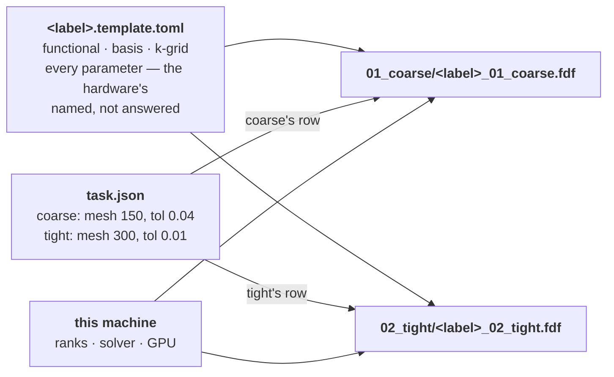

# Stages — a named parameter set over one system, and the file that describes it

**Role:** contract
**Domain:** engines
**Companions:** [`engines/tuning.md`](?doc=engines/tuning.md) — what *values* a
stage should carry and why (this doc says what a stage *is*, never what to put in
one); [`engines/siesta.md`](?doc=engines/siesta.md) +
[`engines/pyscf.md`](?doc=engines/pyscf.md) — the emitters that render an
effective config; [`execution/run-identity.md`](?doc=execution/run-identity.md) —
the id every stage in a folder shares, and the engine parameters that decide
whether a stage continues; [`execution/job-contracts.md`](?doc=execution/job-contracts.md)
— the run directory the decks land in and the persisted-artifact registry;
[`engines/template.md`](?doc=engines/template.md) — the file the effective config
is resolved *from*, and the format every engine's parameters share;
[`archive/2026-08-19-staged-runs-implementation-plan.md`](?doc=archive/2026-08-19-staged-runs-implementation-plan.md)
— the plan that motivates this contract and schedules the work.

**Status: landed.** This document was written first and the code built to it,
the way `web/spectrumchart.md` and `web/vibrationview.md` were: `task.json`
and `jobset init` shipped 2026-08-11 (plan step 2), and `prep`'s five
steps — the effective config resolved from the template ⊕ a stage's
`overrides` and rendered per stage on the target — shipped 2026-08-12
(step 4). *(This line read "proposed, not built — nothing in `SiestaConfig`
matches it yet" until 2026-08-12.)* Remaining work stays in the plan, not
here ([`process/conventions.md`](?doc=process/conventions.md)'s R3 — *status
lives in the roadmap, never in a contract*; the `R1`–`R4` used inside § 4 below
are that section's own, and unrelated).

**This contract owns:** what a stage is, which fields are a stage's and which are
the shared schema's, how an effective config is formed, where a promoted field
lands, and the shape of `task.json`.

---

## 1. A stage is ours, not the engine's

**No engine has a concept of a stage.** SIESTA reads a `.fdf`; PySCF runs a
`.py`. Neither knows the file it was handed is the second of three, or that
anything preceded it. The word exists only inside molbuilder:

> **A stage is a named set of the parameters a mission tunes, laid over the
> shared description of the system it does not.**

The base is *what the system is*. A stage is *how we are approaching it this
time*.

**Scope: one deck per stage, for every engine.** A three-stage calculation is
three decks and three jobs, whichever engine renders them.

> **The open question here is closed** *(2026-08-18, user)*. This paragraph used
> to say one deck per stage was *"SIESTA's shape"*, describe PySCF's staged
> relaxation as a loop inside one Python process writing a single unified log, and
> leave the choice between that and genuinely separate files explicitly undecided:
> *"that decision is not made here."* It is separate files, for both engines, and
> § 1.1a is where it is decided and why.

**A stage resolves completely at generate time.** What comes out is an ordinary,
complete engine input that does not need molbuilder to be interpreted and does
not refer to a stage it follows.

Precisely: the stage name survives in the **filename**, `<label>_<NN>_<name>.fdf`, as a
label — and nothing has to interpret it to run the file. The deck's *content*
carries no stage marker at all. Anything that would require a downstream reader
to understand the word "stage" in order to act correctly is outside this
contract.

### 1.1 No engine config carries a stage list

*Stated 2026-08-07 (user), because the shipped code does the opposite and § 4
only implied it.*

**An engine config is one parameter set.** `SiestaConfig` describes a single
calculation — a mesh cutoff, a basis, one relaxation tolerance. It has no
`stages` field, and the emitter that reads it never learns the word.

*(Amended 2026-08-17: the rule is **no AUTHORED stage list**. A structure
`prep` derives from the resolved description and hands to the emitter one step
later is not a declaration — it cannot disagree with the description, which is
what this rule protects. § 1.1a states the test: can a person put a value there
that the description does not say?)*

**The stage list lives in `task.json`, and nowhere else** (§ 6). It is not a
field of an engine's config, because a stage is not a property of a calculation
— it is a record of the user's intention to tune some parameters across a
sequence of them.

> **This was the sentence the shipped code contradicted, until 2026-08-07.**
> `SiestaConfig.stages` was a `List[SiestaStageSpec]`, so the engine config
> carried a list of stages, and § 4's *"the effective config is an ordinary
> instance of the engine's config dataclass"* could not be true of it:
> resolving a stage would produce a config that still contained the whole
> ladder. `SiestaStageSpec` was therefore **removed**, not reshaped, along
> with the field, its default factory, its validator and its parser.
> `Task.stages` (`molbuilder/task.py`) is the model, and it is
> engine-agnostic by construction. The shipped SIESTA ladder is built from
> it by `siesta/stages.py::default_siesta_stages`.
>
> PySCF was a deliberate exception **for now**: its ladder runs inside one
> process, so its stage list has a second life as engine behaviour. It was left
> alone until the SIESTA path works.
>
> **That gate is met, and the exception is closed** *(2026-08-17, user
> decision)* — see § 1.1a. The rule above now holds for **both** engines with no
> exception, which is what 2026-08-07 was reaching for: it deleted the SIESTA
> engine config's stage list, and this deletes PySCF's. Closing it is completing
> that direction, not reversing it.
>
> **And the second half of the exception closed on 2026-08-18**: the loop that
> gave the stage list its *"second life as engine behaviour"* is retired, so a
> PySCF ladder is N decks and N jobs like any other (§ 1.1a). There is no longer
> a sense in which PySCF's stages differ from SIESTA's.

### 1.1a Closing the PySCF exception — the ladder is declared once, and runs like SIESTA's

*Decided 2026-08-17 (user). § 1.1's exception named its own gate — "until the
SIESTA path works" — and `prep`'s five steps now run over SIESTA end to end.*

**Two things were conflated, and only one of them is PySCF's difference.**

| | SIESTA | PySCF |
|---|---|---|
| **where the ladder is declared** | `task.json` | `task.json` — *was `PySCFConfig.stages`* |
| **how the ladder executes** | N decks, N jobs, a person looks between them | **the same** — *was one deck, one job, a loop inside the process* |

The first row was never a consequence of the second. A ladder can be *declared*
in one place and *executed* in whichever shape the engine requires. Keeping the
declaration in the engine config meant a PySCF description and a SIESTA
description meant different things, and the workflow could not treat them alike.

#### And the second row went the same way *(decided 2026-08-18, user)*

**A PySCF ladder is N decks and N jobs, exactly as SIESTA's is.** The in-script
loop over rungs is retired.

**Why: a ladder exists so that somebody looks between the rungs.** That is the
whole reason stages do not chain — *"a run that continues on its own can spend a
week refining a geometry you would have rejected in a minute"*
([`project-layout.md § 1.6`](?doc=execution/project-layout.md)). Looking between
rungs requires a rung to have *ended*, and a single process running every rung
ends once, at the end. Everything the workflow offers between stages — open the
next attempt, say which run it continues from, read what happened, redo one rung
with different numbers — is per-job machinery, and an engine whose whole ladder is
one job can reach none of it.

**It works because PySCF already has the state a rung hands to the next one.** The
two things a relaxation must carry are the geometry and the converged density, and
PySCF writes both: `<JOB>_optimized.xyz` and `<JOB>.chk`, already declared in its
warm-file vocabulary ([`job-contracts.md § 4.2a`](?doc=execution/job-contracts.md))
and already read by the generated script, which prefers the optimized geometry over
the literal one and loads the checkpoint as its initial guess when it is there.
That is the same pair SIESTA carries as `.XV` and `.DM`. Nothing new has to be
invented for a rung to be able to end.

**What it costs, plainly.** Each rung starts Python again, rebuilds the molecule
and reads the checkpoint back from disk instead of keeping it in memory. That is
wrong when the rungs are many and each is seconds long, where the restart would
dominate what it is measuring. It is right when a rung is a real piece of work —
which is when a ladder is worth having at all, and the case this framework is
built for.

**Five things follow, and they are the whole of the change. All five are in
place; each names the file that holds it, so the claim is checkable.**

1. **The stage token reaches the deck's name, the engine's log and the trajectory
   log** — the same three names it suffixes for SIESTA — so two rungs cannot write
   to one file. It is a render *argument*, never a config field, so the emitter
   never learns the word *stage* (`pyscf/input.py`, `spec_for(..., names=)`, the stage's names).
2. **The `JOB` literal stays unsuffixed**, exactly as `SystemLabel` does and for
   the same reason: the engine finds the previous rung's files by that name, so a
   name that changed per rung would hide them (§ 1, decision 26).
3. **`restart` is both engines'.** One field
   ([`run-identity.md § 4`](?doc=execution/run-identity.md) rule 3) serves both:
   `continue` by default, so a rung reads what the rung before it left, and
   `clean` when somebody says so. It expands into three declared keywords for
   SIESTA and into generated control flow for PySCF, and no shipped ladder sets
   it — a rung's position says nothing about whether there is anything to
   continue from.
4. **PySCF's warm-file declaration carries the geometry.** `<JOB>_optimized.xyz`
   joins `.chk` as `carry = "when-continuing"` (`pyscf/warm-files.toml`). The
   geometry is what a rung hands the next one and the density is the other
   half — the same pair SIESTA carries as `.XV` and `.DM`. **geomeTRIC's
   trajectory is not warm state, and is not carried** *(plan § 5w K10,
   2026-10-01; the M11 review's PO-C16)*: geomeTRIC rewrites it from the first
   step of every run (geomeTRIC 1.1.1 `optimize.py`, `progress.write(xyzout)`
   at each step; `Molecule.write(append=False)`), so a copied one is overwritten
   before anything reads it — in either shape, so the shape changes nothing —
   and each rung's carries the rung's token, which by `job-contracts.md`
   § 2.2a's rule never crosses rungs. **Nor is its scratch folder**, `<prefix>.tmp`: geomeTRIC
   makes it and PySCF's engine never writes into it — it computes in memory
   and has no `read_result` — and nothing reads it back, because the decks
   ask for no Hessian (geomeTRIC 1.1.1 `engine.py` `calc`, `normal_modes.py`
   `calc_cartesian_hessian`). Their rows left the rules file, with a third,
   `_geom_optim.tmp`, that named a file nothing writes; the trajectory's ROLE
   stays declared where it is written (`pyscf/input.ROLE_GEOM_TRAJ`), which
   is how its readers find it.
5. **`PySCFConfig.stages` and the in-script loop are gone.** The field outlived
   `SiestaConfig.stages` on the strength of one reader — the `for STAGE in
   STAGES:` loop that made the list engine BEHAVIOUR rather than a rival
   declaration. With the loop retired the field had no reader, and both went;
   `tests/test_pyscf_stages.py` asserts their absence directly.

#### What a PySCF rung varies

A `Stage` (`task.py`) carries `name`, `overrides` and `execution`, and § 2 says
`overrides` may name **any field of the shared schema** except the few bound to
the whole calculation or fixed by the rung (below). So a PySCF rung is
declared exactly as a SIESTA one is:

```
Stage(name="coarse",
      overrides={"scf_conv_tol": 1e-7, "geom_gmax": 2e-3,
                 "geom_max_steps": 50})
```

*(No `restart`: the shipped ladders set none. Every rung takes the default,
`continue`, and a rung that should start over says so on its run card,
`"execution": {"restart": "clean"}` (§ 6.8d) —
[`run-identity.md § 4`](?doc=execution/run-identity.md) rule 3.)*

**What that required was vocabulary, not a new shape** — a knob is only a legal
override if it is an item of the shared schema, and PySCF's convergence knobs
were not. They are:

| catalogue item | its `engine_key` |
|---|---|
| **`scf_conv_tol`** | `mf.conv_tol` |
| `geom_gmax` | `geomeTRIC convergence_gmax` |
| `geom_grms` | `geomeTRIC convergence_grms` |
| `geom_dmax` | `geomeTRIC convergence_dmax` |
| `geom_drms` | `geomeTRIC convergence_drms` |
| `geom_etol` | `geomeTRIC convergence_energy` |
| `geom_max_steps` | `geomeTRIC maxsteps` |
| `on_nonconvergence` | *(none — `kind = "produce"`)*, because it **is** generated control flow rather than a keyword |
| `geom_continue_retries` | *(none — same reason)*, and meaningless without the one above it |

All carry `engines = ["pyscf"]` and `group = "stage"`, and their per-tier values
are [`tuning.md` § 2.4 and § 2.5](?doc=engines/tuning.md)'s — stated there,
written down once in `PYSCF_STAGE_PRESETS`, and checked against the table on
every run.

**`scf_conv_tol` is one item, and that is the finding that decided the rest.**
The engine config used to declare an SCF tolerance of its own beside the
catalogue's, the two agreeing only by the coincidence of both naming
`mf.conv_tol`. That is the drift § 1.1 exists to prevent, sitting inside the
exception § 1.1 granted.

**None of them gets a `--flag`.** They are set per rung, in `task.json` — and
no config field has generated a command-line option since the dataclass →
click bridge was deleted (2026-09-17). That is not a new
policy: the flat `--geom-max-steps` family was **deliberately retired** when
these knobs became per-stage, and a catalogue row that regenerated them would
have undone that.

#### Why `group = "stage"` is the right home

§ 1.3's mechanism — *the default selection is a group each engine declares* — is
already live in the catalogue and already per-engine. Before this landed SIESTA
declared 11 items in `group = "stage"` and PySCF declared 3, so PySCF's group
described about a third of its own ladder. **It is 24 and 12 now** (the
vibration kind's six electronic-structure-probe selectors left the group on
2026-09-24 — nothing steps them per stage; [`engines/vibration.md`](?doc=engines/vibration.md)
§ 3.1), and the same UI, the same `varies` machinery and the same resolver
serve both engines.

**No new mechanism is introduced by this decision.** The catalogue is the
master, `overrides` names schema fields, a group declares the default selection,
`prep` resolves — every part is the one already in use for SIESTA.

#### No engine config carries a stage list, and PySCF is not an exception to that

**The rule is about where a ladder is DECLARED**, and after this decision
neither engine's config declares one. `task.json` is the only thing anyone
authors, for either engine; `prep` resolves it into one config per rung, and a
rung's config carries THAT rung's values as ordinary flat fields — the same
shape SIESTA's per-rung knobs always had.

The practical test, and the one to keep: **can a person put a value there that
the description does not say?** For a config holding a list of rungs the answer
is yes, which is what makes it a second declaration. For a config holding one
value per knob it is no, because a rung's config is overwritten from the
resolved description on every render.

**The tier values are a table, not a field.** Each engine ships one —
`SIESTA_STAGE_PRESETS` and `PYSCF_STAGE_PRESETS`, both keyed by the same three
tiers — and `<engine>/stages.py::default_<engine>_stages` turns it into the
shipped ladder. A table of defaults is not a declaration: nothing reads it at
render time, and a description that names no tier gets no value from it.

#### What stays PySCF's own

The engine differs in **which parameters a rung varies** and in **how it
answers a question the shared schema asks** — never in the shape of the ladder,
the number of decks, or the number of jobs. Two such answers today:

- **`restart` is control flow rather than keywords.** SIESTA expands the field
  into three declared keys; PySCF's script reads `<JOB>.chk` and
  `<JOB>_optimized.xyz`, or does not. One field, two answers, and the mechanism
  is the engine's business ([`run-identity.md § 4`](?doc=execution/run-identity.md)
  rule 2).
- **`on_nonconvergence` is real control flow**, which is why § 3 keeps it out of
  the *shared* stage schema and why it is a PySCF-only item: on SIESTA the same
  word names a scheduler edge that no longer exists.

### 1.2 Which parameters may vary is the user's choice, not a class's

**The catalogue and the selection come from different places, and fusing them
is what limited a stage to four values.**

| | Question | Who answers |
|---|---|---|
| the **catalogue** | *What settings exist? What type, unit, range and label does each carry?* | **the catalogue itself** — `molbuilder/data/catalogue.template.toml`, authored as TOML ([`template.md`](?doc=engines/template.md) § 4.3). *(This row said "the engine's config class, through the generated form schema" until 2026-08-16. That is the direction `template.md` § 2.1 forbids: it makes the Python class the master and the file its printout. The reversal landed 2026-08-14 when `render_template` was deleted; a config class now **translates** the catalogue on the way out and defines nothing.)* |
| the **selection** | *Which of those settings vary per stage?* | **the user**, in the UI, recorded as `varies` in `task.json` (§ 6.2) |

Today's four relaxation values are a **default selection** over that catalogue —
and not a privileged class of parameter. Any field of the shared schema can be
selected, except the items bound to the whole calculation — the items the catalogue marks `shared` for the kind, the
electronic state first among them (§ 1.3's note; ES1) — the items the rung
itself fixes (`role`: SIESTA's per-step forces and coordinates, a transport
rung's solver and bias; `template.md` § 6.4) — and the run settings, the
catalogue's `execution` items, which each rung states on its run card
(§ 6.8d).

### 1.3 The default selection is a group each engine declares, not a list in code

**Every item in the catalogue carries a `group`**, and the tag is exactly this
question. The vocabulary is closed and lives in `template.GROUPS`
([`template.md`](?doc=engines/template.md) § 5), in render order:

| group | meaning | SIESTA | PySCF |
|---|---|---|---|
| `setup` | what the run is called, and where its pseudopotentials come from — nothing can be built without these | *(2)* `system_label`, `psml_lib` | *(1)* `job_name` |
| `profile` | set once for the calculation | *(14)* `xc_functional`, `solution_method`, `spin_treatment`, `net_charge`, `species_order`, … | *(23)* `method`, `basis`, `functional`, `dispersion`, `solvent`, … |
| **`stage`** | **the settings that typically vary across a sequence** | *(11)* `basis_size`, `pao_energy_shift`, `mesh_cutoff`, `dm_tolerance`, `dm_energy_tolerance`, `scf_energy_converge`, `kgrid`, `kgrid_displacement`, `relax_type`, `relax_force_tol`, `relax_max_displ` | *(3)* `scf_conv_tol`, `scf_conv_tol_grad`, `grid_level` |
| `budget` | what it is allowed to spend | *(5)* `max_scf_iter`, `relax_steps`, `block_size`, `diag_algorithm`, `parallel_over_k` | *(1)* `scf_max_cycle` |
| `output` | what the run writes | *(7)* the `write_*` set, plus `copy_psml` | *(6)* `verbose`, `chkfile`, `log_file`, `save_*`, `write_trajectory` |
| `staging` | answered by the staging surface, not by a parameter form — the machine asks, the GPU flag, and how a run resumes | *(5)* `mpi_np`, `omp_threads`, `use_gpu`, `restart`, `continue_retries` | *(3)* `threads`, `use_gpu`, `stage` |

The counts are the whole group, the names a readable sample where the group is
long; `max_memory_mb` is in `staging` for **both** engines, because it is one of
the three items that declare no `engines` list and therefore apply everywhere
([`template.md`](?doc=engines/template.md) § 4.2).

> *(This table read three groups until 2026-08-16, sourced them from the config
> classes' `metadata["workflow_group"]`, and put `mpi_np` and `omp_threads`
> under `budget`. All three are stale: the vocabulary is six and lives in the
> catalogue, and the machine asks moved to `staging` — a form does not ask a
> person how many ranks the scheduler granted.)*

> **So `varies` starts as the engine's `stage` group**, and the user adds to or
> removes from it — declared by each engine, beside the fields themselves, in the
> one place that already knows what a field *is*. No engine needs code in the
> shared machinery, and a new engine gets a working starting point by tagging its
> own fields.

**`group` says which panel asks about a setting. It does not say whether the
setting may differ between stages.** Those are two questions, and the answer to
the second is § 6.2's: any setting the description is allowed to hold may differ
between stages. The `stage` group is where the table *starts*, not what it is
limited to.

> **Corrected 2026-08-18 (user).** The paragraph above used to end *"That is the
> whole of which parameters may vary"*, and one tag was being asked both
> questions. A setting can only carry one group, so anything that is not a
> physics parameter — and therefore belongs on the staging panel — lost its
> ability to differ between stages at the same time.
>
> `restart` is the case that made this visible, and it is the worst one it could
> have been: **it is the setting that decides whether a ladder is a ladder.**
> `restart` says whether a stage starts from what the stage before it produced.
> It is not a physics parameter, so it sits in `staging`; and because the table's
> columns were being read off the `stage` group, it could not become a column at
> all. A ladder built anywhere except `jobset init --stage-strategy` therefore
> had no `restart` on any stage — which, while `clean` was the default, meant
> every stage started clean and the stages were three unrelated runs. Nothing
> said so; the refusal only arrived later, at `prep --from`, as *"this stage
> declares no warm-restart files"*. **Flipping the default to `continue`
> (2026-08-18) is what removed that failure mode**: a ladder that says nothing
> now continues, which is what a ladder is.
>
> ⚠ **The tag is a default, never a restriction.** Any field of the shared schema
> may be promoted, whatever group it carries — § 1.2's rule stands, with its
> exceptions: an item bound to the whole calculation (`shared`), one the rung
> fixes (`role`) and a run setting (the catalogue's `execution` items, each
> rung's run card, § 6.8d) are not columns at all. The group only decides what
> is *already ticked* when the tab opens.
>
> **What the tag was actually built for, since it is easy to over-read.** It is a
> **UI grouping**, added 2026-06-13 to fix a reported bug: the form used to mix
> stage, budget and system fields inside the same fieldsets, *so switching the
> stage preset silently rewrote budget and system fields too*. Two consumers, both
> in the surface — `form-schema.js` renders the cards in a fixed order so
> "switching the stage selector touches the stage card only" is visible at a
> glance, and `_shared.py::resolve_workflow_group` routes a validation finding to
> the card whose fields it concerns (`web/ui-contract.md` Rule 2). **It has never
> been a model constraint and must not become one.** Under the checkbox design it
> keeps three honest jobs: ordering the form, routing findings, and deciding which
> boxes start ticked.
>
> `profile`'s own subtitle reads *"Set once per run; doesn't change between
> stages"*, and that is a claim about **typical use, not a constraint** — which
> matters, because the subtitle is the sentence a user reads before deciding
> whether to tick the box beside a field. When a `profile` field turns out to
> vary in practice, the honest answer is to fix the tag, not to weaken the
> subtitle; `relax_type` was exactly that case and is now `stage` (below).
>
> **Four items are bound, and not by this tag** *(W34, decided 2026-09-25)*:
> the electronic state — `net_charge`, `spin_treatment`, `unpaired_electrons`,
> `method` — belongs to the calculation, and a stage override of it is refused,
> because every rung's `.DM` or `.chk` is a density for one state. The binding
> is declared on the items, the way transport's `shared` marker binds a value to
> every rung, so the `profile` tag stays what this note says it is
> ([`science/chemistry-correctness.md`](?doc=science/chemistry-correctness.md) § 2a.2,
> ES1).
>
> **The groups may overlap, and that is not a defect** (user, 2026-08-07). They
> serve **user clarity and where a validation finding appears** — not a partition
> of the model. A field can belong to the run's identity *and* be something a user
> steps; `relax_type` is exactly that. Nothing breaks when the sets intersect,
> because nothing downstream reads the tag to decide anything.
>
> **Two decisions, and they are orthogonal:**
>
> | Question | Decided by | When | By whom |
> |---|---|---|---|
> | **where a value lives** — template only, or template + `task.json` | **the checkbox** | per calculation | the **user** |
> | **how a field is presented, and where its advice lands** | **the tag** | per engine, once | **us** |
>
> So `profile` does not mean *template-only*, and asking which file it "belongs
> to" is the wrong question. A `profile` field a user ticks simply gains a stage
> column, like any other.
>
> **Which is how the tag earns its keep under the rule that a tag must be
> meaningful structurally or functionally: it is functional, and it is not
> structural — and it does not need to be.** Its jobs are real and one of them is
> pinned by a wire-contract test.
>
> ### ⛔ The `section` half of this rule is RETIRED for the two engine configs
>
> **Superseded 2026-08-15.** The SIESTA and PySCF forms are built from
> `data/catalogue.template.toml`, which has no `section`
> ([`engines/template.md`](?doc=engines/template.md) § 5). An item is on the
> form because the catalogue carries it, and § 7 makes that *every parameter
> the schema declares*.
>
> **The passage that stood here got the facts backwards, and it is worth
> recording why rather than deleting it.** It said a field without a `section`
> is *"deliberately internal — `species_order`, `copy_psml` — and never
> rendered"*, and it withdrew an earlier finding on that basis: the untagged
> fields *"are not in the form and there are no findings to route"*.
>
> Both of those are now false, and the second was never a safe inference.
> `species_order` and `copy_psml` are on the form today, along with thirteen
> others that `section` had been hiding — ordinary parameters that reach the
> generated file, invisible because a presentation tag had become an opt-in
> gate. The original finding was right: they were half-integrated. It was
> withdrawn because `section` was read as evidence of intent, when all it
> recorded was that nobody had typed it.
>
> **What replaces it**, and it is not weaker: every catalogue item must declare
> a `group` from the closed vocabulary `template.GROUPS`, guarded by
> `tests/test_catalogue_agreement.py::test_every_catalogue_item_declares_a_panel`,
> with a second guard that the renderer knows every card the form asks for.
>
> `section` itself is gone *(2026-10-02)*: the last tab that read it moved onto
> the catalogue on 2026-09-24, and the dataclass form builder and the key were
> deleted with `TransportConfig` ([`web/form-schema.md`](?doc=web/form-schema.md) § 1a).
>
> **And the selection is made in place, one checkbox per parameter** (user,
> 2026-08-07) — **not** a separate list of stage-able settings anywhere. The form
> already lists every parameter; each one carries a *vary per stage* checkbox
> beside it, and what is ticked **is** `varies`. A second list would be a second
> copy of the field set, drifting from the first — the same duplication this whole
> correction removed. [`web/task-setup.md`](?doc=web/task-setup.md) § 5 and
> [`web/form-schema.md`](?doc=web/form-schema.md) § 1.3 carry the surface detail.
>
> **`relax_type` was tagged `profile`, that tag was wrong, and it is now
> `stage`** — ✅ corrected, verified against the catalogue 2026-08-16. The call
> was scientific rather than a naming preference (user, 2026-08-07): a ladder
> deliberately changes the optimizer between stages — CG to warm up, Broyden
> once the geometry is close — so it belongs in the `stage` group, with
> `engines/tuning.md`'s reasoning behind it. It also demonstrated the rule
> above: even while the tag was wrong, a user could tick the box.

**The four hard-coded values are historical residue, and the tagging proves it**
(2026-08-07). Of the four that `render_siesta_stage_fdfs` could vary *(the
shipped renderer this critique was written against; deleted 2026-08-12 with the
pre-resolve producers — `varies` + `overrides` through `prep` is the mechanism
now)*, **two were not even tagged as stage settings**:

| hard-coded as varying | tagged, when this was written | tagged today |
|---|---|---|
| `relax_force_tol` | `stage` ✓ | `stage` |
| `relax_max_displ` | `stage` ✓ | `stage` |
| `relax_type` | **`profile`** — read as a set-once choice | **`stage`** — the tag was the thing that was wrong, and it was corrected |
| `relax_steps` | **`budget`** — a resource | `budget` — still a resource, and correctly so: it caps how long you are willing to relax, not how well |

And **eight fields tagged `stage` could not be varied at all**: `basis_size`,
`pao_energy_shift`, `mesh_cutoff`, `dm_tolerance`, `dm_energy_tolerance`,
`scf_energy_converge`, `kgrid`, `kgrid_displacement`. So the shipped set
simultaneously admitted two fields the tags said were not stage settings and
excluded eight they said were. **The tagging already knew the right answer; the
stage mechanism never read it.**

*(The right-hand column is the 2026-08-16 recheck. One of the two mismatches was
a genuine mis-tag and is fixed; the other was never a mismatch, which is why the
count of stage-tagged-but-unvarying fields grew from six to eight rather than
shrinking — `scf_energy_converge` and `kgrid_displacement` joined the `stage`
group and the deleted renderer would not have varied them either. The argument
this passage makes does not depend on the arithmetic: a hard-coded list of four
names cannot track a catalogue that gains items.)*

### 1.4 One mechanism, engine-specific only where the science is

The same machinery serves every engine, and exactly three things are the
engine's own:

| | Shared, written once | The engine's |
|---|---|---|
| the description | `task.json` + its reader | — |
| the catalogue | **the file itself** — one authored TOML serving every engine, its schema, and the form-schema generator that reads it ([`template.md`](?doc=engines/template.md)) | **which items apply to it** — each item's `engines` list — and, per item, its `anchor` and `engine_key` |
| resolution | template ⊕ `overrides` → one config | — |
| the per-stage table | one tab, driven by `varies` | — |
| the deck | — | **the file the engine reads** (`.fdf` for SIESTA, `.py` for PySCF) |
| correctness | the *structural* preflight (§ 6.6) | **the science** — is this basis adequate for that cutoff, does this ladder loosen |

**Everything generic happens first; the engine-specific judgement happens last,
on the resolved config.** That is what R2 already requires — a stage is validated
as a resolved whole, never as a diff — and it is why the split works: by the time
an engine's validator is asked anything, it is looking at an ordinary complete
config of its own type, exactly as it would for a single run.

> **The science validator is the one that already ships, not a new one**
> (2026-08-07). `molbuilder/validation/` registers a validator **per config
> class** (`_register_engine_validator`) and exposes one door,
> `validate(struct, cfg)`. It is already both of the things a stage needs:
> **the gate before a script is written** — `siesta/input.py`, `pyscf/input.py`
> and `cli.py` all call it — **and the live advice in the tab**, through the web
> blueprints. Per-stage validation is therefore *that same call, once per
> resolved stage*, and nothing engine-specific is added to the staged machinery.
>
> **This also decides an argument elsewhere.** `validate` takes a **config
> object**. Any design in which a stage is resolved by rewriting lines of deck
> text has nothing to hand it, and would lose both R1/R2 *and* the live advice a
> user gets today — which is why the effective config must be a real config
> (§ 4).

**So the stage setting is a contract between the UI and `prep`, and the engine
sits downstream of both.** The browser asks the user which parameters to vary
and writes the answer down; `prep` reads it and resolves each stage into one
ordinary config; the emitter renders that config and never sees a stage. Because
the mechanism is *catalogue × selection*, it is engine-agnostic without being
written twice: every tab already has a schema, so every tab gets this.

> **What went wrong, named so it is not rebuilt.** `stages` was made a *field*
> of `SiestaConfig`, so the form generator walked into it and answered the
> **selection** question with the **catalogue** machinery — listing
> `SiestaStageSpec`'s own fields as the columns a user may vary. That is why a
> stage could vary exactly four things: they were the four somebody typed into
> a Python class. A generator that reads an engine class to discover *what the
> user is allowed to choose* has the arrow backwards.
>
> **Deleting the *field* is what closed it** (2026-08-07) — not deleting the
> generator, which is doing its own job correctly. `SiestaConfig` now has no
> `List[<dataclass>]` field at all, so the catalogue machinery has no route by
> which it can reach a stage. `tests/test_siesta_stages.py` asserts the
> *shape* and not merely the name, since a differently-named ladder would
> reopen it just as wide.

---

## 2. The object

```jsonc
{ "name": "coarse",
  "overrides": { "mesh_cutoff": 150, "relax_force_tol": 0.04 } }
```

**Three fields, and no others.**

| Field | Type | Meaning |
|---|---|---|
| `name` | `[A-Za-z0-9_]+` — letters, digits, underscore, **no hyphen**; **compared case-insensitively everywhere** (two names differing only in case are ONE name, refused as a duplicate) | becomes the deck's suffix, `<label>_<NN>_<name>` (`job-contracts.md § 2.3`). The hyphen is excluded because it is the separator *around* a name, never inside one: an attempt is `run-0`, a trial is `bench-G1K4C6`, and a flat stdout is `<label>_<NN>_<name>-run<N>.out`. A name free of hyphens means any of those can be split on one without knowing what it contains. Case folds because the name keys **filenames**, and the filesystems these run on include case-insensitive ones (macOS, some network mounts) — `Tight.fdf` and `tight.fdf` are one file there, so `Tight` and `tight` must be one stage everywhere (D6, 2026-08-12: the constructor compared exact strings while both parsers folded case; all three doors agree now). **One key, `identity.stage_key`**, compares a name the description holds with one from outside it — the duplicate check, the verbs' resolver (`launch task --stage TIGHT` is `tight`) and the role rule (a SIESTA vibration's `Relax` is its relaxation); until K12 the last two compared exact strings (plan § 5w K12, the M11 review's SS-C15). A verb resolves once, at its entry, and works with the description's own spelling after that |
| `overrides` | map | schema field name → that stage's value |
| `execution` | map | *(added 2026-09-02)* what THIS rung runs at, when it differs from the calculation's own answer — one value per parameter, laid over the top-level block field by field (§ 6.8d). Absent means *"runs at what the calculation says"* |

**There is no `enabled`** *(W38 F5, agreed 2026-09-27 — user: "remove on/off
for optimization and vibration", "yes, drop the seed switch too")*. A
stage is in the description or it is not. Removing one that left files leaves
them untouched and keeps its number taken
([`project-layout.md`](?doc=execution/project-layout.md) § 4.2); a transport
ladder's seed is skipped by removing it. A description written before carries
`"enabled": true` on every stage — read and ignored; `"enabled": false` is
refused by name, saying to remove the stage instead. A shipped ladder's
strategy writes the stages it runs; a tier it leaves out is added later from
the tier presets, its values filled in ([`web/task-setup.md`](?doc=web/task-setup.md)
§ 9). *(Until 2026-10-03 a stage carried `enabled`, and a strategy wrote a
switched-off third tier.)*

`overrides` may name **any field of the shared schema** and **never** `name`,
nor an item bound to the whole calculation — the items the catalogue marks `shared` for the kind (the
electronic state's four for every kind; the calculation's identity — its
`system_label`, `species_order` and `psml_lib` — for every SIESTA kind;
transport's electronic description) — nor an item the rung itself fixes (`role`:
SIESTA's per-step forces and coordinates on every kind, a transport rung's
solver and bias). A
description carrying a stage-field name inside `overrides` is refused: two homes
for one fact is how the previous model produced fields that lived in both places
and silently disagreed. A bound item there is refused by name at resolve, saying
why it is the calculation's (`template.why_shared`; ES1 for the state: every rung's
`.DM` or `.chk` is a density for one electronic state); a fixed one, saying why
it is not a choice (`template.why_role`) — and the same refusal meets a pin or a
sweep axis naming it (`template.md` § 6.4).

**`overrides` and `execution` are not two names for one thing**, and the
difference is what reads them. `overrides` changes what the calculation *is* —
a mesh cutoff, a force tolerance — and lands in the deck through `varies`
(§ 6.2). `execution` changes how this rung *runs* — ranks, threads, the device,
the solver — and lands in the launch, by the direct map `generator.md` § 4.3a
states. A field that changes the answer may never appear in `execution`, and
validation refuses one by name.

---

## 3. Which fields are a stage's, and which are the schema's

Two questions, asked in order. It matters that they are two: either alone
mis-sorts a field.

> **1. Does it survive without a scheduler?**
> A setting that means nothing until something else queues the work does not
> describe a calculation. `execution/job-system.md` owns it.
>
> **2. Of what is left: can a single run mean it?**
> If yes, it is an ordinary field of the shared schema, which a stage may
> override like any other — *wherever that field happens to land* (§ 5).
> **A stage types only what a single run cannot mean.**

Question 2 deliberately does **not** ask where the field ends up. A promoted
field may become a deck line, a wrapper setting, or a scheduler request; sorting
fields by destination is what produces stage types that grow without limit.

Worked against the fields the deleted `SiestaStageSpec` carried — **the class
is gone (§ 1.1), and this exercise is why**: sorting its eight fields by
these two questions leaves exactly two on the stage, which is the same answer as
*a stage is not a property of a calculation*. The table is the derivation, not a
description of something that will still exist.

| Field | Survives without a scheduler? | Can a single run mean it? | Lands |
|---|:--:|:--:|---|
| `name` | yes | no — a single run is named by its id | **the stage** |
| `relax_type` | yes | yes | the shared schema |
| `relax_steps` | yes | yes | the shared schema |
| `relax_force_tol` | yes | yes | the shared schema |
| `relax_max_displ` | yes | yes | the shared schema |
| `continue_retries` | yes — `running-a-job.md § 3.5` | yes | the shared schema, routed to the **wrapper** (§ 5) |
| `on_nonconvergence` | **no** — its only effect was the scheduler edge | — | **outside this contract** — and, for SIESTA, **retired with the edges on 2026-08-10** |

Two of those are worth stating explicitly, because both were on the stage type
and neither belonged there.

**`on_nonconvergence` fails question 1.** Its entire effect was the dependency
edge a JobSet threads (`proceed → afterany`, `halt → afterok`). Without a
scheduler there is nothing for it to mean.

> **And on 2026-08-10 that argument finished the job.** A staged ladder stopped
> emitting edges (`project-layout.md` § 1.6), so the policy had **no effect at
> all** — accepted, resolved, and dropped. It was removed from the SIESTA
> producer rather than left inert. Reinstating a per-stage policy means giving
> it a home in the description *and* a reader that does something with it.
>
> **PySCF kept its `on_nonconvergence`**, because its rungs ran in one process
> and the setting became generated control flow inside that loop — a real effect,
> and the reason the same word meant something on one engine and nothing on the
> other.
>
> **Settled with the loop's retirement** *(2026-08-18, § 1.1a)*: it survives as
> ONE rung's own policy — what that deck does when geomeTRIC reports its
> criteria unmet at the step budget — never an edge between two jobs, and
> [`pyscf.md` § 3](?doc=engines/pyscf.md) owns it.

Leaving the stage is not enough, though: if it stayed a field of the **shared
schema** it would be promotable through `overrides` like anything else, and § 2's
"any field of the shared schema" would quietly readmit it. So it is not a field
of the shared schema at all. It belongs to the JobSet producer's own input, which
is a different object with a different reader
([`execution/job-system.md`](?doc=execution/job-system.md) — `job-system.md § 4.1`).

**`continue_retries` passes both questions and is still not a stage field.**
`running-a-job.md § 3.5` is explicit: a *single* SIESTA run whose wrapper was
installed with a retry budget re-runs itself with `--continue`. It is an ordinary
shared field; what made it look special is only where it lands. That is also why
`job-system.md § 4.1` records that the SIESTA ladder never implemented it — the
field sat on the stage, and the stage is not what honours it.

**One field arrives.** Whether a stage continues from what is already in the
folder or starts clean has to be sayable, and by question 2 it is a shared field:
a single run can mean it too. `restart` (`continue` | `clean`) joins the shared
schema; what the generator does with it is
[`execution/run-identity.md`](?doc=execution/run-identity.md) § 4.

---

## 4. The effective config

> **effective config = the template's values ⊕ that stage's `overrides`**
> — and, laid on last, what the rung itself fixes (`role`,
> [`template.md`](?doc=engines/template.md) § 6.4), which no override may name.

The template (`<label>.template.toml`) is the science backbone the generating tab
wrote — **everything a script owns, with values**: what the user set, or the
default where they did not touch it. A stage supplies only the cells it changes.

**Its format is [`template.md`](?doc=engines/template.md)** — a TOML file with
one table per parameter, each carrying the value in force plus everything known
about it. That is what makes this section implementable: `prep` reads the values
with one `tomllib.load`, and **nothing has to parse an `.fdf`** — which nothing
in molbuilder can do. Together they make an ordinary instance of the engine's
config dataclass — a `SiestaConfig`, not a new type — so every default, every
bound and every `engine_key` mapping applies to it unchanged.

> **Corrected 2026-08-07 (user). This section used to say `base` ⊕ `overrides`,
> and `base` was a key in `task.json` holding "every schema field, one value".**
> That is the template's content, written a second time in a second file, with
> nothing saying which one `prep` reads — and § 7.1's own diagram never mentioned
> it: *template ⊕ the stage's row ⊕ this machine*. The document contradicted
> itself for three sections and I reported the overlap as an open question rather
> than as the duplication it is.
>
> **`base` is removed from `task.json`.** The file carries what *changes* —
> `varies` and the per-stage `overrides` — plus what identifies the calculation.
> What does not change is already in the template, once.

Two rules govern it, and both exist to stop a stage becoming a special case:

**R1 — one object is validated and rendered.** The config handed to validation is
the same object handed to the emitter. What was checked and what was written
cannot come apart.

**R2 — a stage is validated as a resolved whole, never as a diff.** Two overrides
can each be individually reasonable and jointly wrong: a mesh cutoff that is
fine, a basis that is fine, and a pair that is under-converged together. The
validator is handed a whole config plus the stage's name as a label — never an
overlay. The label travels beside `where`, never inside it
(`science/validation.md § 4.1`).

**§ 4 R3 — the sequence is checked as well as its members.** § 4 R2 makes
every stage
individually sound and says nothing about the order they are in, yet the order is
the whole point of having several. A ladder that *loosens* — stage 2 coarser than
stage 1 — passes R2 twice and is almost certainly a mistake, because the second
stage throws away what the first paid for. So a description is also read across
its stages, and a finding about the sequence carries **no** stage label: it is a
fact about the description, not about a member of it (the same rule that already
governs a shared-config complaint, § 6.2). What the checks *are* — which
parameters must not go backwards, and by how much — is `engines/tuning.md`'s to
say, not this contract's; **the catalogue carries it**, each item's `tightens`
(`"down"` for a tolerance, `"up"` for a mesh cutoff — `template.md` § 5), set
where `tuning.md` § 2 gives a tier table, and read on every engine
*(2026-09-30, plan § 5w K4: a table of SIESTA's four stood in
`validation/stages.py` until then, M11 PO-C14)*. **Only rungs of one role are
compared** (`template.stage_role`, `template.md` § 6.4): a ladder tightens one
calculation as it goes, and rungs that are different programs on different cells
— transport's five, a vibration's relaxation and its force constants — are not
one calculation tuned twice, so a transport rung's own tolerance never reads as
a loosening (M11 T-F14). An optimization's rungs have no roles and are compared
whole.

**An `error` in any stage blocks the whole produce**, not just its own deck.
That is not a policy choice made here — it falls out of § 7.2: the folder appears
whole or not at all, so there is no such thing as writing the stages that passed.

---

## 5. Where a promoted field lands — four destinations

A promoted field is not always a line in the deck, and assuming it is writes
decks that are subtly wrong for the machine they run on.

| Kind | Examples | Lands |
|---|---|---|
| an ordinary deck line | `mesh_cutoff` → `MeshCutoff`; `diag_algorithm` → `Diag.Algorithm` | the stage's deck, and nowhere else |
| **a deck line that is also a resource decision** | `use_gpu` → `Diag.ELPA.GPU` | the deck **and** the wrapper's env routing **and** a scheduler's `--gres` |
| a field the deck never carries | `mpi_np`, `omp_threads`, `continue_retries` | the **wrapper** — baked at prep (`continue_retries`) or resolved at run time (ranks, threads) — and a scheduler's `-n` / `-c` if one is asked |
| **a field that is a claim about the run directory** | `required` | **the check the wrapper runs in the directory the job runs in**, immediately before the engine starts — and nowhere else (`job-contracts.md § 2.1`, § 4.4) |

> **The second row is about where a value *lands*, not about who *chooses* it**
> (clarified 2026-08-07, because the wording invited the other reading).
> `use_gpu` is an **ordinary explicit option** — the user ticks it, and
> nothing derives it from the machine. What makes it a resource decision is only
> that the choice is *read* downstream as well as written into the deck, which
> is exactly what [`template.md`](?doc=engines/template.md) § 6.1's `read_by`
> records on the item itself. It is the **only** item in the catalogue that
> carries one, and the list is `["wrapper"]`.
>
> > ⚠ **This note argued from `diag_algorithm` until 2026-08-16, and the premise
> > had already been measured false on 2026-08-14** — one contract was corrected
> > and this one was not. Any ELPA solver does *not* need a different
> > environment: conda-forge's SIESTA carries ELPA through ELSI and runs it on
> > CPU (`engines/siesta.md` § 7.2, `running-a-job.md` § 2.3). So
> > `diag_algorithm` decides nothing outside its own deck, declares no `read_by`,
> > and belongs in the first row. `use_gpu` is the live case and the better
> > one: the GPU build, the `gres` ask, MPS, the NUMA pin and the rank/thread
> > budget all turn on it. [`template.md`](?doc=engines/template.md) § 6.1
> > carries the same correction.
>
> **And whether the engine can honour a solver choice is the engine's business**:
> a deck asking for an ELPA solver a build does not have fails when SIESTA runs,
> which is the right place to fail. The generator does not check.
>
> **`block_size`** is written verbatim when set, under every target; unset
> means SIESTA's own automatic and the keyword is not emitted at all
> ([`tuning.md § 2.11`](?doc=engines/tuning.md) owns the rule; under GPU ELPA
> SIESTA rounds the diagonaliser's block down to a power of two itself;
> [`template.md`](?doc=engines/template.md) § 12).

> **Why the fourth row is not the third one wearing a hat** *(added 2026-08-08)*.
> The third row's fields are **values the wrapper uses**: a rank count becomes an
> `mpirun -np`, a retry budget becomes a loop. `required` is not a value the
> wrapper uses — it is a **statement about the world** that the wrapper *checks*,
> and the only place with a definite answer is the run directory at run time.
>
> Not at produce: the files do not exist yet, and a `.TSHS` may legitimately
> arrive from a different calculation the user copies in, so *"does an earlier
> stage produce this?"* is unanswerable and is deliberately not asked. **Not at
> prep either, for the same reason** — a declared file may come from a different
> calculation entirely, so at prep its absence proves nothing.
>
> This is also why `required` is phrased as a **claim** rather than an
> instruction. *"Carry this file for me"* can only be obeyed; *"this stage
> cannot run without this file"* can be **verified** — warn by name, offer
> abort, `MOLBUILDER_FORCE=1` to proceed unattended.
>
> > ⚠ **Corrected 2026-08-11.** This paragraph rested on `Carry`'s symlink
> > *"being meant to dangle until the producer ran"*, and said the check
> > *"reuses the shipped `_warm_check` in the staged runner"*. **Neither exists:**
> > `Carry` was deleted 2026-08-10 and prep copies real files, and
> > `render_siesta_stages_runner` with its `_warm_check` went the same day
> > (there is one wrapper emitter, `runwrap.render_run_wrapper`). The
> > conclusion is unchanged; the reason is now the one above, and **the check
> > itself is unbuilt** — [`job-contracts.md`](?doc=execution/job-contracts.md)
> > § 4.4 carries the same correction, made a day earlier. *Two documents held
> > one argument and only one was fixed, which is what § 11 of
> > [`architecture.md`](?doc=execution/architecture.md) exists to prevent.*

**The routing is derivable, never a second list.** A field carries an
`engine_key` when it is a line in the deck; the config ↔ exchange translation for
the third row is already fixed by `job-contracts.md § 6.2` and applied by the
producer at its boundary. The fourth row needs no translation at all — the
value is read where it is checked. Nobody maintains a mapping table by hand.

**Walltime, memory and partition are deliberately absent from that table.** They
are not fields of the shared stage schema: they are the job's **scheduler
ask** — `allocation` (§ 6.8a), the run card's `time` and `domain` (§ 6.8e), or
`prep`'s flags — and a named `domain` resolves to a partition and QoS on the
target's record. Each is stated or refused; none has a default
([`architecture.md` § 5.2](?doc=execution/architecture.md)).

### 5.1 The middle row, and what it costs

`job-contracts.md § 6.2` lists the eigensolver as a config value that becomes a
`.fdf` keyword and the GPU request as one *derived from* the `.fdf`.
`running-a-job.md § 2.3` says which of the two actually moves the wrapper:
**only `Diag.ELPA.GPU true` re-routes**, to `molbuilder-siesta-gpu`. CPU-ELPA
does not, because the packaged SIESTA carries ELPA through ELSI and runs it on
CPU. The two environments differ by **provenance** — one installs from packages
anywhere, the other has to be built from source — so this is not a hardware
split, and sending CPU-ELPA to the source build used to refuse a perfectly
runnable calculation on any machine where compiling is not allowed.

Two consequences:

- **Two stages in one folder may need two different environments.** A coarse
  stage on CPU and a tight stage on ELPA-GPU is an ordinary thing to want,
  and it works: routing is per script, so each deck's own wrapper activates its
  own environment. Nothing about the folder has to change.
- **It is a correctness gate, and it fires late.** If a stage opts into a build
  whose environment is not installed, generation raises with an install hint
  (`running-a-job.md § 2.3`) — but that check belongs to *wrapper* generation,
  which happens after the decks are rendered, and § 6.6 deliberately does not
  duplicate it in the preflight. So the refusal arrives with some decks already
  written, which is why § 7 requires the whole folder to be produced
  transactionally (§ 7.2).

### 5.2 A deck line may depend on the launch

**A deck carries values tied to the launch it was rendered for.** SIESTA's
BENCH-MARKS block (`job-contracts.md § 3.3`) records the rank count (`mpi_np`)
and, when the deck carries a `BlockSize`, the window that rank count allows —
**orbitals over ranks**, because the block distributes the Hamiltonian
([`tuning.md § 2.11`](?doc=engines/tuning.md)). The `BlockSize` value itself is
never derived: it is the person's, written verbatim, or absent.

**A deck meets only the launch it was rendered for.** `prep` renders the deck
and the launch together; `prep` warns and `launch` refuses a deck whose recorded
`mpi_np` differs from the job's (`jobset/agreement.py`), and the way back is the
checkpoint saved before that prep and a new prep
([`job-system.md`](?doc=execution/job-system.md) § 5.0). A benchmark uses the
same block, because each of its trials is rendered at its own point.

---

## 6. `task.json` — the description on disk

```jsonc
{
  "schema": "molbuilder/task@1",

  "engine": { "name": "siesta" },

  // What kind of calculation this is -- stated by every description,
  // "optimization" included (it was left out for an optimization until
  // 2026-10-06; `jobset migrate` rewrites such a file).
  "calculation": "optimization",        // or "vibration", "transport"

  // How the calculation's files are kept apart on disk (§ 6.7).
  // Required, and never inferred.
  "shape": "hierarchical",              // or "flat"

  // What identifies this calculation, and what the user called it.
  // The rules are execution/run-identity.md.
  //
  // `id` is DERIVED -- run.name + structure.formula, normalised once
  // (run-identity.md § 2.0a) -- and the reader CHECKS it rather than
  // accepting whatever string is here.  There is no `label` key: the
  // SystemLabel is the id's first half, and storing it would be a second
  // place for the same string to be wrong.
  "run": { "name": "BDT/Au relax",                    // typed, kept verbatim
           "id":   "BDT_Au_relax_Au38C6H4S2",         // = run_id(name, formula)
           "created": "2026-08-06T22:14:03-07:00" },  // for tracing, not identity

  // What this is a calculation OF: a reference into the tree, plus a witness of
  // what was there when it was written (§ 6.3).
  "structure": { "source": "projects/BDT-Au/structure/bdt_au.xyz",
                 "formula": "Au38C6H4S2", "atoms": 50 },

  // WHICH fields the user chose to tune. Intent — it cannot be inferred (§ 6.2).
  // There is no `base` key: everything that does NOT vary is in the template,
  // once (§ 4).
  "varies": ["mesh_cutoff", "relax_force_tol", "relax_type"],

  "stages": [
    { "name": "coarse",
      "overrides": { "mesh_cutoff": 150, "relax_force_tol": 0.04,
                     "relax_type": "CG" },
      // HOW THIS RUNG IS RUN -- its run card (§ 6.8d), never a column.
      "execution": { "restart": "clean" } },

    { "name": "tight",
      "overrides": { "mesh_cutoff": 300, "relax_force_tol": 0.01,
                     "relax_type": "Broyden" } }
  ],

  // WHAT TO MEASURE (§ 6.8).  Optional.  A machine-answered entry is
  // points to TRY, never an answer; a non-machine execution entry with
  // ONE point is what the trials run with, a pin for them alone (user
  // rule, 2026-08-20; trials only since 2026-09-30).
  "bench": { "mpi_np": [4, 8, 16], "omp_threads": [1, 2],
             "use_gpu": [true] }
}
```

### 6.1 Four rules

**The id is derived, and the reader proves it.** `run.id` is
`run_id(run.name, structure.formula)` and nothing else, checked on every parse
(`molbuilder/task.py::Task._check_id`). `run-identity.md § 3` rule 1 —
*"normalisation happens once, and the result is stored"* — only means something
if the stored value is compared against what made it; without the check, `id` is
a free string and this file can say two different things about which calculation
it is. Since hand-editing is supported (the plan's decision 3), the edit that
matters most is the cheapest to make: **rename `run.name`, leave `id` behind,
and every warm file on disk is orphaned** — § 1's second failure mode, whose
cost is a run that silently starts cold. A mismatch is **refused, not repaired**:
a corrected formula and a renamed calculation are indistinguishable from inside
the file, so guessing which one is right would be `§ 3` rule 3's *append a digit
and carry on* wearing a different hat.

*The `SystemLabel` is not a key here.* It is the id's first half, derived through
the same normaliser (`Task.label`), and what makes deriving it safe is precisely
that `id` **is** stored and checked (§ 2.0a).

**It names fields; it never defines them.** Every key in every `overrides` map,
and every name in `varies`, must resolve to a field the shared schema already
declares. A key
the schema does not know is **refused, not ignored** — an ignored key is a
calculation quietly different from the one that was asked for. This is what keeps
the file from becoming a second schema.

**It is parsed *into* the typed config, not around it.** The reader produces a
config object and stage specs; the emitters are unchanged. A reader that rendered
whatever keys the JSON happened to carry would throw away validation, defaulting
and the `engine_key` mapping, and re-implement all three badly.

**It carries the shipped schema convention.** `job-contracts.md § 6.1` fixes it:
`molbuilder/<name>@<major>`, checked **name + major** through the one shared
helper `molbuilder/persist.py` (`check_schema`), and *"New persisted artifacts
must use it."* That check is not a promise that somebody writes migrations — it
is *"refuses with a clear message rather than mis-parsing"*, which is the
behaviour this file wants. The artifact registry carries its row
(`job-contracts.md § 6.1`). *(Amended 2026-08-12 with § 6.1 itself, U9: this
repeated the "major-only" rule, which the check once implemented literally —
any `@1` artifact parsed as any other `@1` artifact.)*

### 6.2 `varies` declares the columns; `overrides` fills the cells it chooses to

`varies` is the set of fields the user chose to tune — the **columns** of the
table ([`web/task-setup.md`](?doc=web/task-setup.md) § 5). It is intent, and no artefact downstream
records it: a mesh cutoff that happens to be equal in every stage is
indistinguishable, in the decks, from one that was never promoted.

**A stage's `overrides` is a subset of `varies`, never a superset.**

- **No key outside `varies`.** A field nobody promoted must not carry a per-stage
  value, or a demoted parameter leaves a value hiding in a stage nobody can see.
- **A key may be absent**, and absent means **"this stage uses the template's
  value"** — the shared one, unchanged. That is a real state a user asks for: a
  column exists because *some* stage varies it, and the stages that do not are
  simply at the backbone value.

> **Corrected 2026-08-07.** This section used to require *exactly* the keys in
> `varies`, and that had two faults. It made `varies` **redundant** — with
> equality, `varies` is just the key set of any stage's overrides, derivable from
> the file, so the sentence above defending it as un-inferable was arguing about
> *decks* while stating a rule about *this file*. And it made the table's own
> design unbuildable: § 6 of the tab plan draws **a cell equal to the shared
> value quietly** so that progressive tightening reads as a shape, which requires
> a way to *be* at that value — and equality forbade it, forcing every cell to be
> filled with a copy.
>
> The subset rule fixes both. `varies` becomes load-bearing rather than a
> duplicate: it is the one place the column set is stated, and it cannot be
> recovered from the cells once a stage is allowed to leave one empty.

**And the fallback is the template, not a second copy in this file.** A stage
that omits a varied key renders with the template's value for it (§ 4).

#### Which settings may become columns

> **Any setting the description is allowed to hold may become a column. The ones
> it is not allowed to hold may not.**

There is no separate list of promotable settings, and there must not be one: § 1.2
already says a stage may name any field of the shared schema but the ones bound to
the whole calculation (the catalogue's `shared` marker, which the columns read
too), the ones the rung fixes (its `role` marker, read the same way), and the
run settings — the catalogue's `execution` items, the machine's answers
(ranks, cores per rank, memory) among them. Those rules together give the
column set with nothing left to decide.

*(A run setting is not column material because it is not a per-stage
**parameter** of the calculation: it is how the rung is run, and it has its
own block — `execution`, § 6.8d, the rung's run card. A column would be a
second home for one value, and a second home is how a rung's `use_gpu`
reached its deck and not the scheduler's device ask (plan § 5w K5, SO-C1;
2026-09-30). `template.md` § 7's refusal is the **template's** and stays
absolute; the description's own channel is a different file with a
different job, which § 7 now says in as many words.)*
It is the same membership `prep` already applies when it accepts or refuses an
override, a pin, or a benchmark axis, so a column the table offers is a column
`prep` will accept, by construction rather than by agreement.

Concretely, for SIESTA that means the physics settings, and **not** the run
settings: `restart`, `continue_retries`, `use_gpu`, `diag_algorithm`,
`block_size` and `parallel_over_k`, which a person answers on the run card,
nor `mpi_np`, `omp_threads`, `gpu_count` or `max_memory_mb`, which the machine
answers. *(`restart`, `continue_retries` and `use_gpu` were columns until
2026-09-30.)* A surface that instead borrows the parameter form's list gets
a different and smaller answer, because that form filters out the whole staging
panel on purpose: it does not ask a person how many ranks the scheduler granted.
Filtering a panel and limiting a table are different jobs (§ 1.3).

> **The two files answer different questions, which is why neither duplicates
> the other** (user, 2026-08-07):
>
> | | |
> |---|---|
> | **the template** | *everything a script owns, with values* — what the user set, or the default where they did not touch it. **Including the parameters that vary**: the template holds their starting value. |
> | **`task.json`** | *which of those the user wants flexible*, so the calculation can be conducted stepwise — plus each stage's value for them. |
>
> So `mesh_cutoff` appears in both, and says something different in each: the
> template says **what it is**, the description says **that it steps, and to
> what**. A stage that overrides it wins; a stage that does not takes the
> template's. That is the whole relationship, and it is why there is no `base`.

### 6.3 `structure` is a reference plus a witness — and the FILE travels

Coordinates are what runs *produce*; a description that embedded them in
`task.json` would be a second copy drifting from the file the moment either
moved. So `source` records the reference, and `formula` and `atoms` travel
beside it as evidence of what was there when the description was written —
which is what the id was built from (`execution/run-identity.md § 2`). A
description opened against a structure that has since changed can therefore
*say so*, rather than silently building a different calculation under the
same id (`run-identity.md § 5`).

**The structure FILE is copied into the calculation at `describe`, exactly
like the pseudopotentials** *(M9, 2026-08-12 — this section's title said
"never a copy", and the sentence conflated two different copies)*. What
§ 6.3 forbids is coordinates embedded **in `task.json`**; what M9 requires
is the data file **beside it**, because the description is the portable
package and a relative `source` recorded from another cwd was unresolvable
the moment the bundle moved. `prep` resolves the reference
beside-the-calculation FIRST, then at the recorded path; the file is the
calculation's data, the PATH stays the describing machine's.

### 6.4 What writing it down buys

Three things, and the first is why the file exists at all rather than the
description living only in a browser tab.

- **One producer for both surfaces.** The CLI and the browser stop being two paths
  to a staged calculation: each writes a description, and the same reader turns it
  into decks from either. That is what makes "the web is additive on top of the
  CLI" checkable — the two must produce the same bytes for the same description,
  and a single reader is how.
- **A deck can be traced back to what asked for it.** PROVENANCE
  (`job-contracts.md § 3.2`) already reserves an optional `form-config-hash` key
  and this is its use: the hash of the description that produced the deck. Any
  deck in a project then names its origin, and a deck someone edited by hand can
  be told apart from one the description would reproduce. PROVENANCE stays exactly
  what it is — a generation snapshot, not a config.
- **Descriptions diff.** Two calculations that differ can be compared as *intent*
  — one file against one file — rather than by reading two directories of decks
  and inferring what was deliberate.

### 6.5 A job always has at least one stage

> **Decided 2026-08-16 (user): *"Consistency and uniformity is better than all
> these implicit rules. A single stage is still a stage. You start with one, and
> that's it."*** This section said the opposite until then — that `stages` could
> be absent and absent meant one — and the paragraph below records what that
> cost.

**Every description carries `stages`, with at least one entry.** One stage is the
ordinary starting point, not a special shape: it gets a name, it gets the ordinal
token like any other (`01_coarse`), and its artifacts are named the way every
other stage's are. Adding a second stage later is adding a row.

**What the old rule cost, and why it is gone.** A stage-less description produced
artifacts with *no* token — `<label>.fdf`, `<label>.XV`, `<label>.out`, all at the
folder root. That is fine while it stays stage-less. The moment a second stage is
added, the ladder needs `01_` / `02_` tokens and **the existing run belongs to no
token at all**: nothing says whether it *is* stage one or is simply orphaned.
In `flat` the hazard is worse than cosmetic, because `.XV` and `.DM` are
unsuffixed and shared by design — so a newly added `01_coarse` would warm-start
from the stage-less run's geometry with nothing recording that it had. The fix
for a transition nobody had specified is to make the transition impossible.

**A description with no `stages` is refused, not repaired.** There is no
migration and no tolerated older form — accepting one would reintroduce the
second path this rule exists to delete, and the refusal names the fix.

`varies` travels with `stages` and is therefore always present too; empty is a
real state — several stages differing in nothing but their name.

Removing the last stage is refused.

**A stage is named or picked, never guessed — including when there is only
one.** `prep task --stage coarse` names it; a bare `prep task` shows the ladder
and asks which ready stage(s), the offer pre-selected, on one rung exactly as on
three — and with nobody to ask it is refused, naming the line that picks them
([`job-system.md`](?doc=execution/job-system.md), *The task*). `prep bench
coarse`, not `prep bench`; `--from 01_coarse/run-0`, not `--from run-0`.
Taking the lone stage without asking would be a rule that holds only at length
one and silently stops holding when a second stage is added — the implicit kind
this section exists to delete. The cost is one answer, or one `--stage`; what it buys is that the command a user
learns on their first calculation is the command that still works on their
tenth.

### 6.5a The hand-over — a partial description, and why it is a different file

*Added 2026-08-16 (user).* A parameter surface can collect the physics but
cannot answer `shape`, which is **required with no default** (§ 6.7) — so what
it produces is not yet a description. It writes **`task.1st.json`**
(`molbuilder/task-handover@1`) beside the template **and beside the structure
the calculation is of** — the `.xyz` + `.molstruct.json` pair its
`structure.source` names, folder-relative — and the surface that asks for the
shape finishes the job.

A hand-over carrying only a formula and an atom count is not one: the receiving
folder has to be readable on its own, and a k-grid without the lattice it
indexes is not a calculation anybody can check
([`handover-procedure.md § 7`](?doc=web/handover-procedure.md) records what that
cost).

**Why not just write `task.json` early and fill it in.** Its *presence* is a
claim, not a convenience: `checkpoint.py::_BUNDLE_DESCRIPTORS` treats a
`task.json` as the marker that a folder **declares itself the root of one
multi-directory unit of work** (`checkpointing.md` L1). A premature one makes a
folder claim to be a calculation root before it is one. The same shape as
`run.json`, which "cannot be the carrier — its presence is what marks an attempt
as launched, so it must not exist beforehand"
([`project-layout.md § 1.6`](?doc=execution/project-layout.md)), and which
answers with the same device: a private carrier between two steps of one act.

**Three rules, and each one is doing work:**

| | |
|---|---|
| **its own schema** | `molbuilder/task-handover@1`, never `molbuilder/task@1`. It has no `shape`, so it would fail that schema's reader — and a file claiming a schema it does not satisfy is worse than one that says what it is. `check_schema` refuses a wrong artifact **by name**, so nothing can read it as a description by accident (`job-contracts.md § 6.1`) |
| **the extension is last** | `task.1st.json`, not `task.json.1st`. Highlighting is chosen by suffix, so the second spelling renders as plain text in the editor a person is meant to read it in; and nothing that looks for `task.json` matches it |
| **it says what it is** | JSON carries no comments, so the file opens with a `_what` line and an `awaiting` list naming the keys it lacks. It is read by a **person**, in an editor, and should not need a document open beside it |

**It resolves in one direction only.** On a successful save the real `task.json`
is written and the hand-over is **deleted**, so the next visit to that folder
finds one description and no ambiguity about which file is current. A folder
holding both is a save that did not finish; the description wins, because it is
the one that passed § 6.6's preflight.

### 6.6 The preflight

In order, and all of it before anything is written:

| Check | On failure |
|---|---|
| the schema string is `molbuilder/task@<known major>` | refuse — not a description, or not one this reader knows |
| the engine is one this backend has a generator for | refuse, naming what it has |
| every named field exists in the shared schema | refuse, naming the field |
| no `overrides` key names a stage field (§ 2) | refuse, naming the field |
| no `overrides` key names an item bound to the whole calculation (`shared` for the kind — the electronic state for every kind, ES1; the calculation's label, species order and pseudopotentials for every SIESTA kind) | refuse at resolve, naming the item and why it is the calculation's |
| no `overrides` key names an item the rung fixes (`role` for the kind — SIESTA's per-step forces and coordinates on every kind; a transport rung's solver and bias) | refuse at resolve, naming the item and why it is not a choice |
| every stage `name` matches `[A-Za-z0-9_]+` | refuse, naming the stage and the rule |
| **stage names are unique**, compared case-insensitively | refuse, naming the repeat |
| every value is one its field's declared type can hold | refuse, naming the field, the value and what the field declares |
| every value may stand for its item on this kind — not a component the kind fixes, a choice the kind offers (`offered`, § 6.3a — a vibration's relaxation a relaxer), above its hard limit — one door, `template.why_not` ([`template.md`](?doc=engines/template.md) § 5.3) | refuse, naming the stage, the value and the one reason, the first that holds |
| every value is inside its item's recommended `range` | **warn**, naming the field and both bounds — a recommendation, the same severity on every surface, and silent for a value refused above ([`template.md`](?doc=engines/template.md) § 5.3) |
| an `execution` block's values and a bench's points may stand for their items too | refuse, as a stage's value — they become pins and sweep points, and prep would otherwise refuse them first, on the machine that runs it |
| a transport description's bias list: numbers, starting at 0, no two points in one folder (`bias_token`) | refuse (the codec) — each point is one device run in its own `v<V>/` folder ([`transport.md`](?doc=engines/transport.md) § 2a.10) |
| each bias point inside `bias_voltage_v`'s recommended range | **warn**, as any value |

**Two things are deliberately not checked here.**

- **The engine's version.** Nothing in the shipped system records or gates one.
  The version is known where the binary is — `running-a-job.md § 4.1`'s run banner
  prints it — and the machine writing a description may not have the engine at
  all. Gating here would break `job-system.md`'s decision 3, *the machine's
  knowledge lives on the machine*.
- **Declared requirements** (MPI, a GPU build, a library). Already answered twice,
  at well-defined moments: env routing derives the requirement from the deck
  (§ 5.1), and the doctor verifies prerequisites on the target
  (`running-a-job.md § 2.2`). A third, hand-maintained list would only drift from
  what the deck actually asks for.

> ### ⛔ The schema-fingerprint row is RETIRED — deleted 2026-08-14
>
> It was the preflight's only non-refusal: it reported that a description had
> been written against a different schema, and proceeded. **The argument for
> deleting it is the sentence that used to stand here** — *"the fingerprint's
> claim is deliberately weak. One string can say* this was written against a
> different schema*; it cannot say which fields moved. The per-field rows do
> that work."*
>
> Every row below it names the parameter and the problem. The fingerprint
> announced that something had moved, more vaguely, immediately before the
> checks that said what. One writer, one reader, no refusal.
> [`template.md`](?doc=engines/template.md) § 10 records the deletion, and
> `task.json` no longer carries `schema_fingerprint`.

**Why two of those rows are about names.** A stage name becomes a filename
(§ 2), so a name outside the set or repeated between stages produces two decks
that collide — the second silently overwriting the first, in a folder whose whole
premise is that every file in it is accounted for. Refusing costs a message;
allowing it costs a calculation nobody knows is missing.

### 6.6a Two stages that resolve to the same thing

*Decided 2026-08-07 (user). This used to be an open question pointing at the
plan; it is now a rule, and it is not the blanket warning the question expected.*

**Two stages may resolve to identical settings, and that is allowed.**
Refusing would break a workflow people actually want: `tight` followed by
`tight` where the second **continues** is simply *more steps at these settings* —
the honest way to say *keep going* after a stage ran out of its step budget.
Forbid it and someone invents a token difference to get past the check, which is
worse than the thing being prevented.

**Warn on exactly one case: the later stage resolves identically *and* starts
`clean`.** Then it recomputes what the stage before it just produced and throws
that result away — always a mistake, and an expensive one.

> **What separates them is `start from`, not the overrides.** So the comparison
> is over the **resolved pair**: two stages whose effective configs are equal
> *and* whose second says `clean` — on its run card, the one place a rung's
> `restart` lives (§ 6.8d). Comparing overrides alone would flag the
> legitimate case and miss nothing, which is how a warning becomes noise people
> learn to click through.
>
> This is a **warning, not a preflight row.** § 6.6's table is refusals, all of
> them before anything is written; this one says *this is probably not what you
> meant* and proceeds if it is.
>
> **`restart` is the discriminator, so it is not part of the equality test**
> (settled while implementing this, 2026-08-07). A field cannot both separate
> two stages and be part of the test for whether they are the same. Read the
> other way, the second clause would be redundant — equal configs already agree
> about `restart` — and one real recompute would slip through: an earlier stage
> that **continues** followed by an identical one that **cleans**, which redoes
> the first from scratch. So: equal *in every field but `restart`*, and the
> later one says `clean`.
>
> **Adjacent pairs only** — *"the stage before it"*. Two identical stages with
> a different one between them do not recompute each other's output.
>
> Implemented at `validation/stages.py::check_identical_stages`; the finding
> carries **no stage label**, by § 4 R3's rule — it is a fact about a pair, not
> about a member of it.

---

### 6.7 `shape` — which layout the calculation uses

**`shape` is `"flat"` or `"hierarchical"`, it is required, and it is never
inferred.** It says how this calculation's files are kept apart on disk:
`"flat"` puts every stage in one directory, told apart by the filename suffix,
with the warm files shared; `"hierarchical"` gives each stage a directory and
each attempt a subdirectory. Neither is wrong, and the difference is not
cosmetic — it decides whether an earlier stage's state still exists on disk after
a later one has run ([`project-layout.md`](?doc=execution/project-layout.md) § 1).

**Why it lives here rather than being a `prep` flag.** `prep` is a hub you return
to — to measure, to run, to redo, to start the next stage
(`project-layout.md` § 2.3). A shape chosen at the first prep and not written
down is a shape the second prep cannot know, and two preps disagreeing would put
two layouts inside one calculation, which no invariant below could then hold.
**A field is what makes every prep agree**, and it is the only place that can:
the description is the one artifact all of them read.

**And it is portable, which is why it does not break § 7.1's rule.** The
description names no machine — but the shape is not a fact about a machine. It is
a fact about *how you want your results kept*, and it travels with the
calculation exactly like the stage list does. `prep` **reads** it; it does not
decide it.

**Required, with no default, on purpose.** Inferring the shape — from the stage
count, or from what is already on disk — would hand somebody a directory tree
they never asked for, which `project-layout.md § 8` had already rejected. A
*surface* may propose a value (and should, so nobody faces an empty choice), but
the file itself carries what was chosen. That is the same rule as `varies`
(§ 6.2): intent is recorded, never reconstructed.

**Every engine offers both shapes** *(decided 2026-08-18, user)*. How a
calculation's files are kept apart on disk is a question about the calculation,
not about the engine, and the layer that answers it — the one that names stage
directories, attempt directories and benchmark containers — contains no mention
of any engine and never has. Sharing it across engines therefore costs nothing
and removes the one place a layout question had an engine's name in it.

> **This paragraph refused `hierarchical` for PySCF until 2026-08-18**, on the
> grounds that its ladder ran inside one process and so wrote one directory. That
> was true of how PySCF executed, and it was allowed to decide how PySCF's files
> were *kept*, which are different questions. § 1 had already left the first one
> open — *"whether its stages become a loop inside one script or genuinely
> separate files, that decision is not made here"* — and it is now made: **one
> deck per stage, for both engines** (§ 1.1a). With that, there is nothing left
> for the refusal to protect.

**It is fixed once the calculation has produced.** The shape decides where every
deck, output and warm file lives, so changing it after a stage has run orphans
all of them. Before the first produce it is free to change; after, it is a
different calculation. Whether an existing folder can be *converted* is a
separate question and still open (`project-layout.md § 8`).

### 6.8a `allocation` — what this calculation asks the scheduler for

*(Added 2026-08-24, user.)* Four optional fields, and absent means
**unstated**:

```json
"allocation": { "domain": "htc", "time": "0-04:00:00", "mem": "128G" }
```

| field | what it says |
|---|---|
| `domain` | which **queue** — the same answer `--domain` gives. Stated nowhere — here, the run card, `--domain` — on a target with a scheduler, prep refuses |
| `time` | the **wall**. Stated nowhere — here, the run card, `--time` — on a target with a scheduler, prep refuses ([`architecture.md` § 5.2](?doc=execution/architecture.md)) |
| `mem` | the **memory ask**. Stated nowhere — here, `--mem` — on a target with a scheduler, prep refuses |
| `gpu_binding` | whether a GPU ask carries `--gres-flags=enforce-binding` — the job's cores kept beside its GPUs. Unstated, it does; `false` sends the GPU ask without it, for the benchmark and the runs alike, so a benchmark measures the layout the run will use ([`gpu.md`](?doc=execution/gpu.md) G9; user, 2026-10-01) |

**Why it is here and not in `bench`.** § 6.8's rule still holds — the file
records what a person *asked*, never what a machine *found* — and these are
asks. `bench` says *which settings to measure*; this says *what to request*.
A queue name is portable in the same way `"measure ranks at 4, 8, 16"` is: it
is a decision about this calculation, true wherever the file is opened, and
§ 6.8's own example of the un-portable thing (*"use 16"*) is a different
kind of statement.

**One spelling, and it is SLURM's** — `"0-04:00:00"`, `"128G"` *(user,
2026-08-24: "your record should set unified time format while it is the UI
that can do some translation for human readability/input")*. Not seconds and
gigabytes either: what the file holds is what `sbatch` takes.

*This section said the opposite until that date* — **"values are spelled as a
person types them … nothing is converted twice"** — and the reason it had to
change is worth keeping, because it is not a matter of taste. **The two
vocabularies disagree**: `04:30` is four minutes thirty to SLURM and four and
a half hours to a person, so a field holding *whichever spelling arrived*
cannot be read correctly by anybody. And nothing converted between this key
and `Resources.time`, which has always been documented as SLURM's own — so
the browser's `"4h"` travelled unread as far as the command line, where
`sbatch` refused `-t 4h`: the tool's own written value, rejected by the tool.

**Translation lives at the edges where humans are** — the Task-setup tab's
input box, `--time`/`--mem`, and a file typed by hand, which is such an edge
too. All of them go through one door (`jobset/ask.py`'s `canonical_time` /
`canonical_mem`), and the reader below normalises on the way in, so a
description written before this rule still opens and a person may still type
`4h` anywhere. What no layer behind those edges ever meets is a second
spelling. `Resources` enforces the same invariant on itself, because four
roads reach it and a fix at one would leave three.

**The queue name is still not judged here**, and that half of the old reason
stands unchanged: a description written for one cluster is opened on another,
and refusing it here for naming a queue this box never heard of would refuse
a file that is correct where it is going. The difference is that a spelling
is machine-independent and a queue name is not — so the spelling can be
settled at the door and the queue cannot. The machine record answers that, at
launch, where the machine is known.

**`prep` reads it as the base allocation, and a flag still wins — FIELD by
field.** `--mem 64G` overrides the memory and leaves the queue and the wall
standing; `--np 8` overrides neither. Whole-object precedence would let an
unrelated flag silently drop an ask nobody mentioned, which is the class of
loss this key exists to end: five Sol jobs (62039301–05, 2026-08-23) died
against a per-GPU memory default and an invented wall, because the two
numbers had no home that travelled with the calculation.

**Absent-is-a-state**, like `bench`: nothing asked writes no key, so every
description written before this existed still says exactly what it always
said, byte for byte.

### 6.8d `execution` — the ONE condition the run uses

*(User, 2026-09-02: "run parameter is independent from bench grid or bench
result. User can run without bench… bench and run share the same framework to
choose/set parameters but run does not produce grid but a single user defined
condition to run." And: "bench is bench and run is run. They are structurally
separated in their dir and they are functionally different as the user decides
to use either.")*

```json
"execution": { "mpi_np": 8, "omp_threads": 2, "diag_algorithm": "ELPA-2STAGE" }
```

**One value per parameter, never a list.** A list is `bench`'s shape, and a
list here is refused by name with that said — the two blocks are the same
vocabulary at different arity, so the arity is what tells them apart.

| | | |
|---|---|---|
| **`bench`** | several values per axis | *measure these* → N trials, in `<stage>/bench/` |
| **`execution`** | one value per parameter | *use this* → one run, in `<stage>/run-N/` |

**Independent, and both optional.** Declare a bench and no run condition, a
run condition and no bench, both, or neither. **A run never requires a
benchmark** — not to have been executed, not to have been declared. The two
lanes have separate directories (`project-layout.md` § 1.5b) because they are
separate things, and the file says so too.

**Both calculation-wide and per stage.** The top-level block is what this
calculation runs at; a rung that wants something else says so on itself, and
the two compose **field by field** — a stage naming only `mpi_np` keeps the
calculation's solver and its thread count:

```json
"stages": [{ "name": "tight", "execution": { "mpi_np": 16 } }]
```

**And nowhere else** *(plan § 5w K5, 2026-09-30)*. A run setting is stated
in this block — the calculation's or the rung's own — and in no other part of
the description: not as a stage column (§ 6.2), and not by a `bench` row,
which sets only the trials it declares (§ 6.8). So every reader takes one
answer, the template's value with the calculation's block over it and the
rung's over that — the deck, the scheduler's device ask, the wrapper and the
Task setup tab's cards and hints alike — and a transport rung takes its run
card as every other rung does.

**Absent is a state, as everywhere here.** A run whose launch shape is stated
neither here nor by a `prep` flag is refused, and the refusal names both
places ([`architecture.md § 5.2`](?doc=execution/architecture.md)).  **A
benchmark does not fill it**: it writes a report, and what the run uses is what
you wrote here.

**Which names may appear** is the catalogue's `execution` items — the same
membership `bench` uses — **plus `time` and `domain`**, which are not
catalogue items at all (§ 6.8e). The same split decides where each of the
catalogue names lands: a machine-answered item becomes the launch shape,
anything else a pin over the template. `generator.md` § 4.3a owns how, and the answer is that the block
is handed to the one grid enumerator as a declaration of length one, so a run
earns the typed device ask, the `G × K` rank split, the by-name refusal and
the queue check that a trial gets, with no translation of its own.

**Why not `allocation`.** That block is what this calculation asks the
**scheduler** for — the queue, the wall, the memory, the GPU binding
(§ 6.8a). `execution` is
what the **job** runs as. A `--mem` and an `mpi_np` are answered by different
things and refused by different doors, and one block holding both was tried on
2026-09-01 and made the reader unable to say which of the two a key belonged
to.

#### 6.8e `time` and `domain` in `execution` — the two asks a RUN owns

**A benchmark and a run want different wall clocks, and one field cannot hold
both.** *(User, 2026-09-02, choosing this over a split `allocation`:
"explicit, right next to prep run so easy to see and confirm.")*

`allocation` is folded by the shared prep path, so `prep bench` and `prep task`
read the same `time` and the same `domain`. That is one number for two jobs
with opposite needs:

| `allocation.time` | the benchmark | the real run |
|---|---|---|
| `0-04:00:00` | fine | **killed at four hours** |
| `2-00:00:00` | every ten-minute trial asks for two days, and queues behind everything | fine |

The second row is the one that is easy to miss: a short ask is scheduled into
gaps almost at once, so a benchmark that asks for two days waits a day to
start — and a benchmark is the thing you run to *save* time.

```json
"allocation": { "time": "0-04:00:00", "domain": "debug", "mem": "256G" },

"stages": [{ "name": "tight",
             "execution": { "mpi_np": 64,
                            "time": "2-00:00:00", "domain": "public" } }]
```

**`allocation` is the calculation's ask and the BENCH's; `execution` is this
RUN's.** So the scheduler ladder gains one rung, for these two names only:

> `allocation` → **`execution`** → a `prep` flag → a `launch` flag — and
> stated nowhere, refused at prep on a target with a scheduler

**`mem` is deliberately NOT among them.** The line is *does this differ
between the two lanes* — and memory does not: a trial and a run compute the
same system with the same basis, so they hold about the same amount. A wall
clock differs because a trial's step count is cut; a queue differs because
short work and long work belong in different ones. A field that would hold
the same value in both blocks would only be a second place to look.

**They are not catalogue items, and that is not an oversight.** The catalogue
describes what an *engine* computes with; a wall clock and a queue are what a
*scheduler* is asked for, and no engine has an opinion about either. They are
admitted to this block by name — which is also why a run's condition can never
turn one into a `bench` axis: `bench` takes catalogue items only, and a
benchmark that swept its own wall clock would be measuring the queue.

### 6.8 `bench` — a plan to measure, never a measurement

**The problem it solves.** A calculation's resource settings — ranks, threads,
memory, the GPU — cannot be chosen in a browser, because they depend on the
machine. But *which of them are worth measuring, and over what points* is a
decision about this calculation, and it is made by the person who set it up. So
it belongs in the description, and nothing else in `task.json` could hold it:
`varies` names per-stage physics columns, and `overrides` fills them.

**The rule, and it is the same one § 6 already rests on:**

> `task.json` records what the person **asked** — points to try, or a value
> they chose. It never records what a machine **found**.

**And ONE point on a NON-MACHINE entry is the value the trials run with**
*(user rule, 2026-08-20 — the override lane; trials only since 2026-09-30)*:
`use_gpu: [true]` is applied at prep as a pin over the template for the
bench's trials, **and only for them**. It pinned the run as well until
2026-09-30 — a second home for the run's value beside `execution` — and the
run now reads its own card (§ 6.8d; user: *"trials only"*).

**A machine-answered entry is never an answer here, at any length.**
`mpi_np: [8]` is *measure eight* — one trial, not a decision. What the RUN
uses is `execution`, its own block (§ 6.8d), and the two are independent: a
grid and a decision coexist, because narrowing a row to state the run would
destroy the plan to measure.

> **This section said otherwise for one day.** On 2026-09-01 the machine axes
> were pulled into the override lane, so a one-point `mpi_np` was read as the
> run's shape; `execution` replaced that on 2026-09-02 and the exclusion is
> back. `generator.md` § 4.3a carries the argument.

> **The machine axes were excluded from this until 2026-09-01**, on the
> grounds that *"use 16"* is true on one cluster where *"try 4, 8, 16"* is
> true on all of them. The exclusion is gone, and the argument it rested on
> is answered in `generator.md` § 4.3a: **the line is decision vs finding,
> not portable vs not.** `allocation` has carried `domain` since 2026-08-24
> and a queue name is no more portable than a rank count; what this file must
> never hold is what a **machine found**, which is why `summarize` writes its
> verdict to a report of its own (printed by `summarize`) that no code
> reads. A person who read a benchmark and chose eight ranks is *asking*, and
> asks are what this file is for.
>
> `template.md` § 7 is untouched and still absolute: the **template** may not
> carry a machine value, `read_template` still refuses a hand-edited
> `mpi_np`, and the item stays valueless. That rule is about a different
> file with a different job.

**Where the answer goes instead.** `bench` runs on the target and writes
`bench-result.json`, whose `choice` carries the measured value alongside the
rank and GPU counts; `summarize` prints it as a report, and no code reads it —
what the run uses is its run card (§ 6.8d;
[`job-system.md § 7`](?doc=execution/job-system.md)). Two files, two jobs: the
description says what to ask, the result says what the machine said.

**A field may appear here that may never appear in the template**, and that is
not a contradiction. `mpi_np` as a *point to try* is a question; `mpi_np` as an
item value would be an assertion about a machine the description has not met.
The two are different claims and only one of them travels.

**The calculation KINDS this vocabulary serves** *(P0 of the
spectra-migration plan, 2026-08-20; transport added 2026-08-29)*:
`optimization`, **`vibration`** — the
described vibrational-spectroscopy job, whose template the catalogue narrows
by the `calculations` key (`template.md` § 6.3's sibling rule) and whose
warm-file section `pyscf/warm-files.toml` already declares — and
**`transport`**, the composite with its own codec rules (`task.py`:
transport ⇒ hierarchical shape, exactly one `junction` slot cited
cited as a tree-relative directory path whose files satisfy [`transport.md`](?doc=engines/transport.md) § 3.1, no `structure`, a `bias` list; `siesta/warm-files.toml`'s
`[transport]` section declares its warm vocabulary).

**What may be swept is not a free list.** A key must name a field the engine
already declares sweepable — the `execution` category, which
[`template.md` § 6.2](?doc=engines/template.md) defines as *"knobs that change
speed and not the answer"*. Sweeping something outside it means each point
silently measures a different calculation, and the comparison is meaningless.

**The bench lane speaks SIESTA today, and `prep bench` says so by name.** A
trial is a MEASUREMENT, and what makes it one is the pin set applied over
every point: cap the SCF at three cycles, no relaxation steps, force a cold
start, no continue-retries, and let an unconverged cap end cleanly rather than
abort. Those five are SIESTA catalogue fields. A PySCF description declares
none of them, so the pins would resolve against settings the user never wrote
— and the accident that stops it today is only that the names do not exist:
the day `PySCFConfig` grows one of them, a `use_gpu` sweep would silently
enumerate a CPU grid and call it a measurement. So the refusal is explicit,
raised at `prep bench` before any trial is rendered, and it points at the
engine's own scaling guidance ([`tuning.md`](?doc=engines/tuning.md)) instead.
Extending the lane to another engine means giving that engine its own pin set,
not relaxing the check.

> **Why this is `@1` and not a new major.** The key is optional, and absent is
> the correct reading of every `task.json` written before it existed: no bench
> was planned. A major bump would invalidate every description on disk to add
> something none of them says. Readers that predate the key are not a concern —
> they ship together with the writer.

### 6.9 `notify` — when this calculation speaks, to whom, and with what

`notify` is the calculation's reporting **policy**: when to speak, to which of
the running machine's channels — **by name** — and which fields a chat card
shows. It travels with the description; what a channel name resolves to never
does ([`run-reports.md`](?doc=execution/run-reports.md) § 1).

```json
"notify": {"on_scf_converged": true, "every_hours": 6,
           "channels": ["slack"], "report": ["elapsed_s", "energy", "max_force"]}
```

| key | type | every / never | none | refused at save |
|---|---|---|---|---|
| `on_scf_converged` | boolean | — | `false` | anything but a JSON boolean |
| `every_hours` | number of hours | `null` is **never** | — | a string (`"6h"`), `0`, a negative or a non-finite number |
| `channels` | list of channel names | `["*"]` — **every channel the running machine has** | `[]` — **none**: reports off for this calculation | a name that is not letters, digits, `-` and `_`; `"*"` beside a name |
| `report` | list of report field names | `["*"]` — **every field the run states** | `[]` — the name, the state and the summary line, with no field grid | a name that is not a report field, or one this calculation's runs can never state; `"*"` beside a name |

**A block states all four keys, every time** *(W57 R10 and D6, 2026-10-06)*:
a key left out is refused by name. Until then a key was left out for its
"every" or its "off", so a choice and a block that never said were the same
bytes, and `{"every_hours": 0}` was read as no block at all; a description
written before is refused naming `molbuilder jobset migrate --bundle <calc>`,
which writes each key left out with what its absence meant, and `0` as
`null`.

What each occasion is and what every message carries are
[`run-reports.md`](?doc=execution/run-reports.md) § 2 and § 4.1a; which
channels a list selects is § 3.0 there. **No `notify` block is no
notification**, the start and the end included; a calculation with a block also
reports its start and its end, so they are not keys. `notify` present but empty
is refused:
absent and empty would be two spellings of one state. **`["*"]` and `[]` are
two states for `channels` and for `report`**: a person who unticked every box
asked for something different from a person who kept *every*.

**The name is not on the `report` list, because it is not optional.** Every
report carries the run's name and, under a scheduler, its job id — in a chat
card's title, first. A report you cannot attribute to a job is a notification
you have to go and look up. So `report` is *what else*: it can be empty, and
it can never remove the name.

**A field is offered for what the run can state.** The fields, their units and
which runs state each are [`run-reports.md`](?doc=execution/run-reports.md)
§ 4.1a's table, read from the one declaration, `molbuilder/report_fields.py`,
which the description, the wrapper, the monitor, the listener and the
Task-setup card all read — none keeps a list. The card offers only those
([`task-setup.md`](?doc=web/task-setup.md) § 9b), and a description naming a
field its calculation can never report is **refused at save, by name**: a field
that can never arrive is a tick that silently means nothing. **One vocabulary**:
a field's name is the report's own wire name, so what you tick, what travels
and what a listener parses are the same word.

**A list is a ceiling, never a floor.** Asking for `energy` on a run that has
not printed one yields no `energy` field, not an empty one. And `report` shapes
a chat card — the fields in its grid; our own listener receives the whole
record ([`run-reports.md`](?doc=execution/run-reports.md) § 4.1b).

**It is fixed at `prep`, not read at run time.** The wrapper bakes the whole
block into the monitor's command line
([`run-reports.md`](?doc=execution/run-reports.md) § 2.6), carried there on
`jobset.Resources` ([`job-contracts.md`](?doc=execution/job-contracts.md)
§ 6.2) — so what a running job reports cannot change because `task.json` was
edited while it sat in the queue, and the monitor needs no access to the
description.

---

## 6b. Open questions about the description

*Migrated here 2026-08-11 from `archive/2026-08-11-staged-runs-architecture.md` § 9, which is
now archived. Both are about `task.json`, so they belong here.*

1. **Is `task.json` the right name?** It sidesteps the collision the word *plan*
   already has in this domain — *"Job-set plan"*, the registry label for
   `job-set.json`, and prep's `STAGE-PLAN.md` (and `jobset plan` the verb, until
   it was folded into `status`, 2026-10-01).
2. **Is a description editable by hand?** It is JSON sitting beside the decks,
   so it will be. If yes, the reader owes a person the same errors it owes the
   browser — which is an argument for § 6's refusal rule being **loud rather
   than tolerant**, since a hand-editor has no form to stop them first.

---

## 7. What the generator must produce

> **Scope, so this section does not drift into its neighbours' territory.** What
> a produce must *emit per stage* — decks, wrappers, the description, and the
> transactional rule that they all appear or none does — is this contract's, and
> that is § 7 proper and § 7.2. **Where those files land is not**: the levels of
> the tree, how each is named, and who may write at each one belong to
> [`project-layout.md`](?doc=execution/project-layout.md). § 7.1 below defers to
> that contract rather than restating it.
> **Nor is the saved history**: [`checkpointing.md`](?doc=execution/checkpointing.md)
> owns it, and § 7.4 is a pointer rather than a specification. What stays here in
> § 7.3 is only the part that is about a *stage* — that a stage's name is its
> identity, and what follows from a description that grows.

A folder whose decks are correct on their own. Concretely, per rendered stage:

- **the cell, explicit** — the description holds cell *parameters*; the generator
  computes the vectors and shifts the atoms into the frame the deck must carry
  (`model/structure-periodicity.md § 6.2`; design record `archive/2026-08-20-cell-plan.md`).
- **pseudopotentials resolved** per species, through the path that already
  refuses on `xc_family_mismatch`, and written into the folder. (`job-contracts.md
  § 2.7` says the layout does not *require* co-location; putting them there is
  what makes the folder self-contained.)
- **every value the description determined**, written rather than left to an
  engine default. A field the user set must appear in the deck; a field the
  description never touched may rely on the engine's own default, which is what
  engine defaults are for. The failure this rules out is *omit-and-hope* — leaving
  out a value the calculation depends on and discovering later which default
  filled it.
- **the engine's identity group set as one**, never key by key —
  [`execution/run-identity.md`](?doc=execution/run-identity.md) § 4.
- **BENCH-MARKS declaring every line derived from a launch quantity** (§ 5.2).
- **a run wrapper per deck**, built by the shipped builder
  (`job-contracts.md § 2.6`). A folder of decks with no wrappers is not something
  a user can run.
- **a distinct trajectory-log basename per deck.** Two decks resolving to one
  basename would interleave their frames into a single file, and no reader
  could separate them again. The filename IS how a ladder's stages are kept
  apart in a flat directory (`job-contracts.md § 2.3`), so the person can pick
  one and inspect it. *(This bullet justified itself by a viewer-side merge of
  the directory's logs until 2026-09-05. That merge is deleted — stages are
  separate runs and nothing joins them — but the naming rule stands on its own
  and stands harder: separation is now the only thing keeping them readable.)*
  **The rule: a run's log is named for the deck that produced it** —
  `<label>_<NN>_<name>.molwatch.log` beside `<label>_<NN>_<name>.fdf`, and in
  the flat shape, where a stage's runs share its folder, the run's number
  after it (`-run<N>`, `job-contracts.md` § 2.2). One
  naming, derived rather than declared, so there is nothing to keep in step.
  **Landed 2026-08-10**: the stage's names (`runfiles.RunNames`; the helper
  `molwatch_log_basename` until 2026-10-06) take the stage's artifact token, the same one the deck carries, and every reader reads it back
  through the one grammar, `runfiles.parse`, with the run's label rather
  than keeping a second regex *(through `identity.parse_stage_token` until
  2026-10-04)*.

  That was one rule instead of two, and it was a **small** correction — smaller
  than an earlier draft of this section claimed. *Until it landed*, the log
  basename was `<label>-stage<N>` while the deck was `<label>_<name>`: two
  spellings of one idea, one too many. They were closer than that sounds, and
  the three rows below are why the fix was worth doing anyway rather than
  urgent:

  | | |
  |---|---|
  | **In the hierarchical shape it does not bite at all** | the log sits in `01_coarse/run-0/`, so the path says which stage it is. Nothing needs to be looked up |
  | **In the flat shape it bites, and on the default names already** | the defaults are the words `coarse` / `medium` / `tight` (`config/siesta.py::SIESTA_STAGE_NAMES`), so the deck said `<label>_01_coarse.fdf` while the log said `<label>-stage1.molwatch.log`. Nothing in either name says they are the same run |
  | **A user naming their own stages only widens it** | `warmup` and `production` against `stage1` and `stage2` — the same mismatch, with no ordinal left to guess from |

  So the rule is worth adopting for consistency and for the flat shape, where
  the filename is the only thing that says which stage a log belongs to.

  *(Corrected 2026-08-16. The middle row used to read "with default stage names
  it barely bites", on the premise that the defaults were `stage1` / `stage2` /
  `stage3` and so differed from the log name by one character. They are words
  and have been for as long as the presets have existed, so the mismatch was
  never the mild case this table filed it under.)*

  **Cost, stated rather than hidden:** the run decoder's stage regex keyed on
  the `-stage<N>` form, so it changed with this. That is code following a
  contract, which is the direction that is allowed. What it did **not** cost is
  the decoder's ordering: decision 27 keeps the ordinal in the token, so
  `_anchor_sort_key` still has a number to sort on and the Results tab keeps its
  notion of *the active stage*.

**The test:** the decks are portable — an engine with no molbuilder installed
runs them correctly, a PySCF deck with the bundle of molbuilder's code it imports
beside it (`mb_pyscf.pyz`, [`engines/pyscf.md`](?doc=engines/pyscf.md) § 3),
which is the same on every machine. The wrappers are not, and are not meant to
be: they are baked for a target (§ 8).

### 7.1 The layout: portable above, machine-specific below

**What this contract requires of a layout, in either shape:** what every stage
shares *and any machine can read* is written once and kept apart from what one
stage produced **for one machine**. That separation is what makes the description
portable and the deck disposable.

**How that separation is realised is not this contract's to say** — it is
[`project-layout.md`](?doc=execution/project-layout.md) § 1, which defines two
shapes; which one a calculation uses is the `shape` field of its description
(§ 6.7). In the **flat** shape stages do
share a directory and are told apart by a filename suffix; in the
**hierarchical** shape each gets a subdirectory. Both satisfy the requirement
above; they differ in where the history lives, not in what a stage is.

The tree below is the **hierarchical** case, drawn here only because § 7.2–7.4
refer to it. `project-layout.md` § 1 is the authority for both, and if the two
ever disagree that one wins.

```
projects/BDT-Au/optimization/bdt-relax/     ← the folder: the user typed this
├── <label>.template.toml               ← the science backbone
├── task.json                          ← what each stage tunes, and the run id
├── Au.psml  S.psml  C.psml  H.psml    ← shared, stored ONCE
├── 01_coarse/                         ← written by `prep`, on the target
│   ├── <label>_01_coarse.fdf             ← template ⊕ coarse ⊕ this machine
│   ├── <label>_01_coarse.run.sh          ← its wrapper, for this machine
│   ├── mb_monitor.pyz                 ← the monitor's one file, beside it
│   ├── Au.psml  …                     ← a real copy of the shared pseudopotential
│   └── run-0/  run-1/                 ← what each attempt produced
└── 02_tight/
    ├── <label>_02_tight.fdf
    └── run-0/
        ├── <label>.XV                 ← a real copy of the coarse run you chose
        └── <label>.DM                    (SIESTA names these, so they are bare)
```

**`<label>` is the `SystemLabel`, and it is the stem of every file here.** The
**run id** — the label plus the structure's formula — is a field in `task.json`
and never a filename (`run-identity.md § 2.0a`). A molbuilder-named file adds
`_<stage>`; an engine-named one cannot, because SIESTA looks for
`<SystemLabel>.XV` and nothing else.

**One template, one deck per stage, and the fan-out happens at prep:**


```mermaid
flowchart LR
    T["<b>&lt;label&gt;.template.toml</b><br/>functional · basis · k-grid<br/>every parameter — the hardware's<br/>named, not answered"]
    J["<b>task.json</b><br/>coarse: mesh 150, tol 0.04<br/>tight:  mesh 300, tol 0.01"]
    M["<b>this machine</b><br/>ranks · solver · GPU"]
    DC["<b>01_coarse/&lt;label&gt;_01_coarse.fdf</b>"]
    DT["<b>02_tight/&lt;label&gt;_02_tight.fdf</b>"]
    T --> DC
    T --> DT
    J -->|"coarse's row"| DC
    J -->|"tight's row"| DT
    M --> DC
    M --> DT
```

Two decks come out, as before — what changed is **who renders them and when**.
The template is written once by the browser; each deck is produced by `prep`, in
its own stage directory, on the machine that will run it.

**The deck is rendered where the machine is known, and that is not deferral for
its own sake.** Some of what goes *inside* a `.fdf` is a fact about the hardware:
the BENCH-MARKS window a `BlockSize` may use is drawn from the rank count and
whether there is a GPU (`siesta/input.py` `_block_size_bounds`), and `Diag.ELPA.GPU` picks both the numerics
and the conda environment the wrapper activates (§ 5). A deck finished on a
laptop is either wrong for the cluster or guessing. So the parent carries a
**template** and `prep` completes it — the same shape `bench prep` already ships,
where the bundle is portable until the target formats it
(`project-layout.md § 2.2`).

**The template is not a fill-in-the-blanks file.** It is the effective config
rendered with the machine-dependent keys left out; `prep` renders the stage's
deck from the same renderer with those keys resolved. One renderer, two moments —
not a text-substitution language.

**This is not a new layout.** It is what `job-system.md § 5.2`'s `prep` already
builds, and its place in the wider tree is
[`execution/project-layout.md`](?doc=execution/project-layout.md), and this contract reuses that materializer rather than writing a second
one. Two of its properties are the reason:

- **Shared files have one source and are copied into every stage that needs
  them** — the calculation's `pseudos/` is the one copy of a pseudopotential,
  and each stage holds a real copy beside its deck, never a link (user,
  2026-08-24: a run directory holds everything it needs, and a link holds
  nothing; [`project-layout.md § 1`](?doc=execution/project-layout.md)).
- **What a stage continues from is copied, not linked.** Stage 2 writes to
  `<label>.XV` itself; a link would send that write straight through into stage 1's
  directory and destroy the result it started from. A real copy closes it, and
  `prep` can make one *then and there* because the run you named has already
  finished — which is the whole payoff of stages not being chained
  ([`project-layout.md § 1.6`](?doc=execution/project-layout.md)). The read-only
  files — the deck, the wrapper, the monitor, the pseudopotentials — are real
  copies too: **every file in a stage is a real file, never a link.**

**Why not one flat directory.** A flat folder was the earlier answer here, on the
grounds that a shared basename makes continuing free (`job-contracts.md § 2.1`
Rule 2). It does — and it also means every stage writes over the last one. The
restart files are the obvious casualty, but they are not the worst: `.ANI`,
`.STRUCT_OUT`, `.EIG` and every other engine output is keyed by `SystemLabel`,
which is *identical* across stages by design. Run three stages flat and you keep
one set of results — the last — plus three `.out` logs. For a framework whose
purpose is managing a mission across several parameter sets, losing every
intermediate result is not a trade, it is a defect.

**Stages are not chained**, and what that means on disk —
no `depends_on`, no queued follow-on, nothing pointing at a file that does not
exist yet, and a **copy** made at `prep` from the run you name — is
[`project-layout.md § 1.6`](?doc=execution/project-layout.md)'s, which owns the
rule and the reasoning.

> **The rule is about a LADDER, and this document once stated it as though it
> covered everything** *(corrected 2026-08-11)*. It read *"nothing schedules a
> stage after another, **here or anywhere**"* — and the transport composite's
> bias walk runs a sweep's points in sequence under one submission
> (`engines/transport.md` § 2a.11; it was `transport bundle`'s
> `run-transport.sh` until the composite retired it, 2026-08-29).
>
> **The two are different relationships, and the difference is what the rule is
> protecting.** A ladder's stages are *attempts at one answer*: whether stage 2
> should start is a judgement about the geometry stage 1 produced, and a chain
> would spend a week refining something you would have rejected. Transport's
> three runs are *one answer assembled from three pieces*: the electrode run
> emits a `.TSHS` that is an **input**, not a result anybody evaluates, so there
> is no judgement between them to take away.
>
> **What is true without exception is the narrower sentence:** *no **stage** of a
> ladder is scheduled after another*. Whether a genuinely coupled set should get
> a representation — and stop needing a shell script — is
> [`job-system.md § 2`](?doc=execution/job-system.md) decision 6's recorded
> limit, not a rule this contract may extend to cover it.

**What this contract owns is only the part that is about a *stage*: which files
it declares.** `.XV` always, `.DM` when the config saves it, and `.CG` **only
when the run it continues from used the same relaxation method** — *"a CG state
is meaningless to a Broyden stage"*. The stage declares that as its `warm` list
with `requires_same: "optimizer"`, and the comparison is made at `prep` against
the attempt you named (`job-system.md § 4.1`).

**And `restart` gets sharper.** In one directory, *continue* could only mean
"whatever ran here last" — order-of-execution dependent, and wrong if you re-ran
an earlier stage. With a subdirectory each, **`continue` means: carry from the
previous stage**, which is a fact about the description rather than about
what happened to run. `clean` carries nothing.

### 7.2 The folder appears whole, or not at all

Rendering a description can fail after it has started: a stage asks for an
environment that is not installed (§ 5.1), a pseudopotential does not resolve, a
disk fills. **A half-written folder is worse than none**, because every rule in
this contract about what a folder contains stops being true of it, and the run
directory it half-occupies may already hold warm files from a previous
calculation.

So a produce is **transactional**: every deck, every wrapper and every other file
it writes is decided first, with nothing written, and written only when all of
them succeeded ([`execution/job-system.md`](?doc=execution/job-system.md) § 5.0,
rule 3). On a refusal nothing is written, and the message names the stage that
stopped it; a write that fails part way — a full disk — leaves the stage not
prepared, and the folder's state saved before the prep is the way back.
*(Until 2026-10-05 prep wrote as it went and put three files back when it
refused, leaving the decks, wrappers and data files behind.)*

This is the same discipline the sidecar and archive writers already use — build,
verify, then write ([`model/structure-molstruct.md`](?doc=model/structure-molstruct.md)'s
atomicity rule, which each file of a produce is still written by) — applied to a
calculation rather than a file. What it must **not** do is remove warm files that were already
there; producing twice is `execution/run-identity.md § 6`, and those files are
the point.

**And a produce that replaces an earlier one may make the folder match the
description exactly — because it checkpoints first.** Remove a stage, or disable
one, and the deck it produced last time is still there, with a wrapper that still
runs it, describing a calculation the description no longer contains. Left alone
that breaks the premise every rule here rests on: that a folder's contents are
what its description says they are.

The answer is not to tiptoe around the orphans. It is
[`molbuilder checkpoint`](?doc=execution/running-a-job.md) § 6, which already puts
a run directory under a git-backed history — text tracked (including the small
`.XV` / `.CG`, *"so a restore brings back a resumable state"*), large binaries
archived by content and deduped:

> **A replacing produce checkpoints the folder before it writes anything.**
> A stage the description no longer contains keeps its files, untouched
> ([`project-layout.md`](?doc=execution/project-layout.md) § 4.2), and
> nothing is lost, because the prior state is a commit — restore it, or
> branch from it.

A produce that only rewrites decks changes only text, so that half is cheap.
**The binary half is not, today.** The archive is keyed by commit sha and copies
every big binary on every checkpoint — the *"deduped by content"* in the shipped
guide describes deduping basenames within one MANIFEST, not storage across
checkpoints (`execution/checkpointing.md`, I1 and § 12 *Disk cost*). A mission
checkpointed at
both of § 7.3's boundaries pays two full copies of its `.DM` set per stage, so a
careful five-stage run would pay ten unless the store is content-addressed first.
**Storing identical content once was therefore a prerequisite for § 7.3 rather
than a later optimisation**,
and it landed on 2026-08-06: content already in the archive is hard-linked, so a
checkpoint of unchanged binaries costs no disk.

The warm files are never removed by any of this: they belong to the calculation,
not to any one stage (`execution/run-identity.md § 6`).

### 7.3 A description grows, and a stage that has run is a record

A description is not written once and produced once. The ordinary way a mission
goes is **incremental**: run a stage, look at what came out, decide the next one
from what you saw, run that. So the stage list **grows over time**, and a produce
usually lands in a folder where earlier stages have already run.

**There is no fixed number of stages.** `job-system.md § 4.1`'s three-rung ladder
is a *default set* with three presets flipping its enable flags — a starting
proposal, not a bound. A fourth and fifth stage decided next month are ordinary,
and each continues from what is in the folder because `restart` means *whatever
ran here last* (`execution/run-identity.md § 4`). That is the payoff of the
identity being blind to everything a stage tunes: appending a stage does not
change the id, so the state is still there to continue from.

Two rules make growth safe, and both follow from one observation.

> **A stage has run when the folder holds output keyed to its deck** — the run's
> stdout and its trajectory log (`job-contracts.md § 2.6`). That is a fact on
> disk, not a flag anybody maintains.
>
> *Keyed to* is the load-bearing part, and it is deliberately not a filename.
> The two shapes key it differently — flat by a suffix in the name, hierarchical
> by the directory the output sits in (`project-layout.md § 1`) — so a rule
> written around either spelling would be false in the other half of the design.

**R4 — a stage that has run is a record, and the record is a checkpoint.** The
outputs beside a deck were made by that deck as it was, so replacing it without
keeping the old one leaves a folder whose results came from a file that no longer
exists. That is not a reason to refuse the edit — redoing a stage is ordinary
work. It is a reason for the history to exist, which § 7.2 already requires.

So the history keeps it. **When a state is saved is
[`execution/checkpointing.md`](?doc=execution/checkpointing.md) § 9's rule, and
nothing here restates it**: `prep` and Task setup's Save save the folder first,
always, and say so (`checkpoint.save_before`); a folder with no history gets its
first state then; nothing is saved during a run or at submit, and a finished run
is shown as unsaved — never saved or tagged on anyone's behalf (§ 9, L4). A redo
restores the state saved before the stage's prep
([`job-system.md`](?doc=execution/job-system.md) § 5.0).

> **The obstacle here is cleared** (2026-08-06). `Repo.init` used to refuse any
> directory whose subdirectories held a working-dir marker — and § 7.1's layout
> is exactly such a directory, so the folder this contract specifies could not be
> put under checkpoint at all. It now permits them when the root carries its
> description (`task.json`), which is what says the subdirectories are this
> calculation's stages rather than rival jobs; a directory that declares nothing
> is still refused. See `execution/checkpointing.md` L1.

*(This section held its own account of the moments until 2026-10-04 — two
boundaries, the second a checkpoint tagged when a stage's run finished; both
asked at an interactive prep and never taken, a non-interactive prep going
without; a folder that existed without a history left so; a wrapper that could
not commit for want of git on the node. `checkpointing.md` § 9's ruling of
2026-10-03 superseded each, `checkpoint.save_before` follows § 9, and every
env molbuilder installs ships git.)*

#### What each checkpoint is called

A history is only worth taking if you can find the point you want in it. **This
section once specified a naming scheme — an automatic commit message, an
automatic tag per finished stage, and a branch name. The checkpoint rework
retired all three**, and what replaced them is smaller and puts the naming where
it belongs.

| | What it is now |
|---|---|
| **the note** | written by the act that saves — the time the state was taken, then what was about to change it, `2026-10-03 14:05:12 · before prep task tight` (`checkpointing.md` § 9); yours, and required, when you save by hand (L3) |
| **the calculation's name** | carried in the state's own `Calculation:` trailer, so a folder opened a year later still says which calculation its history is |
| **a tag** | *yours*, and only yours. Nothing tags on your behalf |

**Why the automatic tags went** (`checkpointing.md` L4): every state already
carried a note saying what happened, written by whoever took the save — so the
tags added no information, and they filled the one namespace you were meant to be
naming things in yourself. A history where most tags are machine-made is one
where your own are hard to find, which is the opposite of what a tag is for.

*(A save offered when a stage finished, its note drafted from the run's record,
was described here until 2026-10-04: no such moment is § 9's, and none is
built.)*

**And re-entering costs no new verb.** The folder stops being *the current state
of one calculation* and becomes a chain of states you can go back into: restore
the state you want, change what you like, and save. The new state's parent is the
one you restored, so both attempts stay listed and the list shows them as
alternatives — that *is* the fork (`checkpointing.md § 7.1`). There is nothing to
declare and nothing to name, which is why the "no branch route" this section used
to call the design's most consequential gap is not a gap at all.

**R5 — a stage's name is its identity, and renaming is rewriting.** The name is
in the deck's filename, in every output beside it, in the notes on the states
that recorded it, and in the detector above. Renaming a stage that has run moves all four at once, so it
is an R4 event and takes an R4 checkpoint.
This is also why the stage's **position in the list** must never appear in a
filename: insert a stage at the front, or reorder two, and every positional
number after it shifts — silently reassigning outputs that already exist to
stages that did not produce them. **Names are stable; positions are not.**

> **A list position and an assigned ordinal are not the same number, and this
> rule only forbids the first.** *Clarified 2026-08-10 with decision 27, which
> puts an ordinal in the filename and would read as violating this rule without
> the distinction.*
>
> | | shifts when the ladder grows? | may it be in a filename? |
> |---|:--:|:--:|
> | **position in the list** — where a row happens to sit today | **yes** | **no** — this rule |
> | **`seq`, assigned once by the produce** (`project-layout.md § 4.2`) | **no** | **yes** |
>
> § 4.2 is what makes the second row true: *"a `seq` is never changed, so a
> stage can only be added at the end"*, and *"insert something between 1 and 2
> is not an insertion — it is a new stage that happens to be coarser, and
> numbering it `03` is the truth."* A number that cannot shift cannot cause the
> failure this rule exists to prevent. So the artifact token is `<NN>_<name>`
> (`identity.stage_token`), carrying **both** halves: the ordinal so a flat
> listing of eight decks sorts into the order they ran, the name so every
> artifact of a stage can still be read back to it.

Where the shipped trajectory log used `-stage<N>` (§ 7, the log bullet), that
was the half of the naming question growth decides — **resolved 2026-08-10**: it
keys on the token, so a stage's deck and its own log now share a basename.

### 7.4 What the layout costs the checkpoint system

*Settled 2026-08-06. This section proposed three changes to the checkpoint side;
two were made and one came free. It is kept as a pointer rather than a proposal.*

| What this layout needed | Where it now lives |
|---|---|
| **the repository at the parent**, not in each subdirectory — a per-stage repository cannot restore a shared file above it, and cannot express *branch the workflow at stage 2*, because no repository contains the workflow | [`checkpointing.md`](?doc=execution/checkpointing.md) **L1** |
| **archive globs that match at depth** — `*.DM` does not match `<stage>/<label>.DM`, so every big binary would have gone into git as a blob, the exact outcome the archive exists to prevent | [`checkpointing.md`](?doc=execution/checkpointing.md) **L2** |
| **nothing points at a file that does not exist** — this came free from stages not chaining (§ 7.1): whatever a stage continues from was copied in as a real file when that stage was set up, so a checkpoint always holds real files | [`project-layout.md`](?doc=execution/project-layout.md) § 1.6, invariant 4a |

**The general rule this leaves behind**, which is what belongs in *this* contract:
a layout decision is not finished when the folder is right. It has to be carried
to whatever reads the folder — here the checkpoint system, whose glob defaults
were written for a flat directory and would silently have lost data in a tree.

---

## 8. What this contract does not own

- **The environment, activation, and how a wrapper finds its engine** —
  [`execution/running-a-job.md`](?doc=execution/running-a-job.md) §§ 2 and 5.
  Nothing here changes any of it. To restate only what a reader of this document
  needs: molbuilder must be installed on the machine that *generates*; the
  activation form (`conda activate` / `source activate`) and any module preamble
  come from the target machine's record, have **no default**, and generation of
  any wrapper refuses without them; environment *names* are configurable per
  category and must never be hard-coded; `.sbatch` is emitted unless the
  target's record says `workstation`. Everything site-specific is baked at
  generate/prep, and at run time the wrapper reads only the allocation and the
  hardware.
- **The run id, its normalisation, and the engine's identity group** —
  [`execution/run-identity.md`](?doc=execution/run-identity.md).
- **The run directory, filenames, reserved script blocks, warm-restart files, the
  project tree** — [`execution/job-contracts.md`](?doc=execution/job-contracts.md).
- **What values a stage should carry** —
  [`engines/tuning.md`](?doc=engines/tuning.md).
- **`Job.warm`, `Job.traits`, `Job.resources`, and every scheduler concern** —
  [`execution/job-system.md`](?doc=execution/job-system.md). A producer reads
  this file and turns each stage into a `Job`; **it asks for nothing this
  file does not carry**, because there are no edges left to thread. *(That bullet
  read "the dependency chain, `Job.carry` … and asks for `on_nonconvergence`"
  until 2026-08-11; all three were deleted on 2026-08-10 — § 3.)*
- **Carrying a finished run into the next calculation** — **it is CITED, never
  bundled** (retired 2026-08-29; `job-contracts.md` § 5 holds the closure).  A
  calculation that builds on a finished result names the attempt explicitly
  (a directory whose files satisfy [`transport.md`](?doc=engines/transport.md) § 3.1) and `prep` composes from it —
  [`archive/2026-09-01-transport-design.md`](?doc=archive/2026-09-01-transport-design.md) § 4.1 is the
  shipped instance.  The which-script tie-break question the old handoff carried
  died with it: a citation names ONE attempt, so there is nothing to guess.
- **What a checkpoint history must always hold** —
  [`execution/checkpointing.md`](?doc=execution/checkpointing.md). This contract
  says *when* a checkpoint is taken and *what it is called*; that one says what
  must be true of it afterwards, in a form a test can assert.
- **Phasing, status, and what is built when** —
  [`archive/2026-08-19-staged-runs-implementation-plan.md`](?doc=archive/2026-08-19-staged-runs-implementation-plan.md) and
  [`plans/plan.md`](?doc=plans/plan.md) — the *status-lives-in-the-plan* rule,
  not § 4's R3.
