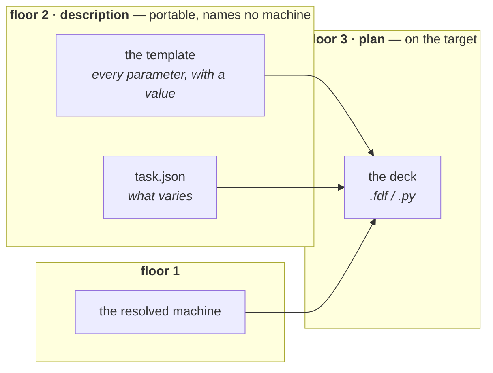
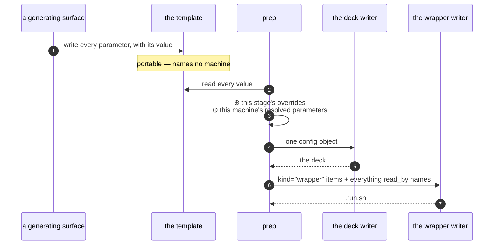

# The template — a calculation's parameter catalogue

**Role:** contract
**Domain:** engines
**Companions:** [`engines/overview.md`](?doc=engines/overview.md) (the engine map
and the three other cross-engine contracts) · [`engines/stages.md`](?doc=engines/stages.md)
(what a stage is, and `task.json`) · [`engines/tuning.md`](?doc=engines/tuning.md)
(what number each knob should carry).
**Upstream/downstream:** [`web/form-schema.md`](?doc=web/form-schema.md) § 1a
(the field metadata every item is built from) · [`execution/job-contracts.md`](?doc=execution/job-contracts.md)
§ 6.1 and § 6.3 (the file's registry row and its name) ·
[`execution/architecture.md`](?doc=execution/architecture.md) § 2 (the floor this
object belongs to) · [`execution/project-layout.md`](?doc=execution/project-layout.md)
§ 2.1 (the portable package it travels in).

> **This document is the authority for what a template is, what is in it, and
> what its file looks like.** Every engine has one and they share this format;
> what differs between engines is only which items appear. Where the file sits
> and what it is called is [`job-contracts.md`](?doc=execution/job-contracts.md)
> § 6.3's, which is the cross-layer authority for every name in the system.

---

## 1. What it is, in one sentence

**A template is the calculation's own catalogue: every parameter the engine's
schema declares, each with the value in force and everything we know about it.**

It is one of the two files a generating surface writes. The other is `task.json`,
which says what *changes* between stages. Together they are the whole
description, and neither repeats the other:

| file | holds | owned by |
|---|---|---|
| **the template** | every parameter, with a value — **what the calculation is** | this document |
| **`task.json`** | which parameters vary, and each stage's overrides — **what the mission is** | [`stages.md`](?doc=engines/stages.md) § 6 |

> **effective config = the template's values ⊕ that stage's `overrides`**
> ([`stages.md`](?doc=engines/stages.md) § 4). A stage's override *replaces an
> item's value*. It never adds an item and never removes one.

---

## 2. Where it sits, and what that forbids

The template is a **floor 2 — description** object
([`execution/architecture.md`](?doc=execution/architecture.md) § 2.1), beside
`Task`. That placement is not a filing decision; it decides the contents.

**Floor 2's *must never* is: name a machine.** So:

- **No item may be a machine fact.** A rank count, a GPU count, a queue, a
  partition, a wall-time — none of these is a parameter of the calculation. They
  are resolved at `prep` step 1 on the machine that will run the job (floor 1),
  and a description that carried one would not be portable.
- **A value derived from a machine fact is not an item either.** `BlockSize` is
  computed from the rank count, so it is decided at `prep` step 3, from the
  resolved machine — not written into a description on a laptop.

**And the template is not a deck.** A deck is a **floor 3 (plan)** product,
written by the engine's deck writer at `prep` step 3, on the target machine.



**This is why the template is not written in the engine's own format**, and the
reason is structural rather than a preference: a floor-2 file that *is* an
`.fdf` is a description carrying floor-3 output. The deck cannot be finished
before the machine is known ([`project-layout.md`](?doc=execution/project-layout.md)
§ 2.2), so an `.fdf`-shaped template is necessarily an incomplete deck wearing a
deck's file extension — which invites being fed to the engine, where it produces
a silently different calculation.

---

## 3. The format: one TOML file

**A template is a TOML file.** One file, no sidecar, no engine syntax.

### 3.1 Why TOML, and why not the three alternatives

The candidates, on the three axes that matter:

| | **correctness** | **readability** | **hand-editable** |
|---|---|---|---|
| **TOML** *(chosen)* | a published spec; `tomllib` is standard library from Python 3.11; the value is stored **once** | comments and multi-line prose sit with the item they explain | yes — and not whitespace-significant, so an edit cannot silently restructure the file |
| **JSON** | as strong on parsing | **no comments**, and multi-line prose becomes `\n`-escaped — the reasoning is unreadable | poor: one missing comma, and no comments to explain the shape |
| **YAML** | weakest: `no` parses as false, versions differ, and it needs a **dependency** | good | **fragile** — whitespace is structure, so a stray indent changes meaning |
| **the engine's own format, with the metadata in comments** | the value ends up stored **twice** — in the declaration and in the payload line — so the file can disagree with itself | high for an engine expert | yes, but two places must be edited in step |

**Correctness decides it, and the failure mode is the one to name.** It is not a
parse error — those are loud and recoverable. It is **a file that parses cleanly
and describes a different calculation than the one it appears to describe.** The
engine-format option has that failure built in: the value appears in the
declaration *and* in the payload line beside it, so a person who edits one and
not the other gets a calculation nobody chose. TOML stores each value once, so
that failure cannot be expressed.

**Performance does not discriminate and it would be dishonest to claim it
does.** A template is a few hundred lines read once per `prep`.

> **The project's rule, stated once:** **JSON for machine-to-machine artifacts**
> (`task.json`, `job-set.json`, `environment.json`, `run.json`); **TOML for the
> one artifact a person reads and edits.** The template is that artifact —
> [`project-layout.md`](?doc=execution/project-layout.md) § 2.1 puts it in the
> portable package a person carries to a cluster and looks at.

> **Writing it needs care that reading does not.** `tomllib` reads TOML and does
> not write it. Whatever emits a template must therefore **read its own output
> back and compare it to what it meant to write** — a cheap check that turns
> "we emitted TOML correctly" from an assumption into a verified property. A
> writer library is not required and would be a new dependency.

### 3.2 A template, entire

```toml
# BDT on Au(111) — geometry relaxation.
schema      = "molbuilder/template@1"
engine      = "siesta"
fingerprint = "8f3a1c2d5e6b7a90"

[item.mesh_cutoff]
kind    = "engine"
anchor  = "MeshCutoff"
type    = "float"
value   = 300.0
default = 300.0
unit    = "Ry"
range   = [50, 2000]
group   = "stage"
help    = """
The real-space integration grid, in Ry.  Higher is finer and slower;
convergence is checked, not assumed.
Tier ladder: 150 screening · 300 publishable · 500 tight."""

[item.diag_algorithm]
kind    = "engine"
anchor  = "Diag.Algorithm"
type    = "enum"
choices = ["ScaLAPACK", "ELPA-1STAGE", "ELPA-2STAGE"]
value   = "ScaLAPACK"
default = "ScaLAPACK"
read_by = ["wrapper"]
help    = """
Which eigensolver SIESTA uses.  An ELPA choice also decides WHICH ENVIRONMENT
the wrapper activates, so this value leaves the deck and reaches the launch."""

[item.species_order]
kind    = "deck"
expands = ["ChemicalSpeciesLabel"]
type    = "strlist"
value   = ["C", "H", "S", "Au"]
help    = """
The order species are declared in.  A .XV read against a different order lands
every coordinate on the wrong atom (run-identity.md § 4)."""

[item.continue_retries]
kind    = "wrapper"
type    = "int"
value   = 1
default = 1
range   = [1, 5]
help    = "How many times the run wrapper retries a stage that did not converge."
```

### 3.3 An item's keys

| key | required | what it says |
|---|:--:|---|
| `kind` | **yes** | which layer owns this item — § 4's closed vocabulary |
| `value` | **yes** | the value in force. `value` absent means **explicitly unset**, which is a real state and not the default |
| `type` | **yes** | the **validation** type — `int` · `float` · `str` · `strlist` · `bool` · `enum` · `pow2` · `int3` · `text` |
| `default` | when one exists | what untouched means. A surface compares it to `value` to show whether the user set this |
| `anchor` | `kind="engine"` | the engine keyword this becomes. A bare keyword, never a sentence |
| `expands` | `kind="deck"` | the engine keywords this item produces, as a list |
| `read_by` | when true | which **other** layers derive something from this value — § 4.1 |
| `range` · `unit` · `choices` · `group` | when they apply | bounds, label, enum members, and whether *vary per stage* starts ticked |
| `help` | **yes** | what this is, in prose. Multi-line is ordinary TOML |

**TOML types the storage; `type` types the validation.** `300.0` is already a
float to any parser, so `type` is not repeating that — it carries what a parser
cannot know: that `pow2` must be a power of two, that `enum` is drawn from
`choices`, that `text` is verbatim engine text to be copied rather than
interpreted.

**Every key above comes from the field's own metadata**
([`web/form-schema.md`](?doc=web/form-schema.md) § 1a: `help`, `range`, `unit`,
`choices`, `engine_key`, `workflow_group`). The template and the form are
generated from one source and cannot drift apart.

---

## 4. `kind` — which layer owns the item

A template holds more than the engine's own parameters. Some items shape the run
wrapper, some shape what the producer does, some shape what the monitor writes.
**A layer must be able to tell which without carrying a list of field names**, so
every item declares it.

| `kind` | the item is | reaches the deck | who acts on it |
|---|---|:--:|---|
| `engine` | one of the engine's own keywords | yes, as `anchor` | the deck writer |
| `deck` | molbuilder's own, but it shapes the deck — by expanding to keywords, ordering a block, or supplying verbatim text | yes, via `expands` | the deck writer, through molbuilder's rule rather than one keyword |
| `wrapper` | shapes the run script | no | `runwrap` |
| `produce` | shapes what the produce step does | no | the producer |
| `monitor` | shapes what the monitor writes | no | the monitor |

**The vocabulary is closed.** An unknown `kind` is an error a reader reports,
never something it silently drops.

**This is what lets a producer refuse cleanly.** A SIESTA producer emits
`kind="engine"` anchors and whatever `kind="deck"` items expand to, and **must
not try to emit a `wrapper` item as a keyword** — SIESTA would not understand
it. An item a layer cannot place is not a fault in the template; it belongs to a
different layer, and the item says so on its own face.

### 4.1 `read_by` — who else derives from the value

`kind` says who owns the item. `read_by` says **who else derives something from
its value.** They are different questions and one key cannot answer both.

`diag_algorithm` is unambiguously the engine's — it is a SIESTA keyword with a
SIESTA value — *and* the wrapper acts on it, because an ELPA solver needs a
different conda environment. So it is `kind="engine"` with
`read_by = ["wrapper"]`.

**Why that key earns its place.** Today the wrapper finds this out by **reading
the deck text and looking for ELPA**. That is a layer re-deriving an answer
another layer already holds — the one habit
[`execution/architecture.md`](?doc=execution/architecture.md) § 1 exists to
remove. With `read_by`, the wrapper is *told* which items it depends on, and a
new engine declares its own without anyone editing the wrapper writer.

**It also explains an ordering the contract already forces.**
[`project-layout.md`](?doc=execution/project-layout.md) § 2.3.1 renders the deck
(step 3) before the wrapper (step 4) and calls that order forced rather than
chosen. `read_by = ["wrapper"]` is that dependency written on the item that
creates it.

---

## 5. What is an item, and what is not

**The rule: every parameter the engine's schema declares is an item, and each
one's `kind` says who consumes it.** Membership is total, so "is this field in
the template?" is never a judgement call and never a maintained list.

Three things are **not** items, each excluded by a rule that already exists:

| not an item | why | where it lives instead |
|---|---|---|
| **a machine fact or anything derived from one** — ranks, GPUs, queue, `BlockSize` | floor 2 must never name a machine (§ 2) | resolved at `prep`, from `environment.json` and `molbuilder.json` |
| **the ladder** — the list of stages | an item is a parameter; a list of stages is the mission | `task.json` ([`stages.md`](?doc=engines/stages.md) § 1.1) |
| **the structure** — which atoms exist | an input to the calculation, never edited by the generator, and it travels as its own file | the data files ([`project-layout.md`](?doc=execution/project-layout.md) § 2.1) |

**A parameter that cannot be given a `kind` is a gap in this vocabulary**, and
the loud version of that is the only one that gets fixed: whatever writes a
template refuses rather than omitting the item.

> **A user's own engine text is an item, not an exception.** § 3.5 of
> [`job-contracts.md`](?doc=execution/job-contracts.md) reserves a USER-CUSTOM
> zone in a generated deck, copied byte-for-byte and never validated. That text
> is part of the calculation, so it must survive in the portable package: it is
> an item with `kind="deck"` and `type="text"`, and `prep` copies it into the
> deck's USER-CUSTOM zone verbatim. A deck-preserving merge cannot serve here,
> because at `prep` there is no previous deck to merge from.

---

## 6. How each layer reads it

**One `tomllib.load`, then filter on one key.** No layer parses engine syntax and
no layer carries a field list.

| the reader | floor | what it takes | how it filters |
|---|:--:|---|---|
| a **generating surface** — builds `task.json` without asking a server | 7 | `type` · `choices` to pick a control, `range` · `unit` to bound it, `default` to show what untouched means, `group` to decide whether *vary per stage* starts ticked | whatever it offers; usually `kind` in `engine`, `deck` |
| **`prep` step 2** — resolve the parameters | 2 → 3 | every item's `value`, then this stage's `overrides` on top | none — it wants them all |
| **validation** | its own contract | the resolved config object | none |
| the **deck writer**, `prep` step 3 | 3 | the parameters it renders from | `kind` in `engine`, `deck` |
| the **wrapper writer**, `prep` step 4 | 5 | what shapes the run script | `kind == "wrapper"`, plus every item whose `read_by` names it |
| the **monitor** | — | what it should write | `kind == "monitor"` |



**`prep` rebuilds a config and renders**; it does not splice text. That is what
makes an override of any parameter work, including the three shapes a
text-splice cannot serve:

- **one parameter can decide where another one lands.** A stage that changes
  `relax_type` from `CG` to `Verlet` moves the step budget from `MD.NumCGsteps`
  to `MD.FinalTimeStep`. The site itself is chosen by another value, so there is
  no fixed site to splice at.
- **one parameter can produce two keywords.** `spin_total` writes `Spin.Fix`
  *and* `Spin.Total`.
- **a parameter can produce no line at all** at its default.

> The alternative considered and rejected was to allow only single-keyword,
> always-emitted parameters to vary — which would make *which settings may vary*
> a fixed list again, the exact arrow [`stages.md`](?doc=engines/stages.md) § 1.2
> exists to reverse.

**`anchor` therefore documents rather than steers.** It says which keyword an
item becomes, which is worth knowing and is what BENCH-MARKS
([`job-contracts.md`](?doc=execution/job-contracts.md) § 3.3) uses it for.
Nothing splices at it.

---

## 7. Complete, and lossless — two claims, both checkable

**Complete for a surface** — every parameter the schema declares has an item. A
parameter the schema carries and the template omits is a control no surface can
offer and a value no user can see.

**Complete for `prep`** — resolving a stage against the template yields
**exactly** the deck that stage would otherwise have been rendered with.

> **The second implies the first and is not implied by it**, which is why the
> weaker one is not enough alone: a template can list every parameter and still
> resolve to a different deck if one of them is not carried faithfully.

**Losslessness is per `kind`, not per file.** Demanding one standard of the whole
file is what once made *"is the template lossless?"* unanswerable.

| kind | what must hold | how it is checked |
|---|---|---|
| `engine` · `deck` | **round-trips exactly** — the deck is the calculation | render a stage's deck from the template and from the config a surface held; the text is identical |
| `wrapper` · `produce` · `monitor` | **carried and legible** — the owning layer reads it from here | that layer reads the item rather than deriving it from someone else's artifact |

**Nothing is transcribed, so nothing can be lost in transcription.** Each value
is stored once, in the vocabulary the schema defines, and every reader takes it
from there.

> **`fingerprint` is what says the schema has moved.** It is a short digest of
> the *shape* a description was written against — each parameter's name, type,
> bounds and enum members — and it is computed by whatever writes the template,
> because that is the moment the schema is in hand. It deliberately excludes
> defaults and all presentation, so a reworded help line does not make every
> stored description suspect. A template whose fingerprint no longer matches is
> **reported, not refused** ([`stages.md`](?doc=engines/stages.md) § 6.6): it
> names parameters that still exist, with values that may no longer be legal.
> An **empty** fingerprint matches anything — a template written by hand makes
> no claim, and that is not an error.

---

## 8. The reserved blocks — what reaches the final script, and from where

A generated deck carries up to five reserved comment blocks
([`job-contracts.md`](?doc=execution/job-contracts.md) § 3.1). The deck is
rendered at `prep`, on a machine that may be seeing this calculation for the
first time — so for each block there is one question: **where does its content
come from, and does that source travel in the portable folder?**

| block | its content comes from | what carries it | emitted by |
|---|---|---|---|
| **PROVENANCE** | molbuilder's version and the moment of rendering | nothing — it is generated at `prep`, which is the honest answer for a *generation* snapshot | the deck writer |
| **BENCH-MARKS** | the same field metadata the template is built from | nothing — derived, which is why § 3.3 requires both to come from one source | the deck writer |
| **ATOM-METADATA** | the structure's regions, frozen atoms and annotations | **the structure and its `.molstruct.json` sidecar** — data files in the folder (§ 8.1) | the deck writer |
| **USER-CUSTOM** | text a person wrote | **an item in the template** (§ 8.2) | the deck writer, verbatim |
| **HEADER** | reserved, emitted by nobody today | — | — |

**Nothing about this is new machinery.** The deck writer already emits all five;
what this section fixes is that two of them had an input which stopped travelling
once the deck moved from *produce* to `prep`.

### 8.1 Labels ride with the atoms, not with the parameters

**ATOM-METADATA is not a template item, and should not become one.** A region
label or a frozen flag is a fact about *which atoms* — it belongs to the
structure, and it already has a carrier: the `.molstruct.json` sidecar that sits
beside the structure file. `task.json` holds a `StructureRef`, which is *"a
reference plus a witness, never a copy"*, so the structure and its sidecar live
in the project tree and travel with the folder. The deck writer reads them at
`prep` exactly as it reads them today.

**Two things are named alike and must not be merged**, and the distinction is
the one [`overview.md`](?doc=engines/overview.md) § 3 already draws:

| | what it is | where it lives |
|---|---|---|
| the sidecar's **`frozen_atoms`** | the structure's own annotation. It **seeds** the form | with the structure, in the sidecar |
| **`frozen_indices`** | what the user actually chose — this run's boundary condition | **a template item**, `kind="deck"`, producing `%block Geometry.Constraints` |

The Stage-3A divergence warning exists precisely because those two can disagree,
and nothing here changes it.

### 8.2 A person's own text is an item, because there is no previous deck to read

Today USER-CUSTOM survives a regeneration because molbuilder **reads the
existing output file**, finds the zone and copies it forward
(`merge_user_custom_from_target`). **That cannot work at `prep`**, for three
independent reasons:

- `prep` renders on the target machine, usually for the first time — **there is
  no previous deck** to read.
- `prep` renders **one deck per stage**, so *"the target"* names nothing.
- **`prep` must be reproducible.** Harvesting from whatever happens to be on
  disk would make the same template, on the same machine, produce different
  decks — and [`project-layout.md`](?doc=execution/project-layout.md) says of a
  deck *"written by `prep`; delete it and re-prep"*, which is only true if
  re-prep reproduces it.

So the text is carried in the template, as an ordinary item:

```toml
[item.user_custom]
kind  = "deck"
type  = "text"
value = """
# my own SIESTA lines — molbuilder copies these verbatim and never checks them
SaveElectrostaticPotential   .true."""
help  = "Your own engine text. Copied byte-for-byte into the deck's USER-CUSTOM zone."
```

**Three things follow, and each is free rather than a special case:**

- **A stage may override it**, exactly like any other item — so per-stage custom
  text needs no new mechanism.
- **It is never validated.** § 3.5's rule is unchanged: molbuilder copies it and
  the engine judges it. `type="text"` is what says so to every reader.
- **The template is where you edit it**, which is the file this contract already
  says is meant to be edited.

> **One behaviour changes, and it is worth stating plainly rather than
> discovering.** In the staged path, editing the custom zone of a *rendered
> deck* does not survive the next `prep` — the template is what survives. The
> **single-deck paths keep the read-back merge** (the web Build tab and
> `molbuilder fdf` regenerate one file in place, where *"the target"* is one
> well-defined file and the merge is exactly right). What is not allowed is
> `prep` harvesting from a deck it is about to overwrite.

> **⚠ This needs a schema field that does not exist yet.** Membership is total
> over *the fields the engine's schema declares* (§ 5), and no engine config
> carries a `user_custom` field today — the text has only ever lived in emitted
> files. Adding it is what makes this an ordinary item rather than an exception
> to the membership rule, and it is the one piece of new surface this section
> asks for.

---

## 9. Open, and recorded rather than guessed

- **A hand-edited value is the authority, and that now needs no rule.** The file
  is meant to be edited and each value appears once, so editing it is simply
  editing it. This was an open question only while the value was stored twice.
- **A parameter whose default is *derived* rather than literal.** `BlockSize` is
  the example, and § 5 excludes it as a machine-derived value. What is not yet
  settled is whether such a parameter should appear as an item with no `value`
  and `default = "derived"` so a surface can *show* that it exists and is
  decided later — or be absent from the template entirely. The rule it must
  respect either way (user, 2026-08-07): **an explicit user setting is honoured;
  otherwise the value is derived at `prep`, where both are available.**
- **PySCF's `stages`.** Its ladder runs inside one process, so for PySCF the
  stage list is engine behaviour rather than the mission
  ([`overview.md`](?doc=engines/overview.md) § 4). Until that path is reworked,
  PySCF's stage list is excluded from its template by § 5's *ladder* row and
  lives in its config.
