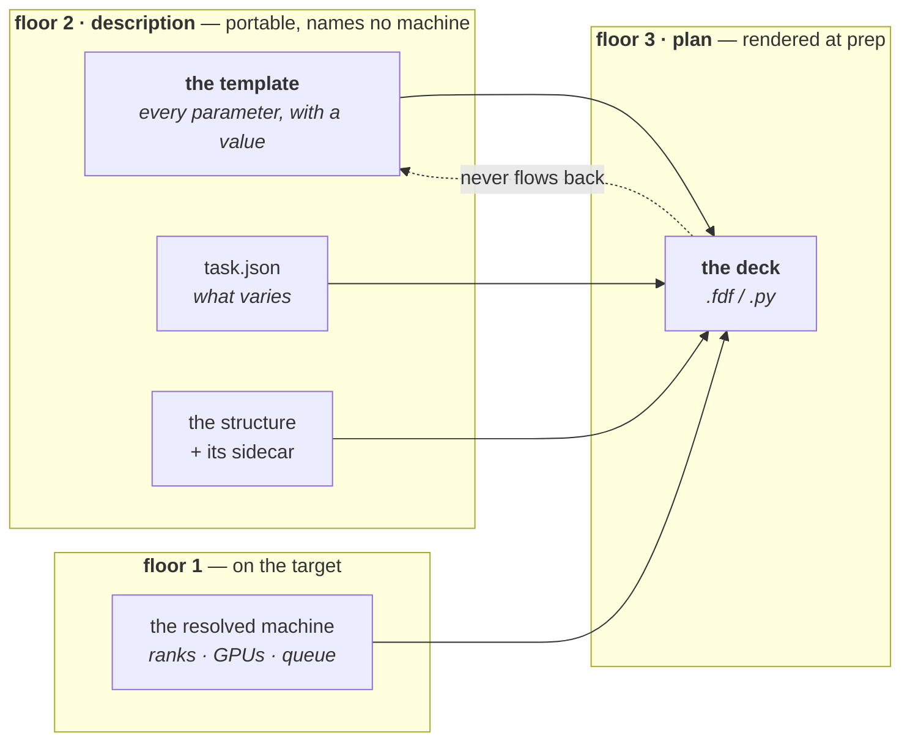
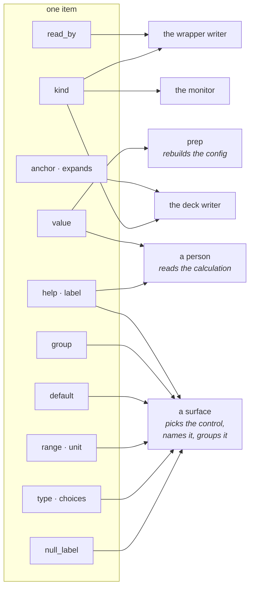
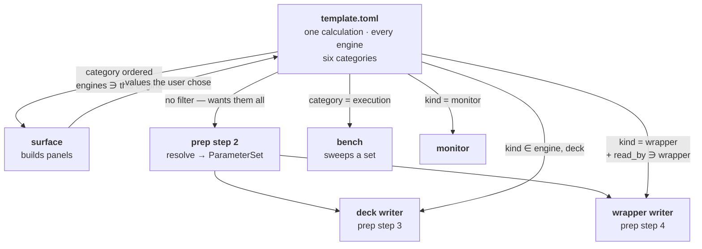
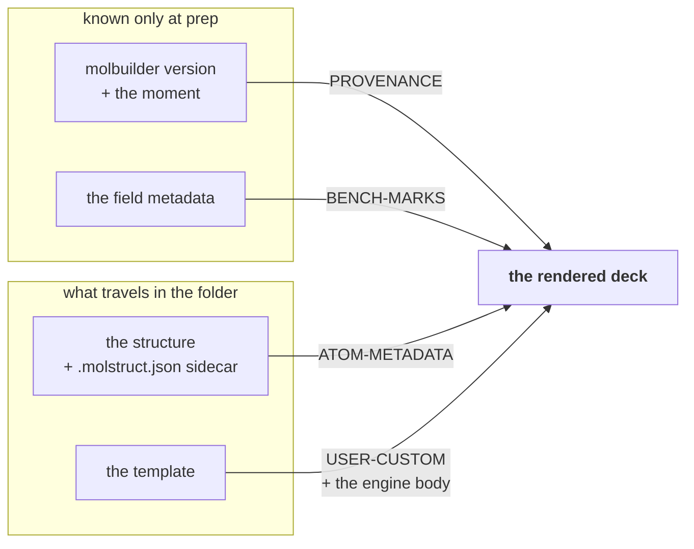
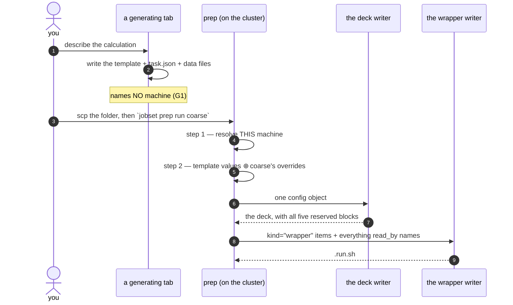

# The template — a calculation's parameter catalogue

**Role:** contract
**Domain:** engines
**Companions:** [`engines/overview.md`](?doc=engines/overview.md) (the engine map
and the three other cross-engine contracts) · [`engines/stages.md`](?doc=engines/stages.md)
(what a stage is, and `task.json`) · [`engines/tuning.md`](?doc=engines/tuning.md)
(what number each knob should carry).
**Upstream/downstream:** [`web/form-schema.md`](?doc=web/form-schema.md) § 1a
(the field metadata every item is built from) · [`execution/job-contracts.md`](?doc=execution/job-contracts.md)
§ 3.1 (the deck's reserved blocks), § 6.1 and § 6.3 (the file's registry row and
its name) · [`execution/architecture.md`](?doc=execution/architecture.md) § 2
(the floor this object belongs to) · [`execution/project-layout.md`](?doc=execution/project-layout.md)
§ 2.1 (the portable package it travels in), § 2.3.1 (the five steps of `prep`).

> **This document is the authority for what a template is, what is in it, and
> what its file looks like.** Every engine has one and they share this format;
> what differs between engines is only which items appear. Where the file sits
> and what it is called is [`job-contracts.md`](?doc=execution/job-contracts.md)
> § 6.3's, which is the cross-layer authority for every name in the system.

---

## 1. What it is, and what it must achieve

**A template is the calculation's own catalogue: every parameter the engine's
schema declares, each with the value in force and everything we know about it.**

It is one of two files a generating surface writes, and they do not overlap:

| file | holds | owned by |
|---|---|---|
| **the template** | every parameter, with a value — **what the calculation is** | this document |
| **`task.json`** | which parameters vary, and each stage's overrides — **what the mission is** | [`stages.md`](?doc=engines/stages.md) § 6 |

> **effective config = the template's values ⊕ that stage's `overrides`**
> ([`stages.md`](?doc=engines/stages.md) § 4). A stage's override *replaces an
> item's value*. It never adds an item and never removes one.

### 1.1 The six goals, and what breaks without each

Every rule in this document exists to hold one of these. When a later section
looks arbitrary, it is serving a row here.

| | goal | what breaks without it | held by |
|---|---|---|---|
| **G1** | **Portable** — the folder means the same thing on every machine | a description that names a queue or a rank count is wrong the moment it is copied somewhere else | § 2 — floor 2 must never name a machine |
| **G2** | **Enough on its own for a surface** — a tab builds `task.json` from this file and nothing else | the browser has to ask a server what a field is, so the folder is not really portable | § 5 — every item carries `type`, `range`, `default`, `choices`, `group` |
| **G3** | **Self-describing across layers** — a layer finds its own items without a list of field names | every new engine means editing the deck writer, the wrapper writer and the monitor | § 6 — `kind` and `read_by` |
| **G4** | **Faithful** — the deck `prep` renders is the deck the surface would have rendered | a silently different calculation, which is the worst failure this system has | § 10 — render both ways and compare the text |
| **G5** | **Readable and editable by a person** | the "reference" half of *one file that is both the reference and the source* is a claim nobody can check | § 4 — one value per parameter, prose beside it, a format that survives hand editing |
| **G6** | **Complete** — everything the run needs that is not the structure and not the machine | text or labels stranded in a file that was never copied — the defect § 9 was written to close | § 7 total membership, § 9 the reserved blocks |

### 1.2 The five decisions, and the alternative each one rejected

**Design considerations, stated once so later sections can point here** rather
than re-arguing.

| | the decision | the alternative, and why not |
|---|---|---|
| **D1** | **One file.** The parameters and their descriptions live together | *A deck plus a sidecar of metadata.* Two files that can disagree, and nothing keeps them in step — the worst correctness position of the four weighed in § 4.1 |
| **D2** | **A data file, not the engine's format** | *An `.fdf` with the metadata in comments.* A deck is a floor-3 product (§ 2); a description shaped like one carries output from the floor above it, and cannot be run anyway because the machine-dependent values are missing |
| **D3** | **Each value is stored once** | *A declaration and a payload line carrying the same number.* Then a hand edit of one is silently ignored — the file disagreeing with itself |
| **D4** | **`prep` rebuilds a config and renders** | *Splicing a stage's overrides into text at their anchors.* Three shapes defeat it (§ 8.1), and without a config object [`stages.md`](?doc=engines/stages.md) § 4's R1 and R2 cannot hold — nothing would be validated as a resolved whole |
| **D5** | **Membership is total** — every parameter is an item, classified by `kind` | *A curated list of which fields belong.* A list is a judgement call per field, it drifts, and it makes *which settings may vary* fixed again — the arrow [`stages.md`](?doc=engines/stages.md) § 1.2 exists to reverse |

---

## 2. Where it sits, and what that forbids

The template is a **floor 2 — description** object
([`execution/architecture.md`](?doc=execution/architecture.md) § 2.1), beside
`Task`. That placement is not a filing decision; it decides the contents.

**Floor 2's *must never* is: name a machine.** So:

- **No item may carry a machine fact's VALUE.** How many ranks this job got,
  which queue it landed in, what wall-time it was granted — none of those is a
  parameter of the calculation. They are resolved at `prep` step 1 on the machine
  that will run the job (floor 1), and a description asserting one would not be
  portable **(G1)**.

  **The item may still be declared, valueless** (§ 6.4), because a person *may*
  ask for 8 ranks or prefer a GPU — and by the test recorded at the bottom of
  this section, *"may a person?"* is the criterion. A surface needs to know the
  question exists in order to ask it; the wrapper writer needs to know to look.
  What a reader **refuses** is a `value` on such an item: that is the failure
  this rule was written against — a hand-edited `mpi_np` once passed and a deck
  rendered for a rank count the allocation never granted. Declaring the question
  is portable; answering it on the wrong machine is not.
- **But a parameter molbuilder can *propose* a value for is still an item.**
  `BlockSize` is the case that makes the distinction sharp: a rank count's VALUE
  is a machine fact, while `BlockSize` is an ordinary SIESTA keyword
  a person may set, benchmark, or leave to the engine
  ([`tuning.md § 2.11`](?doc=engines/tuning.md)). It is an item with **no
  `value`** until somebody supplies one — which is exactly what *"a missing
  `value` means explicitly unset"* (§ 3) is for. `prep` fills an unset one from
  the resolved machine; it never overwrites a set one.

  > **Corrected 2026-08-11 (user).** This bullet read *"a value derived from a
  > machine fact is not an item either — `BlockSize` is computed from the rank
  > count"*, and that made a tunable knob unsettable: there was nowhere in a
  > portable description to record *"I measured 128 on this class of machine"*,
  > and no way at all to ask for SIESTA's own default. **The test is not
  > *"could a machine decide this?"* but *"may a person?"*** — and for
  > `BlockSize` they may.

**And the template is not a deck.** A deck is a **floor 3 (plan)** product,
written by the engine's deck writer at `prep` step 3, on the target machine.



**The dotted arrow is the rule that makes the rest work** — nothing a machine
produced ever edits the description
([`architecture.md`](?doc=execution/architecture.md) § 5: *each step decides
within what the steps above it already fixed*). It is why a deck is disposable
and the template is not.

---

## 3. Must-haves — what makes a file a valid template

**Three keys at the top, and four on every item.** A reader that finds one
missing **refuses and says which**; it never guesses, and it never silently
drops the item.

```toml
schema      = "molbuilder/template@2"   # REQUIRED — what this file is
engines     = ["siesta"]                # REQUIRED — which engines this
                                        #   calculation can run on (§ 6.3)
fingerprint = "8f3a1c2d5e6b7a90"        # REQUIRED (may be "") — see § 10
```

> **`engines` replaced the single `engine` key at `@2`.** A template describes a
> calculation, and a calculation may be runnable on more than one engine, so the
> file lists them and each item says which it applies to (§ 6.3). A `@1` file
> names one engine and an `@2` reader treats it as `engines = [<that one>]`; a
> `@1` reader meeting an `@2` file **refuses**, which is what the `@major`
> convention is for.

| top-level key | why it must be there |
|---|---|
| `schema` | the `@major` convention ([`job-contracts.md`](?doc=execution/job-contracts.md) § 6): a higher major makes an old reader **refuse rather than guess** |
| `engines` | which schemas the items belong to. Without it a reader cannot know which config class to rebuild, and would have to infer it from the item names. A reader given an engine not in this list refuses rather than returning an empty catalogue — *"this calculation does not run on that engine"* and *"no items matched"* are different answers |
| `fingerprint` | the shape the values were written against. **An empty string is legal** and means *makes no claim* — a hand-written template is not wrong, it simply asserts nothing (§ 10) |

**On every item — four required keys**, and each earns *required* by a goal:

| key | required because |
|---|---|
| `kind` | without it no layer can tell whose item this is, and G3 collapses to a field list |
| `category` | without it a surface has no panel to put the item on, and G2 fails — a file *"enough on its own for a surface"* cannot leave the presentation to the reader's guess (§ 6.2) |
| `type` | what the value is *validated* as, which TOML's own types cannot express (§ 5) |
| `help` | G5. An item nobody can read makes the file a serialised blob with extra steps |

**Conditionally required**, and the condition is the item itself:

| key | required when |
|---|---|
| `anchor` | `kind = "engine"` — an engine item that names no keyword cannot reach the deck |
| `value` | **when the item has been answered.** Its absence is a real state — *explicitly unset* — distinct from the default and from an absent key elsewhere. It was listed as unconditionally required until 2026-08-13, which read as though a valueless item were malformed; § 6.4 makes valueless the **normal** state for anything resolved at `prep` (memory, `block_size`, rank count, threads) |
| `resolver` | when the item is normally valueless and something must compute it — § 6.4. An unset item with no resolver is simply unanswered; an unset item WITH one names who answers it |
| `expands` | `kind = "deck"` — it is how a reader learns which keywords this item produces |
| `choices` | `type = "enum"` — an enum with no members cannot be validated or rendered as a control |

Everything else — `default`, `range`, `unit`, `group`, `read_by` — is present
when it applies and absent when it does not. **Absent is not a failure**; it is
the honest statement that the parameter has no default, no bounds, no unit, or
no other reader.

> **An unknown `kind` is an error, not something to skip.** The vocabulary in
> § 6 is closed. A reader that quietly ignored an item it did not understand
> would produce a deck missing a parameter, and say nothing — G4's failure mode
> exactly.

---

## 4. The format: one TOML file

### 4.1 Why TOML, and why not the three alternatives

| | **correctness** | **readability** | **hand-editable** |
|---|---|---|---|
| **TOML** *(chosen)* | a published spec; `tomllib` is standard library from Python 3.11; the value is stored **once** (D3) | comments and multi-line prose sit with the item they explain | yes — and not whitespace-significant, so an edit cannot silently restructure the file |
| **JSON** | as strong on parsing | **no comments**, and multi-line prose becomes `\n`-escaped — the reasoning is unreadable | poor: one missing comma, and no comments to explain the shape |
| **YAML** | weakest: `no` parses as false, versions differ, and it needs a **dependency** | good | **fragile** — whitespace is structure, so a stray indent changes meaning |
| **the engine's own format, metadata in comments** | the value ends up stored **twice**, so the file can disagree with itself | high for an engine expert | yes, but two places must be edited in step |

**Correctness decides it, and the failure mode is the one to name.** It is not a
parse error — those are loud and recoverable. It is **a file that parses cleanly
and describes a different calculation than it appears to.** The engine-format
option has that failure built in (D3). TOML stores each value once, so the
failure cannot be expressed.

**Performance does not discriminate and it would be dishonest to claim it
does.** A template is a few hundred lines read once per `prep`.

> **The project's rule, stated once:** **JSON for machine-to-machine artifacts**
> (`task.json`, `job-set.json`, `environment.json`, `run.json`); **TOML for the
> one artifact a person reads and edits.** The template is that artifact —
> [`project-layout.md`](?doc=execution/project-layout.md) § 2.1 puts it in the
> package a person carries to a cluster and looks at.

> **Writing it needs care that reading does not.** `tomllib` reads TOML and does
> not write it. Whatever emits a template must **read its own output back and
> compare it to what it meant to write** — a cheap check that turns *"we emitted
> TOML correctly"* from an assumption into a verified property. A writer library
> is not required and would be a new dependency.

### 4.2 A template, entire

```toml
# BDT on Au(111) — geometry relaxation.
schema      = "molbuilder/template@2"
engines     = ["siesta"]
fingerprint = "8f3a1c2d5e6b7a90"

[item.mesh_cutoff]
kind    = "engine"
category = "accuracy"
anchor  = "MeshCutoff"
type    = "float"
value   = 300.0
default = 300.0
unit    = "Ry"
range   = [50, 2000]
group   = "stage"
help    = """
The real-space integration grid, in Ry.  Higher is finer and slower;
convergence is checked, not assumed.
Tier ladder: 150 screening · 300 publishable · 500 tight."""

[item.enable_gpu]
kind    = "engine"
category = "execution"
anchor  = "Diag.ELPA.GPU"
type    = "bool"
value   = false
default = false
read_by = ["wrapper"]
help    = """
Run the ELPA diagonalization on a GPU.  The wrapper reads this: it decides the
environment (only the source build has GPU-capable ELPA) AND the GPU runtime --
the gres ask, MPS, the NUMA pin.  So the value leaves the deck and reaches the
launch, which is what read_by records."""

[item.species_order]
kind    = "deck"
category = "system"
expands = ["ChemicalSpeciesLabel"]
type    = "strlist"
value   = ["C", "H", "S", "Au"]
help    = """
The order species are declared in.  A .XV read against a different order lands
every coordinate on the wrong atom (run-identity.md § 4)."""

[item.frozen_indices]
kind    = "deck"
category = "system"
expands = ["Geometry.Constraints"]
type    = "intlist"
value   = [88, 89, 90, 91]
group   = "system"
help    = """
Which atoms are held fixed.  Seeded from the structure's sidecar, then the form
is authoritative (engines/overview.md § 3, stage 1)."""

[item.continue_retries]
kind    = "wrapper"
category = "execution"
type    = "int"
value   = 1
default = 1
range   = [1, 5]
help    = "How many times the run wrapper retries a stage that did not converge."

[item.user_custom]
kind  = "deck"
category = "method"
type  = "text"
value = """
SaveElectrostaticPotential   .true."""
help  = """
Your own engine text.  Copied byte-for-byte into the deck's USER-CUSTOM zone and
never validated by molbuilder (§ 9.2)."""
```

---

## 5. Anatomy of an item

| key | what it says |
|---|---|
| `kind` | which layer owns this item — § 6's closed vocabulary |
| `value` | the value in force. Absent means **explicitly unset** |
| `type` | the **validation** type — `int` · `float` · `str` · `bool` · `enum` · `pow2` · `int3` · `strlist` · `intlist` · `text` |
| `default` | what untouched means. A surface compares it to `value` to show whether the user set this |
| `anchor` | the engine keyword this becomes. A bare keyword, never a sentence |
| `expands` | the engine keywords a `deck` item produces, as a list |
| `read_by` | which **other** layers derive something from this value — § 6.1 |
| `category` | which **question about the calculation** this answers — § 6.2's closed vocabulary. Engine-independent, so the same six panels serve every engine |
| `engines` | which engines this item applies to, as a list. **Absent means all of them** — § 6.3 |
| `resolver` | who computes this item's value when it is unset — a **name** from a closed registry, never code (§ 6.4) |
| `label` | the **human name** — *"MPI ranks (np)"*. Not the field name; a surface shows this |
| ~~`section`~~ | **RETIRED at `@2` — use `category` (§ 6.2).** It held a free-text fieldset name per engine (*"SCF"*, *"Compute & budget"*), so two engines expressing one idea disagreed on the label and no surface could group across them. A section-less item was still an item, and that stays true of `category`: membership is TOTAL (§ 7) |
| `null_label` | what **unset** is called on an optional item — *"(auto)"*, *"(single-process)"* |
| `range` · `unit` · `choices` · `group` | bounds, label, enum members, and whether *vary per stage* starts ticked |
| `help` | what this is, in prose. Multi-line is ordinary TOML |

**TOML types the storage; `type` types the validation.** `300.0` is already a
float to any parser, so `type` is not repeating that — it carries what a parser
cannot know: that `pow2` must be a power of two, that `enum` is drawn from
`choices`, that `text` is verbatim engine text to be copied rather than
interpreted.

**Which key serves which reader** — this is G2 and G3 made concrete:



> **⭐ `label`, `section` and `null_label` were added 2026-08-11**
> *(`section` was replaced by `category` at `@2` — § 6.2; the other two
> stand)*, when the user
> settled that **the UI is to be built *from* the template** rather than merely
> generated from the same schema —
> [`generator.md`](?doc=execution/generator.md) § 3.1. Without them a template
> cannot name its own fields or group them, and `optional` says *unset* is a real
> state while nothing says how to show it. They are already in the field metadata,
> so carrying them costs nothing — and adding them later means re-emitting every
> template written before.

**Every key comes from the field's own metadata**
([`web/form-schema.md`](?doc=web/form-schema.md) § 1a: `help`, `range`, `unit`,
`choices`, `engine_key`, `workflow_group`). The template and the form are
generated from one source and cannot drift apart.

> **The same source feeds BENCH-MARKS, and that is a rule.** A generated deck's
> BENCH-MARKS block ([`job-contracts.md`](?doc=execution/job-contracts.md) § 3.3)
> declares `type`, `range`, `unit` and `default` for the subset a tool may
> override; a template declares them for every parameter. **Both are emitted from
> the field metadata**, because two hand-maintained copies of `default` would
> drift silently. Their `type` vocabularies differ in size on purpose: § 3.3's
> `{int, float, str, pow2, enum}` is enough for the numeric knobs a benchmark
> turns, and the template adds `bool`, `int3`, `strlist`, `intlist` and `text`
> because it must describe everything. **The narrower set is a subset, never a
> competing definition.**

---

## 6. `kind` — which layer owns the item

A template holds more than the engine's own parameters. Some items shape the run
wrapper, some shape what the producer does, some shape what the monitor writes.
**A layer must be able to tell which without carrying a list of field names
(G3)**, so every item declares it.

| `kind` | the item is | reaches the deck | who acts on it |
|---|---|:--:|---|
| `engine` | one of the engine's own keywords | yes, as `anchor` | the deck writer |
| `deck` | molbuilder's own, but it shapes the deck — by expanding to keywords, ordering a block, or supplying verbatim text | yes, via `expands` | the deck writer, through molbuilder's rule rather than one keyword |
| `wrapper` | shapes the run script | no | `runwrap` |
| `produce` | shapes what the produce step does | no | the producer |
| `monitor` | shapes what the monitor writes | no | the monitor |

**The vocabulary is closed.** An unknown `kind` is an error a reader reports,
never something it silently drops (§ 3).

**This is what lets a producer refuse cleanly.** A SIESTA producer emits
`kind="engine"` anchors and whatever `kind="deck"` items expand to, and **must
not try to emit a `wrapper` item as a keyword** — SIESTA would not understand
it. An item a layer cannot place is not a fault in the template; it belongs to a
different layer, and the item says so on its own face.

### 6.1 `read_by` — who else derives from the value

`kind` says who owns the item. `read_by` says **who else derives something from
its value.** They are different questions and one key cannot answer both.

`enable_gpu` is unambiguously the engine's — it becomes the SIESTA keyword
`Diag.ELPA.GPU` — *and* the wrapper acts on it, because a GPU deck needs the
source-built environment **and** a GPU runtime: the `gres` ask, MPS, the NUMA
pin, the rank/thread budget. So it is `kind="engine"` with
`read_by = ["wrapper"]`.

**Why that key earns its place.** The wrapper finds this out by **reading the
deck text**, which is a layer re-deriving an answer another layer already holds
— the habit [`execution/architecture.md`](?doc=execution/architecture.md) § 1
exists to remove. With `read_by`, the wrapper is *told* which items it depends
on, and a new engine declares its own without anyone editing the wrapper writer.

> **⚠ This section argued from `diag_algorithm` until 2026-08-14, and the
> premise was measured false.** The claim was that any ELPA solver needs a
> different conda environment. It does not: conda-forge's SIESTA carries ELPA
> through ELSI and runs both stages on CPU (measured — `engines/siesta.md`
> § 7.2). `diag_algorithm` therefore decides **no** environment and declares no
> `read_by`; the deck-text scan it justified was deleted rather than replaced.
> `enable_gpu` is the one live case, and it is a better one — it is read in
> eight places, only one of which is the environment.

**It also explains an ordering the contract already forces.**
[`project-layout.md`](?doc=execution/project-layout.md) § 2.3.1 renders the deck
(step 3) before the wrapper (step 4) and calls that order forced rather than
chosen. `read_by = ["wrapper"]` is that dependency written on the item that
creates it: the wrapper cannot be written until every value it reads is fixed.

---

### 6.2 `category` — which question about the calculation

`kind` says which layer *owns* an item. `category` says which **question about
the calculation** it answers. They are different axes and neither implies the
other: `diag_algorithm` is `kind="engine"` (a SIESTA keyword) and
`category="execution"` (it changes speed, not the answer).

**A category has NO effect on the generated script.** The deck writer filters on
`kind`; a differently-categorised item produces byte-identical output. It is a
**presentation and discovery** key, and that is what licenses the next rule.

**`category` is a LIST, and an item may carry several** — because parameters
genuinely belong to more than one question. `DM.MixingWeight` is how you *reach*
convergence; `MeshCutoff` decides accuracy *and* costs time; `SolutionMethod`
is a method choice that a user hunting a stubborn SCF will look for under
convergence.

| position | meaning |
|---|---|
| **first** | the **primary** — the panel this item is presented on |
| the rest | *also relevant* — `select(category=…)` returns it, so it is findable where a user would look |

Forcing one answer per item wasted effort on placements that changed nothing and
hid items from the people looking for them. Multi-tagging costs nothing and the
nuance belongs in `help` anyway: *"raising this improves accuracy and slows every
step"* is a sentence, not a taxonomy.

> **`execution` is the exception, and stays precise.** A benchmark takes
> `category="execution"` as the **sweepable set** — the knobs that change speed
> and not the answer (§ 6.2). Tagging something `execution` that changes the
> answer means a sweep silently measures a different calculation at each point.
> So `execution` is a claim about the parameter, not a hint about where to show
> it, and an item carrying it should carry nothing that contradicts it.

**The order below is the reading order** — a surface presents the categories top
to bottom, because that is the order a person decides things in and the order a
methods section is written in. **A surface may coarsen it**: showing `accuracy`
and `convergence` as one *Calculation standards* panel is a presentation
decision, and the template does not forbid it. What the template owes a surface
is the semantics; how many panels they become is the surface's call.

| # | `category` | the question | SIESTA | PySCF |
|---|---|---|---|---|
| 1 | `system` | *what am I calculating?* | `net_charge`, `spin_polarized`, `spin_total` | `charge`, `spin`, `symmetry`, `solvent` |
| 2 | `method` | *at what level of theory?* | `xc_functional`, `xc_authors`, `basis_size` | `method`, `functional`, `basis`, `ecp`, `dispersion` |
| 3 | `accuracy` | *how precisely are the equations solved?* | `mesh_cutoff`, `kgrid`, `dm_tolerance` | `grid_level`, `scf_conv_tol`, `scf_conv_tol_grad` |
| 4 | `convergence` | *how do I reach it when it fights?* | `max_scf_iter` | `scf_max_cycle`, `level_shift`, `damp`, `diis_space`, `scf_soscf` |
| 5 | `procedure` | *what does the run carry out, and what does it leave behind?* | `relax_type`, `relax_steps`, the `write_*` set | `optimize`, `compute_frequencies`, `chkfile`, `save_*` |
| 6 | `execution` | *how does it run on this machine?* | `diag_algorithm`, `block_size`, `continue_retries` | `threads`, `use_gpu` |

**Why `accuracy` and `convergence` are two categories and not one.** Accuracy is
*what answer you will accept*; convergence is *how to reach it*. A user whose SCF
oscillates should reach for `level_shift` or `soscf` — and must not be tempted
to loosen `scf_conv_tol` instead, which "fixes" the symptom by accepting a worse
answer. One panel holding both invites exactly that substitution. The escalation
ladder in [`pyscf.md § 7.2`](?doc=engines/pyscf.md) is category 4, top to bottom.

**Why `execution` is the benchmarkable set.** `diag_algorithm` and `block_size`
change **speed, not the answer**; that is what makes a knob safe to sweep for
performance. `mesh_cutoff` also changes speed, but it changes the answer too, so
sweeping it measures a different calculation each time. So the rule a benchmark
can rely on: **category 6 is sweepable; categories 1–3 are not.**

**Why this replaces `section`.** `section` carried a free-text fieldset name per
engine — `"SCF"`, `"Compute & budget"`, `"System"` — so two engines expressing the
same idea disagreed on the label and no surface could group across them.
`category` is closed and engine-independent, which is what lets ONE panel set
serve every engine.

### 6.3 `engines` — one file, every engine

**A template describes a calculation, not an engine.** One file carries the items
for every engine the calculation can run on; `engines` on an item says which
ones it applies to, and its absence means all of them.

This is what makes the panel set engine-independent. Every engine has a *system*,
a *method*, an *accuracy* — so a surface builds the same six panels in the same
order and filters the contents by engine. A SIESTA user sees `mesh_cutoff` under
*Accuracy*; a PySCF user sees `grid_level`. Same panel, same position, same
mental model.

**Items are never merged across engines.** `net_charge` (SIESTA) and `charge`
(PySCF) are two items in `category="system"`, not one shared item. Merging them
would mean inventing a shared vocabulary and deriving each engine's spelling from
it — which buys nothing a category does not, and risks fusing things that merely
sound alike. `dm_tolerance` is a density-matrix criterion and `scf_conv_tol` is
an energy criterion; both are *"SCF convergence"* in English and neither can take
the other's value.

```toml
[item.mesh_cutoff]
kind     = "engine"
category = "accuracy"
engines  = ["siesta"]        # SIESTA only; a PySCF surface never shows it
anchor   = "MeshCutoff"
type     = "float"
value    = 300.0
unit     = "Ry"
help     = "The real-space integration grid, in Ry."

[item.job_name]
kind     = "produce"
category = "procedure"
# no `engines` key -- applies to every engine
type     = "str"
value    = "run1"
help     = "What this run is called."
```

### 6.4 An item may be declared without a value

**Presence declares the parameter; a value answers it.** An item with no `value`
says *this calculation has such a parameter and nobody has chosen yet* — and a
later step in the workflow fills it. This is the `BlockSize` pattern (§ 12),
generalised.

| state | means | who acts |
|---|---|---|
| no `value` | declared, unresolved | a surface asks for it, or `prep` proposes one |
| `value` set | chosen | honoured verbatim, everywhere |
| absent from the file | not a parameter of this calculation | nobody; the engine's own default applies |

A valueless item still carries `choices`, `range`, `unit` and `help`, so a
surface can offer the *right* options before any value exists — `diag_algorithm`
has a handful of legal eigensolvers whether or not one has been picked.

**`resolver` names who fills an unset one.** Some values cannot be constants:
they depend on the machine, on an explicit ask, or on both. The item names its
resolver and `prep` calls it — `prep` never carries a list of which fields are
special, which is the same argument `read_by` won in § 6.1.

**The registry is four names, and they are the only legal values of
`resolver`** — a reader refuses any other (§ 3), so this list is what a template
author needs and the code enforces it:

| `resolver` | the item it answers | unset → | explicitly set → |
|---|---|---|---|
| `node_memory` | `max_memory_mb` | the node's maximum, from `environment.json` or detection | clamped to the allocation, and the clamp logged |
| `block_size` | `block_size` | proposed from the orbital and rank counts | honoured verbatim |
| `rank_count` | the MPI rank count | the allocation | an ask, resolved against what was granted |
| `omp_threads` | `threads` | `OMP_NUM_THREADS` → `SLURM_CPUS_PER_TASK` → `PBS_NCPUS` → `NSLOTS` → physical cores | honoured; it outranks the chain |

**Three of the four answer from the ALLOCATION** — `rank_count`, `omp_threads`
and `node_memory` — and an item naming one of those **may never carry a value**:
that is § 2's rule checked on read, because a template is a file a person is
invited to edit. `block_size` is deliberately not in that set: `prep` *proposes*
it, and a person or a benchmark may also set it (§ 12).

*(The four names were absent from this document until 2026-08-14 — the table
above described the items in prose while the closed vocabulary a reader must
spell lived only in `template.py`. Found by the doc-claims gate,
`tests/test_doc_claims.py`, on its first run.)*

```
resolve(asked: value | None, env: Environment) -> (effective, reason)
```

**A NAME from a closed registry — never code in the file.** A template is data:
hand-editable, and it travels between machines. Executable content would end both
properties and make a description something you must *trust* rather than
something you can *read*. An unknown resolver name is an error a reader
**reports** (§ 3), like any closed vocabulary here.

**`reason` is not decoration.** Every resolver produces a number the user did not
type, and a value the run obeys but nobody can see is the same problem as an
undocumented one. It reaches the run log and the decision ledger, so *"64 GB,
clamped from a 96 GB ask"* is readable after the fact.

**This is how `execution` items live here without § 7's machine-fact rule being
broken.** The template may say *"rank count is a parameter of this calculation"*;
it may not say *"this job has 8 ranks"*. The rule's failure case was a
hand-edited `mpi_np` **with a value** rendering a deck for ranks the allocation
never granted — which stays impossible, because the value still arrives at `prep`
from `environment.json`. The template carries the **ask**; `prep` resolves it.
Same distinction `bench/result.py` draws between `asked` and `effective`, and for
the same reason.

### 6.5 One source, six readers — the whole workflow

Every consumer loads the same file and filters on the axes it owns. Nobody asks a
second source, and nobody carries a field list.



Read the loop at the top as the design cycle: a surface shows what the file
declares, the person answers, and the answers become values in the same file.
Nothing downstream needs to know a surface was involved.

---

## 7. What is an item, and what is not

**The rule (D5): every parameter the engine's schema declares is an item, and
each one's `kind` says who consumes it.** Membership is total, so *"is this
field in the template?"* is never a judgement call and never a maintained list.

Three things are **not** items, each excluded by a rule that already exists:

| not an item | why | where it lives instead |
|---|---|---|
| **a machine fact's VALUE** — how many ranks this job got, which queue, what wall time | floor 2 must never *assert* a machine (§ 2, G1) | resolved at `prep`, from `environment.json` and `molbuilder.json`. The **item** may be declared (§ 6.4) so a surface can ask and the wrapper writer knows to look; writing a `value` to one is what a reader **refuses** |
| **the ladder** — the list of stages | an item is a parameter; a list of stages is the mission | `task.json` ([`stages.md`](?doc=engines/stages.md) § 1.1) |
| **the structure** — which atoms exist, and their labels | an input to the calculation, never edited by the generator, and it travels as its own file (§ 9.1) | the data files ([`project-layout.md`](?doc=execution/project-layout.md) § 2.1) |

**A parameter that cannot be given a `kind` is a gap in this vocabulary**, and
the loud version of that is the only one that gets fixed: whatever writes a
template refuses rather than omitting the item.

> **There is no slot for a keyword molbuilder does not model, and that is the
> premise rather than an omission.** A template is built from what molbuilder
> *knows*: every parameter the schema declares, each validated, each with what we
> have learned about it. So there is no *"what about a keyword we do not model"*
> case to design for — **a keyword molbuilder does not model is work not done
> yet, and the answer is to model it.** `user_custom` (§ 9.2) is **not** that
> slot either: it is a person's own text, copied byte-for-byte and never
> validated. Putting an unmodelled engine keyword there hides it from every
> check the schema exists to run.

> **A parameter a stage varies is still an item.** An override *replaces an
> item's value*; it does not remove the item, and the template carries the value
> that holds when no stage says otherwise. *"Everything no stage varies"*
> describes what the template is **authoritative** for — not what is in it.

---

## 8. How each layer reads it, and how a stage's deck is made

**One `tomllib.load`, then filter on one key.** No layer parses engine syntax and
no layer carries a field list — this is G3 in operation.

| the reader | floor | what it takes | how it filters |
|---|:--:|---|---|
| a **generating surface** — builds `task.json` without asking a server | 7 | `type` · `choices` to pick a control, `range` · `unit` to bound it, `default` to show what untouched means, `group` to decide whether *vary per stage* starts ticked | whatever it offers; usually `kind` in `engine`, `deck` |
| **`prep` step 2** — resolve the parameters | 2 → 3 | every item's `value`, then this stage's `overrides` on top | none — it wants them all |
| **validation** | its own contract | the resolved config object | none |
| the **deck writer**, `prep` step 3 | 3 | the parameters it renders from | `kind` in `engine`, `deck` |
| the **wrapper writer**, `prep` step 4 | 5 | what shapes the run script | `kind == "wrapper"`, plus every item whose `read_by` names it |
| the **monitor** | — | what it should write | `kind == "monitor"` |

**A reader never asks a second source.** That is what makes the folder portable
in the sense that matters: the surface does not call an API to learn what a field
is, and the wrapper does not read someone else's artifact to learn what it needs.

### 8.0 The one read API

**`select(t, *, category=None, engine=None, kind=None, read_by=None)` → items,
in category order.** One function, one file, every reader. Each argument is a
filter on an axis the item already declares; omitting one means *do not filter on
it*. The § 8 table above is then a table of **calls**, not of bespoke code:

| the reader | the call |
|---|---|
| a surface, one panel | `select(t, category="accuracy", engine="siesta")` |
| `prep` step 2 | `select(t)` |
| the deck writer | `select(t, kind=("engine", "deck"), engine=e)` |
| the wrapper writer | `select(t, kind="wrapper", engine=e)` + `select(t, read_by="wrapper", engine=e)` |
| a benchmark | `select(t, category="execution", engine=e)` |
| the monitor | `select(t, kind="monitor")` |

**Asking for one item is the same function.** `one(t, "mesh_cutoff",
engine="pyscf")` returns `None` — the item declares `engines = ["siesta"]`, so
its absence here is an answer, not a fault. It **raises** only when the item is
required for that engine and missing, because *"does not apply"* and *"should be
here and is not"* must never read the same. That is Law A applied to a lookup.

**Why a filter API and not a query language.** The axes are closed vocabularies
declared on the item, so a filter is a dict comparison — no expression to parse,
no index to build, and a reader in another language can do the same thing with
`tomllib.load` and a comprehension. § 8's *"a reader never asks a second source"*
still holds: `select` is a convenience over data the caller already has in hand,
never a service it must call.

### 8.1 `prep` rebuilds and renders — it does not splice (D4)

`prep` reads every item's `value` into an ordinary config object, applies the
stage's `overrides`, adds this machine's resolved parameters, and renders through
**the same emitter every other deck goes through**.

**Three shapes make text substitution impossible**, not merely awkward — each is
a fact about the engine, not about our code:

| the shape | the example | why splicing fails |
|---|---|---|
| **one parameter decides where another lands** | a stage moving `relax_type` from `CG` to `Verlet` moves the step budget from `MD.NumCGsteps` to `MD.FinalTimeStep` | the site itself is chosen by another value, so there is no fixed place to aim at |
| **one parameter writes two keywords** | `spin_total` writes `Spin.Fix` *and* `Spin.Total`, and the first is required or the second is silently ignored | substituting one keyword writes one line |
| **a parameter writes no line at all** | ten SIESTA fields emit nothing at their defaults | there is nothing to substitute into — it would have to *insert*, and where to insert is the emitter's knowledge |

> **The alternative considered and rejected** was to allow only single-keyword,
> always-emitted parameters to vary — which would make *which settings may vary*
> a fixed list again, the exact arrow [`stages.md`](?doc=engines/stages.md) § 1.2
> exists to reverse.
>
> **And rendering is what keeps R1 and R2 true.**
> [`stages.md`](?doc=engines/stages.md) § 4 requires that *one object is
> validated and rendered* and that *a stage is validated as a resolved whole,
> never as a diff*. Splicing text produces no config object, so there would be
> nothing for the science validators to be handed.

**`anchor` therefore documents rather than steers.** It says which keyword an
item becomes, which is worth knowing and is what BENCH-MARKS
([`job-contracts.md`](?doc=execution/job-contracts.md) § 3.3) uses it for.
Nothing splices at it.

---

## 9. The reserved blocks — what reaches the final script, and from where

A generated deck carries up to five reserved comment blocks
([`job-contracts.md`](?doc=execution/job-contracts.md) § 3.1). The deck is
rendered at `prep`, on a machine that may be seeing this calculation for the
first time — so for each block there is one question: **where does its content
come from, and does that source travel in the portable folder?** This is G6, and
two of the five failed it before this section was written.



| block | its content comes from | what carries it | emitted by |
|---|---|---|---|
| **PROVENANCE** | molbuilder's version and the moment of rendering | nothing — generated at `prep`, which is the honest answer for a *generation* snapshot | the deck writer |
| **BENCH-MARKS** | the same field metadata the template is built from | nothing — derived, which is why [`job-contracts.md`](?doc=execution/job-contracts.md) § 3.3 requires both to come from one source | the deck writer |
| **ATOM-METADATA** | the structure's regions, frozen atoms and annotations | **the structure and its `.molstruct.json` sidecar** — data files in the folder (§ 9.1) | the deck writer |
| **USER-CUSTOM** | text a person wrote | **an item in the template** (§ 9.2) | the deck writer, verbatim |
| **HEADER** | reserved, emitted by nobody today | — | — |

**Nothing here is new machinery.** The deck writer already emits all five; what
this section fixes is that two of them had an input which stopped travelling once
the deck moved from *produce* to `prep`.

### 9.1 Labels ride with the atoms, not with the parameters

**ATOM-METADATA is not a template item, and should not become one.** A region
label or a frozen flag is a fact about *which atoms* — it belongs to the
structure, and it already has a carrier: the `.molstruct.json` sidecar beside the
structure file ([`model/structure-molstruct.md`](?doc=model/structure-molstruct.md)).
`task.json` holds a `StructureRef`, which is *"a reference plus a witness, never
a copy"*, so the structure and its sidecar live in the project tree and travel
with the folder. The deck writer reads them at `prep` exactly as it does today.

**Two things are named alike and must not be merged**, and the distinction is
the one [`overview.md`](?doc=engines/overview.md) § 3 already draws:

| | what it is | where it lives |
|---|---|---|
| the sidecar's **`frozen_atoms`** | the structure's own annotation. It **seeds** the form | with the structure, in the sidecar |
| **`frozen_indices`** | what the user actually chose — this run's boundary condition | **a template item**, `kind="deck"`, producing `%block Geometry.Constraints` |

The Stage-3A divergence warning exists precisely because those two can disagree,
and nothing here changes it. Note also that the two use different index bases in
one file on purpose ([`job-contracts.md`](?doc=execution/job-contracts.md) § 3.4:
the metadata block is 0-based, SIESTA's constraints block is 1-based).

### 9.2 A person's own text is an item, because there is no previous deck to read

Today USER-CUSTOM survives a regeneration because molbuilder **reads the
existing output file**, finds the zone and copies it forward
(`merge_user_custom_from_target`). **That cannot work at `prep`**, for three
independent reasons:

- `prep` renders on the target machine, usually for the first time — **there is
  no previous deck** to read.
- `prep` renders **one deck per stage**, so *"the target"* names nothing.
- **`prep` must be reproducible.** Harvesting from whatever happens to be on disk
  would make the same template, on the same machine, produce different decks —
  and [`project-layout.md`](?doc=execution/project-layout.md) says of a deck
  *"written by `prep`; delete it and re-prep"*, which is only true if re-prep
  reproduces it.

So the text is carried in the template as an ordinary item, `kind="deck"` and
`type="text"` (§ 4.2 shows it). **Three things follow, and each is free rather
than a special case:**

- **A stage may override it**, exactly like any other item — so per-stage custom
  text needs no new mechanism.
- **It is never validated.** [`job-contracts.md`](?doc=execution/job-contracts.md) § 3.5's rule is unchanged: molbuilder copies it and
  the engine judges it. `type="text"` is what says so to every reader.
- **The template is where you edit it**, which is the file this contract already
  says is meant to be edited (G5).

> **One behaviour changes, and it is worth stating plainly rather than
> discovering.** In the staged path, editing the custom zone of a *rendered
> deck* does not survive the next `prep` — the template is what survives. The
> **single-deck paths keep the read-back merge** (the web Build tab and
> `molbuilder pyscf` regenerate one file in place, where *"the target"* is one
> well-defined file and the merge is exactly right). What is not allowed is
> `prep` harvesting from a deck it is about to overwrite.

> **⚠ This needs a schema field that does not exist yet.** Membership is total
> over *the fields the engine's schema declares* (§ 7), and no engine config
> carries a `user_custom` field today — the text has only ever lived in emitted
> files. Adding it is what makes this an ordinary item rather than an exception
> to the membership rule, and it is the one piece of new surface this section
> asks for.

---

## 10. Complete, and lossless — two claims, both checkable

**Complete for a surface** — every parameter the schema declares has an item. A
parameter the schema carries and the template omits is a control no surface can
offer and a value no user can see **(G2)**.

**Complete for `prep`** — resolving a stage against the template yields
**exactly** the deck that stage would otherwise have been rendered with **(G4)**.

> **The second implies the first and is not implied by it**, which is why the
> weaker one is not enough alone: a template can list every parameter and still
> resolve to a different deck if one of them is not carried faithfully.

**Losslessness is per `kind`, not per file.** Demanding one standard of the whole
file is what once made *"is the template lossless?"* unanswerable.

| kind | what must hold | how it is checked |
|---|---|---|
| `engine` · `deck` | **round-trips exactly** — the deck is the calculation | render a stage's deck from the template and from the config a surface held; **the text is identical** |
| `wrapper` · `produce` · `monitor` | **carried and legible** — the owning layer reads it from here | that layer reads the item rather than deriving it from someone else's artifact |

**Nothing is transcribed, so nothing can be lost in transcription (D3).** Each
value is stored once, in the vocabulary the schema defines, and every reader
takes it from there.

> **`fingerprint` is what says the schema has moved.** It is a short digest of
> the *shape* a description was written against — each parameter's name, type,
> bounds and enum members — and it is computed by whatever writes the template,
> because that is the moment the schema is in hand. It deliberately excludes
> defaults and all presentation, so a reworded help line does not make every
> stored description suspect. A template whose fingerprint no longer matches is
> **reported, not refused** ([`stages.md`](?doc=engines/stages.md) § 6.6): it
> names parameters that still exist, with values that may no longer be legal.
> An **empty** fingerprint matches anything — a template written by hand makes
> no claim, and that is not an error.

---

## 11. Use cases — the file doing its job

### 11.1 Describe on a laptop, run on a cluster

The path [`project-layout.md`](?doc=execution/project-layout.md) § 2.1 splits and
[`architecture.md`](?doc=execution/architecture.md) § 6 walks end to end.



**What each floor decided is what makes this safe**: the browser never chose a
rank count, and `prep` never chose a mesh cutoff.

### 11.2 A stage tightens the mesh

`task.json` says `varies = ["mesh_cutoff"]` and the tight stage says
`overrides = {mesh_cutoff = 500.0}`. `prep` reads every item's `value`, replaces
that one, and renders — [`stages.md`](?doc=engines/stages.md) § 4's
`effective config = template ⊕ overrides`, seen on disk.

**The item is not edited and the template is not rewritten.** A stage is a lens
over the description, not a mutation of it, which is what lets you re-prep any
stage at any time and get the same deck.

> **This is also why D4 matters.** A stage overriding `relax_type` from `CG` to
> `Verlet` moves the step budget from `MD.NumCGsteps` to `MD.FinalTimeStep` —
> the *site itself* is chosen by another value. Rebuilding and rendering handles
> that; splicing at anchors has nothing to aim at.

### 11.3 The wrapper needs to know the eigensolver

A **GPU** deck must run in `molbuilder-siesta-gpu` — the source build is the
only one whose ELPA was compiled with GPU support. The wrapper writer asks for
every item whose `read_by` names it, gets `enable_gpu`, and picks both the
environment and the GPU runtime from the value.

**A CPU-ELPA deck needs neither**, which is the correction that made this
example honest: the packaged SIESTA runs both ELPA stages on CPU
([`siesta.md`](?doc=engines/siesta.md) § 7.2, measured). The two environments
split on **provenance** — one installs from packages anywhere, the other must be
compiled, which some sites forbid — so routing CPU-ELPA to the source build once
refused a runnable calculation for a solver the baseline already had.

**A new engine needs no change to the wrapper writer.** It declares
`read_by = ["wrapper"]` on its own item and is served by the same code.
`tests/test_template_declarations.py` asserts the other direction — that every
place the wrapper reads the deck is claimed by some item's `read_by` — so a
scanner added without a declaration fails by name.

### 11.4 A benchmark measures this calculation

[`project-layout.md`](?doc=execution/project-layout.md) § 2.3 calls benchmarking
*"prep whose parameters are a set rather than a point"* — several rank counts
over the same science.

**The template does not change and carries no rank count.** A rank count's
*value* is a machine fact (§ 7), so the sweep varies an input to `prep`; the
item itself may be declared but stays valueless (§ 6.4), and a sweep never
writes one. That is why a benchmark needs no new file: the science is already
written down once, and the axis being swept was never part of it.

**What the benchmark DOES read from the template is `category="execution"`** —
the knobs that change speed and not the answer (§ 6.2). That is the sweepable
set, and it is a filter rather than a maintained list.

### 11.5 You open the file before submitting a week of compute

You read `mesh_cutoff`'s prose and its tier ladder, see `value = 300.0` beside
`default = 300.0` and know nobody touched it, decide 400 is right, and change one
number in one place (**G5**, **D3**). Then `prep`, then look at the rendered
deck, then submit — the deck being the artifact you inspect, and the template
being the description you edit.

### 11.6 A new engine adopts the format

It declares its parameters with the same metadata its form is built from,
classifies each with a `kind`, and is finished: the surface renders it, `prep`
resolves it, the wrapper reads what `read_by` names. **No shared code learns the
new engine's field names** — which is § 5 of
[`overview.md`](?doc=engines/overview.md)'s plug-in rule extended to the
description.

---

## 12. Open, and recorded rather than guessed

- **A hand-edited value is the authority, and that now needs no rule.** The file
  is meant to be edited and each value appears once, so editing it is simply
  editing it. This was an open question only while the value was stored twice.
- ~~**A parameter whose default is *derived* rather than literal.**~~
  **Answered 2026-08-11 (user): it is an ordinary item with no `value`.**
  `BlockSize` was the example and it is now the pattern. A surface shows the item,
  its `type = "pow2"` and its guidance; an empty `value` reads as *nobody has
  chosen, so `prep` will propose one*; a value the user or a benchmark supplies is
  honoured verbatim. That satisfies the 2026-08-07 rule unchanged — **an explicit
  user setting is honoured; otherwise the value is derived at `prep`, where both
  are available** — and it adds the third state the earlier framing could not
  express: *omit the keyword and let the engine use its own default*
  ([`tuning.md § 2.11`](?doc=engines/tuning.md)).

  ```toml
  [item.block_size]
  kind     = "engine"
  category = "execution"
  anchor   = "BlockSize"
  type    = "pow2"
  # no `value` — unset, so prep proposes one from the orbital and rank counts
  range   = [16, 128]
  group   = "budget"
  help    = """
  The ScaLAPACK/ELPA distribution block, in orbitals.  Powers of two only.
  Small systems: 16-32 (avoids load imbalance).  Large: 64-128 (less
  communication).  Leave unset and prep proposes one; a benchmark can measure
  it (tuning.md 2.11)."""
  ```
- **`user_custom` needs a schema field** (§ 9.2) before it can be an ordinary
  item rather than an exception.
- **PySCF's `stages`.** Its ladder runs inside one process, so for PySCF the
  stage list is engine behaviour rather than the mission
  ([`overview.md`](?doc=engines/overview.md) § 4). Until that path is reworked,
  PySCF's stage list is excluded from its template by § 7's *ladder* row and
  lives in its config.
