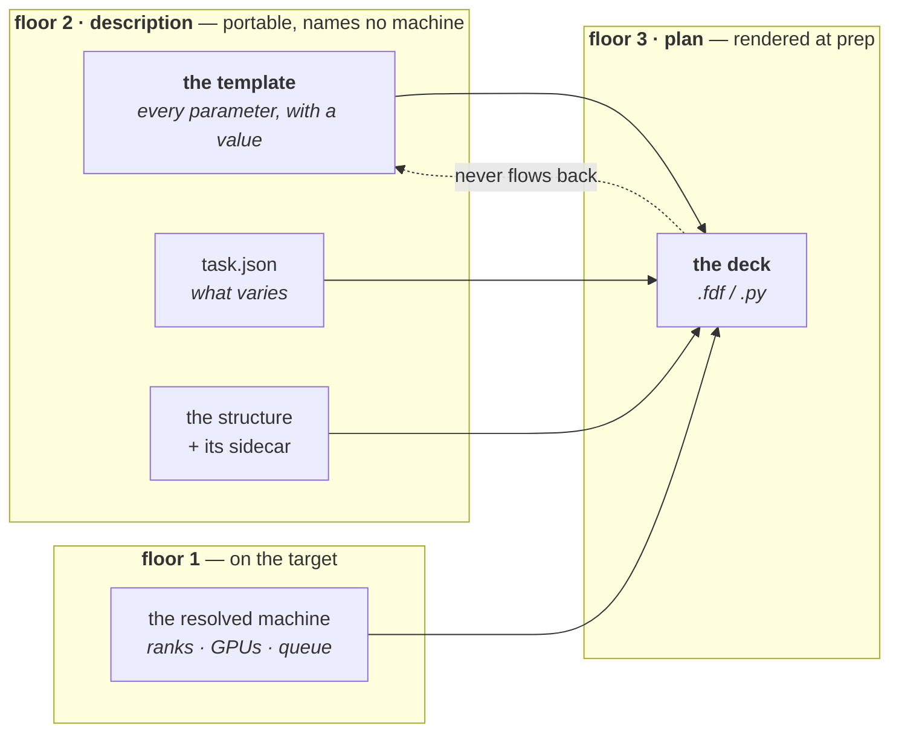
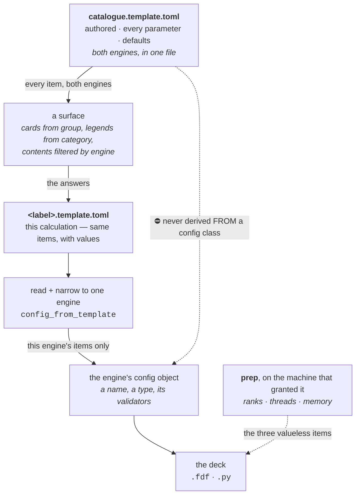
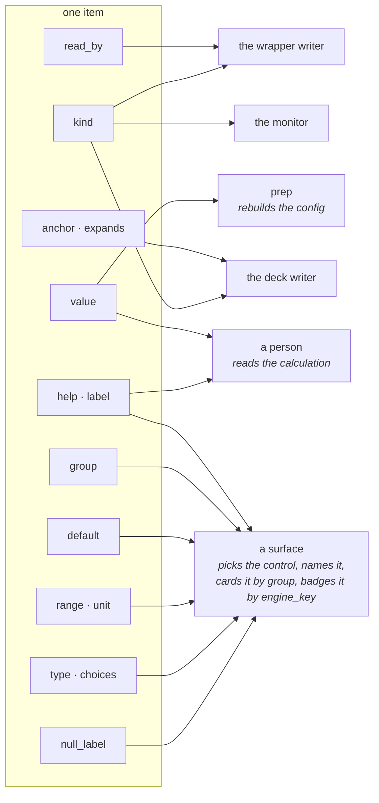
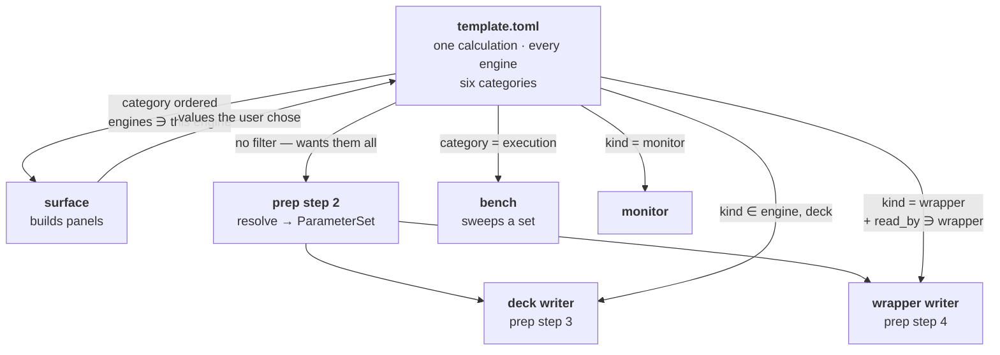
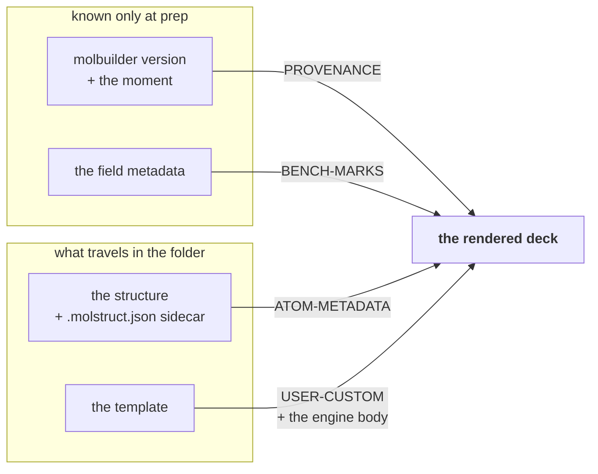
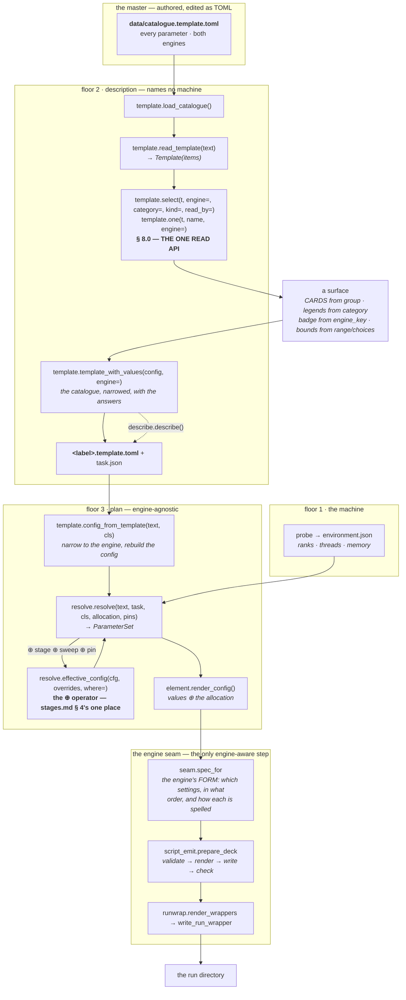
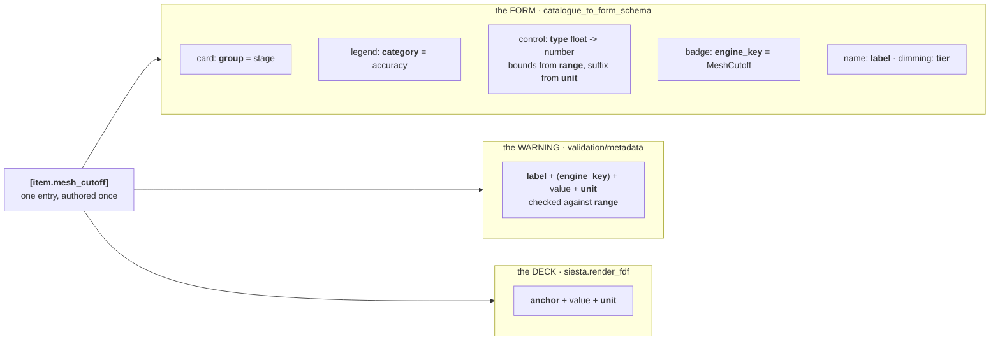
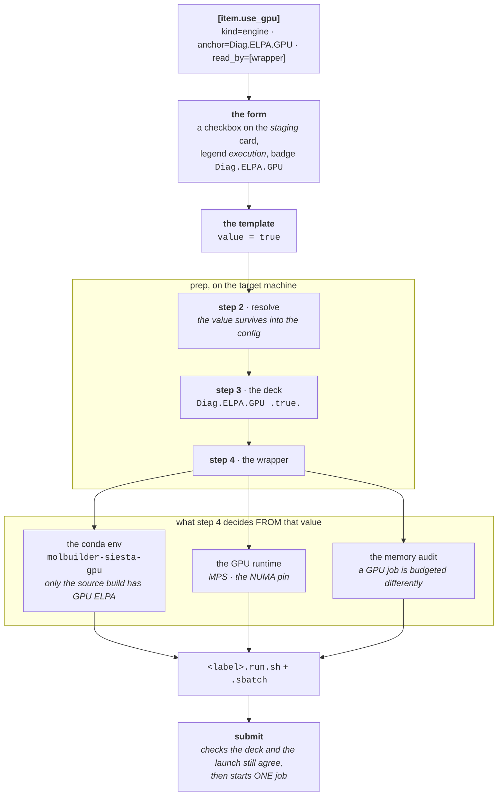
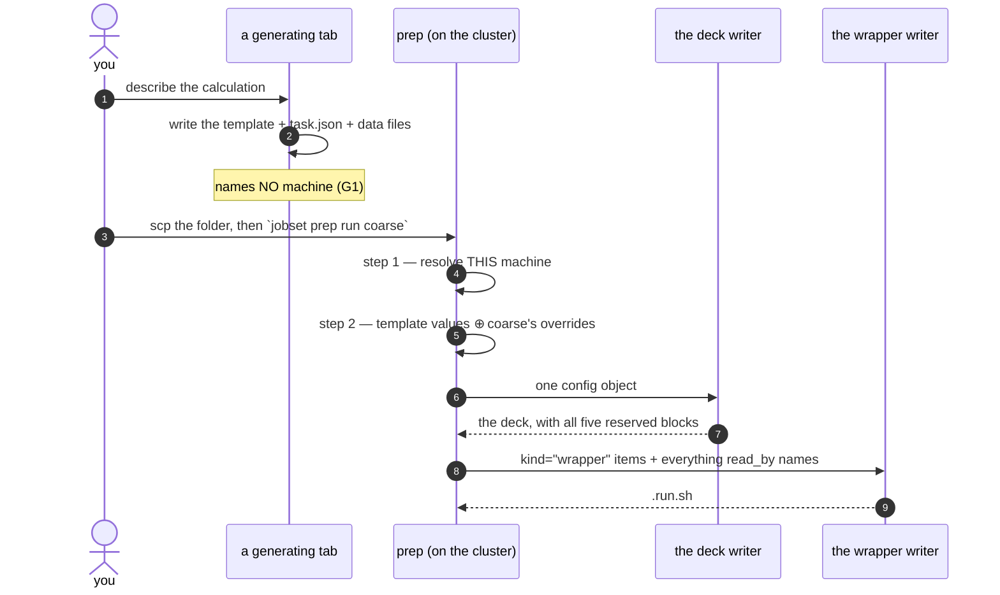

# The template — a calculation's parameter catalogue

**Role:** contract
**Domain:** engines
**Companions:** [`engines/overview.md`](?doc=engines/overview.md) (the engine map
and the three other cross-engine contracts) · [`engines/stages.md`](?doc=engines/stages.md)
(what a stage is, and `task.json`) · [`engines/tuning.md`](?doc=engines/tuning.md)
(what number each knob should carry).
**Upstream/downstream:** [`web/form-schema.md`](?doc=web/form-schema.md) § 1a
(the field metadata every item is built from) · [`execution/job-contracts.md`](?doc=execution/job-contracts.md)
§ 3.1 (the deck's reserved blocks), § 6.1 and § 6.3 (the file's registry row and
its name) · [`execution/architecture.md`](?doc=execution/architecture.md) § 2
(the floor this object belongs to) · [`execution/project-layout.md`](?doc=execution/project-layout.md)
§ 2.1 (the portable package it travels in), § 2.3.1 (the five steps of `prep`).

> **This document is the authority for what a template is, what is in it, and
> what its file looks like.** Every engine has one and they share this format;
> what differs between engines is only which items appear. Where the file sits
> and what it is called is [`job-contracts.md`](?doc=execution/job-contracts.md)
> § 6.3's, which is the cross-layer authority for every name in the system.

---

## 1. What it is, and what it must achieve

### 1.0 In plain terms, before any of the vocabulary

**A template is one file that says what calculation you are running.** Every
setting, the value each one has, and enough explanation that a person who did
not set them up can read it and understand what was asked for.

It is easiest to see by what came before it. A calculation used to be described
by the engine's own input file — a `.fdf` for SIESTA, a Python script for
PySCF — and that file is a poor record of intent for three reasons:

- **You cannot read it without knowing the engine.** `DM.Tolerance 1e-4` means
  nothing unless you already know SIESTA. There is nowhere in the file to say
  what it is, what it is measured in, or what a sensible value looks like.
- **You cannot tell a choice from a default.** A number sitting in the file
  could be something the scientist thought hard about or something a form
  filled in and nobody looked at. Six months later nobody can tell which.
- **You cannot move it.** Input files carry values that only make sense on the
  machine that produced them — how many processors, how much memory. Copy the
  folder to a colleague's cluster and those numbers are quietly wrong.

The template fixes all three by keeping the *question* and the *answer*
together, in a format meant for reading, with the machine-specific values
deliberately left out. From it, molbuilder can rebuild the engine's input file
on whatever machine is actually going to run it.

**So one file serves four different readers**, and each takes a different slice
of the same entries:

| who | what they take from it |
|---|---|
| a person | the prose, the units, the sensible ranges — what was asked for and why |
| the web form | which control to draw, what to call it, what bounds to enforce, which card it belongs on |
| the thing that writes the engine's input | which engine keyword each setting becomes, and its value |
| the checker | the declared type and range, so a bad value is caught before a job is queued |

That is the whole idea. The rest of this document is what it takes to make it
true and keep it true.

**Six pieces of shorthand appear below.** They are defined here because a term
used and never expanded is a term that only helps the person who coined it.

| you will read | it means |
|---|---|
| **floor 1 / 2 / 3** | which layer a thing belongs to. **Floor 1** is the machine you are on. **Floor 2** is the *description* — what the calculation is, portable, naming no machine. **Floor 3** is the *plan* — what gets rendered for one run on one machine. The full set is [`architecture.md`](?doc=execution/architecture.md) § 2 |
| **the deck** | the engine's own input file — a `.fdf` for SIESTA, a `.py` for PySCF. The thing the engine actually reads |
| **⊕** | *"with these values replaced"*. `template ⊕ overrides` is the template's settings with a stage's changes applied on top. One function does it, four times over (§ 10a.2) |
| **G1…G6** | the six goals in § 1.2. When a rule below looks arbitrary it is holding one of them up |
| **D1…D5** | the five design decisions in § 1.3, each with the alternative it rejected |
| **an item** | one setting in the file — its value and everything known about it |

Dated tags like *R10* or *A-9* are internal review references. Each is a
pointer to where a rule was argued, never a rule you need to know by name.

### 1.1 What it is, said once more with the surrounding pieces

**A template is the calculation's own catalogue: every parameter the engine's
schema declares, each with the value in force and everything we know about it.**

It is one of two files a generating surface writes, and they do not overlap:

| file | holds | owned by |
|---|---|---|
| **the template** | every parameter, with a value — **what the calculation is** | this document |
| **`task.json`** | which parameters vary, and each stage's overrides — **what the mission is** | [`stages.md`](?doc=engines/stages.md) § 6 |

> **effective config = the template's values ⊕ that stage's `overrides`**
> ([`stages.md`](?doc=engines/stages.md) § 4). A stage's override *replaces an
> item's value*. It never adds an item and never removes one.

### 1.1a Which parts of this contract are WIRED, and which are the target

**Read this before you rely on anything below.** This document describes a
design, and most of it is built. Three pieces are not, and they are pieces
other sections describe in the present tense — so a reader who trusts the
prose writes code against a mechanism that is not there. *(Measured
2026-08-17; the same honesty [`workflow.md`](?doc=workflow.md) § 7 keeps for
the engine seam, and for the same reason.)*

| the claim | today | where it is stated |
|---|---|---|
| **one file, every reader** — `select` / `one` are the read API | ✅ wired. `select` has four callers and they all go through it | § 8.0 |
| **`prep` rebuilds a config and renders; it never splices** | ✅ wired | § 8.1 |
| **the template is the master; nothing derives it from a config class** | ✅ wired — `render_template` was deleted 2026-08-14 | § 2.1 |
| **a machine fact's value is refused on read** | ✅ wired — `template_fields` + `config_from_template` | § 7 |
| **`kind` lets a layer find its own items** | ⚠ **not a dispatch axis.** No caller filters `select` by `kind`. What `kind` does today is force `anchor` on an engine item and `expands` on a deck one — a completeness check on the catalogue — and tell a *reader* who owns the item | § 6, § 8 |
| **`read_by` tells the wrapper which items it depends on** | ✅ **consumed since 2026-08-23.** The answer rides `Resources.use_gpu` — the allocation that already travels to the wrapper whole (A8) — and `runwrap._wants_gpu` prefers it, reading the deck only when a caller states nothing (a wrapper written for a deck someone points at has no allocation to ask). The keyword scan is no longer how a GPU run is recognised, which is what let a PySCF GPU run route at all | § 6.1, § 11.3, `execution/gpu.md` G7 |
| **`kind = "monitor"`** | ⚠ **zero items carry it.** `monitor.py` reads a log; it is not a configured layer. The two molwatch switches are `kind="produce"`, which is correct — the *producer* decides what the script writes | § 6 |

**Why the declarations are worth keeping while unconsumed, which is the part
that needs saying.** The wrapper's deck scan is the habit
[`architecture.md`](?doc=execution/architecture.md) § 1 exists to remove, and
removing it means the wrapper is *told* instead. On the day that lands, the
declarations must already be right — a rewiring that also has to discover which
items the wrapper depends on is two changes at once. The guard test is what
makes them right in the meantime: **it fails when a scanner is added without a
declaration**, so the two cannot drift while one waits for the other.

**What that costs today, stated plainly.** A new engine still cannot declare a
wrapper dependency and be served — it would declare `read_by` correctly and the
wrapper would not look. § 11.6's *"a new engine adopts the format"* is true of
the deck and the form, and not yet of the wrapper.

### 1.2 The six goals, and what breaks without each

Every rule in this document exists to hold one of these. When a later section
looks arbitrary, it is serving a row here.

| | goal | what breaks without it | held by |
|---|---|---|---|
| **G1** | **Portable** — the folder means the same thing on every machine | a description that names a queue or a rank count is wrong the moment it is copied somewhere else | § 2 — floor 2 must never name a machine |
| **G2** | **Enough on its own for a surface** — a tab builds `task.json` from this file and nothing else | the browser has to ask a server what a field is, so the folder is not really portable | § 5 — every item carries `type`, `range`, `default`, `choices`, `group` |
| **G3** | **Self-describing across layers** — a layer finds its own items without a list of field names | every new engine means editing the deck writer, the wrapper writer and the monitor | § 6 — `kind` and `read_by`. **The one goal not yet held in code** — the axes are declared and checked, and no layer dispatches on them (§ 1.1a) |
| **G4** | **Faithful** — the deck `prep` renders is the deck the surface would have rendered | a silently different calculation, which is the worst failure this system has | § 10 — render both ways and compare the text |
| **G5** | **Readable and editable by a person** | the "reference" half of *one file that is both the reference and the source* is a claim nobody can check | § 4 — one value per parameter, prose beside it, a format that survives hand editing |
| **G6** | **Complete** — everything the run needs that is not the structure and not the machine | text or labels stranded in a file that was never copied — the defect § 9 was written to close | § 7 total membership, § 9 the reserved blocks |

### 1.3 The five decisions, and the alternative each one rejected

**Design considerations, stated once so later sections can point here** rather
than re-arguing.

| | the decision | the alternative, and why not |
|---|---|---|
| **D1** | **One file.** The parameters and their descriptions live together | *A deck plus a sidecar of metadata.* Two files that can disagree, and nothing keeps them in step — the worst correctness position of the four weighed in § 4.1 |
| **D2** | **A data file, not the engine's format** | *An `.fdf` with the metadata in comments.* A deck is a floor-3 product (§ 2); a description shaped like one carries output from the floor above it, and cannot be run anyway because the machine-dependent values are missing |
| **D3** | **Each value is stored once** | *A declaration and a payload line carrying the same number.* Then a hand edit of one is silently ignored — the file disagreeing with itself |
| **D4** | **`prep` rebuilds a config and renders** | *Splicing a stage's overrides into text at their anchors.* Three shapes defeat it (§ 8.1), and without a config object [`stages.md`](?doc=engines/stages.md) § 4's R1 and R2 cannot hold — nothing would be validated as a resolved whole |
| **D5** | **Membership is total** — every parameter is an item, classified by `kind` | *A curated list of which fields belong.* A list is a judgement call per field, it drifts, and it makes *which settings may vary* fixed again — the arrow [`stages.md`](?doc=engines/stages.md) § 1.2 exists to reverse |

---

## 2. Where it sits, and what that forbids

The template is a **floor 2 — description** object
([`execution/architecture.md`](?doc=execution/architecture.md) § 2.1), beside
`Task`. That placement is not a filing decision; it decides the contents.

**Floor 2's *must never* is: name a machine.** So:

- **No item may carry a machine fact's VALUE.** How many ranks this job got,
  which queue it landed in, what wall-time it was granted — none of those is a
  parameter of the calculation. They are resolved at `prep` step 1 on the machine
  that will run the job (floor 1), and a description asserting one would not be
  portable **(G1)**.

  **The item may still be declared, valueless** (§ 6.4), because a person *may*
  ask for 8 ranks or prefer a GPU — and by the test recorded at the bottom of
  this section, *"may a person?"* is the criterion. A surface needs to know the
  question exists in order to ask it; the wrapper writer needs to know to look.
  What a reader **refuses** is a `value` on such an item: that is the failure
  this rule was written against — a hand-edited `mpi_np` once passed and a deck
  rendered for a rank count the allocation never granted. Declaring the question
  is portable; answering it on the wrong machine is not.
- **But a parameter molbuilder can *propose* a value for is still an item.**
  `BlockSize` is the case that makes the distinction sharp: a rank count's VALUE
  is a machine fact, while `BlockSize` is an ordinary SIESTA keyword
  a person may set, benchmark, or leave to the engine
  ([`tuning.md § 2.11`](?doc=engines/tuning.md)). It is an item with **no
  `value`** until somebody supplies one — which is exactly what *"a missing
  `value` means explicitly unset"* (§ 3) is for. `prep` fills an unset one from
  the resolved machine; it never overwrites a set one.

  > **Corrected 2026-08-11 (user).** This bullet read *"a value derived from a
  > machine fact is not an item either — `BlockSize` is computed from the rank
  > count"*, and that made a tunable knob unsettable: there was nowhere in a
  > portable description to record *"I measured 128 on this class of machine"*,
  > and no way at all to ask for SIESTA's own default. **The test is not
  > *"could a machine decide this?"* but *"may a person?"*** — and for
  > `BlockSize` they may.

### 2.1 The direction of flow — the template is the MASTER

**template → per-engine config → that engine's input file.** One direction, and
everything else follows from it.

`SiestaConfig` and `PySCFConfig` are **translators, not sources.** Their job is
to take what the template says and hand the engine's writer an object shaped the
way that engine needs. A parameter is **defined** in the template; a config
object only **carries** it on the way out.

| | |
|---|---|
| where a parameter is defined | **the template** |
| what a config class is for | translating the template into one engine's shape |
| what a deck writer sees | a config object, never the template |

**What this forbids: deriving the template from the config classes.** That makes
the classes the master and the template a printout of them — so *enriching the
template* would mean editing Python, two engines' catalogues could never live in
one file, and the thing a surface and the generator are supposed to **share**
would be a view rather than the source.

> **This reversed what § 5 and § 6.1's registry row used to say**, and the
> reversal is now finished rather than pending. Those sections described the
> file as *generated from the field metadata* — `render_template(config)`
> printed one engine's dataclass into a file, which made the Python class the
> master and the file its printout. **`render_template` was deleted
> 2026-08-14.** The catalogue is authored directly as TOML, and
> `template_with_values(config)` narrows it to one engine and fills in what a
> person answered.

### 2.1a What the migration settled, and the one debt it left

Both questions this section used to pose are now answered.

**What a config class still carries.** In principle: a name, a Python type, and
its validators — enough to hold a value on the way to the engine. In practice it
still carries copies of the template's facts — `label`, `help`, `range`,
`unit`, `choices`, `engine_key` and `workflow_group`, which is
`tests/test_catalogue_agreement.py`'s `MIRRORED` set and the one place that
list is defined — because two consumers still read them off the class rather
than off the catalogue: the legacy form builder that Spectra and Transport use,
and the code that decides which card a validator finding lands on.

**That duplication is the debt, and it is measured and guarded rather than
tolerated quietly.** **513 facts live in two places** (measured 2026-08-20;
307 when this was written, and the growth is the point — the debt compounds
with every parameter added).
`tests/test_catalogue_agreement.py` compares every one of them on every run, so
the two cannot drift apart without a red test naming the item and the key. It
has already earned its place several times — it caught 23 stale labels when the
catalogue landed, and three merged items whose prose still described only
SIESTA. When the remaining two consumers move onto the catalogue, the metadata
is deleted and that test file goes with it.

> **The number above is asserted, not typed.** A count stated in prose is a
> claim about the code, and this one had been wrong by 145 for three days
> before a review caught it. `tests/test_doc_claims.py` now measures every
> such claim in this document and fails naming the sentence — the same
> mechanism, one class of claim wider, that already keeps the closed
> vocabularies in step.

**The form question is closed.** `web/form-schema.md` § 1 now builds the SIESTA
and PySCF forms from the catalogue: cards from `group`, legends from `category`,
controls from `type` with bounds from `range` and `choices`, badges from
`engine_key`. `section` — the old per-engine fieldset name — is retired for
those two engines and survives only for Spectra and Transport.

**And the template is not a deck.** A deck is a **floor 3 (plan)** product,
written by the engine's deck writer at `prep` step 3, on the target machine.



**The dotted arrow is the rule that makes the rest work** — nothing a machine
produced ever edits the description
([`architecture.md`](?doc=execution/architecture.md) § 5: *each step decides
within what the steps above it already fixed*). It is why a deck is disposable
and the template is not.

### 2.2 The module, what it may depend on, and what is built on it

The file format is one half of the contract; the code that reads and writes it
is the other, and its **dependencies are part of the design rather than an
accident of imports.**

**`molbuilder/template.py` imports the standard library and one internal
module** — `persist.check_schema`, which checks the schema string at the top of
the file. Nothing else. In particular it imports no engine, no web code, no
filesystem walker and no scheduler.

That is not minimalism for its own sake. It is what lets the same reader run in
three places that could not otherwise share code: in a browser-facing server
that must not import SIESTA, in `prep` on a compute node, and in a test with no
engine installed at all. **The day `template.py` imports an engine, a template
stops being something any layer can read** — and the layer that suffers first is
the one furthest from the engine, which is the person opening the file.

**What is built on top of it**, and what each one takes:

| module | what it does with a template |
|---|---|
| `describe.py` | writes the file for a calculation — the surface's output |
| `resolve.py` | rebuilds a config from it, then applies stage overrides, sweep points and pins (§ 10a.2) |
| `jobset/prep.py` · `jobset/_cli.py` | reads the file that travelled with the folder, and renders the run |
| `validation/metadata.py` | takes the declared type and range to check a value, and the engine keyword to name it in the message |
| `web/blueprints/_shared.py` | turns the catalogue into the form schema — cards, controls, bounds, badges |

**Imports run one way only.** Everything in that table imports `template`;
`template` imports none of them. So a change to the format is felt by its
readers, and a change in a reader cannot reach back into the format — which is
the same rule the deck-never-flows-back arrow states for the data (§ 2.1).

**The two objects a reader gets back**, so the shape is stated once rather than
inferred from call sites:

- **`Item`** — one parameter. Frozen: reading a template cannot modify it. It
  carries the keys § 5 lists, and one property, `is_set`, which answers *did
  anybody give this a value* — distinct from *is it at its default*.
- **`Template`** — the parsed file: the engines it serves, and its items in
  order. `select(...)` filters them by engine, category, kind or reader;
  `one(name)` fetches a single item.

`select` and `one` are the **only** read API (§ 8.0). That matters because a
second way to read the file is a second answer to *what does this template say*,
and the two will differ eventually — usually about the case nobody tested, which
is the item that does not apply to the engine being asked about.

---

## 3. Must-haves — what makes a file a valid template

**Two keys at the top, and four on every item.** A reader that finds one
missing **refuses and says which**; it never guesses, and it never silently
drops the item.

```toml
schema      = "molbuilder/template@2"   # REQUIRED — what this file is
engines     = ["siesta"]                # REQUIRED — which engines this
                                        #   calculation can run on (§ 6.3)
```

> **`engines` replaced the single `engine` key at `@2`.** A template describes a
> calculation, and a calculation may be runnable on more than one engine, so the
> file lists them and each item says which it applies to (§ 6.3). A `@1` file
> names one engine and an `@2` reader treats it as `engines = [<that one>]`; a
> `@1` reader meeting an `@2` file **refuses**, which is what the `@major`
> convention is for.

| top-level key | why it must be there |
|---|---|
| `schema` | the `@major` convention ([`job-contracts.md`](?doc=execution/job-contracts.md) § 6): a higher major makes an old reader **refuse rather than guess** |
| `engines` | which schemas the items belong to. Without it a reader cannot know which config class to rebuild, and would have to infer it from the item names. A reader given an engine not in this list refuses rather than returning an empty catalogue — *"this calculation does not run on that engine"* and *"no items matched"* are different answers |

**On every item — four required keys**, and each earns *required* by a goal:

| key | required because |
|---|---|
| `kind` | without it no layer can tell whose item this is, and G3 collapses to a field list |
| `category` | without it a surface has no panel to put the item on, and G2 fails — a file *"enough on its own for a surface"* cannot leave the presentation to the reader's guess (§ 6.2) |
| `type` | what the value is *validated* as, which TOML's own types cannot express (§ 5) |
| `help` | G5. An item nobody can read makes the file a serialised blob with extra steps |

**Conditionally required**, and the condition is the item itself:

| key | required when |
|---|---|
| `anchor` | `kind = "engine"` — an engine item that names no keyword cannot reach the deck |
| `value` | **when the item has been answered.** Its absence is a real state — *explicitly unset* — distinct from the default and from an absent key elsewhere. It was listed as unconditionally required until 2026-08-13, which read as though a valueless item were malformed; § 6.4 makes valueless the **normal** state for anything resolved at `prep` (memory, `block_size`, rank count, threads) |
| `allocation` | when the **scheduler** answers this item, not a person — § 6.4. It is what makes a `value` on the item a refusal rather than a choice |
| `expands` | `kind = "deck"` — it is how a reader learns what this item produces: the engine keywords when the product is keywords (`restart` → `DM.UseSaveDM`, …), or the deck MECHANISM by name when the product is control flow (`displacement_amplitude_ang` → `finite-difference polarizability loop` — the vibration kind's items generate loops, not lines, and inventing pseudo-keywords for them would send a reader grepping for spellings no engine has) |
| `choices` | `type = "enum"` — an enum with no members cannot be validated or rendered as a control |

Everything else — `default`, `range`, `unit`, `group`, `read_by` — is present
when it applies and absent when it does not. **Absent is not a failure**; it is
the honest statement that the parameter has no default, no bounds, no unit, or
no other reader.

> **An unknown `kind` is an error, not something to skip.** The vocabulary in
> § 6 is closed. A reader that quietly ignored an item it did not understand
> would produce a deck missing a parameter, and say nothing — G4's failure mode
> exactly.

---

## 4. The format: one TOML file

### 4.1 Why TOML, and why not the three alternatives

| | **correctness** | **readability** | **hand-editable** |
|---|---|---|---|
| **TOML** *(chosen)* | a published spec; `tomllib` is standard library from Python 3.11; the value is stored **once** (D3) | comments and multi-line prose sit with the item they explain | yes — and not whitespace-significant, so an edit cannot silently restructure the file |
| **JSON** | as strong on parsing | **no comments**, and multi-line prose becomes `\n`-escaped — the reasoning is unreadable | poor: one missing comma, and no comments to explain the shape |
| **YAML** | weakest: `no` parses as false, versions differ, and it needs a **dependency** | good | **fragile** — whitespace is structure, so a stray indent changes meaning |
| **the engine's own format, metadata in comments** | the value ends up stored **twice**, so the file can disagree with itself | high for an engine expert | yes, but two places must be edited in step |

**Correctness decides it, and the failure mode is the one to name.** It is not a
parse error — those are loud and recoverable. It is **a file that parses cleanly
and describes a different calculation than it appears to.** The engine-format
option has that failure built in (D3). TOML stores each value once, so the
failure cannot be expressed.

**Performance does not discriminate and it would be dishonest to claim it
does.** A template is a few hundred lines read once per `prep`.

> **The project's rule, stated once:** **JSON for machine-to-machine artifacts**
> (`task.json`, `job-set.json`, `environment.json`, `run.json`); **TOML for the
> one artifact a person reads and edits.** The template is that artifact —
> [`project-layout.md`](?doc=execution/project-layout.md) § 2.1 puts it in the
> package a person carries to a cluster and looks at.

> **Writing it needs care that reading does not.** `tomllib` reads TOML and does
> not write it. Whatever emits a template must **read its own output back and
> compare it to what it meant to write** — a cheap check that turns *"we emitted
> TOML correctly"* from an assumption into a verified property. A writer library
> is not required and would be a new dependency.

### 4.2 A template, entire

**Every item below is a real catalogue item, with the classification the
catalogue gives it.** That is not a courtesy to the reader: an example is the
shape everyone copies, and this one showed three items that do not exist —
`frozen_indices` and `user_custom` were never added (§ 12), and `species_order`
was shown as `kind="deck"` when it is `produce` (§ 6). Illustrations are now
checked against the catalogue by
`tests/test_doc_claims.py::test_every_documented_item_matches_the_catalogue`.

The six items are chosen to show **all four `kind`s that any item carries** —
`engine`, `deck`, `produce`, `wrapper` — and both value states. (`monitor` is
the fifth member of the vocabulary and no item carries it; § 12.1 row 5.)

```toml
# BDT on Au(111) — geometry relaxation.
schema      = "molbuilder/template@2"
engines     = ["siesta"]

# kind = "engine" — the ordinary case: one keyword, one value.
[item.mesh_cutoff]
kind     = "engine"
category = ["accuracy"]
anchor   = "MeshCutoff"
type     = "float"
value    = 300.0
default  = 300.0
unit     = "Ry"
range    = [100.0, 1000.0]
group    = "stage"
help     = """
The real-space integration grid, in Ry.  Higher is finer and slower;
convergence is checked, not assumed.
Per-tier: screening 150 · publishable 350 · tight 500."""

# kind = "deck" + read_by — a MERGED item whose value ALSO leaves the deck
# (§ 6.1).  It was `enable_gpu` (SIESTA) and `use_gpu` (PySCF) until
# 2026-08-23; one question gets one item, and each engine's writer renders
# its own reach — `net_charge`'s worked example, § 6.3.
[item.use_gpu]
kind     = "deck"
category = ["execution"]
expands  = ["Diag.ELPA.GPU", "gpu4pyscf"]
type     = "bool"
value    = false
default  = false
group    = "staging"
read_by  = ["wrapper"]
help     = """
Run the ELPA diagonalization on a GPU.  The wrapper depends on this: it decides
the environment (only the source build has GPU-capable ELPA) AND the GPU runtime
-- the gres ask, MPS, the NUMA pin.  So the value leaves the deck and reaches
the launch, which is what read_by records."""

# kind = "deck" — molbuilder's own item, reaching the deck as TWO keywords.
# This is the shape § 8.1 uses to show why splicing cannot work.
[item.spin_total]
kind     = "deck"
category = ["system"]
expands  = ["Spin.Fix", "Spin.Total"]
type     = "float"
optional = true
group    = "profile"
help     = """
Target total spin moment in Bohr magnetons (= unpaired electrons).  Emits BOTH
`Spin.Fix .true.` and `Spin.Total <v>`; the first is required or the second is
silently ignored, which is why one item writes two keywords."""

# kind = "produce" — shapes HOW the script is written without becoming a
# keyword.  It orders the ChemicalSpeciesLabel block; it does not produce it,
# which is the line § 6 draws between `produce` and `deck`.
[item.species_order]
kind       = "produce"
category   = ["system"]
engine_key = "(molbuilder: ChemicalSpeciesLabel block ordering)"
type       = "strlist"
optional   = true
group      = "profile"
help       = """
The order species are declared in.  A .XV read against a different order lands
every coordinate on the wrong atom (run-identity.md § 4)."""

# kind = "wrapper" — never reaches the deck at all.
[item.continue_retries]
kind     = "wrapper"
category = ["execution"]
type     = "int"
value    = 1
default  = 1
range    = [0, 5]
group    = "staging"
help     = "How many times the run wrapper retries a stage that did not converge.  0 means run once, whatever happens -- which is what a benchmark trial needs."

# kind = "engine", and DELIBERATELY VALUELESS -- the § 6.4 state.  Unflagged,
# because the scheduler does NOT grant it: a benchmark measures it.
[item.block_size]
kind     = "engine"
category = ["execution"]
anchor   = "BlockSize"
type     = "int"
optional = true
group    = "budget"
help     = """
The ScaLAPACK/ELPA distribution block, in orbitals.  Left unset the keyword is
NOT WRITTEN and SIESTA uses its own automatic; set to a number, that number is
written verbatim (tuning.md § 2.11)."""
```

**Two absences in this file are meaningful and neither is an omission.**
`block_size` has no `value` — that is *explicitly unset* (§ 3), the state a
missing key encodes. `spin_total` has neither `value` nor `default` — it is
`optional`, so *unset* is one of its legal answers and there is no default to
fall back to.

---

### 4.3 Where a template comes from — the catalogue, with the answers filled in

**There is one master file, and it is authored rather than generated.**

| | what it is | who touches it |
|---|---|---|
| **the catalogue** — `molbuilder/data/catalogue.template.toml` | every parameter both engines declare: category, type, bounds, prose, **default**. Shipped with the package | a maintainer, **editing the TOML directly** |
| **a calculation's template** — `<label>.template.toml` | the same items, narrowed to the engine in use, carrying the **values** a person chose | a surface writes it; a person may edit it |



**Reading the arrows, because each one is a rule:**

| arrow | what travels, and why it is that way round |
|---|---|
| catalogue → surface | **every** item, both engines. A surface builds the six panels from `category` and filters the contents by `engines` — one panel set serving every engine, which is why `category` is engine-independent (§ 6.2) |
| surface → template | **only the answers.** The items themselves are not re-invented; the surface is filling in a form whose questions the catalogue already asked |
| template → config | narrowed to one engine first, **then** read as that schema's fields. Skip the narrowing and a two-engine file is refused for both engines, each seeing the other's items as names it does not know |
| config → deck | the engine's own writer, which never sees the template. It receives an ordinary config object, which is why a config class is a **translator** and not a source (§ 2.1) |
| prep ⇢ deck | the allocation items (`allocation = true` in the catalogue: `mpi_np`, `omp_threads`, `max_memory_mb`, `gpu_count`, PySCF's `threads`) are answered here, on the machine that granted them — never in the file (§ 6.4, § 7) |

> **⛔ There is no config → template writer, and there must not be one.**
> `render_template(config)` reflected a Python class into a file, which made the
> class the master and the file a printout of it — § 2.1's forbidden direction.
> **Deleted 2026-08-14.**
>
> The cost of the inverted arrangement was concrete, not theoretical:
> **enriching the catalogue meant editing Python**, two engines' parameters
> could never share one file (the writer took one config class, so it emitted
> one engine's items), and the thing a surface and the generator are supposed to
> **share** was a view of Python rather than the source. Adding a parameter now
> lands in one TOML file and both surfaces see it.

**Why the catalogue is authored rather than generated, stated once.** A
generated catalogue has a source, and that source becomes the real master
whatever the contract says. The moment the catalogue is authored, the question
*"where is this parameter defined?"* has one answer for every parameter, in every
engine — and that is the property G2 and G3 both rest on.

**And it is why § 7's machine-fact rule needs no defence inside the file.** The
catalogue is authored correct and is not modified; a surface supplies values for
the items that take them; the allocation items are answered at `prep`. The
file does not have to defend itself against its own author. *(User, 2026-08-14 —
recorded because the reverse assumption produced a "leak" that was not one.)*

---

## 5. Anatomy of an item

| key | what it says |
|---|---|
| `kind` | which layer owns this item — § 6's closed vocabulary |
| `value` | the value in force. Absent means **explicitly unset** |
| `type` | the **validation** type — `int` · `float` · `str` · `bool` · `enum` · `pow2` · `int3` · `float3` · `strlist` · `intlist` · `text` |
| `default` | what untouched means. A surface compares it to `value` to show whether the user set this |
| `anchor` | the engine keyword this becomes. A bare keyword, never a sentence — it is what a **deck writer** matches on |
| `engine_key` | how the engine **spells** this, in full — `gto.M(basis=...)`, `mf = mf.density_fit()`, or a `(molbuilder: …)` note when the setting never reaches the deck. A different fact from `anchor`, and a **surface** shows this one. Collapsing the two lost it on 29 items (2026-08-14→15): four PySCF controls all read `gto.M`, three read `mf`, and every molbuilder note vanished — and the note is the only way a reader learns the setting is not an engine keyword at all |
| `manual` | **where the engine's own documentation defines this keyword** — `SIESTA 5.4.2 §6.9.2 'Mixing options'`. Read by nobody but a person reviewing the catalogue, and **the one key no config class mirrors** — § 5.1. *(It rides into a calculation's own template like every other key; "catalogue-only" said here until 2026-08-17 and meant the second thing, which is the claim that matters)* |
| `expands` | what a `deck` item produces, as a list — engine keywords, or the deck mechanism's name when the product is control flow (see § 3's row) |
| `read_by` | which **other** layers derive something from this value — § 6.1 |
| `category` | which **question about the calculation** this answers — § 6.2's closed vocabulary. Engine-independent, so the same six panels serve every engine |
| `engines` | which engines this item applies to, as a list. **Absent means all of them** — § 6.3 |
| `calculations` | which calculation KINDS select this item, as a list — `engines`' exact sibling on the other axis (spectra-migration P0, 2026-08-20). **Absent means every kind**, which is why the 80-plus pre-existing items needed no edit and the fourteen vibration items stay out of an optimization template by declaration |
| `refs` | citation keys into `docs/science/references.bib` — the paper(s) behind a scientific knob's guidance. Resolved server-side (title + DOI) and rendered in the form's help; `tests/test_catalogue_refs.py` pins that every key resolves |
| `allocation` | **the scheduler answers this one** — ranks, threads, memory (§ 6.4). One boolean; it replaced a `resolver` NAME plus a list of which names counted, neither of which anything dispatched on |
| `label` | the **human name** — *"MPI ranks (np)"*. Not the field name; a surface shows this |
| ~~`section`~~ | **RETIRED at `@2` — use `category` (§ 6.2).** It held a free-text fieldset name per engine (*"SCF"*, *"Compute & budget"*), so two engines expressing one idea disagreed on the label and no surface could group across them. A section-less item was still an item, and that stays true of `category`: membership is TOTAL (§ 7) |
| `null_label` | what **unset** is called on an optional item — *"(auto)"*, *"(single-process)"* |
| `range` · `unit` · `choices` | bounds, unit label, enum members |
| `group` | **which card**, from the closed vocabulary `template.GROUPS`, in render order: `setup` (what the run is called and where its pseudopotentials come from — nothing can be built without these, so they come first) · `profile` (what you're computing) · `stage` (what counts as converged — the set a staged sequence tightens, and what makes *vary per stage* start ticked) · `budget` (how much compute) · `output` (what the run writes) · `staging` (answered by the staging surface, not by a parameter form). Optional on a template item — it is presentation, and `prep` reading one headlessly never asks — but **required on every item of the catalogue**, which is what a form is built from: an item with none renders loose below the cards and its findings fall to the residual panel |
| `optional` | whether **unset** is a state this item has. A surface must offer it — *(auto)*, *(no cap)* — and it is **not** inferable from `null_label`: of 17 optional items only 13 carry one, so four would silently lose the option (§ 1.2 of [`web/form-schema.md`](?doc=web/form-schema.md)) |
| `tier` | `basic` or `advanced`. A judgement about the **parameter**, not about the widget: a surface dims the advanced ones so a first-time reader is not asked to weigh every knob at once |
| `pattern` | a regex the value must match. Two items have one — `system_label`, `job_name` — and nothing else in the vocabulary can express *"letters, digits, hyphens, underscores; no dots"* |
| `help` | what this is, in prose. Multi-line is ordinary TOML |

**TOML types the storage; `type` types the validation.** `300.0` is already a
float to any parser, so `type` is not repeating that — it carries what a parser
cannot know: that `pow2` must be a power of two, that `enum` is drawn from
`choices`, that `text` is verbatim engine text to be copied rather than
interpreted.

**Which key serves which reader** — this is G2 and G3 made concrete:



> **⭐ `label`, `section` and `null_label` were added 2026-08-11**
> *(`section` was replaced by `category` at `@2` — § 6.2; the other two
> stand)*, when the user
> settled that **the UI is to be built *from* the template** rather than merely
> generated from the same schema —
> [`generator.md`](?doc=execution/generator.md) § 3.1. Without them a template
> cannot name its own fields or group them, and `optional` says *unset* is a real
> state while nothing says how to show it. They are already in the field metadata,
> so carrying them costs nothing — and adding them later means re-emitting every
> template written before.

> **⚠ This paragraph described the inverted direction and is struck.** It read:
> *"Every key comes from the field's own metadata … the template and the form
> are generated from one source and cannot drift apart."* That made the config
> classes the master and the template their printout — § 2.1. **Every key is
> authored in the catalogue** (§ 4.3); a config class carries a name, a type and
> its validators, and nothing else. *(Struck 2026-08-14.)*

> **The same source feeds BENCH-MARKS, and that is a rule.** A generated deck's
> BENCH-MARKS block ([`job-contracts.md`](?doc=execution/job-contracts.md) § 3.3)
> declares `type`, `range`, `unit` and `default` for the subset a tool may
> override; a template declares them for every parameter. **Both are emitted from
> the field metadata**, because two hand-maintained copies of `default` would
> drift silently. Their `type` vocabularies differ in size on purpose: § 3.3's
> `{int, float, str, pow2, enum}` is enough for the numeric knobs a benchmark
> turns, and the template adds `bool`, `int3`, `float3`, `strlist`, `intlist`
> and `text`
> because it must describe everything. **The narrower set is a subset, never a
> competing definition.**
>
> ~~⚠ **The code's benchmark-side constant is wider than § 3.3's five**~~
> **Closed 2026-08-23.** It carried `bool` and `int3`, added 2026-08-07 when
> § 3.7 reused this grammar for a template's **in-deck** item blocks; § 3.7
> moved out on 2026-08-11 and both became residue of a sharing that had ended.
> The 2026-08-14 note deferred the fix because *"the constant's other reader is
> a test that would need re-scoping with it"* — one test, and it was re-scoped
> in the same change.
>
> **There is no benchmark-side constant now.** The narrower set is *derived*
> from the vocabulary above by a stated rule —
> `script_emit.benchmark_declarable_types()`: **a benchmark varies a scalar it
> can order or enumerate**, so a shape, a list, verbatim text or a family is
> not declarable, each with its reason in the code. Which is what *"a subset,
> never a competing definition"* has to look like to stay true: a second tuple
> beside this one drifted within four months of being written.

### 5.1 `manual` — the citation, and why only the catalogue carries it

Every item whose `kind` is `engine` names **where the engine's own
documentation defines that keyword**:

```toml
[item.mixing_weight]
kind = "engine"
category = ["convergence"]
engines = ["siesta"]
anchor = "SCF.Mixer.Weight"
engine_key = "SCF.Mixer.Weight"
manual = "SIESTA 5.4.2 §6.9.2 'Mixing options'"
type = "float"
value = 0.02
default = 0.02
help = "How much of each new SCF solution is mixed in.  DEVIATION: SIESTA's own default is 0.25 -- see § 5.2."
```

**Nothing renders it.** No surface shows it, no deck carries it, no generated
script mentions it. It exists for one reader: the person opening the catalogue
to ask *"is this value still right?"* — and that person's first move is to open
the engine's documentation at the place that answers it.

**The version is part of the citation, not decoration.** A bare `§6.9.2` is
worse than useless once the manual renumbers: it points somewhere confidently
and wrongly, with nothing in the file to reveal that it moved. Naming the
release the citation was taken against makes a stale pointer *visible* — the
same reasoning as § 3's schema string.

**It is the one key the config classes do NOT mirror.** The mirrored set lives
in two homes until the form is rebuilt from the catalogue (§ 2.1a), and
`tests/test_catalogue_agreement.py` keeps the two in step. **That set is named
once, in the test's own `MIRRORED` constant** — naming it here as well is how
this paragraph came to list five keys while § 2.1a listed seven and the code
checked six.

`manual` is deliberately outside it: its entire job is to let a reviewer
**check the catalogue**, and a fact duplicated into the thing it is meant to
check is a fact that can disagree with itself. One home, and the home is the
master.

**The citations were derived, not recalled.** The 5.4.2 manual sources were
parsed for every `\begin{fdfentry}{…}` and its enclosing numbered heading, then
matched against our anchors through **fdf's own `labeleq` normalisation** —
case-insensitive, and `_`, `.`, `-` are not significant (`utils.F90`). That
last part is not a nicety: two of our anchors appear nowhere in the 5.4.2
manual under the spelling we use, because the manual now writes `Mesh.Cutoff`
and `Save.HS`. They are the same keyword to the engine, and matching the way
the engine matches is what found them.

> **Deprecated is a different question from renamed, and the manual says
> which.** A keyword the manual marks with `\fdfdeprecates` is one SIESTA
> intends to stop reading — those four were migrated on 2026-08-15
> (`MD.NumCGsteps` → `MD.Steps`, `MD.MaxCGDispl` → `MD.MaxDispl`,
> `DM.MixingWeight` → `SCF.Mixer.Weight`, `DM.NumberPulay` →
> `SCF.Mixer.History`). A keyword the manual merely cross-indexes under a newer
> name (`DM.Tolerance` under `SCF.DM.Tolerance`, `DM.EnergyTolerance` under
> `SCF.FreeE.Tolerance`) is a living alias, and migrating it would be churn
> with a behaviour risk and no gain. **The rule is the manual's own marking, not
> our taste** — and after the sweep no anchor we emit is a `\fdfdeprecates`
> target.

**PySCF has no numbered manual, so its citation names the class that owns the
attribute** — `PySCF 2.13 pyscf.scf.hf.SCF 'conv_tol'` — found by walking a
live object's MRO under the installed release, not read off a documentation
page that may describe a different version.

---

### 5.2 Where a default differs from the engine's own, the help says so

A default that disagrees with the engine's own default is a **claim**, and an
unexplained claim is indistinguishable from an oversight. So the rule:

> **Where this project ships a value the engine would not, the item's `help`
> states that it is a deviation, what the engine's own value is, and why ours
> is different.**

This is not documentation for its own sake. It is what makes the value
reviewable: a reader who disagrees needs to know they are overriding a
considered decision rather than correcting a typo, and a reviewer checking the
catalogue against a new engine release needs to know which values were chosen
and which were merely inherited.

The sweep on 2026-08-15 found the rule was being kept nowhere. Eleven SIESTA
items and six PySCF items shipped a non-default value with no mention of it —
including `SCF.Mixer.Weight` at 0.02 against the engine's 0.25, a twelve-fold
difference and the single most consequential knob in the file. It also found
three help texts that were not merely silent but **wrong**, described in
§ 10b's finding 8.

---

## 6. `kind` — which layer owns the item

A template holds more than the engine's own parameters. Some items shape the run
wrapper, some shape what the producer does, some shape what the monitor writes.
**A layer must be able to tell which without carrying a list of field names
(G3)**, so every item declares it.

| `kind` | the item is | reaches the deck | who acts on it |
|---|---|:--:|---|
| `engine` | one of the engine's own keywords | yes, as `anchor` | the deck writer |
| `deck` | molbuilder's own, and it **produces** keywords — one item becoming several, or one whose keyword is chosen by another value | yes, via `expands` | the deck writer, through molbuilder's rule rather than one keyword |
| `wrapper` | shapes the run script | no | `runwrap` |
| `produce` | shapes **how the script is written** without becoming a keyword itself | no | the producer |
| `monitor` | shapes what the monitor writes | no | the monitor — **and no item carries this today** (§ 1.1a) |

**The vocabulary is closed.** An unknown `kind` is an error a reader reports,
never something it silently drops (§ 3).

> **Where `deck` ends and `produce` begins, drawn on the case that decides
> it.** This table said `deck` covered *"ordering a block"*, and by that
> reading `species_order` — which fixes the order species are declared in —
> would be a `deck` item. It is `produce`, and the catalogue is right: **it
> orders a block it does not produce.** The `ChemicalSpeciesLabel` block comes
> from the structure; `species_order` only tells the producer which way round
> to write it, which is why its `engine_key` is the note
> `(molbuilder: ChemicalSpeciesLabel block ordering)` rather than a keyword.
>
> So the test is **does this item put keywords in the deck?** If yes it is
> `deck` and must say which, in `expands` — that is why § 3 makes `expands`
> conditionally required, and an item that produces nothing has nothing to put
> there. If it only changes *how* something else is written, it is `produce`.
> *(Stated 2026-08-17. The looser wording had put a wrong classification into
> § 4.2's worked example, where it is the shape people copy.)*

**This is what lets a producer refuse cleanly.** A SIESTA producer emits
`kind="engine"` anchors and whatever `kind="deck"` items expand to, and **must
not try to emit a `wrapper` item as a keyword** — SIESTA would not understand
it. An item a layer cannot place is not a fault in the template; it belongs to a
different layer, and the item says so on its own face.

### 6.0 How `kind` and `anchor` are DECIDED — the rule, and the two homes

§ 6's table says what each `kind` *means*. This says how a reader arrives at
one, because the item is authored in **two places** and they must agree.

**`anchor` is derived, never authored — from `engine_key`.** That is the rule
nobody can guess from the table above, and getting it wrong is the commonest
way to be refused:

```python
kind   = metadata["item_kind"] or "engine"          # engine is the DEFAULT
anchor = _bare_anchor(metadata["engine_key"] or field_name)
```

`_bare_anchor` takes the **leading keyword** of `engine_key` — `%block Foo` or
a bare word — and returns `""` when it leads with none. So the *shape* of
`engine_key` decides which `kind` is legal:

| `engine_key` shape | example (real, from this catalogue) | derived `anchor` | the `kind` you must declare |
|---|---|---|---|
| **a bare keyword** | `MeshCutoff` | `MeshCutoff` | `engine` — the default, declare nothing |
| **a conjunction** `A + B` | `Spin.Fix + Spin.Total` | `Spin.Fix` | `deck`, **explicitly** — and list every keyword in `expands` |
| **an alternation** `A \| B` | `MD.Steps (CG / Broyden / FIRE) \| MD.FinalTimeStep (Verlet / Nosé)` | `MD.Steps` | `deck`, **explicitly** — `expands` lists every keyword it *may* write |
| **a note** `(molbuilder: …)` | `(molbuilder: .run.sh mpirun -np N only)` | `""` | anything but `engine` — `deck`, `wrapper`, `produce` or `monitor` |

> **Why a conjunction and an alternation are both `deck`.** The difference is
> whether the item writes *all* of them or *one* of them, and neither is a
> single keyword the deck writer can look up — which is exactly what `deck`
> means. `spin_total` writes both of its keywords, always; `relax_steps` writes
> whichever the run mode calls for, never both.

**The refusal, and what it is telling you.** Leave the kind at its default with
an `engine_key` that leads with no keyword and the reader says:

```
field 'net_charge': kind defaults to 'engine' but its engine_key names no
keyword ('(molbuilder: …)'). Give it an explicit metadata['item_kind'] …
```

It is not asking for an anchor. It is saying *this item is not an engine
keyword, so tell me what it is.*

#### The two homes, and why both must be edited

| | authored where | how `kind` / `anchor` arrive |
|---|---|---|
| **the catalogue** (`data/catalogue.template.toml`) | by hand, as TOML | **verbatim** — you write `kind`, and `anchor` when the kind is `engine` |
| **the config class** (`SiestaConfig` / `PySCFConfig`) | field `metadata` | **derived** — from `engine_key`, plus `item_kind` when the shape needs it |

The catalogue is the master (§ 2.1), but the live form still reads the
dataclass, so the same fact has two homes until that debt is paid (§ 2.1a).
`tests/test_template_roundtrip.py` derives items from the classes and compares;
`tests/test_catalogue_agreement.py` compares the mirrored facts. **Editing one
home and not the other is caught, loudly, by name** — which is the only reason
the duplication is survivable.

#### Recipes — the four cases, end to end

**1 · A plain engine keyword.** Nothing to declare beyond the spelling.

```toml
[item.mesh_cutoff]
kind = "engine"          # catalogue: explicit
anchor = "MeshCutoff"    # catalogue: explicit; DERIVED from engine_key in the class
engine_key = "MeshCutoff"
category = ["accuracy"]
engines = ["siesta"]
type = "float"
unit = "Ry"
help = "The real-space integration grid, in Ry."
```

**2 · One question, several keywords written together.**

```toml
[item.spin_total]
kind = "deck"            # NOT engine: two keywords, no single anchor
engine_key = "Spin.Fix + Spin.Total"
expands = ["Spin.Fix", "Spin.Total"]
category = ["system"]
engines = ["siesta"]
type = "float"
optional = true
help = "Target total spin moment in Bohr magnetons.  SIESTA ignores the number unless Spin.Fix is also set, which is why one item writes both."
```
```python
"engine_key": "Spin.Fix + Spin.Total",
"item_kind":  "deck",
"expands":    ("Spin.Fix", "Spin.Total"),
```

**3 · One question, a keyword chosen at render time.** Same shape, `|` instead
of `+`. The deck writer picks; the check gate asks only for the line it
actually wrote, so declaring both costs nothing.

**4 · One question, a different spelling per engine — a MERGED item (§ 6.3).**
This is case 3 with the alternation running across engines rather than across
run modes:

```toml
[item.net_charge]
kind = "deck"                    # NOT engine: neither spelling is THE anchor
engines = ["siesta", "pyscf"]
engine_key = "NetCharge (SIESTA) | gto.M(charge=...) (PySCF)"
expands = ["NetCharge", "gto.M"]
category = ["system"]
type = "int"
range = [-10, 10]
optional = true
help = "Net charge of the system, in units of |e|.  Blank auto-detects from phosphate protonation."
```

> **A merged item is an alternation, and that is why § 6.3's anchor exemption
> works.** *"A merged item keeps no anchor"* is not a special case bolted on for
> merges — it is what `kind = "deck"` already meant, and the machinery that
> serves `relax_steps` serves a merge unchanged. *(Established 2026-08-19, while
> merging `net_charge`/`charge`: the merge was first attempted as `kind =
> "engine"` with a `(molbuilder: …)` note and was refused, correctly.)*

### 6.1 `read_by` — who else derives from the value

`kind` says who owns the item. `read_by` says **who else derives something from
its value.** They are different questions and one key cannot answer both.

> **Both name LAYERS, so both draw from the same closed vocabulary** — § 6's
> five: `engine` · `deck` · `wrapper` · `produce` · `monitor`. `read_by` is a
> list because more than one layer may depend on a value, and it is checked on
> read like every other closed set: an unknown layer is an error naming the
> item, never something a reader drops.
>
> *(Stated 2026-08-14. It had never been said, so `read_by` accepted any string
> on write and on read — while `engines` next to it is refused when unknown, on
> the ground that an empty result cannot tell "nothing matched" from "you asked
> for something that does not exist". Audit § 1.3a.)*

`use_gpu` reaches a deck in each engine's own way — the SIESTA keyword
`Diag.ELPA.GPU`, PySCF's `mf.to_gpu()` — *and* the wrapper acts on it, because
a GPU deck needs the source-built environment **and** a GPU runtime: the `gres`
ask, MPS, the NUMA pin, the rank/thread budget. So it is `kind="deck"` (a
merged item keeps no anchor, § 6.3) with `read_by = ["wrapper"]`.

> *It was `kind="engine"` with `anchor = "Diag.ELPA.GPU"` until the merge
> landed on 2026-08-23; `read_by` was unaffected, being kind-independent.*

**Why that key earns its place — and where it stands today.** The wrapper finds
this out by **reading the deck text**, which is a layer re-deriving an answer
another layer already holds — the habit
[`execution/architecture.md`](?doc=execution/architecture.md) § 1 exists to
remove. The target is that the wrapper is *told* which items it depends on, so
a new engine declares its own without anyone editing the wrapper writer.

> **✅ Reached 2026-08-23** — by carrying the answer rather than by importing
> the catalogue into the wrapper. `resolve` puts `use_gpu` on the element's
> `Resources` (the same ride `continue_retries` takes), and the wrapper asks
> that. The deck scan survives only as the fallback for a caller that states
> nothing, which is a different thing from re-deriving: that path has no
> allocation to ask.
>
> **What it bought, beyond tidiness:** the scan matched a SIESTA keyword, so a
> PySCF GPU run could not route to a GPU environment however correctly its
> item declared `read_by`. Told, the wrapper needs no engine's vocabulary.
>
> **It is still worth carrying, for a reason that is checkable rather than
> hopeful.** `tests/test_template_declarations.py::test_every_deck_keyword_the_wrapper_reads_is_declared_read_by`
> asserts the direction that catches drift: **for every place the wrapper reads
> the deck, some item declares that read.** Add a scanner without the
> declaration and it fails by name. That is what makes the eventual rewiring a
> single change instead of two — the declarations are already complete and
> correct when the wrapper stops grepping.
>
> The test earned this on 2026-08-13: the wrapper scanned two keywords and only
> one was declared, so an implementation that had trusted the declarations
> would have silently dropped every GPU runtime fact — the `gres` ask, MPS, the
> NUMA pin.

> **⚠ This section argued from `diag_algorithm` until 2026-08-14, and the
> premise was measured false.** The claim was that any ELPA solver needs a
> different conda environment. It does not: conda-forge's SIESTA carries ELPA
> through ELSI and runs both stages on CPU (measured — `engines/siesta.md`
> § 7.2). `diag_algorithm` therefore decides **no** environment and declares no
> `read_by`; the deck-text scan it justified was deleted rather than replaced.
> `use_gpu` is the one live case, and it is a better one — it is read in
> eight places, only one of which is the environment.

**It also explains an ordering the contract already forces.**
[`project-layout.md`](?doc=execution/project-layout.md) § 2.3.1 renders the deck
(step 3) before the wrapper (step 4) and calls that order forced rather than
chosen. `read_by = ["wrapper"]` is that dependency written on the item that
creates it: the wrapper cannot be written until every value it reads is fixed.

---

### 6.2 `category` — which question about the calculation

`kind` says which layer *owns* an item. `category` says which **question about
the calculation** it answers. They are different axes and neither implies the
other: `diag_algorithm` is `kind="engine"` (a SIESTA keyword) and
`category="execution"` (it changes speed, not the answer).

**A category has NO effect on the generated script.** The deck writer filters on
`kind`; a differently-categorised item produces byte-identical output. It is a
**presentation and discovery** key, and that is what licenses the next rule.

**`category` is a LIST, and an item may carry several** — because parameters
genuinely belong to more than one question. `SCF.Mixer.Weight` is how you *reach*
convergence; `MeshCutoff` decides accuracy *and* costs time; `SolutionMethod`
is a method choice that a user hunting a stubborn SCF will look for under
convergence.

| position | meaning |
|---|---|
| **first** | the **primary** — the panel this item is presented on |
| the rest | *also relevant* — `select(category=…)` returns it, so it is findable where a user would look |

Forcing one answer per item wasted effort on placements that changed nothing and
hid items from the people looking for them. Multi-tagging costs nothing and the
nuance belongs in `help` anyway: *"raising this improves accuracy and slows every
step"* is a sentence, not a taxonomy.

> **`execution` is the exception, and stays precise.** A benchmark takes
> `category="execution"` as the **sweepable set** — the knobs that change speed
> and not the answer (§ 6.2). Tagging something `execution` that changes the
> answer means a sweep silently measures a different calculation at each point.
> So `execution` is a claim about the parameter, not a hint about where to show
> it, and an item carrying it should carry nothing that contradicts it.

**The order below is the reading order** — a surface presents the categories top
to bottom, because that is the order a person decides things in and the order a
methods section is written in. **A surface may coarsen it**: showing `accuracy`
and `convergence` as one *Calculation standards* panel is a presentation
decision, and the template does not forbid it. What the template owes a surface
is the semantics; how many panels they become is the surface's call.

| # | `category` | the question | SIESTA | PySCF |
|---|---|---|---|---|
| 1 | `system` | *what am I calculating?* | `net_charge`, `spin_treatment`, `spin_total` | `charge`, `spin`, `symmetry`, `solvent` |
| 2 | `method` | *at what level of theory?* | `xc_functional`, `xc_authors`, `basis_size` | `method`, `functional`, `basis`, `ecp`, `dispersion` |
| 3 | `accuracy` | *how precisely are the equations solved?* | `mesh_cutoff`, `kgrid`, `dm_tolerance` | `grid_level`, `scf_conv_tol`, `scf_conv_tol_grad` |
| 4 | `convergence` | *how do I reach it when it fights?* | `max_scf_iter` | `scf_max_cycle`, `level_shift`, `damp`, `diis_space`, `scf_soscf` |
| 5 | `procedure` | *what does the run carry out, and what does it leave behind?* | `relax_type`, `relax_steps`, the `write_*` set | `optimize`, `chkfile`, `save_*` (the old `compute_frequencies` retired with the vibration kind) |
| 6 | `execution` | *how does it run on this machine?* | `diag_algorithm`, `block_size`, `continue_retries` | `threads`, `use_gpu` |

**Why `accuracy` and `convergence` are two categories and not one.** Accuracy is
*what answer you will accept*; convergence is *how to reach it*. A user whose SCF
oscillates should reach for `level_shift` or `soscf` — and must not be tempted
to loosen `scf_conv_tol` instead, which "fixes" the symptom by accepting a worse
answer. One panel holding both invites exactly that substitution. The escalation
ladder in [`pyscf.md § 7.2`](?doc=engines/pyscf.md) is category 4, top to bottom.

**Why `execution` is the benchmarkable set.** `diag_algorithm` and `block_size`
change **speed, not the answer**; that is what makes a knob safe to sweep for
performance. `mesh_cutoff` also changes speed, but it changes the answer too, so
sweeping it measures a different calculation each time. So the rule a benchmark
can rely on: **category 6 is sweepable; categories 1–3 are not.**

**Why this replaces `section`.** `section` carried a free-text fieldset name per
engine — `"SCF"`, `"Compute & budget"`, `"System"` — so two engines expressing the
same idea disagreed on the label and no surface could group across them.
`category` is closed and engine-independent, which is what lets ONE panel set
serve every engine.

### 6.3 `engines` — one file, every engine

**A template describes a calculation, not an engine.** One file carries the items
for every engine the calculation can run on; `engines` on an item says which
ones it applies to, and its absence means all of them.

This is what makes the panel set engine-independent. Every engine has a *system*,
a *method*, an *accuracy* — so a surface builds the same six panels in the same
order and filters the contents by engine. A SIESTA user sees `mesh_cutoff` under
*Accuracy*; a PySCF user sees `grid_level`. Same panel, same position, same
mental model.

**And `calculations` is `engines`' exact sibling for the calculation KIND**
*(spectra-migration plan P0, 2026-08-20)*: an item may declare which kinds
select it (`calculations = ["vibration"]`), and its absence means every
kind — so the 80-plus pre-existing items needed no edit, and the fourteen
vibration items stay out of an optimization template by declaration rather
than by luck (they leaked into one the day they were added; measured, and
the reason the key exists). The same writer rule applies on emit: a
generated per-calculation template serves ONE kind, so no item in it
carries the key — the selection already happened, in
`template_with_values(…, calculation=…)`.

**And that is the design protocol for every future kind** *(user,
2026-08-21)*: a new calculation kind — transport is next — means **new rows
in this one catalogue, never a second template file**. The kind declares its
own rows with `calculations = [...]`, shares everything genuinely shared by
leaving the key off, and every door (the schema route, `template_with_values`,
the columns endpoint) narrows the same one source to (engine, kind). The
vibration kind proved the shape: its template IS the optimization template
plus fourteen declared rows, because one of its steps *is* an optimization. A
second catalogue per kind would be § 2.1a's two-homes drift all over again,
one axis over.

#### An item both engines hold, answered differently by each

**One question, one item — even when the two engines implement it differently.**
`restart` is the case: *does this run start from what is already in the folder?*
SIESTA answers by writing three keywords into its deck; PySCF answers by
generating branches that read `<JOB>.chk` and `<JOB>_optimized.xyz`, and writes
no keyword at all. It is one row, `engines = ["siesta", "pyscf"]`, and its
`engine_key` names both mechanisms.

**What that costs, stated so nobody discovers it as a bug.** `kind` and
`expands` are properties of the item, and the item has one of each: `restart` is
`kind = "deck"` with SIESTA's three keywords in `expands`, because those are the
keywords it produces *where it produces any*. A PySCF calculation's template
therefore carries an `expands` list that PySCF does not honour.

**It is not fixed by making them per-engine, and that is deliberate.** `section`
was the per-engine key and was **retired at `@2`** for exactly the drift such a
key invites (see the table in § 6). One imprecise row is a smaller price than a
second axis on which two engines can disagree about one item. *(Decided
2026-08-18. Revisit when a SECOND item needs it: one instance is not a pattern,
and `one(t, name, engine=)` already takes the engine, so the reader half of a
per-engine answer would cost little on the day it is actually needed.)*

#### What the WRITER puts in the file

`engines` at the top lists every engine the file serves. On an item it is
**omitted whenever the item applies to all of them** — which § 6.3's rule
already says, read from the writer's side rather than the reader's:

| the file serves | an item contributed by | carries |
|---|---|---|
| one engine | that engine | **nothing** — it applies to all one of them |
| several | **all** of them (a merge) | **nothing** — same reason |
| several | some of them | `engines = [...]`, naming those |

So a single-engine template is written exactly as it always was, and the key
appears only where it narrows something. **An `engines` list naming every
engine the file serves is redundant, not wrong** — a reader treats it the same
as absence, and a writer should not emit it.

#### Items merge when they are the same question with the same answer

> **The test, and both halves are required:** two engines share an item when it
> is **the same question** *and* **the same answer**. A shared *name* is
> evidence of neither, and a different keyword is evidence against neither.

**The engine's spelling is the GENERATOR's, not the template's.** A merged item
carries the answer; each engine's deck writer renders it however that engine
needs — which is what `kind = "deck"` has always meant (§ 6): *molbuilder's own
item, reaching the deck through molbuilder's rule rather than one keyword.* The
template never learns either spelling, so no shared vocabulary is invented and
nothing is derived.

| one item | SIESTA emits | PySCF emits |
|---|---|---|
| `use_gpu` | `Diag.ELPA.GPU` (with the ELPA solver gate) | the GPU backend selection |
| `charge` | `NetCharge` | `gto.M(charge=)` |
| `verbose_comments`, `write_molwatch_log` | *(no keyword — `kind="produce"`)* | same |

> **Two of those three are RULED but not yet RENAMED, and the file still shows
> the pair.** `use_gpu` and `charge` are settled merges — `use_gpu` by a user
> ruling of 2026-08-13, restated 2026-08-14 and marked *do not re-open*
> ([`template-unification-plan.md`](?doc=archive/2026-08-19-template-unification-plan.md)
> § 5.5); `charge` by § 1 of the same plan. The merge is **declared by spelling
> the field alike in both engines** (*How a merge is DECLARED*, below; plan
> § 5.6), and that rename
> is a separate unit that has not landed: `use_gpu` → `use_gpu` and
> `net_charge` → `charge`, plus every reader of those names — 117 sites for
> `net_charge` alone.
>
> So today's catalogue carries `use_gpu` (SIESTA) and `use_gpu` (PySCF) as
> **two items**, and that is the mechanism behaving as designed rather than a
> defect: *"an un-renamed pair simply stays two items until the rename lands."*
> The table above states the settled answer; the file states today. **Read a
> difference between them as work queued, not as a disagreement** — and do not
> re-open the ruling, which is what this note exists to prevent.

**What does NOT merge, and the rule is what says so.** `dm_tolerance` is a
density-matrix criterion and `scf_conv_tol` is an energy criterion. Both are
*"SCF convergence"* in English, **neither can take the other's value**, so they
are two questions and stay two items. The old rule refused every merge to avoid
fusing things that merely sound alike; the test refuses exactly those and
permits the rest.

> **Spin is the case that needs care, and it is not merged — now for a
> sharper reason than when this was written.** SIESTA carries
> `spin_treatment` (a four-valued enum: `non-polarized` / `polarized` /
> `non-colinear` / `spin-orbit`, since 2026-08-15) **and** `spin_total`;
> PySCF carries `spin`.
>
> The rename is what made the answer obvious. SIESTA's field was briefly
> called `spin`, and the catalogue **refused to parse** — TOML cannot declare
> `[item.spin]` twice, and PySCF already had one. That refusal was correct and
> is the merge rule doing its job: PySCF's `spin` is *2S, a count of unpaired
> electrons*; SIESTA's is *which formalism to use*. Same word, different
> question, so they cannot be one item.
> Both numbers are *the count of unpaired electrons* — the same quantity — but
> the answer is **decomposed differently**, and there is a third state the
> count alone cannot express: *polarized, moment free* (SIESTA
> `SpinPolarized` without `Spin.Fix`; PySCF UKS at `spin = 0`). A shared flag
> beside a shared number expresses all three; one merged number does not.

#### How a merge is DECLARED — the field name is the item name

The test above is a judgement a person makes. **What a person then does about it
is spell the field the same in both engines**, because the item's name *is* the
field's name and always has been. Two configs contributing a field of one name
contribute one item.

> **There is no `item =` key and there will not be one.** A key would let a
> merge be *forgotten* — the two halves ship as two items and nothing says so,
> which is the silent direction. Naming does the opposite: the moment two
> engines spell a field alike the writer compares them, and a pair that is not
> in fact one item **is refused, naming both fields**. The loud failure is the
> one worth having *(settled 2026-08-14, user)*.

**So the writer's rule, in full:**

1. Collect the declarations of every config class it was given.
2. Group by item name.
3. A name from **one** class → an item carrying `engines = [that engine]`.
4. A name from **several** → **one** item carrying every contributing engine —
   *only if the declarations agree*. `kind`, `type`, `default`, `category`,
   `allocation`, `optional` and `unit` must match.
5. **Any disagreement is an error naming both fields and the attribute.** Not a
   warning and not a first-wins: two engines answering one question differently
   is either a defect in one of them or evidence they were never one question,
   and both need a person.

**`anchor` is exempt from 4, and it is the only exemption.** It is the engine's
own spelling — `NetCharge` against `gto.M(charge=)` — and § 6.3's whole point is
that the template never learns either. A merged item keeps no anchor; each
engine's deck writer renders the answer its own way, which is what `kind =
"deck"` means.

*(Rewritten 2026-08-14. This paragraph read **"items are never merged across
engines"** — a rule whose own justification was the risk of fusing things that
merely sound alike. The test does that job directly, and the flat refusal was
keeping `net_charge`/`charge` as two names for one question, which is the
defect § 1 of the unification plan measured.)*

```toml
[item.mesh_cutoff]
kind     = "engine"
category = ["accuracy"]      # ALWAYS a list, even when there is one (§ 6.2)
engines  = ["siesta"]        # SIESTA only; a PySCF surface never shows it
anchor   = "MeshCutoff"
type     = "float"
value    = 300.0
unit     = "Ry"
help     = "The real-space integration grid, in Ry."

[item.write_molwatch_log]
kind     = "produce"
category = ["procedure"]
# no `engines` key -- so it applies to EVERY engine.  Absence is the wider
# claim here, not the narrower one, which is why the writer omits the key
# rather than listing them all.
type     = "bool"
value    = true
default  = true
group    = "output"
help     = "Write <job>.molwatch.log alongside the run."
```

### 6.4 An item may be declared without a value

**Presence declares the parameter; a value answers it.** An item with no `value`
says *this calculation has such a parameter and nobody has chosen yet* — and a
later step in the workflow fills it. This is the `BlockSize` pattern (§ 12),
generalised.

| state | means | who acts |
|---|---|---|
| no `value` | declared, unresolved | a surface asks for it, or `prep` proposes one |
| `value` set | chosen | honoured verbatim, everywhere |
| absent from the file | not a parameter of this calculation | nobody; the engine's own default applies |

A valueless item still carries `choices`, `range`, `unit` and `help`, so a
surface can offer the *right* options before any value exists — `diag_algorithm`
has a handful of legal eigensolvers whether or not one has been picked.

**Where a machine fact comes from — the whole chain, and it is four steps.**

```
  probe          ->  environment.json  ->  run / bench     ->  the engine
  detects and        saves it              says what THIS      sees the
  saves the                                run asks for        reconciled
  capability                                                   answer
```

1. **`probe` detects and saves the capability** — cores, GPUs, scheduler, the
   queues you can reach. How it detects is its own business and no caller
   needs to know.
2. **`environment.json` holds it.** One record, one writer, one reader:
   `environment.machine_for()`. **Nothing else asks the machine anything.**
3. **A run or a benchmark states what it wants** — ranks, threads, memory. One
   number for a run, a set of them for a sweep.
4. **`prep` reconciles the two and hands the engine the answer.** What is
   asked must fit inside what exists; a sweep point that exceeds the
   allocation is **refused, never clamped** — clamping would silently measure
   something other than what was asked.

**That is the entire API.** A consumer that wants a machine fact calls
`machine_for()`. It never runs `sinfo`, never reads the file, never carries a
default for "how many cores are there".

**What the template contributes is step 3's QUESTION and never its answer** —
which is what the flag below is for.

**`allocation` says the SCHEDULER answers this one.** One boolean on the item,
and it is the whole mechanism:

```toml
[item.mpi_np]
kind       = "wrapper"
category   = ["execution"]
type       = "int"
allocation = true      # the scheduler answers it; a description may never
                       # state a value, and a reader refuses one
optional   = true
group      = "staging"
help       = "How many MPI ranks to run with."
```

| the item | what it means | unset → | may it carry a value? |
|---|---|---|---|
| `allocation = true` | ranks, threads, memory — **granted, not chosen** | `prep` fills it from what the machine granted | **no.** A reader refuses one (§ 2, G1) |
| `optional = true`, no value | *unset is a legal answer* | the engine's own default, or `prep` proposes | yes |

**Three items carry it** — `mpi_np`, `omp_threads`, `max_memory_mb` — and
`select(t, allocation=True)` is the one way to ask which. Nothing hand-lists
them: not the deck writer, not the web form, not `prep`.

**`block_size` is the case that shows why one flag is enough.** The scheduler
does not grant it: a benchmark measures it and `prep` realigns it against the
GPU target, so its item may legitimately carry a value. It says that by being
**unflagged and `optional` with no value** — no extra key, no second name.

> ### ⛔ The `resolver` registry is RETIRED — deleted 2026-08-17
>
> An item used to name *who* answers it, from a closed list of four:
> `rank_count`, `omp_threads`, `node_memory`, `block_size`. **Nothing ever
> dispatched on those names.** There was no registry mapping a name to a
> function; `prep`'s allocation fields came from a hand-typed tuple in
> `resolve.py` — `("mpi_np", "max_memory_mb")` — which is precisely the *"list
> of which fields are special"* this section claimed the mechanism removed.
>
> The registry was also a **second vocabulary for the first**. Half the names
> repeated the item's own (`omp_threads`, `block_size`); half invented one
> (`mpi_np` → `rank_count`, `max_memory_mb` → `node_memory`). So a reader had
> to hold two spellings of one idea and could not tell a collision from a
> coincidence.
>
> And the fact was **already a boolean**. `Item.allocation` existed, the config
> fields carried `allocation: True`, and this document said the flag was
> *"recoverable from"* the resolver — two homes for one fact, with a note
> observing it.
>
> Counted at the end, *"the scheduler answers `mpi_np`"* was written **six**
> times: the boolean, the resolver name, the list of which names counted, the
> hand-typed tuple in `resolve.py`, and two hand-typed lists in the Task Setup
> page. One is now enough. *(User, 2026-08-17: unify them into one parameter
> and one API.)*

**This is how `execution` items live here without § 7's machine-fact rule being
broken.** The template may say *"rank count is a parameter of this calculation"*;
it may not say *"this job has 8 ranks"*. The rule's failure case was a
hand-edited `mpi_np` **with a value** rendering a deck for ranks the allocation
never granted — which stays impossible, because the value still arrives at `prep`
from `environment.json`. The template carries the **ask**; `prep` resolves it.
Same distinction `bench/result.py` draws between `asked` and `effective`, and for
the same reason.

### 6.5 One source, six readers — the whole workflow

Every consumer loads the same file and filters on the axes it owns. Nobody asks a
second source, and nobody carries a field list.



Read the loop at the top as the design cycle: a surface shows what the file
declares, the person answers, and the answers become values in the same file.
Nothing downstream needs to know a surface was involved.

---

## 7. What is an item, and what is not

**The rule (D5): every parameter the engine's schema declares is an item, and
each one's `kind` says who consumes it.** Membership is total, so *"is this
field in the template?"* is never a judgement call and never a maintained list.

Three things are **not** items, each excluded by a rule that already exists:

| not an item | why | where it lives instead |
|---|---|---|
| **a machine fact's VALUE** — how many ranks this job got, which queue, what wall time | this file must never *assert* a machine (§ 2, G1) | resolved at `prep`, from `environment.json` and `molbuilder.json`. The **item** may be declared (§ 6.4) so a surface can ask and the wrapper writer knows to look; writing a `value` to one **here** is what a reader **refuses** |
| **the ladder** — the list of stages | an item is a parameter; a list of stages is the mission | `task.json` ([`stages.md`](?doc=engines/stages.md) § 1.1) |
| **the structure** — which atoms exist, and their labels | an input to the calculation, never edited by the generator, and it travels as its own file (§ 9.1) | the data files ([`project-layout.md`](?doc=execution/project-layout.md) § 2.1) |

> **This rule is the TEMPLATE's, and it stays absolute** *(clarified
> 2026-09-01)*. It was written as *"floor 2 must never assert a machine"*, and
> floor 2 is two files. `read_template` refuses a hand-written `mpi_np` and
> always will: this file is what a run's parameters ARE, shared by every stage
> and every machine, and a rank count is true of neither.
>
> `task.json` is the other file and answers a different question — *what did
> the person ASK for* — so its **`execution` block** states a machine value
> and is the design's own channel for it
> ([`stages.md § 6.8d`](?doc=engines/stages.md)). A one-point `bench` entry
> is NOT that channel: `mpi_np: [8]` is *measure eight*, one trial, and the
> run never reads it ([`generator.md § 4.3a`](?doc=execution/generator.md)).
> Nothing about this section changes: the item here is still valueless, and a
> value written here is still refused. The two files simply are not one rule.

**A parameter that cannot be given a `kind` is a gap in this vocabulary**, and
the loud version of that is the only one that gets fixed: whatever writes a
template refuses rather than omitting the item.

> **There is no slot for a keyword molbuilder does not model, and that is the
> premise rather than an omission.** A template is built from what molbuilder
> *knows*: every parameter the schema declares, each validated, each with what we
> have learned about it. So there is no *"what about a keyword we do not model"*
> case to design for — **a keyword molbuilder does not model is work not done
> yet, and the answer is to model it.** `user_custom` (§ 9.2) is **not** that
> slot either: it is a person's own text, copied byte-for-byte and never
> validated. Putting an unmodelled engine keyword there hides it from every
> check the schema exists to run.

> **A parameter a stage varies is still an item.** An override *replaces an
> item's value*; it does not remove the item, and the template carries the value
> that holds when no stage says otherwise. *"Everything no stage varies"*
> describes what the template is **authoritative** for — not what is in it.

---

## 8. How each layer reads it, and how a stage's deck is made

**One `tomllib.load`, then filter on one key.** No layer parses engine syntax and
no layer carries a field list — this is G3 in operation.

| the reader | floor | what it takes | how it filters |
|---|:--:|---|---|
| a **generating surface** — builds `task.json` without asking a server | 7 | `type` · `choices` to pick a control, `range` · `unit` to bound it, `default` to show what untouched means, `group` to decide whether *vary per stage* starts ticked | whatever it offers; usually `kind` in `engine`, `deck` |
| **`prep` step 2** — resolve the parameters | 2 → 3 | every item's `value`, then this stage's `overrides` on top | none — it wants them all |
| **validation** | its own contract | the resolved config object | none |
| the **deck writer**, `prep` step 3 | 3 | the parameters it renders from | `kind` in `engine`, `deck` |
| the **wrapper writer**, `prep` step 4 | 5 | what shapes the run script | `kind == "wrapper"`, plus every item whose `read_by` names it |
| the **monitor** | — | what it should write | `kind == "monitor"` |

**A reader never asks a second source.** That is what makes the folder portable
in the sense that matters: the surface does not call an API to learn what a field
is, and the wrapper does not read someone else's artifact to learn what it needs.

> **Which rows of that table are calls, and which are the design.** Two are
> live: a surface calls `select(t, engine=…)`, and `prep` step 2 takes every
> item through `config_from_template`. **The other four are not filters anybody
> applies** — the deck writer, the wrapper writer, the benchmark and the
> monitor all receive an ordinary **config object** and read the fields they
> need off it. So `kind` and `category` are not steering those readers today;
> they classify the items for a person and for the catalogue's own checks
> (§ 1.1a).
>
> The table stays because it is the shape the seam is being built toward, and
> because the columns are true statements about *which items belong to whom*
> even while nothing dispatches on them. What it must not be read as is a
> description of the call graph.

### 8.0 The one read API

**`select(t, *, category=None, engine=None, kind=None, read_by=None)` → items,
in category order.** One function, one file, every reader. Each argument is a
filter on an axis the item already declares; omitting one means *do not filter on
it*. The § 8 table above is then a table of **calls**, not of bespoke code:

> **Every filter takes one value or several, and several means ANY-OF.**
> `kind=("engine", "deck")` is the deck writer asking for both in one question,
> and the same is true of `category` and `read_by`. This is stated because it
> was not: `read_by` accepted a single name only until 2026-08-14, so
> `read_by=("wrapper",)` — the same request written as a sequence — matched
> nothing and returned an **empty list rather than a refusal**. `engine` is the
> one exception and stays scalar: a template either serves an engine or does
> not, so asking about two at once is not a filter but a different question.

| the reader | the call |
|---|---|
| a surface, one panel | `select(t, category="accuracy", engine="siesta")` |
| `prep` step 2 | `select(t)` |
| the deck writer | `select(t, kind=("engine", "deck"), engine=e)` |
| the wrapper writer | `select(t, kind="wrapper", engine=e)` + `select(t, read_by="wrapper", engine=e)` |
| a benchmark | `select(t, category="execution", engine=e)` |
| the monitor | `select(t, kind="monitor")` |

**Asking for one item is the same function.** `one(t, "mesh_cutoff",
engine="pyscf")` returns `None` — the item declares `engines = ["siesta"]`, so
its absence here is an answer, not a fault. It **raises** only when the item is
required for that engine and missing, because *"does not apply"* and *"should be
here and is not"* must never read the same.

**That rule has a name in this project and it is worth spelling out here, since
this is the only place the name appears:** *an absence and a refusal must never
return the same value.* An empty list that means *nothing matched* and an empty
list that means *you asked for something that does not exist* send a caller
down the same branch, and only one of those callers is right. It is the same
reasoning behind `select` refusing an engine the template does not serve
(§ 3), and behind `environment.json` keeping an undetected field as `null`
rather than omitting it ([`configuration.md`](?doc=configuration.md) § 5 M-2).

**Why a filter API and not a query language.** The axes are closed vocabularies
declared on the item, so a filter is a dict comparison — no expression to parse,
no index to build, and a reader in another language can do the same thing with
`tomllib.load` and a comprehension. § 8's *"a reader never asks a second source"*
still holds: `select` is a convenience over data the caller already has in hand,
never a service it must call.

### 8.1 `prep` rebuilds and renders — it does not splice (D4)

`prep` reads every item's `value` into an ordinary config object, applies the
stage's `overrides`, adds this machine's resolved parameters, and renders through
**the same emitter every other deck goes through**.

**Three shapes make text substitution impossible**, not merely awkward — each is
a fact about the engine, not about our code:

| the shape | the example | why splicing fails |
|---|---|---|
| **one parameter decides where another lands** | a stage moving `relax_type` from `CG` to `Verlet` moves the step budget from `MD.Steps` to `MD.FinalTimeStep` | the site itself is chosen by another value, so there is no fixed place to aim at |
| **one parameter writes two keywords** | `spin_total` writes `Spin.Fix` *and* `Spin.Total`, and the first is required or the second is silently ignored | substituting one keyword writes one line |
| **a parameter writes no line at all** | ten SIESTA fields emit nothing at their defaults | there is nothing to substitute into — it would have to *insert*, and where to insert is the emitter's knowledge |

> **The alternative considered and rejected** was to allow only single-keyword,
> always-emitted parameters to vary — which would make *which settings may vary*
> a fixed list again, the exact arrow [`stages.md`](?doc=engines/stages.md) § 1.2
> exists to reverse.
>
> **And rendering is what keeps R1 and R2 true.**
> [`stages.md`](?doc=engines/stages.md) § 4 requires that *one object is
> validated and rendered* and that *a stage is validated as a resolved whole,
> never as a diff*. Splicing text produces no config object, so there would be
> nothing for the science validators to be handed.

**`anchor` therefore documents rather than steers.** It says which keyword an
item becomes, which is worth knowing and is what BENCH-MARKS
([`job-contracts.md`](?doc=execution/job-contracts.md) § 3.3) uses it for.
Nothing splices at it.

---

## 9. The reserved blocks — what reaches the final script, and from where

A generated deck carries up to five reserved comment blocks
([`job-contracts.md`](?doc=execution/job-contracts.md) § 3.1) — and **§§ 3.4-3.6
are the format authority for what they carry and how it is read back.**

> **The deck is not write-only, and that is why this section exists.** The
> reserved blocks are a **persistence channel**: ATOM-METADATA carries the
> structure's regions, frozen set and annotation channels forward so a
> relaxation cannot lose which atom is which, and a later calculation —
> **transport above all** — reads electrode / bridge / frozen membership back
> out of it (§ 3.4's own example names those labels). USER-CUSTOM carries a
> person's own engine text the same way (§ 3.5). § 3.6 states what a tool may
> assume: **ATOM-METADATA round-trips** through the same `apply_to_structure`
> path the sidecar uses, and **USER-CUSTOM survives regeneration** — with no
> autodetection, no silent upgrade, and no translation.
>
> A change that drops, reorders or lossily rewrites either block breaks a
> consumer that **is not written yet**, so no test today would catch it. The deck is
rendered at `prep`, on a machine that may be seeing this calculation for the
first time — so for each block there is one question: **where does its content
come from, and does that source travel in the portable folder?** This is G6, and
two of the five failed it before this section was written.



| block | its content comes from | what carries it | emitted by |
|---|---|---|---|
| **PROVENANCE** | molbuilder's version and the moment of rendering | nothing — generated at `prep`, which is the honest answer for a *generation* snapshot | the deck writer |
| **BENCH-MARKS** | the same field metadata the template is built from | nothing — derived, which is why [`job-contracts.md`](?doc=execution/job-contracts.md) § 3.3 requires both to come from one source | the deck writer — **SIESTA only.** A PySCF deck declares no override surface, so a benchmark has nothing to read from one ([`job-contracts.md`](?doc=execution/job-contracts.md) § 3.1) |
| **ATOM-METADATA** | the structure's regions, frozen atoms and annotations | **the structure and its `.molstruct.json` sidecar** — data files in the folder (§ 9.1) | the deck writer |
| **USER-CUSTOM** | text a person wrote | **an item in the template** (§ 9.2) — ⚠ **not built.** No `user_custom` item exists, so in the staged path this block is emitted empty and a person's text does not survive (§ 12) | the deck writer, verbatim |
| **HEADER** | reserved, emitted by nobody today | — | — |

**Nothing here is new machinery.** The deck writer already emits all five; what
this section fixes is that two of them had an input which stopped travelling once
the deck moved from *produce* to `prep`.

### 9.1 Labels ride with the atoms, not with the parameters

**ATOM-METADATA is not a template item, and should not become one.** A region
label or a frozen flag is a fact about *which atoms* — it belongs to the
structure, and it already has a carrier: the `.molstruct.json` sidecar beside the
structure file ([`model/structure-molstruct.md`](?doc=model/structure-molstruct.md)).
`task.json` holds a `StructureRef`, which is *"a reference plus a witness, never
a copy"*, so the structure and its sidecar live in the project tree and travel
with the folder. The deck writer reads them at `prep` exactly as it does today.

**Two things are named alike and must not be merged**, and the distinction is
the one [`overview.md`](?doc=engines/overview.md) § 3 already draws:

| | what it is | where it lives |
|---|---|---|
| the sidecar's **`frozen_atoms`** | the structure's own annotation. It **seeds** the form | with the structure, in the sidecar |
| **`frozen_indices`** | what the user actually chose — this run's boundary condition | **a template item**, `kind="deck"`, producing `%block Geometry.Constraints` |

Note that the two use different index bases in one file on purpose
([`job-contracts.md`](?doc=execution/job-contracts.md) § 3.4: the metadata block
is 0-based, SIESTA's constraints block is 1-based).

> **⚠ The second row is the design, and for SIESTA it is not built.** There is
> no `frozen_indices` item in the catalogue and no such field on
> `SiestaConfig` — only `SpectraConfig` has one. `siesta/input.py` writes
> `%block Geometry.Constraints` straight from **`struct.frozen_atoms`**, the
> sidecar's own annotation.
>
> **What that costs is the whole point of the distinction.** The boundary-
> condition contract ([`overview.md`](?doc=engines/overview.md) § 3) says the
> sidecar *seeds* the form and the form is then authoritative — leave the
> pre-fill, add to it, or clear it deliberately. On the SIESTA path there is no
> form value to be authoritative: clearing the field cannot unfreeze anything,
> because the deck is written from the sidecar either way. The Stage-3A
> divergence warning that would catch the two disagreeing is spectra-only, so
> nothing reports it.
>
> Recorded rather than quietly corrected because the founding rule it touches
> is a user directive of 2026-05-21 — *"no silent absorption of config"* — and
> the gap is exactly a silent absorption. § 12 carries it as work owed.

### 9.2 A person's own text is an item, because there is no previous deck to read

Today USER-CUSTOM survives a regeneration because molbuilder **reads the
existing output file**, finds the zone and copies it forward
(`merge_user_custom_from_target`). **That cannot work at `prep`**, for three
independent reasons:

- `prep` renders on the target machine, usually for the first time — **there is
  no previous deck** to read.
- `prep` renders **one deck per stage**, so *"the target"* names nothing.
- **`prep` must be reproducible.** Harvesting from whatever happens to be on disk
  would make the same template, on the same machine, produce different decks —
  and [`project-layout.md`](?doc=execution/project-layout.md) says of a deck
  *"written by `prep`; delete it and re-prep"*, which is only true if re-prep
  reproduces it.

So the text is carried in the template as an ordinary item, `kind="deck"` and
`type="text"` (§ 4.2 shows it). **Three things follow, and each is free rather
than a special case:**

- **A stage may override it**, exactly like any other item — so per-stage custom
  text needs no new mechanism.
- **It is never validated.** [`job-contracts.md`](?doc=execution/job-contracts.md) § 3.5's rule is unchanged: molbuilder copies it and
  the engine judges it. `type="text"` is what says so to every reader.
- **The template is where you edit it**, which is the file this contract already
  says is meant to be edited (G5).

> **Where the read-back merge actually runs today, counted rather than
> assumed (re-counted 2026-08-19).** The merge lives in `write_script`, and
> since the seam migration **every generated file goes through it** —
> `prepare_deck` writes each deck that way (so `jobset prep` and
> `molbuilder pyscf` both preserve the zone) and the wrapper writer uses the
> same door (2026-08-17). `web/blueprints/files.py` additionally chains
> `merge_user_custom_from_target` on a fresh regenerate; an edit-save
> bypasses the merge deliberately, because there the user is committing
> their own text and a merge would undo edits inside the zone. So:
>
> | path | what happens to your custom text |
> |---|---|
> | the web, regenerating | **preserved** — read back from the target |
> | `molbuilder pyscf` at the terminal | **preserved** — `prepare_deck` → `write_script` merges |
> | `jobset prep` (the staged path) | **preserved** — same one writer |
>
> *(The last two rows said "lost" until 2026-08-19 — true of the pre-seam
> writers, which wrote files directly. The second row had already flipped
> once the other way on 2026-08-17; the one-writer migration is what settled
> it.)*
>
> **What the fix changes, when the item lands:** the template becomes what
> survives in every row, and editing the custom zone of a *rendered deck* stops
> surviving anywhere — which is correct, because a deck is disposable and the
> template is not. What is not allowed in any design is `prep` harvesting from
> a deck it is about to overwrite.

> **⚠ This needs a schema field that does not exist yet.** Membership is total
> over *the fields the engine's schema declares* (§ 7), and no engine config
> carries a `user_custom` field today — the text has only ever lived in emitted
> files. Adding it is what makes this an ordinary item rather than an exception
> to the membership rule, and it is the one piece of new surface this section
> asks for.

---

## 10. Complete, and lossless — two claims, both checkable

**Complete for a surface** — every parameter the schema declares has an item. A
parameter the schema carries and the template omits is a control no surface can
offer and a value no user can see **(G2)**.

**Complete for `prep`** — resolving a stage against the template yields
**exactly** the deck that stage would otherwise have been rendered with **(G4)**.

> **The second implies the first and is not implied by it**, which is why the
> weaker one is not enough alone: a template can list every parameter and still
> resolve to a different deck if one of them is not carried faithfully.

**Losslessness is per `kind`, not per file.** Demanding one standard of the whole
file is what once made *"is the template lossless?"* unanswerable.

| kind | what must hold | how it is checked |
|---|---|---|
| `engine` · `deck` | **round-trips exactly** — the deck is the calculation | render a stage's deck from the template and from the config a surface held; **the text is identical** |
| `wrapper` · `produce` · `monitor` | **carried and legible** — the owning layer reads it from here | that layer reads the item rather than deriving it from someone else's artifact |

**Nothing is transcribed, so nothing can be lost in transcription (D3).** Each
value is stored once, in the vocabulary the schema defines, and every reader
takes it from there.

> ### ⛔ `fingerprint` is RETIRED — deleted 2026-08-14
>
> A template used to carry a digest of the *shape* it was written against, and
> the preflight compared it. **It is gone, and the file has two top-level keys
> rather than three.**
>
> **What it was worth, measured:** one writer (`describe`), one reader (the
> preflight), and the reader emitted a **warning that never blocked anything**.
> [`stages.md`](?doc=engines/stages.md) § 6.6 said as much in its own words —
> *"the fingerprint's claim is deliberately weak. One string can say* this was
> written against a different schema*; it cannot say which fields moved. The
> per-field rows do that work."*
>
> **So it announced that something had changed, less usefully than the checks
> that ran immediately after it and named the parameter.** The only case it
> could catch alone was a shape change to a parameter the description does not
> set — which cannot affect that description, because it does not set it.
>
> **The family it belonged to** (audit § 11, pattern 1): a reader built without
> a writer, or a mechanism kept because it exists rather than because something
> depends on it. `RUNTIME_INFO_KEYS` imported by nothing, `read_by` declared on
> zero fields, `resolver` declared on zero fields. This one had both halves and
> still earned nothing.
>
> *(A version of it was moved onto the catalogue earlier the same day — the
> right source for a measurement worth taking. Asking whether it was worth
> taking came second, which is the wrong order.)*

---

## 10a. THE CHAIN, traced — every call from the catalogue to the deck

> ### The views of one flow, and which to read
>
> The same journey is drawn five times in this document, deliberately, because
> five different questions get asked about it and one diagram answering all of
> them would answer none well. They do not disagree; each hides what the others
> are for.
>
> | § | the question it answers | what it leaves out |
> |---|---|---|
> | **2.1a** | *which floor is each thing on, and which way may data move?* | how anything gets made |
> | **4.3** | *where does a template come from?* — the authored catalogue narrowing to one calculation | everything downstream of the file |
> | **6.5** | *who reads it, and what does each take?* — six consumers, each filtering on the axes it owns. **The design, not the call graph** (§ 1.1a) | the order they run in |
> | **10a** (here) | *what actually happens, call by call, and on which floor?* | what any single parameter looks like |
> | **10a.4** | *what becomes of ONE parameter?* — nine lines of TOML into a control, a warning and a deck line | everything past the deck |
> | **10a.5** | *what reaches the LAUNCH?* — the same item into the environment, the GPU runtime and the submission | every item that stops at the deck, which is most of them |
>
> **If you read one, read 10a.4** — the whole contract at the scale of a single
> setting. **If your question is "what did my choice actually change on the
> cluster?", read 10a.5**, which is the only one that goes that far.


**What this section is for.** *"One file describes the calculation"* is a claim
about a chain of calls, and a chain nobody has written down is a chain nobody
can judge. This is that chain, function by function, with **where each one
lives** — because the floor a function sits on is half of whether it is right
(§ 2.1, and `generator.md` § 6's rule that imports go DOWN only).



### 10a.1 The calls in order, and what each is FOR

| # | call | floor | what it does | why it cannot be folded into its neighbour |
|---|---|---|---|---|
| 1 | `load_catalogue()` | 2 | reads the master file | — |
| 2 | `read_template(text)` | 2 | parses and **refuses** a file that breaks § 3 | parsing is where a hand edit is caught; a reader that guessed would produce a different calculation silently |
| 3 | `select` / `one` | 2 | the **only** read API (§ 8.0) | every other reader is a caller of these; a second reader is a second answer |
| 4 | `template_with_values` | 2 | the catalogue → **this calculation's** template | § 4.3: the surface fills in answers to questions the catalogue already asked |
| 5 | `config_from_template` | 3 | narrows to one engine, rebuilds the config | the deck writer takes an ordinary config, not a template (D4: `prep` **rebuilds and renders**, it never splices) |
| 6 | `effective_config` | 3 | **⊕** — the template's values plus a mapping of overrides | R1: what comes back is an ordinary config, so the shipped validator and emitter both take it unchanged and nothing downstream learns the word *stage* |
| 7 | `resolve` | 3 | applies the whole precedence and returns a `ParameterSet` | it is where **capability ⊇ allocation ⊇ sweep** is enforced; a sweep exceeding the grant is refused, not clamped |
| 8 | `element.render_config()` | 3 | values **⊕ the allocation** | a deck records what it assumed in BENCH-MARKS; one rendered without a rank count says `mpi_np auto` and is then launched at 32 |
| 9 | `seam.spec_for` | 3 (engine) | the deck's **form** — its layout, and how this engine spells one setting | the only step that knows an engine's spelling, and the only thing about the deck that is the engine's to say |
| 10 | `script_emit.prepare_deck` | 3 | the `.fdf` / `.py`, **written and checked** | the order — validate, render, write, read back — has one owner; stated per caller it drifted |
| 11 | `runwrap.render_wrappers` → `write_run_wrapper` | 3 | the `.run.sh` (and `.sbatch`) | rendering returns text and the writer writes it, so *"what would a run of this deck look like?"* can be asked without producing files (§ 5, W7) |

### 10a.2 Precedence, in the order `resolve` applies it

**template ⊕ stage overrides ⊕ sweep point ⊕ pin** — and every one of those ⊕
is the same function, `effective_config`, called four times:

| step | where the cells come from | refused if they name a machine fact |
|---|---|---|
| base | `config_from_template` | — |
| ⊕ stage | `task.json`'s stage `overrides` | **yes** — § 7 |
| ⊕ sweep | the sweep point | **yes** |
| ⊕ pin | `--pin`, this prep only | **yes** |

**One operator, four callers, one rule.** That is what makes *"the one place
this happens"* checkable rather than aspirational: a second implementation would
have to be found, and there is nowhere for one to hide.

### 10a.3 What the trace makes visible

**The engine appears exactly twice** — steps 9 and 10. Everything above is
engine-agnostic, which is `generator.md` § 7's test (*adding an engine adds
files and edits none*) stated as a property of this diagram rather than as a
hope. Any import from `siesta/` or `pyscf/` above step 9 is a leak; that is how
`effective_config` was found sitting in `siesta/input.py` while floor 3 and the
validation layer both reached into one engine to do something neither engine
owns *(moved 2026-08-14, audit § 6.1)*.

**The machine enters at exactly one point** — step 7, and only as the
`allocation` argument. Floor 2 never sees it, which is what makes a template
portable (G1).

**And the shapes that are the SAME shape** are now visible as such: a stage's
`overrides`, a sweep point, and a pin are three names for *a mapping of cells
that differ*. They differ in where they come from and in nothing else — which is
why the operator takes a mapping, and why `resolve` fabricating a
`Stage(name="resolve")` to pass a plain dict was packaging invented to fit a
signature.

### 10a.4 ONE parameter, end to end — the same nine lines becoming three things

The chain above is the shape. This is the substance: `mesh_cutoff`, from its
entry in the catalogue to everything a user ever sees of it. **Nothing below is
written twice.** Each artefact reads a different subset of the same item.

```toml
[item.mesh_cutoff]
kind = "engine"                 # reaches the deck as a keyword
category = ["accuracy"]         # -> which legend inside the card
engines = ["siesta"]            # -> narrowed away for PySCF
anchor = "MeshCutoff"           # -> what the DECK WRITER matches on
engine_key = "MeshCutoff"       # -> what a SURFACE shows
type = "float"                  # -> a number control; widens ints on ⊕
unit = "Ry"
range = [100.0, 1000.0]
group = "stage"                 # -> which CARD
tier = "basic"                  # -> not dimmed
label = "Real-space grid cutoff"
help = "Real-space integration grid (Ry).  Sets the mesh spacing ..."
```



What each one actually produces:

| artefact | result |
|---|---|
| form control | `id=p-mesh-cutoff` · `kind=number` · `min=100.0` `max=1000.0` · `unit=Ry` · card `stage` · badge `MeshCutoff` |
| warning, at 5 Ry | `Real-space grid cutoff (MeshCutoff) = 5.0 Ry is outside the recommended range [100.0, 1000.0] Ry` |
| deck line | `MeshCutoff 300.0 Ry` |

**Read the warning against the deck line and the reason for `anchor` *and*
`engine_key` becomes concrete.** The warning needs a word the user can search
their `.fdf` for; the deck needs the keyword the engine parses; the badge needs
the full spelling, which for PySCF is `gto.M(basis=...)` and for `mpi_np` is
`(molbuilder: .run.sh mpirun -np N only; not in .fdf)` — a *note*, because that
item never reaches a deck at all. One field cannot carry all three, and the day
it was made to try, eleven items lost their badge and seventeen warnings lost
their keyword (2026-08-14, fixed the next day).

### 10a.5 ONE parameter that reaches the LAUNCH — the rest of the journey

`mesh_cutoff` stops at the deck, which is where most items stop. **This is the
other kind**, and it is the only trace in this documentation that runs from a
control on a form to a line in a submitted job — the question *"I ticked a box;
what actually changed on the cluster?"*

`use_gpu` is the case because it is the one item declaring
`read_by = ["wrapper"]`, so its value has to leave floor 2 twice: once into the
deck, and once past it.



**Three things this picture is for.**

**One value, two floors, and the second is where the cost lives.** A wrong
`mesh_cutoff` gives you a worse number. A wrong `use_gpu` puts the job in an
environment whose SIESTA cannot do what the deck asks — and both wrong answers
look exactly like the defaults, which is
[`workflow.md`](?doc=workflow.md) § 5's argument for why step 4 cannot precede
step 3.

**This is why the deck is rendered before the wrapper**, stated as a fact about
one item rather than as a sequencing rule. The wrapper cannot be written until
`use_gpu` is fixed, because three of its decisions are functions of it.

**And it is where § 1.1a's second row bites.** Step 4 gets that value by
**grepping the `.fdf` it just wrote**, not by reading `read_by`. The picture is
the same either way — the same value reaching the same three decisions — which
is exactly why the difference is easy to overlook and worth drawing: an engine
whose deck is a `.py` produces the identical arrows and is not looked at.

---

## 10b. Why the design is this shape — findings that earned each rule

Every rule below was written after something broke. They are recorded here
rather than in commit messages because a rule with no reason attached is a rule
someone will "simplify" away.

> **Where the SIESTA citations come from, so they can be re-checked rather than
> believed.** Everything below cites **SIESTA 5.4.2** — the tag this project
> pins and the version the packaged environment runs. The tree is verified to be
> that tag rather than assumed: `git describe --tags` reports `5.4.2` at commit
> `e486d120`. Two sources are used and they are not interchangeable:
>
> - **the manual**, `Docs/tex/sections/**.tex` in that tag — the only place
>   deprecation is recorded, via the `\fdfdeprecates` macro. It is also
>   published at [docs.siesta-project.org](https://docs.siesta-project.org/projects/siesta/en/latest/reference/);
> - **the source**, `Src/*.F90` — the only place the *behaviour* is recorded,
>   including which keyword a run type actually bounds on and what a default
>   really resolves to.
>
> **Both are needed and each is wrong alone**, which is the lesson of the second
> and third rules below. To re-derive the deprecation list after a version bump:
> `grep -rhoP '\\fdfdeprecates\{[^}]+\}' <siesta>/Docs/tex` — that is exactly
> how the five we were emitting were found.

**The manual is a source the code is not.** SIESTA's parser accepts
`MD.NumCGsteps`, `DM.MixingWeight`, `MD.MaxCGDispl` and `SpinPolarized`
happily — they are *deprecated*, and deprecation is a fact only the manual
carries (`\fdfdeprecates`). Reading code alone found nothing; grepping that
one macro over the manual found five keywords we were writing (2026-08-15).
**Check emissions against the manual, not against whether the run succeeds.**

**But the manual is not the operative spelling.** After aligning seven keywords
to the manual's typography, a binary-in-the-loop test failed: SIESTA queries
`fdf_get('SaveHS', ...)`, so `SaveHS` — not the manual's `Save.HS` — is what
appears in the fdf echo log a user greps when debugging. Six of seven were
reverted. **`fdf` ignores case and `._-` (`utils.F90::labeleq`), so spelling is
free; pick the one the ENGINE ECHOES.**

**A run-time symptom is not a mechanism.** Two tests pinned the deprecated
`SpinPolarized .true.` form on a 2026-05-24 finding that the newer `Spin`
keyword "does not read `Spin.Fix`/`Spin.Total`". The source says otherwise:
`spin_subs.F90` reads the old flags into `opt_old` then does
`opt = fdf_get('Spin', opt_old)` — one variable — while the auxiliary keys are
read in `read_options.F90`, gated only on `nspin == 2`, which both spellings
produce. **Diagnose from the source; a deck edit that "fixed" a symptom proves
correlation.**

**One item, one question.** SIESTA's spin field was briefly named `spin`, and
the catalogue *refused to parse* — TOML cannot declare `[item.spin]` twice and
PySCF already had one. PySCF's is *2S, a count*; SIESTA's is *which formalism*.
**The flat item table is what makes a bad merge impossible rather than merely
discouraged** (§ 6.3's merge rule, enforced by the format itself).

**A presentation tag must never become a gate.** `section` decided *which
fieldset* and was quietly read as *whether to render at all*. Fifteen ordinary
parameters — `write_forces`, `species_order`, `copy_psml`, PySCF's `ecp`,
`auxbasis`, `diis_space`, `damp` — reached the generated file while being
invisible on the form, and a review finding that named them was **withdrawn**
on the grounds that their missing `section` proved intent. It proved only that
nobody had typed it. **Membership is § 7's total rule; presentation decides
WHERE, never WHETHER.**

**A default with no source is a liability.** `pulay_history` shipped at 3 —
inside the band SIESTA's manual calls *"too low (say 2–6)"*, against its own
advice of *"around 6 or above"* — with no rationale anywhere in this project.
**A scientific default cites the source that justifies it, in `help`, where the
form shows it.**

**A silent fallback is worse than a refusal.** The step-count map defaulted an
unrecognised `relax_type` to `MD.Steps`; SIESTA bounds MD runs on
`MD.FinalTimeStep` instead, whose default is 1. Adding an ensemble without
touching that map would have given a one-step MD that reports success.
**Where guessing wrong is invisible, refuse.**

**A `help` string is a claim about the engine, and it decays silently.** The
deviation sweep (§ 5.2) set out to add missing *why* notes and found three help
texts that were not silent but **false** — each describing a file the keyword
does not write:

| item | what it promised | what the keyword does |
|---|---|---|
| `write_forces` | *"write forces to the .FA file (required for relaxation)"* | writes forces into the **`.out`** each step. `.FA` holds the last step's forces **regardless of this flag**, and a relaxation runs fine without either |
| `write_coor_xmol` | *".xyz of every relaxation step (movie viewer)"* | writes **one** `.xyz`, holding the **final** coordinates |
| `write_md_history` | *"the .ANI trajectory file (xcrysden / vmd / OVITO)"* | writes `.MD` (**unformatted**) and `.MDE`. **`.ANI` comes from a different keyword** |

The third is not only a wrong sentence; it is a **capability the product
advertises and does not deliver**, and the mechanism is worth stating because
it is the kind that no test catches:

```fortran
! Src/read_options.F90
writmd = fdf_get( 'WriteMDhistory', .false. )      ! -> iomd    -> .MD + .MDE
writpx = fdf_get( 'WriteMDXmol',    .not. writec ) ! -> pixmol  -> .ANI
```

`WriteMDXmol`'s default is **the negation of `WriteCoorStep`** — and this
project ships `WriteCoorStep .true.`. So turning on the per-step coordinate log
turns the `.ANI` animation file *off*, molbuilder never writes `WriteMDXmol` to
say otherwise, and `parse/dirs/job.py` indexes `.ANI` files that our decks
cannot produce. **Three correct-looking decisions composed into a missing
file.** Nothing failed; the artefact simply was not there.

**So: a `help` that names a FILE or an EFFECT is checked against the engine,
not against plausibility** — and where one keyword's default is written in
terms of another's value, the help says so, because no reader will guess it.

---

## 11. Use cases — the file doing its job

### 11.1 Describe on a laptop, run on a cluster

The path [`project-layout.md`](?doc=execution/project-layout.md) § 2.1 splits and
[`architecture.md`](?doc=execution/architecture.md) § 6 walks end to end.



**What each floor decided is what makes this safe**: the browser never chose a
rank count, and `prep` never chose a mesh cutoff.

### 11.2 A stage tightens the mesh

`task.json` says `varies = ["mesh_cutoff"]` and the tight stage says
`overrides = {mesh_cutoff = 500.0}`. `prep` reads every item's `value`, replaces
that one, and renders — [`stages.md`](?doc=engines/stages.md) § 4's
`effective config = template ⊕ overrides`, seen on disk.

**The item is not edited and the template is not rewritten.** A stage is a lens
over the description, not a mutation of it, which is what lets you re-prep any
stage at any time and get the same deck.

> **This is also why D4 matters.** A stage overriding `relax_type` from `CG` to
> `Verlet` moves the step budget from `MD.Steps` to `MD.FinalTimeStep` —
> the *site itself* is chosen by another value. Rebuilding and rendering handles
> that; splicing at anchors has nothing to aim at.

### 11.3 The wrapper needs to know the eigensolver

A **GPU** deck must run in `molbuilder-siesta-gpu` — the source build is the
only one whose ELPA was compiled with GPU support. The wrapper writer needs
`use_gpu`'s value to pick both the environment and the GPU runtime.

**How it gets it today, and how it is meant to.** Today it greps the rendered
deck for `Diag.ELPA.GPU`. The design is that it asks for every item whose
`read_by` names it and is handed `use_gpu` — and the item already carries
that declaration, kept correct by the guard test in § 6.1. The difference is
one import away and is § 1.1a's second row.

**A CPU-ELPA deck needs neither**, which is the correction that made this
example honest: the packaged SIESTA runs both ELPA stages on CPU
([`siesta.md`](?doc=engines/siesta.md) § 7.2, measured). The two environments
split on **provenance** — one installs from packages anywhere, the other must be
compiled, which some sites forbid — so routing CPU-ELPA to the source build once
refused a runnable calculation for a solver the baseline already had.

**A new engine will need no change to the wrapper writer** — it declares
`read_by = ["wrapper"]` on its own item and is served by the same code. That is
the payoff, and it is the part still owed: while the wrapper greps a `.fdf`, an
engine whose deck is a `.py` declares its dependency correctly and is not
looked at. `tests/test_template_declarations.py` asserts the direction that is
enforceable now — that every place the wrapper reads the deck is claimed by
some item's `read_by` — so a scanner added without a declaration fails by name.

### 11.4 A benchmark measures this calculation

[`project-layout.md`](?doc=execution/project-layout.md) § 2.3 calls benchmarking
*"prep whose parameters are a set rather than a point"* — several rank counts
over the same science.

**The template does not change and carries no rank count.** A rank count's
*value* is a machine fact (§ 7), so the sweep varies an input to `prep`; the
item itself may be declared but stays valueless (§ 6.4), and a sweep never
writes one. That is why a benchmark needs no new file: the science is already
written down once, and the axis being swept was never part of it.

**What a benchmark is MEANT to read from the template is
`category="execution"`** — the knobs that change speed and not the answer
(§ 6.2). That is the sweepable set, and it is a filter rather than a maintained
list. *(Today the sweep grid comes from the machine's topology rather than from
this filter — § 1.1a. `category="execution"` is a correct and complete claim
about which items are safe to sweep; it is not yet what selects them.)*

### 11.5 You open the file before submitting a week of compute

You read `mesh_cutoff`'s prose and its tier ladder, see `value = 300.0` beside
`default = 300.0` and know nobody touched it, decide 400 is right, and change one
number in one place (**G5**, **D3**). Then `prep`, then look at the rendered
deck, then submit — the deck being the artifact you inspect, and the template
being the description you edit.

### 11.6 A new engine adopts the format

It declares its parameters with the same metadata its form is built from,
classifies each with a `kind`, and is finished: the surface renders it, `prep`
resolves it, the wrapper reads what `read_by` names. **No shared code learns the
new engine's field names** — which is § 5 of
[`overview.md`](?doc=engines/overview.md)'s plug-in rule extended to the
description.

---

## 12. Open, and recorded rather than guessed

- **A hand-edited value is the authority, and that now needs no rule.** The file
  is meant to be edited and each value appears once, so editing it is simply
  editing it. This was an open question only while the value was stored twice.
- ~~**A parameter whose default is *derived* rather than literal.**~~
  **Answered 2026-08-11 (user): it is an ordinary item with no `value`.**
  `BlockSize` was the example and it is now the pattern. A surface shows the item,
  its `type = "pow2"` and its guidance; an empty `value` reads as *nobody has
  chosen, so `prep` will propose one*; a value the user or a benchmark supplies is
  honoured verbatim. That satisfies the 2026-08-07 rule unchanged — **an explicit
  user setting is honoured; otherwise the value is derived at `prep`, where both
  are available** — and it adds the third state the earlier framing could not
  express: *omit the keyword and let the engine use its own default*
  ([`tuning.md § 2.11`](?doc=engines/tuning.md)).

  ```toml
  # NOT `allocation`: the scheduler does not grant a block size.  A
  # benchmark measures it and `prep` realigns it against the GPU target, so
  # this item may legitimately carry a value -- which is exactly what being
  # unflagged, `optional`, and valueless already says (§ 6.4).
  [item.block_size]
  kind     = "engine"
  category = ["execution"]
  anchor   = "BlockSize"
  type     = "int"
  optional = true
    # no `value`, and no `range` -- both settled in tuning.md § 2.11, which owns
  # this knob.  Read it there rather than here.
  group    = "budget"
  help     = """
  The ScaLAPACK/ELPA distribution block, in orbitals.  TWO STATES: left as
  (auto) the keyword is NOT WRITTEN and SIESTA uses its own automatic; set to a
  number, that number is written verbatim.  Guidance if you set one by hand:
  powers of two (16, 32, 64, 128), smaller for few orbitals, larger for
  thousands, under n_orbitals / ranks.  With ELPA on the GPU the block must be a
  power of two or ELPA silently falls back to the CPU -- `prep` realigns it
  there (tuning.md 2.11)."""
  ```
  *(The `help` above is abridged from the catalogue's own, which is longer and
  is the text a user actually reads. It said "leave unset and prep proposes one"
  until 2026-08-16 — the state retired on 2026-08-15. The comment above said
  "there is no item called `block_size`" directly over `[item.block_size]`
  until 2026-08-17.)*

### 12.1 What this contract describes and the code does not do yet

**Every row is a claim made somewhere above in the present tense.** They are
gathered here so the list is one thing rather than six asides, and so that
closing one is a visible act. Measured 2026-08-17.

| # | owed | stated at | why it matters, in one line |
|---|---|---|---|
| **1** | **`user_custom` has no schema field and no catalogue item** | § 9, § 9.2 | in the staged path a person's own engine text is silently dropped |
| **2** | **`frozen_indices` has no item for SIESTA**; the deck is written from the sidecar | § 9.1 | the form cannot be authoritative over the freeze set, so clearing it does nothing — a silent absorption of config |
| **3** | **`kind` steers no reader**; `select` is never called with it | § 6, § 8, § 1.1a | G3 is declared and checked, not dispatched on |
| **4** | **`read_by` is declared and unconsumed**; the wrapper still greps the deck | § 6.1, § 11.3 | a new engine cannot yet be served by declaring a wrapper dependency |
| **5** | **`kind = "monitor"` has no items** | § 6 | either an item earns it or the member is retired; a vocabulary member nothing uses is the family § 10 retired `fingerprint` from |
| **6** | **PySCF's `threads` is not flagged `allocation`** | § 6.4 | nothing sizes a PySCF job from what the machine granted |
| **7** | **BENCH-MARKS is SIESTA-only** | § 9 | a PySCF deck declares no override surface, so a sweep has nothing to read from it |
| **8** | **`required` is not an item** | [`job-contracts.md`](?doc=execution/job-contracts.md) § 2.1 | a stage cannot declare the warm files it needs, because a description names fields and never defines them |
| ~~**9**~~ | ~~**`enable_gpu` → `use_gpu` is ruled and un-renamed**~~ **CLOSED 2026-08-23** | § 6.3 | two names answer one question, so any caller asking *"does this want a GPU?"* must name an engine's spelling. `jobset/_cli.py::_bench_inputs` does — for the template read AND for 2β's declared grid-family axis (`generator.md` § 4.3a), so the un-landed rename now has two spellings to collect there — and is correct only while the BENCH LANE refuses non-SIESTA descriptions by name (`jobset/_cli.py::_bench_inputs` — the engine seam itself serves PySCF since 2026-08-18) |

**Rows 1, 2 and 8 are the same shape and it is worth naming.** Each is a
*carrier* that the contract assumes and the catalogue lacks. § 7's membership
rule — every parameter the schema declares is an item — cannot manufacture one:
if the schema has no field, there is no item to be total over. So each of these
begins with a field on a config class, not with a catalogue row.

**Rows 3, 4, 5 and 7 are the seam**, and they close together with the work
[`generator.md`](?doc=execution/generator.md) § 7.2 tracks — which is why they
are recorded here and planned there.

### 12.2 Answered, and kept because the answer took work

- **PySCF's `stages` are declared in `task.json`, like SIESTA's.**
  *(Answered 2026-08-17 — [`stages.md`](?doc=engines/stages.md) § 1.1a.)* Two
  questions had been conflated: **where a ladder is declared** and **how it
  executes**. The declaration moved to the description for both engines and
  the seven geometry knobs became catalogue items. The execution difference
  then dissolved too *(2026-08-18)*: a PySCF ladder is N decks and N jobs
  exactly like SIESTA's — each rung its own deck, warm-started from the
  previous rung's checkpoint — so `PySCFConfig` carries no stage list at
  all, derived or otherwise. The test held throughout: *can a person put a
  value there the description does not state?* — and they cannot.

  *This section said the opposite until 2026-08-17 — that PySCF's stage list
  "lives in its config", excluded by § 7's ladder row — and cited
  [`overview.md`](?doc=engines/overview.md) § 4, the section that had already
  recorded the change.*
