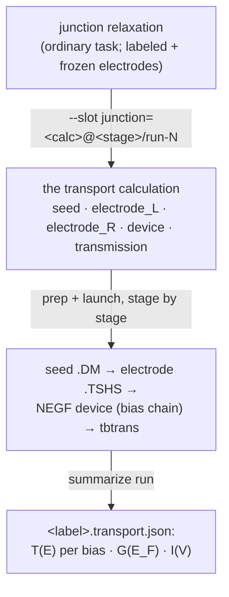
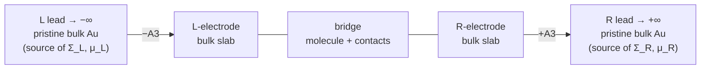
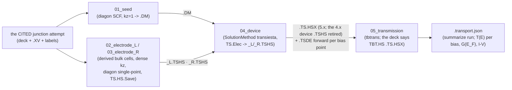

# Transport (conductance) — the TranSIESTA / NEGF workflow

**Role:** contract
**Domain:** engines
**Companions:** [`engines/siesta.md`](?doc=engines/siesta.md) (the base `.fdf`
emitter transport extends); [`model/structure-annotations.md`](?doc=model/structure-annotations.md)
(the region-label *vocabulary* the derivation reads);
[`science/pseudopotentials.md`](?doc=science/pseudopotentials.md) (the Au pseudo
the leads need); [`engines/overview.md`](?doc=engines/overview.md) (the shared
engine contract).

> **Migration status — LANDED (2026-08-28/29).** Transport is a
> **different KIND of job** — one answer assembled from pieces
> ([`execution/architecture.md § 0`](?doc=execution/architecture.md),
> decided 2026-08-11) — and the composite is that kind given its own
> representation rather than bent into a ladder:
> [`archive/2026-09-01-transport-design.md`](?doc=archive/2026-09-01-transport-design.md), built
> P1–P6 and proven end-to-end on real binaries (the carbon-chain live
> walk). The pre-framework `transport bundle` driver this banner once
> guarded is deleted; § 8 records the closure.

This is how molbuilder computes **electron transport** (conductance) through a
molecular junction — e.g. a single benzene-1,4-dithiol molecule bridging two gold
electrodes (Au–BDT–Au). It uses **TranSIESTA**, SIESTA's transport engine, which
solves the open-boundary problem with the **NEGF** method (non-equilibrium Green's
function).

> **Vocabulary.** A junction has a **scattering region** (the molecule + contact
> atoms) between two **electrodes** / **leads** (semi-infinite bulk metal). **NEGF**
> couples the leads into the device through energy-dependent **self-energies** Σ built
> from the *pristine bulk* lead. **`T(E)`** is the transmission (probability an
> electron of energy E crosses); **`E_F`** is the **Fermi level** — the energy that
> separates filled from empty states, and the reference energy for conductance. A
> lead's **chemical potential μ** is the energy its electron reservoir is filled up
> to (applying a bias offsets μ_L vs μ_R). **G₀ = 2e²/h** is the conductance quantum,
> and zero-bias conductance is `G = G₀·T(E_F)`. **`.TSHS`** is the file a lead run
> writes (its Hamiltonian H + overlap S). **TBtrans** is the post-processor that
> turns the device solution into `T(E)`. (DFT/SCF/k-points/pseudopotential are in
> the [`science/overview.md` glossary](?doc=science/overview.md).)

---

## 1. The mental model — one citation → five derived stages

Conductance is **not one run**. It is several coupled SIESTA runs that must
agree numerically — a relaxed junction, a bulk-electrode run per lead that
emits a `.TSHS`, the NEGF device SCF, and the TBtrans transmission.
Correctness hinges on those runs sharing **one numerical contract** (XC,
basis, mesh, pseudopotentials) **and a geometric clone** of the electrode.

Since 2026-08-29 that agreement is not checked after the fact — it is
**impossible to break by construction**: transport is the COMPOSITE
calculation (`archive/2026-09-01-transport-design.md`). You relax the junction as an
ordinary task (outer metal layers labeled `L-electrode`/`R-electrode` and
frozen), then the transport calculation **cites that finished attempt** and
derives everything else — the sorted copy, both electrode cells (extracted
from the labeled blocks), and the five stage decks, all rendered from the
cited attempt's own `.fdf`.



**The consistency contract is the whole game**, and the derivation is what
enforces it: electrode and device render from ONE config filled from the
citation's deck, so a mismatch is unrepresentable (§ 5 records what that
guarantees; the § 5 preflight remains for hand-edited decks).

---

## 2. The physics in one page

A junction is an **open-boundary** problem: a finite scattering region C between
two semi-infinite leads L, R extending to ±∞ along the transport axis (z). The
leads enter C only through **self-energies** Σ_{L,R}(E), built from the *pristine
bulk* lead H/S — the device Green's function is
`G(E) = [E·S_C − H_C − Σ_L − Σ_R]⁻¹` and the transmission is
`T(E) = Tr[Γ_L G Γ_R G†]`, where Γ_{L,R} = i(Σ − Σ†) are the leads' **broadening
matrices** (how strongly each lead couples to the device). That gives
`G = G₀·T(E_F)` [Brandbyge 2002; Papior 2017].



The three boxed regions in the middle — `L-electrode | bridge | R-electrode` (the
§ 4 partition) — are *one* SIESTA cell. The semi-infinite leads on either side are
**not** atoms in that cell; they enter only as the self-energies Σ, computed from a
*separate* bulk-lead run, and each carries a chemical potential μ. `±A3` marks the
direction the lead extends (the third lattice vector).

Three consequences drive **every** parameter choice:

1. **Σ comes from a separate, pristine bulk-lead run** — *not* from frozen atoms
   in the device (frozen is only a geometry constraint). Hence **three runs**.
2. **The transport direction is open** → the device k-grid has **`kz = 1`**. Any
   `kz > 1` re-imposes Bloch periodicity along the wire and destroys the transport
   physics.
3. **Geometry fixes the physical model; the k-grid only sets integration
   accuracy.** Adding lateral vacuum makes a *cluster* (a different Hamiltonian); a
   denser k-grid of the *same* geometry just integrates it better.

> **Honest caveat (report it, don't hide it).** Plain LDA/GGA-DFT+NEGF
> **systematically overestimates** single-molecule conductance by ~1–2 orders of
> magnitude — the DFT **HOMO–LUMO gap** (the spacing between the molecule's highest
> filled and lowest empty orbital) comes out too small, so level alignment to `E_F`
> is off. For Au–BDT, experiment is ≈ **0.011 G₀** [Xiao 2004] while GGA-NEGF
> commonly gives ~0.1–0.4 G₀. The contract here gives a *numerically correct*
> GGA-NEGF result; closing the gap to experiment needs beyond-DFT corrections
> (**scissors / DFT+Σ** — rigidly shifting the DFT levels, or adding a self-energy
> correction — or hybrid functionals). molbuilder's job is to surface this caveat
> honestly rather than imply DFT-NEGF == experiment; the results layer that will
> carry the flag is still landing (§ 8).

---

## 3. How to run it (the CLI)

The road is the composite, through the ordinary `jobset` verbs:

```bash
# 0. relax the junction as an ordinary task (electrode layers labeled
#    L-electrode / R-electrode and frozen), and let it CONCLUDE.

# 1. describe the transport calculation: one slot, the finished attempt
molbuilder jobset init --calculation transport --shape hierarchical \
    --bundle BDT-Au/transport/BDTTrans \
    --slot junction=BDT-Au/optimization/JunctionRelax/01_coarse/run-2 \
    --bias 0.0,0.2

# 2. prep + launch the ladder, stage by stage (each prep gathers what
#    the stage consumes from the concluded stages before it)
molbuilder jobset prep run seed        && molbuilder jobset launch run seed --mode submit
molbuilder jobset prep run electrode_L && molbuilder jobset launch run electrode_L --mode submit
#    ... electrode_R, then device (a bias scan launches as ONE chain
#    job walking the points), then transmission

# 3. read the deliverable back
molbuilder jobset summarize run        # -> <label>.transport.json + the I-V table
```

| Command | Does | Code |
|---|---|---|
| `jobset init --calculation transport` | describe the composite: the junction citation, the bias list, the five fixed stages | `jobset/_cli.py::_init_transport` |
| `jobset prep run <stage>` | compose (sort · gates · extract) on first contact, then render THIS rung's deck + gather its inputs | `jobset/prep.py::_prep_transport` |
| `jobset launch run <stage>` | the ordinary launch; a bias scan's device/transmission go as one walker job | `jobset/submit.py::submit_transport_chain` |
| `jobset summarize run` | parse TBtrans output → `<label>.transport.json`, print the I–V table | `transport/record.py` |
| `transport electrode --which L-electrode\|R-electrode` | standalone helper: derive a single bulk-lead `.fdf` (the electrode wizard) | `wizard.electrode_wizard` |
| `transport preflight` | standalone helper: check the device ↔ electrode contract on decks you hand-edited | `preflight.py` |

**Gotchas:** the citation names a DIRECTORY explicitly (§ 3.1 below) —
nothing is ever picked for you; a re-pointed citation recomposes and makes
every stale upstream attempt refuse by deck-mismatch; `--bias` must start at
`0.0` (the chain starts from equilibrium).  *(The old `transport bundle`
three-run driver and its `run-transport.sh` were deleted 2026-08-29 —
deriving and running the pieces is the composite's job.)*

### 3.1 What makes a directory citable — files, not layout

**The condition is what the directory HOLDS, never where it sits or what it
is called.** A citation is checked against two forms, and a directory that
satisfies neither is refused by name — told what it holds and what the
condition wants, rather than "not citable".

| form | the directory holds | what it is |
|---|---|---|
| **A — a relaxation** | exactly one `.fdf` **and** exactly one `.XV` | the deck that ran, and the geometry it ended at |
| **B — a structure** | exactly one `.xyz` **with** its `.molstruct.json` beside it | a structure and its labels, with no run behind it |

**Form A wins when both are present**: the deck carries the contract, and more
information never loses to less. **Two of anything inside one form is
ambiguous and refused** — a citation names a directory, so the directory must
answer unambiguously; keep one, or cite one that holds one.

**Evidence is FILES, never a marker spelling of ours.** SIESTA writes
`0_NORMAL_EXIT` as its last act on a clean exit, so a run carrying it ran to
its own end *whatever wrapper — or no wrapper — launched it*. molbuilder's own
record answers first only because it also carries the exit code.

**Classifying is not composing.** A relaxation still running has record files
that do not conclude; classification RECORDS that, because describing a
transport calculation ahead of a finishing relax is legal. Composing from it
refuses — you may plan against a run in flight, but you may not build a deck
from a geometry that is still moving.

---

### 3.2 The web tab's shape — ONE PANEL PER ENGINE, not one badge per field

*(User ruling 2026-09-15, after opening the tab: "i am confused to see mainly
pyscf settings on that page while the main design should be focused on
transiesta … let's separate transiesta and pySCF engine completely because the
setting etc may be completely different. so why don't we use tab of different
engine to separate them rather than marking each parameters".)*

**The rule: an engine is a PANEL, and a panel's fields are that engine's
alone.** It is the pattern the Structure-optimization tab already uses — one
card, a sub-tab strip, one panel per engine, one schema endpoint per engine
(`/api/build/schema/<engine>`), and **one config dataclass per engine**.
`SiestaConfig` (49 fields) and `PySCFConfig` (60) share not one field name.
That last part is what actually separates them; the tab strip is how a person
sees it.

**What was wrong.** `TransportConfig` held 22 fields, of which **20 are
TranSIESTA's or shared and exactly 2 are PySCF's** — `pyscf_functional` and
`pyscf_basis` — sitting in the **NEGF** section beside three
`TS.ComplexContour.*` fields. Three consequences, each measured
2026-09-15:

1. They were **the only two fields in the whole form with an engine name in
   the label**, in the section a reader takes as the scientific core. With
   three Runtime badges also naming pyscf, 5 of the 12 rendered fields said
   *PySCF* — so the page read as a PySCF page for a workflow that is
   TranSIESTA's entire subject.
2. **The engine cannot be selected.** `registered_engines()` is
   `['transiesta']`, and `engine`'s own `choices` is `("transiesta",)` with a
   comment saying a PySCF backend "adds its choice back here in the same
   commit". § 8's follow-up states the rule outright — *the form offers only
   registered engines* — and it had been applied to the engine **selector**
   and not to that engine's **parameters**.
3. **They travelled.** Neither is in `SEALED_ALWAYS` nor `CONTRACT_FIELDS`,
   so the override gate accepted them, they were written into `task.json`'s
   device-stage bag, and they merged into the config the deck renders from —
   where `engine` is hardcoded `"transiesta"` and nothing reads them. That is
   exactly the trap `/api/transport/schema`'s own docstring refuses: *"a form
   field the door is guaranteed to refuse is a trap, not a control."*

#### What the shape is

| | |
|---|---|
| **The card** | `3. Calculation parameters` gains a `.tabs` strip, one `.tab-btn` per KNOWN engine, one `.tab-panel` each — the `index.html` pattern, reused rather than reinvented |
| **The panel IS the engine** | `engine` is already a sealed field nothing renders (`SEALED_ALWAYS`), hardcoded `"transiesta"` where the config is built. The active panel becomes that field's value, which is how the optimization tab has always worked: the panel decides which renderer runs |
| **The schema** | `GET /api/transport/schema/<engine>`, mirroring `/api/build/schema/<engine>`. An unknown engine is a clean 404, not a defaulted response |
| **One config per engine** | `TransportConfig` is **TranSIESTA's**, and loses both `pyscf_*` fields. A `PyscfNegfTransportConfig` is authored **with** that backend and not before — an engine's parameter set is not designable in the abstract, and a config nothing renders from is the residue this rule exists to prevent |
| **The name stays** | `TransportConfig` is referenced by 14 product modules and 16 test files; a rename carries no behaviour. Its docstring says whose it is |
| **The override gate follows** | its vocabulary becomes the SELECTED engine's field names, so a PySCF name is **refused** for a TranSIESTA run instead of accepted and ignored — closing consequence 3 at the door, not only in the form |
| **Runtime badges** | name only engines you can run. `(transiesta) WriteVerbosity / (pyscf) mol.verbose` becomes TranSIESTA's alone until there is a second panel to carry the other half |

#### A known engine with no backend is a DISABLED tab

*(the user's choice, 2026-09-15, against hiding it and against giving it live
fields.)*

The strip is drawn from the **known** engines; `registered_engines()` decides
which are live. `PySCF-NEGF` is therefore drawn, **disabled**, with a title
saying what would make it live — *no PySCF-NEGF backend is built yet;
transport ships on TranSIESTA*.

It is not the trap `engine`'s `choices` comment refuses: a disabled button
cannot be chosen, so no describe can be built on it and no field of its can
travel. What it buys is that the **separation is visible on the page** rather
than only in this document, and that the roadmap in § 8 has a place in the UI
that cannot drift from the registry — the button's state is read from
`registered_engines()`, so the day a backend registers, the tab goes live and
its panel appears with it.

#### What does NOT change

The citation, the region labels, the five derived stages, the bias chain and
the sealed electronic contract are **the composite's**, not an engine's
(§§ 3.1, 4, 5). They stay in cards 1, 2 and 4 exactly as they are. Only
card 3 — the override lane — is per-engine, because that is the only part of
the surface whose vocabulary an engine owns.

### 3.3 The parameter inventory — what a person supplies, what is derived, what is a knob

*(Built 2026-09-15 against the **SIESTA 5.4.0 manual** — the release note for
the 5.4.2 this project installs — and cross-checked against the binaries'
own compiled fdf labels. Defaults below are the manual's, verbatim.)*

**Read this before adding a field to any engine panel.** § 3.2 says a panel's
fields are its engine's alone; this says what the fields *are*, and the four
tables are in the order a calculation needs them.

#### 3.3.1 What the PERSON must supply — no default can exist

| what | why it cannot be defaulted | where today |
|---|---|---|
| the junction geometry | it is the science | cited directory (§ 3.1) |
| **region labels** `L-electrode` / `R-electrode` / the bridge | which atoms are lead and which are device is a physical claim about the structure | the Molbuilder tab; § 4 |
| the electrode's own bulk cell and relaxed geometry | a lead is a *separate periodic calculation*; its `.TSHS` is an input to the device | the electrode wizard |
| a pseudopotential per species | external data | gathered at prep, three refusals |
| the bias list | the experiment being modelled | card 4 |
| **the transverse k-grid for T(E)** | see 3.3.4 — it is NOT the SCF's, and no default is right | **MISSING** |
| electrode thickness / layer count | convergence property of the lead | the wizard; the sweep is **S13**, not built |

Two of these are *derived* rather than asked, correctly: the **semi-infinite
direction** comes from the geometry (the z-sorted electrode order), and
`μ = ±V/2` comes from the electrode *name*. § 3.1 records why — and that a
junction labelled the other way round still runs, with a one-click rename
offered.

#### 3.3.2 What the CITATION supplies — sealed at both doors

`basis_size`, `xc_functional`, `xc_authors`, `siesta_mesh_cutoff_ry`,
`energy_shift_ry`, `electronic_temperature_k`, `k_mesh_transverse`.

**This is the most important scientific rule in the workflow** (§ 5): the
electrode and device runs must share the electronic contract or the lead
self-energy cannot attach seamlessly. They arrive from the cited attempt's own
`.fdf` and are refused as overrides. *(A form-B citation — a labelled
`.xyz` + `.molstruct.json` pair with no deck — opens them, because there is
no deck to be truth.)*

> **They WERE mis-sectioned** (fixed 2026-09-15). Five of them declared `section: "NEGF"`
> (`basis_size`, `energy_shift_ry`, `xc_functional`, `xc_authors`,
> `siesta_mesh_cutoff_ry`). They are the *electronic contract*, not NEGF
> parameters — invisible today because they are hidden, but a form-B citation
> rendered them under a heading that misdescribed them. They now have a
> section of their own, *Electronic contract*.

#### 3.3.3 TranSIESTA — the NEGF SCF (device stage)

The manual: a `%block TS.Elec.<name>` **must** carry `HS`,
`semi-inf-dir`, `electrode-pos` and `chem-pot`; the rest is optional.

| keyword | manual default | molbuilder |
|---|---|---|
| `SolutionMethod transiesta` | — | ✅ emitted (**not** `TS.SolutionMethod`, which 5.4.2 rejects) |
| `%block TS.Elecs` · `TS.Elec.<name>` | — | ✅ with `HS` · `chem-pot` · `used-atoms` · `bloch` · `semi-inf-direction` |
| `electrode-pos` \| `elec-pos` | *(required, no default)* | ⚠️ **omitted unless buffer atoms are declared** — see 3.3.6 |
| `%block TS.ChemPots` · `TS.ChemPot.<name>` | — | ✅ |
| `TS.Voltage` | `0 eV` | ✅ from the bias |
| `TS.Atoms.Buffer` | *(none)* | ✅ when declared |
| `TS.HS.Save` | **`true`** | ✅ set explicitly in the electrode deck (belt-and-braces; `-electrode` on the command line is the manual's one-flag equivalent) |
| `TS.Elecs.Bulk` | `true` | ✅ **since 2026-09-15**, and a knob (*Leads*) |
| `TS.Elecs.Eta` | `1 meV` | ❌ — the TBtrans-side twin is exposed; this one is not |
| `TS.Contours.Eq.Pole` | `1.5 eV` | ✅ **since 2026-09-15** (*NEGF density contour*) — what the three dead fields were reaching for |
| `TS.Contours.nEq.Eta` | `min[η_e]/10` | ✅ — emitted only when set, because the default is a FORMULA |
| `TS.Contours.nEq.Fermi.Cutoff` | `5 k_B T` | ✅ — emitted only when set (formula default) |
| `TS.ElectronicTemperature` | `⟨ElectronicTemperature⟩` | ✅ via the contract |
| `TS.Forces` | `true` | ❌ — relevant only for relaxation under bias |
| `TS.Hartree.Fix` | `[-+][ABC]` | ❌ — **deliberately not a knob**: the manual calls the boundary *"an intricate and important"* matter, and the direction is DERIVABLE from the transport axis, like `semi-inf-direction`. It should be derived, never typed |

#### 3.3.4 TBtrans — the transmission (transmission stage)

| keyword | manual default | molbuilder |
|---|---|---|
| `TBT.Contours` + `%block TBT.Contour.<name>` | `from -2. eV to 2. eV`, `delta 0.01 eV`, `mid-rule` | ✅ **since 2026-09-15** — `part line`, `from…to`, `points`, `method` |
| `TBT.HS` | `⟨SystemLabel⟩.TSHS` | ✅ pointed at the 5.x `.TS.HSX` |
| **`TBT.k`** | **inherits `kgrid_Monkhorst_Pack`** | ✅ **since 2026-09-15** (*Transmission k-sampling*); `0 0 0` still means inherit — see below |
| `TBT.Elecs.Eta` | `1 meV` | ✅ (*Broadening*) |
| `TBT.Contours.Eta` | `min(η_e)/10` | ✅ — emitted only when set (formula default) |
| `TBT.ChemPot.<>.ElectronicTemperature` | `⟨TS.ElectronicTemperature⟩` | ❌ — per-chempot, so it belongs with the bias scan rather than the override lane |
| `TBT.DOS.Gf` · `TBT.DOS.A` · `TBT.DOS.Elecs` | all `false` | ✅ (*Outputs*) — **W10 now has data to read, when asked for** |
| `TBT.T.Eig` | `0` | ✅ (*Outputs*) |
| `TBT.T.All` · `TBT.T.Bulk` | `false` | ✅ (*Outputs*). `TBT.T.Out` ❌ — it needs a multi-terminal case to mean anything |
| `TBT.Spin` | all spins | ✅ (*Transmission k-sampling*) — the SELECTOR; a spin-polarised device run is still not wired end to end |

**Why `TBT.k` is the one that matters.** It *inherits the SCF's* grid. A
transverse grid converged for a total energy is routinely far too coarse for
`T(E)`: transmission is an integral over the transverse Brillouin zone and its
features sharpen with k-density, so the standard convergence study is
*T(E_F) against transverse k with everything else fixed*. molbuilder cannot
express it today, which means that study cannot be run from this tab at all.

**And the outputs default to `false`.** Today a run produces transmission and
nothing else — so **W10**'s transmission inspector has no DOS or eigenchannel
data to read even in principle, and the missing flags are why.

#### 3.3.5 Why the dead keywords were invisible for so long

The four `TS.TBT.*` scalars retired on 2026-09-15 could not be read by this
tbtrans (§ 5o). They nevertheless produced the **right answer by default**:

| | window | spacing | points |
|---|---|---|---|
| molbuilder's defaults | −2 → +2 eV | 0.01 eV | 401 |
| **tbtrans's own default contour** | −2 → +2 eV | 0.01 eV | 401 |

**The same grid, to the point.** So a run that touched nothing got exactly
what the form promised, and the defect bit only somebody who *changed* a
value — which is why a live walk passed, why nothing ever looked wrong, and
why three tests could pin the dead keywords without anyone noticing. Latent,
not active; and the reason it stayed latent is coincidence, not design.

It also settles § 5o's open question: the manual states the contour's energy
reference is **the equilibrium Fermi level by default**, which is what
`transport/record.py` observed live and mis-attributed to a keyword. The
retired `relative_to_ef` switch was **never needed**, not merely mis-spelled.

#### 3.3.6 The one conformance defect found by this pass

**`elec-pos` is omitted unless buffer atoms are declared.** The manual lists
it among the four lines a `TS.Elec.<name>` block must carry; the emitter
writes it inside `if buffer_idx:`, so an ordinary junction — no buffer atoms —
gets two electrode blocks without it. Measured 2026-09-15 by rendering both
cases.

It has probably been harmless: molbuilder sorts the junction so the electrodes
are the first and last atoms, which is where an omitted position would
default to anyway. But that is **undocumented reliance on a default the manual
does not state**, it breaks the moment a junction is not sorted that way or a
third electrode appears, and the emitter already knows the indices. The fix is
to emit it unconditionally.

*(The `begin` spelling molbuilder uses is fine: the binary accepts
`elec-pos` / `start` / `begin` / `end`, which is more permissive than the
manual documents.)*

### 3.4 The workflow, end to end — and whether the UI follows it

*(Browser walk 2026-09-15, on the live server with a real cited junction:
Au-BDT-Au, CONCLUDED, 444 atoms. § 3.3 says what the parameters ARE; this
says what ORDER they belong in, and where the surfaces disagree.)*

#### 3.4.1 The scientific sequence, and who owns each step

| # | step | owned by | state |
|---|---|---|---|
| 0 | build the junction and **label the regions** | Molbuilder tab | ✅ labels are assigned where the junction is built, never here |
| 1 | **relax it** to a CONCLUDED attempt | Structure-optimization tab | ✅ |
| 2 | **cite** that directory — files, not names, decide what qualifies | Transport card 1 | ✅ and the viewer follows the citation |
| 3 | **check** the chemistry and the labels | Transport card 2 | ✅ auto-fires on citation; informational only |
| 4 | state the **bias** | Transport card 4 | ⚠️ in the wrong card — 3.4.3 |
| 5 | state the **transport parameters** | Transport card 3 | ✅ since 2026-09-15 (§ 3.3) |
| 6 | **describe** → `task.json` | Transport card 4 | ✅ |
| 7 | pick the **machine**, prep and launch each stage | **Task setup** tab | ✅ verified live — 3.4.4 |
| 8 | read `<label>.transport.json` | Results tab | ⚠️ **W10** — the reader does not exist |

**The electrode is DERIVED, not a step.** This is the part of the design most
worth defending: a person never builds a lead by hand. The electrode models
come from the citation's own labelled electrode atoms, and the two k-sampling
rules that make NEGF correct are enforced rather than trusted:

* **the device must have `kz = 1`** — an **error** if not, because NEGF treats
  the transport axis as OPEN and `kz > 1` imposes a fake Bloch periodicity
  along it (`preflight.py` C2);
* **the electrode must have dense `kz`** — it is a *periodic bulk* run, and a
  thin lead cell has a large 1-D Brillouin zone (`wizard.py`, warned below 20);
* **the transverse k must MATCH** between the two, or the lead cannot attach.

Those three, plus the sealed electronic contract (§ 3.3.2), are the whole of
what makes a lead self-energy trustworthy, and all four are guarded.

#### 3.4.2 What is still scientifically incomplete

| gap | consequence |
|---|---|
| **no electrode-thickness convergence** (`plan.md` **S13**) | how many lead layers is a convergence property, and nothing sweeps it — a person picks a number and cannot see whether `T(E_F)` has stopped moving |
| **no transverse-k convergence run** | the knob exists now (§ 3.3.4) but sweeping it is manual: describe, prep, launch, read, repeat |
| **no reader for the deliverable** (**W10**) | `<label>.transport.json` is written and nothing displays `T(E)` or the I–V curve |
| **spin is a selector, not a path** | `TBT.Spin` picks a channel; a spin-polarised *device SCF* producing two is not wired |
| **`TS.Elecs.Eta` unexposed** | its TBtrans twin is a knob; the TranSIESTA-side one is not |

#### 3.4.3 Where the UI order disagrees with the physics

**The bias is in the wrong card.** It sits in card 4 beside the *Describe*
button, which makes it look like a property of saving. It is the experiment —
and it *governs* other fields: at zero bias the entire non-equilibrium half of
the density contour (`TS.Contours.nEq.*`) is inert, and more than one value
turns the run into a chain of attempt ladders. It belongs at the TOP of the
physics card, where what it governs can sit under it.

**Three measured UI defects, all in card 1's fused viewer:**

| what | measured |
|---|---|
| **the atom list traps the page scroll** | a wheel over the card scrolled rows 38→53 of 444 and left the page where it was. Reaching card 3 needs a person to find a margin first — hit three times in one walk, including with `Page_Up` |
| **444 checkboxes precede every transport control** | the page's interactive order is one checkbox per atom before a single parameter, so keyboard reach to the form is 444 tab stops |
| **card 2's rationale is a wall of prose** | correct and worth reading once, and it pushes card 3 below two screens |

None is a transport bug; together they are why the tab reads as long and
unnavigable, and the fix is card 1's, not the form's.

#### 3.4.4 The Task setup seam — it works, and it says two wrong things

**Verified live** against `projects/Au-BDT-Au/transport/AuBDTAu-CT`:
`POST /api/task-setup/prep-plan` answers for a transport description with the
five stages in order, `hierarchical` shape, `01_seed` … `05_transmission`
directories, each stage's deck and validation file named by the producer, and
the bundle (`job-set.json`, `STAGE-PLAN.md`, `environment.json`,
`jobset-decisions.log`). **The framework does carry transport**, and the
machine/queue card is the same one every other kind uses.

Two things the page says that are wrong for transport:

1. **The empty state names only one source.** *"Send parameters here from the
   Structure-optimization tab, or run `molbuilder jobset init`"*
   (`task-setup/viewer.js`). The **Transport** tab writes `task.json` too, by
   its own door — so somebody who has just described a transport calculation
   and landed on an empty folder is told about a route they did not take and
   not about the one they did.
2. **"What gets written" promises a template that never comes.**
   `<label>.template.toml` is a static row (`task_setup.html`), and a
   transport description has **no template** — the contract arrives from the
   citation at prep, which is § 3.1's whole point. Confirmed three ways: no
   `template` key in the description, no file in the folder, and `prep-plan`'s
   own bundle does not list one.

## 4. Region labels drive everything

The three runs are all derived from **per-atom region labels** on the input
device. The convention (the *vocabulary* is owned by
[`model/structure-annotations.md`](?doc=model/structure-annotations.md) § 5):

- **`L-electrode` / `R-electrode`** — the slices of bulk lead metal SIESTA
  replicates as semi-infinite leads (use only the BULK portion; surface caps go in
  `bridge`).
- **`bridge`** — the scattering region: the molecule + any lead-side atoms that
  break periodicity. **Not** a TranSIESTA block — it's implicit ("the atoms in no
  electrode region").
- **`interface`** (optional) — a sub-label flagging the contact atoms (the two S
  anchors in Au-BDT-Au) for projected-DOS analysis; doesn't change the partition.
- **`buffer`** (optional) — atoms excluded from the NEGF region entirely
  (`TS.Atoms.Buffer`): padding beyond the electrode blocks at the OUTER ends of
  the device. Most 2-terminal junctions need none. Named 2026-08-28 with the
  composite design ([`archive/2026-09-01-transport-design.md`](?doc=archive/2026-09-01-transport-design.md)
  § 4.1a — the categorical sort places buffer atoms outermost).
- **`<name>-electrode`** — any label ending `-electrode`/`_electrode`/bare
  `electrode` (case-insensitive) is a lead — so `tip-electrode`, `gate-electrode`
  work without code changes (`config.transport.is_electrode_label`).
  **Except a label ending `#`**, which molbuilder wrote itself and this engine
  never reads as a lead: a generated structure is signed with the text that
  built it (`gold-electrode#` from a PubChem search), and without the marker
  that signature would have partitioned the device
  ([`model/structure-annotations.md`](?doc=model/structure-annotations.md)
  § 5.1). The suffix convention is molbuilder's own, not TranSIESTA's —
  electrode names are free strings in `%block TS.Elecs`, and the emitter strips
  the suffix before writing the deck, so SIESTA never sees the word.

**A label this engine does not consume is WARNED about, never dropped in
silence.** TranSIESTA reads the canonical 2-terminal set plus `buffer`; a
structure carrying any other region label still runs, and the preflight says
which label played no part — so a person who labelled something on purpose
finds out here rather than from a result that quietly ignored it. (The warning
is raised before the missing-region check returns, so it surfaces even on an
incomplete region set.)

**Emitter behavior** (`transiesta.py::_emit_transiesta_block`,
`_find_electrode_regions`): electrode regions are discovered, **sorted by
z-centroid** (lowest first), and the modern SIESTA 4.1+/5.x syntax is emitted — one
`%block TS.Elec.<name>` per lead (the block name is the label minus the
`-electrode` suffix: `L-electrode` → `L`), a `%block TS.ChemPots` + per-name
`%block TS.ChemPot.<name>`, and `SolutionMethod transiesta`. **The two halves have
different owners**: the LOWER electrode gets `semi-inf-direction -A3` and the first
`elec-pos` (decided by z — it is where the lead physically continues), while the
`Left`/`Right` chempot binding follows the region's own NAME (`L-electrode` →
`Left` → µ = +V/2). On a junction labeled the reverse of the usual convention
these name different blocks, and the deck says so in a comment above the chempot
blocks. Atoms
labelled `buffer` emit `%block TS.Atoms.Buffer`, and each lead then also states
its position explicitly (`elec-pos`) — with padding outermost, TranSIESTA's
default first-N/last-N electrode placement no longer holds (2026-08-28, with
the composite's P4). Verified
against SIESTA 5.4.2 (`tests/test_transiesta_siesta_smoke_l4.py`) — the legacy flat
`TS.HSFileLeft/Right` keys still parse but lock a closed 2-terminal topology; the
`TS.Elec` syntax unlocks multi-terminal, Bloch expansion, per-chempot contours.

```fdf
SolutionMethod  transiesta
%block TS.Elecs
  L
  R
%endblock TS.Elecs
%block TS.Elec.L
  HS                 junc_L-electrode.TSHS
  chem-pot           Left
  used-atoms         <N>        # atom count of the L-electrode region
  bloch              1 1 1
  semi-inf-direction -A3
%endblock TS.Elec.L
```

(`used-atoms` is the literal integer count of atoms in that electrode region;
`bloch 1 1 1` is the transverse tiling — the lead cell is used as-is, no Bloch
expansion in the shipped 2-terminal scope.)

> **Atom-ordering is load-bearing — and it follows GEOMETRY, not the label.**
> TranSIESTA identifies electrode atoms by their **position** in the coordinates
> block (first N atoms = first electrode), *not* by region label. The first
> electrode is the one extending to `-A3`, so the **lower** block must come first;
> the upper block first would aim its self-energy into the bridge. The **engine
> preflight** (`transiesta.py::TransiestaEngine.preflight`) **refuses** only that:
> `[lower][bridge][upper]`, each region contiguous. An out-of-order structure
> produces silently wrong physics with no run-time error. In the composite it
> cannot fire in anger — prep's categorical sort orders by z before any deck is
> rendered — and the engine preflight still gates `render_stage_deck` as defense
> in depth (plus `/api/transport/render`, the validation surface). (Distinct from
> the cross-run `transport preflight` of § 5, which compares device vs electrode
> and does *not* check atom order.)

> **The label convention is checked and WARNED about, never enforced**
> *(user ruling, 2026-08-29)*. The usual convention is `L-electrode` low z,
> `R-electrode` high z — TranSIESTA's own, as in the author's reference inputs
> ([`ts-tbt-sisl-tutorial/TS_02`](https://github.com/zerothi/ts-tbt-sisl-tutorial/blob/main/TS_02/RUN.fdf):
> `Left` = `electrode-position 1` + `-a1` + `mu V/2`). A junction labeled the other
> way round is **not an error** — it biases the other end, which only its author
> can judge — so the sort notes it, the preflight warns, and the Transport tab
> offers a one-click rename.  *(How that was settled: [`archive/2026-09-01-transport-design.md`](?doc=archive/2026-09-01-transport-design.md) § 4.1a.)*

> **Bias direction.** Bias is `V_left − V_right`; the emitter binds
> `L-electrode → chem-pot Left → μ = +V/2` **by name**, and the deck states which
> physical lead that turned out to be. **Positive** bias raises μ_L above μ_R;
> electrons flow high→low chemical potential (L→R for positive V), so conventional
> current flows R→L. Put the `L-electrode` label on whichever lead you want as the
> more-positive reservoir in your forward-bias measurement — under the usual
> convention that is the low-z one. `TS.Voltage` is one value per run
> (`bias_voltages_v[0]`); multi-bias `T(E)` is multiple runs (§ 8).

---

## 5. The consistency contract — the invariant set

One numerical contract + one geometry must appear **intact across all three runs**.
Break any row and the transmission is *silently* wrong — so the preflight
(`transport/preflight.py`) encodes each as a machine gate (the `Gate` column is the
gate `id`; ✓ = guaranteed by the electrode wizard's clone-by-construction instead):

| # | Invariant | Across | Why (physics) | Gate |
|---|---|---|---|---|
| I1 | XC functional + authors | relax = electrode = device | one Hamiltonian footing; mixing shifts E_F | `contract.xc` |
| I2 | Pseudopotentials (per species) | all three | different core = different atom | wizard clone ✓ |
| I3 | MeshCutoff | electrode = device | real-space grids must align for the NEGF coupling | `contract.meshcutoff` |
| I4 | PAO.EnergyShift | all three | sets orbital range = basis radius | `contract.energyshift` |
| I5 | Basis tier, per species | frozen-electrode-Au = device-Au | a basis step = spurious back-scattering (§ 7) | `contract.basis` |
| I6 | Lateral cell (a, b) | electrode = device | the lead tiles the device cross-section | `cell.transverse` |
| I7 | Transverse k (kx, ky) | electrode **commensurate** device | TBtrans projects lead k onto device k (commensurate = the two grids share a common factor) | `kgrid.transverse` |
| I8 | Device kz = 1 | device | open boundary (no periodicity along transport) | `kgrid.device_kz` |
| I9 | Electrode kz dense (converged) | electrode | it's a *periodic bulk* run; thin cell → large Brillouin zone (BZ) | `kgrid.electrode_kz` |
| I10 | Electrode geom = device frozen layers | electrode ⇆ device | Σ must map atom-for-atom onto the device | wizard clone ✓ |
| I11 | Electrode thickness ≥ principal layer | electrode | Σ assumes only nearest layers couple (§ 7) | `electrode.thickness` (warn) |
| I12 | z-vacuum ≈ 0 at the leads | device | a gap = severed lead, not a junction | `device.z_vacuum` (warn) |
| I13 | Electrode writes its HS | electrode | the device run needs `electrode.TSHS` to exist | `electrode.saveHS` (warn) |

`transport preflight` reports these as `error`/`warn`/`ok` Issues (a
`PreflightReport`, `preflight.py`) and refuses to proceed on any error. This
turns the prose "Golden Rule" into automated gates — the single biggest correctness
lever, since these are exactly the silent failures. An illustrative run:

```text
$ molbuilder transport preflight --device run/junc.fdf \
      --electrode run/junc_L-electrode.fdf
transport preflight -- device <-> electrode consistency
  [ok   ] contract.xc              PBE matches device and electrode
  [ok   ] cell.transverse          lateral cell matches
  [WARN ] electrode.thickness      3 layers < ~6-layer principal layer (I11)
  [ERROR] kgrid.device_kz          device kz = 4, must be 1 (open boundary, I8)
  => 1 error(s), 1 warning(s)
  FAIL -- fix the ERROR(s) before running TranSIESTA
```

(Messages abbreviated for illustration; the real formatter is
`preflight.format_report`.)

**Each gate traces to a physical requirement and a reference** (so the design is
auditable, not asserted): the open-boundary `kgrid.device_kz` (I8) and the
basis-continuity `contract.basis` (I5) to Brandbyge 2002; the bulk-lead
`kgrid.electrode_kz` (I9), the lateral `cell.transverse`/`kgrid.transverse` (I6/I7),
and `electrode.thickness` (I11, principal-layer screening) to Papior 2017; the
numerical contract `contract.{xc,meshcutoff,energyshift}` (I1/I3/I4) to Soler 2002;
and the Au semicore `MeshCutoff` to van Setten 2018 (§ 9).

---

## 6. The pieces & data flow

| Layer | Module | Role |
|---|---|---|
| Electrode wizard | `transport/wizard.py` (`electrode_wizard`) | derive a bulk-lead `.fdf` + geometric clone from the labeled device; its z-period comes from `cell.bulk_z_period` (§ 7.1), the same derivation the Junction builder uses |
| Composition | `transport/compose.py` | citation → parsed `.XV` → frozen gate → categorical sort → electrode extraction; the travelling record (`junction.xyz` + `junction.cited.fdf` + sidecars) |
| Stages | `transport/stages.py` | the five-rung ladder, its DAG (`stage_inputs` — which stage consumes which concluded stage before it, § 1), the one config from the citation's deck (`config_for`), the per-stage renders |
| Record | `transport/record.py` | TBtrans output → `<label>.transport.json` (`summarize run`) |
| Consistency preflight | `transport/preflight.py` | the cross-run contract gates (§ 5) |
| Engine | `transport/transiesta.py` (`TransiestaEngine`) | the NEGF `.fdf` emitter (`render_script`), `preflight`, `parse_output` |
| Registry | `transport/engine_base.py` | the `TransportEngine` Protocol + `register_engine` (so a PySCF-NEGF backend can join) |
| Results | `transport/results.py` (`TransportResults`) | engine-agnostic result: `transmission`, `bias_grid_V`/`current_uA`, `conductance_G0` + `to_dict`/`from_dict` |
| CLI | `transport/_cli.py` (`molbuilder transport`) | the terminal surface |

**Data flow** — the single numerical contract (§ 5) is baked *identically* into all
three fdfs; only the geometry and the open-vs-bulk boundary (`kz`,
`SolutionMethod`) differ:



> **A bias scan is one submission, and the two walks over its points fail
> in opposite directions** (`jobset/submit.py::submit_transport_chain`).
> Both are launcher layers — each `cd`s into the point's prepared attempt
> and runs that point's own `.run.sh`. What differs is whether the points
> depend on each other:
>
> - the **device** walk hands the previous point's `.TSDE` (the NEGF
>   density) forward, so `V_{i+1}` converges from `V_i` instead of from
>   scratch — and therefore **stops on a failed point**: walking on would
>   converge from a state the failure poisoned;
> - the **transmission** walk hands nothing forward — each point re-reads
>   the device's saved H — so a bad point says nothing about the next: the
>   walk **continues**, and the exit code reports any failure.
>
> (A bench group's points are independent too, which is why it does not
> stop; a chain's are not. The rule follows the data, not the verb.)
> Reading is asynchronous either way: `summarize run` is a READER, so a
> point whose transmission has not run yet reads as **pending**, never as
> a failure of the set (`transport/record.py`).

(`diagon single-point` = the electrodes have **no** MD block — single bulk
SCFs on cells DERIVED from the junction's labeled blocks.  The device H
lands in `<label>.TS.HSX` — SIESTA 5.x; tbtrans must be told with an
explicit `TBT.HS` line, measured live 2026-08-29 — while the electrode runs
still write `.TSHS` via `TS.HS.Save`.  `summarize run` writes the record —
§ 8.)

---

## 7. The scientific baseline

A defensible starting point (**all values to be convergence-tested**, per § 5's
"converge it, don't trust a number"):

| Quantity | Baseline | Note |
|---|---|---|
| XC | GGA-PBE | identical across all 3 runs (I1) |
| Pseudos | PseudoDojo PBE (Au/C/S/H), validated | `molbuilder pseudo check` gate ([van Setten 2018]) |
| Basis | **DZP everywhere** | DZP = double-ζ + polarization (SIESTA PAO tier); drop to the smaller SZP for bulk-Au only after a `T(E)` check |
| `MeshCutoff` | 400 Ry (converge 300→500) | Au is **semicore** (5s5p5d valence — a shallow d shell) → needs a fine grid. The config default is **300** (`config/transport.py::siesta_mesh_cutoff_ry`); the § 3 example overrides to 400 |
| `PAO.EnergyShift` | 0.01 Ry | sets orbital range → electrode thickness |
| Transverse k | converge 2×2 → 4×4 → 6×6 | commensurate device ⇄ electrode (I7) |
| Device `kz` | **1** | open boundary (I8) |
| Electrode `kz` | converge (default **40**; the preflight suggests starting ~80) | dense bulk z-sampling (I9) |
| Electrode thickness | **~6 Au(111) layers** | the *electronic* principal layer, not the 3-layer geometric repeat |
| z-vacuum | **0** | slab-junction model; nonzero ⇒ cluster model |

> **Which of these are knobs today.** The transverse k (`--kx`/`--ky`), electrode kz
> (`--electrode-kz`), `MeshCutoff`, and electronic temperature are form/CLI-driven, but
> the **basis / XC block is hardcoded** — `_emit_basis_and_xc` writes
> `PAO.BasisSize DZP`, `PAO.EnergyShift 0.01 Ry`, and `XC GGA-PBE` with no cfg hook. So
> "converge the basis / EnergyShift / XC" means editing the emitted `.fdf` until those
> become form fields (a planned follow-up, flagged in the code).

Three corrections that catch real mistakes:

- **Electrode thickness.** The geometric repeat (3 Au(111) layers) is **too thin**
  electronically: with `PAO.EnergyShift 0.01 Ry` the diffuse Au 6s reaches ~6–7 Å
  while the interlayer spacing is ~2.36 Å, so H/S span ~3 layers and the
  density-matrix range is longer. Size the electrode from the orbital range
  (~6 layers) so TranSIESTA's **principal layer** — the slab thickness beyond which
  a lead layer couples only to its immediate neighbour — is satisfied
  [Papior 2017; Soler 2002 for the EnergyShift↔range link]. Separately, the
  electrostatic potential must reach its **bulk value at the lead boundary** (else Σ
  is applied where the molecule still perturbs the metal): TranSIESTA prints the
  boundary potential — **verify it is flat**, and add Au layers if not. Six
  layers/side is *marginal*.
- **A basis step scatters.** For *transport* the observable *is* the transmission,
  so an SZP→DZP discontinuity inside the metal acts as a spurious scatterer — a
  basis-set change looks like a real potential step to the electron [Brandbyge 2002].
  Default to DZP everywhere (I5).
- **The cell is hexagonal, and you may relax at a coarser k than transport.**
  Au(111) tiles the transverse plane (lateral vectors ≈ 17.3 Å at 60°) — the box is
  **not** recoverable from atom extents (padding fabricates an orthorhombic box that
  severs the periodic gold), so `--cell-fdf` preserves the real lattice. Forces are
  k-robust while the sharp `T(E_F)` Fermi-surface integral is not, so it is sound to
  **relax at a coarser transverse k (e.g. 2×2×1) and run transport dense (e.g.
  4×4×1)** [Soler 2002; Papior 2017]. **But note:** the composite reads the transverse k FROM the cited relaxation's
  own deck (fdf-is-truth) and forces device `kz = 1` — it never auto-coarsens
  anything — so to relax coarser you run the upstream relaxation at the coarser
  mesh and cite that attempt. Γ-only (1×1×1) is wrong for periodic
  metallic leads: even with the lead atoms frozen it gives a poorly defined `E_F`.

### 7.1 The metal crystal — stacking, layer counts, and the two boundaries

Everything above sizes the electrode *electronically* (orbital range, principal
layer). This sizes it **crystallographically**, which is a separate constraint
and the one that decides whether a lead is bulk metal or a defect. The full
derivation, with the measurements behind it, is
[`science/junction-cell.md`](?doc=science/junction-cell.md); this is what a
transport run needs from it.

**Every metal molbuilder builds electrodes from is fcc** — Au, Ag, Cu, Ni, Pt,
Pd (`data/fcc_lattice.json`). So the stacking is set by which face the molecule
sees:

| surface | stacking | period | interlayer `d` | Au, `a = 4.158 Å` (PBE) |
|---|---|---|---|---|
| (111) | ABCABC | **3 layers** | `a/√3` | 2.4006 Å |
| (100) | ABAB | **2 layers** | `a/2` | 2.0790 Å |
| (110) | ABAB | **2 layers** | `a/(2√2)` | 1.4701 Å |

`a` is not a constant to assume: `fcc_lattice.json` carries
`a_experimental` and `a_pbe` per metal (and the Modify tab can measure a third
off your own relaxed bulk run), and **the lead must
use the same one the device was built with** — a 1–2 % lead/device lattice
mismatch is exactly what I10 exists to prevent. For a PBE run that means
`a_pbe`, not the room-temperature experimental value.

**There are two z-boundaries in a transport calculation, and they are judged
differently.**

*The bulk electrode cell (I9 — a genuinely periodic run).* Its z-period must be
a real lattice repeat, so the wizard derives `z_period = z_span + d`
(`cell.bulk_z_period`) rather than the atoms' extent, and warns that the layer
count must be a whole stacking period. **This is the boundary that matters**,
because Σ is built from how this cell tiles. On (111), an electrode region whose
layer count is not a multiple of 3 tiles into a **twin** (4 or 7 layers give
something worse — an eclipsed, head-on contact), so Σ then describes a faulted
crystal rather than bulk gold. Six layers in the electrode region satisfies it;
four does not. Override with `--z-period` when you know the true repeat.

*The device cell boundary (I8 — open).* The device runs at `kz = 1`; beyond the
outermost lead layers sit the semi-infinite leads, entering only as Σ. What lies
across the device cell's periodic boundary is **replaced**, so its registry is
not part of the transport physics. What I12 does require is that the padding
there be one interlayer spacing and not vacuum — `z-vacuum ≈ 0 at the leads`,
because a real gap severs the lead instead of continuing it.

**A caution about mirrored junctions.** `add_symmetric_electrodes` built one by
placing the `-z` slab as a **mirror** of the `+z` one. That function is gone
(the pair op went with the Junction panel, 2026-08-31), and the caution is why:
mirroring makes both electrodes present the same face to the molecule — the
point of a symmetric junction — but also makes the two outermost layers carry
the same in-plane registry, so they meet head-on across the device boundary.
Two `add_slab` builds at stated `start_z` do not mirror, so a junction built
the current way has this only if you ask for it. No layer count changes this, and neither does any other point-group
operation (measured: mirror, C₂ and inversion give identical eclipsed seams),
because each close-packed layer is itself a centrosymmetric 2-D lattice. Under
I8 this costs the transport calculation nothing. It does contaminate the
boundary-layer density in any **periodic** run of that same cell — a plain
single-point, or a relaxation if those layers are not frozen.

---

## 8. Shipped vs coming

> ### The one thing this section used to warn about is CLOSED
> ### *(named 2026-08-11; closed 2026-08-28/29 by the composite)*
>
> The warning that stood here: `transport bundle` emitted
> `run-transport.sh`, a **third orchestration lifecycle** that chained
> three engines outside the job system — no `prep`, no attempts, no
> `run.json`, no `--mode`, no status roll-up, no scheduler header.
>
> The composite closed it the way the analysis here always said it
> should be closed: **not by adding edges to `JobSet`** (it still has
> none), but by giving the multi-component kind its own representation.
> The five stages are ordinary rungs — each prepped, launched and
> concluded through the same verbs and wrappers as everything else; the
> electrode `.TSHS` and seed `.DM` hand-offs are prep's GATHER (three
> refusals per input); and the one genuinely sequenced thing — a bias
> scan's points — rides ONE submission, the chain walker, because the
> `.TSDE` hand-forward is an efficiency inside one launch, not a
> scheduling judgement between results a person should read.
>
- **Shipped:** the transport COMPOSITE (`--calculation transport`: citation →
  sort → gates → five derived stages → bias chain → `summarize run` →
  `<label>.transport.json`), the electrode wizard, the `electrode`/`preflight`
  helper CLI, and the region-label-driven derivation.  The finite-bias scan
  ships with it (the `.TSDE`-chained walker).
- **Web tab (rewired 2026-08-29, P7b + same-day review):** the tab is the
  composite's WHOLE describe surface — cite the junction through the
  shared tree-picker (ANY directory choosable — what qualifies it is the § 3.1 FILE condition, and the meta line classifies each selection, reading
  the attempt's own `.fdf` via `/api/transport/describe_attempt`, and the
  VIEWER follows the citation: MolView loads the cited calculation's
  labeled structure and the chemistry analysis runs on it), state the
  bias, and **Describe writes the finished `task.json`** into the selected
  folder (`POST /api/transport/describe` — the web spelling of `jobset
  init --calculation transport`; no hand-over, because nothing is
  awaiting).  Transport-only knobs changed in the form ride as
  device-stage overrides; the electronic-contract fields are sealed at
  both doors (the citation's to say).  **The parameters card is one panel
  per ENGINE** since 2026-09-15 — § 3.2, and the follow-up below is where
  its second panel comes from.  Task setup reads the saved
  description as the run surface (machine, queue, prep).  The render
  endpoint (`/api/transport/render`) remains as the engine's validation
  surface.
- **Follow-up** (`plans/plan.md` § 5f, **S13**): a **convergence sweep** mode (auto-vary
  transverse-k / `MeshCutoff` / electrode thickness and report where `T(E_F)` stops
  moving); the **Results-tab transmission inspector** (T(E) + I–V charts read
  from the shipped `<label>.transport.json`); and a **PySCF-NEGF** backend —
  which arrives as a registered engine, its OWN config dataclass and the
  panel that renders it (§ 3.2), all in one commit.  Until then its sub-tab
  is drawn and disabled, and `TransportConfig` carries none of its fields.
  *(This bullet said the backend "adds its engine choice back to
  `TransportConfig`" — true of the selector, and it was read as licence to
  keep two PySCF PARAMETERS in that dataclass, which is what § 3.2 was
  written to settle.)*

---

## 9. References

- **TranSIESTA / NEGF** — Brandbyge, Mozos, Ordejón, Taylor, Stokbro, *Phys. Rev.
  B* **65**, 165401 (2002). §III defines the L/R/scattering partition; §IV the NEGF
  contour. doi:[10.1103/PhysRevB.65.165401](https://doi.org/10.1103/PhysRevB.65.165401)
  · arXiv:[cond-mat/0110650](https://arxiv.org/abs/cond-mat/0110650)
- **Modern TranSIESTA** (electrode / principal-layer requirements, multi-electrode
  chemical potentials) — Papior, Lorente, Frederiksen, García, Brandbyge, *Comput.
  Phys. Commun.* **212**, 8 (2017).
  doi:[10.1016/j.cpc.2016.09.022](https://doi.org/10.1016/j.cpc.2016.09.022)
  · arXiv:[1607.04464](https://arxiv.org/abs/1607.04464)
- **SIESTA method** (PAO basis, EnergyShift, MeshCutoff) — Soler et al., *J. Phys.:
  Condens. Matter* **14**, 2745 (2002).
  doi:[10.1088/0953-8984/14/11/302](https://doi.org/10.1088/0953-8984/14/11/302)
  · arXiv:[cond-mat/0111138](https://arxiv.org/abs/cond-mat/0111138)
- **PseudoDojo** (the validated Au/C/S/H pseudos) — van Setten et al., *Comput.
  Phys. Commun.* **226**, 39 (2018).
  doi:[10.1016/j.cpc.2018.01.012](https://doi.org/10.1016/j.cpc.2018.01.012)
  · arXiv:[1710.10138](https://arxiv.org/abs/1710.10138)
- **Au–BDT ≈ 0.011 G₀** (the DFT-NEGF overestimation benchmark, § 2 caveat) — Xiao,
  Xu, Tao, *Nano Lett.* **4**, 267 (2004).
  doi:[10.1021/nl035000m](https://doi.org/10.1021/nl035000m)
- **Au-BDT-Au geometry + the Au-electrode mesh requirement (≥ 250–300 Ry)** — Stokbro et al., *Comp. Mat. Sci.*
  **27**, 151 (2003). **Asymmetric / STM junctions** (the `interface` sub-label) —
  Reed et al., *JACS* **128**, 14328 (2006); Solomon et al., *J. Chem. Phys.* **129**,
  054701 (2008).
