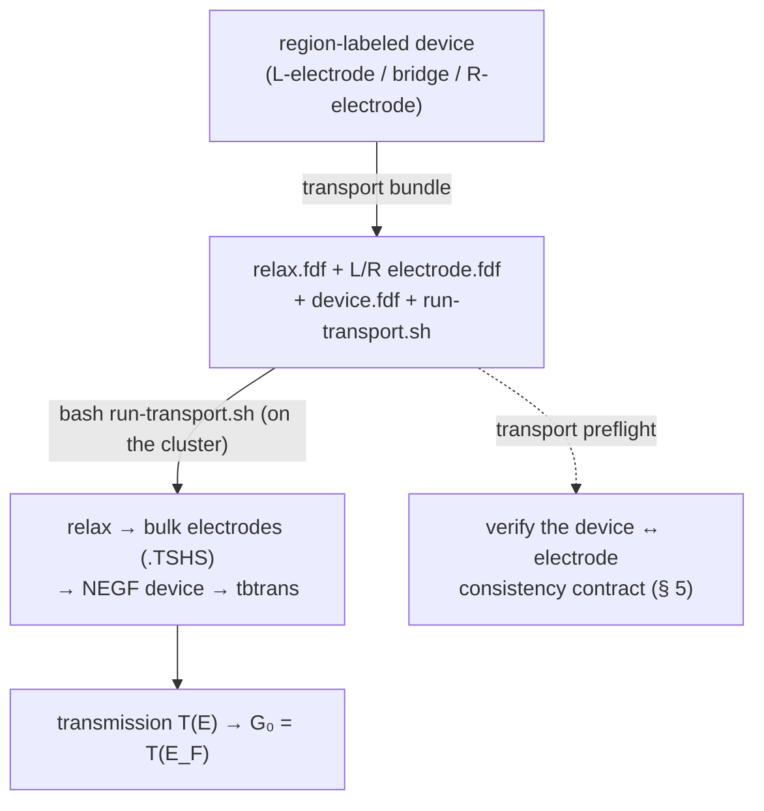
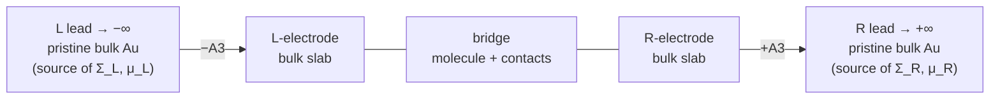
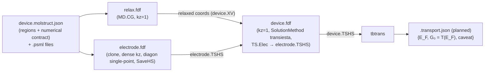

# Transport (conductance) — the TranSIESTA / NEGF workflow

**Role:** contract
**Domain:** engines
**Companions:** [`engines/siesta.md`](?doc=engines/siesta.md) (the base `.fdf`
emitter transport extends); [`model/structure-annotations.md`](?doc=model/structure-annotations.md)
(the region-label *vocabulary* the derivation reads);
[`science/pseudopotentials.md`](?doc=science/pseudopotentials.md) (the Au pseudo
the leads need); [`engines/overview.md`](?doc=engines/overview.md) (the shared
engine contract).

> **⚠ Migration status (2026-08-19, user).** This workflow is
> **pre-framework**: it has NOT migrated onto the described route
> (describe → `prep` → `launch`) that structure optimization now runs end to
> end. It is deliberately untouched until that loop is fully verified — the
> statement of record is the migration box at the top of
> [`roadmap.md`](?doc=roadmap.md). Two facts, kept distinct: transport is
> *unmigrated* (this banner), **and** it is a **different KIND of job** —
> three coupled runs, one answer assembled from pieces
> ([`execution/architecture.md § 0`](?doc=execution/architecture.md), decided
> 2026-08-11) — so migrating it means giving that kind a representation,
> not bending it into a ladder. § 8 states exactly what it costs today.

This is how molbuilder computes **electron transport** (conductance) through a
molecular junction — e.g. a single benzene-1,4-dithiol molecule bridging two gold
electrodes (Au–BDT–Au). It uses **TranSIESTA**, SIESTA's transport engine, which
solves the open-boundary problem with the **NEGF** method (non-equilibrium Green's
function).

> **Vocabulary.** A junction has a **scattering region** (the molecule + contact
> atoms) between two **electrodes** / **leads** (semi-infinite bulk metal). **NEGF**
> couples the leads into the device through energy-dependent **self-energies** Σ built
> from the *pristine bulk* lead. **`T(E)`** is the transmission (probability an
> electron of energy E crosses); **`E_F`** is the **Fermi level** — the energy that
> separates filled from empty states, and the reference energy for conductance. A
> lead's **chemical potential μ** is the energy its electron reservoir is filled up
> to (applying a bias offsets μ_L vs μ_R). **G₀ = 2e²/h** is the conductance quantum,
> and zero-bias conductance is `G = G₀·T(E_F)`. **`.TSHS`** is the file a lead run
> writes (its Hamiltonian H + overlap S). **TBtrans** is the post-processor that
> turns the device solution into `T(E)`. (DFT/SCF/k-points/pseudopotential are in
> the [`science/overview.md` glossary](?doc=science/overview.md).)

---

## 1. The mental model — one device → three coupled runs

Conductance is **not one run**. It's **three coupled SIESTA runs that must agree
numerically**: a **relaxation** of the device, a **bulk-electrode** run per lead
that emits a `.TSHS`, and the **NEGF device** run that consumes both `.TSHS` files.
Correctness hinges entirely on those runs sharing **one numerical contract** (the
**XC** exchange-correlation functional, basis, mesh, pseudopotentials) **and a
geometric clone** of the electrode.

So molbuilder derives **all three from ONE region-labeled device** (regions
`L-electrode` / `bridge` / `R-electrode`) and gives you a **preflight** that
verifies the contract *before* you spend cluster time — because the couplings
between the runs are exactly what humans break.



**The consistency contract is the whole game.** molbuilder's value here is *not*
emitting `.fdf` text (the engine does that) — it's deriving the runs from one
descriptor and **enforcing the cross-run contract** (§ 5).

---

## 2. The physics in one page

A junction is an **open-boundary** problem: a finite scattering region C between
two semi-infinite leads L, R extending to ±∞ along the transport axis (z). The
leads enter C only through **self-energies** Σ_{L,R}(E), built from the *pristine
bulk* lead H/S — the device Green's function is
`G(E) = [E·S_C − H_C − Σ_L − Σ_R]⁻¹` and the transmission is
`T(E) = Tr[Γ_L G Γ_R G†]`, where Γ_{L,R} = i(Σ − Σ†) are the leads' **broadening
matrices** (how strongly each lead couples to the device). That gives
`G = G₀·T(E_F)` [Brandbyge 2002; Papior 2017].



The three boxed regions in the middle — `L-electrode | bridge | R-electrode` (the
§ 4 partition) — are *one* SIESTA cell. The semi-infinite leads on either side are
**not** atoms in that cell; they enter only as the self-energies Σ, computed from a
*separate* bulk-lead run, and each carries a chemical potential μ. `±A3` marks the
direction the lead extends (the third lattice vector).

Three consequences drive **every** parameter choice:

1. **Σ comes from a separate, pristine bulk-lead run** — *not* from frozen atoms
   in the device (frozen is only a geometry constraint). Hence **three runs**.
2. **The transport direction is open** → the device k-grid has **`kz = 1`**. Any
   `kz > 1` re-imposes Bloch periodicity along the wire and destroys the transport
   physics.
3. **Geometry fixes the physical model; the k-grid only sets integration
   accuracy.** Adding lateral vacuum makes a *cluster* (a different Hamiltonian); a
   denser k-grid of the *same* geometry just integrates it better.

> **Honest caveat (report it, don't hide it).** Plain LDA/GGA-DFT+NEGF
> **systematically overestimates** single-molecule conductance by ~1–2 orders of
> magnitude — the DFT **HOMO–LUMO gap** (the spacing between the molecule's highest
> filled and lowest empty orbital) comes out too small, so level alignment to `E_F`
> is off. For Au–BDT, experiment is ≈ **0.011 G₀** [Xiao 2004] while GGA-NEGF
> commonly gives ~0.1–0.4 G₀. The contract here gives a *numerically correct*
> GGA-NEGF result; closing the gap to experiment needs beyond-DFT corrections
> (**scissors / DFT+Σ** — rigidly shifting the DFT levels, or adding a self-energy
> correction — or hybrid functionals). molbuilder's job is to surface this caveat
> honestly rather than imply DFT-NEGF == experiment; the results layer that will
> carry the flag is still landing (§ 8).

---

## 3. How to run it (the CLI)

The CLI (`transport/_cli.py`) is the path for the full 3-run **bundle**; the web tab
Generates only the single device `.fdf` (§ 8).

```bash
# 1. derive relax + both electrodes + device + driver from ONE labeled device.
#    --cell-fdf preserves the real hexagonal Au(111) lattice (see § 7).
molbuilder transport bundle --device dev.xyz --job-name junc \
    --mesh-cutoff 400 --kx 4 --ky 4 --cell-fdf relaxed.fdf --out-dir run/

# 2. on the cluster, under molbuilder-siesta, run the driver
cd run/ && conda activate molbuilder-siesta && bash run-transport.sh

# 3. verify the device ↔ electrode contract (after any hand-edit)
molbuilder transport preflight --device run/junc.fdf \
    --electrode run/junc_L-electrode.fdf
```

| Command | Does | Code |
|---|---|---|
| `transport bundle` | one labeled device → the full relax + L/R electrode + device + `run-transport.sh` bundle | `orchestrate.build_transport_bundle:281` |
| `transport electrode --which L-electrode\|R-electrode` | derive a single bulk-lead `.fdf` (the electrode wizard) | `wizard.electrode_wizard:289` |
| `transport preflight` | check the device ↔ electrode consistency contract | `preflight.py` + `_cli.cmd_preflight:117` |

**Gotchas:** don't hand-assemble electrodes (use `electrode`/`bundle` so the
geometric clone + contract hold); always `preflight` before submitting and after
any manual `.fdf` edit; the web tab Generates only the device `.fdf` — use the CLI
for the full relax + electrode + driver bundle.

---

## 4. Region labels drive everything

The three runs are all derived from **per-atom region labels** on the input
device. The convention (the *vocabulary* is owned by
[`model/structure-annotations.md`](?doc=model/structure-annotations.md) § 5):

- **`L-electrode` / `R-electrode`** — the slices of bulk lead metal SIESTA
  replicates as semi-infinite leads (use only the BULK portion; surface caps go in
  `bridge`).
- **`bridge`** — the scattering region: the molecule + any lead-side atoms that
  break periodicity. **Not** a TranSIESTA block — it's implicit ("the atoms in no
  electrode region").
- **`interface`** (optional) — a sub-label flagging the contact atoms (the two S
  anchors in Au-BDT-Au) for projected-DOS analysis; doesn't change the partition.
- **`buffer`** (optional) — atoms excluded from the NEGF region entirely
  (`TS.Atoms.Buffer`): padding beyond the electrode blocks at the OUTER ends of
  the device. Most 2-terminal junctions need none. Named 2026-08-28 with the
  composite design ([`plans/transport-design.md`](?doc=plans/transport-design.md)
  § 4.1a — the categorical sort places buffer atoms outermost).
- **`<name>-electrode`** — any label ending `-electrode`/`_electrode`/bare
  `electrode` (case-insensitive) is a lead — so `tip-electrode`, `gate-electrode`
  work without code changes (`config.transport.is_electrode_label:94`).

**Emitter behavior** (`transiesta.py::_emit_transiesta_block:487`,
`_find_electrode_regions:195`): electrode regions are discovered, **sorted by
z-centroid** (lowest first), and the modern SIESTA 4.1+/5.x syntax is emitted — one
`%block TS.Elec.<name>` per lead (the block name is the label minus the
`-electrode` suffix: `L-electrode` → `L`), a `%block TS.ChemPots` + per-name
`%block TS.ChemPot.<name>`, and `SolutionMethod transiesta`. The leftmost electrode
gets the conventional chempot `Left` + `semi-inf-direction -A3`, the rightmost
`Right` + `+A3` (SIESTA names, independent of the user's region labels). Verified
against SIESTA 5.4.2 (`tests/test_transiesta_siesta_smoke_l4.py`) — the legacy flat
`TS.HSFileLeft/Right` keys still parse but lock a closed 2-terminal topology; the
`TS.Elec` syntax unlocks multi-terminal, Bloch expansion, per-chempot contours.

```fdf
SolutionMethod  transiesta
%block TS.Elecs
  L
  R
%endblock TS.Elecs
%block TS.Elec.L
  HS                 junc_L-electrode.TSHS
  chem-pot           Left
  used-atoms         <N>        # atom count of the L-electrode region
  bloch              1 1 1
  semi-inf-direction -A3
%endblock TS.Elec.L
```

(`used-atoms` is the literal integer count of atoms in that electrode region;
`bloch 1 1 1` is the transverse tiling — the lead cell is used as-is, no Bloch
expansion in the shipped 2-terminal scope.)

> **Atom-ordering is load-bearing.** TranSIESTA identifies electrode atoms by their
> **position** in the coordinates block (first N atoms = first electrode), *not* by
> region label. The **engine preflight** (`TransiestaEngine.preflight`,
> `transiesta.py:830`) cross-checks that L + bridge + R are contiguous in emission
> order — an out-of-order structure produces silently wrong physics with no run-time
> error. It fires on the **web Generate** path (via `validate()`), but **not** on the
> CLI `bundle` path (`build_transport_bundle` never calls it), so re-run
> `transport preflight` after any manual reorder. (This ordering gate is distinct from
> the cross-run `transport preflight` of § 5, which compares device vs electrode and
> does *not* check atom order.)

> **Bias direction.** Bias is `V_left − V_right`. **Positive** bias raises μ_L above
> μ_R; electrons flow high→low chemical potential (L→R for positive V), so
> conventional current flows R→L. Pick L to be the more-negative reservoir in your
> forward-bias measurement. `TS.Voltage` is one value per run
> (`bias_voltages_v[0]`); multi-bias `T(E)` is multiple runs (§ 8).

---

## 5. The consistency contract — the invariant set

One numerical contract + one geometry must appear **intact across all three runs**.
Break any row and the transmission is *silently* wrong — so the preflight
(`transport/preflight.py`) encodes each as a machine gate (the `Gate` column is the
gate `id`; ✓ = guaranteed by the electrode wizard's clone-by-construction instead):

| # | Invariant | Across | Why (physics) | Gate |
|---|---|---|---|---|
| I1 | XC functional + authors | relax = electrode = device | one Hamiltonian footing; mixing shifts E_F | `contract.xc` |
| I2 | Pseudopotentials (per species) | all three | different core = different atom | wizard clone ✓ |
| I3 | MeshCutoff | electrode = device | real-space grids must align for the NEGF coupling | `contract.meshcutoff` |
| I4 | PAO.EnergyShift | all three | sets orbital range = basis radius | `contract.energyshift` |
| I5 | Basis tier, per species | frozen-electrode-Au = device-Au | a basis step = spurious back-scattering (§ 7) | `contract.basis` |
| I6 | Lateral cell (a, b) | electrode = device | the lead tiles the device cross-section | `cell.transverse` |
| I7 | Transverse k (kx, ky) | electrode **commensurate** device | TBtrans projects lead k onto device k (commensurate = the two grids share a common factor) | `kgrid.transverse` |
| I8 | Device kz = 1 | device | open boundary (no periodicity along transport) | `kgrid.device_kz` |
| I9 | Electrode kz dense (converged) | electrode | it's a *periodic bulk* run; thin cell → large Brillouin zone (BZ) | `kgrid.electrode_kz` |
| I10 | Electrode geom = device frozen layers | electrode ⇆ device | Σ must map atom-for-atom onto the device | wizard clone ✓ |
| I11 | Electrode thickness ≥ principal layer | electrode | Σ assumes only nearest layers couple (§ 7) | `electrode.thickness` (warn) |
| I12 | z-vacuum ≈ 0 at the leads | device | a gap = severed lead, not a junction | `device.z_vacuum` (warn) |
| I13 | Electrode writes its HS | electrode | the device run needs `electrode.TSHS` to exist | `electrode.saveHS` (warn) |

`transport preflight` reports these as `error`/`warn`/`ok` Issues (a
`PreflightReport`, `preflight.py:197`) and refuses to proceed on any error. This
turns the prose "Golden Rule" into automated gates — the single biggest correctness
lever, since these are exactly the silent failures. An illustrative run:

```text
$ molbuilder transport preflight --device run/junc.fdf \
      --electrode run/junc_L-electrode.fdf
transport preflight -- device <-> electrode consistency
  [ok   ] contract.xc              PBE matches device and electrode
  [ok   ] cell.transverse          lateral cell matches
  [WARN ] electrode.thickness      3 layers < ~6-layer principal layer (I11)
  [ERROR] kgrid.device_kz          device kz = 4, must be 1 (open boundary, I8)
  => 1 error(s), 1 warning(s)
  FAIL -- fix the ERROR(s) before running TranSIESTA
```

(Messages abbreviated for illustration; the real formatter is
`preflight.format_report:372`.)

**Each gate traces to a physical requirement and a reference** (so the design is
auditable, not asserted): the open-boundary `kgrid.device_kz` (I8) and the
basis-continuity `contract.basis` (I5) to Brandbyge 2002; the bulk-lead
`kgrid.electrode_kz` (I9), the lateral `cell.transverse`/`kgrid.transverse` (I6/I7),
and `electrode.thickness` (I11, principal-layer screening) to Papior 2017; the
numerical contract `contract.{xc,meshcutoff,energyshift}` (I1/I3/I4) to Soler 2002;
and the Au semicore `MeshCutoff` to van Setten 2018 (§ 9).

---

## 6. The pieces & data flow

| Layer | Module | Role |
|---|---|---|
| Electrode wizard | `transport/wizard.py` (`electrode_wizard:289`) | derive a bulk-lead `.fdf` + geometric clone from the labeled device; its z-period comes from `cell.bulk_z_period` (§ 7.1), the same derivation the Junction builder uses |
| Orchestration | `transport/orchestrate.py` (`build_transport_bundle:281`) | the 3-run bundle + file hand-offs (`run-transport.sh`, `render_driver:173`) |
| Consistency preflight | `transport/preflight.py` | the cross-run contract gates (§ 5) |
| Engine | `transport/transiesta.py` (`TransiestaEngine:649`) | the NEGF `.fdf` emitter (`render_script:664`), `preflight:698`, `parse_output:920` |
| Registry | `transport/engine_base.py` | the `TransportEngine` Protocol + `register_engine` (so a PySCF-NEGF backend can join) |
| Results | `transport/results.py` (`TransportResults:74`) | engine-agnostic result: `transmission`, `bias_grid_V`/`current_uA`, `conductance_G0` + `to_dict`/`from_dict` |
| CLI | `transport/_cli.py` (`molbuilder transport`) | the terminal surface |

**Data flow** — the single numerical contract (§ 5) is baked *identically* into all
three fdfs; only the geometry and the open-vs-bulk boundary (`kz`,
`SolutionMethod`) differ:



(`MD.CG` = conjugate-gradient geometry relaxation; `.XV` = SIESTA's relaxed-coordinates
file; `diagon single-point` = the electrode has **no** MD block, so it's a single bulk
SCF, not a relaxation. The `.transport.json` node is **planned** — results parsing
is not wired yet, § 8.)

---

## 7. The scientific baseline

A defensible starting point (**all values to be convergence-tested**, per § 5's
"converge it, don't trust a number"):

| Quantity | Baseline | Note |
|---|---|---|
| XC | GGA-PBE | identical across all 3 runs (I1) |
| Pseudos | PseudoDojo PBE (Au/C/S/H), validated | `molbuilder pseudo check` gate ([van Setten 2018]) |
| Basis | **DZP everywhere** | DZP = double-ζ + polarization (SIESTA PAO tier); drop to the smaller SZP for bulk-Au only after a `T(E)` check |
| `MeshCutoff` | 400 Ry (converge 300→500) | Au is **semicore** (5s5p5d valence — a shallow d shell) → needs a fine grid. The `bundle` default is **300**; the § 3 example overrides to 400 |
| `PAO.EnergyShift` | 0.01 Ry | sets orbital range → electrode thickness |
| Transverse k | converge 2×2 → 4×4 → 6×6 | commensurate device ⇄ electrode (I7) |
| Device `kz` | **1** | open boundary (I8) |
| Electrode `kz` | converge (default **40**; the preflight suggests starting ~80) | dense bulk z-sampling (I9) |
| Electrode thickness | **~6 Au(111) layers** | the *electronic* principal layer, not the 3-layer geometric repeat |
| z-vacuum | **0** | slab-junction model; nonzero ⇒ cluster model |

> **Which of these are knobs today.** The transverse k (`--kx`/`--ky`), electrode kz
> (`--electrode-kz`), `MeshCutoff`, and electronic temperature are form/CLI-driven, but
> the **basis / XC block is hardcoded** — `_emit_basis_and_xc:442` writes
> `PAO.BasisSize DZP`, `PAO.EnergyShift 0.01 Ry`, and `XC GGA-PBE` with no cfg hook. So
> "converge the basis / EnergyShift / XC" means editing the emitted `.fdf` until those
> become form fields (a planned follow-up, flagged in the code).

Three corrections that catch real mistakes:

- **Electrode thickness.** The geometric repeat (3 Au(111) layers) is **too thin**
  electronically: with `PAO.EnergyShift 0.01 Ry` the diffuse Au 6s reaches ~6–7 Å
  while the interlayer spacing is ~2.36 Å, so H/S span ~3 layers and the
  density-matrix range is longer. Size the electrode from the orbital range
  (~6 layers) so TranSIESTA's **principal layer** — the slab thickness beyond which
  a lead layer couples only to its immediate neighbour — is satisfied
  [Papior 2017; Soler 2002 for the EnergyShift↔range link]. Separately, the
  electrostatic potential must reach its **bulk value at the lead boundary** (else Σ
  is applied where the molecule still perturbs the metal): TranSIESTA prints the
  boundary potential — **verify it is flat**, and add Au layers if not. Six
  layers/side is *marginal*.
- **A basis step scatters.** For *transport* the observable *is* the transmission,
  so an SZP→DZP discontinuity inside the metal acts as a spurious scatterer — a
  basis-set change looks like a real potential step to the electron [Brandbyge 2002].
  Default to DZP everywhere (I5).
- **The cell is hexagonal, and you may relax at a coarser k than transport.**
  Au(111) tiles the transverse plane (lateral vectors ≈ 17.3 Å at 60°) — the box is
  **not** recoverable from atom extents (padding fabricates an orthorhombic box that
  severs the periodic gold), so `--cell-fdf` preserves the real lattice. Forces are
  k-robust while the sharp `T(E_F)` Fermi-surface integral is not, so it is sound to
  **relax at a coarser transverse k (e.g. 2×2×1) and run transport dense (e.g.
  4×4×1)** [Soler 2002; Papior 2017]. **But note:** `bundle` emits the *same*
  transverse k (`--kx`/`--ky`) into *both* the relax and device fdfs — it does not
  auto-coarsen the relax — so to relax coarser you run the relax step yourself at the
  coarser mesh (or hand-edit `junc_relax.fdf`). Γ-only (1×1×1) is wrong for periodic
  metallic leads: even with the lead atoms frozen it gives a poorly defined `E_F`.

### 7.1 The metal crystal — stacking, layer counts, and the two boundaries

Everything above sizes the electrode *electronically* (orbital range, principal
layer). This sizes it **crystallographically**, which is a separate constraint
and the one that decides whether a lead is bulk metal or a defect. The full
derivation, with the measurements behind it, is
[`science/junction-cell.md`](?doc=science/junction-cell.md); this is what a
transport run needs from it.

**Every metal molbuilder builds electrodes from is fcc** — Au, Ag, Cu, Ni, Pt,
Pd (`data/fcc_lattice.json`). So the stacking is set by which face the molecule
sees:

| surface | stacking | period | interlayer `d` | Au, `a = 4.158 Å` (PBE) |
|---|---|---|---|---|
| (111) | ABCABC | **3 layers** | `a/√3` | 2.4006 Å |
| (100) | ABAB | **2 layers** | `a/2` | 2.0790 Å |
| (110) | ABAB | **2 layers** | `a/(2√2)` | 1.4701 Å |

`a` is not a constant to assume: `fcc_lattice.json` carries
`a_experimental`, `a_pbe` and `a_pbe_siesta_psml` per metal, and **the lead must
use the same one the device was built with** — a 1–2 % lead/device lattice
mismatch is exactly what I10 exists to prevent. For a PBE run that means
`a_pbe`, not the room-temperature experimental value.

**There are two z-boundaries in a transport calculation, and they are judged
differently.**

*The bulk electrode cell (I9 — a genuinely periodic run).* Its z-period must be
a real lattice repeat, so the wizard derives `z_period = z_span + d`
(`cell.bulk_z_period`) rather than the atoms' extent, and warns that the layer
count must be a whole stacking period. **This is the boundary that matters**,
because Σ is built from how this cell tiles. On (111), an electrode region whose
layer count is not a multiple of 3 tiles into a **twin** (4 or 7 layers give
something worse — an eclipsed, head-on contact), so Σ then describes a faulted
crystal rather than bulk gold. Six layers in the electrode region satisfies it;
four does not. Override with `--z-period` when you know the true repeat.

*The device cell boundary (I8 — open).* The device runs at `kz = 1`; beyond the
outermost lead layers sit the semi-infinite leads, entering only as Σ. What lies
across the device cell's periodic boundary is **replaced**, so its registry is
not part of the transport physics. What I12 does require is that the padding
there be one interlayer spacing and not vacuum — `z-vacuum ≈ 0 at the leads`,
because a real gap severs the lead instead of continuing it.

**A caution about symmetric junctions.** `add_symmetric_electrodes` places the
`-z` slab by mirroring, which makes both electrodes present the same face to the
molecule — the point of a symmetric junction — but also makes the two outermost
layers carry the same in-plane registry, so they meet head-on across the device
boundary. No layer count changes this, and neither does any other point-group
operation (measured: mirror, C₂ and inversion give identical eclipsed seams),
because each close-packed layer is itself a centrosymmetric 2-D lattice. Under
I8 this costs the transport calculation nothing. It does contaminate the
boundary-layer density in any **periodic** run of that same cell — a plain
single-point, or a relaxation if those layers are not frozen.

---

## 8. Shipped vs coming

> ### ⚠ This bundle runs outside the job system, and that is the one thing to
> ### know before extending it *(named 2026-08-11)*
>
> `transport bundle` emits **`run-transport.sh`**, and you run the three
> calculations with `bash run-transport.sh`. So a transport bundle is the **third
> orchestration lifecycle** in molbuilder, beside `molbuilder jobset`
> ([`process/conventions.md § 3`](?doc=process/conventions.md) — the `bench`
> lifecycle it was once a third of is gone; every verb is a `jobset` verb since
> 2026-08-17), and it is the only one that **chains** — a shell script starting one engine
> after another.
>
> **Two rules it does not satisfy, stated plainly rather than left for somebody
> to trip over:**
>
> | rule | where | what transport does |
> |---|---|---|
> | *the wrapper activates and execs; everything that computes, decides or arranges belongs to Python on the host* | [`running-a-job.md § 2.2a`](?doc=execution/running-a-job.md) | `run-transport.sh` is a **program** — it sequences three engines and moves a `.TSHS` between them |
> | *nothing schedules a run after another; a person starts each one* | [`project-layout.md § 1.6`](?doc=execution/project-layout.md) · [`job-system.md § 2`](?doc=execution/job-system.md) decision 6 | the driver runs all three, unattended |
>
> **But it is not simply a violation, and the difference is scientific.** Those
> rules exist because *should stage 2 start?* is a judgement about stage 1's
> **result** — a geometry you might reject. Transport's three runs are not a
> ladder: the electrode run produces a `.TSHS` that is an **input**, not a result
> anybody evaluates, so there is no judgement between them to protect. **A ladder
> is a sequence of attempts at one answer; this is one answer assembled from
> three pieces.** The vocabulary for that does not exist yet — a `JobSet` carries
> no edges at all, which is why `job-system.md § 2` records that *"a branching
> graph (a diamond, for a two-electrode device) has no representation"*.
>
> **So what transport is: the live instance of the case the unified design
> deliberately does not cover, solved locally with a shell script.** What it
> costs today is everything the job system gives the other two paths — no
> `prep`, no per-attempt directory, no `run.json`, no `--mode`, no status
> roll-up, and no scheduler header. Folding it in is
> [`job-system.md § 8`](?doc=execution/job-system.md) phase 3–4, *"where the
> single-parent limit is lifted to a branching graph"*, and it is gated on the
> ladder proving out first — **half proven 2026-08-19**: the whole loop ran
> end to end on a workstation, both engines; the cluster half of that gate
> remains.

- **Shipped (zero-bias scope):** the `transport bundle`/`electrode`/`preflight`
  CLI, the electrode wizard, the 3-run orchestration + driver, the zero-bias
  TranSIESTA engine, and the region-label-driven derivation.
- **Web tab:** the `TransportConfig` form + a **live Generate** button
  (`lib/transport/core.js` → `POST /api/transport/render` →
  `web/blueprints/transport.py::api_transport_render:95`) that validates (the transiesta
  preflight runs here) and returns the **single device `.fdf`** + issues. It does *not*
  yet emit the full relax + electrode + driver bundle — that's CLI-only.
- **Follow-up** (see `roadmap.md`): a **convergence sweep** mode (auto-vary
  transverse-k / `MeshCutoff` / electrode thickness and report where `T(E_F)` stops
  moving); the **bias scan** (`bias_voltages_v` is a `List[float]`; today only the
  first is emitted, with a preflight WARN if `len > 1` — the planned path emits one
  `.fdf` per bias + a loop driver that stitches `*.TBT.AVTRANS_*` into an **I–V**
  curve); a **PySCF-NEGF** backend (the `TransportEngine` registry already accepts
  it); extending the web Generate from the single device `.fdf` to the full bundle;
  and surfacing basis/EnergyShift/XC as form fields.

---

## 9. References

- **TranSIESTA / NEGF** — Brandbyge, Mozos, Ordejón, Taylor, Stokbro, *Phys. Rev.
  B* **65**, 165401 (2002). §III defines the L/R/scattering partition; §IV the NEGF
  contour. doi:[10.1103/PhysRevB.65.165401](https://doi.org/10.1103/PhysRevB.65.165401)
  · arXiv:[cond-mat/0110650](https://arxiv.org/abs/cond-mat/0110650)
- **Modern TranSIESTA** (electrode / principal-layer requirements, multi-electrode
  chemical potentials) — Papior, Lorente, Frederiksen, García, Brandbyge, *Comput.
  Phys. Commun.* **212**, 8 (2017).
  doi:[10.1016/j.cpc.2016.09.022](https://doi.org/10.1016/j.cpc.2016.09.022)
  · arXiv:[1607.04464](https://arxiv.org/abs/1607.04464)
- **SIESTA method** (PAO basis, EnergyShift, MeshCutoff) — Soler et al., *J. Phys.:
  Condens. Matter* **14**, 2745 (2002).
  doi:[10.1088/0953-8984/14/11/302](https://doi.org/10.1088/0953-8984/14/11/302)
  · arXiv:[cond-mat/0111138](https://arxiv.org/abs/cond-mat/0111138)
- **PseudoDojo** (the validated Au/C/S/H pseudos) — van Setten et al., *Comput.
  Phys. Commun.* **226**, 39 (2018).
  doi:[10.1016/j.cpc.2018.01.012](https://doi.org/10.1016/j.cpc.2018.01.012)
  · arXiv:[1710.10138](https://arxiv.org/abs/1710.10138)
- **Au–BDT ≈ 0.011 G₀** (the DFT-NEGF overestimation benchmark, § 2 caveat) — Xiao,
  Xu, Tao, *Nano Lett.* **4**, 267 (2004).
  doi:[10.1021/nl035000m](https://doi.org/10.1021/nl035000m)
- **Au-BDT-Au geometry + the Au-electrode mesh requirement (≥ 250–300 Ry)** — Stokbro et al., *Comp. Mat. Sci.*
  **27**, 151 (2003). **Asymmetric / STM junctions** (the `interface` sub-label) —
  Reed et al., *JACS* **128**, 14328 (2006); Solomon et al., *J. Chem. Phys.* **129**,
  054701 (2008).
