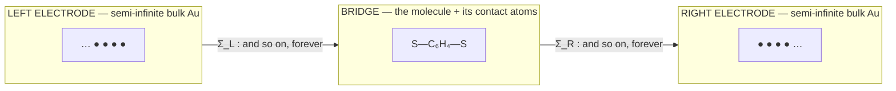
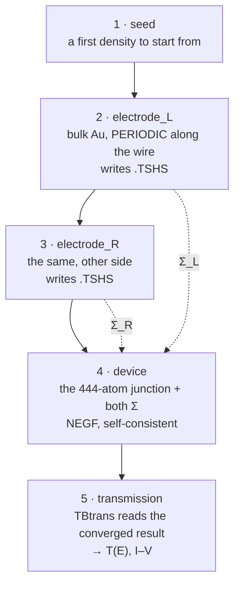
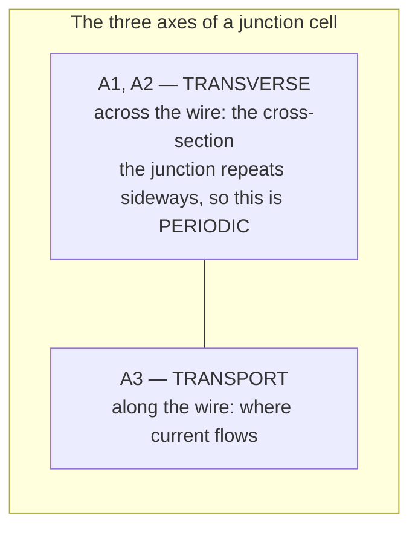
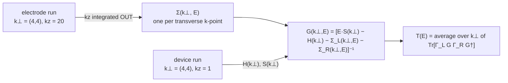
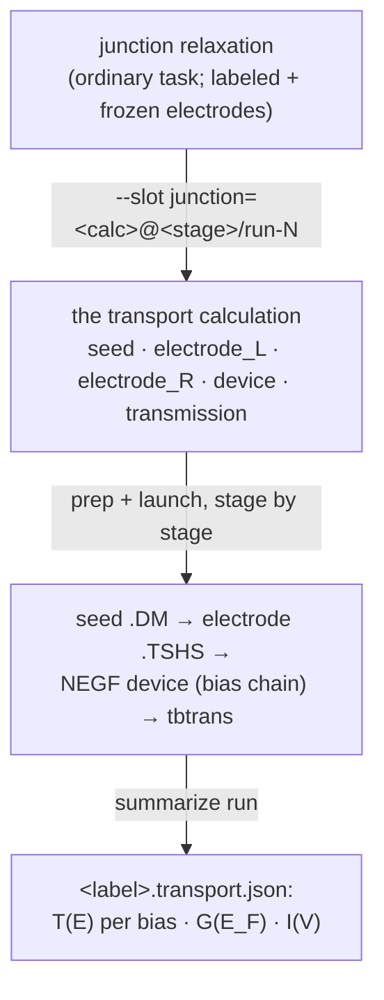
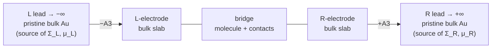
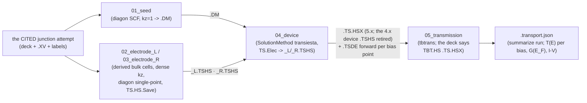
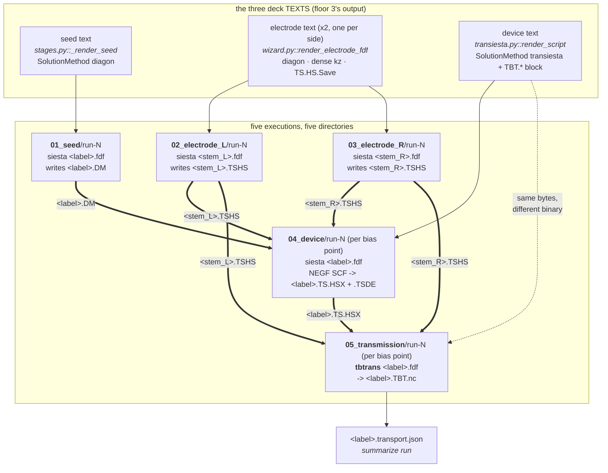

# Transport (conductance) — the TranSIESTA / NEGF workflow

**Role:** contract
**Domain:** engines
**Companions:** [`engines/siesta.md`](?doc=engines/siesta.md) (the base `.fdf`
emitter transport extends); [`model/structure-annotations.md`](?doc=model/structure-annotations.md)
(the region-label *vocabulary* the derivation reads);
[`science/pseudopotentials.md`](?doc=science/pseudopotentials.md) (the Au pseudo
the leads need); [`engines/overview.md`](?doc=engines/overview.md) (the shared
engine contract).

> **Migration status — LANDED (2026-08-28/29).** Transport is a
> **different KIND of job** — one answer assembled from pieces
> ([`execution/architecture.md § 0`](?doc=execution/architecture.md),
> decided 2026-08-11) — and the composite is that kind given its own
> representation rather than bent into a ladder:
> [`archive/2026-09-01-transport-design.md`](?doc=archive/2026-09-01-transport-design.md), built
> P1–P6 and proven end-to-end on real binaries (the carbon-chain live
> walk). The pre-framework `transport bundle` driver this banner once
> guarded is deleted; § 8 records the closure.

This is how molbuilder computes **electron transport** (conductance) through a
molecular junction — e.g. a single benzene-1,4-dithiol molecule bridging two gold
electrodes (Au–BDT–Au). It uses **TranSIESTA**, SIESTA's transport engine, which
solves the open-boundary problem with the **NEGF** method (non-equilibrium Green's
function).

> **Vocabulary.** A junction has a **scattering region** (the molecule + contact
> atoms) between two **electrodes** / **leads** (semi-infinite bulk metal). **NEGF**
> couples the leads into the device through energy-dependent **self-energies** Σ built
> from the *pristine bulk* lead. **`T(E)`** is the transmission (probability an
> electron of energy E crosses); **`E_F`** is the **Fermi level** — the energy that
> separates filled from empty states, and the reference energy for conductance. A
> lead's **chemical potential μ** is the energy its electron reservoir is filled up
> to (applying a bias offsets μ_L vs μ_R). **G₀ = 2e²/h** is the conductance quantum,
> and zero-bias conductance is `G = G₀·T(E_F)`. **`.TSHS`** is the file a lead run
> writes (its Hamiltonian H + overlap S). **TBtrans** is the post-processor that
> turns the device solution into `T(E)`. (DFT/SCF/k-points/pseudopotential are in
> the [`science/overview.md` glossary](?doc=science/overview.md).)

---

## 0. Orientation — what this calculation is, before any keyword

*(Written 2026-09-15 for a reader who has not done NEGF before, and because
§ 3.4's first attempt at explaining the k-grids conflated two different axes
and read as self-contradictory. If you only read one section, read this one.)*

### 0.1 Why one run cannot do it

You want one number: how much current crosses the molecule. An ordinary DFT
run cannot give it, because an ordinary run needs a **closed** box — a finite
list of atoms with nothing outside. A junction is **open**: electrons arrive
from one gold wire and leave through the other, indefinitely.



The trick is not to simulate infinite wire. You compute a small piece of
**pure bulk gold** once, and from it build a mathematical object — the
**self-energy** Σ — which says *"past this edge, more of the same, forever."*
The junction is then solved as a finite problem with two Σ attached.

That is why the workflow is five stages and not one.



**You never build a lead by hand.** You label atoms `L-electrode` /
`R-electrode` on the Molbuilder tab; stages 2 and 3 are *derived* from those
labels (§ 4). This is the design decision the rest of the feature rests on.

### 0.2 The k-grids — three axes, and only one of them is shared

**This is the part that reads as a contradiction until you separate the
axes.** A junction has three directions and they are not alike:



Now the two rules that sounded like they fought each other:

| | **A1, A2 — transverse** | **A3 — transport** |
|---|---|---|
| **device** (stage 4) | periodic → needs k-points, e.g. `4 4` | **`kz = 1`**, always. An **error** otherwise |
| **electrode** (stages 2–3) | periodic → **the same `4 4`** | **dense** — molbuilder's default is `40`. It really is infinite bulk |

They are opposite values **on different axes**, not conflicting values on the
same one. And molbuilder does exactly this: `wizard.py` reads `kx, ky` from
the shared config and *discards* its `kz`, substituting a dense
`electrode_kz`:

```python
kx, ky, _kz = cfg.k_mesh_transverse      # transverse: taken
...
f"    0    0  {int(electrode_kz):>3}"    # transport: replaced, dense
```

**Why `kz = 1` on the device.** `kz = 3` would tell SIESTA the junction tiles
along the wire — molecule, gold, molecule, gold, forever. You would be
computing a *crystal of molecules*, not one molecule between two contacts.
The result would look like a transmission and would not be one. Σ is what
represents the beyond; a `kz > 1` imposes a second, fake periodicity on top
of it.

**Why `kz` must be dense on the electrode.** The lead's `kz` is an
**integral** — it is summed over to build Σ. A thin lead cell has a large
1-D Brillouin zone, so too few points means the "bulk gold" you computed is
not converged bulk gold, and Σ describes subtly the wrong metal.  molbuilder
defaults it to **40** and warns below 20.

### 0.3 "Once Σ is computed, why does k still matter?"

Because **Σ is not one matrix. It is one matrix per transverse k-point.**

The lead's `kz` is integrated away and never appears again. The transverse
k is *not* integrated away — it survives as a label:



So the transverse grid must **match** because `Σ(k⊥)` has to be paired with
the device's `H(k⊥)` **at the same k⊥**. A Σ computed at (4,4) has nothing to
attach to in a device solved at (6,6) — there is no k-point in common to
build `G` at.

**And then there is a third grid, which surprises people.** TBtrans averages
`T(E)` over transverse k as well, and *it may use a different, denser grid*
(`TBT.k`, § 3.4.2's transmission row). That is legal because `H` and `Σ` are stored in **real
space** in the `.TSHS`/`.HSX` files, so tbtrans can evaluate them at any k⊥
it likes. And it is usually *necessary*, because the two grids are converging
different things:

| grid | converges | typical |
|---|---|---|
| the SCF's `k⊥` | the **density** — a smooth integral | `4 4 1` |
| TBtrans's `TBT.k` | **T(E)** — sharp resonances in k⊥ | `12 12 1` or more |

A grid fine enough for the density is routinely far too coarse for the
transmission. **`TBT.k` defaults to inheriting the SCF's** — which is why
`T(E_F)` against `TBT.k` is the standard convergence study, and why not being
able to set it was the largest gap in this tab until 2026-09-15.

*(A denser `TBT.k` cannot rescue a device SCF whose own `k⊥` was too coarse:
that `H` is simply wrong, and evaluating a wrong `H` at more k-points does
not improve it. Converge the SCF first, then the transmission.)*

### 0.4 The four things that must agree, and where each is enforced

Every one of these, if wrong, gives a **plausible-looking wrong answer**
rather than a crash — which is why they are guards in code and not advice.

| # | must be true | enforced where | on the composite path? |
|---|---|---|---|
| 1 | device `kz = 1` | **error**, `TransiestaEngine.preflight` | ✅ reached from `stages.py` |
| 2 | electrode `kz` dense | default **40** (`wizard.py`); a warn below 20 lives in `transport/preflight.py` | ⚠️ **no** — that warn's only caller is the standalone `molbuilder transport preflight` verb, so a composite run never sees it. And the default is unreachable from any description (§ 3.6 item 8) |
| 3 | transverse k identical in lead and device | the electrode deck *reads* the device's | ✅ by construction |
| 4 | basis, XC and mesh identical | ONE value shared by every stage, so they cannot disagree. *(Until 2026-09-16 this read **sealed** — taken from the cited run and uneditable. Superseded by § 2a.6: the cited run DEFAULTS them and the person may change them, everywhere at once. The invariant is unchanged; only its enforcement moves from inherited to single.)* | ✅ |

> **Corrected 2026-09-15.** This table said all four were guards in code. Row 2
> is not, on the path that matters: the check exists and nothing on the
> describe / prep / launch path calls it. Stated here rather than quietly fixed
> because the difference between *"a guard exists"* and *"a guard fires on your
> run"* is the whole value of the column.

Number 4 is why the tab makes you **cite a finished relaxation** instead of
typing a basis: the numbers arrive from that run's deck, so they cannot
disagree with what the leads were computed with. The manual is blunt that
TranSIESTA expects a *metallic* electrode and that fixing the boundary is
"an intricate and important" matter.

### 0.5 Worked example — the Au–BDT–Au junction in this repo

`projects/Au-BDT-Au/transport/AuBDTAu-CT`, cited from a CONCLUDED relaxation:

| | |
|---|---|
| structure | 444 atoms — 432 Au, one benzene-1,4-dithiol bridge |
| labels | `L-electrode` (low z) · `BRIDGE` · `R-electrode` (high z) |
| contract, from the citation | DZP · GGA-PBE · 300 Ry mesh |
| device k | `2 2 1` — transverse 2×2, **transport 1** |
| electrode k | `2 2 40` — the same 2×2, **transport dense** (the wizard's default) |
| bias | `0.0` → equilibrium, so the non-equilibrium contour settings are inert |
| what prep writes | `01_seed` … `05_transmission`, **a deck each — and no validation file**: the transport arm writes with `write_text` rather than going through `prepare_deck`, so the validate → render → read-back-check → report chain every other kind gets does not run here (§ 3.6 item 5) |
| the deliverable | `<label>.transport.json` — T(E) per bias, G(E_F), the I–V table |

## 1. The mental model — one citation → five derived stages

Conductance is **not one run**. It is several coupled SIESTA runs that must
agree numerically — a relaxed junction, a bulk-electrode run per lead that
emits a `.TSHS`, the NEGF device SCF, and the TBtrans transmission.
Correctness hinges on those runs sharing **one numerical contract** (XC,
basis, mesh, pseudopotentials) **and a geometric clone** of the electrode.

Since 2026-08-29 that agreement is not checked after the fact — it is
**impossible to break by construction**: transport is the COMPOSITE
calculation (`archive/2026-09-01-transport-design.md`). You relax the junction as an
ordinary task (outer metal layers labeled `L-electrode`/`R-electrode` and
frozen), then the transport calculation **cites that finished attempt** and
derives everything else — the sorted copy, both electrode cells (extracted
from the labeled blocks), and the five stage decks, all rendered from the
cited attempt's own `.fdf`.



**The consistency contract is the whole game**, and the derivation is what
enforces it: electrode and device render from ONE config filled from the
citation's deck, so a mismatch is unrepresentable (§ 5 records what that
guarantees; the § 5 preflight remains for hand-edited decks).

---

## 2. The physics in one page

A junction is an **open-boundary** problem: a finite scattering region C between
two semi-infinite leads L, R extending to ±∞ along the transport axis (z). The
leads enter C only through **self-energies** Σ_{L,R}(E), built from the *pristine
bulk* lead H/S — the device Green's function is
`G(E) = [E·S_C − H_C − Σ_L − Σ_R]⁻¹` and the transmission is
`T(E) = Tr[Γ_L G Γ_R G†]`, where Γ_{L,R} = i(Σ − Σ†) are the leads' **broadening
matrices** (how strongly each lead couples to the device). That gives
`G = G₀·T(E_F)` [Brandbyge 2002; Papior 2017].



The three boxed regions in the middle — `L-electrode | bridge | R-electrode` (the
§ 4 partition) — are *one* SIESTA cell. The semi-infinite leads on either side are
**not** atoms in that cell; they enter only as the self-energies Σ, computed from a
*separate* bulk-lead run, and each carries a chemical potential μ. `±A3` marks the
direction the lead extends (the third lattice vector).

Three consequences drive **every** parameter choice:

1. **Σ comes from a separate, pristine bulk-lead run** — *not* from frozen atoms
   in the device (frozen is only a geometry constraint). Hence **three runs**.
2. **The transport direction is open** → the device k-grid has **`kz = 1`**. Any
   `kz > 1` re-imposes Bloch periodicity along the wire and destroys the transport
   physics.
3. **Geometry fixes the physical model; the k-grid only sets integration
   accuracy.** Adding lateral vacuum makes a *cluster* (a different Hamiltonian); a
   denser k-grid of the *same* geometry just integrates it better.

> **Honest caveat (report it, don't hide it).** Plain LDA/GGA-DFT+NEGF
> **systematically overestimates** single-molecule conductance by ~1–2 orders of
> magnitude — the DFT **HOMO–LUMO gap** (the spacing between the molecule's highest
> filled and lowest empty orbital) comes out too small, so level alignment to `E_F`
> is off. For Au–BDT, experiment is ≈ **0.011 G₀** [Xiao 2004] while GGA-NEGF
> commonly gives ~0.1–0.4 G₀. The contract here gives a *numerically correct*
> GGA-NEGF result; closing the gap to experiment needs beyond-DFT corrections
> (**scissors / DFT+Σ** — rigidly shifting the DFT levels, or adding a self-energy
> correction — or hybrid functionals). molbuilder's job is to surface this caveat
> honestly rather than imply DFT-NEGF == experiment; the results layer that will
> carry the flag is still landing (§ 8).

---

## 2a. The parameter map

> **Status: agreed 2026-09-16, not yet built.** Every ruling this section asks
> for has been made (§ 2a.6); **none of it is implemented**. It is written here,
> beside the physics it follows from, because that is what it is derived from —
> not from what the code happens to do today. One item is deliberately deferred
> rather than decided: net charge and gating.

### 2a.1 Why the map is derived rather than assembled

§ 2 says what the calculation is; § 1 says it is five stages. What has never
been written down is **which stage owns which decision** — and the cost of that
omission is not abstract. A parameter surface assembled from whatever happened
to be configurable produces a form organised by subject matter, where a control
tells you *what it is* but not *which run it changes*, and where nothing says
whether a value you set in one place silently governs three other runs.

So the map is derived from the dependency graph, top down:

> **A parameter is decided at the earliest stage whose physics determines it,
> and is binding on every stage downstream of it.**

That is not a convention chosen for tidiness. It is forced: if stage N's result
is consumed by stage M, then anything that shaped N's result must be honoured by
M, or M is built on something it did not agree to.

### 2a.2 The three questions every parameter answers

The classes in § 2a.3 are shorthands for recurring combinations of these three.
The questions are the model; the classes are the vocabulary.

1. **Who decides it?** The *person* (a scientific or economic judgement), the
   *stage's role* (not a choice at all — changing it stops the stage being that
   stage), or the *machine* (the scheduler's answer).
2. **Where is it decided, and what does it bind?** Its deciding stage, and the
   set of stages downstream that must obey it.
3. **How strongly can consistency be guaranteed?** — § 2a.4.

### 2a.3 The classes

**Class A — Method.** *Decided once, binds every stage.* The electronic
description itself: the same basis, the same exchange-correlation, the same real
space grid everywhere, because the lead self-energy must attach to a device
Hamiltonian built the same way. The person owns these values; what they cannot
do is give one stage a different answer from another.

**Class B — Lead characterisation.** *Decided at the electrode stages, binds the
device and the transmission.* Properties of the leads that the device inherits
structurally, chiefly the transverse Brillouin-zone sampling: the self-energy is
built per transverse k-point and folded into the device at that same point, so
the two cannot sample different grids.

**Class C — Stage-local.** *Decided at one stage, binds nothing.* How that
particular run is driven — its SCF schedule, its convergence criteria, its own
integration contours, its outputs. Two stages may legitimately differ, because
a bulk lead's SCF and an open-boundary NEGF SCF do not converge alike.

**Class D — Role-fixed.** *Nobody decides.* The facts that constitute the
stage: which solver it runs, that a lead samples its transport axis and a device
does not, that a lead writes the Hamiltonian the device will read. These are the
identity of the stage, not settings on it, and exposing them as controls would
offer a choice that only has one correct answer.

**Class E — Machine.** *Per stage.* Cores, memory, wall time, queue. These
*should* differ across stages — the leads are small cells, the device is the
expensive rung, the transmission is nearly free — and none of them changes the
answer.

**And a category that is not parameters at all: the results that propagate.**
The lead's Fermi level and Hamiltonian, the seed's density, the device's
converged Hamiltonian. The contract owes these an explicit statement (§ 6)
because a reader asking "what does the next stage need from this one" is asking
about these, not about settings.

### 2a.4 Three tiers of guarantee, because "best effort" should be specific

Not every consistency rule can be enforced, and the map should say which
treatment each one gets rather than implying a uniform safety net.

| tier | what it means | the user sees |
|---|---|---|
| **1 — structural** | the inconsistent state cannot be expressed: there is one value and it propagates by construction | nothing; there is nothing to warn about |
| **2 — checkable** | an inconsistency is detectable before anything runs | a refusal naming what disagrees and what to do |
| **3 — advisory** | the right value is not knowable in advance; it needs a convergence study | a note stating what goes wrong if it is too low, and how you would check |

**Tier 3 is where the scientifically consequential decisions live**, and that is
the honest and uncomfortable part: level alignment, contact coupling and Fermi
level resolution are all tier 3. The software cannot verify them. That is
precisely why they must be prominent in the interface rather than tucked behind
an "advanced" fold — a note there must say what is at stake and must not imply
anything has been checked.

### 2a.5 The worked subset

Enough parameters to exercise every class and every tier. The full map follows
once the reasoning here is agreed.

| parameter | class | decided at | binds | tier | the decision it actually is |
|---|---|---|---|---|---|
| **XC functional / authors** | A | calculation | all stages | 3 | **Level alignment** — where the molecular resonances sit relative to the leads' Fermi level. The dominant factor in junction conductance, and the known weakness of plain GGA: underestimated gaps give overestimated conductance, often by an order of magnitude. No default can be right for everyone |
| **Basis size** | A | calculation | all stages | 3 | Accuracy against cost, and for transport specifically **the coupling**: the orbital tails carry the tunnelling across the metal–molecule contact |
| **PAO energy shift** | A | calculation | all stages | 3 | Orbital confinement radius — an aggressive value truncates exactly the tails that conduct. Transport is more sensitive to this than a total-energy calculation is |
| **Mesh cutoff** | A | calculation | all stages | 3 | Real-space grid: accuracy against cost, with egg-box error if too coarse |
| **Electronic temperature** | A | calculation | all stages | 3 | Fermi broadening — sets the leads' distribution functions, and affects both metallic SCF convergence and the transmission near the Fermi level |
| **Spin treatment** | A | calculation | all stages | 3 | Whether the physics is spin-resolved at all |
| **Transverse k-grid** | B | electrode | device, transmission | 2 + 3 | *Checkable* that leads and device agree; *advisory* whether the density is enough. Under-sample and the transmission is an average over too few transverse channels |
| **Lead transport-axis k-density** | C | each electrode | nothing | 3 | **The Fermi level resolution.** The lead is genuinely periodic along this axis; its Fermi level is the reference energy the whole calculation is measured against, so an under-converged value puts every transmission feature at the wrong energy. Per lead, not shared: an asymmetric junction can have different materials and lattice constants on the two sides |
| **Device transport-axis k** | D | — | — | 2 | Fixed: that axis is the open boundary and is not sampled. Checkable, and a violation is refused |
| **Solver per stage** | D | — | — | 1 | The stage's identity — a periodic warm-up, a bulk lead, an NEGF device. Not a setting |
| **Lead writes its Hamiltonian** | D | — | — | 1 | A lead run that omits it produces nothing the device can attach to |
| **SCF mixing weight / history** | C | each stage | nothing | 3 | How aggressively that run mixes. A bulk lead and an open-boundary NEGF cycle do not converge alike, so one value for both is a compromise neither asked for |
| **SCF iteration budget** | C | each stage | nothing | 3 | A **budget, not a target** — it says when to stop trying, and reading it as a convergence setting is a common misreading worth stating in the note |
| **Density-matrix tolerance** | C | each stage | nothing | 3 | What counts as converged for that run |
| **NEGF contour (poles, broadening)** | C | device | nothing | 3 | How the non-equilibrium density is integrated |
| **Transmission window, point count** | C | transmission | nothing | 3 | What is computed and at what resolution. A resonance narrower than the spacing is invisible |
| **Transmission broadening** | C | transmission | nothing | 3 | Too large smears real resonances into a featureless curve; too small turns them into numerical noise |
| **Lead layer count inside the device** | — | **the cited junction** | all stages | 2 | Not a transport parameter at all: it is geometry, settled when the junction was built and relaxed. Screening must be complete before the lead boundary or the self-energy attaches to a region that is not bulk-like. Transport **inherits and verifies** it |
| **Cores / memory / wall time** | E | each stage | nothing | — | Does not change the answer, so stages may differ freely — and should |

### 2a.6 What follows, if the above is agreed

**The blast radius of a change is its class.** This is what a person needs to
know before touching anything, and the interface should say it at the point of
edit:

| changing a… | invalidates |
|---|---|
| Class A value | **every stage** — leads and device must be rebuilt together |
| Class B value | the electrodes and everything downstream |
| Class C value | **that stage only** — everything upstream still stands |
| Class D | not a change; it is the stage's identity |
| Class E value | re-runs, but the science is unchanged, so old and new results stay comparable |

That asymmetry is also the argument for the transmission being its own stage:
its parameters bind nothing, so re-running it against an unchanged device is
cheap, and tuning an energy window should never re-run an NEGF cycle.

**The interface follows the map, not the subject matter.** One panel for Class
A, edited once, carrying the all-stages warning. One panel per stage for its own
Class C and Class E, with a read-only echo of what it inherits and a plain
statement of the Class D facts its role fixes. **One editing surface, many
read-only echoes**: a Class A value does not appear as an editable control
inside a stage, because editing it there would imply the device could differ
from the leads, which is the one thing that must be impossible.

**Rulings made** *(2026-09-16)*:

| | |
|---|---|
| **The T(E) window belongs to the transmission** | Exposed and tunable **there only**. A consequence worth stating: if the `TBT.*` settings are the transmission's alone, the device deck has no reason to carry them — so the two decks legitimately differ, and each carries only what its own binary reads. What keeps them consistent was never byte-identity; it is the shared Class A values |
| **Class C ships per-stage defaults** | Each stage carries an opinionated profile rather than inheriting one shared set: a bulk lead's SCF and an open-boundary NEGF cycle do not converge alike, and the electrode's dense transport-axis k is a default, not something a person should have to discover |
| **Always two lead stages** | Even when the leads are provably identical. Lead runs are cheap, and two runs keep the record auditable |
| **Default grouping** | The preparatory block — seed and both leads — as one submission; then the device; then the transmission. Fusing device and transmission is available as an opt-in |
| **The trigger is DEFERRED, and load-bearing on nothing** | *(2026-09-16.)* Automatic resubmission is **optional and changes no logic**: the stages, their decks, the parameter map and the directory structure are all identical whether a person launches each rung or something launches it for them. It is a convenience at the launch layer, so nothing in this contract waits on it. When it is built, the monitor is its home — it already watches a run to its end, so *"and if it converged and produced the file, submit the next"* extends something that exists. Off by default. **To verify first:** whether compute nodes may submit jobs on the target cluster; if not, the trigger lives wherever the monitor runs rather than inside the job |
| **A frame group runs at one bias** | § 2a.7 |
| **The bias treatment is an exposed choice** | Single-bias or finite-bias is named in the interface with its advisory attached, and the deliverable is labelled by how it was computed — § 2a.8 |

**Deferred — net charge and gating.** Left open for future development rather
than designed now. How a gate is applied in SIESTA 5.x — a charge-distribution
block, a scripted hook, or neither — has not been verified against the manual,
and should be before anything depends on it.

**All rulings are now made.** The last one:

| | |
|---|---|
| **The relaxation DEFAULTS the Class A values; it does not seal them** | A transport calculation arrives pre-filled with the basis, functional and mesh cutoff of the relaxation it starts from, and the person **may change them** — a change applying to every stage at once. The physics requires the leads and the device to agree *with each other*, not with an earlier relaxation, and that needs the value to be **single**, not **inherited**. The worked case: relax with DZP because it is cheap and adequate for geometry, then move to TZP for transport because the longer orbital tails carry the metal–molecule coupling |

> **⚠️ This reverses ruling Q5**, which achieved consistency by removing the
> choice. The invariant Q5 protected — *"electrode and device must stay unable
> to disagree"* — is preserved exactly, because one value shared by every stage
> cannot disagree with itself. What is withdrawn is only the claim that the
> value must come from the cited run.
>
> **Restatements of Q5 elsewhere in this document are superseded** and marked at
> each site: § 0.4 row 4, and § 3.6 item 8. Any surface showing these fields as
> locked-because-cited is showing a rule that no longer holds.

---

### 2a.7 The structure input, and the frame axis — making room, not building

*Added 2026-09-16 at the user's direction. The frame axis is **not** being
built; what is settled here is what today's contract must say so that adding it
later needs no rework.*

**Transport's input is a structure, and the contract should say so plainly.**
Today that structure is a relaxed junction. In future it will also be a **group
of static frames** — all derived from one optimised junction, each with some
subset of atoms displaced by a rule (a normal-mode displacement, most
obviously). Each frame is an ordinary static calculation in its own right;
nothing is dynamic, and no frame depends on another.

That is the standard route to phonon-modulated transport: displace along the
modes, compute T(E) per frame, and recover the thermal average of the
conductance, or the electron–phonon couplings from finite differences of the
Hamiltonian.

#### The electrodes do not move, and that is structural

The lead atoms are frozen bulk by construction (§ 4). A displacement rule acts
on the bridge — never on the leads — so **every frame has the same electrode
region**, and the two lead calculations are the same calculation for all of
them. Sharing them is therefore not an optimisation bolted on later; it is a
statement about what an electrode stage *depends on*.

#### The axis rule, which the bias scan already follows

> **A stage carries a sub-level for each axis it varies over, and none for an
> axis it does not.**

Stated this way — rather than as an arrangement peculiar to bias — the frame
axis needs no new machinery, and the sharing becomes **visible in the layout
itself**: the electrode stages simply have no frame level, and the directory
tree says so without anyone having to know it.

#### Two kinds of sharing, and they need different gates

| | what is shared | valid when | gate |
|---|---|---|---|
| **Exact** — the electrodes | the lead Hamiltonian, used as **truth** (it becomes the self-energy) | the frame's electrode region is geometrically **identical** to the one the lead was derived from | **a displacement rule must never move an electrode atom** — checkable (tier 2), and it coincides exactly with the frozen-atom set the relaxation already carries |
| **Approximate** — the seed | a converged density, used only as a **starting guess** | any nearby geometry: same species, same ordering, slightly moved. The SCF converges away from it, so being imperfect costs iterations, not correctness | the orbital set must match; the geometry need only be close |

The distinction matters because the two gates differ in **kind**, not in
strictness. Getting the first wrong is a wrong answer; getting the second wrong
is a slow one.

So the shape is: **electrodes once, seed once, device and transmission per
frame.**

#### Class A widens

Class A's binding scope becomes *identical across every stage **of every
frame***. Frames whose transmissions were computed with different basis sets or
functionals are not comparable to each other — and comparing them is the entire
reason for computing a group.

#### RULING — a frame group runs at ONE bias

*Proposed as a ruling, 2026-09-16.*

> **A frame group is computed at a single bias point.** Frames and bias are two
> axes, and their product is a shape nothing walks and nobody has asked for.

The physics agrees with the restriction: thermal averaging and IETS are
evaluated at or near zero bias. And it leaves the cheap thing available — from a
single converged device at one bias, **tbtrans sweeps energy**, so each frame
yields a full T(E) curve.

**The one confusion this must not create.** Sweeping **energy** in the T(E)
window and sweeping **bias** are different calculations, and the contract should
refuse to let them be reported as the same thing:

- **Energy sweep** — one converged device, tbtrans evaluates T(E) across the
  window. Cheap, and it is what a frame group gives you.
- **Bias scan** — the device NEGF SCF is **re-converged at each voltage**,
  because the potential drop reshapes the molecular levels. T is then a function
  of both, T(E, V).

A low-bias I–V *can* be obtained from a single zero-bias curve by integrating it
against the leads' Fermi functions — that is the **linear-response
approximation**, it is legitimate and standard, and it is **not** a finite-bias
NEGF result. Where a deliverable is computed that way it must say so, or a
reader will take an approximation for the real thing.

#### What makes a set citable

Today transport cites one finished attempt; a group cites a **set**. The
condition should be stated when the capability is built, and will be: one shared
base structure, an electrode region identical across every frame, and the
displacement rule recorded beside the frames — so a result can always say what
it was a displacement *of*.

#### What this changes about the deliverable

The result of a frame group is not one transmission curve but a **family** of
them, plus whatever is derived across the family (an average, a variance, a set
of couplings). § 6's statement of what the Results surface reads will have to
grow a frame dimension — which is another reason to fix the axis rule now.


### 2a.8 The bias treatment — an explicit choice, and what the result may be called

*Ruled 2026-09-16: the treatment is exposed as a named choice with its advisory
attached, and the deliverable is labelled by how it was computed.*

**Transmission is a function of two variables, and the notation should say so.**
In general it is **T(E, V)**: an electron's transmission probability at energy
*E* when the junction is held at bias *V*. A calculation does not compute the
whole surface — it computes a **slice at one V**, and the choice being exposed
here is how many slices you pay for.

#### The two treatments

| | what runs | what you get |
|---|---|---|
| **Single bias** (normally V = 0) | the device SCF converges **once** | **T(E)** — one slice, a full energy curve. An I–V *can* be derived from it by integrating against the leads' Fermi functions; that is the **linear-response approximation** |
| **Finite bias** | the device SCF is **re-converged at every voltage** | **T(E, V)** — one slice per point. The I–V follows from integrating each slice over its own window, with no approximation beyond the method itself |

The mechanism is the same in both cases; the difference is how many device SCFs
are paid for, and therefore **what the result is entitled to be called**.

#### The advice attached to the choice (tier 3 — advisory)

**There is no universal threshold voltage, and the interface must not invent
one.** The criterion is a property of the junction:

> Compare **eV/2** — the half-width of the bias window — with **the energy gap
> from E_F to the nearest transmission resonance.**

While the window is small compared with that gap, T(E, V) barely depends on V
and one slice serves. Once the window edge approaches a resonance, that
resonance both *enters* the window and *moves* under the field, and integrating
a zero-bias curve cannot reproduce either effect.

Rules of thumb, for junctions whose nearest resonance sits ~0.5–1.5 eV from
E_F — offered as orientation, never as a guarantee:

| bias | practice |
|---|---|
| **< 0.1 V** | linear response is fine; this is the conductance regime, where the observable is essentially G = G₀·T(E_F) |
| **0.1 – 0.5 V** | usually sound qualitatively, with quantitative error growing; worth checking rather than assuming |
| **> 0.5 – 1 V** | re-converge at each voltage — the window is now comparable to the level offset, resonances enter it, the molecule charges and levels pin |

Two situations bring finite-bias effects on **earlier** than that table suggests:
an **asymmetric junction**, where unequal coupling to the two leads produces an
asymmetric potential drop; and a **weakly coupled** molecule, which charges
readily, so level pinning appears at low bias.

**The dependable answer is empirical, and cheap.** Converge the device at V = 0
and at the largest V of interest, and compare the two curves *inside the bias
window*. If they differ appreciably, the scan is needed. Two device runs to
decide whether a whole ladder is necessary is a good trade, and it is what the
interface should recommend rather than quoting a threshold as though it were
settled.

*This is also why the frame-group restriction (§ 2a.7) costs nothing for the
physics it serves: molecular vibrations are ~10–400 meV, so IETS lives below
~0.4 V — inside the regime where one slice is a sound elastic baseline.*

#### The labelling rule

> **A transmission result records how it was computed, and an I–V derived under
> the linear-response approximation says so.**

Not a formality. A linear-response I–V and a finite-bias I–V are different
claims about the same junction, they can differ substantially above a few tenths
of a volt, and on a plot they are indistinguishable. A curve that does not carry
its own provenance will eventually be read as the stronger claim.

So: the record names the treatment, the bias point or points, and — where the
I–V was obtained by integrating a single slice — that it is linear response.
The Results surface shows that label beside the curve, not buried in metadata.

#### Where bias sits in the map

| parameter | class | decided at | binds | tier |
|---|---|---|---|---|
| **bias treatment** (single / finite) | shape | calculation | the device's axis, and what the result may be called | 3 |
| **the bias point(s)** | C | device | transmission — each transmission point reads *its own* point's converged Hamiltonian, never another's | 3 |

The treatment is not really a third mechanism: **single bias is the degenerate
case of the bias axis — one point, normally at zero.** It earns a name of its
own because what changes is not the machinery but the standing of the result.

### 2a.9 The directory structure — one place per run, and the axes visible in it

*The structure a person opens after a calculation finishes. If the folder does
not explain itself, nothing downstream can.*

#### The rule it is built from

> **One directory per run.** A stage owns a directory; each attempt at that
> stage owns a subdirectory; and a stage carries a **sub-level for every axis it
> varies over, and none for an axis it does not.**

Two properties follow without anything further being said. **Nothing can
overlap** — two runs never share a namespace, so no output file of one stage can
be mistaken for, or overwritten by, another's. And **what is shared is visible**:
a stage that does not vary over an axis simply has no level for it, so the tree
itself shows which results are computed once and reused.

#### Today: the bias axis

```
<project>/<topic>/<calculation>/
├── task.json                    the description — every parameter, every stage
├── junction.xyz                 the composed structure, + its sidecars
├── junction.cited.fdf           the deck of the relaxation this started from
├── pseudos/                     one copy, shared by every stage
├── job-set.json                 the plan
│
├── 01_seed/
│   └── run-0/                   the run: deck, wrapper, outputs, .DM
├── 02_electrode_L/
│   └── run-0/                   ... .TSHS
├── 03_electrode_R/
│   └── run-0/                   ... .TSHS
├── 04_device/                   ← varies over bias
│   ├── v0/   run-0/             ... .TS.HSX, .TSDE
│   └── v0.2/ run-0/
└── 05_transmission/             ← varies over bias
    ├── v0/   run-0/             ... .TBT.nc
    └── v0.2/ run-0/
```

A **single-bias** calculation (§ 2a.8) has no `v*` level at all — the degenerate
case of the axis rule, not a special case of the layout.

#### Later: the frame axis (§ 2a.7), and why sharing needs no explaining

```
├── 01_seed/         run-0/      ← NO frame level: one density warms every frame
├── 02_electrode_L/  run-0/      ← NO frame level: the leads do not move
├── 03_electrode_R/  run-0/
├── 04_device/                   ← varies over frames
│   ├── f000/ run-0/
│   └── f001/ run-0/
└── 05_transmission/
    ├── f000/ run-0/
    └── f001/ run-0/
```

The absence of a level *is* the statement that the result is shared. Nobody has
to be told; the tree says it.

#### Attempts, and what is never overwritten

An attempt that has been **launched is never rewritten**. Re-preparing after a
launch opens the next `run-<n>`; re-preparing before one refreshes the attempt
in place, so changing your mind twice does not leave empty directories behind.
Every `run-<n>` on disk was therefore actually started, which is what makes the
numbering mean something.

The consequence for the workflow: **change a parameter, re-prepare, and the
previous result stays** — its deck, its outputs and its provenance intact,
beside the new one. Comparing two settings is reading two directories.

#### How results move between stages

> **By copy, at preparation time, with provenance recorded — never by reading
> across directories at run time.**

Before a stage runs, what it consumes is copied into its attempt directory:
the leads' Hamiltonians, the seed's density, the device's converged
Hamiltonian. Three conditions gate every copy — the upstream stage must have
been prepared, must hold a **concluded** attempt that ran the deck this
composition renders, and that attempt must actually hold the file — and each
refusal names what to do first. A record of what was taken from where lands
beside the copies, so a transmission can always say which lead runs and which
device run it rests on.

Copying rather than referencing is what lets a run directory hold everything it
needs: it survives being moved to a cluster, archived, or handed to someone
else.

### 2a.10 What the Results surface reads

The deliverable of a transport calculation is the **transmission** stage's
output. Everything else in the tree exists to make it trustworthy, and the
surface should present both.

**The curve, and what it is.** T(E) for a single-bias calculation, or the family
T(E, V) for a bias scan — shown **with its treatment named** (§ 2a.8). An I–V
obtained by integrating a single zero-bias slice is labelled *linear response*,
beside the curve and not in metadata: the two kinds of I–V are different claims
and look identical on a plot.

**The provenance chain.** Which device run, which lead runs, which relaxation
the junction came from. A transmission curve without its chain cannot be
interpreted, reproduced, or compared with another.

**The ladder's state.** Which stages are prepared, running, concluded or failed
— because a transmission that has not run yet is *pending*, never a failure of
the calculation, and a reader needs to see which of five runs is the one still
outstanding.

**Later, the frame dimension.** A frame group's deliverable is a **family** of
curves plus whatever is derived across it — an average, a spread, a set of
couplings. § 2a.7's axis rule is what keeps that additive rather than a rewrite.


---


## 3. How to run it (the CLI)

The road is the composite, through the ordinary `jobset` verbs:

```bash
# 0. relax the junction as an ordinary task (electrode layers labeled
#    L-electrode / R-electrode and frozen), and let it CONCLUDE.

# 1. describe the transport calculation: one slot, the finished attempt
molbuilder jobset init --calculation transport --shape hierarchical \
    --bundle BDT-Au/transport/BDTTrans \
    --slot junction=BDT-Au/optimization/JunctionRelax/01_coarse/run-2 \
    --bias 0.0,0.2

# 2. prep + launch the ladder, stage by stage (each prep gathers what
#    the stage consumes from the concluded stages before it)
molbuilder jobset prep run seed        && molbuilder jobset launch run seed --mode submit
molbuilder jobset prep run electrode_L && molbuilder jobset launch run electrode_L --mode submit
#    ... electrode_R, then device (a bias scan launches as ONE chain
#    job walking the points), then transmission

# 3. read the deliverable back
molbuilder jobset summarize run        # -> <label>.transport.json + the I-V table
```

| Command | Does | Code |
|---|---|---|
| `jobset init --calculation transport` | describe the composite: the junction citation, the bias list, the five fixed stages | `jobset/_cli.py::_init_transport` |
| `jobset prep run <stage>` | compose (sort · gates · extract) on first contact, then render THIS rung's deck + gather its inputs | `jobset/prep.py::_prep_transport` |
| `jobset launch run <stage>` | the ordinary launch; a bias scan's device/transmission go as one walker job | `jobset/submit.py::submit_transport_chain` |
| `jobset summarize run` | parse TBtrans output → `<label>.transport.json`, print the I–V table | `transport/record.py` |
| `transport electrode --which L-electrode\|R-electrode` | standalone helper: derive a single bulk-lead `.fdf` (the electrode wizard) | `wizard.electrode_wizard` |
| `transport preflight` | standalone helper: check the device ↔ electrode contract on decks you hand-edited | `preflight.py` |

**Gotchas:** the citation names a DIRECTORY explicitly (§ 3.1 below) —
nothing is ever picked for you; a re-pointed citation recomposes and makes
every stale upstream attempt refuse by deck-mismatch; `--bias` must start at
`0.0` (the chain starts from equilibrium).  *(The old `transport bundle`
three-run driver and its `run-transport.sh` were deleted 2026-08-29 —
deriving and running the pieces is the composite's job.)*

### 3.1 What makes a directory citable — files, not layout

**The condition is what the directory HOLDS, never where it sits or what it
is called.** A citation is checked against two forms, and a directory that
satisfies neither is refused by name — told what it holds and what the
condition wants, rather than "not citable".

| form | the directory holds | what it is |
|---|---|---|
| **A — a relaxation** | exactly one `.fdf` **and** exactly one `.XV` | the deck that ran, and the geometry it ended at |
| **B — a structure** | exactly one `.xyz` **with** its `.molstruct.json` beside it | a structure and its labels, with no run behind it |

**Form A wins when both are present**: the deck carries the contract, and more
information never loses to less. **Two of anything inside one form is
ambiguous and refused** — a citation names a directory, so the directory must
answer unambiguously; keep one, or cite one that holds one.

**Evidence is FILES, never a marker spelling of ours.** SIESTA writes
`0_NORMAL_EXIT` as its last act on a clean exit, so a run carrying it ran to
its own end *whatever wrapper — or no wrapper — launched it*. molbuilder's own
record answers first only because it also carries the exit code.

**Classifying is not composing.** A relaxation still running has record files
that do not conclude; classification RECORDS that, because describing a
transport calculation ahead of a finishing relax is legal. Composing from it
refuses — you may plan against a run in flight, but you may not build a deck
from a geometry that is still moving.

---

### 3.2 Where transport sits in the seven floors — and it does not

**This section is first because everything below it is a consequence.** The
earlier draft of § 3.2 opened with *where transport's parameters live*, which
is a symptom; the cause is one floor of the architecture that transport never
joined.

[`execution/architecture.md`](?doc=execution/architecture.md) § 2 is the
project's own top-down: seven floors, and one rule — **a floor may call down
and return up; it may never reach across.** Floor 2 is the *description*
(`task.py`, and the template beside it). Floor 3 is *plan & render* — *"asked-for
+ machine → a list of jobs, **and the text of every file**"* — and its files are
named: `resolve` · `siesta/input` · `pyscf/input` · `runwrap`.

**`molbuilder/transport/` is in none of them.** The word *transport* appears
once in that whole document, in a table asserting the opposite of what the code
does: *"the five stages run INSIDE the job system (each an ordinary prep/launch
rung)"*.

Four rules, and each one costs something measurable:

| the rule | what transport does | what it cost |
|---|---|---|
| **floor 3 renders the text of every file**, from a `ParameterSet`, through `spec_for` → `DeckSpec` → `prepare_deck` | `transport/transiesta.py::render_script` concatenates literal f-strings. It is not floor 3's file, takes no `ParameterSet`, and never reaches `prepare_deck` | the keyword set was **fixed in code**: the seed deck `prep` rendered carried **13 keywords and 4 blocks** against a template offering **45 deck-reaching items**. **The seed rung is on the seam since 2026-09-15** — see § 3.6a; the other four still render this way |
| **floor 2 holds what the person asked for** | transport had no template, so the parameters were *defined* in `TransportConfig` — which is no floor at all | 32 parameters of surface, none of them the ~40 a SIESTA run needs. `MaxSCFIterations` and `DM.Tolerance` cannot reach ANY transport deck: not from the citation, not from a form, not from `task.json` |
| **`prep` is the conductor, not a floor: it may call, but it may never decide** | `_prep_transport` is a second conductor that decides — it composes, gates, extracts and renders | no `resolve`, so no `ParameterSet` and no provenance; `--pipeline-log` is a documented no-op; no validation report; no read-back check |
| **floor 2 must never name a machine** | `max_memory_mb` and `num_threads` are `TransportConfig` fields | two controls that reach the deck only as comment lines |

#### Why it is this way, from the history rather than from a rationale

| | |
|---|---|
| **2026-06-10** | `transiesta.py::render_script` written — *"transport B.3 step 1: transiesta engine + zero-bias device .fdf"* |
| **2026-08-19** | the pipeline lands — *"refactor(prep): the seam carries the engine's FORM, and the layout is a table"* — creating `DeckSpec` **and** moving `siesta/input` onto `spec_for`, in one commit |

The transport emitter predates the framework by ten weeks. That commit migrated
siesta and pyscf and left transport where it was; the composite was then built
*outward* from the unmigrated emitter (P4, 2026-08-28 wired `stages.py` to call
`render_script`), so it inherited the old path and grew `_prep_transport` around
it rather than joining the new one.

**And the contract knew.** [`template.md`](?doc=engines/template.md) § 9.2
records it: *"ONE ARM IS STILL MISSING: `prep`'s TRANSPORT branch reaches
neither `prepare_deck` nor `write_script`, and `molbuilder/transport/` never
emits the zone at all."* It was filed as one lost feature — the USER-CUSTOM
block — rather than as *transport cannot render from a template*, which is what
it is.

#### Every known defect is downstream of this

Not a list of bugs; one omission with faces. Each was found separately and each
dissolves at the same place:

| symptom | the floor-3 fact behind it |
|---|---|
| the seed ran 1000 SCF iterations and died `SCF_NOT_CONV` | `MaxSCFIterations` is not in the hardcoded list, so the citation's `30` cannot travel |
| the device deck aborts: *"the continued fraction method requires at least 20 poles"* | `TS.Contours.Eq.Pole.N` is not in the list either — the pole *energy* is written, never the *count* |
| `TBT.k` is emitted as a bare scalar the parser cannot read | the list hand-formats values, so no emitter owns "how a list-valued keyword is written" |
| `tbt_k_grid`'s transport axis is unguarded | there is no declaration to carry a bound |
| the electronic contract is two frozensets and a predicate spelled twice | floor 2's job done in code, because floor 2 held nothing |

**The lesson for the order of work.** This document's first draft put "render
through `prepare_deck`" at step 6 of 7, because it was written from the
parameters down. Read from the floors down, it is step 1: until floor 3 renders
transport from the description, a parameter surface has nowhere to arrive, and
every fix above it is a patch on an emitter that should not exist.

---

### 3.3 Transport is a calculation KIND — measured, not asserted

The question this section answers is the one that decides everything below it:
**does transport share enough with the calculations that already work to be
carried by the same template, or is it different enough to need its own?**

The framework's own protocol names transport by name
([`template.md`](?doc=engines/template.md) § 6.3, user ruling 2026-08-21):

> *"a new calculation kind — **transport is next** — means new rows in this one
> catalogue, never a second template file. The kind declares its own rows with
> `calculations = [...]` … A second catalogue per kind would be two-homes drift
> all over again, one axis over."*

And the design of record agrees, in its own ruling body
([`archive/2026-09-01-transport-design.md`](?doc=archive/2026-09-01-transport-design.md) § 2):

> *"What stays identical to every other task — deliberately: the portable-folder
> rule, the verbs, attempts, **the template/catalogue machinery for transport's
> own parameters**, and the sweep axis. **Only the input model is new: one slot,
> filled by an explicit citation.**"*

§ 4.2 of that document even calls the transmission knobs *"transport-template
fields"*. **There is no ruling anywhere that transport has no template.** The
phrase *"floor 2 is task.json alone"* occurs twice in the whole archive, both
times inside a build-note parenthetical about the **hand-over** seam — how many
files cross the web describe boundary — and it was restated into code comments,
`job-contracts.md`, the roadmap and two tests until it read as design.

#### What the measurement says

The vibration kind is the worked precedent: *"its template IS the optimization
template plus fourteen declared rows, because one of its steps **is** an
optimization"* (§ 6.3). Measured against the live catalogue:

| | vibration | transport |
|---|---|---|
| catalogue rows of its own | 15, all `PySCFConfig` fields | **0 today** |
| base it inherits | the 41 pyscf items | **49 siesta items** |
| of that base, what it must EXCLUDE | nothing | **9** — the relaxation driver (`md_*`, `relax_*`, `write_md_*`) |
| deck shapes | 1 | **4** |
| binaries | 1 | **2** (`siesta`, then `tbtrans` on stage 5) |

**The overlap is large, and that is the finding.** Every transport stage *is* a
SIESTA run — the seed is a plain SCF, each electrode is an SCF, the device is an
SCF with open boundaries — so all four need `DM.Tolerance`, `MaxSCFIterations`,
`MeshCutoff`, `PAO.BasisSize`, `XC.*`. Transport is **the siesta base minus the
relaxation driver plus the NEGF/TBtrans surface**: structurally the same
relationship vibration has to optimization, with a subtraction as well as an
addition.

> **A measurement that looked the other way, and why it was wrong.** Comparing
> `TransportConfig`'s 32 fields against the catalogue shows 21 of 22 *settable*
> fields disjoint, which reads as *"transport shares almost nothing"*. That
> measures the wrong object: `TransportConfig` is the artefact this section
> concludes should not exist, and its "settable" surface is small precisely
> because the electronic half arrives from the citation instead of being typed.
> **Transport's DECK is mostly shared; only its FORM is mostly new.**

**Decision: rows in the one catalogue, tagged `calculations = ["transport"]`.**
No second catalogue (§ 6.3 forbids it) and no second authored file (the
measurement gives no cause). The per-calculation `<label>.template.toml` every
calculation already gets is where transport's narrowed set lands.

---

### 3.4 The template — its shape, and the reasoning for that shape

A template item answers *what is this parameter*. Transport needs two further
questions answered that no existing kind has had to ask, and the shape follows
from keeping each on the axis that already owns it.

#### 3.4.1 The first axis: WHO ANSWERS the item

Every other kind has essentially one answerer — the person, with the scheduler
answering the handful of allocation rows. Transport has **five**, and sorting
the parameters this way is what makes the rest of the design fall out.

| answerer | what | how the template says it |
|---|---|---|
| **the person** | the transmission window and grid, the TBtrans outputs, broadening, the NEGF contour, the leads | an ordinary item with a `value` |
| **the citation** | basis, energy shift, XC functional + authors, mesh cutoff, transverse k, electronic temperature — the **electronic contract** | a **declared, valueless** item (§ 6.4) carrying a source marker; `prep` fills it from the cited deck |
| **the description** | job label, the bias list | the label is an ordinary item; the bias is `task.json`'s own `bias` block, because it is the sweep axis (§ 4.3) |
| **the machine** | memory ceiling, thread count, ranks | `allocation` items — valueless on floor 2, filled at `prep` (G1) |
| **the geometry** | which atoms are electrode / bridge / buffer, which are frozen | **not an item at all** — § 7's structure exclusion; it travels in the `.molstruct.json` sidecar and the deck's ATOM-METADATA block |

Two of those rows are corrections to what ships today:

* **The machine row.** `max_memory_mb` and `num_threads` are `TransportConfig`
  fields in a form section today, which G1 and § 7 forbid on floor 2 — and they
  reach the deck only as comment lines, so they are controls that move nothing.
  As `allocation` items they become what they are.
* **The citation row** is the one that needs a name, and § 3.4.3 gives it.

#### 3.4.2 The second axis: WHICH STAGE'S DECK carries the item

This is **not** a new key on the item. `DeckSpec.layout` already exists for
exactly this and is declared as *"deck layout is engine knowledge and stays with
the engine — but as a table rather than as control flow"*, with `Section.items`
naming which items go in which part of the deck.

So transport supplies **four layout tables**, selected by the `stage_token` that
`spec_for` already receives:

| stage | deck shape | items in its layout |
|---|---|---|
| `seed` | an ordinary SCF | the electronic contract; no TS/TBT rows |
| `electrode_L`, `electrode_R` | a bulk lead | contract + `electrode_kz` + semi-infinite direction |
| `device` | the NEGF SCF | contract + `TS.*` contour rows + the chemical potentials; transport axis forced to `kz = 1` |
| `transmission` | **the same text as `device`** | plus the `TBT.*` rows; the binary changes, not the deck (`Resources.program = tbtrans`, § 4.2) |

An item absent from a stage's layout is simply not written into that stage's
deck. No control flow, no per-item stage key, and the whole mapping is readable
as a table. Verified: nothing downstream of `spec_for` is stage-aware — the
stage token only names the file — so four shapes need no framework change.

#### 3.4.3 The citation is a source, the way the scheduler is a source

§ 6.4 already carries the *state* transport's electronic contract needs:

| state | means | who acts |
|---|---|---|
| no `value` | declared, unresolved | a surface asks, or `prep` fills |
| `value` set | chosen | honoured verbatim |
| absent from the file | not a parameter of this calculation | the engine's own default |

That three-state encoding fixes a defect the current design cannot express. A
cited deck that omits `MeshCutoff` today silently yields the dataclass default
of 300 Ry, with **nothing recording that it was a default rather than the
citation's word** — every fill is a `if getattr(fdf, X, None)` guard over a
Python default. Under § 6.4 the unfilled state is a state.

What § 6.4 lacks is the *source marker*. `allocation` is the existing precedent
— *a source outside floor 2 answers this item, and writing a value here is
refused* — and the citation is structurally the same kind of source. **So the
one framework extension this design asks for is a sibling of `allocation` on the
same axis.**

It earns itself rather than being convenient: it replaces two Python frozensets
(`SEALED_ALWAYS`, `CONTRACT_FIELDS`) and a predicate currently spelled twice in
two files with disagreeing formulations, it puts *"who answers this"* on the
axis § 6.4 already owns, and any later kind whose values arrive from a cited
result inherits it. Both refusal doors then read one declaration.

#### 3.4.4 What a transport template contains, end to end

```
  the one catalogue                        <label>.template.toml
  ─────────────────                        ─────────────────────
  49 siesta items                          the 40 that survive the filter,
   − 9 relaxation-driver rows                values from the form or, for the
     (calculations = ["optimization"])       contract rows, VALUELESS
   + ~20 transport rows                    + transport's own rows, with values
     (calculations = ["transport"])        + the allocation rows, valueless
```

The narrowing is the framework's own: `template_with_values(cfg,
engine="siesta", calculation="transport")` runs `select(parsed,
engine="siesta")` and then keeps an item when `not it.calculations or
"transport" in it.calculations`. Tagging the 9 relaxation rows is what makes the
subtraction happen; every other shared item comes along because it genuinely
applies.

---

### 3.5 How it is implemented — the chain, named

One direction, and every step is a function that already exists except where
marked **[new]**.

```
  catalogue.template.toml            the master — transport's rows live here
        │  select(engine="siesta") + calculations filter
        ▼
  template_with_values(...)          → <label>.template.toml        floor 2
        │                              task.json beside it (slots, bias, stages)
        ▼
  jobset prep run <stage>            on the machine that will run it
        │
        ├─ compose_junction(...)     THE ONE NEW INPUT MODEL: copy the citation,
        │                            sort, gate, derive both electrode cells
        │
        ├─ resolve(template_text, task, SiestaConfig, allocation=...)
        │       config_from_template → the contract rows filled from the
        │       composed citation [new arm], everything else from the template
        │       → ParameterSet, with provenance
        │
        ├─ spec_for(struct, cfg, stage_token=…, calculation="transport")  [new arm]
        │       → DeckSpec(layout=<one of the four tables>)
        │
        └─ prepare_deck(spec, struct, cfg, path)
                validate → render → write → READ BACK AND CHECK
                → the deck, its .validation.txt, the USER-CUSTOM zone

  jobset launch run <stage>          Resources.program = tbtrans on stage 5
```

The only genuinely transport-specific code in that chain is the **input model** —
`compose_junction` and the citation fill — which is exactly what the design of
record said would be new, and nothing else.

### 3.6 What "done" looks like — the checkable outcome, in floor order

This section exists so the work has an end that can be tested rather than
declared, and it is ordered by § 3.2's floors rather than by convenience.
**Items 1–3 are the architecture; everything after them is a consequence and
cannot be done first.** Each line is falsifiable.

**Floor 3 — render the text of every file.**

1. **`transport/transiesta.py::render_script` does not exist.** Transport
   renders through `spec_for(struct, cfg, stage_token=…, calculation=
   "transport")` → `DeckSpec(layout=…)` → `prepare_deck`, the path
   `siesta/input` has taken since 2026-08-19.
2. **No keyword's value syntax is written by hand.** A `%block` is written by
   the block emitter, a list by the list emitter. `TBT.k` in a form the parser
   rejects becomes structurally unavailable rather than fixed — and so does
   the next one nobody has found.
3. **Every stage deck has a `.validation.txt` and a USER-CUSTOM zone**, and a
   deck that fails its own read-back check refuses instead of running. This is
   the check that would have caught the missing pole count before a person
   waited for an `MPI_ABORT`.

**`prep` is the conductor, not a decider.**

4. **`_prep_transport` is gone as a parallel arm.** The citation compose stays
   — it is the one genuinely new input model (`transport-design.md` § 2) — and
   hands to `resolve`, so a transport run has a `ParameterSet` with provenance
   and `--pipeline-log` stops being a no-op.

**Floor 2 — hold what the person asked for.**

5. **The deck carries what the description says**, which is now measurable:
   the seed's 13 keywords become the template's 45 deck-reaching items, and
   `MaxSCFIterations` / `DM.Tolerance` reach a transport stage from the
   citation for the first time.
6. `molbuilder/config/transport.py` **does not exist**; the shape is
   `SiestaConfig` plus the `citation` marker.
7. `dataclass_to_form_schema` **has no callers** and is deleted; the transport
   form is `GET /api/build/schema/siesta?calculation=transport`, with the
   citation-answered fields shown locked rather than editable.
8. `varies` on a transport description is **empty** — *superseded in part by
   § 2a.* Its premise was that the five stages share one config by ruling Q5.
   § 2a.3 rules that only Class A is shared; Class C is per stage by design, so
   stages DO differ and something must carry that difference. The § 6.6 preflight then passes with no transport branch.
9. Every transport parameter is a catalogue row, so
   `tests/test_catalogue_agreement.py` covers them like every other row.
   **✅ done — 4b/4c, 2026-09-15.**
10. `electrode_kz` is reachable from a description — invariant I9, previously a
    Python function default nothing passed. **✅ done — 4b/4c.**
11. Every parameter with a physical constraint has its guard where it is
    declared, in particular the transport axis of any k-grid: an error for the
    device, unchecked for `TBT.k` today.

**Floor 2 names no machine.**

12. `max_memory_mb` and `num_threads` are `allocation` items, answered at
    `prep`, not fields of a description.

### 3.6a The seed rung, on the seam — what that changed and what it did not

*2026-09-15.  § 3.6 items 1–4, for one of the three deck shapes.*

**The shape of the fix, and why it is not a patch.**  `siesta/input.py::spec_for`
gained **one** dispatch line for `calculation == "transport"`, and the kind's own
module (`transport/deck.py`) owns its layout — the exact arrangement PySCF's
`vibration_deck` has, whose own note states the rule: *"the kind is a RENDER
ARGUMENT, like the stage token: the seam stays ONE per engine."*  The seam was
already built for this; `spec_for` has carried `stage_token` and `calculation`
all along, and the optimization path already passes `calculation=task.calculation`.
Transport had simply never arrived.

**Nothing was authored for the 21 keywords.**  They are in
`siesta/layout.py`'s existing sections — `SCF_SECTION`, `SCF_TAIL_SECTION`,
`FREE_ENERGY_SECTION`, `OUTPUT_SECTION`, `mpi_section`, `spin_section` — and
the transport seed layout **reuses those objects**.  That is § 3.3's
measurement made structural: transport is a calculation kind on this engine,
so its SCF settings are this engine's, not a second copy.  The same goes for
the syntax door (`layout.line`) and the check gate (`layout.check_rules`).

**The lift boundary, drawn by one question.**  A keyword with a value is a
**section item**, resolved from its catalogue declaration; structural text is a
**Block**, lifted whole.  So `_emit_geometry` was lifted and
`_emit_basis_and_xc` was **not** — its six keywords *are*
`BASIS_SECTION` + `XC_SECTION` + `electronic_temperature`, and lifting it
beside them would write each twice, which the check gate now catches.

**What the seed deck gained**, measured: 13 keywords → the engine's SCF,
convergence, iteration-limit, spin, parallel and output sections plus the
restart group, each value introduced by its own note; the one writer that
preserves a reader's USER-CUSTOM block; the read-back check; and the check gate
(no keyword written twice, the SystemLabel is the identity it was written for,
the atom count matches the coordinate block). Transport had none of those.

**The restart group is the one the review caught.** `siesta/input.py` records
the measured reason it is not optional: *"SIESTA reads `<SystemLabel>.DM` when
the file is there whatever the deck omits."*  A deck that says nothing
therefore warm-starts from whatever the directory holds — so the old seed's own
claim to *"start fresh"* was one the file could not keep. It is now written in
both states, from the same declaration `warm_declaration("seed", …)` promises
to carry.

**Two defects the migration itself introduced, both caught by review and
fixed.**

| | |
|---|---|
| the `atom-metadata` fence was emitted **twice** | The framework emits it into the record; lifting `_render_seed`'s own call reproduced it in the body, and the reader stops at the first END marker — so the poorer copy won and the framework's was dead text. Two on-disk sources of truth for the region partition. No engine module calls that emitter; transport's must not either |
| the DAG gate compared **bytes**, and a framework-rendered deck carries a timestamp | `gather_transport_inputs` only carries a concluded rung's output forward if that rung ran *the deck this composition renders*, and it compared full text. Once the seed gained a record section, re-prepping a concluded seed — or merely committing between two preps, which moves the generator sha — made the device's gather refuse with *"the junction citation or its contract changed"*. False, and it pointed the reader at the science. `script_emit.same_calculation` now masks exactly `generated-at`, `generator-version` and `created_at` and keeps every other byte, the region partition included |

**What it did NOT do, stated so nobody reads more into it.**

| | |
|---|---|
| the 21 are **present**, not yet **answerable** | `config_for` still validates a stage override against `TransportConfig`'s field names, so `max_scf_iter` as an override is refused. They become settable when the override vocabulary becomes the engine's (§ 3.6 items 5–12) |
| **and they arrive as the ENGINE's defaults, which is a real change to what runs** | `siesta_config_for` fills 26 of `SiestaConfig`'s 66 fields from the transport description; the other **40 take `SiestaConfig()`'s own values**. So the seed deck now carries `SCF.Mixer.Weight 0.02`, `SCF.Mixer.History 8`, `MaxSCFIterations 1000`, `DM.Tolerance 1e-05`, `DM.EnergyTolerance 1e-04 eV` where it previously carried **nothing** and SIESTA's own 5.x values governed. `config/siesta.py` states those defaults' provenance plainly: they follow best practice for *"a small / medium … system that's **about to be relaxed**"*. A metallic Au junction warm-up is not that system, and **nobody has made the scientific case that 0.02 / 8 is right for it** — a conservative mixing weight is the usual choice for a metal, which is a reason to expect it is *safe*, not evidence that it is *tuned*. Treat this as a deliberate change of governing defaults pending that case, not as a free win |
| four rungs are still off the seam | `electrode` and `negf` need the `ComposedJunction` — the electrode models and the region partition — which `spec_for(struct, cfg, stage_token=)` does not carry. **What a composite kind hands its renderer is a real seam question**, and it is the next increment's to answer rather than something to work around |
| `--pipeline-log` is still a no-op here | `_prep_transport` takes a bool and builds no log object; the seed passes `log=None` rather than inventing half a logger |
| two settings-gate warnings are now visible and both are **wrong for transport** | (a) `psml_lib`: `jobset init` refuses `--psml-lib` here because the pseudopotentials travel with the citation, yet the deck warns SIESTA "will refuse to start". (b) `structure.regions`: it says the region labels "do NOT consume / do not shape this calculation" — for transport the region partition is what the entire ladder is built on. Both checks take `(struct, cfg)` and cannot see the kind. The deck now states the pseudopotential provenance itself as a stopgap; making the gate kind-aware is its own piece of work |
| `calculation="transport"` composes no kind science | `DeckSpec.calculation` is documented as the fact the settings gate reads, but `_KIND_VALIDATORS` holds only `vibration`, so the seed gets the generic + SIESTA-engine gates and no transport pass — notably none of `TransiestaEngine.preflight`'s kz≠1 / region-partition / open-shell checks, which `render_stage_deck` still runs for device and transmission. Not a regression (the old seed ran no gate at all), but passing the kind reads as though a gate exists |
| `validate_subject` is unanswered, so the gate judges a frame the deck does not express | `_emit_geometry` writes positions shifted by `-resolve_cell_origin()`; the gate validates the world-frame structure. The optimization spec sets that slot precisely because *"judging the input would judge something nobody runs"* |
| the transport arm of `spec_for` silently drops `cell=` | The dispatch sits above every use of `cell` and forwards only `(struct, config, stage_token)`. No live caller passes it, so there is no failure today — it is a silent-drop hazard at a public signature |
| the projection narrows one range | `TransportConfig.energy_shift_ry` allows `(0.0001, 0.1)`; `pao_energy_shift` allows `(0.001, 0.05)`. A citation whose deck says `PAO.EnergyShift 0.0005 Ry` is legal upstream and now draws a warn. Warn-only, so it cannot refuse a prep |

**The two configs, and the one fill.**  Floor 3 resolves a row by
`getattr(config, name)`, so a deck rendered from a config with different field
names omits those rows *silently* — which is why the seed must render from
`SiestaConfig`.  But filling one independently from the citation would create a
second answer to *what is this junction's electronic contract*, and § 5 exists
to stop those two disagreeing.  So `config_for` remains the single fill and
`siesta_config_for` re-expresses its answer; the mapping is six names, four of
them physics.  It retires with `TransportConfig`.

---

### 3.7 What this replaces

Rectification, not accretion — the following stop existing:

| deleted | why |
|---|---|
| `TransportConfig` (32 fields) | a second vocabulary for one shape, exactly as `SpectraConfig` was before it was retired |
| `SEALED_ALWAYS`, `CONTRACT_FIELDS`, and the twice-spelled sealed predicate | one declaration on the item replaces them |
| `_form_section_order`, `_form_section_descriptions` | `category` and the catalogue's own prose |
| the private `_emit_header` and the hand-written keyword lines | the shared reserved-block writers and one emitter per value shape |
| `dataclass_to_form_schema` | its last caller goes with the form route |
| `DEFAULT_ELECTRODE_KZ` as a function default | a catalogue row |

---

## 4. Region labels drive everything

The three runs are all derived from **per-atom region labels** on the input
device. The convention (the *vocabulary* is owned by
[`model/structure-annotations.md`](?doc=model/structure-annotations.md) § 5):

- **`L-electrode` / `R-electrode`** — the slices of bulk lead metal SIESTA
  replicates as semi-infinite leads (use only the BULK portion; surface caps go in
  `bridge`).
- **`bridge`** — the scattering region: the molecule + any lead-side atoms that
  break periodicity. **Not** a TranSIESTA block — no `%block` is emitted for it.
  **But it must be assigned, not omitted** *(corrected 2026-09-15, F15 of
  [`execution/walkthrough-2026-09-15-junction.md`](?doc=execution/walkthrough-2026-09-15-junction.md))*:
  this bullet read *"it's implicit (the atoms in no electrode region)"*, so a
  junction labelled with only the two electrodes looks complete — and the
  composer refuses it, *after* the relaxation has run: *"5 atom(s) carry no
  partition label … Every atom must be exactly one of L-electrode,
  R-electrode, bridge, buffer … an unlabeled atom has no place in TranSIESTA's
  atom order and would be misassigned silently."* Implicit in the DECK,
  explicit in the LABELLING.
- **`interface`** (optional) — a sub-label flagging the contact atoms (the two S
  anchors in Au-BDT-Au) for projected-DOS analysis; doesn't change the partition.
- **`buffer`** (optional) — atoms excluded from the NEGF region entirely
  (`TS.Atoms.Buffer`): padding beyond the electrode blocks at the OUTER ends of
  the device. Most 2-terminal junctions need none. Named 2026-08-28 with the
  composite design ([`archive/2026-09-01-transport-design.md`](?doc=archive/2026-09-01-transport-design.md)
  § 4.1a — the categorical sort places buffer atoms outermost).
- **`<name>-electrode`** — any label ending `-electrode`/`_electrode`/bare
  `electrode` (case-insensitive) is a lead — so `tip-electrode`, `gate-electrode`
  work without code changes (`config.transport.is_electrode_label`).
  **Except a label ending `#`**, which molbuilder wrote itself and this engine
  never reads as a lead: a generated structure is signed with the text that
  built it (`gold-electrode#` from a PubChem search), and without the marker
  that signature would have partitioned the device
  ([`model/structure-annotations.md`](?doc=model/structure-annotations.md)
  § 5.1). The suffix convention is molbuilder's own, not TranSIESTA's —
  electrode names are free strings in `%block TS.Elecs`, and the emitter strips
  the suffix before writing the deck, so SIESTA never sees the word.

**A label this engine does not consume is WARNED about, never dropped in
silence.** TranSIESTA reads the canonical 2-terminal set plus `buffer`; a
structure carrying any other region label still runs, and the preflight says
which label played no part — so a person who labelled something on purpose
finds out here rather than from a result that quietly ignored it. (The warning
is raised before the missing-region check returns, so it surfaces even on an
incomplete region set.)

**Emitter behavior** (`transiesta.py::_emit_transiesta_block`,
`_find_electrode_regions`): electrode regions are discovered, **sorted by
z-centroid** (lowest first), and the modern SIESTA 4.1+/5.x syntax is emitted — one
`%block TS.Elec.<name>` per lead (the block name is the label minus the
`-electrode` suffix: `L-electrode` → `L`), a `%block TS.ChemPots` + per-name
`%block TS.ChemPot.<name>`, and `SolutionMethod transiesta`. **The two halves have
different owners**: the LOWER electrode gets `semi-inf-direction -A3` and the first
`elec-pos` (decided by z — it is where the lead physically continues), while the
`Left`/`Right` chempot binding follows the region's own NAME (`L-electrode` →
`Left` → µ = +V/2). On a junction labeled the reverse of the usual convention
these name different blocks, and the deck says so in a comment above the chempot
blocks. Atoms
labelled `buffer` emit `%block TS.Atoms.Buffer`, and each lead then also states
its position explicitly (`elec-pos`) — with padding outermost, TranSIESTA's
default first-N/last-N electrode placement no longer holds (2026-08-28, with
the composite's P4). Verified
against SIESTA 5.4.2 (`tests/test_transiesta_siesta_smoke_l4.py`) — the legacy flat
`TS.HSFileLeft/Right` keys still parse but lock a closed 2-terminal topology; the
`TS.Elec` syntax unlocks multi-terminal, Bloch expansion, per-chempot contours.

```fdf
SolutionMethod  transiesta
%block TS.Elecs
  L
  R
%endblock TS.Elecs
%block TS.Elec.L
  HS                 junc_L-electrode.TSHS
  chem-pot           Left
  used-atoms         <N>        # atom count of the L-electrode region
  bloch              1 1 1
  semi-inf-direction -A3
%endblock TS.Elec.L
```

(`used-atoms` is the literal integer count of atoms in that electrode region;
`bloch 1 1 1` is the transverse tiling — the lead cell is used as-is, no Bloch
expansion in the shipped 2-terminal scope.)

> **Atom-ordering is load-bearing — and it follows GEOMETRY, not the label.**
> TranSIESTA identifies electrode atoms by their **position** in the coordinates
> block (first N atoms = first electrode), *not* by region label. The first
> electrode is the one extending to `-A3`, so the **lower** block must come first;
> the upper block first would aim its self-energy into the bridge. The **engine
> preflight** (`transiesta.py::TransiestaEngine.preflight`) **refuses** only that:
> `[lower][bridge][upper]`, each region contiguous. An out-of-order structure
> produces silently wrong physics with no run-time error. In the composite it
> cannot fire in anger — prep's categorical sort orders by z before any deck is
> rendered — and the engine preflight still gates `render_stage_deck` as defense
> in depth (plus `/api/transport/render`, the validation surface). (Distinct from
> the cross-run `transport preflight` of § 5, which compares device vs electrode
> and does *not* check atom order.)

> **The label convention is checked and WARNED about, never enforced**
> *(user ruling, 2026-08-29)*. The usual convention is `L-electrode` low z,
> `R-electrode` high z — TranSIESTA's own, as in the author's reference inputs
> ([`ts-tbt-sisl-tutorial/TS_02`](https://github.com/zerothi/ts-tbt-sisl-tutorial/blob/main/TS_02/RUN.fdf):
> `Left` = `electrode-position 1` + `-a1` + `mu V/2`). A junction labeled the other
> way round is **not an error** — it biases the other end, which only its author
> can judge — so the sort notes it, the preflight warns, and the Transport tab
> offers a one-click rename.  *(How that was settled: [`archive/2026-09-01-transport-design.md`](?doc=archive/2026-09-01-transport-design.md) § 4.1a.)*

> **Bias direction.** Bias is `V_left − V_right`; the emitter binds
> `L-electrode → chem-pot Left → μ = +V/2` **by name**, and the deck states which
> physical lead that turned out to be. **Positive** bias raises μ_L above μ_R;
> electrons flow high→low chemical potential (L→R for positive V), so conventional
> current flows R→L. Put the `L-electrode` label on whichever lead you want as the
> more-positive reservoir in your forward-bias measurement — under the usual
> convention that is the low-z one. `TS.Voltage` is one value per run
> (`bias_voltages_v[0]`); multi-bias `T(E)` is multiple runs (§ 8).

---

## 5. The consistency contract — the invariant set

One numerical contract + one geometry must appear **intact across all three runs**.
Break any row and the transmission is *silently* wrong — so the preflight
(`transport/preflight.py`) encodes each as a machine gate (the `Gate` column is the
gate `id`; ✓ = guaranteed by the electrode wizard's clone-by-construction instead):

| # | Invariant | Across | Why (physics) | Gate |
|---|---|---|---|---|
| I1 | XC functional + authors | relax = electrode = device | one Hamiltonian footing; mixing shifts E_F | `contract.xc` |
| I2 | Pseudopotentials (per species) | all three | different core = different atom | wizard clone ✓ |
| I3 | MeshCutoff | electrode = device | real-space grids must align for the NEGF coupling | `contract.meshcutoff` |
| I4 | PAO.EnergyShift | all three | sets orbital range = basis radius | `contract.energyshift` |
| I5 | Basis tier, per species | frozen-electrode-Au = device-Au | a basis step = spurious back-scattering (§ 7) | `contract.basis` |
| I6 | Lateral cell (a, b) | electrode = device | the lead tiles the device cross-section | `cell.transverse` |
| I7 | Transverse k (kx, ky) | electrode **commensurate** device | TBtrans projects lead k onto device k (commensurate = the two grids share a common factor) | `kgrid.transverse` |
| I8 | Device kz = 1 | device | open boundary (no periodicity along transport) | `kgrid.device_kz` |
| I9 | Electrode kz dense (converged) | electrode | it's a *periodic bulk* run; thin cell → large Brillouin zone (BZ) | `kgrid.electrode_kz` |
| I10 | Electrode geom = device frozen layers | electrode ⇆ device | Σ must map atom-for-atom onto the device | wizard clone ✓ |
| I11 | Electrode thickness ≥ principal layer | electrode | Σ assumes only nearest layers couple (§ 7) | `electrode.thickness` (warn) |
| I12 | z-vacuum ≈ 0 at the leads | device | a gap = severed lead, not a junction | `device.z_vacuum` (warn) |
| I13 | Electrode writes its HS | electrode | the device run needs `electrode.TSHS` to exist | `electrode.saveHS` (warn) |

`transport preflight` reports these as `error`/`warn`/`ok` Issues (a
`PreflightReport`, `preflight.py`) and refuses to proceed on any error. This
turns the prose "Golden Rule" into automated gates — the single biggest correctness
lever, since these are exactly the silent failures. An illustrative run:

```text
$ molbuilder transport preflight --device run/junc.fdf \
      --electrode run/junc_L-electrode.fdf
transport preflight -- device <-> electrode consistency
  [ok   ] contract.xc              PBE matches device and electrode
  [ok   ] cell.transverse          lateral cell matches
  [WARN ] electrode.thickness      3 layers < ~6-layer principal layer (I11)
  [ERROR] kgrid.device_kz          device kz = 4, must be 1 (open boundary, I8)
  => 1 error(s), 1 warning(s)
  FAIL -- fix the ERROR(s) before running TranSIESTA
```

(Messages abbreviated for illustration; the real formatter is
`preflight.format_report`.)

**Each gate traces to a physical requirement and a reference** (so the design is
auditable, not asserted): the open-boundary `kgrid.device_kz` (I8) and the
basis-continuity `contract.basis` (I5) to Brandbyge 2002; the bulk-lead
`kgrid.electrode_kz` (I9), the lateral `cell.transverse`/`kgrid.transverse` (I6/I7),
and `electrode.thickness` (I11, principal-layer screening) to Papior 2017; the
numerical contract `contract.{xc,meshcutoff,energyshift}` (I1/I3/I4) to Soler 2002;
and the Au semicore `MeshCutoff` to van Setten 2018 (§ 9).

---

## 6. The pieces & data flow

| Layer | Module | Role |
|---|---|---|
| Electrode wizard | `transport/wizard.py` (`electrode_wizard`) | derive a bulk-lead `.fdf` + geometric clone from the labeled device; its z-period comes from `cell.bulk_z_period` (§ 7.1), the same derivation the Junction builder uses |
| Composition | `transport/compose.py` | citation → parsed `.XV` → frozen gate → categorical sort → electrode extraction; the travelling record (`junction.xyz` + `junction.cited.fdf` + sidecars) |
| Stages | `transport/stages.py` | the five-rung ladder, its DAG (`stage_inputs` — which stage consumes which concluded stage before it, § 1), the one config from the citation's deck (`config_for`), the per-stage renders |
| Record | `transport/record.py` | TBtrans output → `<label>.transport.json` (`summarize run`) |
| Consistency preflight | `transport/preflight.py` | the cross-run contract gates (§ 5) |
| Engine | `transport/transiesta.py` (`TransiestaEngine`) | the NEGF `.fdf` emitter (`render_script`), `preflight`, `parse_output` |
| Registry | `transport/engine_base.py` | the `TransportEngine` Protocol + `register_engine` (so a PySCF-NEGF backend can join) |
| Results | `transport/results.py` (`TransportResults`) | engine-agnostic result: `transmission`, `bias_grid_V`/`current_uA`, `conductance_G0` + `to_dict`/`from_dict` |
| CLI | `transport/_cli.py` (`molbuilder transport`) | the terminal surface |

**Data flow** — the single numerical contract (§ 5) is baked *identically* into all
three fdfs; only the geometry and the open-vs-bulk boundary (`kz`,
`SolutionMethod`) differ:



> **A bias scan is one submission, and the two walks over its points fail
> in opposite directions** (`jobset/submit.py::submit_transport_chain`).
> Both are launcher layers — each `cd`s into the point's prepared attempt
> and runs that point's own `.run.sh`. What differs is whether the points
> depend on each other:
>
> - the **device** walk hands the previous point's `.TSDE` (the NEGF
>   density) forward, so `V_{i+1}` converges from `V_i` instead of from
>   scratch — and therefore **stops on a failed point**: walking on would
>   converge from a state the failure poisoned;
> - the **transmission** walk hands nothing forward — each point re-reads
>   the device's saved H — so a bad point says nothing about the next: the
>   walk **continues**, and the exit code reports any failure.
>
> (A bench group's points are independent too, which is why it does not
> stop; a chain's are not. The rule follows the data, not the verb.)
> Reading is asynchronous either way: `summarize run` is a READER, so a
> point whose transmission has not run yet reads as **pending**, never as
> a failure of the set (`transport/record.py`).

(`diagon single-point` = the electrodes have **no** MD block — single bulk
SCFs on cells DERIVED from the junction's labeled blocks.  The device H
lands in `<label>.TS.HSX` — SIESTA 5.x; tbtrans must be told with an
explicit `TBT.HS` line, measured live 2026-08-29 — while the electrode runs
still write `.TSHS` via `TS.HS.Save`.  `summarize run` writes the record —
§ 8.)

---

### 6.1 Five stages, three deck texts, two binaries — and what integrates them

The diagram above follows the *files*.  This one follows the *scripts*,
because "one calculation" here is **five separate executions of an engine
binary, each `cd`-ed into its own attempt directory, each reading its own
`.fdf`** — and that is the fact every other question about transport hangs
off.

Two things are easy to get wrong and both are visible here:

* **Five stages do not mean five deck texts.**  There are **three**.  The
  device and the transmission deck are the **same bytes**; what differs is
  only which binary is pointed at them (`Resources.program`).  That is
  deliberate — `TBT.*` keywords are inert to `siesta` and `TS.*` keywords
  are inert to `tbtrans`, so one text can serve both and the two runs
  cannot drift apart in geometry, basis or electrode identity.
* **Nothing is "integrated" at the end.**  Integration happens *between*
  stages, as files, at prep time — `prep` copies a concluded upstream
  stage's output into the next stage's attempt directory before that stage
  ever runs.  There is no post-processing step that merges five results;
  the merge is that stage N+1's SCF starts from stage N's matrices.



**The bold arrows are the integration, and they are not free.**  Each one is
a row in `stages.py::stage_inputs` — the DAG as data, not as control flow —
and `prep` walks it in `jobset/prep.py::gather_transport_inputs`, which
copies an upstream file only if **three gates** all pass:

| gate | what it refuses |
|---|---|
| the upstream stage is PREPPED | citing a stage that was never set up |
| it holds a CONCLUDED attempt **whose deck matches the current one byte-for-byte** | integrating a result produced by a *different* deck — the silent-wrong-answer case |
| that attempt actually holds the named file | a run that concluded without writing what it promised |

The newest attempt that passes all three wins, and the copy records its
provenance in `.gathered-from`.  The byte-for-byte deck gate is the load-bearing
one: it is what makes "the device's H and the electrodes' H were built on the
same basis, XC, mesh and electronic temperature" a *checked* fact rather than a
hope (§ 5).

**Why each stage needs a different text, in one line each** — this is the
per-stage axis that § 3.2's floor-3 migration has to serve, and it is the
reason a *single* set of parameter values cannot describe the ladder:

| | `SolutionMethod` | k along transport | writes | why it differs |
|---|---|---|---|---|
| seed | `diagon` | 1 | `.DM` | an ordinary closed periodic SCF, only to give the NEGF cycle a starting density |
| electrode | `diagon` | **dense** (`electrode_kz`) | `.TSHS` | a genuinely periodic *bulk* run — its Fermi level must be well converged, so this axis must be sampled |
| device | `transiesta` | 1 | `.TS.HSX`, `.TSDE` | an **open** boundary: there is no periodicity along transport to sample |
| transmission | (inert) | `TBT.k` | `.TBT.nc` | reads the device's saved H; samples the *transverse* BZ for T(E) |

Two rows of that table are the same keyword — `SolutionMethod` — carrying
**two different values within one calculation**.  That is not expressible as
"one config filled from one template row", and it is why the migration's unit
of resolution has to be the **stage**, not the task.

#### 6.1a Why there is no per-stage parameter here

*Investigated and rejected 2026-09-15.  Recorded because it looks like an
obvious gap and is not one — the shape of the table above invites exactly this
mistake, and it was made.*

The table above shows `SolutionMethod` carrying **two different values within
one calculation** — `diagon` on the seed and the leads, `transiesta` on the
device — so it reads like a parameter whose unit of resolution should be the
**stage**: a transport twin of
[`SIESTA_STAGE_PRESETS`](?doc=engines/stages.md), stated once per rung and
sealed against the person.  That was built, and it was wrong.

**These values are not parameters.  They are the identity of three emitters.**
`render_stage_deck`'s dispatch is *total and exclusive* over the five rungs:

| rung | the only emitter that renders it | and therefore |
|---|---|---|
| seed | `stages.py::_render_seed` | `SolutionMethod diagon` is what makes it *the seed deck* |
| electrode_L / electrode_R | `wizard.py::render_electrode_fdf` | `diagon` + `TS.HS.Save true` is what makes it *an electrode deck* |
| device / transmission | `transiesta.py::TransiestaEngine.render_script` | `SolutionMethod transiesta` is what makes it *an NEGF deck* |

There is no valid output of `render_script` that says `diagon` — that would be
an ordinary closed-boundary single-point which converges and means nothing
(§ 2).  So the stage → value mapping is **already structurally guaranteed by
the dispatch**.  Turning it into a config field converted a fact that *cannot
be wrong* into a default that *is* wrong for every caller which does not set
it — and two real callers do not: the Transport tab's render endpoint
(`web/blueprints/transport.py`, which builds a config from the form) and
`engine_base`'s own documented usage.  The measured symptom was a rendered
device script that solved with `diagon`.

**The test that catches it.**
`test_transport_au_bdt_au_validation.py::test_render_script_emits_correct_atom_counts`
asserts `SolutionMethod transiesta` against a bare `TransportConfig()`.  That
assertion is not incidental: it pins that the emitter's *identity* does not
depend on a caller.

**The general rule this is an instance of.**  Before giving a keyword a
parameter, ask which emitters can write it.  If exactly one emitter writes it
and that emitter exists to produce this kind of deck, the value is the
emitter's identity and belongs as a literal in it.  A parameter is for a
question the *person* can answer differently without the deck stopping being
the deck it is.  Under that test the three candidates fail and the genuinely
per-stage-looking fourth — the k-axis — fails differently: the device is
sampled 1 along transport and the lead densely (`electrode_kz`), but those are
two different **cells**, so it is the renderers' composition of one
person-answered transverse grid, not one parameter with two values.

**What transport actually lacks is nothing to do with stages.**  The 21 SIESTA
keywords in § 3.2 that cannot reach any transport deck — `MaxSCFIterations` and
`DM.Tolerance` among them, the reason a seed ran 1000 iterations and died
`SCF_NOT_CONV` — are person-answered and **transport-wide**, identical on every
rung.  They need floor 3's `spec_for` arm (§ 3.6 items 1–4).  No per-stage
mechanism would have delivered one of them.

*(`electrode_kz` remains a separate open defect: it is a function parameter with
a module default that `render_stage_deck` never passes, so the catalogue row is
a control that does nothing.)*

---

## 7. The scientific baseline

A defensible starting point (**all values to be convergence-tested**, per § 5's
"converge it, don't trust a number"):

| Quantity | Baseline | Note |
|---|---|---|
| XC | GGA-PBE | identical across all 3 runs (I1) |
| Pseudos | PseudoDojo PBE (Au/C/S/H), validated | `molbuilder pseudo check` gate ([van Setten 2018]) |
| Basis | **DZP everywhere** | DZP = double-ζ + polarization (SIESTA PAO tier); drop to the smaller SZP for bulk-Au only after a `T(E)` check |
| `MeshCutoff` | 400 Ry (converge 300→500) | Au is **semicore** (5s5p5d valence — a shallow d shell) → needs a fine grid. The config default is **300** (`config/transport.py::siesta_mesh_cutoff_ry`); the § 3 example overrides to 400 |
| `PAO.EnergyShift` | 0.01 Ry | sets orbital range → electrode thickness |
| Transverse k | converge 2×2 → 4×4 → 6×6 | commensurate device ⇄ electrode (I7) |
| Device `kz` | **1** | open boundary (I8) |
| Electrode `kz` | converge (default **40**; the preflight suggests starting ~80) | dense bulk z-sampling (I9) |
| Electrode thickness | **~6 Au(111) layers** | the *electronic* principal layer, not the 3-layer geometric repeat |
| z-vacuum | **0** | slab-junction model; nonzero ⇒ cluster model |

> **Which of these are knobs today.** The transverse k (`--kx`/`--ky`), electrode kz
> (`--electrode-kz`), `MeshCutoff`, and electronic temperature are form/CLI-driven, but
> the **basis / XC block is hardcoded** — `_emit_basis_and_xc` writes
> `PAO.BasisSize DZP`, `PAO.EnergyShift 0.01 Ry`, and `XC GGA-PBE` with no cfg hook. So
> "converge the basis / EnergyShift / XC" means editing the emitted `.fdf` until those
> become form fields (a planned follow-up, flagged in the code).

Three corrections that catch real mistakes:

- **Electrode thickness.** The geometric repeat (3 Au(111) layers) is **too thin**
  electronically: with `PAO.EnergyShift 0.01 Ry` the diffuse Au 6s reaches ~6–7 Å
  while the interlayer spacing is ~2.36 Å, so H/S span ~3 layers and the
  density-matrix range is longer. Size the electrode from the orbital range
  (~6 layers) so TranSIESTA's **principal layer** — the slab thickness beyond which
  a lead layer couples only to its immediate neighbour — is satisfied
  [Papior 2017; Soler 2002 for the EnergyShift↔range link]. Separately, the
  electrostatic potential must reach its **bulk value at the lead boundary** (else Σ
  is applied where the molecule still perturbs the metal): TranSIESTA prints the
  boundary potential — **verify it is flat**, and add Au layers if not. Six
  layers/side is *marginal*.
- **A basis step scatters.** For *transport* the observable *is* the transmission,
  so an SZP→DZP discontinuity inside the metal acts as a spurious scatterer — a
  basis-set change looks like a real potential step to the electron [Brandbyge 2002].
  Default to DZP everywhere (I5).
- **The cell is hexagonal, and you may relax at a coarser k than transport.**
  Au(111) tiles the transverse plane (lateral vectors ≈ 17.3 Å at 60°) — the box is
  **not** recoverable from atom extents (padding fabricates an orthorhombic box that
  severs the periodic gold), so `--cell-fdf` preserves the real lattice. Forces are
  k-robust while the sharp `T(E_F)` Fermi-surface integral is not, so it is sound to
  **relax at a coarser transverse k (e.g. 2×2×1) and run transport dense (e.g.
  4×4×1)** [Soler 2002; Papior 2017]. **But note:** the composite reads the transverse k FROM the cited relaxation's
  own deck (fdf-is-truth) and forces device `kz = 1` — it never auto-coarsens
  anything — so to relax coarser you run the upstream relaxation at the coarser
  mesh and cite that attempt. Γ-only (1×1×1) is wrong for periodic
  metallic leads: even with the lead atoms frozen it gives a poorly defined `E_F`.

### 7.1 The metal crystal — stacking, layer counts, and the two boundaries

Everything above sizes the electrode *electronically* (orbital range, principal
layer). This sizes it **crystallographically**, which is a separate constraint
and the one that decides whether a lead is bulk metal or a defect. The full
derivation, with the measurements behind it, is
[`science/junction-cell.md`](?doc=science/junction-cell.md); this is what a
transport run needs from it.

**Every metal molbuilder builds electrodes from is fcc** — Au, Ag, Cu, Ni, Pt,
Pd (`data/fcc_lattice.json`). So the stacking is set by which face the molecule
sees:

| surface | stacking | period | interlayer `d` | Au, `a = 4.158 Å` (PBE) |
|---|---|---|---|---|
| (111) | ABCABC | **3 layers** | `a/√3` | 2.4006 Å |
| (100) | ABAB | **2 layers** | `a/2` | 2.0790 Å |
| (110) | ABAB | **2 layers** | `a/(2√2)` | 1.4701 Å |

`a` is not a constant to assume: `fcc_lattice.json` carries
`a_experimental` and `a_pbe` per metal (and the Modify tab can measure a third
off your own relaxed bulk run), and **the lead must
use the same one the device was built with** — a 1–2 % lead/device lattice
mismatch is exactly what I10 exists to prevent. For a PBE run that means
`a_pbe`, not the room-temperature experimental value.

**There are two z-boundaries in a transport calculation, and they are judged
differently.**

*The bulk electrode cell (I9 — a genuinely periodic run).* Its z-period must be
a real lattice repeat, so the wizard derives `z_period = z_span + d`
(`cell.bulk_z_period`) rather than the atoms' extent, and warns that the layer
count must be a whole stacking period. **This is the boundary that matters**,
because Σ is built from how this cell tiles. On (111), an electrode region whose
layer count is not a multiple of 3 tiles into a **twin** (4 or 7 layers give
something worse — an eclipsed, head-on contact), so Σ then describes a faulted
crystal rather than bulk gold. Six layers in the electrode region satisfies it;
four does not. Override with `--z-period` when you know the true repeat.

*The device cell boundary (I8 — open).* The device runs at `kz = 1`; beyond the
outermost lead layers sit the semi-infinite leads, entering only as Σ. What lies
across the device cell's periodic boundary is **replaced**, so its registry is
not part of the transport physics. What I12 does require is that the padding
there be one interlayer spacing and not vacuum — `z-vacuum ≈ 0 at the leads`,
because a real gap severs the lead instead of continuing it.

**A caution about mirrored junctions.** `add_symmetric_electrodes` built one by
placing the `-z` slab as a **mirror** of the `+z` one. That function is gone
(the pair op went with the Junction panel, 2026-08-31), and the caution is why:
mirroring makes both electrodes present the same face to the molecule — the
point of a symmetric junction — but also makes the two outermost layers carry
the same in-plane registry, so they meet head-on across the device boundary.
Two `add_slab` builds at stated `start_z` do not mirror, so a junction built
the current way has this only if you ask for it. No layer count changes this, and neither does any other point-group
operation (measured: mirror, C₂ and inversion give identical eclipsed seams),
because each close-packed layer is itself a centrosymmetric 2-D lattice. Under
I8 this costs the transport calculation nothing. It does contaminate the
boundary-layer density in any **periodic** run of that same cell — a plain
single-point, or a relaxation if those layers are not frozen.

---

## 8. Shipped vs coming

> ### The one thing this section used to warn about is CLOSED
> ### *(named 2026-08-11; closed 2026-08-28/29 by the composite)*
>
> The warning that stood here: `transport bundle` emitted
> `run-transport.sh`, a **third orchestration lifecycle** that chained
> three engines outside the job system — no `prep`, no attempts, no
> `run.json`, no `--mode`, no status roll-up, no scheduler header.
>
> The composite closed it the way the analysis here always said it
> should be closed: **not by adding edges to `JobSet`** (it still has
> none), but by giving the multi-component kind its own representation.
> The five stages are ordinary rungs — each prepped, launched and
> concluded through the same verbs and wrappers as everything else; the
> electrode `.TSHS` and seed `.DM` hand-offs are prep's GATHER (three
> refusals per input); and the one genuinely sequenced thing — a bias
> scan's points — rides ONE submission, the chain walker, because the
> `.TSDE` hand-forward is an efficiency inside one launch, not a
> scheduling judgement between results a person should read.
>
- **Shipped:** the transport COMPOSITE (`--calculation transport`: citation →
  sort → gates → five derived stages → bias chain → `summarize run` →
  `<label>.transport.json`), the electrode wizard, the `electrode`/`preflight`
  helper CLI, and the region-label-driven derivation.  The finite-bias scan
  ships with it (the `.TSDE`-chained walker).
- **Web tab (rewired 2026-08-29, P7b + same-day review):** the tab is the
  composite's WHOLE describe surface — cite the junction through the
  shared tree-picker (ANY directory choosable — what qualifies it is the § 3.1 FILE condition, and the meta line classifies each selection, reading
  the attempt's own `.fdf` via `/api/transport/describe_attempt`, and the
  VIEWER follows the citation: MolView loads the cited calculation's
  labeled structure and the chemistry analysis runs on it), state the
  bias, and **Describe writes the finished `task.json`** into the selected
  folder (`POST /api/transport/describe` — the web spelling of `jobset
  init --calculation transport`; no hand-over, because nothing is
  awaiting).  Transport-only knobs changed in the form ride as
  device-stage overrides; the electronic-contract fields are sealed at
  both doors (the citation's to say).  **The parameters card is one panel
  per ENGINE** since 2026-09-15 — § 3.2, and the follow-up below is where
  its second panel comes from.  Task setup reads the saved
  description as the run surface (machine, queue, prep).  The render
  endpoint (`/api/transport/render`) remains as the engine's validation
  surface.
- **Follow-up** (`plans/plan.md` § 5f, **S13**): a **convergence sweep** mode (auto-vary
  transverse-k / `MeshCutoff` / electrode thickness and report where `T(E_F)` stops
  moving); the **Results-tab transmission inspector** (T(E) + I–V charts read
  from the shipped `<label>.transport.json`); and a **PySCF-NEGF** backend —
  which arrives as a registered engine, its OWN config dataclass and the
  panel that renders it (§ 3.2), all in one commit.  Until then its sub-tab
  is drawn and disabled, and `TransportConfig` carries none of its fields.
  *(This bullet said the backend "adds its engine choice back to
  `TransportConfig`" — true of the selector, and it was read as licence to
  keep two PySCF PARAMETERS in that dataclass, which is what § 3.2 was
  written to settle.)*

---

## 9. References

- **TranSIESTA / NEGF** — Brandbyge, Mozos, Ordejón, Taylor, Stokbro, *Phys. Rev.
  B* **65**, 165401 (2002). §III defines the L/R/scattering partition; §IV the NEGF
  contour. doi:[10.1103/PhysRevB.65.165401](https://doi.org/10.1103/PhysRevB.65.165401)
  · arXiv:[cond-mat/0110650](https://arxiv.org/abs/cond-mat/0110650)
- **Modern TranSIESTA** (electrode / principal-layer requirements, multi-electrode
  chemical potentials) — Papior, Lorente, Frederiksen, García, Brandbyge, *Comput.
  Phys. Commun.* **212**, 8 (2017).
  doi:[10.1016/j.cpc.2016.09.022](https://doi.org/10.1016/j.cpc.2016.09.022)
  · arXiv:[1607.04464](https://arxiv.org/abs/1607.04464)
- **SIESTA method** (PAO basis, EnergyShift, MeshCutoff) — Soler et al., *J. Phys.:
  Condens. Matter* **14**, 2745 (2002).
  doi:[10.1088/0953-8984/14/11/302](https://doi.org/10.1088/0953-8984/14/11/302)
  · arXiv:[cond-mat/0111138](https://arxiv.org/abs/cond-mat/0111138)
- **PseudoDojo** (the validated Au/C/S/H pseudos) — van Setten et al., *Comput.
  Phys. Commun.* **226**, 39 (2018).
  doi:[10.1016/j.cpc.2018.01.012](https://doi.org/10.1016/j.cpc.2018.01.012)
  · arXiv:[1710.10138](https://arxiv.org/abs/1710.10138)
- **Au–BDT ≈ 0.011 G₀** (the DFT-NEGF overestimation benchmark, § 2 caveat) — Xiao,
  Xu, Tao, *Nano Lett.* **4**, 267 (2004).
  doi:[10.1021/nl035000m](https://doi.org/10.1021/nl035000m)
- **Au-BDT-Au geometry + the Au-electrode mesh requirement (≥ 250–300 Ry)** — Stokbro et al., *Comp. Mat. Sci.*
  **27**, 151 (2003). **Asymmetric / STM junctions** (the `interface` sub-label) —
  Reed et al., *JACS* **128**, 14328 (2006); Solomon et al., *J. Chem. Phys.* **129**,
  054701 (2008).
