# Transport (conductance) — the TranSIESTA / NEGF workflow

**Role:** contract
**Domain:** engines
**Companions:** [`engines/siesta.md`](?doc=engines/siesta.md) (the base `.fdf`
emitter transport extends); [`model/structure-annotations.md`](?doc=model/structure-annotations.md)
(the region-label *vocabulary* the derivation reads);
[`science/pseudopotentials.md`](?doc=science/pseudopotentials.md) (the Au pseudo
the leads need); [`engines/overview.md`](?doc=engines/overview.md) (the shared
engine contract).

> **Migration status — LANDED (2026-08-28/29).** Transport is a
> **different KIND of job** — one answer assembled from pieces
> ([`execution/architecture.md § 0`](?doc=execution/architecture.md),
> decided 2026-08-11) — and the composite is that kind given its own
> representation rather than bent into a ladder:
> [`archive/2026-09-01-transport-design.md`](?doc=archive/2026-09-01-transport-design.md), built
> P1–P6 and proven end-to-end on real binaries (the carbon-chain live
> walk). The pre-framework `transport bundle` driver this banner once
> guarded is deleted; § 8 records the closure.

> **The design is [§ 2a](#2a-the-parameter-map)** *(agreed 2026-09-16; what
> landed is measured in [§ 2a.14](#2a14-what-landed))*: what each stage decides,
> what it binds downstream, how strongly each consistency rule can be
> guaranteed, the directory structure, and the full parameter map. Read it
> before changing a parameter's home or adding one.

This is how molbuilder computes **electron transport** (conductance) through a
molecular junction — e.g. a single benzene-1,4-dithiol molecule bridging two gold
electrodes (Au–BDT–Au). It uses **TranSIESTA**, SIESTA's transport engine, which
solves the open-boundary problem with the **NEGF** method (non-equilibrium Green's
function).

> **Vocabulary.** A junction has a **scattering region** (the molecule + contact
> atoms) between two **electrodes** / **leads** (semi-infinite bulk metal). **NEGF**
> couples the leads into the device through energy-dependent **self-energies** Σ built
> from the *pristine bulk* lead. **`T(E, V)`** is the transmission — the probability
> an electron of energy `E` crosses, when the junction is held at bias `V`. A
> calculation computes a **slice at one V**, so a single-bias run yields `T(E)`
> and a bias scan yields the family (§ 2a.10). **`E_F`** is the **Fermi level** — the energy that
> separates filled from empty states, and the reference energy for conductance. A
> lead's **chemical potential μ** is the energy its electron reservoir is filled up
> to (applying a bias offsets μ_L vs μ_R). **G₀ = 2e²/h** is the conductance quantum,
> and zero-bias conductance is `G = G₀·T(E_F)`. **`.TSHS`** is the file a lead run
> writes (its Hamiltonian H + overlap S). **TBtrans** is the post-processor that
> turns the device solution into `T(E)`. A **citation** is molbuilder's word for
> *the finished calculation a new one starts from* — here, the completed
> relaxation that produced the optimised junction. (DFT/SCF/k-points/pseudopotential
> are in the [`science/overview.md` glossary](?doc=science/overview.md).)

---

## 0. Orientation — what this calculation is, before any keyword

*(Written 2026-09-15 for a reader who has not done NEGF before, and because
§ 3.4's first attempt at explaining the k-grids conflated two different axes
and read as self-contradictory. If you only read one section, read this one.)*

### 0.1 Why one run cannot do it

You want one number: how much current crosses the molecule. An ordinary DFT
run cannot give it, because an ordinary run needs a **closed** box — a finite
list of atoms with nothing outside. A junction is **open**: electrons arrive
from one gold wire and leave through the other, indefinitely.

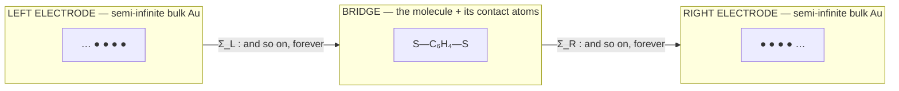
```mermaid
flowchart LR
    subgraph L["LEFT ELECTRODE — semi-infinite bulk Au"]
        direction LR
        LI["… ● ● ● ●"]
    end
    subgraph D["BRIDGE — the molecule + its contact atoms"]
        DI["S—C₆H₄—S"]
    end
    subgraph R["RIGHT ELECTRODE — semi-infinite bulk Au"]
        direction LR
        RI["● ● ● ● …"]
    end
    L -->|"Σ_L : and so on, forever"| D
    D -->|"Σ_R : and so on, forever"| R
```

The trick is not to simulate infinite wire. You compute a small piece of
**pure bulk gold** once, and from it build a mathematical object — the
**self-energy** Σ — which says *"past this edge, more of the same, forever."*
The junction is then solved as a finite problem with two Σ attached.

That is why the workflow is five stages and not one.

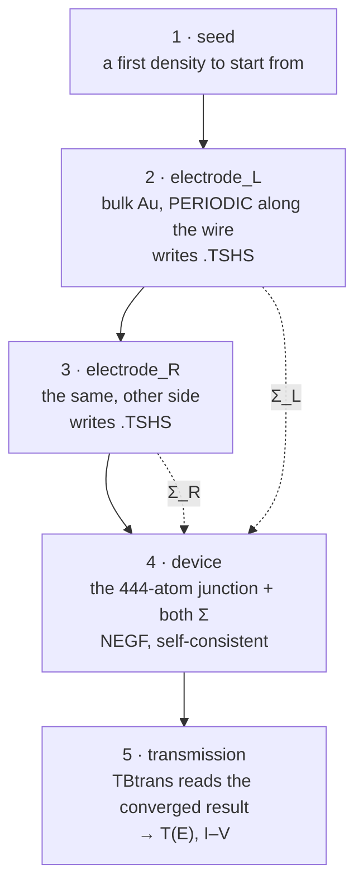
```mermaid
flowchart TD
    S1["1 · seed<br/>a first density to start from"]
    S2["2 · electrode_L<br/>bulk Au, PERIODIC along the wire<br/>writes .TSHS"]
    S3["3 · electrode_R<br/>the same, other side<br/>writes .TSHS"]
    S4["4 · device<br/>the 444-atom junction + both Σ<br/>NEGF, self-consistent"]
    S5["5 · transmission<br/>TBtrans reads the converged result<br/>→ T(E), I–V"]
    S1 --> S2 --> S3 --> S4 --> S5
    S2 -. "Σ_L" .-> S4
    S3 -. "Σ_R" .-> S4
```

**You never build a lead by hand.** You label atoms `L-electrode` /
`R-electrode` on the Molbuilder tab; stages 2 and 3 are *derived* from those
labels (§ 4). This is the design decision the rest of the feature rests on.

### 0.2 The k-grids — three axes, and only one of them is shared

**This is the part that reads as a contradiction until you separate the
axes.** A junction has three directions and they are not alike:

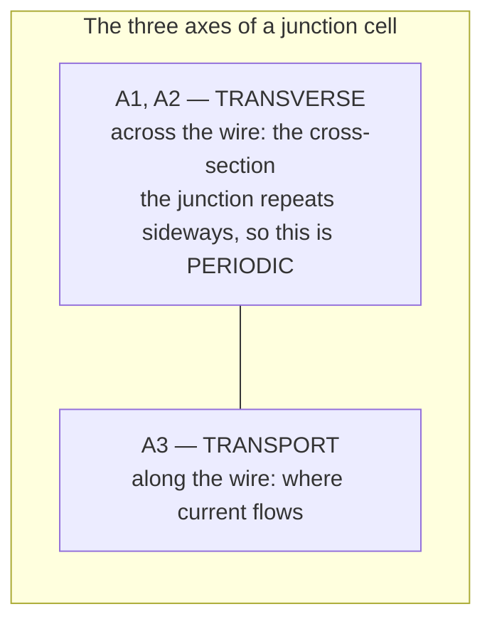
```mermaid
flowchart TB
    subgraph AX["The three axes of a junction cell"]
        direction TB
        T["A1, A2 — TRANSVERSE<br/>across the wire: the cross-section<br/>the junction repeats sideways, so this is PERIODIC"]
        Z["A3 — TRANSPORT<br/>along the wire: where current flows"]
    end
    T --- Z
```

Now the two rules that sounded like they fought each other:

| | **A1, A2 — transverse** | **A3 — transport** |
|---|---|---|
| **device** (stage 4) | periodic → needs k-points, e.g. `4 4` | **`kz = 1`**, always — fixed, never a choice ([`siesta.md`](?doc=engines/siesta.md) § 6.1) |
| **electrode** (stages 2–3) | periodic → **the same `4 4`** | **dense** — molbuilder's default is `40`. It really is infinite bulk |

They are opposite values **on different axes**, not conflicting values on the
same one. And molbuilder does exactly this, in one place: each rung's mesh is
worked out by `kmesh.mesh_for` ([`siesta.md`](?doc=engines/siesta.md) § 6.1) —
the transverse pair is the one shared `kgrid`, the device's transport axis is
1, and a lead's is its own `electrode_kz`.

**Why `kz = 1` on the device.** `kz = 3` would tell SIESTA the junction tiles
along the wire — molecule, gold, molecule, gold, forever. You would be
computing a *crystal of molecules*, not one molecule between two contacts.
The result would look like a transmission and would not be one. Σ is what
represents the beyond; a `kz > 1` imposes a second, fake periodicity on top
of it.

**Why `kz` must be dense on the electrode.** The lead's `kz` is an
**integral** — it is summed over to build Σ. A thin lead cell has a large
1-D Brillouin zone, so too few points means the "bulk gold" you computed is
not converged bulk gold, and Σ describes subtly the wrong metal.  molbuilder
defaults it to **40**, warns below 20 and refuses 1.

### 0.3 "Once Σ is computed, why does k still matter?"

Because **Σ is not one matrix. It is one matrix per transverse k-point.**

The lead's `kz` is integrated away and never appears again. The transverse
k is *not* integrated away — it survives as a label:

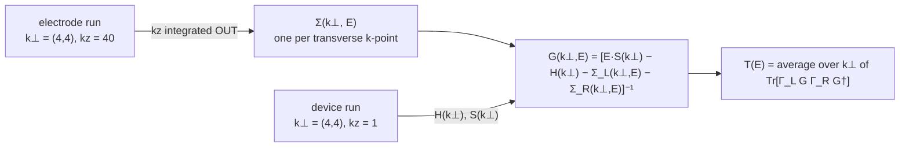
```mermaid
flowchart LR
    E["electrode run<br/>k⊥ = (4,4), kz = 40"] -->|"kz integrated OUT"| SE["Σ(k⊥, E)<br/>one per transverse k-point"]
    SE --> G["G(k⊥,E) = [E·S(k⊥) − H(k⊥) − Σ_L(k⊥,E) − Σ_R(k⊥,E)]⁻¹"]
    DEV["device run<br/>k⊥ = (4,4), kz = 1"] -->|"H(k⊥), S(k⊥)"| G
    G --> TK["T(E) = average over k⊥ of Tr[Γ_L G Γ_R G†]"]
```

So the transverse grid must **match** because `Σ(k⊥)` has to be paired with
the device's `H(k⊥)` **at the same k⊥**. A Σ computed at (4,4) has nothing to
attach to in a device solved at (6,6) — there is no k-point in common to
build `G` at.

**And then there is a third grid, which surprises people.** TBtrans averages
`T(E)` over transverse k as well, and *it may use a different, denser grid*
(`TBT.k`, § 3.4.2's transmission row). That is legal because `H` and `Σ` are stored in **real
space** in the `.TSHS`/`.HSX` files, so tbtrans can evaluate them at any k⊥
it likes. And it is usually *necessary*, because the two grids are converging
different things:

| grid | converges | typical |
|---|---|---|
| the SCF's `k⊥` | the **density** — a smooth integral | `4 4 1` |
| TBtrans's `TBT.k` | **T(E)** — sharp resonances in k⊥ | `12 12 1` or more |

A grid fine enough for the density is routinely far too coarse for the
transmission. **`TBT.k` defaults to inheriting the SCF's** — which is why
`T(E_F)` against `TBT.k` is the standard convergence study, and why not being
able to set it was the largest gap in this tab until 2026-09-15. *(And setting
it has changed nothing since: the deck wrote it as a bare triple, which
`tbtrans` skips for the SCF's grid — read in its source, § 6.1b. Written as a
list from M5 step 1.)*

*(A denser `TBT.k` cannot rescue a device SCF whose own `k⊥` was too coarse:
that `H` is simply wrong, and evaluating a wrong `H` at more k-points does
not improve it. Converge the SCF first, then the transmission.)*

### 0.3a The grid's offset — where the samples sit *(user, 2026-09-29)*

`kgrid_displacement` shifts the k-point grid off Γ, one value per axis, in
units of one grid spacing: `0` is Γ-centred, `0.5` the classic
Monkhorst–Pack shift. In a transport calculation it acts on one kind of axis
only, and its value is one fact for the whole ladder.

**Along the transport axis it does nothing.** The leads' self-energies
replace the k-sum along A3, so both engines force a single k-point there with
zero offset whatever the deck says — TranSIESTA in `ts_kpoint_scf.F90`
(`process_k_cell_displ`), `tbtrans` in `m_tbt_kpoint.F90` (the transport
index's `displ` set to 0).

**Across it, the offset chooses where T(E) is sampled.** T(E) is the average
of T(E, k⊥) over the transverse grid (§ 0.3), and the offset only moves those
samples. At `0` the grid contains Γ. At `0.5` every sample moves half a
spacing: on an **even** count that skips both Γ and the zone edge — the
Monkhorst–Pack grid — and on an **odd** count it trades Γ for the zone edge.
The even-or-odd rule is about the **number of k-points** along the axis, never
the number of atoms in the cell.

**Where the atom count does enter: a supercell folds points onto Γ.** An
in-plane supercell of n×n primitive cells folds the primitive cell's zone
points onto its own Γ — the 3×3 Au(111) cell of the acceptance ladder (TD8)
folds the primitive K point there — so Γ carries degenerate folded states.
That is not a numerical hazard for NEGF: the Green's function at Γ is as
well-defined as anywhere, the broadening takes care of degeneracies, and the
device region is not filled level by level. It matters for a material with a
special point there — graphene's Dirac point lands on Γ in a 3n×3n cell, so
whether a coarse grid contains Γ moves T near E_F a great deal. Converge the
transverse grid until T(E) and G stop changing; for gold it is benign.

**On a hexagonal cell, keep it Γ-centred.** An offset of `0.5` does not respect
a hexagonal lattice's six-fold symmetry, so the samples fall lopsided. SIESTA
folds only k with −k (`find_kgrid.F`; no spatial symmetry is used), so nothing
is computed wrong — the sampling is less balanced and converges more slowly.
The usual choice for a hexagonal cell, an Au(111) junction among them, is `0`.

**One offset for every rung — and the engine checks it.** TranSIESTA compares
each lead's grid and offset, read from its `.TSHS`, with the device's and stops
on *"found incompatible k-grids"* (`ts_electrode.F90`, the
`TS.Elec.<>.check-kgrid` option, on by default); the manual asks for the same
parameters in the electrode and the device calculations except the lead's own
count along its semi-infinite axis. `tbtrans` takes `TBT.k` as a list —
`TBT.k [3 3 1]`, counts only, no offset — or as a block, which carries one
(`m_tbt_kpoint.F90`, `read_kgrid`).

**What molbuilder does** *(ruled 2026-09-29, plan § 5w K17; built 2026-09-30
with the k-point mesh, K3)*. The offset is a `citation` item: `jobset init`
carries the cited run's offset into the template beside its grid — from the
cited deck's own block, or the recorded contract's `kgrid_displacement` — and
every rung writes it through the one writer
([`siesta.md`](?doc=engines/siesta.md) § 6.1), the transport axis `0` as both
engines use it, with the transmission's `TBT.k` always in its block form,
which carries it. *(Until then no transport deck honoured it: every rung wrote
`0.0` and the template took `[0, 0, 0]` whatever the relaxation ran. The
acceptance ladder relaxed at `0`, so it matched by coincidence.)*

### 0.4 The four things that must agree, and where each is enforced

Every one of these, if wrong, gives a **plausible-looking wrong answer**
rather than a crash — which is why they are guards in code and not advice.

| # | must be true | enforced where | on the composite path? |
|---|---|---|---|
| 1 | device `kz = 1` | **fixed**: the rung's mesh writes 1 (`kmesh.mesh_for`), the form draws the component locked, and every door refuses another value (`kmesh.fixed` through `template.why_not`, [`siesta.md`](?doc=engines/siesta.md) § 6.1) *(an error in `validation._validate_transport_kind`, the kind's validator, from 2026-09-16 until 2026-09-30, beside a warning about the same axis in the SIESTA validator)* | ✅ on every door. *(Named `TransiestaEngine.preflight` here until 2026-09-16; that one was keyed on `TransportConfig` in `_ENGINE_VALIDATORS` while every rung resolved a `SiestaConfig`, so it dispatched for nothing — deleted 2026-09-17, the class 2026-10-02. Its OTHER checks — region contiguity, the region partition — went silent with it: see § 3.6a. The open-shell question is the electronic state's, asked on every rung since 2026-09-28.)* |
| 2 | electrode `kz` dense | default **40**, a catalogue row (`electrode_kz`) a lead's mesh reads | ✅ **held** — the value reaches the deck (measured: the lead renders `0 0 40`), it is editable in the template, and it is refused at 1 by its own limit (`above`) and warned below 20 by its range, on every door ([`siesta.md`](?doc=engines/siesta.md) § 6.1; `_validate_transport_kind` held both from 2026-09-17 until 2026-09-30). *This row said the warn "still lives only in the standalone `molbuilder transport preflight` verb, so a composite run never sees it" — true when written, and left standing for several hours after the re-homing that fixed it.*
| 3 | transverse k identical in lead and device | one shared `kgrid`, and every rung's mesh reads it (`kmesh.mesh_for`) — TranSIESTA itself stops on *"found incompatible k-grids"* | ✅ by construction |
| 3a | the junction is neutral | **error**, the electronic state's family (`validation/chemistry.py`, ES7) — and a cited run that carried a charge is refused at `init` — the boundaries are open, so the electron count is the electrodes' to set, and a lead must stay neutral or the Fermi level every stage is measured against moves | ✅ on every prep, since 2026-09-16 (§ 2a.7's deferral, declared on the row and enforced at the gate) |
| 4 | basis, XC and mesh identical | ONE value shared by every stage, so they cannot disagree. *(Until 2026-09-16 this read **sealed** — taken from the cited run and uneditable. Superseded by § 2a.7: the cited run DEFAULTS them and the person may change them, everywhere at once. The invariant is unchanged; only its enforcement moves from inherited to single.)* | ✅ |

> **Corrected 2026-09-15.** This table said all four were guards in code. Row 2
> is not, on the path that matters: the check exists and nothing on the
> describe / prep / launch path calls it. Stated here rather than quietly fixed
> because the difference between *"a guard exists"* and *"a guard fires on your
> run"* is the whole value of the column.

Number 4 is why the tab makes you **cite a finished relaxation** instead of
typing a basis: the numbers arrive from that run's deck, so they cannot
disagree with what the leads were computed with. The manual is blunt that
TranSIESTA expects a *metallic* electrode and that fixing the boundary is
"an intricate and important" matter.

### 0.5 Worked example — the Au–BDT–Au junction in this repo

`projects/Au-BDT-Au/transport/AuBDTAu-CT`, cited from a CONCLUDED relaxation:

| | |
|---|---|
| structure | 444 atoms — 432 Au, one benzene-1,4-dithiol bridge |
| labels | `L-electrode` (low z) · `BRIDGE` · `R-electrode` (high z) |
| contract, from the citation | DZP · GGA-PBE · 300 Ry mesh |
| device k | `2 2 1` — transverse 2×2, **transport 1** |
| electrode k | `2 2 40` — the same 2×2, **transport dense** (the wizard's default) |
| bias | `0.0` → equilibrium, so the non-equilibrium contour settings are inert |
| what prep writes | `01_seed` … `05_transmission`, **a deck each plus its `.validation.txt`** — every rung goes through `spec_for` → `DeckSpec` → `prepare_deck`, so the validate → render → read-back-check → report chain is the same one every other kind gets (§ 2a.14). *(This row said the opposite, describing a `write_text` arm deleted on 2026-09-16.)* |
| the deliverable | `<label>.transport.json` — T(E) per bias, G(E_F), the I–V table |

## 1. The mental model — one citation → five derived stages

Conductance is **not one run**. It is several coupled SIESTA runs that must
agree numerically — a relaxed junction, a bulk-electrode run per lead that
emits a `.TSHS`, the NEGF device SCF, and the TBtrans transmission.
Correctness hinges on those runs sharing **one numerical contract** (XC,
basis, mesh, pseudopotentials) **and a geometric clone** of the electrode.

Since 2026-08-29 that agreement is not checked after the fact — it is
**impossible to break by construction**: transport is the COMPOSITE
calculation (`archive/2026-09-01-transport-design.md`). You relax the junction as an
ordinary task (outer metal layers labeled `L-electrode`/`R-electrode` and
frozen), then the transport calculation **cites that finished attempt** and
derives everything else — the sorted copy, both electrode cells (extracted
from the labeled blocks), and the five stage decks, all rendered from the
cited attempt's own `.fdf`.

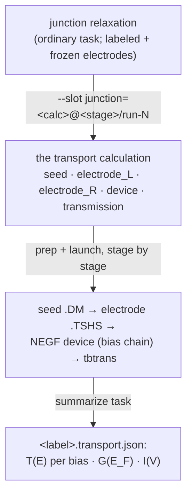
```mermaid
flowchart TD
    RX["junction relaxation<br/>(ordinary task; labeled + frozen electrodes)"]
    RX -->|"--slot junction=&lt;calc&gt;@&lt;stage&gt;/run-N"| CT["the transport calculation<br/>seed · electrode_L · electrode_R · device · transmission"]
    CT -->|"prep + launch, stage by stage"| RUN["seed .DM → electrode .TSHS →<br/>NEGF device (bias chain) → tbtrans"]
    RUN -->|"summarize task"| RES["&lt;label&gt;.transport.json:<br/>T(E) per bias · G(E_F) · I(V)"]
```

**The consistency contract is the whole game**, and the derivation is what
enforces it: electrode and device render from ONE config filled from the
citation's deck, so a mismatch is unrepresentable (§ 5 records what that
guarantees, and what holds each rule).

### 1.1 The procedure, end to end — from the relaxation to the current *(user, 2026-10-05)*

*The whole calculation in order, on one page: what each step computes, the
science that makes it necessary, the equation it solves, and what it hands to
the next. Each step names the sections that own its rules; this page restates
them, and where it could disagree with one, that section is the rule.*

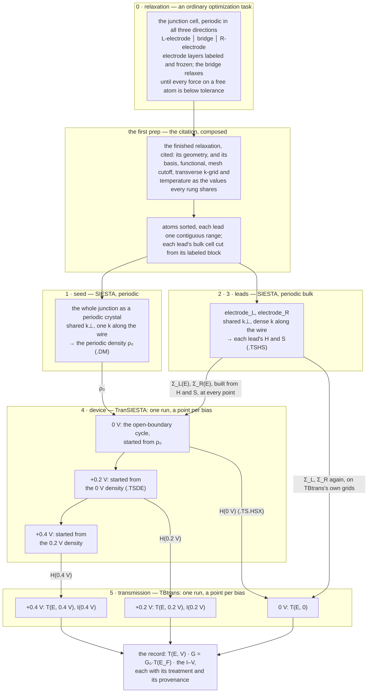
```mermaid
flowchart TD
    subgraph S0["0 · relaxation — an ordinary optimization task"]
        RX["the junction cell, periodic in all three directions<br/>L-electrode │ bridge │ R-electrode<br/>electrode layers labeled and frozen; the bridge relaxes<br/>until every force on a free atom is below tolerance"]
    end
    subgraph SP["the first prep — the citation, composed"]
        CI["the finished relaxation, cited: its geometry, and its<br/>basis, functional, mesh cutoff, transverse k-grid and<br/>temperature as the values every rung shares"]
        SO["atoms sorted, each lead one contiguous range;<br/>each lead's bulk cell cut from its labeled block"]
        CI --> SO
    end
    subgraph S1["1 · seed — SIESTA, periodic"]
        SD["the whole junction as a periodic crystal<br/>shared k⊥, one k along the wire<br/>→ the periodic density ρ₀ (.DM)"]
    end
    subgraph S23["2 · 3 · leads — SIESTA, periodic bulk"]
        EL["electrode_L, electrode_R<br/>shared k⊥, dense k along the wire<br/>→ each lead's H and S (.TSHS)"]
    end
    subgraph S4["4 · device — TranSIESTA: one run, a point per bias"]
        V0["0 V: the open-boundary cycle,<br/>started from ρ₀"]
        V1["+0.2 V: started from<br/>the 0 V density (.TSDE)"]
        V2["+0.4 V: started from<br/>the 0.2 V density"]
        V0 --> V1 --> V2
    end
    subgraph S5["5 · transmission — TBtrans: one run, a point per bias"]
        T0["0 V: T(E, 0)"]
        T1["+0.2 V: T(E, 0.2 V), I(0.2 V)"]
        T2["+0.4 V: T(E, 0.4 V), I(0.4 V)"]
    end
    RX --> CI
    SO --> SD
    SO --> EL
    SD -->|"ρ₀"| V0
    EL -->|"Σ_L(E), Σ_R(E), built from H and S, at every point"| V0
    V0 -->|"H(0 V) (.TS.HSX)"| T0
    V1 -->|"H(0.2 V)"| T1
    V2 -->|"H(0.4 V)"| T2
    EL -->|"Σ_L, Σ_R again, on TBtrans's own grids"| T0
    T0 --> REC["the record: T(E, V) · G = G₀·T(E_F) · the I–V,<br/>each with its treatment and its provenance"]
    T1 --> REC
    T2 --> REC
```

#### Step 0 — relax the junction *(an ordinary optimization task; § 3.1, § 2a.9, § 7.1)*

The junction is built and relaxed as any structure is. Its cell holds the two
electrode blocks — several layers of the metal, stacked as in the bulk crystal
(§ 7.1) — and the bridge between them: the molecule and its contact atoms. The
cell is periodic in all three directions: across the wire because the junction
repeats sideways, along it because the two electrode blocks continue into each
other through the cell's boundary, one bulk layer spacing apart (I12). The
electrode layers are labeled `L-electrode` and `R-electrode` and frozen; the
bridge relaxes, SIESTA moving the free atoms down the total energy until every
force

```
F_i = −∂E_total/∂R_i
```

is below the tolerance. The electrode layers are frozen because they stand for
bulk metal: the lead calculations replace everything beyond them by the bulk
crystal, so they must be exactly that crystal (§ 2a.9, *the electrodes do not
move*).

What this run decides for every rung after it: the geometry, and — as defaults
the person may change, one value for all five rungs — the basis, the
functional, the mesh cutoff, the transverse k-grid and the electronic
temperature (§ 2a.7, § 3.1). One value for all five is what makes the leads and
the device two pieces of one calculation rather than two calculations that
look alike (§ 0.4, § 5).

#### The first prep — the citation, composed *(§ 3.1, § 4, § 6.2)*

The transport calculation cites the finished relaxation, and its first prep
composes it once: the atoms sorted so each lead is one contiguous range — how
TranSIESTA identifies an electrode (§ 2a.14) — and each lead's bulk cell cut
from its labeled block, its cross-section the junction's (I6) and its period
along the wire the crystal's own repeat (§ 7.1). Nothing about a lead is typed
by a person: it is derived from the labels (§ 4).

#### Step 1 — the seed: the periodic density *(SIESTA; § 6.1, § 2a.15)*

An ordinary Kohn–Sham self-consistent cycle on the whole junction, treated as
a periodic crystal — the shared transverse k-grid, one k-point along the wire:

```
H[ρ] ψ_nk = ε_nk S ψ_nk          ρ = Σ_k w_k Σ_n f(ε_nk − E_F) |ψ_nk⟩⟨ψ_nk|
```

solved until ρ stops changing; it writes the density matrix, `.DM`. That
density is not part of the answer: it is where the device's 0 V cycle starts —
the manual's own procedure, which starts the open-boundary cycle *"from a fully
periodic calculation"* and calls the 0 V point *"the only calculation where you
start from SIESTA"*. A good start is worth a run of its own, because the
open-boundary cycle is the expensive one.

#### Steps 2 and 3 — the leads: each one's H, S and self-energy *(SIESTA; § 0.2, § 0.3, § 5)*

Each lead's cell is bulk metal, periodic in all three directions — and here the
wire's direction really is periodic, the lead being infinite, so it is sampled
densely along it (`electrode_kz`, 40 by default, I9) with the device's
transverse grid (I7). The cycle is an ordinary one; what the device needs from
it is not its density but its Hamiltonian H and overlap S, written in real
space (`.TSHS`, `TS.HS.Save`, I13). From them TranSIESTA builds each lead's
**self-energy** — what the semi-infinite rest of the lead does to the
electrode block it is attached to (the manual: *"the electrode self-energy is
calculated from the bulk electrode calculation"*):

```
Σ_L(E, k⊥) = (z·S₁₀ − H₁₀) · g_L(E, k⊥) · (z·S₀₁ − H₀₁),        z = E + iη
```

where H₀₁ and S₀₁ couple one lead cell to the next and g_L is the surface
Green's function of the semi-infinite lead. Its anti-Hermitian part is the
lead's **broadening** — how fast an electron in the junction leaks into it:

```
Γ_L(E) = i [ Σ_L(E) − Σ_L(E)† ]
```

Σ is one matrix per transverse k-point, which is why the lead's transverse
grid must be the device's (§ 0.3); its k along the wire is summed away in
building it, which is why that sampling must be dense. The lead must be at
least a principal layer thick — Σ assumes a lead cell couples only to its
neighbours (I11) — and its cell is the device's electrode block atom for atom,
so Σ attaches where it belongs (I10).

#### Step 4 — the device: the open-boundary cycle, at each bias *(TranSIESTA; § 2, § 4, § 6.1c, § 2a.11)*

The device is the whole junction again, but open along the wire: the two leads
enter only through their self-energies, so there is one k-point along it (I8),
and its electrons are found from the Green's function instead of from
eigenstates — the manual's NEGF equation:

```
G(z) = [ z·S − H[ρ] − Σ_L(z) − Σ_R(z) ]⁻¹
```

**The bias** is the difference of the leads' chemical potentials: the left lead
is filled to μ_L = E_F + eV/2, the right to μ_R = E_F − eV/2 (§ 4, *bias
direction*; `TS.Voltage` is *"the actual potential drop between the
electrodes"*). The electrostatic potential carries the same drop: TranSIESTA
superimposes a linear ramp across the cell on the solution of the Poisson
equation (`TS.Poisson`, *ramp*, the default for two aligned leads), so the
Hartree potential in H[ρ] holds each lead at its own level.

**The density, from the Green's function.** With the leads filled to different
levels the density has two parts (Brandbyge 2002; Papior 2017), at each
transverse k-point, summed over the grid:

```
ρ = −(1/π) Im ∫ G(E) f(E − μ_R) dE  +  (1/2π) ∫ G(E) Γ_L(E) G†(E) [ f(E − μ_L) − f(E − μ_R) ] dE
      as if in equilibrium with R          what the left lead adds, in the bias window only
```

The first part is an equilibrium integral, and the Green's function is smooth
away from the real axis, so it is taken on a contour in the complex plane,
picking up the poles of the Fermi function on the way: the contour's lower
bound must lie *"well below the lowest eigenvalue"* (the manual), and the pole
energy and the count it gives are § 6.1c's. The second part is non-zero only
in the bias window, where f_L ≠ f_R, and must be taken on the real axis, close
to the poles of G, with a fine grid and a small broadening η. TranSIESTA
computes ρ both ways round — referenced to R as written, and to L — and weighs
the two element by element, leaning on the one whose bias-window part is
smaller, since that part carries the larger error (`TS.Weight.Method`;
Brandbyge 2002). At 0 V the window is empty and only the contour part
remains.

**The cycle**, at one point:

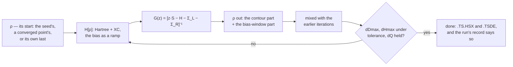
```mermaid
flowchart LR
    R0["ρ — its start: the seed's,<br/>a converged point's,<br/>or its own last"] --> H["H[ρ]: Hartree + XC,<br/>the bias as a ramp"]
    H --> G["G(z) = [z·S − H − Σ_L − Σ_R]⁻¹"]
    G --> RHO["ρ out: the contour part<br/>+ the bias-window part"]
    RHO --> MIX["mixed with the<br/>earlier iterations"]
    MIX --> C{"dDmax, dHmax under<br/>tolerance, dQ held?"}
    C -->|"no"| H
    C -->|"yes"| OUT["done: .TS.HSX and .TSDE,<br/>and the run's record says so"]
```

H is rebuilt from the new ρ, mixed with the earlier
iterations, and the cycle repeats until the density and the Hamiltonian stop
changing (`dDmax`, `dHmax` under their tolerances) and the charge in the cell is
held: the manual asks that `dQ`, the charge not accounted for, stay a very small
fraction of the total — under 0.1 % at 0 V — or the electrode layers are too
few to screen the junction ([`model/parse.md`](?doc=model/parse.md) § 5d.6
watches all three). A converged point leaves:

- `.TS.HSX` — its converged H(V) and S, which the transmission reads;
- `.TSDE` — its converged density and energy-density matrices, which the next
  bias point starts from.

Its total energy is not part of the answer: *"energies from TranSIESTA are not
to be trusted"*, the manual warns, the open boundaries complicating the energy,
so energies are not compared across biases or calculations. The deliverable is
T, G and I.

**The sweep** (§ 2a.11) is one run, its points walked in order from 0 V. The
0 V point starts from the seed's ρ₀; each later point from the converged
density of the closest bias before it — the manual's advice: *"copy the TSDE
from the closest, previously, calculated bias for restart and much faster
convergence"*. Small steps keep each start close to its answer and, on a
junction with more than one self-consistent solution, keep the sweep on the
one continuous with equilibrium. A point is done or not done; launched again,
the sweep's next run takes the done points over and runs the rest, or with
`--cold` runs every point (§ 2a.11).

#### Step 5 — the transmission and the current *(TBtrans; § 0.3, § 2a.10, § 2a.12, § 6.1b)*

TBtrans runs no self-consistent cycle. At each bias point it reads that point's
converged H(V) and S and both leads' H and S, rebuilds Σ_L and Σ_R on its own
energy grid (the window, `TBT.Contour.window`) and its own transverse grid
(`TBT.k`, usually denser than the cycle's — § 0.3), and evaluates the
transmission:

```
T(E, V) = Σ_k⊥ w_k⊥ Tr[ Γ_L(E, k⊥) G(E, k⊥) Γ_R(E, k⊥) G†(E, k⊥) ]        (the weights w_k⊥ sum to 1)
```

— the probability that an electron of energy E arriving from one lead crosses
into the other, summed over the channels. From it, the current at that bias
(Landauer–Büttiker):

```
I(V) = (2e/h) ∫ T(E, V) [ f(E − μ_L) − f(E − μ_R) ] dE            spin-degenerate: both channels
I(V) = (e/h) Σ_σ ∫ T_σ(E, V) [ f(E − μ_L) − f(E − μ_R) ] dE       spin-polarized: each channel its own
```

Only energies in the bias window — between μ_R and μ_L, widened by a few k_BT —
contribute, so the transmission window must cover it for the current to be
whole. TBtrans prints one spin channel's current; the record's is the
junction's total (§ 2a.12). At zero bias the window closes, and the observable
is the **conductance**:

```
G = G₀ · T(E_F),     G₀ = 2e²/h ≈ 77.5 µS          per channel when polarized: (e²/h)·(T↑ + T↓)
```

**The two treatments** (§ 2a.10). With **`low_bias_approximation: true`** the
device and the transmission run once, at 0 V, and the record computes the I–V
from that one slice — the **linear-response** approximation, the zero-bias
transmission held fixed as the window opens:

```
I(V) ≈ (2e/h) ∫ T(E, 0) [ f(E − μ_L) − f(E − μ_R) ] dE
```

sound while eV/2 is small against the distance from E_F to the nearest
resonance. With **`low_bias_approximation: false`**, every voltage gets its own
device SCF and its own T(E, V), and each I(V) is TBtrans's integral over its own
window, with no approximation beyond the method; the transmission takes the
device's sweep run whole, each point its own point's H (§ 2a.11).

#### The record — what is read back *(`summarize task`; § 2a.12)*

`summarize task` composes `<label>.transport.json` from the rungs' records: T(E,
V) per point and spin channel; T(E_F) and the conductance, the E_F reference
checked; the I–V, its treatment named and its current the junction's total; the
DOS and eigenchannels TBtrans was asked for; and the provenance — which
relaxation, which lead runs, which device run, and what each point started
from. And the caveat that goes with any DFT-NEGF conductance: plain GGA puts the
molecule's levels too close to E_F and overestimates a molecular junction's
conductance, often by one to two orders of magnitude (§ 2).

**What it holds today** *(2026-10-07)*: each rung's state and detail — the one
status door's, as `jobset status` and the ladder say it — with a rung's SCF as
it ran (every row of its last step, phase-tagged, the criteria each phase had to
reach), a seed's and a device's energy and SCF convergence, the device's NEGF
phase's own E_F, charge and cycles, and each lead's E_F; per bias point T(E),
T(E_F), the conductance and the current (total and as printed), and from the
point's `.TBT.nc` (read with sisl, `transport/tbtnc.py`) the device DOS, its
PDOS by region, the leads' spectral and bulk DOS and the transmission
eigenchannels; the points without a transmission as `pending` or `failed` in
their run's words; the treatment; the provenance slot and the chain — each
rung's `.gathered-from`; the DFT-NEGF caveat. The PDOS of any atoms, by orbital
type, is asked of `/api/transport/pdos`. The Results tab composes the record on
read (`/api/transport/record`); `summarize task` writes the same composition to
the file. **Not yet**: the E_F reference checked rather than assumed (plan
§ 5u.1 step 9). The `.TBT.nc` reader was checked on a real run's file — the
carbon-chain walk, 2026-10-07 (`web/results.md` § 2.5).

---

## 2. The physics in one page

A junction is an **open-boundary** problem: a finite scattering region C between
two semi-infinite leads L, R extending to ±∞ along the transport axis (z). The
leads enter C only through **self-energies** Σ_{L,R}(E), built from the *pristine
bulk* lead H/S — the device Green's function is
`G(E) = [E·S_C − H_C − Σ_L − Σ_R]⁻¹` and the transmission is
`T(E) = Tr[Γ_L G Γ_R G†]`, where Γ_{L,R} = i(Σ − Σ†) are the leads' **broadening
matrices** (how strongly each lead couples to the device). That gives
`G = G₀·T(E_F)` [Brandbyge 2002; Papior 2017].

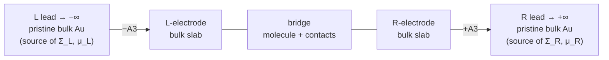
```mermaid
flowchart LR
    LL["L lead → −∞<br/>pristine bulk Au<br/>(source of Σ_L, μ_L)"] -->|"−A3"| LE["L-electrode<br/>bulk slab"]
    LE --- BR["bridge<br/>molecule + contacts"]
    BR --- RE["R-electrode<br/>bulk slab"]
    RE -->|"+A3"| RR["R lead → +∞<br/>pristine bulk Au<br/>(source of Σ_R, μ_R)"]
```

The three boxed regions in the middle — `L-electrode | bridge | R-electrode` (the
§ 4 partition) — are *one* SIESTA cell. The semi-infinite leads on either side are
**not** atoms in that cell; they enter only as the self-energies Σ, computed from a
*separate* bulk-lead run, and each carries a chemical potential μ. `±A3` marks the
direction the lead extends (the third lattice vector).

Three consequences drive **every** parameter choice:

1. **Σ comes from a separate, pristine bulk-lead run** — *not* from frozen atoms
   in the device (frozen is only a geometry constraint). Hence **three runs**.
2. **The transport direction is open** → the device k-grid has **`kz = 1`**. Any
   `kz > 1` re-imposes Bloch periodicity along the wire and destroys the transport
   physics.
3. **Geometry fixes the physical model; the k-grid only sets integration
   accuracy.** Adding lateral vacuum makes a *cluster* (a different Hamiltonian); a
   denser k-grid of the *same* geometry just integrates it better.

> **Honest caveat (report it, don't hide it).** Plain LDA/GGA-DFT+NEGF
> **systematically overestimates** single-molecule conductance by ~1–2 orders of
> magnitude — the DFT **HOMO–LUMO gap** (the spacing between the molecule's highest
> filled and lowest empty orbital) comes out too small, so level alignment to `E_F`
> is off. For Au–BDT, experiment is ≈ **0.011 G₀** [Xiao 2004] while GGA-NEGF
> commonly gives ~0.1–0.4 G₀. The contract here gives a *numerically correct*
> GGA-NEGF result; closing the gap to experiment needs beyond-DFT corrections
> (**scissors / DFT+Σ** — rigidly shifting the DFT levels, or adding a self-energy
> correction — or hybrid functionals). molbuilder's job is to surface this caveat
> honestly rather than imply DFT-NEGF == experiment; the results layer that will
> carry the flag is still landing (§ 8).

---

## 2a. The parameter map

> **Status: agreed and largely BUILT** *(2026-09-16)*. Every ruling this section
> asks for has been made (§ 2a.7), and the parameter model it describes is now
> what the code does: transport has a template, every rung renders through the
> framework's seam, and the classes are declarations the catalogue carries
> rather than prose. § 2a.14 records what landed and what has not, measured.
>
> It is written here, beside the physics it follows from, because that is what
> it is derived from — not from what the code happens to do. Two items are
> deliberately deferred rather than decided: net charge and gating.

### 2a.1 Why the map is derived rather than assembled

§ 2 says what the calculation is; § 1 says it is five stages. What has never
been written down is **which stage owns which decision** — and the cost of that
omission is not abstract. A parameter surface assembled from whatever happened
to be configurable produces a form organised by subject matter, where a control
tells you *what it is* but not *which run it changes*, and where nothing says
whether a value you set in one place silently governs three other runs.

So the map is derived from the dependency graph, top down:

> **A parameter is decided at the earliest stage whose physics determines it,
> and is binding on every stage downstream of it.**

That is not a convention chosen for tidiness. It is forced: if stage N's result
is consumed by stage M, then anything that shaped N's result must be honoured by
M, or M is built on something it did not agree to.

### 2a.2 The three questions every parameter answers

The classes in § 2a.3 are shorthands for recurring combinations of these three.
The questions are the model; the classes are the vocabulary.

1. **Who decides it?** The *person* (a scientific or economic judgement), the
   *stage's role* (not a choice at all — changing it stops the stage being that
   stage), or the *machine* (the scheduler's answer).
2. **Where is it decided, and what does it bind?** Its deciding stage, and the
   set of stages downstream that must obey it.
3. **How strongly can consistency be guaranteed?** — § 2a.4.

### 2a.3 The classes

**Class A — Shared.** *Decided once for the calculation, binds every stage —
and, later, every frame.* Two families sit here, and they are shared for the
same reason:

* **the electronic method** — basis, energy shift, exchange-correlation, mesh
  cutoff, electronic temperature, spin treatment, the pseudopotentials, and the
  species ordering. The lead self-energy must attach to a device Hamiltonian
  built the same way;
* **the transverse Brillouin-zone sampling.** The leads and the device share one
  transverse cell by construction — the lead *is* the junction's lead region
  extended periodically — and the self-energy is built per transverse k-point
  and folded into the device at that same point. Two different grids cannot be
  combined.

The person owns every value here. What they cannot do is give one stage a
different answer from another.

> **There was a Class B, and dissolving it is a finding rather than tidying.**
> It was *"decided at the electrodes, binds the device and the transmission"* —
> and when the full map was written it had exactly **two** members, the
> transverse grid and its offset, both of which are better described as decided
> once for a cell the stages share. A class with two members that belong
> elsewhere is evidence the class does not exist. What genuinely flows from the
> leads to the device is not parameters at all — it is **results**: the lead's
> Hamiltonian, overlap and Fermi level. Those are named below.

**Class C — Stage-local.** *Decided at one stage.* How that particular run is
driven — its SCF schedule, its convergence criteria, its own integration
contours, its outputs. Two stages may legitimately differ, because a bulk lead's
SCF and an open-boundary NEGF SCF do not converge alike.

*Class C parameters bind nothing.* **The bias point**, which binds a
transmission to its own point's converged Hamiltonian and no other's, is
Class D since 2026-09-29 (§ 2a.10): the description's list fixes it, and each
rung writes the point it runs. Binding scope is a property of a parameter, not
of its class.

**Class D — Role-fixed.** *Nobody decides.* The facts that constitute the
stage: which solver it runs, that a lead samples its transport axis and a device
does not, that a lead writes the Hamiltonian the device will read, the bias
point each rung runs — one point of the description's list (§ 2a.10). These are
the identity of the stage, not settings on it, and exposing them as controls
would offer a choice that only has one correct answer. *(So are, on every SIESTA
run of every kind, the per-step forces and coordinates molbuilder reads back —
fixed by what reads them rather than by the rung's part, `template.md` § 6.4.)*

**Class E — Machine.** *Per stage.* Cores, memory, wall time, queue. These
*should* differ across stages — the leads are small cells, the device is the
expensive rung, the transmission is nearly free — and none of them changes the
answer.

**And a category that is not parameters at all: the results that propagate.**
The lead's Fermi level and Hamiltonian, the seed's density, the device's
converged Hamiltonian. They are drawn in § 6.1 and gated in § 2a.11, because a
reader asking *"what does the next stage need from this one"* is asking about
these, not about settings.

### 2a.4 Three tiers of guarantee, because "best effort" should be specific

Not every consistency rule can be enforced, and the map should say which
treatment each one gets rather than implying a uniform safety net.

| tier | what it means | the user sees |
|---|---|---|
| **1 — structural** | the inconsistent state cannot be expressed: there is one value and it propagates by construction | nothing; there is nothing to warn about |
| **2 — checkable** | an inconsistency is detectable before anything runs | a refusal naming what disagrees and what to do |
| **3 — advisory** | the right value is not knowable in advance; it needs a convergence study | a note stating what goes wrong if it is too low, and how you would check |

**Tier 3 is where the scientifically consequential decisions live**, and that is
the honest and uncomfortable part: level alignment, contact coupling and Fermi
level resolution are all tier 3. The software cannot verify them. That is
precisely why they must be prominent in the interface rather than tucked behind
an "advanced" fold — a note there must say what is at stake and must not imply
anything has been checked.

### 2a.5 The map in one picture

Where each class enters the ladder. **Class A enters everywhere** — that is what
"shared" means, and why changing one value rebuilds all five stages. **Class C
enters one stage** and stops there. **Class D is not entered at all**: it is
what the stage *is*.

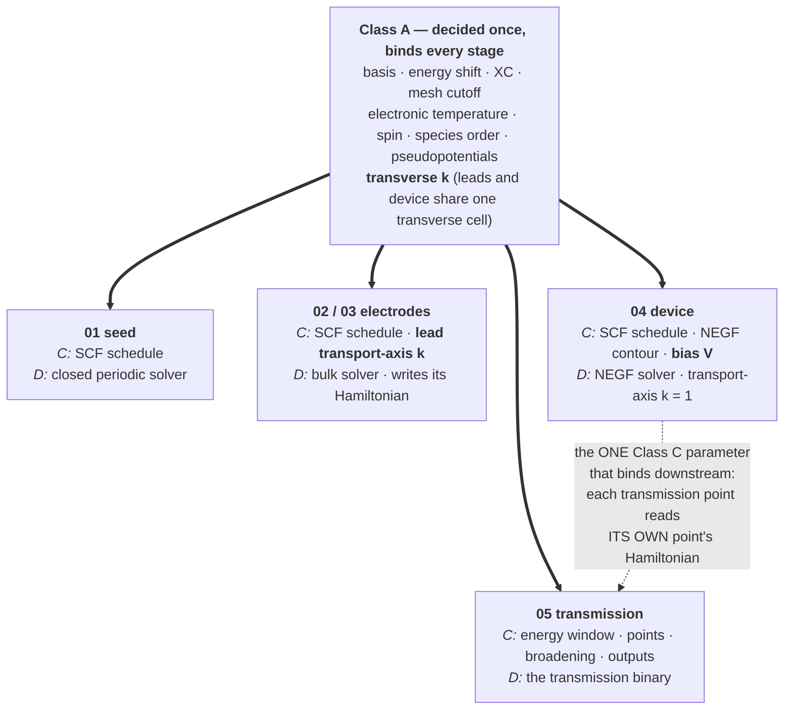
```mermaid
flowchart TB
    A["<b>Class A — decided once, binds every stage</b><br/>basis · energy shift · XC · mesh cutoff<br/>electronic temperature · spin · species order · pseudopotentials<br/><b>transverse k</b> (leads and device share one transverse cell)"]

    A ==> SEED
    A ==> EL
    A ==> DEV
    A ==> TBT

    SEED["<b>01 seed</b><br/><i>C:</i> SCF schedule<br/><i>D:</i> closed periodic solver"]
    EL["<b>02 / 03 electrodes</b><br/><i>C:</i> SCF schedule · <b>lead transport-axis k</b><br/><i>D:</i> bulk solver · writes its Hamiltonian"]
    DEV["<b>04 device</b><br/><i>C:</i> SCF schedule · NEGF contour · <b>bias V</b><br/><i>D:</i> NEGF solver · transport-axis k = 1"]
    TBT["<b>05 transmission</b><br/><i>C:</i> energy window · points · broadening · outputs<br/><i>D:</i> the transmission binary"]

    DEV -.->|"the ONE Class C parameter<br/>that binds downstream:<br/>each transmission point reads<br/>ITS OWN point's Hamiltonian"| TBT
```

**Class E is deliberately absent from the picture.** Cores, memory and wall time
attach to every stage and change no answer, so drawing them would add lines that
carry no physics.

**What flows *between* the stages is results, not parameters** — the leads'
Hamiltonians, the seed's density, the device's converged Hamiltonian. That is a
different diagram, and it is § 6.1. Keeping the two apart is the point: a reader
asking *"what do I set, and where"* and a reader asking *"what does this stage
need from the last one"* are asking different questions.

### 2a.6 What follows — blast radius, the interface, and the rulings

**The blast radius of a change** is what a person needs to know before touching
anything, and the interface should say it at the point of edit. It follows from
one rule rather than from a table to memorise:

> **Changing any parameter of a stage invalidates that stage's result — and
> therefore everything that consumes it.**

| changing a… | invalidates |
|---|---|
| **Class A** value | **every stage.** It is shared, so the leads and the device must be rebuilt together or the self-energy attaches to a Hamiltonian built differently |
| **Class C** value on a stage whose result feeds another | that stage **and its consumers**. Changing a lead's transport-axis k moves the lead's Fermi level, so the device and the transmission must follow — even though the parameter itself binds nothing downstream |
| **Class C** value on the **transmission** | **the transmission alone.** It is terminal — nothing consumes its output — which is precisely why tuning an energy window is seconds and never re-runs an NEGF cycle |
| **Class D** | not a change; it is the stage's identity |
| **Class E** value | re-runs, same answer. Old and new results stay comparable |

**Two distinctions this rule needs, and both are already in § 2a.9.**

*Parametric binding is not the same as result propagation.* The bias point is
the one parameter that must be **obeyed** downstream — a transmission point must
read its own point's Hamiltonian, and the rung fixes both to that point (Class
D since 2026-09-29). The lead's transport-axis k binds
nothing in that sense; it simply changes a **result** the device consumes. Both
force a re-run; only one is a rule about values.

*Exact consumers must re-run; approximate ones need not.* The device reads the
leads' Hamiltonians as **truth**, so a changed lead invalidates it. It reads the
seed's density only as a **starting guess**, so a changed seed — or a seed
converged on a different transverse grid — leaves the device valid, merely
started from a slightly different place. That is why changing the transverse
grid rebuilds the leads, device and transmission but does **not** require the
seed to be re-run: a density matrix is expressed over orbital pairs in real
space, not over k-points, so it stays readable and serviceable.

That asymmetry is also the argument for the transmission being its own stage:
its parameters bind nothing, so re-running it against an unchanged device is
cheap, and tuning an energy window should never re-run an NEGF cycle.

**The interface follows the map, not the subject matter.** One panel for Class
A, edited once, carrying the all-stages warning. One panel per stage for its own
Class C and Class E, with a read-only echo of what it inherits and a plain
statement of the Class D facts its role fixes. **One editing surface, many
read-only echoes**: a Class A value does not appear as an editable control
inside a stage, because editing it there would imply the device could differ
from the leads, which is the one thing that must be impossible.

### 2a.7 The rulings

*All made 2026-09-16. Together they are what turns § 2a from an argument into
a contract.*  ⚠️ *This ended "none of them is implemented", which the banner
200 lines above already contradicted.  Corrected 2026-09-23: ruling 1 (the
relaxation DEFAULTS rather than seals) is built and is what
`citation_defaults.py` does; the T(E) window, the two lead stages and the
bias treatment are built; **Class C's per-stage defaults are NOT** — § 3.6a
measures every rung taking `SiestaConfig()`'s own values, and § 2a.14's
"what did NOT land" does not list it.  The default grouping is built (the
row below).*

| | |
|---|---|
| **The relaxation DEFAULTS the Class A values; it does not seal them** | A transport calculation arrives pre-filled with the basis, functional and mesh cutoff of the relaxation it starts from, and the person **may change them** — a change applying to every stage at once. The worked case: relax with DZP because it is cheap and adequate for geometry, then move to TZP for transport because the longer orbital tails carry the metal–molecule coupling |
| **The T(E) window belongs to the transmission** | Exposed and tunable **there only**. Consequence: the device deck has no reason to carry the `TBT.*` settings at all, so the two decks legitimately differ and each carries what its own binary reads. What keeps them consistent was never byte-identity; it is the shared Class A values |
| **Class C ships per-stage defaults** | Each stage carries an opinionated profile rather than inheriting one shared set: a bulk lead's SCF and an open-boundary NEGF cycle do not converge alike, and the electrode's dense transport-axis k is a default, not something a person should have to discover |
| **Always two lead stages** | Even when the leads are provably identical. Lead runs are cheap, and two runs keep the record auditable |
| **Default grouping** | The preparatory block — seed and both leads — as one submission: `jobset prep task` offers the three pre-selected, since none builds on another, and they are prepared as one group (`--stage seed --stage electrode_L --stage electrode_R` without a terminal); `jobset launch task` sends it as one job ([`execution/project-layout.md`](?doc=execution/project-layout.md) § 1.6.6; [`execution/job-system.md`](?doc=execution/job-system.md), *The task*). Then the device; then the transmission, each scan one job walking its points. The device and the transmission never share a job: the transmission builds on the device, which you look at first |
| **A frame group runs at one bias** | § 2a.9 |
| **The bias treatment is an exposed choice** | `low_bias_approximation`, true or false, named in the interface with its advisory attached, and the deliverable labelled by how it was computed — § 2a.10 |
| **Automatic resubmission is deferred, and load-bearing on nothing** | The stages, their decks, the parameter map and the directory structure are identical whether a person launches each rung or something launches it for them. It is a convenience at the launch layer, so nothing here waits on it. When built, the monitor is its home — it already watches a run to its end. Off by default. **To verify first:** whether compute nodes may submit jobs on the target cluster; if not, the trigger lives wherever the monitor runs rather than inside the job |
| **Net charge and gating are deferred** | Not designed now. In NEGF the charge is set by the leads' chemical potentials, so for a neutral junction it is moot; a gated or electrochemical junction is separate work. How a gate is applied in SIESTA 5.x — a charge-distribution block, a scripted hook, or neither — **has not been verified against the manual** and should be before anything depends on it |

> **⚠️ The first ruling reverses Q5**, which achieved consistency by removing the
> choice. The invariant Q5 protected — *"electrode and device must stay unable to
> disagree"* — is preserved exactly, because one value shared by every stage
> cannot disagree with itself. What is withdrawn is only the claim that the value
> must come from the cited run. **Restatements of Q5 elsewhere are superseded and
> marked at each site**: § 0.4 row 4, and § 3.6 item 8. Any surface showing these
> fields as locked-because-cited is showing a rule that no longer holds.


---

### 2a.8 A worked setup — Au–BDT–Au

The map as a person would meet it. A benzene-1,4-dithiol molecule bridging two
gold electrodes, starting from a finished relaxation that ran at DZP.

> **Checked against real decks, 2026-09-16** — this was written before any of
> it was built, so it was re-run afterwards rather than left as an
> illustration. Editing the shared panel's `basis_size`, `mesh_cutoff` and
> `max_scf_iter` and preparing the rungs — anew, from a state saved before
> their preparation, since 2026-10-02
> ([`execution/job-system.md`](?doc=execution/job-system.md) § 5.0) — gives
> every rung the new values:
>
> | rung | `PAO.BasisSize` | `MeshCutoff` | `MaxSCFIterations` |
> |---|---|---|---|
> | `01_seed` | TZP | 300.0 | 200 |
> | `02_electrode_L` | TZP | 300.0 | 200 |
> | `04_device` | TZP | 300.0 | 200 |
>
> One edit, three rungs — which is the first ruling of § 2a.7 working, and the
> DZP→TZP case is exactly the one it exists for.

**The shared panel — set once, governs all five stages.**

| | value | why this one |
|---|---|---|
| basis | **TZP** *(relaxation ran DZP)* | the relaxation only had to get the geometry right; transport needs the longer tails that carry the contact coupling. Permitted by the first ruling in § 2a.7 — this is exactly the case it exists for |
| energy shift | 0.02 Ry | the confinement radius; tighter would truncate those same tails |
| XC | GGA / PBE | and the caveat is real: GGA underestimates the gap, so the conductance will come out high. § 7 says by how much |
| mesh cutoff | 300 Ry | converged for Au–S; egg-box error below ~250 |
| electronic temperature | 300 K | metallic leads; also the leads' distribution function |
| transverse k | 4 × 4 | the junction supercell's transverse sampling — **the leads and the device both use it** |

**The stage panels — each stage's own.**

| stage | what you set | why it differs |
|---|---|---|
| **seed** | mixing 0.05, budget 200 | a closed periodic warm-up; it only has to produce a serviceable density, so it can mix boldly and stop early |
| **electrodes** | mixing 0.02, budget 300, **transport-axis k = 40** | a metallic bulk lead mixes cautiously — and 40 is the Fermi-level resolution, the reference energy everything downstream is measured against |
| **device** | mixing 0.02, budget 400, bias **0 V** | an NEGF cycle on an open boundary is the hardest to converge here. Zero bias makes this a linear-response calculation (§ 2a.10) |
| **transmission** | window −3…+3 eV, 601 points, broadening 1 meV, 4 eigenchannels | wide enough to contain the resonances that matter, fine enough that none falls between points |

**And then what a change costs — the whole reason for the classification:**

| you change | what re-runs |
|---|---|
| basis TZP → DZP | **all five stages.** It is Class A; the leads and the device must be rebuilt together or the self-energy attaches to a Hamiltonian built differently |
| lead transport-axis k 40 → 80 | **the two lead stages**, then the device and transmission that consume them — because the lead's Fermi level moved |
| device mixing 0.02 → 0.01 | **the device only.** The leads still stand; their Hamiltonians did not change |
| transmission window ±3 → ±5 eV | **the transmission only**, and it takes seconds. The NEGF cycle is untouched — which is the entire argument for the transmission being its own stage |
| cores 64 → 128 | re-runs, same answer. The old and new results remain comparable |

---

### 2a.9 The structure input, and the frame axis — making room, not building

*Added 2026-09-16 at the user's direction. The frame axis is **not yet**
built; what is settled here is what today's contract must say so that adding it
later needs no rework — and, since 2026-09-24, **what a frame set IS**: one
multi-frame structure pair (below).*

**Transport's input is a structure, and the contract should say so plainly.**
Today that structure is a relaxed junction. In future it will also be a **group
of static frames** — all derived from one optimised junction, each with some
subset of atoms displaced by a rule (a normal-mode displacement, most
obviously). Each frame is an ordinary static calculation in its own right;
nothing is dynamic, and no frame depends on another.

That is the standard route to phonon-modulated transport: displace along the
modes, compute T(E) per frame, and recover the thermal average of the
conductance, or the electron–phonon couplings from finite differences of the
Hamiltonian.

#### The electrodes do not move, and that is structural

The lead atoms are frozen bulk by construction (§ 4). A displacement rule acts
on the bridge — never on the leads — so **every frame has the same electrode
region**, and the two lead calculations are the same calculation for all of
them. Sharing them is therefore not an optimisation bolted on later; it is a
statement about what an electrode stage *depends on*.

#### The structure states its own cell, and transport derives none *(user, 2026-09-23)*

> **A structure may carry vacuum around an electrode — for an optimisation, for
> anything the structure model allows — and transport refuses a structure that
> states no cell.** There is no requirement that an electrode be periodic in
> the plane; there is a requirement that a transport calculation be given the
> box it runs in.

The two halves are one rule seen from two sides. The structure model owns
periodicity (`model/structure-periodicity.md`): an isolated axis, a vacuum
gap, a lead relaxed in a padded box are all legitimate structures, and
nothing here narrows what a person may build or relax. But the calculation
process cannot use one: the lead's transverse vectors must tile the device's
(I6), the transport period is the bulk repeat and is not recoverable from
atom extents (§ 7), and the leads must continue into their periodic image
(I12). So a transport calculation **derives no cell** — not a bounding box, not
a padded one, not a lateral pair from the atoms — and a structure that states
none is refused at the citation door (§ 6.2 hop 3) and by the kind gate
(§ 5), as an `error` that names what is missing and where to commit it (the
Cell page). The 15 Å of transverse vacuum that an earlier reading fabricated
around an isolated lead survives only as advice: on a committed cell, the
gate may say the transverse gap looks like an isolated lead rather than a
bulk one, and leave the person to decide.

#### The axis rule, which the bias scan already follows

> **A stage carries a sub-level for each axis it varies over, and none for an
> axis it does not.**

Stated this way — rather than as an arrangement peculiar to bias — the frame
axis needs no new machinery, and the sharing becomes **visible in the layout
itself**: the electrode stages simply have no frame level, and the directory
tree says so without anyone having to know it.

#### Two kinds of sharing, and they need different gates

| | what is shared | valid when | gate |
|---|---|---|---|
| **Exact** — the electrodes | the lead Hamiltonian, used as **truth** (it becomes the self-energy) | the frame's electrode region is geometrically **identical** to the one the lead was derived from | **a displacement rule must never move an electrode atom** — checkable (tier 2), and it coincides exactly with the frozen-atom set the relaxation already carries |
| **Approximate** — the seed | a converged density, used only as a **starting guess** | any nearby geometry: same species, same ordering, slightly moved. The SCF converges away from it, so being imperfect costs iterations, not correctness | the orbital set must match; the geometry need only be close |

The distinction matters because the two gates differ in **kind**, not in
strictness. Getting the first wrong is a wrong answer; getting the second wrong
is a slow one.

So the shape is: **electrodes once, seed once, device and transmission per
frame.**

#### Class A widens

Class A's binding scope becomes *identical across every stage **of every
frame***. Frames whose transmissions were computed with different basis sets or
functionals are not comparable to each other — and comparing them is the entire
reason for computing a group.

#### RULING — a frame group runs at ONE bias

*Made 2026-09-16 (§ 2a.7).*

> **A frame group is computed at a single bias point.** Frames and bias are two
> axes, and their product is a shape nothing walks and nobody has asked for.

The physics agrees with the restriction: thermal averaging and IETS are
evaluated at or near zero bias. And it leaves the cheap thing available — from a
single converged device at one bias, **tbtrans sweeps energy**, so each frame
yields a full T(E) curve.

**The one confusion this must not create.** Sweeping **energy** in the T(E)
window and sweeping **bias** are different calculations, and the contract should
refuse to let them be reported as the same thing:

- **Energy sweep** — one converged device, tbtrans evaluates T(E) across the
  window. Cheap, and it is what a frame group gives you.
- **Bias scan** — the device NEGF SCF is **re-converged at each voltage**,
  because the potential drop reshapes the molecular levels. T is then a function
  of both, T(E, V).

A low-bias I–V *can* be obtained from a single zero-bias curve by integrating it
against the leads' Fermi functions — that is the **linear-response
approximation**, it is legitimate and standard, and it is **not** a finite-bias
NEGF result. Where a deliverable is computed that way it must say so, or a
reader will take an approximation for the real thing.

#### What makes a set citable — ONE PAIR, many frames *(user, 2026-09-24)*

> **A frame set is a multi-frame extended-XYZ document with its one sidecar.**
> Frame 0 is the base — the optimised junction, which is what every reader
> takes today when it asks for a structure — and frames 1…N are the
> displacements. The labels, the frozen set, the species and the recorded
> contract live in the one sidecar and apply to every frame; a frame is
> coordinates and a cell, nothing else.

Nothing new is invented for it. The structure codec already writes a frame
range as one extended-XYZ document beside one sidecar and reads every frame
back in file order (`model/structure.md` § 5.1, `pair(frames=)` /
`load(frames_out=)`); MolView's *Export → Data* already writes that pair for
a frame range; a reader that does not ask for frames reopens the file as its
first frame. So a multi-frame pair is a legal citation for every door that
exists — it is the base — and a frame-aware door sees the set. That is what
makes the axis addable without rework.

| the condition, checked per frame at the citation door, naming the frame | why |
|---|---|
| the same atom count, in the input order, as frame 0 | the sidecar's per-atom facts are indices |
| the same species, in the same order | the seed's density and the leads' Hamiltonians are indexed by orbital |
| **the same cell as frame 0** — a frame stating another is refused | the leads must tile one cell for every frame (I6, § 2a.9 above) |
| **no electrode atom moved**, to the coordinate tolerance the sort uses | the exact-sharing gate: the lead Hamiltonian is truth |

**The frame token is the file position**: `f000` is the base and runs too —
the undisplaced reference every displaced curve is compared against — and
`f001`… follow in file order, so a curve can always say which frame it is.

**The rule is recorded in the sidecar when it is known.** A frame set written
by the built-in mode rule records, in the pair's `info`, the vibration run it
read, the mode and the amplitudes; one written by the person's own script
records the script's name; one assembled by hand records nothing, and the
calculation's record then says *frames supplied as files, rule not recorded*.
Nothing is refused for that — what the displacement means is the person's
(§ 3.1 puts the third citation case the same way).

#### The displacement rule may be the person's own script — and the promise it makes *(user, 2026-09-23)*

The rule that derives the frames is not molbuilder's to own. The first
built-in one will read a mode from a vibration run — `.spectra.json` already
carries each mode's `eigenvector_canonical`, so *cite that run, this mode,
this amplitude* is a complete rule. But the person may also supply **a script
of their own** that takes the base structure and writes the frames; then the
script is the rule, it is recorded beside the frames exactly as a built-in
rule would be, and the person takes over the responsibility a built-in rule
would have carried.

**What either one writes is the multi-frame pair above** — the base as frame
0, the displaced geometries after it, one sidecar shared — through the codec's
own writer (or ASE's extended-XYZ writer, which is the same format). So the
frame set is the **interface between the vibration work and transport**: the
vibration side's generator (`plan.md` V1.25) writes it from a spectra file
for one mode at the zero-point amplitude and its thermal growth (`vibration.md`
§ 5.6; the per-mode `zero_point_displacement_ang` is in the result since
2026-09-24), a person's script writes the same file from anything, and
transport reads one shape and knows nothing about modes.

**What that responsibility is, stated as a contract, because every part of
it is checkable.** Every frame the rule produces, whoever wrote it:

| promise | why | checked how |
|---|---|---|
| the same atom count, in the **input order** — the script never sees the sorted copy; the sort runs per frame at prep, under one permutation for the whole group (`model/overview.md` § 2.2) | the sidecar's labels are indices; the seed's density and the leads' Hamiltonians are indexed the same way | count and index, per frame, against the base |
| the same species, in the same species order | the orbital set is what makes the seed's density usable as a start (§ 2a.9's approximate gate) | species table per frame against the base |
| the same labels — regions, frozen set, identity columns | the partition is what the whole ladder is built on (§ 4); a frame is the base with atoms moved, never relabelled | the frame carries no labels of its own: it inherits the base's, which makes the promise structural rather than checked |
| **no electrode atom moves** | the exact-sharing gate above: the lead Hamiltonian is truth | electrode positions per frame against the base, to the coordinate tolerance the sort uses |
| one base structure, an optimised junction | a group is a *displacement of* something, and the result has to say of what | the base is the group's citation |

What is trusted rather than checked is only what cannot be: that the
displacement means something physically. Everything a wrong script could do
to the ladder's bookkeeping is refused at the citation door, frame by frame,
naming the frame and the promise it broke.

**The seed needs no promise.** Sharing it is valid for any nearby geometry
(the approximate row above), and a displacement large enough to make a poor
starting guess costs the device iterations, not correctness. So the seed is
shared across the group by default; the one guarantee the person actually
gives is the electrode one, and that one is checked.

**One job, one more axis.** `task.json` already names the axis a calculation
sweeps (its `bias` block). A frame group is that with a second
axis: the device and the transmission carry the frame level, the seed and the
leads do not, and § 2a.11's tree says so without a new mechanism. **The axis is
declared by the citation itself**: a pair holding one frame is today's
calculation, a pair holding more is a frame group, and the description may
name which frames run (all, by default). Nothing above this section changes
when the frame-aware doors are built.

#### What this changes about the deliverable

The result of a frame group is not one transmission curve but a **family** of
them, plus whatever is derived across the family (an average, a variance, a set
of couplings). § 2a.12's statement of what the Results surface reads will have to
grow a frame dimension — which is another reason to fix the axis rule now.

*(Proposed 2026-09-28, [`engines/vibration.md`](?doc=engines/vibration.md)
§ 5.10: the built-in mode rule records each frame's normal coordinate and
its weight in the thermal average, so what is derived across the family —
each mode's slope, curvature and averaged conductance — is computed from the
pair's own record, and transport still knows nothing about modes.)*


### 2a.10 The bias treatment — an explicit choice, and what the result may be called

*Ruled 2026-09-16: the treatment is exposed as a named choice with its advisory
attached, and the deliverable is labelled by how it was computed.*

**Transmission is a function of two variables, and the notation should say so.**
In general it is **T(E, V)**: an electron's transmission probability at energy
*E* when the junction is held at bias *V*. A calculation does not compute the
whole surface — it computes a **slice at one V**, and the choice being exposed
here is how many slices you pay for.

#### The two treatments — one switch, `low_bias_approximation`

| | what runs | what you get |
|---|---|---|
| **`low_bias_approximation: true`** | the device SCF converges **once, at 0 V**, and the transmission runs **once**, on it | **T(E, 0)** — one slice, a full energy curve; the I–V computed from it by the record for every listed voltage, **I(V) = (2e/h)∫T(E,0)[f(E−μ_L)−f(E−μ_R)]dE**, μ_L,R = E_F ± eV/2 — the **linear-response approximation** |
| **`low_bias_approximation: false`** | **every voltage gets its own device SCF** and its own transmission — a sweep (§ 2a.11) | **T(E, V)** — one slice per point; each point's current TBtrans's own integral over its window, with no approximation beyond the method itself |

The mechanism is the same in both cases; the difference is how many device SCFs
are paid for, and therefore **what the result is entitled to be called**.

#### The advice attached to the choice (tier 3 — advisory)

**There is no universal threshold voltage, and the interface must not invent
one.** The criterion is a property of the junction:

> Compare **eV/2** — the half-width of the bias window — with **the energy gap
> from E_F to the nearest transmission resonance.**

While the window is small compared with that gap, T(E, V) barely depends on V
and one slice serves. Once the window edge approaches a resonance, that
resonance both *enters* the window and *moves* under the field, and integrating
a zero-bias curve cannot reproduce either effect.

Rules of thumb, for junctions whose nearest resonance sits ~0.5–1.5 eV from
E_F — offered as orientation, never as a guarantee:

| bias | practice |
|---|---|
| **< 0.1 V** | linear response is fine; this is the conductance regime, where the observable is essentially G = G₀·T(E_F) |
| **0.1 – 0.5 V** | usually sound qualitatively, with quantitative error growing; worth checking rather than assuming |
| **> 0.5 – 1 V** | re-converge at each voltage — the window is now comparable to the level offset, resonances enter it, the molecule charges and levels pin |

Two situations bring finite-bias effects on **earlier** than that table suggests:
an **asymmetric junction**, where unequal coupling to the two leads produces an
asymmetric potential drop; and a **weakly coupled** molecule, which charges
readily, so level pinning appears at low bias.

**The dependable answer is empirical, and cheap.** Converge the device at V = 0
and at the largest V of interest, and compare the two curves *inside the bias
window*. If they differ appreciably, the scan is needed. Two device runs to
decide whether a whole ladder is necessary is a good trade, and it is what the
interface should recommend rather than quoting a threshold as though it were
settled.

*This is also why the frame-group restriction (§ 2a.9) costs nothing for the
physics it serves: molecular vibrations are ~10–400 meV, so IETS lives below
~0.4 V — inside the regime where one slice is a sound elastic baseline.*

#### The labelling rule

> **A transmission result records how it was computed, and an I–V derived under
> the linear-response approximation says so.**

Not a formality. A linear-response I–V and a finite-bias I–V are different
claims about the same junction, they can differ substantially above a few tenths
of a volt, and on a plot they are indistinguishable. A curve that does not carry
its own provenance will eventually be read as the stronger claim.

So: the record names the treatment, the bias point or points, and — where the
I–V was obtained by integrating a single slice — that it is linear response.
The Results surface shows that label beside the curve, not buried in metadata.

#### The choice, as stated and as run *(user, 2026-10-08: "low-bias should be low-bias-approximation, and when this is set to false, all bias will need a scf calculation")*

**A list of several voltages states the switch** in `task.json` —
`"bias": {"voltages_v": [0.0, 0.2, 0.4], "low_bias_approximation": true |
false}` (`jobset init --bias … --low-bias-approximation / --no-low-bias-approximation`;
the transport tab asks, with nothing chosen, once its list holds a second
voltage) — and is refused without it: never inferred from the count. A list of
one voltage is the single bias, and states none. The tab's list is typed, or
filled by its **start / stop / step** builder — 0 V first, then the walk — and
stays editable; one list either way.

| `low_bias_approximation` | the device | the transmission | the I–V | what the record calls it |
|---|---|---|---|---|
| **`true`** | one run, at 0 V — `04_device/run-0/` | one run, at 0 V — `05_transmission/run-0/` | computed by the record from T(E, 0) for each listed voltage (above) | the linear-response approximation, said beside the curve |
| **`false`** | a sweep: one run, a point per voltage — `04_device/run-0/v0.2/` (§ 2a.11) | a sweep: a point per voltage, each reading its own device point's H | each point's TBtrans current | self-consistent at every voltage |

The record names the switch and computes the low-bias I–V itself: a sum over
the transmission TBtrans wrote, with the leads' Fermi functions — no TBtrans
run at a voltage the device did not converge at. *(The 2026-10-08 build ran
TBtrans at each voltage on the 0 V Hamiltonian with the leads shifted ±V/2 —
`m_ts_electrode.F90:1461` — neither linear response nor self-consistent; the
switch replaces it.)* `jobset migrate` writes the switch for a description that
states the older `bias.treatment` word.

#### Where bias sits in the map

| parameter | class | decided at | binds | tier |
|---|---|---|---|---|
| **`low_bias_approximation`** | shape | calculation | whether the device and the transmission sweep the bias, and what the result may be called | 3 |
| **the bias point(s)** | D | the description's list | without the approximation, the device and the transmission — each point's pair is written at that point, and each transmission point reads *its own* point's converged Hamiltonian, never another's; with it, the voltages the record's I–V is computed at | 3 |

The treatment is not really a third mechanism: **single bias is the degenerate
case of the bias axis — one point, at zero, where every list starts.** It earns a
name of its own because what changes is not the machinery but the standing of
the result. **The list is the bias's only home** *(ruled 2026-09-29, `plan.md`
§ 5w K1)* — its points distinct (two runs of one voltage would share one
folder, so a repeat is refused) and each warned when outside the bias item's
range, like any value (`template.md` § 5.3, 2026-09-30): each rung writes the point it runs — the device converges at it and
the transmission reads that same point — and `bias_voltage_v` is that point,
fixed by the rung (`role`), never a value the template or a stage override
states. A template value until then answered a single-bias calculation, a
second home beside the list (§ 2a.14).

### 2a.11 The directory structure — one place per run, and the axes visible in it

*The structure a person opens after a calculation finishes. If the folder does
not explain itself, nothing downstream can.*

#### The rule it is built from

> **One directory per run.** A stage owns a directory; each run of it owns a
> subdirectory; and a stage carries a **sub-level for every axis it varies
> over, and none for an axis it does not.** **A bias sweep is one run** — its
> points are the run's sub-levels, and what they share is the run's, once
> *(user, 2026-10-05)*.

Two properties follow without anything further being said. **Nothing can
overlap** — two runs never share a namespace, and two points of one run never
share a folder, so no output file of one can be mistaken for, or overwritten
by, another's. And **what is shared is visible**: a stage that does not vary
over an axis simply has no level for it, and what a sweep's points share sits
in the run above them, so the tree itself shows which results are computed once
and reused.

#### The bias sweep — one run, its points inside *(user, 2026-10-05 and 2026-10-08; plan § 5x, Q14)*

> *"all the bias points are supposedly one single run. it's just different
> parameters in one sweep"* (user, 2026-10-05) · *"every point, if it is not
> finished, it has to be redone using the same condition as every other point.
> So it's either done or not done. That's it"* (user, 2026-10-08)

**When there is a sweep.** Only with `low_bias_approximation: false` and more
than one voltage (§ 2a.10): then the **device** and the **transmission** each
run at every voltage — the rungs the bias item's catalogue row names
(`stages`). Every other rung, and every rung of a single-bias or low-bias
calculation, is a single run with no bias level. One door answers which
voltages a rung runs at: `transport.stages.sweep_points(task, stage)`.

**A swept rung's run holds its points.** The run is the stage's ordinary
`run-<n>/` — one launch of the stage, as every run (`job-system.md` § *Words*)
— and inside it one folder per voltage:

```
04_device/
├── v0/ v0.2/ v0.4/         each point's prepared deck and run script — what
│                           every run of the stage copies, as a single stage's
│                           folder holds its one deck
└── run-0/                  one run: the whole sweep
    ├── .gathered-from      what the run took from the rungs upstream, once
    ├── <label>_L-electrode.TSHS, <label>_R-electrode.TSHS, <label>.DM
    │                       the gathered inputs, kept clean: every point's
    │                       copy, and every start from the seed, comes from here
    ├── run.json            the run's one launch record
    ├── v0/                 a point: its deck, its run script, its own copies
    │                       of the inputs, its outputs (.TS.HSX, .TSDE, the
    │                       .out, its ending)
    ├── v0.2/
    └── v0.4/
05_transmission/
├── v0/ v0.2/ v0.4/         the prepared decks
└── run-0/                  one run: the leads' .TSHS kept once; each point
    ├── .gathered-from      holds its device point's .TS.HSX and its own copies
    └── v0/ v0.2/ v0.4/
```

A point folder holds everything its engine reads, as every run folder does
(`project-layout.md` § 1.0) — its own copies of the run's inputs; the run keeps
them once, clean, as their source. The stage folder holds no deck at the stage
level: every deck is a point's.

**A point is done or not done** — read from the point's own files by one door
(`continuation.done`), never from a second record: **done** when its run
finished, its SCF converged by the engine's own output (the device's), and it
holds what the rungs downstream take from it (the DAG, `stage_inputs`: the
device's `.TS.HSX` and `.TSDE`; the transmission's `.TBT.nc`). Its record is
what its wrapper already writes as it ends — the conclusion marker and the
outputs. A point has no state of its own beyond that: *queued*, *running*,
*finished* and *failed* are the **run's**, read from the run's launch record
and the walk's log.

**The walk.** `launch task` sends one job walking the run's points not done, in
bias order. Each point starts as it would on the first walk — **every point not
done is redone from the same start**: the 0 V point from the seed's density
(the run's clean copy); a later point from the converged density (`.TSDE`) of
the closest done point before it, or of the point before it in this walk — the
manual's *"copy the TSDE from the closest, previously, calculated bias"*. The
start of every point is decided when the launch is planned and written beside it
(`.continued-from`), so the record says what each point started from. The device
walk stops at a point that does not finish — the points after it would start
from it; the transmission walk goes on — its points are independent — and says
which did not.

**Launched again — the run/stage contract's rule 3, read at the point**
(`job-system.md`, *What molbuilder does for you*, 3): every launch is a new run,
`run-<n+1>/`. **Warm**, it continues from the stage's own latest run: each point
**done** there is taken over — its outputs copied into the new run's point
folder, its `.continued-from` naming the run it came from — and the walk runs
the points not done. **Cold** (`--cold`), nothing is taken over and every point
runs. Launch shows which points it takes over and which it runs, and asks once.
A warm launch with every point done is **refused**, naming the `--cold` line —
no run is opened with nothing to run in it. Every run is kept, and an I–V is
always one run whole.

**The transmission takes one device run whole**: its prep gathers each point's
`.TS.HSX` from the device's **newest** run, every point of it done — the rule
every hand-over follows (`job-system.md` § 5.4: the newest run, which must have
finished) — or is refused, with the device's launch-again line; never 0 V from
one run and 0.4 V from another.

**What it costs to be wrong about a point.** A point that does not converge
within its iteration limit does not converge on the next walk either: the same
start, the same deck. To change it — the mixing, the iteration limit, a smaller
bias step — change the description: go back to the state saved before the
rung's prep and prepare it anew (`job-system.md`, *How the checkpoint supports
you*).

A **single-bias** calculation, and a **low-bias** one, have no `v*` level at
all — the degenerate case of the axis rule, not a special case of the layout.

**One door for each place.** A rung's runs are `paths.attempts_in`'s, as every
stage's; a swept run's point folders are `transport.stages.points_in(run, task,
stage)`'s; the prepared point decks `transport.stages.point_folders(base, task,
stage)`'s. Every reader asks them: prep, the gather, the walk, `status`, Task
setup's count, the record and the Results ladder. **A swept rung has one row in `status`**: the
run's state, and how many of its points are done (*3 of 5 points done*);
`status <stage>` lists the points — done or not, and what each started from.

#### Later: the frame axis (§ 2a.9), and why sharing needs no explaining

```
├── 01_seed/         run-0/      ← NO frame level: one density warms every frame
├── 02_electrode_L/  run-0/      ← NO frame level: the leads do not move
├── 03_electrode_R/  run-0/
├── 04_device/                   ← varies over frames
│   ├── f000/ run-0/
│   └── f001/ run-0/
└── 05_transmission/
    ├── f000/ run-0/
    └── f001/ run-0/
```

The absence of a level *is* the statement that the result is shared. Nobody has
to be told; the tree says it. `f000` is the base itself — the undisplaced
reference curve — and the frame token is the frame's position in the cited
multi-frame pair (§ 2a.9).

#### Attempts, and what is never overwritten

**A run is never rewritten**, and **a prepared rung is not prepared again**
*(user, 2026-10-02)*: launching a rung again opens its next `run-<n>` — warm
from its own latest run (a sweep: its done points taken over), or `--cold` —
and every run before it stays as it was; a redo of its preparation goes back to
the state saved before it and prepares it anew
([`execution/job-system.md`](?doc=execution/job-system.md) § 5.0).

The consequence for the workflow: **change a parameter by going back** — save
the folder, restore the state saved before the rungs the change reaches, edit,
prepare — and the previous result stays in the folder's history, a state to
restore and compare ([`execution/checkpointing.md`](?doc=execution/checkpointing.md)
§ 7.1). *(Until 2026-10-02 re-preparing opened the next `run-<n>` beside the
previous one, and comparing two settings was reading two directories.)*

#### How results move between stages

> **By copy, at preparation time, with provenance recorded — never by reading
> another run's directory at run time.**

Before a stage runs, what it consumes is copied into its run's directory: the
leads' Hamiltonians, the seed's density, the device's converged Hamiltonian —
into the run's own folder, kept clean there; each point of a sweep holds its own
copies of them, and each transmission point its own device point's Hamiltonian
(the bias sweep above). Three conditions gate every copy — the upstream stage must have
been prepared, its **newest** attempt must have **finished** and run the deck this
composition renders, and that attempt must actually hold the file — and each
refusal names what to do first. A record of what was taken from where lands
beside the copies, so a transmission can always say which lead runs and which
device run it rests on.

Copying rather than referencing is what lets a run directory hold everything it
needs: it survives being moved to a cluster, archived, or handed to someone
else.

### 2a.12 What the Results surface reads

The deliverable of a transport calculation is the **transmission** stage's
output. Everything else in the tree exists to make it trustworthy, and the
surface should present both.

**The curve, and what it is.** T(E) for a single-bias calculation, or the family
T(E, V) for a sweep — shown **with its treatment named** (§ 2a.10). An I–V
obtained by integrating the single zero-bias slice is labelled *linear response*,
beside the curve and not in metadata: the two kinds of I–V are different claims
and look identical on a plot. A sweep's point not done is a gap in the family
and in the I–V, said as not done — never filled in (§ 2a.11).

**The provenance chain.** Which device run, which lead runs, which relaxation
the junction came from. A transmission curve without its chain cannot be
interpreted, reproduced, or compared with another.

**The ladder's state.** Which stages are prepared, running, concluded or failed
— because a transmission that has not run yet is *pending*, never a failure of
the calculation, and a reader needs to see which of five rungs is the one still
outstanding — and, on a rung that sweeps the bias, which of its points are
done, read from each point's own files (§ 2a.11).

**Later, the frame dimension.** A frame group's deliverable is a **family** of
curves plus whatever is derived across it — an average, a spread, a set of
couplings. § 2a.9's axis rule is what keeps that additive rather than a rewrite.


**The report, rung by rung** ([`model/parse.md`](?doc=model/parse.md) § 5d).
Each rung has its run record — computation, setup with what the engine used,
the deck, the verdict — and the transport record composes the five rungs'
records and adds the science:

| rung | the science it reports | the symptoms it watches |
|---|---|---|
| seed | the converged energy and E_F of the periodic junction | as any SCF |
| electrode_L · electrode_R | each lead's E_F — the reference for T(E), and the two must agree | as any SCF |
| device | the **NEGF** phase's energy, E_F and iterations — never the periodic initialization's, and the energy never compared across biases or calculations (the manual: TranSIESTA's energies *"are not to be trusted"*, § 1.1); the charge distribution (device · electrodes · couplings) and the molecule's change against the periodic start; the contour and pole count TranSIESTA used | the device symptoms (`model/parse.md` § 5d.6) |
| transmission | T(E_F) and the conductance — G = G₀·T(E_F), or (e²/h)·(T↑ + T↓) per spin channel when polarized — with the E_F reference **checked** rather than assumed; T(E) per spin channel; the window, points and TBT k-grid; the eigenchannels and the DOS; the I–V with its treatment named (§ 2a.10), its current **the junction's total** — see below | the run's end, and the channels it wrote |

**The current is the junction's total, and says so** *(user, 2026-10-03, Q5:
"make sure the result presentation, data record and the summary/comments
clearly explain what is what")*. TBtrans prints one spin channel's current —
its Landauer integral is I = (e/h)∫T, with no factor 2 for spin
(`m_tbt_save.F90`) — while the conductance beside it is in G₀ = 2e²/h, both
channels. So the record's `current_a` is the total: **twice the printed figure
for a non-polarized calculation**, and the sum of the two channels for a
polarized one (read once both channels are, plan K21 — until then a polarized
point's total is left empty). The figure TBtrans printed stays beside it
(`current_a_printed`), the spin each point ran with is the one its own deck
states (`spin`), and the record says in words what each number is
(`current_means`) — and so do the table `summarize` prints and the Results
tab, under the I–V.

**Shown, not listed**: each rung's convergence is drawn by the SCF plots the
trajectory viewer uses, and T(E) per bias point and channel, the I–V, the
device DOS, each electrode's spectral and bulk DOS and the eigenchannels are
plots — the transmission deck asks TBtrans for all of them.

**Composed on read, so a ladder in progress has a report**: the transport
record is composed from whichever rungs' records exist, each time it is read.
**The provenance is what was gathered**, read from each rung's `.gathered-from`
— never the newest run by file time — and, for a sweep's points, what each
started from, read from each point's `.continued-from` (§ 2a.11). The device
facts shown beside a transmission are the device run the transmission gathered.

### 2a.13 The full map

Every parameter a transport deck can carry, classified by § 2a.3 and tiered by
§ 2a.4. Grouped by class, because the class is what a reader needs first: it
says where the value is edited, what it binds, and what changing it costs.

#### Class A — Shared · decided once · binds every stage (and every frame)

Edited in one panel. Changing any of these rebuilds all five stages.

| parameter | keyword | the decision it is | tier |
|---|---|---|---|
| `xc_functional` · `xc_authors` | `XC.functional` · `XC.authors` | **Level alignment** — where the molecular resonances sit relative to E_F. The dominant factor in junction conductance; plain GGA's underestimated gaps give overestimated conductance, often by an order of magnitude | 3 |
| `basis_size` | `PAO.BasisSize` | Accuracy against cost, and **the coupling**: orbital tails carry the tunnelling across the contact | 3 |
| `pao_energy_shift` | `PAO.EnergyShift` | Orbital confinement radius. Aggressive confinement truncates exactly the tails that conduct — transport is more sensitive to this than a total-energy run | 3 |
| `mesh_cutoff` | `MeshCutoff` | Real-space grid: accuracy against cost, with egg-box error if too coarse | 3 |
| `electronic_temperature` | `ElectronicTemperature` | Fermi broadening — sets the leads' distribution functions; affects metallic SCF convergence and T(E) near E_F | 3 |
| `spin_treatment` · `unpaired_electrons` | `Spin` | Whether the physics is spin-resolved at all — restricted or unrestricted, TranSIESTA's two; the count floats, since TranSIESTA holds no fixed total spin (`Spin.Fix` is never written here, § 3.1's spin note) | 3 |
| *the pseudopotentials* | — | Must be the same set everywhere, and must match the functional: SIESTA runs the deck's functional and only prints an `xc_check` WARNING when the pseudo was generated with another | 2 |
| `species_order` | — | **Structural, and easy to overlook.** It fixes the orbital ordering inside `.DM` and `.TSHS`. Two stages that order species differently write files the next stage cannot read correctly | 2 |
| `kgrid` *(transverse part)* | `%block kgrid_Monkhorst_Pack` | The transverse Brillouin-zone sampling. Leads and device share one transverse cell, and the self-energy is folded in per transverse k-point, so two grids cannot be combined. *(Advisory as to whether the density suffices; checkable that they agree)* | 2 + 3 |
| `kgrid_displacement` | same block | The grid's offset — same argument. An offset that differs is a different sampling, and TranSIESTA itself refuses a lead whose offset differs from the device's. Acts across the transport axis only; Γ-centred on a hexagonal cell. **Cited and written on every rung since 2026-09-30** (§ 0.3a; [`siesta.md`](?doc=engines/siesta.md) § 6.1) | 2 |
| `electrodes_bulk` | `TS.Elecs.Bulk` | Whether the lead region inside the device takes the lead's own bulk Hamiltonian. True is right whenever the region really is bulk — which is what the region labels assert. **Shared since 2026-09-29, and the device's alone before** (`elecs_bulk`, `stages = ["device"]`): TranSIESTA reads it for the device and `tbtrans` takes it as the default of its own setting, so the transmission must read the same value (§ 6.1b) | 3 |
| *the lead layer count inside the device* | — | Not a transport parameter at all: **geometry**, settled when the junction was built and relaxed. Screening must be complete before the lead boundary, or the self-energy attaches to a region that is not bulk-like. Transport **inherits and verifies** it | 2 |

#### Class C — Stage-local · binds nothing

**Every SCF stage carries its own** (seed, both leads, device — four independent
answers). A bulk lead and an open-boundary NEGF cycle do not converge alike, so
one set for all of them is a compromise none of them asked for.

| parameter | keyword | the decision it is | tier |
|---|---|---|---|
| `mixing_weight` | `SCF.Mixer.Weight` | How aggressively this run mixes | 3 |
| `pulay_history` | `SCF.Mixer.History` | How many previous steps it mixes from | 3 |
| `dm_tolerance` | `DM.Tolerance` | What counts as converged here | 3 |
| `dm_energy_tolerance` | `DM.EnergyTolerance` | The free-energy criterion's value | 3 |
| `scf_energy_converge` | `SCF.FreeE.Converge` | The switch that arms it — the value alone does nothing | 3 |
| `scf_must_converge` | `SCF.MustConverge` | Whether failing to converge stops the run or lets it continue | 3 |
| `max_scf_iter` | `MaxSCFIterations` | A **budget, not a target**: it says when to stop trying. Reading it as a convergence setting is a common and costly misreading | 3 |

**The electrodes own:**

| parameter | keyword | the decision it is | tier |
|---|---|---|---|
| `electrode_kz` | `%block kgrid_Monkhorst_Pack` | **The Fermi-level resolution.** The lead is genuinely periodic along transport; its E_F is the reference energy the whole calculation is measured against, so under-converging it puts every transmission feature at the wrong energy. **Per lead**, not shared: an asymmetric junction has different materials on the two sides | 3 |

**The device owns:**

| parameter | keyword | the decision it is | tier |
|---|---|---|---|
| `negf_eq_pole_ev` | `TS.Contours.Eq.Pole` | Where the equilibrium contour's poles sit on the imaginary axis | 3 |
| *the equilibrium contour* | `contour.eq` in each `%block TS.ChemPot.<name>` | **Stated, not left to the engine**: a circle and a tail whose lower bound sits below the seed's lowest eigenvalue — the manual's own rule. Without `contour.eq` TranSIESTA falls back to a continued fraction of 42 poles (`Src/m_ts_chem_pot.F90`), under the 50 the manual asks for; on a real device that lost 29 electrons on the first NEGF step, before any mixing, where 123 poles conserved the charge. The settings gate refuses a contour that cannot cover the spectrum | 2 |
| `negf_neq_eta_ev` | `TS.Contours.nEq.Eta` | The non-equilibrium contour's broadening. **Inert at zero bias** — there is no non-equilibrium window to integrate | 3 |

**The transmission owns** — and this is the cheap, iterative panel: none of it
binds anything, so re-running against an unchanged device costs seconds.

| parameter | keyword | the decision it is | tier |
|---|---|---|---|
| `transmission_emin_ev` · `transmission_emax_ev` | `%block TBT.Contour.window` | The energy window T(E) is evaluated on. A feature outside it does not exist in the output | 3 |
| `transmission_n_points` | same block | Resolution. A resonance narrower than the spacing is invisible | 3 |
| `tbt_k_grid` | `TBT.k` | Transverse sampling for T(E). A grid converged for a total energy is routinely far too coarse for a transmission | 3 |
| `tbt_elecs_eta_ev` | `TBT.Elecs.Eta` | Lead self-energy broadening: too large smears real resonances flat, too small turns them into noise | 3 |
| `tbt_contours_eta_ev` | `TBT.Contours.Eta` | The device Green function's broadening | 3 |
| `tbt_spin` | `TBT.Spin` | Which spin channel is reported | 3 |
| `tbt_t_eig` | `TBT.T.Eig` | Eigenchannel decomposition — what turns one number into a picture of which orbital pathway carries the current | 3 |
| `tbt_t_bulk` · `tbt_t_all` | `TBT.T.Bulk` · `TBT.T.All` | The pristine-lead baseline; every electrode pair rather than the first | 3 |
| `tbt_verbosity` | `TBT.Verbosity` | How much tbtrans writes to its log — the log only, never the transmission. 5 is tbtrans's own default *(row since 2026-09-29)* | 3 |
| `tbt_dos_gf` · `tbt_dos_a` · `tbt_dos_elecs` | `TBT.DOS.*` | Where on the molecule a transmitting state sits; which lead it is fed from; the bulk leads' own DOS | 3 |

**Per-stage output preferences** — no effect on the answer, so each stage
answers for itself:

| parameter | keyword | note |
|---|---|---|
| `write_coor_xmol` | `WriteCoorXmol` | Single points, so one record each. *(`write_forces` and `write_coor_step` stood here until 2026-09-29; the rung fixes both now — § 2a.13's table)* |
| `write_hs` | `SaveHS` | Writes `.HSX`, a post-processing file. **Not** what the ladder consumes — the device reads the leads' `.TSHS`, written by a different keyword |
| `write_molwatch_log` · `verbose_comments` · `copy_psml` | — | Monitoring, deck commentary, staging |

#### Class D — Role-fixed · nobody decides

Exposing these as controls would offer a choice with one correct answer.

| parameter | keyword | what the role fixes | tier |
|---|---|---|---|
| `solution_method` | `SolutionMethod` | The stage's identity: a closed periodic warm-up, a bulk lead, an NEGF device | 1 |
| *the transport axis's k* | `%block kgrid_Monkhorst_Pack` · `TBT.k` | Fixed at 1 on the seed, the device and the transmission, offset 0 — that axis is the open boundary and is not sampled. It is the third component of `kgrid`, `tbt_k_grid` and `kgrid_displacement`, which no rung reads: drawn locked on the form, and another value refused on every door (`kmesh.fixed`, [`siesta.md`](?doc=engines/siesta.md) § 6.1) | 2 |
| *the leads write their Hamiltonian* | `TS.HS.Save` | A lead that omits it concludes having produced nothing the device can attach to | 1 |
| *each lead's label* | `SystemLabel` | Derived by `prep` from the calculation's one label (`system_label`, shared — Class A): the stem the device's `TS.Elec` reference is built from | 1 |
| `bias_voltage_v` | `TS.Voltage` | The bias point this rung's deck is for: the description's axis (`task.bias`) names it, and each point's device and transmission decks carry its own (§ 2a.10) | 1 |
| `write_forces` · `write_coor_step` | `WriteForces` · `WriteCoorStep` | Every step's forces and coordinates in the output, which molbuilder reads back — fixed on every SIESTA kind, not only here (`template.md` § 6.4) | 1 |

*(`wrap_into_cell` left this table on 2026-09-25, with the knob: no atom is
wrapped any more. Every rung's atoms are placed by the engine offset
(`model/structure-periodicity.md` § 6.0), a rigid translation that cannot
reorder a lead's range, so what this row protected is now structural.)*

#### Class E — Machine · per stage · changes no answer

The leads are small cells, the device is the expensive rung, the transmission is
nearly free — so these *should* differ across stages.

| parameter | note |
|---|---|
| `mpi_np` · `omp_threads` · `max_memory_mb` · `gpu_count` | the allocation |
| `block_size` · `parallel_over_k` · `diag_algorithm` · `use_gpu` | how the diagonaliser is decomposed across ranks |
| `continue_retries` | how many times the wrapper retries — on a transport point, continuing the point's own cycle from its own last density (§ 2a.11) |
| ~~`psml_lib`~~ | *(Class A since the catalogue marked it `shared`: one set of pseudopotentials per calculation, every rung built on it — for transport the set travels with the citation, `template.md` § 5)* |

#### Deferred

| parameter | why |
|---|---|
| `net_charge` | Held over with gating (§ 2a.7). In NEGF the charge is set by the leads' chemical potentials, so for a neutral junction it is moot; a gated or electrochemical junction is a separate design. **The deferral is declared and enforced since 2026-09-16** — the catalogue row carries `calculations = ["optimization", "vibration"]`, so no transport template offers it, and `_validate_transport_kind` refuses a config that carries one anyway. Until then the ruling was written and the declaration was not: a transport template asked for the charge, the person could answer it, **no rung wrote it**, and the `.validation.txt` beside the deck asserted the charge was there. A charged junction ran neutral, which TranSIESTA does not complain about — the transmission curve is simply for a different molecule |

#### What this map says is missing

Classifying every parameter shows up four the map needs and the catalogue does
not have. Recorded here because a map that quietly omits them would be the same
failure it exists to prevent:

| needed | why |
|---|---|
| **`TS.HS.Save`** | Class D for the leads — their essential output, and the one the device actually reads |
| ~~**the equilibrium pole COUNT**~~ | ~~`TS.Contours.Eq.Pole` gives the pole *energy*; the *number* of poles is a separate keyword~~ — **withdrawn**: on our deck shape TranSIESTA derives the count from the energy and overwrites the count keyword (§ 6.1c, `plan.md` § 5p.3o); the deck states the count beside the energy since M5 step 2 |
| **the bias point** | `TS.Voltage` — Class D at the device and the transmission since 2026-09-29: the point of the description's list each rung runs (§ 2a.10) |
| **`TBT.Verbosity`** | *(added 2026-09-23; its row lands with M5 step 1, § 6.1b.)* Class C at the transmission, an output preference like `write_coor_xmol`. **Closed 2026-09-29** — the row `tbt_verbosity` (the transmission's table above). Until then both NEGF decks wrote it from `TransportConfig.log_level`, which no catalogue row declared and no description could set: not a wrong answer, since the value, 5, IS tbtrans's own default, but a keyword entering a deck from outside the catalogue — the last of them, of the 19 fields the lifted NEGF block read |


### 2a.14 What landed — the map, as built *(2026-09-16)*

*Measured, not asserted. Each row is something a reader can check.*

#### The declarations — the classes stopped being prose

| | landed as |
|---|---|
| **Class A · Shared** | the **template**, `<label>.template.toml`, written by `jobset init` with its values **defaulted from the cited relaxation** and editable thereafter. A transport folder carried no template at all before this |
| **Class C · Stage-local** | `Stage.overrides`, with **`stages = [...]`** on the catalogue row saying which rungs may own each item |
| **Class D · Role-fixed** | **`role = [...]`** on the row — the third answerer after `allocation` (the scheduler) and `citation` (a cited run). A `role` item is not a form field, not a stage-table column, carries no value in a template of that kind, and no stage override, pin or sweep may set it. **Its answer is put into the rung's config by `resolve`** — the catalogue's `value`, or the rung's own in `role_values` (the device's `transiesta`), or the bias point it renders — so the section writes it like any other item *(since 2026-09-29, K1; until then the walk skipped it and the rung's block typed the line)* |
| **Class E · Machine** | `allocation` items, unchanged |
| the results that propagate | unchanged — the DAG in `stage_inputs`, taken at prep by `transport_inputs` |

#### Every rung renders through the framework

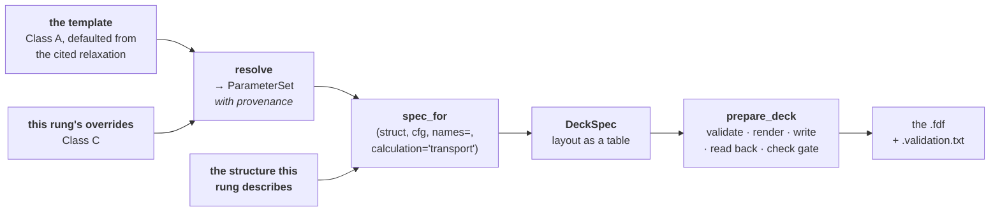
```mermaid
flowchart LR
    T["<b>the template</b><br/>Class A, defaulted from<br/>the cited relaxation"]
    O["<b>this rung's overrides</b><br/>Class C"]
    T --> R["<b>resolve</b><br/>→ ParameterSet<br/><i>with provenance</i>"]
    O --> R
    R --> S["<b>spec_for</b><br/>(struct, cfg, names=,<br/>calculation='transport')"]
    ST["<b>the structure this<br/>rung describes</b>"] --> S
    S --> D["<b>DeckSpec</b><br/>layout as a table"]
    D --> P["<b>prepare_deck</b><br/>validate · render · write<br/>· read back · check gate"]
    P --> F["the .fdf<br/>+ .validation.txt"]
```

**And the structures are two, out of one file** — which is why the seam never
had to change:

| rung | the structure it describes | where it comes from |
|---|---|---|
| seed · device · transmission | the **junction** | the cited relaxation, sorted |
| electrode_L · electrode_R | the **lead** | *the same file*, `extract_electrode_model(dev, "L-electrode")` — a subset selected by region label, then `as_structure()` |

#### Measured, on the repository's own fixture

| rung | lines | validation report | solver | `%block TS.Elecs` | `MaxSCFIterations` |
|---|---|---|---|---|---|
| `01_seed` | 488 | ✅ | `diagon` | – | ✅ |
| `02_electrode_L` | 419 | ✅ | `diagon` | – | ✅ |
| `04_device` | 584 | ✅ | `transiesta` | ✅ | ✅ |
| `05_transmission` | 584 | ✅ | `transiesta` | ✅ | ✅ |

Against the 13 keywords and 4 blocks § 3.2 measured. `MaxSCFIterations` and
`DM.Tolerance` — the two that killed a real seed at 1000 iterations — now reach
every rung from the description, with provenance.

#### The lead's k-mesh, which is the physics made visible

```
    4    0    0      0.0     ← transverse: SHARED with the device, because the
    0    4    0      0.0        self-energy is folded in per transverse k-point
    0    0   40      0.0     ← transport axis: DENSE, because a lead is a
                                periodic bulk crystal and its Fermi level is
                                the reference energy everything is measured
                                against
```

The device writes `1` on that third axis. Not a disagreement — **the definition
of an open boundary**, and the reason the two are computed separately at all.

#### What did NOT land, stated plainly

| | |
|---|---|
| ~~**the bias has two homes**~~ | `task.bias` (the description's axis, giving the `v*` directories) and `bias_voltage_v` (a template row with a range and help). The axis won: each point's deck was the resolved config with that voltage replaced, and with no axis the template's value answered. **Closed 2026-09-29 (K1)**: the axis is the one home — `bias_voltage_v` is the point a rung renders, fixed by the rung, and a template value or a stage override naming it is refused (§ 2a.10) |
| **the NEGF electrode block is lifted, not tabled** | `%block TS.Elecs` and the per-electrode blocks are still the pre-seam emitter's, wrapped in one `Block` *(with one small projection at the boundary until 2026-09-29, when the block's VALUES moved to the catalogue and the projection went — § 6.1b)*. Deliberate: TranSIESTA identifies each electrode by a **contiguous atom range**, so an off-by-one computes transmission through a region that is not the molecule *and converges while doing it*. That emitter has been measured against a live 5.4.2 binary; a rewrite would have to earn that again for no gain |
| ~~**`TransportConfig` survives**~~ | only to feed that lifted emitter. TR4 already deleted the general projection when the template made it unnecessary; this is the last one, and it goes when the block is tabled. *(It went 2026-09-29, § 6.1b; the class retired 2026-10-02, M5 step 3)* |
| **net charge and gating** | deferred by ruling (§ 2a.7) |

#### Two defects this work found in itself

Recorded because both were caught by guards rather than by review, and both
say something about where mistakes live:

**The check gate caught a duplicate keyword the day it was written.** The device
deck said `SolutionMethod diagon` from a section and `transiesta` from the NEGF
block — in that order, with libfdf silently taking the first. The cause is
general, not a slip: **a section resolves a value from the config**, and a role
item's answer was not there. `_render_sections` skipped them and each rung's
block wrote its own — until 2026-09-29, when the rung's answer moved INTO its
config (`resolve`, the role layer), so the section writes the right value and no
block types the line (`template.md` § 6.4).

**A test fixture was geometrically invalid and nothing had ever looked.** Its
buffer variant put 44.5 Å of atoms in a 40 Å cell, so atoms overlapped their own
periodic images along the transport axis. It survived because **the device deck
had no settings gate until it joined the seam** — the first time anything
validated that geometry was the moment this work put a gate in front of it.


---


### 2a.15 What `restart` means for a ladder *(defined 2026-09-16; the device's answer, user, 2026-10-05)*

`restart` is a property of an **iterative** calculation: *when this run starts,
does it pick up where a previous one left off, or begin from the atomic
densities?* The optimization ladder is where the question was designed, and
there it governs a relaxation that may take days.

A transport ladder is **four single points and one post-processing step**, so
the question does not mean the same thing on every rung, and on one of them it
means nothing at all.

| rung | does it iterate? | the state a restart would pick up | is "continue vs clean" worth asking? |
|---|---|---|---|
| `seed` | an ordinary SCF | its own last `<label>.DM` | barely — its whole output *is* a `.DM`, and it is cheap; one not converged continues from its own (§ 2a.11) |
| `electrode_L` / `electrode_R` | an ordinary SCF on a bulk lead | its own `.DM` | barely — a few metal layers; cheap; the same rule |
| `device` | **the NEGF SCF — the expensive one** | its own previous `<label>.TSDE`, **and** the seed's `.DM` as a starting density | **answered by the sweep** (§ 2a.11): a point starts from the seed's `.DM` (0 V) or the closest converged point's `.TSDE`, and one not done continues from its own last density |
| `transmission` | **no SCF at all** — `tbtrans` reads a converged Hamiltonian and integrates | nothing | **no. There is no state to continue** |

**So the question is answered per point** *(user, 2026-10-05)*: a point starts
from a hand-over — the seed's density at 0 V, the closest converged point's
after it — and until its cycle converges it continues from its own last
density, in its own folder; once converged it is done and never run again,
because a converged point is a fixed point and running it again only repeats
it (§ 2a.11). The seed and the leads follow the same rule and rarely need it —
they are cheap — and the transmission has no iteration to resume. *(Until
2026-10-05 this read "the device has one": its own previous `.TSDE`, continued
by a launch after a stop into a next attempt.)*

**The two hand-overs, and how SIESTA reads each.**

* The seed's `.DM` reaches the device's first point through `DM.UseSaveDM`,
  which the device deck writes. That is a *hand-over between rungs*, not a
  restart — the arrow runs seed → device and never back.
* A later point starts from the `.TSDE` of the closest converged point, copied
  in as its own `<label>.TSDE`, and **TranSIESTA reads it under
  `DM.UseSaveDM`**, the same keyword as the `.DM` and true by default (5.4.2's
  `m_new_dm.F90` tries the `.TSDE` only when it is set): finding a `.TSDE` in the
  directory, TranSIESTA takes it as the starting density, and *"this is then
  considered a continuation run"*, skipping the periodic start (the manual's
  TranSIESTA *Description*). The binary's own words, measured
  2026-09-16: *"Attempting to read DM, EDM from TSDE file"*, and
  *"Forcefully requested initialization of the DM, however the DM/TSDE file
  does not exist!"* So a point launched again after a stop finds the `.TSDE`
  its stopped run left and continues from it — the continuation § 2a.11 asks
  for; and the walk copies a hand-over only into a point it has not begun, so
  a point's own density is never overwritten by another's.

**Is `DM.UseSaveDM` honoured in a TranSIESTA run?** Measured against SIESTA
5.4.2's own binary: yes. The one path that overrides it is a geometry
relaxation — *"DM re-use not allowed. Resetting DM at every geometry step /
DM.UseSaveDM overridden!!"* — and a transport rung is never that: none of the
five decks carries an `MD` block, by design (the kind excludes the relaxation
driver, § 3.3).

**Why the missing keyword is not the hazard it looks like.** The electrode
rungs write no restart keyword at all, and SIESTA reads `<label>.DM` whenever
the file is there whatever the deck omits (`DM.UseSaveDM` is true by default,
the manual's *SCF loop*) — so in principle a lead could warm-start from stale
state without being asked. In practice every run is opened **fresh** by
`prep`, holding its kind's gather and nothing else (a rung takes no `--from`,
[`job-system.md`](?doc=execution/job-system.md) § 5.4), and what a rung or
point launched again finds in its folder is its own last density — the state
to continue from, not a stale one (§ 2a.11). Nothing stale is there to pick
up. The exposure is a hand-run wrapper inside an already-used run, which is
outside the ladder. *(Until the sweep is built, `launch` after a stop opens
the rung's next attempt holding what its own newest run left of the restart
files it declares — the seed's `.DM`, the device's `.TSDE`; the leads declare
none.)*

**Does the lead need `TS.DE.Save`? No — the manual says when a lead's density
is read** (TranSIESTA's electrode options, `TS.Elec.<>.DM-init` and
`TS.Elecs.DM.Init`). The device reads a lead's density only when told to
overwrite its electrode regions' starting density with the bulk one: the
option's default, `diagon`, never does; `bulk` does, and *"requires the DM
file for the electrode to be present"*; and *"only force-bulk will have effect
if V≠0"*. No rung's deck writes either option, so
every rung takes the default, `diagon`, and no lead's density is read: the
lead's `.TSHS` (`TS.HS.Save`, I13) is the whole of what the device needs from
it. A person who sets `bulk` (read at 0 V) or `force-bulk` (read at any bias)
needs the lead run to save its density, `TS.DE.Save` — the case worth knowing,
which a run of the default deck could never have revealed.

*(Settled first from SIESTA 5.4.2's source, 2026-09-16, whose reading had a
finite bias switch the option off whatever was asked; the manual says
`force-bulk` still acts there. The decks write neither value, so the answer
stands either way. It was also once attributed to `TS.Elec.<>.Bulk`, another
option entirely — whether the Hamiltonian of the electrode region in the
device is enforced bulk (the manual; true by default) — and once settled by
one junction's run, which is evidence about one configuration rather than a
rule.)*

## 3. How to run it (the CLI)

The road is the composite, through the ordinary `jobset` verbs:

```bash
# 0. relax the junction as an ordinary task (electrode layers labeled
#    L-electrode / R-electrode and frozen), and let it CONCLUDE.

# 1. describe the transport calculation: one slot, the finished attempt
molbuilder jobset init --calculation transport --shape hierarchical \
    --bundle BDT-Au/transport/BDTTrans \
    --slot junction=BDT-Au/optimization/JunctionRelax/01_coarse/run-2 \
    --bias 0.0,0.2 --no-low-bias-approximation

# 2. prep + launch the task: each prep shows the ladder and offers the
#    stages that are ready -- first the seed and both leads, as one job;
#    then the device, once they have finished; then the transmission.
#    Each prep gathers what its stage consumes from the newest finished
#    runs before it.
molbuilder jobset prep task   --bundle BDT-Au/transport/BDTTrans
molbuilder jobset launch task --bundle BDT-Au/transport/BDTTrans --mode submit
#    ... and again for the device (a bias scan launches as ONE chain job
#    walking the points), and again for the transmission

# 3. read the deliverable back
molbuilder jobset summarize task        # -> <label>.transport.json + the I-V table
```

| Command | Does | Code |
|---|---|---|
| `jobset init --calculation transport` | describe the composite: the junction citation, the bias list, the five fixed stages | `jobset/_cli.py::_init_transport` |
| `jobset prep task [--stage <stage> ...]` | show the ladder, offer the ready stages (`jobset/ready.py`); compose (sort · gates · extract) on first contact, then render each picked rung's deck + gather its inputs; several picked are one group | `jobset/prep.py::prep_task`, `prep_calculation`, the rung `_transport_rung_of` |
| `jobset launch task [--stage <stage> ...]` | send what is prepared and not launched — a group as one job; a bias sweep's device or transmission goes as one job walking its points | `jobset/_cli.py::_launch_unit`, `jobset/submit.py::_plan_sweep` |
| `jobset summarize task` | parse TBtrans output → `<label>.transport.json`, print the I–V table | `transport/record.py` |
| ~~`transport electrode`~~ · ~~`transport preflight`~~ | **DELETED 2026-09-17** with the `transport` verb group — the hand-assembly pair. A lead is derived from the citation at prep, and § 5's invariants are held by construction or by the validation pass |

**Gotchas:** the citation names a DIRECTORY explicitly (§ 3.1 below) —
nothing is ever picked for you; a citation re-pointed after a rung is prepared
is refused at the next rung's gather, which cannot read the junction its
record was composed from — the way on is the state saved before the first
rung's prep, which composes it anew (a prepared rung is not prepared again,
[`job-system.md`](?doc=execution/job-system.md) § 5.0); `--bias` must start
at `0.0` (the chain starts from equilibrium).  *(The old `transport bundle`
three-run driver and its `run-transport.sh` were deleted 2026-08-29 —
deriving and running the pieces is the composite's job.)*

### 3.1 What you can cite, and what each one brings

*Rewritten 2026-09-23. This listed two cases called "form A" and "form B" —
names that describe which files are in a folder and tell a reader nothing
about what they get. There are **three**, and what separates them is one
question: **does the thing you cite bring its settings with it?***

A transport calculation starts by pointing at something you already have.
Three things qualify:

| what you point at | the folder holds | you get | the settings come from |
|---|---|---|---|
| **a finished run** | one `.fdf` and one `.XV` | geometry · labels · **settings** | the deck that actually ran |
| **a saved structure that remembers its run** | one `.xyz` with its `.molstruct.json`, and that sidecar carries the settings of the run it came out of | geometry · labels · **settings** | the record written when you exported it |
| **a saved structure** | one `.xyz` with its `.molstruct.json` | geometry · labels | nobody yet — **you choose them** |

**Settings** here means what every stage of the calculation must agree on: the
basis, the exchange–correlation functional and its authors, the mesh cutoff, the
orbital energy shift, the transverse k-grid, the electronic temperature and the
spin. § 2a.3 calls them shared, and § 5 is why they cannot differ between the
leads and the device.

> **The spin comes with the citation too** *(W34, built 2026-09-28)*: until then
> the spin was shared by every rung and *answered by nobody's run* (§ 3.8.6), so a
> polarized relaxation was cited into a non-polarized transport calculation
> without a word. The cited run's `spin_treatment` and `unpaired_electrons` are
> now the defaults — read from its deck, in any word SIESTA accepts, or from its
> record — a cited run carrying a net charge is refused by name (§ 2a.7), and a
> spin left blank is decided ONCE, on the whole junction, and handed to every
> rung, whose deck says where it came from
> ([`science/chemistry-correctness.md`](?doc=science/chemistry-correctness.md)
> § 2a, ES1, ES7). Reading a spin-polarized junction's transmission in both
> TBtrans channels (§ 2a.4) is still open (plan § 5s, P5).
>
> **Two treatments, and the count floats** *(T-F20, 2026-09-30)*: TranSIESTA
> runs `restricted` and `unrestricted` only — it stops on more than two spin
> components (`m_transiesta.F90`) — and never a fixed total spin: the device
> dies on `Spin.Fix` (*"Fixing spin is not possible in TranSiesta"*,
> `m_ts_options.F90`), and a lead's fixed spin aligns its Fermi levels to
> spin-up. So a transport calculation offers the two treatments (`offered`,
> [`template.md`](?doc=engines/template.md) § 6.3a); under `unrestricted` a
> blank count floats by that rule, a cited run's fixed count is not defaulted
> into the template (it is left blank, and floats), and a stated count is
> refused by name.

**How the third one comes to remember.** You finish a relaxation, open it in
the Results tab, and save the structure. The tab writes that run's own settings
into the sidecar as it saves. Cite that pair later and the settings come back
with it — which is the whole point of saving it rather than re-citing the run
folder. A structure you built by hand has nothing to remember and is the third
row.

**A finished run wins.** When a folder satisfies more than one, the run is
taken: the deck it ran is a stronger statement than a copy of it, and more
information never loses to less.

**Two of anything is refused.** A citation names a folder, so the folder must
answer without a guess — two `.fdf`s, or two `.xyz`s, and it is refused by
name, telling you what it holds and what the condition wants.

**Where it sits and what it is called never matter.** The condition is what
the folder HOLDS. There is no naming convention to obey and no directory
layout to reproduce.

> **The settings are DEFAULTED, never sealed** (§ 2a.7). Whichever of the
> three you cite, the values land in this calculation's own template and you
> may change any of them afterwards — a change applying to all five stages at
> once, because there is one template. Relaxing with a cheap basis and then
> transporting with an accurate one is ordinary practice and is what that
> ruling exists for.

**A cited relaxation is a run of ours.** It ended on its own when its
wrapper's conclusion says so, with the exit code — the one door's rule
(`runrecord.ending`, [`execution/architecture.md`](?doc=execution/architecture.md)
§ 3.2). *(SIESTA's `0_NORMAL_EXIT` answered for a relaxation launched by hand
until 2026-10-03 — "evidence is FILES, never a marker of ours" — input
molbuilder does not take, user, 2026-10-03.)*

**Classifying is not composing.** A relaxation still running has record files
that do not conclude; classification RECORDS that, because describing a
transport calculation ahead of a finishing relax is legal. Composing from it
refuses — you may plan against a run in flight, but you may not build a deck
from a geometry that is still moving.

> **History, because the middle row was lost once.** It was ruled on
> 2026-08-29 (`archive/2026-09-01-transport-design.md` § 4.1b, *"the condition
> has three shades"*) and this section was written with two. When the
> parameter path was rebuilt around the template on 2026-09-16, the code that
> acted on the middle row had nothing in the live contract to preserve it
> against, and was dropped — while every path that READS and DISPLAYS it
> survived. The tab went on saying *"contract RECORDED"* about settings
> nothing applied any more. Measured 2026-09-23: a pair recording 400 Ry, TZP
> and a 4×4 mesh produced a template of 300 Ry, DZP and Γ-only. **The three
> rows above are the contract; a reader who finds only two has found a
> regression.**

---

### 3.2 Where transport sits in the seven floors — and it does not

**This section is first because everything below it is a consequence.** The
earlier draft of § 3.2 opened with *where transport's parameters live*, which
is a symptom; the cause is one floor of the architecture that transport never
joined.

[`execution/architecture.md`](?doc=execution/architecture.md) § 2 is the
project's own top-down: seven floors, and one rule — **a floor may call down
and return up; it may never reach across.** Floor 2 is the *description*
(`task.py`, and the template beside it). Floor 3 is *plan & render* — *"asked-for
+ machine → a list of jobs, **and the text of every file**"* — and its files are
named: `resolve` · `siesta/input` · `pyscf/input` · `runwrap`.

**`molbuilder/transport/` is in none of them.** The word *transport* appears
once in that whole document, in a table asserting the opposite of what the code
does: *"the five stages run INSIDE the job system (each an ordinary prep/launch
rung)"*.

Four rules, and each one costs something measurable:

| the rule | what transport does | what it cost |
|---|---|---|
| **floor 3 renders the text of every file**, from a `ParameterSet`, through `spec_for` → `DeckSpec` → `prepare_deck` | `transport/transiesta.py::render_script` concatenates literal f-strings. It is not floor 3's file, takes no `ParameterSet`, and never reaches `prepare_deck` | the keyword set was **fixed in code**: the seed deck `prep` rendered carried **13 keywords and 4 blocks** against a template offering **45 deck-reaching items**. ✅ **CLOSED 2026-09-16 — all five rungs render through `spec_for` → `DeckSpec` → `prepare_deck`** (§ 2a.14). The seed deck is 488 lines, a lead 419, the device 584, each with a validation report and the engine's check gate |
| **floor 2 holds what the person asked for** | transport had no template, so the parameters were *defined* in `TransportConfig` — which is no floor at all | 32 parameters of surface, none of them the ~40 a SIESTA run needs. `MaxSCFIterations` and `DM.Tolerance` cannot reach ANY transport deck: not from the citation, not from a form, not from `task.json`. ✅ **CLOSED** — transport has a template since TR1 (2026-09-16, § 3.6 item 5), and `TransportConfig` retired 2026-10-02 |
| **`prep` is the conductor, not a floor: it may call, but it may never decide** | `_prep_transport` is a second conductor that decides — it composes, gates, extracts and renders | no `resolve`, so no `ParameterSet` and no provenance; `--pipeline-log` is a documented no-op; no validation report; no read-back check. ✅ **CLOSED** — a rung resolves through `resolve` since 2026-09-16 (§ 3.6 item 4), the pipeline log prints every step (§ 3.6a), each deck has its validation report and check gate (the first row); and `_prep_transport` is gone since 2026-10-05: a transport rung is prepared by prep's one table of steps |
| **floor 2 must never name a machine** | `max_memory_mb` and `num_threads` are `TransportConfig` fields | two controls that reach the deck only as comment lines. ✅ **CLOSED 2026-10-02** — both went with the class (§ 3.6 item 12) |

#### Why it is this way, from the history rather than from a rationale

| | |
|---|---|
| **2026-06-10** | `transiesta.py::render_script` written — *"transport B.3 step 1: transiesta engine + zero-bias device .fdf"* |
| **2026-08-19** | the pipeline lands — *"refactor(prep): the seam carries the engine's FORM, and the layout is a table"* — creating `DeckSpec` **and** moving `siesta/input` onto `spec_for`, in one commit |

The transport emitter predates the framework by ten weeks. That commit migrated
siesta and pyscf and left transport where it was; the composite was then built
*outward* from the unmigrated emitter (P4, 2026-08-28 wired `stages.py` to call
`render_script`), so it inherited the old path and grew `_prep_transport` around
it rather than joining the new one.

**And the contract knew.** [`template.md`](?doc=engines/template.md) § 9.2
records it: *"ONE ARM IS STILL MISSING: `prep`'s TRANSPORT branch reaches
neither `prepare_deck` nor `write_script`, and `molbuilder/transport/` never
emits the zone at all."* It was filed as one lost feature — the USER-CUSTOM
block — rather than as *transport cannot render from a template*, which is what
it is.

#### Every known defect is downstream of this

Not a list of bugs; one omission with faces. Each was found separately and each
dissolves at the same place:

| symptom | the floor-3 fact behind it |
|---|---|
| the seed ran 1000 SCF iterations and died `SCF_NOT_CONV` | `MaxSCFIterations` is not in the hardcoded list, so the citation's `30` cannot travel |
| the device deck aborts: *"the continued fraction method requires at least 20 poles"* | **Diagnosed wrongly here until 2026-09-16, and the wrong fix shipped for a day.** `TS.Contours.Eq.Pole.N` *is* a real keyword (`Src/m_ts_chem_pot.F90:113`) — but on the deck shape this project emits it can never take effect. A deck declaring `%block TS.ChemPot.<name>` with no `contour.eq` inside it takes the continued-fraction branch (`:299`), where the count is set from the ENERGY at `:319`, `N = int(E / (pi * kT))`, and the branch's own default (`:316`, `E = pi*60*kT*0.7`) is non-zero, so the override always fires. Only the block-interior `contour.eq.pole.n` (`:263`) short-circuits it, and this emitter writes no such line. The abort was caused by this project's own shipped default, `negf_eq_pole_ev = 1.5` eV, which is **18 poles at 300 K**. 1.7 gives 20, 2.0 gives 24, 4.0 gives 49, and writing nothing gets the engine's 42. The row defaulted to 0 — *let the engine choose* — from 2026-09-17 to 2026-09-29, when a real device lost the charge on the engine's 42 and held it on 10 eV's 123: it now defaults to **10 eV, always written** (§ 6.1c), and `_validate_transport_kind` refuses any stated energy too small for the run's own temperature, with the arithmetic. The refusal's rule is `:319` + `:324` verbatim, not a curve fitted to observations |
| `TBT.k` is emitted as a bare scalar the parser cannot read *(closed 2026-09-29 by the list form; always the block since 2026-09-30, which carries the offset — [`siesta.md`](?doc=engines/siesta.md) § 6.1)* | the list hand-formats values, so no emitter owns "how a list-valued keyword is written" |
| `tbt_k_grid`'s transport axis was unguarded *(guarded 2026-09-16 by the kind's validator; since 2026-09-30 a fixed component, [`siesta.md`](?doc=engines/siesta.md) § 6.1)* | there was no declaration to carry a bound |
| the electronic contract is two frozensets and a predicate spelled twice | floor 2's job done in code, because floor 2 held nothing |

**The lesson for the order of work.** This document's first draft put "render
through `prepare_deck`" at step 6 of 7, because it was written from the
parameters down. Read from the floors down, it is step 1: until floor 3 renders
transport from the description, a parameter surface has nowhere to arrive, and
every fix above it is a patch on an emitter that should not exist.

---

### 3.3 Transport is a calculation KIND — measured, not asserted

The question this section answers is the one that decides everything below it:
**does transport share enough with the calculations that already work to be
carried by the same template, or is it different enough to need its own?**

The framework's own protocol names transport by name
([`template.md`](?doc=engines/template.md) § 6.3, user ruling 2026-08-21):

> *"a new calculation kind — **transport is next** — means new rows in this one
> catalogue, never a second template file. The kind declares its own rows with
> `calculations = [...]` … A second catalogue per kind would be two-homes drift
> all over again, one axis over."*

And the design of record agrees, in its own ruling body
([`archive/2026-09-01-transport-design.md`](?doc=archive/2026-09-01-transport-design.md) § 2):

> *"What stays identical to every other task — deliberately: the portable-folder
> rule, the verbs, attempts, **the template/catalogue machinery for transport's
> own parameters**, and the sweep axis. **Only the input model is new: one slot,
> filled by an explicit citation.**"*

§ 4.2 of that document even calls the transmission knobs *"transport-template
fields"*. **There is no ruling anywhere that transport has no template.** The
phrase *"floor 2 is task.json alone"* occurs twice in the whole archive, both
times inside a build-note parenthetical about the **hand-over** seam — how many
files cross the web describe boundary — and it was restated into code comments,
`job-contracts.md`, the roadmap and two tests until it read as design.

#### What the measurement says

The vibration kind is the worked precedent: *"its template IS the optimization
template plus fourteen declared rows, because one of its steps **is** an
optimization"* (§ 6.3). Measured against the live catalogue:

| | vibration | transport |
|---|---|---|
| catalogue rows of its own | 15, all `PySCFConfig` fields | **0** when measured — 20 since 4b/4c (§ 3.6 item 9) |
| base it inherits | the 41 pyscf items | **49 siesta items** |
| of that base, what it must EXCLUDE | nothing | **9** — the relaxation driver (`md_*`, `relax_*`, `write_md_*`) |
| deck shapes | 1 | **4** |
| binaries | 1 | **2** (`siesta`, then `tbtrans` on stage 5) |

**The overlap is large, and that is the finding.** Every transport stage *is* a
SIESTA run — the seed is a plain SCF, each electrode is an SCF, the device is an
SCF with open boundaries — so all four need `DM.Tolerance`, `MaxSCFIterations`,
`MeshCutoff`, `PAO.BasisSize`, `XC.*`. Transport is **the siesta base minus the
relaxation driver plus the NEGF/TBtrans surface**: structurally the same
relationship vibration has to optimization, with a subtraction as well as an
addition.

> **A measurement that looked the other way, and why it was wrong.** Comparing
> `TransportConfig`'s 32 fields against the catalogue shows 21 of 22 *settable*
> fields disjoint, which reads as *"transport shares almost nothing"*. That
> measures the wrong object: `TransportConfig` was the artefact this section
> concludes should not exist *(retired 2026-10-02)*, and its "settable" surface is small precisely
> because the electronic half arrives from the citation instead of being typed.
> **Transport's DECK is mostly shared; only its FORM is mostly new.**

**Decision: rows in the one catalogue, tagged `calculations = ["transport"]`.**
No second catalogue (§ 6.3 forbids it) and no second authored file (the
measurement gives no cause). The per-calculation `<label>.template.toml` every
calculation already gets is where transport's narrowed set lands.

---

### 3.4 The template — its shape, and the reasoning for that shape

A template item answers *what is this parameter*. Transport needs two further
questions answered that no existing kind has had to ask, and the shape follows
from keeping each on the axis that already owns it.

#### 3.4.1 The first axis: WHO ANSWERS the item

Every other kind has essentially one answerer — the person, with the scheduler
answering the handful of allocation rows. Transport has **five**, and sorting
the parameters this way is what makes the rest of the design fall out.

| answerer | what | how the template says it |
|---|---|---|
| **the person** | the transmission window and grid, the TBtrans outputs, broadening, the NEGF contour, the leads | an ordinary item with a `value` |
| **the citation** | basis, energy shift, XC functional + authors, mesh cutoff, transverse k, electronic temperature — the **electronic contract** | ⚠️ **SUPERSEDED by § 3.8.0** — this says *declared, valueless, filled at `prep`*, which is the SEALED reading § 2a.7 reversed. The values are filled ONCE at `jobset init` into this calculation's template, carry a value there, and the person may change them |
| **the description** | job label, the bias list | the label is an ordinary item; the bias is `task.json`'s own `bias` block, because it is the sweep axis (§ 2a.11) |
| **the machine** | memory ceiling, thread count, ranks | `allocation` items — valueless on floor 2, filled at `prep` (G1) |
| **the geometry** | which atoms are electrode / bridge / buffer, which are frozen | **not an item at all** — § 7's structure exclusion; it travels in the `.molstruct.json` sidecar and the deck's ATOM-METADATA block |

Two of those rows are corrections to what ships today:

* **The machine row.** `max_memory_mb` and `num_threads` are `TransportConfig`
  fields in a form section today, which G1 and § 7 forbid on floor 2 — and they
  reach the deck only as comment lines, so they are controls that move nothing.
  As `allocation` items they become what they are. *(Done 2026-10-02: the
  two fields went with the class; a rung's are `SiestaConfig`'s `max_memory_mb`
  and `omp_threads`, both `allocation` items.)*
* **The citation row** is the one that needs a name, and § 3.4.3 gives it.

#### 3.4.2 The second axis: WHICH STAGE'S DECK carries the item

This is **not** a new key on the item. `DeckSpec.layout` already exists for
exactly this and is declared as *"deck layout is engine knowledge and stays with
the engine — but as a table rather than as control flow"*, with `Section.items`
naming which items go in which part of the deck.

So transport supplies **four layout tables**, selected by the `stage_token` that
`spec_for` already receives:

| stage | deck shape | items in its layout |
|---|---|---|
| `seed` | an ordinary SCF | the electronic contract; no TS/TBT rows |
| `electrode_L`, `electrode_R` | a bulk lead | contract + `electrode_kz` + semi-infinite direction |
| `device` | the NEGF SCF | contract + `TS.*` contour rows + the chemical potentials; one k-point along transport, the rung's mesh ([`siesta.md`](?doc=engines/siesta.md) § 6.1) |
| `transmission` | **its own text since 2026-09-29** (the same text as `device` until then) | the `TS.*` junction description `tbtrans` reads plus the `TBT.*` rows; the binary is `Resources.program = tbtrans` (§ 6.1b) |

An item absent from a stage's layout is simply not written into that stage's
deck. No control flow, no per-item stage key, and the whole mapping is readable
as a table. Verified: nothing downstream of `spec_for` is stage-aware — the
stage token only names the file — so four shapes need no framework change.

#### 3.4.3 The citation is a source, the way the scheduler is a source

§ 6.4 already carries the *state* transport's electronic contract needs:

| state | means | who acts |
|---|---|---|
| no `value` | declared, unresolved | a surface asks, or `prep` fills |
| `value` set | chosen | honoured verbatim |
| absent from the file | not a parameter of this calculation | the engine's own default |

That three-state encoding fixes a defect the current design cannot express. A
cited deck that omits `MeshCutoff` today silently yields the dataclass default
of 300 Ry, with **nothing recording that it was a default rather than the
citation's word** — every fill is a `if getattr(fdf, X, None)` guard over a
Python default. Under § 6.4 the unfilled state is a state.

What § 6.4 lacks is the *source marker*. `allocation` is the existing precedent
— *a source outside floor 2 answers this item, and writing a value here is
refused* — and the citation is structurally the same kind of source. **So the
one framework extension this design asks for is a sibling of `allocation` on the
same axis.**

It earns itself rather than being convenient: it replaced two Python frozensets
(`SEALED_ALWAYS`, `CONTRACT_FIELDS`) and a predicate then spelled twice in
two files with disagreeing formulations (the last of them deleted 2026-10-02), it puts *"who answers this"* on the
axis § 6.4 already owns, and any later kind whose values arrive from a cited
result inherits it. Both refusal doors then read one declaration.

#### 3.4.4 What a transport template contains, end to end

```
  the one catalogue                        <label>.template.toml
  ─────────────────                        ─────────────────────
  49 siesta items                          the 40 that survive the filter,
   − 9 relaxation-driver rows                values from the form or, for the
     (calculations = ["optimization"])       contract rows, VALUELESS
   + ~20 transport rows                    + transport's own rows, with values
     (calculations = ["transport"])        + the allocation rows, valueless
```

The narrowing is the framework's own: `template_with_values(cfg,
engine="siesta", calculation="transport")` runs `select(parsed,
engine="siesta")` and then keeps an item when `not it.calculations or
"transport" in it.calculations`. Tagging the 9 relaxation rows is what makes the
subtraction happen; every other shared item comes along because it genuinely
applies.

---

### 3.5 How it is implemented — the chain, named

One direction, and every step is a function that already exists except where
marked **[new]**.

```
  catalogue.template.toml            the master — transport's rows live here
        │  select(engine="siesta") + calculations filter
        ▼
  template_with_values(...)          → <label>.template.toml        floor 2
        │                              task.json beside it (slots, bias, stages)
        ▼
  jobset prep task --stage <stage>   on the machine that will run it
        │
        ├─ compose_junction(...)     THE ONE NEW INPUT MODEL: copy the citation,
        │                            sort, gate, derive both electrode cells
        │
        ├─ resolve(template_text, task, SiestaConfig, allocation=...)
        │       config_from_template → the contract rows filled from the
        │       composed citation [new arm], everything else from the template
        │       → ParameterSet, with provenance
        │
        ├─ spec_for(struct, cfg, names=…, calculation="transport")  [new arm]
        │       → DeckSpec(layout=<one of the four tables>)
        │
        └─ prepare_deck(spec, struct, cfg, path)
                validate → render → write → READ BACK AND CHECK
                → the deck, its .validation.txt, the USER-CUSTOM zone

  jobset launch task --stage <stage> Resources.program = tbtrans on stage 5
```

The only genuinely transport-specific code in that chain is the **input model** —
`compose_junction` and the citation fill — which is exactly what the design of
record said would be new, and nothing else.

### 3.6 What "done" looks like — the checkable outcome, in floor order

This section exists so the work has an end that can be tested rather than
declared, and it is ordered by § 3.2's floors rather than by convenience.
**Items 1–3 are the architecture; everything after them is a consequence and
cannot be done first.** Each line is falsifiable.

**Floor 3 — render the text of every file.**

1. **Transport renders through `spec_for(struct, cfg, names=…,
   calculation="transport")` → `DeckSpec(layout=…)` → `prepare_deck`**, the
   path `siesta/input` has taken since 2026-08-19.
   **✅ DONE 2026-09-16 — all five rungs** (§ 2a.14). What survives of the
   pre-seam emitter is the lifted NEGF electrode block —
   `transiesta.emit_electrode_declarations` (`_emit_transiesta_block` until
   2026-09-29, when its values moved to the catalogue), wrapped in one
   `Block` — for the reason
   § 2a.14 gives: an off-by-one in a contiguous atom range computes
   transmission through the wrong region *and converges*. **`render_script`
   itself is deleted** (2026-09-17): it was a SECOND writer of a device deck,
   reached only by `/api/transport/render`, and it read `TransportConfig` while
   the live path reads `SiestaConfig` — so the pole-energy correction of
   2026-09-16 reached one and not the other, and a deck from it stopped SIESTA
   before the SCF loop for two days. *(This item said "`render_script` survives"
   until 2026-09-17.)*
2. **No keyword's value syntax is written by hand.** A `%block` is written by
   the block emitter, a list by the list emitter. `TBT.k` in a form the parser
   rejects becomes structurally unavailable rather than fixed — and so does
   the next one nobody has found.
   **✅ DONE 2026-09-29 — M5 step 1** (§ 6.1b). The eighteen `TS.*` /
   `TBT.*` values the lifted NEGF block wrote as f-strings are catalogue
   items with their notes: fourteen through the section walk, where the
   check gate sees each line — and `TS.Voltage` (a `role` item) there too
   since 2026-09-29 (K1) — and the T(E) window's three values through the
   rung's own block, each asked of the framework's door and written with its
   note, the k-grid block's precedent. `TBT.k` was written as the bracketed list it has to be
   *(since 2026-09-30 always the block, which carries the offset — `kmesh.write`,
   [`siesta.md`](?doc=engines/siesta.md) § 6.1)*.
   `TBT.HS` stays a rung line derived from the label, with no row.
3. **Every stage deck has a `.validation.txt` and a USER-CUSTOM zone**, and a
   deck that fails its own read-back check refuses instead of running.
   **✅ DONE 2026-09-16 — all five** (§ 2a.14). It has already earned itself
   twice: the check gate caught a duplicated `SolutionMethod` the day the
   device layout was written, and the settings gate caught a fixture whose
   atoms did not fit their own cell — invalid for as long as it existed,
   because nothing had ever validated a device geometry before.

**`prep` is the conductor, not a decider.**

4. **`_prep_transport` is gone as a parallel arm.** The citation compose stays
   — it is the one genuinely new input model — and hands to `resolve`, so a
   transport run has a `ParameterSet` with provenance and `--pipeline-log`
   stops being a no-op. **✅ DONE 2026-09-16** (§ 2a.14): it prints the resolve
   step and every value's source. **There is no arm since 2026-10-05**: the
   compose, the electronic state and the points are the transport rung's
   own steps in prep's one table, and the gather the entry's
   ([`script-preparation.md`](?doc=execution/script-preparation.md) § 3.0).

**Floor 2 — hold what the person asked for.**

5. **The deck carries what the description says**, which is now measurable.
   **✅ DONE 2026-09-16**: 13 keywords → 488/419/584 lines carrying the
   engine's full section set, and `MaxSCFIterations` / `DM.Tolerance` reach
   every rung *from the template*, with provenance. Note the correction to
   this item's own wording: they arrive from the **description**, not from the
   citation — the cited run only supplies the defaults (§ 2a.7, ruling 1).
6. `molbuilder/config/transport.py` **does not exist**; the shape is
   `SiestaConfig` plus the `citation` marker. **✅ DONE 2026-10-02 — M5 step
   3.** Every rung has resolved a `SiestaConfig` since 2026-09-16, when TR4
   deleted the general projection; the last projection, at the boundary of
   the lifted NEGF block (`deck._legacy_view`), went 2026-09-29 with the
   block's values (§ 6.1b); and the class retired with its module, whose
   region-label vocabulary moved to `transport/sort.py`, the module that owns
   the partition those labels make.
7. `dataclass_to_form_schema` **does not exist**; the transport form is
   generated from the catalogue. **✅ DONE 2026-10-02 — M5 step 3**: the form
   moved onto the catalogue on 2026-09-24 (§ 3.8.6), and the builder, its
   tests and the form keys nothing read once it was gone
   (`web/form-schema.md` § 1a) were deleted with the class.
   ⚠️ **Two corrections (2026-09-23).** *"and is deleted"* — it is not;
   it still has test callers, and § 3.7's row saying it is LIVE was true
   until the swap that removed its last production caller was reverted
   (§ 3.8.6). *"shown locked"* — withdrawn by § 2a.7, which unsealed those
   values; where they are edited is § 3.8.2.
8. `varies` on a transport description is **empty** — *superseded in part by
   § 2a.* Its premise was that the five stages share one config by ruling Q5.
   § 2a.3 rules that only Class A is shared; Class C is per stage by design, so
   stages DO differ and something must carry that difference. The § 6.6 preflight then passes with no transport branch.
9. Every transport parameter is a catalogue row, so
   `tests/test_catalogue_agreement.py` covers them like every other row.
   **✅ done — 4b/4c, 2026-09-15.**
10. `electrode_kz` is reachable from a description — invariant I9, previously a
    Python function default nothing passed. **✅ done — 4b/4c.**
11. Every parameter with a physical constraint has its guard where it is
    declared, in particular the transport axis of any k-grid. **✅ done
    2026-09-30**: the k-point mesh decides every rung's sampling in one place,
    and the transport axis of `kgrid` and `tbt_k_grid` is a component the kind
    fixes, refused on every door ([`siesta.md`](?doc=engines/siesta.md) § 6.1).
    *(Partly done 2026-09-16 by a transport KIND validator, keyed on the kind
    rather than a config class — the older `_validate_transport` was keyed on
    `TransportConfig` and stopped firing the moment a rung moved onto the
    seam.)*

**Floor 2 names no machine.**

12. `max_memory_mb` and `num_threads` are `allocation` items, answered at
    `prep`, not fields of a description. **✅ DONE 2026-10-02**: both
    `TransportConfig` fields went with the class; what a transport rung runs
    with is `SiestaConfig`'s `max_memory_mb` and `omp_threads`, `allocation`
    items whose values the job states (W53).

### 3.6a The seed rung, on the seam — what that changed and what it did not

*2026-09-15.  § 3.6 items 1–4, for one of the deck shapes (three then, four since 2026-09-29).*

**The shape of the fix, and why it is not a patch.**  `siesta/input.py::spec_for`
gained **one** dispatch line for `calculation == "transport"`, and the kind's own
module (`transport/deck.py`) owns its layout — the exact arrangement PySCF's
`vibration_deck` has, whose own note states the rule: *"the kind is a RENDER
ARGUMENT, like the stage's names: the seam stays ONE per engine."*  The seam was
already built for this; `spec_for` carries `names` and `calculation`, and the optimization path already passes `calculation=task.calculation`.
Transport had simply never arrived.

**Nothing was authored for the 21 keywords.**  They are in
`siesta/layout.py`'s existing sections — `SCF_SECTION`, `SCF_TAIL_SECTION`,
`FREE_ENERGY_SECTION`, `OUTPUT_SECTION`, `mpi_section`, `spin_section` — and
the transport seed layout **reuses those objects**.  That is § 3.3's
measurement made structural: transport is a calculation kind on this engine,
so its SCF settings are this engine's, not a second copy.  The same goes for
the syntax door (`layout.line`) and the check gate (`layout.check_rules`).

**The lift boundary, drawn by one question.**  A keyword with a value is a
**section item**, resolved from its catalogue declaration; structural text is a
**Block**, lifted whole.  So `_emit_geometry` was lifted and
`_emit_basis_and_xc` was **not** — its six keywords *are*
`BASIS_SECTION` + `XC_SECTION` + `electronic_temperature`, and lifting it
beside them would write each twice, which the check gate now catches.

**What the seed deck gained**, measured: 13 keywords → the engine's SCF,
convergence, iteration-limit, spin, parallel and output sections plus the
restart group, each value introduced by its own note; the one writer that
preserves a reader's USER-CUSTOM block; the read-back check; and the check gate
(no keyword written twice, the SystemLabel is the identity it was written for,
the atom count matches the coordinate block). Transport had none of those.

**The restart group is the one the review caught.** `siesta/input.py` records
the measured reason it is not optional: *"SIESTA reads `<SystemLabel>.DM` when
the file is there whatever the deck omits."*  A deck that says nothing
therefore warm-starts from whatever the directory holds — so the old seed's own
claim to *"start fresh"* was one the file could not keep. It is now written in
both states, from the same declaration `warm_declaration("seed", …)` promises
to carry.

**Two defects the migration itself introduced, both caught by review and
fixed.**

| | |
|---|---|
| the `atom-metadata` fence was emitted **twice** | The framework emits it into the record; lifting `_render_seed`'s own call reproduced it in the body, and the reader stops at the first END marker — so the poorer copy won and the framework's was dead text. Two on-disk sources of truth for the region partition. No engine module calls that emitter; transport's must not either |
| the DAG gate compared **bytes**, and a framework-rendered deck carries a timestamp | `transport_inputs` only carries a concluded rung's output forward if that rung ran *the deck this composition renders*, and it compared full text. Once the seed gained a record section, re-preparing a concluded seed — or merely committing between two preps, which moves the generator sha — made the device's gather refuse with *"the junction citation or its contract changed"*. False, and it pointed the reader at the science. `script_emit.same_calculation` now masks exactly `generated-at`, `generator-version` and `created_at` and keeps every other byte, the region partition included |

**What it did NOT do, stated so nobody reads more into it.**

| | |
|---|---|
| ~~the 21 are **present**, not yet **answerable**~~ | **Closed.** `config_for` validated a stage override against `TransportConfig`'s field names, so `max_scf_iter` as an override was refused. Since TR4 a rung's overrides resolve against the engine's vocabulary (`jobset/prep.py::_resolve_transport`), narrowed since 2026-09-30 to the items the rung reads (`template.unread_overrides`, the one door every road asks); `config_for` was deleted on 2026-10-02 |
| **and they arrive as the ENGINE's defaults, which is a real change to what runs** | `siesta_config_for` fills 26 of `SiestaConfig`'s 66 fields from the transport description; the other **40 take `SiestaConfig()`'s own values**. So the seed deck now carries `SCF.Mixer.Weight 0.02`, `SCF.Mixer.History 8`, `MaxSCFIterations 1000`, `DM.Tolerance 1.0e-05`, `DM.EnergyTolerance 1.0e-04 eV` where it previously carried **nothing** and SIESTA's own 5.x values governed. `config/siesta.py` states those defaults' provenance plainly: they follow best practice for *"a small / medium … system that's **about to be relaxed**"*. A metallic Au junction warm-up is not that system, and **nobody has made the scientific case that 0.02 / 8 is right for it** — a conservative mixing weight is the usual choice for a metal, which is a reason to expect it is *safe*, not evidence that it is *tuned*. Treat this as a deliberate change of governing defaults pending that case, not as a free win |
| ~~four rungs are still off the seam~~ | **Closed 2026-09-16.** The seam question — *what does a composite kind hand its renderer?* — is answered, and the answer is *a structure*, like every other kind: `prep` picks WHICH structure the rung describes (`composed.sorted.structure`, or `model.as_structure()` for a lead taken out by its region label) and `spec_for` is unchanged. Nothing reaches for the `ComposedJunction` from inside the renderer |
| ~~`--pipeline-log` is still a no-op here~~ | **Closed.** `_prep_transport` opened a `PipelineLog` and carried it through resolve, the deck render and — since 2026-09-16 — `prep_jobset`, so STEP 4 (wrappers) and STEP 5 (run directories) reach the file too; it had lost those two by not passing `log=`. *(The arm went 2026-10-05, § 3.6 item 4: prep's one entry opens the log for every kind.)* |
| ~~two settings-gate warnings are now visible and both are **wrong for transport**~~ | (a) `psml_lib`: `jobset init` refuses `--psml-lib` here because the pseudopotentials travel with the citation, yet the deck warned SIESTA "will refuse to start" — **FIXED 2026-09-25**: `prep` hands the gate the calculation folder, and the gate reads the files the run will open, the folder first, by the one rule `prep` fetches by (`pseudos.psml_sources`, `job-contracts.md` § 2.5a). The deck still states the pseudopotential provenance itself. (b) `structure.regions`: **FIXED 2026-09-23.** It said the region labels *"do NOT consume / do not shape this calculation"* on every transport deck, about the partition the whole ladder is built from. The claim that the checks "cannot see the kind" was wrong: `validation/__init__` has set `engine_kw["calculation"]` for every validator all along, and `check_unconsumed_region_labels` simply never asked. It asks now, and for transport the consumed set is `sort.PARTITION_LABELS` (plus any `*-electrode` name until 2026-10-02, when the leads became two exact names, § 4) — so a label transport genuinely cannot read is still named, which is § 4's rule |
| ~~`calculation="transport"` composes no kind science~~ | **Closed, and one check had to be re-homed.** `_KIND_VALIDATORS["transport"]` is registered and fires on every rung. `TransiestaEngine.preflight` was keyed on `TransportConfig` in `_ENGINE_VALIDATORS`, so it dispatched for no rung (the engine was deleted 2026-09-17, the class 2026-10-02) — of what it carried, the region partition and the atom order are `sort`'s own refusals and structural on the ladder path, and the open-shell question is the electronic state's one family, asked by `validate()` for every rung against the junction's resolved spin instead of preflight's hardcoded closed shell. The remainder was the **high-bias advisory**, which is now in the kind validator *(the kz≠1 refusal it stood beside left it 2026-09-30: a component the kind fixes, `kmesh.fixed` — [`siesta.md`](?doc=engines/siesta.md) § 6.1)* |
| `validate_subject` is unanswered, so the gate judges a frame the deck does not express | Narrowed 2026-09-25: `_emit_geometry` writes the frame `cell.to_engine` places, and the gate's `cell.resolve` places the box at the same `−engine_offset` of the design, so containment is judged in the deck's frame. Still open for a lead that states no cell, whose deck box is transport's own vacuum box and not the one the gate resolves. The optimization spec sets that slot precisely because *"judging the input would judge something nobody runs"* |
| ~~the transport arm of `spec_for` silently drops `cell=`~~ | **Closed 2026-10-02 (M5 step 3).** The dispatch forwards only `(struct, config)` and the stage token (`names.stage`), so it now refuses by name every render argument it does not read — `cell`, `vibration`, `relaxed_by`, `trial` — instead of dropping it: a transport deck's cell is the composed junction's own (§ 2a.9) |
| ~~the projection narrows one range~~ | **One range since 2026-10-02.** `TransportConfig.energy_shift_ry` allowed `(0.0001, 0.1)` against `pao_energy_shift`'s `(0.001, 0.05)`; the class is gone, and a citation whose deck says `PAO.EnergyShift 0.0005 Ry` draws `pao_energy_shift`'s warn — warn-only, so it cannot refuse a prep |

**The two configs, and the one fill.**  Floor 3 resolves a row by
`getattr(config, name)`, so a deck rendered from a config with different field
names omits those rows *silently* — which is why the seed must render from
`SiestaConfig`.  But filling one independently from the citation would create a
second answer to *what is this junction's electronic contract*, and § 5 exists
to stop those two disagreeing.  So `config_for` remains the single fill and
`siesta_config_for` re-expresses its answer; the mapping is six names, four of
them physics.  It retires with `TransportConfig`.  *(Closed: the fill from the
citation is `transport/citation_defaults.py`'s since `764addd3`, into the
template — one answer; `siesta_config_for` went with TR4, and `config_for`,
left as residue, was deleted with `TransportConfig` on 2026-10-02.)*

---

### 3.7 What this replaces

Rectification, not accretion. **This is a PLAN, in the present tense, and the
"deleted" column is what each row is FOR — not a record that it happened.**
Measured 2026-09-23: four of the six rows are still live, and reading the table
as a record is what made three of them look like settled decisions during the
X1 audit. The state column says where each one actually stands — **all six
done by 2026-10-02** (M5 step 3).

| to stop existing | why | state |
|---|---|---|
| `TransportConfig` (32 fields) | a second vocabulary for one shape, exactly as `SpectraConfig` was before it was retired | **DONE 2026-10-02** (M5 step 3, TD4): `config/transport.py` deleted; the region labels moved to `transport/sort.py` |
| `SEALED_ALWAYS`, `CONTRACT_FIELDS`, and the twice-spelled sealed predicate | one declaration on the item replaces them | **DONE 2026-10-02** — deleted with `config_for`, their last reader, which had no production caller |
| `_form_section_order`, `_form_section_descriptions` | `category` and the catalogue's own prose | **DONE 2026-10-02** — deleted with the class and the form builder that read them, `SiestaConfig`'s and `PySCFConfig`'s order tuples too |
| the private `_emit_header` and the hand-written keyword lines | the shared reserved-block writers and one emitter per value shape | **DONE** — `_emit_header` deleted 2026-09-17 |
| `dataclass_to_form_schema` | its last caller goes with the form route | **DONE 2026-10-02** — the route moved to the catalogue on 2026-09-24; the builder was deleted with its tests |
| `DEFAULT_ELECTRODE_KZ` as a function default | a catalogue row | **DONE** — the row exists and reaches the deck (§ 2a.14 measured `0 0 40`); the unread module constant was deleted 2026-10-02 |

---

### 3.8 The parameter surface — ONE statement, and what it supersedes

*Consolidated 2026-09-23 at the user's direction. The rules for this surface
were written in six places that disagreed on three questions, and a seventh
was added before the other six had been read. **This section is now the
single statement. Where an older paragraph disagrees with it, that paragraph
is superseded and says so at its own site.***

What it supersedes, and each is marked there: § 3.4.1 and § 3.4.3's *"filled
at `prep`"*, § 3.5's chain diagram putting the fill inside `prep`, § 3.6
item 7's *"shown locked"*, § 8's *"sealed at both doors"*, and the whole of
`web/form-schema.md`'s description of where a form comes from.

---

#### 3.8.0 The three questions the documents disagreed on, answered once

| question | the answer, and it is the code's |
|---|---|
| **When do the cited run's values arrive, and may the person change them?** | **Once, at `jobset init`**, into this calculation's own template, by `transport/citation_defaults.py` — *"the whole of the filling"* (`template.md` § 6.4). After that the template is the answer and `prep` reads the file, never the citation. The person **may change any of them**; a change applies to all five rungs at once because there is one template (§ 2a.7 ruling 1). The older reading — declared valueless, filled at prep, sealed — is withdrawn |
| **Where are the shared values edited?** | In **one panel that writes the template** (§ 3.8.2). **Never edited** on the per-rung form, because that form's payload is a rung's override bag and a shared value given to one rung is refused at `prep`. On the transport tab they are **shown by that panel**, directly above the per-rung form, so the form carries no second copy; every other surface that presents the calculation presents them as **read-only echoes naming their source** (`template.md` § 6.6 obligation 3 — § 3.8.9 says which surface does so today). They are not hidden; they are elsewhere |
| **What generates the form?** | The **catalogue**, narrowed by kind — never a dataclass's field list. Not yet true of the code: the swap that did it was reverted (§ 3.8.6), and the reason is the open decision below |

---

#### 3.8.1 Choosing — name which of the three, and what it brought

§ 3.1's three cases, in those words. Never "form A" / "form B", which name
which files are in a folder and tell a reader nothing.

```
finished run · settings from JunctionRelax.fdf
saved structure · settings recorded from JunctionRelax.fdf when you exported it
saved structure · no settings recorded — you choose them below
```

Where a structure was edited after its settings were recorded, say what that
invalidated: a geometry edit leaves the mesh cutoff and k-mesh converged for
a cell that is gone; a label edit leaves the settings standing but moves the
partition the sort reads.

> **The line must not claim an inheritance that did not happen.** It said
> *"contract RECORDED"* for a case whose values nothing applied (§ 3.1's
> history note). A display of provenance is a claim about what will run.

---

#### 3.8.2 The surface is TWO surfaces, and that is the whole design

This is the distinction every contradiction above came from. A person meets
two panels and they are not the same kind of thing:

| | **the shared panel** | **the per-rung form** |
|---|---|---|
| what it edits | the **template** | a rung's **override bag** |
| what belongs on it | every value binding all five rungs — Class A (§ 2a.3) | Class C, the values a rung owns alone |
| how many | **one**, for the calculation | one per rung — a tab each, on one card (§ 3.8.2a) |
| the warning it carries | *changing this rebuilds all five stages* | none needed |
| what it must never offer as a control | a rung-local value | **a shared value** — offering one is a control `prep` refuses. On this tab the shared panel directly above it is where every shared value is shown, so the form carries no second copy (§ 3.8.9) |

§ 2a.6 stated this as *"one editing surface, many read-only echoes"* and it
is the rule that was lost: every attempt to build ONE form has produced
either a form that hides the shared values with nowhere to put them, or a
form that offers them and is refused downstream.

**Both surfaces are generated from the catalogue**, narrowed by kind, by the
same call the Build tab makes. Which fields land on which is answered by the
markers the catalogue carries, never by a list a blueprint keeps:

| marker | means | shared panel | per-rung form |
|---|---|---|---|
| `calculations` | not a parameter of this kind | — | — |
| `allocation` | the scheduler answers at prep | no | no |
| `role` | the rung's own identity; a choice with one correct answer | no | never a control: **echoed read-only** at the rung's answer, with why (`locked`, `form-schema.md` § 1.1; K7, 2026-09-30) |
| `shared` *(§ 3.8.6, decided 2026-09-24)* | binds every rung | **yes** — except the `setup` group, whose two members the description (the identity) and the citation (the pseudopotentials) answer themselves; the same group rule that keeps `staging` off every form (`form-schema.md` § 1.3) | **no** |
| `citation` | a cited run DEFAULTS it at `init` | yes, showing its provenance | no |
| `stages` | only these rungs may own it | — | routed to those rungs |

**`citation` is not the same as `shared`, and treating it as one was the
defect of 2026-09-23.** `citation` says *who supplies the default*; `shared`
says *who it binds*. Every `citation` row is shared, and Class A contains
more: `species_order` and the pseudopotentials are shared and answered by
nobody's run. *(The transverse grid's offset was too, until the citation began
answering it on 2026-09-30.)* *(The spin was too, until the citation
began answering it on 2026-09-28: `spin_treatment` and `unpaired_electrons` are
`citation` rows now.)*
Both surfaces are served by `/api/transport/schema?surface=rung|shared`
from `catalogue_to_form_schema(surface=)`, and given the citation **both are
drawn from the template this tab's describe will write** — the one text the
describe door writes (`blueprints/transport.py::_panel_template`, through
`citation_defaults.transport_template_text`), so the tab cannot show one
calculation and describe another *(plan § 5w K7, 2026-09-30)*. Each field
carries the template's value and its source (`form-schema.md` § 1.1): the
shared panel **holds** them, the citation's answers named as such; a rung's
tab holds the rung's own values, and shows the template's as what a blank
field runs — the transmission grid the cited run's transverse pair, *from the
run you cited*. A rung's tab is drawn from what the shared panel holds too,
and again whenever it changes: a rung's value can follow a shared one, the
transmission grid starting at the SCF's (`_apply_kgrid`'s one rule, applied to
a mesh the person sets as to the cited one). The two panels sit one above the
other on the tab (cards 2 and 4), so the per-rung form carries no second echo
of the shared values on this page.

The organisation of each panel is `web/form-schema.md` § 1.3's two axes and
is not chosen here: `group` is the outer card, `category` the legend inside.

#### 3.8.2a The per-rung form is a TAB PER RUNG, and its cards fold *(user, 2026-09-24)*

*(User: "use foldable cards, tabs etc to logically separate and organize the
items"; "use clear titles and notes and index numbers to let the user see the
flow and logical between those sections to understand how to setup in the
correct order".)*

| | why |
|---|---|
| **One tab per rung**, in ladder order, numbered `1 · seed` … `5 · transmission`. The strip is `lib/tab-strip.js`'s, the switcher the engine strips already use | the person answers *which rung* by choosing the tab. A value typed there is that rung's own override bag; nothing routes |
| **Each tab opens with one line** on what the rung computes and what it hands on — `transport/stages.py::RUNG_NOTES`, served by the schema route | the flow § 6.1 draws, read at the point of setting |
| **A tab offers** the items the rung owns (`stages` names it) and the items any rung may set (no `stages`) | never another rung's item — that is on its own tab — and never a shared one — that is card 2 |
| **Inside a tab the group cards fold** (`renderForm`'s `foldable` option, `form-schema.md` § 1.3): a card holding an item the rung OWNS opens; a card holding only any-rung items starts folded, its summary naming the count | the rung's own physics is what the eye lands on; the SCF, output and runtime cards are there, one click away |
| **The describe door takes per-rung bags** — `stages: {rung: {item: value}}`, the shape `task.stages` carries — and refuses a bag naming an item the rung does not own, through the one door `prep` refuses from (`transport/stages.py::foreign_overrides`) | the flat `overrides` mapping, and the router that parked an unowned item on the device (the holding position TR8 left, TR7's surface was to replace), are gone |

The numbered cards and the tab strip read as one order: **1 cite the junction
→ 2 the shared description, once → 3 check the chemistry → 4 each rung, on
its tab → 5 describe.**

---

#### 3.8.3 A value nobody chose is shown as not chosen

`template.md` § 6.4 already has the state — *no `value`* means *declared,
unresolved; a surface asks for it* — and a valueless item still carries its
`choices`, `range`, `unit` and `help`.

This bites hardest on the third citation case. A hand-built structure
answers none of the shared values, and writing catalogue defaults into those
slots claims a run said something no run said — after which no surface can
tell the person's 300 Ry from nobody's.

```
400 Ry   from the run you cited
400 Ry   from the record saved with your structure
400 Ry   you set this
(empty)  not chosen — the documented default is written into every deck and marked as nobody's choice
```

**The four states are the file's** *(K7, 2026-09-30)*: each template item
records its `source` — `cited` · `record` · `person` · `default`
(`engines/template.md` § 6.6) — written by the one door both roads write the
template through, and the panel draws them from it. A value the panel holds
as the citation answered it stays the citation's; a field the person empties
is not chosen, so a `citation` row goes valueless. **On a rung's tab** a
blank field is the rung setting nothing: it runs the template's value, shown
as its hint with whose it is.

**What the fourth state writes into the deck is not SIESTA's silence.**
`template.md` § 6.6 obligation 4 *(user, 2026-09-23)*: a value nobody chose is
written as the documented default **and marked as such**, and no value
reaches the engine by omission. The line above said *"SIESTA's own default
applies"* until 2026-09-24 — the reading from before § 6.6, left standing by
the consolidation that wrote this section the same day.

**A structure that states no settings is the citer's to fill** *(user,
2026-09-24: "when user choose a file that does not contain any reasonable
values, it's user's responsibility to understand that transport calculation
will be useless. contract is clear, workflow is clear")*. The unfilled rows
take the documented default, marked, as above; no surface designs around a
person who leaves the shared panel empty.

---

#### 3.8.4 Checking — the decks that will actually run

A transport calculation writes several decks: one per rung, and one per bias
point on the two rungs that vary over bias. *"What did my settings actually
do"* is not answerable from a form.

| the viewer shows | |
|---|---|
| which decks exist | by rung, and by run and bias point where those levels exist — § 2a.11's tree |
| the deck | verbatim, as written |
| its report | the `.validation.txt` written beside it at the same moment |

It **reads and never writes**: a deck is generated by `prep` from the
description, and an editable one would be a second source of truth for what
ran.

**Where it lives: the Results tab**, the one surface that READS a
calculation (`plan.md` § 5c.3 (c)–(d): the calculation root's answer gains
its stages, and a ladder view draws them). Task setup renders no deck
(`web/task-setup.md` § 10), and this tab describes a calculation and does
not read one. The Results sidebar's text presenter already opens a deck and
the `.validation.txt` beside it (`web/presenters.md`); what the viewer adds
is the **tree** — which decks exist, by rung, run and bias point, each
with its state.

> **It consumes the calculation-root reader that exists and writes no
> second one.** That reader is the run door's `runs.place_of`, which reads
> the description through `read_task` (`calcdirs.container_or_run` from
> 2026-09-19 until 2026-10-04, plan B14); `plan.md` § 5c.3's proposed owner, `checkpoint._is_bundle_root`,
> is superseded and still private with one caller. § 5c.3's warning that a
> second copy *"would be instance 14"* of a known duplication stands, and an
> earlier draft of this section designed exactly that parallel enumerator.

---

#### 3.8.5 What is true of the code today

Stated so a reader can tell the contract from the state, which is what the
six scattered versions could not do.

| | state |
|---|---|
| the citation's three cases fill the template at `init` | ✅ **done** — including the middle case, restored 2026-09-23 |
| the per-rung form is generated from the catalogue | ✅ **done 2026-09-24** — `?surface=rung`, the `shared`, `allocation` and staging items kept off it by their markers, and the `role` items never a control (echoed read-only since K7) |
| the shared panel exists | ✅ **done 2026-09-24** — card 2 of the tab, `?surface=shared`, its values the citation's answers, its source named; the describe door lays the panel's values over the citation's into the template and refuses a per-rung override of any shared item, as `prep` does |
| a value nobody chose is shown as not chosen | ✅ **done** — the panel shows an unanswered `citation` row blank, and `jobset init` and the describe door both write it VALUELESS into the template through one door, `citation_defaults.transport_template_text` (2026-09-24); **the file records each value's source** and both surfaces draw it (K7, 2026-09-30). `prep` fills a valueless row with the documented default, which is what `template.md` § 6.6 obligation 4 asks — but the deck does not yet MARK it (the row below) |
| the deck viewer | ❌ not built |
| `role` items never a control on any form | ✅ **done** 2026-09-23, in `catalogue_to_form_schema`, per kind — and shown read-only at the rung's answer since K7 (`locked`, `form-schema.md` § 1.1) |
| the Task setup stage table offers no shared value as a column | ✅ **done 2026-09-24** — `/api/task-setup/columns` reads `shared` per kind (measured that morning: thirteen offered, `mesh_cutoff` and `basis_size` among them) |
| an override on a rung the `stages` marker excludes is refused at `prep` | ✅ **done 2026-09-24** — beside the shared refusal in `_resolve_transport`; the describe door routed by the declaration since TR8, the other roads reached `resolve`, which knows no ownership |
| a foreign rung's cell on the stage table is disabled, naming the owners | ✅ **done 2026-09-24** — the column payload carries `stages`; the cell is shown and not editable |
| the shared values echoed read-only, with their source, on Task setup | ❌ **not built** — the template file is shown whole (`template.md` § 6.6 obligation 3). The form schema has the source and a read-only state since K7 (`form-schema.md` § 1.1), and the Task setup hover names a value's source |
| a value nobody chose is MARKED as such in the deck | ❌ **not built** — `template.md` § 6.6 obligation 4. *(The file's half — each value's source, obligation 2 — is built, K7.)* |
| the device deck carries only what `siesta` reads | ✅ **done 2026-09-29** (M5 step 1) — the device deck carries no `TBT.*` line (`deck.py::_device_layout`): `siesta` reads none (its binary holds none); the transmission deck keeps the `TS.*` declarations `tbtrans` reads (§ 6.1b) |
| one panel per engine (§ 3.8.8) | ❌ **not built** |
| the per-rung form is a tab per rung, its group cards foldable, each tab opening with the rung's note (§ 3.8.2a) | ✅ **done 2026-09-24** |

---

#### 3.8.6 The decision — a marker for SHARED *(decided 2026-09-24: option 1)*

**This was the keystone, and nothing above it could be built until it was
settled.** The user chose the sibling marker — `shared = ["transport"]`
beside `citation`, "don't over design" — and the form door, the describe
door and `prep` read that one declaration (`template.md` § 6.4).

On 2026-09-23 the per-rung form was swapped to the catalogue and **reverted
the same day**. The swap filtered shared values using the `citation` marker,
which does not cover Class A — so the form offered `system_label`,
`species_order`, `spin_treatment` and `spin_total` as per-rung overrides,
all routed to the device rung. Measured consequences: a `system_label`
override survives into three rungs' decks and breaks the `.TS.HSX` handover
while being silently inert on the other two; a `species_order` override
gives the device one orbital ordering and the leads another, which
`model/chemistry.md` § 3a exists to make impossible.

**`prep` has the same hole**, and it predates the swap: its shared-value
refusal also gates on `citation=True`, so a stage override of
`species_order` has never been refused. The swap did not create the hole; it
made it reachable from the UI.

So one declaration has to answer *"binds every rung"*, and it fixes both
doors at once. Two shapes, and the choice is the user's:

| | |
|---|---|
| **a sibling marker**, `shared = ["transport"]`, beside `citation` | keeps `citation` meaning exactly *who supplies the default*, which is what it is for. Costs one new axis in the catalogue |
| **widen `citation`** to mean *shared, and here is who defaults it* | no new axis; but then a row shared with no default source has to carry a marker named after citations, which is the confusion that caused this |

Either way the rule is the same and belongs in one place: **the catalogue
declares what binds every rung; the form, the describe door and `prep` all
read that one declaration.** *(Built 2026-09-24 with the first shape.)*

---

#### 3.8.7 The discipline this surface serves

[`template.md`](?doc=engines/template.md) § 6.6 *(user, 2026-09-23)*: every
parameter is explicit at every step — declared once with its source and its
scope, recorded with its source, shown on every surface and edited in one
place, written into every deck with the value that applies, and traceable
from the deck line back to the decision. For transport that reads: five
rungs, five decks, each stating every item of its layout, none relying on a
SIESTA default it did not write; every surface that presents the calculation
presenting every shared value — the shared panel's controls on the transport
tab, read-only echoes naming the source on every other surface (§ 6.6
obligation 3); and § 3.8.3's four
provenance lines being states of the template file, which records each
value's origin since K7. The § 3.8.2 row above means *never as a control*.

---

#### 3.8.8 One panel per ENGINE *(user ruling 2026-09-15; restored here 2026-09-24)*

*(User, 2026-09-15: "let's separate transiesta and pySCF engine completely
because the setting etc may be completely different. so why don't we use tab
of different engine to separate them rather than marking each parameters".)*
The 2026-09-23 consolidation replaced the § 3.2 that held this rule with the
seven-floors section; until today the plan's W24 row was its only copy.

**The rule: an engine is a PANEL, and a panel's fields are that engine's
alone** — the pattern the Structure-optimization tab already uses: one card,
a sub-tab strip, one panel per engine, one schema answer per engine, and
**one config dataclass per engine**. `SiestaConfig` and `PySCFConfig` share
no field name; that is what actually separates them, and the strip is how a
person sees it.

| | |
|---|---|
| **the card** | the parameters card gains a `.tabs` strip, one `.tab-btn` per KNOWN engine and one `.tab-panel` each — `index.html`'s pattern, reused rather than reinvented |
| **the panel IS the engine** | the active panel is the value of the sealed `engine` field nothing renders; the panel decides which renderer runs, as on the optimization tab |
| **the schema** | `/api/transport/schema` answers per engine beside `surface=` (§ 3.8.2's two surfaces, each per engine); an unknown engine is a clean refusal, never a defaulted answer |
| **one config per engine** | TranSIESTA's is `SiestaConfig` — every rung resolves one, and `TransportConfig` retired (TD4, 2026-10-02), so its panel draws the catalogue's TranSIESTA items; a PySCF-NEGF config is authored WITH that backend, not before — a config nothing renders from is the residue this rule exists to prevent. *(This said `TransportConfig` keeps its name and loses its two `pyscf_*` fields; TD4 superseded it.)* |
| **the override gate follows** | its vocabulary is the SELECTED engine's field names, so a PySCF name is **refused** for a TranSIESTA run rather than accepted and ignored |
| **a known engine with no backend is a DISABLED tab** | *(the user's choice, against hiding it and against live fields)* — drawn from the known engines, disabled, its title saying what would make it live: *no PySCF-NEGF backend is built yet; transport ships on TranSIESTA*. A disabled button cannot be chosen, so nothing can be described on it and no field of its can travel; what it buys is that the separation is visible on the page, and the tab goes live the day a backend registers |
| **what does not change** | the citation, the region labels, the five derived stages, the bias and the shared panel are the **composite's**, not an engine's (§§ 3.1, 4, 5). Only the per-rung form is per-engine, because that is the only part of the surface whose vocabulary an engine owns |

Status: ❌ not built — W30 ⑤.

---

#### 3.8.9 The markers, and every door that reads them *(2026-09-24)*

One declaration per question (§ 3.8.2, `template.md` § 6.4), and **a door
that does not read the declaration its question needs is a gap** — this
table is how such a gap is seen. ✅ reads it · ❌ does not · — not this
door's question.

| door | `shared` — binds every rung | `stages` — which rungs own it | `role` — the rung decides | `citation` — who defaults it | `allocation` — the scheduler |
|---|---|---|---|---|---|
| the per-rung form (`catalogue_to_form_schema(surface="rung", rung=…)`) | ✅ kept off | ✅ a rung's tab is that rung's bag (§ 3.8.2a) | ✅ echoed read-only at the rung's answer, never a control *(K7)* | ✅ the template's value, from the citation, as a blank field's hint *(K7)* | ✅ kept off |
| the shared panel (`surface="shared"`) | ✅ is the panel, minus the `setup` group | — | — | ✅ the citation's answers, each field's source named *(K7)* | ✅ kept off |
| the describe door (`/api/transport/describe`) | ✅ refuses a per-rung override | ✅ refuses a bag naming an item the rung does not own (`foreign_overrides`, the door `prep` asks too) | ✅ refuses | ✅ fills the template through `transport_template_text` | — |
| `jobset init` | — | — | ✅ valueless in the template | ✅ fills, through the same door | ✅ valueless |
| `prep` (`_resolve_transport`) | ✅ refuses | ✅ refuses a foreign rung's override *(2026-09-24)* | ✅ refuses a stage override, pin, sweep axis or template value naming one, and puts the rung's answer into its config (`template.role_answers`, *2026-09-29*) | — (reads the template, never the citation) | ✅ fills from the machine |
| Task setup — the column picker (`/api/task-setup/columns`) | ✅ not a column *(2026-09-24)* | ✅ the payload names the owners | ✅ not a column | — | ✅ not a column |
| Task setup — the stage table's cells | — | ✅ a foreign rung's cell is disabled, naming the owners *(2026-09-24)* | — | — | — |
| Task setup — a read-only echo of every shared value, with its source (§ 6.6 obligation 3) | ❌ not built | — | — | ✅ the file records the source, and the hover names it *(K7)* | — |
| the deck (`prep` → `prepare_deck`) | ✅ one value, every rung | ✅ each rung its own | ✅ the rung's answer, laid on its config by `resolve` | ❌ a value nobody chose is written as the documented default but not MARKED (obligation 4) | ✅ |

---

## 4. Region labels drive everything

The five rungs are all derived from **per-atom region labels** on the input
device. The convention (the *vocabulary* is owned by
[`model/structure-annotations.md`](?doc=model/structure-annotations.md) § 5):

- **`L-electrode` / `R-electrode`** — the slices of bulk lead metal SIESTA
  replicates as semi-infinite leads (use only the BULK portion; surface caps go in
  `bridge`).
- **`bridge`** — the scattering region: the molecule + any lead-side atoms that
  break periodicity. **Not** a TranSIESTA block — no `%block` is emitted for it.
  **But it must be assigned, not omitted** *(corrected 2026-09-15, F15 of
  [`execution/walkthrough-2026-09-15-junction.md`](?doc=execution/walkthrough-2026-09-15-junction.md))*:
  this bullet read *"it's implicit (the atoms in no electrode region)"*, so a
  junction labelled with only the two electrodes looks complete — and the
  composer refuses it, *after* the relaxation has run: *"5 atom(s) carry no
  partition label … Every atom must be exactly one of L-electrode,
  R-electrode, bridge, buffer … an unlabeled atom has no place in TranSIESTA's
  atom order and would be misassigned silently."* Implicit in the DECK,
  explicit in the LABELLING.
- **`interface`** (optional) — a sub-label flagging the contact atoms (the two S
  anchors in Au-BDT-Au) for projected-DOS analysis; doesn't change the partition.
- **`buffer`** (optional) — atoms excluded from the NEGF region entirely
  (`TS.Atoms.Buffer`): padding beyond the electrode blocks at the OUTER ends of
  the device. Most 2-terminal junctions need none. Named 2026-08-28 with the
  composite design ([`archive/2026-09-01-transport-design.md`](?doc=archive/2026-09-01-transport-design.md)
  § 4.1a — the categorical sort places buffer atoms outermost).
- **The leads are two exact names**, `L-electrode` and `R-electrode`
  (`transport.sort.ELECTRODE_LABELS`; user, 2026-10-02: *"these are just two
  matching names"*). **A transport run is 2-terminal**: the ladder builds two
  leads (`electrode_L`, `electrode_R`), and the sort places only
  `L-electrode`, `R-electrode`, `bridge` and `buffer` — an atom that carries
  none of the four is refused. Any other label, `tip-electrode` included,
  rides along and is warned about below. TranSIESTA's own electrode names are
  free strings in `%block TS.Elecs`; the emitter writes `L` and `R`.
  *(Until 2026-10-02 any label ending `-electrode`/`_electrode`/bare
  `electrode` was read as a lead, so a third one on atoms that also carried a
  partition label passed the sort and the device deck declared a lead whose
  `.TSHS` no rung writes — plan D4. Before that day this bullet said a
  `tip-electrode` worked "without code changes".)*

**A label this engine does not consume is WARNED about, never dropped in
silence.** TranSIESTA reads the canonical 2-terminal set plus `buffer`; a
structure carrying any other region label still runs, and the preflight says
which label played no part — so a person who labelled something on purpose
finds out here rather than from a result that quietly ignored it. (The warning
is raised before the missing-region check returns, so it surfaces even on an
incomplete region set.)

**Emitter behavior** (`transiesta.py::emit_electrode_declarations`,
`_find_electrode_regions`): the two leads are found by name, **sorted by
z-centroid** (lowest first), and the modern SIESTA 4.1+/5.x syntax is emitted — one
`%block TS.Elec.<name>` per lead (`L-electrode` → `L`, `R-electrode` →
`R`), a `%block TS.ChemPots` + per-name
`%block TS.ChemPot.<name>`, and `SolutionMethod transiesta`. **The two halves have
different owners**: the LOWER electrode gets `semi-inf-direction -A3` and the first
`elec-pos` (decided by z — it is where the lead physically continues), while the
`Left`/`Right` chempot binding follows the region's own NAME (`L-electrode` →
`Left` → µ = +V/2). On a junction labeled the reverse of the usual convention
these name different blocks, and the deck says so in a comment above the chempot
blocks. Atoms
labelled `buffer` emit `%block TS.Atoms.Buffer`, and each lead then also states
its position explicitly (`elec-pos`) — with padding outermost, TranSIESTA's
default first-N/last-N electrode placement no longer holds (2026-08-28, with
the composite's P4). The legacy flat
`TS.HSFileLeft/Right` keys still parse but lock a closed 2-terminal topology; the
`TS.Elec` syntax unlocks multi-terminal, Bloch expansion, per-chempot contours.

```fdf
SolutionMethod  transiesta
%block TS.Elecs
  L
  R
%endblock TS.Elecs
%block TS.Elec.L
  HS                 junc_L-electrode.TSHS
  chem-pot           Left
  used-atoms         <N>        # atom count of the L-electrode region
  bloch              1 1 1
  semi-inf-direction -A3
%endblock TS.Elec.L
```

(`used-atoms` is the literal integer count of atoms in that electrode region;
`bloch 1 1 1` is the transverse tiling — the lead cell is used as-is, no Bloch
expansion in the shipped 2-terminal scope.)

> **Atom-ordering is load-bearing — and it follows GEOMETRY, not the label.**
> TranSIESTA identifies electrode atoms by their **position** in the coordinates
> block (first N atoms = first electrode), *not* by region label. The first
> electrode is the one extending to `-A3`, so the **lower** block must come first;
> the upper block first would aim its self-energy into the bridge. An
> out-of-order structure produces silently wrong physics with no run-time error.
>
> **It is held by CONSTRUCTION, and that is the whole answer.**
> `sort.categorical_sort` orders the atoms `[lower][bridge][upper]` before any
> deck is rendered, and the extracted lead inherits exactly that order — which
> is what makes the device-block ↔ electrode-calculation correspondence hold.
> `sort._partition_of` refuses an unlabeled or double-labeled atom, and
> `categorical_sort` refuses a missing region or two electrode blocks that
> interleave along z.
>
> *(This said the ordering was ALSO gated by `TransiestaEngine.preflight`,
> *"as defense in depth"*. It was not: that checker was registered under
> `TransportConfig` and every rung resolves a `SiestaConfig`, so it dispatched
> for nothing — a gate that never runs is not depth. The class, along with
> `render_stage_deck`, `/api/transport/render` and the cross-run
> `transport preflight`, is deleted as of 2026-09-17.)*

> **The label convention is checked and WARNED about, never enforced**
> *(user ruling, 2026-08-29)*. The usual convention is `L-electrode` low z,
> `R-electrode` high z — TranSIESTA's own, as in the author's reference inputs
> ([`ts-tbt-sisl-tutorial/TS_02`](https://github.com/zerothi/ts-tbt-sisl-tutorial/blob/main/TS_02/RUN.fdf):
> `Left` = `electrode-position 1` + `-a1` + `mu V/2`). A junction labeled the other
> way round is **not an error** — it biases the other end, which only its author
> can judge — so the sort notes it, the preflight warns, and the Transport tab
> offers a one-click rename.  *(How that was settled: [`archive/2026-09-01-transport-design.md`](?doc=archive/2026-09-01-transport-design.md) § 4.1a.)*
>
> **The rename is the transport calculation's own, and a cited run is never
> written** *(user, 2026-10-04, plan Q6)*. Accepting it states the swap in the
> calculation's description — the junction slot's `swap_electrodes: true` — and
> compose applies it to the calculation's own copy of the junction
> (`junction.molstruct.json`, recorded in `slot-provenance.json`); the cited
> relaxation's deck and sidecar are read, never changed
> ([`execution/project-layout.md`](?doc=execution/project-layout.md) § 1.5: an
> attempt is never modified). Another calculation citing the same run makes its
> own choice. *(Until then the rename rewrote the label block in the cited run's
> own deck, or the sidecar beside it, inside its finished attempt, and left a
> `<sidecar>.lock` there — "fixed at the source, so every later citation of that
> directory is right too".)*

> **Bias direction.** Bias is `V_left − V_right`; the emitter binds
> `L-electrode → chem-pot Left → μ = +V/2` **by name**, and the deck states which
> physical lead that turned out to be. **Positive** bias raises μ_L above μ_R;
> electrons flow high→low chemical potential (L→R for positive V), so conventional
> current flows R→L. Put the `L-electrode` label on whichever lead you want as the
> more-positive reservoir in your forward-bias measurement — under the usual
> convention that is the low-z one. `TS.Voltage` is one value per deck — the
> point's bias, a `role` item the rung fixes (§ 6.1b); a bias scan is a deck
> per point, and its points are one run (§ 2a.11).

---

## 5. The consistency contract — the invariant set

One numerical contract + one geometry must appear **intact across all five rungs**.
Break any row and the transmission is *silently* wrong — so every row names
**what holds it today**, and that is the last column.

Three kinds of holder appear there. **construction** means the rung cannot be
built any other way: one template resolves every rung, and the lead's atoms ARE
the device's, extracted by region label. **A live gate** means a check runs on
every prep — `_validate_transport_kind` (keyed on the calculation KIND, so it
fires whether or not anyone remembers to ask), `compose`, or an item's own
declaration that every door reads (a limit, a component the kind fixes —
`engines/template.md` § 5.3). Nothing here is held by a command a person must
run.

> *This paragraph said the gates were encoded in `transport/preflight.py`, with
> a `Gate` column of check-ids and a ✓ meaning "guaranteed by the electrode
> wizard's clone-by-construction". **The table's rows were re-derived on
> 2026-09-17 and this sentence above them was not** — both the cross-deck
> preflight and the electrode wizard are deleted, and the column is now "Held
> by". § 6a is the general finding this is one instance of.*

| # | Invariant | Across | Why (physics) | **Held by** *(re-derived 2026-09-17)* |
|---|---|---|---|---|
| I1 | XC functional + authors | relax = electrode = device | one Hamiltonian footing; mixing shifts E_F | **construction** — one template, every rung |
| I2 | Pseudopotentials (per species) | all three | different core = different atom | **construction** — the lead's atoms ARE the device's (`extract_electrode_model`) |
| I3 | MeshCutoff | electrode = device | real-space grids must align for the NEGF coupling | **construction** — one template |
| I4 | PAO.EnergyShift | all three | sets orbital range = basis radius | **construction** — one template |
| I5 | Basis tier, per species | frozen-electrode-Au = device-Au | a basis step = spurious back-scattering (§ 7) | **construction** — one template |
| I6 | Lateral cell (a, b) | electrode = device | the lead tiles the device cross-section | **construction** — the extraction takes the device's `lat_a`/`lat_b` verbatim |
| I7 | Transverse k (kx, ky) and offset | electrode **identical to** device | the lead's self-energy is paired with the device's Hamiltonian at the same k⊥ (§ 0.3); TranSIESTA stops on *"found incompatible k-grids"* (`ts_electrode.F90`) | **construction** — one shared `kgrid` and `kgrid_displacement`, which every rung's mesh reads (`kmesh.mesh_for`) *("commensurate — the two grids share a common factor" stood here until 2026-09-30; the engine requires them equal)* |
| I8 | Device kz = 1 | seed, device, transmission | open boundary (no periodicity along transport) | **fixed** — the rung's mesh writes 1; `kmesh.fixed` through `template.why_not` refuses another value on every door |
| I9 | Electrode kz dense (converged) | electrode | it's a *periodic bulk* run; thin cell → large Brillouin zone (BZ) | **`electrode_kz`'s own limit and range** — refused at 1 (`above`), warned below 20 (`range`), on every door *(the kind's validator held both from 2026-09-17 until 2026-09-30)* |
| I10 | Electrode geom = device frozen layers | electrode ⇆ device | Σ must map atom-for-atom onto the device | **construction** — the extraction clones them |
| I11 | Electrode thickness ≥ principal layer | electrode | Σ assumes only nearest layers couple (§ 7) | `compose.py::_extract_and_gate_electrodes` — **refuses**, from orbital ranges READ out of the citation's `.ion` files |
| I12 | no vacuum where the crystal continues — the room at the transport boundary is one layer spacing of the lead; a transverse axis declared periodic is reached across by the lead | every rung | a gap along transport = a severed lead, not a junction; vacuum on a periodic axis contradicts the declaration | **`cell.transport_vacuum`**, **`cell.transverse_vacuum`** — `_validate_transport_kind`, **error**, measured from the lead (§ 6.1c; re-homed 2026-09-17, measured from the lead since M5 step 2) |
| I13 | Electrode writes its HS | electrode | the device run needs `electrode.TSHS` to exist | **construction** — `TS.HS.Save` is a `role` item on the electrode rung |
| I14 | The structure states its cell | citation | transport derives no box — the lateral pair is I6's, the period is the bulk repeat (§ 7), and a box from atom extents is neither (§ 2a.9) | `compose.py::_unusable_cell` — **refuses** at the citation door; `_validate_transport_kind`, **error** on every prep *(ruled 2026-09-23; the kind-gate row is owed in code)* |

**ELEVEN OF THE FIRST THIRTEEN NEED NO GATE UNDER THE COMPOSITE** *(measured
2026-09-17, `plan.md` § 5p.3p.7)*. Seven hold by construction — every rung
resolves from ONE template, so I1/I3/I4/I5 cannot differ; the lead's atoms ARE
the device's, extracted by `compose`, so I2/I10 hold; and the lead takes the
device's lateral vectors verbatim (I6). I7 is one shared `kgrid` every rung's
mesh reads. I13 is a `role` item on the electrode rung. I8 is the mesh's fixed
component, refused on every door ([`siesta.md`](?doc=engines/siesta.md) § 6.1),
and **I11 is held BETTER** by `compose.py`, which reads real orbital ranges from
the citation's `.ion` files and refuses with the numbers — retiring the ~12 Å
floor `preflight.py` used, which passes a 4.8 Å three-layer Au block.

I9 and I12 were the two held only by the verb, and were re-homed to
`_validate_transport_kind` on 2026-09-17 — the one validator keyed on the
calculation KIND, which is what makes them fire on every prep rather than on a
command somebody remembers to run. *(I9 moved again on 2026-09-30, to
`electrode_kz`'s own limit and range, which every door reads.)*

*The verb `transport preflight` is DELETED (2026-09-17).* It reported these as
an error/warn/ok checklist over two finished `.fdf` files, and this paragraph
called it "the single biggest correctness lever" — true of the hand-assembly
workflow it was written for on 2026-06-27, where a person wrote both decks and
nothing else compared them. Under the composite there is no second deck to
disagree with: both are derived from one citation and resolved from one
template. The reader it was built on, `parse_fdf_params`, survives and has four
production callers.

(Messages abbreviated for illustration. `format_report`, which printed that
checklist, went with the verb — a KIND gate raises `Issue`s and the form and the
`.validation.txt` render them, so there is nothing left for a second formatter
to format.)

**Each gate traces to a physical requirement and a reference** (so the design is
auditable, not asserted): the open boundary (I8) and the basis continuity
(I5) to Brandbyge 2002; the bulk lead's sampling (I9), the lateral cell and the
shared transverse grid (I6/I7),
and `electrode.thickness` (I11, principal-layer screening) to Papior 2017; the
numerical contract `contract.{xc,meshcutoff,energyshift}` (I1/I3/I4) to Soler 2002;
and the Au semicore `MeshCutoff` to van Setten 2018 (§ 9).

---

## 6. The pieces & data flow

**This table names each module and the ROLE it holds — not its function
list.** That is deliberate, and the reason is recorded in § 6a: the version of
this table that enumerated functions named six deleted symbols for three weeks,
because a function list must be hand-swept on every deletion and a role need not
be.

| Layer | Module | Role |
|---|---|---|
| Composition | `transport/compose.py` | citation → parsed `.XV` → categorical sort → electrode extraction, which IS the lead gate (frozen, unmoved, evenly spaced — `wizard.extract_electrode_model`, consolidated there 2026-09-20); the travelling record (`junction.xyz` + `junction.cited.fdf` + sidecars). Holds I11 — it reads real orbital ranges from the citation's `.ion` files and refuses a lead thinner than its own principal layer |
| Electrode extraction | `transport/wizard.py` (`ElectrodeModel`, `extract_electrode_model`) | **derives** a bulk lead from the labeled device — it ASKS `transiesta._find_electrode_regions` for the partition and `cell.detect_layers` / `cell.bulk_z_period` for the z-period (§ 7.1) rather than re-deriving either. `as_structure()` hands `prep` a `Structure`, so the lead renders through the same seam as every other rung |
| Stages | `transport/stages.py` | the five-rung ladder, its DAG (`stage_inputs` — which stage consumes which concluded stage before it, § 1), the per-rung bags (`stages_for_transport`), the bias points and the containers each rung runs in; it renders no deck (`transport/deck.py` tables the shapes) |
| Deck | `transport/deck.py` | the NEGF arm of `spec_for` — **the one writer of all five rung texts**, reached as `siesta.input.spec_for(struct, cfg, calculation="transport")` → `DeckSpec` → `prepare_deck`. It reuses `transiesta._emit_geometry` and `emit_electrode_declarations` as its emission library (`_emit_basis_and_xc` was deleted 2026-09-18; `_emit_transiesta_block` became `emit_electrode_declarations` on 2026-09-29, its values moving to the catalogue) |
| Kind gate | `validation/__init__.py` (`_validate_transport_kind`) | the invariants that must fire on **every** transport prep, keyed on `task.calculation`: I12 (no vacuum where the crystal continues, measured from the lead — § 6.1c) and the pole energy's 20-pole floor (§ 6.1c). § 5 names which holder holds which; the k-point sampling (I7–I9) is the mesh's, [`siesta.md`](?doc=engines/siesta.md) § 6.1 |
| k-point mesh | `kmesh.py` | every rung's sampling — the shared transverse pair, the open axis's one point, a lead's `electrode_kz`, the transmission's `tbt_k_grid`, the offset on every rung — decided once and read by the writer, the settings gate and the record ([`siesta.md`](?doc=engines/siesta.md) § 6.1) |
| Record | `transport/record.py` | TBtrans output → `<label>.transport.json` (`summarize task`); a point whose transmission has not run reads as **pending**, never as a failure |

**Retired 2026-09-17, and not replaced** — the June 2026 hand-assembly era
(§ 6a): `transport/engine_base.py` (a `Protocol` registry), `transport/results.py`
(`TransportResults`), `transport/_cli.py` (`molbuilder transport`),
`wizard.electrode_wizard` / `render_electrode_fdf`,
`transiesta.render_script` / `parse_output`, `preflight.preflight_files` /
`format_report`, and `POST /api/transport/render`. What survives in
`transport/preflight.py` is `parse_fdf_params` — **reading** an fdf, which four
production callers still do; only **comparing two of them** lost its subject.

**Data flow** — the single numerical contract (§ 5) is baked *identically* into
every rung's deck; only the geometry and the open-vs-bulk boundary (`kz`,
`SolutionMethod`) differ:

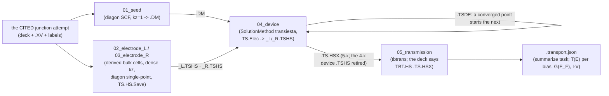
```mermaid
flowchart LR
    CITE["the CITED junction attempt<br/>(deck + .XV + labels)"]
    CITE --> SEED["01_seed<br/>(diagon SCF, kz=1 -> .DM)"]
    CITE --> EL["02_electrode_L / 03_electrode_R<br/>(derived bulk cells, dense kz,<br/>diagon single-point, TS.HS.Save)"]
    SEED -->|".DM"| DEVICE["04_device<br/>(SolutionMethod transiesta,<br/>TS.Elec -> <label>_L/_R.TSHS)"]
    EL -->|"<label>_L.TSHS · <label>_R.TSHS"| DEVICE
    DEVICE -->|".TSDE: a converged point starts the next"| DEVICE
    DEVICE -->|"<label>.TS.HSX (5.x; the 4.x device .TSHS retired)"| TBT["05_transmission<br/>(tbtrans; the deck says<br/>TBT.HS <label>.TS.HSX)"]
    TBT --> RESULT["<label>.transport.json<br/>(summarize task; T(E) per bias, G(E_F), I-V)"]
```

> **A bias scan is one submission, and the two walks over its points fail
> in opposite directions** (`jobset/submit.py::_plan_sweep`; the walk of a
> sweep that is one run, § 2a.11).
> Both are launcher layers — each `cd`s into the point's own folder and runs
> that point's own `.run.sh`. What differs is whether the points
> depend on each other:
>
> - the **device** walk hands the previous point's `.TSDE` (the NEGF
>   density) forward, so `V_{i+1}` converges from `V_i` instead of from
>   scratch — and therefore **stops on a failed point**: walking on would
>   converge from a state the failure poisoned;
> - the **transmission** walk hands nothing forward — each point re-reads
>   the device's saved H — so a bad point says nothing about the next: the
>   walk **continues**, and the exit code reports any failure.
>
> The rule follows the data, not the verb.
> Reading is asynchronous either way: `summarize task` is a READER, so a
> point whose transmission has not run yet reads as **pending**, never as
> a failure of the set (`transport/record.py`).

(`diagon single-point` = the electrodes have **no** MD block — single bulk
SCFs on cells DERIVED from the junction's labeled blocks.  The device H
lands in `<label>.TS.HSX` — SIESTA 5.x; tbtrans must be told with an
explicit `TBT.HS` line, measured live 2026-08-29 — while the electrode runs
still write `.TSHS` via `TS.HS.Save`.  `summarize task` writes the record —
§ 8.)

---

### 6a Why this table names roles and not functions *(2026-09-17)*

The version of § 6 above it enumerated each module **and its function list**.
On 2026-09-17, six of its nine rows named code that had been deleted that same
week — `electrode_wizard`, `render_script`, `parse_output`, the `TransportEngine`
Protocol, `TransportResults`, `transport/_cli.py`. A reader asking *"where is an
electrode derived?"* was sent to a symbol that does not exist.

**The same failure, the same week, in three other documents** — and this is the
point, because it means the cause is not transport:

| the list | declared | measured | what was missed |
|---|---|---|---|
| `process/conventions.md` § 3 | 13 commands | 19 | seven never added; `serve` had become a group |
| `web/presenters.md` § 1 | 5 viewers, 3 results | **6 and 4** | `bench-summary` — a whole presenter with its own category |
| `engines/overview.md` § 5 | *"engines self-register with `@register_engine`"* | no registry exists | the mechanism was deleted under the instruction |
| `engines/transport.md` § 6 | 9 modules | 3 of 9 rows true | the June era, listed as current |

**An enumeration must be hand-swept on every deletion; a rule need not be.**
Each of those four is a list maintained by hand, and each was missed by the very
sweep that correctly updated the *rules* around it — § 5's invariant table was
corrected on 2026-09-17 while § 6, twenty lines below it, was not.

**So the rule this section adds:** a contract enumerates only where **the list
itself is the guarantee**. § 5's thirteen invariants are a list because the SET
is what is promised — drop one and the promise changes. The catalogue's rows are
a list because a missing row is a missing keyword. A *pieces* table is not that:
it is a map for a reader, and a map stays true longer when it names **where a
role lives** than when it names **which functions implement it**, because roles
outlive refactors and function lists do not.

**And what to DO about it, which is two things, not a principle.**

**One: reduce the lists.** § 6 above names roles, not function lists — three
fewer things to keep true per module. That is the part that needed no mechanism.

**Two: assert the lists that must remain, by MEMBERSHIP.** Some enumerations
genuinely are the contract and cannot be dissolved — the six presenters, the 97
routes, the 19 commands. For those the repo had an answer:
`tests/test_doc_claims.py::test_the_documented_L1_index_is_the_enforced_one`
compared `architecture.md`'s L1 index against `test_layering.py`'s set in both
directions, and on 2026-09-17 it failed **the moment** a module was deleted
without the document being swept. *(Both retired 2026-09-27: the second list
was a source scan's copy, and the layer rule is review's — `process/code-audit.md`
§ 1c (e).)* The pattern stands for a list a running product states — the
routes the app serves, the commands the CLI accepts (`plans/plan.md`
§ 5p.3p.8).

> **Membership, never a count — the count hides an even number of errors.**
> `web-api.md` § 3's heading says *"all 97 routes"* and a test asserts that
> number against Flask's URL map. On 2026-09-17 it **passed** while the index
> listed a route deleted that week *and* omitted a live one: the extra and the
> missing cancelled. The same shape appeared in `test_aggregator.py`, which
> asserted the validator registry with `<=` — a subset check, under which a dead
> row can sit forever. Both are now equality over the SET.

**What is NOT the answer**, measured so nobody re-proposes it: a general lint
resolving every backticked symbol in every document produced **6,318 candidate
findings** on its first run here, almost all English words in backticks and
frozen archive text. Doc-citation hygiene at that scale is not work. The three
named tables are, because each one is a contract a reader acts on.

---

### 6.1 Five stages, four deck texts, two binaries — and what integrates them

The diagram above follows the *files*.  This one follows the *scripts*,
because "one calculation" here is **separate executions of an engine binary —
one per rung, and one per bias point on a rung that sweeps it — each `cd`-ed
into its own directory, each reading its own `.fdf`** — and that is the fact
every other question about transport hangs off.

Two things are easy to get wrong and both are visible here:

* **Five stages do not mean five deck texts.**  There are **four** since
  2026-09-29 — the device and the transmission are separate texts, because
  two programs read them (§ 6.1b).  *(Three until then: the device and the
  transmission deck were the same text, only the binary pointed at them
  differing (`Resources.program`), on the claim that "`TBT.*` keywords are
  inert to `siesta` and `TS.*` to `tbtrans`, so one text can serve both".
  Measured 2026-09-29, the first half holds and the second does not —
  `tbtrans` reads the `TS.*` electrode and chemical-potential declarations
  and takes several `TS.*` values as its defaults.)*
  > **Resolved 2026-09-16 (§ 2a.14), and superseded 2026-09-29 (§ 6.1b)** —
  > the two rungs have a layout each since, because two programs read them.
  > As it stood: both rungs render from ONE layout but
  > each resolves its OWN config, so the two decks share their *shape* — the
  > same junction, the same electrode declarations, the same electronic
  > description — and differ in exactly those values a person tuned for the
  > transmission. That is what § 2a.7's ruling asked for, reached without
  > anyone having to decide which keywords `tbtrans` requires. What keeps the
  > two runs from drifting apart about what the junction IS was never
  > byte-identity; it is the **shared Class A values** (§ 2a.3).
* **Nothing is "integrated" at the end.**  Integration happens *between*
  stages, as files, at prep time — `prep` copies a finished upstream
  stage's output into the next stage's run directory before that stage
  ever runs.  There is no post-processing step that merges five results;
  the merge is that stage N+1's SCF starts from stage N's matrices.

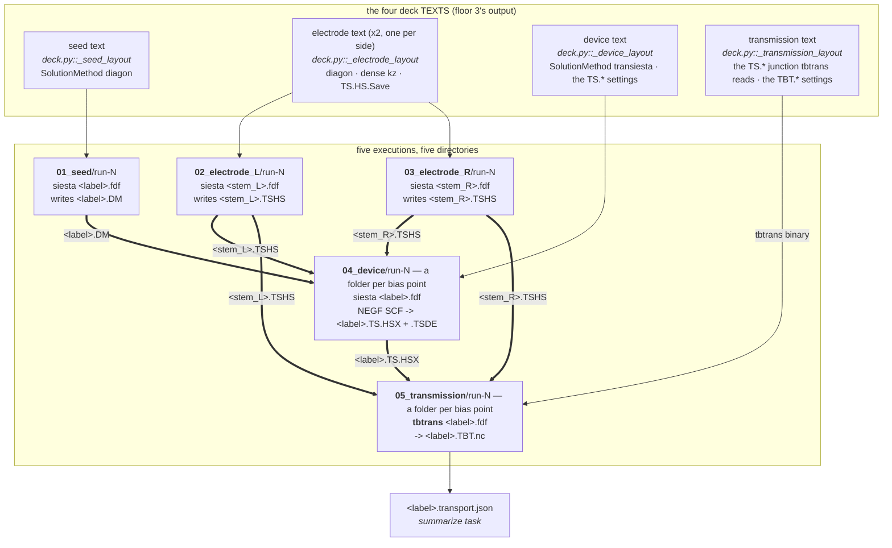
```mermaid
flowchart TB
    subgraph TXT["the four deck TEXTS (floor 3's output)"]
      direction LR
      T1["seed text<br/><i>deck.py::_seed_layout</i><br/>SolutionMethod diagon"]
      T2["electrode text (x2, one per side)<br/><i>deck.py::_electrode_layout</i><br/>diagon · dense kz · TS.HS.Save"]
      T3["device text<br/><i>deck.py::_device_layout</i><br/>SolutionMethod transiesta · the TS.* settings"]
      T4["transmission text<br/><i>deck.py::_transmission_layout</i><br/>the TS.* junction tbtrans reads · the TBT.* settings"]
    end

    T1 --> S1
    T2 --> S2
    T2 --> S3
    T3 --> S4
    T4 -->|"tbtrans binary"| S5

    subgraph RUN["five executions, five directories"]
      direction TB
      S1["<b>01_seed</b>/run-N<br/>siesta &lt;label&gt;.fdf<br/>writes &lt;label&gt;.DM"]
      S2["<b>02_electrode_L</b>/run-N<br/>siesta &lt;stem_L&gt;.fdf<br/>writes &lt;stem_L&gt;.TSHS"]
      S3["<b>03_electrode_R</b>/run-N<br/>siesta &lt;stem_R&gt;.fdf<br/>writes &lt;stem_R&gt;.TSHS"]
      S4["<b>04_device</b>/run-N — a folder per bias point<br/>siesta &lt;label&gt;.fdf<br/>NEGF SCF -> &lt;label&gt;.TS.HSX + .TSDE"]
      S5["<b>05_transmission</b>/run-N — a folder per bias point<br/><b>tbtrans</b> &lt;label&gt;.fdf<br/>-> &lt;label&gt;.TBT.nc"]
    end

    S1 ==>|"&lt;label&gt;.DM"| S4
    S2 ==>|"&lt;stem_L&gt;.TSHS"| S4
    S3 ==>|"&lt;stem_R&gt;.TSHS"| S4
    S2 ==>|"&lt;stem_L&gt;.TSHS"| S5
    S3 ==>|"&lt;stem_R&gt;.TSHS"| S5
    S4 ==>|"&lt;label&gt;.TS.HSX"| S5
    S5 --> REC["&lt;label&gt;.transport.json<br/><i>summarize task</i>"]
```

**The bold arrows are the integration, and they are not free.**  Each one is
a row in `stages.py::stage_inputs` — the DAG as data, not as control flow —
and `prep` walks it at its checkpoint 4a, with what every stage continues
from ([`job-system.md`](?doc=execution/job-system.md) § 5.0), in
`jobset/prep.py::transport_inputs`, which takes an upstream file only if
**three gates** all pass — then copies it into the run it opens:

| gate | what it refuses |
|---|---|
| the upstream stage is prepared | citing a stage that was never set up |
| its **newest** attempt FINISHED, **and its deck matches the deck that rung renders NOW** — from the current template, junction and run card, byte for byte but for its stamps — when and by which build it was written (`same_calculation`); never the stage folder's last render, which a change since leaves as it was (plan § 5w K11); for a swept transmission, the device's sweep run whose points are all done, each point its own (§ 2a.11) | integrating a result produced by a *different* deck — the silent-wrong-answer case. A mismatch is a mistake, refused by name |
| that attempt actually holds the named file | a run that concluded without writing what it promised |

The newest attempt is the one asked: one that fails a gate is refused by
name, never passed over for an older one (`job-system.md`, *The task*, D5) —
and the copy records its provenance in `.gathered-from`.  The byte-for-byte deck gate is the load-bearing
one: it is what makes "the device's H and the electrodes' H were built on the
same basis, XC, mesh and electronic temperature" a *checked* fact rather than a
hope (§ 5).

**Why each stage needs a different text, in one line each** — this is the
per-stage axis that § 3.2's floor-3 migration has to serve, and it is the
reason a *single* set of parameter values cannot describe the ladder:

| | `SolutionMethod` | k along transport | writes | why it differs |
|---|---|---|---|---|
| seed | `diagon` | 1 | `.DM` | an ordinary closed periodic SCF, only to give the NEGF cycle a starting density |
| electrode | `diagon` | **dense** (`electrode_kz`) | `.TSHS` | a genuinely periodic *bulk* run — its Fermi level must be well converged, so this axis must be sampled |
| device | `transiesta` | 1 | `.TS.HSX`, `.TSDE` | an **open** boundary: there is no periodicity along transport to sample |
| transmission | none written — `tbtrans` runs no SCF | `TBT.k` | `.TBT.nc` | reads the device's saved H; samples the *transverse* BZ for T(E) |

Two rows of that table are the same keyword — `SolutionMethod` — carrying
**two different values within one calculation**.  That is not expressible as
"one config filled from one template row", and it is why the migration's unit
of resolution has to be the **stage**, not the task.

#### 6.1a Why there is no per-stage parameter here

*Investigated and rejected 2026-09-15.  Recorded because it looks like an
obvious gap and is not one — the shape of the table above invites exactly this
mistake, and it was made.*

The table above shows `SolutionMethod` carrying **two different values within
one calculation** — `diagon` on the seed and the leads, `transiesta` on the
device — so it reads like a parameter whose unit of resolution should be the
**stage**: a transport twin of
[`SIESTA_STAGE_PRESETS`](?doc=engines/stages.md), stated once per rung and
sealed against the person.  That was built, and it was wrong.

**These values are not parameters anyone answers.  They are the identity of
the rungs.**  The dispatch is *total and exclusive* over the five rungs —
`SHAPE_OF_RUNG` is the table, and every rung renders through
`transport/deck.py`:

| rung | shape | the layout that renders it | and therefore |
|---|---|---|---|
| seed | `seed` | `deck.py::_seed_layout` | `SolutionMethod diagon` is what makes it *the seed deck* |
| electrode_L / electrode_R | `electrode` | `deck.py::_electrode_layout` | `diagon` + `TS.HS.Save true` is what makes it *an electrode deck* |
| device | `device` | `deck.py::_device_layout` | `SolutionMethod transiesta` is what makes it *an NEGF deck* |
| transmission | `transmission` | `deck.py::_transmission_layout` | `TBT.HS` naming the device's Hamiltonian, and no `SolutionMethod`, is what makes it *a tbtrans deck* (since 2026-09-29, § 6.1b; the device and the transmission shared `_negf_layout` until then) |

> **Corrected 2026-09-16.** This table named `stages.py::_render_seed` (deleted),
> `wizard.py::render_electrode_fdf` and `transiesta.py::render_script`, dispatched
> from `stages.render_stage_deck` — which has **no production caller**. A reader
> fixing a keyword here would have edited code that renders nothing on this path.
> The two functions that were reachable only from their own standalone doors
> (`molbuilder transport electrode` and `/api/transport/render`) are **deleted
> with those doors**, 2026-09-17.
>
> The identity is now enforced by the `role` marker rather than by which function
> runs: `solution_method` carries `role = ["transport"]` and
> `role_values = { device = "transiesta" }`, so no transport template answers it,
> `resolve` puts each rung's answer into that rung's config, and the SCF section
> writes it *(since 2026-09-29; the rung's own emitter typed it until then)*.
> Measured — seed and lead render
> `diagon`, device renders `transiesta`.

There is no valid device deck that says `diagon` — that would be an ordinary
closed-boundary single-point which converges and means nothing (§ 2).  So the
rung → value mapping is **declared once, on the item** (`role_values`), and
laid on each rung's config by `resolve`, the one door every prep goes through;
no template, stage override, pin or sweep may set it
([`template.md`](?doc=engines/template.md) § 6.4).  Wrong when a deck is
rendered without `resolve`: a bare config holds the class default, `diagon`,
so such a caller lays the rung's answers through `template.role_answers`
first, as the live-path test does.  *(Until 2026-09-29 the value was a literal
in each rung's block, and the settings gate and the record read the config's
`diagon` for a deck that said `transiesta`.)*

> **The two callers that proved it are both gone, and the rule outlived them.**
> The measured symptom in 2026-08 was a rendered device script that solved with
> `diagon`, from two callers which built a config without setting the field:
> the Transport tab's render endpoint and `engine_base`'s own documented usage.
> `POST /api/transport/render` and `transport/engine_base.py` were **deleted
> 2026-09-17**, so neither can reproduce it — *and that is exactly why the rule
> is stated here rather than left to the callers.* A fact about the RUNG is not
> a default a caller may forget; it is `role = ["transport"]` with the device's
> own answer declared on the item, and `resolve` hands every rung its answer.

**The tests that hold it.**
`test_transport_prep.py::TestTheRungFixesItsOwn::test_each_rung_writes_what_it_fixes_from_its_config`
preps the ladder through `molbuilder jobset prep` and reads each rung's line
and its *fixed* note — the device's `transiesta`, the leads' `diagon` and
`TS.HS.Save` — and the class's other tests refuse a rung's own bias and a
template's.
`test_transport_au_bdt_au_validation.py::test_the_device_deck_states_its_identity_and_method`
reads the device deck the live path renders for the NEGF solver, and for the
absence of `TS.SolutionMethod`.  *(It was named
`…::test_render_script_emits_correct_atom_counts` and drove the deleted
renderer until 2026-09-17.)*

**The general rule this is an instance of.**  Before offering a keyword as a
parameter, ask who can answer it.  If only the rung can — the value is what
makes the deck the deck it is — it is not the person's to answer: it is `role`,
its answer declared on the item, and no door but the rung's sets it.  A
parameter the person answers is for a question the *person* can answer
differently without the deck stopping being the deck it is.  Under that test the three candidates fail and the genuinely
per-stage-looking fourth — the k-axis — fails differently: the device is
sampled 1 along transport and the lead densely (`electrode_kz`), but those are
two different **cells**, so it is the k-point mesh's composition of one
person-answered transverse grid (`kmesh.mesh_for`,
[`siesta.md`](?doc=engines/siesta.md) § 6.1), not one parameter with two values.

**What transport actually lacks is nothing to do with stages.**  The 21 SIESTA
keywords in § 3.2 that cannot reach any transport deck — `MaxSCFIterations` and
`DM.Tolerance` among them, the reason a seed ran 1000 iterations and died
`SCF_NOT_CONV` — are person-answered and **transport-wide**, identical on every
rung.  They need floor 3's `spec_for` arm (§ 3.6 items 1–4).  No per-stage
mechanism would have delivered one of them.

*(**Stale — corrected 2026-09-23.** This said `electrode_kz` "remains a separate
open defect ... a control that does nothing", citing `render_stage_deck`, which
was deleted 2026-09-17. § 2a.14 measured the lead deck rendering `0 0 40` and
§ 5 I9 named `_validate_transport_kind` as its holder — `electrode_kz`'s own
limit and range since 2026-09-30. The row reaches the deck.
The unread module constant `wizard.DEFAULT_ELECTRODE_KZ` — § 3.7's last row,
and X1 ② — was deleted 2026-10-02.)*

---

### 6.1b The two programs, and what each one reads — measured *(2026-09-29)*

**Two programs run a transport calculation, and they read the same kind of
file.** The keyword prefix says which program a line is for:

| prefix | the program | the rung | what it does |
|---|---|---|---|
| `TS.*` | **TranSIESTA** — `siesta` itself, switched into NEGF mode by `SolutionMethod transiesta` | the **device** | solves the junction self-consistently with the two leads attached as semi-infinite reservoirs, at one bias; writes the converged Hamiltonian, `<label>.TS.HSX` |
| `TBT.*` | **TBtrans** — the separate `tbtrans` program | the **transmission** | no self-consistency: reads the device's converged Hamiltonian and the leads' `.TSHS`, and computes T(E) on an energy grid — plus, when asked, densities of states and eigenchannels. Cheap, so it is re-run freely against an unchanged device |

The electrode rungs also carry one `TS.*` keyword, `TS.HS.Save`, which makes a
lead's ordinary SIESTA run write the `.TSHS` the device attaches.

#### What each program reads — the evidence, and where it came from

Read in the engine's own source at the tag this project installs — SIESTA
5.4.2, `Util/TS/TBtrans/` and the `libfdf` it pins (commit `206a3d6c`) — and
cross-checked against the installed binaries (2026-09-29):

| what | the engine's own rule | where |
|---|---|---|
| **`siesta` reads no `TBT.*` keyword** | the `siesta` binary holds no `TBT.` label, and the last device run's report of its settings lists none | the 5.4.2 binary; `claude-w33` device run-1, 2026-09-26 |
| **`tbtrans` reads the `TS.*` junction description** | the electrodes are `TBT.Elecs` / `TBT.Elec.<name>`, and when none is given, `TS.Elecs` / `TS.Elec.<name>`; the same for the chemical potentials (`TBT.ChemPots` → `TS.ChemPots`) and the buffer atoms | `m_tbt_options.F90` 116–118, 156–195, 261–337 |
| **and several `TS.*` values as the defaults of its own — and a plain SIESTA one** | `TBT.Voltage` defaults to `TS.Voltage`; `TBT.Elecs.Bulk` to `TS.Elecs.Bulk` (itself true by default); `TBT.Elecs.Eta` to `TS.Elecs.Eta` (itself 1 meV); the temperature is SIESTA's own `ElectronicTemperature`, then `TS.ElectronicTemperature`, then `TBT.ElectronicTemperature` | `m_tbt_hs.F90` 109–110; `m_tbt_options.F90` 151–153, 285–289 |
| **`TBT.k` is a list or a block — nothing else** | `TBT.k [2 2 1]` or `%block TBT.k` is read; any other form falls through to `%block TBT.kgrid.MonkhorstPack`, then to the SCF's own `kgrid.MonkhorstPack` — which is `kgrid_Monkhorst_Pack`, since fdf drops `_ . -` and case when it compares labels. **A list is only a list in brackets** | `m_tbt_kpoint.F90` 800–810 (`setup_kpoint_grid`), 103–127; `libfdf` `parse.F90` 1726 (*"if the token starts with [ and ends with ], it will be a list"*), `utils.F90` 113–162 (`labeleq`) |
| **the device Hamiltonian is found by name** | `TBT.HS` when given; otherwise the first of `<label>.TS.HSX`, `.TSHS`, `.HSX` that exists | `m_tbt_hs.F90` 210–220 |
| **`TBT.Verbosity` defaults to 5** | `init_verbosity('TBT.Verbosity', 5)` | `tbt_reinit_m.F90` 206 |

**A defect this found, in the deck as it was written until 2026-09-29:** the
transmission rung wrote `TBT.k                  2 2 1` — three integers,
neither a list nor a block — so `tbtrans` skipped it and samples the SCF's grid from the same deck. It
has not changed an answer yet: `jobset init` sets `tbt_k_grid` to the cited
run's transverse grid, which is the SCF's. But a person who raises it for the
convergence study § 0.3 describes would be ignored in silence. Written
`TBT.k [2 2 1]`, it is read. *(Nothing ever caught it: no transmission rung has
run since `TBT.k` joined the deck on 2026-09-15. Since 2026-09-30 it is written
as the block, which carries the offset.)*

**And a reason this document gave that the source does not support:** the
device-deck comment says `tbtrans` "looks for `<SystemLabel>.HSX` unless told",
citing the 2026-08-29 failure *"Could not read CT.HSX"*. The source looks for
`.TS.HSX` first, so that failure means `CT.TS.HSX` was not in the directory. The
explicit `TBT.HS` line stays — it names the file rather than leaving the choice
to which files happen to exist — and its comment gives the source's rule.

*(This section replaces a claim § 6.1 made — "`TBT.*` keywords are inert to
`siesta` and `TS.*` to `tbtrans`, so one text can serve both" — and that the
device deck's own header repeated. The first half holds; the second does not.)*

#### What the device run actually used — traced, 2026-09-26

The device rung of `claude-w33/transport/au333bdt-t` (run-1, SIESTA 5.4.2),
its deck set beside TranSIESTA's own report of what it used:

| what it decides | the deck molbuilder wrote | what TranSIESTA reported using | came from |
|---|---|---|---|
| which atoms each lead is, and its bulk file | `%block TS.Elec.L` / `.R`: the `.TSHS`, 27 atoms from the first / to the last, `bloch 1 1 1`, semi-infinite −A3 / +A3 | 27 / 27 atoms at 1–27 and 94–120, Bloch 1×1×1, negative / positive along E3 | the deck — derived from the region labels |
| the two reservoirs and the bias between them | `TS.ChemPot.Left` / `.Right` at μ = ±V/2, `TS.Voltage 0.0000 eV` | voltage 0, chemical shift 0 | the deck |
| the lead region inside the device takes the lead's bulk Hamiltonian | `TS.Elecs.Bulk true` | "Bulk H, S in electrode region = T" | the deck |
| how the equilibrium density integral is taken | `TS.Contours.Eq.Pole 10.0000 eV` | a continued fraction with 123 poles | the engine's rule, on the deck's value |
| the leads' self-energy broadening | — not written | 1 meV | TranSIESTA's default |
| the solver; the electrostatic boundary | — not written | the BTD solver; the Hartree potential fixed at the cell boundary (`-C`) | TranSIESTA's defaults |
| the 300 K smearing | `ElectronicTemperature` (a shared value) | 300 K, on both leads too | the deck |

The same deck also carried the whole `TBT.*` set, and the run's report shows
none of it: it was text `siesta` never read.

#### The rulings that follow *(M5 step 1; user, 2026-09-29)*

* **Each deck carries what its own program reads** — § 2a.7's second ruling,
  now measured. The **device** deck carries no `TBT.*` line: `siesta` ignores
  them, and a reader of the deck would take them for settings of the run. The
  **transmission** deck carries its `TBT.*` settings AND the `TS.*`
  declarations `tbtrans` reads — the electrodes, the chemical potentials, the
  voltage, the leads' bulk treatment. It also keeps the SIESTA settings the two
  rungs share: `tbtrans` reads at least one of them (`ElectronicTemperature`),
  and which others it reads is an audit of its source not yet made — so none is
  removed until that audit says it may be. *Two groups are audited and removed
  (2026-09-29, K1)*: `SolutionMethod` and the output group (`WriteForces` …
  `SaveHS`) — `tbtrans` compiles none of the files that read them
  (`read_options.F90`, `write_subs.F`, `outcoor.f`) and its own options read
  none (`m_tbt_options.F90`; its solver is `TBT.SolutionMethod`).
* **The leads' bulk treatment is ONE value for the device and the
  transmission** — `electrodes_bulk`, a shared value. TranSIESTA reads it for
  the device's self-consistent run, and `tbtrans` takes `TS.Elecs.Bulk` as the
  default of its own `TBT.Elecs.Bulk` (`m_tbt_options.F90` 285–286); were it
  the device's alone (as `elecs_bulk` was, `stages = ["device"]`), a change
  there would leave the transmission deck on the template's value, and
  `tbtrans` would treat the leads differently from the device it reads. *(Named `elecs_bulk` until 2026-09-29. The name is
  molbuilder's, so it is written out — user: "electrodes_bulk would be my
  recommendation"; the keyword `TS.Elecs.Bulk` is TranSIESTA's own word and
  unchanged.)*
* **Every `TS.*` and `TBT.*` value that is a setting reaches the deck
  through the catalogue** (§ 3.6 item 2), with its note above it saying what
  it decides and which program reads it; each section's heading says whose
  run it belongs to, since the deck is that rung's. Most are written by the
  section walk, where the check gate sees each line — `TS.Voltage` (a `role`
  item, the rung's bias point) among them since 2026-09-29 — and the T(E)
  window's three values are written by the rung's own block, each asked of
  the framework's door and written with its note. `TBT.HS` is a rung line derived from the label, not
  a setting, and has no row. An item left at a zero that means *the
  program's own rule* writes nothing, and its note says so. The electrode
  declarations stay a block: they are derived from the region labels, and no
  parameter models them.
* **`TBT.k` is written as a list, `TBT.k [2 2 1]`** — the only line form
  `tbtrans` reads (§ 3.6 item 2's list emitter); the bare triple it carried
  until 2026-09-29 was skipped. *(Superseded 2026-09-30: always the block,
  which carries the cited offset — `kmesh.write`,
  [`siesta.md`](?doc=engines/siesta.md) § 6.1.)*
* **`TBT.Verbosity` gets its catalogue row** (§ 2a.13, *what this map says is
  missing*), at `tbtrans`'s own default, 5 (`tbt_reinit_m.F90` 206).

### 6.1c Before any device runs — the contour stated, vacuum by axis, TBtrans's outputs on *(M5 step 2; user, 2026-09-29: `plan.md` § 5u.2 TD1, TD3; W35 decision 7)*

#### The equilibrium contour: an energy, always written, with the count it gives

**What the number is.** TranSIESTA builds the device's density from its
Green function, integrated over energy. The equilibrium part of that
integral is not taken along the real axis, where the Green function is
sharp, but on a contour in the complex plane, where it is smooth — and the
Fermi function then contributes a set of **poles up the imaginary energy
axis**. `TS.Contours.Eq.Pole` says **how far up that axis the poles are
taken**, and so it is an **energy**, not a count. TranSIESTA turns it into a
count by its own rule, on the continued-fraction branch our deck shape takes
(SIESTA 5.4.2 `Src/m_ts_chem_pot.F90`: the branch at `:299`, the rule at
`:319`):

```
N = int( E_pole / (π · k_B · T) )      and the run stops when N < 20  (:324)
```

So the count depends on the electronic temperature — the same energy gives
fewer poles hotter — and the deck says the count beside the energy, at the
run's own temperature: `TS.Contours.Eq.Pole    10.0000 eV   # 123 poles at
300 K`. (`TS.Contours.Eq.Pole.N` is also read, `:113`, but this branch
overwrites it from the energy, so it cannot act here — `plan.md` § 5p.3o.)

**Measured, at 300 K** (`π k_B T` = 81.2 meV):

| the deck states | poles | what happened |
|---|---|---|
| 1.5 eV (this project's default until 2026-09-17) | 18 | TranSIESTA refused it, after the queue wait |
| nothing (TranSIESTA's own choice, `E = 0.7 · 60 · π k_B T`, `:316`) | 42 | `claude-w33`'s device lost the charge: 584 electrons off after 1000 iterations |
| 4 eV | 49 | — (the manual asks for at least 50) |
| 10 eV | 123 | the same device, the decks differing in this one line, held the charge to 0.024 by step 4 |

**The ruling.** `negf_eq_pole_ev` defaults to **10 eV** and is **always
written**, the count beside it; a stated energy that gives fewer than 20
poles at the run's temperature is refused before the queue wait, and the
refusal names the least energy that is accepted. 0 no longer means *let
TranSIESTA choose* (§ 5p.3o's reading, superseded: TranSIESTA's own choice is
the 42 that lost the charge), and it is not an energy TranSIESTA takes — the
branch reads the energy only when it is positive (`:318`), so the count stays
at `TS.Contours.Eq.Pole.N`'s default of 8 and the run stops at the floor.
**The temperature has a floor of its own**: TranSIESTA stops below 10 K before
it counts a pole — *"TranSiesta electronic temperature \*must\* be larger than
10 kT"* (`m_ts_options.F90`:258–262, and per chemical potential :284–288) — so
that is refused too. The range the form offers is 1–40 eV: 10 eV gives fewer
than 20 poles above 1847 K, and the electronic temperature runs to 5000 K,
where 27.1 eV is needed. It is
the device's alone (`stages = ["device"]`): `tbtrans` integrates no density.
**The 10 eV is interim** — M3 P4's stated contour (`contour.eq` inside the
chemical potential's block, W35 decision 2) replaces it, and the first
device run may say sooner.

**One home for the rule.** `transiesta.pole_count` is TranSIESTA's rule
written once — with its inverse, `pole_energy_for`, the least energy that
gives a count (rounded up, since the count truncates), and the two floors,
`MIN_EQ_POLES` and `MIN_TS_TEMPERATURE_K`; the settings gate asks them for
the refusal, and the deck's context asks for the count the line states.

#### Vacuum, by axis — measured from the lead

A transport structure may state vacuum anywhere (`model/structure-periodicity.md`
owns periodicity), but a transport calculation cannot use vacuum where its
declaration says the crystal continues:

| axis | declared | the settings gate | why |
|---|---|---|---|
| transport (`c`) | any | **refuses** a room at the boundary above 1.5 of the lead's interlayer spacings | the leads continue through the boundary into the periodic image, so the room there is exactly one layer spacing of the lead (2.40 Å on the Au–BDT–Au junction), not zero; more is a gap, and a gap makes the lead a surface (I12) |
| transverse (`a`, `b`) | `periodic` | **refuses** a lead that does not reach across the boundary: its closest approach there above 1.5 of its own nearest-neighbour distance — **each lead on its own**, and named | periodic says the crystal continues across the boundary, and vacuum contradicts the declaration |
| transverse | `isolated` | **allows** it | a wire or chain lead is vacuum-surrounded across the transport axis — the standard TranSIESTA setup — and the vacuum is the one the structure states |

**How each is measured.** *The lead* is the electrode-labelled atoms — the
whole structure on an electrode rung, which has no labels. *The room* along
transport is vertical, as `cell.classify_seam` measures a seam's: the lowest
atom's image one cell up, less the highest atom. *The spacing* is the median
step between the lead's atomic layers (`cell.detect_layers`). *The reach*
across a transverse boundary is the shortest distance from a lead atom to the
image of a lead atom one lattice vector along that axis; *the bond* is the
lead's shortest interatomic distance inside the cell. **Both use the seam
rule's factor, `cell.SEAM_VACUUM_FACTOR` = 1.5**, for the seam rule's reason: a
boundary is a seam only when the faces across it are close enough to be
bonded, and 1.5 sits above any real relaxation and far below the room even a
thin vacuum layer opens. A lead too small to measure — one layer, one atom —
is said, never passed in silence. **Each lead is measured on its own** —
pooled, a lead that tiles hides one that does not on the junction's rungs,
while the electrode rung that sees the second alone refuses the same
calculation, and two one-atom leads measure the distance between the leads
as a bond.

**What the transverse check does not catch.** It catches vacuum, not a cell
that is one atom column too long: a multi-layer fcc(111) lead in such a cell
is still bonded across the boundary through its next layer (the reach 4.08 Å
against a 2.88 Å bond, 1.41) and passes; a single-layer lead does not (1.73).
A correctly tiled fcc(111), (100) or (110) lead measures 1.000.

**The declaration reaches the junction.** `compose` takes the transverse
kinds the cited relaxation's deck recorded — its ENGINE-OFFSET block carries
the structure's `axis_kind` — and states transport along z; it stated every
junction periodic across until 2026-09-29, which made a wire's vacuum a
contradiction. The lead cut from the junction keeps the pair
(`ElectrodeModel.transverse_kind`). A deck written before that record states
no kinds, and its junction is read periodic across; a record that states
anything but `periodic` or `isolated` across is refused, never read as the
old default. **Correcting the kinds today means a new relaxation**: the kinds
come from the cited attempt's deck, a launched attempt is never rewritten,
and a calculation composed before keeps the kinds it was composed with
(`load_compose_record` reloads the junction it wrote) — so the structure is
declared isolated on the Cell page, relaxed, and that relaxation cited. A
lighter door is `plan.md` § 5u.2's TD13.

This replaces I12's fixed 3.0 Å warning
(§ 5), which only warned, and whose one number was wrong both ways: a lead
spaced wider than 3 Å (a graphite-like stack, 3.35 Å) is warned at its perfect
seam, and one spaced 1.44 Å (Au(110)) passes a missing layer.

#### TBtrans's outputs, on

For a two-electrode junction `tbtrans` writes T(E) and nothing else unless
asked: `TBT.T.Eig`, `TBT.DOS.Gf`, `TBT.DOS.A`, `TBT.DOS.Elecs` and `TBT.T.Bulk`
all default off when there are two electrodes (`m_tbt_options.F90` 535–565).
W35 decision 7 asks for all of it, so the catalogue defaults them **on**: the
device DOS (`TBT.DOS.Gf`), the spectral DOS from the electrodes (`TBT.DOS.A`
— `tbtrans` computes it for every electrode but the last unless
`TBT.DOS.A.All` is set, `m_tbt_trik.F90`, so with two leads the left one's), the
leads' bulk DOS and bulk transmission (`TBT.DOS.Elecs`, and `TBT.T.Bulk`,
which writes the bulk transmission and implies the bulk DOS, 547–553), and
**four eigenchannels** (`TBT.T.Eig 4`, the shipped value in § 2a's transmission
panel). `TBT.T.All` stays at `tbtrans`'s own default. **The cost is stated,
not hidden**: the eigenchannels and the two device DOS switch off the path
`tbtrans` takes when only T(E) is asked (`only_T_Gf`, 525–565), so the
transmission rung computes more per energy point — accepted, so that the
first ladder writes what M3 P3 draws.

---

### 6.2 What happens to the STRUCTURE — citation to deck, hop by hop

*Written 2026-09-23. § 6's diagram follows the files and § 6.1 follows the
scripts; neither follows the **structure**, and that gap has now produced two
separate reviews reaching opposite wrong conclusions about the same twenty
lines. This section is the third view.*

**The one sentence.** A transport calculation never builds a structure — it
takes one that already exists, states the three facts SIESTA could not record,
reorders it, and hands two views of it to the renderer.

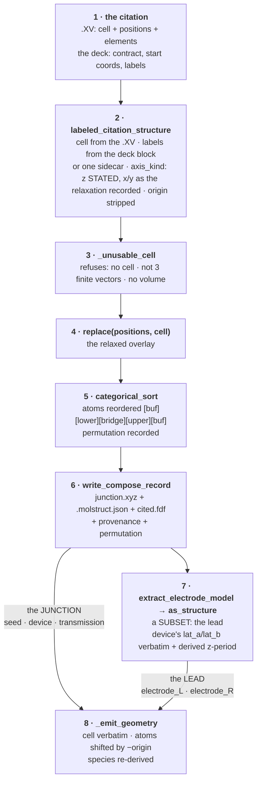
```mermaid
flowchart TB
    XV["<b>1 · the citation</b><br/>.XV: cell + positions + elements<br/>the deck: contract, start coords, labels"]
    LOAD["<b>2 · labeled_citation_structure</b><br/>cell from the .XV · labels from the deck block<br/>or one sidecar · axis_kind: z STATED, x/y as the relaxation recorded · origin stripped"]
    GATE["<b>3 · _unusable_cell</b><br/>refuses: no cell · not 3 finite vectors · no volume"]
    OVER["<b>4 · replace(positions, cell)</b><br/>the relaxed overlay"]
    SORT["<b>5 · categorical_sort</b><br/>atoms reordered [buf][lower][bridge][upper][buf]<br/>permutation recorded"]
    REC["<b>6 · write_compose_record</b><br/>junction.xyz + .molstruct.json + cited.fdf<br/>+ provenance + permutation"]
    EX["<b>7 · extract_electrode_model → as_structure</b><br/>a SUBSET: the lead<br/>device's lat_a/lat_b verbatim + derived z-period"]
    EM["<b>8 · _emit_geometry</b><br/>cell verbatim · atoms shifted by −origin<br/>species re-derived"]

    XV --> LOAD --> GATE --> OVER --> SORT --> REC
    REC -->|"the JUNCTION<br/>seed · device · transmission"| EM
    REC --> EX -->|"the LEAD<br/>electrode_L · electrode_R"| EM
```

**Hops 1–6 happen once**, at the first prep; hop 6 writes the record and every
later prep re-enters at hop 6 by reading it back. **Hops 7–8 happen per rung**,
and hop 7 only for the two electrode rungs.

#### What each hop does to the BOX

| hop | the cell | why |
|---|---|---|
| 1 | SIESTA wrote it into the `.XV` | a fixed-cell relaxation ends in the box it started in |
| 2 | read from the `.XV`, **never from the atoms** | § 7: the box is not recoverable from atom extents. If a sidecar carries the labels, its `cell` is *completed* from the `.XV` rather than allowed to replace it |
| 3 | **refused** if absent, non-finite or flat | the citation is the one place user input enters, so it is the one place that checks — and transport derives no cell of its own, by ruling (§ 2a.9; I14) |
| 4–5 | carried through `replace()` | a reorder states the per-atom fields and nothing else, so the box rides along untouched |
| 6 | written to the sidecar, read back verbatim | |
| 7 | **lateral taken verbatim, transport DERIVED** | the two halves differ on purpose — see below |
| 8 | emitted verbatim | |

#### Hop 7 is the one that confuses people

The lead's box is built from two different kinds of number, and calling both of
them "derived" is what has gone wrong twice:

| | where it comes from | may it be computed? |
|---|---|---|
| **lateral `a`, `b`** | the device's own lattice vectors, **copied** | **no.** This is invariant I6. A computed transverse box severs the crystal — a rectangle cannot tile a 60° hexagonal Au(111) lattice, so the lead would be a different metal from the device it came out of |
| **transport `c`** | `z_span + d_interlayer`, **computed** (`cell.bulk_z_period`) | **yes, and it must be.** A finite slab does not state its own bulk repeat. § 7.1: this is the one number the person is asked to verify, and the lead's card reports whether the resulting seam `CONTINUES`, is `ECLIPSED` or is a `TWIN` |

So *"derived"* is not the thing to be suspicious of. **"Fabricated from atom
extents"** is.

#### A worked example

An illustrative Au(111) junction — six lead layers a side, a molecule between:

```
the junction, from the citation
    cell   a = (17.30, 0.00, 0)      <- 60 degrees, hexagonal
           b = ( 8.65, 14.98, 0)
           c = ( 0,     0,    46.2)  <- the device length
    axis_kind  periodic, periodic, transport

the lead, extracted from the L-electrode region
    cell   a = (17.30, 0.00, 0)      <- COPIED, character and all
           b = ( 8.65, 14.98, 0)     <- COPIED
           c = ( 0,     0,    14.4)  <- COMPUTED: 12.0 span + 2.40 spacing
    axis_kind  periodic, periodic, periodic   <- bulk along transport; the
                                                 transverse pair is the device's own
```

The lead's `b` keeps its `14.98` y-component. That single number is what I6
buys: drop it and you have a rectangle, and the gold no longer joins up
sideways.

#### What each hop does to the rest of the METADATA

| | carried | notes |
|---|---|---|
| regions, annotations, `info`, identity | hops 2→6 | `replace()` names the per-atom fields and carries everything else, so the label store, the recorded contract and the identity columns all survive the sort |
| regions, annotations, `info`, identity | **hop 7 — NOT carried** | `as_structure()` states elements, positions, title, cell and `axis_kind`, and nothing else. A lead therefore renders with no region partition (correct — it has no partition to state), and also with no recorded contract and no identity columns |
| `axis_kind` | **z stated at hop 2; x and y as the relaxation recorded them** *(since M5 step 2)* | along z it is a fact of *being a transport calculation*: I8 settles it, z is open. Across z it is the person's declaration, and the relaxation's deck recorded it — its ENGINE-OFFSET block carries the structure's kinds (since 2026-09-25): a slab junction is periodic across, a wire or chain junction isolated (§ 6.1c). A deck from before that record states none, and its junction is read periodic across, as every junction was until 2026-09-29. The `.XV` and the metadata block carry no kinds; SIESTA has no such concept |
| `engine_offset` | **stated `0` at hop 2, when the cited deck carries its `engine-offset` record** | the `.XV` is SIESTA's own frame, the cell at the origin, so the junction states an offset of 0 with its coordinates (`structure-periodicity.md` § 6.0) on either label lane. A deck with no record was prepared before the rule and left its atoms flush against a face, so its junction states none and the rule centres it (plan § 5q D7). An authoring sidecar's offset belonged to *different* coordinates and is never carried |

#### Where the box and the atoms come from

`_emit_geometry` writes the frame `transiesta.engine_frame_for` returns — ONE
box decision and ONE placement. The **cell** is read raw (the `cell` passed,
else the structure's own), because on this path it is always stated: hop 3
refuses a citation without one, and hop 7 always states one. There is nothing
for `resolve_cell()` to derive, and if it ever did derive one the answer would
be a padded box, which is the thing § 7 forbids. The **atoms** are placed by
`cell.to_engine` (`structure-periodicity.md` § 6.0): the junction states the
`.XV`'s offset, 0 (hop 2), so the device deck writes the relaxed coordinates as
the engine had them; a lead taken out at hop 7 states none, so the rule centres
it in its own cell. Until 2026-09-25 this block subtracted
`resolve_cell_origin()` by hand.

---

## 7. The scientific baseline

A defensible starting point (**all values to be convergence-tested**, per § 5's
"converge it, don't trust a number"):

| Quantity | Baseline | Note |
|---|---|---|
| XC | GGA-PBE | identical across every rung (I1) |
| Pseudos | PseudoDojo PBE (Au/C/S/H), validated | `molbuilder pseudo check` gate ([van Setten 2018]) |
| Basis | **DZP everywhere** | DZP = double-ζ + polarization (SIESTA PAO tier); drop to the smaller SZP for bulk-Au only after a `T(E)` check |
| `MeshCutoff` | 400 Ry (converge 300→500) | Au is **semicore** (5s5p5d valence — a shallow d shell) → needs a fine grid. The config default is **300** (`SiestaConfig.mesh_cutoff`), and a transport rung takes the cited relaxation's own value (`transport/citation_defaults.py`); the § 3 example overrides to 400 |
| `PAO.EnergyShift` | 0.01 Ry | sets orbital range → electrode thickness |
| Transverse k | converge 2×2 → 4×4 → 6×6 | identical in device and electrode (I7) |
| Device `kz` | **1** | open boundary (I8) |
| Electrode `kz` | converge (default **40**; warned below 20, refused at 1) | dense bulk z-sampling (I9) |
| Electrode thickness | **~6 Au(111) layers** | the *electronic* principal layer, not the 3-layer geometric repeat |
| z-vacuum | **0** | slab-junction model; nonzero ⇒ cluster model |

> **Which of these are knobs today: all of them.** Every value in the table above
> is a catalogue row in the calculation's own template, defaulted from the cited
> run at `jobset init` (§ 2a.7) and editable there — including the basis, the
> EnergyShift and the XC pair, which the three layouts render through
> `BASIS_SECTION` and `XC_SECTION` like any other section item. Measured on a
> rendered device deck: `PAO.BasisSize DZP`, `PAO.EnergyShift 0.01 Ry`,
> `XC.functional GGA`, `XC.authors PBE`, each with its own provenance note.
>
> *(This paragraph said the basis/XC block was hardcoded in `_emit_basis_and_xc`
> "with no cfg hook", and told the reader to converge it by editing the emitted
> `.fdf` — advice the read-back gate would now refuse. `_emit_basis_and_xc` is
> deliberately NOT part of any transport layout: writing it beside those sections
> would emit each keyword twice, which `layout.check_rules` catches.)*

Three corrections that catch real mistakes:

- **Electrode thickness.** The geometric repeat (3 Au(111) layers) is **too thin**
  electronically: with `PAO.EnergyShift 0.01 Ry` the diffuse Au 6s reaches ~6–7 Å
  while the interlayer spacing is ~2.36 Å, so H/S span ~3 layers and the
  density-matrix range is longer. Size the electrode from the orbital range
  (~6 layers) so TranSIESTA's **principal layer** — the slab thickness beyond which
  a lead layer couples only to its immediate neighbour — is satisfied
  [Papior 2017; Soler 2002 for the EnergyShift↔range link]. Separately, the
  electrostatic potential must reach its **bulk value at the lead boundary** (else Σ
  is applied where the molecule still perturbs the metal): TranSIESTA prints the
  boundary potential — **verify it is flat**, and add Au layers if not. Six
  layers/side is *marginal*.
- **A basis step scatters.** For *transport* the observable *is* the transmission,
  so an SZP→DZP discontinuity inside the metal acts as a spurious scatterer — a
  basis-set change looks like a real potential step to the electron [Brandbyge 2002].
  Default to DZP everywhere (I5).
- **The cell is hexagonal, and you may relax at a coarser k than transport.**
  Au(111) tiles the transverse plane (lateral vectors ≈ 17.3 Å at 60°) — the box is
  **not** recoverable from atom extents (padding fabricates an orthorhombic box that
  severs the periodic gold), so the real lattice is carried through rather than
  recomputed — the `.XV` states it and the extraction copies it (§ 6.2).
  *(This said `--cell-fdf` preserves it. There is no such flag and there never
  was one in this codebase — zero occurrences in `molbuilder/`. Corrected
  2026-09-23.)* Forces are
  k-robust while the sharp `T(E_F)` Fermi-surface integral is not, so it is sound to
  **relax at a coarser transverse k (e.g. 2×2×1) and run transport dense (e.g.
  4×4×1)** [Soler 2002; Papior 2017]. The composite DEFAULTS the transverse k
  from the cited relaxation's own grid (§ 2a.7) and the device's transport axis
  is 1 by rule ([`siesta.md`](?doc=engines/siesta.md) § 6.1) — so relax at the
  coarse mesh, cite that attempt, and raise the transport's `kgrid` in its
  template: the change applies to every SCF rung at once. The transmission's
  `TBT.k` is its own item, `tbt_k_grid`, which starts at the cited grid and is
  raised on the transmission rung. *(This said the cited
  grid could not be changed, "fdf-is-truth"; § 2a.7 has made it a default the
  person may change since 2026-09-16.)* Γ-only (1×1×1) is wrong for periodic
  metallic leads: even with the lead atoms frozen it gives a poorly defined `E_F`.

### 7.1 The metal crystal — stacking, layer counts, and the two boundaries

Everything above sizes the electrode *electronically* (orbital range, principal
layer). This sizes it **crystallographically**, which is a separate constraint
and the one that decides whether a lead is bulk metal or a defect. The full
derivation, with the measurements behind it, is
[`science/junction-cell.md`](?doc=science/junction-cell.md); this is what a
transport run needs from it.

**Every metal molbuilder builds electrodes from is fcc** — Au, Ag, Cu, Ni, Pt,
Pd (`data/fcc_lattice.json`). So the stacking is set by which face the molecule
sees:

| surface | stacking | period | interlayer `d` | Au, `a = 4.158 Å` (PBE) |
|---|---|---|---|---|
| (111) | ABCABC | **3 layers** | `a/√3` | 2.4006 Å |
| (100) | ABAB | **2 layers** | `a/2` | 2.0790 Å |
| (110) | ABAB | **2 layers** | `a/(2√2)` | 1.4701 Å |

`a` is not a constant to assume: `fcc_lattice.json` carries
`a_experimental` and `a_pbe` per metal (and the Modify tab can measure a third
off your own relaxed bulk run), and **the lead must
use the same one the device was built with** — a 1–2 % lead/device lattice
mismatch is exactly what I10 exists to prevent. For a PBE run that means
`a_pbe`, not the room-temperature experimental value.

**There are two z-boundaries in a transport calculation, and they are judged
differently.**

*The bulk electrode cell (I9 — a genuinely periodic run).* Its z-period must be
a real lattice repeat, so the wizard derives `z_period = z_span + d`
(`cell.bulk_z_period`) rather than the atoms' extent, and warns that the layer
count must be a whole stacking period. **This is the boundary that matters**,
because Σ is built from how this cell tiles. On (111), an electrode region whose
layer count is not a multiple of 3 tiles into a **twin** (4 or 7 layers give
something worse — an eclipsed, head-on contact), so Σ then describes a faulted
crystal rather than bulk gold. Six layers in the electrode region satisfies it;
four does not. **This is measured and reported, never enforced** (the rule the
electrode orientation follows): `extract_electrode_model` classifies the lead's
periodic seam and the card says `CONTINUES`, `ECLIPSED` or `TWIN`, naming the
layer count as the cause. A faulted seam composes — you may mean it — but it is
a faulted bulk Hamiltonian, because this lead is what becomes the self-energy.
(`--z-period` used to be advertised here as the override; that flag went with
`molbuilder transport electrode` on 2026-09-17.)

*The device cell boundary (I8 — open).* The device runs at `kz = 1`; beyond the
outermost lead layers sit the semi-infinite leads, entering only as Σ. What lies
across the device cell's periodic boundary is **replaced**, so its registry is
not part of the transport physics. What I12 does require is that the padding
there be one interlayer spacing and not vacuum — `z-vacuum ≈ 0 at the leads`,
because a real gap severs the lead instead of continuing it.

**A caution about mirrored junctions.** `add_symmetric_electrodes` built one by
placing the `-z` slab as a **mirror** of the `+z` one. That function is gone
(the pair op went with the Junction panel, 2026-08-31), and the caution is why:
mirroring makes both electrodes present the same face to the molecule — the
point of a symmetric junction — but also makes the two outermost layers carry
the same in-plane registry, so they meet head-on across the device boundary.
Two `add_slab` builds at stated `start_z` do not mirror, so a junction built
the current way has this only if you ask for it. No layer count changes this, and neither does any other point-group
operation (measured: mirror, C₂ and inversion give identical eclipsed seams),
because each close-packed layer is itself a centrosymmetric 2-D lattice. Under
I8 this costs the transport calculation nothing. It does contaminate the
boundary-layer density in any **periodic** run of that same cell — a plain
single-point, or a relaxation if those layers are not frozen.

---

## 8. Shipped vs coming

> ### The one thing this section used to warn about is CLOSED
> ### *(named 2026-08-11; closed 2026-08-28/29 by the composite)*
>
> The warning that stood here: `transport bundle` emitted
> `run-transport.sh`, a **third orchestration lifecycle** that chained
> three engines outside the job system — no `prep`, no attempts, no
> `run.json`, no `--mode`, no status roll-up, no scheduler header.
>
> The composite closed it the way the analysis here always said it
> should be closed: **not by adding edges to `JobSet`** (it still has
> none), but by giving the multi-component kind its own representation.
> The five stages are ordinary rungs — each prepared, launched and
> concluded through the same verbs and wrappers as everything else; the
> electrode `.TSHS` and seed `.DM` hand-offs are prep's GATHER (three
> refusals per input); and the one genuinely sequenced thing — a bias
> scan's points — rides ONE submission, the chain walker, because the
> `.TSDE` hand-forward is an efficiency inside one launch, not a
> scheduling judgement between results a person should read.
>
- **Shipped:** the transport COMPOSITE (`--calculation transport`: citation →
  sort → gates → five derived stages → bias chain → `summarize task` →
  `<label>.transport.json`) and the region-label-driven derivation.  The
  finite-bias scan ships with it (the `.TSDE`-chained walker).
  *(This bullet also listed "the electrode wizard" and "the
  `electrode`/`preflight` helper CLI" until 2026-09-17.  Both were the June
  2026 hand-assembly era and are **deleted** — a lead is DERIVED from the
  citation at prep by `extract_electrode_model`, and § 5's invariants are held
  by construction or by `_validate_transport_kind`.  § 6a records why a list
  like this one goes stale.)*
- **Web tab (rewired 2026-08-29, P7b + same-day review):** the tab is the
  composite's WHOLE describe surface — cite the junction through the
  shared tree-picker (ANY directory choosable — what qualifies it is the § 3.1 FILE condition, and the meta line classifies each selection, reading
  the attempt's own `.fdf` via `/api/transport/describe_attempt`, and the
  VIEWER follows the citation: MolView loads the cited calculation's
  labeled structure and the chemistry analysis runs on it), state the
  bias, and **Describe writes the finished `task.json`** into the selected
  folder (`POST /api/transport/describe` — the web spelling of `jobset
  init --calculation transport`; no hand-over, because nothing is
  awaiting).  Transport-only knobs changed in the form ride as
  device-stage overrides; the electronic-contract fields are sealed at
  both doors (the citation's to say).  ⚠️ **SUPERSEDED by § 2a.7 and
  § 3.8.2**: the cited run DEFAULTS them and the person may change them.
  What is still true is that they are never a PER-RUNG override.  **The parameters card is one panel
  per ENGINE** since 2026-09-15 — § 3.8.8, and the follow-up below is where
  its second panel comes from.  Task setup reads the saved
  description as the run surface (machine, queue, prep).  **The tab's live
  routes are four** — `/describe`, `/describe_attempt`, `/schema` and
  `/swap_electrodes` (`web-api.md` § 3).  *(This said "the render endpoint
  (`/api/transport/render`) remains as the engine's validation surface" until
  2026-09-17.  That route is deleted: no browser had called it since
  2026-08-29, and the "engine" whose validation surface it was is not a
  registry — see the next bullet.)*
- **Follow-up** (`plans/plan.md` § 5f, **S13**): a **convergence sweep** mode (auto-vary
  transverse-k / `MeshCutoff` / electrode thickness and report where `T(E_F)` stops
  moving); the **Results-tab transmission inspector** (T(E) + I–V charts read
  from the shipped `<label>.transport.json`); and a **PySCF-NEGF** backend —
  which arrives as **a `spec_for` arm and a set of catalogue rows**, its OWN
  config dataclass and the panel that renders it (§ 3.8.8), all in one commit.
  Until then its sub-tab is drawn and disabled, and no config carries its
  fields.  *(This said the backend "arrives as a registered
  engine".  There is no engine registry: `transport/engine_base.py` was deleted
  2026-09-17 and spectra's went at its migration's P3 —
  [`overview.md`](?doc=engines/overview.md) § 5 is the live statement of how an
  engine joins.)*
  *(This bullet said the backend "adds its engine choice back to
  `TransportConfig`" — true of the selector, and it was read as licence to
  keep two PySCF PARAMETERS in that dataclass, which is what § 3.2 was
  written to settle.)*

---

## 9. References

- **TranSIESTA / NEGF** — Brandbyge, Mozos, Ordejón, Taylor, Stokbro, *Phys. Rev.
  B* **65**, 165401 (2002). §III defines the L/R/scattering partition; §IV the NEGF
  contour. doi:[10.1103/PhysRevB.65.165401](https://doi.org/10.1103/PhysRevB.65.165401)
  · arXiv:[cond-mat/0110650](https://arxiv.org/abs/cond-mat/0110650)
- **Modern TranSIESTA** (electrode / principal-layer requirements, multi-electrode
  chemical potentials) — Papior, Lorente, Frederiksen, García, Brandbyge, *Comput.
  Phys. Commun.* **212**, 8 (2017).
  doi:[10.1016/j.cpc.2016.09.022](https://doi.org/10.1016/j.cpc.2016.09.022)
  · arXiv:[1607.04464](https://arxiv.org/abs/1607.04464)
- **SIESTA method** (PAO basis, EnergyShift, MeshCutoff) — Soler et al., *J. Phys.:
  Condens. Matter* **14**, 2745 (2002).
  doi:[10.1088/0953-8984/14/11/302](https://doi.org/10.1088/0953-8984/14/11/302)
  · arXiv:[cond-mat/0111138](https://arxiv.org/abs/cond-mat/0111138)
- **PseudoDojo** (the validated Au/C/S/H pseudos) — van Setten et al., *Comput.
  Phys. Commun.* **226**, 39 (2018).
  doi:[10.1016/j.cpc.2018.01.012](https://doi.org/10.1016/j.cpc.2018.01.012)
  · arXiv:[1710.10138](https://arxiv.org/abs/1710.10138)
- **Au–BDT ≈ 0.011 G₀** (the DFT-NEGF overestimation benchmark, § 2 caveat) — Xiao,
  Xu, Tao, *Nano Lett.* **4**, 267 (2004).
  doi:[10.1021/nl035000m](https://doi.org/10.1021/nl035000m)
- **Au-BDT-Au geometry + the Au-electrode mesh requirement (≥ 250–300 Ry)** — Stokbro et al., *Comp. Mat. Sci.*
  **27**, 151 (2003). **Asymmetric / STM junctions** (the `interface` sub-label) —
  Reed et al., *JACS* **128**, 14328 (2006); Solomon et al., *J. Chem. Phys.* **129**,
  054701 (2008).
