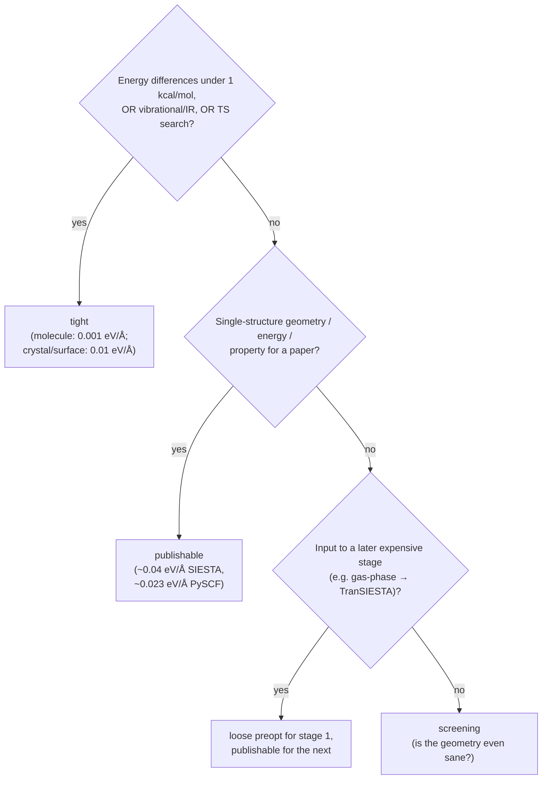
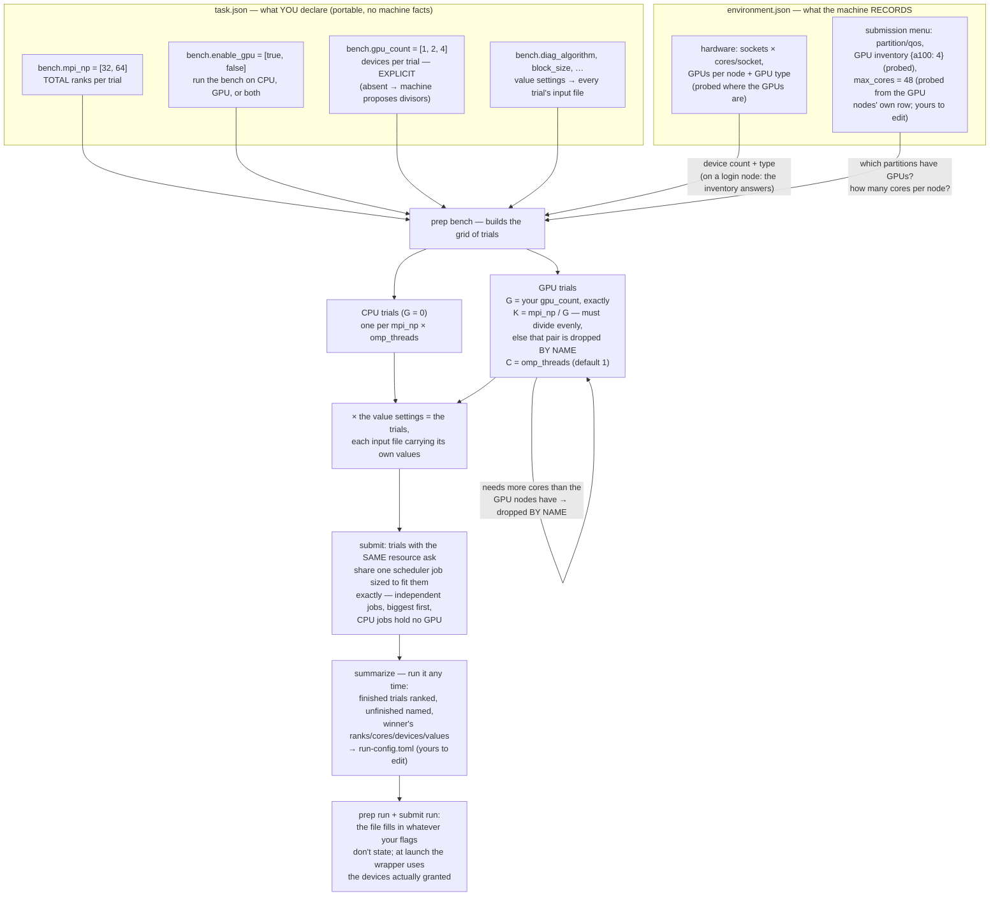
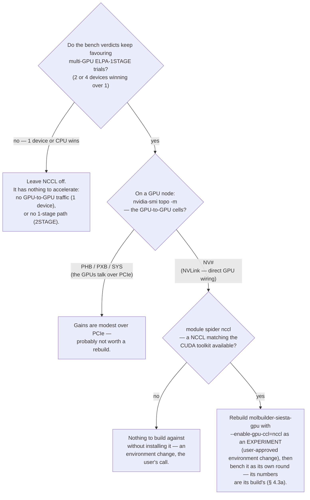
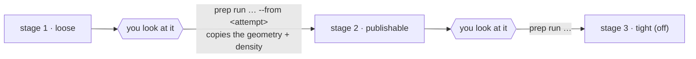

# Optimization tuning — the cross-engine quality dial

**Role:** contract
**Domain:** engines
**Companions:** [`engines/siesta.md`](?doc=engines/siesta.md) +
[`engines/pyscf.md`](?doc=engines/pyscf.md) (what each emitter *writes* — this doc
says what *values* to write and why); [`engines/transport.md`](?doc=engines/transport.md)
(the device k-grid / mesh contract for TranSIESTA — where transport overrides this
doc's general k-grid + mesh guidance); [`science/validation.md`](?doc=science/validation.md)
(the preflight that gates a job before you spend cluster time);
[`engines/overview.md`](?doc=engines/overview.md) (the engines map, and the
three cross-engine contracts).

This is the canonical answer to **"what value should this knob carry, for what
purpose, and why?"** — the reference the SIESTA/PySCF form-field `help` strings and
both engines' shipped ladders point at. It covers the parameters that genuinely depend on
what you're using the result for: optimizer algorithm, convergence thresholds, SCF
tolerance, mesh / basis / k-grid quality, step caps. Knobs whose answer is the same
across all quality levels (charge auto-detect, log-file naming) are not here.

> **Vocabulary.** A **relaxation** (geometry optimization) walks the atoms downhill in
> energy; each step needs a **SCF** (self-consistent-field) solve of the electrons at
> the current geometry, from which the **forces** are derived. A **tier** is a named
> quality level (screening → publishable → tight). **eV/Å** and **Ha/Bohr** are the
> two force units the engines use (1 Ha/Bohr ≈ 51.4 eV/Å). Engine-specific keywords
> and how they're emitted live in [`siesta.md`](?doc=engines/siesta.md) /
> [`pyscf.md`](?doc=engines/pyscf.md); this doc is the *value* guide.
>
> A **functional** is the DFT recipe (its exchange–correlation, **XC**, approximation)
> that fixes the level of theory. The **Hessian** is the matrix of energy curvature
> (second derivatives) a quasi-Newton optimizer estimates to aim each step. **vdW** =
> van der Waals, the weak dispersion attraction between non-bonded atoms. The
> **density matrix** is the electron-distribution array whose step-to-step change
> measures SCF convergence. The **Brillouin zone** is a crystal's repeating
> momentum-space cell that **k-points** sample. **vib / IR / TS / NEB** = vibrational
> spectra, infrared intensities, transition-state search, and reaction-barrier
> (nudged-elastic-band) methods — the analyses that demand the tightest geometries.

---

## 1. The four-tier framework

Every parameter here has a value at **each quality tier**. The tier names are stable
across engines:

| Tier | When to use | Result quality |
|---|---|---|
| **screening** | Triaging tens of candidates, debugging a workflow, checking a builder produced sane geometry. | Loose basis/SCF; geometry within ~0.05 Å, energy within ~5 kcal/mol. **Never publish.** |
| **loose preopt** | Stage 1 of a ladder — fixing obvious geometry sins (bad bonds, eclipsed conformers) before the expensive functional sees them. | Close enough that the publishable stage won't waste cycles undoing a bad initial guess. |
| **publishable** | The default for a paper on simple organic chemistry / single-stage surface relaxation. What Gaussian's `OPT` default gives; what reviewers expect. | Geometry to ~10⁻³ Å, energy to ~0.1 kcal/mol, forces below ~0.04 eV/Å. |
| **tight** | Vibrational/IR analysis, transition-state search, NEB barriers to chemical accuracy — *or* production crystal/surface work (a different number; see § 2.3). | Forces at the SCF noise floor; the SCF + mesh must be equally tight. |



Both engines ship a **three-rung ladder** that bakes these tiers into the default
`coarse` / `medium` / `tight` rows (§ 4) — one vocabulary, both engines. The `tight`
rung is **disabled by default**: most runs are `coarse` + `medium`, and `tight` is
opted into for vib/IR/production work.

---

## 2. Parameter-by-parameter

Each knob: **what it controls** / **per-tier values** / **per-engine keyword**.

### 2.1 Optimizer algorithm

**What it controls.** How the geometry updates between SCF calls. The algorithm sees
the gradient at the current geometry (maybe the last few) and decides the next step.

| Algorithm | Family | Strength | Weakness |
|---|---|---|---|
| **CG** (conjugate gradient) | line-search | no memory cost; well-behaved when forces are large (far from the minimum) | oscillates across a basin *near* the minimum, especially on stiff/coupled systems (metals, interfaces, vdW) |
| **Broyden / BFGS / L-BFGS** | quasi-Newton | builds a Hessian estimate across moves; converges in few steps where CG oscillates | keeps history vectors (memory); poisoned by bad early steps |
| **FIRE** | MD-inspired | robust on rough landscapes (random-built geometries); always descends in energy | slower than quasi-Newton near the minimum |

(Subspace methods — **GDIIS / RFO** — are excellent for transition-state search and
tight minima, but neither SIESTA nor molbuilder's PySCF defaults expose them.)

**Per-tier choice:** screening → CG or FIRE (far from the minimum, no good Hessian to
fit); loose preopt → **CG** (predictable per-step cost); publishable & tight →
**Broyden (SIESTA) / geomeTRIC=BFGS (PySCF)** (you're near the minimum, where CG's
oscillation dominates the cost — don't switch back to CG).

**Engine keyword:**

- **SIESTA** `MD.TypeOfRun` — `CG` / `Broyden` / `FIRE` (`none` = single-point, skip
  the MD block; `Verlet` / `Nose` also exist for finite-temperature MD, not geometry
  optimization). The staged ladder uses CG for stage 1, Broyden for 2 + 3.
- **PySCF** `cfg.optimizer` — `"geometric"` (default; translation-rotation-invariant
  internal coordinates, BFGS internally) or `"berny"`. **The staged-opt loop supports
  only `geometric`** — `berny` doesn't accept the per-stage convergence kwargs.

**Worked example.** On the 2026-06-23 BDT/Au(111) junction (444 atoms, organic-on-
metal, vdW interface, `MD.MaxForceTol 0.04 eV/Å`), CG bounced between 0.087 and
0.54 eV/Å for 20+ moves over 12 h with no monotonic trend. Broyden with
`MD.MaxDispl 0.02 Å` converges the same system in ≤ 30 moves — the fix was the
optimizer + step cap, not the threshold. [Johnson 1988; Bitzek 2006]

### 2.2 Step displacement cap

**What it controls.** A hard ceiling on how far any single atom moves in one step —
catches line-search over-shoot and keeps the optimizer in the basin it started in.

| Tier | Cap | Rationale |
|---|---|---|
| screening | 0.30 Å | big steps cover ground on a clean landscape |
| loose preopt | **0.20 Å** | fine while gradients are large |
| publishable | **0.05 Å** | once forces ≈ 0.1 eV/Å, a 0.2 Å step routinely over-shoots (see § 2.1) |
| tight | **0.02 Å** | smallest step that still makes progress above the SCF noise floor |

For calibration, Gaussian's `OPT` defaults its step cap to 0.30 Bohr (≈ 0.16 Å) and
`Tight` tightens it to 0.02 Bohr (≈ 0.011 Å).

- **SIESTA** `MD.MaxDispl` — **universal across CG / Broyden / FIRE** in SIESTA 5.4.2
  despite the CG-prefixed name (`siesta/input.py` emits it for all three). The
  per-type aliases `MD.MaxDispl` some references list are *not* applied to Broyden's
  cap — recognized as an fdf key but silently mis-applied.
- **PySCF / geomeTRIC** — no direct cap; controlled via `dmax` (max displacement at
  convergence, § 2.4) plus the optimizer's own line search.

### 2.3 Force convergence threshold

**What it controls.** The "we're done" test: the maximum absolute force on any
unconstrained atom.

**"Tight" means two different numbers depending on system type** — conflating them
was a real bug (a 444-atom Au junction "tight" at 0.001 eV/Å never converges; a
small-molecule "tight" at 0.01 eV/Å is too loose for vibrations):

| System | Tight = | Why | Reference |
|---|---|---|---|
| **Crystal / surface / interface (≥ 50 atoms)** | **0.01 eV/Å** | the SCF noise floor grows with system size; chasing < 0.005 eV/Å is futile. The community production threshold for surface DFT. | VASP `EDIFFG = -0.01`; QE `forc_conv_thr 2e-4 Ry/Bohr` ≈ 0.005 eV/Å |
| **Molecule (≤ 50 atoms), vib/IR/TS/NEB** | **0.001 eV/Å** | vibrational analysis needs forces below the lowest physical mode's noise; IR needs stable Hessian eigenvectors | Gaussian `OPT=Tight` / geomeTRIC `GAU_TIGHT` [Schlegel 2011] |
| **Molecule production (≤ 50 atoms), energy + geometry** | **0.04 eV/Å (SIESTA) / ≈ 0.023 eV/Å (PySCF)** | the "publishable" tier — Gaussian's `OPT` default, what reviewers expect for non-vib papers | Gaussian-OPT default |

Full per-tier values:

| Tier | Force convergence |
|---|---|
| screening | 0.10 eV/Å |
| loose preopt | 0.05 eV/Å (SIESTA `relax_force_tol`, the `coarse` rung) |
| publishable | **0.04 eV/Å (SIESTA) / 4.5×10⁻⁴ Ha/Bohr ≈ 0.023 eV/Å (PySCF)** |
| tight — crystal/surface | **0.01 eV/Å / ≈ 2×10⁻⁴ Ha/Bohr** (VASP `EDIFFG=-0.01`; safe for 100s of atoms) |
| tight — molecule vib/IR | ≈ 0.001 eV/Å (SIESTA) / 1.5×10⁻⁵ Ha/Bohr (geomeTRIC `GAU_TIGHT`; **never** on a 100+ atom metal — it chases SCF noise forever) |

**The shipped `tight` rung uses the crystal/surface number** (0.01 eV/Å ≈
`geom_gmax 2×10⁻⁴ Ha/Bohr`), *not* `GAU_TIGHT`, precisely because a default named
tight has to be safe on large systems. Molecule vib/IR work opts into the very-tight
column by overriding those items on the rung in `task.json`.

**Cross-engine caveat.** SIESTA checks **one** criterion (`MD.MaxForceTol`, the max
force). PySCF/geomeTRIC checks **five, all must pass** (`geom_gmax`, `geom_grms`, `geom_dmax`,
`geom_drms`, energy step — modelled on Gaussian's `OPT`). At the same numerical max-force
threshold a PySCF "converged" geometry is generally tighter than a SIESTA one, so
expect PySCF to take more iterations to declare success. [Schlegel 2011]

### 2.4 The five geomeTRIC criteria (PySCF)

The `geom_gmax` companion criteria. These are catalogue items, set per rung
through a stage's `overrides`, and they reach geomeTRIC as `convergence_gmax` /
`_grms` / `_dmax` / `_drms` / `_energy` kwargs:

| catalogue item | Loose (coarse) | Publishable (medium) | **Tight (tight, opt-in)** | Very-tight (molecule vib, opt-in) | Units |
|---|---|---|---|---|---|
| `geom_gmax` | 2.0×10⁻³ | 4.5×10⁻⁴ | **2.0×10⁻⁴** | 1.5×10⁻⁵ | Ha/Bohr |
| `geom_grms` | 1.3×10⁻³ | 3.0×10⁻⁴ | **1.0×10⁻⁴** | 1.0×10⁻⁵ | Ha/Bohr |
| `geom_dmax` | 7.2×10⁻³ | 1.8×10⁻³ | **1.0×10⁻³** | 6.0×10⁻⁵ | Å |
| `geom_drms` | 4.8×10⁻³ | 1.2×10⁻³ | **5.0×10⁻⁴** | 4.0×10⁻⁵ | Å |
| `geom_etol` | 1.0×10⁻⁵ | 1.0×10⁻⁶ | 1.0×10⁻⁶ | 1.0×10⁻⁶ | Hartree |

**This table is the authority for these numbers.** `PYSCF_STAGE_PRESETS`
(`config/pyscf.py`) is the one place they are written down in code, and it is
written down FROM here — the first three columns, tier by tier. A value in the
code that disagrees with this table is a bug in the code.

The publishable column is geomeTRIC's `GAU` preset; the very-tight column is
`GAU_TIGHT` — ≈ 30× tighter on every gradient and displacement criterion (the energy
step is unchanged). All five values flow end-to-end: a rung's deck hands them to
`optimize(...)`, **and** writes them into that rung's `.molwatch.log` as a
`_CONVERGENCE_TARGETS` map (unit-converted to eV / eV·Å⁻¹), which the Results-tab
trajectory inspector reads to draw the threshold lines — nothing the user sets is
dropped before the plots.
[Wang & Song 2016]

### 2.5 SCF tolerance

**What it controls.** How tightly the *electronic* problem is solved at each geometry
step. Forces come from the converged density; a sloppy SCF gives noisy forces and the
optimizer thrashes.

**Rule of thumb:** the SCF tolerance should be ~10× tighter than the force precision
you want at the end. Publishable force ≈ 0.04 eV/Å ≈ 10⁻³ Ha/Bohr → SCF stable to
~10⁻⁴ Ha/Bohr → SCF tol ~10⁻⁹ Ha (energy) or ~10⁻⁴ (density-matrix delta).

| Tier | SIESTA `DM.Tolerance` (dimensionless) | PySCF `mf.conv_tol` (Ha) |
|---|---|---|
| screening | 1×10⁻³ | 1×10⁻⁷ |
| loose preopt | 1×10⁻⁴ | 1×10⁻⁷ (the `coarse` rung) |
| publishable | 1×10⁻⁴ | **1×10⁻⁹** (the `medium` rung) |
| tight | 1×10⁻⁵ | 1×10⁻¹⁰ (the `tight` rung) |

**Shipped default:** `SiestaConfig.dm_tolerance` is **1×10⁻⁵** (the tight value) as a
single global — SIESTA doesn't vary `DM.Tolerance` per stage, so the emitted `.fdf`
carries 1×10⁻⁵ unless you override it. PySCF *does* vary `scf_conv_tol` per rung
(1e-7 → 1e-9 → 1e-10). Tightening SCF on a warm-up (forces ~1 eV/Å) buys nothing — it
starts to matter as `force ≪ 0.1 eV/Å`. [Pulay & Fogarasi 1992]

### 2.6 Real-space mesh cutoff (SIESTA)

**What it controls.** SIESTA discretises the Hartree + XC potentials on a real-space
grid; `MeshCutoff` sets the spacing via a plane-wave-equivalent kinetic cutoff.

| Tier | `MeshCutoff` (Ry) | Rationale |
|---|---|---|
| screening | 150 | sanity check only |
| loose preopt | 200–250 | forces to ~1% |
| publishable | **350** | forces below 0.01 eV/Å on organic systems (semicore metals want 400+ — see below) |
| tight (vib/phonons) | 500 (600 for first-row elements) | mesh egg-box noise below 0.001 eV/Å |

**Shipped default:** `SiestaConfig.mesh_cutoff` is **300 Ry** — one notch below the
350 publishable recommendation, so bump it for production organic/metal work.
**Semicore metals go higher:** a transport junction on Au (5s5p5d valence) wants
**400 Ry** (converge 300→500) — see [`transport.md`](?doc=engines/transport.md) § 7.
The converged value depends on the basis (DZP numeric atomic orbitals — SIESTA's
basis, § 2.8 — converge faster than long-tail ones) — test by varying ±50 Ry; the
relative geometry should be stable within your tolerance.
[Soler 2002]

### 2.7 k-grid (SIESTA periodic systems)

**What it controls.** Brillouin-zone sampling. The count depends on cell size and
whether the system is metallic.

| System | Recipe |
|---|---|
| Molecule in vacuum (> 10 Å padding) | **Γ only** (`1 1 1`) — all other points are equivalent by translation |
| Organic-on-metal junction (BDT/Au(111)) | **4×4×1** screening, **6×6×1** publishable, **8×8×1** for I–V |
| Bulk metal | **12×12×12** publishable, Monkhorst-Pack symmetry-reduced |
| Bulk semiconductor / insulator | **6×6×6** publishable (a gap needs fewer k-points than a DOS) |

Mantra: k-spacing × lattice constant ≈ 0.04 Å⁻¹ for publishable accuracy.
(For *transport*, the device k-grid is a different contract — `kz = 1` along the open
axis; see [`transport.md`](?doc=engines/transport.md) § 5.) [Monkhorst & Pack 1976]

### 2.8 Basis set (PySCF; SIESTA uses NAOs)

A **basis set** is the fixed library of functions the orbitals are built from —
bigger = more flexible and accurate, but costlier. The `def2` family runs
double-zeta (`SVP`) → triple (`TZVP`, `TZVPP`) → quadruple (`QZVP`); *zeta* counts how
many functions describe each valence orbital.

| Tier | Basis | Rationale |
|---|---|---|
| screening / loose | `def2-SVP` | double-zeta is too small for publication — noticeably larger geometry/energy errors than triple-zeta on conjugated systems. The bare `cfg.basis` default. |
| publishable | **`def2-TZVP`** | the modern organic-chemistry standard; ECPs (effective core potentials — a heavy atom's core electrons replaced by a potential) bundled to Rn |
| tight | `def2-TZVPP` / `def2-QZVP` | energy comparisons across structures; a final single-point after a publishable geometry |

**Density fitting (resolution-of-identity).** `cfg.density_fit` is **on by default**, so
molbuilder emits `mf = mf.density_fit()` — approximating the electron-repulsion
integrals via a small auxiliary basis for a large SCF speedup at negligible error on
hybrid DFT. `cfg.auxbasis` is `None` by default, so PySCF auto-picks the matching
JK-fit set — `def2-tzvp-jkfit` for a def2-TZVP orbital basis (the **JK** set, because
the default B3LYP is a hybrid and needs both Coulomb *and* exchange fitting); set
`cfg.auxbasis` to override. [Weigend 2005 (orbital basis); Weigend 2008 (JK-fit auxiliary)] SIESTA's
numeric atomic-orbital basis (`PAO.Basis`) is a separate contract — see
[`siesta.md`](?doc=engines/siesta.md).

### 2.9 Functional + dispersion (DFT)

**Not** tier-dependent — pick once for the chemistry, keep it across all stages. The
tier varies the convergence, not the level of theory.

| Choice | When |
|---|---|
| **`b3lyp` + `dispersion="d3bj"`** (the shipped default) | organic chemistry; the most-cited combo of the decade [Becke 1993; Grimme 2010/2011] |
| `wb97m-v` | charge-transfer character (donor-acceptor, transport junctions, π-stacks) — range-separated meta-GGA + VV10; dispersion is built in (no separate `disp`) [Mardirossian 2016] |
| `pbe0` | non-Becke hybrid; common in solid-state work |
| `m06-2x` | non-covalent interactions, thermochemistry |
| `r2scan` + `d3bj` | meta-GGA at ~B3LYP accuracy for GGA cost; emerging standard |

Plain `b3lyp` **without** dispersion is no longer publishable for any molecule
> 10 atoms — reviewers flag it. Write the exact PySCF token in code (`wb97m-v`), the
conventional form in prose ("ωB97M-V"); the spelling traps are in
[`pyscf.md`](?doc=engines/pyscf.md).

### 2.10 Maximum iteration counts

| Loop | Engine | Shipped default | Rationale |
|---|---|---|---|
| **Geometry (outer)** | PySCF `geom_max_steps` | coarse **50**, medium **200**, tight **100** | a warm-up needing > 50 has a wrong starting geometry — stop and inspect; 200 is the publishable safety margin |
| | SIESTA `relax_steps` | coarse **600**, medium **200**, tight **100** | universal across CG / Broyden / FIRE (the per-type aliases aren't recognized); SIESTA's coarse budget is more generous than PySCF's |
| **SCF (inner)** | PySCF `mf.max_cycle` | **100** | plenty for a well-conditioned SCF; hitting 100 means the *system* is the problem (broken-symmetry open shell, level-shift needed) — 500 won't help |
| | SIESTA `MaxSCFIterations` | **1000** | molbuilder's own generous ceiling (SIESTA's is smaller); each outer step runs at most this many inner cycles until `DM.Tolerance` is met. *(This row said 500 until 2026-08-16; the catalogue and `SiestaConfig` both say 1000, range 10–5000.)* |

### 2.11 Block size (SIESTA — the ScaLAPACK / ELPA distribution block)

> **Decided 2026-08-11 (user): `BlockSize` is a tunable parameter, measured by a
> benchmark and then chosen — like the GPU and core assignment beside it.** It is
> **not** a value molbuilder derives and hands you. Every other document that
> described it as *"derived from the rank count"* is corrected to the **two**
> states below. *(This line said "three states" until 2026-08-16 — written
> before the middle state was retired on 2026-08-15, four subsections down. A
> section that owns a rule and miscounts it in its own opening is how the
> restatements elsewhere stayed wrong.)*

**What it controls.** SIESTA distributes the Hamiltonian over MPI ranks in square
blocks of `BlockSize` orbitals. It is the one knob here that is about **parallel
efficiency rather than accuracy** — it cannot change the answer, only how long it
takes to get and whether the ranks are evenly fed.

**The guidance, and it is not tier-dependent — it is scale- and
hardware-dependent:**

| | Rule | Why |
|---|---|---|
| **Powers of two** | 16 · 32 · 64 · 128 | they align with cache lines and memory alignment on modern CPUs; a non-power-of-two block wastes both |
| **Small systems** (few orbitals) | **16 or 32** | a large block on a small matrix leaves late ranks with nothing — **load imbalance**, which costs more than the communication it saved |
| **Large systems** (thousands of orbitals) | **64 or 128** | fewer, bigger messages — **less ScaLAPACK communication overhead**, which is what dominates at scale |
| **Match the hardware** | pick a block the orbital count divides reasonably into, given the core count and the node's memory layout | a remainder block is a rank doing a fraction of everyone else's work |

**A rough sanity ceiling, not a formula:** with `N` **orbitals** over `R` ranks,
a block above `N / R` means some rank receives **no block at all**. It is a
ceiling to stay under, not a target to aim at.

> **Orbitals, not atoms** *(settled 2026-08-11, user)*. The block distributes the
> **Hamiltonian**, whose dimension is the orbital count; SIESTA's DZP basis is
> roughly ten orbitals per atom, which is why BENCH-MARKS records
> `n_orbitals_est` beside `n_atoms` at all. `job-contracts.md § 3.3` declared the
> bound as `n_atoms / mpi_np` while its own PROVENANCE example derived the value
> from `10 × n_atoms` — a factor of ten, in the paragraph whose rule is that the
> value and its bound come from one place. **The bound is now
> `n_orbitals_est / mpi_np`** and the two agree; the code follow-up and its
> mutation test are recorded there.

**A consequence worth seeing, because it is the whole reason this is not a
formula.** The ceiling moves with the **basis**, not only the hardware:

| | a 20-atom molecule | a 200-atom slab |
|---|---|---|
| orbitals (DZP, ≈10/atom) | 200 | 2000 |
| ceiling on **16** ranks | `200/16 = 12.5` → **8** | `2000/16 = 125` → **64** |
| ceiling on **4** ranks | `200/4 = 50` → **32** | `2000/4 = 500` → **256** |

Same hardware, same rank count, a tenfold difference in the answer — and
upgrading the basis on one system moves it again. That is why § 2.11 opens with
*match the problem scale* and why a measurement beats a default.

#### Two states, because the engine already has an "auto"

> **Revised 2026-08-15 (user): *"SIESTA allows `auto` to be the value, so that's
> what it should be as default. Otherwise, it is a manual explicit value and/or
> benched result."*** This section previously defined THREE states; the middle
> one is retired, and the paragraphs above explain why it should never have
> existed.

**`BlockSize` has two answers.**

| state | what the deck says | when |
|---|---|---|
| **auto** — the default | *the keyword is not emitted at all* | SIESTA's own built-in automatic. The manual declares it: `BlockSize [integer] <automatic>` |
| **a number** | `BlockSize <your value>` | you benchmarked it, or you know this machine. **Honoured verbatim** |

**What the retired middle state was.** molbuilder computed a value — a power of
two from the orbital count, the rank count and the GPU flag — and wrote *that*
into the deck. It contradicted this section's own opening decision (*"not a value
molbuilder derives and hands you"*, 2026-08-11) and it was reachable as the
DEFAULT, while SIESTA's own automatic hid behind the sentinel `0`. So the
ordinary user got a guess, and the engine's answer needed a magic number to
request.

Three things followed from it, all found 2026-08-15:

- **It produced meaningless values.** Below four atoms the ladder returned
  `BlockSize 1` — legal, and the exact opposite of the cache blocking the
  parameter exists for.
- **It forced a wrong type.** The item was declared `pow2`, which SNAPS a value
  down to the nearest power of two — so a benchmarked 24 silently became 16. The
  power-of-two rule is real but belongs elsewhere; see below.
- **It needed a mirror in the browser.** The form previewed the guess by
  hand-copying the rule into JavaScript, where it could only ever reproduce the
  no-ranks branch — so the number shown was not the number that would be used.

**Omitting a keyword is still a real answer** — the same shape as
`Diag.Algorithm ScaLAPACK`, which [`siesta.md § 7`](?doc=engines/siesta.md) also
emits as *nothing*. What changed is that it is now the DEFAULT answer rather than
a third option behind a sentinel.

#### The power-of-two rule, and what it actually applies to

The manual states it **twice, and only inside the ELPA solver options**:

> *"when using a **GPU-enabled version of ELPA** it is important to verify that
> **`Diag.BlockSize`** is a power of 2; if not, ELPA will only run on CPU."*

Three qualifiers the `pow2` type dropped:

1. it is **`Diag.BlockSize`** — a different keyword, which merely *defaults* to
   `BlockSize`;
2. it applies **only to GPU-enabled ELPA**, not to ScaLAPACK and not to CPU ELPA;
3. breaking it is **not an error** — ELPA silently falls back to the CPU.

> **Decided 2026-08-15 (user): *"we don't want silent CPU fallback. If GPU is
> enabled, we should align parameter with that target."*** So this is **not**
> softened into advice. Asking for a GPU and being given a CPU run that reports
> success is the silent-wrong-answer class this project refuses everywhere else.

**When the GPU is on AND the diagonaliser is ELPA, `BlockSize` must be a power of
two — and it is `bench` / `prep` that makes it one.**

> **Decided 2026-08-15 (user): *"that's why this blocksize, if explicit set,
> needs to be realigned at bench/prep stage."***

**The alignment happens where the target is known, and that is not this form.**
`enable_gpu` and `mpi_np` are answered on the staging surface — they are machine
facts and bench axes, not parameters typed beside the physics. A form that no
longer holds the GPU flag cannot check a rule about the GPU, and a rule checked
in the wrong place is a rule that will be wrong. So:

| where | what happens to `BlockSize` |
|---|---|
| **the parameter form** | auto by default; an explicit value taken at face value. The rule is not enforced here because the hardware is not chosen here |
| **`bench`** | sweeps powers of two anyway, so what it hands back is already aligned. `script_emit.py`'s BENCH-MARKS declares `BlockSize` as `pow2` — a constraint the *benchmark* puts on its own sweep, which is where that type belongs and where it stays |
| **`prep`** | knows the GPU flag, the rank count and the value. If GPU-ELPA is the target and the value is not a power of two, **prep realigns it and records that it did** |

**Realigned, not silently coerced — the difference is the record.** The retired
`pow2` type rewrote a value inside the form with nothing to show for it, so a
benchmarked 24 became 16 and no artifact said why. `prep` writes what it
resolved and what it resolved it *from* (PROVENANCE), so an aligned block is a
visible decision that can be read back off the run months later.

**Why realign rather than refuse.** Refusing would make the user carry a rule
that only exists because of a hardware choice made on another surface — they set
a good value, then a later GPU selection invalidates it. Realignment keeps the
two surfaces independent: the physics form says what you want, the staging
surface says what you are running on, and prep reconciles them where both are
finally in hand.

The plain guidance in the table above (16 · 32 · 64 · 128) remains *guidance* for
CPU runs: powers of two align with cache lines whatever the solver. Advice and
enforcement are different things, and only one of them may edit a value — under
GPU-ELPA neither does, because the request is refused instead.

#### Why it is worth benchmarking rather than deriving

**Manual tuning via short test jobs is what yields peak parallel efficiency**,
and no formula reaches it: the right block depends on the matrix, the rank count,
the interconnect and the node's memory layout at once. So `BlockSize` joins the
benchmark's swept axes — `bench-result.json`'s `choice` carries the measured
value alongside the rank and GPU counts, and `prep` uses it the same way it uses
those ([`job-system.md § 7`](?doc=execution/job-system.md)).

> **This is the same trade as the rest of this document, one level down.** A tier
> table tells you what value to *start* from; a measurement tells you what value
> is *right here*. For accuracy knobs the table is enough because physics is
> portable. For a parallel-efficiency knob it is not, because the hardware is not.

### 2.12 GPU + CPU coordination (SIESTA) — the background that guides a benchmark

*(Consolidated 2026-08-21 from a live investigation for the Au–BDT–Au
benchmark: the code paths, the manuals shipped inside this machine's own
`molbuilder-siesta-gpu` build, and the literature.  The launch mechanics
live in [`running-a-job.md § 3.3`](?doc=execution/running-a-job.md); the
declaration rule in [`generator.md § 4.3a`](?doc=execution/generator.md);
this section is the* **why**, *so a benchmark matrix is designed rather
than guessed.  Vocabulary used below, once: an MPI* **rank** *is one
process of the parallel calculation; the* **deck** *is the engine input
file (the `.fdf`); a* **trial** *is one short benchmark run at one
combination of settings; and* **s/iter** *is the measured wall-clock
seconds per SCF iteration — the number every comparison ranks on.)*

**What the GPU actually accelerates — one step, not the run.** SIESTA
offloads exactly one thing to the GPU: solving the dense eigenvalue
problem at the heart of each SCF iteration, and only through the ELPA
solver (`enable_gpu` requires an ELPA `diag_algorithm`; the deck writes
`Diag.Algorithm` + `Diag.ELPA.GPU` —
[`siesta.md § 7`](?doc=engines/siesta.md)). Everything else — building
the Hamiltonian and overlap matrices on the real-space grid, updating the
density, computing forces — stays on the CPU ranks. So a "GPU run" is
really a CPU parallel run whose most expensive step (the O(N³)
diagonalization) is handed to the devices, **and the CPU ranks are never
idle passengers**: for a ~400-atom junction the grid work is a large
share of every SCF step and speeds up with MORE ranks, while the
eigensolver speeds up with GPU throughput and prefers FEWER ranks per
device. That tension — more ranks help one half of the step, fewer ranks
per device help the other — is the whole reason the number of ranks
sharing each GPU is something the benchmark *measures* instead of a fixed
rule.

**The coordinate: G × K × C, and what you declare.** A GPU trial is
described by three numbers: **G** devices, **K** ranks *per device*, and
**C** cores per rank. The scheduler is asked for `-n G·K` ranks (the
total), `-c C` cores each, and — through `--gres`, the scheduler's
request line for special resources such as GPUs — G devices. Ranks and
devices are independent requests. In `task.json` you declare the portable
half, and since 2026-08-21 that includes the device count itself
(*"explicit is what we need"* — until then G was derived from divisors):

```json
"bench": {
  "mpi_np":      [32, 64],
  "enable_gpu":  [true, false],
  "gpu_count":   [1, 2, 4],
  "diag_algorithm": ["ELPA-1STAGE", "ELPA-2STAGE"]
}
```

— CPU trials at 32 and 64 total ranks; GPU trials at exactly 1, 2 and 4
devices; both solvers rendered into every trial's input file. `mpi_np` is
always the TOTAL rank count (`G·K`), so K follows as `mpi_np / G`. The
rules around `gpu_count` are refusals and named drops, never silent
repairs: a device count the machine's record does not hold **refuses**; a
`(mpi_np, gpu_count)` pair that cannot split into equal shares is
**dropped, and the dropped pair is printed by name** — ELPA's own rule is
the same rank count on every device, and a benchmark must never round
your numbers; `gpu_count` on a bench whose `enable_gpu` resolves to false
**refuses** rather than being silently ignored; and with `gpu_count`
absent, the machine *proposes* — G ranges over each declared rank count's
divisors, bounded by the recorded device count. The device count itself
comes from `environment.json`: the hardware record probed where the GPUs
are, or — behind a login node that has none — the partition's GPU
inventory (`gpu: {"a100": 4}`) that `jobset probe` reads from the
scheduler and stores on the domain row.

**The whole picture, one diagram:**



**How many ranks should share one GPU — what the sources say.** ELPA's
own performance guide (the `documentation/PERFORMANCE_TUNING.md` inside
this stack's ELPA source tree) states three rules: give **every GPU the
same number of ranks** (on a 34-core, 3-GPU node use 33 ranks — 11 per
device — never 34); more than one rank per GPU is "the very common
situation"; and when ranks share a device, run **MPS** — NVIDIA's
Multi-Process Service, the mechanism that lets several processes compute
on one GPU *concurrently* instead of taking turns — which the guide says
improves performance "quite dramatically" (started once per node; the
molbuilder wrapper starts and stops a per-job MPS automatically).  This
sharing regime is the measured territory of the ELPA2 GPU paper
(`references.bib: Yu2021` — Yu et al., *Comput. Phys. Commun.* **262**,
107808, 2021), and MPS admits at most **48 processes per device** on the
A100's generation (`references.bib: NvidiaMPS`). **This stack's ELPA is
built without NCCL** (checked in its build log), which is why the
wrapper's default lands near ~4 ranks per GPU with MPS — the tuned point
for this kind of build; what NCCL is and when it would change this is
answered at the end of this section.

**The node arithmetic — the 48 is a ceiling, not a target.** Per device,
K ranks each holding C cores must fit the node: **K × C ≤ cores / G**.
On a 48-core, 4-GPU node that is 12 cores per device, so `G4 K12 C1`
fills the node exactly — while a 24-ranks-on-one-A100 layout
(`G1 K24 C2`) spends the *whole node's* cores on one device and leaves
three idle. The MPS limit of 48 is what *can attach*, not what is fast:
once the GPU's compute units are fully busy, extra processes only wait in
line on the device. **Threads are not required for GPU sharing** — one
core per rank is a complete layout; giving each rank more cores (C > 1)
helps only the CPU phases of the step, and only as far as this SIESTA
build's OpenMP threading actually scales. **Is one thread per rank the
standing assumption?** For CPU SIESTA yes — the shipped default, because
mainline SIESTA's threading is not reliable enough to beat simply using
more ranks (and the math libraries are pinned to one thread in every
mode, so threads can never oversubscribe the cores). In GPU mode, no:
when few ranks run, the wrapper widens each rank's threads to use the
node's spare cores, unless you state a number. Either way it is an
assumption you can replace with a measurement — declare `omp_threads` as
an axis, and the winning C rides `run-config.toml` into the run.  One
declaration measures all the full-node layouts: `mpi_np: [24, 48]` ×
`omp_threads: [1, 2]` enumerates `G4 K12`, `G2 K24`, `G1 K48` (at the
MPS ceiling) and their two-thread variants — and the verdict, not the
ceiling, picks.

**Memory on the card is usually not the limit.** A ~440-heavy-atom
junction with a DZP basis is roughly a 6–7 thousand orbital problem; one
dense double-precision matrix of that size is ~0.4–0.8 GB, so even
several ranks' working copies sit far below an 80 GB A100. What fills up
first is the GPU's compute capacity and the CPU↔GPU data transfers — and
*where* that happens depends on the hardware and the problem size, which
is exactly why the ranks-per-device number is measured by the bench
rather than assumed. The same reasoning gave `block_size` its treatment
in § 2.11.

**How the winner's G reaches the actual run.** The bench measures G; the
run *inherits* it — there is no fixed CPU-to-GPU ratio anywhere:
**(1)** the winner's whole shape, `gres = "gpu:a100:G"` included, is
written into `run-config.toml`, and `prep run` applies the file to every
field your flags leave unstated. **The file is also your override**: no
command-line flag states a device count, on purpose — edit the `gres`
line (or any line) and your edit is what runs. **(2)** With no verdict on
file, a GPU calculation's submission header asks for **one** device — a
deliberate floor, not a scaling rule. **(3)** At launch, the wrapper
counts the devices the scheduler actually granted, assigns ranks to
devices in equal shares, pins each rank's memory to the socket that owns
its GPU, and starts MPS when ranks outnumber devices — so the run adapts
to the real allocation whatever the paperwork said.

#### Spending the benchmark budget — how to cut points without losing the answer

A trial costs its setup time plus 3 capped SCF iterations, and is killed
if it exceeds the per-trial time bound (`--trial-timeout`, default
15 minutes). The rules below are each an economy: how to get the answer —
which configuration to run at — for the least machine time.

- **Warm-up is already excluded *inside* one run — never pay for a second
  run to skip it.** The timing keeps only the later iteration-to-iteration
  intervals ([`job-system.md § 7`](?doc=execution/job-system.md)), so
  program start-up, grid initialisation and the first iteration's one-time
  work never enter s/iter. Running each trial twice and keeping the second
  would double the cost and measure a *different* calculation — a run
  continued from existing files converges along another path, which is
  exactly why every trial is forced to start from scratch. The concern is
  real; it is answered inside one run, where it costs seconds.
- **Why exactly three iterations — and why not two** *(settled by the
  user, 2026-08-21, from measured experience)*. The instrument stamps the
  wall clock as each `scf:` line prints, so N iterations give N−1
  intervals — and **iteration 1's own duration, where the one-time setup
  lives, never forms an interval at all**. A cap of 2 would measure
  exactly ONE interval: iteration 2's, the one still adjacent to warm-up,
  which the reader discards whenever it can. **Three is the faithful
  minimum**: setup excluded by construction, the iteration-2 interval
  dropped, iteration 3 the one clean sample. The cap stood at five (an
  average of three samples) for two days on a noise argument; the user's
  own five-iteration runs answered it — iterations 3–5 agree within
  seconds on a 444-atom junction, and **the bench reads scaling and
  dependency — where the curve bends — not tight rankings**, so two
  configurations within a few seconds of each other are a tie to break by
  other criteria (queue time, memory), never a ranking to defend with
  more samples. Older five-iteration records still parse and average.
- **Do not declare rank counts far below where the run will live.**
  Seconds per iteration grows roughly as 1/ranks until the scaling
  saturates, so a much-too-small trial of a large system can outlast its
  time bound — killed, recorded `incomplete`, machine time spent, nothing
  learned. Bracket `mpi_np` around where you intend to run. Small
  ranks-per-device does **not** require small totals: K = mpi_np/G, so on
  4-GPU nodes `mpi_np: [16, 32]` already samples K = 4…8 — the ELPA
  guide's territory — while `mpi_np: 4` would buy only a slow CPU trial
  nobody plans to run.
- **Cut the cross product, keep the coverage.** Every value setting you
  declare with several points multiplies the whole grid
  ([`generator.md § 4.3a`](?doc=execution/generator.md)), so:
  (a) leave `block_size` undeclared first — § 2.11's automatic pick
  adapts it to each trial's rank count, and the axis is worth declaring
  only when the verdict is close; (b) **stage the rounds**: round 1
  declares only the machine settings (ranks, devices) with the value
  settings held at one point each — that answers *what shape is fastest* —
  and round 2 declares the winning shape plus the value settings — that
  answers *which solver and block size at that shape*. Re-running `prep
  bench` replaces the stage's sweep record, so each round's verdict
  stands on its own; round 2 re-measures the winning shape under each
  value, which is precisely the comparison wanted; (c) when one side's
  extra trials are the cost, bench one side at a time (`enable_gpu` with
  a single point per round). Worked on the § 6 junction's declared
  matrix: the full cross product is 36 trials; dropping `block_size` to
  automatic makes it 12; staging makes it 6 + 6 with the second round
  already pinned to the shape that won.
- **Nothing idles inside a submitted job** *(user, 2026-08-21: "lighter
  tasks scheduled for heavy resource idling for hours is not a good use
  of cpu time")*. Trials that ask for exactly the same resources — the
  same ranks, cores and devices; call that shared ask a **shelf** — ride
  ONE scheduler job together, sized to fit them exactly. So a 32-rank
  trial never sits inside a 128-core allocation idling 96 cores, and a
  1-GPU trial never holds a 4-GPU grant. The value settings are what
  make shelves well-populated — every solver × block-size combination
  shares its shape's shelf — which is what keeps the number of queue
  submissions at the number of shelves, not the number of trials.
- **Declare the ladder, stop when the trend is clear** *(user,
  2026-08-21: "if we know that the performance downgrades dramatically
  in the middle, we already know the answer")*. The shelves submit
  **biggest ask first** — they are independent scheduler jobs with no
  ordering dependency, so this costs nothing and starts the
  longest queue wait ticking earliest, overlapping it with the smaller
  shelves' runs (short small jobs slot into scheduler gaps quickly). A
  four-device job waiting in the queue therefore delays **nothing**, and
  a verdict need not wait for it. Watch `bench-group*.log` (each trial's
  start, finish, exit code and duration, live) or run `summarize bench`
  at any moment — **it is safe and honest while the bench runs**:
  finished trials are ranked, unfinished ones are listed as
  `incomplete`/`unknown` (never a failure of the set), and the coverage
  line states how partial the verdict is; a later summarize refreshes
  the record over the fuller evidence (`run-config.toml`, once written,
  is *yours* — delete it and summarize again for a proposal built from
  the fuller record). When the curve has clearly bent, `scancel` the
  remaining jobs — or skip the formal verdict entirely and set the run
  parameters yourself: explicit flags outrank everything, and the record
  keeps whatever completed. The declared matrix is an *upper bound* on
  cost, not a commitment. One honest caveat: submission marks every
  included trial as launched, so a trial you stopped before it ran is
  re-measured individually by name (move its old directory aside first —
  [`project-layout.md § 2.3.2`](?doc=execution/project-layout.md)),
  never by re-submitting its job.

**The record keeps what was asked AND what actually ran** *(user
question, 2026-08-21)*. Values you never typed are not lost: every
trial's rendered input file (kept forever in its `bench-…/` directory)
holds each value molbuilder set, whether you stated it or prep derived
it — and `bench-result.json` records, per trial, the *asked* side (the
requested ranks/cores/devices, the declared values, the input file's
eigensolver and requested BlockSize) **beside the *ran* side, read back
from the run's own output**: the rank count SIESTA itself reported, the
thread count the wrapper exported, **the block size SIESTA settled on** —
recovered even when the input file carried no `BlockSize` line at all
(§ 2.11's *automatic* state) — the eigensolver actually used, and ELPA's
GPU marker. Where the two sides disagree on ranks, threads or solver, the
trial is flagged and **barred from winning** — a trial that quietly fell
back from the GPU must not be ranked as a GPU number. The block size is
deliberately recorded but *not* treated as a disagreement, because SIESTA
shrinking it to fit the rank count, and ELPA rounding it to a power of
two, are documented behaviour of the engine — adaptation, not a lie
(`bench/result.py::parse_effective_run` / `compare_asked_to_ran`).

**Would `WITH_NVIDIA_NCCL` help?** *(user question, 2026-08-21; read from
the stack's own source, ELPA 2023.11.001.)* **What it does, plainly**:
when several GPUs must exchange data in the middle of a solve, the normal
path copies each piece back to the CPU, passes it through MPI, and copies
it to the next GPU; NCCL (NVIDIA's inter-GPU communication library) lets
the **GPUs send to each other directly**, no CPU round trip. **What it
would buy *us* — one narrow thing**: in this exact ELPA version the NCCL
path exists **only inside the 1-stage solver** (`src/elpa1/`: the
tridiagonalization, the back-transformation and their vector exchanges;
nothing under `src/elpa2/`), one release after the changelog called it a
"proof of concept … not production ready". So a single-GPU trial gains
**nothing** (there is no GPU-to-GPU traffic to speed up), an
`ELPA-2STAGE` trial gains nothing in this version, and only **multi-GPU
`ELPA-1STAGE`** trials could — by shrinking the between-device cost that
decides whether 2 or 4 devices beat 1 at all, with the gain sized by the
wiring (NVLink, NVIDIA's direct GPU-to-GPU link, ≫ plain PCIe). Enabling
it is a **build experiment, not a switch**: the configure step needs
`--enable-gpu-ccl=nccl` and a NCCL library matching the CUDA toolkit at
build time, and it shifts the tuned regime toward one rank owning each
device — away from the MPS sharing this build's defaults are tuned for —
so its benchmark is its own round, and the rule below already covers the
honesty: GPU numbers belong to the build that produced them.



**One last rule, stated once more**
([`generator.md § 4.3a`](?doc=execution/generator.md)): CPU numbers carry
across partitions built from the same silicon; GPU numbers belong to the
build that produced them; and the verdict is a *proposal*
(`run-config.toml`) — the trade between *fastest* and *soonest scheduled*
stays yours.

---

## 3. Cross-engine parameter map

### 3.0 Tier ↔ tier — and the tiers do NOT line up numerically

*Written 2026-08-11. [`pyscf.md`](?doc=engines/pyscf.md) § 7 had promised "the
full tier↔tier mapping lives in `tuning.md`" and it did not — § 3.1 below is a
**keyword** map, which is a different question. This is the table that was
missing, and building it turned up something worth knowing.*

**The same tier name means a different force threshold on each engine.** At
1 Ha/Bohr = 51.42 eV/Å:

| tier | SIESTA `MD.MaxForceTol` | PySCF `gmax` | …in eV/Å | which is tighter on max force |
|---|---|---|---|---|
| **loose preopt** | 0.05 eV/Å | 2.0×10⁻³ Ha/Bohr | **0.103** | **SIESTA, by 2×** |
| **publishable** | 0.04 eV/Å | 4.5×10⁻⁴ | **0.023** | **PySCF, by 1.7×** |
| **tight** (crystal/surface) | 0.01 eV/Å | 2.0×10⁻⁴ | **0.0103** | *they coincide* |
| **very-tight** (molecule vib) | — | 1.5×10⁻⁵ | **0.0008** | PySCF only |

**Read the last column downward: the two engines cross over.** PySCF's *loose*
stage is twice as permissive as SIESTA's on max force, its *publishable* stage is
nearly twice as strict, and at *tight* they land on the same number to 3%. That
is not sloppiness in either ladder — each tier was set from its own engine's
conventions (Gaussian's `OPT` defaults for PySCF, crystal-relaxation practice for
SIESTA) and they simply do not scale together.

> **So "PySCF is stricter at the same tier" is true overall and false at loose,
> and the difference matters.** It is stricter because geomeTRIC demands **all
> five** criteria — max and rms gradient, max and rms step, and the energy change
> — while SIESTA checks **max force alone** (§ 3.1's *not checked* rows). At
> *publishable* and *tight* it is stricter on that one criterion too. **At
> *loose* it is not**, and a PySCF stage-1 geometry is correspondingly rougher
> than a SIESTA stage-1 one. That is fine — a warm-up is meant to be rough — but
> it is the wrong thing to assume when comparing the two.

**What this means when you port a calculation.** Matching tier *names* across
engines does not match the physics; matching the number does. If you need a
PySCF run to reach a SIESTA-`publishable` geometry, ask for **`gmax` 7.8×10⁻⁴**
(0.04 ÷ 51.42), not the `GAU` preset — and remember you also inherit the other
four criteria, so the run will stop later than the single number suggests.

### 3.1 Keyword ↔ keyword

For users who know one engine and want the other's equivalent.

| Concept | SIESTA | PySCF / geomeTRIC | Units |
|---|---|---|---|
| Geometry algorithm | `MD.TypeOfRun` | `cfg.optimizer` (`"geometric"` ≈ BFGS) | enum |
| Force convergence | `MD.MaxForceTol` | `convergence_gmax` (`geom_gmax`) | SIESTA eV/Å; PySCF Ha/Bohr |
| RMS-grad convergence | *(not checked)* | `convergence_grms` (`geom_grms`) | Ha/Bohr |
| Displacement convergence | *(implicit via `MD.MaxDispl`)* | `convergence_dmax`/`_drms` (`geom_dmax`/`geom_drms`) | Å |
| Energy-step convergence | *(implicit via SCF tol)* | `convergence_energy` (`geom_etol`) | Hartree |
| Step cap | `MD.MaxDispl` (universal) | *(geomeTRIC-internal line search)* | Å |
| SCF tolerance | `DM.Tolerance` | `mf.conv_tol` | dimensionless / Hartree |
| Max geometry steps | `MD.Steps` (universal) | `geom_max_steps` | integer |
| Max SCF cycles | `MaxSCFIterations` | `mf.max_cycle` | integer |
| Discretisation | `MeshCutoff` (Ry) | *(basis-determined)* | Ry / — |
| Basis | NAO via `PAO.Basis` (default DZP) | `cfg.basis` (Gaussian, default def2-SVP) | string |
| k-grid | `kgrid_Monkhorst_Pack` | *(gas-phase only)* | tuple |

---

## 4. The shipped stage ladders

Both engines ship a three-stage default ladder. Stage 3 is **disabled by
default**.

- **SIESTA:** `siesta/stages.py::default_siesta_stages(strategy)` builds it —
  one `task.Stage` per tier, that tier's values as its `overrides`. The values
  come from `config/siesta.py::SIESTA_STAGE_PRESETS`, and that is the **one**
  place they enter, so nothing can drift from them. The stage names are
  `coarse` / `medium` / `tight`. *(This bullet also credited a `--stage {1,2,3}`
  one-shot overlay until 2026-08-16 — a flag of the `molbuilder fdf` verb,
  deleted 2026-08-11.)*
- **PySCF:** `pyscf/stages.py::default_pyscf_stages(strategy)` builds it — the
  same call, the same return type and the same three names as SIESTA's, one
  `task.Stage` per tier with that tier's values as its `overrides`. The values
  come from `config/pyscf.py::PYSCF_STAGE_PRESETS`, and that is the **one**
  place they enter. *(It was `config/pyscf.py::_default_stages`, a field of the
  config, until 2026-08-17; the ladder is declared in `task.json` like SIESTA's
  now, and since 2026-08-18 **executes** like SIESTA's too — N decks, N jobs
  ([`stages.md § 1.1a`](?doc=engines/stages.md)).)*

> **Neither engine's ladder carries a non-convergence policy, and running out
> of steps means the same thing in both: the rung stops, and you decide.** A
> stage that exhausts its budget leaves its geometry behind; the next stage
> exists only because somebody looked at that result and prepared it. That is
> the judgement the policy was trying to encode, made where the evidence is.
>
> *`proceed` / `continue` / `halt` decided the **edge** between one attempt and
> the next. A SIESTA ladder emits no edges
> ([`project-layout.md § 1.6`](?doc=execution/project-layout.md)), so the field
> was removed from its producer on 2026-08-10 rather than left inert
> ([`stages.md § 3`](?doc=engines/stages.md)); PySCF kept it while its ladder
> was a loop inside one process and the policy was real control flow, and that
> loop was retired on 2026-08-18
> ([`stages.md § 1.1a`](?doc=engines/stages.md)).*
>
> **`on_nonconvergence` survives as a PySCF field with a narrower meaning**: it
> sets `assert_convergence` for THIS rung's `optimize()` call — whether an
> unconverged rung raises or exits with the partial geometry. That is a property
> of one deck, not of an edge between two, and it is
> [`pyscf.md § 3`](?doc=engines/pyscf.md)'s to describe.

| Stage (tier) | SIESTA | PySCF |
|---|---|---|
| **stage 1** (loose preopt) | CG · 600 steps · force 0.05 eV/Å · Δx 0.20 Å | `geometric` · 50 steps · `gmax` 2×10⁻³ · `conv_tol` 1×10⁻⁷ |
| **stage 2** (publishable) | Broyden · 200 · 0.04 eV/Å · 0.05 Å | `geometric` · 200 · `gmax` 4.5×10⁻⁴ · `conv_tol` 1×10⁻⁹ |
| **stage 3** (tight, *off*) | Broyden · 100 · 0.01 eV/Å · 0.02 Å | `geometric` · 100 · `gmax` 2×10⁻⁴ · `conv_tol` 1×10⁻¹⁰ |

> **These numbers restate § 2.4 and § 2.5, which are their authority** — those
> tables are checked against `PYSCF_STAGE_PRESETS` and `SIESTA_STAGE_PRESETS` by
> `test_doc_claims.py`; this one is not. It is here because a reader comparing
> two ladders wants them side by side. If they ever disagree, § 2.4 / § 2.5 win.

**The geometry flows from each stage to the next, and the optimizer history is
reset at the boundary (§ 5). Both engines flow it the same way: a rung ends, a
person looks at it, and the next rung is prepared from the run they name.**



What each engine copies at that boundary is its own vocabulary and the only thing
that differs: SIESTA's `.XV` and `.DM`, PySCF's `<JOB>_optimized.xyz` and
`<JOB>.chk` ([`job-contracts.md § 4.2a`](?doc=execution/job-contracts.md)).

> **This drew two different ladders until 2026-08-18** — PySCF's as a loop
> passing state *in memory* inside one process, SIESTA's as a workflow — and
> called that *"the one place these two ladders are not the same thing"*. It was
> the argument for why `on_nonconvergence` meant something on one engine and
> nothing on the other. With the loop retired
> ([`stages.md § 1.1a`](?doc=engines/stages.md)) they are the same thing, and the
> on-running-out-of-steps column above is a PySCF-only behaviour whose future the
> unit that retires the loop settles.

What the values look like emitted. **Both engines emit one deck per rung**
([`stages.md` § 1.1a](?doc=engines/stages.md)), so what follows is the `medium`
rung of each — the same tier, in each engine's own syntax:

```python
# PySCF: <label>_02_medium.py -- this rung's targets, handed to geomeTRIC
mf.conv_tol = 1e-09
mol_eq = optimize(mf, maxsteps=200,
                  convergence_gmax=0.00045, convergence_grms=0.0003,
                  convergence_dmax=0.0018,  convergence_drms=0.0012,
                  convergence_energy=1e-06)
```

```fdf
# SIESTA: the stage-2 (publishable) MD block
MD.TypeOfRun      Broyden
MD.Steps     200
MD.MaxForceTol    0.04 eV/Ang
MD.MaxDispl     0.05 Ang
```

Global knobs (not per-stage) carry their own shipped defaults, all verified
against the catalogue 2026-08-16: SIESTA `DM.Tolerance` 1×10⁻⁵, `MeshCutoff`
300 Ry, `MaxSCFIterations` **1000**, `PAO.BasisSize` DZP, `Diag.Algorithm`
ScaLAPACK; PySCF `mf.max_cycle` 100, `def2-SVP`, `B3LYP`+`d3bj`, `density_fit`
on. *(`MaxSCFIterations` read 500 here until 2026-08-16.)*

---

## 5. Restart / continuation

| Scenario | SIESTA | PySCF |
|---|---|---|
| Resume from the last accepted step | `MD.UseSaveCG .true.` + `MD.UseSaveXV .true.` (keep CG history + geometry; `MD.UseSaveCG` is CG-only) | re-run — the emitted `<JOB>.chk` chkfile-init shim reloads |
| Restart with the geometry but reset optimizer history | `MD.UseSaveXV .true.` + `MD.UseSaveCG .false.` | drop the chkfile, or pass `runwrap`'s `--cold` / `--from-scratch` (resets the engine state too) |
| Switch optimizer at a stage boundary | use the new algorithm's `MD.Use*Save*`; the old history file is now stale | only `geometric` is supported in stages |

**Why keep CG history on a resume but reset on a tier switch.** CG's conjugate basis
builds up over moves; discarding it wastes ~5–10 moves of warm-up. But when you
tighten `MD.MaxDispl` or switch CG → Broyden, the old basis is *poisoned* by the
over-shoot pattern that triggered the switch — keeping it re-creates the same
oscillation.

---

## 6. Worked decision — BDT/Au(111) junction

Walking the 2026-06-23 case through the framework:

| Question | Answer | Leads to |
|---|---|---|
| Target use? | Transport (NEGF — the electron-transport method — on a relaxed geometry) | **publishable** tier for the relax (the NEGF is its own quality axis) |
| Material class? | organic-on-metal interface, vdW | **Broyden**, not CG (§ 2.1) |
| Cell? | 4×4×1 surface supercell | 6×6×1 k-grid (§ 2.7) |
| Current state? | CG oscillating 0.09–0.5 eV/Å for 20+ moves | the *optimizer + step cap* are wrong, not the threshold |
| Stage-2 `.fdf` | `MD.TypeOfRun Broyden`, `MD.MaxDispl 0.02`, `MD.MaxForceTol 0.04`, `DM.Tolerance 1e-4`, `MeshCutoff 350 Ry` | publishable tier, **but the step cap is tightened to 0.02 Å** (the § 2.1 fix that kills the CG oscillation — the rest is the publishable column) |

---

## References

- **CG** — Hestenes & Stiefel, *J. Res. NBS* **49**, 409 (1952); Polak & Ribière, *Rev.
  Fr. Inf. Rech. Opér.* **3**, 35 (1969).
- **Modified Broyden** — Johnson, *Phys. Rev. B* **38**, 12807 (1988).
- **FIRE** — Bitzek et al., *Phys. Rev. Lett.* **97**, 170201 (2006).
- **Geometry-optimization review** (the five-criteria convention, `GAU_TIGHT` as a
  vibrational prerequisite) — Schlegel, *WIREs Comput. Mol. Sci.* **1**, 790 (2011).
- **geomeTRIC** (translation-rotation internal coordinates) — Wang & Song, *J. Chem.
  Phys.* **144**, 214108 (2016).
- **Redundant internal coordinates** — Pulay & Fogarasi, *J. Chem. Phys.* **96**, 2856 (1992).
- **SIESTA method** (PAO basis, `MeshCutoff`) — Soler et al., *J. Phys.: Condens.
  Matter* **14**, 2745 (2002).
- **k-grid sampling** — Monkhorst & Pack, *Phys. Rev. B* **13**, 5188 (1976).
- **def2 basis family** — Weigend & Ahlrichs, *Phys. Chem. Chem. Phys.* **7**, 3297 (2005).
- **def2-universal-JK-fit auxiliary** (the hybrid-DFT auto-pick) — Weigend, *J. Comput.
  Chem.* **29**, 167 (2008). (The Coulomb-only *J-fit* set is Weigend, *PCCP* **8**, 1057, 2006.)
- **B3LYP** — Becke, *J. Chem. Phys.* **98**, 5648 (1993). **D3(BJ) dispersion** —
  Grimme et al., *J. Chem. Phys.* **132**, 154104 (2010); *J. Comput. Chem.* **32**, 1456 (2011).
- **ωB97M-V** — Mardirossian & Head-Gordon, *J. Chem. Phys.* **144**, 214110 (2016).
- **PBE0** — Adamo & Barone, *J. Chem. Phys.* **110**, 6158 (1999). **M06-2X** — Zhao &
  Truhlar, *Theor. Chem. Acc.* **120**, 215 (2008). **r²SCAN** — Furness et al., *J.
  Phys. Chem. Lett.* **11**, 8208 (2020).
- **Surface-DFT force convention** (`EDIFFG = -0.01`) — VASP documentation; Hammer &
  Nørskov, *Adv. Catal.* **45**, 71 (2000).
- **PySCF** — Sun et al., *J. Chem. Phys.* **153**, 024109 (2020).
- **ELPA2 GPU port** (the multi-rank-per-GPU + MPS regime § 2.12 samples) — Yu
  et al., *Comput. Phys. Commun.* **262**, 107808 (2021).
  (`science/references.bib: Yu2021` carries the full entry.)
- **NVIDIA MPS** (concurrent kernel execution for ranks sharing a device; the
  48-client ceiling) — NVIDIA, *CUDA Multi-Process Service: Overview*.
  (`science/references.bib: NvidiaMPS`.)  The equal-ranks-per-GPU and
  daemon-once-per-node rules are ELPA's own, in the
  `documentation/PERFORMANCE_TUNING.md` of the ELPA source tree shipped
  inside the `molbuilder-siesta-gpu` build.
