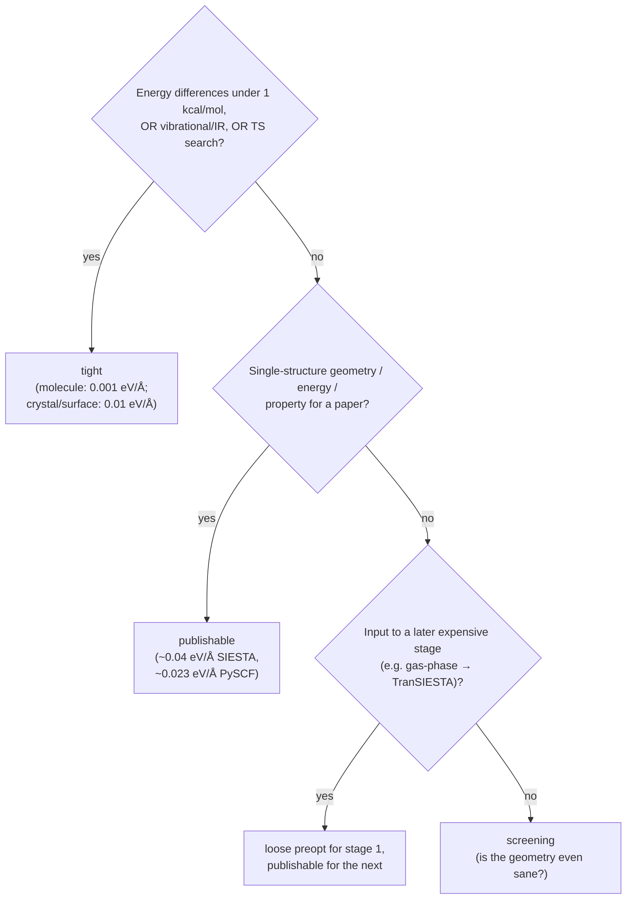
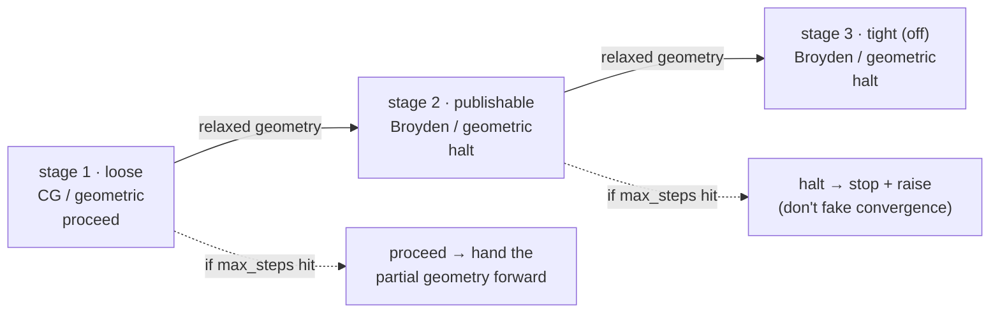

# Optimization tuning — the cross-engine quality dial

**Role:** contract
**Domain:** engines
**Companions:** [`engines/siesta.md`](?doc=engines/siesta.md) +
[`engines/pyscf.md`](?doc=engines/pyscf.md) (what each emitter *writes* — this doc
says what *values* to write and why); [`science/validation.md`](?doc=science/validation.md)
(the preflight that gates a job before you spend cluster time).

This is the canonical answer to **"what value should this knob carry, for what
purpose, and why?"** — the reference the SIESTA/PySCF form-field `help` strings and
the stage-table presets point at. It covers the parameters that genuinely depend on
what you're using the result for: optimizer algorithm, convergence thresholds, SCF
tolerance, mesh / basis / k-grid quality, step caps. Knobs whose answer is the same
across all quality levels (charge auto-detect, log-file naming) are not here.

> **Vocabulary.** A **relaxation** (geometry optimization) walks the atoms downhill in
> energy; each step needs a **SCF** (self-consistent-field) solve of the electrons at
> the current geometry, from which the **forces** are derived. A **tier** is a named
> quality level (screening → publishable → tight). **eV/Å** and **Ha/Bohr** are the
> two force units the engines use (1 Ha/Bohr ≈ 51.4 eV/Å). Engine-specific keywords
> and how they're emitted live in [`siesta.md`](?doc=engines/siesta.md) /
> [`pyscf.md`](?doc=engines/pyscf.md); this doc is the *value* guide.
>
> A **functional** is the DFT recipe (its exchange–correlation, **XC**, approximation)
> that fixes the level of theory. The **Hessian** is the matrix of energy curvature
> (second derivatives) a quasi-Newton optimizer estimates to aim each step. **vdW** =
> van der Waals, the weak dispersion attraction between non-bonded atoms. The
> **density matrix** is the electron-distribution array whose step-to-step change
> measures SCF convergence. The **Brillouin zone** is a crystal's repeating
> momentum-space cell that **k-points** sample. **vib / IR / TS / NEB** = vibrational
> spectra, infrared intensities, transition-state search, and reaction-barrier
> (nudged-elastic-band) methods — the analyses that demand the tightest geometries.

---

## 1. The four-tier framework

Every parameter here has a value at **each quality tier**. The tier names are stable
across engines:

| Tier | When to use | Result quality |
|---|---|---|
| **screening** | Triaging tens of candidates, debugging a workflow, checking a builder produced sane geometry. | Loose basis/SCF; geometry within ~0.05 Å, energy within ~5 kcal/mol. **Never publish.** |
| **loose preopt** | Stage 1 of a ladder — fixing obvious geometry sins (bad bonds, eclipsed conformers) before the expensive functional sees them. | Close enough that the publishable stage won't waste cycles undoing a bad initial guess. |
| **publishable** | The default for a paper on simple organic chemistry / single-stage surface relaxation. What Gaussian's `OPT` default gives; what reviewers expect. | Geometry to ~10⁻³ Å, energy to ~0.1 kcal/mol, forces below ~0.04 eV/Å. |
| **tight** | Vibrational/IR analysis, transition-state search, NEB barriers to chemical accuracy — *or* production crystal/surface work (a different number; see § 2.3). | Forces at the SCF noise floor; the SCF + mesh must be equally tight. |



Both engines ship a **three-stage ladder** that bakes these tiers into the default
`stage1` / `stage2` / `stage3` rows (§ 4). Stage 3 (tight) is **disabled by default** —
most users run stages 1 + 2 and opt into 3 for vib/IR/production work.

---

## 2. Parameter-by-parameter

Each knob: **what it controls** / **per-tier values** / **per-engine keyword**.

### 2.1 Optimizer algorithm

**What it controls.** How the geometry updates between SCF calls. The algorithm sees
the gradient at the current geometry (maybe the last few) and decides the next step.

| Algorithm | Family | Strength | Weakness |
|---|---|---|---|
| **CG** (conjugate gradient) | line-search | no memory cost; well-behaved when forces are large (far from the minimum) | oscillates across a basin *near* the minimum, especially on stiff/coupled systems (metals, interfaces, vdW) |
| **Broyden / BFGS / L-BFGS** | quasi-Newton | builds a Hessian estimate across moves; converges in few steps where CG oscillates | keeps history vectors (memory); poisoned by bad early steps |
| **FIRE** | MD-inspired | robust on rough landscapes (random-built geometries); always descends in energy | slower than quasi-Newton near the minimum |

(Subspace methods — **GDIIS / RFO** — are excellent for transition-state search and
tight minima, but neither SIESTA nor molbuilder's PySCF defaults expose them.)

**Per-tier choice:** screening → CG or FIRE (far from the minimum, no good Hessian to
fit); loose preopt → **CG** (predictable per-step cost); publishable & tight →
**Broyden (SIESTA) / geomeTRIC=BFGS (PySCF)** (you're near the minimum, where CG's
oscillation dominates the cost — don't switch back to CG).

**Engine keyword:**

- **SIESTA** `MD.TypeOfRun` — `CG` / `Broyden` / `FIRE` (`none` = single-point, skip
  the MD block; `Verlet` / `Nose` also exist for finite-temperature MD, not geometry
  optimization). The staged ladder uses CG for stage 1, Broyden for 2 + 3.
- **PySCF** `cfg.optimizer` — `"geometric"` (default; translation-rotation-invariant
  internal coordinates, BFGS internally) or `"berny"`. **The staged-opt loop supports
  only `geometric`** — `berny` doesn't accept the per-stage convergence kwargs.

**Worked example.** On the 2026-06-23 BDT/Au(111) junction (444 atoms, organic-on-
metal, vdW interface, `MD.MaxForceTol 0.04 eV/Å`), CG bounced between 0.087 and
0.54 eV/Å for 20+ moves over 12 h with no monotonic trend. Broyden with
`MD.MaxCGDispl 0.02 Å` converges the same system in ≤ 30 moves — the fix was the
optimizer + step cap, not the threshold. [Johnson 1988; Bitzek 2006]

### 2.2 Step displacement cap

**What it controls.** A hard ceiling on how far any single atom moves in one step —
catches line-search over-shoot and keeps the optimizer in the basin it started in.

| Tier | Cap | Rationale |
|---|---|---|
| screening | 0.30 Å | big steps cover ground on a clean landscape |
| loose preopt | **0.20 Å** | fine while gradients are large |
| publishable | **0.05 Å** | once forces ≈ 0.1 eV/Å, a 0.2 Å step routinely over-shoots (see § 2.1) |
| tight | **0.02 Å** | smallest step that still makes progress above the SCF noise floor |

For calibration, Gaussian's `OPT` defaults its step cap to 0.30 Bohr (≈ 0.16 Å) and
`Tight` tightens it to 0.02 Bohr (≈ 0.011 Å).

- **SIESTA** `MD.MaxCGDispl` — **universal across CG / Broyden / FIRE** in SIESTA 5.4.2
  despite the CG-prefixed name (`siesta/input.py` emits it for all three). The
  per-type aliases `MD.MaxDispl` some references list are *not* applied to Broyden's
  cap — recognized as an fdf key but silently mis-applied.
- **PySCF / geomeTRIC** — no direct cap; controlled via `dmax` (max displacement at
  convergence, § 2.4) plus the optimizer's own line search.

### 2.3 Force convergence threshold

**What it controls.** The "we're done" test: the maximum absolute force on any
unconstrained atom.

**"Tight" means two different numbers depending on system type** — conflating them
was a real bug (a 444-atom Au junction "tight" at 0.001 eV/Å never converges; a
small-molecule "tight" at 0.01 eV/Å is too loose for vibrations):

| System | Tight = | Why | Reference |
|---|---|---|---|
| **Crystal / surface / interface (≥ 50 atoms)** | **0.01 eV/Å** | the SCF noise floor grows with system size; chasing < 0.005 eV/Å is futile. The community production threshold for surface DFT. | VASP `EDIFFG = -0.01`; QE `forc_conv_thr 2e-4 Ry/Bohr` ≈ 0.005 eV/Å |
| **Molecule (≤ 50 atoms), vib/IR/TS/NEB** | **0.001 eV/Å** | vibrational analysis needs forces below the lowest physical mode's noise; IR needs stable Hessian eigenvectors | Gaussian `OPT=Tight` / geomeTRIC `GAU_TIGHT` [Schlegel 2011] |
| **Molecule production (≤ 50 atoms), energy + geometry** | **0.04 eV/Å (SIESTA) / ≈ 0.023 eV/Å (PySCF)** | the "publishable" tier — Gaussian's `OPT` default, what reviewers expect for non-vib papers | Gaussian-OPT default |

Full per-tier values:

| Tier | Force convergence |
|---|---|
| screening | 0.10 eV/Å |
| loose preopt | 0.05 eV/Å (SIESTA `MD.MaxForceTol` stage-1 default) |
| publishable | **0.04 eV/Å (SIESTA) / 4.5×10⁻⁴ Ha/Bohr ≈ 0.023 eV/Å (PySCF)** |
| tight — crystal/surface | **0.01 eV/Å / ≈ 2×10⁻⁴ Ha/Bohr** (VASP `EDIFFG=-0.01`; safe for 100s of atoms) |
| tight — molecule vib/IR | 0.001 eV/Å / 1.5×10⁻⁵ Ha/Bohr (`GAU_TIGHT`; **never** on a 100+ atom metal — it chases SCF noise forever) |

**The shipped stage-3 defaults use the crystal/surface number** (0.01 eV/Å ≈
`gmax 2×10⁻⁴ Ha/Bohr`), *not* `GAU_TIGHT`, precisely because the tight default has to
be safe on large systems. Molecule vib/IR work opts into the very-tight column via
the stage-table or `--stages-json`.

**Cross-engine caveat.** SIESTA checks **one** criterion (`MD.MaxForceTol`, the max
force). PySCF/geomeTRIC checks **five, all must pass** (`gmax`, `grms`, `dmax`,
`drms`, energy step — modelled on Gaussian's `OPT`). At the same numerical max-force
threshold a PySCF "converged" geometry is generally tighter than a SIESTA one, so
expect PySCF to take more iterations to declare success. [Schlegel 2011]

### 2.4 The five geomeTRIC criteria (PySCF)

The `gmax` companion criteria. These are `StageSpec` fields
(`config/pyscf.py::StageSpec`) that reach geomeTRIC as `convergence_gmax` / `_grms` /
`_dmax` / `_drms` / `_energy` kwargs:

| `StageSpec` field | Loose (stage 1) | Publishable (stage 2) | **Tight (stage 3, shipped default)** | Very-tight (molecule vib, opt-in) | Units |
|---|---|---|---|---|---|
| `gmax` | 2.0×10⁻³ | 4.5×10⁻⁴ | **2.0×10⁻⁴** | 1.5×10⁻⁵ | Ha/Bohr |
| `grms` | 1.3×10⁻³ | 3.0×10⁻⁴ | **1.0×10⁻⁴** | 1.0×10⁻⁵ | Ha/Bohr |
| `dmax` | 7.2×10⁻³ | 1.8×10⁻³ | **1.0×10⁻³** | 6.0×10⁻⁵ | Å |
| `drms` | 4.8×10⁻³ | 1.2×10⁻³ | **5.0×10⁻⁴** | 4.0×10⁻⁵ | Å |
| `etol` | 1.0×10⁻⁵ | 1.0×10⁻⁶ | 1.0×10⁻⁶ | 1.0×10⁻⁶ | Hartree |

The publishable column is geomeTRIC's `GAU` preset; the very-tight column is
`GAU_TIGHT` (gradients ×10 tighter, displacements ×20). All five per-stage values
flow end-to-end: they reach the rendered script's `STAGES = [...]` literal (geomeTRIC
consumes them via `optimize(...)`) **and** the `.molwatch.log` header's
`_CONVERGENCE_TARGETS` dict, which the Results-tab trajectory inspector reads to draw
per-stage threshold lines — nothing the user sets is dropped before the plots.
[Wang & Song 2016]

### 2.5 SCF tolerance

**What it controls.** How tightly the *electronic* problem is solved at each geometry
step. Forces come from the converged density; a sloppy SCF gives noisy forces and the
optimizer thrashes.

**Rule of thumb:** the SCF tolerance should be ~10× tighter than the force precision
you want at the end. Publishable force ≈ 0.04 eV/Å ≈ 10⁻³ Ha/Bohr → SCF stable to
~10⁻⁴ Ha/Bohr → SCF tol ~10⁻⁹ Ha (energy) or ~10⁻⁴ (density-matrix delta).

| Tier | SIESTA `DM.Tolerance` (dimensionless) | PySCF `mf.conv_tol` (Ha) |
|---|---|---|
| screening | 1×10⁻³ | 1×10⁻⁷ |
| loose preopt | 1×10⁻⁴ | 1×10⁻⁷ (stage-1 default) |
| publishable | 1×10⁻⁴ | **1×10⁻⁹** (stage-2 default) |
| tight | 1×10⁻⁵ | 1×10⁻¹⁰ (stage-3 default) |

**Shipped default:** `SiestaConfig.dm_tolerance` is **1×10⁻⁵** (the tight value) as a
single global — SIESTA doesn't vary `DM.Tolerance` per stage, so the emitted `.fdf`
carries 1×10⁻⁵ unless you override it. PySCF *does* vary `conv_tol` per stage
(1e-7 → 1e-9 → 1e-10). Tightening SCF on a warm-up (forces ~1 eV/Å) buys nothing — it
starts to matter as `force ≪ 0.1 eV/Å`. [Pulay & Fogarasi 1992]

### 2.6 Real-space mesh cutoff (SIESTA)

**What it controls.** SIESTA discretises the Hartree + XC potentials on a real-space
grid; `MeshCutoff` sets the spacing via a plane-wave-equivalent kinetic cutoff.

| Tier | `MeshCutoff` (Ry) | Rationale |
|---|---|---|
| screening | 150 | sanity check only |
| loose preopt | 200–250 | forces to ~1% |
| publishable | **350** | forces converged below 0.01 eV/Å on organic + Au systems |
| tight (vib/phonons) | 500 (600 for first-row elements) | mesh egg-box noise below 0.001 eV/Å |

**Shipped default:** `SiestaConfig.mesh_cutoff` is **300 Ry** — one notch below the
350 publishable recommendation, so bump it for production organic/metal work. The
converged value depends on the basis (DZP numeric atomic orbitals — SIESTA's basis,
§ 2.8 — converge faster than long-tail ones) —
test by varying ±50 Ry; the relative geometry should be stable within your tolerance.
[Soler 2002]

### 2.7 k-grid (SIESTA periodic systems)

**What it controls.** Brillouin-zone sampling. The count depends on cell size and
whether the system is metallic.

| System | Recipe |
|---|---|
| Molecule in vacuum (> 10 Å padding) | **Γ only** (`1 1 1`) — all other points are equivalent by translation |
| Organic-on-metal junction (BDT/Au(111)) | **4×4×1** screening, **6×6×1** publishable, **8×8×1** for I–V |
| Bulk metal | **12×12×12** publishable, Monkhorst-Pack symmetry-reduced |
| Bulk semiconductor / insulator | **6×6×6** publishable (a gap needs fewer k-points than a DOS) |

Mantra: k-spacing × lattice constant ≈ 0.04 Å⁻¹ for publishable accuracy.
(For *transport*, the device k-grid is a different contract — `kz = 1` along the open
axis; see [`transport.md`](?doc=engines/transport.md) § 5.) [Monkhorst & Pack 1976]

### 2.8 Basis set (PySCF; SIESTA uses NAOs)

A **basis set** is the fixed library of functions the orbitals are built from —
bigger = more flexible and accurate, but costlier. The `def2` family runs
double-zeta (`SVP`) → triple (`TZVP`, `TZVPP`) → quadruple (`QZVP`); *zeta* counts how
many functions describe each valence orbital.

| Tier | Basis | Rationale |
|---|---|---|
| screening / loose | `def2-SVP` | double-zeta is too small for publication — noticeably larger geometry/energy errors than triple-zeta on conjugated systems. The bare `cfg.basis` default. |
| publishable | **`def2-TZVP`** | the modern organic-chemistry standard; ECPs (effective core potentials — a heavy atom's core electrons replaced by a potential) bundled to Rn |
| tight | `def2-TZVPP` / `def2-QZVP` | energy comparisons across structures; a final single-point after a publishable geometry |

**Density fitting (resolution-of-identity).** `cfg.density_fit` is **on by default**, so
molbuilder emits `mf = mf.density_fit()` — approximating the electron-repulsion
integrals via a small auxiliary basis for a large SCF speedup at negligible error on
hybrid DFT. `cfg.auxbasis` is `None` by default, so PySCF auto-picks the auxiliary set
— `def2-universal-jkfit` for a def2 orbital basis (the **JK** set, because the default
B3LYP is a hybrid and needs both Coulomb *and* exchange fitting); set `cfg.auxbasis` to
override. [Weigend 2005 (orbital basis); Weigend 2008 (JK-fit auxiliary)] SIESTA's
numeric atomic-orbital basis (`PAO.Basis`) is a separate contract — see
[`siesta.md`](?doc=engines/siesta.md).

### 2.9 Functional + dispersion (DFT)

**Not** tier-dependent — pick once for the chemistry, keep it across all stages. The
tier varies the convergence, not the level of theory.

| Choice | When |
|---|---|
| **`b3lyp` + `dispersion="d3bj"`** (the shipped default) | organic chemistry; the most-cited combo of the decade [Becke 1993; Grimme 2010/2011] |
| `wb97m-v` | charge-transfer character (donor-acceptor, transport junctions, π-stacks) — range-separated meta-GGA + VV10; dispersion is built in (no separate `disp`) [Mardirossian 2016] |
| `pbe0` | non-Becke hybrid; common in solid-state work |
| `m06-2x` | non-covalent interactions, thermochemistry |
| `r2scan` + `d3bj` | meta-GGA at ~B3LYP accuracy for GGA cost; emerging standard |

Plain `b3lyp` **without** dispersion is no longer publishable for any molecule
> 10 atoms — reviewers flag it. Write the exact PySCF token in code (`wb97m-v`), the
conventional form in prose ("ωB97M-V"); the spelling traps are in
[`pyscf.md`](?doc=engines/pyscf.md).

### 2.10 Maximum iteration counts

| Loop | Engine | Shipped default | Rationale |
|---|---|---|---|
| **Geometry (outer)** | PySCF `max_steps` | stage1 **50**, stage2 **200**, stage3 **100** | a warm-up needing > 50 has a wrong starting geometry — stop and inspect; 200 is the publishable safety margin |
| | SIESTA `MD.NumCGsteps` | stage1 **600**, stage2 **200**, stage3 **100** | universal across CG / Broyden / FIRE (the per-type aliases aren't recognized); SIESTA's stage-1 budget is more generous than PySCF's |
| **SCF (inner)** | PySCF `mf.max_cycle` | **100** | plenty for a well-conditioned SCF; hitting 100 means the *system* is the problem (broken-symmetry open shell, level-shift needed) — 500 won't help |
| | SIESTA `MaxSCFIterations` | **500** | SIESTA's generous default; each outer step runs at most this many inner cycles until `DM.Tolerance` is met |

---

## 3. Cross-engine parameter map

For users who know one engine and want the other's equivalent.

| Concept | SIESTA | PySCF / geomeTRIC | Units |
|---|---|---|---|
| Geometry algorithm | `MD.TypeOfRun` | `cfg.optimizer` (`"geometric"` ≈ BFGS) | enum |
| Force convergence | `MD.MaxForceTol` | `convergence_gmax` (`StageSpec.gmax`) | SIESTA eV/Å; PySCF Ha/Bohr |
| RMS-grad convergence | *(not checked)* | `convergence_grms` (`grms`) | Ha/Bohr |
| Displacement convergence | *(implicit via `MD.MaxCGDispl`)* | `convergence_dmax`/`_drms` (`dmax`/`drms`) | Å |
| Energy-step convergence | *(implicit via SCF tol)* | `convergence_energy` (`etol`) | Hartree |
| Step cap | `MD.MaxCGDispl` (universal) | *(geomeTRIC-internal line search)* | Å |
| SCF tolerance | `DM.Tolerance` | `mf.conv_tol` | dimensionless / Hartree |
| Max geometry steps | `MD.NumCGsteps` (universal) | `StageSpec.max_steps` | integer |
| Max SCF cycles | `MaxSCFIterations` | `mf.max_cycle` | integer |
| Discretisation | `MeshCutoff` (Ry) | *(basis-determined)* | Ry / — |
| Basis | NAO via `PAO.Basis` (default DZP) | `cfg.basis` (Gaussian, default def2-SVP) | string |
| k-grid | `kgrid_Monkhorst_Pack` | *(gas-phase only)* | tuple |

---

## 4. The shipped stage ladders

Both engines ship a three-stage default ladder (`config/siesta.py::_default_siesta_stages`,
`config/pyscf.py::_default_stages`). Stage 3 is **disabled by default**. The
per-stage non-convergence policy (`proceed` / `continue` / `halt`) is a shared
cross-engine contract — see [`siesta.md`](?doc=engines/siesta.md) /
[`pyscf.md`](?doc=engines/pyscf.md).

| Stage (tier) | SIESTA | PySCF |
|---|---|---|
| **stage 1** (loose preopt) | CG · 600 steps · force 0.05 eV/Å · Δx 0.20 Å · **proceed** | `geometric` · 50 steps · `gmax` 2×10⁻³ · `conv_tol` 1×10⁻⁷ · **proceed** |
| **stage 2** (publishable) | Broyden · 200 · 0.04 eV/Å · 0.05 Å · **halt** | `geometric` · 200 · `gmax` 4.5×10⁻⁴ · `conv_tol` 1×10⁻⁹ · **halt** |
| **stage 3** (tight, *off*) | Broyden · 100 · 0.01 eV/Å · 0.02 Å · **halt** | `geometric` · 100 · `gmax` 2×10⁻⁴ · `conv_tol` 1×10⁻¹⁰ · **halt** |

The stages chain by geometry: each stage's relaxed coordinates feed the next, the
optimizer history is reset at the boundary (§ 5), and the non-convergence policy
tightens from `proceed` to `halt`:



What the values look like emitted — PySCF's per-stage list and SIESTA's stage-2
`.fdf` MD block:

```python
# PySCF: the rendered script's STAGES literal (geomeTRIC reads these)
STAGES = [
    {"name": "stage1", "gmax": 2.0e-3, "conv_tol": 1e-7, "max_steps": 50,  "on_nonconvergence": "proceed"},
    {"name": "stage2", "gmax": 4.5e-4, "conv_tol": 1e-9, "max_steps": 200, "on_nonconvergence": "halt"},
]
```

```fdf
# SIESTA: the stage-2 (publishable) MD block
MD.TypeOfRun      Broyden
MD.NumCGsteps     200
MD.MaxForceTol    0.04 eV/Ang
MD.MaxCGDispl     0.05 Ang
```

Global knobs (not per-stage) carry their own shipped defaults: SIESTA
`DM.Tolerance` 1×10⁻⁵, `MeshCutoff` 300 Ry, `MaxSCFIterations` 500; PySCF
`mf.max_cycle` 100, `def2-SVP`, `B3LYP`+`d3bj`, `density_fit` on.

---

## 5. Restart / continuation

| Scenario | SIESTA | PySCF |
|---|---|---|
| Resume from the last accepted step | `MD.UseSaveCG .true.` + `MD.UseSaveXV .true.` (keep CG history + geometry; `MD.UseSaveCG` is CG-only) | re-run — the emitted `<JOB>.chk` chkfile-init shim reloads |
| Restart with the geometry but reset optimizer history | `MD.UseSaveXV .true.` + `MD.UseSaveCG .false.` | drop the chkfile |
| Switch optimizer at a stage boundary | use the new algorithm's `MD.Use*Save*`; the old history file is now stale | only `geometric` is supported in stages |

**Why keep CG history on a resume but reset on a tier switch.** CG's conjugate basis
builds up over moves; discarding it wastes ~5–10 moves of warm-up. But when you
tighten `MD.MaxCGDispl` or switch CG → Broyden, the old basis is *poisoned* by the
over-shoot pattern that triggered the switch — keeping it re-creates the same
oscillation.

---

## 6. Worked decision — BDT/Au(111) junction

Walking the 2026-06-23 case through the framework:

| Question | Answer | Leads to |
|---|---|---|
| Target use? | Transport (NEGF on a relaxed geometry) | **publishable** tier for the relax (the NEGF is its own quality axis) |
| Material class? | organic-on-metal interface, vdW | **Broyden**, not CG (§ 2.1) |
| Cell? | 4×4×1 surface supercell | 6×6×1 k-grid (§ 2.7) |
| Current state? | CG oscillating 0.09–0.5 eV/Å for 20+ moves | the *optimizer + step cap* are wrong, not the threshold |
| Stage-2 `.fdf` | `MD.TypeOfRun Broyden`, `MD.MaxCGDispl 0.02`, `MD.MaxForceTol 0.04`, `DM.Tolerance 1e-4`, `MeshCutoff 350 Ry` | all from the publishable column |

---

## References

- **CG** — Hestenes & Stiefel, *J. Res. NBS* **49**, 409 (1952); Polak & Ribière, *Rev.
  Fr. Inf. Rech. Opér.* **3**, 35 (1969).
- **Modified Broyden** — Johnson, *Phys. Rev. B* **38**, 12807 (1988).
- **FIRE** — Bitzek et al., *Phys. Rev. Lett.* **97**, 170201 (2006).
- **Geometry-optimization review** (the five-criteria convention, `GAU_TIGHT` as a
  vibrational prerequisite) — Schlegel, *WIREs Comput. Mol. Sci.* **1**, 790 (2011).
- **geomeTRIC** (translation-rotation internal coordinates) — Wang & Song, *J. Chem.
  Phys.* **144**, 214108 (2016).
- **Redundant internal coordinates** — Pulay & Fogarasi, *J. Chem. Phys.* **96**, 2856 (1992).
- **SIESTA method** (PAO basis, `MeshCutoff`) — Soler et al., *J. Phys.: Condens.
  Matter* **14**, 2745 (2002).
- **k-grid sampling** — Monkhorst & Pack, *Phys. Rev. B* **13**, 5188 (1976).
- **def2 basis family** — Weigend & Ahlrichs, *Phys. Chem. Chem. Phys.* **7**, 3297 (2005).
- **def2-universal-JK-fit auxiliary** (the hybrid-DFT auto-pick) — Weigend, *J. Comput.
  Chem.* **29**, 167 (2008). (The Coulomb-only *J-fit* set is Weigend, *PCCP* **8**, 1057, 2006.)
- **B3LYP** — Becke, *J. Chem. Phys.* **98**, 5648 (1993). **D3(BJ) dispersion** —
  Grimme et al., *J. Chem. Phys.* **132**, 154104 (2010); *J. Comput. Chem.* **32**, 1456 (2011).
- **ωB97M-V** — Mardirossian & Head-Gordon, *J. Chem. Phys.* **144**, 214110 (2016).
- **PBE0** — Adamo & Barone, *J. Chem. Phys.* **110**, 6158 (1999). **M06-2X** — Zhao &
  Truhlar, *Theor. Chem. Acc.* **120**, 215 (2008). **r²SCAN** — Furness et al., *J.
  Phys. Chem. Lett.* **11**, 8208 (2020).
- **Surface-DFT force convention** (`EDIFFG = -0.01`) — VASP documentation; Hammer &
  Nørskov, *Adv. Catal.* **45**, 71 (2000).
- **PySCF** — Sun et al., *J. Chem. Phys.* **153**, 024109 (2020).
