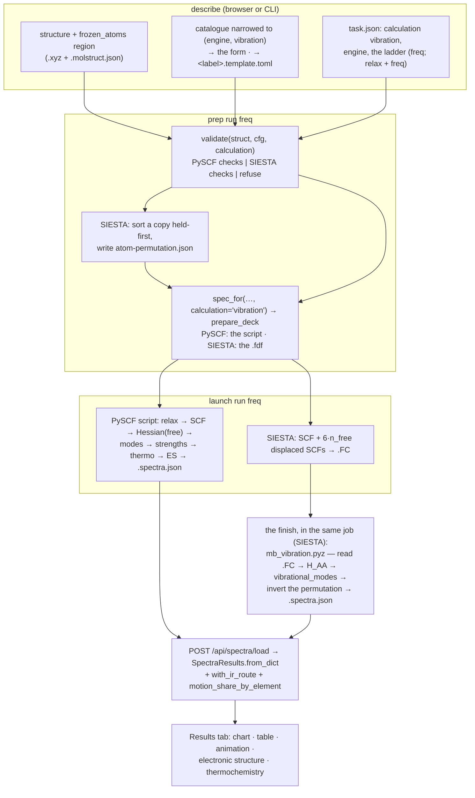

# Vibration — the calculation, on PySCF and on SIESTA

**Role:** contract — **the master document for the `vibration` calculation
kind.** What the calculation is, how each engine computes it, what the script
and the deck contain, what the result file holds, and which rules the code is
checked against. Where this document and the code disagree, the code is wrong
or this document is out of date — and the second is fixed first.
**Domain:** engines — with its science half in
[`science/normal-modes.md`](?doc=science/normal-modes.md) and its web half in
[`web/spectra.md`](?doc=web/spectra.md).
**Companions:** [`science/normal-modes.md`](?doc=science/normal-modes.md) (the
derivations, the rules R1–R8, the acceptance test);
[`web/spectra.md`](?doc=web/spectra.md) (the Spectrum tab and the Results-tab
viewer), [`web/spectrumchart.md`](?doc=web/spectrumchart.md) and
[`web/vibrationview.md`](?doc=web/vibrationview.md) (the chart and the
animation); [`engines/pyscf.md`](?doc=engines/pyscf.md) and
[`engines/siesta.md`](?doc=engines/siesta.md) (the two emitters this kind
rides); [`engines/stages.md`](?doc=engines/stages.md) (the description on
disk); [`engines/template.md`](?doc=engines/template.md) § 6.3 (how the
catalogue is narrowed to a kind);
[`execution/job-contracts.md`](?doc=execution/job-contracts.md) § 4.2a and § 6.1
(warm files, the artifact registry);
[`model/overview.md`](?doc=model/overview.md) § 2.2 (what a reorder may do);
[`science/validation.md`](?doc=science/validation.md) (the gate the kind's
checks run in). **Open items:** row **V1** of
[`plans/plan.md`](?doc=plans/plan.md), and nowhere else.

> **Consolidated 2026-09-24** from the design of 2026-09-21, the follow-up
> audit of 2026-09-22, the UI walk of 2026-09-23 and the implementation
> sections that had accumulated in the science and web contracts. The design
> and the audit are archived (`archive/2026-09-24-normal-mode-unification-design.md`,
> `archive/2026-09-24-vibration-audit.md`) as the record of how the decisions
> were reached; every decision, measurement and open item they held is here
> or in the plan. Nothing decided there is re-decided here. The spectrum rows
> of the 2026-09-23 UI walk are registered under V1 in `plans/plan.md`. One
> ordering rule
> of the design was knowingly broken: its step 4 (the API shape) was to land
> before the SIESTA arm, and part of it landed after — the cost is the second
> pass V1.0 and V1.6 name.

---

## 0. How to read this document

Three documents share this subject, and each owns one kind of statement:

| document | owns | read it when you want to know |
|---|---|---|
| [`science/normal-modes.md`](?doc=science/normal-modes.md) | **why** — the derivations, the rank rule for the motions that are not vibrations, stationarity, masses, the rules R1–R8 and the acceptance test | why a held-atom run reports fewer modes than `3·N_free`, and why that number is a rank and not a table; and, in its § 4b, both engines' workflows step by step against the discussion this work started from — what the tool does at each step, where it differs, and what is owed |
| **this document** | **what and how** — what the calculation computes on each engine, what the script and the deck contain, what the result file holds, what the code must keep true, what is built and what is owed | how a run works end to end, where a number in the file comes from, what to check the code against |
| [`web/spectra.md`](?doc=web/spectra.md) | **the tab** — the Spectrum tab, the hand-over to Task setup, the viewer, the chart, the animation, and how an absent number is drawn | what a person sees and clicks |

**A student** reads § 1 (the calculation in one page, with the eight rules
in one line each), § 2 (the road), § 4 and § 5 (the two routes, with
pseudocode and pictures), then § 11 (worked examples), with § 12 (the
glossary) open beside them, and takes the science document for the
derivations. **A developer** reads § 2, § 3 (the parameters), § 6 (the result
file), § 7 (the invariants), § 8 (the pieces), § 9 (validation and tests) and
§ 10 (shipped and owed), and checks the code against § 7. Words used before
they are defined — *kind*, *description*, *the pair*, *deck*, *phase*,
*rung*, *route* — are § 12's.

---

## 1. The calculation in one page

### 1.1 What a vibration calculation is

Near a geometry `R₀`, write every atom's displacement as one long vector `u`
(three numbers per atom). The energy is a quadratic bowl and the force is minus
its gradient — the many-coordinate form of Hooke's law:

```text
    E(u)  ≈  E₀  +  ½ uᵀ H u ,     H_{Iα,Jβ} = ∂²E / ∂R_{Iα} ∂R_{Jβ}      (the Hessian)
    F  =  −∇E  =  −H u             moving one atom pushes on the others: that
                                   coupling IS the off-diagonal Hessian
```

Divide each entry by the square roots of the two atoms' masses and diagonalise:
each eigenvector is a **normal mode** — a pattern of atoms moving together at
one frequency `ω = √λ` — and the spectrum is the list of them. Six of the
eigenvectors of a free molecule are not vibrations (three slides, three turns;
five for a straight molecule), so they are removed before the diagonalisation.
Two more quantities ride on the modes: how strongly each absorbs or scatters
light (the **infrared** and **Raman** strengths, from how the dipole and the
polarizability change along the mode), and the harmonic **thermochemistry**
(zero-point energy, entropy, free energy) summed over them.

### 1.2 What holding atoms means

Hold some atoms — an anchor, a metal slab — and split the coordinates into free
`A` and held `F`. Impose `u_F = 0`:

```text
    ┌ F_A ┐       ┌ H_AA  H_AF ┐ ┌ u_A ┐           F_A = −H_AA u_A
    │     │  = −  │            │ │     │     ⇒
    └ F_F ┘       └ H_FA  H_FF ┘ └  0  ┘           F_F = −H_FA u_A   ≠ 0
```

Four consequences, each a rule in the science document:

1. **What is diagonalised is `H_AA`** — the free–free block of the Hessian of
   the *whole* system, with every held atom present in the energy. A held atom's
   displacement is zero; its interaction is not. This is the partial Hessian
   (PHVA) of Head, Li & Jensen and Besley [Head1997, LiJensen2002, Besley2008].
2. **Some eigenvectors of `H_AA` are still not vibrations.** The free atoms can
   turn about one held atom, or about the line through two, at no cost. How
   many such motions survive is a **rank** computed from the geometry
   ([`science/normal-modes.md`](?doc=science/normal-modes.md) § 3.1 — six, five,
   three, one or zero, with two traps a table gets wrong), and they are
   removed **before** diagonalising (R3). With three held atoms not on one line,
   or any held atom in a periodic cell, nothing survives and nothing is removed.
3. **Stationarity is asked of the free atoms only** (R5): `∇_A E = 0`. The
   held atoms carry the constraint force `−H_FA u_A` by definition.
4. **One mass convention on every route** (§ 3.2 there): isotope-averaged
   masses (H = 1.008, not 1 — whole mass numbers move a stretch by 15 cm⁻¹),
   modes normalised `Σ_k m_k |L_k|² = 1` in amu. Crossing the normalisations
   once put every infrared intensity out by 1823×.

**The eight rules of the science contract, one line each** — cited by number
throughout this document; the full statements and their reasons are
[`science/normal-modes.md`](?doc=science/normal-modes.md) § 6:

| rule | in one line |
|---|---|
| **R1** | the count of surviving whole-body motions is computed in one place, by a rank — never tabulated or branched on |
| **R2** | one formula for the mode count, `3·N_free − n_rigid`, for every system; `3N − 6` is the empty-held-set case |
| **R3** | project the surviving motions out, then diagonalise — on both engines, at the Γ point only |
| **R4** | what is reported is what is left: every mode in the file is a vibration, and no reader needs a filter |
| **R5** | stationarity is judged on the free atoms; held atoms carry the constraint force by definition |
| **R6** | a prediction that cannot match the run is not written: a stated count is R2's or the run's own list |
| **R7** | the person is told how many motions survive the hold and what they are, before paying for the run |
| **R8** | a cost claim is read from the code, and what the code cannot skip is stated beside it |

### 1.3 The two engines, and the one path after them

| | **PySCF** | **SIESTA** |
|---|---|---|
| suits | isolated molecules, small clusters | periodic slabs, surfaces, junctions |
| basis | Gaussian functions | numerical atomic orbitals |
| how it gets `H_AA` | **analytic** second derivatives, for the free atoms (§ 4.4) | **central differences** of its analytic forces: nudge each free atom, read every force (§ 5) |
| frequencies + mode shapes | yes | yes |
| infrared / Raman strengths | yes (§ 4.6) | **not offered** (§ 5.6) |
| thermochemistry | full RRHO (rigid-rotor harmonic-oscillator) for a free molecule; vibrational sums with atoms held | vibrational sums |
| per-mode electronic structure | yes (§ 4.8) | no |
| a gold electrode | must be faked as a finite cluster | its natural home — and the same pseudopotentials, orbitals and k-points as the transport step (§ 5.6) |
| where a typical run lands | `spectrum/` | `frequency/` — a storage vocabulary, not an engine rule (§ 2.4) |

Only *how the block is obtained* differs. Everything after it is one function,
`spectra/normal_modes.py::vibrational_modes`, which both engines hand the same
things — the block, the masses, the geometry with its held set, and which
axes repeat (`axis_kind`, with the cell when one does) — and which returns the
modes with the surviving whole-body motions removed. The
PySCF deck carries that function's source inside the generated script; the
SIESTA job's finish calls it beside the run (§ 5.5). There is no second path (R1–R4).

### 1.4 The smallest example, with real numbers

H₂ from the measured SIESTA fixture (`tests/fixtures/siesta_fc`): the bond's
force constant read from the `.FC` file is `k = 41.713 eV/Ų`, `m = 1.008 amu`.

| | diagonalised | motions removed | modes | ω |
|---|---|---|---|---|
| both atoms free | the 6×6 block | 5 (three slides, two turns; the turn about the bond moves nothing) | 1 | `√(2k/m)` = **4744 cm⁻¹** |
| one atom held | the free atom's 3×3 block, `[k]` along the bond | 2 (the free atom swinging about the held one) | 1 | `√(k/m)` = **3355 cm⁻¹** |

*(The 2026-09-23 run of § 5.5, on the same unrelaxed bond, reported 3358 cm⁻¹:
the same mode from its own SCF and its own force constant, the fixture's from
a hand-set deck — one quantity, two SCF settings. On the relaxed bond the road
reports 3022, § 9.)* Holding one end lowers the stretch by exactly `√2`, because
the partner no longer recoils: the reduced mass is `m` instead of `m/2`. Both numbers are
right for the question each asks — a constrained Hessian is a different
question, not a worse answer. The two swings of the free atom are the
surviving motions of point 2 above; without R3 they would be reported as two
modes near zero. [`science/normal-modes.md`](?doc=science/normal-modes.md)
§ 4b works the same example from the eigenvectors up.

---

## 2. The road — from a description to a result file

### 2.1 The whole road

```mermaid
flowchart LR
  M["Molbuilder tab<br/>build the structure,<br/>hold atoms in the viewer,<br/>Save to project (the pair)"] --> S["Spectrum tab<br/>load the structure, pick the engine on the strip<br/>(a periodic structure defaults to SIESTA),<br/>set parameters (the catalogue's form per engine),<br/>read the live checks"]
  S -->|"Send to Task setup<br/>= the hand-over"| T["Task setup<br/>shape, machine, the kind's ladder;<br/>Save writes task.json;<br/>the stage's tab prints the commands<br/>(--target when the CLI would refuse to guess)"]
  T -->|"prep run freq"| P["the deck<br/>PySCF: &lt;label&gt;_01_freq.py<br/>SIESTA: &lt;label&gt;_01_freq.fdf (from a sorted copy)"]
  P -->|"launch run freq"| R["the run — the job writes the result itself<br/>PySCF: the script writes it<br/>SIESTA: the force-constant run leaves &lt;label&gt;.FC,<br/>then the finish (mb_vibration.pyz) derives the modes"]
  R --> A["&lt;label&gt;.spectra.json<br/>the one artifact, schema 6"]
  A --> V["Results tab<br/>chart · modes table · animation ·<br/>electronic structure · thermochemistry"]
```



The CLI walks the same road without the browser:

```bash
molbuilder jobset init --structure P/structure/x.xyz --bundle P/frequency/F \
    --engine pyscf|siesta --calculation vibration --name X --shape hierarchical
molbuilder jobset prep run freq --bundle P/frequency/F --target this
molbuilder jobset launch run freq --bundle P/frequency/F --mode direct --yes
```

The launch ends with `<label>.spectra.json` in the attempt on both engines
(§ 5.5 for SIESTA); there is no step after it.

`init` refuses `--stage-strategy` for this kind (a *ladder* is a
description's list of stages, each a *rung* with its own parameter set; a
*tier* ladder — coarse, medium, tight — grades an optimisation's convergence,
and a vibration's ladder is its measurement, with the relaxation before it on
SIESTA when the box is unticked and, for a displacement sweep, more
force-constant stages, § 5.9) and any engine but the two named.

### 2.2 The description: the relaxation is the person's explicit choice

A vibration is an ordinary described job: `task.json` carries
`calculation: "vibration"`, the engine, and its ladder
(`pyscf/stages.py::vibration_stages`; [`engines/stages.md`](?doc=engines/stages.md)).
The parameters travel in `<label>.template.toml`, the catalogue narrowed to
the kind (§ 3) — **including the relaxation's convergence settings on both
engines**, shown and editable exactly as on the Structure-optimization tab,
with the kind's own recommended values, which are tight (§ 3.1).

**A harmonic analysis is only valid at a stationary point**, so the
relaxation is the measurement's precondition, and **whether it runs is the
person's explicit say** *(user rulings 2026-08-20, refined 2026-09-24: "this
is totally user's control and it is explicit")*, made with one box on both
engines, `already_relaxed`:

| the box | what the tool does, on either engine |
|---|---|
| **unticked** (the default) | the calculation **relaxes first**, at the template's convergence settings — recommended tight, a largest remaining force of about 0.01 eV/Å — and then takes the second derivatives at the relaxed geometry. On PySCF that is Phase 0 of the one script (§ 4.2); on SIESTA it is a **`relax` stage before the `freq` stage** (§ 5.2a), the relaxed geometry carried into the force-constant deck as coordinates |
| **ticked** | the person states the structure is already relaxed **at this level of theory**. Nothing is relaxed; the tool measures the forces at the starting geometry and, above the template's force tolerance, **warns in plain words that the frequencies will be off** — never refuses, because the statement is the person's to make. The hint beside the box says the same before the run is paid for |

Why the warning is plain and the default is to relax *(measured 2026-09-24,
§ 9)*: the H₂ fixture at the experimental bond length, sent through the
SIESTA road unrelaxed, reported 3358 cm⁻¹ where the relaxed bond gives 3022 —
a tenth of the frequency — and the two relaxation tolerances 0.02 and
0.001 eV/Å differ by two wavenumbers. An unrelaxed structure is the one error
that looks like a result.

**How the tool answers the ticked box with numbers**: PySCF's deck checks
the gradient at the input geometry (§ 4.3); SIESTA's finish reads the
forces SIESTA evaluated at its FC step 0 (§ 5.5). Both judge the largest
absolute force component over the **free** atoms (R5) against the template's
own force tolerance — `geom_gmax` on PySCF, `relax_force_tol` on SIESTA — the
one the person set or left at the kind's recommendation; both write the
number and the verdict into the result, and the viewer shows them; above the
tolerance, the remedy is one text on both engines (§ 5.5).

**The structure can carry its own evidence** *(user direction 2026-09-24:
"if the info meta data is present, we should display it and check against
tolerance of calculation; if not present … we will just accept that but with
a warning/hint")*. A pair exported from the Results tab of a finished
relaxation carries `info.relaxation` — the run's engine, its force tolerance,
the largest force left on the atoms it moved, the atoms it held, and a
fingerprint of the geometry it describes
([`model/parse.md` § 5b.1](?doc=model/parse.md)) — beside `info.calculation`,
the level of theory the deck stated (SIESTA today). Both kinds' gates read
them (`validation/sidecar.py::check_relaxation_record`), and every finding
lands on the box's own card, so the record is displayed where the choice is
made; the Metadata pane shows the raw store.

| the box | the record | the finding |
|---|---|---|
| ticked | absent | the plain warning of the table above, and an info line that no record travels with this structure — the statement stands on its own and the finish measures it |
| ticked | present, for a different geometry (another frame of that run, or edited since — the fingerprint differs) | **warning**: the record does not vouch for these coordinates |
| ticked | present, for these coordinates | the engine, the tolerance, the steps and the largest remaining force are shown; a different engine, a different level of theory (`info.calculation` against this form's basis, functional, mesh cutoff, electronic temperature, and the charge and spin it will carry, resolved), a largest force above **this calculation's** tolerance, or a different held set is each a **warning** naming the number or the field; within tolerance at the same level is an info line |
| unticked | present, for these coordinates, within this calculation's tolerance at the same level and held set | an info line: the record already meets this calculation's criterion, so the box may be ticked and the relaxation skipped |
| unticked | anything else | the same facts as information; the ladder relaxes regardless |

Never a refusal: the record informs the person's explicit choice; it does not
make it. The PySCF deck's own `_optimized.xyz` pair records neither: the
relaxation record is the one reader's, written by the Results tab's export
(V1.31, closed 2026-09-29), and a PySCF run's level of theory has no reader yet
([`pyscf.md`](?doc=engines/pyscf.md) § 2; plan § 5w K18).

### 2.3 Held atoms travel with the structure, never as a form field

Which atoms are held is a fact about the **structure**: the `frozen_atoms`
region in its `.molstruct.json` half of the codec pair
([`model/structure-annotations.md`](?doc=model/structure-annotations.md)). Set
it in the viewer or load a structure that carries it; the Send button exports
the model in one read, so what is drawn held is what the calculation holds.
**Frozen means frozen through every phase** *(user, 2026-08-21)*: the PySCF
relaxation holds the same set (geomeTRIC's `$freeze` file, the optimisation
deck's own mechanism) and the Hessian is taken over the free atoms only; the
SIESTA deck writes the set into `Geometry.Constraints` and nudges the free
range only. The old form field (`frozen_indices`, pre-filled from the sidecar)
was retired at phase P2 of the spectra migration of 2026-08-20
([`archive/2026-08-20-spectra-migration-plan.md`](?doc=archive/2026-08-20-spectra-migration-plan.md))
because a form copy of a structure fact could be edited into disagreement
with the structure it described. The
set is never second-guessed: nothing warns you off a choice you made on
purpose. What the run **says** about the choice is the point — the regime, the
motions removed, the Methods sentence (§ 4.10, § 6).

### 2.4 Where results land — `frequency/` and `spectrum/`

`frequency/` and `spectrum/` are two of the nine folder topics a person picks
from ([`execution/job-contracts.md`](?doc=execution/job-contracts.md) § 2.5),
split by *what is computed* — frequencies and thermochemistry against
intensities — and nothing derives a topic from an engine: a PySCF run with both
intensity flags off belongs in `frequency/` by that description. The table in
§ 1.3 says where a typical run of each engine lands, not where a mechanism
puts it. There is no `frequency` calculation kind; the kinds are
`optimization`, `vibration` and `transport`.

---

## 3. The parameters

### 3.1 One catalogue, narrowed to the kind

Every parameter of every calculation lives in the one catalogue
(`molbuilder/data/catalogue.template.toml`;
[`engines/template.md`](?doc=engines/template.md)). An item declares which
engines it applies to (`engines`, absent = all) and which calculation kinds
select it (`calculations`, absent = every kind — § 6.3 there). The vibration
template, the Spectrum tab's form (`GET /api/build/schema/<engine>?calculation=vibration`)
and the deck's own item lines are all the same narrowing of the same file, so
a parameter is defined once and rendered the same everywhere.

**Three kinds of item, and how each is shown** *(user, 2026-09-28: "there are
parameters that are only available for pyscf, and parameters that are engine
neutral. so you need to make this correct"; "we know that there are limits of
all engines, and the options and presentation just need to be clear about
that")*:

| kind | the items | on the forms | in the result |
|---|---|---|---|
| **one meaning on both engines** | `already_relaxed`, `net_charge`, `spin_treatment`, `unpaired_electrons`, `temperature_K` | both forms, one name; both routes honour it (I10) | `thermo.temperature_K` and `relaxation.already_relaxed` in both results; the charge and spin as resolved in PySCF's `electronic_state` block — a SIESTA result does not record its deck's state |
| **one idea, each engine's own setting** | the relaxation's criteria (`geom_*` on PySCF, `relax_*` on SIESTA — two optimisers), the SCF machinery, the basis, the functional | each form shows its own | each engine's own record |
| **a capability one route has** | PySCF's strengths and its probe — `compute_ir`, `compute_raman`, `es_mode_selection`, `es_explicit_indices`, `freq_min_cm1`, `freq_max_cm1`, `es_n_homo_below`, `es_n_lumo_above`, `displacement_amplitude_ang` — and the gas-phase pressure `pressure_atm`; SIESTA's `fc_displacement` | only that engine's form | the other route's file has no switch for it in its `config`, so the viewer reads the absence **by role** and says *not computed on this route* — it never asks a person to set an item that route does not have ([`web/spectra.md`](?doc=web/spectra.md) § 9b.3) |

**The vibration-only items** *(the catalogue as of 2026-09-28)*:

| item | engine | what it reaches | default | note |
|---|---|---|---|---|
| `already_relaxed` | both | the person's explicit say (§ 2.2). Unticked: PySCF runs Phase 0, SIESTA runs a `relax` stage first. Ticked: nothing is relaxed; the forces at the starting geometry are measured against the template's force tolerance and a plain warning says the frequencies will be off when they fail | `false` | never refused; the hint beside the box carries the same warning |
| `compute_raman` | pyscf | `COMPUTE_RAMAN` — the polarizability sweep (§ 4.6) | `true` | the expensive optional: about `6·N_free` extra SCFs, each with a response calculation |
| `compute_ir` | pyscf | `COMPUTE_IR` — dipole derivatives (§ 4.6) | `false` | nearly free when it is the only strength asked for and no atom is held; otherwise rides the Raman sweep or its own dipole sweep |
| `temperature_K` | both | the thermochemistry's temperature (§ 4.7): `THERMO_T_K` in the PySCF deck; on SIESTA the deck's `vibration` block, which the finish sums at (§ 5.3, § 5.5) | 298.15 K | on SIESTA since 2026-09-28 (V1.7); greater than 0 by rule, on both engines — PySCF's thermochemistry divides by kT, and what 0 K would leave on the harmonic sums, the zero-point energy, every record carries at any temperature (`template.md` § 5.3) |
| `pressure_atm` | pyscf | `THERMO_P_ATM` — the pressure of the gas-phase translational term, which only the full RRHO regime has (PySCF, nothing held; § 4.7) | 1 atm | not on SIESTA's form: no SIESTA result has a translational term for it to enter. With atoms held it enters nothing either, and a value other than the default is **warned about** — kept on the form, so the form's shape does not follow the structure *(user, 2026-09-28)*; greater than 0 by rule — its entropy takes a logarithm of kT/P (`template.md` § 5.3) |
| `displacement_amplitude_ang` | pyscf | `DISPLACEMENT_AMPLITUDE_ANG` — the ± push along a mode for the electronic-structure probe (§ 4.8) | 0.02 Å | window 0.02–0.20 Å: smaller drowns in SCF noise, larger leaves the harmonic region |
| `es_mode_selection` | pyscf | `ES_MODE_SELECTION` — which modes get the probe (§ 4.8) | `skip` | three choices — `skip` · `all` · `explicit`; `top_n` and `threshold` were retired by decision (2026-09-23) and removed (2026-09-28, V1.6) |
| `es_explicit_indices` | pyscf | the list for `explicit` | `""` | 1-based, `"3, 7, 12"` or `"3-7, 12"`; one format, read by one reader, `PySCFConfig.explicit_modes` — the atom index list's grammar (`selection.parse_index_list`), sorted, each mode once — for the deck's constant, the Methods count and the selector; text it cannot read (`"0, 2"`, `"3,,4"`) is refused at `prep`, before a deck is written |
| `freq_min_cm1` · `freq_max_cm1` | pyscf | the window `all` filters by | unset | `skip` selects nothing; ignored by `explicit` — naming a mode is saying *that one* — so the form **locks** the window outside `all`, as it locks the explicit list outside `explicit` *(user, 2026-09-28)* |
| `es_n_homo_below` · `es_n_lumo_above` | pyscf | the orbital window recorded per displaced geometry | 5 · 5 | record size, not cost |
| `net_charge` | both | `NetCharge` / `gto.M(charge=)` | auto | shared with every kind; resolved once by the electronic state (a stated value wins, 0 included; else the charge of the run the structure came out of; else the phosphate rule — one negative charge per nucleic-acid backbone phosphate, [`model/chemistry.md`](?doc=model/chemistry.md); [`science/chemistry-correctness.md`](?doc=science/chemistry-correctness.md) § 2a) |
| `fc_displacement` | siesta | `FC.Displacement` — the nudge of the force-constant run (§ 5.3) | 0.04 Bohr | range 0.005–0.2 Bohr; smaller pushes the force difference toward the SCF noise floor, larger picks up anharmonic terms; greater than 0 by rule — SIESTA divides each force difference by it (`ofc.f90`, `template.md` § 5.3) |
| `relax_type` · `relax_steps` · `relax_force_tol` · `relax_max_displ` | siesta | the `relax` stage's driver, step cap, force tolerance and largest step (§ 5.2a) — the same items the optimization kind shows; the driver offers the three relaxers only, CG · Broyden · FIRE (`offered`, [`template.md`](?doc=engines/template.md) § 6.3a): `Verlet` and `Nose` are dynamics and `none` relaxes nothing | the kind's **recommended** values are the tight tier: Broyden, 100 steps, **0.01 eV/Å**, 0.02 Å (`recommended = { vibration = … }` in the catalogue, [`engines/template.md`](?doc=engines/template.md) § 6.3a) | editable like every other item; the tolerance is also the yardstick the finish judges the reference geometry by (§ 5.5) |
| `geom_gmax` · `geom_grms` · `geom_dmax` · `geom_drms` · `geom_etol` · `geom_max_steps` | pyscf | Phase 0's geomeTRIC criteria (§ 4.2) — the optimization kind's own items | the kind's **recommended** values are the tight tier: `geom_gmax` **2·10⁻⁴ Eh/Bohr** (0.010 eV/Å), `geom_grms` 1·10⁻⁴, `geom_dmax` 1·10⁻³ Å, `geom_drms` 5·10⁻⁴ Å, `geom_etol` 1·10⁻⁶ Eh, 100 steps | the general default stays the medium tier for an optimization; the vibration kind recommends tight because a frequency deserves a real stationary point |

**Where each item sits on the form** — the card is the item's `group`, the legend
inside it the first `category` ([`engines/template.md`](?doc=engines/template.md)
§ 6.2 and the key table there), and the vocabulary decides: what the run
*computes* is `profile` (`already_relaxed`, `compute_raman`, `compute_ir`,
`temperature_K`, `pressure_atm`, and the probe's selectors
`es_mode_selection` · `es_explicit_indices` · `freq_min_cm1` · `freq_max_cm1`);
a numerical step size is `stage` under *accuracy*
(`displacement_amplitude_ang`, `fc_displacement`), the set a staged sequence
may tighten; a record size is `output` (`es_n_homo_below`, `es_n_lumo_above`).
The selectors are not convergence targets and nothing steps them per stage —
they sat on the `stage` card until 2026-09-24, where Task setup also offered
them as *vary per stage*.

**The engine is not an item.** Which program runs a described job is the
description's `engine` (`task.json`), chosen on the Spectrum tab's engine
strip the way the Structure-optimization tab has always chosen it, carried by
the hand-over, refused by `init` for anything but the two engines. A
one-choice `engine` form item stood in for the strip until 2026-09-24 and
retired with it: a parameter of the deck it never was.

> **The electronic state is inherited, and a PySCF vibration is restricted**
> *(W34, decided 2026-09-25; unrestricted 2026-09-29, plan § 5w K17)*: a
> vibration built from a relaxed structure defaults to that relaxation's charge
> and spin, and a difference is warned; a PySCF vibration offers `restricted`
> alone — restricted-open has no analytic ROHF/ROKS Hessian to take, and
> unrestricted waits for the spectrum record's two spin channels (PS-C2: the
> orbital block is written one channel wide)
> ([`science/chemistry-correctness.md`](?doc=science/chemistry-correctness.md) §§ 2a.2 ES7,
> 2a.3).

**The shared items** — method, functional, basis, the spin treatment and count, dispersion, density
fitting, the implicit solvent (`solvent`, PCM — on the frequencies-only
route, § 4.6), the SCF machinery, the
geometry-convergence criteria (`geom_gmax` family, whose values for this
kind are the tight tier through the catalogue's `recommended` key — the row
above; V1.20 closed 2026-09-24), the relaxation's workflow knobs
(`on_nonconvergence`, `geom_max_steps`, `geom_continue_retries`,
`write_trajectory`, `write_molwatch_log`, `save_initial_xyz`,
`save_optimized_xyz` — § 4.2 says what each does here), the execution category
(threads, memory, GPU, `mpi_np`) — are the engines' own rows, selected into the
vibration template with the kind's defaults.

**Why Raman is on by default and infrared off** *(user, 2026-08-20: one
calculation, two independent toggles)*: the tab began as a Raman tool, and with
Raman on the infrared derivative rides its sweep for free (§ 4.6), so the
analytic infrared route only matters to a person who switches Raman off. A
frequencies-only run turns both off. Their meaning is
[`engines/pyscf.md`](?doc=engines/pyscf.md) and
[`engines/siesta.md`](?doc=engines/siesta.md); the SCF knobs reach every mean
field the PySCF deck builds through one generated dresser (§ 4.3).

**Items the kind does NOT show, and why:** `restart` (the SIESTA start state
is the kind's own, § 5.3; the PySCF deck carries no deck-level restart state);
`frozen_indices` (retired, § 2.3); `SpectraConfig` (a 33-field class
nothing constructed, retired 2026-08-22 — the kind's science is the kind's);
and **no "how many layers should move" question** (withdrawn 2026-09-21: the
structure already carries the answer, and comparing two freeze depths is two
structures and two runs, which works today — § 11). The tool computes what it
is given and asks nothing new.

### 3.2 The honesty gate

A form that shows a knob the calculation ignores is a lie *(user, 2026-08-21)*.
`tests/test_vibration_form_honesty.py` renders the deck once per offered
parameter with a non-default value and requires the deck text to change; a
parameter still awaiting its integration sits on an explicit list in that test,
each row naming its plan item, and the list only shrinks. The kind validator
refuses by name what the render cannot honour (`validation/spectra.py`).

### 3.3 What the person is told before paying for the run

The live checks on the Spectrum tab and the settings gate at `prep` run the same
function, `validation.validate(struct, cfg, calculation="vibration")`, which
dispatches on the config class — `spectra_render_checks` for PySCF,
`siesta_vibration_checks` for SIESTA — and **refuses any other class by name**
rather than returning an empty verdict (an empty list reads as *checked,
nothing found* on every surface — the silent skip that finding **F4** of
[`science/validation.md`](?doc=science/validation.md) forbids: derived facts
are derived server-side, inside the one gate). Both say, from the one rank
rule: how many atoms are held, how many whole-body motions survive and will
be removed, and how many modes will be reported (R7) — counted on the axes the
engine computes with (`cell.engine_axis_kinds`,
[`model/structure-periodicity.md`](?doc=model/structure-periodicity.md) § 2.1),
which on PySCF are a cluster's whatever the structure's: the count the deck
removes, the one its Methods paragraph states. PySCF's adds the
finite-difference and amplitude checks and the cost of what was ticked (the
parity of the electron count is the electronic state's, asked for every engine), stated from what the code does (R8); SIESTA's
checks are § 5.8. **A structure with a repeating axis is computed as an
isolated cluster, and the check says so** — PySCF builds a molecule in free
space, so the periodicity is not respected (`cell.periodic_in_gas_phase`, the
engine's one note for every PySCF calculation). A note, not a refusal *(user,
2026-09-29: "just note that periodicity will not be respected in pySCF"; it was
refused here until then)*: the script's harmonic analysis removes the motions
of the free cluster it computes, so the result agrees with itself, and whether
a cluster is what the person means is theirs to judge.

---

## 4. The PySCF route — the generated script, phase by phase

The deck is a Python script generated by `pyscf/vibration_deck.py` (the
composer) from blocks in `pyscf/vibration_emitters.py`, through the same seam
every deck uses — `pyscf.input.spec_for(struct, cfg, calculation="vibration")`
→ `script_emit.prepare_deck` ([`execution/script-preparation.md`](?doc=execution/script-preparation.md)
§ 4). It runs in the `molbuilder-pySCF` env, needs no molbuilder at run time,
and writes `<label>.spectra.json` beside itself after every phase.

### 4.1 The script, top to bottom

```text
# constants from the description: JOB, ATOMS, ELEMENTS, N_ATOMS, FROZEN_INDICES_USER
# (the held set as the structure gave it) → FROZEN_ATOM_IDXS / FREE_ATOM_IDXS,
# AXIS_KIND (the axes gto.M computes on: a cluster's, cell.engine_axis_kinds),
# ALREADY_RELAXED, GEOM_* criteria, THERMO_T_K, THERMO_P_ATM, THERMO_T_GRID (the deck's
# copy of normal_modes.THERMO_GRID_K), COMPUTE_IR, COMPUTE_RAMAN, RAMAN_FD_STEP_ANG,
# DISPLACEMENT_AMPLITUDE_ANG,
# ES_MODE_SELECTION, ..., and the spliced functions (homo_index, dipole_derivatives,
# rigid_motions, vibrational_modes, vibrational_thermo, vibrational_thermo_grid,
# structure_hash_text) — source text copied from their one home, so the deck
# imports nothing of molbuilder.

mol = gto.M(atoms = EVERY atom, held ones included; basis, charge, spin, ...)
_mb_configure_scf / _mb_configure_theory   # the generated dressers (§ 4.3)
state = {schema_version: 6, engine: 'pyscf', phases: empty, ...}; write the artifact

# Phase 0 — relaxation (§ 4.2)
if not ALREADY_RELAXED:
    mol = geomeTRIC(build_mf(mol), freeze = FROZEN_ATOM_IDXS).run()   # the free atoms relax
COORDS_EQ_ANG = mol.atom_coords(unit='Angstrom')                     # the Hessian's geometry

# Phase 1 — the equilibrium SCF (§ 4.3)
mf = build_mf(COORDS_EQ_ANG).run();  E_eq, MO_ENERGIES_EQ, HOMO_IDX
check  max|F_a| over a ∈ FREE  <  GEOM_GMAX        # R5 — warns with the numbers, never refuses

# Phase 2 — the Hessian and the one harmonic path (§ 4.4, § 4.5)
HESS, DMU_DR, IR_ROUTE = dipole_derivatives(mf_for_hess, FREE_ATOM_IDXS, want_analytic_ir)
λ, L, patterns = vibrational_modes(HESS, MASSES_AMU, COORDS_EQ_ANG, FROZEN_ATOM_IDXS, axis_kind)
                                   # cell= is optional and omitted: an isolated molecule
FREQ_CM1 = sign(λ)·√|λ|·5140.487 ;  state['modes'], state['removed_motions']

# thermochemistry (§ 4.7)
state['thermo'] = RRHO (nothing held) | vibrational sums above E_eq (atoms held), headline + grid

# Phase 3 — intensities (§ 4.6)
Raman: for each free Cartesian coordinate, ±RAMAN_FD_STEP_ANG: SCF + analytic polarizability
       (and the dipole, read for free) → dα/dR, dμ/dR → per-mode activities and intensities
IR alone: analytic dμ/dR from the Hessian's own response (no atom held), else the dipole sweep

# Phase 4 — per-mode electronic structure (§ 4.8)
for each selected mode: SCF at q ± A·L_display → the orbital window around HOMO/LUMO

write the artifact; print the summary
```

*(Every name above is explained in § 4.2–§ 4.10; a first reading can skip the
listing and return to it.)* Every construction site of a mean field calls the same generated
`_mb_configure_scf(mf)` and `_mb_configure_theory(mf)` —
[`engines/pyscf.md`](?doc=engines/pyscf.md) § 7a: the framework never spells an
SCF knob twice, and a deck that builds many mean fields (equilibrium,
displaced points, relaxation) inherits one definition with N call sites.

### 4.2 Phase 0 — the relaxation, the measurement's precondition

`geomeTRIC` runs in-process before the equilibrium SCF, on the free atoms,
with the held set written to its `$freeze` constraints file exactly as the
optimisation deck does. It is a **tracked phase**: `phase_relaxation` goes
`empty → running → complete`, and every step writes the artifact with the step
count and the current largest force, so the viewer's chip shows convergence
ticking down *(user, 2026-08-20: a silent gap while geomeTRIC works, likely the
longest part of the run, would betray "the viewer tracks all the steps")*.
When it ends, the phase records `relaxation.converged` — the judged force at
the geometry it reached (the free atoms' largest component, R5) against
`geom_gmax`, the one meaning that key has on every route (§ 4.3, § 5.5) —
while geomeTRIC's own verdict, all of its criteria, is what decides the
policy below.

What the phase honours from the description: the convergence criteria
(`geom_gmax`, `geom_grms`, `geom_dmax`, `geom_drms`, `geom_etol`,
`geom_max_steps` — the tight tier at the kind's recommendation, § 3.1), `on_nonconvergence`
(**this** is the phase that policy governs, through the one relaxation function
the optimisation deck relaxes with — [`pyscf.md` § 3](?doc=engines/pyscf.md),
which asks geomeTRIC whether it converged rather than assuming it: `halt` stops
the run before the Hessian; `continue` re-enters from the geometry reached, up to
the retry budget; `proceed` takes that geometry, with a warning that geomeTRIC's
criteria were not met beside `converged`, the judged force's verdict above),
`write_trajectory` (geomeTRIC's streaming XYZ), `write_molwatch_log` (the same
live-watch hooks the optimisation deck emits), `save_initial_xyz` /
`save_optimized_xyz` (`<job>_initial.xyz`, `<job>_optimized.xyz`, written as
**pairs**, geometry plus `.molstruct.json`, through the codec — a bare `.xyz`
carries no labels, no cell and no identity; fixed 2026-09-22 and proven by a
held set `frozen_atoms: [6, 7]` surviving into the output and reading back
through molbuilder's own codec). The optimizer is geomeTRIC, the engine's one
([`pyscf.md` § 3](?doc=engines/pyscf.md) says why `berny`, and with it the
`optimizer` item, was retired).

`already_relaxed = true` skips the optimiser and marks the phase
**complete by assertion**; the gradient check of § 4.3 then carries the number
the assertion is judged by. The rule for what to freeze: the set held for the
spectrum should be a subset of the set held for the relaxation that produced
the geometry — holding *more* for the spectrum is always safe, holding *less*
puts the free atoms off a stationary point in the very subspace that is
diagonalised.

**The geometry in the file is the geometry the Hessian is taken at** —
`COORDS_EQ_ANG`, rebound by this phase — so the eigenvectors and the
coordinates in `equilibrium.positions_ang` belong to the same geometry. *(Until
2026-09-24 the file carried the input coordinates: measured 0.0488 Å off on a
0.96 Å bond after a relaxation. Status in § 10.)*

### 4.3 Phase 1 — the equilibrium SCF, and the check on the geometry

One whole-system SCF at `COORDS_EQ_ANG`, the held atoms present, on the mean
field the dresser configured (chkfile written, GPU promotion when the probe of
§ 4.4 allows it, `newton()` when `scf_soscf` is on). It **halts unconditionally**
on non-convergence: this density feeds the Hessian, every intensity and the
thermochemistry, so no policy makes it optional.

It records the **equilibrium block**: `scf_energy_eh` (the SCF's return value,
stored as is), `mo_energies_eh` (non-finite entries dropped by the deck's
`_filter_finite`) and `homo_idx` (derived by the spliced `homo_index`: sum the
two spin channels of a 2-D `mo_occ`, take the highest index with occupancy
above 0.5 — a rule with a branch whose failure would be silent and would
affect only open-shell work, which is why it was lifted out of inline script
text on 2026-09-09 so one implementation runs and is tested), plus `elements`
and `positions_ang`.

**The stationarity check (R5)** takes the SCF's nuclear gradient and judges
the largest absolute force component **over the free atoms** against the
template's own `geom_gmax` — 2·10⁻⁴ Eh/Bohr at the kind's recommendation —
the one rule both routes judge by (§ 2.2; SIESTA's finish judges the same
quantity against `relax_force_tol`, § 5.5) *(ten times it until 2026-09-24)*,
recording it as `relaxation.max_force_eh_bohr` and the all-atom figure beside
it as `max_force_all_atoms_eh_bohr`, and the verdict as `relaxation.converged`
— the key the relaxation phase sets from the force at the geometry it reached
(§ 4.2) and SIESTA's finish from its reference step (§ 5.5), so it means one
thing on every route: the judged force within this calculation's criterion — the keys say their unit *(they said
`_a` until 2026-09-24 while the viewer printed "Eh/Å"; the number was always
Eh/Bohr)*. Measured
2026-09-22, why the free-atom rule matters: water with O and one H held,
relaxed to the deck's own criterion, reads 3.35·10⁻² over all atoms against
7.01·10⁻⁵ on the free ones; CO₂ with both O held 7.2·10⁻² against
3.9·10⁻¹⁴. Judging every atom (the old `np.abs(_g0).max()`) warned on four of
five correct constrained minima, and the warning reached the web UI.

**The structure hash** (`structure_hash`, `sha256:…`) is computed by
`sidecars.spectra.structure_hash_text` over `n_atoms`, the label and one line
per input atom, spliced into the deck so the SIESTA derivation and the PySCF
deck cannot hash differently. It is provenance for a reader; nothing enforces
it — its docstring's promise that *the parser can refuse to merge results from
a different molecule* is not kept, because it carries the job name as its
second line and never matches the codec's own pair hash, which is over the
document's bytes, a different scheme. The identity rule of § 10 (V1.9)
replaces it.

### 4.4 Phase 2 — the Hessian over the free atoms

**The rule** (R8): with atoms held, second derivatives are computed **for the
free atoms only**, and the run says so (`hessian_scope = 'free'`,
`n_atoms_in_hessian`). *(The audit of 2026-09-22 had ruled this an opt-in
with analytic infrared as the default; that ruling was **superseded on
2026-09-23 when the route was built**: no option was added, holding atoms is
what asks for the reduced calculation, and the run states which way it went.
The archived design records both.)* The function named `dipole_derivatives`
is the one place this is decided — the name is historical (it first produced
dμ/dR beside the Hessian), and it is the sole producer of the Hessian in the
deck. With nothing held the
Hessian is the whole molecule's and `hessian_scope = 'all'`. The spliced
`dipole_derivatives(mf, free_atom_idxs, want_ir)` is the one place this is
decided:

```text
if some atom is held:
    mf_h  = rebuild(COORDS_EQ_ANG, density_fit = False)      # PySCF's density-fitted Hessian
                                                              # class takes no atom list
    hobj  = mf_h.Hessian()
    H_AA  = hobj.hess_elec(atmlst = FREE) + hobj.hess_nuc(mol, atmlst = FREE)
            + hobj.get_dispersion()[FREE, FREE]               # kernel(atmlst=) adds this term FULL-SIZE
    H = zeros(N, N, 3, 3);  H[FREE, FREE] = H_AA              # the block is numbered by POSITION in the
                                                              # list passed, not by the atom's index, so it
                                                              # is placed back by index; held rows stay
                                                              # zero and are never read
    route = 'finite-difference' if IR is wanted else 'none'   # the analytic dμ/dR route takes no atom list
else:
    IR alone wanted → pyscf.prop.infrared: Hessian + dμ/dR from ONE response solve (§ 4.6)
    otherwise       → mf.Hessian().kernel()
```

Two corrections found by measurement and kept: PySCF 2.14's density-fitted
Hessian class fails on a partial list (`pyscf/df/hessian/rhf.py:216`, a shape
mismatch), so the reduced route rebuilds a plain mean field and records
`hessian_density_fit = false`; and `kernel(atmlst=)` cannot be used because its
dispersion term is full-size, so the three pieces are summed by hand. The
block agrees with compute-everything-and-slice to **1·10⁻⁸ Hartree/Bohr² for
Hartree–Fock** and **7.5·10⁻⁶ for DFT at grid level 4** (1.5·10⁻⁵ at level 3) —
the difference entirely in the coupled-perturbed response part (the static
part agrees to 6·10⁻¹⁴, and the figure is unchanged by the solver's cycle
cap), whose tolerance PySCF scales with the number of atoms in a batch
(`pyscf/hessian/rhf.py:330`), so the full calculation converges its response
more loosely than the partial one; about 0.03 cm⁻¹ on a stretch. Pinned by `tests/test_vibration_e2e.py` with and
without a dispersion correction.

**GPU.** A run-time probe (`_emit_gpu_coverage_probe`) asks whether gpu4pyscf
covers the Hessian for this SCF type; if not, the mean field is rebuilt on the
CPU for this phase — one extra SCF, and the only path when the coverage is
absent. The reduced route with a GPU mean field is untested (§ 10).

**What the reduced calculation skips, read from PySCF's own code**
(`pyscf/hessian/rhf.py`, `rks.py`, version 2.14), not from a timing:

| piece of the analytic Hessian | runs over | 300 atoms, 50 free |
|---|---|---|
| the SCF, and one rebuild without density fitting when atoms are held | every atom, once each | a 300-atom SCF, twice |
| `_partial_hess_ejk`: the `int2e_ipip1` diagonal contraction | every atom, once | unchanged |
| `_partial_hess_ejk`: the `int2e_ip1ip2` / `int2e_ipvip1` contractions, one per atom with `shls_slice` on that atom's shells | **the free atoms** | 50 of 300 — about a sixth |
| `make_h1`: the `int2e_ip1` contraction, one per atom | **the free atoms** | about a sixth |
| `solve_mo1`: the coupled-perturbed equations, `3·len(atmlst)` perturbations in memory-sized batches | **the free atoms** | 150 perturbations instead of 900 |
| `hess_elec`: the final pair loop | free × free | a thirty-sixth |
| `hess_nuc` | every pair, then sliced | trivial |
| **DFT only** — `_get_vxc_diag`; `_get_vxc_deriv2` with `vmat = zeros((natm, 3, 3, nao, nao))` and `for ia in range(mol.natm)`; `_get_vxc_deriv1` with `(natm, 3, nao, nao)` | **every atom** | unchanged — and it is memory: `300 × 9 × nao²` doubles, about 200 GB at 3 000 basis functions |

So the pieces that dominate *time* — the response equations and the
two-electron derivative contractions — scale with the free atoms, and a
300-atom system with 250 held costs those pieces about what a 50-atom system
would. The exchange-correlation derivative matrices do not shrink: PySCF builds
them for every atom whatever list it is given, and at a few hundred atoms their
size is what stops the run. **Consequence:** the PySCF analytic route is for
molecules of tens of atoms, and for anything without a functional
(Hartree–Fock has no such term); a junction of hundreds of atoms goes to the
SIESTA route (§ 5.7). *(The frozen-atom cost claim — `engines/overview.md`'s *"cuts the cost
sharply"* and the pre-run advisory's *"the cost saving is typically large"* —
was false until 2026-09-23: the full Hessian was computed and sliced, measured
10.6 s free against 10.1 s with 2 of 14 held. R8 now requires a cost statement
to be read from the code.)*

### 4.5 The one harmonic path

`spectra/normal_modes.py::vibrational_modes(hessian, masses, positions, held, axis_kind, cell)`
— spliced into the deck as source, called beside the run by the SIESTA finish (§ 5.5) —
is the only place modes are made. In order: take the free–free block; divide
by `√(m_i m_j)` per 3×3; build the surviving whole-body motions with
`rigid_motions` (three slides, the turns the lattice permits, then only the
combinations that leave every held atom in place, then only those that move a
free atom — the rank of [`science/normal-modes.md`](?doc=science/normal-modes.md)
§ 3.1, tolerance 10⁻³ Å per unit motion); diagonalise in the **complement** of
those motions in the mass-weighted metric; return `3·N_free − n_rigid`
eigenvalues (ascending; negative = imaginary), the modes in the canonical
normalisation `Σ m_k |L_k|² = 1` (amu), and the removed patterns.

Conventions that must not fork: isotope-averaged masses (`atomic_mass`, the
same table PySCF's `thermo` uses); the wavenumber conversion
`√λ × 5140.487…` for a Hessian in Hartree/Bohr² weighted in amu
(`constants.CM1_PER_SQRT_HARTREE_BOHR2_AMU`, derived from the two constants it
is made of); the display form `eigenvector_display` = the canonical vector
rescaled per mode so `max|L_k| = 1`, for the animation only (§ 6.3). Both
conventions were measured on 2026-09-22: the wavenumber constant agrees with
PySCF's own derivation to 1·10⁻⁹ relative, and `Σ m|L|²` comes out
1.00000000 on the free path and on every held system. The
artifact records what was removed (`removed_motions.count`, `patterns`), so a
reader can see the difference between `3·N_free` and `len(modes)` (R7).

The gate this rests on: the rank rule reproduces PySCF's own
`harmonic_analysis` on free molecules — water, CO₂, HF, methane at
RHF/STO-3G: eigenvalues to 1·10⁻⁸ relative, wavenumbers to 1·10⁻⁴ cm⁻¹,
water's and HF's vectors to 1·10⁻⁶ in the mass metric (methane's degenerate
sets compared by frequency only) — before the old two-branch analysis was
deleted (2026-09-23).

### 4.6 Phase 3 — infrared and Raman strengths

> **PCM reaches one route** *(ruled 2026-09-29, plan § 5w K17; refused since
> 2026-09-30, K2)*. PySCF's PCM Hessian solves under equilibrium solvation and
> adds the solvent's own second derivative (`with_solvent.hess`); the deck's
> other routes are built without it — the held-atom Hessian
> (`hess_elec(atmlst=)` + `hess_nuc`), the analytic IR block, and Raman's
> polarizability loop. So with a solvent set, a PySCF vibration runs the
> frequencies of a structure with no atoms held, with IR and Raman off; any
> of the three is refused by name at `prep`, until those routes carry the
> solvent and are measured.

**What an intensity is.** An infrared band is strong when the vibration moves
charge: the quantity is the dipole's rate of change along the mode,

```text
    I  =  42.2561 × |dμ/dQ|²     km/mol,   μ in Debye, Q in Å·√amu,
    dμ/dQ_n = Σ_{k,α} (dμ/dR_{k,α}) · L_canonical_{k,α,n}
```

and a Raman band scatters when the mode changes the polarizability: `dα/dQ`,
combined by Placzek's formula `S = 45 a² + 7 γ²` into an activity in Å⁴/amu.
The `42.2561` prefactor is derived for modes normalised in **amu** — the
convention of § 4.5 — which is where the 1823× defect lived.

**Three ways to obtain dμ/dR, and what each costs** (measured NH₃/PBE0/6-31G,
2026-09-11; the two tensors agree to 0.02 %, so the choice is cost, not
accuracy):

| route | how | cost | availability |
|---|---|---|---|
| **analytic** | the same coupled-perturbed response the Hessian solves, contracted with dipole integrals — one solve for both | **+14 %** over the Hessian alone | `pyscf.prop.infrared`, master branch only, never released to PyPI |
| **finite-difference dipoles** | nudge each free coordinate ±0.005 Å, read the converged dipole, difference | **+486 %** — `6·N_free` extra SCFs | always |
| **rides with Raman** | the Raman sweep already runs those SCFs; the dipole at each point is a one-line read on a converged wavefunction | free | whenever Raman is on |

**The rule for which runs:** analytic **only when infrared is the only strength
asked for and no atom is held** — Raman's sweep would make it buy nothing, and
the analytic module takes no atom list. The choice is made **at run time**,
because `pyscf.prop.infrared` is a property of the environment the deck lands
in, not of the machine that wrote it: the deck tries the analytic route, falls
back loudly (the reason printed into the job log), and records which ran as
`ir_route` (`analytic` · `finite-difference` · `none`) with the step as
`ir_fd_step_ang` when a difference ran. **Asking for intensities must not move
the frequencies**, so the analytic route carries two corrections, both
measured: it is handed the SCF's own `mf.Hessian()` (upstream's class is
hardcoded non-DF, a 7.2·10⁻⁵ Hartree/Bohr² mismatch on a density-fitted SCF,
0.11 cm⁻¹) and the dispersion Hessian is added back (upstream drops it:
7.2·10⁻⁴ Hartree/Bohr², **3.7 cm⁻¹ on every frequency** of a B3LYP-D3BJ run).
With them the Hessian matches the no-infrared path to 3.6·10⁻¹² (density
fitting) and 5.7·10⁻¹² (dispersion) — `max|H(analytic route) − H(plain)| =
6.7·10⁻¹⁶` on the corrected deck — **and the corrected route is faster**
(14.8 s against 14.4 s for the Hessian alone: still one solve). The tensor
layout is measured too: against the finite-difference tensor the emitted
dμ/dR differs by 8.4·10⁻⁵, its transpose by 5.2·10⁻¹.

**Raman** has one route: the static polarizability is analytic
(`pyscf.prop.polarizability`, coupled-perturbed; the polarizability points run
**without density fitting** because the module has no DF implementation) at
each displaced geometry, and its **derivative** is a central difference over
the free Cartesian coordinates at ±`RAMAN_FD_STEP_ANG` = 0.005 Å (the step
Gaussian and ORCA use for static polarizability derivatives). PySCF reports the
polarizability in atomic units (Bohr³), so one global factor `(Bohr/Å)⁶ ≈
0.02197` is applied on the final scalar, and the stored value is genuine Å⁴/amu,
comparable to Gaussian's and ORCA's activity columns — without it the
spectrum's shape is right and every absolute activity is about 50× too small. The run records the
route as `raman_route = 'finite-difference'` with `raman_fd_step_ang` (§ 10 for
status), and the Methods text states the method one way: analytic
polarizability, finite-difference derivative.

**Where the numbers are not well defined.** A charged molecule's dipole depends
on the origin, so its infrared intensities carry a bookkeeping term; they are
computed, said so, and treated with suspicion. With atoms held the formulas
consume the free-atom vectors and derivatives, both of which exist, but a held
atom contributes no dipole derivative: for a molecule anchored at one or two
atoms a small correction, for a molecule on a metal that screens and carries
the charge transfer, not small. The number is computed; how much it means is
the reader's judgement.

**What is validated** (§ 9): band-level — water at B3LYP/def2-SVP in the
literature windows with the right ordering; CO₂ reproducing the mutual
exclusion of a centrosymmetric molecule. **Not done**: a mode-by-mode
cross-check against an external code.

### 4.7 Thermochemistry

The harmonic sums run over the reported modes — every one a vibration (R4) —
minus the imaginary ones, which have no partition function and whose count is
**stated** (`thermo.n_imag_excluded`), never dropped in silence; the motions
removed before diagonalising are counted beside them (`n_rigid_removed`).
Two regimes, said out loud in `thermo.regime` and `thermo.note`:

| regime | when | what is summed |
|---|---|---|
| `rrho` | nothing held | PySCF's own `thermo.thermo`: electronic + translational + rotational + vibrational, at the headline (T, P) and at every point of the grid |
| `vibrational-only` | any atom held | the vibrational sums above the electronic energy, `vibrational_thermo` / `vibrational_thermo_grid` from the one home — there is no gas-phase translational or rotational partition function to add, and no `kT` (the ideal gas's `pV`) either |

**One quantity under one label**: the headline numbers and the curves the
viewer draws are the same sum, and the headline temperature is a point of the
grid (`THERMO_GRID_K` = 50–1500 K in 30 points, a documented presentation
default, plus the headline T). *(Until 2026-09-24 the headline was full RRHO and
the grid vibrational-only under one note — measured on free water at a
temperature exactly on the grid: headline G = −74.95926467 Eh against the
grid's −74.94057624 at 300 K, ΔG = +11.73 kcal/mol, ΔS = −45.28 cal/mol/K.
Status in § 10.)* On SIESTA no total energy is reported, so `h_eh` and `g_eh`
there are the vibrational contributions alone, above an electronic minimum
taken as zero; the file's `note` says so. The deck computes, the viewer draws;
the viewer derives nothing — its electronic reference is the file's own
equilibrium energy, and zero where the route carries none
([`web/spectra.md`](?doc=web/spectra.md) § 3, which labels each regime).

**What the vibrational-only numbers are good for, and where they stop** *(user,
2026-09-28: "if thermochemistry is not really useful/correctly done in siesta,
then say so. the science must be correct and consistent")*. They are the
harmonic vibrational contributions of the free atoms at the stated
temperature — the zero-point energy, the thermal vibrational energy `U_vib`,
the vibrational entropy `S_vib`, and `F_vib = ZPE + U_vib − T·S_vib` — computed
correctly for what they are, and they are the standard harmonic limit for an
adsorbate or a junction: the zero-point and vibrational free-energy
correction of one structure against another computed the same way (two
adsorption sites; a molecule before and after binding, with the same held
set). They are **not** an enthalpy or a free energy of the system: SIESTA's
route carries no electronic energy (the reference is zero), and a free
molecule's translation and rotation are not added — for a gas-phase free
energy, PySCF's full RRHO with nothing held is the route. Modes below about
100 cm⁻¹ — an adsorbate's frustrated translations and rotations, torsions —
are anharmonic in practice and carry most of `S_vib`, so the entropy is the
least reliable number here, and the partial Hessian's clamped atoms stiffen
the lowest contact modes besides (§ 1.2). **No pressure enters** any of them
— only the gas-phase translational term takes one — so a vibrational-only
result records `pressure_atm: null`, on both engines. The file's `note` says
this beside the numbers, on both engines and in both regimes: what they are
good for and where they stop, and, for a vibrational-only answer, why it is
one — atoms held, or a free molecule whose full RRHO PySCF could not give.
**Near 0 K** every sum is the zero-point energy: the thermal energy and the
entropy go to zero and the ZPE does not, which is what `vibrational_thermo`
returns at `T ≤ 0`; the item itself starts at 1 K, because the free
molecule's translational entropy has no value at 0 K.

### 4.8 Phase 4 — the electronic structure along a mode

For each selected mode the deck pushes the geometry to `q ± A·L_display` —
`A = displacement_amplitude_ang` along the **display** form of the eigenvector
(its largest absolute Cartesian component = `A`) — runs an SCF at each, and records the orbital
window `[HOMO − es_n_homo_below, LUMO + es_n_lumo_above]` and the SCF energy at
both, beside the equilibrium ones: **two SCFs per selected mode**. The viewer
draws the three level stacks joined orbital by orbital, the gap's shift, and
the coupling `ΔE/(2A)` — the electron–vibration coupling that decides how a
mode modulates a junction's transmission [Galperin2007, Frederiksen2007].
**Which coordinate.** `A` is the largest absolute Cartesian component of
the motion along the display eigenvector (not the largest per-atom length —
an atom moving off-axis swings up to `√3·A`), so `ΔE/(2A)` is a slope per Å
of that component. The slope per unit
normal coordinate, `∂ε/∂Q_ν = ΔE/(2A) · max|L_canonical|` (the largest absolute component), and the
coupling per zero-point amplitude, `g_ν = (∂ε/∂Q_ν) · √(ħ/2ω)` — the number
the inelastic-transport literature quotes — follow from the file, since both
eigenvector forms are in it ([`science/normal-modes.md`](?doc=science/normal-modes.md)
§ 4b.5 F), and neither is written today. Two points give the slope and not
its linearity over `A`; the five-point sample, `g_ν`, and a molecule-projected
window for a cluster whose HOMO and LUMO are metal states are V1.27 (§ 10).

Which modes get it is `es_mode_selection` with the frequency window
(`spectra/selection.py`, inlined into the deck so a cluster node needs no
molbuilder): `skip` (none), `all` (every mode inside the window), `explicit`
(the listed modes, `PySCFConfig.explicit_modes`, written into the deck as
numbers; the window is ignored — naming a mode is saying *that one*). A
window set outside `all` enters nothing and `prep` says so; the form locks it
there, but a locked field keeps its value and the hand-over carries it. `top_n` and `threshold` ranked modes by Raman activity; they were
**retired by decision** (2026-09-23) and removed (2026-09-28, V1.6): the probe measures `∂ε/∂Q`, which
follows its own selection rule — in a centrosymmetric molecule the
Raman-bright modes are exactly the infrared-dark ones, so the filter kept one
symmetry class and dropped the other every time, and for an engine that
computes no strengths they were undefined rather than empty. The window is the
cost control, and `all` is cheap where it matters (8 SCFs for CO₂). A template
written before the removal that still answers `es_top_n` or `es_threshold` is
refused at `prep` with the two named as retired (`template.RETIRED_ITEMS`) —
delete them; one that still selects `top_n` or `threshold` is refused as a
choice the item does not have. A mode
whose electronic structure is already in the file is skipped on a resume,
whatever the selector says.

### 4.9 The live artifact

The script writes `<label>.spectra.json` at the end of every phase, after
every relaxation step, and after every per-mode SCF, always by **atomic
replace** (a temporary file, then `os.replace`), so a reader polling every two
seconds never sees a torn file. Five phases, five flags — the Hessian and the
harmonic analysis (Phase 2) close `phase_frequencies`, which Phase 1 opened, and
the infrared intensities carry a flag of their own, closed by whichever sweep
computes them — are the reader's clock:

```text
phase_relaxation   empty → running (step count, max force ticking) → complete   (complete by assertion under already_relaxed;
                                                                                 on SIESTA `complete` when the ladder's `relax` stage ran — its
                                                                                 record gives `n_steps` — and `not requested` when the box was
                                                                                 ticked: the force-constant run itself relaxes nothing)
phase_frequencies  empty → running → complete
phase_raman        empty → running → complete      (`not requested` from the first write when the description
                                                    asked for no Raman sweep, and on SIESTA, whose route has none)
phase_ir           empty → running → complete      (running with the Raman sweep, which carries the dipole, or through
                                                    the dipole sweep alone; `not requested` when no infrared was asked for,
                                                    and on SIESTA; `""` in a file written before 2026-09-28 -- no record,
                                                    which a reader must not take for a phase still to come)
phase_es           empty → running → complete      (per-mode entries fill in one at a time; `not requested` under
                                                    `es_mode_selection = skip`, and on SIESTA)
```

**`not requested` is a fourth, terminal state** *(built 2026-09-24, V1.5)*: a
phase the description never asked for is `not requested` from the first write
and never changes, so a reader cannot mistake *nothing was asked* for *nothing
has happened yet* (`empty`) or for *done with nothing behind it* (`complete`,
which both writers used to write). The viewer counts it as finished when it
decides whether the run is done, draws its chip as such, and prints it as the
phase's status. Only a phase that was asked for is ever `running`.

**Why infrared has a flag of its own** *(2026-09-28, the review of M2b‴)*: the
dipole sweep writes nothing until it ends, so without one a run asking for
infrared alone showed its frequencies complete, no intensity and no phase
running — and the viewer called the run finished, stopped watching it, and
said it had recorded none.

The Results-tab viewer polls the file while any phase is running and redraws as
modes arrive ([`web/spectra.md`](?doc=web/spectra.md) § 7).

### 4.10 The Methods paragraph

`spectra/methods.py::render_methods_md` composes one Markdown paragraph from
the config — level of theory, basis, dispersion, the atom clause (how many
free, how many held, how many modes by R2), the selector and window, the
amplitude convention — takes the engine's own fragment as an argument
(`pyscf_methods_fragment`: the free-atom Hessian sentence citing
[Head1997, LiJensen2002, Besley2008], the density-fitting note, the Raman
sentence with its step), and extracts the bibliography keys back out of the
prose it rendered, so what is cited is what was said. It ships in the script's
header and beside the result. **Before the run it is route-neutral** for
infrared — which dμ/dR route runs is settled inside the job — and the load path
adds the route sentence from `ir_route` and `ir_fd_step_ang`
(`with_ir_route`, § 6). The count it states is R2 from the one derivation
(R6), equal to the run's by construction. **The level of theory is the one
answer `PySCFConfig.is_dft`** — asked by the deck's SCF construction, its
header, its constants and line spellings, the grid advisory and this
paragraph alike: under Hartree–Fock (RHF, UHF) the paragraph names the method
and the basis, never a functional, and a functional changed from its default
under Hartree–Fock is warned about, since it enters nothing (§ 3.1). **The
dispersion correction is not a DFT question**: Hartree–Fock has no electron
correlation, so it misses London dispersion entirely; D3 and D4 carry damping
parameters fitted for it; and PySCF carries `mf.disp` on an HF object through
the energy, the gradient and the Hessian, reading the method as `hf`
([`engines/pyscf.md`](?doc=engines/pyscf.md) § 7a). So the item is applied
as written on either method — RHF with `d3bj` is HF-D3(BJ) — and the
paragraph names it with its own papers: D3(BJ) [Grimme2010, Grimme2011],
D3(0) [Grimme2010], D4 [Caldeweyher2019]. *(Until 2026-09-28 every place
that asked "is this DFT" decided it by hand, and the paragraph read
`cfg.functional` whatever the method, so a Hartree–Fock run's write-up named
B3LYP while its next sentence named `pyscf.hessian.rhf`, and the grid
advisory warned about B3LYP's grid on a run with no grid; both decks dropped
the dispersion correction under Hartree–Fock — silently at its default — as if
the method could not take one, while the result recorded the value as run; and
every dispersion version cited the BJ-damping paper alone. A `results=` arm that would have re-composed the
paragraph after the run, which nothing in production called, was deleted —
V1.8, V1.18.)*

---

## 5. The SIESTA route — force constants, a sorted copy, and the job's own finish

### 5.1 What SIESTA does

SIESTA takes no second derivative. A **force-constant run** nudges each atom of
one contiguous range by a fixed displacement along x, y and z, both ways, runs
an SCF at each displaced geometry, and writes the forces on every atom to
`<SystemLabel>.FC`. The keywords, with the spellings SIESTA 5.4.2 honours
(verified against the manual-derived table in `tests/validation/test_siesta.py`
and `parse/fdf.py::_norm` — never against `strings` on the binary, whose
concatenated keyword table matches any prefix; `FC.Displ` "matched" four
times and is not a keyword):

| what | keyword | note |
|---|---|---|
| ask for a force-constant run | `MD.TypeOfRun FC` | `PHONON` is retired |
| first / last atom to nudge | `FC.First` / `FC.Last` | 1-based, **one contiguous range**; `MD.FCFirst` / `MD.FCLast` are deprecated aliases and refused by the deck gates |
| how far to nudge | `FC.Displacement` | Bohr; SIESTA's default 0.04; `MD.FCDispl` deprecated |
| the result | `<SystemLabel>.FC` (and `.FCC`) | § 5.4 |
| the derivatives of H and S | `FC.Save.dHS` | the manual's option for writing ∂H/∂R and ∂S/∂R, the ingredient of the electron–vibration coupling (§ 5.6); not in the manual-derived keyword table this repo checks against, and not used. *(The design called it "present in the shipped binary" on the evidence of `strings`, the evidence this section rejects; its presence is unverified.)* |

SIESTA has no unrecognised-keyword diagnostic, so a misspelled keyword runs at
the engine's own default without a word — the `MD.NumBroydenSteps` failure
class that cost a 444-atom allocation in June. Every keyword this deck writes
is a catalogue anchor or a line of `siesta/vibration_deck.py`, and both gates
that refuse a deprecated spelling run over it.

**`vibra` is not used.** SIESTA ships a utility that turns `.FC` into modes
(installed in the `molbuilder-siesta` env), and it was tried on the
measurement of 2026-09-23. It has its own, older fdf reader (`recoor`), not
SIESTA's: it requires `SystemLabel`, `NumberOfAtoms`, `LatticeConstant`,
`LatticeVectors` (or `LatticeParameters`), `SuperCell_1/2/3`, `BandLines` +
`BandLinesScale` and `Eigenvectors`, and its coordinate reader accepts exactly
four formats — `NotScaledCartesianBohr`, `NotScaledCartesianAng`,
`ScaledCartesian`, `ScaledByLatticeVectors` — none of them the
`AtomicCoordinatesFormat Ang` molbuilder writes; it refused the deck twice
(*"not enough values in Coords line"* after the format was changed to one it
names). So the *one deck, two binaries* trick that serves `tbtrans` is not
available: tbtrans shares SIESTA's reader, `vibra` does not. Nothing it
computes lies outside the one harmonic path, so the job reads the file itself
through that path (§ 5.5) and the deck carries none of `vibra`'s inputs.

**A standing obligation:** the keyword set above is re-verified against the
manual-derived table on **any SIESTA upgrade** — spellings have moved between
versions, and a stale one runs silently at the engine's default.

### 5.2 The contiguity constraint, and the sorted copy

`FC.First`..`FC.Last` nudges atoms *A through B*; it cannot take a scattered
list. The held set is whatever the person ticked in the viewer, so in general
the free atoms are not one run of atom numbers. Three ways out were weighed
(refuse and tell the person to reorder; nudge the smallest covering range and
discard the extra, which wastes exactly the compute the feature saves; reorder
invisibly with the permutation made a first-class fact) and **reorder was
decided** (2026-09-23), under the contract of
[`model/overview.md`](?doc=model/overview.md) § 2.2:

- `prep` sorts a **copy** with the `held-first` key — held atoms first, free
  atoms last, each in the input's own relative order — through the one sort
  machinery (`transport/sort.py`: `sort_by(struct, "held-first")` hands its
  order to the shared `apply_order`, which remaps every per-atom field, checks
  the bijection and records both directions; a second key over the same
  machine, never a second machine; the categorical `transport` key is the
  other);
- it records `atom-permutation.json` beside the calculation, with the key that
  made the copy (`write_permutation`; [`execution/job-contracts.md`](?doc=execution/job-contracts.md)
  § 6.1):

  ```json
  {"schema": "molbuilder/atom-permutation@1",
   "original_to_sorted": [1, 0], "sorted_to_original": [1, 0], "key": "held-first"}
  ```

- the deck is rendered from the copy; the free range is the tail,
  `FC.First = n_held + 1`, `FC.Last = N`;
- the finish (§ 5.5) reads the record and puts every per-atom row back in
  the input order through `Permutation.rows_to_input_order` and `original_of`
  — the first reader in the codebase that inverts a permutation, and the only
  way any reader may: **the input order never reaches the engine and the sorted
  order never reaches a person.**

The deck writer checks the shape and refuses by name a copy whose free atoms
are not one trailing run (`vibration_deck.fc_facts`): a deck rendered from the
input order would nudge the wrong atoms and converge without complaint.
TranSIESTA's `elec-pos` demands consecutive atoms for the same reason, which
is why the machinery already existed. **Open**: a structure sorted for two
reasons — a junction sorted for TranSIESTA *and* for FC contiguity — carries
one composed permutation, recorded once (ruled); how it is composed is not
built, and no calculation asks for both today.

```text
input order (the person's):        sorted copy (the engine's):
  1 H  free                          1 H  held   ← Geometry.Constraints: position 1
  2 H  held                          2 H  free   ← FC.First = 2, FC.Last = 2
                                     atom-permutation.json: sorted_to_original = [1, 0], key = held-first
```

### 5.2a The `relax` stage — the relaxation the kind runs when the box is unticked

SIESTA cannot relax and take force constants in one run (`MD.TypeOfRun` is
one thing per run), so the vibration ladder on SIESTA is **two stages when
the box is unticked** — `relax`, then `freq` — and one, `freq`, when it is
ticked (`pyscf/stages.py::vibration_stages(engine, already_relaxed=…)`,
read from the template's own value at `init` and at the hand-over's proposal).

**The `relax` stage is an ordinary SIESTA relaxation deck** rendered from the
same template and the same **sorted copy** (§ 5.2): `MD.TypeOfRun` from
`relax_type`, `MD.MaxForceTol` from `relax_force_tol`, the held atoms in
`Geometry.Constraints`. Nothing is invented for it; `spec_for` renders the
optimization deck for a stage named `relax` inside the vibration kind.

**Each stage's settings are its role's** *(plan § 5w K4)*. The `relax` stage
is the vibration's `relaxation` rung and every other stage a `force_constants`
rung (`template.stage_role`, [`template.md`](?doc=engines/template.md) § 6.4):
the relaxation's driver, step cap, force tolerance and largest step are read by
the relaxation rung alone (`stages = ["relaxation"]`), and `fc_displacement` by
the force-constant rungs alone — so the stage table offers each only on its own
row, a preset fills only the rungs that read each value, and a value on the
other rung is refused by name. *(Until 2026-09-30 both rows were offered all of
them, and a preset that relaxed at 0.05 eV/Å left 0.01 on `freq` — M11 SS-C6.)*
On PySCF the one `freq` rung relaxes inside its deck, so its `geom_*` settings
are read there.

**The relaxed geometry travels as coordinates, not as a restart file.** When
`prep` prepares a force-constant stage — `freq`, or any other stage after `relax` in a displacement sweep (§ 5.9); which stages those are is asked of `vibration_render_kind`, never of a name — and the ladder holds a `relax` stage, it reads the
relaxed geometry from that stage's **newest attempt, which must have
concluded** (a `relax` re-launched to tighten is the geometry the person
means, so an older concluded attempt never stands in for one still running)
— the last coordinate block of the stage's own output, through the one SIESTA
output parser (`jobset/materialize.py::stage_stdout` finds it by the stage's
own token, so a flat bundle answers with this stage's file), in the sorted
order both decks share, **and the cell that run used**
— and writes it as the force-constant deck's coordinates, in that cell
(`jobset/prep.py::_vibration_stage_geometry`). The output rather than
`<label>.XV`, because on the flat shape both stages share one `.XV` and the
force-constant run overwrites it with its last displacement, while the output
carries the stage's token in its name; the cell rather than a re-derived
vacuum box, and the offset stated `0` with it (`model/structure-periodicity.md`
§ 6.0: coordinates from an engine state its origin), because otherwise the
deck re-centres the atoms in their new span, and a relaxed geometry moved
against the real-space grid is not stationary on that grid any more. The FC deck's start
state stays the kind's (§ 5.3: `MD.UseSaveXV .false.`), because honouring a
found `.XV` is exactly what would take a displaced geometry as the stationary
point on a re-run. `prep` **refuses to prepare a force-constant stage before `relax` has
concluded** when the ladder has one, naming the stage to run first — the job
set's own order, not a guess — and **refuses a force-constant stage when the box is unticked
and the ladder holds no enabled `relax` stage**: the box says *relax first*
and the ladder holds nothing that would, so the description contradicts
itself, and the refusal names the two ways out (add the stage, or state the
structure relaxed) rather than measuring at a geometry nobody chose.

**The relaxed geometry leaves the input's relaxation record behind.** The
record a structure arrives with (`info.relaxation`, § 2.2) is about the
input's coordinates, and these are the `relax` stage's, so the force-constant
deck's structure carries no `relaxation`: that stage's own record rides the
deck's `vibration` block to the finish (§ 5.3), which judges the relaxed
geometry at FC step 0 (§ 5.5). Its calculation record (`info.calculation`)
stays, because every stage reads the same electronic state from it
([`science/chemistry-correctness.md`](?doc=science/chemistry-correctness.md)
§ 2a). **What the stage is told about that geometry is the `relax` stage's
outcome** (§ 5.8, V1.36): `prep` hands that stage's record to every deck
written at its geometry — `spec_for`'s `relaxed_by`, a bench trial's deck too,
which carries no block — and the spec hands it to the stage's checks as
`validate`'s `prior`, and the checks judge it — the largest remaining force on the moved atoms against this
calculation's tolerance, and the held set — rather than the box's
describe-time advice, which was written for the input. *(Until 2026-09-29 the input's record went along, and every such prep
said the structure's record was "for a different geometry -- another frame of
that run, or edited since": measured on the Au–BDT–Au spectrum, whose input
was the final frame of its own relaxation.)*

**The ladder is the order; the box decides what is proposed and what is
recorded.** `init` and the hand-over read the box to propose the ladder
(§ 2.2). Once described, a ladder that holds an enabled `relax` stage runs
it whatever the box says, and `freq` takes its geometry — a person who ticks
the box after describing removes or disables the stage, and the Task setup
tab is where that is done. The box's other job is the record: the artifact
carries `already_relaxed` as stated, and the finish's verdict is what
answers it.

**And the finish reads the geometry the force constants belong to**: the
first frame of the force-constant run's output (its FC step 0, through the
one SIESTA output parser) is the geometry the projection and the artifact's
`equilibrium.positions_ang` use (§ 5.5) — the relaxed one, or the input one
when the box was ticked. The file's geometry is the Hessian's, on this route
as on PySCF's (§ 4.2).

### 5.3 The deck

`siesta/input.py::spec_for(struct, cfg, calculation="vibration")` renders the
optimisation deck's sections ([`engines/siesta.md`](?doc=engines/siesta.md)
§ 3) **without the geometry-optimisation section** (row 14 there: nothing
relaxes) and with two additions from `siesta/vibration_deck.py`, the kind's
own module: the catalogue section *Force constants* (the one item,
`fc_displacement`, with its unit and note) and the structural block the kind
derives from the structure:

```text
%block Geometry.Constraints
position 1 … n_held               # the held atoms, first in this numbering
%endblock Geometry.Constraints
FC.Displacement   0.04 Bohr       # the catalogue item, through the syntax door
MD.TypeOfRun      FC              # the force-constant run: nothing relaxes here
FC.First          n_held + 1      # the free range is the tail
FC.Last           N
DM.UseSaveDM      .true.          # the start state is the KIND's (below)
MD.UseSaveXV      .false.
```

The stage header line names the range, the counts and the displacement
(`siesta/vibration_deck.py::stage_science`); the record blocks that every deck
carries follow, and one more that only this kind's deck carries — the
**`vibration` block**, what the finish (§ 5.5) needs and no SIESTA keyword
states:

```text
# === molbuilder vibration BEGIN ===
# format: molbuilder-vibration/v2
# {
#   "stage":"freq",                   # the stage's name -> the result's config.stage
#   "force_criterion_ev_ang":0.01,    # relax_force_tol, resolved for this stage
#   "already_relaxed":false,          # the person's statement, as made
#   "relaxation":{...},               # the relax stage's relaxation record, or null
#   "relaxation_stage":"relax",       # the stage that record is of, or null
#   "temperature_K":298.15,           # the thermochemistry's temperature (§ 4.7)
#   "molbuilder_version":"1.1.0"      # the molbuilder that prepared it -> the result
# }
# === molbuilder vibration END ===
```

`relaxation` is the relaxation record (`parse/contract.relaxation_of_output`,
in `relaxation_of`'s shape) of the `relax` stage's output the coordinates
were read from — the one read `prep` makes of
that run (§ 5.2a), so the finish never re-picks an attempt — and `null` when
the ladder holds no `relax` stage; `relaxation_stage` names the stage that
record is of, the one `prep` read it from — by the kind's name for it,
`relax`, which every verb resolves in any case ([`stages.md`](?doc=engines/stages.md)
§ 2) — so the finish can name it in the remedy (§ 5.5) without knowing the
ladder's vocabulary. The block is written by `script_emit.emit_vibration_record`, assembled by
the framework from `DeckSpec.vibration` — the engine places the values `prep`
built (`spectra.siesta_vibration.vibration_record`), as it does the bench
marks' — and read by `deck_record.extract_vibration_record`, beside the
`engine-offset` reader; the spec also names the finish, `DeckSpec.finish`,
which `prep` copies onto the stage's job (`Job.finish`).

**The start state is the kind's, not the description's.** The catalogue offers
`restart` to optimisations only. **A vibration's relaxation rung** is the
ordinary relaxation deck (§ 5.2a), so it starts as a relaxation does by
default — it continues from what its folder holds (`restart`'s default,
`continue`, which this kind does not offer to change), and a relaxation
re-prepared from its own earlier attempt (`prep --from`) picks up where that
one stopped; its deck names the field, and no longer says the description
holds it *(plan § 5w K10, the M11 review's SS-C14)*. **A force-constant run**
has no optimiser history to
resume. The density is read when present — the reference step's
SCF starts from it — and SIESTA saves the reference step's converged density and
reloads it before **every** displacement, so each displacement's SCF starts from
the undisplaced density, not the previous displacement's (SIESTA 5.4.2
`save_density_matrix.F90`, `m_new_dm.F90`; the K6 review). The geometry is
**never** read back: an FC run leaves its *last displacement* in `<label>.XV` —
measured on the two-atom run, the last free atom sits `FC.Displacement` off the
input along z afterwards — so a deck that honoured that file would take a nudged
geometry as the stationary point and converge. SIESTA reads a density it finds
unless told `.false.` (`DM.UseSaveDM` defaults true) and a geometry only when
told `.true.` (`MD.UseSaveXV` defaults false), so both answers are written, not
left out (`start_state_lines`, from the restart group's own
declaration). `siesta/warm-files.toml` carries the `[vibration]` section under
the growth rule of [`execution/job-contracts.md`](?doc=execution/job-contracts.md)
§ 4.2a (a new calculation type is a new section, never a branch) — `.FC` and `.FCC`, inventory-only, since a rerun restarts
at `FC.First`, which the section states as its one section-level fact,
`resumes = false`, so the stage's wrapper says a retry repeats the run rather
than calling it a resume — and says why the base `.XV` row means something else
under this kind. A vibration's `relax` rung reads `[optimization]`, its own
kind's section, and carries its `.CG` (§ 4.2a).

### 5.4 The run, and what it leaves

```text
SCF at R₀ (every atom present, the held ones too)
for a in FC.First .. FC.Last:
    for α in (x, y, z):
        for s in (−, +):
            R = R₀;  R[a, α] += s · δ
            SCF at R, started from the reference density  →  forces F_b on EVERY atom b
            one row per atom b  →  <SystemLabel>.FC
```

`1 + 6·n_free` force evaluations (§ 5.7 counts what they cost). What is left:

| file | what it is | measured on the fixture (`tests/fixtures/siesta_fc`) |
|---|---|---|
| `<label>.FC` | one header (`n_atoms`, `δ` in Å), then `6·n_free·N` rows of three numbers in **eV/Ų**, in the order displaced atom → direction → side (−, +) → atom | the file's two sides average to 41.713 for the H₂ bond; two single points displaced by hand give −ΔF/2δ = 41.713 |
| `<label>.FCC` | the same with the held atoms' force rows zeroed (SIESTA's "constrained" variant) | the free block is identical, so the reader takes `.FC` and slices |
| `<label>.XV` | the **last displaced** geometry, not the input | the last free atom `FC.Displacement` off along z |
| `<label>.DM`, the usual outputs | the density of the last displacement, the `.out` with the version line | |
| `<label>.spectra.json` | **the result**, written by the finish (§ 5.5) after SIESTA exits cleanly | |

The wrapper `launch` writes treats the run like any SIESTA run: it activates
the env, sizes the ranks from the machine record or the description's
`execution` block, and logs. **Then it finishes the calculation** — the job's
own python runs `mb_vibration.pyz` beside the deck (§ 5.5) — and marks the
attempt concluded with the finish's exit status: 0 only when the spectrum is
written.

### 5.5 The finish — the job derives its own modes

**A vibration calculation ends with its result, on both engines** *(user,
2026-09-28: "if the task is designed for vibration calculation why ... do we
need another step manually to get this information"; "summarize is something
that summarizes results, not another step to get the result")*. PySCF's deck
writes `<label>.spectra.json` itself. A SIESTA force-constant stage's job runs
**two steps in one wrapper**: SIESTA's force-constant run, and — when SIESTA
exits cleanly — **the finish**, `python mb_vibration.pyz <deck> <output>` in
the attempt directory with the job's own python. The finish reads what the run
left and the deck that ran it, derives the modes through the harmonic path
the PySCF deck carries (§ 4.5), and writes `<label>.spectra.json` beside the
`.FC`. **Its failure is the job's**: the wrapper records the finish's exit
status in `-runN.concluded`, naming the failed finish, and exits with it; the
session log holds its error; and `run_status` reads the job as **failed**
although SIESTA's output ended (`execution/project-layout.md` § 1.6.3) — a
force-constant run without its spectrum has not finished. While the finish
works, and if the job is stopped inside it, the attempt says so too: an ended
output with no marker yet, beside the session log's `finish started:` line,
reads **running**, and **failed** once the monitor saw the process go
(`execution/running-a-job.md` § 4.2). **And it is asked before the run is
paid for**: once the run index is known and before SIESTA starts, the wrapper
asks the bundle whether it loads on the job's python (`$_mb_py mb_vibration.pyz
loads`, which imports the finish with numpy and ASE); a job env that cannot
run it stops there, with a marker saying so (`rc=1 at …; finish cannot load
(mb_vibration.pyz)`), and the attempt reads failed with no run lost. A dry run
has exited before the question. `jobset summarize` derives no run's result
for a vibration: it only summarizes results that exist — here, the
force-constant stages of a displacement sweep (§ 5.9).

**Every input is a record the attempt already holds, read by the reader that
owns it** — nothing is re-derived, and nothing molbuilder resolves on the host
is guessed at on the node:

| input | read from | through |
|---|---|---|
| `SystemLabel`; the species (atomic number per label); the atoms in the deck's order (held first, § 5.2); the lattice; `FC.First` / `FC.Last` — the atoms the run nudged, read through the one door for engine numbering (`engine_atom_index`); the held atoms are the rest, which in the held-first copy is exactly the set `Geometry.Constraints` names (I6), and a range that is not the trailing run is refused | the deck | the fdf reader, `parse/fdf.py` |
| the axis kinds — which whole-body turns survive (R3) | the deck's `engine-offset` block | the block's one reader, `deck_record.extract_engine_offset` — the grammar of every molbuilder block and its one JSON reader, below `script_emit`, which writes them |
| the stationarity criterion (`relax_force_tol`, resolved for the stage), the person's statement (`already_relaxed`), the ladder's relaxation — the `relax` stage's relaxation record (`parse/contract.relaxation_of_output`), read by `prep` from the output its coordinates came from, and that stage's name — the thermochemistry's temperature (`temperature_K`), the stage's name, and the molbuilder that prepared the deck | the deck's `vibration` block, written by `prep` | its reader beside that one, `deck_record.extract_vibration_record` |
| the force constants | `<label>.FC` | `parse/engines/siesta_fc.py` |
| the reference geometry and its forces (FC step 0); SIESTA's version | the run's output | SIESTA's one reading pass, `siesta_reader` |
| the order back to the input's | `atom-permutation.json`, in the attempt as part of the calculation's shared package | `atom_permutation.read_permutation` |
| the masses | the isotope-averaged standard weights by atomic number | ASE's table — the one `chemistry.atomic_mass` reads (I3) |

**When the finish fails**, the session log names the reason and the
attempt reads failed. Fix the cause — most often the job env, which needs
numpy and ASE — and launch the stage again: a new attempt re-runs the force
constants. The finish can also be run by hand in the failed attempt, with the
job's env active — `python mb_vibration.pyz <deck> <output>` — which writes
the spectrum in seconds; the attempt still reads failed, because its launch
did. An attempt prepared before 2026-09-28 carries neither the bundle nor
the deck's `vibration` block: re-prepare and launch the stage. **A benchmark
trial of a force-constant stage is not finished**: it measures how long a
setting takes under capped SCFs, and modes derived from those would be a
spectrum of nothing, so its job carries no finish and its deck no `vibration`
block.

**What travels, and the env it needs.** The finish runs where molbuilder is
not installed, so its modules travel beside the job as ONE file,
`mb_vibration.pyz` (`runwrap.VIBRATION_BUNDLE`, built from
`runwrap.VIBRATION_COMPANIONS` by the builder the monitor's bundle uses): each
module's own file, imported two ways — from the package, or from the bundle —
like the monitor's readers ([`execution/run-reports.md`](?doc=execution/run-reports.md)
§ 2.3). Its imports are the standard library, **numpy** and **ASE** — which
the SIESTA job envs carry for it (`envs/recipes.py`) — and the other members.
`prep` writes the bundle beside a force-constant deck and marks the stage's
job with it (`Job.finish`, from the deck's own spec); the wrapper runs it;
`materialize` brings it into every attempt.

**The API, in layers** — each lower one knows nothing of the one above it:

| layer | module | what it answers |
|---|---|---|
| the math | `spectra/normal_modes.py` | the harmonic path and the thermo sums (§ 4.5, § 4.7), self-contained so the PySCF deck carries them as source |
| the analysis, engine-neutral | `spectra/vibrational_analysis.py` | a second-derivative block over the free atoms, the masses, the geometry with its held set and frame → the result (`SpectraResults`): frequencies, both eigenvector forms, the removed motions, the vibrational thermochemistry, the stationarity verdict, and every per-atom row back in the input order through the recorded permutation. Any route that has a block calls it |
| the SIESTA route | `spectra/siesta_vibration.py` | `read_force_constant_run(deck, output)` gathers the inputs above from the attempt the deck sits in; `finish(deck, output)` runs the analysis and writes the file; `main` is the bundle's entry |
| the prose | `spectra/methods.py` | the route's Methods paragraph (`siesta_methods_text`), beside every other Methods sentence |

```text
fdf      = the deck, through parse/fdf.py; its molbuilder blocks through deck_record
perm     = read_permutation(attempt)                               # held-first, recorded at prep
fc       = read_fc(<label>.FC)                                     # (n_free, 3, ±, N, 3), eV/Ų
ref      = the first step of the output with forces (FC step 0)    # sorted order, as the deck
H_AA     = mean over ± of fc[a, α, ·, b, β], a, b ∈ FREE           # the central difference
H_AA     = ½ (H_AA + H_AAᵀ);  × Bohr²/Hartree_eV                   # symmetrise; → Hartree/Bohr²
λ, L, patterns = vibrational_modes(H, masses_amu, R_ref, held, axis_kind, cell)
rows → input order through Permutation.rows_to_input_order          # the recorded permutation, inverted once
write <label>.spectra.json beside the run:  engine 'siesta', the SIESTA version from the output,
    intensities null, the MO block null, thermo = the vibrational sums (§ 4.7's second regime),
    hessian_scope 'free'|'all', removed_motions, relaxation (the verdict below and the ladder's record),
    engine_metadata {fc_file, fc_displacement_ang, fc_range_1based, fc_asymmetry_max_ev_ang2,
    reference_force_criterion_ev_ang}, config {engine, calculation, stage}
```

The finish refuses — as the job's failure, with the reason in the session log —
a `.FC` whose row count is not `6·N·n_free`, a range whose length disagrees
with the free set, a permutation whose two directions are not inverse
bijections, a deck whose free atoms are not one trailing run, a `vibration`
block that states no `temperature_K` (format v1, prepared before 2026-09-28 —
re-prep the stage), and an output whose reference step describes other
atoms. The modes are at **Γ** (R3) — the
centre of the Brillouin zone, `q = 0`, where every cell moves in phase: a
force-constant run over the cell as given is the Γ matrix; a phonon
dispersion over `q ≠ 0` is a different feature and is not this one. The
thermochemistry is summed at the template's `temperature_K`, carried in the
deck's `vibration` block (§ 5.3), and records no pressure it did not use: a
SIESTA result has no translational term (§ 4.7). Measured end to end through jobset on this
workstation (`tests/test_siesta_vibration_e2e.py`, SIESTA 5.4.2): H₂ with the
held atom **last** in the input → one mode (3358 cm⁻¹ on the unrelaxed bond
of 2026-09-23; 3022 on the relaxed fixture, § 9), two motions removed,
the free atom reported as atom 0 — the spectrum written by the launch itself
since 2026-09-28.

**What the finish judges (built 2026-09-24; in the job since 2026-09-28).** Stationarity: SIESTA
evaluates the undisplaced geometry as its FC step 0 before the first nudge,
and its forces are the first `siesta: Atomic forces` block of the run's
output — printed because every SIESTA deck writes `WriteForces` and
`WriteCoorStep` true, which no form or stage may turn off (`role`,
[`template.md`](?doc=engines/template.md) § 6.4; SIESTA prints neither by
default, and a finish without them failed after the whole force-constant run). The finish reads them (SIESTA's one reading pass, `siesta_reader`, one pass over the run's output for the version, the geometry and the forces)
and writes `relaxation.max_force_eh_bohr` — the largest over the **free**
atoms (R5) — beside `max_force_all_atoms_eh_bohr`, and `converged` judged
against **this description's own `relax_force_tol`** — the item is on the
vibration template (§ 3.1), so the yardstick is the tolerance the person set
or left at the kind's recommendation — **the relaxation rung's own**, the force
the reference geometry was relaxed to, and the template's when the structure is
stated relaxed — resolved by `prep` and recorded in the deck's `vibration` block
*(the force-constant stage's own copy was read until 2026-09-30, plan § 5w K4)*; `engine_metadata.reference_force_criterion_ev_ang` records the
number used. *(Until 2026-09-24 the catalogue's general default stood in for
it.)* The positions the projection and the artifact use are the run's own
reference geometry, its FC step 0 (§ 5.2a). The judged
number is the **largest absolute Cartesian component** over the free atoms, the
convention the PySCF deck's own check uses (§ 4.3). Above it the block carries a warning naming the number and
the one remedy for how the geometry was reached — **one text,
`vibrational_analysis.nonstationary_remedy`, which `prep` (§ 5.8) and the
PySCF deck (§ 4.3) write too**: when the ladder's stage relaxed it (the block's
`relaxation_stage`), continue that stage and run this one again; when the person
stated it relaxed, relax first — or keep the run knowing that. The finish says
it in the session log, and the viewer's relaxation row shows the force.
*(Until 2026-09-29 the finish told a laddered run to untick `already_relaxed`,
which the ladder had already done — the M11 review, plan § 5w K6.)* And the block's honesty about its own numerics:
`engine_metadata.fc_asymmetry_max_ev_ang2` is `max |H_ij − H_ji|` over the
free block **before** it is symmetrised — the first number to look at when
`FC.Displacement` is suspected of being too small (noise) or too large
(anharmonicity); on a block whose off-diagonals vanish by symmetry — H₂ on
its axis, measured 10⁻¹² eV/Ų — it says nothing, and an atom at a
low-symmetry site shows it from one free atom on.

**What the measurement taught** (H₂ with one atom held, GGA/DZP, § 9): the
unrelaxed experimental bond, 1.27 eV/Å on the reference step, gave 3358 cm⁻¹;
the same bond relaxed to 0.02 eV/Å gave 3024.4 and to 0.001 eV/Å gave 3022.3
at the same step — a tenth of the frequency from the missing relaxation, two
wavenumbers from the tolerance. The δ ladder is § 9's second table.

### 5.6 What is absent, never zero — and the transport connection

**Infrared and Raman are not offered on SIESTA**, and the controls are **not
drawn** for it rather than defaulted off — a control that silently does nothing
is worse than an absent one, because the person believes they asked for
something. This is a statement about this tool, not about SIESTA: infrared
intensities are reachable there by a different route — **Born effective
charges** from the Berry-phase polarisation, the right answer for a periodic
system where a molecular dipole is not defined — and that is a separate
feature with its own physics and validation, to be designed as one if wanted.
The molecular-orbital block is absent because a periodic system has a Fermi
level, not a HOMO. Nothing is relaxed (§ 2.2).

**Why the SIESTA route exists at all — consistency of the potential-energy
surface.** A junction study is a chain: relax → find the vibrations →
displace along one → compute transport. Done in one program, every step sees
the same pseudopotentials, the same numerical orbitals, the same functional,
the same slab and k-points; done in another, the mode displaced along is not a
mode of the system the transport runs through. And the modes differ in the way
that matters — a mode of BDT on gold includes the Au–S interface stretching,
`Au ⟷ S — C₆H₄ — S ⟷ Au`, which is what modulates the electrode–molecule
coupling and which an isolated-molecule calculation cannot produce.

Two levels of that connection, neither built:

- **Level one — displace along a mode and look.** `positions(Q) = R₀ + Q · L`
  swept from negative to positive gives real geometries caught at successive
  points of one vibration; transport at each gives how the current-carrying
  ability changes across it (`Q < 0`: Au–S shorter, stronger coupling). The
  PySCF deck already does the displacement half for its electronic-structure
  probe (§ 4.8). **How far is `Q`** is a physical quantity with one right
  answer, not a knob: the zero-point amplitude `Q_rms = √(ħ/2ω)` and its
  thermal growth, exactly the amplitudes [`web/spectra.md`](?doc=web/spectra.md)
  § 4.1 derives for the animation, and they pair with the **canonical**
  eigenvector only — the convention mismatch that put intensities out by
  1823× is the same family of error.
- **Level two — the coupling itself.** `FC.Save.dHS` writes how the Hamiltonian
  and overlap change when each atom moves; combined with a mode's pattern that
  is the electron–vibration coupling for the mode, the systematic route to
  inelastic tunnelling spectroscopy [Frederiksen2007, Galperin2007]. A research
  capability, recorded so the design does not foreclose it.

**Named since, from the discussion's update** ([`science/normal-modes.md`](?doc=science/normal-modes.md)
§ 4b.6 G, § 4b.7): the displaced pair at the zero-point amplitude written as
a structure pair of its own, the held atoms unmoved (V1.25); the
density-difference map `Δρ_ν(r) = ρ(r, +Q_ν) − ρ(r, −Q_ν)` from SIESTA's
density grid at the two points — the discussion's intermediate quantity
before any oscillator strength, which says whether a mode polarises the
molecule, moves charge across the Au–S bond or drives the metal's screening
(V1.26); and the projected density of states, resonance energies and widths
along the mode, each a run of its own kind on that pair, with `T(E, Q)` the
transport kind on it. Each is a feature to design as one — and how they
combine into a ranking of modes for the transport step is proposed in § 5.10
(drafted 2026-09-28; its decisions are recorded there).

### 5.7 What it costs, by construction

`1 + 6·n_free` force evaluations, each a whole-system SCF started from the
reference step's density, and the memory of one SIESTA SCF whatever `n_free` is.
For 300 atoms with 50 free: 301 evaluations instead of 1 801. There is no
all-atom matrix anywhere in the route, which is why it is the one that scales
to a junction (compare § 4.4's last row). Holding atoms buys exactly the
proportion of evaluations it removes, and nothing on the size of each.

### 5.8 The checks a SIESTA vibration is told before it runs

`validation/spectra.py::siesta_vibration_checks`: every atom held is an error
(nothing to nudge); an index outside the structure is an error; with atoms
held, the rank-derived count of surviving motions and how many modes will be
reported (R7), and the statement that the held atoms sit outside the FC range
so no force constant is taken with respect to them, that frequencies are those
of the free atoms in the static field of the held ones, that thermochemistry
is vibrational-only and that intensities are not computed; the precondition
(§ 2.2): with the box unticked, an info line that the ladder relaxes first, to
the template's force tolerance, before the force constants; with it ticked, a
**warning** that the frequencies will be off if the structure is not relaxed
at this level of theory, and that the finish measures the reference-step
forces against that tolerance (§ 5.5); the relaxation-record findings of
§ 2.2 when the structure carries one; and the
unconsumed-region-label notice every kind carries. **At a force-constant stage
whose ladder relaxed the coordinates** the precondition and the record are
not said in those words — the box's two states and the input's record are
moot once the `relax` stage has run — and the stage is told that stage's
outcome instead (§ 5.2a): its largest remaining force on the moved atoms
against this calculation's tolerance, as information when within it and as a
**warning** when above it, naming the one remedy (`vibrational_analysis.nonstationary_remedy`, the same text the finish writes, § 5.5) — continue the `relax` stage
from its newest attempt (`prep run relax --from <that attempt>`, then
`launch run relax`), and prep this stage again once it has concluded; and a
held set changed between the two stages, which leaves free atoms that
relaxation never balanced *(plan V1.36, the user's word 2026-09-29)*. A bench
trial of that stage is written at the same geometry and told the same
(`prep` hands the record to every deck at it, `spec_for`'s `relaxed_by`). The SIESTA engine
validator defers that notice and its own *held during relaxation* line on
this kind — one fact, one finding ([`science/validation.md`](?doc=science/validation.md) § 7).

### 5.9 The displacement sweep — how converged the force constants are

**Why** ([`science/normal-modes.md`](?doc=science/normal-modes.md) § 4b.6 C).
A force constant is a finite difference of forces: too small a nudge drowns
in the SCF's noise, too large picks up anharmonic terms. The check is to take
the force constants at two or more nudges and see them agree — the
frequencies, `ω(δ) ≈ ω(δ/2)`, and the matrix they come from, `H(δ) ≈ H(δ/2)`,
with the matrix's own symmetry `H_ij ≈ H_ji` as each run's internal
diagnostic. § 9's H₂ ladder is why a finer-mesh stage belongs beside the δ
stages: there, most of the drift was the grid.

**Describing it.** A sweep is a ladder with more than one force-constant
stage, each with its own `fc_displacement` (or `mesh_cutoff`) as a stage
override. **Every stage but `relax` renders the force-constant deck and
takes the relax stage's geometry** (§ 5.2a) — whatever its name; what a
stage renders is asked of one rule, `pyscf/stages.vibration_render_kind` —
`relax` is the relaxation, every other stage the force constants — and
never of the name `freq` *(until 2026-09-28 only a stage named `freq` took
the relaxed geometry, so a second force-constant stage measured the
unrelaxed input; plan W41)*. Each takes the relax stage's **newest** attempt
when it is prepped, so a relaxation re-run between two force-constant stages
puts them at different geometries — which the summary refuses, below. Each stage's job writes its own result in its own attempt
(§ 5.5) — its `<label>.FC`, its output, its `<label>.spectra.json` — the raw
data at that displacement, never merged or moved. **The hierarchical layout
only**: in the flat one every stage writes the same `<label>.FC` and
`<label>.spectra.json`, so `prep` refuses a second force-constant stage there
— counting every described one, enabled or not, since a stage named on the
command line is prepped either way — before any sort, permutation record or
deck is written, rather than let it overwrite the first's result.

**The summary: `jobset summarize run`** — `summarize` summarizes results that
exist (§ 5.5). On a SIESTA vibration with two or more force-constant stages it
reads each stage's newest attempt through the layout's doors, and each
spectrum through the one typed reader. It writes
**`<label>.fc-sweep.json`** at the calculation root (schema
`molbuilder/fc-displacement-sweep@1`, `spectra/displacement_sweep.py`) and
prints the same record as text; the Results tab opens the record at the
calculation root (the `fc-sweep` presenter), which draws every key below. A
stage without a result says why in the words `run_status` gives its attempt
(`execution/running-a-job.md` § 4.2): not launched, queued or running is
**pending**, never a failure; a run that failed, one that finished without
its spectrum (an attempt prepped before its job finished itself), or a
spectrum the reader refuses is **failed**, with the reason. A PySCF vibration
is refused by name — its second derivatives are analytic, so there is no
displacement to sweep.

**Nothing is lost and nothing is copied.** Each stage's files stay where its
run wrote them, and the record names each by its path from the calculation
root; it adds only what the comparison derives:

| the record's key | what it holds | how |
|---|---|---|
| `stages[]` | per stage: its name; the paths of its attempt, its spectrum and its `.FC`; what it varies (its own overrides of the template); the displacement SIESTA used (`fc_displacement_ang`, from the stage's spectrum, which read it from the `.FC` header) and the atoms it nudged; its asymmetry diagnostic; its stationarity verdict with the largest free-atom force and the criterion; its mode and removed-motion counts; SIESTA's version | read from the stage's spectrum |
| `modes[]` | per mode of the reference stage (the first with a result): its frequency at every stage, the matched mode's index there, the shapes' overlap, the change from the reference, the spread across stages, and a flag when a tolerance was given | modes matched **by shape**: the overlap of the mass-weighted eigenvectors over the free atoms, assigned one-to-one so the total overlap is largest (`scipy.optimize.linear_sum_assignment`) — ranks swap between displacements when two modes are near-degenerate, and matching by rank would compare different motions |
| `force_constants[]` | per stage against the reference: the largest change of any force constant over the block both nudged, in eV/Ų, and that change relative to the largest constant | `H(δ)` from each stage's raw `.FC`, through the one reader (`parse/engines/siesta_fc.py`) |
| `tolerance_cm1` | the threshold a person gave (`summarize run --tolerance-cm1 X`), or `null` | a mode is flagged when its spread exceeds it; without one nothing is flagged — the numbers are stated and the judgement is the person's |
| `pending[]` | stages whose result is still to come: the stage, its attempt, its state (`not-started`, `pending`, `queued`, `running`) and `run_status`'s detail | |
| `failed[]` | stages whose run ended without a readable result: the stage, its attempt, its state (`failed`, `finished` without the spectrum, `unreadable`) and why | |

`stages[]` also carries `varies_units` — the catalogue's unit for each value
a stage varies (`fc_displacement` is in Bohr, the Å beside it is the
displacement SIESTA used). A sweep across stages that describe different
atoms, share a directory, or **were measured at different geometries** — their
results' structure hashes (§ 6.2) differ — is refused by name, the last with
how far an atom moved between them: a relaxation's change reported as the
displacement's would be a wrong answer that looks right. **Two modes a few
wavenumbers apart can mix between stages**: a low overlap there is the pair
turning within its own plane, not a changed motion, and the presenter says
so beside the table.

### 5.10 From a mode to the current — the response screen *(drafted 2026-09-28; decided, not built)*

> **The design for the next programme, decided and not yet built.** The user's
> answers to its decisions are the table at its end (plan **W42**): D1–D5, D7
> and D8 decided, D6 taken as recommended, E3 still owed. Of it only sisl in
> every SIESTA env (D5) and the null pressure of a vibrational-only result (E2)
> are built, with M2b‴. It is written into the contract so that the pieces it
> adds can be checked against the ones that exist; as each is built it moves
> into the section it changes, and this banner goes with the last. The science
> — why the ranking is by the conductance and not by the HOMO–LUMO gap — is
> [`science/normal-modes.md`](?doc=science/normal-modes.md) § 4c.

**The question** *(user, 2026-09-28: "we fix most of the metal atoms, and
leave the molecule and the anchoring Au for vibrational mode calculation with
siesta, but need a way to find the best vibration mode for next step of
transport calculation")*. A junction's force-constant run gives 30–50 modes,
and transport along a mode costs a TranSIESTA device SCF per displaced
geometry, so a few modes are chosen. Science § 4c says what to choose them by —
the change of the conductance a mode's motion causes, `⟨ΔG⟩_ν/G = ½ T″_ν σ_ν²/T₀`
at a stated temperature — and that cheaper electronic numbers can screen for
it. This section says how the tool computes each number. Every piece reuses one
that exists:

| exists | reused for |
|---|---|
| both eigenvector forms and the zero-point amplitude of every mode (§ 6.3) | the frames and the modes' character |
| the frame set — one multi-frame pair, its rule in the sidecar's `info` (`engines/transport.md` § 2a.9, V1.25) | the one interface between a vibration and every run along its modes |
| the axis rule — a stage carries a sub-level for each axis it varies over (`engines/transport.md` § 2a.11, W32) | one run per frame, the shared runs once |
| the job's own finish, a bundle that travels (§ 5.5, I22, I23) | each frame's electronic result, written by its own job |
| `summarize` over results that exist — nothing lost, nothing copied, matching by shape (§ 5.9, I25) | the response of each mode across its frames |
| the PySCF probe (§ 4.8) | the free molecule's answer (V1.27) |

**The pieces, cheapest first.** Each is one addition with its own decision.

**① The character of each mode — derived when the result is read** (no
calculation, and no new label). **The anchor is the held atoms** *(user,
2026-09-28: "the anchor is the fixed atoms. we don't specify the anchor, the
atoms is labeled already with fixing or unfixed")*: the free atoms are what
the person let vibrate — the molecule and the gold left free with it — and
the result file already carries which atoms are free, their elements and the
geometry (§ 6.2). Served by `/api/spectra/load` beside
`motion_share_by_element` and never stored (I16):

- the element shares among the free atoms — `motion_share_by_element`, as
  the viewer shows it today (`web/spectra.md` § 4.2);
- `rigid_share` — the part of the free atoms' mass-weighted motion that is
  whole-body: its projection onto the free part's three slides and three
  turns about its centre of mass — the extended molecule sliding or rocking
  as a unit against the held anchor, the molecule's tilt among it;
- `bond_stretches` — for each bond from a free atom to a held one, and each
  bond between two elements inside the free part (Au–S), by the viewer's
  yardstick of a bond (`web/spectra.md` § 4.2): its length, its change per
  unit `Q`, `(L_a − L_b)·ê_ab` (a held atom's `L` is zero), and its r.m.s.
  stretch at the thermal amplitude, in Å.

It says what kind of motion each mode is — internal, at the contact, the
free part rocking against the anchor, the gold moving — a filter and not a
ranking (science § 4c.3, the antisymmetric stretch).

**② The charge each mode moves — from the force-constant run itself** (an
output switch, D3). The force-constant deck asks for the population analysis at
every step — `Charge.Hirshfeld` and `Charge.Voronoi`, the 5.4.2 spellings of
the deprecation table; **whether SIESTA prints them at every FC step is
measured before anything relies on it**. The finish reads the free atoms'
charge — and each element's among them — at each displaced step through the
SIESTA reader (its grammar gains the population blocks): the charge that
moves between the held anchor and the free part. It forms
`(q(R_k + δ) − q(R_k − δ)) / 2δ` for every free coordinate exactly as it forms
the force constants, and projects onto every mode. The result gains, for the
free atoms and per element, the per-coordinate derivative
`dq_dR_e_per_ang` (`(n_free, 3)`: the ingredient, so a later analysis projects
it onto any modes without the output) and, per mode, `dq_dQ_e_per_amu12_ang`;
the charge moved at the thermal amplitude is derived at serialisation. It is
the periodic analogue of PySCF's `∂μ/∂R` (§ 6.4): a molecular dipole is
undefined in a periodic metal (science § 4b.7), the charge on a set of
atoms, by a stated partition, is not. *(Found while drafting, fixed
2026-09-28: the SIESTA deck's commented hint for the population analysis
spelled the retired `WriteMullikenPop`; it names 5.4.2's `Charge.Mulliken`
and `Charge.Mulliken.Format` now, `siesta/input.py`.)*

**③ The frame set — the built-in mode rule, refined** (V1.25; D6, D7). One
generator writes **one** multi-frame pair for a **list** of modes: frame 0 the
base, then for each mode the Gauss–Hermite nodes of its thermal distribution at
the stated temperature (three by default, five on request, science § 4c.5):

```text
    R_A(Q_j) = R_A⁰ + Q_j · L_canonical ,   Q_j = √2 σ x_j ,   σ = Q_zp · √coth(ħω / 2k_BT)
    R_F       unmoved
```

`Q_zp` and `L_canonical` are read from the result (§ 6.3) — the canonical form
only, by § 6.3's pairing rule. The pair's `info.frame_rule` records the
vibration run it read (its path and structure hash), the temperature, the
order, and per frame `{mode, frequency_cm1, sigma_amu12_ang, node_sigma,
q_amu12_ang, weight}`; the base's weight in each mode's average is
`1 − Σ_j w_j`. Each frame also states its largest atomic displacement against
that atom's nearest-neighbour distance (science § 4c.5, soft modes) — a warning
above a stated fraction, never a refusal. The pair keeps the transport frame
set's promises by construction — count, order, species and labels unchanged,
and no electrode atom moves when every electrode atom is held, which the
generator checks and says when it is not so. **One set for many modes**,
because the base, the leads and the seed are then computed once for all of
them ("electrodes once, seed once, device and transmission per frame",
`engines/transport.md` § 2a.9). Two doors, one generator: the spectrum viewer
(select modes, write the set) and one CLI verb.

**④ The electronic response on a frame set — a run of its own kind** (D4, D5).
§ 5.6 already says so: "each a run of its own kind on that pair". Proposed: a
calculation kind `electronic` on SIESTA — one SCF per frame, in the cell and at
the settings of the vibration the frames came from, so the modes and the screen
share one model (taken the way transport takes its shared values from the
relaxation it cites, `engines/transport.md` § 2a.7), the frames on the axis
rule's sub-level (`01_scf/f000/run-0`, `f001/…`). Each frame's job writes its
own result through a finish — § 5.5's pattern, its bundle under I23 — as
`<label>.electronic.json`:

| key | holds |
|---|---|
| `fermi_energy_ev` | `E_F` |
| `charges` | the free atoms', and each element's among them: the Hirshfeld, Voronoi and Mulliken charge (e) |
| `pdos` | the DOS projected on the free atoms, and per element, on its energy grid relative to `E_F`, per spin — the raw curves — with the broadening they were computed at |
| `resonances` | the peaks of `pdos` in a window around `E_F`: position − `E_F`, width, weight, and each element's share of the peak; the nearest below and above `E_F` named |
| `levels` | the free atoms' own states (the extended molecule's MPSH, science § 4c.2) in a window around `E_F`: energy − `E_F`, each state's weight per element, and its coefficient vector, so a level can be followed across frames — *only with sisl in the job env, D5* |
| `frame` | the frame's token and its row of the frame rule (③), copied from the pair's `info`, so the file says where it stands |

Optionally the density grid for `Δρ_ν(r)` (V1.26), which then rides on the same
frames. The Fermi level and the charges are text in the output, read by the
SIESTA reader the finish already carries, and `.PDOS` is XML the standard
library reads; only the levels need the Hamiltonian and overlap, SIESTA's
binary `.HSX`, whose reader is sisl (D5) — without it the record carries
the PDOS peaks and the charges, and no levels. Every new
keyword — `%block ProjectedDensityOfStates`, `PDOS.kgrid.MonkhorstPack`,
`SaveHS`, `Charge.*` — is checked against the manual-derived table before it
is written (I21).

**⑤ The response across the frames — `summarize`** (§ 5.9's pattern).
`jobset summarize run` on an `electronic` or a `transport` calculation whose
structure is a frame set writes `<label>.mode-response.json` at the calculation
root — a summary of results that exist, each frame's file named by its path and
none copied (I25's rule). It reads each frame's `Q` and weight from the frame
rule, so the same writer serves both kinds and neither needs to know what a
mode is:

- per mode and per scalar `X` — `E_F`; the free atoms' charge and each
  element's; `PDOS_free(E_F)`; each followed level's `ε − E_F`; on transport
  `T(E_F)` and `G` — the value at every node, the slope `X′ = (X₊ − X₋)/2h`, the curvature
  `X″ = (X₊ + X₋ − 2X₀)/h²` with `h` the node's `Q`, the thermal average
  `⟨X⟩ = Σ_j w_j X_j` and `⟨X⟩ − X₀`, and the three-node against the five-node
  average where both exist;
- the levels followed across frames one-to-one by the overlap of their
  coefficient vectors in the overlap-matrix metric — § 5.9's assignment, on
  orbitals instead of modes — so `ε_HOMO-like(Q)` follows one state even where
  two cross;
- on transport, the thermally averaged `T(E)` of each mode, and per frame,
  where one resonance fits, its Breit–Wigner `ε_r` and `Γ`: whether the mode
  moved the level or the coupling (science § 4c.3);
- the rigid-shift estimate `T″ ≈ g_ε² ∂²T₀/∂E²|_{E_F}` (science § 4c.6)
  wherever a transmission at the base exists, beside the explicit value where
  that exists too;
- frames without a result as `pending`, never a failure; flags only against a
  tolerance the person gives.

**⑥ One table, joined by the mode.** The response record's presenter is the
ranking table: per mode the frequency and the character (① — read from the
vibration run the frame rule cites) beside the level shift at `σ` (meV), `g_ν`
(meV) and `⟨ΔG⟩/G` at the stated temperature, marked *explicit* or
*estimated*; sorted by any column, with no priority label unless the person
gives a threshold (§ 5.9's tolerance rule). A SIESTA mode then gets what a
PySCF mode has on its *Electronic structure* tab — the levels at `−Q`, `0`,
`+Q`, joined state by state — drawn from the response record instead of the
probe. The spectrum viewer itself shows ① and ②.

**The PySCF arm** (V1.27, D8). The probe moves to the same nodes — physical
amplitudes at the stated temperature, three points — so its SCFs give each
orbital's slope and curvature, and `g_ν` is written. V1.24's matching maps the
free molecule's modes onto the junction's by the overlap of their shapes over
the molecule's atoms, so the isolated-molecule screen (the discussion's first
stage) points at junction modes.

**What it costs** (R8). ① and ② nothing beyond a read and an output switch.
④ for every mode at three nodes: `2·(3·n_free − n_rigid) + 1` whole-junction
SCFs, the order of the force-constant run's own `1 + 6·n_free` (§ 5.7) — so
screening every mode is affordable wherever the modes were. The transport
frames: one device SCF each, for the modes chosen.

**Validation, before anything is claimed.** H₂ first, where the answer is known
independently: SIESTA's molecular levels of H₂ in a box against PySCF's
orbitals along its one stretch. Then the carbon-chain junction of the transport
walk; then Au–BDT–Au. Every record carries three built-in checks: the
three-node average against the five-node one; a symmetric junction's
antisymmetric modes, which must give `X₊ = X₋` — their `X′` is the record's
noise floor, as the asymmetry is the force constants' (§ 5.9); and the
rigid-shift estimate against the explicit curvature.

**Decisions — the user's** (plan W42 carries them):

| # | the question | recommended | why |
|---|---|---|---|
| ~~D1~~ | which atoms every projection is over | **decided 2026-09-28**: the free atoms — the anchor is the held atoms, and nothing new is labelled *(user: "the anchor is the fixed atoms. we don't specify the anchor")*; per element within them | the structure already says which atoms are held, and the result already carries it |
| ~~D2~~ | how the result knows the regions | **not needed**: with the projection over the free atoms, the result already carries everything ① reads — the free and held atoms, the elements, the geometry | |
| D3 | the charge each mode moves (②) | **decided 2026-09-28: yes** — on for every force-constant run once SIESTA is measured to print the populations at every step, *"and result presentation should include the correct data and UI design to present it"* | one switch and no extra SCF |
| D4 | where the electronic frames run | **decided 2026-09-28: yes**, a calculation kind of its own, `electronic` — *"make it clear the difference between pySCF and siesta, from setup and calculation and presentation"* | what § 5.6 already says; it serves `Δρ_ν` (V1.26) too, and needs no leads |
| D5 | sisl in the SIESTA job envs | **decided 2026-09-28: in every SIESTA env**, through the env system's recipes — *"so it is always available when we need them"* (installed with M2b‴, the milestone that retired the unit-height spectrum — § 10's sisl row) | the levels are the junction's HOMO and LUMO, and sisl is SIESTA's own reader of the file they come from |
| D6 | one frame set for many modes | yes — V1.25's "for a named mode" becomes "for named modes" — *taken as recommended unless the user objects* | the base, the leads and the seed once |
| D7 | the amplitude rule — where the displaced structures the electronic and transport runs compute on sit (not the animation) | **decided 2026-09-28**: the Gauss–Hermite nodes of the thermal distribution at a stated temperature, three by default | the same frames give the curvature and the average (science § 4c.5); V1.25's "zero-point amplitude and its thermal growth" are the two ends of it |
| D8 | the PySCF probe — how far its per-mode orbital check pushes the molecule (not the animation) | **decided 2026-09-28**: the same nodes; `electronic_structure.amplitude_ang` gives way to the node record | one amplitude rule on both engines, and a curvature needs frames above the noise |

---

## 6. The result file — `<label>.spectra.json`

One file, every engine, **written by the job itself** — by the PySCF deck,
and on SIESTA by the finish the wrapper runs after the force-constant run
(§ 5.5); read by `sidecars.spectra.parse_spectra_json` →
`SpectraResults.from_dict` (`spectra/results.py`), and served to the browser by
`POST /api/spectra/load` with one derived field added at load (§ 6.6). It is
registered in [`execution/job-contracts.md`](?doc=execution/job-contracts.md)
§ 6.1 with `atom-permutation.json` beside it.

### 6.1 Schema history

| version | date | change |
|---|---|---|
| 1 | — | one eigenvector per mode, used for both the animation and the Raman projection — recorded as a correctness defect when the two uses were separated |
| 2 | — | `eigenvector_canonical` (`Σ m\|L\|² = 1`) and `eigenvector_display` (`max\|L\| = 1`) per mode; the per-mode reader still accepts a v1 file's single vector as both, best effort — unreachable today behind the version gate below |
| 3 | 2026-05-21 | `fixed_atom_idxs` → `frozen_atom_idxs`; no backward compatibility |
| 4 | 2026-05-22 | `runtime_info` (CPU, threads, GPU, host) |
| 5 | 2026-08-20 | the optional `relaxation` and `thermo` blocks and `phase_relaxation` — additive, a v4 file reads whole |
| **6** | 2026-09-23 | `removed_motions`, `hessian_scope`, `n_atoms_in_hessian`, `hessian_density_fit`; the equilibrium block optional as a whole; `eigenvector_display` derived when a file carries only the canonical form — additive |

`READABLE_SCHEMA_VERSIONS = {4, 5, 6}`; an older or unknown version is refused
by name.

### 6.2 The keys, and who writes each

| key | written by | meaning |
|---|---|---|
| `schema_version` · `engine` · `engine_version` · `molbuilder_version` · `timestamp` | both | provenance; `engine` is `pyscf` or `siesta` |
| `structure_hash` | both, through one function (§ 4.3) | `sha256:` over `n_atoms`, the label and the input atom lines — a reader's provenance, not a gate |
| `n_atoms_total` · `free_atom_idxs` · `frozen_atom_idxs` | both | 0-based, in the **input** order (SIESTA: inverted through the record); the two lists partition `range(n_atoms_total)` and the reader refuses otherwise |
| `equilibrium.{scf_energy_eh, mo_energies_eh, homo_idx}` | PySCF | the reference SCF and its orbital ladder — the **energy subgroup** of the equilibrium block, which travels whole or not at all: **`null` in all three on SIESTA** (a periodic engine has a Fermi level, not a HOMO), and `null` in one slot only is a broken file. The two geometry keys below are separate and always present |
| `equilibrium.{elements, positions_ang}` | both | the geometry the Hessian is taken at (§ 4.2) — what the animation draws from |
| `modes[]` | both | ascending frequency; every entry a vibration (§ 6.3) |
| `removed_motions.{count, patterns}` | both | what the harmonic analysis removed before diagonalising: the count and the orthonormal Cartesian patterns over the free atoms; `len(modes) = 3·n_free − count` by construction |
| `hessian_scope` · `n_atoms_in_hessian` · `hessian_density_fit` | both | `free` (second derivatives for the free atoms only) or `all`; how many; whether the Hessian itself was density-fitted (`false` on the reduced route, `null` on SIESTA) |
| `ir_route` · `ir_fd_step_ang` · `raman_route` · `raman_fd_step_ang` | both | which route produced each strength and the step of a difference (§ 4.6); `none` when not computed; an older file reads `""` — absence of a record, never a claim (`raman_*`: § 10) |
| `phase_relaxation` · `phase_frequencies` · `phase_raman` · `phase_ir` · `phase_es` | both | `empty` · `running` · `complete` · `not requested` (§ 4.9), and `phase_ir` `""` in a file written before 2026-09-28; the SIESTA writer writes `complete` for the frequencies, `not requested` for Raman, infrared and the probe, and for the relaxation `complete` when the ladder's `relax` stage ran (its record's `n_steps` in `relaxation.n_steps`, `enabled` true) or `not requested` when the box was ticked |
| `relaxation.{enabled, already_relaxed, n_steps, max_force_eh_bohr, max_force_all_atoms_eh_bohr, converged, warning}` | both | the tracked precondition; the judged force is over the free atoms, in Eh/Bohr (§ 4.3), and `converged` is its verdict against the criterion on every route — after the relaxation, under the person's statement, at SIESTA's reference step (§ 4.2, § 4.3, § 5.5); SIESTA writes `enabled` true when the ladder's `relax` stage ran — its relaxation record, carried in the deck's `vibration` block (§ 5.3), gives `n_steps` — and false when the box was ticked, `already_relaxed` as the person's statement, the judged force and verdict of § 5.5, and the warning the viewer shows in the phase's row |
| `thermo` | both | `regime`, the headline temperature — and pressure for `rrho`, `null` for `vibrational-only` — with `zpe_eh`, `h_eh`, `s_eh_k`, `g_eh`, `n_modes`, `n_imag_excluded`, `n_rigid_removed`, `note`, and `grid` (§ 4.7) |
| `selected_mode_idxs_1based` | PySCF | the modes that got the electronic-structure probe |
| `config` | both | what the description held (the PySCF config as a dict; on SIESTA the engine, kind and stage) |
| `methods_text` · `bibliography_keys` | both | the composed paragraph and the keys it cites (§ 4.10) |
| `engine_metadata` | both | engine-specific facts; SIESTA: `fc_file`, `fc_displacement_ang`, `fc_range_1based`, `fc_asymmetry_max_ev_ang2`, `reference_force_criterion_ev_ang` (§ 5.5) |
| `runtime_info` | PySCF | CPU, threads, GPU, host |

### 6.3 A mode

| key | meaning |
|---|---|
| `index_1based` · `frequency_cm1` | a negative wavenumber **is** an imaginary mode (a saddle, not a minimum), reported, never dropped; `has_imag` says so |
| `eigenvector_canonical` | `(n_free, 3)` Cartesian, `Σ m_k\|L_k\|² = 1` in amu — the science form: intensities, the physical amplitudes and the element shares pair with **this** one |
| `eigenvector_display` | the same, rescaled so its **largest absolute Cartesian component** is 1 (not the largest per-atom length: an atom moving off-axis swings up to √3 of it) — the animation's exaggerated form only; derived from the canonical form by the reader when absent |
| `ir_intensity_km_mol` · `raman_activity_a4_amu` | `null` when the channel was not computed (not requested, or the engine has none); **`0.0` is a measured absence**, a symmetry-forbidden band's residue |
| `electronic_structure` | the probe of § 4.8: `amplitude_ang` (the push `A`, kept with the probe so the coupling's denominator travels with its numerator — an older provenance table listed it as a top-level mode key; the code has always kept it here), the orbital windows at −A, 0, +A, the SCF energies, `homo_index_in_window`; `null` when the mode was not selected |
| `ir_active` · `raman_active` · `activity_class` | **derived at every serialisation, never stored** (§ 6.6) |
| `zero_point_amplitude_amu12_ang` · `zero_point_displacement_ang` | **derived at every serialisation, never stored** (§ 6.6): the zero-point amplitude of the mode, `Q_zp = √(ħ/2ω)` in amu^½·Å — `√(ZERO_POINT_Q2_AMU_ANG2_CM1 / ν̃)`, the constant 16.858 amu·Å²·cm⁻¹ derived in `constants.py` from the two constants the wavenumber conversion uses plus the Bohr radius — and the Cartesian displacement of every free atom at that amplitude, `Q_zp · L_canonical` in Å: the **mass-calibrated displacement** a vibration-coupled transport step moves the structure along (the thermal amplitude is this times `√coth(ħω/2k_BT)`, [`web/spectra.md`](?doc=web/spectra.md) § 4.1). `null` for an imaginary mode, which has no amplitude |

**The two normalisations must never be crossed** — the exaggerated amplitude
(Å) pairs with the display form, the physical amplitudes (√amu·Å) with the
canonical form, and an export records which pairing produced it
([`web/spectra.md`](?doc=web/spectra.md) § 4.1, [`web/vibrationview.md`](?doc=web/vibrationview.md) § 12.2).

### 6.4 Where every number comes from

The chain from the engine to the key, so a reader can see what molbuilder only
passes through and what it **derives** — the derived half is the only part its
tests can meaningfully guard:

| key | the engine reports | what molbuilder does | units |
|---|---|---|---|
| `equilibrium.scf_energy_eh` | `mf.kernel()`'s return | stored as is | Hartree |
| `equilibrium.mo_energies_eh` | `mf.mo_energy` | non-finite entries dropped (`_filter_finite`) | Hartree |
| `equilibrium.homo_idx` | `mf.mo_occ` | **derived** — `homo_index` (§ 4.3) | index |
| `equilibrium.positions_ang` | the relaxed (or asserted) geometry | the Hessian's geometry, `COORDS_EQ_ANG` | Å |
| `modes[].frequency_cm1` | the eigenvalues of § 4.5 | `sign(λ)·√\|λ\|·5140.487`; imaginary → negative wavenumber, never dropped | cm⁻¹ |
| `modes[].eigenvector_canonical` | the eigenvectors of § 4.5 | the canonical normalisation, from the one path on both engines (an older table called this column *dimensionless*; for `Σ m\|L\|² = 1` in amu the unit is 1/√amu) | 1/√amu |
| `modes[].eigenvector_display` | — | **derived** — per-mode rescale to `max\|L\| = 1` | dimensionless |
| `modes[].ir_intensity_km_mol` | `dμ/dR` (analytic response, or dipoles at displaced geometries) | **derived** — `dμ/dQ = Σ (dμ/dR)·L_canonical` (`einsum('kai,ka->i', DMU_DR, L_canonical)`), then `42.2561·\|dμ/dQ\|²` | km/mol |
| `modes[].raman_activity_a4_amu` | polarizabilities at displaced geometries, in Bohr³ | **derived** — central differences, the Placzek scalar, one global `(Bohr/Å)⁶ ≈ 0.02197` | Å⁴/amu |
| `modes[].zero_point_amplitude_amu12_ang` · `zero_point_displacement_ang` | the mode's frequency and canonical vector | **derived at serialisation** — `√(16.858 / ν̃)`, times `L_canonical` per free atom (§ 6.3) | amu^½·Å · Å |
| `relaxation.max_force_eh_bohr` (SIESTA) | the first `siesta: Atomic forces` block of the run's output, its FC step 0 | **read** by the finish (§ 5.5) — the largest over the free atoms, eV/Å → Eh/Bohr; `converged` against the description's own `relax_force_tol` (§ 5.5) | Eh/Bohr |
| `engine_metadata.fc_asymmetry_max_ev_ang2` (SIESTA) | the `.FC` file | **derived** — `max \|H_ij − H_ji\|` over the free block before symmetrisation (§ 5.5) | eV/Ų |
| `engine_metadata.reference_force_criterion_ev_ang` (SIESTA) | the description's `relax_force_tol`, resolved for the stage | **read** by the finish from the deck's `vibration` block — the criterion the verdict used, so the verdict carries its provenance (§ 5.5) | eV/Å |
| `modes[].electronic_structure.amplitude_ang` | — | the push `A` of § 4.8, molbuilder's own choice (`displacement_amplitude_ang`), recorded with the probe it produced | Å |
| `modes[].electronic_structure.mo_energies_*_eh`, `scf_energy_*_eh` | `mf.mo_energy`, `E` at ±A | non-finite dropped; the shift and the coupling `ΔE/(2A)` are the viewer's arithmetic | Hartree |
| `removed_motions` | — | **derived** by the one rule (§ 4.5), on both engines | count · (count, n_free, 3) |
| `thermo` | PySCF's `thermo.thermo` (rrho) or the one home's vibrational sums | the deck computes, the viewer draws; the headline is a row of the grid (§ 4.7) | Eh, Eh/K |
| `relaxation.max_force_eh_bohr` (PySCF) | the nuclear gradient at the judged geometry | the largest force over the **free** atoms; the all-atom figure beside it | Eh/Bohr |
| SIESTA's `H_AA` | `.FC` rows in eV/Ų | mean of the two sides, symmetrised, converted (§ 5.5) | Hartree/Bohr² |

**Two rules this table enforces** *(2026-09-09)*: a number molbuilder only
passes through is not ours to test — a test asserting the magnitude of
`scf_energy_eh` asserts PySCF; what is ours is that it reaches the right key in
the right unit, unrounded. And a number molbuilder **derives** must have its
rule callable, not embedded in script text: `homo_index`, the harmonic path,
the thermo sums and the hash all ship as spliced source so one implementation
runs and is tested. The IR and Raman scalars are still inline, because neither
has a branch — the trigger `siesta/makov_payne.py` states: copy a branchless
formula if you must, ship the source once it has a branch; the same ruling
covers the sign convention for imaginary modes and the free/held index
bookkeeping, both branchless. If any of them grows a branch — a second
polarizability convention, a per-mode prefactor — it moves to a callable the
way `homo_index` did.

### 6.5 What a SIESTA file looks like beside a PySCF file

| | PySCF | SIESTA |
|---|---|---|
| `equilibrium.scf_energy_eh`, `mo_energies_eh`, `homo_idx` | numbers | **`null`, all three** |
| `modes[].ir_intensity_km_mol`, `raman_activity_a4_amu` | numbers, or `null` when not requested | **`null` on every mode** |
| `modes[].electronic_structure` | present on selected modes | `null` |
| `ir_route` / `raman_route` | `analytic` · `finite-difference` · `none` | `none` |
| `thermo.regime` | `rrho` or `vibrational-only` | `vibrational-only`, the vibrational contributions alone (no total energy is reported, so `h_eh` and `g_eh` are sums above an electronic minimum taken as zero) |
| `relaxation` | the tracked phase | the force-constant run relaxes nothing: `enabled` says whether the ladder's `relax` stage did (§ 5.3), and the verdict is the force at FC step 0 (§ 5.5) |
| `hessian_density_fit` | `true` / `false` | `null` |
| `engine_metadata` | `{}` | `fc_file`, `fc_displacement_ang`, `fc_range_1based`, `fc_asymmetry_max_ev_ang2`, `reference_force_criterion_ev_ang` |
| beside the calculation | — | `atom-permutation.json` (§ 5.2), a copy in every attempt (the calculation's shared package) |
| what the viewer shows | the spectrum of the strengths computed, the modes table, the animation, the probe's level diagrams, the thermochemistry | **the mode positions, not a spectrum** — one line of one height at each mode, picked like a stick, with no width and no heights ([`web/spectrumchart.md`](?doc=web/spectrumchart.md) § 6.2); the modes table (its frequency columns only) and the animation; the electronic-structure tab says the route's electronic response is the projected density of states along a mode, planned (§ 5.10); the thermochemistry as vibrational contributions ([`web/spectra.md`](?doc=web/spectra.md) § 2, § 9b.3) |

**A missing number is absent, never zero.** A key an engine cannot produce is
`null`, and a reader treats it as *not computed* — a different statement from
`0.0`, which is a measured absence (a symmetry-forbidden band). How each
surface draws an absent number is [`web/spectra.md`](?doc=web/spectra.md)
§ 9b.3: mode positions instead of a spectrum when no mode carries a
strength (every SIESTA result) — one line at each mode, no heights, no
broadening, no width control — no column for a channel the route cannot
compute, a `—` in a column it can, the `partial` colour on the rug, and a
write-up that names what was computed.

### 6.6 Derived at every serialisation — the activity classes

`ir_active`, `raman_active` and `activity_class` are computed whenever a result
is serialised (`spectra/activity.py` through `SpectraResults._modes_with_activity`)
and never stored: whether a band is active is a **decision**, not a read,
because a symmetry-forbidden mode's stored strength is floating-point residue
(measured on CO₂: 4.8·10⁻⁹ to 7.5·10⁻⁸ beside bands of 32.85 and 613.04
km/mol). The rule: a mode whose channel was not computed is `partial`;
otherwise, per channel, divide every mode by the channel's strongest, sort on
a log scale, and cut at the widest gap between neighbours when that gap is at
least two decades wide and sits below a thousandth of the peak; when the
channel will not separate itself, cut at a millionth of the peak; and a
channel whose strongest value is under an absolute floor (10⁻³ km/mol,
10⁻³ Å⁴/amu) has no band at all. It is asked of the data because where the
residue sits is a property of the calculation (measured cuts 2.6·10⁻⁶ to
1.5·10⁻⁴ across four real runs) while the separation is a property of the
symmetry. Built 2026-09-11, confirmed as the rule 2026-09-23; pinned on CO₂ by
`tests/spectra/test_activity.py`. The load path adds one more derived field,
`motion_share_by_element` — each element's share of the mass-weighted motion,
`m_i|L_i|² / Σ m_k|L_k|²` — because the browser has no masses and the file
stores none ([`web/spectra.md`](?doc=web/spectra.md) § 4.2).
The zero-point amplitude and displacement of § 6.3 are derived at the same
moment, from the frequency and the canonical vector, for the same reason: a
file written before they existed gains them on read, and no writer can put a
second convention beside the first.

### 6.7 What the reader refuses

`SpectraResults` is built at the boundary and refuses, by name: a schema
version outside `{4, 5, 6}`; free and frozen lists that do not partition
`range(n_atoms_total)` (a count-only check once passed `free = [0, 1, 5]` for
three atoms and the viewer silently dropped a displacement); a mode whose
eigenvector does not carry one row per free atom; an equilibrium energy
subgroup (`scf_energy_eh`, `mo_energies_eh`, `homo_idx`) with `null` in some
slots and numbers in others; and — in the working tree, § 10 —
a key it does not know, at every block, because a misspelled
`ir_intesity_km_mol` used to serve a chart titled *not computed* with every
number present and thrown away, and a file claiming 10¹² atoms used to be
answered with a `MemoryError`. `/api/spectra/load` turns each refusal into a
typed error (missing → 404, wrong version → 422, malformed → 400) so the viewer
reacts without parsing a message.

### 6.8 Reading the file yourself

The result is **plain JSON** (UTF-8, `indent=2`, no `NaN`: a non-finite number
is refused before the file is written), so any language reads it, and it sits
where the run ran: `<attempt>/<label>.spectra.json` — `run-N/` under the
stage's folder in the hierarchical layout, the calculation folder in the flat
one. It stays one JSON file rather than a table because a mode is not one row:
its frequency sits with an `(n_free, 3)` displacement pattern and the
thermochemistry with its temperature curves, which a CSV would split across
files and netCDF would put behind a binary library for a few hundred numbers.
The units are in the key names (`_cm1`, `_ang`, `_eh`, `_km_mol`,
`_a4_amu`); § 6.2–6.4 say what each key is and where its number comes from.

```python
import json
d = json.load(open("siesta_PDT.spectra.json"))
for m in d["modes"]:                        # ascending; a negative wavenumber is imaginary
    print(m["index_1based"], m["frequency_cm1"], m["ir_intensity_km_mol"])   # None: not computed
L = d["modes"][0]["eigenvector_canonical"]  # one row per FREE atom, in the order of:
free = d["free_atom_idxs"]                  # 0-based, the person's own (input) numbering
xyz = d["equilibrium"]["positions_ang"]     # every atom, the geometry the modes are taken at
```

With molbuilder importable, `molbuilder.sidecars.spectra.parse_spectra_json(path)`
returns the typed `SpectraResults`, through the gates of § 6.7.

### 6.9 What each file of a vibration holds

Where the data of a vibration calculation is, file by file — what a person
opens, and what a program reads. Every name molbuilder composes comes from
the run-file catalogue (`runfiles.WRITTEN`), which Task setup's *what this
calculation writes* card lists; SIESTA's own `.FC` / `.FCC` are named by
SIESTA from the label (§ 5.4), and the permutation record by its one constant,
`atom_permutation.PERMUTATION_FILE` (§ 5.2).

| file | where | holds | written by |
|---|---|---|---|
| `<label>.spectra.json` | each force-constant attempt (SIESTA's `freq` stages); the attempt on PySCF | **the result**: every mode's frequency and both eigenvector forms, the strengths the engine computes (`null` where not computed), the removed motions, the thermochemistry, the stationarity verdict, the steps of every finite difference (§ 6.2–6.4); read it as § 6.8 says | the run itself (§ 5.5) |
| `<label>.fc-sweep.json` | the calculation root | a SIESTA displacement sweep's comparison: each stage and what it varied (with units), every mode's frequency per stage matched by shape, how far the force constants moved, the paths of every stage's own files, and the stages without a result with their state (§ 5.9) | `jobset summarize run` |
| `<label>.FC` · `<label>.FCC` | each SIESTA force-constant attempt | **the raw force constants**: one header (atoms, the displacement in Å), then one row of three numbers in eV/Ų per displaced atom, direction, side and atom (§ 5.4); `.FCC` the same with the held atoms' rows zeroed | SIESTA |
| `<label>_<stage>-run<N>.out` | each attempt | the engine's own account — every displacement's SCF and forces; FC step 0 is the reference geometry and its forces (§ 5.5) | SIESTA's stdout |
| `<label>_<stage>-run<N>.pyscf.log` · `<label>.log` | the PySCF attempt | the engine's own account; geomeTRIC's optimizer log | PySCF |
| `atom-permutation.json` | the calculation root, and a copy in each attempt of a sorted calculation | the order the SIESTA decks were written in and the way back to yours (§ 5.2) | `prep` |
| `<label>_<stage>.fdf` | each SIESTA attempt | the deck, and in its record the `engine-offset` and `vibration` blocks the finish reads (§ 5.3) | `prep` |
| `<label>_<stage>.runwrap-<stamp>.log` | each attempt | the session log: the wrapper's lines, the monitor's start, and the finish's (§ 5.5) | the wrapper |

---

## 7. The invariants — what the code must keep true

These are the statements a code review checks the implementation against.
Each names where it holds and what pins it.

| # | invariant | where it holds | pinned by |
|---|---|---|---|
| I1 | **One derivation of the surviving motions** (R1): `rigid_motions` is the only place `n_rigid` is computed; no call site tabulates it, branches on `len(F)`, or asks whether a molecule is straight | `spectra/normal_modes.py`; the deck splices it; `methods._mode_count`, the two preflights and the SIESTA finish calls it | `tests/spectra/test_normal_modes.py` (every row of the science § 7 table, three mutations each); review |
| I2 | **One harmonic path** (R3, R4): both engines hand `vibrational_modes` the block, the masses and the geometry; there is no free-molecule branch and no engine branch after the block | the PySCF deck (spliced source), `spectra/vibrational_analysis.py` (the SIESTA finish) | the rank gate against PySCF on free molecules; the held-water and H₂ end-to-end runs |
| I3 | **One mass convention**: isotope-averaged masses, `Σ m\|L\|² = 1` in amu, one wavenumber constant derived from its parts | `chemistry.atomic_mass` and the SIESTA finish — both ASE's standard weights —, `constants.CM1_PER_SQRT_HARTREE_BOHR2_AMU`, the deck's `MASSES_AMU` | the BDT pair (C–H stretches equal to 0.001 cm⁻¹ free vs held); `tests/spectra/test_atom_index_contract.py` |
| I4 | **The Hessian is over the free atoms**, and the run says so (R8): `hessian_scope`, `n_atoms_in_hessian`, `hessian_density_fit` | `dipole_derivatives` (spliced); the FC range on SIESTA | the free-atom-block check in `tests/test_vibration_e2e.py`; `tests/test_siesta_vibration_deck.py` |
| I5 | **Stationarity is judged on the free atoms** (R5), and the number is recorded beside the all-atom one | `_vib_gradient_check`; the relax callback | the held-water run's `relaxation` block |
| I6 | **The held set has one source** — the structure's `frozen_atoms` region — and reaches every phase from it: the PySCF `$freeze` file, the free-atom Hessian, the SIESTA `Geometry.Constraints` and FC range | `VibrationConfigView.frozen_indices`; `fc_facts` | `tests/test_vibration_render_gate.py`; the wrapper's constraint banner reads the deck's one spelling |
| I7 | **The reorder is recorded and inverted once, through one pair**: `write_permutation` / `read_permutation`, `Permutation.rows_to_input_order`; the input order never reaches the engine, the sorted order never reaches a person | `atom_permutation.py` (the record, its class and its reader), `jobset/prep.py`, `spectra/vibrational_analysis.py` | `tests/test_siesta_vibration_e2e.py` (held atom last in the input → the free atom reported as atom 0, 0-based) |
| I8 | **One start state per kind on SIESTA**: the density read, the geometry declined out loud; the vibration warm-file section names `.FC`/`.FCC` inventory-only | `siesta/vibration_deck.start_state_lines`, `siesta/warm-files.toml` | `tests/test_siesta_vibration_deck.py`, `tests/test_warmfiles.py` |
| I9 | **Every mean field the PySCF deck builds is dressed by the one generated door** (`_mb_configure_scf`, `_mb_configure_theory`), on either method; no SCF knob is spelled twice | `pyscf/scf_setup.py`; every `_build_mf_at` | `tests/test_pyscf_spec.py`; the honesty gate |
| I10 | **Every parameter the form shows is honoured by the render, or refused by name** | `tests/test_vibration_form_honesty.py`; `validation/spectra.py` | the same test |
| I11 | **The kind's science gate fails closed**: an engine config the dispatch does not name is refused, never given an empty verdict | `validation/__init__._validate_vibration_kind` | `tests/test_vibration_render_gate.py` |
| I12 | **A cost claim is read from the code** (R8): the advisories say what the code skips, and what it cannot | `validation/spectra.py`; § 4.4, § 5.7 | review |
| I13 | **The Methods paragraph is composed once**, route-neutral before the run, the route added at load; the count it states is R2's, and the level of theory `is_dft`'s | `spectra/methods.py`, `_loaded` in `web/blueprints/spectra.py` | `tests/spectra/test_methods.py`; the IR-only and solvated runs assert the text; `test_a_hartree_fock_deck_names_no_functional` the level of theory |
| I14 | **Absent is never zero** in the file, on both engines; the equilibrium energy subgroup travels whole or not at all | `SpectraResults.__post_init__`, `spectra/vibrational_analysis.py` | `tests/spectra/test_types.py`, the SIESTA fixture test |
| I15 | **One hash**: `structure_hash_text` has one home and is spliced into the deck | `sidecars/spectra.py` | review (the SIESTA and PySCF files hash the same structure identically) |
| I16 | **The activity classes are derived at serialisation, never stored**; the element shares at load, never in the file | `results._modes_with_activity`, `_loaded` | `tests/spectra/test_activity.py`, `test_motion_share.py` |
| I17 | **Every catalogue citation resolves** in `science/references.bib`, and every key the prose cites is an entry | the catalogue-refs test | `tests/spectra/test_methods.py` |
| I18 | **No second producer**: a deck is written by `prep` from a description, through `spec_for`; there is no engine verb and the tab renders nothing | [`engines/pyscf.md`](?doc=engines/pyscf.md) § 1 | review |
| I19 | **The topics `frequency/` and `spectrum/` are a storage vocabulary** the person picks; nothing derives a folder from an engine or a kind | `projects.py` | review |
| I20 | **Every spliced function is self-contained**: it reads no module-level name, so a rendered deck parses and every free name in every spliced helper resolves (measured 2026-09-22: both decks `ast.parse` clean and run to exit 0; the left-behind constant of 2026-09-21 is the failure this guards) | `spectra/normal_modes.py`, `sidecars.spectra.structure_hash_text`, `dipole_derivatives`, `homo_index` | the render gate and the end-to-end runs |
| I21 | **The SIESTA keyword set is re-verified on any SIESTA upgrade** against the manual-derived table, never `strings` | § 5.1 | review, on every upgrade |
| I22 | **The job writes the result, on both engines**: a vibration's `launch` ends with `<label>.spectra.json` in the attempt — the PySCF deck writes it, and on SIESTA the finish the wrapper runs after the force-constant run (§ 5.5), whose failure is the job's. Nothing after `launch` derives a run's result: `summarize` only compares the results of a displacement sweep's stages (§ 5.9) | `runwrap` (the finish step), `DeckSpec.finish` → `Job.finish` | `tests/test_siesta_vibration_e2e.py` (the launch alone leaves the spectrum) |
| I23 | **What travels is one declared set that imports only what the job env carries**: the finish's modules are `runwrap.VIBRATION_COMPANIONS`, each its own file imported two ways; at load, and in every function the finish calls, they import only the standard library, numpy, ASE — the SIESTA job envs' own packages (`envs/recipes.py`) — and each other. A member's functions the finish never calls (the host's element shares, the host's typed reader) may import what the host has | `runwrap.VIBRATION_COMPANIONS`, `envs/recipes.py` | the SIESTA end-to-end run, whose job python cannot import molbuilder |
| I24 | **Every force-constant stage measures at the relaxed geometry**: whichever its name, a stage that renders the force-constant deck takes the `relax` stage's geometry, in that run's cell, and its `vibration` block carries that run's record (§ 5.2a, § 5.9) — what a stage renders is asked of `vibration_render_kind` alone | `jobset/prep.py::_vibration_stage_geometry` | `tests/test_siesta_vibration_e2e.py` (the sweep: two force-constant stages, one deck geometry) |
| I25 | **A sweep's summary loses nothing and copies nothing**: every stage's files stay in its attempt and the record names them; it adds only the comparison — modes matched by shape, the frequency changes, the force-constant changes read from the raw `.FC` — and flags only against a tolerance the person gave (§ 5.9) | `spectra/displacement_sweep.py` | `tests/test_siesta_vibration_e2e.py` (the sweep's record) |

---

## 8. The pieces, and how the data flows

### 8.1 The file map

| file | role |
|---|---|
| `molbuilder/spectra/normal_modes.py` | `rigid_motions`, `vibrational_modes`, `vibrational_thermo`, `vibrational_thermo_grid`, `THERMO_GRID_K` — the one harmonic path and the thermo sums, self-contained so they travel into a deck as source |
| `molbuilder/spectra/results.py` | `SpectraResults`, `ModeData`, `ModeElectronicStructure`; the schema and its history; the reader's gates; the activity classes at serialisation; `motion_share_by_element` |
| `molbuilder/spectra/activity.py` | the active/inactive decision per channel (§ 6.6) |
| `molbuilder/spectra/selection.py` | the mode selectors and the window (§ 4.8) |
| `molbuilder/spectra/methods.py` | `render_methods_md`, `with_ir_route`, `extract_citation_keys`, `_mode_count` (§ 4.10); `siesta_methods_text`, the force-constant route's paragraph (§ 5.5) |
| `molbuilder/spectra/vibrational_analysis.py` | the analysis, engine-neutral: `vibrational_analysis` — a free-atom block, masses, geometry, held set and frame → `SpectraResults` (§ 5.5) |
| `molbuilder/spectra/siesta_vibration.py` | the SIESTA route's finish: `read_force_constant_run`, `finish`, and `main`, the entry of `mb_vibration.pyz` (§ 5.5) |
| `molbuilder/spectra/displacement_sweep.py` | a SIESTA displacement sweep's summary: `match_modes` (by shape), `stages_share_a_directory` (the layout rule `prep` refuses by), `collect_sweep`, `sweep_path`, `write_sweep`, `sweep_table_text` — `<label>.fc-sweep.json` (§ 5.9); which stages take part is `pyscf/stages.force_constant_stages` |
| `molbuilder/parse/engines/siesta_fc.py` | `read_fc`, `hessian_from_fc` — the `.FC` reader (§ 5.4) |
| `molbuilder/sidecars/spectra.py` | `dump_spectra_json`, `parse_spectra_json`, `structure_hash_text` |
| `molbuilder/pyscf/vibration_deck.py` | the PySCF deck composer, the `VibrationConfigView`, the relaxation / gradient / thermo / IR-only blocks, `vibration_stages` in `pyscf/stages.py` |
| `molbuilder/pyscf/vibration_emitters.py` | the emitted blocks: constants, the molecule, the equilibrium SCF, the Hessian, the Raman sweep, the IR projection, the electronic-structure loop, the Methods fragment; the spliced `homo_index` and `dipole_derivatives` |
| `molbuilder/pyscf/scf_setup.py` | the generated SCF and DFT dressers (I9) |
| `molbuilder/siesta/vibration_deck.py` · `siesta/input.py::spec_for` · `siesta/layout.py::FC_SECTION` · `siesta/warm-files.toml` | the SIESTA deck (§ 5.3) |
| `molbuilder/config/pyscf.py` · `config/siesta.py` · `data/catalogue.template.toml` | the fields and the catalogue rows of § 3 |
| `molbuilder/transport/sort.py` · `molbuilder/atom_permutation.py` | `sort_by`, `SORT_KEYS`, `apply_order`, `write_permutation`; the record itself — `Permutation`, `read_permutation`, the file name and schema — in `atom_permutation`, which travels with the finish (§ 5.2) |
| `molbuilder/deck_record.py` | the molbuilder blocks' grammar and their one JSON reader, with `extract_engine_offset` and `extract_vibration_record` — below `script_emit`, which writes the blocks, so the finish can read two of them beside the job (§ 5.3) |
| `molbuilder/validation/spectra.py` · `validation/__init__.py` | the two kinds' checks and the dispatch (§ 3.3) |
| `molbuilder/jobset/prep.py` · `jobset/_cli.py` · `jobset/materialize.py` | the sort at prep, the relax stage's record into the deck's `vibration` block, the finish onto the stage's job; `init`'s kind gate; the bundle and the permutation brought into each attempt |
| `molbuilder/runwrap.py` | the run wrapper — its banner names the held atoms from the deck's one spelling, and it runs the finish after a force-constant run; `VIBRATION_BUNDLE` / `VIBRATION_COMPANIONS`, what travels for the finish (§ 5.5) |
| `molbuilder/web/blueprints/spectra.py` · `build.py` | the tab page, `/api/spectra/load` and `_loaded`; the schema, preflight and hand-over doors |
| `molbuilder/web/static/lib/inspectors/fc-sweep.js` | the sweep record's presenter on the Results tab (§ 5.9) |
| `molbuilder/web/static/spectra/viewer.js` · `lib/spectra/core.js` · `lib/inspectors/spectra.js` · `lib/spectrumchart/` · `lib/vibrationview/` · `lib/task-handover.js` · `task-setup/viewer.js` | the tab, the shared engine, the presenter, the chart, the animation, the hand-over, the rung tab that prints the commands |

### 8.2 The data flow



### 8.3 The doors

| door | does |
|---|---|
| `GET /api/build/schema/<engine>?calculation=vibration` | the form schema from the catalogue narrowed to the kind |
| `POST /api/build/preflight` | the live checks: `validate(struct, cfg, calculation="vibration")` |
| `POST /api/structure/analyze` | the charge and spin each form's vibration will carry — the one electronic state, for exactly what the form says, about the structure the viewer holds; the chemistry card shows it and fills nothing in |
| `POST /api/task-setup/handover` | render `<label>.template.toml` and `task.1st.json` for the kind; the browser writes them where the person chose |
| `POST /api/task-setup/save` · `/prep` | write `task.json`; run `prep` for one stage on a named machine |
| `POST /api/spectra/load` | parse an existing `.spectra.json` into display data; typed errors |
| `molbuilder jobset init / prep / launch` | the same road from a terminal (§ 2.1); the launch ends with the result |
| `molbuilder jobset summarize run [--tolerance-cm1 X]` | a SIESTA displacement sweep's comparison, `<label>.fc-sweep.json` (§ 5.9) |

---

## 9. Validation status, and the tests

**Validated, with numbers:**

- the rank rule against PySCF's own analysis on free molecules (§ 4.5);
- water with its oxygen held through the whole road: three modes, three motions
  removed, every mode orthogonal to every removed pattern in the mass metric;
- the free-atom Hessian against compute-everything-and-slice, Hartree–Fock
  and DFT, with and without dispersion (§ 4.4); the wavenumber constant
  against PySCF's derivation to 1·10⁻⁹, `Σ m\|L\|²` at 1.00000000 on every
  path, the dμ/dR tensor layout (8.4·10⁻⁵ as emitted against 5.2·10⁻¹
  transposed), the two analytic-route corrections at 6.7·10⁻¹⁶ (§ 4.5, § 4.6);
  both rendered decks parse with every spliced name resolved and run to exit 0
  (I20);
- BDT free against BDT with both sulfurs held at one geometry (§ 11;
  [`science/normal-modes.md`](?doc=science/normal-modes.md) § 9);
- infrared at band level: water at B3LYP/def2-SVP inside the literature windows
  with bend > asymmetric > symmetric; CO₂ reproducing mutual exclusion (the
  numbers are § 11);
- the `.FC` units and the `.FCC` shape on H₂ (§ 5.4); H₂ with one atom held on
  SIESTA through jobset (§ 5.5).
- **the convergence condition and the step, measured 2026-09-24** on H₂ with
  one atom held (GGA/DZP, the road end to end: an optimization calculation,
  its final frame exported from the Results tab, the vibration on the pair):

  | input geometry | largest force component on the **free** atom at the reference step (eV/Å) | δ (Å) | ω (cm⁻¹) |
  |---|---|---|---|
  | the experimental 0.741 Å, unrelaxed | 1.274 (1.274 on the held atom) | 0.0212 | 3358.0 |
  | relaxed to `MD.MaxForceTol` 0.02 eV/Å (0.7744 Å) | 0.0068 (0.011 on the held atom) | 0.0212 | 3024.4 |
  | relaxed to 0.001 eV/Å (0.7745 Å) | 0.00006 (0.004 on the held atom) | 0.0106 | 3012.1 |
  | the same | 0.00006 | 0.0212 (the default 0.04 Bohr) | 3022.3 |
  | the same | 0.00006 | 0.0423 | 3044.7 |

  The missing relaxation costs a tenth of the frequency; the tolerance, two
  wavenumbers (the held atom keeps its constraint force, which is not judged —
  R5). The one-sided constants differ by 2.4, 4.7 and 9.0 eV/Ų, linearly in
  δ: the bond's cubic term, which the central difference cancels (every odd
  order; its leading error is O(δ²)). The frequency drift — 10 cm⁻¹ between
  the default and its half, 22 more at its double — is **not** that O(δ²)
  signature: a Morse estimate of the bond's quartic term gives a few
  wavenumbers with the wrong power of δ, so most of the drift is numerical, and
  the real-space grid (0.09 Å spacing against 0.01–0.04 Å nudges) is the usual
  suspect, not isolated here. So the plateau `ω(δ) ≈ ω(δ/2)` of
  [`science/normal-modes.md`](?doc=science/normal-modes.md) § 4b.6 C is not
  reached at the default, and a δ-only ladder cannot say why; V1.23 pairs a
  mesh rung with the δ rung. The block's asymmetry is 10⁻¹² eV/Ų throughout:
  on this axial block the off-diagonals vanish by symmetry, so it shows nothing
  here.

**Not done:** a mode-by-mode cross-check of intensities against an external
code (Gaussian, ORCA, Turbomole) — absolute intensities carry that caveat;
the reduced Hessian with a GPU mean field; any SIESTA run larger than two
atoms through the road (the reorder with a scattered held set is pinned by
the deck test, not by a run); and four of the design's five held systems
through the whole road — acetylene with both carbons held (the collinear
trap), NH₃ with its three hydrogens held (nothing removed), an empty held
list reproducing the free path *exactly*, and the water dimer with one
molecule held (the over-removal guard) — which exist today as rank rows
only (V1.17); a δ-convergence comparison that also varies the mesh (V1.23);
mode matching across runs (V1.24).

**The tests**, by what each proves:

| file | proves |
|---|---|
| `tests/spectra/test_normal_modes.py` | every row of the science acceptance table — the rank rule alone, no engine |
| `tests/test_vibration_e2e.py` | the rank gate against PySCF; the water loop (relaxation, three modes, thermo, the viewer loads it); IR alone in water's windows with the route recorded; the solvated chain; frequencies unmoved by asking for IR; water with O held; the free-atom block check; the probe on the modes an explicit list names and no other, after a list the reader cannot take is refused at prep; at prep alone, a setting that enters nothing said to (a pressure with atoms held, a window outside `all`), and a Hartree–Fock deck naming no functional, no dispersion and no grid, with the warnings that say so and none for `dispersion = "none"` |
| `tests/test_spectra_from_a_real_run_e2e.py` | CO₂ computed, then read back through the Results tab's own door — nothing faked |
| `tests/test_siesta_vibration_deck.py` · `tests/test_siesta_vibration_e2e.py` | the FC deck's lines and refusals; the record table of § 2.2 on the measured relaxation fixture (`tests/fixtures/siesta_relax`: a matching record's info line, a looser record's warning, another geometry, another level of theory or engine, the unticked offer to skip, no record accepted with a hint); the analysis on the measured fixtures (`vibrational_analysis` over the `.FC` block, the reference step through the reading pass) — the modes in the input order, the reference forces judged both ways, the zero-point displacement derived and absent for an imaginary mode; the whole SIESTA road through jobset in both states of the box, the launch alone leaving the spectrum (red with the wrapper's finish removed) — unticked, `relax` then `freq` on the experimental bond, `freq` refused before `relax` has concluded and written at the relaxed geometry afterwards, the relaxed bond's frequency and the reference forces within the template's own tolerance; ticked, `freq` alone on the relaxed fixture, after the contradiction (unticked, no `relax` stage) is refused; the displacement sweep — every force-constant stage at the relaxed bond, a stage still to come pending in its attempt's words, the record naming each stage's files and copying none, and the sweep refused after a relaxation re-run between the stages; a flat calculation refusing a second force-constant stage, a disabled one included; the finish that fails — the marker naming it, the job read failed, and the same attempt stopped inside its finish (failed) and still in it (running); a finish that cannot load, stopping the job before SIESTA with a marker that reads failed; the finish run where molbuilder is not (the bundle alone, on a measured attempt) |
| `tests/test_siesta_vibration_results_e2e.py` | the SIESTA road on H₂ and then the Results tab, read against `web/spectra.md`: the mode positions under their heading — one line of one height, no curve, no height numbers — with no width or floor control and the sentence saying why, no infrared, Raman or orbital column and the summary saying *not computed on this route*, no Raman or probe dot, the electronic-structure tab naming the planned projected density of states, the thermochemistry labelled vibrational-only with no pressure and its bars summing to `F_vib` — every hiding read from the computed style (red against the width control shown whatever the strengths, the `.phase[hidden]` guard removed, the notice's route branch removed, the RRHO labels forced) |
| `tests/test_engine_offset_reaches_every_deck.py` | a force-constant stage written at the `relax` stage's geometry, unmoved (§ 5.2a); the input's relaxation record left behind while its calculation record still sets the electronic state (V1.35); what the stage is told about the relaxation its ladder ran — within tolerance, above it with the continue-and-launch remedy, a held set changed between the stages — on the run's deck and on a bench trial's (V1.36) |
| `tests/test_displacement_sweep.py` | matching by shape on a measured fixture (`tests/fixtures/siesta_h2o_modes`, free water — atoms of unequal mass): a rank swap found, a mixed pair's overlap the mass-weighted cosine; a PySCF vibration refused by `summarize run` on the road |
| `tests/test_vibration_render_gate.py` | the deck runs the science gate and refuses; an unknown engine class is refused |
| `tests/test_vibration_form_honesty.py` | every offered parameter changes the deck |
| `tests/spectra/test_types.py` · `test_parsers_json.py` · `test_atom_index_contract.py` | the artifact's gates and round trip; the free-atom invariant |
| `tests/spectra/test_activity.py` · `test_motion_share.py` · `test_selection.py` · `test_methods.py` · `test_config.py` · `test_blueprint.py` | the derived classes; the element shares; the reference selector and its parity with the deck's inlined copy; the prose, its citations and the provenance rows of § 6.4; the defaults; the page and the load door (the old generator's `test_engine.py` / `test_script.py` died at P3) |
| `tests/spectra/test_spectrumchart_*.py` · `tests/test_vibrationview_*_js.py` · `test_results_state_contract_spectra_js.py` · `test_spectra_phase_indicator_js.py` · `test_spectra_no_spectrum_sentence_js.py` · `test_task_setup_tab.py` · `test_spectrum_form_locks_e2e.py` | the chart's maths, seal and box — the mode positions among them, several modes with an imaginary one, and the switch to heights when strengths land; the animation's maths and mount; the viewer's state; the phase indicator; the sentence where no strength is drawn; the send flow, and `dispersion = "none"` reaching the deck as no correction; the form's locks, at load and on each change |
| `tests/test_warmfiles.py` · `tests/validation/test_siesta.py` | the vibration warm-file section; the keyword table the deck is checked against |
| fixtures: `tests/fixtures/siesta_fc/` (the measured H₂ `.FC`, `.FCC`, `.fdf`), `tests/fixtures/siesta_h2o_modes/` (a measured free-water spectrum, 2026-09-28), `tests/fixtures/psml/` | |

---

## 10. Shipped and owed

Every open row below is registered under **V1** in
[`plans/plan.md`](?doc=plans/plan.md); this table says what stands, the plan
says what is next. *Working tree* would mean edited but not yet verified or committed;
nothing is in that state as of 2026-09-28.

| | status | note |
|---|---|---|
| the one harmonic path, the rank rule, its gate | **built 2026-09-23** | § 4.5 |
| one mass convention | **built 2026-09-21** | the 1823× defect |
| stationarity on the free atoms | **built 2026-09-23** | § 4.3 |
| the runs write the structure pair | **built 2026-09-22** | § 4.2 |
| the Hessian over the free atoms, the two corrections, the scope in the file | **built 2026-09-23** | § 4.4 |
| the SIESTA arm: deck, sorted copy, record, `.FC` reader, read-back (in the job since 2026-09-28, § 5.5), warm-file section, start state | **built 2026-09-23 / 24** | § 5 |
| the equilibrium block optional; the display form derived | **built 2026-09-23** | schema 6 |
| the wrapper names the held atoms | **built 2026-09-23** | it read a comment no deck wrote, then counted the `0` of `0-based` |
| the thermochemistry's self-defence filter: the `> 0` line deleted, the imaginary exclusion stated as `n_imag_excluded` | **built 2026-09-23** | § 4.7 — the free energy no longer depends on the sign of noise |
| the three counting sites read the one derivation; `_is_linear` and `_mode_count`'s `n_free < 2` arm deleted | **built 2026-09-23** | § 4.10, I1 |
| the pre-run notice and the tab's prose say the relaxation holds the set *when it runs*, not unconditionally | **built 2026-09-24** | § 4.2; under `already_relaxed` there is no relaxation and no constraints file |
| the emitted deck's comment on the canonical normalisation says amu, not "atomic units" | **built 2026-09-24** | the phrase the 1823× confusion lived in |
| the geometry in the file is the Hessian's | **built 2026-09-24** | § 4.2; the water loop asserts the relaxed geometry differs from the input |
| the thermochemistry headline and grid as one quantity, the headline T on the grid, no `kT` in the held regime | **built 2026-09-24** | § 4.7; the free and the held water runs assert the headline equals its grid row |
| `raman_route`, `raman_fd_step_ang`; the Methods text states the Raman method one way | **built 2026-09-24** | § 4.6; the infrared-only and the solvated runs assert both |
| the reader's unknown-key gate; the partition check without a range the size of a lie | **built 2026-09-24** | § 6.7; two forward-compatibility tests that asserted the old rule are retired into the gate test |
| the Spectrum tab offers both engines — one strip over two catalogue-built forms, the structure choosing the default, the checks and the hand-over speaking the strip's engine; the hand-over gate admits SIESTA | **built 2026-09-24** | § 2.1, § 3.1; `web/spectra.md` § 5 |
| Task setup prints `--target this` for this machine whenever the CLI would refuse to guess; a SIESTA vibration's commands end with the launch, whose job writes the spectrum (the `summarize run <stage>` line it printed from 2026-09-24 went with the host read-back) | **built 2026-09-24; the last line retired 2026-09-28** | `web/task-setup.md` § 11 |
| the SIESTA job finishes its own calculation: the wrapper runs the finish after the force-constant run, the modules travel as `mb_vibration.pyz`, the deck carries its `vibration` block, and `summarize` derives nothing for the kind (plan W41) | **built 2026-09-28** | § 5.5, I22, I23 |
| the Results viewer draws a SIESTA file: a `null` energy as a dash, the Raman and infrared lines by route, the fingerprint on the two routes, the relaxation line carrying a disabled phase's warning, the thermochemistry headline naming its regime | **built 2026-09-24** | § 6.5 |
| the force keys say their unit: `max_force_eh_bohr`, `max_force_all_atoms_eh_bohr`, and the viewer prints Eh/Bohr | **built 2026-09-24** | § 4.3 |
| `removed_motions` and `hessian_scope` shown beside the result | **built 2026-09-24** | R7's second half |
| the phase flags' *not requested* state: a phase the description never asked for is `not requested` from the first write, on both writers; the viewer counts it finished and draws it | **built 2026-09-24** — V1.5 | § 4.9 |
| `top_n` and `threshold` retired from the config, the catalogue, `selection.py`, `methods.py`, `validation/spectra.py`, the emitter's ranking and the tab's lock map | **built 2026-09-28** — V1.6, decided 2026-09-23 | § 4.8 |
| `temperature_K` reachable on SIESTA; a vibrational-only result records no pressure (`pressure_atm` `null`), on both engines | **built 2026-09-28** — V1.7 | § 3.1, § 4.7, § 5.5 |
| a setting that enters nothing is not left silent: `pressure_atm` set away from its default with atoms held is warned about; the frequency window is locked outside `all` on the form and warned about at prep, where a locked field's value and a hand edit still arrive | **built 2026-09-28** — the user's yes to the recommendation; the prep warning the M2b⁗ review's | § 3.1, § 4.8 |
| `phase_ir`, the infrared intensities' own flag, on both writers; the viewer waits for it and says *still being computed* while it runs | **built 2026-09-28** — the review of M2b‴ | § 4.9, `web/spectra.md` § 2, § 7 |
| the thermochemistry near 0 K: `vibrational_thermo` returns the ZPE at `T ≤ 0`; `temperature_K` starts at 1 K | **built 2026-09-28** — the review of M2b‴ | § 4.7 |
| sisl in every SIESTA env (`envs/recipes.py`), installed where missing by `molbuilder envs repair <env>` | **built 2026-09-28** — W42 D5, M2b‴ | `ops/installation.md` |
| the result says what its route computed: the mode positions where no strength was computed — one line of one height at each mode, picked like a stick, under the heading *Mode positions* (user, 2026-09-28); the columns, the summary, the phase dots and the electronic-structure tab by role; the thermochemistry labelled by regime, its electronic reference the file's own | **built 2026-09-28** | [`web/spectra.md`](?doc=web/spectra.md) § 2, § 3, § 9b.3 |
| the Methods paragraph reads the effective level of theory — one answer, `PySCFConfig.is_dft`, for every reader — and a functional changed under Hartree–Fock is warned about; the dispersion correction applies on either method (HF-D3(BJ)), named with its own papers | **built 2026-09-28** — V1.8; the dispersion half the user's ruling that day (*"scientifically correct decision applied"*) | § 4.10 |
| the explicit mode list read by one reader, `PySCFConfig.explicit_modes` (the atom index list's grammar, `selection.parse_index_list`), for the deck, the Methods count, the reference selector and prep's refusal — the deck wrote the text's characters until 2026-09-28 and Phase 4 stopped on `int(',')` | **built 2026-09-28** — the M2b⁗ review | § 3.1, § 4.8 |
| `dispersion = "none"` stored as itself: the forms turned it into `None`, which a template writes valueless and `prep` fills with D3BJ | **built 2026-09-28** — the M2b⁗ review | [`engines/pyscf.md`](?doc=engines/pyscf.md) § 7a |
| the Methods rules owned by the spectra inspector's sheet (`lib/inspectors/spectra.css`), where the panel is mounted, in the token vocabulary — the text wraps on the Results tab | **built 2026-09-28** | [`web/spectra.md`](?doc=web/spectra.md) § 10 |
| the structure identity: two hashes (geometry, broad), minted at the three gates and carried, the job name out of it | **owed** — ruled 2026-09-22 | § 4.3; the run-written pair already hashes its bytes |
| the pair writer renders both halves (`pair()` returns text, the deck splices the codec's own JSON) | **owed** — ruled 2026-09-23 | `plans/plan.md` V1.10; the deck's sidecar writer is its third serialiser |
| the reduced Hessian with a GPU mean field | **untested** | § 4.4 |
| a composed permutation for a structure sorted for two reasons | **owed** — no caller yet | § 5.2 |
| `transport/compose.py` writes and reads its record through the one pair and stamps its key | **owed** | § 5.2, I7 |
| the transport connection's level two (the coupling from `FC.Save.dHS`); Born-charge infrared on SIESTA | **not in scope** — recorded so the design does not foreclose them; level one is V1.25 below | § 5.6 |
| an external mode-by-mode intensity cross-check | **not done** | § 9 |
| four held systems through the whole road (acetylene, NH₃, the empty held list, the water dimer) | **owed** — V1.17 | § 9 |
| `_mode_count`'s results arm: wire it into the load path or delete it | **deleted 2026-09-28** — V1.18: nothing called it, and the count before the run is the run's by construction | § 4.10 |
| a release note: every held-atom spectrum and free energy computed before 2026-09-23 contains a non-vibration | **dropped 2026-09-28** — V1.16, by the user's ruling: obsolete runs are removed and run again | true and intended; the old runs disagree with the new ones |
| the presenter's category label names no engine (*Vibrational spectrum*); the Spectrum tab's engine sentence is the strip's | **built 2026-09-24** | |
| the Molbuilder tab's save prompt doubling a typed suffix (`x.xyz.xyz`); the `#`-label unconsumed warning (needs a ruling) | **owed** — UI walk 2026-09-23 | not this kind's, recorded where found |
| the vacuum notice on a gas-phase PySCF run | **built 2026-10-01** — plan § 5w K8: the box's advice is for an engine that computes in a cell ([`model/structure-periodicity.md`](?doc=model/structure-periodicity.md) § 2.1) | |
| the SIESTA route judges stationarity: the forces at FC step 0 read into `relaxation.max_force_eh_bohr` over the free atoms, `converged` against the description's own `relax_force_tol`, the warning printed and shown | **built 2026-09-24** — V1.21 | § 5.5; R5 on both routes |
| the asymmetry diagnostic `max \|H_ij − H_ji\|` recorded as `engine_metadata.fc_asymmetry_max_ev_ang2` | **built 2026-09-24** — V1.22; no warning threshold yet; on an axial block the off-diagonals vanish by symmetry, so H₂ shows nothing | § 5.5 |
| `already_relaxed` on both engines as the person's explicit say: unticked the tool relaxes first (PySCF Phase 0; SIESTA a `relax` stage, the geometry carried as coordinates), ticked it measures and warns plainly; the relaxation's convergence items on the vibration form with the kind's recommended tight values | **built 2026-09-24** | § 2.2, § 3.1, § 5.2a, § 5.8 |
| the mass-calibrated displacement per mode — `zero_point_amplitude_amu12_ang`, `zero_point_displacement_ang`, derived at serialisation | **built 2026-09-24** — V1.29 | § 6.3, § 6.6 |
| one stationarity rule for both routes: the largest absolute force component over the free atoms against the template's own force tolerance, a plain warning above it, on PySCF and SIESTA alike | **built 2026-09-24** — V1.30, by the ruling of § 2.2 | § 2.2, § 4.3, § 5.5 |
| the structure carries its relaxation record — `info.relaxation` (engine, the run's tolerance, the largest remaining force, the held set, the geometry's fingerprint) beside `info.calculation` (the level of theory) — recorded by the Results tab's structure inspector from the run directory, read by both kinds' gates on the box's card: absent and ticked accepted with a hint, present checked against this calculation's tolerance, level and held set | **built 2026-09-24** — V1.28 | § 2.2; `model/parse.md` § 5b.1 |
| ~~the PySCF deck's own `_optimized.xyz` pair records `info.relaxation`~~ | **closed 2026-09-29** by the one-source rule (V1.31): the record is the one reader's (`parse.contract.relaxation_of`, over the run's own output), which the Results tab's export writes; a copy computed in the deck would be a second writer of it | § 2.2 |
| a δ-convergence report: two stages at δ and δ/2 and a printed comparison of `ω_ν` and `e_ν` | **built 2026-09-28** — V1.23: `summarize run` writes `<label>.fc-sweep.json` (modes matched by shape, the force constants compared from the raw `.FC`), the Results tab presents it, and every force-constant stage measures at the relaxed geometry | § 5.9 |
| mode matching across runs by eigenvector overlap in the shared free subspace (Models A/B/C; PySCF against SIESTA) | **owed, needs a design** — V1.24 | `science/normal-modes.md` § 4b.6 F |
| mode-displaced structure pairs on SIESTA at the zero-point and thermal amplitudes; the density-difference maps `Δρ_ν(r)`; the projected density of states along a mode | **not built, needs a decision** — V1.25, V1.26 | § 5.6 |
| the PySCF probe: five points, the coupling per zero-point amplitude `g_ν`, a molecule-projected window for a cluster | **owed, needs a decision** — V1.27 | § 4.8 |
| the force-constant stage leaves the input's relaxation record behind; its calculation record stays | **built 2026-09-29** — V1.35 | § 5.2a |
| what a force-constant stage says about its geometry after the ladder's relax: the relax stage's outcome and its remedy, not the describe-time box and record advice | **built 2026-09-29** — V1.36, the user's word the same day | § 5.2a, § 5.8 |
| the response screen — which mode to take to transport: each mode's character, the charge it moves, the frame set at thermal nodes, an `electronic` kind, the per-mode response record and its ranking table | **decided 2026-09-28, not built** (D1–D5, D7, D8; D6 as recommended; E3 owed) — V1.34, W42 | § 5.10; `science/normal-modes.md` § 4c |

---

## 11. Worked examples

**Water with its oxygen held — the demonstrator.** Six numbers come out of the
free atoms' 6×6 block. Three are the hydrogens swinging about the nailed-down
oxygen: measured before R3 at RHF/STO-3G they sat at 15.7, 19.4 and 23.7 cm⁻¹
with infrared intensities of 0.0, **62.5 and 151.5 km/mol** against 45.1 for
the real O–H stretch at 4054 cm⁻¹ (the others: 2088 at 6.0 and 4236 at 32.9)
— the two loudest bands of the "spectrum" were rotations, because turning a
polar molecule turns its dipole, and 15.7–23.7 cm⁻¹ is a real far-infrared
window where no threshold could have found them — and they carried
20.1 cal/mol/K of entropy, −6.0 kcal/mol in −TS.
After: `removed_motions.count = 3`, three modes (bend, symmetric and
asymmetric stretch), every one orthogonal to every removed pattern. It runs
in a second and half its raw output is not a vibration, which is why it is the
test and the teaching case.

**BDT free and with both sulfurs held — the real case.** One RHF/STO-3G
geometry, 14 atoms. Free: `3·14 − 6 = 36` modes. Held: one surviving turn
about the S···S line (the sulfurs sit *on* it), `3·12 − 1 = 35` modes. The
ring C–H stretches agree to 0.001 cm⁻¹ between the two runs; the S–H
stretches fall by `√(μ_free/μ_held) = 0.984643` (measured 0.984673 and
0.984664); the 36th number of the old two-branch code was the turn, at
−0.93 cm⁻¹ at the minimum and **96.78 cm⁻¹ off it**, in the middle of the real
vibrations, which is why it is removed before the solve and never spotted
after ([`science/normal-modes.md`](?doc=science/normal-modes.md) §§ 1, 4.1, 9).

**H₂ on SIESTA — the road.** § 1.4 and § 5.5: the held atom last in the
input, one mode, two motions removed, the free atom reported by its own
number.

**CO₂ — mutual exclusion.** A centrosymmetric molecule's infrared-active
modes are Raman-silent and vice versa. The run: 653.45 cm⁻¹ (×2) infrared
32.85 km/mol and Raman-silent; 1388.81 Raman 14.74 Å⁴/amu and infrared-silent;
2460.11 infrared 613.04 km/mol. The silent entries came back as 10⁻⁹ to 10⁻⁸
residue, which is what § 6.6's classifier exists for. With both oxygens held
the free carbon sits *on* the O···O line, the surviving turn moves nothing,
and `n_rigid = 0` — the trap a table of cases gets wrong.

**A molecule on a metal — the layered model, and the test the person owns.**
The discussion this work started from set out the model in three layers:

```text
             molecule                ← free
       Au atoms bonded to it         ← free (the "active" layer)
       deeper Au layers              ← held
       bulk-like Au                  ← held
```

Every Au atom stays in the quantum calculation; only the free ones enter the
Hessian. Holding the substrate makes it infinitely rigid, so the answer is
converged the way the discussion recommends: molecule only, then +1 active Au
layer, +2, +3, comparing the modes that are mostly molecular. The artifact
makes two such runs comparable by their own files — `free_atom_idxs`,
`hessian_scope`, `removed_motions` — and with three or more held atoms not on
a line nothing is removed. For a periodic slab the calculation goes to SIESTA
(§ 1.3), and the held-first sort makes any tick pattern a legal FC range
(§ 5.2).

**What the thermochemistry headline contains.** Free water, `regime = rrho`:
`G = E_elec + ZPE + H_thermal(trans + rot + vib) − T·S(trans + rot + vib)`, from
PySCF's `thermo.thermo`, and the same at every point of the curve. Water with
its oxygen held, `regime = vibrational-only`: `G = E_elec + ZPE + U_vib − T·S_vib`
— no translation, no rotation, no `pV`; the note in the file says so, and the
three removed motions carry no entropy because they are not in the sum.

---

## 12. Glossary

The physics terms — Hessian, partial Hessian, mass-weighting, stationary point,
constrained minimum, whole-body motion, rank — are
[`science/normal-modes.md`](?doc=science/normal-modes.md) § 10; SCF, DFT, CPHF
are the [`science/overview.md`](?doc=science/overview.md) glossary. The words
this document adds:

| term | meaning here |
|---|---|
| **kind** | which calculation a description asks for: `optimization`, `vibration`, `transport` |
| **description** | `task.json` plus `<label>.template.toml`: what is computed, on which engine, with which parameters and stages |
| **the pair** | a structure's `.xyz` and its `.molstruct.json` half, written together by the codec; the held set lives in the second |
| **hand-over** | the Spectrum tab rendering the template and `task.1st.json` for Task setup to finish |
| **deck** | the engine input `prep` writes: the PySCF script, the SIESTA `.fdf` |
| **dresser** | the generated function every mean field of the PySCF deck is configured by |
| **phase** | one of the four tracked steps of the PySCF script, with its flag in the file |
| **the sorted copy** · **the record** | the structure SIESTA is given, and `atom-permutation.json` that undoes it |
| **artifact** | `<label>.spectra.json` |
| **route** | which way a strength was obtained (`ir_route`, `raman_route`); and, in the titles of §§ 4–5, an engine's whole way to the block |
| **rung** · **ladder** · **tier** | one stage of a description, the list of them, and the coarse/medium/tight grades an optimisation's stages take; a vibration's ladder is one rung |
| **RRHO** | rigid-rotor harmonic-oscillator: the gas-phase thermochemistry of a free molecule — electronic, translational, rotational and vibrational sums |
| **`axis_kind`** | the structure's own statement, per axis, of `isolated`, `periodic` or `transport`; with the cell it decides which turns cost nothing |
| **Γ** | the centre of the Brillouin zone, `q = 0`: every repeated cell moving in phase — the only point this calculation computes at |
| **the spectra migration** | the plan of 2026-08-20 that made a spectrum an ordinary described job, in phases P0–P3 ([`archive/2026-08-20-spectra-migration-plan.md`](?doc=archive/2026-08-20-spectra-migration-plan.md)) |

---

## 13. References

Cited by key; entries and their verification records are in
[`science/references.bib`](?doc=science/references.bib), the science
document's § 11 annotates the ones the rules rest on. Used here:
[Head1997], [LiJensen2002], [Besley2008], [Ghysels2008], [Vester2024],
[Tao2021], [QChemPHVA], [ASE2017], [Ghysels2010], [Wilson1955],
[Komornicki1979] (dipole and polarizability derivatives), [Grimme2011]
(the D3 dispersion correction), [Sun2018], [Sun2020] (PySCF),
[Galperin2007], [Frederiksen2007] (vibrations in molecular junctions and
inelastic transport, the transport connection of § 5.6).
