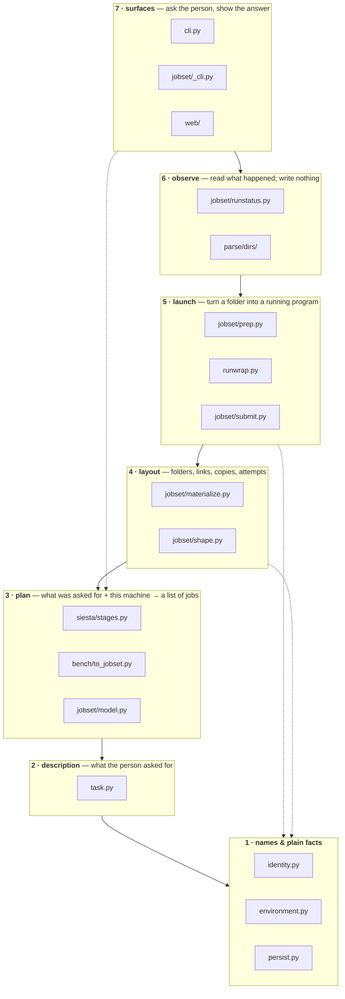
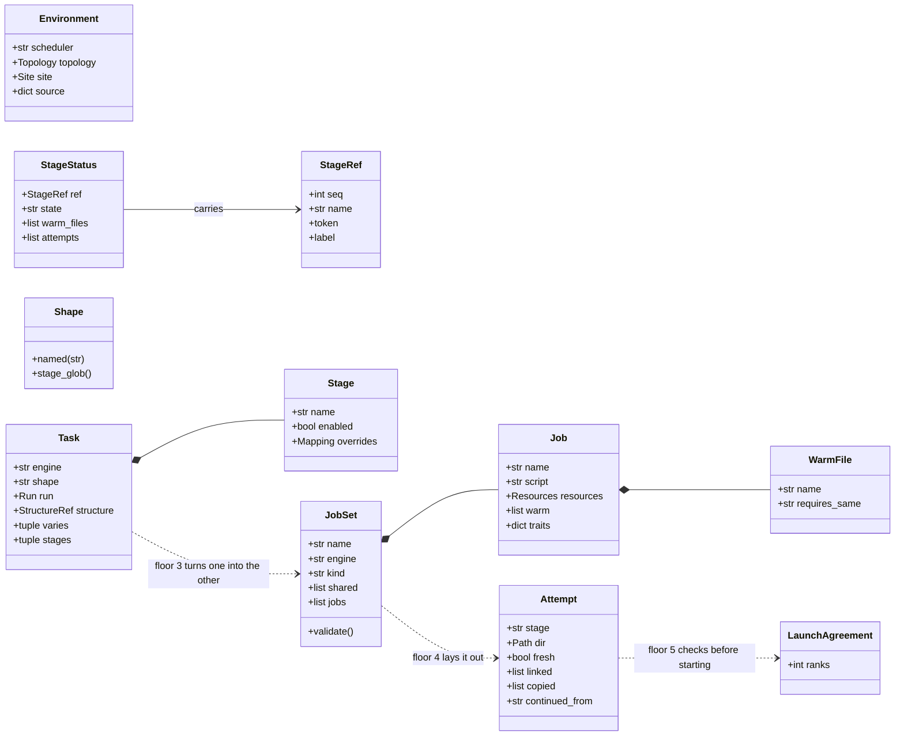
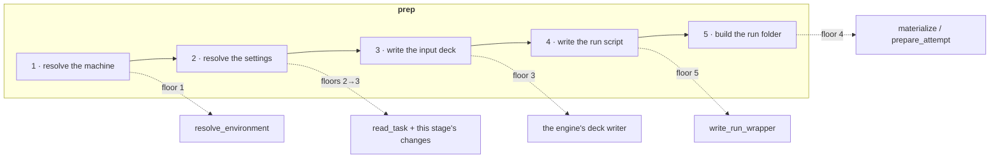
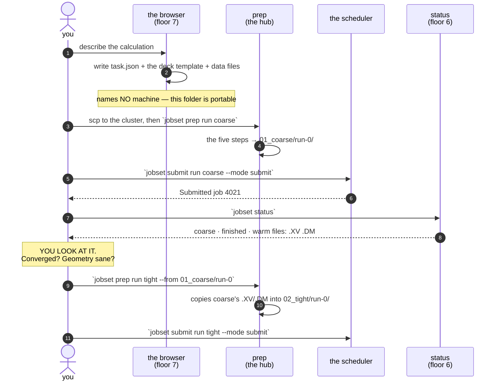

# Execution architecture — who owns which decision

**Role:** contract
**Domain:** execution

**Companions:**
[`execution/overview.md`](?doc=execution/overview.md) — which document to open;
[`execution/project-layout.md`](?doc=execution/project-layout.md) — what a
project directory *is*, and the five steps `prep` runs;
[`execution/job-contracts.md`](?doc=execution/job-contracts.md) — the file
formats and the shared parameter vocabulary;
[`architecture.md`](?doc=architecture.md) — the whole package by **import
depth** (`L1`/`L2`/`L3`), a different and coarser grouping than this one;
[`roadmap.md`](?doc=roadmap.md) — how much of this the code holds today.

> **This document says who is allowed to decide what.** It is the authority for
> the execution domain's internal shape: the floors, the objects that travel
> between them, the routes that cross them, and the rules that must never break.
> It says nothing about *when* any of it gets built — that is
> [`roadmap.md`](?doc=roadmap.md), and per the doc rules a contract does not
> hold a plan.

---

## 1. The one idea: two questions, two different answers

People ask two things about this system, and **an answer to one is not an
answer to the other**:

| the question | the kind of answer | when you find out you were wrong |
|---|---|---|
| *Who is allowed to know about whom?* | a **floor** — about which file may read which | at rest, from a test |
| *What happens, and in what order?* | a **route** — about time | when you run it |

**A floor is a storey of a building.** You may always go *down* and come back
with an answer. You may never go up, and never cut sideways through a wall.

**A route is the path a person walks through those floors to get one job done.**
It visits several floors in an order it chooses, and **that order is allowed to
disagree with the floor numbers** — because *what depends on what* and *what
happens first* are simply different things.

`prep` is a route, not a floor. Giving it a floor number is what once left one
of its five steps with nobody responsible for it: the machine was never resolved
for a staged run at all, because *"resolve the machine"* belonged to something
the floor plan had no room for.

> #### ⚠ Two different things in this repository are called a "layer"
>
> Both are real, and confusing them costs an hour every time.
>
> | | what it controls | who enforces it | the values |
> |---|---|---|---|
> | **import depth** | which file may `import` which | `tests/test_layering.py`, mechanically | `L1` · `L2` · `L3` |
> | **floor** (this document) | which *role* owns a decision | `tests/test_architecture_rules.py` | 1 names … 7 surfaces |
>
> They overlap without matching. `persist` is import-depth **L1** and has no
> floor at all — a small helper both sides borrow. `identity` is both.
> `jobset` is one import tier (`L2`) and spans **four** floors (3–6).
>
> **In this document, "floor" always means the second.** The import grouping is
> [`architecture.md`](?doc=architecture.md) § 3.

---

## 2. The seven floors



Solid arrows are the ordinary way down. **Dotted arrows are allowed shortcuts:**
any floor may reach straight to floor 1, because floor 1 holds plain values and
keeps no state. `submit` asking `identity` for a name is not a violation — it is
floor 1 doing the job it exists for.

### 2.1 What each floor owns, and how you call it

| # | floor | the decision it owns | files | **entry points** | what it writes | it must never |
|---|---|---|---|---|---|---|
| **1** | **names & plain facts** | what a thing is called; what this machine is | `identity` · `environment` · `persist` | `resolve_stage_ref` · `stage_token` · `parse_stage_token` · `run_id` · `normalise_id` · `resolve_environment` · `detect_scheduler` · `read_json` / `write_json` | `environment.json` | know what a folder is |
| **2** | **description** | what the person asked for | `task` | `read_task` · `write_task` · `derive_run` · `varies_for` | `task.json` | **name a machine** |
| **3** | **plan** | asked-for **+ machine** → a list of jobs | `siesta/stages` · `bench/to_jobset` · `jobset/model` | `stages_to_jobset` · `default_siesta_stages` · `build_siesta_stage_bundle` · `sweep_to_jobset` · `JobSet.write` / `load` / `validate` | `job-set.json` | touch the disk |
| **4** | **layout** | where every file sits | `jobset/materialize` · `jobset/shape` | `materialize` · `job_dir_names` · `stage_refs` · `shape_of` · `Shape.named` · `prepare_attempt` · `attempts` · `latest_attempt` · `relink` | the folder tree; `run-<n>/` | know about a queue |
| **5** | **launch** | how a folder becomes a running program | `jobset/prep` · `runwrap` · `jobset/submit` | `prep_jobset` · `resolve_target` · `launch_agreement` · `check_launch_matches_deck` · `write_run_wrapper` · `render_sbatch` · `submit_jobset` | `.run.sh` · `.sbatch` · `run.json` | decide physics |
| **6** | **observe** | what happened | `jobset/runstatus` · `parse/dirs` | `jobset_status` · `render_status` · `render_stage_status` · `decode_run_dir` | — | write anything |
| **7** | **surfaces** | asking, and showing | `cli` · `jobset/_cli` · `web` | `molbuilder jobset {plan,prep,submit,status}` · the web blueprints | — | work out a name, a folder, or a launch |

**The rule that makes it a layering:** *a floor may call down and return up; it
may never reach across.* Floor 5 deciding a rank count that floor 3 already
assumed is that reach, and it once cost a real run.

> **Floor 5 holds two jobs today** — `runwrap` *writes* a script (arguably a
> layout act) and `submit` *starts* one. It is real, it is harmless, and
> splitting it costs more structure than it returns. Recorded so the next reader
> does not think it was missed.

---

## 3. The objects that travel between floors

Each object exists to replace *"work it out again"* with *"ask"*. **An object
belongs to exactly one floor** — the floor whose question it answers — and
travels upward as a return value.



| object | floor | the question it answers, once | who may build one |
|---|---|---|---|
| **`StageRef`** | 1 | *which stage is this?* — an ordinal and a name, together | the resolver, `stage_refs` |
| **`Environment`** | 1 | *what is this machine?* | `resolve_environment` |
| **`Task` / `Stage`** | 2 | *what did the person ask for?* | `read_task` |
| **`JobSet` / `Job` / `WarmFile`** | 3 | *what jobs does that mean, on this machine?* | a producer (`stages_to_jobset`, `sweep_to_jobset`) |
| **`Shape`** | 4 | *where do this stage's files live?* | `Shape.named`, from the description |
| **`Attempt`** | 4 | *which try is this, and what was put in it?* | `prepare_attempt` |
| **`LaunchAgreement`** | 5 | *does this deck match the launch it is about to get?* | `launch_agreement` |
| **`StageStatus` / `JobSetStatus`** | 6 | *where has this got to?* | `jobset_status` |

**A `Job` names no other `Job`.** It declares `warm` — *what* it would take from
a run it continues, and the condition on each — and never *from whom*. Which run
that is, is named by a person at `prep`. `traits` holds the values a condition is
compared against: SIESTA puts its optimizer there, so a conjugate-gradient
history is not handed to a Broyden stage.

---

## 4. The four routes

A route owns **an order**, not a floor.

| route | the job it does | its order | floors it visits |
|---|---|---|---|
| **produce** | turn a description into a portable folder | check → render → write | 2 → 3 |
| **prep** | assemble a runnable folder **on the machine that will run it** | the five steps below | 1 → 2 → 3 → 5 → 4 |
| **submit** | one job becomes one running program | find the folder → check it agrees → launch → record | 4 → 5 |
| **observe** | answer *where has this got to* | newest attempt → read it → add up | 4 → 6 |

`prep` is the important one, and
[`project-layout.md`](?doc=execution/project-layout.md) § 2.3 calls it **the
hub**: you come back to it after every look at a result.

### 4.1 `prep` — the same five steps, every time



**Step 4 uses floor 5 and step 5 uses floor 4.** That looks wrong and is not.
The run script must be written before the folder is assembled, and writing a run
script is a *launch* job while assembling a folder is a *layout* job. **The order
things happen in is not the order of who depends on whom** — which is exactly why
one table cannot carry both, and why `prep` is a route rather than a floor.

**Why the order is forced, not chosen:** step 3 cannot precede step 1, because a
deck carries values that *depend on how it will be launched* — a block size
derived from the rank count, an eigensolver that also decides which environment
the wrapper activates. **A parameter that depends on the launch cannot be decided
before the launch is known.**

### 4.2 A worked example, in plain words

You have looked at the coarse stage, you are happy with it, and you type:

```bash
molbuilder jobset prep run tight --from 01_coarse/run-0
```

Here is what happens, and **who decides each thing**:

| # | what happens | who decides | why it is theirs |
|---|---|---|---|
| — | your words are read | **7 · surface** | asking and showing is its whole job |
| 2 | `task.json` is read: what you asked for, and what the tight stage changes | **2 · description** | it is the only thing that knows what you asked for |
| 1 | the machine is probed — cores, GPUs, queue — into `environment.json` | **1 · plain facts** | a fact about this box, not about your calculation |
| 3 | those two become a list of jobs | **3 · plan** | the only floor allowed to see both at once |
| — | *"tight"* is turned into *which stage that is* | **1 · names** | so a name, a number and a token all reach the same stage |
| 5 | the run script is written, with the environment baked in | **5 · launch** | it is the thing that starts the program |
| — | the deck is checked against the launch it will get | **5 · launch** | a deck built for 8 ranks must not be started at 32 |
| 4 | `03_tight/run-1/` is made; coarse's geometry is **copied** in | **4 · layout** | where files sit is this floor's only job |
| — | what was resolved is printed for you | **7 · surface** | so the next command is a plain yes |

**`prep` decided none of that.** It decided only **the order**. Every answer came
from the floor that owns it, which is what makes it possible to change one answer
without hunting through the others.

**Why a copy and not a link** (step 4): the engine writes to that very filename.
A link would reach back and overwrite the coarse result you chose to build on.

---

## 5. The whole workflow, once through



**The pause before the last three steps is the design, not a gap in it.** It is
where the judgement goes that no data structure can hold: *is this result worth
building on?* A stage is a long job, and one that continues by itself can spend a
week refining a geometry you would have rejected in a minute.

---

## 6. The rules that must never break

Each is written so it can be **checked**, because a rule nobody checks is a wish.

| | rule | checked by |
|---|---|---|
| **A1** | **one namer.** Every name a file gets comes from `identity`; nothing builds one by hand | `test_architecture_rules` — only `identity.py` may spell `<NN>_<name>` |
| **A2** | **one layout per calculation**, and nothing guesses which | `test_jobset` — every consumer's layout comes from `Shape.named(task.shape)` |
| **A3** | **a deck and its launch travel together** | `test_jobset` — the rank count in the deck equals the one it is started at, or it is refused first |
| **A4** | **ask, do not work it out again.** Each object in § 3 has exactly one owning function | `test_architecture_rules` — a `StageRef` may be built only by its resolver |
| **A5** | **a stage's number is worked out, never stored** | `test_task_description`, `test_stage_resolution` |
| **A6** | **once a run has started, its folder never changes** | `test_jobset` |
| **A7** | **nothing depends upwards** — a floor-N file imports floors ≤ N | `test_architecture_rules`, whose floor map must match § 2.1's table |

> **A1, A4 and A7 are about the shape of the source** — who may spell a name, who
> may build an object, who may import whom — and no amount of running the program
> shows you that. They are checked by parsing `molbuilder/` rather than calling
> it. **Each is a fence, not a proof:** A1 knows the spellings a person actually
> reaches for; A4 covers `StageRef`; A7 judges the files § 2.1 names.

---

## 7. How this serves the other contracts

Every contract sentence should land on **one** floor. Where it takes a route to
make several sentences true in order, that is named too — and a sentence that
needs *"either here or there"* to place is a sentence whose owner does not exist
yet.

| contract | the sentence | lands on |
|---|---|---|
| [`run-identity.md`](?doc=execution/run-identity.md) § 2 | one name, tidied once | floor 1 |
| [`engines/stages.md`](?doc=engines/stages.md) § 6.7 | the layout is declared, never guessed | floor 2 writes it, floor 4 reads it |
| [`project-layout.md`](?doc=execution/project-layout.md) § 2.1 | the portable folder names no machine | floor 2's *must never* |
| [`project-layout.md`](?doc=execution/project-layout.md) § 2.3.1 | the five steps, in that order | **the `prep` route** |
| [`project-layout.md`](?doc=execution/project-layout.md) § 2.3.1b | capability at `prep`, allocation as its input | floor 1 resolves capability; floor 5 only checks the agreement |
| [`project-layout.md`](?doc=execution/project-layout.md) § 1.6 | stages do not chain | floor 3 emits no link; the `submit` route acts on one stage |
| [`job-contracts.md`](?doc=execution/job-contracts.md) § 2.1 | the caller's cwd is the contract | floor 5's wrapper activates and execs, nothing more |
| [`checkpointing.md`](?doc=execution/checkpointing.md) § 2.1 | saving chooses *how*, never *whether* | **outside this stack** — a file protocol beneath all of it, which knows nothing about stages |
