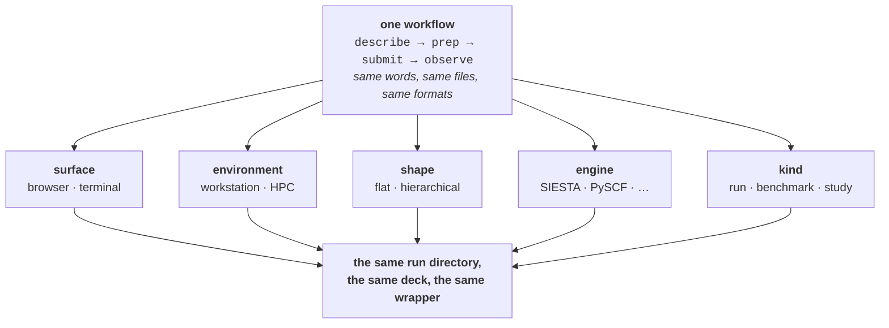
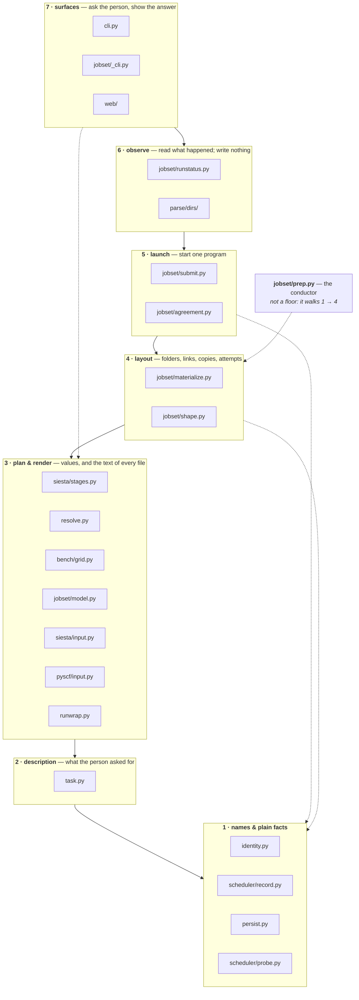
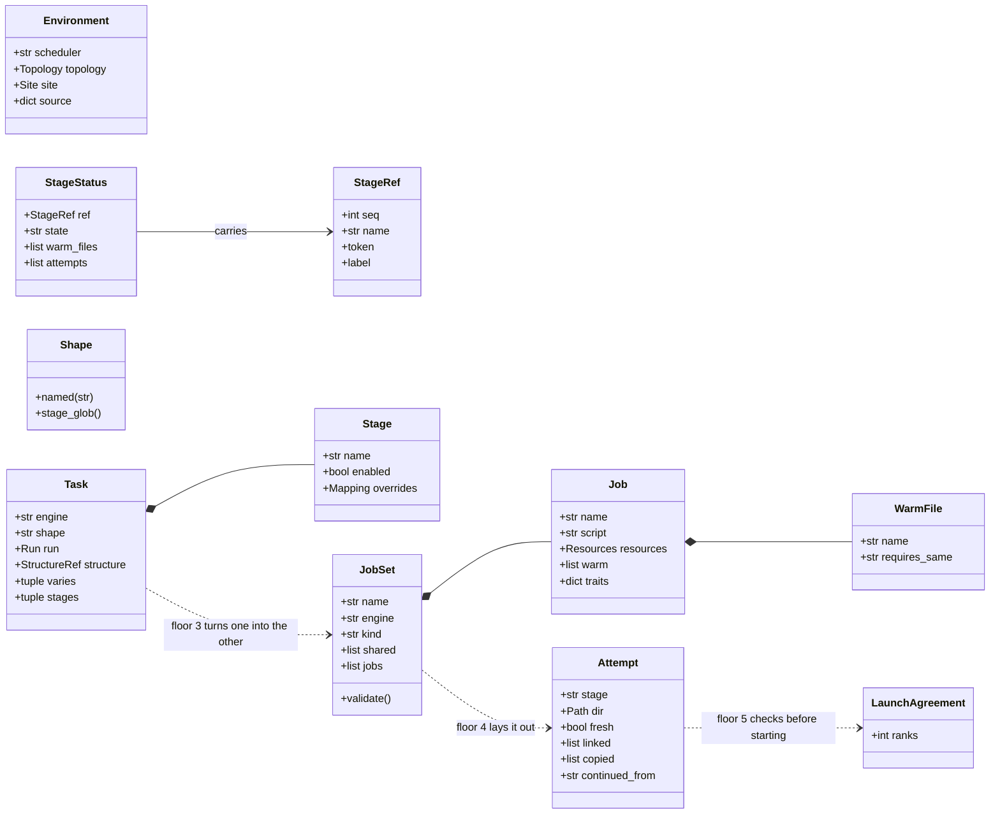
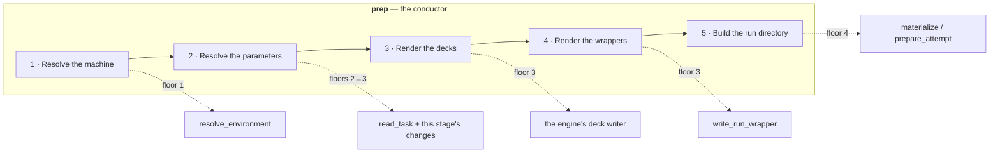
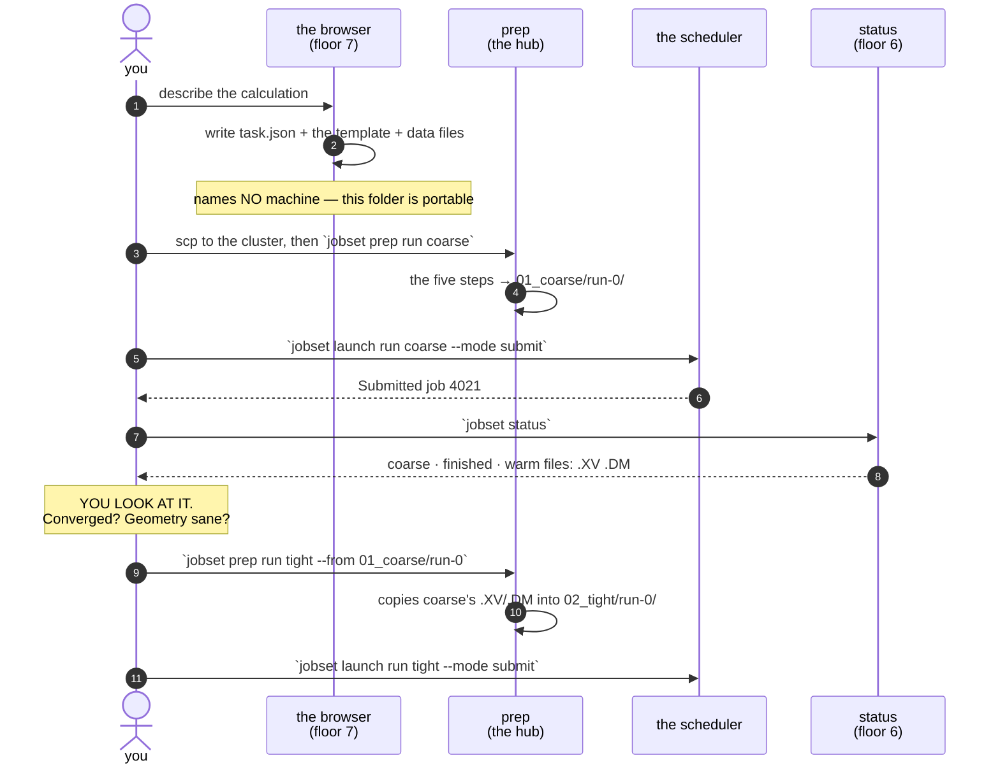
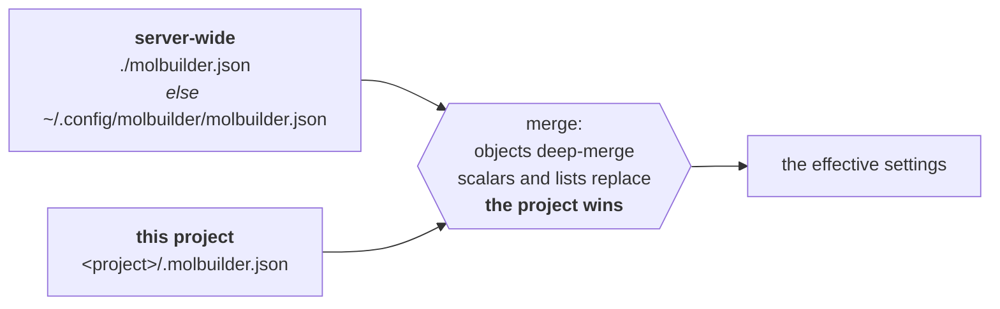
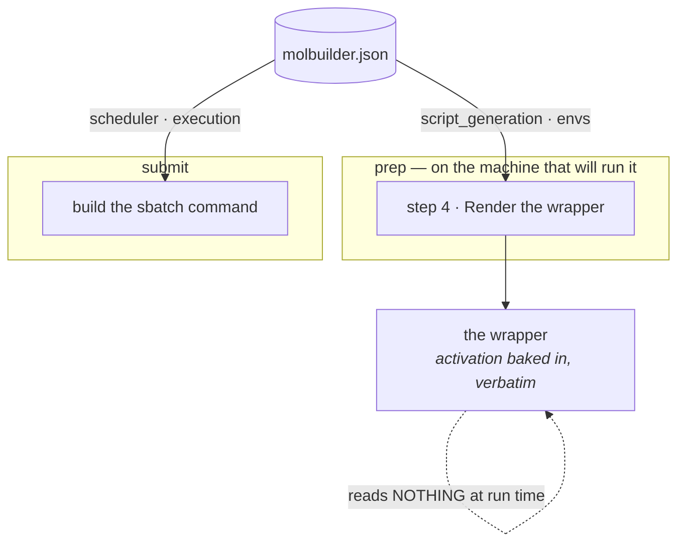
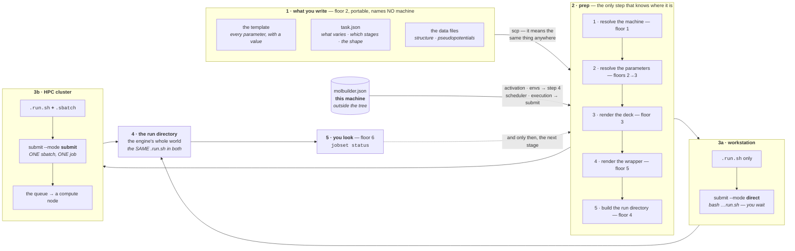
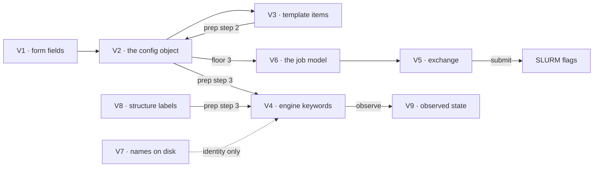

# Execution architecture — who owns which decision

**Role:** contract
**Domain:** execution

**Companions:**
[`execution/overview.md`](?doc=execution/overview.md) — which document to open;
[`execution/project-layout.md`](?doc=execution/project-layout.md) — what a
project directory *is*, and the five steps `prep` runs;
[`execution/job-contracts.md`](?doc=execution/job-contracts.md) — the file
formats and the shared parameter vocabulary;
[`architecture.md`](?doc=architecture.md) — the whole package by **import
depth** (`L1`/`L2`/`L3`), a different and coarser grouping than this one;
[`roadmap.md`](?doc=roadmap.md) — how much of this the code holds today.

> **This document says who is allowed to decide what.** It is the authority for
> the execution domain's internal shape: the floors, the objects that travel
> between them, the routes that cross them, and the rules that must never break.
> It says nothing about *when* any of it gets built — that is
> [`roadmap.md`](?doc=roadmap.md), and per the doc rules a contract does not
> hold a plan.

---

## 0. The goal: one workflow, flexible in five directions

*Stated 2026-08-11 (user): **"we need a unified and flexible workflow."** Every
rule below serves this; if a rule and this section disagree, this section is what
the rule was for.*

> **There is ONE way to run a calculation, and it bends in five places rather
> than forking into five systems.**



**What each axis is allowed to change, and what it may never touch:**

| axis | what it changes | what stays identical | where it is decided |
|---|---|---|---|
| **surface** — browser or terminal | how you *say* it | the files written (§ 11) | you |
| **environment** — workstation or HPC | one flag, one extra file, two floor-1 facts (§ 9) | floors 2, 3, 4, 6, 7 — and the inner `.run.sh` **byte for byte** | detected at `prep`, **declared** in `molbuilder.json` |
| **shape** — flat or hierarchical | where results sit, and what survives | every rule in `project-layout.md`; only *depth* differs | `task.json`'s `shape`, once |
| **engine** — SIESTA, PySCF, … | which items exist and what keyword each becomes | the template format, the routes, the verbs, the layout | the engine's own metadata |
| **kind** — run · benchmark · study | **how many configurations get rendered** | every step of `prep`, which loops rather than branches | the length of the `ParameterSet`, at `prep` step 2 |

**One property makes it unified, and it is worth naming because everything else
follows from it:** *every axis is a **value read at one point**, never a branch
that grows a second code path.* A shape is a field somebody set; an environment
is what floor 1 found; an engine is a `kind` on an item; **a benchmark is a list
with more than one element.** No axis is a fork.

> **The fifth axis is the newest and the one that was a fork until it was named**
> *(added 2026-08-11)*. `project-layout.md` § 2.3.1a already said it in words —
> *"benchmarking is `prep` whose parameters are a set rather than a point"* — and
> [`generator.md`](?doc=execution/generator.md) makes it an object, so **a
> production run is that set with one element**. That document owns the data
> spine this axis rides on: schema → template → `ParameterSet` → decks.

> **Why the inner `.run.sh` really can be byte-for-byte, when the two machines
> load software differently** *(user, 2026-08-11)*. The package manager and its
> activation are **declared in `molbuilder.json`** — `script_generation.preamble`
> (e.g. `module load mamba/latest`) and `activation` (`conda activate` /
> `source activate`). A cluster names its own there; **a workstation's default
> conda setup can be written into the same file**, and then nothing about the
> emitted script differs. So *"what differs between a laptop and Sol"* is **the
> config, not the code path** — which is this section's rule, applied to the one
> place people expect an exception.
>
> The init lines a person *sees* may differ between two machines. That is the
> **data** differing, not a second script.

**And one property makes it flexible: the contract stays small, and the
directory structure carries the variety.** Two reasons for a directory — the
science changed, or you continued (`project-layout.md § 1.5a`) — is the whole
rule, and you can read a folder and know what happened without opening a file.

> **The failure this is written against** is the one that shows up in every
> system that grew instead of being designed: a *web path* and a *CLI path*, a
> *laptop mode* and a *cluster mode*, a *simple* case and a *staged* case — four
> pairs, sixteen combinations, and a bug fixed in one of them. Hence *there is no
> `molbuilder run`* and *there is no `molbuilder fdf`*
> ([`process/conventions.md § 3`](?doc=process/conventions.md)): a second way in
> is the first crack in the first axis.

> #### ⚠ One thing breaches this today, and one is scoped out — stating the rule
> #### without both would be the overclaim this section exists to prevent
>
> | | what it is | which kind |
> |---|---|---|
> | **`bench`** | ~~a whole second lifecycle for measuring — build · run · read · use-the-answer, each with two spellings~~ **MERGED (the fold, 2026-08-12):** benchmarking IS `prep`, specialised (`project-layout.md § 2.3.1a`) — the jobset verbs own the whole loop, and `bench/` keeps only the grid + result library modules and one utility (`probe-scheduler`; the legacy `siesta-gpu` sweep was deleted 2026-08-13) | **a merge, now landed.** This row stays as the record that the rule was breached and how the breach closed |
> | **`transport`** | ~~`transport bundle` emitted `run-transport.sh`, chaining three coupled runs outside the job system~~ **the COMPOSITE landed (transport-design.md, built P1–P6 2026-08-28/29; the bundle driver deleted with P7)**: transport is `--calculation transport` — one calculation citing a finished junction attempt, whose five stages run INSIDE the job system (each an ordinary prep/launch rung; the § 4.2 gather moves the files a run of one stage hands the next) | **a separate kind, exactly as decided** *(2026-08-11, user)*. A `JobSet` still carries no edges: the stages do not chain — a person launches each after reading the last, and the one sequenced thing (a bias scan's points) rides ONE submission, the chain walker |
>
> **They are not the same problem, and a plan that treated them alike would
> either delete a working capability or bless a permanent second path.** One is
> duplicated machinery to fold in; the other is **a different kind of job**, and
> the user's decision of 2026-08-11 is that it stays that way rather than being
> bent into a pipeline built for one parameter set. The full comparison is
> [`process/conventions.md § 3`](?doc=process/conventions.md).

---

## 1. The one idea: two questions, two different answers

People ask two things about this system, and **an answer to one is not an
answer to the other**:

| the question | the kind of answer | when you find out you were wrong |
|---|---|---|
| *Who is allowed to know about whom?* | a **floor** — about which file may read which | at rest, from a test |
| *What happens, and in what order?* | a **route** — about time | when you run it |

**A floor is a storey of a building.** You may always go *down* and come back
with an answer. You may never go up, and never cut sideways through a wall.

**A route is the path a person walks through those floors to get one job done.**
It visits several floors in an order it chooses, and **that order is allowed to
disagree with the floor numbers** — because *what depends on what* and *what
happens first* are simply different things.

`prep` is a route, not a floor. Giving it a floor number is what once left one
of its five steps with nobody responsible for it: the machine was never resolved
for a staged run at all, because *"resolve the machine"* belonged to something
the floor plan had no room for.

> #### ⚠ Two different things in this repository are called a "layer"
>
> Both are real, and confusing them costs an hour every time.
>
> | | what it controls | who enforces it | the values |
> |---|---|---|---|
> | **import depth** | which file may `import` which | `tests/test_layering.py`, mechanically | `L1` · `L2` · `L3` |
> | **floor** (this document) | which *role* owns a decision | `tests/test_architecture_rules.py` | 1 names … 7 surfaces |
>
> They overlap without matching. `persist` is import-depth **L1** and sits on
> **floor 1** with the other plain facts (§ 2.1 row 1 lists it; the floor
> test pins it — this line once said "no floor at all" against both).
> `identity` is both. `jobset` is one import tier (`L2`) and spans **five**
> floors (3–7: `_cli` and `ledger` are row 7's surfaces).
>
> **In this document, "floor" always means the second.** The import grouping is
> [`architecture.md`](?doc=architecture.md) § 3.

---

## 2. The seven floors



Solid arrows are the ordinary way down. **Dotted arrows are allowed shortcuts:**
any floor may reach straight to floor 1, because floor 1 holds plain values and
keeps no state. `launch` asking `identity` for a name is not a violation — it is
floor 1 doing the job it exists for.

*(The floor-3 nodes drew `bench/to_jobset.py` until 2026-08-12 — deleted with
the pre-resolve producers; the diagram now matches § 2.1's row 3, whose own
note records the deletion.)*

### 2.1 What each floor owns, and how you call it

| # | floor | the decision it owns | files | **entry points** | what it writes | it must never |
|---|---|---|---|---|---|---|
| **1** | **names & plain facts** | what a thing is called; what this machine is | `identity` · `scheduler/record` · `scheduler/probe` · `persist` | `resolve_stage_ref` · `stage_token` · `parse_stage_token` · `run_id` · `normalise_id` · `resolve_environment` · `detect_scheduler` · `read_json` / `write_json` | `environment.json` | know what a folder is |
| **2** | **description** | what the person asked for | `task` | `read_task` · `write_task` · `derive_run` · `varies_for` | `task.json` | **name a machine** |
| **3** | **plan & render** | asked-for **+ machine** → a list of jobs, **and the text of every file** | `siesta/stages` · `resolve` · `bench/grid` · `jobset/model` · `siesta/input` · `pyscf/input` · `runwrap` | `default_siesta_stages` · `resolve` (template ⊕ overrides ⊕ sweep point ⊕ pins → `ParameterSet`) · `JobSet.write` / `load` / `validate` · `render_fdf` / `render_script` · `write_run_wrapper` · `render_sbatch` | `job-set.json` · the scripts · `.run.sh` · `.sbatch` | **re-decide a value it was handed** *(the pre-resolve producers — `stages_to_jobset` · `build_siesta_stage_bundle` · `sweep_to_jobset` · `bench/to_jobset` — were deleted 2026-08-12, plan steps 4–6)* |
| **4** | **layout** | where every file sits | `jobset/materialize` · `jobset/shape` | `materialize` · `job_dir_names` · `stage_refs` · `shape_of` · `Shape.named` · `prepare_attempt` · `attempts` · `latest_attempt` · `relink` | the folder tree; `run-<n>/` | know about a queue |
| **5** | **launch** | start one program | `jobset/agreement` · `jobset/submit` | `launch_agreement` · `check_launch_matches_deck` · `submit_jobset` | `run.json` | decide physics |
| **6** | **observe** | what happened | `jobset/runstatus` · `jobset/summarize` · `parse/dirs` | `jobset_status` · `render_status` · `render_stage_status` · `decode_run_dir` | — | write anything |
| **7** | **surfaces** | asking, and showing | `cli` · `jobset/_cli` · `jobset/ledger` · `web` | `molbuilder jobset {init,prep,plan,launch,summarize,status}` · the web blueprints · `ledger.record` (each verb's decisions, into `jobset-decisions.log`) | `jobset-decisions.log` | work out a name, a folder, or a launch |

**The rule that makes it a layering:** *a floor may call down and return up; it
may never reach across.* Floor 5 deciding a rank count that floor 3 already
assumed is that reach, and it once cost a real run.

> **`prep` is not a floor — it is the conductor.** It walks floors 1 → 4 in order
> and owns no decision of its own, which is why it is drawn beside the stack
> rather than in it. **It may call, but it may never decide**: a value settled
> inside `prep` is a value no floor owns, and that is the shape of the "stomp"
> failures — an allocation re-applied over per-element resources floor 3 had
> already resolved. **Only a surface may import it.** The sequence it walks is
> [`script-preparation.md`](?doc=execution/script-preparation.md) § 3.

---

## 3. The objects that travel between floors

Each object exists to replace *"work it out again"* with *"ask"*. **An object
belongs to exactly one floor** — the floor whose question it answers — and
travels upward as a return value.



| object | floor | the question it answers, once | who may build one |
|---|---|---|---|
| **`StageRef`** | 1 | *which stage is this?* — an ordinal and a name, together | the resolver, `stage_refs` |
| **`Environment`** | 1 | *what is this machine?* | `resolve_environment` |
| **`Task` / `Stage`** | 2 | *what did the person ask for?* | `read_task` |
| **`JobSet` / `Job` / `WarmFile`** | 3 | *what jobs does that mean, on this machine?* | `prep`, from the resolved `ParameterSet` (`resolve.py`) — one `Job` per element *(the producers `stages_to_jobset` / `sweep_to_jobset` built these until 2026-08-12; deleted, § 2.1's row-3 note)* |
| **`Resources`** | 3 | *what does this job ask the machine for?* — the nine fields of [`job-contracts.md § 6.2`](?doc=execution/job-contracts.md), in the exchange vocabulary | **two roles, and they are not the same answer twice.** A **surface** assembles *the ask* from what the person said — `--np`, the Build tab's form — which is what [`generator.md § 4.1a`](?doc=execution/generator.md) means by *"stated in the command, at prep"*. `resolve.py` then produces *the per-element allocation*, the ask ⊕ this sweep point's machine axes, one per `ParameterSet` element. § 4.1's containment (capability ⊇ allocation ⊇ sweep) is exactly the relationship between them |
| **`Shape`** | 4 | *where do this stage's files live?* | `Shape.named`, from the description |
| **`Attempt`** | 4 | *which try is this, and what was put in it?* | `prepare_attempt` |
| **`LaunchAgreement`** | 5 | *does this deck match the launch it is about to get?* | `launch_agreement` (`jobset/agreement.py` — its own floor-5 module since 2026-08-12, so `prep` and `submit` both import it downward and neither imports the other) |
| **`StageStatus` / `JobSetStatus`** | 6 | *where has this got to?* | `jobset_status` |

**A `Job` names no other `Job`.** It declares `warm` — *what* it would take from
a run it continues, and the condition on each — and never *from whom*. Which run
that is, is named by a person at `prep`. `traits` holds the values a condition is
compared against: SIESTA puts its optimizer there, so a conjugate-gradient
history is not handed to a Broyden stage.

### 3.1 An object travels whole — the other half of "one owning function"

The table above answers *who may build one*. **This section answers who may take
one apart, and the answer is nobody.**

> **An object crosses a floor boundary as itself.** A function that consumes one
> takes the object; it never takes a hand-picked list of its fields, and a
> caller never destructures one to call it.

**This is A4 seen from the receiving end, and without it A4 buys nothing.** One
owning function guarantees the object is *assembled* correctly and says nothing
about what survives the call — so a structure built whole on floor 3 can still
arrive on floor 5 with two of nine fields missing, and every rule above is
satisfied while the artifact is wrong.

**The failure it forbids, in the form it actually takes.** A door with N loose
keyword arguments has 2^N ways to be called and one that is right. Every caller
re-derives which subset matters, so the doors disagree by construction — and the
disagreement is invisible, because a missing field is indistinguishable from a
field whose value happens to be the default:

| | asked for | wrote |
|---|---|---|
| `jobset/prep.py` | 16 ranks × 8 cores | `.sbatch -c 8` · `.run.sh` OMP default **1** |
| `web/blueprints/build.py` | 16 ranks × 8 cores | `.run.sh` OMP default 8 · `.sbatch` **no `-c`** |

*(Measured 2026-08-17. Two call sites of one door, eleven loose arguments, ten
passed by one and five by the other — each correct about one artifact and wrong
about the other. The same door had already lost `max_memory_mb` this way on
2026-08-11; that fix moved the field onto `Resources` and left the calling
convention alone, so the class stayed open and fired again four days later.)*

**What stays loose, and why that is not a hole.** A parameter that belongs to the
*invocation* rather than to the *job* is not part of any object: `--env` is a
per-call override, `emit_sbatch` is a surface's choice about what to write.
The test is ownership — if a field has a home in § 3's table, it arrives in that
home or not at all.

**Two names for one fact stay two names.** `job-contracts.md` § 6.2 keeps
`omp_threads` and `cpus_per_task` distinct because they are read by different
layers, and this rule does not merge them. It removes the thing that made the
distinction dangerous: with the object passed whole, *which* name a door uses
internally is its own business, and no caller can supply one and forget the
other.

---

## 4. The four routes

A route owns **an order**, not a floor.

| route | you type | the job it does | its order | floors it visits |
|---|---|---|---|---|
| **describe** | `jobset init` | **write** the portable description — the template, `task.json`, the data files | ask → check → write | **2 only** |
| **prep** | `jobset prep` | assemble a runnable folder **on the machine that will run it** | the five steps below | 1 → 2 → 3 → 5 → 4 |
| **submit** | `jobset launch` | one job becomes one running program | find the folder → check it agrees → launch → record | 4 → 5 |
| **observe** | `jobset status` | answer *where has this got to* | newest attempt → read it → add up | 4 → 6 |

> **The first route is named `describe`, and it stops at floor 2** *(corrected
> 2026-08-11)*. This row read *"**produce** — turn a description into a portable
> folder · check → **render** → write · floors 2 → 3"*, which is the **old**
> design: the browser wrote finished decks, so describing reached floor 3.
> **Rendering moved to `prep` step 3**, so describing renders nothing and never
> leaves floor 2 — which is what makes *the description names no machine* a
> structural fact rather than a rule to remember.
>
> **And "a produce" was undefined jargon**, used as a noun ~50 times across these
> documents without ever being introduced. Where it survives in older passages it
> means **this route**: the act of writing the description down. Read *"a produce
> is transactional"* as *"describing a calculation writes every file or none"*.

`prep` is the important one, and
[`project-layout.md`](?doc=execution/project-layout.md) § 2.3 calls it **the
hub**: you come back to it after every look at a result. **Notice that only
`describe` is off the target machine** — the other three all require it, which
is the whole shape of the split.

### 4.1 `prep` — the same five steps, every time



**The sequence is owned by**
[`script-preparation.md`](?doc=execution/script-preparation.md), which states it
at three resolutions — the decision chain below, these five steps, and the eleven
sub-steps inside step 3. This section says only which floor answers each step.

**The floors never go backwards** — 1 → 2·3 → 3 → 3 → 4 — which is a property to
check rather than a coincidence: `runwrap` renders text from decided values and
sits on floor 3 with the engines' own deck writers.

**Why the order is forced, not chosen:** step 3 cannot precede step 1, because a
script carries values that *depend on how it will be launched* — a block size
derived from the rank count, an eigensolver that also decides which environment
the wrapper activates. **A parameter that depends on the launch cannot be decided
before the launch is known.** The full dependency table, pair by pair, is
[`script-preparation.md`](?doc=execution/script-preparation.md) § 4.1.

### 4.2 A worked example, in plain words

You have looked at the coarse stage, you are happy with it, and you type:

```bash
molbuilder jobset prep run tight --from 01_coarse/run-0
```

Here is what happens, and **who decides each thing**:

| # | what happens | who decides | why it is theirs |
|---|---|---|---|
| — | your words are read | **7 · surface** | asking and showing is its whole job |
| 2 | `task.json` is read: what you asked for, and what the tight stage changes | **2 · description** | it is the only thing that knows what you asked for |
| 1 | the machine is probed — cores, GPUs, queue — into `environment.json` | **1 · plain facts** | a fact about this box, not about your calculation |
| 3 | those two become a list of jobs | **3 · plan** | the only floor allowed to see both at once |
| — | *"tight"* is turned into *which stage that is* | **1 · names** | so a name, a number and a token all reach the same stage |
| 5 | the run script is written, with the environment baked in | **5 · launch** | it is the thing that starts the program |
| — | the deck is checked against the launch it will get | **5 · launch** | a deck built for 8 ranks must not be started at 32 |
| 4 | `03_tight/run-1/` is made; coarse's geometry is **copied** in | **4 · layout** | where files sit is this floor's only job |
| — | what was resolved is printed for you | **7 · surface** | so the next command is a plain yes |

**`prep` decided none of that.** It decided only **the order**. Every answer came
from the floor that owns it, which is what makes it possible to change one answer
without hunting through the others.

**Why coarse's geometry is copied rather than linked** is
[`project-layout.md § 1.6`](?doc=execution/project-layout.md), which owns that
rule and the reasoning behind it. In one line: the engine writes to that very
filename.

---

## 5. The decision chain — the same question, answered as a sequence

§ 2 says **who owns** each decision. This says **in what order** decisions get
fixed, and the two are different views of one rule.

Overlap between modules is fine. A **loop** is not: if two parties can each
overrule the other, nobody can predict the outcome and nobody can test it. So
the whole system is one sequence, and one rule keeps it one:

> **Each step decides within what the steps above it already fixed, and nothing
> later rewrites something earlier.**

| # | who decides | what it fixes | written down in |
|---|---|---|---|
| 1 | the **project tree** | where anything may live — the topics, and `[A-Za-z0-9_-]+` per segment | `job-contracts.md` § 2.5 |
| 2 | the **structure** | which atoms exist — an input, never edited by the generator | `model/structure.md` |
| 3 | **2 + the name you typed**, inside 1's character set | the **id**, tidied once and then quoted by everything after | `run-identity.md` §§ 2–3 |
| 4 | the **schema** | which fields exist, their types and ranges | `web/form-schema.md` |
| 5 | the **description** | the values, which fields vary, the stages and their order | `engines/stages.md` § 6 |
| 6 | the **preflight** | whether this file can be read here at all | `engines/stages.md` § 6.5 |
| 7 | **validation** | whether it may be written — errors block, per stage, on the resolved whole | `science/validation.md` |
| 8 | the **generator** | the decks and their wrappers: the merge, the cell, the pseudopotentials, BENCH-MARKS | `engines/stages.md` § 7 |
| 9 | the **machine's config** | the wrapper's shell — preamble and activation (§ 8.3) | `running-a-job.md` § 5.2 |
| 10 | **you** | which stage to run, and when | — this is the point of the whole framework |
| 11 | the **wrapper**, at run time | ranks, threads, GPU pinning, the run index, the restart banner | `running-a-job.md` § 3 |
| 12 | the **engine** | whether warm files are honoured, given those parameters | `job-contracts.md` § 4 |

Read it downward and the tangles disappear:

- **The browser lives in rows 3–5 only.** That is why it never renders a deck or
  computes a cell — those are row 8, and row 8 needs row 9, which is a fact
  about a machine the browser is not on.
- **The id is fixed at row 3 and quoted by everything after.** No later step
  derives it again, which is why tidying it once is a rule rather than a
  tidiness preference.
- **Row 10 is a person, and that is deliberate.** Every earlier row exists to
  make row 10's choice safe; none of them makes it.
- **Nothing in rows 1–8 knows what a cluster is.** *The portable folder names no
  machine* is not a policy anyone has to remember — it falls out of where row 9
  sits.

**Rows 6 and 7 both refuse things, and both belong.** One asks *can this file be
read here at all*, the other *is this a sound calculation*. They are ordered, so
a description aimed at an engine this backend does not have never receives a
lecture about its mesh cutoff first.

### 5.1 How the chain and the floors line up

They are not a re-labelling of each other — the chain spans domains the floors
do not:

| chain rows | floor |
|---|---|
| 1–2 | outside this stack — the project tree and the structure model |
| 3 | **1 · names** |
| 4–5 | **2 · description** |
| 6–7 | outside — preflight and validation are their own contracts |
| 8 | **3 · plan** (and the engine renderers it calls) |
| 9 | **3 · plan & render**, at `prep` step 4 |
| 10 | **7 · surfaces** |
| 11–12 | outside — the wrapper and the engine, at run time |

**Six of the twelve rows sit outside the floors** (1–2, 6–7, 11–12 — the
counts this sentence carried, "four of thirteen", matched no table), and
that is the honest
answer rather than a gap: this stack is about turning a description into a
running job, and the structure model, the form schema and the science
validators are separately-owned contracts that hand it their results.

---

## 6. The whole workflow, once through



**The pause before the last three steps is the design, not a gap in it.** It is
where the judgement goes that no data structure can hold: *is this result worth
building on?* A stage is a long job, and one that continues by itself can spend a
week refining a geometry you would have rejected in a minute.

---

## 7. The rules that must never break

Each is written so it can be **checked**, because a rule nobody checks is a wish.

| | rule | checked by |
|---|---|---|
| **A1** | **one namer.** Every name a file gets comes from `identity`; nothing builds one by hand | `test_architecture_rules` — only `identity.py` may spell `<NN>_<name>` |
| **A2** | **one layout per calculation**, and nothing guesses which | `test_jobset` — every consumer's layout comes from `Shape.named(task.shape)` |
| **A3** | **a deck and its launch travel together** | `test_jobset` — the rank count in the deck equals the one it is started at, or it is refused first |
| **A4** | **ask, do not work it out again.** Each object in § 3 has exactly one owning function | `test_architecture_rules` — **all four**: a `StageRef` only by its resolver, and `Attempt` / `Shape` / `LaunchAgreement` each in one named function |
| **A5** | **a stage's number is worked out, never stored** | `test_task_description`, `test_stage_resolution` |
| **A6** | **once a run has started, its folder never changes** | `test_jobset` |
| **A7** | **nothing depends upwards** — a floor-N file imports floors ≤ N | `test_architecture_rules`, whose floor map must match § 2.1's table |
| **A8** | **an object travels whole** (§ 3.1). A door that consumes one of § 3's objects takes the object; its signature may not also name that object's fields, and no caller may destructure one to call it | `test_architecture_rules` — a generator door's parameter names, intersected with the fields of every object it already takes, must be empty |
| **A9** | **two artifacts of one object agree.** Where a single object is rendered into more than one file, the files are checked against **each other**, not only against a test's intent | `test_runwrap_pair` — one `Resources` in, `.run.sh` and `.sbatch` out, ranks · cores · GPU compared across the pair |
| **A10** | **an anchor is declared, never discovered.** A path molbuilder is handed resolves against an anchor its own **spelling** names; no resolver may pick one by trying candidates and taking whichever happens to exist | `test_psml_anchor` — the eight-spelling matrix, and the refusal names the one place it looked |
| **A11** | **one home per root and per name molbuilder writes.** Nothing climbs a parent chain to a root, and nothing re-spells a filename molbuilder itself writes | `test_architecture_rules` — the set of files that climb to the install root must be `{__init__.py}`; the set that spells `job-set.json` / `task.json`, `{jobset/model.py}` / `{task.py}` |

> **A1, A4, A7 and A8 are about the shape of the source** — who may spell a name,
> who may build an object, who may import whom, who may take one apart — and no
> amount of running the program shows you that. They are checked by parsing
> `molbuilder/` rather than calling it. **Each is a fence, not a proof:** A1
> knows the spellings a person actually reaches for, and A7 judges the files
> § 2.1 names.
>
> **A9 is the one that has to run the program**, and it is here because A8 alone
> would not have caught the 2026-08-17 defect from the outside: both call sites
> were internally consistent, and only the *pair* of files they produced
> disagreed. A rule about signatures cannot see a wrong number in a rendered
> file, so the two rules cover each other — A8 makes the mistake unwritable, A9
> makes it visible if it is written another way.
>
> **A4's unit is the function, not the module.** The owning module legitimately
> builds its own object; what must not happen is a *second* function building
> one — including inside the same file, which a module-level rule would wave
> through.

> **A10 is the rule the 2026-08-21 Sol failure was missing.** `prep bench`
> refused over pseudopotentials naming
> `…/optimization/Relax/projects/pseudopotential` — a folder assembled out of
> wherever the user happened to be standing. The resolver took a relative
> `psml_lib` and *tried* anchors in turn — the calculation folder, then the
> tree above it, then the working directory — so the same string named a
> different folder on every machine, and the message on a total miss pointed
> at the last candidate rather than at anywhere the user had chosen. **The fix
> is not a better fallback order; it is having no fallback order.** The three
> spellings each name their anchor (`job-contracts.md` § 2.5), and a miss is
> reported against the one anchor the spelling asked for.
>
> **A11 is A1 widened from names to roots and filenames.** A1 stops a second
> module *assembling* a name; A11 stops a second module *arriving at* a place —
> by climbing `.parent.parent` to the install root, or by re-typing a filename
> that already has a constant. Both failure modes are the same one: a fact
> with two spellings drifts, and the drift is invisible until the two
> disagree on some machine that is not this one. The roots have one owner
> each — the install root is the package's own self-knowledge
> (`molbuilder.repo_root`), the user's tree is `projects.py`'s
> (`projects_root` / `find_projects_root`), and a per-user config path is
> `environment.machine_scope_path`'s. Three roots, three owners, no fourth
> way to reach any of them.
>
> *(`envs/builds.py` climbs a parent chain too — to the **nvcc toolchain's**
> root, which is not ours to own. A11 is about molbuilder's own roots.)*

> **A comment citing `2026-08-12 plan A<N>` is not citing this table.** A
> review programme that ran on 2026-08-12 lettered its own items A3…A8, and
> eight comments in `jobset/` still cite them. That plan is not in the doc set:
> the letters are the programme's own history and **resolve nowhere**, exactly
> as R8 says of `job-execution.md`'s section numbers. They are kept, in that
> one spelling — *"2026-08-12 plan A4"*, never a bare `A4` — because they
> correlate the eight sites with each other, which is the only thing they can
> still do. **This table is the only live meaning of an A-letter.** If you are
> following an `A8` from a comment and land on *"an object travels whole"*, the
> comment was not sent here.

---

## 8. Configuration — one file, and which floor reads each part

**There is one config file, ten sections, and two different audiences.** Half of it
configures the *server* (who may sign in, what the rate limiter does). Half
configures *running calculations* (how to activate an environment, what the
scheduler wants). Neither half knows about the other, and no document listed
both until now — `deployment.md` § 5 showed six and `running-a-job.md` § 5 showed four, and
neither said it was showing a subset.

### 8.1 Where it is found, and how two files become one



**Only one server-wide file is read** — the current directory first, the XDG
location second, and the first one found wins. A malformed file refuses to start
rather than half-configuring something.

`script_generation` merges by its own rule, because concatenating is the useful
answer there: **preambles join, server first, then project**; `activation` is
the project's if set, otherwise the server's.

### 8.2 The complete map — section, reader, and where it lands

| section | read by | reaches | what it decides |
|---|---|---|---|
| `script_generation` | `get_script_generation`, `require_activation` | **floor 5**, `prep` step 4 | the lines baked into every wrapper: `preamble` (e.g. `module load mamba/latest`), then `activation` verbatim |
| `scheduler` | `get_scheduler`, `get_routing` | **floor 5**, at `launch` | the `#SBATCH` header: `directives` (partition, qos, mail), `gpu` (partition, type, memory), `defaults` (time, cores, memory), and `routing` — the named domains |
| `execution` | `get_execution` | **floor 5**, at `launch` | `mode` (`direct` or `submit`), and the default `domain` |
| `envs` | `get_envs` | **floor 5**, `prep` step 4 | which conda environment each engine runs in |
| `paths` | `get_paths` | `projects.projects_root` — every surface | `projects`: where the projects tree lives.  Default: `projects/` inside the checkout; set it when that is not writable or not wanted (a quota'd cluster home, a scratch filesystem, a shared tree).  `$MOLBUILDER_PROJECTS` overrides it |
| `checkpoint` | `get_checkpoint`, `get_checkpoint_engines` | **outside the stack** — the file protocol | the size at which a file goes to the archive instead of git, and the per-engine hints |
| `auth` | `get_auth`, `get_providers` | the **server** | who may sign in; the provider list is `auth.providers` (`ops/access-control.md` § 3) |
| `secret_key_file` | `get_secret_key_file` | the **server** | the path to the session-signing key — a path, never the secret itself |
| `notify_keys_file` | `get_notify_keys_file` | the **server** | the path to the run-report signing-key file — a path, never the keys ([`run-reports.md`](?doc=execution/run-reports.md) § 4.3) |
| `notify_route` | `get_notify_route` | the **server** | the listener's URL segment, generated per deployment by `notify-token`. **Both keys are required**; with either absent no route is registered at any path, so the server cannot even be probed for the capability. Not a secret — it is in every access log — but never a fixed word, because a fixed word in a public repository is not obscurity ([`access-control.md`](?doc=ops/access-control.md) § 8 rule 7) |
| `tls` | `get_tls` | the **server** | the certificate and key for HTTPS |
| `rate_limit` | `get_rate_limit` | the **server** | how the limiter judges traffic (§ 4 there) |
| `admin` | `get_admin_emails` | the **server** | `admin.emails` — who may clear the block list and restart the process. **Absent means nobody**, which is the safe state you get by writing no config |

### 8.2a The section registry — the loader's one table *(U7, 2026-08-12)*

**Everything the loader knows about a section is one row of one table** —
`_SECTIONS` in `runtime_config.py`: the section's validator, the scopes it
may live in, and whether provenance may print its values. `_normalise` (the
loader), the project-scope refusal, `config_provenance`'s safe list and
`write_config_scope` all consult that table and nothing else.

**Why it exists — the defect it ended.** Until 2026-08-12 each of those four
sites kept its own partial list. The loader's list had never learned `admin`
or `rate_limit`, so it silently DROPPED them and `get_admin_emails` read
post-strip config: **the file looked configured and nobody could be admin**,
with nothing anywhere saying why. The paragraph that stood here documented
that state as a gotcha (*"a typo in those two is ignored rather than
refused — worth knowing before you debug why an admin list appears to do
nothing"*) — a sentence that should have been a bug report. Every section is
now validated when the file is read; a malformed one refuses to start.

Three rules fall out of the table, and each was a scattered special case
before:

| rule | what it means for you |
|---|---|
| **an unknown top-level key is refused, never ignored** | a typo'd section name (`"shceduler"`) is an error naming the known sections, not a silently dead block. *Amended contract — `running-a-job.md` § 5 said "unknown keys are ignored", and that tolerance is exactly the hole that ate `admin`.* The one carve-out: a key starting with `_` (the templates' `"_comment_tls"` idiom) is a comment by design |
| **a machine section may not live in a bundle** | `admin`, `auth`, `tls`, `envs`, `secret_key_file`, `notify_keys_file`, `notify_route`, `checkpoint`, `rate_limit` in a calculation's `.molbuilder.json` are refused — at read AND at write (`write_config_scope`). A bundle may carry `execution`, `script_generation`, `scheduler`. This generalises checkpoint's S1c argument: a section that is read, validated and then silently dropped looks effective while nobody applied it |
| **provenance prints only what its row allows** | `config_provenance` (the `config:` lines prep and submit echo and the decision ledger records) shows values only for `execution` and `script_generation` — never anything near a secret |

*(That the § 8.2 table and the registry name the same sections is checked —
`test_architecture_rules::test_every_config_section_is_documented_and_every_documented_one_exists`,
an equality both ways, reading `_SECTIONS` directly since U7.)*

**Read the first four rows as one thing.** They are the whole of what a
calculation needs from config, and they arrive at exactly two moments:
`prep` step 4 bakes `script_generation` and `envs` into the wrapper, and
`launch` reads `scheduler` and `execution` to build the command. **Nothing
reads config at run time** — the wrapper is self-contained by then
(`job-contracts.md` § 2.1).



### 8.3 The one setting that stops everything

`script_generation.activation` has **no default**, and rendering *any* wrapper
refuses without it — not only a cluster one. On a fresh install that is the
*"the `.fdf` saved but no `.run.sh` appeared"* symptom.

```json
{ "script_generation": {
    "preamble":   "source ~/miniconda3/etc/profile.d/conda.sh",
    "activation": "conda activate"
} }
```

**Why no default:** the wrapper runs in a non-interactive shell that never reads
your `~/.bashrc`, so `conda activate` is an undefined function unless something
loaded conda's hook first. A guessed default would produce a wrapper that dies
on the compute node with `CondaError: Run 'conda init' before 'conda activate'`
— far from the machine where it could be fixed. Refusing at generate time puts
the error where you can act on it.

---

## 9. The same design on a workstation and on a cluster

**Nothing in §§ 2–4 changes between them.** The same floors, the same routes,
the same five steps. What differs is what **two floors find**, and one flag.

### 9.0 The whole thing in one picture

This is §§ 2–4 and § 8 assembled: what you write, what crosses the wall, and
where the two environments diverge. **Read it left to right and notice that the
divergence starts as late as possible** — everything before `prep` is one path.



**Three things that picture is trying to make obvious:**

1. **Box 1 is byte-identical on both machines.** That is the whole point of floor
   2's *must never name a machine*. `scp` it anywhere and it still describes the
   same calculation.
2. **The divergence is inside box 2 and it is small** — one floor finds different
   facts, and one extra file gets written. Boxes 4 and 5 are the same again.
3. **The dotted arrow at the bottom is a person.** Nothing advances on its own
   (§ 6, and `project-layout.md § 1.6`).

### 9.1 What actually differs — two floors and one flag

| | **workstation** | **HPC cluster** |
|---|---|---|
| **floor 1 — the machine** | detected: `lscpu`, `nvidia-smi` | detected: `scontrol`, `sinfo` — plus what detection cannot know, which you declare in `scheduler` (queue, account) |
| **config you must write** | `script_generation` only | `script_generation` **and** `scheduler` |
| **floor 5 — how it starts** | `--mode direct`: `bash …run.sh`, and you wait | `--mode submit`: one `sbatch`, one job |
| **what is emitted** | `.run.sh` | `.run.sh` **and** `.sbatch` — the outer one is a header whose body is a single line calling the inner one |
| **many jobs at once** | a sweep runs in order, locally | **never** — one job per invocation, by hand |
| **floors 2, 3, 4, 6, 7** | *identical* | *identical* |

**The wrapper is the same file.** That is the point of the two-layer split: the
inner `.run.sh` owns activation and launch and is byte-identical whether a
scheduler is involved or not, so a run you debugged on your laptop is the run
the cluster performs. *(Checked — `test_jobset::test_the_inner_wrapper_is_byte_
identical_on_both`, and its companion that a workstation gets no `.sbatch` at
all.)*

**A workstation needs no `scheduler` block at all**, and with none configured no
`.sbatch` is written — asking for one would be the nanny behaviour this project
refuses. **A cluster needs one**, because `partition` and `qos` cannot be
guessed and a header without them is rejected by the scheduler rather than by
molbuilder; so molbuilder refuses first, where the message is useful.

### 9.2 The same two commands, on both — a worked pair

You wrote one folder. Here is what the *same* two stages look like in each place,
side by side, with nothing edited between them.

**On your workstation** — 8 cores, one GPU, no queue. `bdt_au` is
`Au38C6H4S2`: **50 atoms, ~500 orbitals at DZP**, and every number below is
checkable against that:

```bash
molbuilder jobset prep   run coarse
#   machine      8 cores · 1× RTX A4000 · no scheduler
#   allocation   8 ranks
#   01_coarse/bdt_au_01_coarse.fdf   rendered   BlockSize 32, Diag.Algorithm ScaLAPACK
#                                    (500 orbitals / 8 ranks = 62 -> 32, the pow2 below it)
#   01_coarse/run-0/                 ready      (nothing carried — cold start)
molbuilder jobset launch run coarse --mode direct     # runs here; you wait
molbuilder jobset status                              # look before deciding
molbuilder jobset prep   run tight --from 01_coarse/run-0
molbuilder jobset launch run tight  --mode direct
```

**On the cluster**, after `scp -r bdt-relax/ cluster:~/`, with a `scheduler`
block in `molbuilder.json`:

```bash
molbuilder jobset prep   run coarse
#   machine      64 cores · 4× A100 · slurm (partition public, qos public)
#   allocation   16 ranks · 1 GPU        <- what THIS run asks for, not what the node has
#   01_coarse/bdt_au_01_coarse.fdf   rendered   BlockSize 16, Diag.Algorithm ELPA-1STAGE
#                                    (500 orbitals / 16 ranks = 31 -> 16)
#   01_coarse/bdt_au_01_coarse.sbatch  written  -p public -q public -n 16 --gres=gpu:a100:1
#   01_coarse/run-0/                 ready      (nothing carried — cold start)
molbuilder jobset launch run coarse --mode submit     # Submitted job 4021
molbuilder jobset status                              # look before deciding
molbuilder jobset prep   run tight --from 01_coarse/run-0
molbuilder jobset launch run tight  --mode submit     # Submitted job 4022
```

**The words you typed are the same. Four values in the printed report are not**,
and every one of them was decided by floor 1 on the machine it was decided on:

| | workstation | cluster | decided by |
|---|---|---|---|
| the machine's **capability** | 8 cores | 64 cores · 4 GPUs | floor 1, at `prep` step 1 |
| this run's **allocation** | 8 ranks | 16 ranks · 1 GPU | **you**, as an input to `prep` (§ 2.3.1b, M4) |
| `BlockSize` in the deck | 32 | 16 | floor 3, at step 3 — the ceiling is *orbitals ÷ ranks*, so **more ranks means a smaller block** ([`tuning.md § 2.11`](?doc=engines/tuning.md)) |
| `Diag.Algorithm` | ScaLAPACK | ELPA-1STAGE | you, but only the cluster has the GPU build |
| the env the wrapper activates | `molbuilder-siesta` | `molbuilder-siesta-gpu` | floor 5, at step 4 — *derived from the solver* |
| `.sbatch` | not written | written | floor 5, from `scheduler` being present |
| **the template, `task.json`** | **byte-identical** | **byte-identical** | — |

**Read the second and fourth rows together and § 4.1's forced ordering falls
out.** The ranks decide the block size, and the solver decides the environment —
so the machine must be resolved before the deck, and the deck before the
wrapper. That is why `prep` exists at all instead of the browser finishing the
job.

### 9.3 The two shapes are the same on both

The **flat** and **hierarchical** layouts (`project-layout.md` § 1) are a
separate choice from where you run — they are `task.json`'s `shape` field, and
the machine never sees it. Either shape works on either machine: `prep` builds
what you asked for, and `launch` starts one stage of it.

|  | `--mode direct` | `--mode submit` |
|---|---|---|
| **`shape: flat`** | a quick relaxation on a laptop, one directory, only the latest state kept | ordinary — a single production ladder where you keep the checkpoints |
| **`shape: hierarchical`** | ordinary — a laptop where you want to compare stages afterwards | the long mission: every stage and attempt on disk, benchmarked per stage |

**All four cells are normal.** `--mode` is *how the job is launched*; `shape` is
*how the results are kept*. Nothing in the framework infers one from the other,
and a workstation running `hierarchical` is not an unusual thing to want.

---

## 10. The vocabularies, and where one becomes another

**§ 8 answered *which config section reaches which floor*. This answers a
different question: *what language is spoken where, and who translates.***

One fact — *how many cores this job gets* — is called `omp_threads` by a
scientist, `cpus_per_task` by an exchange file, and `-c` by SLURM. Every rename
is a place drift can enter, and **the renames are the joints of the system**: a
new engine, a new scheduler or a new surface is mostly a question of which
vocabulary it speaks and who translates for it.

### 10.1 The nine vocabularies

| | vocabulary | what it names | owned by |
|---|---|---|---|
| **V1** | **form fields** | what a person sets on a surface | [`web/form-schema.md`](?doc=web/form-schema.md) |
| **V2** | **the config object** | the same values as a Python dataclass — `SiestaConfig`, `PySCFConfig` | `engines/`, per engine |
| **V3** | **template items** | the same values **on disk and portable**, each with a `kind` | [`engines/template.md`](?doc=engines/template.md) |
| **V4** | **engine keywords** | what the engine itself reads — `MeshCutoff`, `%block …` | [`engines/siesta.md`](?doc=engines/siesta.md), [`pyscf.md`](?doc=engines/pyscf.md) |
| **V5** | **exchange / scheduler** | what a queue understands — `cpus_per_task`, `-c` | [`job-contracts.md`](?doc=execution/job-contracts.md) § 6.2 |
| **V6** | **the job model** | `JobSet` · `Job` · `Resources` · `WarmFile` | § 3 of this document |
| **V7** | **names on disk** | labels, stage tokens, filenames | [`job-contracts.md`](?doc=execution/job-contracts.md) § 6.3 |
| **V8** | **structure labels** | regions, frozen atoms, annotations | `model/` |
| **V9** | **observed state** | `JobResult` · `StageStatus` | floor 6 |

### 10.2 Every point where one becomes another



| translation | where it happens | route · step | who owns it | derivable? |
|---|---|---|---|:--:|
| **V1 → V2** | the schema builder | produce | the web schema builder | ✅ one metadata source |
| **V2 → V3** | writing the template | produce | the template writer | ✅ from the field metadata |
| **V3 → V2** | reading it back | **prep step 2** | `prep` | ✅ the item names the field |
| **V2 → V4** | rendering the deck | **prep step 3** | the deck writer, via `anchor` / `expands` | ✅ the item carries its keyword |
| **V8 → V4** | ATOM-METADATA + `Geometry.Constraints` | **prep step 3** | the deck writer | ✅ |
| **0-based → 1-based** | the single conversion boundary | **prep step 3** | `model/overview.md` | ✅ one point, stated once |
| **V2 → V6** | asked-for + machine → a list of jobs | floor 3, at `prep` | `resolve` (the `ParameterSet`); `prep` writes the `JobSet` from it | ✅ |
| **V2 → V5** | building the job's resources | floor 3, at `prep` | `resolve` — the allocation rides the element, a sweep axis enters only through its declared `MachineTranslation` | ❌ **a maintained table** — § 6.2 |
| **V5 → SLURM** | building the command | **submit** | `render_sbatch` | ✅ from § 6.2 |
| **label → V7** | naming any file | every route | **`identity` and nothing else** (A1) | ✅ |
| **run dir → V9** | reading it back | observe | `decode_run_dir` | ✅ |

*(The V2 → V6 and V2 → V5 rows named "a producer" and `stages_to_jobset` as
owners until 2026-08-12 — deleted with the fold (§ 2.1's row-3 note). The
ownership moved, not the rule: § 6.2's table is still the one maintained
translation, applied now at `resolve`'s boundary instead of a producer's.)*

### 10.3 The rule, and why it is the flexible part

> **One translation per pair, in one place — and it is derivable unless the two
> vocabularies are genuinely independent.**

**Ten of the eleven are derivable**, which is what makes the framework flexible
rather than a maintenance burden: the mapping is carried *on the thing being
translated* — an item's `anchor`, a field's `engine_key`, a label handed to
`identity` — so **adding an engine adds items, not translations.**

**V2 → V5 is the one genuine exception, and it earns it.** A scientist's word
for a resource and a scheduler's word for it are independent languages; neither
can be derived from the other, so § 6.2 keeps a table. **It is also the one that
actually drifted** — a job-set field once read `omp` / `walltime` while every
other exchange file said `cpus_per_task` / `time`. That is not an argument
against the table; it is the argument *for* keeping it in exactly one place.

**What this buys, concretely:**

| you are adding… | what you touch |
|---|---|
| **a new engine** | items in V3/V4 with their `kind` and `anchor`. **No new translation** |
| **a new scheduler** | one column in § 6.2's table, and `render_sbatch` |
| **a new surface** | it reads V3. It never learns V4, and never speaks V5 |
| **a new parameter** | one field's metadata. V1, V3 and BENCH-MARKS all follow from it |

### 10.4 The failure this framework exists to catch

**When a rule about a translation is written in two documents, one copy gets
fixed and the other does not.** That is not hypothetical — it is the single
mechanism behind every cross-document defect found on 2026-08-11:

| the rule | fixed in | left stale in |
|---|---|---|
| *why `required` cannot be checked at `prep`* — the reason rested on `Carry`, deleted 2026-08-10 | `job-contracts.md` § 4.4 (2026-08-10) | `engines/stages.md` § 5 — **found a day later** |
| *the template holds every parameter* | `engines/template.md` | four docs still said *"everything no stage varies"* |
| *BENCH-MARKS and the template come from one source* | — | had fallen **into the archive**, live nowhere |

**So the diagnostic is simple: if you are about to write down how one vocabulary
becomes another, check this table first.** If the pair is already there, the
statement belongs in the owning document and nowhere else — a second copy is a
future inconsistency with a date on it.

---

## 11. How this serves the other contracts

Every contract sentence should land on **one** floor. Where it takes a route to
make several sentences true in order, that is named too — and a sentence that
needs *"either here or there"* to place is a sentence whose owner does not exist
yet.

| contract | the sentence | lands on |
|---|---|---|
| [`run-identity.md`](?doc=execution/run-identity.md) § 2 | one name, tidied once | floor 1 |
| [`engines/stages.md`](?doc=engines/stages.md) § 6.7 | the layout is declared, never guessed | floor 2 writes it, floor 4 reads it |
| [`project-layout.md`](?doc=execution/project-layout.md) § 2.1 | the portable folder names no machine | floor 2's *must never* |
| [`project-layout.md`](?doc=execution/project-layout.md) § 2.3.1 | the five steps, in that order | **the `prep` route** |
| [`project-layout.md`](?doc=execution/project-layout.md) § 2.3.1b | capability at `prep`, allocation as its input | floor 1 resolves capability; floor 5 only checks the agreement |
| [`project-layout.md`](?doc=execution/project-layout.md) § 1.6 | stages do not chain | floor 3 emits no link; the `launch` route acts on one stage |
| [`job-contracts.md`](?doc=execution/job-contracts.md) § 2.1 | the caller's cwd is the contract | floor 5's wrapper activates and execs, nothing more |
| [`checkpointing.md`](?doc=execution/checkpointing.md) § 2.1 | saving chooses *how*, never *whether* | **outside this stack** — a file protocol beneath all of it, which knows nothing about stages |
