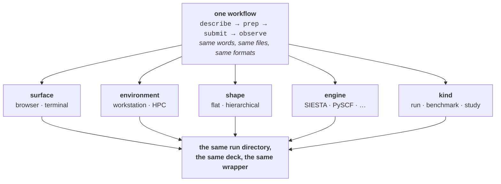
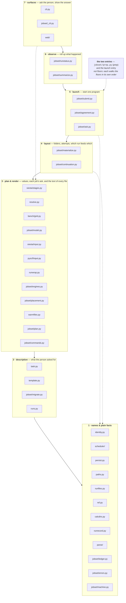
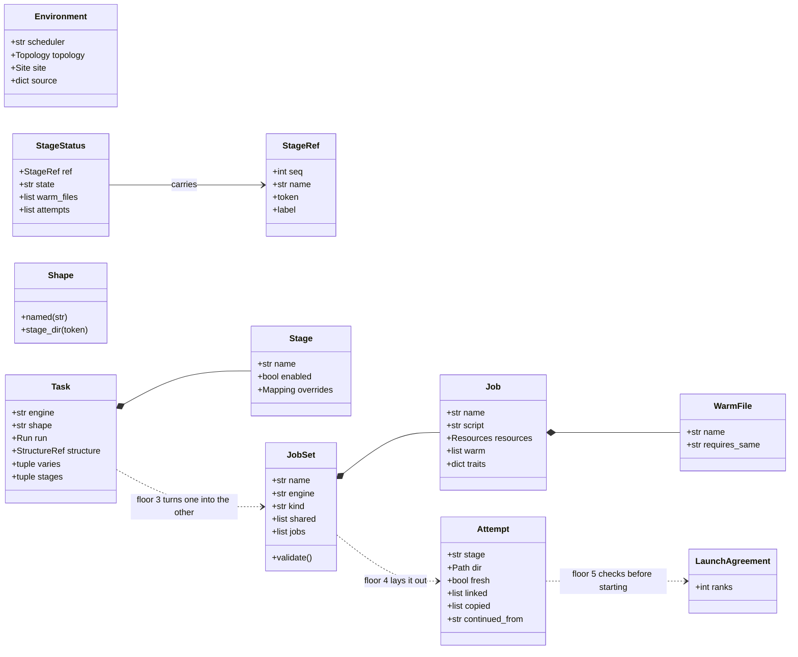
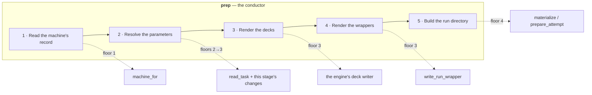
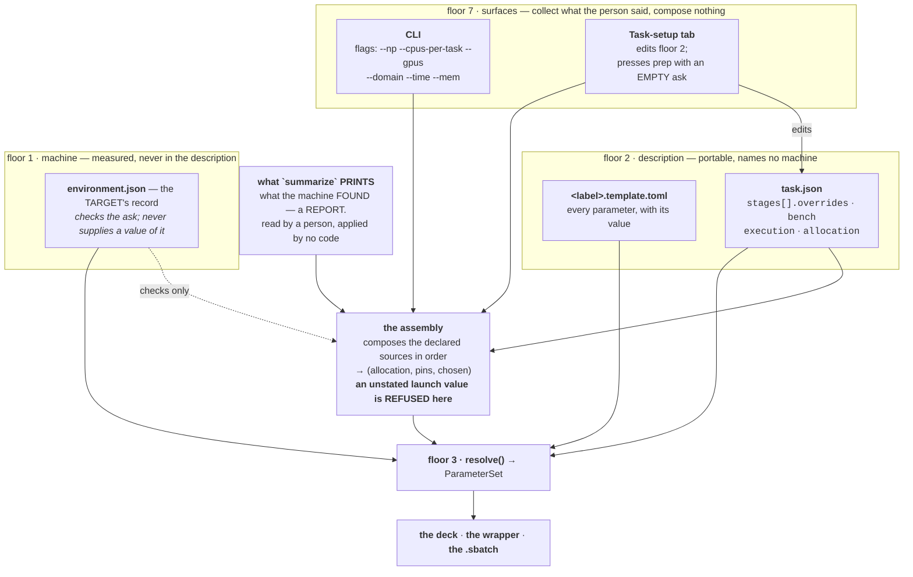
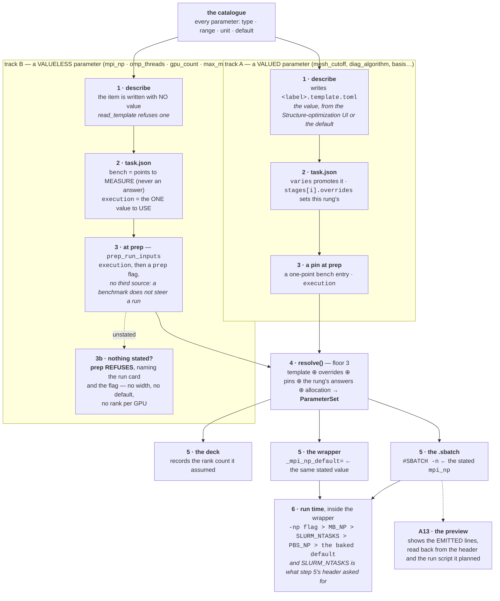
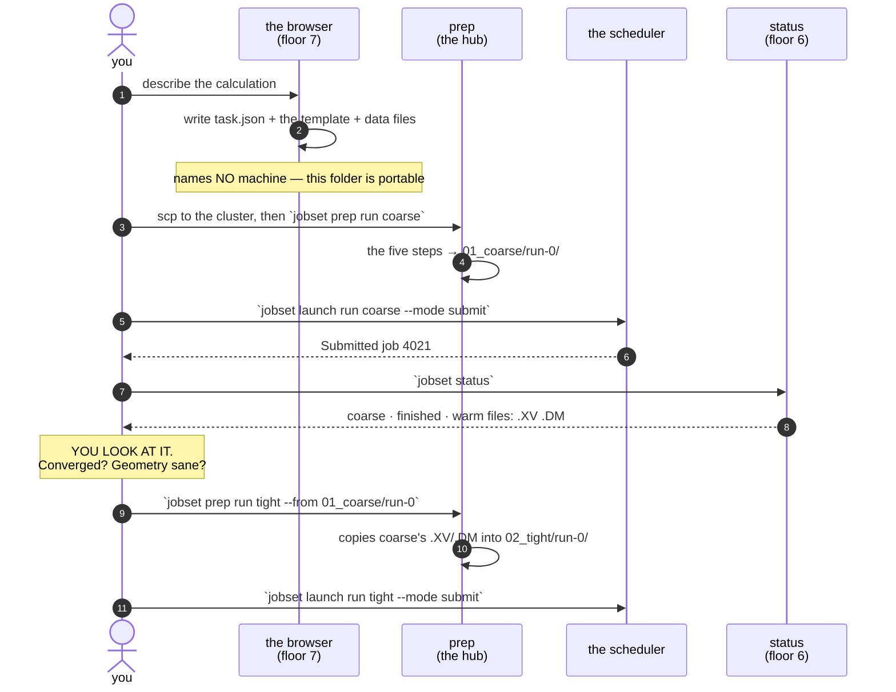
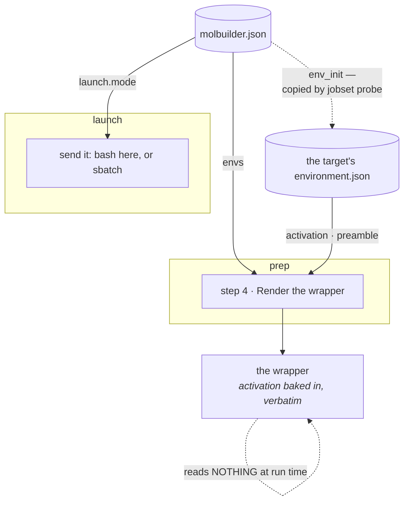
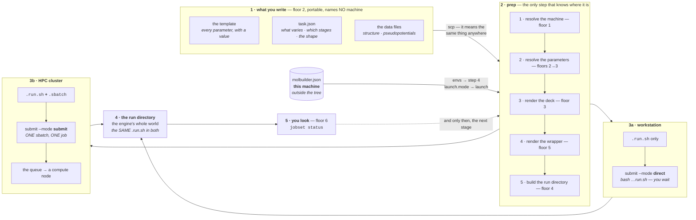
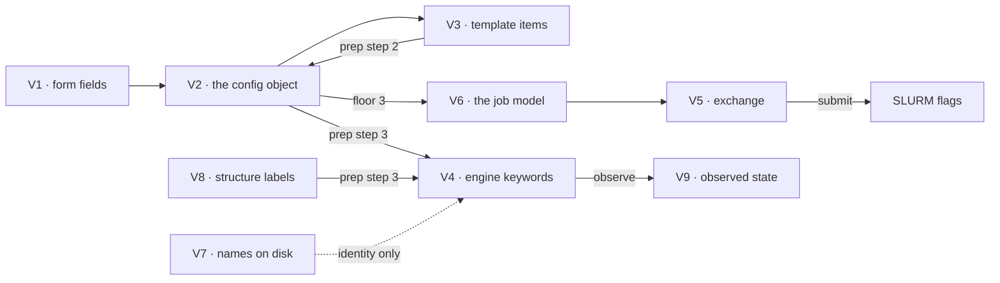

# Execution architecture — who owns which decision

**Role:** contract
**Domain:** execution

**Companions:**
[`execution/overview.md`](?doc=execution/overview.md) — which document to open;
[`execution/project-layout.md`](?doc=execution/project-layout.md) — what a
project directory *is*, and the five steps `prep` runs;
[`execution/job-contracts.md`](?doc=execution/job-contracts.md) — the file
formats and the shared parameter vocabulary;
[`architecture.md`](?doc=architecture.md) — the whole package by **import
depth** (`L1`/`L2`/`L3`), a different and coarser grouping than this one;
[`plans/plan.md`](?doc=plans/plan.md) — how much of this the code holds today.

> **This document says who is allowed to decide what.** It is the authority for
> the execution domain's internal shape: the floors, the objects that travel
> between them, the routes that cross them, and the rules that must never break.
> It says nothing about *when* any of it gets built — that is
> [`plans/plan.md`](?doc=plans/plan.md), and per the doc rules a contract does not
> hold a plan.

---

## 0. The goal: one workflow, flexible in five directions

*Stated 2026-08-11 (user): **"we need a unified and flexible workflow."** Every
rule below serves this; if a rule and this section disagree, this section is what
the rule was for.*

> **There is ONE way to run a calculation, and it bends in five places rather
> than forking into five systems.**


```mermaid
flowchart TB
    W["<b>one workflow</b><br/><code>describe → prep → submit → observe</code><br/><i>same words, same files, same formats</i>"]
    W --> A1["<b>surface</b><br/>browser · terminal"]
    W --> A2["<b>environment</b><br/>workstation · HPC"]
    W --> A3["<b>shape</b><br/>flat · hierarchical"]
    W --> A4["<b>engine</b><br/>SIESTA · PySCF · …"]
    W --> A5["<b>kind</b><br/>run · benchmark · study"]
    A1 --> R["<b>the same run directory,<br/>the same deck, the same wrapper</b>"]
    A2 --> R
    A3 --> R
    A4 --> R
    A5 --> R
```

**What each axis is allowed to change, and what it may never touch:**

| axis | what it changes | what stays identical | where it is decided |
|---|---|---|---|
| **surface** — browser or terminal | how you *say* it | the files written (§ 11) | you |
| **environment** — workstation or HPC | one flag, one extra file, two floor-1 facts (§ 9) | floors 2, 3, 4, 6, 7 — and the inner `.run.sh` **byte for byte** | detected at `prep`, **declared** in `molbuilder.json` |
| **shape** — flat or hierarchical | where results sit, and what survives | every rule in `project-layout.md`; only *depth* differs | `task.json`'s `shape`, once |
| **engine** — SIESTA, PySCF, … | which items exist and what keyword each becomes | the template format, the routes, the verbs, the layout | the engine's own metadata |
| **kind** — run · benchmark · study | **how many configurations get rendered** | every step of `prep`, which loops rather than branches | the length of the `ParameterSet`, at `prep` step 2 |

**One property makes it unified, and it is worth naming because everything else
follows from it:** *every axis is a **value read at one point**, never a branch
that grows a second code path.* A shape is a field somebody set; an environment
is what floor 1 found; an engine is a `kind` on an item; **a benchmark is a list
with more than one element.** No axis is a fork.

> **The fifth axis is the newest and the one that was a fork until it was named**
> *(added 2026-08-11)*. `project-layout.md` § 2.3.1a already said it in words —
> *"benchmarking is `prep` whose parameters are a set rather than a point"* — and
> [`generator.md`](?doc=execution/generator.md) makes it an object, so **a
> production run is that set with one element**. That document owns the data
> spine this axis rides on: schema → template → `ParameterSet` → decks.

> **Why the inner `.run.sh` really can be byte-for-byte, when the two machines
> load software differently** *(user, 2026-08-11)*. How a shell enters an
> environment is **a fact of each machine, in its record** — the `preamble`
> (e.g. `module load mamba/latest`) and the `activation` (`conda activate` /
> `source activate`), recorded by `jobset probe` on that machine
> (`configuration.md` § 5 M-1). A cluster's record names its own; **a
> workstation's names its conda hook**, and then nothing about the emitted
> script differs. So *"what differs between a laptop and Sol"* is **the record,
> not the code path** — which is this section's rule, applied to the one place
> people expect an exception.
>
> The init lines a person *sees* may differ between two machines. That is the
> **data** differing, not a second script.

**And one property makes it flexible: the contract stays small, and the
directory structure carries the variety.** Two reasons for a directory — the
science changed, or you continued (`project-layout.md § 1.5b`) — is the whole
rule, and you can read a folder and know what happened without opening a file.

> **The failure this is written against** is the one that shows up in every
> system that grew instead of being designed: a *web path* and a *CLI path*, a
> *laptop mode* and a *cluster mode*, a *simple* case and a *staged* case — four
> pairs, sixteen combinations, and a bug fixed in one of them. Hence *there is no
> `molbuilder run`* and *there is no `molbuilder fdf`*
> ([`process/conventions.md § 3`](?doc=process/conventions.md)): a second way in
> is the first crack in the first axis.

> #### ⚠ One thing breaches this today, and one is scoped out — stating the rule
> #### without both would be the overclaim this section exists to prevent
>
> | | what it is | which kind |
> |---|---|---|
> | **`bench`** | ~~a whole second lifecycle for measuring — build · run · read · use-the-answer, each with two spellings~~ **MERGED (the fold, 2026-08-12):** benchmarking IS `prep`, specialised (`project-layout.md § 2.3.1a`) — the jobset verbs own the whole loop, and `bench/` keeps only the grid + result library modules and one utility (`probe-scheduler`; the legacy `siesta-gpu` sweep was deleted 2026-08-13) | **a merge, now landed.** This row stays as the record that the rule was breached and how the breach closed |
> | **`transport`** | ~~`transport bundle` emitted `run-transport.sh`, chaining three coupled runs outside the job system~~ **the COMPOSITE landed (transport-design.md, built P1–P6 2026-08-28/29; the bundle driver deleted with P7)**: transport is `--calculation transport` — one calculation citing a finished junction attempt, whose five stages run INSIDE the job system (each an ordinary prep/launch rung; the § 4.2 gather moves the files a run of one stage hands the next) | **a separate kind, exactly as decided** *(2026-08-11, user)*. A `JobSet` still carries no edges: the stages do not chain — a person launches each after reading the last, and the one sequenced thing (a bias scan's points) rides ONE submission, the chain walker |
>
> **They are not the same problem, and a plan that treated them alike would
> either delete a working capability or bless a permanent second path.** One is
> duplicated machinery to fold in; the other is **a different kind of job**, and
> the user's decision of 2026-08-11 is that it stays that way rather than being
> bent into a pipeline built for one parameter set. The full comparison is
> [`process/conventions.md § 3`](?doc=process/conventions.md).

---

## 1. The one idea: two questions, two different answers

People ask two things about this system, and **an answer to one is not an
answer to the other**:

| the question | the kind of answer | when you find out you were wrong |
|---|---|---|
| *Who is allowed to know about whom?* | a **floor** — about which file may read which | at rest, from a test |
| *What happens, and in what order?* | a **route** — about time | when you run it |

**A floor is a storey of a building.** You may always go *down* and come back
with an answer. You may never go up, and never cut sideways through a wall.

**A route is the path a person walks through those floors to get one job done.**
It visits several floors in an order it chooses, and **that order is allowed to
disagree with the floor numbers** — because *what depends on what* and *what
happens first* are simply different things.

`prep` is a route, not a floor. Giving it a floor number is what once left one
of its five steps with nobody responsible for it: the machine was never resolved
for a staged run at all, because *"resolve the machine"* belonged to something
the floor plan had no room for.

> #### ⚠ Two different things in this repository are called a "layer"
>
> Both are real, and confusing them costs an hour every time.
>
> | | what it controls | who enforces it | the values |
> |---|---|---|---|
> | **import depth** | which file may `import` which | review — `process/code-audit.md` § 1c (e); `tests/test_layering.py` scanned it until 2026-09-27 | `L1` · `L2` · `L3` |
> | **floor** (this document) | which *role* owns a decision | review — `tests/test_architecture_rules.py` held it until `082ba979` | 1 names … 7 surfaces |
>
> They overlap without matching. `persist` is import-depth **L1** and sits on
> **floor 1** with the other plain facts (§ 2.1 row 1 lists it; the floor
> test pins it — this line once said "no floor at all" against both).
> `identity` is both. `jobset` is one import tier (`L2`) and spans **all
> seven** floors (§ 2.1 names each module's: `ledger` and `errors` on 1,
> `migrate` on 2, `_cli` row 7's surface), with the two entries and the prep
> assembly beside them.
>
> **In this document, "floor" always means the second.** The import grouping is
> [`architecture.md`](?doc=architecture.md) § 3.

---

## 2. The seven floors


```mermaid
flowchart TB
    subgraph F7["<b>7 · surfaces</b> — ask the person, show the answer"]
      direction LR
      S1["cli.py"]; S2["jobset/_cli.py"]; S3["web/"]
    end
    subgraph F6["<b>6 · observe</b> — roll up what happened"]
      direction LR
      O1["jobset/runstatus.py"]; O2["jobset/summarize.py"]
    end
    subgraph F5["<b>5 · launch</b> — start one program"]
      direction LR
      U3["jobset/submit.py"]; U4["jobset/agreement.py"]; U5["jobset/ask.py"]
    end
    subgraph F4["<b>4 · layout</b> — folders, attempts, which run feeds which"]
      direction LR
      Y1["jobset/materialize.py"]; Y2["jobset/continuation.py"]
    end
    subgraph F3["<b>3 · plan &amp; render</b> — values, each job's ask, and the text of every file"]
      direction LR
      P1["siesta/stages.py"]; P2["resolve.py"]; P3["bench/grid.py"]; P4["jobset/model.py"]
      P5["siesta/input.py"]; P6["pyscf/input.py"]; P7["runwrap.py"]
      P8["jobset/engines.py"]; P9["jobset/placement.py"]; P10["warmfiles.py"]
      P11["jobset/plan.py"]; P12["jobset/commands.py"]
    end
    subgraph F2["<b>2 · description</b> — what the person asked for"]
      direction LR
      D1["task.py"]; D2["template.py"]; D3["jobset/migrate.py"]; D4["runs.py"]
    end
    subgraph F1["<b>1 · names &amp; plain facts</b>"]
      direction LR
      N1["identity.py"]; N2["scheduler/"]; N3["persist.py"]
      N5["paths.py"]; N6["runfiles.py"]; N7["ref.py"]
      N8["calcdirs.py"]; N9["runrecord.py"]; N10["parse/"]
      N11["jobset/ledger.py"]; N12["jobset/errors.py"]; N13["jobset/machine.py"]
    end
    F7 --> F6 --> F5 --> F4 --> F3 --> F2 --> F1
    F5 -.-> F1
    F4 -.-> F1
    F7 -.-> F3
    PREP["<b>the two entries</b> — <code>jobset/prep.py</code> (prep)<br/>and the launch entry<br/><i>not floors: each walks the floors in its own order</i>"]
    PREP -.-> F5
```

Solid arrows are the ordinary way down. **Dotted arrows are allowed shortcuts:**
any floor may reach straight to floor 1, because floor 1 holds plain values and
keeps no state. `launch` asking `identity` for a name is not a violation — it is
floor 1 doing the job it exists for.

*(The floor-3 nodes drew `bench/to_jobset.py` until 2026-08-12 — deleted with
the pre-resolve producers; the diagram now matches § 2.1's row 3, whose own
note records the deletion.)*

### 2.1 What each floor owns, and how you call it

| # | floor | the decision it owns | files | **entry points** | what it writes | it must never |
|---|---|---|---|---|---|---|
| **1** | **names & plain facts** | what a thing is called; what this machine is; what a file — or a run's own records — says | `identity` · `paths` · `ref` · `calcdirs` · `runfiles` · `runrecord` · `scheduler/` (the record, the probe, admission) · `persist` · `parse` · `jobset/ledger` · `jobset/errors` · `jobset/machine` | `resolve_stage_ref` · `stage_token` · `parse_token` · `Shape.named` · `Shape.stage_dir` · `Ref` · `run_id` · `machine_for` (the record read) · `require_activation` · `resolve_environment` (the probe's) · `admits` · `read_json` / `write_json` · `launch_record` / `write_launch` · `ending` · `run_status` · `machine_record` / `set_machine` · `ledger.record` (a verb's decisions, one append each) · `PrepError` | `environment.json` · `jobset-decisions.log` · `run.json` and a run's markers | know what a calculation is — a stage, a ladder, a plan |
| **2** | **description** | what the person asked for — and the run a file belongs to, read with it | `task` · `template` · `jobset/migrate` · `runs` | `read_task` · `write_task` · `find_template` · `derive_run` · `varies_for` · `place_of` · `run_of` · `about` · `folder_answer` | `task.json` · the template | **name a machine** |
| **3** | **plan & render** | asked-for **+ machine** → a list of jobs, **each job's ask, and the text of every file** | `resolve` · `jobset/model` · `jobset/engines` · `jobset/placement` · `warmfiles` · `siesta/stages` · `pyscf/stages` · `bench/grid` · `siesta/input` · `pyscf/input` · `runwrap` · `jobset/plan` · `jobset/commands` | `resolve` (template ⊕ overrides ⊕ sweep point ⊕ pins ⊕ the rung's answers → `ParameterSet`) · `JobSet.write` / `load` / `validate` · `engine_seam` · `placement` · `warm_list` · `gpu_request` · `spec_for` (each engine's) · `script_emit.render_deck` / `script_emit.prepare_deck` · `write_run_wrapper` · `render_sbatch` · `command` | `job-set.json` · the decks · `.run.sh` · `.sbatch` · `STAGE-PLAN.md` | **re-decide a value it was handed** *(the pre-resolve producers — `stages_to_jobset` · `build_siesta_stage_bundle` · `sweep_to_jobset` · `bench/to_jobset` — were deleted 2026-08-12, plan steps 4–6)* |
| **4** | **layout** | where every file sits; which run feeds which | `jobset/materialize` · `jobset/continuation` | `stage_home` · `prepped` · `open_run` · `job_dir_names` · `attempts` · `latest_attempt` · `continuation` · `usable` | the folder tree; `run-<n>/` | know about a queue |
| **5** | **launch** | start one program | `jobset/submit` · `jobset/agreement` · `jobset/ask` | `launch_agreement` · `check_launch_matches_deck` · the one sender | `launch/` scripts — and through floor 1, `run.json` | decide physics |
| **6** | **observe** | where has it got to | `jobset/runstatus` · `jobset/summarize` | `jobset_status` · `render_status` · `render_stage_status` · `summarize` | only `summarize`'s own records — `bench-result.json`, a transport calculation's I–V, a displacement sweep | write anything a run or a prep reads |
| **7** | **surfaces** | asking, and showing | `cli` · `jobset/_cli` · `web` | `molbuilder jobset {init,prep,launch,summarize,status,probe,machines,migrate}` · the web blueprints — each appending its verb's decisions to the ledger, except `prep`'s and `launch`'s, which their entries append (`launch`'s verb only the refusals it says before it calls its entry) | — | work out a name, a folder, or a launch — **or assemble what a route receives** (A12) |

**Every `jobset` module has a floor** *(W55 B7, 2026-10-03)*. Five of them had
none — `plan`, `commands`, `continuation`, `ask`, `migrate` — so an import into
them could not be judged; the table names each. **`parse/` is floor 1**: a
reader turns a file, or a run folder's files, into facts and knows no
calculation — which is what lets launch (5) and the layout (4) ask how a run
ended without reaching up. **A run's own records** — `run.json`, its
conclusion marker, `.continued-from`, `.gathered-from` — are floor 1's
`runrecord`, read and written through `persist`; the layout decides where a run
is, not what its records hold. **`jobset/__init__` is empty**: it re-exported
twenty-four names nobody imported through it, and loaded the conductor for
every `jobset.model` reader.

**The rule that makes it a layering:** *a floor may call down and return up; it
may never reach across.* Floor 5 deciding a rank count that floor 3 already
assumed is that reach, and it once cost a real run.

> **`prep` is not a floor — it is the conductor.** It walks floors 1 → 4 in order
> and owns no decision of its own, which is why it is drawn beside the stack
> rather than in it. **It may call, but it may never decide**: a value settled
> inside `prep` is a value no floor owns, and that is the shape of the "stomp"
> failures — an allocation re-applied over per-element resources floor 3 had
> already resolved. **Only a surface may import it.** The sequence it walks is
> [`script-preparation.md`](?doc=execution/script-preparation.md) § 3.
> Beside it sit its own assembly (`jobset/prep_inputs.py`, what a prep
> receives — A12) and its one entry (`prep_stage`, which both prep doors call
> and which appends the verb's decisions to the ledger); a surface imports
> them as it imports the conductor.
>
> **`launch` has an entry of its own, built the same way** *(W55 B5,
> 2026-10-03)*: it plans every submission with nothing sent, the surface shows
> the plan and asks, and the send carries it out
> ([`job-system.md`](?doc=execution/job-system.md) § 6). It too is imported by
> surfaces only. **Nothing below the two entries imports either**: what a lower
> floor needed from the conductor — the stage namer, the engine seam, the error
> type, the launch-value check — lives on the floor that owns it (§ 3.2), so
> status, launch and a spectra reader no longer reach the conductor to ask it.

---

## 3. The objects that travel between floors

Each object exists to replace *"work it out again"* with *"ask"*. **An object
belongs to exactly one floor** — the floor whose question it answers — and
travels upward as a return value.


```mermaid
classDiagram
    direction LR
    class StageRef {
      +int seq
      +str name
      +token
      +label
    }
    class Environment {
      +str scheduler
      +Topology topology
      +Site site
      +dict source
    }
    class Task {
      +str engine
      +str shape
      +Run run
      +StructureRef structure
      +tuple varies
      +tuple stages
    }
    class Stage {
      +str name
      +bool enabled
      +Mapping overrides
    }
    class JobSet {
      +str name
      +str engine
      +str kind
      +list shared
      +list jobs
      +validate()
    }
    class Job {
      +str name
      +str script
      +Resources resources
      +list warm
      +dict traits
    }
    class WarmFile {
      +str name
      +str requires_same
    }
    class Shape {
      +named(str)
      +stage_dir(token)
    }
    class Attempt {
      +str stage
      +Path dir
      +bool fresh
      +list linked
      +list copied
      +str continued_from
    }
    class LaunchAgreement {
      +int ranks
    }
    class StageStatus {
      +StageRef ref
      +str state
      +list warm_files
      +list attempts
    }
    Task *-- Stage
    JobSet *-- Job
    Job *-- WarmFile
    StageStatus --> StageRef : carries
    Task ..> JobSet : floor 3 turns one into the other
    JobSet ..> Attempt : floor 4 lays it out
    Attempt ..> LaunchAgreement : floor 5 checks before starting
```

| object | floor | the question it answers, once | who may build one |
|---|---|---|---|
| **`StageRef`** | 1 | *which stage is this?* — an ordinal and a name, together | the resolver, `stage_refs` |
| **`Environment`** | 1 | *what is this machine?* | `resolve_environment` |
| **`Task` / `Stage`** | 2 | *what did the person ask for?* | `read_task` |
| **`JobSet` / `Job` / `WarmFile`** | 3 | *what jobs does that mean, on this machine?* | `prep`, from the resolved `ParameterSet` (`resolve.py`) — one `Job` per element *(the producers `stages_to_jobset` / `sweep_to_jobset` built these until 2026-08-12; deleted, § 2.1's row-3 note)* |
| **`Resources`** | 3 | *what does this job ask the machine for?* — the nine fields of [`job-contracts.md § 6.2`](?doc=execution/job-contracts.md), in the exchange vocabulary | **two roles, and they are not the same answer twice.** A **surface** assembles *the ask* from what the person said — `--np`, the Build tab's form — which is what [`generator.md § 4.1a`](?doc=execution/generator.md) means by *"stated in the command, at prep"*. `resolve.py` then produces *the per-element allocation*, the ask ⊕ this sweep point's machine axes, one per `ParameterSet` element. § 4.1's containment (capability ⊇ allocation ⊇ sweep) is exactly the relationship between them |
| **`Shape`** | 1 | *flat or hierarchical — how deep do this calculation's files go?* | `Shape.named`, from the description — never inferred from the disk |
| **`Run`** | 2 | *which run is this file of, and where are its files?* — its calculation and description, its folder, the label its files are named on, its stage, its run index; its files by role ([`project-layout.md`](?doc=execution/project-layout.md) § 5) | `run_of` |
| **`Declared`** | 2 | *what did this run declare about its atoms?* — the held atoms, regions and annotations, the axis kinds and the cell its atoms were placed in, its stated parameters: its own deck's records | `declared` |
| **`StageHome`** | 4 | *where does this stage live, and what is its number?* — read off the disk: a stage with a folder keeps its number, one without takes the next unused ([`project-layout.md`](?doc=execution/project-layout.md) § 4.2) | `stage_home` |
| **`RunLaunch`** | 1 | *was this run launched — how, where, from what?* — its `run.json`, read through `persist`, its schema checked | `launch_record` |
| **`Ending`** | 1 | *did this run end on its own, and how?* — molbuilder's marker for that run (it carries the exit code); a run our wrapper did not run is not a run of ours | `ending` |
| **`Continuation`** | 4 | *what does this run start from?* — the run it continues from (by default or named) or none (cold, linked), what that run was, **and the files it carries** | `continuation` |
| **`Placement`** | 3 | *where does this job go, and what does it ask?* — queue, wall, memory, ranks, cores, GPUs, each with its source, admitted against the target's record | `placement` |
| **`Attempt`** | 4 | *which try is this, and what was put in it?* | `open_run` — the one opener of a run folder (a stage's attempt, a trial's, a bias point's) |
| **`PrepPlan`** | the prep entry's | *what will this prep write?* — every file's text and every folder, decided with nothing written | `plan_prep` |
| **`LaunchPlan`** | the launch entry's | *what will this launch send?* — every submission, its members, their attempts and the exact lines | `plan_launch` |
| **`LaunchAgreement`** | 5 | *does this deck match the launch it is about to get?* | `launch_agreement` (`jobset/agreement.py` — its own floor-5 module since 2026-08-12, so `prep` and `submit` both import it downward and neither imports the other) |
| **`StageStatus` / `JobSetStatus`** | 6 | *where has this got to?* | `jobset_status` |

**A `Job` names no other `Job`.** It declares `warm` — *what* it would take from
a run it continues, and the condition on each — and never *from whom*. Which run
that is, is named by a person at `prep`. `traits` holds the values a condition is
compared against: SIESTA puts its optimizer there, so a conjugate-gradient
history is not handed to a Broyden stage.

### 3.1 An object travels whole — the other half of "one owning function"

The table above answers *who may build one*. **This section answers who may take
one apart, and the answer is nobody.**

> **An object crosses a floor boundary as itself.** A function that consumes one
> takes the object; it never takes a hand-picked list of its fields, and a
> caller never destructures one to call it.

**This is A4 seen from the receiving end, and without it A4 buys nothing.** One
owning function guarantees the object is *assembled* correctly and says nothing
about what survives the call — so a structure built whole on floor 3 can still
arrive on floor 5 with two of nine fields missing, and every rule above is
satisfied while the artifact is wrong.

**The failure it forbids, in the form it actually takes.** A door with N loose
keyword arguments has 2^N ways to be called and one that is right. Every caller
re-derives which subset matters, so the doors disagree by construction — and the
disagreement is invisible, because a missing field is indistinguishable from a
field whose value happens to be the default:

| | asked for | wrote |
|---|---|---|
| `jobset/prep.py` | 16 ranks × 8 cores | `.sbatch -c 8` · `.run.sh` OMP default **1** |
| `web/blueprints/build.py` | 16 ranks × 8 cores | `.run.sh` OMP default 8 · `.sbatch` **no `-c`** |

*(Measured 2026-08-17. Two call sites of one door, eleven loose arguments, ten
passed by one and five by the other — each correct about one artifact and wrong
about the other. The same door had already lost `max_memory_mb` this way on
2026-08-11; that fix moved the field onto `Resources` and left the calling
convention alone, so the class stayed open and fired again four days later.)*

**What stays loose, and why that is not a hole.** A parameter that belongs to the
*invocation* rather than to the *job* is not part of any object: `--env` is a
per-call override, `emit_sbatch` is a surface's choice about what to write.
The test is ownership — if a field has a home in § 3's table, it arrives in that
home or not at all.

**Two names for one fact stay two names.** `job-contracts.md` § 6.2 keeps
`omp_threads` and `cpus_per_task` distinct because they are read by different
layers, and this rule does not merge them. It removes the thing that made the
distinction dangerous: with the object passed whole, *which* name a door uses
internally is its own business, and no caller can supply one and forget the
other.

### 3.2 One door per fact *(W55 B8, 2026-10-03)*

§ 3 gives each object one owning function (A4). **This gives each FACT one
door** — the facts every verb asks, which until 2026-10-03 each had several
answerers that disagreed on real inputs. Five splits ran through most of them,
each measured: a stage's number by its place in the description *or* by the
folder on disk; a run's end by molbuilder's marker *or* by the engine's output;
the restart files from the calculation's own list *or* the shipped one; a GPU
job by its count *or* by `use_gpu`; `run.json` read raw *or* through `persist`.

| the fact | its door | floor | every reader asks it — among them |
|---|---|---|---|
| **a stage's number and folder** | `stage_home(base, task, stage)` — the number on disk for a stage that has a folder (its directory in the hierarchy, its deck's token in the flat shape); the next unused for one that has none ([`project-layout.md`](?doc=execution/project-layout.md) § 4.2) | 4 | prep, launch, status, `#N`, what a stage continues from, the transport record, the displacement sweep, a benchmark's folder, Task setup |
| **prepped** | `prepped(base, task, kind, stage)` — the plan holds the stage's row, or its bench folder a sweep, matched by `identity.stage_key` | 4 | prep's gate, launch's gate, status, the plan's merge, Task setup's folder answer, its Save, its commands |
| **launched** | `launch_record(run)` — the run's `run.json` (a flat stage's run's own `<stem>-run<N>.run.json`, the stage's newest run when no number is asked; one with no number, written before 2026-10-06, refused naming `jobset migrate`); one that does not read is an error naming the file, never *launched* or *not launched* | 1 | status, the Run panel, prep (an unlaunched attempt is reused), every launch gate, the transport citation |
| **how a run ended** | `ending(run)` — the run's own conclusion marker, which carries the exit code; nothing else answers — the engine's own end mark says the engine ended, not the job *(it answered for a run started by hand until 2026-10-03)* | 1 | status (its state is built on it), continuation, the frequency stage, the transport gather and citation, a re-launch's plan, the transport record, a benchmark's trials, the viewers through the server |
| **a run to build on** | `usable(state)` — the one status door says it **finished**: it ended on its own with exit code 0 and nothing in its output says the engine stopped (`parse.dirs.run_status`, the door `status` asks; user, 2026-10-06); the default of every hand-over, while a run named with `--from` is taken as said and a structure can be stated relaxed ([`job-system.md`](?doc=execution/job-system.md) § 5.4) | 4 | every hand-over by default: a continuing stage, the frequency stage's geometry, a transport rung's inputs |
| **what a run starts from** | `continuation(...)` → `Continuation`, the files it carries included | 4 | prep — checked, written and ledgered as one object — a re-launch, status, Task setup's *Continue from* |
| **a stage launched again** | `relaunch(..., cold=)` → `Continuation` or `None` — warm, its own latest run, however it ended, when it continues from a run of its own (`Job.relaunch_continues`: its kind resumes and it takes something from a run); cold, or a stage that takes nothing, `None` | 4 | launch — opened, written and ledgered as prep's hand-over is — and status, which words what launching again will do from the same fact ([`job-system.md`](?doc=execution/job-system.md) § 5.4) |
| **the restart files** | `warm_list(engine, kind, base)` — the calculation's own `warm-files.toml` first, else the shipped one ([`job-contracts.md`](?doc=execution/job-contracts.md)) | 3 | a job's declaration, status's column, the run script's detection and a bias scan's hand-forward — both written at prep from it |
| **the GPU request** | `gpu_request(resources)` → `GpuRequest(uses, count)` — a job's `use_gpu` as `resolve` carries it from the job's own values, and its count; a GPU run with no count, or a count for a run that does not use the GPU, is refused — at prep before anything is written, of the job the stage resolves to (`prep._resolve_stage`; the Task setup card shows the entry's preview of it), by the run card or `--gpus`, either engine ([`gpu.md`](?doc=execution/gpu.md) G5) | 3 | the header, the run script, launch and its queue table, a benchmark's trials and their report, the Task setup card |
| **what a queue offers, and whether a job fits** | `Domain.devices` and the record's limits; `admits(row, request)` with the job's whole request | 1 | prep (the placement), launch (a flag that changes it), the queue table, a benchmark's cells |
| **`job-set.json`** | `JobSet.load` / `write` (`persist`) | 3 | everyone — the sweep reader the Results tab uses among them |
| **the template** | `find_template(base, label)` — the one template, named for the label, or refused by name | 2 | prep, the preflight, continuation, the run inputs, Task setup, transport |
| **the shape** | `Shape.named(task.shape)` — asked, never inferred from what is on disk | 1 | every reader of the layout |
| **the description** | `read_task(path)` → `Task` — `task.json` read whole, its schema checked; one that does not read is an error naming the file. Nothing else opens `task.json`: a reader that wants one field reads the `Task` *(B14, user, 2026-10-04: "addressed by unified api call")* | 2 | every verb; the run door (a calculation's shape, its kind, its label); the Results tab's folder answer; Task setup's folder answer |
| **the run a file belongs to, and its files** | `run_of(path)` → `Run` — the folder's place (`calcdir.json`, or the description at a root), the description (`read_task`), the label molbuilder's files are named on (the description's; a benchmark trial's `<label>-<point>`, `paths.trial_label`), the stage — the one its folder's path names, else the one a reader asks about in a folder several stages share (`run_of(path, stage)`, a flat calculation's) — and the run index; its files read back with that label through `runfiles`: one by role (`Run.file(role, run)`), its deck (`Run.deck`), its engine output at its run index (`Run.stdout`), every output of its stage newest run first (`Run.outputs`), its session log — the one whose first section is its run (`Run.session_log`). A reader takes a run's files at its one run index, so what it reports never mixes two runs. **A folder speaks for one run**: the highest stage launched — its launch record, or files carrying a run index — then that stage's newest run index; a file's time decides nothing. A folder with neither `calcdir.json` nor `task.json` above it holds no run of ours. What a file is — its catalogue row, or *not written by molbuilder* — is `about(path)`, on the same door *(B11)* | 2 | the Results tab's folder answer and its file card, the run record, the viewers' loads and run answer, the structure reader (an engine's own `.xyz`), `summarize` (a benchmark trial's figures), the transport record, prep (the geometry a relaxation left), continuation (what a run concluded), `xv2xyz` -- status and launch's re-launch ask a run's state by the stem they compose (`run_status`, `ending`) |
| **what a run declared about its atoms** | `declared(run)` → `Declared` — from the run's own deck (`Run.deck`): its `atom-metadata` block (held atoms, regions, annotations), its `engine-offset` record (the axis kinds, the cell its atoms were placed in), its stated parameters. The calculation's structure pair is reached only through the description; nothing is looked for beside an output by its name *(B12; D19 is its first reader)* | 2 | the Results trajectory's load, the codec reading an engine's own structure file (`model/structure-periodicity.md` § 6.0), `xv2xyz --from-run` |
| **what molbuilder writes, and what each file is** | `runfiles.WRITTEN` — every file molbuilder writes into a calculation folder, one row each: its name (a role on the label, or a fixed name), where it sits in each shape, what it holds, who writes it and when, its door, its kind; the names a stage will have, per shape (`manifest`), and the glob family (`patterns`) are its readings. A fixed name's owner takes it from the catalogue *(B13)* | 1 | the Task setup card, the Results file card (through `about`), `--cold`'s sweep, [`project-layout.md`](?doc=execution/project-layout.md) § 5 — rendered from it |
| **the machine** | `machine_for(base, target)` — read once per verb and passed whole | 1 | prep, launch, the printed commands, the Task setup card, `summarize` |
| **a stage's resolved values** | `resolve` — the ladder's view is made of its answers, never composed a second way | 3 | prep, the preflight's sequence checks, continuation, the frequency stage's force criterion, the transport gather |

**Where two answerers disagreed, the door's answer is the one kept** — a stage
removed after its prep (the numbers), an output that ended with no marker (the
end), a calculation whose own list withholds `.DM` (the restart files), `--gpus`
on a run that does not use a GPU (the request). A door is asked; it is never
worked around.

---

## 4. The four routes

A route owns **an order**, not a floor.

| route | you type | the job it does | its order | floors it visits |
|---|---|---|---|---|
| **describe** | `jobset init` | **write** the portable description — the template, `task.json`, the data files | ask → check → write | **2 only** |
| **prep** | `jobset prep` | assemble a runnable folder **on the machine that will run it** | plan → save → write → record ([`job-system.md`](?doc=execution/job-system.md) § 5.0); the plan is the five steps below, decided with nothing written | 1 → 2 → 3 → 4 |
| **submit** | `jobset launch` | one job becomes one running program | plan → show → ask → send → record ([`job-system.md`](?doc=execution/job-system.md) § 6) | 1 → 4 → 5 |
| **observe** | `jobset status` | answer *where has this got to* | newest attempt → read it → add up | 4 → 6 |

> **The first route is named `describe`, and it stops at floor 2** *(corrected
> 2026-08-11)*. This row read *"**produce** — turn a description into a portable
> folder · check → **render** → write · floors 2 → 3"*, which is the **old**
> design: the browser wrote finished decks, so describing reached floor 3.
> **Rendering moved to `prep` step 3**, so describing renders nothing and never
> leaves floor 2 — which is what makes *the description names no machine* a
> structural fact rather than a rule to remember.
>
> **And "a produce" was undefined jargon**, used as a noun ~50 times across these
> documents without ever being introduced. Where it survives in older passages it
> means **this route**: the act of writing the description down. Read *"a produce
> is transactional"* as *"describing a calculation writes every file or none"*.

`prep` is the important one, and
[`project-layout.md`](?doc=execution/project-layout.md) § 2.3 calls it **the
hub**: you come back to it after every look at a result. **Notice that only
`describe` is off the target machine** — the other three all require it, which
is the whole shape of the split.

### 4.1 `prep` — the same five steps, every time


```mermaid
flowchart LR
    subgraph PREP["<b>prep</b> — the conductor"]
      direction TB
      p1["1 · Read the machine's record"] --> p2["2 · Resolve the parameters"]
      p2 --> p3["3 · Render the decks"] --> p4["4 · Render the wrappers"]
      p4 --> p5["5 · Build the run directory"]
    end
    p1 -.->|"floor 1"| q1["machine_for"]
    p2 -.->|"floors 2→3"| q2["read_task + this stage's changes"]
    p3 -.->|"floor 3"| q3["the engine's deck writer"]
    p4 -.->|"floor 3"| q4["write_run_wrapper"]
    p5 -.->|"floor 4"| q5["materialize / prepare_attempt"]
```

**The sequence is owned by**
[`script-preparation.md`](?doc=execution/script-preparation.md), which states it
at three resolutions — the decision chain below, these five steps, and the eleven
sub-steps inside step 3. This section says only which floor answers each step.

**The floors never go backwards** — 1 → 2·3 → 3 → 3 → 4 — which is a property to
check rather than a coincidence: `runwrap` renders text from decided values and
sits on floor 3 with the engines' own deck writers.

**Why the order is forced, not chosen:** step 3 cannot precede step 1, because a
script carries values that *depend on how it will be launched* — a block size
derived from the rank count, an eigensolver that also decides which environment
the wrapper activates. **A parameter that depends on the launch cannot be decided
before the launch is known.** The full dependency table, pair by pair, is
[`script-preparation.md`](?doc=execution/script-preparation.md) § 4.1.

### 4.2 A worked example, in plain words

You have looked at the coarse stage, you are happy with it, and you type:

```bash
molbuilder jobset prep run tight --from 01_coarse/run-0
```

Here is what happens, and **who decides each thing**:

| # | what happens | who decides | why it is theirs |
|---|---|---|---|
| — | your words are read | **7 · surface** | asking and showing is its whole job |
| 2 | `task.json` is read: what you asked for, and what the tight stage changes | **2 · description** | it is the only thing that knows what you asked for |
| 1 | the machine's record is read — the calculation's own copy, or at its first prep the target's (`machine_for`); prep never probes | **1 · plain facts** | a fact about that machine, not about your calculation |
| 3 | those two become a list of jobs | **3 · plan** | the only floor allowed to see both at once |
| — | *"tight"* is turned into *which stage that is* | **1 · names** | so a name, a number and a token all reach the same stage |
| 3 | the run script is written, with the environment baked in | **3 · render** | it is text rendered from decided values, like the deck |
| — | the deck is checked against the launch it will get | **5 · launch** | a deck built for 8 ranks must not be started at 32 |
| 4 | `03_tight/run-1/` is made; coarse's geometry is **copied** in | **4 · layout** | where files sit is this floor's only job |
| — | what was resolved is printed for you | **7 · surface** | so the next command is a plain yes |

**`prep` decided none of that.** It decided only **the order**. Every answer came
from the floor that owns it, which is what makes it possible to change one answer
without hunting through the others.

**Why coarse's geometry is copied rather than linked** is
[`project-layout.md § 1.6`](?doc=execution/project-layout.md), which owns that
rule and the reasoning behind it. In one line: the engine writes to that very
filename.

---

## 5. The decision chain — the same question, answered as a sequence

§ 2 says **who owns** each decision. This says **in what order** decisions get
fixed, and the two are different views of one rule.

Overlap between modules is fine. A **loop** is not: if two parties can each
overrule the other, nobody can predict the outcome and nobody can test it. So
the whole system is one sequence, and one rule keeps it one:

> **Each step decides within what the steps above it already fixed, and nothing
> later rewrites something earlier.**

| # | who decides | what it fixes | written down in |
|---|---|---|---|
| 1 | the **project tree** | where anything may live — the topics, and `[A-Za-z0-9_-]+` per segment | `job-contracts.md` § 2.5 |
| 2 | the **structure** | which atoms exist — an input, never edited by the generator | `model/structure.md` |
| 3 | **2 + the name you typed**, inside 1's character set | the **id**, tidied once and then quoted by everything after | `run-identity.md` §§ 2–3 |
| 4 | the **schema** | which fields exist, their types and ranges | `web/form-schema.md` |
| 5 | the **description** | the values, which fields vary, the stages and their order | `engines/stages.md` § 6 |
| 6 | the **preflight** | whether this file can be read here at all | `engines/stages.md` § 6.5 |
| 7 | **validation** | whether it may be written — errors block, per stage, on the resolved whole | `science/validation.md` |
| 8 | the **generator** | the decks and their wrappers: the merge, the cell, the pseudopotentials, BENCH-MARKS | `engines/stages.md` § 7 |
| 9 | the **target's record** | the wrapper's shell — preamble and activation (§ 8.3) | `configuration.md` § 5 |
| 10 | **you** | which stage to run, and when | — this is the point of the whole framework |
| 11 | the **wrapper**, at run time | which statement of ranks and threads applies — a flag given to it, then the scheduler's echo of the header, then the value baked at prep; GPU pinning, the restart banner — never the run's number, which `launch` gives it (`--run N`) | `running-a-job.md` § 3 |
| 12 | the **engine** | whether warm files are honoured, given those parameters | `job-contracts.md` § 4 |

Read it downward and the tangles disappear:

- **The browser lives in rows 3–5 only.** That is why it never renders a deck or
  computes a cell — those are row 8, and row 8 needs row 9, which is a fact
  about a machine the browser is not on.
- **The id is fixed at row 3 and quoted by everything after.** No later step
  derives it again, which is why tidying it once is a rule rather than a
  tidiness preference.
- **Row 10 is a person, and that is deliberate.** Every earlier row exists to
  make row 10's choice safe; none of them makes it.
- **Nothing in rows 1–8 knows what a cluster is.** *The portable folder names no
  machine* is not a policy anyone has to remember — it falls out of where row 9
  sits.

**Rows 6 and 7 both refuse things, and both belong.** One asks *can this file be
read here at all*, the other *is this a sound calculation*. They are ordered, so
a description aimed at an engine this backend does not have never receives a
lecture about its mesh cutoff first.

### 5.2 Where a VALUE is fixed — the five ladders

§ 5 orders the *decisions*. This orders the **values**, because *"where does
this number come from?"* is the question a person actually asks, and it has
one answer only if nothing appears in two ladders.


```mermaid
flowchart TB
    subgraph SURF["floor 7 · surfaces — collect what the person said, compose nothing"]
        direction LR
        CLI["<b>CLI</b><br/>flags: --np --cpus-per-task --gpus<br/>--domain --time --mem"]
        WEB["<b>Task-setup tab</b><br/>edits floor 2;<br/>presses prep with an EMPTY ask"]
    end
    subgraph DESC["floor 2 · description — portable, names no machine"]
        direction LR
        TMPL["<b>&lt;label&gt;.template.toml</b><br/>every parameter, with its value"]
        TASK["<b>task.json</b><br/><code>stages[].overrides</code> · <code>bench</code><br/><code>execution</code> · <code>allocation</code>"]
    end
    subgraph MACH["floor 1 · machine — measured, never in the description"]
        ENV["<b>environment.json</b> — the TARGET's record<br/><i>checks the ask; never supplies a value of it</i>"]
    end
    VERD["<b>what `summarize` PRINTS</b><br/>what the machine FOUND — a REPORT.<br/>read by a person, applied by no code"]
    ASM["<b>the assembly</b><br/>composes the declared sources in order<br/>→ (allocation, pins, chosen)<br/><b>an unstated launch value is REFUSED here</b>"]
    RES["<b>floor 3 · resolve()</b> → ParameterSet"]
    OUT["<b>the deck</b> · <b>the wrapper</b> · <b>the .sbatch</b>"]
    WEB -->|edits| TASK
    CLI --> ASM
    WEB --> ASM
    TASK --> ASM
    VERD --> ASM
    ENV -.->|"checks only"| ASM
    ASM --> RES
    TMPL --> RES
    TASK --> RES
    ENV --> RES
    RES --> OUT
```

#### The full chain, for ONE parameter, birth to artifact

**Every parameter already has a value** — that is the premise, and it is the
catalogue's doing. The only exceptions are the four the catalogue declares
**valueless** (`template.md` § 6.4), and they are valueless because floor 2
may not assert a machine's number. So there are exactly two tracks:


```mermaid
flowchart TB
    CAT["<b>the catalogue</b><br/>every parameter: type · range · unit · default"]

    subgraph VAL["track A — a VALUED parameter (mesh_cutoff, diag_algorithm, basis…)"]
        direction TB
        A1["<b>1 · describe</b><br/>writes <code>&lt;label&gt;.template.toml</code><br/><i>the value, from the Structure-optimization UI or the default</i>"]
        A2["<b>2 · task.json</b><br/><code>varies</code> promotes it · <code>stages[i].overrides</code> sets this rung's"]
        A3["<b>3 · a pin at prep</b><br/>a one-point <code>bench</code> entry · <code>execution</code>"]
        A1 --> A2 --> A3
    end

    subgraph MACH["track B — a VALUELESS parameter (mpi_np · omp_threads · gpu_count · max_memory_mb)"]
        direction TB
        B1["<b>1 · describe</b><br/>the item is written with NO value<br/><i>read_template refuses one</i>"]
        B2["<b>2 · task.json</b><br/><code>bench</code> = points to MEASURE (never an answer)<br/><code>execution</code> = the ONE value to USE"]
        B3["<b>3 · at prep</b> — <code>prep_run_inputs</code><br/><code>execution</code>, then a <code>prep</code> flag.<br/><i>no third source: a benchmark does not steer a run</i>"]
        B4["<b>3b · nothing stated?</b><br/><b>prep REFUSES</b>, naming the run card<br/>and the flag — no width, no default,<br/>no rank per GPU"]
        B1 --> B2 --> B3
        B3 -.->|"unstated"| B4
    end

    RES["<b>4 · resolve()</b> — floor 3<br/>template ⊕ overrides ⊕ pins ⊕ the rung's answers ⊕ allocation → <b>ParameterSet</b>"]
    DECK["<b>5 · the deck</b><br/>records the rank count it assumed"]
    SB["<b>5 · the .sbatch</b><br/><code>#SBATCH -n</code> ← the stated <code>mpi_np</code>"]
    WRAP["<b>5 · the wrapper</b><br/><code>_mpi_np_default=</code> ← the same stated value"]
    RUN["<b>6 · run time</b>, inside the wrapper<br/><code>-np flag &gt; MB_NP &gt; SLURM_NTASKS &gt; PBS_NP &gt; the baked default</code><br/><i>and SLURM_NTASKS is what step 5's header asked for</i>"]
    CARD["<b>A13 · the preview</b><br/>shows the EMITTED lines,<br/>read back from the header and the run script it planned"]

    CAT --> A1
    CAT --> B1
    A3 --> RES
    B3 --> RES
    RES --> DECK
    RES --> SB
    RES --> WRAP
    SB --> RUN
    WRAP --> RUN
    SB -.-> CARD
```

**Read the two tracks and the confusion goes away:**

- **Track A never reaches step 6.** A mesh cutoff is fixed by step 4 and
  written into the deck; no run-time chain touches it. *"What if nobody set
  it?"* cannot arise — the template holds a value for every one.
- **Track B is the only place an item has no value in the template, and an
  unstated one has exactly one answer: prep refuses it** *(user, 2026-10-02:
  "explicit job config is the only way allowed")*. The refusal names the two
  places to state it — the run card (`execution` in `task.json`) and the prep
  flag. There is no width of the target, no rank per GPU, no thread count of
  one: each of those was a value nobody stated, and a run is hours before
  anyone finds out which one it got.
- **Step 5's two artifacts carry the one stated value**, which is why the
  `.sbatch` header and the wrapper's baked value agree (A9). They did not
  until 2026-09-02, when each worked out its own default: the header floored
  at `-n 1` while the wrapper read this box's core count — and since step 6
  reads `SLURM_NTASKS` *from that header*, a 64-core node ran the job on one
  rank.

> **This is why nothing at prep may work out a track-B value.** A layer that
> fills one in *"because it must be decided"* decides for the person. That is
> the defect the run lane had for one afternoon on 2026-09-02: routed through
> the sweep's enumerator, `{omp_threads: 4}` came back as a **single-rank
> job** — the enumerator's `mpi_np or [1]`, an axis a grid must have and a
> condition need not. The fix was to stop working anything out: map the
> names, write the values, and refuse what was not written.

#### A run shows its END POINT, never its inputs

*(User, 2026-09-02: "for run, we cannot have surprises, because this is a long
task and it is unclear until the task finishes. Any implicit discrepancy would
be a disastrous surprise. I suggest for the run card/result, we need to always
explicitly show what would be the end point emitted parameter that at the
execution time used.")*

> **A13 — the run's surface shows its END POINT: the launch values as what it
> will be launched with carries them — the `.sbatch` where a scheduler runs
> it, else the run script — read back from that text by each writer's own
> reader.** Not what you typed; not what the description holds; **what the
> `.sbatch` will carry and what the wrapper will use.**

**Why a run and not a bench.** A benchmark is short by construction and its
answer is the comparison — a trial that ran at the wrong width is a data point
you discard. A run is hours or days, and a wrong width is discovered when it
finishes. So the two surfaces owe different things: the measure card shows
*what will be tried*, and the run card shows *what will be executed*.

**The surprise this exists to stop, verified 2026-09-02.** A description that
states no `mpi_np` emits `#SBATCH -n 1` — a header floor in
`runwrap._render_sbatch_for` — so on a 64-core node the job runs on **one
rank**. Nothing anywhere said so: the card showed an empty field, the
description held nothing, and the number appeared two layers below both. Track
B's chain (above) is correct and complete, and it is still invisible unless a
surface reads it back out.

**So the preview reads the chain back** — the prep entry stopped before the
save ([`job-system.md`](?doc=execution/job-system.md) § 5.0), line for line
from the text the plan holds: the header's `#SBATCH` lines
(`scheduler.emit.Directives.lines_of`) where a scheduler runs the job — the
run script takes its counts from the allocation there — and on a machine
without one the run script's stated counts (`runwrap.stated_counts`), which it
runs with. A transport bias scan shows its first point's header: every point
launches the one job, and the chain that walks them is written when it is sent
(`submit`), with the same counts, queue, wall and memory. A value stated
nowhere is not shown blank: the preview is **the refusal prep will give**,
naming where to state it. *(Until 2026-10-05
the run card showed each value with the rung of § 5.2's ladder that supplied
it, assembled beside the entry.)*

**And it is resolved by the emitter, not re-derived.** A13 is A12 applied to
display: a surface that computed the emitted value itself would be a second
implementation of the thing it is reporting, and would agree with the
`.sbatch` only until one of them changed.

**Five kinds, five ladders, weakest first — and no value is in two of
them.** *(It read "four" until 2026-09-02: § 6.8e split the scheduler
ask in two — `mem`, which is the same in both lanes, and `time`/`domain`,
which are not — and the row was added without the count above it being
changed.)*

**The last three are the launch values, and every one of them is stated or
refused** *(user, 2026-10-02: "explicit job config is the only way allowed")*.
Nothing fills one in: not this machine's config (`molbuilder.json` holds no
job value, `configuration.md` § 4), not the target's record (it **checks** an
ask — does the queue exist, does a node hold this many cores or GPUs, does the
wall fit — and never supplies one), not the run script. Prep refuses before it
writes anything, and the refusal names every place the value may be stated.

| kind | example | weakest → strongest | stated nowhere |
|---|---|---|---|
| **physics** | `mesh_cutoff` · basis · k-grid | catalogue default → **template value** → that stage's `overrides` | cannot happen: the template holds a value |
| **deck / speed** | `diag_algorithm` · `block_size` · `use_gpu` | template value → **`execution`**, the calculation's then the rung's *(a one-point `bench` pin sets only the bench's trials since 2026-09-30)* | cannot happen |
| **launch shape** | SIESTA's `mpi_np` · cores per rank (`omp_threads`, PySCF's `threads`) · `gpu_count` for a GPU run | **`execution`** → a `prep` **flag** (`--np`, `--cpus-per-task`, `--gpus`) | **refused at prep**, every target |
| **scheduler ask** | `mem` | `allocation` → a `prep` **flag** → a `launch` **flag** | **refused at prep** when the target has a scheduler |
| **scheduler ask, per lane** | `time` · `domain` | `allocation` *(the calculation's, and the BENCH's)* → **`execution`** *(this run's)* → a `prep` **flag** → a `launch` **flag** | **refused at prep** when the target has a scheduler |

**A launch flag overrides; it does not fill.** `--domain`, `--time` and `--mem`
on `launch` win over what prep baked, on the `sbatch` line — they never stand in
for a value prep refused, because prep refuses before there is anything to
launch. A benchmark trial's shape is its grid point (`generator.md` § 4.3a); its
queue, wall and memory follow these ladders like a run's. *"A target with a
scheduler"* means a prep that writes a `.sbatch` for it: `prep --no-sbatch`
writes none, and then nothing is asked of a queue.

**Two scheduler asks take a fifth rung, and only these two.** `allocation` is
folded by the shared prep path, so `prep bench` and `prep run` read one `time`
and one `domain` — and the two lanes want opposite things: a trial's steps are
cut so it wants minutes, a run wants days. `execution` carries the run's own
(`stages.md` § 6.8e). **`mem` does not join them**: a trial and a run compute
the same system and hold about the same amount, so a second home for it would
be a second place to look and no new answer.

**A BENCHMARK DOES NOT STEER A RUN — it informs a person, who decides.**
*(User ruling, 2026-09-02: "the run parameter needs to be explicitly
decided/written … benchmark recommendation should be named such that it is
understood not as a user input but for result presentation.")*

There is no verdict rung in any of the five ladders. `summarize` writes
the report `summarize` prints, beside the `bench-result.json` record; both are **read by a
person and by no code**, and what the run uses is `execution` — which exists
whether or not you ever benchmarked, and a run never requires one
(`stages.md` § 6.8d).

> **Why this rung went.** `run-config.toml` was an editable TOML the next
> `prep run` folded into the launch, labelled *"recommendation, not decision"*
> in the contract while functioning as a decision. That made it a SECOND way
> for a run parameter to arrive — and every silent-value defect found on
> 2026-09-02 was a second arrival route. It also inverted twice in one day
> (the verdict folded before `execution`, then before `allocation`'s `mem`
> and `time`), which is the signature of a rung that should not exist rather
> than one ordered wrongly. **Deleting a rung settles an ordering question
> permanently; ordering it correctly settles it until the next edit.**
>
> The consequence, stated because it is a real change: after a benchmark,
> a run that does not name the winner in `execution` does **not** use the
> winner — prep refuses it until a shape is written. The measurement stops
> reaching the launch by itself, which is the point.

**Where the UI enters, and it is only two places** — which is § 5's *"the
browser lives in rows 3–5 only"*, restated as values: it **edits floor 2**,
and it **presses prep with an empty ask**, having no flags. Everything between
is the same code the command line runs (A12).

### 5.1 How the chain and the floors line up

They are not a re-labelling of each other — the chain spans domains the floors
do not:

| chain rows | floor |
|---|---|
| 1–2 | outside this stack — the project tree and the structure model |
| 3 | **1 · names** |
| 4–5 | **2 · description** |
| 6–7 | outside — preflight and validation are their own contracts |
| 8 | **3 · plan** (and the engine renderers it calls) |
| 9 | **3 · plan & render**, at `prep` step 4 |
| 10 | **7 · surfaces** |
| 11–12 | outside — the wrapper and the engine, at run time |

**Six of the twelve rows sit outside the floors** (1–2, 6–7, 11–12 — the
counts this sentence carried, "four of thirteen", matched no table), and
that is the honest
answer rather than a gap: this stack is about turning a description into a
running job, and the structure model, the form schema and the science
validators are separately-owned contracts that hand it their results.

---

## 6. The whole workflow, once through


```mermaid
sequenceDiagram
    autonumber
    actor U as you
    participant B as the browser<br/>(floor 7)
    participant P as prep<br/>(the hub)
    participant S as the scheduler
    participant O as status<br/>(floor 6)

    U->>B: describe the calculation
    B->>B: write task.json + the template + data files
    Note over B: names NO machine — this folder is portable
    U->>P: scp to the cluster, then `jobset prep run coarse`
    P->>P: the five steps → 01_coarse/run-0/
    U->>S: `jobset launch run coarse --mode submit`
    S-->>U: Submitted job 4021
    U->>O: `jobset status`
    O-->>U: coarse · finished · warm files: .XV .DM
    Note over U: YOU LOOK AT IT.<br/>Converged? Geometry sane?
    U->>P: `jobset prep run tight --from 01_coarse/run-0`
    P->>P: copies coarse's .XV/.DM into 02_tight/run-0/
    U->>S: `jobset launch run tight --mode submit`
```

**The pause before the last three steps is the design, not a gap in it.** It is
where the judgement goes that no data structure can hold: *is this result worth
building on?* A stage is a long job, and one that continues by itself can spend a
week refining a geometry you would have rejected in a minute.

---

## 7. The rules that must never break

Each is written so it can be **checked**, because a rule nobody checks is a wish.

> **Five of them lost their checker, and this table said otherwise until
> 2026-09-13.** A1, A4, A7, A8 and A11 named `tests/test_architecture_rules.py`
> in the *checked by* column. That file was deleted on 2026-09-10 in
> `082ba979`, with 17 others, for asserting the shape of the repository rather
> than a result — when one went red the code was not wrong, the layout had
> moved. The property each row states is unchanged and still worth stating: it
> is what a checker WOULD assert, and what a reviewer reads the diff for.
>
> **They are not equally checkable, and saying "five wishes" hid that**
> *(re-derived 2026-09-21)*. **A7 is partly mechanised already** — its row says
> where, and where not. **A8 reads like the one candidate left, and is not** —
> its row records the attempt. Being *stated* as a set operation on names is
> not the same as being decidable: the intersection is computable, and what it
> computes is not the rule, because § 3.1's own carve-out for a parameter that
> belongs to the invocation rather than to the job is semantic. Built and run
> on 2026-09-21: two candidates, both correct code, zero violations.
> **A1 and A4 cannot be checked either**: "assembles `<NN>_<name>`" has no exact definition across f-strings,
> `.format`, `%` and concatenation, and "re-derives" is semantic — two
> functions computing one thing look nothing alike. For those two, *review* is
> not a gap to be closed; it is the honest label.

| | rule | checked by |
|---|---|---|
| **A1** | **one speller for the stage token.** `<NN>_<name>` is assembled in `identity` and nowhere else | **review** (see the note under this table) — the set of modules that spell `<NN>_<name>` must BE `{identity.py}` |
| **A2** | **one layout per calculation**, and nothing guesses which | `test_jobset` — every consumer's layout comes from `Shape.named(task.shape)` |
| **A3** | **a deck and its launch travel together** | `test_jobset` — the rank count in the deck equals the one it is started at, or it is refused first |
| **A4** | **ask, do not work it out again.** Each object in § 3 has exactly one owning function | **review** (see the note under this table) — **all four**: a `StageRef` only by its resolver, and `Attempt` / `Shape` / `LaunchAgreement` each in one named function |
| **A5** | **a stage's number is worked out, never stored** | `test_task_description`, `test_stage_resolution` |
| **A6** | **once a run has started, its folder never changes** | `test_jobset` |
| **A7** | **nothing depends upwards** — a floor-N file imports floors ≤ N; every `jobset` module has a floor (§ 2.1 names each), and only a surface imports an entry (prep's, launch's) or its assembly | **review**, both halves (`process/code-audit.md` § 1c (e); user, 2026-09-27: *"a static code review problem"*) — L1/L2/L3 between top-level packages against `architecture.md` § 3's index, and a floor boundary **inside** a package against § 2.1's table (`jobset/` alone holds floors 1 and 3–7, so `runstatus.py` (6) importing `_cli.py` (7) is a finding). `tests/test_layering.py` scanned the first half until 2026-09-27; what an upward import breaks at run time shows up by itself (a cycle fails the import; a shipped monitor file fails beside the job, `tests/test_monitor_watches_a_live_run_e2e.py`) |
| **A8** | **an object travels whole** (§ 3.1). A door that consumes one of § 3's objects takes the object; its signature may not also name that object's fields, and no caller may destructure one to call it | **review — and the checker was BUILT and rejected, 2026-09-21.** The formulation below is exact and mechanical: read the eleven § 3 classes' fields from their own definitions, read every signature, intersect. Run over the tree it returned **two candidates and zero real violations**, so **the rule currently holds everywhere**. Both candidates collide on `name`: `describe.build_description` takes `Sequence[Stage]` *and* a `name` that its docstring calls *"what the user called this calculation"* — it reads the real stage names off the objects (`tuple(s.name for s in ladder)`), so it is a model citizen that the check flags anyway; `submit._prepare_side_group` takes a `JobSet` and the SHELF's name. Telling those apart needs § 3.1's own carve-out — *a parameter belonging to the invocation rather than to the job* — which is semantic and unreadable from a signature. Shipping it would ship a growing exemption list for correct code, which is what got `test_architecture_rules.py` deleted. The formulation stays here as **what a reviewer computes by hand** |
| **A9** | **two artifacts of one object agree.** Where a single object is rendered into more than one file, the files are checked against **each other**, not only against a test's intent | `tests/data/launch_values.toml` — one prep's `.sbatch` header and `.run.sh` carry the same stated ranks and cores (*the header carries each stated value*) |
| **A10** | **an anchor is declared, never discovered.** A path molbuilder is handed resolves against an anchor its own **spelling** names; no resolver may pick one by trying candidates and taking whichever happens to exist | `test_psml_anchor` — the eight-spelling matrix, and the refusal names the one place it looked |
| **A11** | **one home per root and per name molbuilder writes.** Nothing climbs a parent chain to a root, and nothing re-spells a filename molbuilder itself writes | **review** (see the note under this table) — the set of files that climb to the install root must be `{__init__.py}`; the set that spells `job-set.json` / `task.json`, `{jobset/model.py}` / `{task.py}` |
| **A12** | **one assembly per route.** A route's inputs are composed in **one** function, and every surface calls it — a surface may collect what the person said and may render the answer, and may compose nothing. For `prep` the whole verb is one entry, `jobset/prep.py::prep_stage` | the prep road through both doors — `tests/test_prep_from_the_browser.py` (one prep through each door: the same findings, attempt, agreement and ledger; the preview is the entry stopped before the save; the axis-less bench on both) and `tests/test_task_setup_prep_e2e.py` (the tab previews, then preps the plan it showed) |
| **A14** | **one composer for a run file's name.** `<label>[_<stage>][-run<N>]<role>` is built by `runfiles` and read back by `runfiles.parse`. No call site concatenates a name, spells a role, or invents a counter keyword — see `job-contracts.md` § 2.2a for which door to call | `test_runfile_names` — the generator over the product of its segments: round trip, and what each segment refuses |
| **A15** | **one door per fact.** Each fact in § 3.2 is answered by its door alone; a reader asks it and never works the fact out from the files itself | **review**, and each door's case table — a disagreement found is a row of it |
| **A13** | **a run shows its end point.** The launch values the run will be executed with are displayed as what it is launched with carries them — its header where a scheduler runs it, else its run script — read back by each writer's own reader, never re-derived by the surface; a value stated nowhere is the prep's refusal, never a blank | `test_bench_grid_card.py::test_a_run_preview_carries_its_header_line_for_line`, through the browser's door; `tests/test_task_setup_prep_e2e.py` on the page |

> **A1, A4, A7 and A8 are about the shape of the source** — who may spell a name,
> who may build an object, who may import whom, who may take one apart — and no
> amount of running the program shows you that. They are checked by parsing
> `molbuilder/` rather than calling it. **Each is a fence, not a proof:** A1
> knows the spellings a person actually reaches for, and A7 judges the files
> § 2.1 names.
>
> **A9 is the one that has to run the program**, and it is here because A8 alone
> would not have caught the 2026-08-17 defect from the outside: both call sites
> were internally consistent, and only the *pair* of files they produced
> disagreed. A rule about signatures cannot see a wrong number in a rendered
> file, so the two rules cover each other — A8 makes the mistake unwritable, A9
> makes it visible if it is written another way.
>
> **A4's unit is the function, not the module.** The owning module legitimately
> builds its own object; what must not happen is a *second* function building
> one — including inside the same file, which a module-level rule would wave
> through.

> **A1 and A14 are two rules, and they were one until 2026-09-07.** A1 used to
> read *"every name a file gets comes from `identity`"*, which was never true of
> filenames: `identity` owns the stage **token** and the run **id**, and its
> check only ever looked at who assembles `<NN>_<name>`. The filename itself —
> label, token, counter, role — had no owner at all, so every writer and reader
> built one out of strings, and one file ended up with six spellings, only the
> emitter's right (§ 2.2a of `job-contracts.md` has the measurement). A14 gives
> the filename the owner A1 was mistakenly credited with.
>
> **A14's check is the generator, not the call sites, and that is a real gap.**
> `test_runfile_names` proves the API is total and reversible over its whole
> parameter space, which is what makes a name trustworthy without looking at
> it. What nothing yet forbids is a *new* call site building a name by hand
> beside it. Measured 2026-09-07 by scanning for an interpolation followed by a
> declared role: **44 such sites in 14 modules**, of which most are genuine
> hand-builds, a few are molbuilder's own tooling logs (not run files at all),
> and the rest are names emitted *into* a generated script, where the label is a
> runtime variable and `runfiles.tail` is the door. A source fence of A1's shape
> would close it; it is not written, and A14 should not be read as if it were.

> **A10 is the rule the 2026-08-21 Sol failure was missing.** `prep bench`
> refused over pseudopotentials naming
> `…/optimization/Relax/projects/pseudopotential` — a folder assembled out of
> wherever the user happened to be standing. The resolver took a relative
> `psml_lib` and *tried* anchors in turn — the calculation folder, then the
> tree above it, then the working directory — so the same string named a
> different folder on every machine, and the message on a total miss pointed
> at the last candidate rather than at anywhere the user had chosen. **The fix
> is not a better fallback order; it is having no fallback order.** The three
> spellings each name their anchor (`job-contracts.md` § 2.5), and a miss is
> reported against the one anchor the spelling asked for.
>
> **A12 is A4 widened from objects to ROUTES.** A4 says each object in § 3
> has one owning function; A12 says the same of the *input tuple* a route
> consumes. It exists because the browser and the command line both prepare
> runs, and for one afternoon on 2026-09-02 they assembled that tuple
> separately: the browser had no bench pins and at first no condition pins —
> so a solver chosen on the run card reached the sbatch's neighbour and not
> the deck. **Two surfaces that assemble
> separately do not drift eventually; they drift on the first change**, and
> nothing about either one looks wrong in isolation.
>
> Its contract is stated where the assembly lives, because a vague one is
> what broke it a second time the same day: the ask handed in is what the
> person is saying *right now* — the CLI's flags, or an **empty** `Resources()`
> from a surface that has none. Never `None`: the verdict is folded *under*
> it field by field, and there is no field-by-field merge onto nothing.
>
> **And the whole VERB is one entry** *(plan W38 F7, built 2026-09-29)*:
> `jobset/prep.py::prep_stage` does everything a prep does — the preflight,
> the plan, the save, the attempt, the transport carry, the launch
> agreement, the ledger — and returns what it found and decided as data; the
> command line prints it, the Task setup tab shows it, its preview the same
> answer stopped before the save ([`job-system.md`](?doc=execution/job-system.md)
> § 5.0, § 5.3). *(Its *already under way* question was retired on
> 2026-10-02: a prepped stage is not prepped again.)* A surface that did part of the act itself is how the tab came to
> skip four of them. **The assembly lives beside the conductor**, as its own
> (`jobset/prep_inputs.py`, § 2.1's note): `prep_run_inputs` and
> `bench_inputs` sat in `jobset/_cli.py` — floor 7 — until the same day, so
> `web/` reached across to them, which A7 forbids; the blocker named here,
> `_bench_inputs` raising `click.ClickException`, went with the move — its
> refusals are `PrepError`s, which each surface shows as they are.

> **A11 is A1 widened from names to roots and filenames.** A1 stops a second
> module *assembling* a name; A11 stops a second module *arriving at* a place —
> by climbing `.parent.parent` to the install root, or by re-typing a filename
> that already has a constant. Both failure modes are the same one: a fact
> with two spellings drifts, and the drift is invisible until the two
> disagree on some machine that is not this one. The roots have one owner
> each — the install root is the package's own self-knowledge
> (`molbuilder.repo_root`), the user's tree is `projects.py`'s
> (`projects_root` / `find_projects_root`), and the per-user config root is
> **`config_dir.config_dir()`**'s. Three roots, three owners, no fourth way to
> reach any of them.
>
> **A FILE's resolver is not a way to reach its ROOT** *(corrected
> 2026-09-12)*. Every file under the config root is named by its own format
> owner, which exposes a resolver for it — `configuration.md` § 3.1 lists all
> fourteen. Those resolvers answer *"where is this file"*, and taking
> `.parent` off one of them to get the directory is precisely the climb this
> rule forbids; it is no better for being a climb off a door instead of a path
> string. This paragraph used to say the per-user config path was
> `environment.machine_scope_path`'s, which named a single file's resolver as
> the owner of the root — so a reader following A11 as written was *sent* to
> `machine_scope_path().parent`, and two sites did exactly that.
>
> *(`envs/builds.py` climbs a parent chain too — to the **nvcc toolchain's**
> root, which is not ours to own. A11 is about molbuilder's own roots.)*

> **A comment citing `2026-08-12 plan A<N>` is not citing this table.** A
> review programme that ran on 2026-08-12 lettered its own items A3…A8, and
> eight comments in `jobset/` still cite them. That plan is not in the doc set:
> the letters are the programme's own history and **resolve nowhere**, exactly
> as R8 says of `docs/archive/old_docs/job-execution.md`'s section numbers. They are kept, in that
> one spelling — *"2026-08-12 plan A4"*, never a bare `A4` — because they
> correlate the eight sites with each other, which is the only thing they can
> still do. **This table is the only live meaning of an A-letter.** If you are
> following an `A8` from a comment and land on *"an object travels whole"*, the
> comment was not sent here.

---

## 8. Configuration — which floor reads each part

**What `molbuilder.json` may hold, and what each key is for, is
[`configuration.md`](?doc=configuration.md) § 4** — the one list. This section
says only where in the stack each part is read.

**Two things a calculation needs never come from this file** *(user,
2026-10-01 and 2026-10-02)*: a **value of the job** — its queue, wall, memory,
ranks, cores per rank, GPU count — which the job states itself (§ 5.2), and a
**fact about the machine it runs on** — its queues, topology, activation and
preamble — which is that machine's record (`configuration.md` § 5).

### 8.1 Where it is found

**The file has one location** — the config directory (`configuration.md`
§ 2.1c), `$MOLBUILDER_CONFIG_DIR`, else XDG. It was a first-found-wins search
across the working directory and two XDG locations until 2026-08-31; a
`./molbuilder.json` is now not read at all. A malformed file refuses to start
rather than half-configuring something.

### 8.2 Which floor reads each section

| section | read by | reaches |
|---|---|---|
| `launch` | `get_launch_mode` | **floor 7**, `jobset launch` — `mode`, when no `--mode` is given |
| `env_init` | `get_env_init` | `jobset probe`, which copies it into the record it writes — what prep then reads (§ 8.3) |
| `envs` | `get_envs`, `get_env_manager` | **floor 5**, `prep` step 4 — the environment name the wrapper activates; and the `envs` verbs |
| `paths` | `get_paths` | `projects.projects_root` — every surface |
| `checkpoint` | `get_checkpoint`, `get_checkpoint_engines` | **outside the stack** — the file protocol |
| `auth` · `tls` · `rate_limit` · `admin` | `get_auth`, `get_tls`, `get_rate_limit`, `get_admin_emails` | the **server** |
| retired keys (`configuration.md` § 4) | their own refusal | nothing — each is **refused by name**, with what to do instead |

### 8.2a The section registry — the loader's one table *(U7, 2026-08-12)*

**Everything the loader knows about a section is one row of one table** —
`_SECTIONS` in `runtime_config.py`: the section's validator and whether
provenance may print its values. `_normalise` (the loader),
`config_provenance`'s safe list and `write_config_scope` all consult that table
and nothing else.

**Why it exists — the defect it ended.** Until 2026-08-12 each of those four
sites kept its own partial list. The loader's list had never learned `admin`
or `rate_limit`, so it silently DROPPED them and `get_admin_emails` read
post-strip config: **the file looked configured and nobody could be admin**,
with nothing anywhere saying why. The paragraph that stood here documented
that state as a gotcha (*"a typo in those two is ignored rather than
refused — worth knowing before you debug why an admin list appears to do
nothing"*) — a sentence that should have been a bug report. Every section is
now validated when the file is read; a malformed one refuses to start.

Two rules fall out of the table, and each was a scattered special case
before:

| rule | what it means for you |
|---|---|
| **an unknown top-level key is refused, never ignored** | a typo'd section name (`"shceduler"`) is an error naming the known sections, not a silently dead block. *Amended contract — `running-a-job.md` § 5 said "unknown keys are ignored", and that tolerance is exactly the hole that ate `admin`.* The one carve-out: a key starting with `_` (the templates' `"_comment_tls"` idiom) is a comment by design |
| **provenance prints only what its row allows** | `config_provenance` (the `config:` lines prep and submit echo and the decision ledger records) shows values only for `launch` and `paths` — never anything near a secret |

*(That the § 8.2 table and the registry name the same sections was checked by
`test_architecture_rules::test_every_config_section_is_documented_and_every_documented_one_exists`,
an equality both ways, reading `_SECTIONS` directly since U7. That file was
retired in `082ba979`; the equality is now a review step, like the five rules
in § 7.)*

**What a calculation takes from config, and when.** Two moments: `prep`
step 4 bakes the environment name (`envs`) into the wrapper, with the
activation and preamble from the TARGET's record; `launch` reads `launch.mode`
when no `--mode` is given. **Nothing reads config at run time** — the wrapper
is self-contained by then (`job-contracts.md` § 2.1).


```mermaid
flowchart TB
    C[("molbuilder.json")]
    E[("the target's environment.json")]
    subgraph PREP["prep"]
      S4["step 4 · Render the wrapper"]
    end
    subgraph SUB["launch"]
      H["send it: bash here, or sbatch"]
    end
    W["the wrapper<br/><i>activation baked in, verbatim</i>"]
    C -->|"envs"| S4
    C -.->|"env_init —<br/>copied by jobset probe"| E
    E -->|"activation · preamble"| S4 --> W
    C -->|"launch.mode"| H
    W -.->|"reads NOTHING at run time"| W
```

### 8.3 The one fact that stops everything

The **activation** has **no default**, and rendering *any* wrapper refuses
without it — not only a cluster one. It is how a shell enters an environment on
the machine the wrapper runs on, so it is that machine's fact, carried by its
record (`configuration.md` § 5 M-1). It is declared once on each machine
molbuilder is installed on, in that machine's own `molbuilder.json` — `envs
init-config` asks for it at install —

```json
"env_init": {"activation": "conda activate",
                      "preamble": "source ~/miniconda3/etc/profile.d/conda.sh"}
```

and `jobset probe --write` copies it into the record it writes. A record without
one is refused at prep, saying where to declare it; a copy that is wrong for its
machine is edited by hand, in that record.

**Why no default:** the wrapper runs in a non-interactive shell that never reads
your `~/.bashrc`, so `conda activate` is an undefined function unless something
loaded conda's hook first. A guessed default would produce a wrapper that dies
on the compute node with `CondaError: Run 'conda init' before 'conda activate'`
— far from the machine where it could be fixed. Refusing at generate time puts
the error where you can act on it.

---

## 9. The same design on a workstation and on a cluster

**Nothing in §§ 2–4 changes between them.** The same floors, the same routes,
the same five steps. What differs is what **two floors find**, and one flag.

### 9.0 The whole thing in one picture

This is §§ 2–4 and § 8 assembled: what you write, what crosses the wall, and
where the two environments diverge. **Read it left to right and notice that the
divergence starts as late as possible** — everything before `prep` is one path.


```mermaid
flowchart LR
    subgraph PORT["<b>1 · what you write</b> — floor 2, portable, names NO machine"]
      direction TB
      T["the template<br/><i>every parameter, with a value</i>"]
      TJ["task.json<br/><i>what varies · which stages · the shape</i>"]
      DAT["the data files<br/><i>structure · pseudopotentials</i>"]
    end

    CFG[("molbuilder.json<br/><b>this machine</b><br/><i>outside the tree</i>")]

    subgraph PREP["<b>2 · prep</b> — the only step that knows where it is"]
      direction TB
      S1["1 · resolve the machine — floor 1"]
      S2["2 · resolve the parameters — floors 2→3"]
      S3["3 · render the deck — floor 3"]
      S4["4 · render the wrapper — floor 5"]
      S5["5 · build the run directory — floor 4"]
      S1 --> S2 --> S3 --> S4 --> S5
    end

    subgraph WS["<b>3a · workstation</b>"]
      direction TB
      WA["<code>.run.sh</code> only"]
      WB["submit --mode <b>direct</b><br/><i>bash …run.sh — you wait</i>"]
      WA --> WB
    end
    subgraph HPC["<b>3b · HPC cluster</b>"]
      direction TB
      HA["<code>.run.sh</code> <b>+</b> <code>.sbatch</code>"]
      HB["submit --mode <b>submit</b><br/><i>ONE sbatch, ONE job</i>"]
      HC["the queue → a compute node"]
      HA --> HB --> HC
    end

    RUN["<b>4 · the run directory</b><br/>the engine's whole world<br/><i>the SAME .run.sh in both</i>"]
    OBS["<b>5 · you look</b> — floor 6<br/><code>jobset status</code>"]

    PORT -->|"scp — it means the<br/>same thing anywhere"| PREP
    CFG -->|"envs → step 4<br/>launch.mode → launch"| PREP
    PREP --> WS & HPC
    WS --> RUN
    HPC --> RUN
    RUN --> OBS
    OBS -.->|"and only then, the next stage"| PREP
```

**Three things that picture is trying to make obvious:**

1. **Box 1 is byte-identical on both machines.** That is the whole point of floor
   2's *must never name a machine*. `scp` it anywhere and it still describes the
   same calculation.
2. **The divergence is inside box 2 and it is small** — one floor finds different
   facts, and one extra file gets written. Boxes 4 and 5 are the same again.
3. **The dotted arrow at the bottom is a person.** Nothing advances on its own
   (§ 6, and `project-layout.md § 1.6`).

### 9.1 What actually differs — two floors and one flag

| | **workstation** | **HPC cluster** |
|---|---|---|
| **floor 1 — the machine** | detected: `lscpu`, `nvidia-smi` | detected: `scontrol`, `sinfo`, `sacctmgr` — the queues you can reach and their limits |
| **the record must carry** | the activation | the activation **and** the queues |
| **what each run states** | ranks and cores per rank (and a GPU count for a GPU run) | the same, **plus** its queue, wall and memory |
| **floor 5 — how it starts** | `--mode direct`: `bash …run.sh`, and you wait | `--mode submit`: one `sbatch`, one job |
| **what is emitted** | `.run.sh` | `.run.sh` **and** `.sbatch` — the outer one is a header whose body is a single line calling the inner one |
| **many jobs at once** | a sweep runs in order, locally | **never** — one job per invocation, by hand |
| **floors 2, 3, 4, 6, 7** | *identical* | *identical* |

**The wrapper is the same file.** That is the point of the two-layer split: the
inner `.run.sh` owns activation and launch and is byte-identical whether a
scheduler is involved or not, so a run you debugged on your laptop is the run
the cluster performs. *(Checked — `test_jobset::test_the_inner_wrapper_is_byte_
identical_on_both`; that a workstation gets no `.sbatch` at all is the
`launch_values` case table's row *"a run on a machine with no scheduler is
asked for no queue, wall or memory"*.)*

**A workstation's record says `workstation`**, and no `.sbatch` is written —
asking for one would be the nanny behaviour this project refuses. **A cluster's
record lists its queues**, and a run prepped for it names one of them, with its
wall and memory, or prep refuses: a header without them is rejected by the
scheduler rather than by molbuilder, so molbuilder refuses first, where the
message is useful (§ 5.2).

### 9.2 The same two commands, on both — a worked pair

You wrote one folder. Here is what the *same* two stages look like in each place,
side by side, with nothing edited between them.

**On your workstation** — 8 cores, one GPU, no queue. `bdt_au` is
`Au38C6H4S2`: **50 atoms, ~500 orbitals at DZP**, and every number below is
checkable against that:

```bash
molbuilder jobset prep   run coarse --np 8 --cpus-per-task 1
#   machine      8 cores · 1× RTX A4000 · no scheduler
#   allocation   8 ranks
#   01_coarse/bdt_au_01_coarse.fdf   rendered   BlockSize 32, Diag.Algorithm ScaLAPACK
#                                    (500 orbitals / 8 ranks = 62 -> 32, the pow2 below it)
#   01_coarse/run-0/                 ready      (nothing carried — cold start)
molbuilder jobset launch run coarse --mode direct     # runs here; you wait
molbuilder jobset status                              # look before deciding
molbuilder jobset prep   run tight --from 01_coarse/run-0 --np 8 --cpus-per-task 1
molbuilder jobset launch run tight  --mode direct
```

**On the cluster**, after `scp -r bdt-relax/ cluster:~/`, where the cluster's own
record is the probe's:

```bash
molbuilder jobset prep   run coarse --np 16 --cpus-per-task 1 --gpus 1 \
                                    --domain public --time 2-00:00:00 --mem 64G
#   machine      64 cores · 4× A100 · slurm
#   allocation   16 ranks · 1 GPU        <- what THIS run asks for, not what the node has
#   01_coarse/bdt_au_01_coarse.fdf   rendered   BlockSize 16, Diag.Algorithm ELPA-1STAGE
#                                    (500 orbitals / 16 ranks = 31 -> 16)
#   01_coarse/bdt_au_01_coarse.sbatch  written  -p public -q public -n 16 -c 1 --gres=gpu:1
#   01_coarse/run-0/                 ready      (nothing carried — cold start)
molbuilder jobset launch run coarse --mode submit     # Submitted job 4021
molbuilder jobset status                              # look before deciding
molbuilder jobset prep   run tight --from 01_coarse/run-0 --np 16 --cpus-per-task 1 --gpus 1 \
                                    --domain public --time 2-00:00:00 --mem 64G
molbuilder jobset launch run tight  --mode submit     # Submitted job 4022
```

*(Stated once instead: the same values in the description — the ranks, cores
and GPUs on the run card, the queue, wall and memory in `allocation` — and both
preps take no flags.)*

**The folder is the same; what you stated at prep is each machine's run**, and
the printed report differs where floor 1 or your statement differs:

| | workstation | cluster | decided by |
|---|---|---|---|
| the machine's **capability** | 8 cores | 64 cores · 4 GPUs | floor 1, at `prep` step 1 |
| this run's **allocation** | 8 ranks | 16 ranks · 1 GPU | **you**, as an input to `prep` (§ 2.3.1b, M4) |
| `BlockSize` in the deck | 32 | 16 | floor 3, at step 3 — the ceiling is *orbitals ÷ ranks*, so **more ranks means a smaller block** ([`tuning.md § 2.11`](?doc=engines/tuning.md)) |
| `Diag.Algorithm` | ScaLAPACK | ELPA-1STAGE | you, but only the cluster has the GPU build |
| the env the wrapper activates | `molbuilder-siesta` | `molbuilder-siesta-gpu` | floor 5, at step 4 — *derived from the **GPU request*** (`gpu_request`, § 3.2): the job's `use_gpu`, as `resolve` carries it — never read back off the deck. **Not** from `Diag.Algorithm` — `job-contracts.md` § 6.2 owns this, and `runwrap` stopped reading the solver for it in 2026-08 |
| `.sbatch` | not written | written | floor 5, from the target's record naming a scheduler |
| **the template, `task.json`** | **byte-identical** | **byte-identical** | — |

**Read the second and fourth rows together and § 4.1's forced ordering falls
out.** The ranks decide the block size, and the **GPU request** decides the
environment — so the machine must be resolved before the deck, and the deck
before the wrapper. (The SOLVER decides neither: the packaged SIESTA runs ELPA
on CPU perfectly well, so `Diag.Algorithm` is a deck keyword like any other.
`runwrap` read it to route until 2026-08-13 on a premise that turned out false,
and records the deletion where it happened.) That is why `prep` exists at all instead of the browser finishing the
job.

### 9.3 The two shapes are the same on both

The **flat** and **hierarchical** layouts (`project-layout.md` § 1) are a
separate choice from where you run — they are `task.json`'s `shape` field, and
the machine never sees it. Either shape works on either machine: `prep` builds
what you asked for, and `launch` starts one stage of it.

|  | `--mode direct` | `--mode submit` |
|---|---|---|
| **`shape: flat`** | a quick relaxation on a laptop, one directory, only the latest state kept | ordinary — a single production ladder where you keep the checkpoints |
| **`shape: hierarchical`** | ordinary — a laptop where you want to compare stages afterwards | the long mission: every stage and attempt on disk, benchmarked per stage |

**All four cells are normal.** `--mode` is *how the job is launched*; `shape` is
*how the results are kept*. Nothing in the framework infers one from the other,
and a workstation running `hierarchical` is not an unusual thing to want.

---

## 10. The vocabularies, and where one becomes another

**§ 8 answered *which config section reaches which floor*. This answers a
different question: *what language is spoken where, and who translates.***

One fact — *how many cores this job gets* — is called `omp_threads` by a
scientist, `cpus_per_task` by an exchange file, and `-c` by SLURM. Every rename
is a place drift can enter, and **the renames are the joints of the system**: a
new engine, a new scheduler or a new surface is mostly a question of which
vocabulary it speaks and who translates for it.

### 10.1 The nine vocabularies

| | vocabulary | what it names | owned by |
|---|---|---|---|
| **V1** | **form fields** | what a person sets on a surface | [`web/form-schema.md`](?doc=web/form-schema.md) |
| **V2** | **the config object** | the same values as a Python dataclass — `SiestaConfig`, `PySCFConfig` | `engines/`, per engine |
| **V3** | **template items** | the same values **on disk and portable**, each with a `kind` | [`engines/template.md`](?doc=engines/template.md) |
| **V4** | **engine keywords** | what the engine itself reads — `MeshCutoff`, `%block …` | [`engines/siesta.md`](?doc=engines/siesta.md), [`pyscf.md`](?doc=engines/pyscf.md) |
| **V5** | **exchange / scheduler** | what a queue understands — `cpus_per_task`, `-c` | [`job-contracts.md`](?doc=execution/job-contracts.md) § 6.2 |
| **V6** | **the job model** | `JobSet` · `Job` · `Resources` · `WarmFile` | § 3 of this document |
| **V7** | **names on disk** | labels, stage tokens, filenames | [`job-contracts.md`](?doc=execution/job-contracts.md) § 6.3 |
| **V8** | **structure labels** | regions, frozen atoms, annotations | `model/` |
| **V9** | **observed state** | the status envelope · `StageStatus` | floor 6 |

### 10.2 Every point where one becomes another


```mermaid
flowchart LR
    V1["V1 · form fields"] --> V2["V2 · the config object"]
    V2 --> V3["V3 · template items"]
    V3 -->|"prep step 2"| V2
    V2 -->|"prep step 3"| V4["V4 · engine keywords"]
    V8["V8 · structure labels"] -->|"prep step 3"| V4
    V2 -->|"floor 3"| V6["V6 · the job model"]
    V6 --> V5["V5 · exchange"]
    V5 -->|"submit"| SL["SLURM flags"]
    V7["V7 · names on disk"] -.->|"identity only"| V4
    V4 -->|"observe"| V9["V9 · observed state"]
```

| translation | where it happens | route · step | who owns it | derivable? |
|---|---|---|---|:--:|
| **V1 → V2** | the schema builder | produce | the web schema builder | ✅ one metadata source |
| **V2 → V3** | writing the template | produce | the template writer | ✅ from the field metadata |
| **V3 → V2** | reading it back | **prep step 2** | `prep` | ✅ the item names the field |
| **V2 → V4** | rendering the deck | **prep step 3** | the deck writer, via `anchor` / `expands` | ✅ the item carries its keyword |
| **V8 → V4** | ATOM-METADATA + `Geometry.Constraints` | **prep step 3** | the deck writer | ✅ |
| **0-based → 1-based** | the single conversion boundary | **prep step 3** | `model/overview.md` | ✅ one point, stated once |
| **V2 → V6** | asked-for + machine → a list of jobs | floor 3, at `prep` | `resolve` (the `ParameterSet`); `prep` writes the `JobSet` from it | ✅ |
| **V2 → V5** | building the job's resources | floor 3, at `prep` | `resolve` — the allocation rides the element, a sweep axis enters only through its declared `MachineTranslation` | ❌ **a maintained table** — § 6.2 |
| **V5 → SLURM** | building the command | **submit** | `render_sbatch` | ✅ from § 6.2 |
| **label → V7** | naming any file | every route | **`identity` and nothing else** (A1) | ✅ |
| **run dir → V9** | reading it back | observe | `run_status` | ✅ |

*(The V2 → V6 and V2 → V5 rows named "a producer" and `stages_to_jobset` as
owners until 2026-08-12 — deleted with the fold (§ 2.1's row-3 note). The
ownership moved, not the rule: § 6.2's table is still the one maintained
translation, applied now at `resolve`'s boundary instead of a producer's.)*

### 10.3 The rule, and why it is the flexible part

> **One translation per pair, in one place — and it is derivable unless the two
> vocabularies are genuinely independent.**

**Ten of the eleven are derivable**, which is what makes the framework flexible
rather than a maintenance burden: the mapping is carried *on the thing being
translated* — an item's `anchor`, a field's `engine_key`, a label handed to
`identity` — so **adding an engine adds items, not translations.**

**V2 → V5 is the one genuine exception, and it earns it.** A scientist's word
for a resource and a scheduler's word for it are independent languages; neither
can be derived from the other, so § 6.2 keeps a table. **It is also the one that
actually drifted** — a job-set field once read `omp` / `walltime` while every
other exchange file said `cpus_per_task` / `time`. That is not an argument
against the table; it is the argument *for* keeping it in exactly one place.

**What this buys, concretely:**

| you are adding… | what you touch |
|---|---|
| **a new engine** | items in V3/V4 with their `kind` and `anchor`. **No new translation** |
| **a new scheduler** | one column in § 6.2's table, and `render_sbatch` |
| **a new surface** | it reads V3. It never learns V4, and never speaks V5 |
| **a new parameter** | one field's metadata. V1, V3 and BENCH-MARKS all follow from it |

### 10.4 The failure this framework exists to catch

**When a rule about a translation is written in two documents, one copy gets
fixed and the other does not.** That is not hypothetical — it is the single
mechanism behind every cross-document defect found on 2026-08-11:

| the rule | fixed in | left stale in |
|---|---|---|
| *why `required` cannot be checked at `prep`* — the reason rested on `Carry`, deleted 2026-08-10 | `job-contracts.md` § 4.4 (2026-08-10) | `engines/stages.md` § 5 — **found a day later** |
| *the template holds every parameter* | `engines/template.md` | four docs still said *"everything no stage varies"* |
| *BENCH-MARKS and the template come from one source* | — | had fallen **into the archive**, live nowhere |

**So the diagnostic is simple: if you are about to write down how one vocabulary
becomes another, check this table first.** If the pair is already there, the
statement belongs in the owning document and nowhere else — a second copy is a
future inconsistency with a date on it.

---

## 11. How this serves the other contracts

Every contract sentence should land on **one** floor. Where it takes a route to
make several sentences true in order, that is named too — and a sentence that
needs *"either here or there"* to place is a sentence whose owner does not exist
yet.

| contract | the sentence | lands on |
|---|---|---|
| [`run-identity.md`](?doc=execution/run-identity.md) § 2 | one name, tidied once | floor 1 |
| [`engines/stages.md`](?doc=engines/stages.md) § 6.7 | the layout is declared, never guessed | floor 2 writes it, floor 4 reads it |
| [`project-layout.md`](?doc=execution/project-layout.md) § 2.1 | the portable folder names no machine | floor 2's *must never* |
| [`project-layout.md`](?doc=execution/project-layout.md) § 2.3.1 | the five steps, in that order | **the `prep` route** |
| [`project-layout.md`](?doc=execution/project-layout.md) § 2.3.1b | capability at `prep`, allocation as its input | floor 1 resolves capability; floor 5 only checks the agreement |
| [`project-layout.md`](?doc=execution/project-layout.md) § 1.6 | stages do not chain | floor 3 emits no link; the `launch` route acts on one stage |
| [`job-contracts.md`](?doc=execution/job-contracts.md) § 2.1 | the caller's cwd is the contract | floor 5's wrapper activates and execs, nothing more |
| [`checkpointing.md`](?doc=execution/checkpointing.md) § 2.1 | saving chooses *how*, never *whether* | **outside this stack** — a file protocol beneath all of it, which knows nothing about stages |
