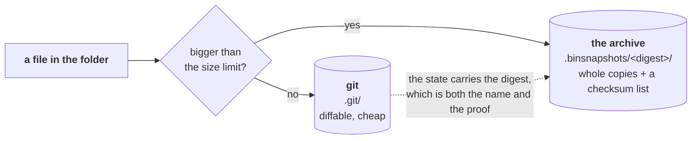
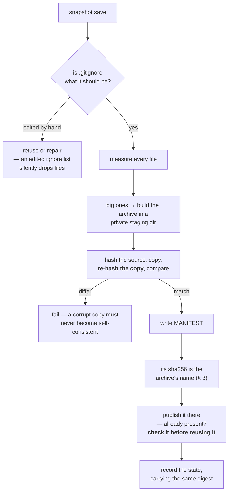

# Checkpointing — saving a calculation so you can always get it back

**Role:** contract
**Domain:** execution
**Companions:** [`running-a-job.md`](?doc=execution/running-a-job.md) § 6 — the
guide: what to type and what the buttons do, which this document never repeats;
[`job-contracts.md`](?doc=execution/job-contracts.md) § 6.1 — the file formats;
[`engines/stages.md`](?doc=engines/stages.md) § 7 — the folder being saved and the
two moments a save is offered;
[`project-layout.md`](?doc=execution/project-layout.md) § 6 — where the history
sits in the project tree; [`run-identity.md`](?doc=execution/run-identity.md) —
the id every state and tag carries.

A calculation lives in a folder: inputs, a relaxed geometry, a density matrix,
logs. Checkpointing takes a **snapshot of that whole folder** when you say so, and
any state you saved is one you can come back to — to rerun a stage, retune
and try again, or start over from it.

It is git underneath, with one addition: files too large for git are copied into
a side store with a checksum each, so a snapshot holds the big binaries too. You
never interact with either directly.

**This document is written for two readers.** §§ 1–10 are for anyone using
molbuilder — what it does, when to reach for it, and what the commands do, with
worked examples. §§ 11–15 are for anyone changing the code: the rules that must
not break, how to test them, and where the code is.

---

## 1. The goal

> ### The promise
>
> **A state you saved is one you can return to.** Come back to it, change what
> you like, run again — and save that as a new state if it is worth keeping.
>
> Every rule in this document exists to keep that sentence true.

**What was never saved was never promised.** That is not a loophole, it is the
shape of the thing: a snapshot is taken, not inferred, so the only states this
can return you to are the ones somebody decided were worth keeping. Where that
decision gets offered is § 9.

**Nothing else competes with the promise.** Not disk space, not speed, not
tidiness. If a rule here and a saving of disk ever disagree, the rule wins — a
folder that is cheap to store and wrong is worth nothing.

---

## 2. What checkpointing is not

- **It is not a backup system.** The snapshot lives inside the folder it is
  snapshotting. A deleted folder takes its history with it; copy the folder
  somewhere else for that.
- **It is not automatic.** Nothing is ever saved without you saying so (§ 9).
- **It does not decide what is worth keeping.** Point it at a folder and it
  saves the folder — all of it. Whether a benchmark's throwaway trials deserve
  keeping is decided by whoever runs the benchmark, by choosing what to point
  this at.
- **It does not run on the cluster.** Saving is a decision, and decisions happen
  where you are, not on a compute node.
- **It is not a way to move a calculation between machines.** It records
  history; `rsync` moves folders.
- **It is not a safety net for work you never saved.** A restore tells you what
  it is about to overwrite and then does it (A5). Nothing is stashed or set
  aside on your behalf.
- **It does not deal in files.** A state is the whole directory. Pulling one
  file out of the past is a different request with different tools — § 2.2 says
  which, and there are two of them because there are two stores.

### 2.0 One rule for you: use the verbs, not git

**A calculation folder is managed through `molbuilder snapshot`. Running bare
git commands in it is outside this contract.**

It *is* a git repository — that is how the snapshots are made — so nothing stops
you, and molbuilder does not try to. But git alone sees only half of it: the big
files live in the archive, which git is told to ignore, so a `git checkout` of an
older commit rewinds the text and leaves every large file exactly where it was.
The folder is then in a state no save ever produced, and **that mess is yours**.

Two things make this a fair deal rather than a trap:

- **The verbs cover the work.** Saving, going back, comparing, naming a state —
  § 5 is the whole list, and none of it needs git.
- **You will not be quietly fooled.** Every state carries the digest of the
  archive that belongs with it (I2b), so a folder pulled out of step is
  detectable: the big files on disk no longer match the record of the state the
  folder now stands at. A restore refuses and **names the files that differ**,
  and the panel shows them as unsaved. What it will not tell you is *why* — a
  file that differs looks the same whether git moved the text underneath it or
  you edited it yourself, and S8 says plainly that guessing there is worse than
  saying less.

### 2.1 What it decides, and what it does not

| | |
|---|---|
| **You choose** | *which folder* to save, and *when* |
| **Checkpoint chooses** | *how* each file is stored |
| **Checkpoint never chooses** | *whether* a file is stored |

That middle row is the only decision it owns, and it is mechanical: git is bad at
very large files, so those go somewhere else. A storage detail, not an opinion
about what matters.

> **This is not where the design started; it is what it learned.** A trajectory
> file (`*.MD`) sat outside every snapshot for months because it was *large* —
> the size was allowed to argue with the saving, and the size won. Nobody chose
> that; it followed from letting the two be weighed at all.

### 2.2 Reading one old file without moving anything

Both answers print and touch nothing, and **which one you need depends on the
store the file was in** — the one place in this document where that distinction
reaches you rather than staying an implementation detail.

**Small enough for git** — the deck, `task.json`, `run.json`, an `.XV`:

```bash
git show <state>:<path>
```

**Large enough for the archive** — a `.DM`, an `.HSX`, a `.TSHS`. Git cannot
show it, and the error says so plainly (`path '…' does not exist in '…'`). That
is not a gap: § 3 keeps large files out of every commit deliberately, so there
is nothing for git to have. The state names its archive, and the file is inside:

```bash
git show -s --format=%B <state>      # its `Manifest-SHA256:` line names the archive
cat .binsnapshots/<digest>/<path>    # …and the file sits there under the same path
```

> **This section exists because the document was wrong about it.** *"To read
> one old file, `git show <state>:<path>` is safe"* appeared here and in four
> other places with no qualification — sending somebody holding a 2 GB `.DM` to
> a command that cannot ever produce it, for exactly the class of file this
> system was built to handle. The advice was right about the half it was
> thinking of and silent about the other. A test now pins both halves, so the
> sentences and the behaviour cannot drift apart again.

---

## 3. The overall shape

Two stores. Every file is in exactly one of them.



**The archive is named by what it contains, not by the state it belongs to.**
Its directory is the sha256 of its own MANIFEST. That one value does three jobs
at once: it *locates* the archive, it *proves* the archive (I2b), and it makes an
archive impossible to modify without becoming a different archive (I1).

Three things follow, and each removes a problem rather than adding a mechanism:

- **The archive can be written before the state is recorded**, because it no
  longer needs the state's name. There is no moment where a state exists with
  nothing beside it (§ 6).
- **Two states with the same big files share one archive.** Not a copy avoided —
  the *same directory*, referred to by both.
- **A save that is interrupted and re-run writes the identical path with the
  identical bytes**, so a repeat is harmless by construction rather than by
  locking (S9).

**Which store, by measuring — not by file type.** A file over the limit goes to
the archive; everything else to git. Extensions are not consulted, because a name
is not the property being tested: a 4 GB `.EIG` nobody listed would be committed,
and an empty `.DM` somebody did list would be archived.

The engine entries in the config (§ 4) name families that are *always* large, so
those skip the measuring. That is an effort saving and nothing else — **a hint
can make a save faster; it can never make it store less.**

> **A file over the limit is never handed to git at all**, and that is stronger
> than it sounds. `git add` writes a blob the moment it stages a file, so a big
> file merely *unstaged* afterwards has already left its bytes in `.git/objects`
> — on every save, for a file this diagram says lives elsewhere. The save
> excludes them by pathspec instead, so "exactly one store" is true of what is
> on disk and not only of what git's index reports.

### 3.1 A real folder, after two saves

```text
BDT_Au_relax_Au38C6H4S2/
├── .git/                            the text history
├── .gitignore                       generated — lists exactly what the archive holds
├── .binsnapshots/                   the archive
│   ├── a19f0b72…c8e5/                 named by the sha256 of its own MANIFEST
│   │   ├── 01_coarse/run-0/BDT_Au_relax_Au38C6H4S2.DM
│   │   └── MANIFEST.do_not_edit       what is in here, and a sha256 each
│   └── 4d7ba930…1f62/
│       ├── 01_coarse/run-0/BDT_Au_relax_Au38C6H4S2.DM   ← unchanged since the
│       │                                                   save above, so this is
│       │                                                   a hard link: no disk
│       ├── 02_tight/run-0/BDT_Au_relax_Au38C6H4S2.DM
│       └── MANIFEST.do_not_edit
├── task.json                             ┐
├── BDT_Au_relax_Au38C6H4S2.fdf.template  │  small → git
├── 01_coarse/                            │
│   ├── BDT_Au_relax_Au38C6H4S2.fdf       │
│   └── run-0/                            │
│       ├── BDT_Au_relax_Au38C6H4S2.out   ┘
│       ├── BDT_Au_relax_Au38C6H4S2.XV      small → git
│       ├── run.json                        small → git
│       └── BDT_Au_relax_Au38C6H4S2.DM      large → the archive
└── 02_tight/…
```

And a MANIFEST is three tab-separated columns — sha256, bytes, path — sorted by
path (`job-contracts.md § 6.1` gives the rules and why each one is there):

```text
7ef4c645…344a→8388608→01_coarse/run-0/BDT_Au_relax_Au38C6H4S2.DM
36c54395…a572→8388608→02_tight/run-0/BDT_Au_relax_Au38C6H4S2.DM
```

*(`→` is the tab; it is drawn here only so you can see it.)*

**The path is relative to the folder root, not a bare filename.** That is what
lets one archive hold a `.DM` from every stage without them colliding. Every part
is checked so a restore cannot be steered out of the folder, nor into the
history it is restoring from: no leading `/`, no `..`, and no component naming
a store. Other hidden files are ordinary files and are stored like any other —
S1 exempts no category but the two stores.

**Identical content is stored once.** Two saves that both contain an unchanged
`.DM` record the same sha256, so the second links to the first's file rather than
copying it. The archive still holds a real file at that path, so nothing reading
it can tell.

---

## 4. The pieces

| Piece | What it is | Who writes it |
|---|---|---|
| **git** | the history of everything small | `snapshot save` |
| **the archive** — `.binsnapshots/<digest>/` | whole copies of everything large, named by content | `snapshot save` |
| **`MANIFEST.do_not_edit`** | what is in one archive, with a sha256 each — the name is the reminder (I2b) | `snapshot save` |
| **`.gitignore`** | what git skips — *generated*, so it matches the archive exactly | `snapshot save` only |
| **the config** | the size limit and the per-engine hints | you, in molbuilder's config |
| **`molbuilder snapshot …`** | the verbs you type (§ 5) | — |
| **`Repo`** (`molbuilder/checkpoint.py`) | the class every surface goes through | — |

**The config is molbuilder-wide, not per folder.** It sits in `molbuilder.json`
with every other setting, and it holds the size limit and three entries:
**`generic`** — save everything, choose the store by size — plus **`siesta`** and
**`pyscf`**, which name the file families that are always large so those can skip
the measuring. A caller may name its engine to get the matching entry; with no
name `generic` is used, which is always correct and merely measures more.

**The size limit is 10 MB, and you can change it.** That is the whole of the
decision § 3's diagram turns on, so it is written here as a number rather than
left for whoever writes the code to invent. It is a *storage* threshold and
nothing else — moving it changes where a file is kept, never whether it is kept
(§ 2.1).

> A per-folder config would let one folder behave differently from another for no
> recorded reason. That is a trap, not a feature.

> **The door is shut rather than merely unused.** A `checkpoint` section placed
> in a project- or calculation-scope config is **refused**, naming this rule —
> not read and quietly dropped. A section that is parsed, validated and then
> ignored looks effective, and the folder is then saved under rules nobody
> applied. The accessor takes no directory argument at all, which is what stops
> the per-folder scope coming back the next time a caller has one in hand.

---

## 5. Using it

Three ideas, and nothing else to learn.

| | |
|---|---|
| a **state** | a saved snapshot of the whole folder. It has an id, a note you wrote, and the state it came from |
| a **tag** | a name you give a state so you can find it again |
| **where you stand** | the one state the folder is currently at. `init` puts you at the first state, `save` puts you at the one it just made, `restore` puts you at the one you asked for |

**Where you stand is what makes the other two work**, so it is worth thirty
seconds even though you never type it:

- **It decides what "unsaved" means** — the folder differs from the state it
  stands at. Nothing is ever compared against the *newest* state, which is why
  going back does not make the whole folder look modified (§ 7, A5).
- **It decides where a new state hangs.** `save` records where you stood as the
  new state's parent, then moves you onto it. That is the entire branching
  mechanism (§ 7.1) — you never declare a fork, you just save from wherever you
  are.

```bash
# once, in the calculation folder
molbuilder snapshot init

# save the folder as a state -- the note is required, and § 5.1 says why
molbuilder snapshot save -m "stage 1 converged, 41 steps -- before retightening"

# what have I got?
molbuilder snapshot list

# name one you know you will come back to
molbuilder snapshot tag stage1-good -m "geometry I trust"

# go back to a state -- by id or by tag.  The whole folder returns.
# Anything unsaved here is named first, and you are asked.
molbuilder snapshot restore 4f9ca71
molbuilder snapshot restore stage1-good
molbuilder snapshot restore 4f9ca71 --force   # answers yes, for a script

# which files count as "big" here
molbuilder snapshot config
```

**A state's id is permanent and never reused.** It is git's own commit hash, so
`restore 4f9ca71` means the same thing next month as it does today. Nothing
assigns it, nothing stores it, and nothing can renumber it — a second numbering
scheme would be a second identity for one thing, and two identities for one thing
eventually disagree.

> **Two hashes, two jobs, and it is worth keeping them apart.** A **state's id**
> is git's commit hash and is a *name*. The **archive's digest** is a sha256 we
> compute and is a *proof* — what the archive must contain (I2b). Nothing in this
> contract depends on which hash git uses for the first, so if git ever changes
> its default, none of this cares.

### 5.1 The note, and why it is required

A history is only useful if you can pick from it a month later, and everything
you read when you come back is something you wrote:

```text
molbuilder snapshot list

  4f9ca71  set up                                          09:15
  b2e033d  stage 1 converged, 41 steps -- before            11:40   from 4f9ca71
           retightening                            [stage1-good]
  7a1c0e4  stage 2 at 200 Ry -- forces worse than stage 1   14:02   from b2e033d
  e30bb92  stage 2 at 300 Ry -- forces now below 0.02       16:30   from b2e033d
```

**The question you bring to this list is never *where was I*** — the list answers
that — it is **why did I stop here, and what was I about to do?** So a generated
note (`saved 2026-08-08T14:02:11Z`) is worse than none: it answers neither,
it repeats the timestamp column, and five of them in a row is a list you cannot
choose from. A caller offering a save may **draft** the note, since it knows what
it is about to change; you confirm or edit it (§ 9).

**The last two states are visibly alternatives** — both say `from b2e033d`. That
is the whole mechanism for branching, and it is covered in § 7.1: nothing was
declared, nothing was named, and both attempts are intact.

**`list` answers cheaply, and says so.** It compares size and timestamp, not
content, because it runs constantly and nothing moves while it does (§ 7.2).
`--check` compares content when you want certainty now; a save or a restore
always does, regardless of what a list last said.

**`restore` is a rewind, not a fetch.** It returns the *whole folder* to that
state — it does not pull one file out. To read a single old file without moving
anything, § 2.2 gives the two commands — one per store, because a large file is
in no commit and git cannot show it.

> **There is no `--no-binaries`, on any surface** (A4). It rewound the text and
> left every big file untouched — the mixed state S8 is about, reached on
> purpose instead of by accident. The HTTP route *refuses* `include_binaries`
> rather than ignoring it, because a caller that still sends it believes it is
> getting a text-only restore.

---

## 6. Saving, step by step



**The archive is written before the state is recorded.** It is named by its own
content (§ 3), so it does not need the state's name and does not wait for it. The
worst an interruption leaves behind is an archive nothing points at yet — no lost
data, and the next save writes the identical bytes to the identical path.

**Why the copy is re-hashed rather than trusted.** If the MANIFEST's checksum came
from the copy alone, a copy corrupted on the way to disk would be
*self-consistent* — it would verify against its own bad checksum forever and be
restored as truth. Hashing the source and re-hashing the copy makes that
impossible.

**An archive that is already there is checked before it is reused, not
assumed** — and the check is the *cheap* one: the record's own digest,
then existence and size. A save that adopted a damaged archive purely on
the strength of the name recorded a state the user was told they could
return to and could not.

> **Why cheap here and exact at a restore — the model is git's own.**
> Corrupt a loose object and `git commit` exits 0 without looking, while
> `git checkout` answers *"inflate: data stream error"* and restores
> nothing: git verifies on the **read**, where zlib gives it away free,
> and in `fsck`. Our archive is raw bytes, so *our* read cannot be free —
> which is exactly why § 7 has the restore verify explicitly. That check
> **is** our inflate check. Putting a full re-hash on the save as well
> would double the commonest save there is — a tweak to an input, with
> gigabytes of density matrices untouched — to catch one save earlier the
> damage a restore refuses anyway. What the cheap check still buys is the
> *moment*: at save time the files that could rebuild the archive are
> still on disk.

**Content reused by hard link is checked in full**, because that is a
different act: a link into a *new* archive is not inheriting old damage,
it is minting a record that is false the moment it is written. A link
avoids the copy, not the check.

Where either check fails the save is **refused**, and the way out is cheap
precisely because the archive is content-addressed: delete it and save
again, and it is rebuilt byte-identically from the files still in the
folder.

**Publishing is *create if absent*, never *overwrite*.** An archive at a given
name always holds the same content, so there is nothing to replace and nothing to
move aside. Build in a staging directory and rename it into place all the same:
the rename is what makes a directory appear complete or not at all, so a reader
never meets a half-written archive (A1).

**That staging directory is private to the saver, never `<digest>.tmp`.** Content
addressing makes the *final* name safe to race for — same content, same digest,
same bytes — but it makes a derived temporary name **collide**, because two
savers of the same content agree about that too. Sharing it, one deletes the
directory the other is still filling, and the survivor can publish a half-copied
archive under a name that promises the opposite. Give each saver its own
directory and the only shared moment is the single atomic rename, which already
handles "somebody got there first" (S9).

---

## 7. Restoring, step by step


**Two refusals, then one question, and the order is the rule.** The refusals
come first because they are about the *target* — an unknown ref or a corrupt
archive means the operation cannot happen at all, and nobody should be asked to
accept a loss for an operation that then fails for an unrelated reason. The
question comes last, immediately before the first byte moves.

**The question is answered by you, and the answer is honoured.** It names what is
unsaved and says plainly that **it will be lost unless you save it first**.
Nothing is rescued, stashed, renamed or set aside. If you say yes, it is gone —
you called `restore` without calling `snapshot save`, and that is a choice the
system spells out rather than second-guesses (A5).

**What must never happen is a half-restore**: text from one save and binaries
from another, a state no save ever held and nothing can diagnose afterwards.
That is why the archive is verified *before* the text is touched.

### 7.1 Going back and trying something else, with the original intact

This is the thing the whole design exists for, so it is worth walking slowly.

You have run two stages. Stage 2 used a 200 Ry mesh and the forces came out
worse than you wanted. You want to go back to the geometry stage 1 produced and
try 300 Ry instead — **without losing the 200 Ry attempt**, because it may turn
out to have been the better answer.

```bash
# 1. Keep what you have.  It costs nothing and you cannot get it back later.
molbuilder snapshot save -m "stage 2 at 200 Ry -- forces worse than stage 1"

# 2. Go back to stage 1's state.  The whole folder returns to that moment.
molbuilder snapshot restore b2e033d

# 3. Retune, rerun, and keep the result.
molbuilder snapshot save -m "stage 2 at 300 Ry -- forces now below 0.02"
```

```text
molbuilder snapshot list

  4f9ca71  set up                                          09:15
  b2e033d  stage 1 converged, 41 steps                     11:40   from 4f9ca71
  7a1c0e4  stage 2 at 200 Ry -- forces worse than stage 1  14:02   from b2e033d
  e30bb92  stage 2 at 300 Ry -- forces now below 0.02      16:30   from b2e033d
```

**Both attempts are there, and the list says they are alternatives** — they share
a parent. You declared nothing, named nothing, and ran no extra command.

**Why the original is intact: nothing is ever rewritten.** A state, once saved,
is never modified or removed. Restoring `b2e033d` changed the *folder*; it did
not touch `7a1c0e4`, which still holds every byte of the 200 Ry attempt. Going
back to it is one more restore.

**Where the fork comes from: every state records the state it came from.** Step 3
saved while the folder stood at `b2e033d`, so the new state's parent is
`b2e033d`. That is the entire branching mechanism — no branch verb, nothing to
name, nothing to clean up afterwards. The shape of the history is a consequence
of what you did, not a thing you had to declare in advance.

**Comparing them later** is `restore 7a1c0e4`, look, `restore e30bb92`, look.
Neither is more "real" than the other, and neither can shadow the other. If one
turns out to be the one you care about, **tag it** — that is what tags are for,
and it is how you avoid hunting through notes a month from now.

> **The one thing to get right is step 1.** Restoring is not destructive to the
> *history*, but it does overwrite the *folder*. Anything you had not saved when
> you typed step 2 is named to you, once, and then gone if you say yes (A5).
> Saving first is the whole of the discipline.

**And nothing you save can become unreachable** — not after any sequence of
restores, not ever. Every state stays listed and restorable for as long as the
folder exists (A6). That is what makes it safe to wander.

### 7.2 How much is checked, and when

Two questions wear the same words, and they deserve different answers:

| | asked | answered from | being wrong costs |
|---|---|---|---|
| **Is anything unsaved?** | constantly — every folder you open, every list | **size and timestamp** | a sentence on a screen |
| **What will this destroy?** | once, immediately before the folder changes | **content** | data |

**A folder holds gigabytes of density matrices, and the panel reads it every
time you enter the directory.** Hashing all of that to draw a badge is a cost
the badge does not earn, and it would be paid over and over for an answer nobody
acts on.

**What the cheap read still sees.** Most changes announce themselves without any
file being opened, because a different size is already an answer: a run that
grew a density matrix, a file that appeared, a file that was deleted. Its one
blind spot is a rewrite to *exactly the same size* inside the same second as the
save.

> **Why one second, and why it is resolution rather than slack.** A state's
> timestamp is whole seconds; a file's is not. A file saved at 12:00:00.3 sits
> in a state that records 12:00:00 — so comparing them directly calls the file
> newer than the state that just saved it, and the folder would read *unsaved*
> the instant after a save. That is the ordinary flow, not an edge case.

**That blind spot cannot lose anything, and that is the whole argument.** A
status call moves no bytes, so being briefly wrong is a sentence that corrects
itself the next time something real happens. The operations that *can* lose
something never trust it:

| | |
|---|---|
| **`save`** | checksums every large file, always — it has no choice, since the digest **is** the archive's name (§ 3) |
| **`restore`** | verifies the target archive (I2), then asks what is unsaved **by content**, so a folder called clean a second ago is still stopped |
| **a Refresh** | asks the exact question on demand, for when you want certainty *now* rather than the system paying for it continuously |

**The depth only concerns large files.** Everything in git is compared by git,
which does this same dance itself and is not ours to second-guess. "Cheap" here
means *the archive is not re-read*, and nothing else.

**And an unreadable timestamp means check, not assume.** If a state's time
cannot be parsed, the file is hashed rather than declared changed — slower,
never wrong, and never a false alarm that trains people to ignore the real one.

> **Say what is happening before it happens.** Checksumming gigabytes takes
> time, and a pause nobody explained reads as a hang. The verbs announce the
> slow part — *"verifying the archive, then checking what is unsaved here…"* —
> so a wait is understood rather than endured.

---

## 8. Why this matters far more in a flat folder

In the **nested** shape every stage and attempt is on disk at once. Going back to
stage 1's geometry means opening `01_coarse/run-0/`. A saved state there is
protection against loss and a way to branch — valuable, not load-bearing.

**In the flat shape it is load-bearing.** The restart files are unsuffixed and
shared *by design* — that is exactly what lets stage 2 continue from stage 1 —
which means stage 2 **overwrites** them.

> **Without saved states, a flat folder can only move forward.** With them it can
> return to any state it was saved in and continue from there. That is not a
> convenience on top of the flat shape; it is what makes the flat shape usable for
> iterative work at all.

Two consequences worth saying out loud:

- **Saving before each stage is not housekeeping in a flat folder — it is the
  save point.** Miss one and that state is gone, because nothing else on disk
  holds it.
- **Going back costs the present unless you save it first** (§ 7.1). The nested
  shape never poses that question, because it never had to overwrite anything.

---

## 9. Who decides to save, and when you are asked

> **A save is always an explicit act. Checkpointing never initiates one.**
> It takes a snapshot when told to, and that is the whole of its part.

**The decision belongs to whatever is about to change the folder.** A script
setting up a run knows what it is about to overwrite, whether the run will start
fresh or continue from what is already there, and therefore whether this moment
is worth a state you could come back to. **Checkpointing knows none of that and
should not** — to it a folder is files, and *cold* and *warm* are the run layer's
words for how a deck is written, not properties of a snapshot.

So the caller owns three things: **noticing** the moment, **asking** you, and
**drafting the note** — it knows what it is about to change, so it can propose a
sentence rather than leaving you to invent one. You confirm or edit it. Nothing
is saved until you say so.

**The moment is `prep`, because prep is the change.** When prep is about to
rewrite a folder that already holds results, it says what will change and offers
to save first. You answer.

> **What the confirmation buys you** is the promise in § 1: this state is one you
> can return to, retune, and run again from — and save *that* as a new state if
> it earns one.

| | |
|---|---|
| **Where it asks** | interactive `prep`, when the target already holds results |
| **Who decides** | you, every time |
| **Non-interactive** (`--yes`, a script) | proceeds **without** saving and **says so** — it may not silently pick either way |
| **The last stage** | nothing asks, because nothing follows. A surface showing a finished, unsaved run should say it is unsaved |

**Never at run or submit time**, which may be a queued job — a prompt would block
a queue, and submitting starts something new rather than changing something that
exists. **Never on the compute node**, which would need git there (I4).

**Something already watches the run, and it is not this.** `mb_monitor.py` sits
beside the job, follows the launcher's PID so it knows when the run really ended,
reads the outputs, and can notify you — webhook, email, whatever you wire in. So
nobody has to be at the cluster at 3am. **What it must not do is act.** It
observes and tells; it never decides and never changes the calculation. Saving is
a decision, and decisions are yours.

---

## 10. Worked examples

### 10.1 Several attempts from one state

Going back once is § 7.1. Going back to the *same* state repeatedly is the
ordinary way a parameter gets swept by hand, and it needs nothing extra:

```bash
molbuilder snapshot restore b2e033d
# run at 300 Ry
molbuilder snapshot save -m "stage 2 at 300 Ry -- forces below 0.02"

molbuilder snapshot restore b2e033d
# run at 400 Ry
molbuilder snapshot save -m "stage 2 at 400 Ry -- no better than 300, 3x slower"
```

```text
  b2e033d  stage 1 converged, 41 steps                     11:40   from 4f9ca71
  7a1c0e4  stage 2 at 200 Ry -- forces worse than stage 1  14:02   from b2e033d
  e30bb92  stage 2 at 300 Ry -- forces below 0.02          16:30   from b2e033d
  1f8d5c0  stage 2 at 400 Ry -- no better, 3x slower       18:05   from b2e033d
```

Three attempts, one parent, none of them privileged and none of them lost.

**This is where tags earn their place.** Four ids and four notes are readable
today and a puzzle in a month. Tag the one you decided on:

```bash
molbuilder snapshot tag chosen-mesh -m "300 Ry: the cheapest that met the force tolerance"
```

and `restore chosen-mesh` works forever, whatever else you try afterwards.

### 10.4 From Python

```python
from molbuilder.checkpoint import Repo

repo = Repo("projects/BDT-Au/optimization/bdt-relax")
if not repo.initialized:
    repo.init(engine="siesta")          # engine picks the always-large hints

state = repo.save(note="stage 1 converged, 41 steps -- before retightening")
print(state.id if state else "nothing changed")

for s in repo.states(limit=5):
    print(s.id[:7], s.note, "from", s.parent[:7] if s.parent else "-")

repo.restore("stage1-good")             # a tag or a state id; text + binaries
```

`save()` returns `None` when there was nothing to save, and **raises when no note
is given** — the note is not defaulted (L3). `restore()` raises rather than
half-completing (§ 7), and every state it returns stays listed afterwards (A6).

## 11. The rules

Each one names what it prevents and how to test it. **Status is in § 12.**

### Everything is saved

**S1 — every regular file is in git or in the archive: never both, never
neither.** **The two stores are the only exclusions** — `.git/` and
`.binsnapshots/` — because a store cannot contain itself. That is the whole list,
and it is a consequence rather than a policy: nothing was judged unworthy, the
two directories simply cannot hold themselves.

**No other category is exempt, including the ones it is tempting to exempt.**
Editor leftovers, scratch that only exists mid-run, caches an engine could
rebuild — all stored. Two reasons, and the second is the one that matters:
storing them costs a little disk, which § 1 has already ruled is never an
argument; and every exemption is a judgement about what is worth keeping, which
§ 2.1 says this system does not make. A snapshot of *most* of a folder is not a
snapshot of the folder.

> **Any future exception belongs here, in this list, with its reason** — never in
> a constant inside a module. A file excluded by code nobody agreed to is
> indistinguishable from a file lost.

*Symlinks are outside this, and "regular" is load-bearing.* A stage links its
deck and the shared pseudopotentials rather than copying them, so a saved tree is
full of links. A link has no content of its own — the real file is stored once,
wherever it lives — and recreating the layout is what a restore does anyway.

- **Fails as:** both → a multi-gigabyte blob in git history forever. Neither →
  the file is in no snapshot, and a restore silently does not bring it back.
- **Test:** walk every regular file and assert `archived` ≠ `tracked`, with
  `.git/` and `.binsnapshots/` the only excluded paths. **No allow-list** — a
  file is stored or the test fails. The walk must not reuse the same skip rule
  the classification uses, or it can only ever agree with it.

**S1a — `.gitignore` is generated from the classification, never hand-kept
beside it.** One *source*, not merely one writer.

- **Fails as:** a hand-kept list answers to no rule. That is exactly how `*.MD`
  came to be ignored with nowhere else to go.
- **Test:** assert the generated `.gitignore` contains **nothing that is not an
  archive pattern**. That check catches the whole class, and no fixture can be
  too short for it.

**S1b — which store a file goes to is decided by measuring the file.** Its size
is the property being tested, so its size is what is read. Names may only be
used to *skip* a measurement for a family that is always large (§ 3) — never to
decide the answer.

- **Fails as:** the two errors are not symmetric, and only one of them is
  survivable. A large file no pattern names is committed, and git carries that
  blob forever. A small file a pattern names is archived, which costs a little
  disk and nothing else.
- **Test:** an unlisted file above the limit and an unlisted file below it, each
  asserted into the right store — no pattern involved in either direction.

**S1c — the classification has one home, and it is molbuilder's config.** One
`generic` entry plus optional per-engine hints, outside every calculation
folder. A caller may name its engine; with no name `generic` is used, which is
always correct.

- **Fails as:** a per-folder copy makes two folders behave differently with
  nothing on disk explaining why, and makes the classification a thing a person
  can edit between a save and a restore — which is I2c.
- **Test:** two folders under different engines produce the same store decision
  for the same file, and no calculation folder contains a classification file at
  all.

### The record can be trusted

**I1 — an archive's content is never modified once written**, and since § 3 the
name enforces it rather than the rule asking politely. A directory is the sha256
of its own MANIFEST, so changed content is a *different* archive at a *different*
path; the old one is still there, still correct, still named by what it holds.
There is no write that can modify an archive in place — only a write that creates
another one.

Re-publishing an archive that already exists is therefore a no-op rather than a
rebuild, and there is no operation anywhere that edits one in place. There is
also no legacy archive form to convert from: this is the first draft, so the
format has no history and needs no migration
([`job-contracts.md`](?doc=execution/job-contracts.md) § 6.1).

**I2 — a MANIFEST is authoritative for its archive.** For every entry: the file
exists, its size matches, its sha256 matches.

- **Test:** run it over every archive in a folder. This is the single most
  valuable test in the system.

**I2a — a restore is decided by what the save recorded, never by
configuration.** Verified in code: after `Repo.restore` resolves its target,
everything it does is driven by two records — `git ls-files` for the text and
`verify_archive`'s MANIFEST for the big files. No config, no glob list, no
engine name, and no size limit is consulted between the target resolving and the
last byte landing.

- **Why it matters:** the classification lives outside the folder and can be
  edited at any time. Because a restore never re-derives, every archive already
  written stays readable — an edit to one file rather than a migration of every
  archive in existence.
- **Test:** save, then change the engine, empty the hint list, delete the config
  outright — and assert the restored tree is byte-identical either way.

**I2b — every record the history leans on is tamper-evident.** Two records, and
they fail in opposite directions:

| record | decides | protected by |
|---|---|---|
| `MANIFEST` | what a **restore** returns | a sha256 **anchored outside itself** |
| `.gitignore` | what the **next save** even sees | **regeneration** — the correct content is computable |

*The MANIFEST records facts that cannot be recomputed, so it needs a digest.
`.gitignore` records a derivation, so the derivation is the check* — and
regeneration says which line is wrong, where a digest could only say that
something is.

> **Why `.gitignore` does not get a digest, when the instruction was to give it
> the same check.** A stored digest cannot catch the attack it would be for.
> `.gitignore` is *tracked*, so an uncommitted edit is already visible; the real
> hazard is an edit that **rides into the next save** — and a save computes the
> digest of whatever it finds, so it would faithfully record the tampered file
> and call it correct from then on. The only check that survives that is
> comparing against what the generator *would* produce, which is the standard
> treatment for generated files everywhere (`gofmt -l`, `terraform fmt -check`,
> a committed-codegen CI gate). Same goal, and the only mechanism that reaches
> it. **This is a deliberate deviation from "a similar check", recorded here so
> it is a decision and not a substitution.**

- **Fails as:** delete a MANIFEST line and that file is simply not restored — it
  reads exactly like "this archive never held it". Change a sha *and* the file to
  match and a restore returns the wrong bytes **and reports success**. Add
  `*.XV` to `.gitignore` and the next save stores no `.XV` at all while looking
  perfectly healthy.
- **Test:** the three MANIFEST edits above must all be refused, naming the
  *record* as what failed. For `.gitignore`, edit inside the marked section as
  well as outside — anyone who knows about the markers will edit inside them.

#### Where the MANIFEST's digest lives: a trailer on the commit

```text
Manifest-SHA256: a19f0b72…c8e5
```

**One value doing two jobs.** Since § 3 names an archive by the sha256 of its own
MANIFEST, this trailer is simultaneously the **pointer** — where the archive is —
and the **proof** — what it must contain. There is nothing to keep in step,
because there is only one thing.

**Why the commit and not a tag or a note: the commit sha covers the message.**
Tamper with the digest and you get a different commit, which points at an archive
that does not exist while the real one sits unreferenced. The anchor inherits
git's own hashing rather than needing protection of its own. A tag can be moved
or deleted; a git note lives on a mutable ref and can be rewritten in place
leaving nothing behind; a record chained into the next save needs a next save,
and the last save of a project never gets one. A trailer is also the
ordinary git idiom for machine-readable metadata — `Signed-off-by`, Gerrit's
`Change-Id` — so it is greppable and nothing has to parse prose.

**Nothing is circular.** A MANIFEST's content is three columns of `sha256 bytes
key` and contains no commit sha, so the whole chain runs forward:

```text
hash the big files → build the MANIFEST → sha256 it → that is the archive's name
  → publish the archive        (it needs no commit)
  → commit, carrying the same digest
```

**Only the digest, never the record.** Git would hold the whole MANIFEST
comfortably — a 500-file archive is ~45 KB and a commit message has no practical
limit — but a second copy of a record is a second thing that can disagree with
the first.

**Verification has two outcomes, not three: it matches, or it is refused.**
Every state carries a trailer from the first one onwards, so a state without one
is not a legacy case to tolerate — it is damage, and it is named as such.

> **A commit that archived nothing still carries a trailer** — the digest of an
> empty MANIFEST, which is a fixed, well-known value. That is what makes *"this
> save had no big files"* and *"this save's archive is gone"* two different
> observations instead of one ambiguous silence, and it is what retires the
> guesswork in § 12.

> **Records are named so nobody mistakes one for a setting.** `MANIFEST` looks
> like a file a person may reasonably adjust; `MANIFEST.do_not_edit` does not.
> This buys nothing against deliberate tampering — that is the digest's job — and
> everything against somebody tidying a directory. `.gitignore` cannot take the
> suffix, since git requires that name. The name is chosen once, here, and
> nothing has to read an older one.

**I2c — the warning is measured against the records, not against the config.**
I2a made the *action* config-free; this is its other half.

**What the warning names is A5's answer, not a second one** — everything that
differs from the state you stand at: changed, added and deleted alike. This rule
adds exactly one thing to that, and nothing else: *where those differences are
measured from*. For big files it is **the MANIFEST of the state you stand at,
unioned with what is big on disk now** — the MANIFEST because it is the record
of what that state held, and what-is-big-now because that is the only way a file
created since the save is noticed at all. Never the glob list.

> **An earlier draft said the warning "takes two of them": intersect what is
> unsaved with the MANIFEST of the state you are restoring to, and name a file
> only when it is in both.** That is wrong, and it loses data. A 300 MB `.DM`
> you produced and never saved is in no MANIFEST anywhere, so the intersection
> is empty and the warning says nothing — and the restore then deletes it,
> because A5 removes what the target did not hold. It was written in the same
> sitting as A5 and never checked against it: A5 had already answered *what is
> named*, and this rule reached past its own question into *how to compute it*
> and got the computation wrong. **A rule says what must be true; it does not
> say how to work it out.** That is why this one now states the requirement and
> leaves the answer to A5.

- **Fails as: you are told the wrong thing and agree to it.** A `.DM` is
  archived while `*.DM` is classified big. The classification is later narrowed
  — one edit to molbuilder's config, which is the one place it lives (S1c). You
  modify that `.DM` and restore an earlier state. The warning does not mention it, because the glob list no
  longer matches it; the copy overwrites it anyway, because the MANIFEST still
  lists it. **Losing it is your call to make** (A5) — being asked a question
  that omits it is not.
- **Test:** archive a big file, narrow the classification so nothing matches it,
  modify it, restore an earlier state — the warning must still name that file.
  Then, separately, create a big file that no MANIFEST mentions and assert
  `save` still sees it.

**L8 — a saved attempt never differs afterwards.** This is I2 pointed at a
directory the layout says is frozen. *Hierarchical only* — a flat folder's
`<id>.DM` is *expected* to change every stage, so there a difference is news
rather than a violation. Do not let a check written for one shape fail the other.

### A save or a restore completes, or does not happen

**A1 — archiving is build, verify, publish** (§ 6). *Nothing is deleted:* an archive at a given name always holds the same content, so publishing is *create if absent* and there is never an old one to remove.

- **Test:** kill the process between each step; afterwards the archive set is the
  old one or the new one, never a mixture.

**A2 — a restore verifies before it changes anything** (§ 7), in that order.

- **Test:** corrupt one byte of the target archive and attempt a restore — it
  refuses, and the folder is byte-identical to before.

**A3 — the save precedes the change it protects.** A pre-produce save is
committed *before* the first new file is written.

- **Test:** interrupt a produce between the save and the swap: the commit exists
  and `git status` is clean — no new file reached the folder.

**A4 — a restore returns the whole folder, or it does not happen.** There is no
partial restore. Text and binaries are one state; returning half of one save and
keeping half of another produces a folder no save ever held, and § 1's promise
is about *states*, not about files.

**`snapshot restore --no-binaries` was that partial restore, on three surfaces**
— the CLI flag, `include_binaries` in the `/api/checkpoint/restore` body, and
the Python keyword — and it did not merely skip the copy: both remaining
protections sat inside the same conditional, so it also skipped the
dirty-binary gate and the archive verification. It is gone from all three.

*Removed rather than documented.* The one use it plausibly served — reading an
old input without disturbing the present — is § 2.2's pair of read commands,
which touch nothing at all. A verb that produces a state the contract calls a
hazard cannot be kept because it is occasionally convenient.

- **Fails as:** exactly S8, minus the excuse. There the user typed a git command
  that means something else everywhere; here molbuilder offered it.
- **Test:** no surface accepts a request for a text-only restore — the CLI has
  no such flag and rejects it as an argument, and the route answers 400 rather
  than dropping the field.

**A5 — a restore makes the folder equal the target state exactly, and warns
first about anything that will be lost.** It does not refuse, and it does not
rescue.

**Unsaved means the folder differs from the state it stands at** (§ 5) — never
from the newest state. Three shapes, and the warning names all three:

| | |
|---|---|
| **changed** | the state held a file at this path — **in either store** — and what is on disk now differs from it |
| **added** | the state held no file at this path, in either store |
| **deleted** | the state held a file at this path, in either store, and the folder no longer has one |

All three are gone once the folder is made equal to the target, so all three are
named, and `--force` — or a `yes` — accepts all three at once.

**Which store held it is not one of the three questions.** A file that crossed
the size limit without its content changing has not changed: the state still
holds those exact bytes, and restoring gives them back. Move the size limit and
a folder nobody touched would otherwise light up as unsaved — a warning that
fires when nothing is wrong, which § 7.2 says is how people learn to ignore the
one that matters.

**Files that are merely absent from the target are removed without a warning,
because that is not a loss.** Restore stage 1 while standing at stage 2 and
stage 2's outputs leave the folder — they are still in the state that holds
them, and restoring it brings them back. Warning about a non-loss is how people
are taught to stop reading warnings. The alternative is also worse than untidy:
a stage 2 `.DM` left lying in a folder that claims to be stage 1 is exactly the
file a later run picks up without being asked to.

**Exactness costs time, so it is spent where being wrong costs data.** A
*display* is answered from size and timestamp; an *operation* from content.
§ 7.2 is the whole of that rule, and this one depends on it: the warning below
is an operation's question, so it is always answered exactly.

**Checkpointing is not responsible for work you did not save.** Calling
`restore` without calling `snapshot save` is a decision, and the answer is
yours. There is no stash, no move-aside, no automatic save-before-restore, no
`.orig` copies — each of those owns a decision it should not, and each leaves
debris a later restore has to reason about.

*A state is the whole directory.* This deals in directory states, not files, so
"keep this one file while rewinding the rest" is not a smaller request than a
restore — it is a **different** one, and the tools for it are § 2.2's two read
commands, or a second folder.

- **Fails as, in both directions:** a refusal makes the user hand-delete files
  to get past it, which is worse than the loss they had already accepted. A
  silent rescue leaves the folder holding something no save produced (A4, S8).
- **Test:** with an unsaved edit, an unsaved new file *and* a deleted one, a
  non-interactive restore stops and changes nothing while naming all three;
  `--force` completes; afterwards the folder equals the target state exactly,
  with no rescue copies and no leftovers from where you stood.

**A6 — every state you saved stays listed and restorable, forever.** Going back
and carrying on is the ordinary way to run an experiment (§ 7.1), and no sequence
of restores may make an earlier state unreachable. A saved state disappearing on
its own is § 1 failing outright.

*The hazard is real and it is git-shaped, which is why the rule is stated in
states rather than in git.* Saving while the folder sits at an old state, with
nothing referring to the result, leaves that save unreferenced — and unreferenced
objects are eventually discarded. Whatever keeps them referred to is
implementation; that they **stay** referred to is the rule.

- **Fails as:** you restore, retune, save, then restore something else. The save
  in between is gone, with no message at any stage, and the folder looks healthy.
- **Test:** restore, save, restore elsewhere, then list — the intermediate save
  is still there and still reachable by name.

### Nothing else touches the state

**I3 — `restore` is the only checkpoint operation that changes a file you
made.** Listing and tagging touch only the history; saving reads your files and
writes only its own — the generated `.gitignore` (S1a requires it on *every*
save, not once at setup) and the archive under `.binsnapshots/`. One operation
puts your files back to a state you chose, and it is the one whose whole purpose
that is.

*The exception is named by what may be written, not by which verb writes it.*
An earlier draft excepted `init` instead, on the grounds that setup writes the
ignore file — but § 4 has always said `.gitignore` is written by **`snapshot
save` only**, and the tamper rule needs it regenerated every time. Excepting a
verb hid the two files the rule actually has to allow, and pointed at a verb
that does not write them.

*What this rule is **not**.* It used to also govern what a **produce** may delete
from a run directory, in the run layer's vocabulary — warm files, cold starts.
That belongs where produce is specified, and stating it here made this document
appear to know things it has no business knowing (a folder is files; whether a
deck tells an engine to look for prior state is not a property of a snapshot).

- **Test:** after `init`, run every checkpoint operation other than `restore`
  and assert **no file you made** differs — the generated `.gitignore` and
  anything under `.git/` or `.binsnapshots/` excepted by name, because those are
  what the rule permits. A test that excepted a *verb* would pass a save that
  quietly rewrote an input.

**I4 — a generated wrapper contains no git.** A wrapper that committed would need
git on the compute node, which `running-a-job.md § 2` forbids.

- **Test:** no emitted `.run.sh` or `.sbatch` invokes `git` **as a command word** —
  `digits` and `logging` are not violations, and a check that flags them is one
  somebody will disable.

**S2 — shared state lives above; a stage writes only inside its own directory.**

- **Test, and one half alone is worse than useless:** (a) run one stage and read
  `git status` at the parent — every changed path is under that stage. (b) git
  **cannot see the big files**, so compare their shas against the last archive
  too. Half (a) alone passes while a stage overwrites another stage's `.DM`.

**S4 — the description is input; everything else is derived.** No produce and no
run may edit `task.json`.

- **Test:** hash it before and after.

**S5 — identity is calculation-level; the run index is invocation-level.** Nothing
about a run may change the id, or the files it produced would be orphaned by the
act of producing them.

*This rule had no test bullet at all* — the only one in this section without
one — while § 12 marked it ✅ and § 13.4 gave it no row. § 13.4's own sentence
condemns that: *a rule in no row is the same failure as a file in no row, and
quieter.* It has two halves and they are answerable at different times.

- **Test, the half this document owns:** add attempts to a saved folder —
  `run-2`, `run-3`, in every stage — and assert every state still names one
  calculation. A history that split under its own outputs is this rule failing
  where checkpointing can see it.
- **The other half — that the run layer never rewrites the id — waits on a run
  layer**, and is listed with the waiting rules below.

### A history you can read back

**S3 — a run records what it started from.** `run.json`'s `continued_from` names
the run directory its files came from, or is absent when it started from the
structure.

*This survived a design change and its mechanism did not.* When stages chained, an
inherited file arrived as a symlink and became real when localised — the type
change *was* the record. Stages no longer chain, so the record is explicit. It is
also better: a symlink says *something was inherited*, not **which run**, and with
several attempts per stage that is the question you actually have.

- **Test:** for every run in a finished tree, `continued_from` names a directory
  that exists or is absent — never something deleted or never there.

**S6 — a restored folder is internally consistent.** `task.json` is tracked text,
so a restore brings back the description *together with* the decks it produced.

- **Test:** restore any commit and re-run the produce with `dry_run` — it reports
  no change. One exclusion only: PROVENANCE stamps `generated-at`, so that key is
  ignored.

**L3 — every state carries a note, and names its calculation.** Two parts, both
required.

*The calculation's name*, so a folder moved to a cluster or opened a year later
still says which calculation its history belongs to. Nothing is normalised — a
name needing repair is **refused**, because silently fixing an id would decouple
the history's name from the folder's ([`run-identity.md`](?doc=execution/run-identity.md)).

> **Refused on the *save*, not only at `init`.** `init` is the obvious gate and
> it was the only one, so a folder somebody had already `git init`-ed — which
> § 2.0 says people do — skipped it entirely and wrote its raw directory name
> into every state: `Calculation: has spaces!`, in a history `init` would have
> turned away. The check belongs where the name is *written into a state*.
> Reading it stays unchecked, so `snapshot config` and the panel still work on
> a folder in that condition.
>
> **`init` is the verb that repairs it**, and that is a change to what `init`
> means: it used to stop at *"already a checkpoint folder"* and do nothing,
> which was right while it only ever created things. A refusal that names a
> command which no-ops is worse than naming nothing — it reads as *"I tried
> that, it is still broken"*, and § 2.0's promise that **the verbs cover the
> work** fails quietly. So `snapshot init --calculation <name>` now names an
> unnamed folder and leaves an already-named one alone.

*The note, in your words* — **required, never generated** (§ 5.1). It is the only
thing that answers the question you actually bring to a history: *why did I stop
here, and what was I about to do?* A generated stand-in (`snapshot
2026-08-08T14:02:11Z`) answers neither, duplicates the timestamp column, and
makes a list of five states impossible to choose from. A caller that offers a
save may **draft** the note — it knows what it is about to change — but you
confirm or edit it, and a save with no note is refused rather than filled in.

**L4 — a tag is yours; nothing tags a state on your behalf.** A tag is a name you
give a state so you can find it again (§ 5), and that only works if the namespace
is yours alone.

*Stage completions used to be tagged automatically*, as `<id>/<stage>/<UTC>`.
That is retired. Every state already carries a note saying what happened —
*"stage 2 converged, forces below 0.02"* — written by whoever took the save, so
the information was never missing; the automatic tags only filled the one place
you were meant to be naming things yourself. A history where most tags are
machine-made is one where your own tags are hard to see, which is the opposite of
what a tag is for.

- **Test:** run a full staged calculation and assert the tag list is empty until
  somebody types `snapshot tag`.

### The folder is also a real git repository

*These rules exist because the document once assumed molbuilder's verbs are the
only door into the folder. They are not — the folder is a git repository, and
the people using it know git.*

**S7 — a file that changes category is removed from the store it left.**
Nothing untracks a file that becomes large, so it ends up **tracked *and*
archived**: S1's other losing branch, and a large blob committed on every save
from then on.

This was rare while the classification was a list of names — it took somebody
editing the list. **With the size gate it is ordinary**, because files grow: an
`.EIG` at 8 MB last save and 12 MB this one crosses the line by itself, with
nobody deciding anything.

- **Fails as:** git history grows a multi-gigabyte blob that no S1 walk of the
  *current* tree will notice, because the current tree is classified correctly.
- **Test:** save a file just under the limit, grow it past the limit, save
  again — assert it is archived **and no longer tracked**. Then the same in
  reverse: a file that shrinks below the limit is tracked and dropped from the
  archive.

**S8 — a folder pulled out of step by bare git is never *acted on* as if it
were whole.**

Using git directly in a calculation folder is outside the contract (§ 2.0), so
molbuilder does not defend against it and does not repair it — **that mess is the
user's, and so is owning it.** What it must never do is *proceed* over one.

`.binsnapshots/` is gitignored, so `git checkout <older-state>` rewinds the text
and leaves every big file where it was: inputs from one state, files from
another, a folder no save ever produced.

**What molbuilder can honestly say, and what it cannot.** The mismatch is real
and it is detectable: the big files on disk do not match the MANIFEST of the
state the folder now stands at, so a restore refuses and names them (§ 7.2's
exact check), and the panel shows them as unsaved. What molbuilder **cannot** do
is tell you *why*. A big file that differs from its state looks identical whether
git moved the text underneath it or you edited the file yourself — and the
contract does not let it guess, because a confident wrong diagnosis is worse than
an accurate plain one.

> **An earlier draft of this rule asked for a message saying "the archive does
> not match the commit".** That is a distinction the system cannot draw, and
> writing it down would have obliged the code to invent one. The truthful
> version is narrower: *the files differ from the state, here they are.*

**A save is not a refusal, and that is deliberate.** Saving a folder that bare
git disturbed records exactly what is on disk, which is honest — the resulting
state is internally consistent and restores correctly. § 1 promises to save what
is there, not to adjudicate how it got there.

- **Fails as:** the run that follows uses last week's inputs with this week's
  state, converges, and is believed. molbuilder cannot stop that run; what it can
  do is never *pretend* the folder is whole.
- **Test:** `git checkout` an older state by hand, then attempt a restore — it
  refuses and names the files that differ. It may not proceed silently.

**S9 — two saves of one folder cannot corrupt each other.** Two `prep` runs, or
the CLI and the browser, can reach a folder at once.

**Content addressing does most of this rather than a lock.** Two saves of the
same big files compute the same digest and publish to the same path with the same
bytes — the race has no wrong outcome to reach. Two saves of *different* content
publish to *different* paths and never meet. This is the ordinary reason
content-addressed stores need no write lock, and it is why the rule is stated as
*cannot corrupt* rather than *cannot interleave*: interleaving is fine.

What remains is ordinary and local: a **partially written** directory must never
be mistaken for a complete one, which is A1's build-then-publish, and git
serialises its own index already.

- **Fails as:** a reader finds a half-published archive and treats it as whole.
- **Test:** two concurrent saves of the same folder; afterwards every
  archive present verifies (I2), and neither save reports success over a
  directory the other was still writing.

### Depth, and both folder shapes

**L1 — one repository per calculation**, covering the root and every stage
beneath it.

**L2 — the archive matches at depth.** A gitignore pattern with no slash matches
at *every* level, so a nested `01_coarse/job.DM` is ignored by git — and if the
archive walk only looked at the top level it would be ignored **and** unarchived:
in no snapshot at all. Both sides must resolve depth the same way.

**L7 — a change to a big file alone still produces a state.** Big files are
gitignored, so `git status` is clean when only they changed; the save must not
conclude there is nothing to do.

- **Fails as:** you re-run a stage that rewrites its `.DM` and nothing else, save,
  and are told the tree was clean. The new density matrix is in no snapshot.
- **Test:** change only a big file, save, and assert a new archive exists whose
  MANIFEST records the new sha.

---

## 12. Status

| Rule | | |
|---|---|:--:|
| **S1** | everything is stored; the two stores are the only exclusions | ✅ the fixed ignore tail is gone; a walk over a saved folder asserts it |
| **S1a** | `.gitignore` generated, one source | ✅ the block holds nothing but archive patterns; a user's own entries are left alone |
| **S1b** | the store is chosen by measuring the file | ✅ 10 MB by default; engine entries only let a family skip the measuring, and a big file never reaches `git add` at all |
| **S1c** | the classification lives in molbuilder's config, one home | ✅ in `molbuilder.json`; a section in any narrower scope is **refused**, and the accessor takes no directory |
| **I1** | archived content is never modified | ✅ structural — the name is the content digest, so changed content is a different archive |
| **I2** | a MANIFEST is authoritative | ✅ existence, size and sha256 for every entry, run over every archive in the folder |
| **I2a** | a restore replays the save, and consults nothing | ✅ what a restore removes is decided by git and the MANIFEST, never by the classification |
| **I2b** | the records themselves are tamper-evident | ✅ every state carries the digest; a tampered or missing MANIFEST is named on the cheap read as well as at restore, an edited ignore block detected; **and a save checks an archive it would reuse rather than trusting its name** — cheaply, the way git never re-reads its object store on commit; the exact comparison stays where the bytes are used (§ 7) |
| **I2c** | the warning is measured against the records, not the config | ✅ the standing state's MANIFEST unioned with what is big now; a file the classification stopped matching is still named |
| **I3** | `restore` is the only operation that writes into the folder | ✅ |
| **I4** | no git in a generated wrapper | ✅ |
| **A1** | build, verify, publish — create if absent, never overwrite | ✅ |
| **A2** | verify before mutating, in order | ✅ |
| **A3** | the save precedes the change | needs the prep prompt |
| **A4** | a restore is whole or does not happen | ✅ on every surface — the HTTP route refuses `include_binaries` rather than ignoring it |
| **A5** | make the folder equal the target; warn about what is lost, then obey | ✅ names the three shapes; at a terminal you are **asked** and `--force` answers for a script; removes what the target lacks; the warning is answered by content while the display is not (§ 7.2) |
| **A6** | every saved state stays listed and restorable | ✅ one ref per state, so nothing depends on where HEAD points |
| **S2** | a stage writes only inside itself | needs the layout |
| **S3** | a run records what it started from | needs the layout |
| **S4** | the description is never modified | needs the description |
| **S5** | nothing about a run changes the id | ✅ **the half this owns** — attempts come and go and every state still names one calculation; the run-layer half is in § 13.4's waiting table |
| **S6** | a restored folder explains itself | needs the description |
| **L1** | one repository per calculation | ✅ |
| **L2** | the archive matches at depth | ✅ |
| **L3** | every state carries a note, and names its calculation | ✅ the note is required; a `Calculation:` trailer names it, and a name needing repair is refused — **on the save as well as at `init`**, since a folder somebody `git init`-ed by hand never reached `init`'s gate |
| **L4** | a tag is yours; nothing tags on your behalf | ✅ nothing tags automatically |
| **L7** | a big-file-only change still produces a state | ✅ |
| **S7** | a file that changes category leaves the store it came from | ✅ tested in both directions — a file that grows leaves git, one that shrinks leaves the archive |
| **S8** | a folder out of step is never acted on as if whole | ✅ a restore checks content and refuses, naming the files; a save records what is there, which is honest |
| **S9** | two saves cannot corrupt each other | ✅ unique staging per publisher, one atomic rename, and **every atomic write uses a unique temp name** — a derived one is the same collision one level down; tested with four concurrent publishers and with two concurrent `save`s |
| **L8** | a saved attempt never differs afterwards | needs the layout |

### A lost archive is a fact now, not a suspicion

**Every state carries the digest of the archive it expects** — including the
empty one, whose digest is a fixed well-known value (I2b). So "this state had no
big files" and "this state's archive is gone" are two different observations
rather than one ambiguous silence, and no guesswork is needed to tell them
apart.

That is read on **both** paths, and the cheap one matters more than it looks: a
restore verifying the target is the obvious place, but a folder whose archive
has vanished must not sit in the panel reading *"12 unsaved"* until somebody
tries to act on it. With no record of what the state held, every archived file
looks like something newly created — the exact opposite of the truth, and an
invitation to save over the loss. So a missing archive, a missing digest, and a
MANIFEST that does not hash to its own name are each named where they are found.

**Nothing is ever reclaimed, and under A6 almost nothing can be.** A6 says every
state you saved stays listed and restorable *forever*, so every state is
permanent, so every archive a state names is permanently needed. There is no
garbage to collect, and a `prune` that swept "unreachable" archives would find
none.

> **An earlier draft described mark-and-sweep from the reachable history, the way
> `git gc` works.** That story came from a design where a line of work could be
> deleted and take its states with it. There are no lines and there is no delete:
> a state, once saved, is a state you can return to, and that is the promise in
> § 1.

**One kind of archive genuinely is garbage**, and it has a single cause: a save
interrupted after the archive was written and before the state was recorded
(§ 6). Nothing names that archive and nothing ever will. Sweeping *those* is a
small, well-defined job — an archive directory that no state's trailer mentions —
and it is the only thing a `prune` verb would ever do.

**So the folder grows, and that is the design.** If a calculation's history
becomes more than you want to carry, the answer is the one § 2 already gives:
this is not a backup system, and a folder is a folder — copy what you want
elsewhere, or delete the whole thing. Removing *part* of a history would make
§ 1's promise conditional, and every rule here exists to keep it unconditional.

### Two things that are not rules

> **These two were rules, and you will find them cited as `L5` and `L6`.** They
> were demoted here, not deleted — the behaviour is unchanged and still tested.
> **`L5` → *Disk cost*** below: storing identical content once is a property the
> config tunes, and § 1 already forbids the only thing that could make it an
> invariant (storing less). **`L6` → *Verifying without restoring*** below: a
> verb that does not exist yet is a gap, not a rule a change can break. **Neither
> id is valid; cite the paragraph.**

**Disk cost.** Identical content is stored once, so a second save of an unchanged
2 GB file costs nothing. That is a property, not an invariant: it is tuned through
the config and **never** by storing less. It sits here rather than in § 7 so
nobody reads the two as peers again — this document has already lost a file to
that mistake.

*No surface prints an archive total,* and that is deliberate rather than
pending: the number was never true — hard links counted in full, so ten saves of
an unchanged 2 GB file read as 20 GB where the disk holds 2 — and it fed no
decision, since nothing prunes. Computing it also meant walking every archive on
a path that runs every time a directory is opened.

**Verifying without restoring.** `verify_archive` already checks everything I2
asks and touches nothing — but no verb reaches it, so the only way to learn an
archive is intact is to attempt a restore. That is the worst moment to find out.
A `snapshot verify [<ref>]` verb is a few lines over a function that exists and
is already public.

---

## 13. How the tests are designed

**Every test is derived from this document, never from the source.** A test that
reads the implementation to build its assertion can only confirm the code still
says what it said; it passes for behaviour that has drifted away from this
contract and fails for a rename that changed nothing.

### 13.1 Fixtures come from the config, not from imagination

This is the rule this module learned the hard way, and it is worth the whole
section.

There **is** a test that walks a saved folder and asserts every file is in git or
in the archive. It is correctly written. It did not catch `*.MD` sitting in
neither store for months — because **a walk can only judge files the fixture
created, and no fixture ever created a `.MD`.**

> **So the fixture is generated from the configuration**, not hand-written:
>
> - for every engine entry, for every pattern it names → make a file, assert it
>   is stored;
> - make an *unlisted* file above the size limit and one below it → assert each
>   lands in the right store;
> - assert the "never stored" list is exactly `.binsnapshots/` and nothing else.
>
> Adding a pattern to the config extends the test. Adding an engine gets a full
> suite for free. Nobody has to remember.

### 13.2 The checks that cannot be defeated by a short fixture

A generated fixture is better than a hand-written one and still only covers what
the config knows about. Two assertions are made about the **rules themselves**,
so no fixture can be too small for them:

- **Every pattern in the generated `.gitignore` is an archive pattern.** If git
  is told to skip something the archive does not take, that file is in no store —
  and this catches it without any file existing at all.
- **The ignore file matches what regenerating it would produce.** `.gitignore`
  records a *derivation*, so the derivation is the check (I2b).

### 13.3 What that rules out

- **Asserting on emitted text where the end result is what matters.** A test
  that greps generated bash for an expected glob passes for a glob that is
  present and wrong. Run the thing and look at what moved.
- **Lists copied out of the code.** A pinned list of extensions is a second copy
  of the classification, and it will agree with the first until the day it
  matters.
- **Mocking the filesystem.** These rules are about what is on disk after an
  operation. A mocked `is_file` stays green while the real predicate reads the
  wrong names.

### 13.4 Where each rule is asserted

All seven `test_checkpoint_*.py` files are here. A file in no row is a file
nobody is maintaining against this document, which is how the two drift.

| Rule | Where |
|---|---|
| S1, S1a, L2 | `test_checkpoint_states.py` — walk every file of a **staged tree** (two stages, two attempts each, big files at depth, symlinked pseudopotentials) and assert each is in exactly one store; the generated ignore block holds nothing the archive does not take; and a big file never reaches git's object database. **The walk is the test's own `os.walk`**, excluding the two stores by literal name — never the module's `walk_files`, which is what the classification itself iterates (S1's bullet) |
| S1b, the classification end to end | `test_checkpoint_states.py` — a fixture **generated from the config**: every engine, every pattern it names, one file each, all archived on size alone being wrong; plus an unlisted file either side of the limit |
| S1b, S1c | `test_checkpoint_config.py` — the size gate and the one home |
| I1 | `test_checkpoint_states.py` — changed content lands at a different name and the old archive still holds its bytes |
| I2 | `test_checkpoint_states.py` — **its own three conditions, each on its own**: a listed file that is gone, a size that disagrees, a sha that does not match; plus a run of `verify_archive` over **every** archive a multi-state folder accumulated |
| A1 | `test_checkpoint_states.py` — killed at **each** step: mid-copy, and as the MANIFEST is written; plus the interruption § 6 describes — an archive published but never committed, after which the next save adopts that exact archive instead of building a second |
| A2 | `test_checkpoint_states.py` — a corrupted archive is refused and the folder is byte-identical; and, with unsaved work present too, **the archive is what refuses** — nobody is asked to accept a loss for an operation that cannot happen |
| I2a | `test_checkpoint_states.py` — restore under **every mutation the rule names**: a different engine, an emptied hint list, and the config file deleted outright; the tree is byte-identical each time |
| I2b | `test_checkpoint_states.py` — **all three named edits**: a deleted MANIFEST line, a sha edited to match a swapped file (made internally consistent first, so anything looking only inward would pass), and a hand-edited ignore block |
| I2c | `test_checkpoint_states.py` — narrow the classification, then the warning must still name the file |
| I3 | `test_checkpoint_states.py` — after `init`, every operation but `restore` leaves the files you made byte-identical |
| I4 | `test_checkpoint_wrapper_isolation.py` — an **emitted** wrapper contains no `git` as a command word, and the wrapper module never reaches the checkpoint module |
| A4 | `test_checkpoint_cli.py` (no flag), `test_checkpoint_routes.py` (the route refuses the field) and `test_checkpoint_states.py` (**the Python surface: `Repo.restore` takes `state` and `force` and nothing else** — the third surface the rule names) |
| A5 | `test_checkpoint_states.py` — the rule's own test in one place: an edit, a new file **and a deleted one**, all three named in the refusal, nothing changed by it, `--force` completes, the folder then equals the target exactly with no leftovers and no rescue copies |
| A6 | `test_checkpoint_states.py` — restore, save, restore elsewhere, then `git gc --prune=now`: the state saved in between is still listed and still restorable |
| L1 | `test_checkpoint_states.py` — independent calculations refused, one declared calculation accepted |
| L3 | `test_checkpoint_states.py` — a save with no note is refused; a state names its calculation without polluting the note; a name needing repair is refused; the note **round-trips through the one parser** (§ 15) over several shapes; and a note that itself looks like a trailer stays a note rather than forging the calculation's name |
| L4 | `test_checkpoint_states.py` — the tag list stays empty across a **staged** calculation, stages and attempts and all, until somebody types `snapshot tag` — the retired mechanism was per-stage, so a flat folder could not have caught it |
| S5 | `test_checkpoint_states.py` — attempts are added to every stage and every state still names one calculation |
| L7 | `test_checkpoint_states.py` — a big-file-only change |
| S7 | `test_checkpoint_states.py` — a file grows past the limit, and one shrinks below it; **and the round trip**, which the two store-membership tests do not attempt: a file held in git by one state and in the archive by the next comes back correctly from *either*, travelling in both directions, and S1 still holds in every state along the way |
| S8 | `test_checkpoint_states.py` — `git checkout` an older state by hand, then a restore must refuse and name the big file that differs; and a save of that folder records what is on disk and restores correctly |
| S9 | `test_checkpoint_states.py` — four threads publish one archive at once; **and two concurrent `save`s of one folder**, which is the rule's own wording: losing a race for git's index is a refusal and is allowed, corruption is not |
| the five refusals | `test_checkpoint_states.py` — `GitNotInstalledError` is raised where git is absent and says how to fix it, which is what makes it worth separating from the faults (§ 15) |
| volume | `test_checkpoint_states.py` — 500 large files in one folder: all archived, none in git's object database, and the save does not fail for the length of its own `git add` |
| A3, S2, S3, S4, S6, L8, S5's run-layer half | **not yet written** — each waits on a surface that does not exist; the table below says which |
| the MANIFEST format | `test_checkpoint_manifest.py` — one content has exactly one MANIFEST; every deviation a lenient reader could "understand" is refused and names the archive; no key can steer a restore out of the folder or into a store |
| the verbs as a printed surface | `test_checkpoint_cli.py` — what each verb prints and what it exits with, retired verbs gone, the question asked at a terminal, and **that a remedy a refusal names actually works**: the whole round trip, refusal → repair → save, exit codes included, since 2 is *your input* and 1 is *the machine* |
| the HTTP routes — the verbs over the wire, and the retired ones absent | `test_checkpoint_routes.py` — **including which bucket each refusal lands in**: a name the user can repair and a folder of independent calculations are advisories the panel can act on, an unknown state and a bad `limit` are the caller's mistake, and everything else is a fault |
| the sidebar's read is cheap and does not poll | `test_checkpoint_sensor_js.py` — the state route does not open a big file it can rule out by size and timestamp, a failure is a structured envelope, the panel and its importer parse, and the panel speaks the routes' field names |
| *Disk cost* (§ 12) — identical content stored once | `test_checkpoint_states.py` — three of four unchanged big files share an inode across two archives |
| symlinks are outside S1 and survive a restore | `test_checkpoint_states.py` — and the link points at a file **over** the limit, which is the only size at which the two behaviours differ: follow it and the target is archived a second time under the link's path, and the restore writes a real file where a link belongs. A link to a small file cannot tell them apart |
| § 7.2's cheap read after a restore | `test_checkpoint_states.py` — a restored large file keeps **its own** mtime, so the folder does not read *everything unsaved* the moment you return to an older state. The file is deliberately aged an hour before saving, or the assertion passes for a stamp of `now` whenever the test runs quickly |

**A rule in no row is the same failure as a file in no row, and quieter.** The
seven entries below are stated, tracked and deliberately unasserted — a test
written against a surface that does not exist can only pin a guess about it.
Naming what each waits on is what stops them being forgotten on the day it
lands.

> **S5 is here because it was found in exactly that state**: marked ✅ in § 12,
> absent from the map above, and absent from this table too — a rule nothing
> was maintaining, which is the failure the sentence above names. It turned
> out to have two halves, one of which was answerable immediately.

| Rule | Waits on |
|---|---|
| **A3** the save precedes the change | the `prep` prompt (§ 9) — nothing offers a save before a produce yet |
| **S2** a stage writes only inside its own directory | a real staged folder to run a stage in |
| **S3** a run records what it started from | `run.json`'s `continued_from` |
| **S4** the description is never modified | `task.json` reaching a produced folder |
| **S6** a restored folder explains itself | the same, plus a `dry_run` produce to compare against |
| **L8** a saved attempt never differs afterwards | the hierarchical layout — and it must be marked *hierarchical only*, or it fails a flat folder that is working correctly |
| **S5**, its second half — the *run layer* never rewrites the id | a produce and a run. The half checkpointing owns is asserted today (§ 13.4); this is the one that needs something to run |

*This table lists only rules that are **waiting**. It used to carry a copy of
the rows above it as well, naming three test files that no longer exist —
`test_checkpoint_manifest_format.py`, `test_checkpoint_repo_scope.py` and
`test_checkpoint_lifecycle.py` — which is how a map stops being one.*

---

## 14. Every section, and what it is for

| | |
|---|---|
| **1** | the one promise everything else serves |
| **2** | the boundaries — what it will not do, what it does not decide, and the one rule for you |
| **3** | the two stores, and why the choice between them is a measurement |
| **4** | the parts, and which of them you ever touch |
| **5** | the commands |
| **6** | what happens on a save, in order |
| **7** | what happens on a restore · § 7.1 going back and trying something else with the original intact · § 7.2 how much is checked, and when |
| **8** | why a flat folder depends on this and a nested one merely benefits |
| **9** | who decides to save, and when you are asked |
| **10** | worked examples — several attempts from one state, and calling it from Python |
| **11** | the rules a change must not break |
| **12** | which of them hold right now |
| **13** | how to test them |
| **14–15** | this index, and where the code is |
| **16** | what belongs to another document |

---

## 15. The file map

| | |
|---|---|
| `molbuilder/checkpoint.py` | all of it — `Repo` is the class every surface goes through; `State` / `Tag` / `FolderStatus` are the vocabulary of § 5 |
| `Repo.init` / `.save` / `.restore` | the three verbs everything else is built on |
| `Repo.tag` / `.states` / `.status` | naming and reading a history. **No `branch`** — a fork is what happens when you save from a restored state (§ 7.1), not a verb. **No `diff`** either: it is listed as unbuilt in § 16 |
| `Repo.classification` | which files are large here — reads molbuilder's own config and takes **no directory**, which is the shape of S1c |
| `Repo._manifest_of` | what a state held, and the one place damage to that record is named (I2b) |
| the note + calculation-name builder | the naming rules (L3) — written and read through one parser so the two cannot drift |
| `CheckpointError` and its five subclasses | what a refusal raises. `CalculationNameError` and `NestedRepoRefusedError` are the ones a **user** resolves; `GitNotInstalledError` and the rest are faults. **Every surface must bucket them by class, on every verb** — a blanket `except CheckpointError` reports "fix your input" for a broken disk, or a broken disk for a name the user fixes in one command. Both inversions have happened here, in both directions |
| `molbuilder/web/blueprints/checkpoint.py` | the HTTP routes the sidebar calls |
| `molbuilder/web/static/lib/projects/checkpoint.js` | the sidebar panel — the surface where L3's note is actually asked for |
| `tests/test_checkpoint_*.py` | seven files — § 13.4 maps them to rules |

---

## 16. What this does not own

- **How to use it** — the CLI verbs, the routes, the sidebar panel, and what is
  unbuilt (archive pruning, `snapshot diff`) —
  [`running-a-job.md`](?doc=execution/running-a-job.md) § 6.
- **The file formats** — [`job-contracts.md`](?doc=execution/job-contracts.md) § 6.1.
- **The folder being saved, and the two moments a save is offered** —
  [`engines/stages.md`](?doc=engines/stages.md) § 7.
- **Phasing and open questions** —
  [`web/staged-runs-architecture.md`](?doc=web/staged-runs-architecture.md) and
  [`roadmap.md`](?doc=roadmap.md) (R3).
