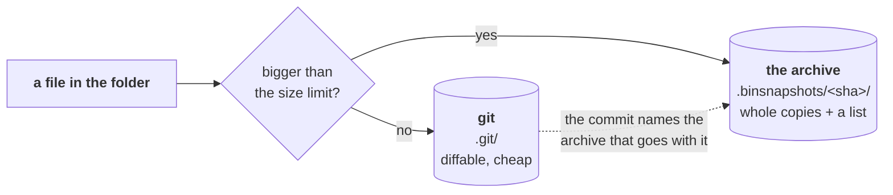
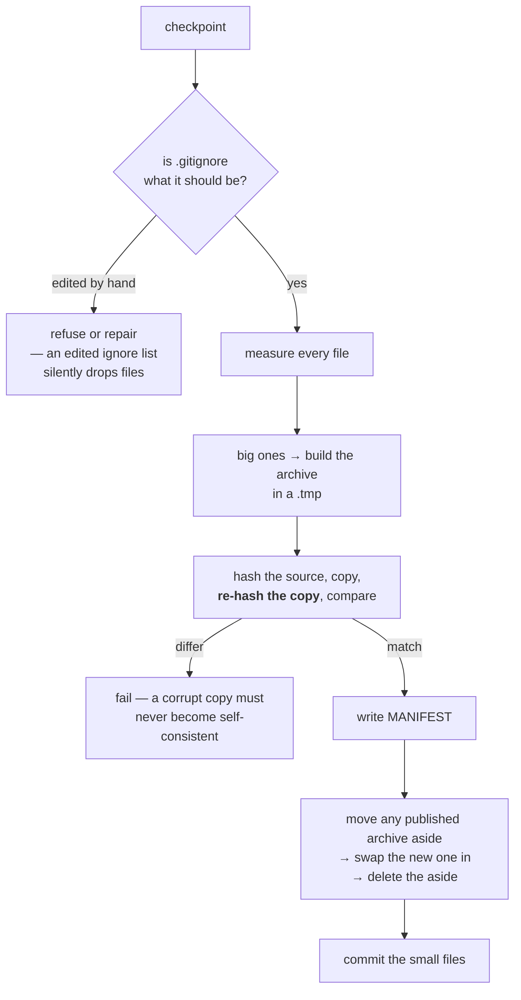
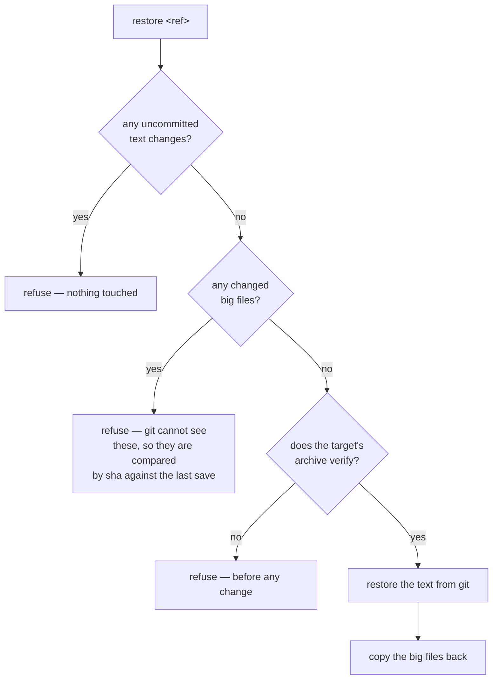

# Checkpointing — saving a calculation so you can always get it back

**Role:** contract
**Domain:** execution
**Companions:** [`running-a-job.md`](?doc=execution/running-a-job.md) § 6 — how to
*drive* the checkpoint system (the CLI verbs, the routes, the sidebar panel);
[`job-contracts.md`](?doc=execution/job-contracts.md) § 6.1 — the file formats;
[`engines/stages.md`](?doc=engines/stages.md) § 7 — the folder being saved and the
two moments a save is offered; [`project-layout.md`](?doc=execution/project-layout.md)
§ 6 — where the history sits in the project tree.

---

## 1. What this is for

You have a folder holding a calculation: inputs, a relaxed geometry, a density
matrix, output logs. You are about to do something to it — rerun a stage,
regenerate the decks, start over cleanly. **This is the thing that means you can
change your mind afterwards.**

> ### The promise
>
> **Whatever state a run is in, that state can be brought back.**
>
> Every other rule in this document exists to keep that sentence true.

**Nothing else is promised, and nothing else competes with it.** Not disk space,
not speed, not tidiness. If a rule here and a saving of disk ever disagree, the
rule wins — a folder that is cheap to store and wrong is worth nothing.

### 1.1 What it decides, and what it does not

| | |
|---|---|
| **You choose** | *which folder* to save, and *when* |
| **Checkpoint chooses** | *how* each file is stored |
| **Checkpoint never chooses** | *whether* a file is stored |

That middle row is the only decision it owns, and it is a mechanical one: git is
bad at very large files, so those go somewhere else. That is a storage detail,
not an opinion about what matters.

**It has no opinion about what matters.** A benchmark's throwaway trials, a log
nobody will read, a 2 GB density matrix — if they are in the folder, they are
saved. Whether a benchmark's trials are worth keeping is decided by whoever runs
the benchmark, by choosing what to point this at.

> **This is not a rule the design started with; it is one it learned.** A
> trajectory file (`*.MD`) was left out of every snapshot for months because it
> was *large* — the size was allowed to argue with the saving, and the size won.
> Nobody chose that; it followed from letting the two be weighed at all.

---

## 2. How a folder is saved

Two stores. Every file is in exactly one of them.



**Which store, by measuring — not by file type.** A file over the limit goes to
the archive; everything else goes to git. Extensions are not consulted, because a
name is not the property being tested: a 4 GB `.EIG` nobody listed would be
committed, and an empty `.DM` somebody did list would be archived.

The engine entries in the config (§ 3) name families that are *always* large, so
those skip the measuring. That is an effort saving and nothing else — **a hint
can make a save faster; it can never make it store less.**

### 2.1 A real folder, after two saves

```text
BDT_Au_relax_Au38C6H4S2/
├── .git/                            the text history
├── .gitignore                       generated — lists exactly what the archive holds
├── .binsnapshots/                   the archive
│   ├── 4f9c…a71/                      one directory per commit
│   │   ├── 01_coarse/run-0/BDT_Au_relax_Au38C6H4S2.DM
│   │   └── MANIFEST                   what is in here, and its sha256
│   └── b2e0…33d/
│       ├── 01_coarse/run-0/BDT_Au_relax_Au38C6H4S2.DM   ← unchanged since the
│       │                                                   save above, so this is
│       │                                                   a hard link: no disk
│       ├── 02_tight/run-0/BDT_Au_relax_Au38C6H4S2.DM
│       └── MANIFEST
├── task.json                      ┐
├── BDT_Au_relax_Au38C6H4S2.fdf.template │  small → git
├── 01_coarse/                     │
│   ├── BDT_Au_relax_Au38C6H4S2.fdf│
│   └── run-0/                     │
│       ├── BDT_Au_relax_Au38C6H4S2.out                ┘
│       ├── BDT_Au_relax_Au38C6H4S2.XV      small → git
│       ├── run.json                        small → git
│       └── BDT_Au_relax_Au38C6H4S2.DM      large → the archive
└── 02_tight/…
```

And a MANIFEST is three columns — sha256, bytes, path — sorted by path:

```text
7ef4c645…344a  8388608  01_coarse/run-0/BDT_Au_relax_Au38C6H4S2.DM
36c54395…a572  8388608  02_tight/run-0/BDT_Au_relax_Au38C6H4S2.DM
```

**The path is relative to the folder root, not a bare filename.** That is what
lets one archive hold a `.DM` from every stage without them colliding. Every part
of it is checked so a restore cannot be steered out of the folder: no leading
`/`, no `..`, nothing starting with a dot.

**Identical content is stored once.** Two saves that both contain an unchanged
`.DM` record the same sha256, so the second links to the first's file rather than
copying it. The archive still holds a real file at that path, so nothing reading
it can tell.

---

## 3. The pieces

| Piece | What it is | Who writes it |
|---|---|---|
| **git** | the history of everything small | `checkpoint` |
| **the archive** — `.binsnapshots/<commit>/` | whole copies of everything large | `checkpoint` |
| **MANIFEST** | what is in one archive, with a sha256 each | `checkpoint` |
| **`.gitignore`** | the list of what git skips — *generated*, so it matches the archive exactly | `checkpoint` only |
| **the config** | the size limit, and the per-engine hints | the user, in molbuilder's own config |
| **`snapshot` verbs** | `init`, `checkpoint`, `list`, `restore`, `branch`, `tag` | — |

**The config is molbuilder-wide, not per folder.** One `generic` entry — save
everything, choose the store by size — plus optional per-engine hints. A caller
may name its engine so the matching hint is used; with no name, `generic` applies,
which is always correct and merely does more measuring.

> A per-folder config file would let one folder behave differently from another
> for no recorded reason. That is a trap, not a feature.

---

## 4. Saving, step by step



**Why the copy is re-hashed rather than trusted.** If the MANIFEST's sha were
taken from the copy alone, a copy corrupted on the way to disk would be
*self-consistent* — it would verify against its own bad sha forever and be
restored as truth. Hashing the source and re-hashing the copy is what makes that
impossible.

**Why the old archive is moved aside instead of deleted first.** Deleting and
then renaming leaves a moment where neither exists; a crash there destroys the
archive that was already good. The worst case now is a leftover `.old` directory
beside a complete archive.

## 5. Restoring, step by step



**Four gates before the first change, and the order is the rule** — not merely
that the checks exist. A restore that half-completes leaves text from one save
and binaries from another: a state no save ever held, which nothing can diagnose
afterwards.

**A restore reads only what the save wrote down.** It consults no configuration —
not the size limit, not the engine hints, not any file you can edit. So the
config can be changed, moved, or deleted and every archive already written stays
restorable.

### 5.1 Why this matters far more in a flat folder

In the **nested** shape every stage and attempt is on disk at once. Going back to
stage 1's geometry means opening `01_coarse/run-0/`. A checkpoint there is
protection against loss and a way to branch — valuable, not load-bearing.

**In the flat shape it is load-bearing.** The restart files are unsuffixed and
shared *by design* — that is exactly what lets stage 2 continue from stage 1 —
which means stage 2 **overwrites** them.

> **Without a checkpoint, a flat folder can only move forward.** With one it can
> return to any state it was saved in and continue from there. That is not a
> convenience on top of the flat shape; it is what makes the flat shape usable
> for iterative work at all.

Two consequences worth saying out loud:

- **Saving before each stage is not housekeeping in a flat folder — it is the
  save point.** Miss one and that state is gone, because nothing else on disk
  holds it.
- **A restore is a rewind, not a fetch.** It returns the *whole* folder to a past
  state (S6). So going back means **save what you have, then restore the earlier
  one** — skip the first step and you lose the present. The nested shape never
  poses the question, because it never had to overwrite anything.

---

## 6. Who takes a checkpoint, and when you are asked

> **A checkpoint is always an explicit act. molbuilder never takes one on its
> own.** It *asks*, at the one moment where not having asked would cost
> something, and then does what it is told.

**The moment is `prep`, because prep is the change.** When prep is about to
rewrite a folder that already holds results, it says what will change and offers
to save first. You answer.

| | |
|---|---|
| **Where it asks** | interactive `prep`, when the target already holds results |
| **Who decides** | you, every time |
| **Non-interactive** (`--yes`, a script) | proceeds **without** saving and **says so** — it may not silently pick either way |
| **The last stage** | nothing asks, because nothing follows. A surface showing a finished, unsaved run should say it is unsaved |

**Never at run or submit time**, which may be a queued job — a prompt would block
a queue, and submitting starts something new rather than changing something that
exists. **Never on the compute node**, which would need git there (I4).

**Something already watches the run, and it is not this.** `mb_monitor.py` sits
beside the job, follows the launcher's PID so it knows when the run really ended,
reads the outputs, and can notify you — webhook, email, whatever you wire in. So
nobody has to be at the cluster at 3am. **What it must not do is act.** It
observes and tells; it never decides and never changes the calculation. Saving is
a decision, and decisions are yours.

---

## 7. The rules

Each one names what it prevents and how to test it. **Status is in § 8.**

### Everything is saved

**S1 — every regular file is in git or in the archive: never both, never
neither.** The only thing not stored is `.binsnapshots/` itself, because a store
cannot contain itself. No category of file is exempt.

*Symlinks are outside this, and "regular" is load-bearing.* A stage links its
deck and the shared pseudopotentials rather than copying them, so a saved tree is
full of links. A link has no content of its own — the real file is stored once,
wherever it lives — and recreating the layout is what a restore does anyway.

- **Fails as:** both → a multi-gigabyte blob in git history forever. Neither →
  the file is in no snapshot, and a restore silently does not bring it back.
- **Test:** walk every regular file and assert `archived` ≠ `tracked`, with
  `.binsnapshots/` the only excluded path. **No allow-list** — a file is stored
  or the test fails.

**S1a — `.gitignore` is generated from the classification, never hand-kept
beside it.** One *source*, not merely one writer.

- **Fails as:** a hand-kept list answers to no rule. That is exactly how `*.MD`
  came to be ignored with nowhere else to go.
- **Test:** assert the generated `.gitignore` contains **nothing that is not an
  archive pattern**. That check catches the whole class, and no fixture can be
  too short for it.

### The record can be trusted

**I1 — an archive's content is never modified once written.** Re-archiving the
same commit rebuilds the directory, which is legal because one commit implies one
tree; the assertion is on *content for a commit*, not on the directory's mtime.
`snapshot migrate-manifest` rewrites a legacy 2-column MANIFEST into the 3-column
form and is not a violation: it changes how the archive is *described*, never
what is in it, and every `(name, sha256)` pair survives it.

**I2 — a MANIFEST is authoritative for its archive.** For every entry: the file
exists, its size matches, its sha256 matches.

- **Test:** run it over every archive in a folder. This is the single most
  valuable test in the system.

**I2a — a restore is decided by what the save recorded, never by
configuration.** Verified in code: `Repo.restore`, `_copy_archived_binaries` and
`_verify_archived_binaries` read no config, no glob list, no engine name.

- **Why it matters now:** the classification is moving out of the folder and into
  molbuilder's config. Because restore never re-derives, every archive written
  before that stays readable — an edit to one file instead of a migration of
  every archive in existence.
- **Test:** save, then change the engine, empty the hint list, delete the config
  outright — and assert the restored tree is byte-identical either way.

**I2b — every record the history leans on is tamper-evident.** Two records, and
they fail in opposite directions:

| record | decides | protected by |
|---|---|---|
| `MANIFEST` | what a **restore** returns | a sha256 **anchored outside itself** |
| `.gitignore` | what the **next save** even sees | **regeneration** — the correct content is computable |

*The MANIFEST records facts that cannot be recomputed, so it needs a digest.
`.gitignore` records a derivation, so the derivation is the check* — and
regeneration says which line is wrong, where a digest could only say that
something is.

- **Fails as:** delete a MANIFEST line and that file is simply not restored — it
  reads exactly like "this archive never held it". Change a sha *and* the file to
  match and a restore returns the wrong bytes **and reports success**. Add
  `*.XV` to `.gitignore` and the next save stores no `.XV` at all while looking
  perfectly healthy.
- **Test:** the three MANIFEST edits above must all be refused, naming the
  *record* as what failed. For `.gitignore`, edit inside the marked section as
  well as outside — anyone who knows about the markers will edit inside them.

> **Records are named so nobody mistakes one for a setting.** `MANIFEST` looks
> like a file a person may reasonably adjust; `MANIFEST.do_not_edit` does not.
> This buys nothing against deliberate tampering — that is the digest's job — and
> everything against somebody tidying a directory. `.gitignore` cannot take the
> suffix, since git requires that name. ⚠ A rename is an archive-format change:
> the reader must accept both names or archives written before it stop opening.

**L8 — a saved attempt never differs afterwards.** This is I2 pointed at a
directory the layout says is frozen. *Hierarchical only* — a flat folder's
`<id>.DM` is *expected* to change every stage, so there a difference is news
rather than a violation. Do not let a check written for one shape fail the other.

### A save or a restore completes, or does not happen

**A1 — archiving is build, verify, swap, then delete** (§ 4).

- **Test:** kill the process between each step; afterwards the archive set is the
  old one or the new one, never a mixture.

**A2 — a restore verifies before it changes anything** (§ 5), in that order.

- **Test:** corrupt one byte of the target archive and attempt a restore — it
  refuses, and the folder is byte-identical to before.

**A3 — the checkpoint precedes the change it protects.** A pre-produce save is
committed *before* the first new file is written.

- **Test:** interrupt a produce between the save and the swap: the commit exists
  and `git status` is clean — no new file reached the folder.

### Nothing else touches the state

**I3 — warm state is moved or restored, never incidentally lost.** Exactly one
operation may move it and exactly one may replace it (`restore`). Nothing else
may touch it. A replacing produce may remove orphaned decks and wrappers, never
state.

- **Test:** grep every path that writes into a run directory for a delete or a
  truncating open that could match run state. There should be no hit that is not
  one of those two.

**I4 — a generated wrapper contains no git.** A wrapper that committed would need
git on the compute node, which `running-a-job.md § 2` forbids.

- **Test:** no emitted `.run.sh` or `.sbatch` invokes `git` **as a command word** —
  `digits` and `logging` are not violations, and a check that flags them is one
  somebody will disable.

**S2 — shared state lives above; a stage writes only inside its own directory.**

- **Test, and one half alone is worse than useless:** (a) run one stage and read
  `git status` at the parent — every changed path is under that stage. (b) git
  **cannot see the big files**, so compare their shas against the last archive
  too. Half (a) alone passes while a stage overwrites another stage's `.DM`.

**S4 — the description is input; everything else is derived.** No produce and no
run may edit `task.json`.

- **Test:** hash it before and after.

**S5 — identity is calculation-level; the run index is invocation-level.** Nothing
about a run may change the id, or the files it produced would be orphaned by the
act of producing them.

### A history you can read back

**S3 — a run records what it started from.** `run.json`'s `continued_from` names
the run directory its files came from, or is absent when it started from the
structure.

*This survived a design change and its mechanism did not.* When stages chained, an
inherited file arrived as a symlink and became real when localised — the type
change *was* the record. Stages no longer chain, so the record is explicit. It is
also better: a symlink says *something was inherited*, not **which run**, and with
several attempts per stage that is the question you actually have.

- **Test:** for every run in a finished tree, `continued_from` names a directory
  that exists or is absent — never something deleted or never there.

**S6 — a restored folder is internally consistent.** `task.json` is tracked text,
so a restore brings back the description *together with* the decks it produced.

- **Test:** restore any commit and re-run the produce with `dry_run` — it reports
  no change. One exclusion only: PROVENANCE stamps `generated-at`, so that key is
  ignored.

**L3 — every commit and tag names its calculation.** The message carries the id
and the stage; a finished stage is tagged `<id>/<stage>/<UTC>`. Nothing is
normalised — a name needing repair is **refused**, because silently fixing an id
would decouple the history's name from the folder's.

**L4 — tags are stage completions only.** Pre-produce saves are commits, reachable
through `snapshot list`. Tagging them too would bury the points you meant to
reach among the ones you passed through. A hand-made tag is your own business.

### Depth, and both folder shapes

**L1 — one repository per calculation**, covering the root and every stage
beneath it.

**L2 — the archive matches at depth.** A gitignore pattern with no slash matches
at *every* level, so a nested `01_coarse/job.DM` is ignored by git — and if the
archive walk only looked at the top level it would be ignored **and** unarchived:
in no snapshot at all. Both sides must resolve depth the same way.

**L7 — a change to a big file alone still leaves a checkpoint.** Big files are
gitignored, so `git status` is clean when only they changed; the save must not
conclude there is nothing to do.

- **Fails as:** you re-run a stage that rewrites its `.DM` and nothing else, save,
  and are told the tree was clean. The new density matrix is in no snapshot.
- **Test:** change only a big file, save, and assert a new archive exists whose
  MANIFEST records the new sha.

---

## 8. Status

| Rule | | |
|---|---|:--:|
| **S1** | everything is stored; the only exclusion is the store itself | ⛔ `*.MD` / `*.MD_CAR` are ignored and unarchived |
| **S1a** | `.gitignore` generated, one source | ⛔ a hand-kept list sits beside the generated block |
| **I1** | archived content is never modified | ✅ |
| **I2** | a MANIFEST is authoritative | ✅ |
| **I2a** | a restore replays the save, and consults nothing | ✅ |
| **I2b** | the records themselves are tamper-evident | ⛔ neither is |
| **I3** | one mover, one replacer, no third | ✅ |
| **I4** | no git in a generated wrapper | ✅ |
| **A1** | build, verify, swap, delete | ✅ |
| **A2** | verify before mutating, in order | ✅ |
| **A3** | the save precedes the change | needs the prep prompt |
| **S2** | a stage writes only inside itself | needs the layout |
| **S3** | a run records what it started from | needs the layout |
| **S4** | the description is never modified | needs the description |
| **S5** | nothing about a run changes the id | ✅ |
| **S6** | a restored folder explains itself | needs the description |
| **L1** | one repository per calculation | ✅ |
| **L2** | the archive matches at depth | ✅ |
| **L3** | every commit and tag names its calculation | ✅ |
| **L4** | tags are stage completions only | ✅ |
| **L7** | a big-file-only change still saves | ⛔ |
| **L8** | a saved attempt never differs afterwards | needs the layout |

### Two things that are not rules

**Disk cost.** Identical content is stored once, so a second save of an unchanged
2 GB file costs nothing. That is a property, not an invariant: it is tuned through
the config and **never** by storing less. It sits here rather than in § 7 so
nobody reads the two as peers again — this document has already lost a file to
that mistake.

*Known and cosmetic:* the size the surfaces print sums file sizes and counts each
hard link in full, so ten saves of an unchanged 2 GB file display as 20 GB where
the disk holds 2. Five call sites, and no `prune` verb for the number to inform.

**Verifying without restoring.** `_verify_archived_binaries` already checks
everything I2 asks and touches nothing — but it is reachable only from the restore
path, so the only way to learn an archive is intact is to attempt a restore. That
is the worst moment to find out. A `snapshot verify [<ref>]` verb is a few lines
over a helper that exists.

---

## 9. What this does not own

- **How to use it** — the CLI verbs, the routes, the sidebar panel, and what is
  unbuilt (archive pruning, `snapshot diff`) —
  [`running-a-job.md`](?doc=execution/running-a-job.md) § 6.
- **The file formats** — [`job-contracts.md`](?doc=execution/job-contracts.md) § 6.1.
- **The folder being saved, and the two moments a save is offered** —
  [`engines/stages.md`](?doc=engines/stages.md) § 7.
- **Phasing and open questions** —
  [`web/staged-runs-architecture.md`](?doc=web/staged-runs-architecture.md) and
  [`roadmap.md`](?doc=roadmap.md) (R3).
