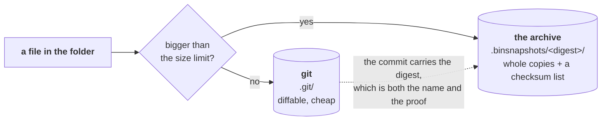
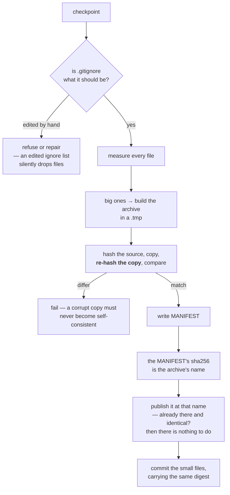
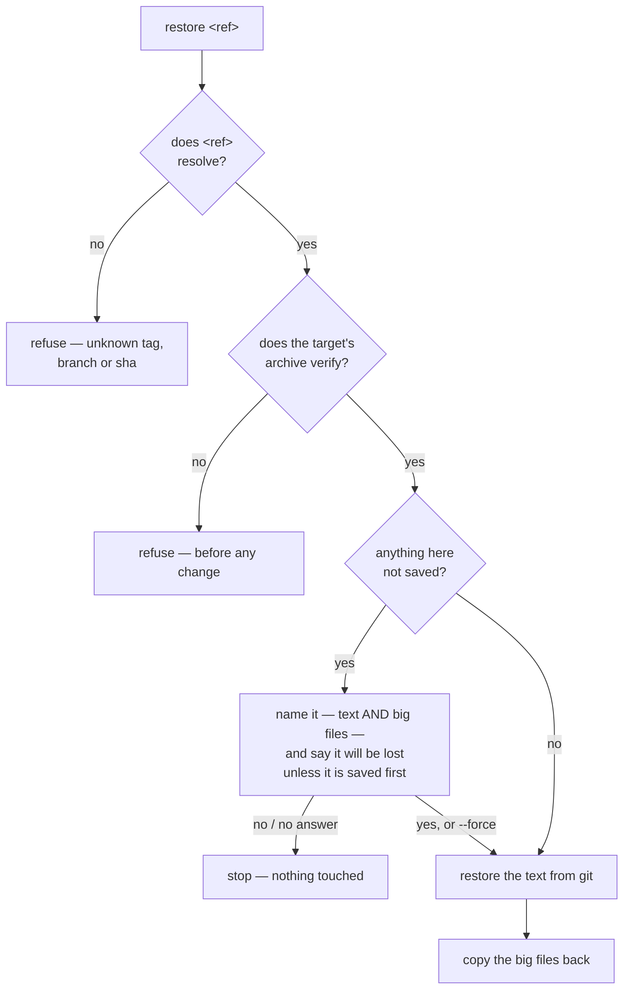

# Checkpointing — saving a calculation so you can always get it back

**Role:** contract
**Domain:** execution
**Companions:** [`running-a-job.md`](?doc=execution/running-a-job.md) § 6 — the
guide: what to type and what the buttons do, which this document never repeats;
[`job-contracts.md`](?doc=execution/job-contracts.md) § 6.1 — the file formats;
[`engines/stages.md`](?doc=engines/stages.md) § 7 — the folder being saved and the
two moments a save is offered;
[`project-layout.md`](?doc=execution/project-layout.md) § 6 — where the history
sits in the project tree; [`run-identity.md`](?doc=execution/run-identity.md) —
the id every commit and tag carries.

A calculation lives in a folder: inputs, a relaxed geometry, a density matrix,
logs. Checkpointing takes a **snapshot of that whole folder** when you say so, and
any state you saved is one you can come back to — to rerun a stage, retune
and try again, or start over from it.

It is git underneath, with one addition: files too large for git are copied into
a side store with a checksum each, so a snapshot holds the big binaries too. You
never interact with either directly.

**This document is written for two readers.** §§ 1–10 are for anyone using
molbuilder — what it does, when to reach for it, and what the commands do, with
worked examples. §§ 11–15 are for anyone changing the code: the rules that must
not break, how to test them, and where the code is.

---

## 1. The goal

> ### The promise
>
> **A state you saved is one you can return to.** Come back to it, change what
> you like, run again — and save that as a new state if it is worth keeping.
>
> Every rule in this document exists to keep that sentence true.

**What was never saved was never promised.** That is not a loophole, it is the
shape of the thing: a snapshot is taken, not inferred, so the only states this
can return you to are the ones somebody decided were worth keeping. Where that
decision gets offered is § 9.

**Nothing else competes with the promise.** Not disk space, not speed, not
tidiness. If a rule here and a saving of disk ever disagree, the rule wins — a
folder that is cheap to store and wrong is worth nothing.

---

## 2. What checkpointing is not

- **It is not a backup system.** The snapshot lives inside the folder it is
  snapshotting. A deleted folder takes its history with it; copy the folder
  somewhere else for that.
- **It is not automatic.** Nothing is ever saved without you saying so (§ 9).
- **It does not decide what is worth keeping.** Point it at a folder and it
  saves the folder — all of it. Whether a benchmark's throwaway trials deserve
  keeping is decided by whoever runs the benchmark, by choosing what to point
  this at.
- **It does not run on the cluster.** Saving is a decision, and decisions happen
  where you are, not on a compute node.
- **It is not a way to move a calculation between machines.** It records
  history; `rsync` moves folders.
- **It is not a safety net for work you never saved.** A restore tells you what
  it is about to overwrite and then does it (A5). Nothing is stashed or set
  aside on your behalf.
- **It does not deal in files.** A state is the whole directory. Pulling one
  file out of the past is a different request with a different tool — `git show
  <ref>:<path>`.

### 2.0 One rule for you: use the verbs, not git

**A calculation folder is managed through `molbuilder snapshot`. Running bare
git commands in it is outside this contract.**

It *is* a git repository — that is how the snapshots are made — so nothing stops
you, and molbuilder does not try to. But git alone sees only half of it: the big
files live in the archive, which git is told to ignore, so a `git checkout` of an
older commit rewinds the text and leaves every large file exactly where it was.
The folder is then in a state no save ever produced, and **that mess is yours**.

Two things make this a fair deal rather than a trap:

- **The verbs cover the work.** Saving, going back, comparing, naming a state —
  § 5 is the whole list, and none of it needs git.
- **You will not be quietly fooled.** Every commit carries the digest of the
  archive that belongs with it (I2b), so a folder pulled out of step fails
  verification the next time molbuilder is asked to do anything with it. It
  refuses and says the archive does not match, rather than proceeding.

To read one old file, `git show <ref>:<path>` is safe — it prints and touches
nothing.

### 2.1 What it decides, and what it does not

| | |
|---|---|
| **You choose** | *which folder* to save, and *when* |
| **Checkpoint chooses** | *how* each file is stored |
| **Checkpoint never chooses** | *whether* a file is stored |

That middle row is the only decision it owns, and it is mechanical: git is bad at
very large files, so those go somewhere else. A storage detail, not an opinion
about what matters.

> **This is not where the design started; it is what it learned.** A trajectory
> file (`*.MD`) sat outside every snapshot for months because it was *large* —
> the size was allowed to argue with the saving, and the size won. Nobody chose
> that; it followed from letting the two be weighed at all.

---

## 3. The overall shape

Two stores. Every file is in exactly one of them.



**The archive is named by what it contains, not by the commit it belongs to.**
Its directory is the sha256 of its own MANIFEST. That one value does three jobs
at once: it *locates* the archive, it *proves* the archive (I2b), and it makes an
archive impossible to modify without becoming a different archive (I1).

Three things follow, and each removes a problem rather than adding a mechanism:

- **The archive can be published before the commit**, because it no longer needs
  a commit's name. There is no window where a commit exists with nothing beside
  it (§ 6).
- **Two saves with the same big files share one archive.** Not a copy avoided —
  the *same directory*, referred to by both commits.
- **A save that is interrupted and re-run writes the identical path with the
  identical bytes**, so a repeat is harmless by construction rather than by
  locking (S9).

> ⚠ **This is an archive-format change**, and the rule for those is already
> written into I2b's note: the reader accepts both forms, or every archive
> written before it stops opening. A directory named for a 40-character commit
> sha is a pre-digest archive and is read as one. Breaking them would violate
> § 1 for folders that did nothing wrong.

**Which store, by measuring — not by file type.** A file over the limit goes to
the archive; everything else to git. Extensions are not consulted, because a name
is not the property being tested: a 4 GB `.EIG` nobody listed would be committed,
and an empty `.DM` somebody did list would be archived.

The engine entries in the config (§ 4) name families that are *always* large, so
those skip the measuring. That is an effort saving and nothing else — **a hint
can make a save faster; it can never make it store less.**

> ⚠ **This is the rule; it is not yet the code (S1b).** What ships today consults
> *only* the name: `_list_big_binaries` matches the glob list and measures
> nothing, so there is no size limit anywhere in the system. Every sentence above
> describes where this is going. The diagram is the contract, not a screenshot.

### 3.1 A real folder, after two saves

```text
BDT_Au_relax_Au38C6H4S2/
├── .git/                            the text history
├── .gitignore                       generated — lists exactly what the archive holds
├── .binsnapshots/                   the archive
│   ├── a19f0b72…c8e5/                 named by the sha256 of its own MANIFEST
│   │   ├── 01_coarse/run-0/BDT_Au_relax_Au38C6H4S2.DM
│   │   └── MANIFEST                   what is in here, and a sha256 each
│   └── 4d7ba930…1f62/
│       ├── 01_coarse/run-0/BDT_Au_relax_Au38C6H4S2.DM   ← unchanged since the
│       │                                                   save above, so this is
│       │                                                   a hard link: no disk
│       ├── 02_tight/run-0/BDT_Au_relax_Au38C6H4S2.DM
│       └── MANIFEST
├── task.json                             ┐
├── BDT_Au_relax_Au38C6H4S2.fdf.template  │  small → git
├── 01_coarse/                            │
│   ├── BDT_Au_relax_Au38C6H4S2.fdf       │
│   └── run-0/                            │
│       ├── BDT_Au_relax_Au38C6H4S2.out   ┘
│       ├── BDT_Au_relax_Au38C6H4S2.XV      small → git
│       ├── run.json                        small → git
│       └── BDT_Au_relax_Au38C6H4S2.DM      large → the archive
└── 02_tight/…
```

And a MANIFEST is three columns — sha256, bytes, path — sorted by path:

```text
7ef4c645…344a  8388608  01_coarse/run-0/BDT_Au_relax_Au38C6H4S2.DM
36c54395…a572  8388608  02_tight/run-0/BDT_Au_relax_Au38C6H4S2.DM
```

**The path is relative to the folder root, not a bare filename.** That is what
lets one archive hold a `.DM` from every stage without them colliding. Every part
is checked so a restore cannot be steered out of the folder: no leading `/`, no
`..`, nothing starting with a dot.

**Identical content is stored once.** Two saves that both contain an unchanged
`.DM` record the same sha256, so the second links to the first's file rather than
copying it. The archive still holds a real file at that path, so nothing reading
it can tell.

---

## 4. The pieces

| Piece | What it is | Who writes it |
|---|---|---|
| **git** | the history of everything small | `checkpoint` |
| **the archive** — `.binsnapshots/<digest>/` | whole copies of everything large, named by content | `checkpoint` |
| **MANIFEST** | what is in one archive, with a sha256 each | `checkpoint` |
| **`.gitignore`** | what git skips — *generated*, so it matches the archive exactly | `checkpoint` only |
| **the config** | the size limit and the per-engine hints | you, in molbuilder's config |
| **`molbuilder snapshot …`** | the verbs you type (§ 5) | — |
| **`Repo`** (`molbuilder/checkpoint.py`) | the class every surface goes through | — |

**The config is molbuilder-wide, not per folder.** It sits in `molbuilder.json`
with every other setting, and it holds the size limit and three entries:
**`generic`** — save everything, choose the store by size — plus **`siesta`** and
**`pyscf`**, which name the file families that are always large so those can skip
the measuring. A caller may name its engine to get the matching entry; with no
name `generic` is used, which is always correct and merely measures more.

**The size limit is 10 MB, and you can change it.** That is the whole of the
decision § 3's diagram turns on, so it is written here as a number rather than
left for whoever writes the code to invent. It is a *storage* threshold and
nothing else — moving it changes where a file is kept, never whether it is kept
(§ 2.1).

> A per-folder config would let one folder behave differently from another for no
> recorded reason. That is a trap, not a feature.

> ⚠ **Also the rule and not yet the code (S1c).** Today every folder carries its
> own `.mbcheckpoint.json`, and two surfaces write it — `molbuilder snapshot
> config --set-globs` and the web route behind it. So the trap described above is
> currently open, and one of its consequences is I2c below.

---

## 5. Using it

There are two words in this system and nothing else to learn.

| | |
|---|---|
| a **state** | a saved snapshot of the whole folder. It has an id, a note you wrote, and the state it came from |
| a **tag** | a name you give a state so you can find it again |

```bash
# once, in the calculation folder
molbuilder snapshot init

# save the folder as a state -- the note is required, and § 5.1 says why
molbuilder snapshot save -m "stage 1 converged, 41 steps -- before retightening"

# what have I got?
molbuilder snapshot list

# name one you know you will come back to
molbuilder snapshot tag stage1-good -m "geometry I trust"

# go back to a state -- by id or by tag.  The whole folder returns.
# Anything unsaved here is named first, and you are asked.
molbuilder snapshot restore 4f9ca71
molbuilder snapshot restore stage1-good

# which files count as "big" here
molbuilder snapshot config
```

**A state's id is permanent and never reused.** It is git's own commit hash, so
`restore 4f9ca71` means the same thing next month as it does today. Nothing
assigns it, nothing stores it, and nothing can renumber it — a second numbering
scheme would be a second identity for one thing, and two identities for one thing
eventually disagree.

> **Two hashes, two jobs, and it is worth keeping them apart.** A **state's id**
> is git's commit hash and is a *name*. The **archive's digest** is a sha256 we
> compute and is a *proof* — what the archive must contain (I2b). Nothing in this
> contract depends on which hash git uses for the first, so if git ever changes
> its default, none of this cares.

### 5.1 The note, and why it is required

A history is only useful if you can pick from it a month later, and everything
you read when you come back is something you wrote:

```text
molbuilder snapshot list

  4f9ca71  set up                                          09:15
  b2e033d  stage 1 converged, 41 steps -- before            11:40   from 4f9ca71
           retightening                            [stage1-good]
  7a1c0e4  stage 2 at 200 Ry -- forces worse than stage 1   14:02   from b2e033d
  e30bb92  stage 2 at 300 Ry -- forces now below 0.02       16:30   from b2e033d
```

**The question you bring to this list is never *where was I*** — the list answers
that — it is **why did I stop here, and what was I about to do?** So a generated
note (`checkpoint 2026-08-08T14:02:11Z`) is worse than none: it answers neither,
it repeats the timestamp column, and five of them in a row is a list you cannot
choose from. A caller offering a save may **draft** the note, since it knows what
it is about to change; you confirm or edit it (§ 9).

**The last two states are visibly alternatives** — both say `from b2e033d`. That
is the whole mechanism for branching, and it is covered in § 7.1: nothing was
declared, nothing was named, and both attempts are intact.

**`restore` is a rewind, not a fetch.** It returns the *whole folder* to that
state — it does not pull one file out. To read a single old file without moving
anything, git already answers that: `git show <state>:<path>`.

> ⚠ **`snapshot restore --no-binaries` exists today and should not** (A4). It
> rewinds the text and leaves every big file untouched, which is the mixed state
> S8 is about — reached on purpose instead of by accident.

---

## 6. Saving, step by step



**The archive is published before the commit, and that is the point of naming it
by content.** It does not need the commit's name, so it does not need to wait for
one. The only thing an interruption can leave behind is an archive nobody points
at yet — no lost data, and the next save writes the identical bytes to the
identical path.

**Publishing is idempotent, which is what removes the need for a lock.** Same
content, same digest, same directory: two saves racing to publish the same
archive are writing the same thing. This is the standard property of a
content-addressed store, and it is why git, Nix and container layers all work
this way (S9).

**Why the copy is re-hashed rather than trusted.** If the MANIFEST's checksum came
from the copy alone, a copy corrupted on the way to disk would be
*self-consistent* — it would verify against its own bad checksum forever and be
restored as truth. Hashing the source and re-hashing the copy makes that
impossible.

**No archive is ever replaced, so nothing has to be moved aside.** An archive at
a given name always holds the same content — that is what naming it by that
content means — so publishing is *create if absent*, never *overwrite*. The old
scheme needed a careful delete-and-rename dance because a commit's archive could
be rebuilt with different bytes; that whole class of problem is gone rather than
handled.

Build in a `.tmp` and rename it into place all the same: the rename is what makes
a directory appear complete or not at all, so a reader never meets a half-written
archive (A1).

---

## 7. Restoring, step by step



**Two refusals, then one question, and the order is the rule.** The refusals
come first because they are about the *target* — an unknown ref or a corrupt
archive means the operation cannot happen at all, and nobody should be asked to
accept a loss for an operation that then fails for an unrelated reason. The
question comes last, immediately before the first byte moves.

**The question is answered by you, and the answer is honoured.** It names what is
unsaved and says plainly that **it will be lost unless you save it first**.
Nothing is rescued, stashed, renamed or set aside. If you say yes, it is gone —
you called `restore` without calling `checkpoint`, and that is a choice the
system spells out rather than second-guesses (A5).

**What must never happen is a half-restore**: text from one save and binaries
from another, a state no save ever held and nothing can diagnose afterwards.
That is why the archive is verified *before* the text is touched.

### 7.1 Going back and trying something else, with the original intact

This is the thing the whole design exists for, so it is worth walking slowly.

You have run two stages. Stage 2 used a 200 Ry mesh and the forces came out
worse than you wanted. You want to go back to the geometry stage 1 produced and
try 300 Ry instead — **without losing the 200 Ry attempt**, because it may turn
out to have been the better answer.

```bash
# 1. Keep what you have.  It costs nothing and you cannot get it back later.
molbuilder snapshot save -m "stage 2 at 200 Ry -- forces worse than stage 1"

# 2. Go back to stage 1's state.  The whole folder returns to that moment.
molbuilder snapshot restore b2e033d

# 3. Retune, rerun, and keep the result.
molbuilder snapshot save -m "stage 2 at 300 Ry -- forces now below 0.02"
```

```text
molbuilder snapshot list

  4f9ca71  set up                                          09:15
  b2e033d  stage 1 converged, 41 steps                     11:40   from 4f9ca71
  7a1c0e4  stage 2 at 200 Ry -- forces worse than stage 1  14:02   from b2e033d
  e30bb92  stage 2 at 300 Ry -- forces now below 0.02      16:30   from b2e033d
```

**Both attempts are there, and the list says they are alternatives** — they share
a parent. You declared nothing, named nothing, and ran no extra command.

**Why the original is intact: nothing is ever rewritten.** A state, once saved,
is never modified or removed. Restoring `b2e033d` changed the *folder*; it did
not touch `7a1c0e4`, which still holds every byte of the 200 Ry attempt. Going
back to it is one more restore.

**Where the fork comes from: every state records the state it came from.** Step 3
saved while the folder stood at `b2e033d`, so the new state's parent is
`b2e033d`. That is the entire branching mechanism — no branch verb, nothing to
name, nothing to clean up afterwards. The shape of the history is a consequence
of what you did, not a thing you had to declare in advance.

**Comparing them later** is `restore 7a1c0e4`, look, `restore e30bb92`, look.
Neither is more "real" than the other, and neither can shadow the other. If one
turns out to be the one you care about, **tag it** — that is what tags are for,
and it is how you avoid hunting through notes a month from now.

> **The one thing to get right is step 1.** Restoring is not destructive to the
> *history*, but it does overwrite the *folder*. Anything you had not saved when
> you typed step 2 is named to you, once, and then gone if you say yes (A5).
> Saving first is the whole of the discipline.

**And nothing you save can become unreachable** — not after any sequence of
restores, not ever. Every state stays listed and restorable for as long as the
folder exists (A6). That is what makes it safe to wander.

## 8. Why this matters far more in a flat folder

In the **nested** shape every stage and attempt is on disk at once. Going back to
stage 1's geometry means opening `01_coarse/run-0/`. A checkpoint there is
protection against loss and a way to branch — valuable, not load-bearing.

**In the flat shape it is load-bearing.** The restart files are unsuffixed and
shared *by design* — that is exactly what lets stage 2 continue from stage 1 —
which means stage 2 **overwrites** them.

> **Without a checkpoint, a flat folder can only move forward.** With one it can
> return to any state it was saved in and continue from there. That is not a
> convenience on top of the flat shape; it is what makes the flat shape usable for
> iterative work at all.

Two consequences worth saying out loud:

- **Saving before each stage is not housekeeping in a flat folder — it is the
  save point.** Miss one and that state is gone, because nothing else on disk
  holds it.
- **A restore is a rewind, not a fetch.** It returns the *whole* folder to a past
  state (S6). So going back means **save what you have, then restore the earlier
  one** — skip the first step and you lose the present. The nested shape never
  poses the question, because it never had to overwrite anything.

---

## 9. Who takes a checkpoint, and when you are asked

> **A checkpoint is always an explicit act. Checkpointing never initiates one.**
> It takes a snapshot when told to, and that is the whole of its part.

**The decision belongs to whatever is about to change the folder.** A script
setting up a run knows what it is about to overwrite, whether the run will start
fresh or continue from what is already there, and therefore whether this moment
is worth a state you could come back to. **Checkpointing knows none of that and
should not** — to it a folder is files, and *cold* and *warm* are the run layer's
words for how a deck is written, not properties of a snapshot.

So the caller owns three things: **noticing** the moment, **asking** you, and
**drafting the note** — it knows what it is about to change, so it can propose a
sentence rather than leaving you to invent one. You confirm or edit it. Nothing
is saved until you say so.

**The moment is `prep`, because prep is the change.** When prep is about to
rewrite a folder that already holds results, it says what will change and offers
to save first. You answer.

> **What the confirmation buys you** is the promise in § 1: this state is one you
> can return to, retune, and run again from — and save *that* as a new state if
> it earns one.

| | |
|---|---|
| **Where it asks** | interactive `prep`, when the target already holds results |
| **Who decides** | you, every time |
| **Non-interactive** (`--yes`, a script) | proceeds **without** saving and **says so** — it may not silently pick either way |
| **The last stage** | nothing asks, because nothing follows. A surface showing a finished, unsaved run should say it is unsaved |

**Never at run or submit time**, which may be a queued job — a prompt would block
a queue, and submitting starts something new rather than changing something that
exists. **Never on the compute node**, which would need git there (I4).

**Something already watches the run, and it is not this.** `mb_monitor.py` sits
beside the job, follows the launcher's PID so it knows when the run really ended,
reads the outputs, and can notify you — webhook, email, whatever you wire in. So
nobody has to be at the cluster at 3am. **What it must not do is act.** It
observes and tells; it never decides and never changes the calculation. Saving is
a decision, and decisions are yours.

---

## 10. Worked examples

### 10.1 Several attempts from one state

Going back once is § 7.1. Going back to the *same* state repeatedly is the
ordinary way a parameter gets swept by hand, and it needs nothing extra:

```bash
molbuilder snapshot restore b2e033d
# run at 300 Ry
molbuilder snapshot save -m "stage 2 at 300 Ry -- forces below 0.02"

molbuilder snapshot restore b2e033d
# run at 400 Ry
molbuilder snapshot save -m "stage 2 at 400 Ry -- no better than 300, 3x slower"
```

```text
  b2e033d  stage 1 converged, 41 steps                     11:40   from 4f9ca71
  7a1c0e4  stage 2 at 200 Ry -- forces worse than stage 1  14:02   from b2e033d
  e30bb92  stage 2 at 300 Ry -- forces below 0.02          16:30   from b2e033d
  1f8d5c0  stage 2 at 400 Ry -- no better, 3x slower       18:05   from b2e033d
```

Three attempts, one parent, none of them privileged and none of them lost.

**This is where tags earn their place.** Four ids and four notes are readable
today and a puzzle in a month. Tag the one you decided on:

```bash
molbuilder snapshot tag chosen-mesh -m "300 Ry: the cheapest that met the force tolerance"
```

and `restore chosen-mesh` works forever, whatever else you try afterwards.

### 10.4 From Python

```python
from molbuilder.checkpoint import Repo

repo = Repo("projects/BDT-Au/optimization/bdt-relax")
if not repo.initialized:
    repo.init(engine="siesta")          # engine picks the always-large hints

state = repo.save(note="stage 1 converged, 41 steps -- before retightening")
print(state.id if state else "nothing changed")

for s in repo.states(limit=5):
    print(s.id[:7], s.note, "from", s.parent[:7] if s.parent else "-")

repo.restore("stage1-good")             # a tag or a state id; text + binaries
```

`save()` returns `None` when there was nothing to save, and **raises when no note
is given** — the note is not defaulted (L3). `restore()` raises rather than
half-completing (§ 7), and every state it returns stays listed afterwards (A6).

## 11. The rules

Each one names what it prevents and how to test it. **Status is in § 12.**

### Everything is saved

**S1 — every regular file is in git or in the archive: never both, never
neither.** **The two stores are the only exclusions** — `.git/` and
`.binsnapshots/` — because a store cannot contain itself. That is the whole list,
and it is a consequence rather than a policy: nothing was judged unworthy, the
two directories simply cannot hold themselves.

**No other category is exempt, including the ones it is tempting to exempt.**
Editor leftovers, scratch that only exists mid-run, caches an engine could
rebuild — all stored. Two reasons, and the second is the one that matters:
storing them costs a little disk, which § 1 has already ruled is never an
argument; and every exemption is a judgement about what is worth keeping, which
§ 2.1 says this system does not make. A snapshot of *most* of a folder is not a
snapshot of the folder.

> **Any future exception belongs here, in this list, with its reason** — never in
> a constant inside a module. A file excluded by code nobody agreed to is
> indistinguishable from a file lost.

*Symlinks are outside this, and "regular" is load-bearing.* A stage links its
deck and the shared pseudopotentials rather than copying them, so a saved tree is
full of links. A link has no content of its own — the real file is stored once,
wherever it lives — and recreating the layout is what a restore does anyway.

- **Fails as:** both → a multi-gigabyte blob in git history forever. Neither →
  the file is in no snapshot, and a restore silently does not bring it back.
- **Test:** walk every regular file and assert `archived` ≠ `tracked`, with
  `.git/` and `.binsnapshots/` the only excluded paths. **No allow-list** — a
  file is stored or the test fails. The walk must not reuse the same skip rule
  the classification uses, or it can only ever agree with it.

**S1a — `.gitignore` is generated from the classification, never hand-kept
beside it.** One *source*, not merely one writer.

- **Fails as:** a hand-kept list answers to no rule. That is exactly how `*.MD`
  came to be ignored with nowhere else to go.
- **Test:** assert the generated `.gitignore` contains **nothing that is not an
  archive pattern**. That check catches the whole class, and no fixture can be
  too short for it.

**S1b — which store a file goes to is decided by measuring the file.** Its size
is the property being tested, so its size is what is read. Names may only be
used to *skip* a measurement for a family that is always large (§ 3) — never to
decide the answer.

- **Fails as:** the two errors are not symmetric, and only one of them is
  survivable. A large file no pattern names is committed, and git carries that
  blob forever. A small file a pattern names is archived, which costs a little
  disk and nothing else.
- **Test:** an unlisted file above the limit and an unlisted file below it, each
  asserted into the right store — no pattern involved in either direction.

**S1c — the classification has one home, and it is molbuilder's config.** One
`generic` entry plus optional per-engine hints, outside every calculation
folder. A caller may name its engine; with no name `generic` is used, which is
always correct.

- **Fails as:** a per-folder copy makes two folders behave differently with
  nothing on disk explaining why, and makes the classification a thing a person
  can edit between a save and a restore — which is I2c.
- **Test:** two folders under different engines produce the same store decision
  for the same file, and no calculation folder contains a classification file at
  all.

### The record can be trusted

**I1 — an archive's content is never modified once written**, and since § 3 the
name enforces it rather than the rule asking politely. A directory is the sha256
of its own MANIFEST, so changed content is a *different* archive at a *different*
path; the old one is still there, still correct, still named by what it holds.
There is no write that can modify an archive in place — only a write that creates
another one.

Re-publishing an archive that already exists is therefore a no-op, not a rebuild,
and `snapshot migrate-manifest` — which rewrites a legacy 2-column MANIFEST into
3-column form — now **produces a new archive** rather than editing one. Both are
kept: the legacy commits point at the old, and nothing that already worked stops
working.

**I2 — a MANIFEST is authoritative for its archive.** For every entry: the file
exists, its size matches, its sha256 matches.

- **Test:** run it over every archive in a folder. This is the single most
  valuable test in the system.

**I2a — a restore is decided by what the save recorded, never by
configuration.** Verified in code: `Repo.restore`, `_copy_archived_binaries` and
`_verify_archived_binaries` read no config, no glob list, no engine name.

- **Why it matters now:** the classification is moving out of the folder and into
  molbuilder's config. Because restore never re-derives, every archive written
  before that stays readable — an edit to one file instead of a migration of
  every archive in existence.
- **Test:** save, then change the engine, empty the hint list, delete the config
  outright — and assert the restored tree is byte-identical either way.

**I2b — every record the history leans on is tamper-evident.** Two records, and
they fail in opposite directions:

| record | decides | protected by |
|---|---|---|
| `MANIFEST` | what a **restore** returns | a sha256 **anchored outside itself** |
| `.gitignore` | what the **next save** even sees | **regeneration** — the correct content is computable |

*The MANIFEST records facts that cannot be recomputed, so it needs a digest.
`.gitignore` records a derivation, so the derivation is the check* — and
regeneration says which line is wrong, where a digest could only say that
something is.

> **Why `.gitignore` does not get a digest, when the instruction was to give it
> the same check.** A stored digest cannot catch the attack it would be for.
> `.gitignore` is *tracked*, so an uncommitted edit is already visible; the real
> hazard is an edit that **rides into the next save** — and a save computes the
> digest of whatever it finds, so it would faithfully record the tampered file
> and call it correct from then on. The only check that survives that is
> comparing against what the generator *would* produce, which is the standard
> treatment for generated files everywhere (`gofmt -l`, `terraform fmt -check`,
> a committed-codegen CI gate). Same goal, and the only mechanism that reaches
> it. **This is a deliberate deviation from "a similar check", recorded here so
> it is a decision and not a substitution.**

- **Fails as:** delete a MANIFEST line and that file is simply not restored — it
  reads exactly like "this archive never held it". Change a sha *and* the file to
  match and a restore returns the wrong bytes **and reports success**. Add
  `*.XV` to `.gitignore` and the next save stores no `.XV` at all while looking
  perfectly healthy.
- **Test:** the three MANIFEST edits above must all be refused, naming the
  *record* as what failed. For `.gitignore`, edit inside the marked section as
  well as outside — anyone who knows about the markers will edit inside them.

#### Where the MANIFEST's digest lives: a trailer on the commit

```text
Manifest-SHA256: a19f0b72…c8e5
```

**One value doing two jobs.** Since § 3 names an archive by the sha256 of its own
MANIFEST, this trailer is simultaneously the **pointer** — where the archive is —
and the **proof** — what it must contain. There is nothing to keep in step,
because there is only one thing.

**Why the commit and not a tag or a note: the commit sha covers the message.**
Tamper with the digest and you get a different commit, which points at an archive
that does not exist while the real one sits unreferenced. The anchor inherits
git's own hashing rather than needing protection of its own. A tag can be moved
or deleted; a git note lives on a mutable ref and can be rewritten in place
leaving nothing behind; a record chained into the next checkpoint needs a next
checkpoint, and the last save of a project never gets one. A trailer is also the
ordinary git idiom for machine-readable metadata — `Signed-off-by`, Gerrit's
`Change-Id` — so it is greppable and nothing has to parse prose.

**Nothing is circular.** A MANIFEST's content is three columns of `sha256 bytes
key` and contains no commit sha, so the whole chain runs forward:

```text
hash the big files → build the MANIFEST → sha256 it → that is the archive's name
  → publish the archive        (it needs no commit)
  → commit, carrying the same digest
```

**Only the digest, never the record.** Git would hold the whole MANIFEST
comfortably — a 500-file archive is ~45 KB and a commit message has no practical
limit — but a second copy of a record is a second thing that can disagree with
the first.

**Absent is not the same as wrong.** Commits written before this carry no
trailer. So verification has three outcomes: **anchored and matching** passes,
**anchored and the archive missing or different** is a hard refusal naming the
record, and **unanchored** is reported as unanchored. Treating the third as
tampering would condemn every archive predating the rule.

> **A commit that archived nothing still carries a trailer** — the digest of an
> empty MANIFEST, which is a fixed, well-known value. That is what makes *"this
> save had no big files"* and *"this save's archive is gone"* two different
> observations instead of one ambiguous silence, and it is what retires the
> guesswork in § 12.

> **Records are named so nobody mistakes one for a setting.** `MANIFEST` looks
> like a file a person may reasonably adjust; `MANIFEST.do_not_edit` does not.
> This buys nothing against deliberate tampering — that is the digest's job — and
> everything against somebody tidying a directory. `.gitignore` cannot take the
> suffix, since git requires that name. ⚠ A rename is an archive-format change:
> the reader must accept both names or archives written before it stop opening.

**I2c — what a restore *says* it will overwrite is read from the same record it
overwrites *from*.** I2a made the action config-free. This is its other half:
the warning A5 asks you to answer must be computed from the target's MANIFEST,
because the MANIFEST is exactly the set of files the restore is about to write
over. Anything else is a different question being reported as if it were this
one.

Today the warning is computed from the glob list instead
(`_working_binaries_dirty` → `_list_big_binaries` → the config), so the two
halves of one restore ask two different sources what the big files are.

- **Fails as: you are told the wrong thing and agree to it.** A `.DM` is
  archived while `*.DM` is classified big. The classification is later narrowed
  — one CLI call or one web request (S1c). You modify that `.DM` and restore an
  earlier checkpoint. The warning does not mention it, because the glob list no
  longer matches it; the copy overwrites it anyway, because the MANIFEST still
  lists it. **Losing it is your call to make** (A5) — being asked a question
  that omits it is not.
- **Test:** archive a big file, narrow the classification so nothing matches it,
  modify it, restore an earlier ref — the warning must still name that file.
  Then, separately, create a big file that no MANIFEST mentions and assert
  `checkpoint` still sees it.

**L8 — a saved attempt never differs afterwards.** This is I2 pointed at a
directory the layout says is frozen. *Hierarchical only* — a flat folder's
`<id>.DM` is *expected* to change every stage, so there a difference is news
rather than a violation. Do not let a check written for one shape fail the other.

### A save or a restore completes, or does not happen

**A1 — archiving is build, verify, swap, then delete** (§ 4).

- **Test:** kill the process between each step; afterwards the archive set is the
  old one or the new one, never a mixture.

**A2 — a restore verifies before it changes anything** (§ 5), in that order.

- **Test:** corrupt one byte of the target archive and attempt a restore — it
  refuses, and the folder is byte-identical to before.

**A3 — the checkpoint precedes the change it protects.** A pre-produce save is
committed *before* the first new file is written.

- **Test:** interrupt a produce between the save and the swap: the commit exists
  and `git status` is clean — no new file reached the folder.

**A4 — a restore returns the whole folder, or it does not happen.** There is no
partial restore. Text and binaries are one state; returning half of one save and
keeping half of another produces a folder no save ever held, and § 1's promise
is about *states*, not about files.

**`snapshot restore --no-binaries` is that partial restore, and it ships.** It is
on three surfaces — the CLI flag, `include_binaries` in the
`/api/checkpoint/restore` body, and the Python keyword — and it does not merely
skip the copy: both remaining protections sit inside the same conditional, so it
also skips the dirty-binary gate and the archive verification. Its own test is
named for it.

*The flag should be removed rather than documented.* The one use it plausibly
serves — reading an old input without disturbing the present — is `git show
<ref>:<path>`, which touches nothing at all. A verb that produces a state the
contract calls a hazard cannot be kept because it is occasionally convenient.
⚠ Removing it is a code change and an API change to the route; it is not done by
this document.

- **Fails as:** exactly S8, minus the excuse. There the user typed a git command
  that means something else everywhere; here molbuilder offered it.
- **Test:** no surface accepts a request for a text-only restore. Until the flag
  is gone, the test is red and names it.

**A5 — a restore warns about unsaved work, then does what it is told.** It does
not refuse, and it does not rescue.

**Checkpoint is not responsible for work you did not save.** Calling `restore`
without calling `checkpoint` is a decision, and the answer to it is yours: the
warning names what will go, and `yes` — or `--force` for a script — proceeds and
loses it. There is no stash, no move-aside, no automatic save-before-restore, no
`.orig` copies. Every one of those is a mechanism that owns a decision it should
not, and each one leaves debris a later restore then has to reason about.

*A state is the whole directory.* Checkpoint deals in directory states, not in
files, so "keep this one file while rewinding the rest" is not a smaller request
than a restore — it is a **different** one, and the tool for it is `git show
<ref>:<path>` or a second folder.

- **Fails as, in both directions:** a refusal makes the user hand-delete files
  to get past it, which is worse than the loss they had already accepted. A
  silent rescue leaves the folder holding something no save produced (A4, S8).
- **Test:** with unsaved text *and* an unsaved big file, a non-interactive
  restore stops and changes nothing; `--force` completes; and afterwards the
  folder matches the ref exactly, with no rescue copies anywhere in it.
- **Status today:** it refuses on both, there is no `--force`, and the refusal
  for binaries reads as an error about something the user broke.

**A6 — every state you saved stays listed and restorable, forever.** Going back
and carrying on is the ordinary way to run an experiment (§ 7.1), and no sequence
of restores may make an earlier state unreachable. A saved state disappearing on
its own is § 1 failing outright.

*The hazard is real and it is git-shaped, which is why the rule is stated in
states rather than in git.* Saving while the folder sits at an old state, with
nothing referring to the result, leaves that save unreferenced — and unreferenced
objects are eventually discarded. Whatever keeps them referred to is
implementation; that they **stay** referred to is the rule.

- **Fails as:** you restore, retune, save, then restore something else. The save
  in between is gone, with no message at any stage, and the folder looks healthy.
- **Test:** restore, save, restore elsewhere, then list — the intermediate save
  is still there and still reachable by name.

### Nothing else touches the state

**I3 — `restore` is the only checkpoint operation that writes into the working
folder.** Saving reads. Listing, tagging
and branching touch only the history. One operation changes what is on disk, and
it is the one whose whole purpose is putting the folder into a state you chose.

*What this rule is **not**.* It used to also govern what a **produce** may delete
from a run directory, in the run layer's vocabulary — warm files, cold starts.
That belongs where produce is specified, and stating it here made this document
appear to know things it has no business knowing (a folder is files; whether a
deck tells an engine to look for prior state is not a property of a snapshot).

- **Test:** after `init`, every checkpoint operation other than `restore` leaves
  the working folder byte-identical. `init` is the one setup act — it creates the
  two stores and writes the generated `.gitignore` — and it is excepted by name,
  not by a rule about which files may change.

**I4 — a generated wrapper contains no git.** A wrapper that committed would need
git on the compute node, which `running-a-job.md § 2` forbids.

- **Test:** no emitted `.run.sh` or `.sbatch` invokes `git` **as a command word** —
  `digits` and `logging` are not violations, and a check that flags them is one
  somebody will disable.

**S2 — shared state lives above; a stage writes only inside its own directory.**

- **Test, and one half alone is worse than useless:** (a) run one stage and read
  `git status` at the parent — every changed path is under that stage. (b) git
  **cannot see the big files**, so compare their shas against the last archive
  too. Half (a) alone passes while a stage overwrites another stage's `.DM`.

**S4 — the description is input; everything else is derived.** No produce and no
run may edit `task.json`.

- **Test:** hash it before and after.

**S5 — identity is calculation-level; the run index is invocation-level.** Nothing
about a run may change the id, or the files it produced would be orphaned by the
act of producing them.

### A history you can read back

**S3 — a run records what it started from.** `run.json`'s `continued_from` names
the run directory its files came from, or is absent when it started from the
structure.

*This survived a design change and its mechanism did not.* When stages chained, an
inherited file arrived as a symlink and became real when localised — the type
change *was* the record. Stages no longer chain, so the record is explicit. It is
also better: a symlink says *something was inherited*, not **which run**, and with
several attempts per stage that is the question you actually have.

- **Test:** for every run in a finished tree, `continued_from` names a directory
  that exists or is absent — never something deleted or never there.

**S6 — a restored folder is internally consistent.** `task.json` is tracked text,
so a restore brings back the description *together with* the decks it produced.

- **Test:** restore any commit and re-run the produce with `dry_run` — it reports
  no change. One exclusion only: PROVENANCE stamps `generated-at`, so that key is
  ignored.

**L3 — every state carries a note, and names its calculation.** Two parts, both
required.

*The calculation's name*, so a folder moved to a cluster or opened a year later
still says which calculation its history belongs to. Nothing is normalised — a
name needing repair is **refused**, because silently fixing an id would decouple
the history's name from the folder's ([`run-identity.md`](?doc=execution/run-identity.md)).

*The note, in your words* — **required, never generated** (§ 5.1). It is the only
thing that answers the question you actually bring to a history: *why did I stop
here, and what was I about to do?* A generated stand-in (`snapshot
2026-08-08T14:02:11Z`) answers neither, duplicates the timestamp column, and
makes a list of five states impossible to choose from. A caller that offers a
save may **draft** the note — it knows what it is about to change — but you
confirm or edit it, and a save with no note is refused rather than filled in.

**L4 — a tag is yours; nothing tags a state on your behalf.** A tag is a name you
give a state so you can find it again (§ 5), and that only works if the namespace
is yours alone.

*Stage completions used to be tagged automatically*, as `<id>/<stage>/<UTC>`.
That is retired. Every state already carries a note saying what happened —
*"stage 2 converged, forces below 0.02"* — written by whoever took the save, so
the information was never missing; the automatic tags only filled the one place
you were meant to be naming things yourself. A history where most tags are
machine-made is one where your own tags are hard to see, which is the opposite of
what a tag is for.

- **Test:** run a full staged calculation and assert the tag list is empty until
  somebody types `snapshot tag`.

### The folder is also a real git repository

*These rules exist because the document once assumed molbuilder's verbs are the
only door into the folder. They are not — the folder is a git repository, and
the people using it know git.*

**S7 — a file that changes category is removed from the store it left.**
Nothing untracks a file that becomes large, so it ends up **tracked *and*
archived**: S1's other losing branch, and a large blob committed on every save
from then on.

This was rare while the classification was a list of names — it took somebody
editing the list. **With the size gate it is ordinary**, because files grow: an
`.EIG` at 8 MB last save and 12 MB this one crosses the line by itself, with
nobody deciding anything.

- **Fails as:** git history grows a multi-gigabyte blob that no S1 walk of the
  *current* tree will notice, because the current tree is classified correctly.
- **Test:** save a file just under the limit, grow it past the limit, save
  again — assert it is archived **and no longer tracked**. Then the same in
  reverse: a file that shrinks below the limit is tracked and dropped from the
  archive.

**S8 — a folder pulled out of step by bare git is refused, not believed.**

Using git directly in a calculation folder is outside the contract (§ 2.0), so
molbuilder does not defend against it and does not repair it — **that mess is the
user's, and so is owning it.** What it must never do is *proceed* over one.

`.binsnapshots/` is gitignored, so `git checkout <older-commit>` rewinds the text
and leaves every big file where it was: inputs from one state, files from
another, a folder no save ever produced.

**The protection is I2b's digest and nothing else is needed.** Every commit
carries the digest of the archive that belongs with it, so the mismatch is a fact
the next operation reads off the commit — no special detector, no scan, no rule
the code has to remember. This rule exists to say the answer is a **refusal that
names the archive**, not a shrug and not a repair.

- **Fails as:** the run that follows uses last week's inputs with this week's
  state, converges, and is believed.
- **Test:** `git checkout` an older commit by hand, then ask molbuilder to
  restore or save — it refuses and says the archive does not match the commit. It
  may not proceed, and it may not report this as a dirty working tree, which
  explains nothing.

**S9 — two saves of one folder cannot corrupt each other.** Two `prep` runs, or
the CLI and the browser, can reach a folder at once.

**Content addressing does most of this rather than a lock.** Two saves of the
same big files compute the same digest and publish to the same path with the same
bytes — the race has no wrong outcome to reach. Two saves of *different* content
publish to *different* paths and never meet. This is the ordinary reason
content-addressed stores need no write lock, and it is why the rule is stated as
*cannot corrupt* rather than *cannot interleave*: interleaving is fine.

What remains is ordinary and local: a **partially written** directory must never
be mistaken for a complete one, which is A1's build-then-publish, and git
serialises its own index already.

- **Fails as:** a reader finds a half-published archive and treats it as whole.
- **Test:** two concurrent checkpoints of the same folder; afterwards every
  archive present verifies (I2), and neither save reports success over a
  directory the other was still writing.

### Depth, and both folder shapes

**L1 — one repository per calculation**, covering the root and every stage
beneath it.

**L2 — the archive matches at depth.** A gitignore pattern with no slash matches
at *every* level, so a nested `01_coarse/job.DM` is ignored by git — and if the
archive walk only looked at the top level it would be ignored **and** unarchived:
in no snapshot at all. Both sides must resolve depth the same way.

**L7 — a change to a big file alone still leaves a checkpoint.** Big files are
gitignored, so `git status` is clean when only they changed; the save must not
conclude there is nothing to do.

- **Fails as:** you re-run a stage that rewrites its `.DM` and nothing else, save,
  and are told the tree was clean. The new density matrix is in no snapshot.
- **Test:** change only a big file, save, and assert a new archive exists whose
  MANIFEST records the new sha.

---

## 12. Status

| Rule | | |
|---|---|:--:|
| **S1** | everything is stored; the two stores are the only exclusions | ⛔ several patterns are ignored and unarchived, so they are in no store at all |
| **S1a** | `.gitignore` generated, one source | ⛔ a hand-kept list sits beside the generated block |
| **S1b** | the store is chosen by measuring the file | ⛔ **not built** — there is no size limit anywhere; the gate is the glob list |
| **S1c** | the classification lives in molbuilder's config, one home | ⛔ **not built** — every folder has its own `.mbcheckpoint.json`, writable from CLI and web |
| **I1** | archived content is never modified | ⛔ holds by convention; becomes structural when the name is the content digest (§ 3) |
| **I2** | a MANIFEST is authoritative | ✅ |
| **I2a** | a restore replays the save, and consults nothing | ✅ |
| **I2b** | the records themselves are tamper-evident | ⛔ neither is — the anchor is decided (a `Manifest-SHA256:` commit trailer), not built |
| **I2c** | the restore's gate reads the record, not the config | ⛔ the gate derives from the glob list; the copy derives from the MANIFEST |
| **I3** | `restore` is the only operation that writes into the folder | ✅ |
| **I4** | no git in a generated wrapper | ✅ |
| **A1** | build, verify, swap, delete | ✅ |
| **A2** | verify before mutating, in order | ✅ |
| **A3** | the save precedes the change | needs the prep prompt |
| **A4** | a restore is whole or does not happen | ⛔ `--no-binaries` ships on three surfaces and skips both checks |
| **A5** | warn about unsaved work, then obey | ⛔ refuses instead of asking; no `--force` |
| **A6** | every saved state stays listed and restorable | ⛔ saving after a restore leaves the result unreferenced |
| **S2** | a stage writes only inside itself | needs the layout |
| **S3** | a run records what it started from | needs the layout |
| **S4** | the description is never modified | needs the description |
| **S5** | nothing about a run changes the id | ✅ |
| **S6** | a restored folder explains itself | needs the description |
| **L1** | one repository per calculation | ✅ |
| **L2** | the archive matches at depth | ✅ |
| **L3** | every save carries a note; every commit and tag names its calculation | ⛔ the note is optional and defaults to a timestamp |
| **L4** | a tag is yours; nothing tags on your behalf | ⛔ finished stages are tagged automatically |
| **L7** | a big-file-only change still saves | ✅ fixed in `1e87e01e`; two tests in `test_checkpoint_nested_layout.py` |
| **S7** | a file that changes category leaves the store it came from | ⛔ nothing untracks; **routine once the gate is a size**, because files grow |
| **S8** | using git directly does not silently desynchronise the two stores | ⛔ `git checkout` rewinds text and leaves every big file |
| **S9** | two saves cannot corrupt each other | ⛔ mostly dissolved by content addressing; what is left is A1's build-then-publish |
| **L8** | a saved attempt never differs afterwards | needs the layout |

### What cannot be proved, and is flagged instead

**A lost archive cannot be detected, only suspected — until the trailer ships.**
Big files are gitignored, so today **git records nothing about what a commit
*should* have contained.** If an archive directory goes missing, there is no list
anywhere saying it ever existed.

> **I2b's trailer is that list.** Once every commit carries the digest of the
> archive it expects — including the empty one — a missing archive is a fact
> read off the commit rather than a guess assembled from what happens to be
> lying around. This paragraph and the warning below describe the interim.

`Repo.missing_archive_warning` is the honest response: if you restore a commit
with no archive *and* the folder plainly uses big files — there are some on
disk, or other commits have archives — it says so loudly rather than returning
text-only and looking fine. It cannot distinguish "the archive was lost" from
"this commit legitimately had no binaries", and it does not pretend to.

**Archives are never reclaimed, and content addressing turns that from an
oddity into an ordinary piece of unbuilt work.** Delete a branch or leave a
commit unreachable and its archive stays on disk. There is no `prune` verb.

Not a correctness problem — nothing is lost, which is the direction this system
errs in on purpose. And the shape of the fix is now the standard one, because
the store is standard: **an archive is reachable when some reachable commit's
trailer names it.** Mark from the refs, sweep what nothing points at — what
`git gc` does for git's own objects. One consequence to keep in mind when it is
built: an archive may be named by *many* commits, so reachability is a count and
not a flag, and deleting on the first unreferenced commit would take an archive
another one still needs.

### Two things that are not rules

> **These two were rules, and you will find them cited as `L5` and `L6`.** They
> were demoted here, not deleted — the behaviour is unchanged and still tested.
> **`L5` → *Disk cost*** below: storing identical content once is a property the
> config tunes, and § 1 already forbids the only thing that could make it an
> invariant (storing less). **`L6` → *Verifying without restoring*** below: a
> verb that does not exist yet is a gap, not a rule a change can break. **Neither
> id is valid; cite the paragraph.**

**Disk cost.** Identical content is stored once, so a second save of an unchanged
2 GB file costs nothing. That is a property, not an invariant: it is tuned through
the config and **never** by storing less. It sits here rather than in § 7 so
nobody reads the two as peers again — this document has already lost a file to
that mistake.

*Known and cosmetic:* the size the surfaces print sums file sizes and counts each
hard link in full, so ten saves of an unchanged 2 GB file display as 20 GB where
the disk holds 2. Five call sites, and no `prune` verb for the number to inform.

**Verifying without restoring.** `_verify_archived_binaries` already checks
everything I2 asks and touches nothing — but it is reachable only from the restore
path, so the only way to learn an archive is intact is to attempt a restore. That
is the worst moment to find out. A `snapshot verify [<ref>]` verb is a few lines
over a helper that exists.

---

## 13. How the tests are designed

**Every test is derived from this document, never from the source.** A test that
reads the implementation to build its assertion can only confirm the code still
says what it said; it passes for behaviour that has drifted away from this
contract and fails for a rename that changed nothing.

### 13.1 Fixtures come from the config, not from imagination

This is the rule this module learned the hard way, and it is worth the whole
section.

There **is** a test that walks a saved folder and asserts every file is in git or
in the archive. It is correctly written. It did not catch `*.MD` sitting in
neither store for months — because **a walk can only judge files the fixture
created, and no fixture ever created a `.MD`.**

> **So the fixture is generated from the configuration**, not hand-written:
>
> - for every engine entry, for every pattern it names → make a file, assert it
>   is stored;
> - make an *unlisted* file above the size limit and one below it → assert each
>   lands in the right store;
> - assert the "never stored" list is exactly `.binsnapshots/` and nothing else.
>
> Adding a pattern to the config extends the test. Adding an engine gets a full
> suite for free. Nobody has to remember.

### 13.2 The checks that cannot be defeated by a short fixture

A generated fixture is better than a hand-written one and still only covers what
the config knows about. Two assertions are made about the **rules themselves**,
so no fixture can be too small for them:

- **Every pattern in the generated `.gitignore` is an archive pattern.** If git
  is told to skip something the archive does not take, that file is in no store —
  and this catches it without any file existing at all.
- **The ignore file matches what regenerating it would produce.** `.gitignore`
  records a *derivation*, so the derivation is the check (I2b).

### 13.3 What that rules out

- **Asserting on emitted text where the end result is what matters.** A test
  that greps generated bash for an expected glob passes for a glob that is
  present and wrong. Run the thing and look at what moved.
- **Lists copied out of the code.** A pinned list of extensions is a second copy
  of the classification, and it will agree with the first until the day it
  matters.
- **Mocking the filesystem.** These rules are about what is on disk after an
  operation. A mocked `is_file` stays green while the real predicate reads the
  wrong names.

### 13.4 Where each rule is asserted

All eight `test_checkpoint_*.py` files are here. A file in no row is a file
nobody is maintaining against this document, which is how the two drift.

| Rule | Where |
|---|---|
| S1, S1a | `test_checkpoint_nested_layout.py` — the store-or-store walk |
| S1b, S1c | **not yet written** — the rules are new (§ 12) |
| I1, I2, A1, A2 | `test_checkpoint_invariants.py` |
| I2a, I2b, I2c | **not yet written** — see § 12 |
| I3, I4 | `test_checkpoint_invariants.py` |
| A4, A5 | **not yet written**, and A4 starts red: `test_checkpoint_lifecycle.py` currently *pins* the violation |
| L1, L2, L7 | `test_checkpoint_nested_layout.py`, `test_checkpoint_manifest_format.py` |
| L3, L4 | `test_checkpoint_invariants.py` |
| S5 | `test_checkpoint_invariants.py` |
| S7, S8, S9 | **not yet written** — see § 12 |
| A6 | **not yet written** — save-after-restore does not keep its result referenced (§ 7.1) |
| A3, S2, S3, S4, S6, L8 | **not yet written** — each waits on a surface that does not exist; the table below says which |

**A rule in no row is the same failure as a file in no row, and quieter.** These
six are stated, tracked and deliberately unasserted — a test written against a
surface that does not exist can only pin a guess about it. Naming what each waits
on is what stops them being forgotten on the day it lands.

| Rule | Waits on |
|---|---|
| **A3** the save precedes the change | the `prep` prompt (§ 9) — nothing offers a save before a produce yet |
| **S2** a stage writes only inside its own directory | a real staged folder to run a stage in |
| **S3** a run records what it started from | `run.json`'s `continued_from` |
| **S4** the description is never modified | `task.json` reaching a produced folder |
| **S6** a restored folder explains itself | the same, plus a `dry_run` produce to compare against |
| **L8** a saved attempt never differs afterwards | the hierarchical layout — and it must be marked *hierarchical only*, or it fails a flat folder that is working correctly |
| the MANIFEST format | `test_checkpoint_manifest_format.py` |
| repo boundaries | `test_checkpoint_repo_scope.py` |
| the HTTP routes | `test_checkpoint_routes.py` |
| the wrapper carries no git | `test_checkpoint_wrapper_isolation.py` |
| the verbs end to end — init, checkpoint, tag, branch, restore, and their refusals | `test_checkpoint_lifecycle.py` |
| the sidebar's read is cheap and does not poll | `test_checkpoint_sensor_js.py` |

> **One of these tests contradicts this document, and that is worth knowing
> before you read it.** `test_restore_include_binaries_false_skips_integrity_and_binaries`
> asserts the behaviour A4 forbids — it pins the flag *and* its skipping of both
> gates. It is not a wrong test; it correctly describes what ships. It retires
> with the flag.

---

## 14. Every section, and what it is for

| | |
|---|---|
| **1** | the one promise everything else serves |
| **2** | the boundaries — what it will not do, what it does not decide, and the one rule for you |
| **3** | the two stores, and why the choice between them is a measurement |
| **4** | the parts, and which of them you ever touch |
| **5** | the commands |
| **6–7** | what actually happens on a save and on a restore, in order |
| **8** | why a flat folder depends on this and a nested one merely benefits |
| **9** | who decides to save, and when you are asked |
| **10** | worked examples — going back, forking, and the mistake that loses today's work |
| **11** | the rules a change must not break |
| **12** | which of them hold right now |
| **13** | how to test them |
| **14–15** | this index, and where the code is |
| **16** | what belongs to another document |

---

## 15. The file map

| | |
|---|---|
| `molbuilder/checkpoint.py` | all of it — `Repo` is the class every surface goes through |
| `Repo.init` / `.save` / `.restore` | the three verbs everything else is built on |
| `Repo.tag` / `.states` / `.diff` | naming and reading a history. **No `branch`** — a fork is what happens when you save from a restored state (§ 7.1), not a verb |
| `Repo.archive_globs` / `.set_archive_globs` | the classification, moving to molbuilder's config |
| the note + calculation-name builder | the naming rules (L3) — written and read through one parser so the two cannot drift |
| `CheckpointError` and its four subclasses | what a refusal raises |
| `molbuilder/web/blueprints/checkpoint.py` | the HTTP routes the sidebar calls |
| `tests/test_checkpoint_*.py` | eight files — § 13.4 maps them to rules |

---

## 16. What this does not own

- **How to use it** — the CLI verbs, the routes, the sidebar panel, and what is
  unbuilt (archive pruning, `snapshot diff`) —
  [`running-a-job.md`](?doc=execution/running-a-job.md) § 6.
- **The file formats** — [`job-contracts.md`](?doc=execution/job-contracts.md) § 6.1.
- **The folder being saved, and the two moments a save is offered** —
  [`engines/stages.md`](?doc=engines/stages.md) § 7.
- **Phasing and open questions** —
  [`web/staged-runs-architecture.md`](?doc=web/staged-runs-architecture.md) and
  [`roadmap.md`](?doc=roadmap.md) (R3).
