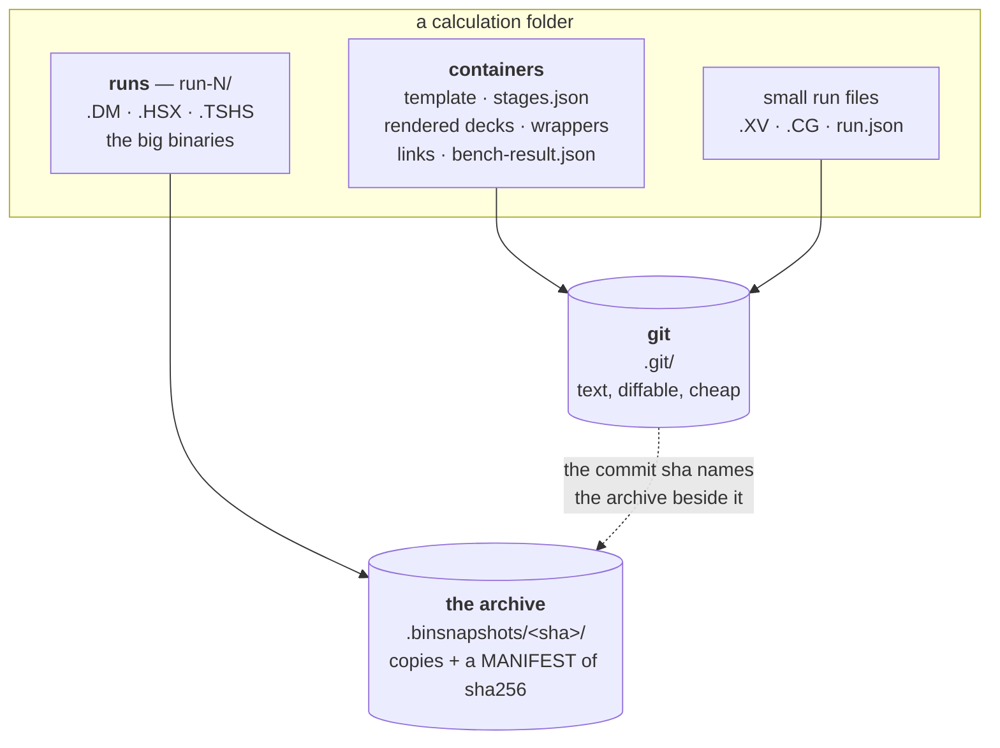

# Checkpointing — the invariants a run directory's history must hold

**Role:** contract
**Domain:** execution
**Companions:** [`execution/running-a-job.md`](?doc=execution/running-a-job.md)
— the guide (`running-a-job.md § 6`): what `molbuilder snapshot` is for and how
to drive it, which this document never repeats;
[`execution/job-contracts.md`](?doc=execution/job-contracts.md) — the registry
entries for `.mbcheckpoint.json` and the archive MANIFEST
(`job-contracts.md § 6.1`), and the run directory being checkpointed
(`job-contracts.md § 2`);
[`engines/stages.md`](?doc=engines/stages.md) — the folder this history is taken
of, and the two boundaries where it is taken (`stages.md § 7.3`);
[`execution/run-identity.md`](?doc=execution/run-identity.md) — the id every
commit and tag carries.

**Status: mixed, and each invariant says which it is.** Most hold of the shipped
`Repo` core today and a change must not break them; a few depend on the staged
layout (`engines/stages.md § 7.1`) and cannot be asserted until it exists. The
split is *not* by section — § 2 contains both — so every invariant carries a
**holds today** or **needs the layout** marker, and § 6's sheet collects them.
Every one is written so a test can assert it; that is the point of the
document.

**This contract owns:** what must never change in a checkpointed run directory,
and what information must be kept separate from what. Where the history sits in
the project tree, and why it sits there, is
[`execution/project-layout.md`](?doc=execution/project-layout.md) § 6.

---

## 1. Why invariants rather than a description

The checkpoint history is what makes a folder of stages safe to rewrite, safe to
branch and safe to come back to (`engines/stages.md § 7.2` and
`engines/stages.md § 7.3`). Everything
downstream of it — replacing a produce, redoing a stage, forking a what-if —
assumes the history is *complete and honest*. A history with a hole in it is
worse than none, because the hole is invisible until the moment somebody needs
what was in it.

So this document is a list of things that must always be true, each with the
failure it prevents and the check that catches it. It is the review sheet for the
code, not a tour of the feature.

### 1.1 What is shipped, and what this design changes

The `Repo` core, the `molbuilder snapshot` CLI, the HTTP routes and the sidebar
panel all ship (`running-a-job.md § 6`). Read this document as a statement of
what that code must keep doing, plus the six changes a staged folder needs:

| | Shipped today | With a staged folder |
|---|---|---|
| **What it covers** | one flat run directory | the calculation root and every stage beneath it — **one repository per calculation** (L1) |
| **Archive globs** | `*.DM`, `*.HSX`, … — matched beside the config | must match **at depth**; today's patterns miss `<stage>/<id>.DM` and every binary lands in git as a blob (L2) |
| **When a checkpoint is taken** | when the user runs `snapshot checkpoint` | still **only when the user says so** — but `prep` **asks**, when it is about to change a directory that already holds results (§ 4.1) |
| **What it is called** | a free-text message; a tag name the user picks | the message carries the id and the stage; a stage completion is tagged `<id>/<stage>/<UTC>` (L3) |
| **Who initialises** | `snapshot init`, always explicit | a produce that *creates* the folder initialises it; one writing into a folder that already existed without a checkpoint does not |
| **`branch`** | CLI **and** `POST /api/checkpoint/branch` (added 2026-08-06) | the operation the staged design turns on — the browser could report a stage finished and not let you fork from it |

Everything else — the text/binary split, the archive format, build-verify-swap,
verify-before-restore — is unchanged, and §§ 2–4 exist to say so precisely enough
that a change can be checked against them.

---

## 2. The separations — what must be kept apart

**Two stores, and every file is in exactly one of them.** That is the whole data
structure, and most of the invariants below are consequences of it:



| | goes to | why |
|---|---|---|
| decks, wrappers, `stages.json`, links | **git** | text — a diff is meaningful and the cost is nothing |
| `.XV`, `.CG`, `run.json` | **git** | small, and *"a restore brings back a resumable state"* |
| `.DM`, `.HSX`, `.TSHS` | **the archive** | large and binary — git would store every version whole |
| a benchmark's trial output | **neither** | a five-iteration throwaway is not a result |

**S1 is that picture stated as a rule**: never both, never neither. Both halves
fail silently — a big binary in git bloats the repository until a clone is
impossible, and one in neither store is *gone* after a restore, with nothing
saying so.

### 2.1 The two stores, on disk

The same picture as files, after two checkpoints of a two-stage calculation. This
is what every invariant below is talking about:

```text
bdt_au_relax_c6h4s2au38/
├── .git/                              ← store 1: the text history
├── .gitignore                         ← generated: ignores exactly what the
│                                         archive claims (S1a)
├── .mbcheckpoint.json                 ← which patterns count as "big" here
├── .binsnapshots/                     ← store 2: the content archive
│   ├── 4f9c…a71/                        one directory per commit sha
│   │   ├── 01_coarse/run-0/bdt_au_relax_c6h4s2au38.DM
│   │   └── MANIFEST
│   └── b2e0…33d/
│       ├── 01_coarse/run-0/bdt_au_relax_c6h4s2au38.DM   ← same content as
│       │                                                   above: a hard link,
│       │                                                   costing no disk (L5)
│       ├── 02_tight/run-0/bdt_au_relax_c6h4s2au38.DM
│       └── MANIFEST
├── stages.json                        ┐
├── bdt_au_relax_c6h4s2au38.fdf.template │ tracked by git —
├── 01_coarse/                         │ text, diffable
│   ├── bdt_au_relax_c6h4s2au38_coarse.fdf
│   └── run-0/
│       ├── bdt_au_relax_c6h4s2au38_coarse.out
│       ├── bdt_au_relax_c6h4s2au38.XV      ← small: git
│       ├── run.json                        ┘
│       └── bdt_au_relax_c6h4s2au38.DM      ← large: gitignored, in the archive
└── 02_tight/…
```

And one `MANIFEST`, which is the whole format — three columns, two spaces
between, sorted by the third:

```text
7ef4c6452a48e8625b612ee830dd7554959b03b23df81867e38edc6d8bb1344a  8388608  01_coarse/run-0/bdt_au_relax_c6h4s2au38.DM
36c543955301c21a0ca61358275551df1ba4837a2c9fd93bd6c185f67409a572  8388608  02_tight/run-0/bdt_au_relax_c6h4s2au38.DM
```

**Read the key column and the design is visible.** It is a path *relative to the
calculation root*, not a bare filename — which is what lets one archive hold a
`.DM` from every stage without them colliding (L2). Every component is checked so
a restore cannot be steered out of the folder: no leading `/`, no `..`, no
dot-prefixed component that would reach `.git` or `.binsnapshots`.

**And the sha column is why the same content is stored once.** Two commits that
both contain an unchanged `.DM` record the same sha, so the second archive links
to the first's file instead of copying it (L5) — the archive still holds a real
file at that path, so nothing reading it can tell the difference.

### S1 — a **regular file** is git-tracked **or** content-archived, never both, never neither

*holds today.*

`.mbcheckpoint.json`'s `archive_globs` classify a run directory's files: text
(including the small warm-restart `.XV` / `.CG`) is committed to git; the large
binaries are gitignored and archived by content under `.binsnapshots/<sha>/`.

**Where a file sits decides whether it is ours.** `project-layout.md § 1.4`
makes every directory a *container* (setup — text, git's) or a *run* (what one
invocation produced). The archive covers the runs this calculation owns: a flat
root, or a stage's `run-N/`. A nested container's runs — a benchmark's
`point-*/`, two levels down — hold five-iteration throwaways and are not this
history's business. **Depth, not names, and no marker file.**

**No dotfiles either, and writer and reader must agree on that.** The MANIFEST
parser rejects a dot-prefixed component anywhere in a key, so the archive walk
must skip them at every level — basename included. It filtered only the parent
directories until 2026-08-06, and pathlib's `*` matches a leading dot, so a file
like `.hidden.DM` was archived under a key the parser refuses: **the archive wrote
a MANIFEST its own reader could never accept**, making that checkpoint
permanently unverifiable and unrestorable.

**Symlinks are outside this too, and the word "regular" is load-bearing.** A
stage links its deck and the shared pseudopotentials up to the calculation root,
and an attempt links the deck down from its stage — so a checkpointed tree is
full of links. A link has no content of its own: the real file is tracked or
archived once, wherever it actually lives. Git ignores the link as well (a
gitignore pattern matches by name, not by file type), so a link is in *neither*
set, and that is correct rather than a hole — the layout is reproducible from the
description, while the bytes are already stored once. Archiving a link as a
second copy would duplicate content *and* restore a regular file where a link
belongs.

> **A file a stage continues from is not a link.** It is copied in as a real
> file before the run starts (`project-layout.md § 1.6`), so it is an ordinary
> archived binary like any other — the link rule above is about the deck and the
> shared package, which are the links a checkpointed tree actually contains.

| | |
|---|---|
| **How it fails** | A file matching an archive glob that is *also* tracked puts a multi-gigabyte blob in git history forever. A file matching neither is in no snapshot at all — a restore silently does not bring it back |
| **How to check** | For every file in a checkpointed directory: `matches_archive_glob(f) XOR git_tracked(f)` is true. Assert it over a fixture directory containing one of each engine's warm files plus a text log |

**An archive is now always written, even with nothing to put in it.** A missing
archive directory used to mean two things — *this commit had no big binaries* and
*this commit's archive is lost* — which is why `missing_archive_warning` has to
guess from whether **other** commits have archives, its docstring conceding that
*"a lost archive cannot be proven"*. Every commit now gets a directory and a
MANIFEST, empty when there was nothing to archive, so absence is evidence rather
than a hint. (Repositories predating this have legitimately absent archives, so
the warning stays a warning; promoting it to an error is a later step.)

### S1a — the ignore set is *derived* from `archive_globs`, never kept beside it

*HOLDS as of 2026-08-06 — it did not, and my earlier reading of it was half
right.*

S1 rests on two lists agreeing: `archive_globs` in `.mbcheckpoint.json`, and what
git ignores in `.gitignore`. **One list, one writer**, or the agreement is a
coincidence somebody has to maintain.

`set_archive_globs` was already that writer and says so — *"derived from the same
resolved globs, so they never drift"*. **`init` was not.** It wrote `.gitignore`
only `if not gi.exists()`, so a directory that already had one — every benchmark
bundle, every directory anyone had worked in — kept an ignore file that said
nothing about the archive set. The result is S1's *other* branch: the file
archived **and** committed, a large blob in git history forever.

Both now go through one writer that keeps a **marked section** and leaves
everything outside it byte-for-byte. It also excises an unmarked block written
before the markers existed — appending beside one would leave the old patterns in
force, so narrowing the classification would leave a file ignored and no longer
archived, which is the losing branch again.

| | |
|---|---|
| **How it fails** | A second writer. Any future path that edits `archive_globs` without going through that API, or hand-edits `.gitignore`, makes a formerly-archived pattern start committing as a blob or a newly-archived one keep being tracked — **S1 broken by a configuration change rather than by a bug**, which is the kind nobody thinks to test |
| **How to check** | Grep for writers of `archive_globs` and of `.gitignore`: there is exactly one of each, and they are the same function. Then a regression test: `config --set` changes both files, and a fixture whose two disagree is *reported*, not obeyed |

### S2 — shared state lives above; a stage writes only inside its own directory

*needs the layout.*

A staged folder holds shared files once at the parent and one subdirectory per
stage (`engines/stages.md § 7.1`). Cross-contamination is exactly what that
separation exists to prevent.

| | |
|---|---|
| **How it fails** | A stage writing through an inherited symlink overwrites the *producing* stage's result, and the history then records one stage's outputs replacing another's with no diff that says so |
| **How to check** | **Two halves, and one alone is worse than useless.** (a) Checkpoint the folder, run one stage, read `git status` at the parent: every changed path is under that stage's subdirectory. (b) **`git status` cannot see the big binaries** — they are gitignored, which is S1 working as designed — so compare each archived file's sha against the head archive's MANIFEST for the same thing. The shipped restore already needs exactly this and has the helper (`_working_binaries_dirty`), whose own comment says *"big binaries are gitignored, so `git status` cannot see them"*. Half (a) alone would pass while a stage overwrote another stage's `.DM` — the single most valuable file it could destroy. The guard is that nothing is inherited by reference at all: whatever a stage continues from is **copied** into its run directory before it starts (`project-layout.md § 1.6`), so there is no link to write through. The shipped chained ladder still relies on localize-on-run for the same protection (`job-system.md § 5.2`); the staged path removes the hazard instead of guarding it |

### S3 — a run records what it started from

*needs the layout.*

You must be able to tell a stage that **inherited** a geometry from one that
**computed** it. Otherwise a checkpoint records the same bytes with two different
meanings, and a year later nobody can say which run a published number came from.

**This invariant survived a design change and its mechanism did not.** When
stages were chained, an inherited file arrived as a *symlink* and became a
regular file when the wrapper localised it — the type change on disk *was* the
record. Stages no longer chain (`project-layout.md § 1.6`): whatever a run
continues from is copied in as a real file before it starts, so there is no type
change left to read.

The record is now explicit instead of incidental: **`run.json`'s
`continued_from`** (`project-layout.md § 1.6`), naming the run directory the
files came from, or absent when the run started from the structure.

| | |
|---|---|
| **How it fails** | Two runs hold byte-identical `.XV` files. One computed it; one was handed it. With nothing recording which, a history of five stages cannot be read backwards, and "where did this geometry come from" has no answer |
| **How to check** | Prepare a stage from a named earlier run: its `run.json` names that run. Prepare one from the structure: the field is absent, not empty. Then the useful assertion — for every run in a finished tree, `continued_from` either names a directory that exists in the same tree or is absent; it never names something that has been deleted or was never there |

> **An explicit record is better than the one it replaced**, quite apart from the
> design change. A symlink becoming a file says *something was inherited here*;
> it does not say **which run**, and with several attempts per stage that is the
> question you actually have.

### S4 — the description is input; everything else in the folder is derived

*needs the description (`engines/stages.md § 6`).*

`stages.json` is written by the user's surface and read by the generator. Decks,
wrappers, links and outputs are derived from it.

| | |
|---|---|
| **How it fails** | A produce or a run that edits the description makes the folder self-modifying: the file that is supposed to explain the folder becomes a consequence of it, and reopening no longer restores intent |
| **How to check** | The description's bytes are unchanged by any produce that did not receive a new one, and by every run. Hash it before and after |

### S5 — identity is calculation-level; the run index is invocation-level

*holds today, trivially: nothing derives an identity from a run at all — the
wrapper reads `SystemLabel` **out of the script** (`job-contracts.md § 4.3`),
which is an input. The invariant exists to keep it that way once a description
does.*

The id names the calculation; `-run0`, `-run1` name invocations of it
(`run-identity.md § 2`).

| | |
|---|---|
| **How it fails** | If anything about a run could change the id, the warm files it produced would be orphaned by the act of producing them |
| **How to check** | No code path derives an id from a run's output, a timestamp, or a run index. `stages.json`'s `run.id` is read, never recomputed (`run-identity.md § 3`, rule 1) |

### S6 — a restored folder is internally consistent

*needs the description.*

`stages.json` is tracked text (S1), so it travels with the commit. Restoring a
checkpoint therefore restores **the description together with the decks it
produced** — the folder explains itself at every point in its history, not only
at the tip.

| | |
|---|---|
| **How it fails** | If the description were untracked or archived, a restore would give you last week's decks beside this week's description, and nothing would say which the results came from |
| **How to check** | Restore any commit and re-run the produce with `dry_run`: it reports no change. **One exclusion, and only one:** PROVENANCE stamps `generated-at` at generation time (`job-contracts.md § 3.2`), so two produces of the same description are never byte-identical and the comparison ignores that key. Anything else differing is a real difference — which is exactly what makes this check worth running |

---

## 3. The immutabilities — what must never change

### I1 — a written archive's *content* is never modified

*holds today — read against the code.*

Git commits are immutable by construction; the archived bytes must be too.

**One shipped command edits an archive and is not a violation.**
`molbuilder snapshot migrate-manifest <ref>` rewrites a legacy 2-column MANIFEST
into the canonical 3-column form (`running-a-job.md § 6.2`). That changes how the
archive is *described*, never what is in it — so the invariant is about content,
and the migration carries its own: **every `(name, sha256)` pair survives it, and
the `bytes` column it adds agrees with the file on disk.**

| | |
|---|---|
| **How it fails** | An archive directory whose *files* are rewritten in place means an old commit's binaries silently become a newer run's. Every restore before that point returns the wrong data, and nothing reports it |
| **How to check** | For a given commit sha, the archived bytes never change. Re-archiving the *same* sha rebuilds the directory — legal only because one commit implies one tree — so the assertion is on **content for a sha**, not on the directory's mtime. The rebuild moves the published archive **aside** before publishing the new one and deletes it only after (A1), so no window exists in which neither is present. For the migration specifically: diff the parsed MANIFEST before and after — the name→sha mapping is unchanged, and I2 passes afterwards |

**One phrase in the shipped docs is misleading, and it misled me.**
`running-a-job.md § 6.1` and `job-contracts.md § 6.1` both say the archive is
*"deduped by content"*. Reading `checkpoint.py`, that describes deduping by
**basename within one MANIFEST** — so that overlapping globs like `*.DM` and
`*.D*` do not list a file twice and trap the strict parser. It is **not**
storage dedup across checkpoints: `_archive_binaries` copies every big binary
into `.binsnapshots/<commit-sha>/` on every checkpoint, with no hardlinking and
no content-addressed store. Ten checkpoints of a folder holding a 2 GB `.DM`
cost 20 GB. See L5.

### I2 — a MANIFEST is authoritative for its archive

*holds today.*

The 3-column `<sha256>  <bytes>  <name>` MANIFEST (`job-contracts.md § 6.1`)
describes exactly what is in that archive.

| | |
|---|---|
| **How it fails** | A MANIFEST that names a file the archive lacks turns a restore into a partial one; a sha that does not match turns it into a silent corruption |
| **How to check** | For every entry: the file exists, its size equals the recorded bytes, and its sha256 equals the recorded sha. Run it over every archive in a repository — this is the single most valuable test in the system |

### I3 — warm state is moved or restored, never incidentally lost

*holds today — read against the code: the cold path is a `mv` into
`<basename>-restart-aside-<UTC>/`, and the only `rm` in a generated wrapper
targets the rank helper and the MPS pipe directory. One mover, no deleter.*

`--cold` **moves warm files aside** into `<basename>-restart-aside-<UTC>/`; it
does not delete them (`job-contracts.md § 4.1`). No operation *whose purpose is
something else* removes or overwrites them — in particular a replacing produce,
which may remove orphaned decks and wrappers but never state
(`engines/stages.md § 7.2`).

**`restore` is the one exception, and it is not a leak.** Restoring an earlier
checkpoint replaces the worktree, warm files included — that is precisely what
the user asked for, it refuses on a dirty tree first (A2), and the state it
overwrites is itself in a commit. The invariant is therefore about *incidental*
loss: **exactly one operation may move warm state (`--cold`), exactly one may
replace it (`restore`), and nothing else may touch it.**

| | |
|---|---|
| **How it fails** | Hours of converged geometry destroyed by an operation whose job was to write an input file |
| **How to check** | Grep every path that writes into a run directory for an unlink, an rmtree or a truncating open whose target can match a warm-file suffix. There should be exactly two hits — the cold move-aside and the restore — and no third |

### I4 — a generated wrapper contains no git

*holds today.*

`running-a-job.md § 6.2` records that the wrapper-bootstraps-git path was
deliberately dropped: *"the wrapper is deliberately git-agnostic, so init is
CLI/UI-only."* A wrapper that committed would need git on the compute node, which
`running-a-job.md § 2`'s standalone contract forbids.

| | |
|---|---|
| **How it fails** | A run that dies on a node without git, for a reason having nothing to do with the calculation |
| **How to check** | No emitted `.run.sh` or `.sbatch` invokes git: grep the rendered wrapper fixtures for `git` **as a command word** (`(^\|[;&|(\s])git\s`), not as a substring — `digits` and `logging` are not violations, and a check that flags them is one somebody will disable |

---

## 4. The atomicity rules — a mutation completes or does not happen

### A1 — archiving is build, verify, swap, then delete

*holds today — read against the code, and it is stronger than this contract asked for.*

The sequence is: build into a `.tmp`, hash, copy, **re-hash and verify the copy**,
write the MANIFEST, move any published archive **aside**, `os.replace` the new one
into place, then delete the aside.

**The aside step was missing until 2026-08-06.** The code removed the published
archive and *then* renamed the new one in, leaving a window in which neither
existed — a crash there destroyed the archive that was already there and
published nothing, which is the one outcome "complete archive or nothing" must not
include. The worst case is now a stray `<sha>.old` beside a complete archive.

| | |
|---|---|
| **How it fails** | An interrupted archive leaves a directory that looks complete and is not, and I2's check would be the only thing that ever noticed |
| **How to check** | Kill the process between each step of a checkpoint; afterwards the archive set is either the old one or the new one, never a mixture |

The shipped implementation does three things this contract did not think to ask
for, and each is worth keeping: it **validates the sha directory name** before
writing anything; it hashes the **source**, copies, then re-hashes the **archived
copy** and requires them equal — because deriving the MANIFEST sha from the copy
alone would make a disk-corrupted copy *self-consistent*, later verifying against
its own bad sha and being restored as truth; and it cleans up the `.tmp` on
`BaseException`, so an interrupt leaves no stray directory. A change that
simplifies any of the three is a regression.

### A2 — restore verifies before it mutates

*holds today — read against the code, in exactly this order.*

Restore refuses on a dirty text tree, refuses on dirty binaries (sha-compared
against HEAD's archive), **verifies the target ref's archive before touching
anything**, and only then restores the worktree and copies binaries back.

| | |
|---|---|
| **How it fails** | A restore that half-completes leaves a worktree from one commit and binaries from another — a state no commit ever held, which nothing can diagnose afterwards |
| **How to check** | Corrupt one byte of the target ref's archive and attempt a restore: it refuses, and the worktree is byte-identical to what it was |

The shipped order is: refuse on dirty text (`git status --porcelain`), refuse on
dirty **binaries** (shas compared against the head archive, since git cannot see
them — S1 again), verify the *target* archive, only then `git restore`, only then
copy the binaries back. Four gates before the first mutation. The invariant is
that order, not merely the presence of the checks.

### A3 — the checkpoint precedes the mutation it protects

*needs the prep prompt (§ 4.1).*

A pre-produce checkpoint is committed **before** the first file of the new produce
is written (`engines/stages.md § 7.3`).

| | |
|---|---|
| **How it fails** | Taken afterwards, it records the state it was supposed to preserve a way back to |
| **How to check** | Interrupt a produce after the checkpoint and before the swap: the commit exists and **`git status` is clean** — no new file reached the folder. That is the same assertion as `engines/stages.md § 7.2`'s transactional rule seen from the history's side, and like S4's check it uses git rather than an mtime comparison, which clock skew and filesystem granularity both defeat |

### 4.1 Who takes a checkpoint, and when they are asked

*Decided 2026-08-07. This replaces an earlier plan for **automatic** checkpoints,
and the change is a simplification: it deletes a problem rather than solving it.*

> **A checkpoint is always an explicit act. molbuilder never takes one on its
> own.** What it does is **ask**, at the one moment where not having asked would
> cost something — and then do what it is told.

**The moment is interactive `prep`, because prep is the mutation.** A3 says the
checkpoint precedes the mutation it protects, and `prep` *is* that mutation: it
is what rewrites a stage's deck, replaces a produce, or builds the next attempt.
So when prep is about to change a directory that already holds results, it says
so and offers to save first. The user answers.

**Never at run or submit time.** That run may be a scheduled job — a prompt would
block a queue, and a checkpoint taken there would be taken by the wrong party at
the wrong moment. Submitting is not a mutation of anything that already exists;
it starts something new.

**And never on the compute node**, which is I4, and which this decision makes
permanent rather than provisional: nothing about the wrapper needs to change,
because the wrapper was never going to be the answer.

**There is already an observer, and it is not this.** `mb_monitor.py` runs
beside the job on the node it runs on: it watches the launcher's PID, so it knows
authoritatively when the run ended, it parses the outputs, so it knows how it
went, and it carries a **registered notifier hook** (`register_notifier`,
`MB_NOTIFY_URL`) so a user can be told — webhook, email, whatever they wire in.
Nobody has to sit at the cluster at 3am.

**What the monitor must not do is act.** It observes and it notifies; it never
decides and never mutates the calculation. That is the same boundary the wrapper
has — activate and exec, nothing more (`running-a-job.md § 2.2a`) — applied one
layer out, and it is why the monitor is not where a checkpoint comes from even
though it is the thing that knows. Taking one would need git on the compute node
(I4), and more importantly it would be the wrong party: saving is a decision, and
decisions are the user's.

**So the two halves are separate, and each is where it belongs.** The monitor
tells you a run finished and how. The next `prep` asks whether to save before it
changes anything. Nothing needs to observe *and* act, which is what made this look
harder than it is.

| | |
|---|---|
| **Where the prompt fires** | interactive `prep`, when the target directory already holds results |
| **What it says** | what is about to change, and that saving now is the way back |
| **Who decides** | the user, every time |
| **Non-interactive prep** (a script, `--yes`) | proceeds **without** a checkpoint and **says so in its output**. It may not silently decide either way: blocking automation is wrong, and quietly taking or skipping a save is worse |
| **The last stage** | nothing prompts, because nothing follows. Saving the final state is the user's explicit act — and a surface showing a finished, unsaved run should say it is unsaved |

**Why asking is cheap enough to be worth it.** Before L5 a checkpoint copied
every large binary again, so offering one at every prep would have been offering
a real cost. Now a checkpoint stores what changed, so the honest answer to *"is
it worth saving?"* is almost always yes — and the prompt is a decision about
intent rather than about disk.

---

## 5. Both directory shapes, and why flat needs this most

`project-layout.md § 1` defines two shapes — **flat** (one directory, stages told
apart by filename suffix, warm files shared) and **hierarchical** (a directory
per stage, a directory per attempt). **Every invariant above holds in both.**
What differs is how much work they are doing.

| | **Flat** | **Hierarchical** |
|---|---|---|
| What the repository covers | the one directory | the calculation, all stages beneath it |
| What git tracks | decks, wrappers, the small warm files | the same, spread over containers |
| What the archive covers | the big binaries in that directory | the big binaries in every `run-N/` |
| How the two are told apart | by **pattern** (`archive_globs`) | by pattern, at any depth (L2) |
| **What a checkpoint is for** | **the only way back to an earlier state** | insurance, and a branch point |

**The classification rule is the same sentence in both**: a big binary matching
`archive_globs` goes to the archive, wherever it sits; everything else is git's.
The hierarchical shape needs that walk to be **recursive**, which is L2 — and
that recursion costs the flat shape nothing, because it has only one level.

### 5.0 Why the flat shape depends on this more than the staged one

In the hierarchical shape every stage and attempt is on disk simultaneously.
Going back to stage 1's geometry means opening `01_coarse/run-0/`. The checkpoint
is protection against loss and a way to branch — valuable, not load-bearing.

**In the flat shape it is load-bearing.** The warm files are unsuffixed and
shared *by design* — that is exactly what lets stage 2 continue from stage 1 —
and it means stage 2 overwrites them. So:

> **Without a checkpoint, a flat directory can only move forward.** With one, it
> can go back to any state it was checkpointed in and continue from there. That
> is not a convenience on top of the flat shape; it is what makes the flat shape
> usable for iterative work at all.

Two consequences worth stating:

- **A checkpoint before each stage is not optional housekeeping in a flat
  directory** — it is the save point. Miss one and that state is unrecoverable,
  because nothing else on disk holds it.
- **Restore is a rewind, not a fetch** (S6): it returns the whole directory to a
  past state. Going back therefore means *checkpoint what you have, then restore
  the earlier one*. Skipping the first step loses the present. The hierarchical
  shape never poses that question, because it never had to overwrite anything.

### 5.1 What a staged folder adds

All four **need the layout**, and each follows from `engines/stages.md § 7.1`.

> **Why `L` and not `P`.** `molbuilder/checkpoint.py`'s own comments cite
> numbered principles — *"P3 (the user decides; the system never silently
> discards binary work)"* — from a design document that no longer exists in the
> tree. A second P-series in the same subsystem would make a code comment and a
> contract row read as the same reference and mean different things. **L** is for
> layout, which is what all four are about.

### L1 — one repository per calculation, in either shape

*HOLDS as of 2026-08-06. This was the blocking defect; the recommended option
below was taken.*

**One repository covers one calculation** — the whole of it. In the flat shape
that is the single directory. In the hierarchical shape it is the calculation
root, **not** each stage: a per-stage repository cannot restore a shared file
that lives above it (a restored stage's pseudopotential links would dangle), and
no such repository contains the workflow, so *branch at stage 2* cannot be
expressed.

**What was wrong.** `Repo.init` walked for subdirectories containing a
working-dir marker (`.fdf`, `.py`, `.run.sh`) and refused if it found any. The
rule was sound for the world it was written in — a parent holding several
*independent* run directories would checkpoint unrelated jobs together, and
restoring one would rewind the others. It could not tell that apart from *the
stages of one calculation*, which is the case where the parent is exactly the
right unit.

**It was not only the proposed layout that this blocked.** Verified against the
shipped `jobset prep` output: a bundle with `point-stage1/` and `point-stage2/`
holding linked decks was refused, so a staged job-set could not be checkpointed
at all. The guard had been closing a shipped path.

**The fix asks a different question.** A directory holding one of the recognised
descriptions — `stages.json`, `job-set.json`, `bench-manifest.json` — has
declared itself **one unit of work whose subdirectories are its own parts**.
That is not a new marker file: each is already in the artifact registry
(`job-contracts.md § 6.1`), and it is the same file that makes the folder a
calculation in the first place. So:

| The directory | Nested working dirs | Result |
|---|---|---|
| carries a description | its own stages | **init proceeds** |
| carries none | several independent calculations | refused, with the reason |
| any | a subdirectory that is **already a repository** | refused, in both cases |

The last row is new and is not the same rule. A history inside a history has no
consistent restore — the outer cannot rewind files the inner owns — so it is
refused even in a bundle root, where nested working dirs are otherwise fine.

| | |
|---|---|
| **How it fails** | Two ways, opposite in shape. Too narrow: a calculation cannot be checkpointed at all, and the flat shape's only route back to an earlier state does not exist (§ 5.0). Too wide: one history spans several unrelated calculations, and restoring one rewinds work nobody meant to touch |
| **How to check** | `tests/test_checkpoint_repo_scope.py` — a bundle root with linked decks initialises; a topic directory holding two independent calculations is refused **and names both**; a nested repository is refused even under a description; and a hierarchical folder round-trips, so a `.DM` two levels down is archived, survives a later stage, and returns on restore. That last one matters most: an `init` that succeeds and then loses results is worse than one that refuses |

> **A dot-directory is no longer a working directory.** The old walk skipped only
> `.git` and `.binsnapshots`, so a `.venv/` beside a run — full of `.py` — read
> as a nested working dir and blocked `init` for a reason with nothing to do with
> calculations. All dot-directories are skipped now.

> **The description must be read, not merely found** — *not held today.*
> A root's description says which subdirectories are this calculation's own, so
> **a nested working directory the description does not name is refused**, exactly
> as it would be under a root that declares nothing. Otherwise the rule degrades
> from *"these are one calculation's parts"* to *"somebody put a JSON file here"*,
> and one history spans work nobody meant to join — the too-wide failure above,
> reached through the door the fix opened.
>
> Today `_is_bundle_root` asks only whether one of the three files **exists**; it
> never opens it. Copy an unrelated calculation in beside `coarse` and `tight`
> and `init` takes all three. The check that closes it is cheap, and it becomes
> assertable when a producer writes a real description to read against — which is
> when it should be written, not guessed at now. Until then this clause is a
> claim, like S3 and S4, and it is listed as one.

### L2 — the archive globs match at depth

*HOLDS as of 2026-08-06 — this was broken, and fixing it is what prompted the
rest of this section.*

**The failure mode is worse than the obvious one, and the obvious one is what
most readers will assume.** A big binary that the archive misses does not "land
in git as a blob" — it lands **nowhere**.

The two sides of S1's classification resolve depth **differently**:

| | Pattern | Reaches `coarse/<id>.DM`? |
|---|---|:--:|
| `.gitignore`, from `_render_gitignore` | the raw glob, `*.DM` | **yes** — a gitignore pattern with no slash matches at every level |
| the archive set, `_list_big_binaries` | `path.glob("*.DM")` | **no** — its own docstring says *"Top-level big binaries"* |

So a stage's density matrix is **gitignored and unarchived** — excluded from the
commit *and* absent from `.binsnapshots/`. It is in no snapshot at all, and a
restore silently does not bring it back. That is S1's "never neither" branch, the
one whose failure is losing data rather than wasting disk.

| | |
|---|---|
| **How it fails** | Quietly, at the moment of maximum trust. The user restores a checkpoint expecting a resumable state and gets the geometry (`.XV` is text, so it is tracked) with no density matrix beside it. The run starts over and nothing says why |
| **How to check** | Produce a two-stage folder, run both, checkpoint, assert S1 over the whole tree: every file is tracked or archived. It fails today, and that failure is the acceptance test |
| **Fixed by** | The archive walk is recursive and the MANIFEST key is a **repo-relative POSIX path** rather than a bare basename — so both sides resolve depth the same way. The key space *widened*: a basename is a valid relative path, so every archive written before it reads unchanged. Two consequences fell out and are part of the invariant: the walk **skips symlinks** (a carried restart file is inherited, not owned — S3 — and archiving the link would restore a regular file where a link belongs) and **skips dot-directories** (a recursive walk that forgot would archive the archive). Pinned by `tests/test_checkpoint_nested_layout.py` |

### L3 — every commit and tag names its calculation

*The naming HOLDS as of 2026-08-06 (`checkpoint.py`, `test_checkpoint_invariants.py`).
What still needs building is the **prompt** that offers it — nothing "notices" a
stage finished, and under § 4.1 nothing has to.*

The commit message carries the id and the stage; a finished stage is tagged
`<id>/<stage>/<UTC>` (`engines/stages.md § 7.3`). A folder can be moved, copied
to a cluster, or opened a year later, and a history whose commits say only
*"stage 2 converged"* cannot say which calculation that was.

**Nothing is normalised.** The id is `[A-Za-z0-9_-]+` and a stage is
`[A-Za-z0-9_]+`, both already ref-safe, so a name that would need repairing is
**refused** rather than rewritten — silently fixing an id would decouple the
history's name from the folder's, which is the one thing the name exists to tie
together.

*Check:* every commit message contains the folder's `run.id`, and every tag
parses into exactly three parts of which the first equals it — read back through
the same parser that writes them, so the two cannot drift.

### L4 — the tag namespace is stage completions only

Pre-produce checkpoints are commits, reachable through `snapshot list`. Tagging
them too would bury the points a user meant to reach among the ones they passed
through.

*Check:* the tag molbuilder **offers** is offered only at a stage completion. A
user tagging by hand is their own business — `snapshot tag` exists for it — so the
assertion is on what the offered path emits, not on the total. Under § 4.1 the
user still says yes; this invariant governs what is proposed, not who decides.

### L5 — a checkpoint's cost is bounded by what changed, not by what exists

*HOLDS as of 2026-08-06 — `tests/test_checkpoint_invariants.py`.*

> **This verdict was written twice and wrong both times (settled 2026-08-07).**
> First it said HOLDS while filing a display discrepancy as "a separate fix" —
> which looked like letting a passing test outrank the invariant. So it was
> changed to *half held*, on the argument that "a cost nobody can see is not a
> bounded cost." That was an over-correction in the other direction.
>
> **This invariant is about storage, and storage is what it governs.** A
> checkpoint's disk cost is bounded by what changed; that is true, tested, and
> unaffected by what any surface prints. What a display shows is a display's
> problem, and belongs to a guide rather than to a contract about an archive. The
> discrepancy is real and is recorded below — but it does not make this invariant
> half-true, and dragging it in here was the contract reaching for something that
> is not its business.

**What is already archived is not archived again.** An archived file is never
rewritten (I1), so when a binary's content is already in the archive the new
checkpoint gets a **hard link** to it rather than a second copy. A hard link is
a directory entry: the second checkpoint of an unchanged 2 GB density matrix
costs no disk.

**Nothing downstream knows the difference.** The archive still has a real file
at `<sha>/<key>`, so restore, `_verify_archived_binaries` and the MANIFEST
format are untouched — no new directory, no format change, no migration of
archives that already exist.

**Reuse is by content, and that is what makes it serve both directory shapes.**
In the hierarchical shape an attempt is immutable, so its files link forever
after their first save. In the flat shape one `<id>.DM` is overwritten every
stage, so its content genuinely differs and it is copied — correct rather than
wasteful (`project-layout.md § 6.2`). Neither case is special-cased; the content
decides.

**A candidate is verified before it is trusted.** The index of what is already
archived is read from MANIFESTs, which record only what a file *claims*. Linking
to a file that had rotted would record a sha its bytes do not have — turning a
cheap save into a corrupt one. So a candidate is hashed once per checkpoint and
copied past if it does not match. That is one read where a copy would have done
a read *and* a write, so the I/O falls too.

**A note on the number the surfaces print, which is not this invariant's
business but is worth recording where somebody will find it.** `archive_bytes`
and `archive_total_bytes` both sum file sizes, counting every hard link in full,
so ten checkpoints of an unchanged 2 GB binary are displayed as 20 GB while the
disk holds 2.

**Who needs that number? Nobody, as far as anyone has been able to say.** It
appears in five places — three CLI lines and two in the sidebar — and informs no
decision: the only choice it could feed is *"should I delete old checkpoints"*,
and there is no `prune` verb to act on it. So this is not a gap in the design; it
is a display printing something untrue about a quantity nobody uses.

The cheap honest fixes, in order of how little they cost: **stop printing it**,
or **make the repository total count each inode once** so what it claims is what
`du` would say. What is not worth doing is the two-number scheme an earlier draft
proposed here — a *logical* size per checkpoint and a *physical* one for the
folder, each with its own explanation. That was designing a vocabulary for a
readout nobody reads. Recorded as `web/staged-runs-architecture.md` item 10a, at
the size it deserves.

**Why not content-addressing.** `.binsnapshots/by-content/<sha256>` was the
fallback this invariant used to call for. It would change the archive layout and
need every existing archive migrated, to buy the same saving; hard links get
there without touching the format. The fallback stays available if the archive
ever needs to be shared across repositories, where links cannot reach.

| | |
|---|---|
| **How it fails** | Silently, and only at scale. Nothing errors; the archive grows linearly in checkpoints × binary size, and `prune` is unbuilt (`running-a-job.md § 6.2`), so nothing reclaims it either. Automatic checkpoints (`engines/stages.md § 7.3`) fire twice per stage, so a five-stage mission paid ten full copies of its `.DM` and `.HSX` set |
| **Made worse by L7's fix** | Binary-only changes now produce commits that previously did not exist — correctly, since the alternative was losing them — and each one used to copy the full binary set again. Fixing the data-loss bug raised the disk cost, which is why L5 followed it rather than waiting |
| **How to check** | Checkpoint a folder twice with the binaries untouched between them; the second checkpoint's *incremental* disk cost is near zero. Measured by inode so a hard-linked file counts once — summing `st_size` counts every link in full and would report no saving at all. Then the three that stop the cure being worse than the disease: a **changed** binary is stored again, two checkpoints never **alias** different content, and a **rotted** candidate is copied past rather than linked to |

### L6 — a history can be verified without being restored

*needs work — the capability exists but has no door.*

`_verify_archived_binaries` already checks existence, size and sha256 against the
MANIFEST and touches nothing (I2). It is called from exactly two places, both on
the restore path. **So the only way to learn that an archive is intact is to
attempt a restore** — which is the worst possible moment to find out it is not,
and which a user will not do speculatively on a folder they are working in.

| | |
|---|---|
| **How it fails** | A checkpoint taken onto a failing disk verifies at write time (A1) and is never looked at again until the day someone needs it |
| **How to check** | A `snapshot verify [<ref>]` verb — CLI and HTTP — runs I2 over one archive or all of them and reports. It is a few lines over a helper that already exists, and it is the natural home for the most valuable test in this document |

---

### L7 — a change to a big binary alone leaves no checkpoint

*not held today — found by running L2's acceptance test.*

`checkpoint()` runs `git add .`, then `git status --porcelain`; if the tree is
clean it returns `None`. Big binaries are gitignored (S1), so **a change that
touches only them leaves the status clean and produces no commit and no new
archive.** The code half-anticipates this: if HEAD has *no* archive at all and
binaries exist, it writes one. It does not notice that HEAD's archive is stale.

| | |
|---|---|
| **How it fails** | A user re-runs a stage that rewrites its `.DM` and nothing else git can see, checkpoints, and is told the tree was clean. The new density matrix is in no snapshot. It surfaces later as a refused restore ("uncommitted binary changes"), which is the safe direction, but the checkpoint they asked for never happened |
| **How to check** | Change only a big binary, checkpoint, and assert a new archive exists whose MANIFEST records the new sha |
| **Note** | In a staged folder a run also writes text (`.out`, `.XV`), so the clean-status case is narrower than it looks — but "narrower" is not "absent", and `--force`-style re-runs hit it |

### L8 — an archived attempt never differs afterwards

*needs the layout — and it is I2 pointed at a directory.*

An attempt is immutable by contract, not by permission bit
(`project-layout.md § 1.5`). Nothing stops an edit; what matters is that an edit
is **noticed**.

**Hierarchical only.** A flat directory's `<id>.DM` is *expected* to change —
every stage overwrites it, which is the shape working as designed
(`project-layout.md § 6.2`). The same re-hash still runs there and still
reports a difference; what changes is that the difference is news rather than a
violation. Do not let a check written for one shape fail the other.

| | |
|---|---|
| **How it fails** | Silently. Someone edits a file inside an attempt already saved, and every later save carries a history whose earlier points no longer describe what is on disk |
| **How to check** | Re-hash an archived attempt's files against their MANIFEST entries — exactly I2, over a directory the layout says is frozen. A difference is reported, never merged |

## 6. The review sheet

One line each, for reading over a diff:

| | Invariant | Assertable |
|---|---|:--:|
| **S1** | every **regular file** is tracked XOR archived — never both, never neither (symlinks are layout, not content) | today |
| **S1a** | the git-ignore set is *derived* from `archive_globs`, never kept beside it | today |
| **S2** | a stage writes only inside its own directory | needs the layout |
| **S3** | a run records what it started from (`run.json`'s `continued_from`) | needs the layout |
| **S4** | the description is never modified by a produce or a run | needs the description |
| **S5** | nothing a run produces can change the id | today — `test_checkpoint_invariants.py` |
| **S6** | a restored folder explains itself: description and decks travel together | needs the description |
| **I1** | a written archive's *content* is never rewritten; identical content dedupes | today |
| **I2** | every MANIFEST entry matches its file: name, size, sha256 | today — `test_checkpoint_invariants.py` |
| **I3** | exactly one operation moves warm state, exactly one replaces it, nothing else touches it | today — `test_checkpoint_invariants.py` |
| **I4** | no generated wrapper invokes git | today — `test_checkpoint_invariants.py` |
| **A1** | archive: build, verify the copy, then swap | today — `test_checkpoint_invariants.py` |
| **A2** | restore verifies the target archive before touching the worktree | today — `test_checkpoint_invariants.py` |
| **A3** | the checkpoint is committed before the mutation it protects | needs the prep prompt (§ 4.1) |
| **L1** | one repository per calculation, in either shape | **HOLDS** (2026-08-06) — `tests/test_checkpoint_repo_scope.py`; its *"the description must be read, not merely found"* clause **does not** — it needs a producer to write one |
| **L2** | archive globs match at depth | **holds** (fixed 2026-08-06) |
| **L3** | every commit and tag names its calculation | **the naming HOLDS** (2026-08-06) — `test_checkpoint_invariants.py`; what still needs building is the *prompt* that offers it (§ 4.1) |
| **L4** | molbuilder tags stage completions only | **the tag form HOLDS** (2026-08-06) — hierarchical, globbable, collisions refused; what still needs building is the *prompt* that offers it (§ 4.1) |
| **L5** | a checkpoint costs what changed, not what exists | **HOLDS** (2026-08-06) — `test_checkpoint_invariants.py` |
| **L6** | a history can be verified without being restored | **not held today** |
| **L7** | a binary-only change still produces a checkpoint | **holds** (fixed 2026-08-06) |
| **L8** | an archived attempt never differs afterwards | needs the layout — **hierarchical only** (`project-layout.md § 6.2`) |

**Fifteen of the twenty-two can be asserted against the code as it stands, and
all fifteen have a test** — nine (**S5 I2 I3 I4 A1 A2 L3 L4 L5**) in
`test_checkpoint_invariants.py`, five (**S1 S1a I1 L2 L7**) in
`test_checkpoint_nested_layout.py`, and **L1** in
`test_checkpoint_repo_scope.py`. Four (**L1**, **L2**, **L5**, **L7**) were found
broken; **L2, L5 and L7 are fixed**, and **L1 is fixed in the half that had a
mechanism** — its repository scope holds while *"the description must be read, not
merely found"* waits for a producer to write one.

**So two of the twenty-two are not held**: **L6** entirely (verification has no
door), and L1's description clause. Three more — **L3**, **L4** and that same
clause — are held in form and wait on the producer for their trigger.
"Assertable" counts an invariant whose *stated* requirement has a test; it does
not promise the whole requirement passes, and where it does not, the row above
says which half fails.

> It was thirteen until 2026-08-06, when **L3** and **L4** stopped needing the
> layout: naming a checkpoint and naming a stage tag are pure functions of an id,
> a stage and a clock, so the *forms* could be built and asserted while the
> *triggers* still wait for the producer. The count moved because half of two
> invariants became reachable, not because anything was reclassified.

### What has actually been read

| Read against the code | Verdict |
|---|---|
| **S1** | **broken** — a dot-prefixed basename was archived under a key the parser refuses, so the archive wrote a MANIFEST it could never read back. Fixed 2026-08-06 |
| **S1a** | **broken** — `set_archive_globs` was a single writer, `init` was not; "the hazard is false" was half a reading. Fixed 2026-08-06 |
| **S2** | check was blind to the big binaries; both halves now |
| **S5** | holds trivially — nothing derives an identity from a run at all |
| **I1** | held, restated: content-for-a-sha — and the rebuild now moves the published archive aside instead of deleting it first |
| **I2** | implemented and correct — but reachable only through restore (→ L6) |
| **I3** | held — one mover (`mv` to `-restart-aside-`), no deleter |
| **I4** | held — no generated wrapper invokes git |
| **A1** | strong in its three parts (sha-dir validation, source-vs-copy fidelity, `.tmp` cleanup) — **but the swap itself was not atomic**. Fixed 2026-08-06 |
| **A2** | held, in exactly the stated order — four gates before the first mutation |
| **L2** | was **broken, losing data rather than wasting disk** — fixed 2026-08-06, pinned by tests |
| **L5** | was **broken** — no cross-checkpoint dedup; fixed 2026-08-06 by hard-linking content already archived. Its verdict then flipped twice in one day — HOLDS, then *half held* because a display prints the wrong number, then HOLDS again once it was clear the display is not this contract's business. The lesson is about scope, not about the fix |
| **L6** | **absent** — no way to verify a history without restoring it |
| **L1** | **held** — a root carrying its description owns its subdirectories; a directory declaring nothing, and any nested repository, are still refused |
| **L7** | was **absent** — a binary-only change left `git status` clean and nothing was checkpointed; fixed 2026-08-06 |

**Seven defects found, all fixed.** Three (L1, L2, L7) turned up by *running* the
checks — L1 by building the shipped `jobset prep` shape and watching `init`
refuse it. **Four turned up by reading the module end to end** — `init` skipping an
existing `.gitignore`, a dot-prefixed basename writing an unreadable MANIFEST,
archive sizes counted only at the top level, and a swap that deleted the
published archive before publishing its replacement.

**The four found by reading were invisible to the tests, which passed
throughout.** That is the argument for reading a module in call order rather than
probing it, and it is the opposite lesson from the one the first two taught.

Three of my own invariants were wrong when written, each because a phrase in the
guide was trusted over the code: *"nothing keeps them in step"*, *"deduped by
content"*, *"lands in git as a blob"*. A fourth — the first fix for S1a — would
have shipped a **worse** bug than the one it closed, and was caught by statically
reviewing the patch rather than by its tests, which passed.

**Four still cannot be read**: S3, S4 and S6 describe the per-stage layout and
the description, neither of which exists, and A3 needs the prep prompt (§ 4.1),
which is not built. They stay claims until there is something to assert them against.
It was six until L3 and L4 split — their *forms* are pure functions and are now
asserted; only their *triggers* wait.

### The 2026-08-07 cross-check — reading the module against this document

A second pass, this time reading the document and the code against **each other**
rather than either alone. It found no new defect in what the invariants govern,
which is the useful result: the four fixes of 2026-08-06 survived a hostile
re-read. What it did find is that **the module's own citations no longer resolve**
and that **one of the fixes is not visible where it counts**.

| Found | Where it goes |
|---|---|
| `checkpoint.py` cites `run-checkpoints.md`, a document the 2026-07 migration removed, and cites its section numbers on **48 lines** — 33 of them `§ 10.1`–`§ 10.4`, the rest `§ 9`, `§ 11 decision 1/3`, `P3`, `P5`. **Twenty-one sit inside error messages a user reads.** A malformed MANIFEST is explained by pointing at a section of nothing | `staged-runs-architecture.md` item 14, whose scope was understated fivefold |
| L5's saving is real on disk and invisible in every surface that displays archive size | L5 above, and item 10a |
| `_is_bundle_root` never opens the description it checks for | L1 above |
| This file's own count said *thirteen* after L3 and L4 made it fifteen | fixed above |
| `test_checkpoint_invariants.py`'s header says I1 is pinned in `test_checkpoint_manifest_format.py`; it is pinned in `test_checkpoint_nested_layout.py`, and the header still describes a twelve-invariant split that L3/L4/L5 have since outgrown | item 14 |

**The pattern in all five is the same one this document keeps re-learning**: a
statement that was true when written, left in place while the thing it describes
moved. The section numbers were correct until the doc they indexed was deleted;
the count was correct until two invariants graduated; the header was correct until
three tests were added to the file it describes. None of them could fail a test,
because none of them is executable — which is precisely why they need a reading
pass rather than a suite.

### The correction that pass itself needed

**Two of the entries written on 2026-08-07 let the code set the verdict, which is
the inversion this document exists to prevent.** Caught 2026-08-07 on being
asked the direct question, *did you twist the document to fit the code?*

| What was written | Why it was wrong |
|---|---|
| L5 marked **HOLDS**, with the reporting failure filed as *"a separate fix from storing"* | The invariant's own sentence says **cost**, and the cost a user is shown is still unbounded. A passing test was allowed to outrank the sentence at the top of the section. Worse, the excuse invented a design decision on the spot — *"per checkpoint that sum is the honest answer"* — with no prior basis, purely to shrink the failing surface from two numbers to one |
| L1's new clause written as *"recorded rather than fixed, deliberately"* | That is a note about the code's state sitting in a contract. A contract states the requirement — *a nested working dir the description does not name is refused* — and then reports it as not held. The requirement and its status are two different sentences, and only the second may mention what the code does today |

**The rule this restores:** a section of this document is written from what must
be true, and the *status line* is the only place the code gets a vote. When they
disagree the status line changes, never the requirement. A verdict of HOLDS
belongs to the invariant as stated, not to whichever part of it happens to have a
test.

---

## 7. What this contract does not own

- **How to use the checkpoint system** — the CLI verbs, the HTTP routes, the
  sidebar panel, and what is still unbuilt (archive pruning, a `snapshot diff`
  CLI face) — [`running-a-job.md`](?doc=execution/running-a-job.md) —
  `running-a-job.md § 6`.
- **The `.mbcheckpoint.json` schema and the MANIFEST column format** —
  [`job-contracts.md`](?doc=execution/job-contracts.md) — `job-contracts.md § 6.1`.
- **The folder being checkpointed, and when a checkpoint is taken** —
  [`engines/stages.md`](?doc=engines/stages.md) — `engines/stages.md § 7`.
- **Phasing and open questions** —
  [`web/staged-runs-architecture.md`](?doc=web/staged-runs-architecture.md) and
  [`roadmap.md`](?doc=roadmap.md) (R3).
